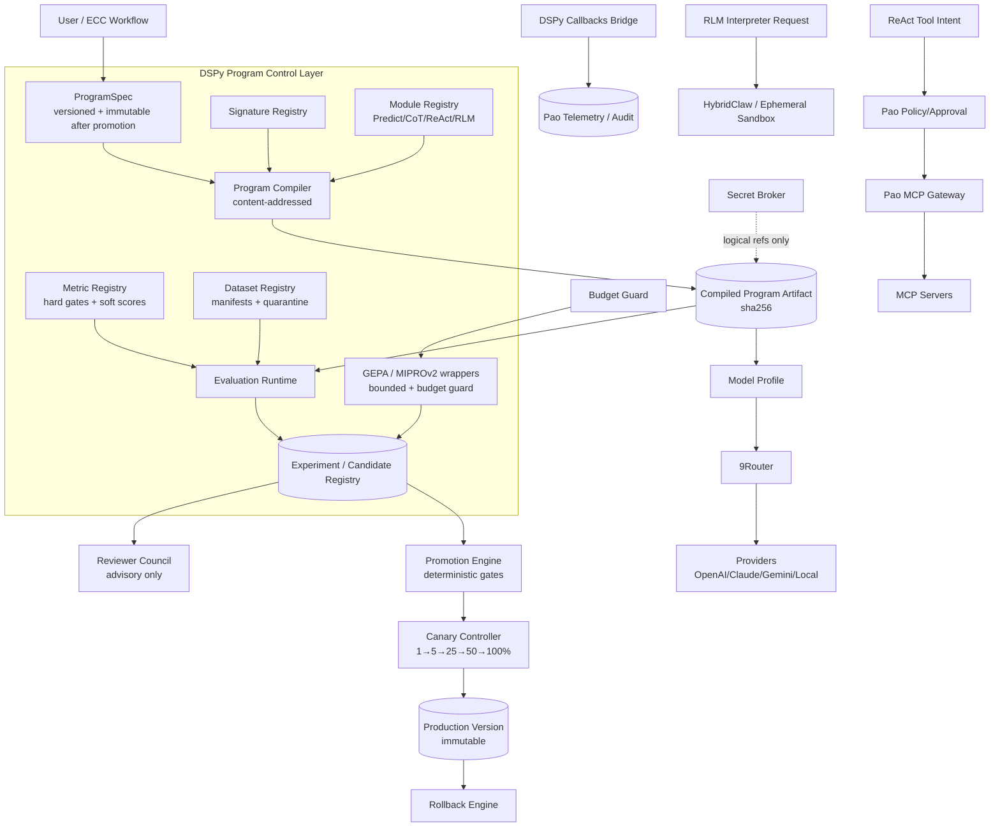
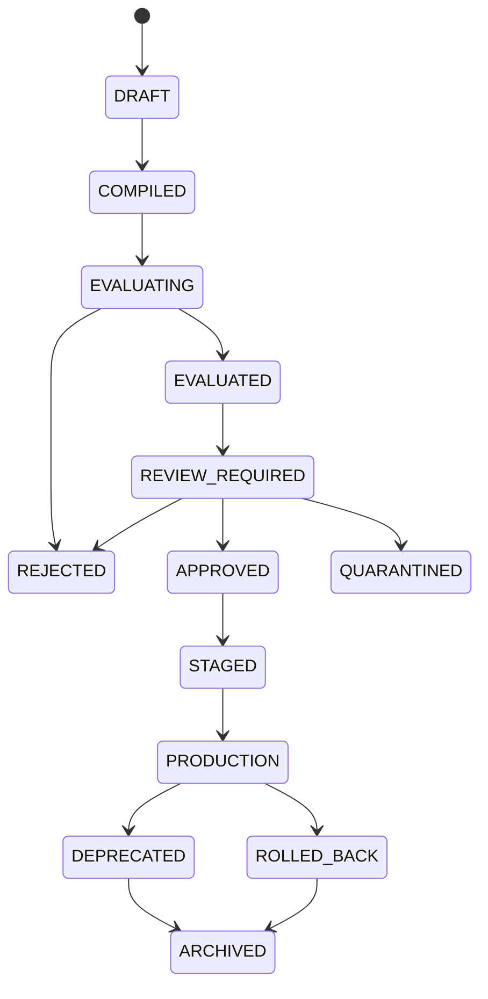

# Phase 20.68 — Pao-hubPro × Stanford DSPy

## Declarative Self-Improving AI Program Compiler, Automatic Prompt & Agent Optimization, Metric-Driven Evaluation, Cross-Model Execution & Policy-Governed Learning Runtime

> **Document type:** Production-Oriented Implementation Blueprint
> **Phase:** 20.68
> **Codename:** DSPy Self-Improving Program Runtime
> **Project:** Pao-hubPro
> **Source of Truth:** `20.68.md` (research snapshot 2026-09-15), processed under `PAO-HUBPRO_MASTER_PHASE_REQUEST.md`
> **⚠ Filename/content note:** Source filename is terse (`20.68.md`) but the document header unambiguously identifies **Phase 20.68 — Pao-hubPro × Stanford DSPy**; the in-document name is authoritative per master request §1. No phase-number collision detected.
> **Primary upstream:** Stanford NLP — `stanfordnlp/dspy` · https://dspy.ai/ · **Upstream license:** MIT
> **Verified production baseline:** DSPy 3.3.1 (released 2026-08-21) · **Experimental baseline:** DSPy 3.4.0b1 (released 2026-09-11, pre-release only)

> **Primary objective:** เพิ่มชั้น Declarative AI Program + Optimization + Evaluation ให้ Pao-hubPro นิยามงาน AI เป็นโปรแกรมที่ทดสอบ วัดผล ปรับ Prompt/Examples/Agent Strategy เปรียบเทียบหลายโมเดล และ promote เวอร์ชันที่ดีกว่าได้ ภายใต้ Policy / Approval / Sandbox / Audit ของ Pao-hubPro

> **กฎสูงสุดของ Phase นี้:**
> **Optimization must never bypass policy. · Evaluation must precede promotion. · Model output is evidence, not authority. · Self-improvement is allowed only inside bounded search spaces.**

> **Final rule:** *Pao-hubPro must become capable of improving AI programs without surrendering control to them.* DSPy ช่วยค้นหา Prompt/demonstrations/program strategy ที่ดีกว่าอย่างมีหลักฐาน แต่ Pao-hubPro ยังควบคุม: Identity · Policy · Secrets · Tools · Budget · Approval · Deployment · Audit · Rollback

---

## 1. Executive Summary

Phase 20.68 เพิ่ม **DSPy Self-Improving AI Program Runtime** เข้าไปใน Pao-hubPro เพื่อเปลี่ยนวิธีพัฒนา AI workflow จากการเขียน Prompt แบบ manual และแก้ข้อความทีละเวอร์ชัน ไปเป็นการสร้าง **Declarative AI Program** ที่มี: input/output contract · task signature · module graph · model adapter · tool boundary · dataset · metric · evaluator · optimizer · candidate registry · benchmark result · promotion gate · rollback path · security policy · approval policy · audit trail

แนวคิดหลักของ DSPy: `Program, do not hard-code prompts. Measure, do not guess. Optimize, do not manually tweak forever.` — ใน Pao-hubPro ขยายเป็น:

```text
Declare → Compile → Evaluate → Optimize → Compare → Review → Approve
→ Promote → Monitor → Rollback / Learn
```

**DSPy จะไม่เป็น security boundary และไม่เป็น deployment authority โดยตรง:**

```text
DSPy decides how to improve an AI program.
Pao-hubPro decides whether that program is allowed to run or be promoted.
```

---

## 2. Problem Statement

ก่อน Phase 20.68 Pao-hubPro มี MCP hub/capability gateway, safe local file/command tools, browser/API/remote worker integrations, multi-model routing, Prompt Master, AI Reviewer Council, persistent context/memory, codebase intelligence, knowledge/documentation engines, secure runtime/sandbox/approval boundary, engineering harness/cross-agent skills — แต่ยังขาดชั้นที่ตอบคำถามต่อไปนี้อย่างเป็นระบบ:

1. Prompt หรือ AI program เวอร์ชันไหนดีกว่ากันจริง? จะวัด "ดีกว่า" ด้วย metric อะไร?
2. จะให้ระบบ optimize Prompt โดยไม่พึ่งการเดาของมนุษย์ได้อย่างไร? จะ optimize few-shot demonstrations อย่างไร?
3. จะเลือก Predict, ChainOfThought, ReAct หรือ RLM เมื่อใด? จะรู้ได้อย่างไรว่า agent strategy ใหม่ดีกว่าเดิม?
4. จะ benchmark GPT, Claude, Gemini, Local AI ด้วย task เดียวกันอย่างยุติธรรมได้อย่างไร?
5. จะ optimize คุณภาพพร้อมต้นทุน latency/token ได้อย่างไร?
6. จะป้องกัน optimizer สร้างพฤติกรรมที่ละเมิด security policy ได้อย่างไร?
7. จะ promote program ใหม่ขึ้น production แบบมี evidence และ rollback ได้อย่างไร?
8. จะเก็บ dataset/metric/experiment/candidate ให้ reproducible ได้อย่างไร?
9. จะทำให้ Prompt Master, Reviewer Council, 9Router และ MCP ใช้ optimization loop เดียวกันได้อย่างไร?

Phase 20.68 เพิ่ม **AI Program Compiler + Evaluation + Optimization Control Plane** เพื่อเติมช่องว่างนี้

---

## 3. Goals

1. Pin DSPy 3.3.1 เป็น production baseline; แยก 3.4.0b1 เป็น experimental lab เท่านั้น
2. `ProgramSpec` versioned schema — prompt ไม่ใช่ object หลักอีกต่อไป
3. Signature Registry + Module Registry (Predict/CoT/ReAct/RLM/custom) พร้อม risk metadata
4. Program Compiler ที่ content-addressed ทุก artifact
5. Metric Registry — hard gates แยกจาก soft weighted metrics
6. Dataset Registry พร้อม provenance/classification/anti-poisoning pipeline
7. Evaluation Runtime + Experiment Registry ที่ reproducible เท่าที่ provider behavior อนุญาต
8. GEPA + MIPROv2 optimization wrappers แบบ bounded (budget/candidates/wall-time/allowed-fields)
9. Cross-Model Benchmark Engine ที่ยุติธรรม (pinned model profile)
10. Promotion Engine เชิง deterministic + Canary Controller + Rollback Engine
11. Integration: Prompt Master (candidate factory), Reviewer Council (advisory), 9Router (routing), MCP Gateway (tool access), ECC (optimization hook), HybridClaw (execution boundary)
12. Observability + audit + trace_id ข้ามทุก layer; context-efficiency metrics
13. Pilots: Adobe Stock metadata + read-only code review + model routing benchmark
14. Dashboard + CLI ครบพื้นฐาน

---

## 4. Non-Goals

Phase นี้ **ไม่** มีเป้าหมาย:

- แทน MCP / 9Router / HybridClaw / ECC / Reviewer Council
- ทำ autonomous deployment แบบไร้ approval
- ให้ optimizer เขียน production policy
- ให้ RLM รัน arbitrary host code
- ใช้ DSPy เป็น secret manager
- fine-tune foundation model โดย default
- แทน generation engines (ComfyUI/H3) — DSPy optimize text/control programs รอบ ๆ เท่านั้น

---

## 5. Why This Phase Exists

See Sections 1–2. Strategic position: DSPy ต้องอยู่ **เหนือ model/provider แต่ใต้ policy authority**:

```text
┌───────────────────────────────────────────────────────────────┐
│                         Pao-hubPro                            │
├───────────────────────────────────────────────────────────────┤
│ UI / Dashboard / API / CLI                                   │
│ Intent / Task / Workflow Orchestrator                         │
│ Phase 20.67 ECC Engineering Harness                          │
│ ★ Phase 20.68 DSPy Program + Optimization Runtime            │
│   Signature / Program / Metric / Eval / Optimizer / Registry │
│ Prompt Master / Reviewer Council / Model Benchmark           │
│ 9Router / Provider Gateway / Budget Engine                   │
│ OpenAI / Claude / Gemini / Hermes / Local AI / Other Models  │
│ Policy / Approval / Secret Broker / Audit                    │
│ HybridClaw Secure Runtime / Sandbox / MCP / Tool Broker      │
└───────────────────────────────────────────────────────────────┘
```

### Core design principles (10 ข้อ)

1. **Declarative first** — นิยาม task contract ก่อน prompt text
2. **Metric first** — ไม่มี optimizer ถ้ายังไม่มี metric
3. **Dataset before promotion** — candidate ใหม่ต้องผ่าน eval set
4. **Bounded optimization** — optimizer เปลี่ยนได้เฉพาะสิ่งที่ policy อนุญาต
5. **Provider-neutral contracts** — task definition ไม่ผูก provider
6. **Evidence-based promotion** — promote จาก score + regression + review
7. **Deterministic governance** — policy decision ห้ามมาจาก LLM อย่างเดียว
8. **Reproducibility** — เก็บ dataset hash, model config, seed, version
9. **Fail closed** — unknown tool / unknown optimizer / unknown model profile = block
10. **Rollback always available** — production program ต้องย้อนกลับเวอร์ชันก่อนหน้าได้

### Learning boundary

Self-improving **ไม่ได้** หมายถึง `AI sees error → AI rewrites itself → deploys itself` — แต่หมายถึง:

```text
Evidence → Bounded candidate generation → Controlled evaluation → Review → Approved promotion
```

---

## 6. Relationship to Pao-hubPro

### Layer mapping (Pao-hubPro core layers)

| Layer | Role in this phase |
|---|---|
| 02 AI / Agent Layer | DSPy programs เป็น AI capability ที่ถูกวัดและควบคุม |
| 03 Intent & Context Layer | Context Resolver (Graft/Litho/Memory); context-efficiency metrics |
| 04 Orchestration Layer | ECC workflow เรียก DSPy optimization เป็น skill |
| 05 MCP Gateway | ReAct tool access ผ่าน gateway เท่านั้น |
| 06 Capability Registry | Signature/Module/Metric/Dataset registries |
| 07 Policy Engine | Program/optimization/tool/network policies; fail closed |
| 08 Approval Engine | Promotion gates; G/Y/R program tiers |
| 09–11 Execution Runtimes | HybridClaw sandbox; RLM interpreter isolation |
| 12 State / Session Layer | Candidate lifecycle; experiment records; canary state |
| 13 Memory / Knowledge Layer | Context sources (read-only ต่อ optimizer) |
| 14 Secrets & Credential Layer | Secret Broker; logical secret refs only |
| 15 Event / Queue Layer | Evaluation/optimization workers; event bus |
| 16 Observability Layer | DSPy callback bridge; 17 event types |
| 17 Audit Layer | Audit records with provenance |
| 19 Web Dashboard | 10 pages + program detail |
| 20 External Provider Layer | Model providers via 9Router |

### Key relationships (separation of concerns)

| Component | Question it answers | DSPy's relation |
|---|---|---|
| Prompt Master (20.48) | "Prompt ไหนเริ่มดี?" | **Prompt Candidate Factory** — generate/normalize/import seed candidates |
| DSPy runtime | "Program ไหนพิสูจน์แล้วว่าดีกว่า?" | Optimization engine (evaluate/optimize/compare) |
| Reviewer Council | "Candidate นี้ควรรับไหม?" | Advisory metric input; **cannot bypass hard gates** |
| 9Router (20.51) | "Model/provider ไหนรันตอนนี้?" | DSPy: what program works best; 9Router: which model executes now; pinned profile for fair benchmark |
| ECC (20.67) | "งานนี้ใช้ workflow ไหน?" | ECC เรียก DSPy optimization เป็น skill ได้ แต่ **ห้าม promote เอง** |
| HybridClaw (20.66) | "รันที่ไหนอย่างปลอดภัย?" | Execution containment layer |

```text
DSPy = intelligence optimization layer
HybridClaw = execution containment layer
Pao-hubPro = authority/control plane
```

---

## 7. Upstream / External Project

### Upstream identity

DSPy = **Declarative Self-improving Python**; upstream อธิบายตัวเองว่าเป็น framework สำหรับ **programming—not prompting—language models**.

Capabilities ที่ phase นี้อ้างอิง: declarative signatures; modular LM programs (`Predict`, `ChainOfThought`, `ReAct`, `RLM`); adapters; evaluation utilities; metrics; optimizers (**GEPA**, **MIPROv2**); model configuration; usage tracking; callbacks/observability hooks; Python interpreter support; MCP-related compatibility improvements in 3.3.1.

### Version policy (mandatory)

```yaml
dspy:
  production:
    version: "3.3.1"           # stable ณ snapshot; interpreter hardening; optimizer throughput;
    allow_prerelease: false    # adapter fixes; MCP compat; GEPA improvements; lower API risk
    auto_upgrade: false
  lab:
    version: "3.4.0b1"         # pre-release only: LM engine transition, dspy.lm15 types,
    allow_prerelease: true     # async ReActV2, local CPython interpreter, GEPA Flex proposals
    isolated: true
  upgrade_policy:
    require_benchmark: true
    require_regression_suite: true
    require_security_review: true
    require_manual_promotion: true
```

**ห้าม** ใช้ beta เป็น dependency ของ production runtime โดยอัตโนมัติ; ห้าม install จาก main.

### Separation of concerns

| Part | Owner | Notes |
|---|---|---|
| A. Upstream project | `stanfordnlp/dspy` (MIT) | Framework + optimizers + interpreter |
| B. Pao-hubPro adapter | `packages/dspy-runtime` (`ProgramRuntimeAdapter`) | Only surface for DSPy internals |
| C. Pao-hubPro policy wrapper | Program/tool/optimization/promotion policies + budget guard | All governance lives here |
| D. Pao-hubPro extensions | Registries, compiler, evaluation/experiment/candidate registries, promotion/canary/rollback, benchmark engine, dashboard, CLI | Built in this phase |

### Upstream risk assessment

- **License:** MIT (verified at drafting).
- **API stability:** pre-2.0-era rapid evolution; 3.3→3.4 has LM engine transition — **saved-artifact compatibility is not guaranteed across versions** (Section 33).
- **Dependency risk:** medium — a real Python runtime dependency (isolated environment); interpreter features need container isolation.
- **Security surface:** optimizer output = untrusted candidate; interpreter = high-risk execution; datasets = untrusted input — all governed (Sections 20–21).
- **Upgrade strategy:** 10-step flow (Section 33); 3.4 migration watch list (Section 42).
- **Deprecation handling:** upstream deprecates CodeAct / ProgramOfThought ไปทาง RLM — **Do not create new CodeAct/ProgramOfThought programs; prefer RLM for new interpreter-assisted workflows**; legacy imports mark deprecated + migration test.
- **Vendor lock-in:** none — everything behind `ProgramRuntimeAdapter`; optimization backend swappable.

---

## 8. Current-State Assumptions

- **[Needs Verification] Inspect first:** find existing API framework, database layer, queue/worker system, telemetry, auth, policy engine, approval engine, secret broker, model router/9Router, MCP gateway, Reviewer Council, ECC integration, HybridClaw/runtime adapters — reuse conventions; if an expected subsystem does not exist, create an interface/adapter + safe minimal implementation instead of fabricating deep integration.
- **[Assumption] Python runtime:** DSPy is Python — an isolated Python environment (venv/uv/container) is required even if the core repo is TypeScript; the adapter package owns the boundary.
- **[Assumption] Provider determinism:** evaluation is "reproducible as far as provider behavior permits" — locks capture everything controllable (dataset hash, model profile, seed, config).
- **[Assumption] Existing pilots data:** Adobe Stock historical approved examples usable **only** with rights and no sensitive data.

---

## 9. Target Architecture

Core components:

1. **Runtime layer:** isolated Python env; DSPy 3.3.1 pin; `DSPyRuntimeAdapter`; callbacks bridge; health/version endpoint.
2. **Program layer:** ProgramSpec schema; Signature Registry; Module Registry; Program Compiler (content-addressed artifacts).
3. **Measurement layer:** Metric Registry (hard + soft); Dataset Registry (6 classes + anti-poisoning); Evaluation Runtime; Experiment Registry; latency/cost accounting.
4. **Optimization layer:** GEPA wrapper; MIPROv2 wrapper; budget-aware optimizer controller; allowed/forbidden mutation fields.
5. **Governance layer:** program/tool/network policies; Promotion Engine; Canary Controller; Rollback Engine; audit.
6. **Integration layer:** Prompt Master bridge; Reviewer Council bridge; 9Router bridge; MCP/tool bridge; ECC hook; HybridClaw boundary.
7. **Interface layer:** Program Registry API; 10 dashboard pages; 12 CLI commands.
8. **Lab layer (isolated):** DSPy 3.4.0b1 experimental environment; Flex/code-proposal → candidate patches only.

---

## 10. Architecture Diagram



---

## 11. Core Components

| # | Component | Purpose |
|---|---|---|
| 1 | DSPy Runtime Adapter | Only surface for DSPy internals (`compile/run/evaluate/optimize/export`); version lock + health endpoint. |
| 2 | ProgramSpec | Versioned declarative program definition; immutable after promotion. |
| 3 | Signature Registry | Versioned I/O contracts with output schemas; breaking change = major bump. |
| 4 | Module Registry | Predict/CoT/ReAct/RLM/custom with risk metadata. |
| 5 | Program Compiler | Spec → validated, policy-checked, content-addressed artifact. |
| 6 | Metric Registry | Versioned hard gates + weighted soft metrics + composite. |
| 7 | Dataset Registry | Manifests (golden/regression/adversarial/synthetic/quarantined) with hashes/provenance. |
| 8 | Evaluation Runtime | Deterministic-as-possible eval pipeline with locks + accounting. |
| 9 | Experiment + Candidate Registries | Persisted records + lifecycle states. |
| 10 | GEPA / MIPROv2 wrappers | Bounded optimization with budget guard + audit. |
| 11 | Cross-Model Benchmark Engine | Same program × multiple model profiles. |
| 12 | Promotion Engine + Canary + Rollback | Deterministic gates → staged rollout → instant security rollback. |
| 13 | Integration bridges | Prompt Master, Reviewer Council, 9Router, MCP/tools, ECC, HybridClaw. |
| 14 | Dashboard + CLI | 10 pages; 12 commands. |

---

## 12. Component Responsibilities

### 12.1 DSPy Program Model — ProgramSpec

แต่ละ AI capability ถูกแทนด้วย `ProgramSpec`:

```yaml
program_id: code_review_v1
name: Secure Code Review
owner: pao-hubpro
status: candidate
signature:
  inputs: [code, diff, repository_context]
  outputs: [findings, severity, confidence]
module:
  type: chain_of_thought
model_profile: reviewer-default
metric_suite: code-review-quality-v1
dataset: code-review-golden-v3
optimizer:
  type: gepa
  enabled: true
policy_profile: engineering-readonly
promotion_policy: guarded
```

```text
ProgramSpec
   ├── Signature          ├── Dataset
   ├── Module Graph       ├── Metric Suite
   ├── Adapter            ├── Optimizer
   ├── Model Profile      ├── Policy
   ├── Tool Profile       └── Version
```

### 12.2 Signature Registry

```python
class CodeReview(dspy.Signature):
    """Review code changes and return structured engineering findings."""
    diff: str = dspy.InputField()
    context: str = dspy.InputField()
    summary: str = dspy.OutputField()
    findings: list[str] = dspy.OutputField()
    severity: str = dspy.OutputField()
```

Registry metadata:

```json
{
  "signature_id": "engineering.code_review.v1",
  "domain": "engineering",
  "risk": "medium",
  "allowed_modules": ["predict", "chain_of_thought", "react"],
  "tool_scope": ["git.read", "repo.search"],
  "output_schema": "schemas/code-review.schema.json"
}
```

กฎ: Signature ต้อง versioned; breaking output change ⇒ bump major; production signature ห้าม mutate in-place; **optimizer ห้ามเปลี่ยน I/O contract โดยพลการ** (ต้องสร้าง major version ใหม่ผ่าน review).

### 12.3 Module Registry

| Module | Typical Use | Default Risk |
|---|---|---:|
| Predict | extraction/classification | Low |
| ChainOfThought | reasoning/synthesis | Low-Medium |
| ReAct | tool-using agent | Medium-High |
| RLM | interpreter/code-assisted reasoning | High |
| Custom Program | multi-stage pipelines | Depends |

**Pao-hubPro policy ต้องตัดสินสิทธิ์ — ไม่ให้ module type เป็นตัวกำหนดสิทธิ์เอง.**

### 12.4 Program Compiler

```text
ProgramSpec → Schema Validation → Policy Validation → Dependency Resolution
→ DSPy Signature Build → Module Build → Adapter Binding → Model Profile Binding
→ Tool Binding → Metric Binding → Compiled Program Artifact
```

Output artifact (content-addressed):

```json
{
  "program_id": "stock.metadata.v3",
  "program_hash": "sha256:...",
  "dspy_version": "3.3.1",
  "compiled_at": "...",
  "signature_hash": "...",
  "dataset_hash": "...",
  "metric_hash": "...",
  "model_profile": "metadata-cheap",
  "policy_profile": "stock-readonly"
}
```

**Artifact versioning:** ทุก compiled program content-addressed:

```text
sha256(ProgramSpec + Signature + MetricConfig + AdapterConfig + RuntimeVersion)
```

ป้องกัน "ชื่อ version เดิมแต่เนื้อหาเปลี่ยน". **SemVer policy:** PATCH = prompt/example/internal improvement (same contract); MINOR = new optional field/module stage (backward compatible); MAJOR = signature/output/tool contract breaking change. **Production artifact immutable.**

**API boundary rule:** Pao-hubPro code ภายนอก package นี้ห้าม import DSPy internals (`from dspy.some_internal_module import ...` ❌) — ใช้ `from pao_dspy_runtime import ProgramRuntime` (✓) เพื่อลด blast radius จาก upstream API changes.

### 12.5 Metric Registry + composite + hard gates

Metric files: `exact_match, semantic_quality, structured_validity, code_review_recall, test_pass_rate, citation_correctness, tool_success_rate, safety_violation_rate, latency, token_cost, composite`. ทุก metric มี: id; version; owner; implementation hash; direction (maximize/minimize); weight; minimum threshold; failure behavior.

Composite score ตัวอย่าง:

```text
quality_score =
    correctness       * 0.35
  + completeness      * 0.20
  + structure         * 0.10
  + reviewer_score    * 0.15
  + tool_success      * 0.10
  + policy_compliance * 0.10
```

ต้นทุน**ไม่ควร**ผสมใน composite โดยไม่มี normalization — ใช้ multi-objective view: `maximize quality; minimize cost; minimize latency; minimize policy violations`. **Promotion ต้องไม่ยอมให้ candidate ที่ quality ดีขึ้นแต่ safety ลดลงผ่าน**.

**Hard gates (fail = reject ทันที) vs soft metrics:**

```text
Hard gates:                          Soft metrics:
security_violation == 0              quality >= 0.90
schema_valid == true                 latency <= target
required_tests_pass == true          cost <= budget
secret_leak == false                 review_score >= baseline
forbidden_tool_call == false
```

**Metric gaming defense:** ห้าม optimize metric เดียวใน critical workflow — ใช้ `primary metric + holdout metric + hard safety gates + adversarial suite + reviewer council + human spot checks` และมี **hidden holdout set** สำหรับ workflow สำคัญ. Context-efficiency metrics (ต่อยอด 20.67): `quality_per_1k_tokens, useful_context_ratio, retrieval_hit_rate, context_overflow_rate` — เป้าหมาย: "ไม่ใช่แค่ตอบดีขึ้น แต่ตอบดีขึ้นด้วย context ที่เหมาะสมกว่า".

### 12.6 Dataset Registry

โครงสร้าง: `manifests/ · golden/ · regression/ · adversarial/ · synthetic/ · quarantined/`

```yaml
dataset_id: engineering-code-review-v3
version: 3
classification: internal
owner: pao-hubpro
purpose: evaluation
entries: 240
hash: sha256:...
contains_sensitive_data: false
allowed_optimizers: [gepa, miprov2]
split: {train: 120, dev: 60, test: 60}
```

กฎสำคัญ: test set ต้อง**ไม่ถูก optimizer ใช้เป็น training feedback โดยตรง**; dataset hash บันทึกใน experiment; candidate compare ใช้ test set เดียวกัน; synthetic data ต้อง label; imported data ต้องมี provenance; golden set ขั้นต่ำ: `minimum_examples: 30, critical_program_minimum: 100, require_edge_cases: true, require_failure_cases: true`.

**Dataset poisoning defense pipeline:**

```text
Import → Source validation → Content classification → Injection scan
→ Secret scan → Deduplication → Provenance record → Quarantine / Approve
```

**ห้ามให้ downloaded dataset เข้า optimizer ทันที.**

### 12.7 Evaluation Runtime + Experiment Registry

```text
Candidate Program → Dataset Snapshot → Model Profile Lock → Seed/Config Lock
→ Parallel Evaluation → Metric Suite → Reviewer Council (optional)
→ Cost + Latency Accounting → Policy Regression Scan → Evaluation Report
```

Experiment record (ทุก optimization/evaluation run):

```json
{
  "experiment_id": "exp_01...",
  "program_id": "engineering.code_review",
  "baseline_version": "1.2.0",
  "candidate_version": "1.3.0-rc2",
  "dspy_version": "3.3.1",
  "optimizer": "gepa",
  "dataset_hash": "sha256:...",
  "metric_suite": "code-review-v4",
  "model_profile": "reviewer-default",
  "started_at": "...", "ended_at": "...",
  "quality_delta": 0.047, "cost_delta": -0.12, "latency_delta": 0.08,
  "hard_gate_failures": 0,
  "decision": "eligible_for_review"
}
```

**Cost tracking ทุก experiment:** prompt tokens; completion tokens; tool cost; provider cost; optimization cost; total experiment cost; cost per successful example. **Budget guard:** `experiment_usd: 10, daily_usd: 25, monthly_usd: 200, on_exceed: stop` — **optimizer ห้ามเพิ่ม budget เอง** (budget-aware wrapper: request → budget check → candidate allocation → DSPy optimizer → live cost accounting → stop on limit).

**Latency metrics:** p50/p95/p99; time-to-first-token; tool round-trip; total program duration — candidate ที่ quality เพิ่มเล็กน้อยแต่ latency เพิ่มรุนแรงต้องถูก flag.

### 12.8 Optimization wrappers (GEPA + MIPROv2 + Flex lab)

**GEPA profile** (งานที่มี feedback/metric ชัดเจน — instruction refinement, reflective prompt evolution, candidate frontier exploration):

```yaml
optimizer:
  type: gepa
  objective: quality_score
  max_candidates: 20
  max_budget_usd: 5.00
  max_wall_time_minutes: 30
  parallelism: 4
  promotion_threshold: 0.03
```

**Policy boundary:** `GEPA may propose. GEPA may evaluate. GEPA may not self-promote to production.`

**MIPROv2** (instructions + demonstrations + multi-stage settings):

```yaml
miprov2:
  allowed: true
  auto_demo_selection: true
  max_demo_count: 8
  forbid_sensitive_training_examples: true
  require_dataset_classification: true
```

กฎข้อมูล: ห้ามใช้ secrets เป็น demonstration; ห้าม credential-containing logs; ห้าม private source ข้าม workspace โดยไม่มีสิทธิ์; PII-sensitive examples ผ่าน data policy; benchmark dataset ต้องมี provenance.

**Optimization mutation boundary (สำคัญที่สุดของ governance):**

```yaml
optimization:
  optimizer: gepa
  allowed_fields: [instruction, demonstrations]
  forbidden_fields: [policy, tool_allowlist, risk_level, secret_refs, promotion_thresholds]
  budget_usd: 5
  max_candidates: 24
```

**Flex / program-structure optimization lab (3.4 beta เท่านั้น):** แยก runtime จาก production; Flex ห้าม: แก้ policy engine, แก้ approval rules, แก้ secret broker, เข้าถึง host filesystem โดยตรง, modify production registry, deploy program ด้วยตัวเอง — **proposal ต้องถูก export เป็น candidate patch เท่านั้น**.

### 12.9 Promotion Engine + Canary + Rollback

**Candidate lifecycle:**

```text
DRAFT → COMPILED → EVALUATING → EVALUATED → REVIEW_REQUIRED → APPROVED
→ STAGED → PRODUCTION → DEPRECATED → ARCHIVED
Failure states: REJECTED · QUARANTINED · ROLLED_BACK
```

**Promotion policy (deterministic):**

```yaml
promotion_policy:
  min_quality_delta: 0.02
  max_cost_regression: 0.10
  max_latency_regression: 0.15
  require_zero_hard_gate_failures: true
  require_reviewer_council: true
  require_human_approval: true
  require_canary: true
```

**ห้ามใช้คำตอบ LLM เช่น "looks good" เป็น deployment authority.**

**Regression suite ก่อน promotion (8 ประเภท):** functional; quality; schema; tool; security; latency; cost; provider compatibility.

**Canary promotion (ไม่ promote 100% ทันที):**

```text
Approved Candidate → 1% canary → 5% → 25% → 50% → 100%
```

แต่ละ step ตรวจ: hard gate incidents; error rate; user corrections; latency; cost; tool failure; rollback signal.

**Automatic rollback triggers:**

```yaml
rollback:
  error_rate_delta: 0.05
  quality_drop: 0.03
  policy_violation_count: 1
  secret_incident_count: 1
  schema_failure_rate: 0.02
```

**Security violation สามารถ rollback ทันที.**

**Program provenance (ทุก production version ตอบได้):** มาจาก baseline ไหน? optimizer อะไร? dataset version ไหน? metric suite ไหน? model ไหน? ใคร approve? ผ่าน test อะไร? deploy เมื่อไร? rollback ไปไหนได้?

### 12.10 Integration bridges

- **Prompt Master (20.48) — ไม่ถูกแทนที่:** role ใหม่ = generate candidate instruction · normalize prompt assets · import legacy prompts · create seed variants → DSPy evaluates/optimizes/compares/promotes best bounded candidate. Legacy migration: `legacy prompt.md → Prompt Master parser → Signature inference → Human review → ProgramSpec → DSPy baseline evaluation`.
- **Reviewer Council:** flow `Candidate → Automated DSPy Metrics → Council (GPT/Claude/Local/specialist reviewers) → Council Aggregator → Policy Gate → Human Approval / Promotion`. Council duties: qualitative review; detect metric blind spots; review candidate behavior; explain regression; compare baseline/candidate outputs. **Council ไม่มีสิทธิ์ bypass hard gate.**
- **9Router (20.51):** `DSPy Program → Model Profile Request → 9Router (quota/availability/cost/latency/policy/fallback) → Provider`. Benchmark ยุติธรรมใช้ `pinned_model_profile` (`routing_mode: pinned, fallback: false`); production ใช้ smart routing ได้. **Model profile abstraction:** ห้าม ProgramSpec hard-code API key — `Program → Model Profile → 9Router → Secret Broker → Provider Adapter`.
- **MCP Gateway:** DSPy ReAct ใช้ tool ผ่าน **Pao MCP Gateway เท่านั้น** (`DSPy → Tool Intent → Policy Engine → Approval Engine → MCP Gateway → MCP Server`); ห้าม `DSPy → arbitrary MCP server directly` ใน production profile.
- **ECC (20.67):** `ECC Workflow → Plan/Implement/Review/Verify → DSPy Program Runtime → Evaluate/Optimize/Compare → ECC Verification → Governed Learning Promotion` — ECC เรียก optimization เป็น skill ได้ **แต่ห้าม promote เอง**.
- **Litho/Graft:** context ผ่าน Context Resolver (Graft = dependency/blast radius; Litho = architecture/docs; Memory; Repository Retrieval); **optimizer ห้าม mutate knowledge source โดยอัตโนมัติ**.
- **HybridClaw (20.66):** side-effect execution ผ่าน secure runtime เสมอ.
- **Adobe Stock / Video Factory / ComfyUI/Runpod:** DSPy optimize text/control programs รอบ generation engines — flow `DSPy Program → Generation Plan → Pao Generation Orchestrator → Runpod/ComfyUI → Artifact → DSPy Evaluator`; **DSPy ไม่มีสิทธิ์ launch expensive GPU workload ถ้า budget gate ไม่ผ่าน**; ไม่ใช้ image acceptance จาก model ตัวเดียว (Prompt Candidate → Image Generation → Visual Reviewer → Commercial Metric → Policy Metric → Similarity Risk → Human Sample Review).

---

## 13. Data Flow

**Optimization loop (end-to-end):**

```text
ProgramSpec (declare) → Compile (content-addressed artifact)
→ Evaluate (dataset snapshot + locks + metric suite)
→ Optimize (GEPA/MIPROv2, bounded, budget-guarded)
→ Compare (same test set, multi-objective)
→ Review (council advisory) → Approve (deterministic gates + human)
→ Promote (canary 1→100%) → Monitor (telemetry + health score)
→ Rollback (on triggers) / Learn (curated dataset → new version)
```

**Continuous improvement loop:**

```text
Production Program → Telemetry → Failure/Correction Samples
→ Curated Dataset Candidate → Human/Data Policy Review → New Dataset Version
→ DSPy Optimize → Evaluation → Reviewer Council → Promotion Gate → New Production Version
```

**ห้ามเอา production logs เข้า optimizer โดยตรงโดยไม่ curate.**

**Tool-call flow (ReAct):** `ReAct proposes action → Policy classification → Approval token → Tool Broker executes`.

---

## 14. Control Flow

Decisions: **`ALLOW | DENY | REQUIRE_APPROVAL | QUARANTINE`** — fail closed สำหรับ unknown tool/module/optimizer/model profile/policy state.

### Risk classification — G/Y/R → R0–R4 mapping

| Tier | R-level | Program examples | Default |
|---|---|---|---|
| **Green** | R0/R1 | metadata formatter; stock keyword generator (Green/Yellow) | auto-evaluate; auto-stage allowed |
| **Yellow** | R2/R3 | code reviewer; code patch generator | human approval before production |
| **Red** | R4 | shell/tool agent; credential/account action | human approval before execution **+** promotion |
| **Unknown** | beyond R4 | unknown tool/module/optimizer/profile | DENY (fail closed) |

**Program policy example:**

```yaml
program_policy:
  program: code.review.readonly
  risk: medium
  tools:
    allow: [repo.search, git.read_file]
    deny: [shell.exec, git.write_file, git.push]
  network:
    profile: provider-only
  approval:
    run: false
    promote: true
```

**ReAct governance:**

```yaml
react_policy:
  max_steps: 12
  max_tool_calls: 20
  max_cost_usd: 1.00
  max_wall_time_seconds: 180
  allowed_tools: [repo.search, git.read_file]
  deny_side_effect_tools: true
```

**MCP tool descriptor (policy-compiled เท่านั้น):**

```json
{
  "tool_id": "git.read_file",
  "source": "mcp",
  "risk": "low",
  "side_effect": false,
  "input_schema": {},
  "output_schema": {},
  "workspace_scope": "current_repo",
  "requires_approval": false
}
```

---

## 15. Agent / Worker Model

**Terminology (strictly separated):**

| Term | Definition in this phase |
|---|---|
| Agent | ReAct-style DSPy agent module governed by react_policy (Section 14). |
| Worker | Evaluation/optimization/benchmark workers (parallelism-limited). |
| Task | A program run/eval/optimization request bound to workspace + trace_id. |
| Run | One execution with recorded cost/latency/tokens; part of an experiment. |
| Session | Control-plane session binding actor + workspace. |
| Tool | Policy-compiled MCP descriptor (Section 14). |
| Program | Versioned AI capability (ProgramSpec → artifact). |
| Candidate | A program version under evaluation/promotion lifecycle. |
| Artifact | Content-addressed compiled program. |

**Workers own all evaluation/optimization execution**; parallelism bounded by optimizer profile (`parallelism: 4`); optimization runs are budget-guarded; experiment bound to `workspace_id, project_id, repository_id, program_id` — **ห้าม reuse examples ข้าม workspace ถ้าไม่มี explicit policy**.

---

## 16. Session / State Model

### 16.1 Candidate lifecycle



### 16.2 Canary state

```text
approved → canary_1% → canary_5% → canary_25% → canary_50% → full_100%
each step: gates check → advance | rollback signal
```

### 16.3 Experiment reproducibility

Experiment locks: dataset hash; model profile; provider/model identifier; config/seed where applicable; DSPy version; program version/hash; metric suite version. **Deterministic reproduction bundle export** (no secrets):

```text
experiment.json · program.yaml · dataset-manifest.yaml · metrics.yaml
model-profile.yaml · runtime-lock.txt · result-summary.json
trace-index.json · checksums.txt
```

### 16.4 Cache policy

Cache key includes: program version; signature version; adapter version; model profile; provider model identifier; input hash; policy profile. **Sensitive output cache ต้อง encrypt หรือ disable ตาม policy.**

### 16.5 Import/export

Program package format:

```text
.pao-program/
├── program.yaml    ├── signature.py     ├── metrics.yaml
├── dataset-manifest.yaml   ├── tests/   └── checksums.txt
```

**Imported package = untrusted until validated.**

---

## 17. MCP Integration

- **Tool access via Pao MCP Gateway only** (Section 12.10); production ReAct never connects to arbitrary MCP servers directly.
- **Normalized tool descriptors** (tool_id, source, risk, side_effect, schemas, workspace_scope, requires_approval) — DSPy tool wrapper receives only policy-compiled descriptors.
- **ReAct trajectory guard:** max_steps/max_tool_calls/max_cost/max_wall_time/allowed_tools/deny_side_effect_tools (Section 14); side-effect path requires approval token through Tool Broker.
- **Tool provenance/audit:** every tool call recorded in trace + audit with descriptor version.

---

## 18. Capability Registry

- **Signature Registry** — versioned contracts + output schemas + allowed modules + tool scope (Section 12.2).
- **Module Registry** — risk-classified module types (Section 12.3); no new CodeAct/ProgramOfThought (deprecated upstream → RLM).
- **Metric Registry** — versioned metrics with implementation hash (Section 12.5).
- **Dataset Registry** — manifests with hash/provenance/classification/allowed-optimizers (Section 12.6).
- **Model profiles** — logical profiles resolved through 9Router + Secret Broker; never raw keys.

---

## 19. Policy Model

**Metric policy example:**

```yaml
metrics:
  hard: [schema_valid, no_policy_violation, no_secret_leak]
  soft:
    - {id: correctness, weight: 0.4}
    - {id: completeness, weight: 0.2}
    - {id: reviewer_score, weight: 0.2}
    - {id: cost_efficiency, weight: 0.1}
    - {id: latency_efficiency, weight: 0.1}
```

**Multi-objective frontier dimensions:** quality · cost · latency · reliability · safety · context usage — UI แสดง Pareto-style candidate frontier ได้.

**Optimization policy:** allowed_fields (`instruction, demonstrations`) vs forbidden_fields (`policy, tool_allowlist, risk_level, secret_refs, promotion_thresholds`) — enforced in the wrapper, not by convention.

**Fail closed:** unknown optimizer type/tool/model profile/policy state = block; policy engine unavailable = no optimization/evaluation (Section 22).

---

## 20. Security Model

### Threat model (15 classes)

```text
1. optimizer-generated prompt injection      9. secret leakage into eval logs
2. metric gaming                            10. auto-promotion of unsafe candidate
3. benchmark overfitting                    11. reward hacking
4. poisoned dataset                         12. hidden regression masked by aggregate score
5. malicious demonstration                  13. supply-chain risk from optimizer/runtime deps
6. tool escalation through ReAct            14. cross-workspace data contamination
7. interpreter escape                       15. untrusted imported ProgramSpec
8. model-provider data leakage
```

### Controls

| Control | Implementation |
|---|---|
| Prompt injection defense | Boundary distinction preserved at every layer: `System Policy · Program Instruction · Trusted Configuration · Untrusted User Data · Untrusted Retrieved Data · Untrusted Tool Output`; **optimizer ห้ามย้าย untrusted content ไปเป็น trusted instruction โดยอัตโนมัติ** |
| Secret isolation | ห้าม raw secrets ใน: signature examples; dataset; optimizer feedback; trace; prompt candidate; cached completion; reviewer context — ใช้ logical refs (`secret://openai/default`, `secret://anthropic/reviewer`) resolved นอก LLM context โดย Secret Broker |
| RLM/interpreter isolation | Defense in depth: `DSPy interpreter isolation + Pao container isolation + filesystem allowlist + network policy + resource limits + secret isolation + audit`; ห้าม interpreter เข้าถึง host home, SSH keys, cloud credentials, Docker socket, K8s credentials, secret storage, unrestricted network, production DB — **LLM/runtime sandbox ไม่ใช่ trust boundary เพียงชั้นเดียว** |
| Network policy | Profiles: `none · provider-only · docs-allowlist · mcp-only · restricted-egress`; RLM lab default `none`; DSPy runtime ไม่มี unrestricted outbound โดย default |
| Workspace isolation | Experiment bound to workspace/project/repo/program; no cross-workspace example reuse without explicit policy |
| Dataset poisoning | Import pipeline (Section 12.6); quarantine before optimizer access |
| Metric gaming | Primary + holdout + hard gates + adversarial suite + council + human spot checks; hidden holdout sets |
| Supply chain | Pinned versions; isolated envs; upgrade flow with security review (Section 33) |
| Audit | Provenance on every promotion; sensitive payloads stored as hash/metadata per policy (Section 25) |

### Adversarial evaluation suites (11)

```text
prompt injection · tool misuse · malformed structured outputs · hallucinated citations
secret exfiltration attempts · extremely long context · conflicting instructions
empty inputs · provider errors · rate limits · tool timeouts
```

---

## 21. Approval Model

### R0–R4 / G-Y-R summary

See Section 14. Promotion requires: zero hard-gate failures + min quality delta + regression ceilings + Reviewer Council + **human approval** + canary — deterministic, never LLM-decided.

### Approval UX (promotion card)

```text
Program · Baseline → Candidate · Quality +4.7% · Cost -12% · Latency +8%
Hard Gates: PASS · Security Suite: PASS · Reviewer Council: 3/3 approve
Canary Required: Yes

[Approve Stage] [Reject] [Request More Evaluation] [View Diff] [View Trace]
```

**Comparison view:** side-by-side `Baseline Output | Candidate Output`, `Baseline Score | Candidate Score`, `Baseline Cost | Candidate Cost`, `Baseline Trace | Candidate Trace` — highlight differences + reviewer comments. **ไม่ควรแสดงแค่ "best prompt" โดยไม่มี evidence.**

Agents/optimizers/council ไม่มีสิทธิ์ self-approve — approval state ตรวจ server-side ใน Promotion Engine.

---

## 22. Failure Handling

### Failure classes (12 — ห้าม map ทุกอย่างเป็น generic "AI failed")

```text
provider_error · timeout · rate_limit · schema_error · tool_error · policy_block
approval_timeout · budget_exceeded · optimizer_error · interpreter_error
dataset_error · metric_error
```

| Failure | Detection | Containment | Retry | Audit |
|---|---|---|---|---|
| provider_error / timeout / rate_limit | Provider response | Task marked; experiment continues or pauses | **Bounded retry** (transient only) | event |
| schema_error | Structured validity metric | Module-level repair policy | Bounded, per module | event |
| policy_block | Policy engine | Immediate stop | **No retry** | denial event |
| secret denial | Secret broker | Immediate stop | **No retry** | event |
| budget_exceeded | Budget guard | Stop optimization | **No retry** until budget raised by owner | cost event |
| optimizer_error | Wrapper | Candidate marked failed | Bounded | event |
| interpreter_error | Sandbox | Request terminated; sandbox flushed | No auto-retry | event |
| dataset_error / metric_error | Registry validation | Run fails before provider spend | Fix input | event |
| approval_timeout | Approval TTL | Candidate stays REVIEW_REQUIRED/staged, not promoted | Re-request | event |
| Hard gate failure in canary | Live monitors | **Rollback** (auto for security violations) | n/a | rollback event |

**Retry policy:** เฉพาะ transient (`429/timeout/transient provider errors → bounded retry`); schema failure → module-level repair; policy block / secret denial / budget exceeded → no retry. **ห้าม unlimited retry.**

---

## 23. Recovery Model

- **Rollback always available:** production programs rollback ไป version ก่อนหน้าได้โดยไม่สูญ provenance (principle 10); rollback path tested (pilot exit criteria include "manual rollback tested").
- **Canary recovery:** rollback signal at any canary step returns to previous production version; canary state recorded.
- **Experiment recovery:** experiment records persisted with locks; interrupted eval resumes or re-runs with same hashes.
- **Artifact recovery:** content-addressed artifacts immutable — a version always re-loadable from its hash; saved-DSPy-program compatibility metadata (runtime version, serialization format, adapter version, model interface generation, migration status) guards cross-version loading.
- **Budget recovery:** budget exhaustion stops cleanly; owner raises limit; no partial promotion.
- **Alerting (8 triggers):** optimizer budget exhausted; candidate fails security gate; quality regression detected; provider behavior changes materially; production program error spikes; promotion pending approval; rollback triggered; DSPy dependency has breaking release.

---

## 24. Observability

### DSPy callback bridge → Pao telemetry (17 event types)

```text
program.compile.started · program.compile.completed
program.run.started · program.run.completed · program.run.failed
eval.started · eval.example.completed · eval.completed
optimizer.started · optimizer.candidate.created · optimizer.completed
promotion.requested · promotion.approved · promotion.rejected
rollback.started · rollback.completed
```

### Trace model

แต่ละ run มี trace id เดียวข้าม layers: `User Request (trace_id) → ECC → DSPy → 9Router → Provider → MCP/Tools → Reviewer Council`. **ห้าม log raw secret.**

### Audit requirements

Audit record: actor; program version; model profile; dataset version; optimizer version; policy decision; approval decision; tool calls; cost; output hash; promotion decision; rollback decision. **Sensitive payload เก็บ hash/metadata แทน raw content ตาม policy.**

### Program health score

```text
health = quality stability + schema reliability + tool reliability
       + policy compliance + cost stability + latency stability
```

แสดง trend ไม่ใช้ score จุดเดียว.

### KPIs

```text
% programs with golden eval sets · % production changes backed by benchmark evidence
median quality delta after optimization · cost per successful task · p95 latency
schema failure rate · tool failure rate · policy violation rate
rollback rate · human correction rate · optimizer ROI
```

---

## 25. Audit

WHO/WHAT/WHEN/WHERE/WHY/RESULT per Section 24 audit requirements. Audit integrates with the Pao audit store (hash-chained per 20.66 if present); audit events cover compile/run/eval/optimize/promote/reject/rollback + policy decisions + approval decisions. Secrets never in audit — logical refs and hashes only.

---

## 26. Data Model

Tables (existing DB/migration conventions):

```text
ai_programs · ai_program_versions · ai_signatures · ai_program_artifacts
ai_datasets · ai_dataset_versions · ai_metrics · ai_metric_versions
ai_experiments · ai_experiment_runs · ai_candidates · ai_benchmarks
ai_benchmark_results · ai_promotions · ai_rollbacks · ai_program_traces
ai_program_costs
```

Key columns:

```text
ai_programs:        id · workspace_id · program_key · name · risk_level · production_version_id · created_at
ai_program_versions: id · program_id · semver · status · spec_json · artifact_hash · dspy_version · created_at
ai_experiments:     id · program_id · baseline_version_id · optimizer_type · dataset_version_id · metric_suite_id · config_json · status · started_at · completed_at
```

---

## 27. API / Event Contracts

### 27.1 Program Registry API

```text
GET    /api/programs
POST   /api/programs
GET    /api/programs/:id
POST   /api/programs/:id/compile
POST   /api/programs/:id/run
POST   /api/programs/:id/evaluate
POST   /api/programs/:id/optimize
POST   /api/programs/:id/promote
POST   /api/programs/:id/rollback
GET    /api/programs/:id/experiments
GET    /api/programs/:id/versions
```

### 27.2 Common envelope

```json
{
  "request_id": "req_...",
  "trace_id": "trace_...",
  "actor_id": "agt_... | usr_...",
  "operation": "program.evaluate",
  "input": {"program_id": "...", "version": "..."},
  "status": "ALLOWED | DENIED | REQUIRE_APPROVAL | COMPLETED | FAILED",
  "result": {"experiment_id": "exp_..."},
  "error": {"code": "BUDGET_EXCEEDED", "message": "redacted user-facing message"},
  "created_at": "2026-09-17T00:00:00Z"
}
```

### 27.3 Internal interfaces

```python
class ProgramRuntimeAdapter(Protocol):
    def compile(self, spec): ...
    def run(self, artifact, inputs): ...
    def evaluate(self, artifact, dataset, metrics): ...
    def optimize(self, artifact, optimizer_spec): ...
    def export(self, artifact): ...
```

Event contracts: 17 telemetry event types (Section 24) + audit records (Section 25).

---

## 28. Configuration

```text
.pao/
├── dspy.yaml          # version policy (Section 7)
├── programs.yaml      # ProgramSpec declarations
├── optimizers.yaml    # GEPA/MIPROv2 bounds + allowed/forbidden fields
├── metrics.yaml       # hard/soft definitions
├── datasets.yaml      # manifests + classification
├── benchmark.yaml     # pinned routing config
└── promotion.yaml     # promotion policy + canary + rollback triggers
```

Validate at startup; fail fast; no silent fallback on security-relevant settings.

---

## 29. Feature Flags

| Flag | Default | Gates |
|---|---|---|
| `dspy_runtime` | `true` | Runtime + Predict/CoT programs (low-risk path) |
| `dspy_gepa` | `true` | GEPA optimizer (bounded) |
| `dspy_miprov2` | `true` | MIPROv2 optimizer (bounded) |
| `dspy_react` | `true` | ReAct module (policy-guarded) |
| `dspy_rlm` | `false` | RLM/interpreter (high risk — enable per-host with sandbox) |
| `dspy_flex_lab` | `false` | 3.4 beta Flex/code-proposal lab (isolated env only) |
| `dspy_auto_promotion` | `false` | **ห้ามเปิด** — promotion always gated |

Safe defaults: no side-effect tools; no raw secrets; no unrestricted interpreter; no prerelease runtime; no automatic production promotion; no cross-workspace dataset reuse; no unlimited optimizer budget.

---

## 30. Repository / Module Structure

**Adapt to existing repo conventions; Codex inspects first.**

```text
packages/
└── dspy-runtime/
    ├── src/
    │   ├── adapter/       ├── compiler/       ├── signatures/
    │   ├── programs/      ├── modules/        ├── adapters/
    │   ├── models/        ├── tools/          ├── metrics/
    │   ├── datasets/      ├── evaluation/     ├── optimizers/
    │   │                      ├── gepa/
    │   │                      └── miprov2/
    │   ├── experiments/   ├── registry/       ├── promotion/
    │   ├── rollback/      ├── policy/         ├── telemetry/
    │   └── security/
    ├── tests/
    └── README.md

services/
├── program-service/       ├── evaluation-service/
├── optimization-worker/   └── benchmark-worker/

apps/web/
├── programs/  ├── experiments/  ├── datasets/  ├── metrics/
├── benchmarks/└── promotions/

configs/dspy/{production.yaml, lab.yaml, optimizers.yaml, promotion.yaml}
schemas/{program-spec, dataset-manifest, metric, experiment, candidate}.schema.json

Suggested key files:
packages/dspy-runtime/src/{runtime.py, compiler.py, program_spec.py,
  signature_registry.py, module_registry.py, model_adapter.py,
  tool_adapter.py, telemetry.py}
```

---

## 31. Dashboard Integration

เพิ่มหน้า:

```text
AI Programs · Experiments · Datasets · Metrics · Optimizers · Benchmarks
Candidates · Promotion Queue · DSPy Runtime · Model Matrix
```

**Program detail page:** Overview · Signature · Program Graph · Current Production Version · Candidate Versions · Metric History · Cost History · Latency History · Evaluation Reports · Reviewer Council · Policy · Audit · Rollback.

**Optimization dashboard:** baseline score; best candidate score; quality delta; cost delta; latency delta; candidate frontier (Pareto); rejected candidates; hard gate failures; optimizer budget consumed.

**Comparison view + promotion card + alerting** per Sections 21/23.

---

## 32. Dependencies

### Required

- **Pao-hubPro control plane:** policy engine, approval engine, secret broker, audit, config/flags, persistence + migrations, telemetry, queue/workers.
- **Isolated Python runtime** for DSPy 3.3.1 (adapter package owns it).
- **9Router-equivalent model routing abstraction** (or minimal adapter) — model profiles resolve through it.

### Recommended

- **Phase 20.66 HybridClaw** — sandbox for RLM/interpreter + side-effect execution boundary.
- **Phase 20.67 ECC** — engineering harness hook (ECC calls optimization; cannot promote).
- **Phase 20.48 Prompt Master** — candidate factory + legacy prompt import.
- **AI Reviewer Council** — advisory candidate review.
- **Phase 20.50 FinOps** — budget guards (experiment/daily/monthly).
- **Graft (20.62) / Litho (20.65)** — code-review pilot context.
- **Local model gateway** (Ollama/vLLM) — local profiles + offline evaluation.

### Optional

- **Phase 20.63 API registry** — external API capabilities for programs.
- **Adobe Stock / AI Video Factory / Runpod/ComfyUI orchestration** — pilot domains.
- **DSPy 3.4 lab** — isolated experimental env only.

**Do not assume other phases are implemented.** Standalone path: runtime adapter + ProgramSpec + compiler + metric/dataset registries + evaluation + budget guard work with a single model profile and local datasets; optimization/promotion/canary/benchmark activate as integrations appear; pilots degrade to their non-integrated equivalents (e.g., code review without Graft context).

---

## 33. Compatibility

- **Saved DSPy program compatibility:** ห้าม assume saved artifact load ได้ตลอด — เก็บ runtime version, serialization format, adapter version, model interface generation, migration status. **3.3 → 3.4 LM type transition ต้องมี migration test.**
- **Upgrade strategy (10-step):**

```text
New DSPy Release → Dependency Lab → API Compatibility Tests → Program Load Tests
→ Golden Evaluations → Tool/MCP Tests → Interpreter Security Tests
→ Cost/Latency Benchmark → Manual Review → Canary Runtime Upgrade
```

- **3.4 migration watch (ตรวจก่อนย้าย production ไป 3.4 stable):** LM engine API; `dspy.lm15` request/response migration; custom backend compatibility; saved programs; streaming; tool calling; multi-answer behavior; ReActV2; interpreter behavior; GEPA/Flex changes. **ห้าม migrate เพราะเลข version ใหม่อย่างเดียว.**
- **Provider compatibility tests (ต่อ model profile):** basic completion; structured output; tool calling; streaming (ถ้าใช้); retry/error mapping; usage accounting; context limit handling; rate limit behavior.
- **Local model support:** `DSPy → Pao Model Adapter → Local Gateway → Ollama/vLLM/compatible endpoint` — benchmark แยกเพราะ tool/structured-output behavior ต่างจาก remote.
- **Offline evaluation:** local-only benchmark สำหรับ sensitive programs (`network: disabled, model_profile: local-reviewer, export_raw_outputs: false`).
- **Backward compatibility:** existing Pao-hubPro workflows preserved; additive integration; no DSPy internals outside the adapter package (Section 12.4).

---

## 34. Migration

- Additive migrations only (17 tables, Section 26); no destructive changes; down/rollback guidance when supported.
- Legacy prompt migration path via Prompt Master (Section 12.10) — human review before ProgramSpec; legacy CodeAct/ProgramOfThought imports marked deprecated with migration test (no new ones).
- Migrations land with `dspy_rlm=false`, `dspy_flex_lab=false`, `dspy_auto_promotion=false`; enabling is operator-gated.
- Production artifact immutability: existing production versions never rewritten; new versions take over via promotion.

---

## 35. Rollback

- **Program rollback:** `POST /api/programs/:id/rollback` + `pao program rollback <id>` — returns to previous production version, provenance preserved.
- **Automatic rollback triggers** (Section 12.9): error rate delta, quality drop, policy violation count, secret incident count, schema failure rate — **security violation = instant rollback**.
- **Flag rollback:** `dspy_runtime=false` disables the subsystem cleanly; existing production programs halt to Pao-native behavior; audit/evidence preserved.
- **Runtime rollback:** canary runtime upgrade reverts to pinned 3.3.1; lab env isolated from production always.
- **Config rollback:** revert typed config; promotion thresholds never loosened by optimizer (enforced by forbidden_fields).

---

## 36. Testing Strategy

### 36.1 Unit tests

Signature compiler; config validation; metric registry; dataset loader; promotion rules; budget guard.

### 36.2 Integration tests

DSPy runtime; 9Router; MCP gateway; Reviewer Council; HybridClaw sandbox; telemetry.

### 36.3 Security tests (required)

```text
prompt injection in dataset · tool escalation · secret leakage
malicious ProgramSpec · path traversal · unrestricted interpreter network
unsafe import · forged approval token · replayed promotion request
cross-workspace dataset access
```

### 36.4 Agent-specific tests

Tool-selection test (ReAct resolves only allowed, policy-compiled descriptors); hallucinated-tool test (unknown tool → fail closed); approval-bypass test (side-effect tool unreachable without approval token; candidate cannot self-promote); context-isolation test (untrusted dataset/tool content cannot become trusted instruction; optimizer cannot mutate forbidden fields).

### 36.5 E2E test

```text
register → compile → evaluate → optimize → review → stage → canary → promote → rollback
```

### 36.6 Performance tests

Measure: compile overhead; eval throughput; optimizer throughput; parallel worker scaling; registry lookup latency; trace overhead.

### 36.7 Pilot validation

- **Pilot 1 — Adobe Stock metadata** (`stock.title.generate`, `stock.keyword.generate`, `stock.metadata.validate`): reasons — structured output, easy metrics, low side-effect, human review possible, clear quality/cost measurement. Success criteria: `+5% metadata composite score; no policy regression; <=10% cost increase or lower; schema pass 100%`. Metrics: `title_relevance, keyword_relevance, keyword_diversity, keyword_order_quality, spam_keyword_rate, policy_risk, semantic_coverage, commercial_searchability` — เป้าหมายคือ optimize **คุณภาพ metadata และ review consistency ไม่ใช่ optimize เพื่อหลบ moderation/policy**.
- **Pilot 2 — Read-only code review** (`code.review.readonly`): context จาก Graft/Litho (`Diff + dependency context + architecture context → DSPy Code Review Program → Findings → Golden/Reviewer evaluation`); **ไม่มี write tool ใน pilot**.
- **Pilot 3 — Model routing benchmark:** Program เดียว × หลาย provider profile → วัด quality/latency/cost/failure rate/structured-output adherence → ส่งผลกลับให้ 9Router เป็น routing evidence.

Initial programs for pilot (low-risk first): `stock.title.generate, stock.keyword.generate, stock.metadata.validate, repo.summary, code.review.readonly` — **อย่าเริ่ม pilot ด้วย shell-writing agent**.

---

## 37. Acceptance Criteria

- [ ] DSPy 3.3.1 pinned ใน production environment; 3.4.0b1 แยก experimental environment
- [ ] มี `ProgramSpec` schema, Signature Registry, Module Registry, Program Compiler (content-addressed)
- [ ] มี Metric Registry (hard gates แยกจาก soft), Dataset Registry, Evaluation Runtime, Experiment Registry, Candidate Registry
- [ ] มี GEPA wrapper + MIPROv2 wrapper + budget guard (optimizer หยุดเมื่อ budget หมด — test-proven)
- [ ] มี cross-model benchmark (pinned routing mode)
- [ ] เชื่อม 9Router, Reviewer Council, Pao MCP Gateway
- [ ] ReAct ไม่สามารถ bypass tool policy (denied tool test-proven)
- [ ] RLM/interpreter อยู่ใน sandbox (network/fs denial test-proven)
- [ ] Raw secrets ไม่เข้า DSPy context/log/dataset (test-proven)
- [ ] Optimizer เปลี่ยน policy/forbidden fields ไม่ได้ (mutation-boundary test-proven)
- [ ] Hard security gates มี priority สูงกว่า quality score (hard-gate-fail blocks promotion — test-proven)
- [ ] Production promotion ผ่าน deterministic policy; candidate cannot self-promote (test-proven)
- [ ] มี canary deployment + rollback (manual rollback tested)
- [ ] มี audit trail + trace_id ข้าม layers
- [ ] มี dashboard / CLI ขั้นพื้นฐาน
- [ ] มี Adobe Stock metadata pilot + read-only code review pilot ผ่าน success criteria
- [ ] Regression tests ผ่าน; security tests ผ่าน; documentation พร้อม

---

## 38. Implementation Roadmap

**Implementation order (18 stages):**

```text
1  Runtime adapter + version lock       10  Reviewer Council bridge
2  ProgramSpec + Signature Registry     11  9Router bridge
3  Program Compiler                     12  MCP tool bridge
4  Metric Registry                      13  Promotion / rollback
5  Dataset Registry                     14  Dashboard / CLI
6  Evaluation Runtime                   15  Adobe Stock pilot
7  Experiment Registry                  16  Read-only code review pilot
8  GEPA integration                     17  Production canary
9  MIPROv2 integration                  18  3.4/Flex experimental lab
```

| Milestone | Deliverables | Exit criteria |
|---|---|---|
| A — Runtime Foundation | isolated Python env; DSPy 3.3.1 pin; runtime adapter; health endpoint; version report; callbacks bridge; basic Predict program | `pao dspy status → healthy`; one compiled program runs end-to-end; no DSPy internal import outside adapter package |
| B — Evaluation Foundation | dataset registry; metric registry; evaluation runner; experiment storage; result comparison | baseline vs candidate report reproducible; hard/soft metrics separated; cost + latency captured |
| C — Optimization Foundation | GEPA wrapper; MIPROv2 wrapper; budget guard; candidate registry; optimizer audit | optimizer creates bounded candidates; forbidden config cannot be mutated; budget limit stops execution |
| D — Governance | policy check; approval flow; promotion engine; rollback; audit | candidate cannot self-promote; hard gate failure blocks promotion; rollback works |
| E — Cross-System Integration | Prompt Master adapter; Reviewer Council adapter; 9Router adapter; MCP adapter; ECC hook; HybridClaw execution boundary | bridges functional per existing components |
| F — Production Pilot | stock.metadata first | production canary works; quality improvement measurable; zero policy violations; manual rollback tested; full audit available |

---

## 39. Risks

| Risk | Impact | Mitigation |
|---|---|---|
| Optimizer-generated prompt injection | Policy bypass | Allowed/forbidden fields; injection scan; boundary preservation; adversarial suite |
| Metric gaming / reward hacking | False improvement | Multi-metric + holdout + hard gates + council + human spot checks |
| Benchmark overfitting | Wrong promotion | Hidden holdout sets; same test set for compare; golden sets |
| Poisoned dataset / malicious demonstration | Behavior corruption | Import pipeline + quarantine + provenance (Section 12.6) |
| Tool escalation via ReAct | Side-effect damage | Trajectory guard + policy-compiled descriptors + approval tokens |
| Interpreter escape | Host compromise | Defense-in-depth isolation (Section 20); RLM flag default off |
| Secret leakage into eval artifacts | Credential compromise | Secret Broker refs only; detectors; hash-only sensitive payloads |
| Auto-promotion of unsafe candidate | Production incident | Deterministic gates + human approval + canary; auto_promotion flag off |
| Hidden regression behind aggregate score | Silent quality loss | Multi-objective frontier; per-metric regression ceilings; trend-based health score |
| Upstream breaking changes (3.4 transition) | Runtime breakage | Version pin; upgrade flow; saved-artifact compatibility metadata; migration tests |
| Cross-workspace contamination | Data leakage | Workspace binding; explicit policy for reuse |
| Cost explosion (optimizer/eval) | Budget damage | Budget guards (experiment/daily/monthly); stop-on-limit; cost per successful example tracking |
| Supply-chain risk from dependencies | Compromise | Pinned versions; isolated envs; security review in upgrade flow |
| Untrusted imported ProgramSpec | Arbitrary behavior | Import = untrusted until validated; checksums; policy validation |

---

## 40. Security Checklist

- [ ] DSPy behind `ProgramRuntimeAdapter` only; no internal imports elsewhere (boundary test-proven)
- [ ] Optimizer cannot mutate policy/tool_allowlist/risk_level/secret_refs/promotion_thresholds (test-proven)
- [ ] Candidates cannot self-promote; promotion deterministic + human approval + canary
- [ ] Hard security gates override quality scores (test-proven)
- [ ] Raw secrets never in prompts/datasets/demos/traces/logs/cached completions/reviewer context (test-proven)
- [ ] ReAct tools resolve only via Pao MCP Gateway with policy-compiled descriptors; denied tools fail closed
- [ ] RLM/interpreter in sandbox: no host home/SSH/cloud creds/Docker socket/K8s creds/secret storage/unrestricted network/production DB
- [ ] Dataset import passes injection + secret scan + quarantine before optimizer access
- [ ] Untrusted/retrusted boundary preserved (optimizer cannot promote untrusted content to instruction)
- [ ] Cross-workspace dataset reuse requires explicit policy (test-proven)
- [ ] Sensitive output cache encrypted or disabled per policy
- [ ] Imported program packages untrusted until validated; no secrets in exports
- [ ] Audit: provenance for every promotion/rollback; sensitive payloads hash-only
- [ ] Production + experimental environments separated; prerelease never a production dependency

---

## 41. Production Readiness Checklist

### CLI commands

```text
pao dspy status                      pao program list
pao program validate <id>            pao program compile <id>
pao program run <id>                 pao program eval <id>
pao program optimize <id>            pao program diff <a> <b>
pao program promote <id> --version <v>
pao program rollback <id>            pao dataset validate <id>
pao metric test <id>                 pao benchmark run <suite>
```

### Quality gates before declaring completion

1. Run formatting/linting/type checks (repository's existing tooling); 2. new unit tests; 3. relevant integration tests; 4. smoke test for a simple Predict program; 5. smoke evaluation baseline vs candidate; 6. verify optimizer cannot mutate forbidden policy fields; 7. verify ReAct cannot call a denied tool; 8. verify promotion fails when a hard gate fails; 9. verify rollback works; 10. concise implementation summary (changed files, migrations, commands run, tests passed/failed, known limitations, next steps).

**Do not claim a check passed unless it ran.** Documentation deliverables: `docs/dspy/{ARCHITECTURE, SECURITY, EVALUATION, OPTIMIZATION, DATASETS, MODEL_ROUTING, MCP, UPGRADE_POLICY, ROLLBACK}.md` + README addition (Section 30 statement below) + explicit rule documented:

> "DSPy can optimize AI program behavior inside a bounded search space, but Pao-hubPro retains all security, approval, budget, deployment and rollback authority."

### README addition

```text
Self-Improving AI Programs

Pao-hubPro integrates DSPy behind a governed program runtime.
AI workflows are declared as versioned program specifications with explicit
input/output contracts, datasets, metrics, model profiles and tool policies.

Optimization can propose improved instructions, examples or bounded program
variants, but it cannot modify security policy, access secrets, bypass tool
approval or deploy directly to production.

Every promoted version must pass evaluation, regression and policy gates and
must remain auditable and rollback-capable.
```

---

## 42. Future Extensions

- **DSPy 3.4 lab track** (isolated): shared/native LM engine transition; `dspy.lm15` types; async ReActV2; local CPython interpreter; GEPA custom Flex code proposals — all producing candidate patches only, never self-deploying.
- Multi-objective Pareto explorer UI depth; automatic routing-evidence feedback loops to 9Router (policy-gated).
- Additional pilot domains: AI Video Factory programs (`video.storyboard, video.scene_prompt, video.shot_consistency, video.caption, video.metadata, video.quality_review`); stock concept/similarity/compliance/submission-readiness programs.
- Cross-workspace federated benchmarks (explicit policy).
- Additional optimization backends behind the same adapter (GEPA/MIPROv2 successors).

---

## 43. Definition of Done

```text
A Pao-hubPro AI workflow can be expressed as a versioned declarative program,
evaluated against a versioned dataset and metric suite,
optimized within an explicit bounded search space,
benchmarked across model profiles,
reviewed by deterministic gates and optional multi-model reviewers,
promoted only through policy-controlled approval,
observed in production,
and rolled back without losing provenance.
```

Final architecture:

```text
                         Pao-hubPro
                             │
                   Intent / Task / Workflow
                             │
                    ECC Engineering Harness
                             │
          ┌──────────────────▼──────────────────┐
          │      DSPy Program Control Layer     │
          │ Signature Registry · Program Compiler · Module Registry
          │ Dataset Registry · Metric Registry · Evaluation Runtime
          │ GEPA / MIPROv2 · Experiment / Candidate Registry
          └──────────────────┬──────────────────┘
           Prompt Master · Reviewer Council · Benchmark
                             │
                         9Router
                             │
                    Policy / Approval Gate
                             │
                   HybridClaw Secure Runtime
                             │
                    MCP / Tools / Sandbox
                             │
                    Evidence + Telemetry
                             │
                  Promotion / Rollback
```

---

## 44. Codex One-Shot Implementation Prompt

Copy the following prompt into Codex from the root of the Pao-hubPro repository.

```text
You are implementing Phase 20.68 of Pao-hubPro:

"Pao-hubPro × Stanford DSPy — Declarative Self-Improving AI Program Compiler,
Automatic Prompt & Agent Optimization, Metric-Driven Evaluation,
Cross-Model Execution & Policy-Governed Learning Runtime"

GOAL
Build a production-oriented DSPy integration layer that lets Pao-hubPro define,
compile, evaluate, optimize, benchmark, version, review, promote and roll back
AI programs without allowing DSPy, an optimizer, an LLM or an agent to bypass
Pao-hubPro security, approval, secret, budget or execution policies.

EXECUTION MODE
Work as: Inspect -> Plan -> Implement -> Validate -> Test -> Review -> Report.
Never delete the repository, reset git history, force push, expose secrets, deploy
to production, run destructive DB migrations, or change important infrastructure
without explicit user approval.

UPSTREAM
- Repository: https://github.com/stanfordnlp/dspy
- Production baseline: dspy==3.3.1
- Experimental lab only: dspy==3.4.0b1
- Do NOT install from main in production.
- Do NOT make the beta runtime a production dependency.

NON-NEGOTIABLE ARCHITECTURE RULES
1. Do not replace Pao-hubPro with DSPy.
2. Do not expose DSPy internals throughout the Pao-hubPro codebase.
3. Put DSPy behind a stable ProgramRuntimeAdapter.
4. LLM output is never a security decision.
5. Optimizers may propose candidates; they may not self-promote to production.
6. Optimizers may not mutate policy, tool allowlists, risk level, secrets,
   approval requirements, budget ceilings or promotion thresholds.
7. All side-effecting tools must continue to pass through the Pao policy,
   approval and secure execution path.
8. DSPy ReAct tools must resolve through the Pao MCP/Tool Gateway.
9. RLM/PythonInterpreter execution must run in an isolated sandbox and must not
   receive host filesystem, Docker socket or raw secret access.
10. Raw secrets must never enter prompts, datasets, demonstrations, traces,
    normal logs, optimizer feedback or reviewer context.
11. Unknown tools, modules, optimizer types and policy states fail closed.
12. Preserve existing Pao-hubPro workflows and add this integration incrementally.
13. All new production program versions must be immutable and rollback-capable.
14. Security hard gates always override quality scores.
15. Keep production and experimental DSPy environments separated.

FIRST: DISCOVER THE EXISTING REPOSITORY
- Inspect the current monorepo/project structure.
- Find existing API framework, database layer, queue/worker system, telemetry,
  auth, policy engine, approval engine, secret broker, model router/9Router,
  MCP gateway, Reviewer Council, ECC integration and HybridClaw/runtime adapters.
- Reuse existing conventions instead of introducing duplicate frameworks.
- Do not delete or rewrite unrelated existing functionality.
- If an expected subsystem does not exist yet, create an interface/adapter and a
  safe minimal implementation instead of fabricating deep integration.

IMPLEMENT IN INCREMENTS

A. DSPY RUNTIME ADAPTER
Create a dedicated package such as packages/dspy-runtime. Pin dspy==3.3.1 for
production. Expose a Pao-owned interface similar to: compile(spec);
run(compiled_program, inputs); evaluate(program, dataset, metrics);
optimize(program, optimizer_spec); export(program).
Do not let other packages import DSPy internal modules directly. Add a runtime
health/version endpoint and CLI status command.

B. PROGRAMSPEC
Implement a versioned ProgramSpec schema containing: program id/key; semantic
version; signature definition; module type; model profile; adapter profile;
tool profile; metric suite; dataset reference; optimizer policy; risk level;
policy profile; promotion policy. Validate ProgramSpec strictly. Production
ProgramSpecs are immutable after promotion.

C. SIGNATURE REGISTRY
Build a versioned signature registry. Support explicit input/output contracts
and output schemas. Optimizer must not change signature contracts unless a
separately reviewed new major program version is created.

D. MODULE REGISTRY
Support at minimum: Predict; ChainOfThought; ReAct; RLM; custom composed
programs. Assign risk metadata to module types. Do not create new CodeAct or
ProgramOfThought dependencies for new programs.

E. METRIC REGISTRY
Create versioned hard and soft metrics. Implement initial metrics for: schema
validity; correctness; completeness; reviewer score; tool success rate;
security/policy violations; token usage; monetary cost; latency.
Hard gates must be evaluated separately from weighted quality scores.

F. DATASET REGISTRY
Create dataset manifests with: version; hash; provenance; classification;
train/dev/test split; sensitive-data flag; allowed optimizer usage.
Do not allow the optimizer to directly train against the final hidden test set.
Imported datasets are untrusted until validated and approved.

G. EVALUATION RUNTIME
Implement deterministic/reproducible evaluation metadata as far as provider
behavior permits. Capture: DSPy version; program version/hash; dataset hash;
metric suite version; model profile; provider/model identifier where available;
configuration/seed where applicable; quality scores; cost; token usage; latency;
hard gate failures; traces/audit refs.

H. EXPERIMENT + CANDIDATE REGISTRY
Create persisted experiment and candidate records. Use lifecycle states:
DRAFT -> COMPILED -> EVALUATING -> EVALUATED -> REVIEW_REQUIRED -> APPROVED ->
STAGED -> PRODUCTION -> DEPRECATED/ARCHIVED
and failure states REJECTED/QUARANTINED/ROLLED_BACK.

I. GEPA
Add a bounded GEPA optimization wrapper. Enforce: max candidate count; dollar/
token budget; wall-clock limit; concurrency limit; allowed mutable fields;
audit events. GEPA may propose instruction/example improvements but may not
alter security or promotion configuration.

J. MIPROV2
Add an MIPROv2 wrapper for instruction/demonstration optimization. Never place
secrets or cross-workspace confidential data into demonstrations. Track
demonstration provenance.

K. PROMPT MASTER BRIDGE
Treat Prompt Master as a candidate/seed generator. Allow importing legacy
prompts, normalizing them into ProgramSpec candidates, then
evaluating/optimizing them through DSPy. Do not delete existing Prompt Master
behavior.

L. REVIEWER COUNCIL BRIDGE
Allow evaluated candidates to be reviewed by the existing AI Reviewer Council.
Reviewer scores are advisory/metric inputs and cannot override deterministic
security hard gates. Store reviewer model/profile and review result provenance.

M. 9ROUTER BRIDGE
Model selection must use existing provider/model routing abstractions. DSPy
ProgramSpecs reference logical model profiles, not raw API keys. Support a
pinned routing mode for benchmarks and normal smart routing for production.

N. MCP / TOOL BRIDGE
DSPy ReAct tool access must go through the Pao MCP/Tool Gateway. Normalize tool
descriptors with: tool id; side effect flag; risk; input/output schema;
workspace scope; approval requirement. Never connect production ReAct directly
to arbitrary MCP servers.

O. RLM / PYTHON INTERPRETER SAFETY
Route interpreter requests through the secure sandbox runtime. Default network
policy to disabled/restricted. Deny host home, SSH keys, Docker socket,
credential stores and unrestricted filesystem access. Apply CPU/memory/time/
process limits. Capture sanitized interpreter telemetry.

P. HYBRIDCLAW / SECURE RUNTIME INTEGRATION
Where existing Phase 20.66 components exist, route side-effecting execution
through them. Preserve the rule that the LLM/DSPy layer is not the security
boundary.

Q. ECC INTEGRATION
Where Phase 20.67 engineering harness hooks exist, add a DSPy evaluation /
optimization hook so ECC workflows can request bounded optimization and consume
results. ECC must not bypass promotion policy.

R. CROSS-MODEL BENCHMARK
Implement a benchmark runner capable of executing the same ProgramSpec with
multiple logical model profiles and reporting: quality; cost; latency; failure
rate; structured-output adherence; tool success; policy/safety gate status.
Do not automatically change production routing from a benchmark result without
policy-controlled promotion.

S. PROMOTION ENGINE
Implement deterministic promotion rules. At minimum support: minimum quality
delta; max cost regression; max latency regression; zero hard-gate failures;
required Reviewer Council status; required human approval; canary requirement.
Candidate programs cannot promote themselves.

T. CANARY + ROLLBACK
Implement staged rollout metadata and a rollback path. At minimum support
manual rollback and automatic rollback signals for: security violation; schema
failure spike; error rate regression; configured quality regression.

U. OBSERVABILITY
Bridge DSPy callbacks/runtime events into existing Pao telemetry. Use a trace
id across orchestration, DSPy, model routing and tools. Never log raw secrets.

V. FINOPS / BUDGET
Track optimizer and evaluation cost. Add budget guards for experiment/day/month
where the existing FinOps layer supports them. Stop optimization when the hard
budget is reached.

W. DASHBOARD
Add pages or panels, following the existing UI architecture, for: AI Programs;
Program Versions; Experiments; Datasets; Metrics; Optimizers; Benchmarks;
Candidate Comparison; Promotion Queue; Runtime Status.
Candidate comparison must show baseline vs candidate quality, cost, latency,
hard-gate status and reviewer evidence.

X. CLI
Add commands equivalent to: pao dspy status; pao program list; pao program
validate; pao program compile; pao program run; pao program eval; pao program
optimize; pao program diff; pao program promote; pao program rollback; pao
benchmark run. Use the repository's existing CLI framework if present.

Y. PILOT PROGRAMS
Implement at least two safe pilots:
1. Adobe Stock metadata program - title generation; keyword generation;
   metadata validation.
2. Read-only code review program - no write/shell tools; repository
   read/search only.
If relevant existing Pao AI Image Factory / Adobe Stock modules exist, integrate
via adapters without replacing their generation pipeline.

Z. TESTS
Add unit, integration and end-to-end tests for: ProgramSpec validation;
signature compilation; metric evaluation; dataset version/hash handling; budget
enforcement; optimizer mutation boundaries; policy hard gates; MCP tool
authorization; promotion blocking; rollback; cross-workspace isolation; secret
redaction; interpreter sandbox policy.
Add security regression fixtures for prompt injection, malicious datasets,
forbidden tool requests, secret-exfiltration attempts and forged promotion
requests.

EXPERIMENTAL 3.4 LAB
Create an optional isolated lab configuration for dspy==3.4.0b1 only if the
repository architecture can support it cleanly. Do not make it a production
dependency. Document migration risks around the LM engine transition and
dspy.lm15. Any Flex/custom-code proposal capability must produce candidate
artifacts only and must not write production policy or deploy itself.

DOCUMENTATION
Create/update: docs/dspy/ARCHITECTURE.md; docs/dspy/SECURITY.md;
docs/dspy/EVALUATION.md; docs/dspy/OPTIMIZATION.md; docs/dspy/DATASETS.md;
docs/dspy/MODEL_ROUTING.md; docs/dspy/MCP.md; docs/dspy/UPGRADE_POLICY.md;
docs/dspy/ROLLBACK.md.
Document the explicit rule: "DSPy can optimize AI program behavior inside a
bounded search space, but Pao-hubPro retains all security, approval, budget,
deployment and rollback authority."

DELIVERY REQUIREMENTS
At the end:
1. Run formatting/linting/type checks using the repository's existing tooling.
2. Run new unit tests.
3. Run relevant integration tests.
4. Run a smoke test for a simple Predict program.
5. Run a smoke evaluation baseline vs candidate.
6. Verify an optimizer cannot mutate forbidden policy fields.
7. Verify a ReAct program cannot call a denied tool.
8. Verify promotion fails when a hard gate fails.
9. Verify rollback works.
10. Print a concise implementation summary with changed files, migrations,
    commands run, tests passed/failed, known limitations and next steps.

DO NOT
- do not remove existing working features
- do not bypass existing auth/policy/approval layers
- do not commit credentials
- do not log secrets
- do not expose unrestricted shell execution
- do not give DSPy direct production deployment authority
- do not silently upgrade DSPy
- do not make prerelease 3.4.0b1 the production default
- do not use production data as optimization training data without explicit data
  policy and provenance
- do not claim a candidate is better without evaluation evidence

SUCCESS CONDITION
Phase 20.68 is successful when Pao-hubPro can represent an AI workflow as a
versioned declarative program, evaluate it with versioned datasets/metrics,
optimize bounded behavior using DSPy, compare multiple model profiles, enforce
Pao security/tool/budget policies, review candidates, promote through explicit
gates, observe the production version and roll back safely.
```
