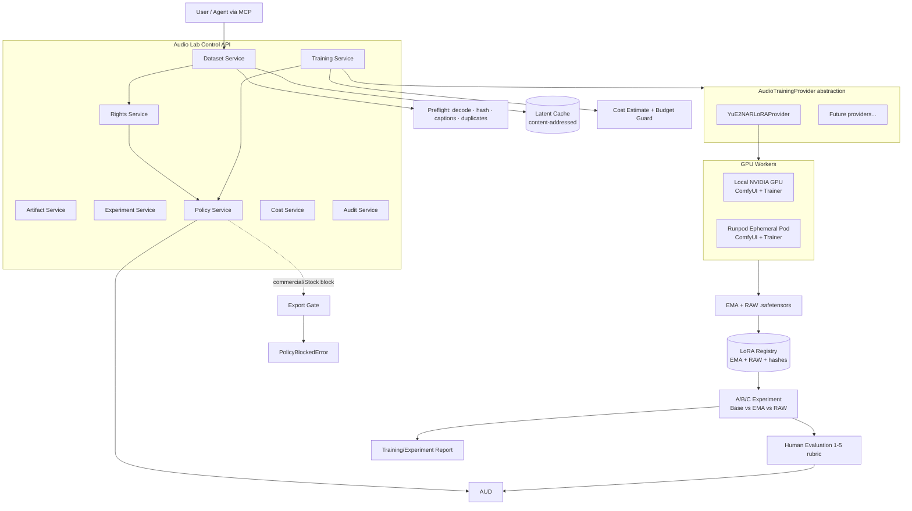

# Phase 20.69 — Pao-hubPro × ComfyUI YuE2 Trainer

## Local Music LoRA Training Lab, Style & Timbre Adaptation, Dataset-to-Audio Pipeline, GPU Training Orchestration & License-Governed Audio Runtime

> **Document type:** Production-Oriented Implementation Blueprint
> **Phase:** 20.69 (Proposed / R&D Integration)
> **Project:** Pao-hubPro
> **Source of Truth:** `20.69.md`, processed under `PAO-HUBPRO_MASTER_PHASE_REQUEST.md`
> **Primary runtime:** ComfyUI + ComfyUI-YuE2-Trainer (Starnodes2024) + YuE2-3B · **Execution target:** Local NVIDIA GPU / Runpod GPU Worker
> **Filename/content note:** Filename `20.69.md` and in-document phase number agree (20.69); however, see the **Phase Number Collision** notice below — the number itself collides with an existing project phase.

---

> ## ⚠ Phase Number Collision
>
> **ชนกันของหมายเลข Phase ตาม master request §36 — ยังไม่เปลี่ยนเลขเอง**
>
> The requested identifier is **Phase 20.69**. Pao-hubPro project history also contains a recent phase named:
>
> `Phase 20.69 — Pao-hubPro × Tel-Agent — Omnichannel AI Communication Gateway…`
>
> **Decision (pending user approval):** this blueprint intentionally keeps **20.69** because that is the requested filename — the number and filename are preserved unchanged until the user approves a renumber.
>
> **Recommended cleanup options (for user approval):**
> 1. keep this document as `20.69` and renumber Tel-Agent, **or**
> 2. move this document to the next free phase number (**proposed: 20.70**), **or**
> 3. keep both but add a `phase-registry.yaml` uniqueness check to prevent duplicate IDs going forward.
>
> **Never silently overwrite either phase.**

---

> **Primary goal:** Build a governed, repeatable, observable music-LoRA training subsystem inside Pao-hubPro **without mixing non-commercial YuE2 assets into commercial production pipelines.**

> **Core licensing rule:** This phase **must not be connected directly to Adobe Stock export or other commercial delivery paths** while the selected YuE2 base weights remain licensed under **CC BY-NC 4.0**. The architecture must therefore treat YuE2 as an **R&D-only provider** by default.

> **Honesty rule:** Training is focused on **style, instrumentation, acoustic texture and vocal timbre adaptation** — not full AR retraining or guaranteed voice cloning. Use terminology `style/timbre LoRA`, `acoustic adaptation`, `NAR LoRA`, `music style adaptation`; **avoid misleading labels** such as `full finetune`, `exact singer clone`, `exact voice clone`, `full YuE2 retraining` unless a future backend genuinely supports those capabilities.

---

## 1. Executive Summary

Phase 20.69 introduces a dedicated **Audio / Music Training Lab** into Pao-hubPro, integrating ComfyUI, Starnodes2024/ComfyUI-YuE2-Trainer, YuE2-3B, local or Runpod-hosted NVIDIA GPU workers, dataset validation, audio-rights tracking, LoRA lifecycle management, training metrics, experiment comparison, generation testing, GPU cost accounting, license policy enforcement, MCP/API access, audit logs, and human approval gates.

The central pipeline:

```text
Audio Dataset
    ↓
Rights + License Validation
    ↓
Dataset Manifest
    ↓
Audio Preflight / QC
    ↓
YuE2 VAE Latent Cache
    ↓
YuE2 NAR LoRA Training
    ↓
EMA + Raw LoRA Artifacts
    ↓
LoRA Registry
    ↓
Controlled Test Generation
    ↓
A/B Evaluation
    ↓
Experiment Report
    ↓
Approved R&D Artifact
```

**Architectural anchor:** YuE2 must be treated as one implementation of a generic `AudioTrainingProvider` interface, not a permanent hard-coded dependency — so a future commercially usable music model can replace YuE2 **without redesigning** dataset registry, GPU scheduler, experiment tracker, LoRA registry, policy engine, MCP API, dashboard, storage, provenance, or evaluation.

---

## 2. Problem Statement

Pao-hubPro already has strong foundations: MCP orchestration, ComfyUI workflows, Runpod deployment, image generation, video generation, provider routing, policy control, reusable agent tooling, observability, automation, asset pipelines. But music-model adaptation introduces a **new class of workload**:

1. source media must be rights-checked;
2. training jobs may occupy a GPU for a long time;
3. latent preprocessing needs caching;
4. LoRA experiments need reproducible configuration;
5. audio evaluation differs from image/video QC;
6. model licenses can prohibit commercial use;
7. outputs and derivatives need provenance;
8. datasets can accidentally contain copyrighted or unauthorized recordings;
9. training can overfit voices or distinctive performers;
10. GPU cost must be managed separately from inference.

Phase 20.69 solves these as a reusable **Audio Training Control Plane** rather than a one-off ComfyUI workflow.

### Phase outcome

```text
Authorized Audio → Governed Dataset → GPU-Orchestrated LoRA Training
→ Traceable Audio Adapter → Controlled Music Generation Tests
→ Human Evaluation → Policy-Governed Artifact
```

The system becomes a foundation for a broader **multimodal model-training and generation control plane**, keeping licensing, rights, GPU spend, provenance and agent permissions explicit.

---

## 3. Goals

Build a production-quality orchestration layer around an experimental trainer. The system must support:

1. dataset creation; 2. dataset fingerprinting; 3. source-rights metadata; 4. audio QC; 5. caption handling; 6. latent cache generation; 7. resumable training jobs; 8. local GPU workers; 9. Runpod GPU workers; 10. job queueing; 11. training configuration presets; 12. log streaming; 13. loss-curve capture; 14. LoRA artifact registration; 15. raw-vs-EMA comparison; 16. test generation; 17. experiment scoring; 18. artifact provenance; 19. cost tracking; 20. license enforcement; 21. human approval; 22. MCP tools; 23. REST API; 24. dashboard integration; 25. future backend abstraction.

---

## 4. Non-Goals

This phase does **not** aim to:

- bypass model licensing; train on music without permission; clone a person's voice without authorization;
- automate commercial publishing from YuE2; upload YuE2-derived assets to Adobe Stock;
- evade attribution requirements; remove provenance metadata; impersonate artists;
- scrape music catalogs for unauthorized training;
- expose unrestricted shell access through MCP;
- allow an agent to start expensive GPU jobs without policy checks.

---

## 5. Why This Phase Exists

See Section 2. The strategic fit: Pao-hubPro already runs generation (image/video) but has no governed path for **training** its own audio adaptations. The Audio Lab makes training a first-class, policy-governed capability — with the license boundary (YuE2 = R&D-only) built into the architecture rather than into a style guide.

### Design principle — provider abstraction

```text
AudioTrainingProvider
├── YuE2NARLoRAProvider
├── FutureCommercialMusicProvider
├── FutureLocalOpenModelProvider
└── FutureVoiceOrInstrumentAdapterProvider
```

This matters because a future commercially usable music model should replace YuE2 **without redesigning**: dataset registry, GPU scheduler, experiment tracker, LoRA registry, policy engine, MCP API, dashboard, storage, provenance, evaluation. Only provider-specific behavior and policy change — **this is the main architectural reason not to hard-wire YuE2 everywhere.**

---

## 6. Relationship to Pao-hubPro

### Layer mapping (Pao-hubPro core layers)

| Layer | Role in this phase |
|---|---|
| 05 MCP Gateway | 21 narrow `audio_*` tools. |
| 06 Capability Registry | Dataset/LoRA/checkpoint registries. |
| 07 Policy Engine | License policy, guardrails, export gate. |
| 08 Approval Engine | 4-level approval model (Section 21). |
| 09–11 Execution Runtimes | Local GPU worker; Runpod worker (reuse existing orchestration). |
| 12 State / Session Layer | Dataset/job/cache state machines. |
| 13 Memory / Knowledge Layer | Experiment registry; training reports. |
| 14 Secrets & Credential Layer | Runpod key via existing secret layer only. |
| 15 Event / Queue Layer | Training job queue. |
| 16 Observability Layer | 14 metrics + structured logs. |
| 17 Audit Layer | 22 audit event types. |
| 19 Web Dashboard | Audio Lab (9 pages). |
| 20 External Provider Layer | ComfyUI/YuE2/Trainer upstream; Runpod. |

### Adobe Stock isolation (mandatory)

This phase must remain separated from:

```text
Pao AI Image Factory · Pao AI Video Factory · Adobe Stock Export
Adobe Stock Metadata Publisher · Commercial Delivery Queue
```

```text
Audio Lab / YuE2  ──► R&D Vault
Adobe Stock Factory ──► Commercial Export Vault
```

**No automatic bridge should exist between these vaults.**

---

## 7. Upstream / External Project

### Upstream identity

Repository: `https://github.com/Starnodes2024/ComfyUI-YuE2-Trainer` — experimental LoRA-training nodes for YuE2 inside ComfyUI.

**Key upstream behavior:** trains from `mp3/wav/flac`; optional same-name `.txt` captions; encodes audio through the checkpoint VAE; caches latents; trains LoRA adapters on the YuE2 **NAR acoustic branch**; leaves the **AR composer branch frozen**; saves native ComfyUI `.safetensors` LoRA files; supports EMA-smoothed and raw LoRA outputs; provides a live training-curve node; recommends ~24 GB VRAM; supports optional 8-bit optimizer; recommends the native **BF16** YuE2 checkpoint for training; warns **INT8 checkpoint variants cannot be trained**; described as experimental.

Upstream node family:

```text
YuE2 / Training
├── YuE2 Training Dataset
├── YuE2 LoRA Trainer
└── YuE2 Training Curve
```

### Upstream technical facts to preserve (do not overclaim)

```text
YuE2
├── AR language/composer branch     └── frozen during this LoRA training workflow
├── NAR flow-matching/acoustic branch └── LoRA training target
└── 48 kHz stereo VAE                └── encodes training audio into latents
```

### Model/license references

- Comfy-Org YuE2 ComfyUI model package: https://huggingface.co/Comfy-Org/YuE2
- M-A-P YuE2-3B: https://huggingface.co/m-a-p/YuE2-3B
- **YuE2-3B weights presented under CC BY-NC 4.0** — [Needs Verification] re-verify the repository, model card and license before changing commercial-use policy.

### Upstream risk assessment

- **License:** CC BY-NC 4.0 (non-commercial) → drives the R&D-only policy (Section 19).
- **Maintenance status:** experimental upstream — capability detection required; behavior may change.
- **API stability:** ComfyUI custom-node contract; version-verify the trainer at runtime.
- **Dependency risk:** medium — real GPU dependency (~24 GB VRAM recommended); local-first path exists.
- **Security surface:** workflow submission, dataset paths, checkpoint files — all allowlisted (Section 20).
- **Upgrade strategy:** checkpoint registry + trainer version verification; never rely on filenames alone.
- **Vendor lock-in:** none — provider abstraction (Section 5); backend capability matrix (Section 42).

---

## 8. Current-State Assumptions

- **[Needs Verification] Inspect first:** reuse existing architecture, database conventions, API patterns, auth, MCP framework, ComfyUI integration, Runpod integration, audit logging, notification system, secret handling, queue system, UI design system — **do not duplicate existing infrastructure**; adapt suggested paths to the real repository after inspection.
- **[Assumption] GPU availability:** local NVIDIA GPU (~24 GB VRAM) or Runpod worker; local-first development path; Runpod path reuses the existing orchestration layer (never a new deployment system).
- **[Assumption] bitsandbytes:** 8-bit optimizer preset only after confirming `bitsandbytes` compatibility on the worker.
- **[Assumption] Audio tooling:** `soundfile`, `matplotlib` required; decode/metadata via available libraries.
- **[Assumption] Dataset ownership:** first experiments use material the user controls or has permission for all relevant rights; **do not infer permission from file possession.**

---

## 9. Target Architecture

```text
┌─────────────────────────────────────────────────────────────┐
│                       Pao-hubPro UI                         │
│  Audio Lab                                                  │
│  ├─ Datasets    ├─ Training      ├─ GPU Jobs                │
│  ├─ LoRA Registry ─ Test Generation ─ Experiments           │
│  ├─ Rights / Licenses  ─ Audit                              │
└────────────────────────────┬────────────────────────────────┘
                             ▼
┌─────────────────────────────────────────────────────────────┐
│                   Audio Training Control API                │
│ Dataset Service · Rights Service · Training Service         │
│ Artifact Service · Experiment Service · Policy Service      │
│ Cost Service · Audit Service                                │
└────────────────────────────┬────────────────────────────────┘
               ┌─────────────┴─────────────┐
               ▼                           ▼
┌──────────────────────────┐   ┌──────────────────────────────┐
│ Local Worker             │   │ Runpod Worker                │
│ NVIDIA GPU · ComfyUI     │   │ Ephemeral GPU Pod · ComfyUI  │
│ YuE2 Trainer             │   │ YuE2 Trainer                 │
└─────────────┬────────────┘   └──────────────┬───────────────┘
              └──────────────┬────────────────┘
                             ▼
┌─────────────────────────────────────────────────────────────┐
│                Artifact / Metadata Storage                  │
│ datasets/ · latent-cache/ · checkpoints/ · loras/           │
│ previews/ · reports/ · logs/                                │
└─────────────────────────────────────────────────────────────┘
```

---

## 10. Architecture Diagram



---

## 11. Core Components

| # | Component | Purpose |
|---|---|---|
| 1 | Dataset Service + Registry | Datasets, files, fingerprints, captions, lifecycle. |
| 2 | Rights Service | Mandatory rights metadata; evidence; review status. |
| 3 | Preflight Engine | 12-step audio QC gate before training. |
| 4 | Latent Cache Manager | First-class content-addressed VAE cache artifact. |
| 5 | Training Service + Job Orchestrator | Presets, state machine, queue, cancellation, retries. |
| 6 | `AudioTrainingProvider` abstraction | Provider-neutral training backend interface. |
| 7 | `YuE2NARLoRAProvider` | ComfyUI/Trainer adapter; checkpoint validation; workflow generation. |
| 8 | GPU Orchestrator | Local + Runpod workers; profiles; cost guard; orphan prevention. |
| 9 | LoRA Registry | EMA + RAW artifacts; hashes; versioning; provenance. |
| 10 | Experiment Service | A/B/C comparison; human evaluation; reports. |
| 11 | Policy Service | License policy; guardrails; export gate; policy decisions. |
| 12 | MCP Tools + REST API | 21 allowlisted tools; 18 endpoints. |
| 13 | Dashboard (Audio Lab) | 9 pages; training wizard; live view. |

---

## 12. Component Responsibilities

### 12.1 Dataset lifecycle + manifest

Dataset state machine:

```text
DRAFT → SCANNING → RIGHTS_REVIEW → QC_PENDING → READY
→ LOCKED_FOR_TRAINING → ARCHIVED

Failure states: RIGHTS_BLOCKED · QC_FAILED · CORRUPT · MISSING_FILES · POLICY_BLOCKED
```

**A dataset that is not `READY` must not be trainable.**

Manifest (machine-readable, per dataset):

```yaml
schema_version: 1
dataset:
  id: ds_thai_folk_001
  name: thai-folk-phin-rnd
  purpose: research
  created_at: 2026-09-15T12:00:00Z
source_rights:
  owner_confirmed: true
  commercial_rights: false
  training_permission: true
  performer_consent_confirmed: true
  notes: "Owned/authorized R&D material"
audio:
  files: 12
  accepted_formats: [wav, flac, mp3]
  target_sample_policy: preserve_input
captions:
  mode: txt_file
  language: mixed
  trigger_word: pao_thai_folk
training:
  provider: yue2_nar_lora
  allowed: true
policy:
  usage_class: RND_NON_COMMERCIAL
  commercial_export: false
```

File convention: `dataset/dataset.yaml`, `dataset/audio/track_001.wav` + same-name `.txt` captions, `dataset/reports/{preflight.json, rights-review.json}`.

**Caption rule:** captions describe the material being learned — **do not use captions to claim identities or artists** unless the user has appropriate rights and the use is explicitly allowed.

### 12.2 Dataset preflight (12-step gate)

```text
File existence → Extension validation → Decode test → Duration scan
→ Channel scan → Sample-rate scan → Peak/clipping scan → Silence scan
→ Duplicate hash scan → Caption pairing scan → Rights metadata check
→ License policy check
```

Preflight output:

```json
{"status": "ready", "audio_files": 12, "decode_failures": 0,
 "duplicate_files": 0, "missing_captions": 0,
 "rights_gate": "pass", "training_gate": "pass"}
```

**File fingerprinting (per source file):** SHA-256; file size; media duration; codec; sample rate; channel count; dataset ID; ingestion timestamp — enables cache invalidation, duplicate detection, provenance, reproducibility, exact experiment replay.

### 12.3 Latent cache management

Upstream caches VAE latents — promote into a **first-class artifact**:

```text
Cache key = SHA256(
  checkpoint_hash + dataset_manifest_hash + audio_file_hashes
  + clip_seconds + preprocessing_version )
```

Cache states: `MISS · BUILDING · READY · STALE · CORRUPT`. Reuse when nothing relevant changes; mark **STALE** when source files, checkpoint, clip length, or preprocessing version change.

### 12.4 Training presets + guardrails

| Preset | clip_seconds | steps | optimizer | Notes |
|---|---|---|---|---|
| `yue2-baseline-rnd` (recommended initial) | 10 | 3000 | adamw | lr 1e-4, rank 32, alpha 32, ema_decay 0.999, cosine, live_curve true, checkpoint `yue2_3b_bf16.safetensors` |
| `yue2-low-vram-rnd` | 6 | 3000 | adamw_8bit | Only after confirming `bitsandbytes` compatibility |
| `yue2-extended-rnd` | 10 | 5000 | adamw | Upstream reports it can work well — **do not make default**; requires explicit approval (GPU time + overfitting risk) |

**Hyperparameter guardrails (configurable operational guardrails — not universal scientific limits):**

```text
steps <= 3000           → normal approval
3000 < steps <= 5000    → warning
steps > 5000            → human approval required

Also warn: learning_rate > 1e-4 · rank > 64 · clip_seconds > 10
           dataset songs < 5 · dataset songs > 30
```

**Training request contract:**

```json
{
  "dataset_id": "ds_thai_folk_001",
  "provider": "yue2_nar_lora",
  "checkpoint_id": "yue2_3b_bf16",
  "trigger_word": "pao_thai_folk",
  "lora_name": "pao_thai_folk_v001",
  "clip_seconds": 10, "steps": 3000, "learning_rate": 0.0001,
  "rank": 32, "alpha": 32, "ema_decay": 0.999,
  "lr_scheduler": "cosine", "optimizer": "adamw",
  "purpose": "research", "commercial_use": false
}
```

### 12.5 Training job orchestration

Job state machine:

```text
QUEUED → POLICY_CHECK → WAITING_FOR_GPU → PROVISIONING → WORKER_BOOT
→ DEPENDENCY_CHECK → DATASET_SYNC → LATENT_CACHE → TRAINING
→ ARTIFACT_SAVE → VALIDATING → REGISTERING → COMPLETED

Failure states: POLICY_BLOCKED · PROVISION_FAILED · DEPENDENCY_FAILED · OOM
· TRAINING_FAILED · CANCELLED · ARTIFACT_FAILED · TIMEOUT · WORKER_LOST
```

**Cancellation (3 levels — never depend only on killing the pod):** 1) application job flag; 2) worker-side cooperative cancellation; 3) GPU worker termination fallback. Before forced termination: `request_cancel → wait grace period → capture logs → persist partial status → terminate worker if still active`.

**Retry policy:** safe automatic retry = network fetch failure; temporary provider provisioning failure; transient worker health failure; artifact transfer failure. **Do not blindly retry:** OOM, invalid dataset, rights failure, license block, bad hyperparameters, corrupt checkpoint. OOM should suggest: reduce `clip_seconds`; use 8-bit optimizer if supported; use larger-VRAM worker.

### 12.6 Runpod integration + GPU profiles + cost guard

**Reuse the existing Pao-hubPro Runpod orchestration layer** (never build an unrelated deployment system). Worker lifecycle: create job → policy check → select GPU profile → provision Runpod → mount/attach storage → start ComfyUI worker → verify YuE2 checkpoint → verify YuE2 Trainer → sync dataset → execute training workflow → collect artifacts → persist logs/metrics → **shutdown pod** (prevent orphan paid workers).

GPU profiles (logical; **do not hard-code provider SKUs** because cloud inventory changes):

```yaml
gpu_profiles:
  audio_train_24g:   {minimum_vram_gb: 24, preferred: [RTX 4090, RTX 5090]}
  audio_train_large: {minimum_vram_gb: 32, preferred: [RTX 5090, RTX PRO 6000, A6000]}
  audio_debug:       {minimum_vram_gb: 24, max_runtime_minutes: 30}
```

**GPU cost guard:** `estimated_cost = estimated_runtime_hours × provider_hourly_rate`; store GPU type, provider, region, hourly rate, start/end time, actual runtime, estimated/actual cost, job ID. Budget policies: under soft limit → auto-run if other gates pass; over soft limit → **warning + approval**; over hard limit → **block**.

### 12.7 ComfyUI worker contract

```ts
interface ComfyAudioWorker {
  health(): Promise<WorkerHealth>;
  validateDependencies(): Promise<DependencyReport>;
  buildDatasetCache(request: DatasetCacheRequest): Promise<CacheJob>;
  trainLora(request: YuE2TrainRequest): Promise<TrainingJob>;
  cancel(jobId: string): Promise<void>;
  fetchProgress(jobId: string): Promise<TrainingProgress>;
  fetchArtifacts(jobId: string): Promise<TrainingArtifacts>;
  runInference(request: AudioInferenceRequest): Promise<AudioGenerationResult>;
}
```

**Workflow template security:** Pao-hubPro owns approved workflow templates; user/agent can change approved parameters; **user/agent must not submit arbitrary ComfyUI graphs through the public Audio Lab API**. Pattern: `approved template + validated parameters = submitted ComfyUI workflow`. Templates: dataset/latent-cache preparation; YuE2 LoRA training; base-vs-EMA-vs-RAW inference comparison.

**Dependency health check (worker must verify):** ComfyUI installed; YuE2 Trainer installed; YuE2 BF16 checkpoint available; `soundfile` works; `matplotlib` works; `bitsandbytes` optional; NVIDIA GPU detected; CUDA available; VRAM threshold acceptable; storage writable; artifact directory writable.

**Checkpoint registry (do not rely on filenames):** track checkpoint ID, filename, provider, version, size, SHA-256, precision, **trainable**, license, source, verified date. Policy: BF16 native YuE2 checkpoint → trainable; **INT8/convrot variants → generation-only** unless upstream explicitly supports training.

**Provider interface (`AudioTrainingProvider`):** `capabilities() · validateCheckpoint() · estimateTraining() · prepareDataset() · startTraining() · getTrainingStatus() · cancelTraining() · collectArtifacts() · generateTestAudio()`. `YuE2NARLoRAProvider` responsibilities: locate BF16 checkpoint; reject unsupported training checkpoints; locate trainer custom node + verify version; generate approved ComfyUI workflow payload; map config to trainer node parameters; stream progress; capture log + loss curve; collect EMA + RAW LoRA; register artifacts; apply YuE2 license policy.

### 12.8 LoRA artifacts + registry + versioning

Artifact pair: `<name>.safetensors` (EMA) + `<name>_raw.safetensors` (RAW) — **register both**. Roles: EMA = primary evaluation candidate; RAW = comparison/diagnostics. **Never discard `_raw` automatically** until the experiment has been evaluated and retention policy allows cleanup.

LoRA registry tracks: ID; name; version; provider; base checkpoint (+hash); dataset ID (+manifest hash); trigger word; steps; learning rate; rank; alpha; EMA decay; scheduler; optimizer; clip seconds; training job ID; GPU; runtime; cost; artifact hash; raw artifact hash; license class; commercial allowed; created at/by; evaluation status; approval status.

**Semantic versioning for audio adapters:** patch = metadata/non-training change; minor = new training run/hyperparameter change; **major = materially different dataset or provider/backend** (e.g., `pao_thai_folk` 0.1.0 → 0.2.0 → 0.3.0).

### 12.9 Experiments, generation testing, evaluation

**Experiment registry (every training run is an experiment):**

```yaml
experiment:
  id: exp_audio_00042
baseline: {lora: none}
candidate: {lora: pao_thai_folk@0.2.0}
test_set:
  prompts:
    - {id: p1, style: "pao_thai_folk, melancholic phin ballad, male vocal"}
    - {id: p2, style: "pao_thai_folk, upbeat rural folk, bright phin"}
generation: {seed_policy: fixed, samples_per_prompt: 3}
evaluation: {human_review: required}
```

**Test generation preset** (follow upstream LoRA training regime): `cot: off`, `abc: ""` — e.g. prompt `pao_thai_folk, melancholic phin ballad, warm male vocal, organic percussion, intimate acoustic production`. Advanced users may test other YuE2 modes but those experiments are **labeled outside the primary LoRA training regime**.

**A/B evaluation:** A = Base YuE2; B = YuE2 + EMA LoRA; C = YuE2 + RAW LoRA — keep same prompt, same lyrics where applicable, same generation parameters, same seed policy where supported. Review dimensions: style adherence; instrumentation; timbre character; prompt adherence; audio clarity; artifacts; repetition; muffling; musical coherence; vocal stability; overfit symptoms.

**Human evaluation form (1–5 rubric):** `style_match, timbre_match, audio_quality, musical_coherence, prompt_following, overfit_risk` + `preferred_variant: base|ema|raw|none`; human notes remain part of the experiment record.

**Automatic audio diagnostics** — duration; LUFS estimate; true peak; clipping ratio; silence ratio; spectral statistics; duplicate similarity; waveform anomalies. **Do not claim an automatic metric proves musical quality** — these are engineering signals, not replacements for listening tests.

### 12.10 Reports + reproducibility

At completion generate: `training-report.json`, `training-report.md`, `loss-curve.png` — sections: Job; Dataset; Rights; Provider; Checkpoint; Environment; Hyperparameters; GPU; Runtime; Cost; Loss summary; Artifacts; Hashes; Warnings; License policy; Evaluation status.

**Reproducibility — every experiment reconstructable from:** dataset manifest hash; source file hashes; checkpoint hash; trainer commit/version; ComfyUI version; workflow template version; training config; GPU class; environment info; LoRA artifact hash; test generation config.

---

## 13. Data Flow

**Dataset → artifact flow:** see Section 1 pipeline. **Training flow:** request → policy check → cost estimate → approval (if required) → queue → GPU provisioning → dependency check → dataset sync → latent cache (build/reuse) → training (progress streamed) → artifact save (EMA+RAW) → validation (hashes) → registration → COMPLETED → experiment.

**Export attempt flow:** artifact export request → policy check (`provider == yue2 && usage == commercial`) → `PolicyBlockedError` + `export.blocked` audit event → no delivery.

---

## 14. Control Flow

Decisions: **`allow | warn | require_approval | block`** (persisted in `audio_policy_decisions` with policy_version). Fail closed on unknown provider/checkpoint/policy state.

### Risk classification (R0–R4 mapping from source approval levels)

| Source level | R-level | Actions | Default |
|---|---|---|---|
| Level 0 — Automatic | R0/R1 | metadata inspection; file hashing; audio preflight; cache lookup; health checks | ALLOW |
| Level 1 — Soft approval | R2 | standard 3000-step R&D run within budget | auto-run if gates pass |
| Level 2 — Required approval | R3 | expensive GPU selection; >3000 training steps; unusual hyperparameters; rights ambiguity; policy override request | **human approval** |
| Level 3 — Prohibited by current policy | beyond R4 | YuE2 commercial export; Adobe Stock publishing; bypassing rights checks | **BLOCK** (policy gate, not approvable by agents) |

**Agent behavior boundary:** an AI agent **may** inspect datasets, run preflight, recommend presets, estimate cost, compare experiments, summarize loss behavior, prepare a training request — and **must not silently** override rights status, override license policy, approve commercial YuE2 exports, increase spend beyond approval threshold, or start arbitrary shell commands.

---

## 15. Agent / Worker Model

**Terminology (strictly separated):**

| Term | Definition |
|---|---|
| Agent | MCP actor restricted to the 21 allowlisted `audio_*` tools. |
| Worker | GPU executor (local ComfyUI host or Runpod ephemeral pod). |
| Job | A training job (state machine Section 12.5); carries job ID + cost record. |
| Run | One training run = one experiment; reproducible from hashes. |
| Session | Control-plane session binding actor + permissions. |
| Tool | An `audio_*` MCP tool (no shell/fs/arbitrary submission). |
| Dataset | Governed audio collection with rights + manifest. |
| LoRA | Registered adapter (EMA + RAW artifacts, semver'd). |
| Artifact | Hash-addressed file (safetensors, cache, report, preview). |

**GPU profiles drive worker selection; cost guard drives admission; policy drives everything else.**

---

## 16. Session / State Model

- **Dataset:** `DRAFT → SCANNING → RIGHTS_REVIEW → QC_PENDING → READY → LOCKED_FOR_TRAINING → ARCHIVED` (+ failures) — Section 12.1.
- **Training job:** `QUEUED → … → COMPLETED` (+ 9 failure states) — Section 12.5.
- **Cache:** `MISS → BUILDING → READY → STALE → CORRUPT` — Section 12.3.
- **Cancellation:** cooperative-first 3-level flow — Section 12.5.
- **LoRA lifecycle:** registered → evaluation_status (pending → evaluated) → approval_status; semver rules Section 12.8.
- **Retention:** RAW artifacts kept until evaluated + retention policy allows cleanup; old generated previews have configurable TTL.

**Idempotency:** cache reuse by content-addressed key; job resumption supported (resumable training jobs goal); interrupted jobs must not leave expensive orphan pods (performance checklist).

---

## 17. MCP Integration

### Tool surface (21 allowlisted tools)

```text
audio_dataset_create      audio_dataset_list       audio_dataset_inspect
audio_dataset_preflight   audio_dataset_rights_update
audio_training_presets    audio_training_estimate  audio_training_start
audio_training_status     audio_training_cancel
audio_lora_list           audio_lora_inspect       audio_lora_compare
audio_experiment_create   audio_experiment_status  audio_experiment_report
audio_license_check       audio_export_check
```

### Safety rules — MCP tools must NOT expose

```text
shell.exec(anything) · filesystem.write(anywhere)
runpod.create_unrestricted · comfyui.submit_arbitrary_json
```

Instead, `audio_training_start(...)` internally validates: dataset status; rights status; provider policy; GPU budget; allowed workflow template; allowed paths; allowed checkpoint; allowed training parameters.

**Example request/response:**

```json
{"tool": "audio_training_start",
 "arguments": {"dataset_id": "ds_thai_folk_001", "preset": "yue2-baseline-rnd",
               "trigger_word": "pao_thai_folk", "lora_name": "pao_thai_folk_v001"}}
```

```json
{"job_id": "job_audio_00088", "status": "WAITING_FOR_GPU",
 "policy": "PASS", "usage_class": "RND_NON_COMMERCIAL", "commercial_export": false}
```

---

## 18. Capability Registry

- **Dataset registry** — manifests + fingerprints + rights + QC states.
- **Checkpoint registry** — identity/precision/trainability/license (BF16 trainable; INT8 generation-only).
- **LoRA registry** — EMA + RAW artifacts, semver, provenance, license class.
- **Provider capability matrix:**

| Capability | YuE2 NAR LoRA | Future Provider |
|---|---:|---:|
| Local training | Yes | TBD |
| Runpod | Yes | TBD |
| Style adaptation | Yes | TBD |
| Timbre adaptation | Partial / experimental | TBD |
| Full voice clone | **No guarantee** | TBD |
| Native ComfyUI | Yes | TBD |
| Commercial use | **Blocked by current Pao policy** | TBD |
| Stock export | **Blocked** | TBD |

- **API permission scopes:** `audio.dataset.read/write · audio.training.read/start/cancel · audio.lora.read · audio.experiment.read/write · audio.policy.read · audio.admin.policy · audio.admin.override` — **`audio.admin.override` must not automatically override upstream license restrictions**; it only manages Pao-hubPro policies where an override is legally and contractually permitted.

---

## 19. Policy Model

### License-governed runtime (one of the most important requirements)

Current YuE2-3B weights are presented under **CC BY-NC 4.0** — therefore default:

```yaml
provider_policy:
  provider: yue2
  usage_class: RND_NON_COMMERCIAL
  commercial_generation: blocked
  commercial_export: blocked
  stock_export: blocked
  client_delivery: blocked
  personal_research: allowed
  internal_research: allowed
```

**This is an engineering policy, not legal advice.** If licensing changes, update policy only after verifying the new upstream terms.

### Conservative output policy

Licensing of model outputs can be legally nuanced — avoid automatic legal conclusions like "every output is definitely owned by X". Instead store: `base_model_license, provider_license, dataset_rights, training_rights, intended_use, export_policy, review_status` — and enforce:

> **YuE2 pipeline artifacts are non-commercial by default until a human rights/license review explicitly changes the policy.**

### Rights registry (mandatory per dataset)

```yaml
rights:
  source_owner: user
  source_type: original_recording
  training_permission: true
  performer_permission: true
  commercial_rights: {source_audio: true, model_pipeline: false}
  restrictions: ["YuE2 base model non-commercial"]
  evidence:
    - {type: user_declaration, recorded_at: 2026-09-15}
```

### Commercial export block (7 destinations)

```text
Adobe Stock · Commercial stock marketplaces · Client delivery
Commercial social campaigns · Paid music distribution
Commercial licensing catalog · Commercial API resale
```

```ts
if (artifact.provider === "yue2" && destination.usage === "commercial") {
  throw new PolicyBlockedError("YuE2 provider is currently configured as non-commercial.");
}
```

**Policy constants (config/database — updatable without editing business logic):**

```ts
export const AUDIO_USAGE = {RND_NON_COMMERCIAL: "RND_NON_COMMERCIAL",
  INTERNAL_RND: "INTERNAL_RND", COMMERCIAL: "COMMERCIAL"} as const;
export const YUE2_POLICY = {commercialGeneration: false, commercialExport: false,
  adobeStockExport: false, clientDelivery: false,
  internalResearch: true, personalResearch: true} as const;
```

---

## 20. Security Model

| Control | Implementation |
|---|---|
| Path security | Dataset input sandboxed to `PAO_DATA_ROOT/audio-lab/`; reject `../`, absolute paths outside root, symlink escape, UNC paths outside approved share, arbitrary user-provided shell paths |
| Workflow security | Allowlisted templates only; validated parameters; **no arbitrary ComfyUI graph submission** via API/MCP |
| Checkpoint security | Checkpoint registry with SHA-256 + trainability + license; unsupported variants rejected |
| Secrets | Runpod API key/provider credentials/remote tokens **never** in dataset manifests, workflow JSON, logs, Git, frontend state — use the existing Pao-hubPro secret-management layer |
| Server-side gates | Budget, rights, license, export checks all server-side (never client-only) |
| Permissions | Scope list (Section 18); UI authorization ≠ server authorization |
| Audit | Append-only or tamper-evident log |
| Shell/fs | No shell execution or unrestricted filesystem writes exposed through Audio MCP |

---

## 21. Approval Model

### R0–R4 / Level 0–3 summary

See Section 14. Training wizard Step 6 (Approve & Start) enabled **only after all required gates pass**; review shows dataset, rights, checkpoint, hyperparameters, GPU, estimated cost, license restrictions.

### Approval decisions (future Audio Reviewer Council)

The existing Reviewer Council concept can later support audio — reviewers: Audio QC Reviewer; Dataset Rights Reviewer; Overfit Reviewer; Prompt-Adherence Reviewer; License Reviewer; Cost Reviewer; Human Listener. Final decisions: `APPROVE_RND · RETRAIN · REJECT · POLICY_BLOCK`.

Policy override: `policy.override_requested` → `policy.override_approved` events; override flow is human-only and never bypasses upstream license restrictions (Section 18).

---

## 22. Failure Handling

### Failure classification (explicit codes — 23)

```text
AUDIO_DATASET_NOT_READY · AUDIO_RIGHTS_NOT_CONFIRMED · AUDIO_POLICY_BLOCKED
YUE2_CHECKPOINT_MISSING · YUE2_CHECKPOINT_UNSUPPORTED
TRAINER_MISSING · TRAINER_VERSION_UNSUPPORTED
GPU_UNAVAILABLE · GPU_INSUFFICIENT_VRAM · GPU_PROVISION_FAILED
LATENT_CACHE_FAILED · TRAINING_OOM · TRAINING_CANCELLED · TRAINING_WORKER_LOST
ARTIFACT_NOT_FOUND · ARTIFACT_HASH_MISMATCH
```

| Failure | Retry | Recovery guidance |
|---|---|---|
| Network fetch / temporary provisioning / transient health / artifact transfer | **Bounded automatic retry** | — |
| OOM | **No blind retry** | reduce `clip_seconds` (10→8→6); 8-bit optimizer if supported; unload unrelated models; larger-VRAM GPU |
| Invalid dataset / corrupt checkpoint / bad hyperparameters | No retry | Fix inputs; preflight again |
| Rights failure / license block | No retry | Rights review flow; policy override is human-only |
| Worker lost | Reschedule per policy | Job state persisted; resumable |
| Provisioning failure | Bounded | GPU profile fallback within policy; budget re-checked |

**Interrupted jobs must not leave expensive orphan pods** — artifact transfer finishes before shutdown; worker shuts down after job completion.

---

## 23. Recovery Model

- **Job recovery:** state machine fully persisted; resumable training jobs; progress/metrics streamed and stored per step.
- **Cache recovery:** `CORRUPT` cache invalidated and rebuilt; `STALE` rebuilt on next run; content-addressed keys prevent false reuse.
- **Worker recovery:** Runpod pods ephemeral — artifacts collected **before** pod shutdown; orphan-pod prevention via orchestrator; worker lost → job rescheduled within policy.
- **Artifact recovery:** SHA-256 stored for every artifact; `ARTIFACT_HASH_MISMATCH` quarantines; RAW + EMA both registered so evaluation can compare even after cleanup windows.
- **Rollback:** `AUDIO_LAB_ENABLED=false` must not break image factory, video factory, MCP hub, existing ComfyUI workflows, Runpod orchestrator — **Audio Lab must be modular**; database migrations reversible where feasible.

---

## 24. Observability

### Metrics

```text
audio_training_jobs_total · audio_training_jobs_running · audio_training_jobs_failed
audio_training_step · audio_training_loss
audio_training_runtime_seconds · audio_training_cost
audio_cache_hits · audio_cache_misses
audio_policy_blocks
gpu_worker_boot_seconds · gpu_worker_vram_bytes
```

### Structured logs

```json
{"event": "audio.training.progress", "job_id": "job_audio_00088",
 "step": 1240, "steps_total": 3000, "loss": 0.1234, "gpu": "RTX 4090"}
```

**Never put secrets into logs.**

### Notifications (reuse existing system)

Training started / completed / failed; OOM detected; GPU provisioning failed; budget threshold exceeded; LoRA ready for review; policy blocked export.

---

## 25. Audit

Event catalog (22 types):

```text
dataset.created · dataset.file_added · dataset.rights_updated · dataset.preflight_completed
training.requested · training.policy_checked · training.approved · training.started
training.progress · training.cancel_requested · training.failed · training.completed
lora.registered · lora.approved · lora.archived
generation.requested · generation.completed
export.blocked · policy.override_requested · policy.override_approved
```

Plus `audio_policy_decisions` (resource, action, destination, intended_use, decision, reason, policy_version, actor) — decisions are persisted, never log-only. Secrets never in audit.

---

## 26. Data Model

Proposed tables (adapt names to current Pao-hubPro database conventions):

```text
audio_datasets · audio_dataset_files · audio_dataset_rights · audio_dataset_caches
audio_training_presets · audio_training_jobs · audio_training_metrics
audio_loras · audio_lora_artifacts
audio_experiments · audio_experiment_samples · audio_experiment_reviews
audio_generated_artifacts
audio_provider_licenses · audio_policy_decisions
gpu_job_costs
audit_events
```

Key fields:

```text
audio_datasets:        id · name · slug · description · status · purpose · usage_class · manifest_hash · created_by/at · updated_at
audio_dataset_files:   id · dataset_id · path · filename · extension · size_bytes · sha256 · duration_seconds · sample_rate · channels · codec · caption_path · caption_text · qc_status · created_at
audio_dataset_rights:  id · dataset_id · source_owner · source_type · training_permission · performer_permission · commercial_source_rights · evidence_type · evidence_reference · review_status · reviewed_by/at · notes
audio_training_jobs:   id · dataset_id · provider · checkpoint_id · trigger_word · lora_name · preset_id · clip_seconds · steps · learning_rate · rank · alpha · ema_decay · lr_scheduler · optimizer · status · failure_code/message · worker_type · provider_job_id · gpu_type · estimated_cost · actual_cost · started_at · completed_at · created_by/at
audio_training_metrics: id · training_job_id · step · loss · smoothed_loss · learning_rate · gpu_memory_used · gpu_utilization · timestamp
audio_loras:           id · name · version · provider · base_checkpoint_id · dataset_id · training_job_id · trigger_word · usage_class · commercial_allowed · evaluation_status · approval_status · created_at
audio_lora_artifacts:  id · lora_id · artifact_type (ema|raw) · path · size_bytes · sha256 · created_at
audio_provider_licenses: id · provider · model_name · model_version · license_id · license_url · commercial_allowed · policy_class · verified_at/by · notes
audio_policy_decisions: id · resource_type · resource_id · action · destination · intended_use · decision (allow|warn|require_approval|block) · reason · policy_version · actor · created_at
```

---

## 27. API / Event Contracts

### 27.1 REST endpoints

```text
POST   /api/audio/datasets            GET    /api/audio/datasets
GET    /api/audio/datasets/:id        POST   /api/audio/datasets/:id/preflight
PATCH  /api/audio/datasets/:id/rights

GET    /api/audio/training/presets    POST   /api/audio/training/estimate
POST   /api/audio/training/jobs       GET    /api/audio/training/jobs
GET    /api/audio/training/jobs/:id   POST   /api/audio/training/jobs/:id/cancel

GET    /api/audio/loras               GET    /api/audio/loras/:id
POST   /api/audio/experiments         GET    /api/audio/experiments/:id

POST   /api/audio/policy/check        POST   /api/audio/export/check
```

### 27.2 Common envelope

```json
{
  "request_id": "req_...",
  "session_id": "sess_...",
  "actor_id": "agt_... | usr_...",
  "operation": "audio.training.start",
  "input": {},
  "status": "ALLOWED | WARN | REQUIRE_APPROVAL | BLOCKED | COMPLETED | FAILED",
  "result": {"job_id": "job_audio_00088", "usage_class": "RND_NON_COMMERCIAL"},
  "error": {"code": "AUDIO_POLICY_BLOCKED", "message": "redacted user-facing message"},
  "created_at": "2026-09-17T00:00:00Z"
}
```

---

## 28. Configuration

```bash
PAO_AUDIO_DATA_ROOT=/data/audio-lab
COMFYUI_BASE_URL=http://127.0.0.1:8188
YUE2_CHECKPOINT_ID=yue2_3b_bf16
RUNPOD_API_KEY=<secret>          # secret manager only — do not commit
AUDIO_GPU_SOFT_BUDGET_USD=5
AUDIO_GPU_HARD_BUDGET_USD=20
```

Plus: policy constants (Section 19 — **keep actual policy in config/database**, updatable without editing business logic); hyperparameter guardrails (Section 12.4 — configurable); GPU profiles (Section 12.6 — logical, no hard-coded SKUs). Validate at startup; fail fast; secrets never committed.

---

## 29. Feature Flags

```text
AUDIO_LAB_ENABLED=true
AUDIO_YUE2_ENABLED=true
AUDIO_LOCAL_TRAINING_ENABLED=true
AUDIO_RUNPOD_TRAINING_ENABLED=true
AUDIO_MCP_ENABLED=true
AUDIO_COMMERCIAL_EXPORT_ENABLED=false
AUDIO_ADOBE_STOCK_EXPORT_ENABLED=false
```

| Flag | Default | Notes |
|---|---|---|
| `AUDIO_LAB_ENABLED` | `true` | Whole subsystem; `false` must not break image/video factories, MCP hub, existing ComfyUI workflows, Runpod orchestrator |
| `AUDIO_YUE2_ENABLED` | `true` | YuE2 provider (R&D-only policy always applies) |
| `AUDIO_LOCAL_TRAINING_ENABLED` | `true` | Local GPU path |
| `AUDIO_RUNPOD_TRAINING_ENABLED` | `true` | Runpod path (budget guard still applies) |
| `AUDIO_MCP_ENABLED` | `true` | 21 allowlisted tools |
| `AUDIO_COMMERCIAL_EXPORT_ENABLED` | **`false`** | Commercial/Stock YuE2 paths default false/blocked |
| `AUDIO_ADOBE_STOCK_EXPORT_ENABLED` | **`false`** | Isolation rule (Section 6) |

---

## 30. Repository / Module Structure

Suggested (adapt to real repository after inspection):

```text
pao-hubpro/
├── apps/web/src/features/audio-lab/
│   ├── datasets/  ├── training/  ├── gpu-jobs/  ├── loras/
│   ├── generation/ ├── experiments/ ├── licenses/ └── audit/
├── services/audio-lab/
│   ├── api/  ├── domain/  ├── providers/yue2/  ├── workers/
│   ├── policies/  ├── storage/  ├── evaluators/  ├── provenance/  └── tests/
├── packages/
│   ├── audio-contracts/  ├── gpu-orchestrator/
│   ├── policy-engine/    └── artifact-registry/
├── workflows/comfyui/yue2/
│   ├── dataset-cache.json  ├── train-lora.json  └── inference-ab-test.json
└── docs/phases/phase-20.69-yue2-audio-training.md
```

Storage layout:

```text
data/audio-lab/
├── datasets/<dataset-id>/      ├── caches/yue2/
├── jobs/<job-id>/{config.json, logs/, metrics/, reports/}
├── loras/<lora-id>/{ema.safetensors, raw.safetensors, metadata.json}
├── experiments/                └── generated/rnd/
```

---

## 31. Dashboard Integration

New navigation: **Audio Lab** — `Overview · Datasets · Training · GPU Jobs · LoRA Registry · Experiments · Test Generation · Rights & Licenses · Audit`

**Overview cards:** Ready datasets; Active training jobs; Queued jobs; GPU utilization; Today's GPU cost; Total experiments; Registered LoRAs; Policy-blocked exports; Recent failures.

**Dataset detail:** Overview · Files · Captions · QC · Rights · Cache · Training History · Experiments · Audit — actions: Add Files, Run Preflight, Edit Rights, Build Cache, Start Training, Archive.

**Training wizard (6 steps):** 1 Dataset (`READY` only) → 2 Provider (YuE2 NAR LoRA + "R&D / non-commercial" display) → 3 Preset (Baseline/Low VRAM/Extended/Custom) → 4 GPU (GPU, VRAM, hourly price, estimated runtime, estimated cost) → 5 Review (dataset, rights, checkpoint, hyperparameters, GPU, estimated cost, license restrictions) → 6 Approve & Start (**enabled only after all gates pass**).

**Live training view:** job status; current step; total steps; progress %; loss; smoothed loss; learning rate; elapsed time; estimated remaining runtime; GPU type; VRAM; GPU utilization; cost so far; recent logs; training curve. Controls: Cancel; Open Worker; View Dataset; View Policy.

**LoRA detail:** name/version; EMA artifact; RAW artifact; dataset; checkpoint; trigger word; training config; GPU; runtime; cost; loss chart; experiments; human scores; license class; commercial-use status; artifact hashes.

**UX honesty rules:** clearly label YuE2 as R&D/non-commercial; show rights status next to dataset; show GPU price before start; show current cost; show commercial-export block reason; **never imply exact voice cloning**; provide suggested OOM remedies; show EMA and RAW variants separately.

---

## 32. Dependencies

### Required

- **Pao-hubPro control plane:** auth/permissions, policy engine (or seam), audit, config/flags, persistence + migrations, secret management, notifications, metrics, queue.
- **ComfyUI + ComfyUI-YuE2-Trainer + YuE2-3B BF16 checkpoint** on a worker (~24 GB VRAM recommended).
- **Existing Runpod orchestration layer** for the remote path (reuse — never rebuild).

### Recommended

- **Existing ComfyUI integration** (Phase 19-era patterns), **GPU orchestrator** (Phase 20/20.1 patterns), **Reviewer Council** (future audio reviewers), **notification system**, **cost/FinOps ledger** (Decimal money).

### Optional

- **bitsandbytes** (8-bit optimizer preset — after compatibility check).
- **Future commercial music provider** — the abstraction exists precisely for this (Section 5).

**Do not assume other phases are implemented.** Standalone path: dataset registry + preflight + rights + policies + local worker adapter work without Runpod (local GPU only); Runpod path activates when orchestration exists; experiments/evaluation work with any generation backend that fulfils the worker contract.

---

## 33. Compatibility

- **Upstream licensing drift:** CC BY-NC 4.0 status verified at drafting — **re-verify repository, model card and license before changing commercial-use policy**; policy lives in config/database so changes don't require code edits.
- **Upstream behavior drift:** trainer is experimental — trainer version verification at runtime; checkpoint registry prevents filename-only assumptions; INT8/convrot variants generation-only unless upstream explicitly supports training.
- **Backward compatibility:** `AUDIO_LAB_ENABLED=false` must not break image factory, video factory, MCP hub, existing ComfyUI workflows, Runpod orchestrator — **modular subsystem**.
- **Terminology compatibility:** UI/API use honest labels (style/timbre LoRA, NAR LoRA) — never "full finetune"/"voice clone" claims.
- **Migration path:** future providers inherit the whole subsystem (Section 42) — only provider-specific behavior and policy change.

---

## 34. Migration

- Additive migrations only (17 tables); reversible where feasible; no destructive changes.
- Migrations land with commercial-export flags `false`; enablement is operator + license-review gated.
- Existing ComfyUI workflows and Runpod integrations untouched; Audio Lab adds, never replaces.
- Legacy LoRA files (if any) imported through the registry with recorded provenance or marked unverified.

---

## 35. Rollback

```text
1. AUDIO_LAB_ENABLED=false → subsystem off; other factories/hubs unaffected
2. In-flight training jobs: cooperative cancel → persist logs/status → graceful worker shutdown
3. Runpod: collect artifacts before shutdown; no orphan pods left billing
4. Registry data (datasets/LoRAs/experiments/audit) preserved read-only — ห้ามลบ user data
5. Migrations rolled back only where reversible; artifact files retained per retention policy
```

Feature-flag rollback does not delete anything; the R&D Vault remains intact for later re-enablement.

---

## 36. Testing Strategy

### 36.1 Minimum test matrix

**Dataset:** valid WAV; valid FLAC; valid MP3; corrupt file; zero-byte file; duplicate file; missing caption; captions disabled; rights missing; rights blocked.
**Training:** standard preset; low-VRAM preset; cancellation; worker loss; cache hit; cache miss; checkpoint missing; unsupported checkpoint; OOM classification.
**Artifacts:** EMA found; RAW found; missing EMA; hash mismatch.
**Policy:** R&D generation allowed; commercial export blocked; Adobe Stock blocked; policy audit emitted.
**GPU:** local worker; Runpod worker; provisioning failure; budget limit; forced shutdown.

### 36.2 Unit + integration coverage

Dataset validation; hashing; duplicates; rights blocks; policy blocks; cache identity; training state transitions; cancellation; checkpoint validation; OOM classification; EMA registration; RAW registration; artifact hashes; Runpod cleanup; budget block; Adobe Stock block; MCP authorization.

### 36.3 Agent-specific tests

Tool-selection test (agent uses only allowlisted `audio_*` tools); hallucinated-tool test (unknown tools denied); approval-bypass test (`audio_training_start` unreachable without gates: dataset READY + rights + policy + budget); context-isolation test (arbitrary ComfyUI graph JSON / LLM-invented node names rejected — only approved template + validated parameters); license-enforcement test (`provider == yue2 && usage == commercial` → PolicyBlockedError + audit event, from every transport).

### 36.4 First real experiment (validation scenario)

Use material with all relevant rights controlled/authorized: dataset 5–10 tracks, consistent style, consistent recording character, clean source audio, good descriptions → baseline preset (clip 10s, steps 3000, lr 1e-4, rank 32, alpha 32, ema 0.999, cosine) → test Base vs EMA vs RAW. **Do not begin with:** 5000+ steps; huge dataset; mixed genres; unknown-rights recordings; commercial publishing.

### 36.5 Verification commands

Run all relevant existing commands: format; lint; typecheck; unit tests; integration tests; build. Fix implementation-caused failures. **Do not claim success for anything not actually verified.**

---

## 37. Acceptance Criteria

- [ ] Audio Lab module exists; dataset registry + file hashing + audio decode preflight work
- [ ] Rights metadata is mandatory; training cannot start from a non-ready dataset (test-proven)
- [ ] Provider abstraction exists; YuE2 provider exists
- [ ] BF16 checkpoint validation exists; unsupported training checkpoint rejected (test-proven)
- [ ] Trainer installation health check works; latent cache is tracked (hit/miss/stale)
- [ ] Local training job can be started; progress persisted; cancellable (cooperative-first)
- [ ] EMA LoRA registered; RAW LoRA registered; artifact SHA-256 hashes stored
- [ ] Runpod worker can be provisioned; remote artifacts collected **before** pod shutdown; Runpod cost recorded
- [ ] A/B/C test workflow exists; human listening scores stored
- [ ] YuE2 commercial use blocked by policy; Adobe Stock export blocked (deterministic, test-proven from every transport)
- [ ] Policy blocks appear in audit logs; policy decisions persisted with policy_version
- [ ] MCP tools allowlisted; no arbitrary shell interface; no raw arbitrary ComfyUI graph submission (test-proven)
- [ ] Paths sandboxed; symlink escape blocked (test-proven)
- [ ] Unit tests pass; integration tests pass; documentation exists
- [ ] First deployment checklist (Section 41) executed for the pilot experiment

---

## 38. Implementation Roadmap

| Milestone | Build | Exit criteria |
|---|---|---|
| A — Domain Foundation | DB migrations; provider interface; dataset registry; rights registry; artifact registry; policy definitions | Can create and inspect a dataset through API |
| B — Dataset Preflight | audio scanner; hashing; metadata extraction; duplicate check; caption pairing; preflight report | Dataset transitions `DRAFT → READY` only when required checks pass |
| C — YuE2 Worker Adapter | dependency health; checkpoint validation; ComfyUI template adapter; cache workflow; training workflow | Controlled local training **dry-run** reaches ComfyUI successfully |
| D — Job Orchestrator | queue; status; cancellation; progress; error classification; retries | Training job lifecycle fully persisted |
| E — Runpod | worker provisioning; health wait; data sync; artifact collection; automatic shutdown; cost tracking | Remote experiment completes **without manual SSH steps** |
| F — LoRA Registry | EMA registration; RAW registration; hashes; versioning; metadata | Both artifacts discoverable and traceable |
| G — Experiments | controlled generation; A/B/C comparison; listening review; scores; report | User can compare base vs EMA vs raw |
| H — License Guard | YuE2 policy; commercial-use block; Adobe Stock block; audit event | Commercial export request **deterministically rejected** |
| I — Dashboard | all Audio Lab screens | Core workflow operable without raw API calls |
| J — MCP | narrow tools | Agent can safely inspect, estimate, start approved R&D training, check status, compare experiments |

**First deployment checklist:** Repository (feature branch; baseline tests; confirm Runpod/ComfyUI/MCP/auth/audit integration) → Worker (GPU; ComfyUI starts; Trainer installed; BF16 checkpoint; soundfile; matplotlib; bitsandbytes if needed) → Data (authorized music only; rights record completed; preflight passes; manifest locked) → Training (baseline preset; validate cache; monitor VRAM/loss; confirm EMA + RAW; hash both) → Evaluation (generate Base/EMA/RAW; listen blind where practical; record scores + notes) → Policy (R&D label visible; commercial blocked; Adobe blocked; audit confirmed).

---

## 39. Risks

| Risk | Impact | Mitigation |
|---|---|---|
| Non-commercial YuE2 assets leak into commercial pipeline | License violation | Export gate (7 destinations) + vault isolation + deterministic block + audit |
| Unauthorized/copyrighted material in datasets | Legal exposure | Mandatory rights metadata; preflight rights gate; no inference from possession |
| Voice/artist cloning claims | Ethical/legal exposure | Honest terminology; caption rules; no identity claims without rights; "no guarantee" capability matrix |
| Overfitting to distinctive performers | Quality/ethics risk | Overfit guardrails; review dimension; 1–5 overfit_risk score; extended preset approval |
| Runaway GPU cost | Money loss | Cost guard (soft=warn+approve, hard=block); budget flags; orphan-pod prevention |
| Unsupported checkpoint used for training | Failed jobs | Checkpoint registry (trainable flag); BF16 validation; INT8 rejected |
| Arbitrary workflow submission | Security breach | Approved-template pattern; no arbitrary graph JSON |
| Path escape via dataset input | Filesystem exposure | Sandbox root; symlink/UNC rejection |
| Upstream behavior change (experimental trainer) | Broken training | Trainer version verification; capability detection |
| Automatic metrics mistaken for quality | Wrong decisions | Diagnostics labeled engineering signals; human listening required |
| RAW artifact discarded too early | Lost diagnostics | Retention rule: keep until evaluated + policy allows |
| Phase-ID collision (Tel-Agent 20.69) | Registry confusion | ⚠ Collision notice (header); phase-registry uniqueness check proposed |

---

## 40. Security Checklist

- [ ] Dataset paths sandboxed; symlink escape blocked
- [ ] File hashes stored; checkpoint hashes verified
- [ ] Workflow templates allowlisted; ComfyUI arbitrary graph submission blocked
- [ ] Shell commands not exposed through Audio MCP; no unrestricted filesystem writes
- [ ] Runpod key stored in secret manager; never in manifests/workflows/logs/Git/frontend
- [ ] Logs redact secrets
- [ ] Budget checks server-side; rights checks server-side; license checks server-side; export gate server-side
- [ ] Audit log append-only or tamper-evident
- [ ] User/agent permissions enforced (scope list; UI authorization ≠ server authorization)
- [ ] `audio.admin.override` never overrides upstream license restrictions automatically

---

## 41. Production Readiness Checklist

### Documentation required

```text
docs/audio-lab/README.md      docs/audio-lab/datasets.md
docs/audio-lab/yue2-training.md    docs/audio-lab/runpod.md
docs/audio-lab/licenses.md    docs/audio-lab/mcp.md
docs/audio-lab/troubleshooting.md
```

### Troubleshooting guide content

- **OOM:** lower `clip_seconds` 10→8→6; 8-bit optimizer if supported; unload unrelated models; larger-VRAM GPU.
- **Trainer not visible:** check `custom_nodes/ComfyUI-YuE2-Trainer`; requirements installed; ComfyUI restarted; frontend hard refresh.
- **LoRA weak effect:** review dataset consistency; trigger word placement; steps; learning rate; caption quality; test prompt.
- **Overfit result:** reduce steps; reduce learning rate; improve dataset diversity within same style; compare EMA vs RAW.

### Performance checklist

- [ ] Latent cache reused; dataset hashes incremental; large audio files streamed where practical; metrics batching; log tail capped; old generated previews have configurable TTL; GPU worker shuts down after job completion; artifact transfer finishes before shutdown; interrupted jobs leave no expensive orphan pods.

### Quality gates

Run format/lint/typecheck/unit/integration/build with the repository's existing commands; fix implementation-caused failures; report honestly (nothing claimed as verified without verification).

---

## 42. Future Extensions

- **Pao-hubPro × Universal Audio Model Gateway** (recommended next phase): multiple music models; commercial-license-aware routing; automatic provider selection; audio generation; music editing; stem processing; voice/instrument adapters; audio evaluation; reusable R&D → commercial migration paths.
- **Future Audio Reviewer Council** (Section 21 reviewers + decisions).
- **Future commercial provider migration:** when `NewCommercialMusicProvider` arrives, reuse Dataset Registry, Rights Registry, GPU Jobs, Experiment Registry, Audio QC, Artifact Registry, MCP, Dashboard, Cost Tracking, Audit — **only provider-specific behavior and policy change** (the main architectural reason not to hard-wire YuE2).
- Phase-registry uniqueness check (`phase-registry.yaml`) to prevent future duplicate phase IDs.

**Crucial rule:** *Do not design Pao-hubPro Audio Lab around one model. Design it around governed audio capabilities.*

---

## 43. Definition of Done

This phase is done when Pao-hubPro can:

> take an **authorized** local music dataset, validate it, build/reuse YuE2 latent cache, schedule a **policy-approved** local or Runpod LoRA training run, monitor it, collect EMA and raw `.safetensors`, register provenance and cost, run **controlled R&D comparison generations**, collect **human evaluation**, and **deterministically block prohibited commercial exports**.

Final architecture:

```text
Pao-hubPro
├── MCP / Agent Control Plane · Policy / Approval / Audit
├── GPU Orchestrator (Local GPU + Runpod) · ComfyUI Runtime
├── Image Factory · Video Factory
└── Audio Lab
    ├── Dataset Registry (Audio Files · Captions · Rights · QC)
    ├── Audio Training Provider (YuE2 NAR LoRA)
    ├── Latent Cache · Training Queue (Local + Runpod)
    ├── Metrics / Loss Curves
    ├── LoRA Registry (EMA + RAW)
    ├── Experiment Lab (Base / EMA / RAW) + Human Evaluation
    ├── Provenance
    └── License Guard (R&D Allow · Commercial Block · Adobe Stock Block)
```

---

## 44. Codex One-Shot Implementation Prompt

Copy the full block below into Codex from the Pao-hubPro repository root.

```text
You are implementing Phase 20.69 of Pao-hubPro.

PHASE NAME
Pao-hubPro × ComfyUI YuE2 Trainer — Local Music LoRA Training Lab,
Style & Timbre Adaptation, Dataset-to-Audio Pipeline,
GPU Training Orchestration & License-Governed Audio Runtime.

NOTE: A phase-ID collision with "Phase 20.69 × Tel-Agent" exists. Keep the
20.69 identifier and this filename for now; do not renumber or overwrite any
other phase without explicit user approval.

MISSION
Implement a modular Audio Lab subsystem that integrates
Starnodes2024/ComfyUI-YuE2-Trainer with the existing Pao-hubPro architecture.

IMPORTANT WORKING RULES

1. Inspect the repository before changing anything.
2. Reuse existing architecture, database conventions, API patterns, auth,
   MCP framework, ComfyUI integration, Runpod integration, audit logging,
   notification system, secret handling, queue system and UI design system.
3. Do not duplicate existing infrastructure.
4. Do not replace working code unnecessarily.
5. Preserve backward compatibility.
6. Do not expose arbitrary shell execution.
7. Do not expose unrestricted filesystem writes.
8. Do not expose arbitrary ComfyUI graph submission.
9. Keep paths sandboxed.
10. Add automated tests.
11. Add migrations.
12. Add documentation.
13. Run format, lint, typecheck and tests that exist in the repository.
14. Fix failures introduced by this implementation.
15. If the repository differs from assumptions in this specification,
    adapt to the repository rather than forcing these example paths.
16. Do not ask the user routine implementation questions.
    Inspect the codebase and make the safest reasonable implementation.
17. Do not delete unrelated code.
18. Never commit API keys or secrets.

UPSTREAM

Repository:
https://github.com/Starnodes2024/ComfyUI-YuE2-Trainer

The integration targets the experimental YuE2 NAR/style-timbre LoRA workflow.
Do not represent this as full YuE2 finetuning or guaranteed voice cloning.

ARCHITECTURE

Introduce an AudioTrainingProvider abstraction. Implement YuE2NARLoRAProvider.
The generic provider layer must make it possible to add other audio-training
backends later without redesigning datasets, experiments, policies, MCP,
storage or UI.

AUDIO LAB DOMAIN

Implement: datasets; dataset files; dataset rights; dataset preflight; latent
cache records; training presets; training jobs; training metrics; LoRA
registry; LoRA artifacts; experiments; experiment samples; experiment reviews;
generated R&D artifacts; provider licenses; policy decisions; GPU cost records;
audit events.

DATASET STATES

DRAFT, SCANNING, RIGHTS_REVIEW, QC_PENDING, READY, LOCKED_FOR_TRAINING,
ARCHIVED. Failure/block states: RIGHTS_BLOCKED, QC_FAILED, CORRUPT,
MISSING_FILES, POLICY_BLOCKED. TRAINING MUST REQUIRE READY DATASET.

DATASET PREFLIGHT

Implement: supported extension check; audio decode check; duration extraction;
channel extraction; sample-rate extraction; codec extraction where available;
SHA-256; duplicate detection; caption pairing; rights gate; policy gate.
Supported initial source formats: wav, flac, mp3.

CAPTIONS

Support same-name .txt files (track001.wav + track001.txt).

LATENT CACHE

Track latent cache as a real artifact. Cache identity must include at least:
checkpoint hash; dataset manifest hash; source audio hashes; clip_seconds;
preprocessing version. Cache states: MISS, BUILDING, READY, STALE, CORRUPT.

YUE2 BASELINE PRESET

checkpoint: yue2_3b_bf16.safetensors; clip_seconds: 10; steps: 3000;
learning_rate: 1e-4; rank: 32; alpha: 32; ema_decay: 0.999; lr_scheduler:
cosine; optimizer: adamw; live_curve: true.

LOW-VRAM PRESET

clip_seconds: 6; optimizer: adamw_8bit. Keep remaining baseline values unless
repository/provider capabilities require a justified difference.

EXTENDED PRESET

steps: 5000. Do not make extended the default.

TRAINING GUARDRAILS

Warn or require approval for: steps > 3000; rank > 64; learning_rate > 1e-4;
clip_seconds > 10; unusual dataset size; estimated GPU cost above configured
soft budget. Block above configured hard budget.

TRAINING STATE MACHINE

QUEUED, POLICY_CHECK, WAITING_FOR_GPU, PROVISIONING, WORKER_BOOT,
DEPENDENCY_CHECK, DATASET_SYNC, LATENT_CACHE, TRAINING, ARTIFACT_SAVE,
VALIDATING, REGISTERING, COMPLETED.
Failure states: POLICY_BLOCKED, PROVISION_FAILED, DEPENDENCY_FAILED, OOM,
TRAINING_FAILED, CANCELLED, ARTIFACT_FAILED, TIMEOUT, WORKER_LOST.

CANCELLATION

Implement cooperative cancel first. Persist logs/status. Use worker/pod
termination only as fallback.

COMFYUI

Use allowlisted workflow templates. Create/adapt templates for: dataset /
latent-cache preparation; YuE2 LoRA training; base vs EMA vs RAW inference
comparison. The API and MCP must NOT accept arbitrary ComfyUI workflow JSON
for this feature.

YUE2 CHECKPOINT

Maintain a checkpoint registry. Validate: identity; file; hash where
configured; precision; trainability; license metadata. The training path
should expect the native BF16 YuE2 checkpoint. Reject known unsupported
quantized training variants unless current upstream support explicitly says
otherwise.

DEPENDENCY HEALTH

Verify: ComfyUI; YuE2 Trainer custom node; BF16 YuE2 checkpoint; NVIDIA GPU;
CUDA; sufficient VRAM policy; soundfile; matplotlib; optional bitsandbytes
capability; writable artifact storage.

RUNPOD

Reuse the existing Pao-hubPro Runpod layer. Flow: training request -> policy
check -> price/budget check -> GPU selection -> provision -> health -> sync
dataset -> build/reuse cache -> train -> collect artifacts -> persist
reports/metrics -> shut down pod. Prevent orphan paid workers. Persist: GPU
type; provider; hourly price; estimated runtime; actual runtime; estimated
cost; actual cost.

LORA ARTIFACTS

Register BOTH: <name>.safetensors and <name>_raw.safetensors. Map them to EMA
and RAW. Store SHA-256. Never lose linkage to: dataset; training job;
checkpoint; provider; config; experiment.

EXPERIMENTS

Support controlled comparison: A = base YuE2; B = YuE2 + EMA LoRA; C = YuE2 +
RAW LoRA. Store: prompt; lyrics/config where relevant; generation settings;
sample references; human ratings; notes.

HUMAN REVIEW

Use 1..5 scoring fields: style_match; timbre_match; audio_quality;
musical_coherence; prompt_following; overfit_risk. preferred_variant: base,
ema, raw, none.

YUE2 TEST-GENERATION PRESET

Provide a preset that follows the upstream LoRA training regime: cot = off;
ABC empty. Make advanced alternatives possible but label them as outside the
primary training regime.

RIGHTS

Every dataset requires rights metadata. At minimum: source_owner;
source_type; training_permission; performer_permission;
commercial_source_rights; evidence_type/reference; review_status; notes.
Do not infer permission from file possession.

LICENSE POLICY

YuE2 base model is currently treated by this system as: CC BY-NC 4.0,
RND_NON_COMMERCIAL. Default YuE2 provider policy: personal research ALLOW;
internal R&D ALLOW; commercial generation BLOCK; commercial export BLOCK;
Adobe Stock BLOCK; client delivery BLOCK. This policy must be server-side and
audited. Do not present this as legal advice. Treat model-output licensing as
potentially nuanced and preserve provenance rather than making unsupported
ownership claims.

ADOBE STOCK ISOLATION

Do not connect YuE2 R&D artifacts to the existing commercial Adobe Stock
export path. If an export request tries to route a YuE2 artifact to Adobe
Stock, return a policy block and emit an audit event.

PROVENANCE

Every generated test artifact must carry metadata linking it to: provider;
base checkpoint; LoRA; dataset; experiment; training job; usage class;
commercial-export policy.

MCP

Add narrow tools using the existing MCP framework:
audio_dataset_create, audio_dataset_list, audio_dataset_inspect,
audio_dataset_preflight, audio_dataset_rights_update,
audio_training_presets, audio_training_estimate, audio_training_start,
audio_training_status, audio_training_cancel,
audio_lora_list, audio_lora_inspect, audio_lora_compare,
audio_experiment_create, audio_experiment_status, audio_experiment_report,
audio_license_check, audio_export_check.
Do not add generic shell.exec or unrestricted file tools as part of this phase.

REST/API

Implement equivalent application API using current repository conventions.
Suggested logical routes: /api/audio/datasets; /api/audio/training;
/api/audio/loras; /api/audio/experiments; /api/audio/policy. Adjust exact
routing style to the existing application.

WEB UI

Add: Audio Lab with Overview; Datasets; Training; GPU Jobs; LoRA Registry;
Experiments; Test Generation; Rights & Licenses; Audit. Use the existing
Pao-hubPro visual system. Clearly display R&D / non-commercial for YuE2.

TRAINING WIZARD

Step 1 Dataset; Step 2 Provider; Step 3 Preset; Step 4 GPU; Step 5 Review;
Step 6 Approve & Start. Before starting show: dataset; rights; checkpoint;
training params; GPU; estimated price; estimated cost; license restriction.

LIVE TRAINING

Display: status; step; total steps; progress; loss; smoothed loss; learning
rate; elapsed time; GPU; VRAM; cost; logs; curve. Provide cancellation.

OBSERVABILITY

Add metrics using existing metrics framework for: training jobs; training
failures; training runtime; training cost; cache hit/miss; policy blocks; GPU
worker startup; training loss.

LOGGING

Use structured logs. Never log secrets.

NOTIFICATIONS

Reuse existing notifications for: training started; training completed;
training failed; OOM; Runpod provisioning failure; budget warning; LoRA ready
for review; policy-blocked export.

SECURITY

Enforce: allowed audio data root; path normalization; symlink escape
protection; server-side authorization; server-side budget checks; server-side
rights checks; server-side license checks; workflow allowlist; checkpoint
allowlist; artifact hash verification; secret redaction.

FEATURE FLAGS

Add/adapt: AUDIO_LAB_ENABLED; AUDIO_YUE2_ENABLED; AUDIO_LOCAL_TRAINING_ENABLED;
AUDIO_RUNPOD_TRAINING_ENABLED; AUDIO_MCP_ENABLED. Commercial/Stock YuE2 paths
must default to false/blocked.

TESTS

Add unit and integration coverage for: dataset validation; hashing;
duplicates; rights blocks; policy blocks; cache identity; training state
transitions; cancellation; checkpoint validation; OOM classification; EMA
registration; RAW registration; artifact hashes; Runpod cleanup; budget block;
Adobe Stock block; MCP authorization.

DOCUMENTATION

Create/adapt: docs/audio-lab/README.md; docs/audio-lab/datasets.md;
docs/audio-lab/yue2-training.md; docs/audio-lab/runpod.md;
docs/audio-lab/licenses.md; docs/audio-lab/mcp.md;
docs/audio-lab/troubleshooting.md.

REQUIRED FINAL VERIFICATION

Run all relevant existing commands for: format; lint; typecheck; unit tests;
integration tests; build. Fix implementation-caused failures.

FINAL RESPONSE

Return:
1. implementation summary
2. files added
3. files changed
4. database migrations
5. API/MCP changes
6. UI changes
7. tests added
8. commands executed
9. test/build results
10. known limitations
11. manual setup still required
12. exact steps for the first YuE2 R&D training run

Do not claim success for anything you did not actually verify.
```
