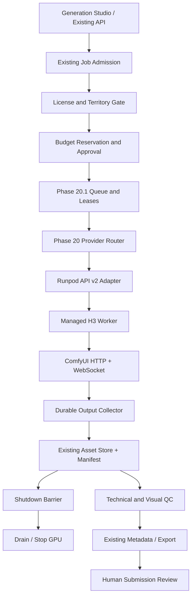

# Phase 20 Addendum — Pao-hubPro × Runpod MiniMax H3 Production Worker

## License-Aware Video Execution, Runpod API v2, Durable Asset Handoff & Budget-Governed GPU Lifecycle

> **Document type:** Production-Oriented Implementation Blueprint (transformed from the source addendum under `PAO-HUBPRO_MASTER_PHASE_REQUEST.md`)
> **Document ID:** P20-H3-WORKER-ADDENDUM · **Revision:** 1.0 — 15 September 2026 — Asia/Bangkok
> **Project:** Pao-hubPro / Pao AI Video Factory
> **Scope:** เอกสารเสริม Phase 19 + Phase 20 + Phase 20.1 · **Governance integration:** Phase 20.2 Spec-Driven AI SDLC Orchestrator
> **⚠ Phase identity note:** This is an **Addendum** to existing phases (19/20/20.1), not a new numbered phase — its identity (Document ID P20-H3-WORKER-ADDENDUM) is preserved; no phase renumbering performed. Source note retained: tail of Phase 20.1 spec contained ideas proposed for 20.2, but the actual 20.2 file found is Spec-Driven SDLC — follow the real files in the repository; do not renumber other phases.
> **Status:** IMPLEMENTATION SPECIFICATION — ยังไม่ใช่โค้ดที่ติดตั้งหรือผ่านการทดสอบบน GPU จริง
> **Default mode:** **DRY_RUN; cloud spending disabled; commercial export held until reviewed**

> **หลักการของ Addendum นี้ (non-collapse of distinctions):**
> **สร้างงานสำเร็จ ≠ เก็บไฟล์ปลอดภัย ≠ ผ่าน QC ≠ มีสิทธิ์ส่งขาย ≠ Adobe อนุมัติ**
> (Generating a video successfully ≠ the file is safely stored ≠ it passes QC ≠ there is a right to sell it ≠ Adobe approves it.)

---

## 1. Executive Summary

เอกสารนี้เป็นสเปกสำหรับให้ Codex พัฒนาโมดูลต่อใน repository เดิม — **ไม่ใช่**หลักฐานว่า Pao-hubPro deploy แล้ว, **ไม่ใช่**การอนุมัติค่าเช่า GPU, **ไม่ใช่**คำรับรองว่าไฟล์จะผ่าน Adobe Stock ในการจัดทำได้ตรวจเอกสาร Phase ใน Library และเอกสารสาธารณะของผู้ให้บริการเท่านั้น — ยัง**ไม่ได้**ตรวจ source code ของ repository, เข้าบัญชี Runpod, อ่าน license ที่เปาซื้อไว้, ทดสอบ template จริง หรือสร้างวิดีโอจริง ดังนั้นค่าที่ต้องได้จาก runtime (image digest, model checksum, GPU memory peak, ราคา, throughput) ต้องเป็น `null`/`UNVERIFIED` จนกว่าจะวัดจริง

เป้าหมาย end-to-end:

```text
เลือก concept ที่มีประโยชน์เชิงพาณิชย์
  → ตรวจสิทธิ์และขอบเขตการใช้งาน
  → ตรวจ workflow / โมเดล / งบ
  → ขออนุมัติงานที่จะมีค่าใช้จ่าย
  → เลือกหรือเปิด GPU worker
  → สร้างวิดีโอและติดตามงาน
  → เก็บ master กลับอย่างตรวจสอบได้
  → ปิด GPU เมื่อปลอดภัย
  → QC / metadata / export package
  → คนตรวจและตัดสินใจส่ง Adobe Stock
```

Addendum นี้เพิ่ม: H3 worker profile + capability/compatibility probe; Runpod REST API v2 lifecycle adapter + migration boundary; license/geography/commercial-export gate; atomic budget reservation + admission control; queue ownership + lease fencing + submission reconciliation; input staging + durable output handoff with checksums; idle drain/stop, bounded recovery, orphan detection; technical QC, review handoff, audit, metrics, UI state; offline tests, contract tests, manual live smoke-test runbook.

---

## 2. Problem Statement

ระบบ generation เดิม (Phase 19/20/20.1) ยังไม่มีชั้นที่ทำให้การใช้ GPU เช่าจริงปลอดภัยและตรวจสอบได้ครบวงจร: license ที่จ่ายมาแล้วไม่ได้แปลว่าส่งขาย Stock ได้; template ที่เห็นในบทความไม่ใช่ runtime attestation; `RUNNING` จาก provider ไม่ใช่หลักฐานว่า H3 พร้อม; response ที่หายไปอาจแปลว่างานกำลังรันอยู่ (สร้างซ้ำ = เงินหาย); stop ที่กดแล้วไม่ยืนยัน = ค่า compute อาจยังวิ่ง; asset ที่ยังไม่ durable ไม่ควรเป็นเหตุผลให้ปิด GPU; และ storage ที่ยังอยู่หลัง stop ยังมีค่าใช้จ่าย

ระบบจึงต้องแยกแยะอย่างเคร่งครัดว่า: สิ่งใด**พิสูจน์แล้ว** (verified evidence), สิ่งใด**ประมาณการ** (estimated), สิ่งใด**ยังไม่รู้** (UNVERIFIED/null) — และห้ามเดาในทุกจุดที่ผลลัพธ์คือเงิน ไฟล์ หรือสิทธิ์

### ข้อเท็จจริงที่มีผลต่อการออกแบบ (ตรวจ 15 September 2026)

| Evidence | ข้อเท็จจริง / ข้อจำกัด | ผลต่อการพัฒนา |
|---|---|---|
| E01 | บทความชี้ template `hs44di56w7`; 8189 dashboard, 8888 Jupyter; log แสดง ComfyUI 8188 | ข้อมูลตั้งต้น ไม่ใช่ runtime attestation; ต้องตรวจ endpoint จริง |
| E02–E03 | Runpod เลิกใช้ REST API v1 วันที่ 15 Nov 2026; มี v2 | งานใหม่ใช้ v2; migration ระบบเดิมต้องมี compatibility tests |
| E04–E05 | Container disk ephemeral; volume/network volume มีอายุข้อมูลต่างกัน | ตรวจ mount จริงก่อน stop/terminate; แสดง storage ที่ยังเหลือ |
| E06–E07 | ComfyUI มี HTTP/WS สำหรับ queue/prompt/history/outputs | ใช้ API; ไม่ทำ browser click automation เป็น execution path หลัก |
| E08 | H3-Base กับ H3-Regenerate-2K เป็นคนละขั้นในเอกสาร MiniMax | ห้ามเรียก local upscale ว่า official 2K regeneration โดยไม่มีหลักฐาน |
| E09–E10 | Comfy มี native H3 workflows; แยก commercial rights ของ self-hosted กับ Cloud | ตรวจ license ของเส้นทางที่ใช้จริง; เครดิต Cloud ≠ สิทธิ์ self-hosted |
| E11 | Community License มี territorial restrictions รวมถึง Outputs | ตรวจทั้งสถานที่รันและสิทธิ์เผยแพร่/ขาย output |
| E12–E14 | Adobe กำหนด technical requirements และ AI labeling | ตรวจไฟล์จริงและสิทธิ์ก่อน export; ไม่ auto-submit |
| E15 | Comfy-Org model card ระบุ FL2VA/Ref2VA, VAE, encoder | candidate สำหรับ discovery — ตรวจ checksum ที่ติดตั้งจริง |
| E16–E17 | Runpod v2 pod state transition + create Pod contracts | lifecycle payload และ provisioning schema ตาม docs ปัจจุบัน |

**ยังไม่ยืนยัน:** template image digest; executable startup scripts; model versions ใน Pod จริง; สิทธิ์เชิงพาณิชย์ของผู้ใช้; ราคาเช่าปัจจุบัน; GPU ที่คุ้มที่สุด; ความสำเร็จของ workload บน VRAM แต่ละขนาด

---

## 3. Goals

**Mission:** implement Addendum นี้ใน repository Pao-hubPro เดิมโดยเริ่มจากสำรวจระบบจริง แล้วทำ **vertical slice ที่ทดสอบได้** ตั้งแต่ job admission ถึง asset handoff และ safe worker shutdown — รักษา auth, tenant scope, database, asset lineage, audit, queue, provider abstraction และ UI conventions เดิม; ใช้ migration แบบ additive เท่านั้น

**In scope:**

1. H3 worker profile และ capability/compatibility probe
2. Runpod REST API v2 lifecycle adapter และ migration boundary
3. License + geography + commercial export gate
4. Atomic budget reservation และ admission control
5. Queue ownership, lease fencing, submission reconciliation
6. Input staging, output collection, checksums และ durable handoff
7. Idle drain/stop, bounded recovery, orphan detection และ operator actions
8. Technical QC, review handoff, audit, metrics และ UI state
9. Offline tests, contract tests และ manual live smoke-test runbook

**Priority เมื่อคำแนะนำขัดกัน:** 1) สิทธิ์/ความปลอดภัย/ข้อมูลผู้ใช้และ explicit approval → 2) Implementation จริงที่ตรวจพบและ backward compatibility → 3) Addendum นี้สำหรับขอบเขต H3 worker → 4) เอกสาร Phase เดิมและบทความเป็นบริบท ไม่ใช่ executable truth

**BLOCKED rule:** หากยังไม่มี repository ใน workspace → รายงาน `BLOCKED_NO_REPOSITORY` พร้อมสิ่งที่ขาด; **ห้าม**สร้างโปรเจกต์ใหม่เองแล้วอ้างว่า integrate แล้ว หากมี repo แต่ dependency ขาด → ทำส่วน offline ที่ทดสอบได้ต่อ และรายงาน blocker ของ live path ตามจริง

---

## 4. Non-Goals

**Out of scope:**

- Auto-submit Adobe Stock, auto-buy licenses หรือ auto-top-up Runpod
- สร้าง social publishing หรือแพลตฟอร์ม stock อื่นในงานนี้
- สร้าง queue, provider gateway, user system หรือ metadata engine ซ้ำ
- ใช้ proxy เพื่อหลบข้อจำกัด license, region หรือบัญชี
- แจก model weights รวมใน export package
- อัปเกรด custom nodes และโมเดลแบบไม่ล็อกเวอร์ชันระหว่าง production
- ทำ multi-GPU distributed inference เป็นค่าเริ่มต้น (Multi-GPU ใน Phase 20 = กระจายหลาย jobs ไปหลาย workers — ไม่ยืนยันว่า H3 graph หนึ่งงานแบ่ง inference ข้ามหลาย GPU ได้)
- เรียก paid API / เช่า GPU ใน automated tests

**Phase boundary:** ไม่เปลี่ยน Phase 19/20/20.1 ให้เป็น GPU deployment phase; ไม่เปลี่ยนเลขเฟสของงานอื่น; เอกสาร Phase เดิมเป็น requirement ไม่ใช่หลักฐานว่า implement แล้ว

---

## 5. Why This Phase Exists

### การเชื่อมกับ Phase เดิม

| เอกสารเดิม | หน้าที่ตามสเปก | งานของ Addendum นี้ |
|---|---|---|
| Phase 19 — AI Generation Studio × ComfyUI Production Orchestrator | Generation, workflow/model registry, asset, QC และ export | ใช้ job/asset/workflow เดิม เพิ่ม H3 capability และ durable handoff |
| Phase 20 — Multi-GPU Generation Grid × RunPod Intelligent Workload Router | เลือก GPU, provision, health, result pull และ stop | ทำ H3 worker profile, API v2 adapter, license/region/budget gates |
| Phase 20.1 — ComfyUI Smart Queue × Auto Cloud Burst Scheduler | Queue ownership, cloud burst, scale-in และ idle stop | เติม reconciliation, shutdown barrier และการป้องกันงานซ้ำ |
| Phase 20.2 — Spec-Driven AI SDLC Orchestrator | Spec, plan, implementation, test, review และ approval | ใช้กระบวนการตรวจงาน ไม่เปลี่ยนให้เป็น GPU deployment phase |

เอกสาร Phase 20 เดิมระบุ template `hs44di56w7` แล้ว — **ไม่ต้อง**สร้าง provider, queue หรือ dashboard อีกชุด เอกสาร Phase เป็น requirement ไม่ใช่หลักฐานว่า feature นั้น implement แล้ว

ไฟล์อ้างอิงภายใน: `PHASE_19_PAO_AI_GENERATION_STUDIO_COMFYUI_PRODUCTION_ORCHESTRATOR.md`, `PHASE_20_PAO_MULTI_GPU_RUNPOD_INTELLIGENT_WORKLOAD_ROUTER.md`, `PHASE_20_1_PAO_COMFYUI_SMART_QUEUE_AUTO_CLOUD_BURST_SCHEDULER.md`, `PHASE_20_2_PAO_SPEC_DRIVEN_AI_SDLC_ORCHESTRATOR.md`

---

## 6. Relationship to Pao-hubPro

### Layer mapping (Pao-hubPro core layers)

| Layer | Role in this phase |
|---|---|
| 07 Policy Engine | License/territory gate; budget admission; region policy. |
| 08 Approval Engine | Spend approval; execution plan approval; termination approval; export review. |
| 09–11 Execution Runtimes | Managed H3 worker on Runpod (remote execution plane). |
| 12 State / Session Layer | 3 state machines (job/asset/worker); leases; reservations. |
| 14 Secrets & Credential Layer | Runpod API key server-side only; limited object credentials. |
| 15 Event / Queue Layer | Phase 20.1 queue + outbox; reconciliation. |
| 16 Observability Layer | 11 event types + metrics. |
| 17 Audit Layer | `h3.*` events; ProviderAuditEvent. |
| 19 Web Dashboard | AI Generation Studio → Workers → Runpod H3. |
| 20 External Provider Layer | Runpod (control plane), ComfyUI (worker runtime), Adobe Stock (submission boundary — human). |

### Service boundary rule

Control plane ต้องทำงานบน **VPS/worker service ที่มีชีวิตอิสระจาก GPU Pod** — ไม่ใช้ request handler ของหน้าเว็บถือ long-running loop และไม่ฝากระบบ shutdown ไว้ในแท็บ browser ของผู้ใช้ ใช้ background runner ของ repository เดิม; ถ้ายังไม่มี ให้เพิ่ม service ที่มี durable scheduling อย่างน้อยหนึ่งตัว (**ไม่จำเป็น**ต้องเพิ่ม Redis/BullMQ ถ้า queue เดิมทำหน้าที่นี้ได้แล้ว)

---

## 7. Upstream / External Systems (Evidence Base)

Phase นี้พึ่งพา external systems 4 ชุด — ทุกข้อเท็จจริงมี evidence ID และ**ขอบเขตความเชื่อมั่น**ชัดเจน:

| ID | แหล่งข้อมูล | ใช้ยืนยันอะไร |
|---|---|---|
| E01 | [Alchemist Skill — Runpod MiniMax H3](https://www.alchemistskill.com/articles/runpod-minimax-h3) | Candidate template และขั้นตอน UI จากบทความ; **ไม่ใช่ security attestation** |
| E02 | [Runpod API v2 overview](https://docs.runpod.io/api-reference-v2/overview) | API base URL, auth และ OpenAPI |
| E03 | [Runpod migration from v1](https://docs.runpod.io/api-reference-v2/migrate-from-v1) | Retirement date, lifecycle mapping, response changes |
| E04 | [Runpod manage Pods](https://docs.runpod.io/pods/manage-pods) | Stop/terminate behavior และข้อควรระวังข้อมูล |
| E05 | [Runpod storage types](https://docs.runpod.io/pods/storage/types) | Container/volume/network storage lifecycle |
| E06 | [ComfyUI server routes](https://docs.comfy.org/development/comfyui-server/comms_routes) | Prompt/queue/history/interrupt routes |
| E07 | [ComfyUI API examples](https://docs.comfy.org/development/comfyui-server/api-examples) | HTTP/WS execution patterns; ตรวจ runtime compatibility |
| E08 | [MiniMax H3 release information](https://www.minimax.io/news/minimax-h3-open-source) | Native capabilities; separation ของ Base/Regenerate |
| E09 | [ComfyUI H3 guide](https://docs.comfy.org/tutorials/video/minimax/minimax-h3) | Native workflow, resolution, self-hosted licensing guidance |
| E10 | [Comfy H3 commercial license](https://comfy.org/minimax/license) | Commercial licensing route; **ไม่ใช่หลักฐานว่าเปาซื้อ/ได้สิทธิ์แล้ว** |
| E11 | [MiniMax H3 Community License](https://huggingface.co/MiniMaxAI/MiniMax-H3/blob/main/LICENSE) | Territory, output restrictions, model-training limitations |
| E12 | [Adobe video technical requirements](https://helpx.adobe.com/stock/contributor/submit-your-content/submit-videos/technical-requirements-for-video-submissions.html) | Duration, size, formats, resolution/frame rate, native-size guidance |
| E13 | [Adobe generative AI guidelines](https://helpx.adobe.com/stock/contributor/submit-your-content/submit-generative-ai-content/generative-ai-content-guidelines.html) | Rights, AI labeling, releases, metadata/content restrictions |
| E14 | [Adobe generative AI video guidelines](https://helpx.adobe.com/stock/contributor/submit-your-content/submit-generative-ai-content/generative-ai-video-submission-guidelines.html) | AI video-specific quality/submission guidance |
| E15 | [Comfy-Org H3 model card](https://huggingface.co/Comfy-Org/MiniMax-H3) | Repackaged model references; compatibility notes |
| E16 | [Runpod v2 Pod state transition](https://docs.runpod.io/api-reference-v2/pods/trigger-a-pod-state-transition) | Action schema, lifecycle responses |
| E17 | [Runpod v2 create Pod](https://docs.runpod.io/api-reference-v2/pods/create-a-pod) | Provisioning request contract, template handling |

All facts checked **15 September 2026**; public docs may change — re-verify schema/policy before live enablement and record the snapshot/revision actually used. State machines, schemas, budget defaults, test cases, UI และ rollout ในเอกสารนี้เป็น **ข้อเสนอการออกแบบของ Pao-hubPro** ไม่ใช่ feature ที่ผู้ให้บริการรับรอง ไม่ใช่คำปรึกษากฎหมายเฉพาะกรณี และไม่ใช่การรับประกันรายได้หรือการผ่าน Adobe Stock

---

## 8. Current-State Assumptions

- **[UNVERIFIED → must stay null until measured]** template image digest; executable startup scripts; model versions ใน Pod จริง; สิทธิ์เชิงพาณิชย์ของผู้ใช้; ราคาเช่าปัจจุบัน; GPU ที่คุ้มที่สุด; workload success บน VRAM แต่ละขนาด
- **[Needs Verification] Repository discovery ก่อนแก้โค้ด** — สร้าง `docs/implementation/runpod-h3-discovery.md` (หรือ path ตาม convention) บันทึกหลักฐาน:

| ต้องค้นหา | หลักฐานที่ต้องบันทึก |
|---|---|
| Package manager / runtime | lockfile, scripts, version constraints |
| Existing providers | interface, Runpod/ComfyUI implementations, actual API version |
| Queue / execution | scheduler, lease, retries, cancel, worker service |
| Auth / permissions | roles, tenant scoping, secret storage |
| Database | schema, migration style, money types, transactions |
| Asset storage | local/object backend, uploads, checksums, retention |
| QC / export | existing validators, metadata contract, review states |
| Testing | unit, integration, contract, E2E and build commands |

ทำ capability map `REUSE / EXTEND / MISSING` ต่อรายการ — ระบุไฟล์จริง; **ห้าม**ถือว่ามี implementation เพียงเพราะพบชื่อ Phase ในเอกสาร

- **[Assumption]** Comfy-Org files (FL2VA/Ref2VA, video/audio VAE, encoder) เป็น candidate สำหรับ discovery [E15] — ตรวจชื่อและ checksum ที่ติดตั้งจริง; ถ้าชื่อในบทความกับ upstream ต่างกัน เก็บ provenance + ทดสอบ compatibility **ไม่เปลี่ยนชื่อไฟล์เพื่อกลบความต่าง**

---

## 9. Target Architecture



Core components: License & Territory Gate · Budget Reservation Engine · Runpod API v2 Adapter · H3 Worker Profile/Readiness Service · Worker Coordinator (`H3WorkerCoordinator`) · Submission Reconciler · Durable Output Collector · Shutdown Barrier · QC/Export handoff · Audit/Metrics · UI state pages.

---

## 10. Architecture Diagram

See Section 9 (mermaid). Complementary trust separation:

```text
CONTROL PLANE (VPS / worker service, independent lifecycle)
  Job admission → License gate → Budget reservation → Queue/leases
  → Runpod API v2 adapter → Reconciliation → Durable handoff → Shutdown barrier

WORKER PLANE (GPU Pod, ephemeral by design)
  ComfyUI HTTP/WS → execution → outputs on persistent mount

EVIDENCE PLANE
  License evidence · Runtime manifest (digests/checksums) · Transfer integrity
  · Budget ledger (Decimal) · ProviderAuditEvent
```

---

## 11. Core Components

| # | Component | Purpose |
|---|---|---|
| 1 | License & Territory Gate | `BLOCKED_LICENSE` before commercial batches; UsageGrant evidence. |
| 2 | Budget Reservation & Admission Control | Atomic reservation; estimated exposure vs approved envelope. |
| 3 | Runpod API v2 Adapter | Pods lifecycle + catalogs per OpenAPI v2; reconciliation-first error model. |
| 4 | H3 Worker Profile / Readiness | Candidate template trust; 10-point readiness probe; profile registry. |
| 5 | Model & Workflow Registry (extended) | Manifest hashes, profile rules, typed semantic bindings. |
| 6 | Job/Queue Orchestration | Ownership, lease fencing, idempotency, submission reconciliation. |
| 7 | Input Staging + Durable Output Collector | Tenant-asset inputs; node-specific output adapters; 10-step commit protocol. |
| 8 | Shutdown Barrier | Drain-then-stop; 10 auto-stop conditions; imported-worker protection. |
| 9 | QC / Metadata / Export handoff | Real-file technical checks; visual/commercial review; export package. |
| 10 | `H3WorkerCoordinator` service | Single service layer behind UI/REST/MCP. |
| 11 | Observability & Audit | `h3.*` events; cost ledger; lifecycle audit. |
| 12 | UI state pages | Workers → Runpod H3 (Overview/Profiles/Jobs/Storage/Budget/Evidence). |

---

## 12. Component Responsibilities

### 12.1 License and commercial-use gate

**เหตุผล:** Community License มีข้อจำกัดเขตใช้งานรวมถึง Outputs (ข้อ V.4) [E11]; Comfy ระบุ commercial license สำหรับ self-hosted [E09–E10] — **การโหลด weights ได้ หรือจ่ายค่า Runpod แล้ว ไม่ได้ยืนยันว่าส่งขาย Stock ได้** บันทึกความต่างของแหล่งข้อมูลไว้ ไม่สรุปว่าฟรีทุกกรณีหรือห้ามขายทุกกรณี — ผู้มีหน้าที่ตรวจสิทธิ์พิจารณาข้อตกลงที่ใช้จริง

**Contract (`UsageGrant` — internal domain object, ไม่ใช่ JSON ส่งเข้า Runpod; map เข้าระบบ evidence/approval เดิม):**

```typescript
type EvidenceStatus = 'UNKNOWN' | 'PENDING_REVIEW' | 'VERIFIED' | 'EXPIRED' | 'REVOKED';

type UsageGrant = {
  id: string;
  tenantId: string;
  modelFamily: string;
  deploymentMode: 'SELF_HOSTED' | 'HOSTED_API';
  status: EvidenceStatus;
  evidenceObjectKey: string | null;
  evidenceSha256: string | null;
  reviewedBy: string | null;
  reviewedAt: string | null;
  validFrom: string | null;
  validUntil: string | null;
  approvedRuntimeCountries: string[];
  commercialOutputUse: boolean | null;
  worldwideOutputDistribution: boolean | null;
  thirdPartyStockLicensing: boolean | null;
  crossModelTrainingAllowed: boolean | null;
  coveredModelManifestHashes: string[];
};
```

**นโยบายปฏิบัติ:**

- `UNKNOWN`/หมดอายุ/หลักฐานไม่ตรง model route/ไม่ครอบคลุม Stock ⇒ `BLOCKED_LICENSE` ก่อนเริ่ม commercial batch
- `VERIFIED` = มีคนตรวจ evidence — **ไม่ใช่ LLM รับรองทางกฎหมาย**
- ตรวจประเทศ data center จาก metadata จริง (ไม่เดาจากชื่อ GPU หรือที่อยู่ผู้ใช้); ตรวจ region ทั้งก่อน create และหลัง provider assign; ผิด region ⇒ quarantine + safe shutdown; **ห้าม fallback ไป region ที่ไม่ได้รับอนุมัติอัตโนมัติ**
- ตรวจสิทธิ์ของ reference media, LoRA, encoder, โมเดลเสริมด้วย
- Comfy Cloud generation กับ ComfyUI บน Runpod = **คนละ entitlement route**; ห้ามใช้เครดิต/subscription เป็นหลักฐานสิทธิ์แทนกันโดยไม่มีเงื่อนไขรองรับ
- Mock tests ทำได้โดยไม่โหลด/รัน weights; การทดลอง weights จริงต้องมีสิทธิ์ที่เหมาะสม
- ห้ามส่ง H3 outputs เข้า fine-tuning/distillation อัตโนมัติ — learning pipeline ผ่าน grant review แยก
- License revoke ⇒ block งานใหม่/export ใหม่ แต่**ไม่ลบ assets ที่มีอยู่เอง**

### 12.2 Template trust และ supply-chain checks

`hs44di56w7` เป็น **candidate template ไม่ใช่ template ที่ผ่านการรับรองความปลอดภัย** [E01] ก่อน deploy: fetch template config; ตรวจ image reference, entrypoint/args, env, ports, storage, download origins, privileged behavior เท่าที่ตรวจได้; บันทึก source snapshot + resolved image digest

Production profile ต้อง **pin**: container digest (หรือ immutable equivalent), ComfyUI commit, custom-node revisions, workflow SHA-256, model checksums — ถ้า template ใช้ `latest` หรือ startup script โหลดไฟล์ที่เปลี่ยนได้ ⇒ pin ผ่าน config/approved derivative image หรือ profile คงสถานะไม่ผ่าน readiness

ห้าม: `curl ... | bash` จากต้นทางที่ไม่ review ระหว่าง job execution; รับชื่อ node/URL download ที่ LLM แต่งขึ้นไป execute โดยตรง; ให้ untrusted template เข้าถึง Runpod control-plane API key หรือ master storage credentials. Docker image build ทำใน development/CI — **ไม่สมมติ Docker-in-Docker บน Pod**

### 12.3 Model and workflow registry (extend ไม่ duplicate)

ใช้ registry เดิม เพิ่ม fields จำเป็น — **disabled configuration example** (ไม่ใช่ติดตั้งใช้ได้ทันที; **ห้ามเติม hash ปลอมเพื่อให้ validation ผ่าน**):

```json
{
  "profileId": "h3-self-hosted-candidate",
  "schemaVersion": 1,
  "enabled": false,
  "readiness": "UNVERIFIED",
  "candidateTemplateId": "hs44di56w7",
  "containerImageDigest": null,
  "comfyuiRevision": null,
  "workflowApiSha256": null,
  "modelManifestSha256": null,
  "licenseGrantId": null,
  "verifiedGpuIds": [],
  "allowedDataCenterIds": [],
  "profiles": [
    {"id": "preview", "validatedWorkflowId": null, "stockExportAllowed": false},
    {"id": "standard", "validatedWorkflowId": null, "stockExportAllowed": false},
    {"id": "production", "validatedWorkflowId": null, "stockExportAllowed": false}
  ]
}
```

**Profile rules:** Preview ใช้ 4-step ได้เฉพาะ workflow+LoRA+scheduler ที่ทดสอบร่วมกันแล้ว (ไม่ใช่ลด `steps=4` กับทุกโมเดล); 8-step เป็น optional workflow-specific profile — ไม่มีไฟล์/ยังไม่ทดสอบ ⇒ disable; Production ต้องผ่าน technical/visual benchmarks + license gate (ไม่ยกฐานะจากชื่อ "quality"); FL2VA/Ref2VA เป็น capability route แยก — ไม่สลับ checkpoint โดยไม่ validate graph; prompt/seed/aspect/duration/references แก้ผ่าน **typed semantic bindings ไม่ hardcode node ID**; ตรวจขนาด/จำนวน frame ตาม installed nodes — เก็บ requested duration แยก measured duration (frame grid); **ห้ามสรุปว่า "2K" ตรงสเปก Adobe** — อ่าน width/height ไฟล์ปลายทางจริง; local upscaler กับ official regeneration/API เป็นคนละ route (ต้นทุน/สิทธิ์/provenance ต่างกัน) [E08]

### 12.4 Runpod REST API v2 adapter

Base URL (server-side): `https://api.runpod.io/v2` — แยกจาก Serverless/Public-Endpoints execution APIs และจาก ComfyUI worker URL [E02–E03]

| Operation | Relative path ใต้ base v2 |
|---|---|
| List / create Pod | `GET /pods`, `POST /pods` |
| Inspect Pod | `GET /pods/{id}` |
| Lifecycle | `POST /pods/{id}/action` |
| Terminate | `DELETE /pods/{id}` |
| GPU catalog | `GET /catalog/gpus` |
| Data center catalog | `GET /catalog/datacenters` |
| Public template discovery | `GET /catalog/templates` |

Lifecycle payload ตัวอย่าง: `{"action":"stop"}` — ตรวจ `actions` ที่ provider ยอมรับใน state ปัจจุบันก่อนเรียก [E16]

**Implementation requirements:** ใช้ schema/client ตาม OpenAPI v2 ที่ตรวจและ pin (ห้ามเปลี่ยน URL อย่างเดียวแล้วส่ง body v1); อ่าน nested create fields, wrapped list results, structured errors ตาม v2 [E03, E17]; template provenance บันทึกใน Pao manifest เอง (อย่าพึ่ง Pod response); ถ้ามี v1 adapter เดิม ⇒ เพิ่ม v2 แล้วย้ายด้วย feature flag (**ห้ามยิง mutation ผ่านสอง adapter พร้อมกัน**); ห้ามสร้าง endpoint/field ที่ไม่มีในเอกสารเพื่อทำ quota/billing cap/idempotency; API keys server-side — redaction ครอบ headers, query strings, signed URLs, provider error bodies; read retries = bounded exponential backoff + jitter + Retry-After; **create timeout ≠ create failed — reconcile ก่อนเสมอ** (ห้าม retry create แบบเสี่ยงเปิดหลาย Pod); 401/403 ไม่ retry storm; 402 ปิด admission; 422 = contract/config error (ไม่ใช่เหตุลอง GPU ทุกตัว); unexpected response ⇒ `PROVIDER_CONTRACT_CHANGED` + hold mutation จนตรวจสัญญาใหม่

### 12.5 Worker readiness — เปิดหน้าเว็บได้ยังไม่พอ

`RUNNING` จาก Runpod = infrastructure state **ไม่ใช่**หลักฐานว่า H3 พร้อม ก่อน mark `READY` ต้องผ่าน 10 ข้อ:

1. Provider status + assigned data center ตรง policy
2. Authenticated ComfyUI endpoint เข้าถึงได้ + response ตรง schema
3. `/system_stats`, `/object_info`, model inventory ตรง approved capability manifest
4. Workflow required nodes + input types ครบ; unknown/custom unsafe nodes blocked
5. Runtime manifest ตรง image/model/workflow versions ที่อนุมัติ
6. Input/output directories บน mount ที่ยืนยัน persistence + พื้นที่เพียงพอ
7. Storage destination มีสิทธิ์เขียน/อ่านกลับ; no cross-tenant access
8. Queue ownership / worker session epoch ตรวจสอบได้
9. GPU/RAM/CUDA/Torch compatibility อยู่ใน tested profile
10. License และ budget grant ยังมีผล

พอร์ต 8188/8189/8888 จากบทความ = reference เท่านั้น — endpoint discovery ต้องมี allowlist; ห้ามเอา dashboard URL ต่อ `/prompt` โดยเดา path; ห้ามใช้ `0.0.0.0` เป็น client destination. Readiness = `PENDING / READY / DEGRADED / BLOCKED / UNKNOWN` + reason codes; **HTTP 200 ที่คืนหน้า login/HTML ไม่ถือว่า healthy**. ครั้งแรก: approved smoke test หนึ่งงานบน dedicated worker เท่านั้น หลังมีสิทธิ์+กรอบค่าใช้จ่าย; **ห้าม health probe แอบสร้างงานที่เสียเงินทุกครั้ง**

### 12.6 GPU selection และค่าใช้จ่าย

ไม่ fix ว่า RTX 5090/4090/PRO รุ่นใด "คุ้มที่สุด" โดยไม่มี benchmark ของ graph นี้ — reuse router เดิมคัด candidates ตาม:

```text
License-compatible geography
 → compatible runtime + enough VRAM/RAM/disk
 → workflow/model locality
 → capacity actually available
 → fresh price evidence
 → approved budget
 → measured cost per useful completed clip
```

บันทึกควบคู่ benchmark: quantization, offload mode, peak VRAM, system RAM, dimensions, measured duration, steps, seed, model load time — **ห้ามเปรียบเทียบเวลา workflows ต่างกันโดยไม่อธิบาย**

### 12.7 Budget contract + admission control

ค่าเริ่มต้น (engineering defaults ที่เสนอ — เปลี่ยนผ่าน policy ที่ตรวจสอบได้; `0.00` ปิด paid execution จนผู้ใช้ตั้งงบเอง):

```json
{
  "mode": "DRY_RUN",
  "allowPaidMutations": false,
  "maxManagedPods": 1,
  "maxActiveJobsPerPod": 1,
  "maxSessionSpendUsd": "0.00",
  "maxDailySpendUsd": "0.00",
  "maxHourlyComputeUsd": "0.00",
  "automaticTopUp": false,
  "automaticTerminate": false,
  "idleStopAfterSeconds": 300,
  "recoveryGraceSeconds": 120,
  "maxAutomaticGenerationRetries": 0
}
```

ใช้ **Decimal/จำนวนเต็มหน่วยย่อย ไม่ใช้ float** สำหรับ ledger; เก็บเวลา UTC + Asia/Bangkok สำหรับขอบเขต "งบรายวัน" ของผู้ใช้

**Admission calculation:**

```text
Estimated new exposure
 = compute rate × (boot + model loading + generation + transfer + drain allowance)
 + storage exposure
 + optional external model/API charges

Admit only when:
 billed/estimated accrued + outstanding reservations + new exposure
 <= approved budget envelope
```

แยก `QUOTED / ESTIMATED / PROVIDER_REPORTED / RECONCILED` ให้ชัด — ไม่แสดงประมาณการเป็น invoice. Atomic reservation เกิดใน transaction ร่วมกับ job admission; **ไม่คืน reservation เพียงเพราะ HTTP timeout — reconcile ก่อน**; ราคา unknown/stale หรือไม่รู้ค่า paid node ⇒ block หรือขอ approval ใหม่. Preview ใหม่/retry/regenerate/upscale = ต้นทุนแยก ต้อง reserve ก่อนทั้งหมด; **ห้าม fallback เป็น GPU แพงกว่าเกิน policy** แม้ GPU เดิมเต็ม

**สิ่งที่ระบบรับประกันไม่ได้:** application budget ≠ hard billing cap ของ Runpod — ถ้า provider ล่มหรือ stop ไม่สำเร็จ provider อาจยังคิด compute ⇒ แสดง `STOP_UNCONFIRMED` + exposure estimate + แจ้ง operator. หลังยืนยัน stop ⇒ compute หยุด แต่ storage ที่ยังอยู่**ต้องยังแสดง**ในรายงาน [E04–E05] — ห้ามขึ้น "ค่าใช้จ่ายทั้งหมด 0" จากเหตุผลว่าไม่มี GPU running

### 12.8 Idempotency, leases และการไม่สร้างงานซ้ำ

เป้าหมาย: **recoverable execution และ effectively-once asset publication** — ไม่อ้าง exactly-once GPU execution ผ่าน HTTP ที่ผลลัพธ์ไม่แน่นอน

**Local idempotency:** client ส่ง idempotency key ต่อ user intent; unique constraint `(tenantId, idempotencyKey)`; เก็บ canonical request hash — key เดิม body เดิมคืน job เดิม; key เดิม body เปลี่ยน ⇒ conflict; intent คนละอันที่ตั้งใจ rerun seed เดิมยังสร้างได้ด้วย key ใหม่ (**ไม่ใช้ prompt hash เป็นตัวห้ามทุกงานซ้ำ**); ทุก attempt มี attempt ID, workflow hash, client correlation ID, assigned worker session epoch; lease acquisition + budget reservation + outbox writes ต้องไม่แยกจนเกิด double dispatch

**Remote submission:** ComfyUI `/prompt` validate graph และคืน prompt ID/ข้อผิดพลาดตาม contract [E06]; ตรวจ version-specific support ของ client-supplied prompt IDs ก่อนใช้; **ห้ามสมมติ server-side deduplication**; ก่อนส่ง persist `SUBMITTING` + request fingerprint; หลังตอบรับ persist remote prompt ID แบบ durable; เปิด WS ก่อน/หลังได้แต่ต้องมี history reconciliation เผื่อ event เกิดก่อน subscribe

**Submit timeout flow:**

```text
Submit timed out → mark SUBMISSION_UNKNOWN → suspend automatic resubmission
→ inspect owned queue/history using correlation evidence
→ found existing job: attach and resume tracking
→ found completed output: collect; do not regenerate
→ confirmed never accepted: retry only within approved policy
→ still ambiguous: hold for operator; do not guess
```

"ไม่เจอใน history" **ไม่เพียงพอ**จะสรุปว่าไม่เคยสร้าง — history อาจถูกล้างหรือ worker restart; ต้องตรวจ session epoch, ownership records, outputs ประกอบ

**Lease fencing:** ทุก mutation ใช้ fencing token/monotonic generation + compare-and-swap กับ state ปัจจุบัน; worker เก่าที่ lease หมด**ต้องไม่** publish asset, reclaim budget, หรือสั่ง stop worker ที่ถูก assign ให้ attempt ใหม่; ใช้ controller leader lease ต่อ provider/account หรือ worker group ลด orphan deploy + race (**process-local mutex ไม่ใช่หลักฐานความปลอดภัยข้าม replicas**)

### 12.9 Input staging และ durable output handoff

**Inputs:** อ้างอิง asset IDs ของ tenant — **ไม่รับ arbitrary filesystem paths**; ตรวจ MIME/file signature/size + rights evidence ก่อนส่ง; ชื่อไฟล์ระบบสร้างเอง; input adapter ตาม node ที่รองรับ; signed URLs scope เฉพาะ object + หมดอายุได้; ห้าม log URL พร้อม credentials; ห้าม browser ส่ง Runpod key เพื่อ upload input เอง

**Outputs:** collector อ่าน outputs จาก **node-specific adapters** ของ graph ที่ approve (image/video/gif entries) — ห้ามสมมติ video ทุก workflow อยู่ใน `outputs[*].images`; รับไฟล์เฉพาะ remote prompt ID ที่เป็นเจ้าของ + filename/subfolder ที่ตรวจแล้ว; ป้องกัน absolute paths, `..`, encoded traversal, symlinks, URL ที่พาไประบบอื่น

**Commit protocol (10 ขั้น):**

```text
Remote graph completes
 1. Persist execution result + candidate artifact manifest
 2. Acquire transfer lease
 3. Stream source to temporary destination with byte limits
 4. Compute SHA-256 + byte count while receiving
 5. Compare against authenticated source digest when available
 6. Verify readable destination and required integrity evidence
 7. Commit immutable asset object/version
 8. Transactionally commit DB asset pointer + lineage + outbox event
 9. Mark attempt DURABLE
10. Release transfer lease and let shutdown barrier re-evaluate
```

`.partial` ไม่ใช่ finished asset; atomic rename บน filesystem เดียวกัน หรือ object-store staging/commit marker ตาม backend. **Object-store ETag ≠ SHA-256 เสมอไป**; HTTP 200/HEAD ยืนยัน existence ไม่ใช่หลักฐาน byte integrity — ถ้าไม่มี source digest แสดงระดับ `TRANSFER_HASH_ONLY` ไม่อ้าง `SOURCE_VERIFIED`; กำหนด **minimum integrity level ของ production profile** ชัดเจน รวม read-back verification เมื่อจำเป็น. DB commit ล้มหลัง upload สำเร็จ ⇒ reconciler หา object จาก stable asset key + complete commit — **ห้าม generate ใหม่**; DB มี pointer แต่ object หาย ⇒ quarantine ไม่แจ้งสำเร็จ

**Storage policy:** verify physical mount mapping จริง (ไม่ดูแค่ชื่อ `/workspace`); เก็บ input/master/workflow/manifest ที่จำเป็นต่อ recovery บน persistent mount หรือ durable external store; destination ต่อ tenant/job/attempt — ห้ามแก้ master ทับ (derivative มี lineage ของตัวเอง); preserve original audio/video master; **Network Volume รอดจาก Pod termination แต่ไม่ใช่ independent backup โดยตัวมันเอง**; retention/cleanup เป็นนโยบายแยก (preview, approval, audit) — **ห้ามใช้ idle-stop ลบ assets**

### 12.10 Shutdown barrier — ปิด GPU โดยไม่ตัดงาน

Default = **drain แล้ว stop ไม่ใช่ terminate**. Normal auto-stop ได้ต่อเมื่อครบทั้ง 10 เงื่อนไขภายใต้ lock/state version เดียวกัน:

```text
worker explicitly managed/adopted by this controller
AND no active lease / staging / submission-unknown attempt
AND no active transfer or required finalization
AND all completed required artifacts are DURABLE
AND own queue is empty
AND no foreign/unowned execution exists on this worker
AND observations are fresh
AND idle interval elapsed
AND stop action is permitted by provider state
AND lifecycle authority is still valid
```

ขั้นตอน: `mark DRAINING → prevent new assignment → recheck all barriers → request stop → poll provider → mark STOPPED`; งานใหม่ระหว่าง drain ⇒ dispatcher ไม่ส่งเข้า worker นั้นจน drain ถูกยกเลิกด้วย CAS. **อ่าน queue สองครั้งห่างกันอย่างเดียวไม่พอ** — ถ้า third-party ยัง submit เข้า endpoint ได้ ต้องแยก dedicated worker หรือ authenticated gateway บังคับ admission ร่วม; otherwise disable unattended auto-stop

**Imported worker:** Pod ที่ import จากบัญชี เริ่ม `OBSERVE_ONLY` — ห้าม stop/interrupt/clear queue/update/terminate จนผู้ใช้เลือก adopt พร้อมอธิบายผล + ยืนยันสิทธิ์ควบคุม

**Failure fallback:** `stop` ไม่รองรับหรือล้ม ⇒ **ห้าม**แปลงเป็น terminate อัตโนมัติ; terminate default ต้องขอ approval เฉพาะ Pod ID + manifest + ผลกระทบที่แสดงชัด

**Controller failure / watchdog:** runner อิสระที่มี durable schedule + bounded recovery grace ตรวจ orphan workers ที่ controller เป็นเจ้าของ; watchdog ต้องอยู่ใน deployment deliverables — ไม่ใช่สัญญาว่าหน้าเว็บจะรัน loop ต่อเอง. กรณีฉุกเฉิน (ค่าใช้จ่าย vs งานไม่สมบูรณ์) ⇒ policy ที่ผู้ใช้อนุมัติล่วงหน้า; ไม่มี ⇒ hold mutation + alert — **ห้ามอ้างรับประกันไม่เสียไฟล์และไม่เกิดค่าใช้จ่ายพร้อมกันเมื่อ provider ติดต่อไม่ได้**

### 12.11 Security and permission model

ใช้ existing roles/capabilities ถ้ามี — แยกอย่างน้อย: `READ_WORKERS, PLAN_JOB, RUN_APPROVED_JOB, MANAGE_WORKERS, REVIEW_LICENSE, APPROVE_SPEND, APPROVE_TERMINATION, REVIEW_EXPORT`

- UI authorization ไม่แทน server authorization — re-check actor/tenant ทุก mutation
- Approval ผูกกับ: action, target, request hash, budget, profile/version, expiry, **single-use execution record**
- URL validation แยก control-plane origin / approved worker origin / storage origin
- SSRF protection: IPv4/IPv6, loopback, link-local, metadata endpoints, redirects, DNS rebind; internal worker URLs = explicit allowlist/tunnel config (ไม่เปิด private IP ทั้งหมด)
- ไม่เปิด raw ComfyUI/Jupyter public โดยไม่มี authentication; dashboard password เดียวไม่ยืนยันว่า execution API ป้องกันแล้ว
- **อย่าส่ง Runpod account API key เข้า GPU container** — ใช้ limited object credentials หรือ presigned operations
- External media tools: argument array (`execFile` หรือ equivalent) + timeout/size limits — ไม่ใช้ shell interpolation
- ห้ามรัน executable nodes จาก workflow ที่ผู้ใช้ upload โดยยังไม่ผ่าน allowlist/review
- Signed callback/event มี replay protection; callback content = untrusted input
- Log ไม่เผย prompt/private reference เต็มโดย default — access-controlled artifact แทน
- Export package ไม่มี keys, internal logs, license documents ที่มีข้อมูลส่วนบุคคล, model weights

### 12.12 Adobe Stock QC — ตรวจไฟล์จริง ไม่ตัดสินจากชื่อ preset

**Technical policy snapshot** (validator เดิม + บันทึก source URL + checkedAt + policy revision ทุกครั้ง): ความยาว 5–60 วินาที; MOV/MPG/MP4; ไฟล์ ≤ 3,900 MB; frame rate/ขนาดภาพตามที่ Adobe ยอมรับ [E12]. MVP เริ่ม approved target profile `1920×1080 / 24 fps` เมื่อมี generation route ที่ทำได้จริง — ขนาด native บาง workflow เช่น `1344×768` **ไม่ใช่** `1920×1080` และไม่ผ่าน Stock technical gate เพียงเพราะ preset ชื่อ HD [E09, E12]

- อ่าน duration, width, height, frame rate, codec, streams, file size จากไฟล์จริง
- เปรียบเทียบ rational frame rate ถูกต้อง (ไม่ตัด 23.98 = 24 โดยไม่ตรวจ policy)
- duration ปัดแสดง 5.0 วินาทีแต่อ่านจริงต่ำกว่าเกณฑ์ ⇒ **ไม่ผ่าน**
- ทดลอง 6–10 วินาทีเป็นข้อเสนอ engineering (เผื่อระยะ) — frame count ต้องเข้ากับ workflow จริง
- Output 768p ⇒ เก็บเป็น preview/master + `NEEDS_FIXES` สำหรับ Stock (**ไม่เพิ่มป้าย HD เอง**)
- **ห้าม**ทำ 4 วินาทีให้ครบขั้นต่ำด้วยการค้างเฟรม/วนคลิปอัตโนมัติแล้วอ้างว่าไม่มีปัญหา
- ตรวจ decode error + ความสมบูรณ์ตลอดคลิป — ไม่ดูแค่ thumbnail/header
- Adobe แนะนำส่งขนาด native + มีข้อควรระวังการ resize ⇒ upscale เป็นขั้นที่ต้องตรวจวิธี+คุณภาพ ไม่ใช่การรับรองว่าผ่าน [E12]; บันทึก source dimensions, transform lineage, derivative ID แยกจาก master
- `H3-Regenerate-2K` (MiniMax) กับ local latent upscaler ใน template = **คนละ capability** จนมีหลักฐานว่าเป็น implementation เดียวกัน — ห้ามตั้งชื่อหลอกว่า official regeneration [E08]

**Visual/audio/commercial review:** motion consistency, flicker, deformation, physics, camera motion, object permanence, anatomy (คน/สัตว์), malformed text, watermark/โลโก้, reference ที่สิทธิ์ไม่ครบ [E13–E14]; ไม่เพิ่มข้อห้ามเสียงที่ไม่มีหลักฐาน — มีตัวเลือก export มี/ไม่มีเสียงตามสิทธิ์ + use case; เก็บต้นฉบับ; ตรวจ clipping/sync/เสียงพูดไม่ตั้งใจ/เพลงสิทธิ์; **ห้าม**สร้าง dubbing/music ใหม่โดยไม่มี approval/cost evidence; review ต้องตอบ "ใครจะซื้อไปใช้ทำอะไร" — technical pass ≠ commercial utility; ไม่ส่งหลายคลิปแทบเหมือนกันเพราะเปลี่ยน seed

**Metadata/submission boundary:** reuse metadata engine เดิม; title/keywords ตามสิ่งที่ปรากฏจริง; ไม่ใส่ชื่อโมเดลเป็นคำขายโดยไม่มีเหตุผล; ห้ามหลอกว่าเป็นเหตุการณ์จริง/ใส่ชื่อบุคคล-ผลงาน-IP ขัด policy; เก็บ AI labeling + fictional people/property decision ตามเงื่อนไขที่ใช้จริง [E13–E14]. ผลลัพธ์ที่อนุญาต:

```text
NEEDS_FIXES
HOLD_FOR_COMPLIANCE_REVIEW
REJECT_INTERNALLY
READY_FOR_HUMAN_SUBMISSION_REVIEW
```

`READY_FOR_HUMAN_SUBMISSION_REVIEW` = พร้อมให้คนพิจารณา — **ไม่ใช่** Adobe accepted, **ไม่ใช่** trigger อัปโหลดอัตโนมัติ. Export package: media derivative ที่ผ่านตรวจ + metadata draft ตาม schema เดิม + generation lineage ไม่เผยความลับ + QC report + manifest พร้อม checksum; license evidence เก็บใน protected system — ไม่แนบเอกสารสัญญาส่วนตัวออกไปโดย default

---

## 13. Data Flow

See Section 9 flow + commit protocol (Section 12.9). Correlation chain ตั้งแต่ concept → job → attempt → provider operation → asset → review ใช้ correlation เดียวตลอด

---

## 14. Control Flow

### Risk classification (R0–R4 mapping)

| Level | Actions in this phase | Default |
|---|---|---|
| R0 — Read-only | Inspect account/template/candidates; observe imported pods; view states/ledger | ALLOW (capability `READ_WORKERS`) |
| R1 — Low-risk local | Plan job (read-only planning); config validation; discovery docs | ALLOW, audited |
| R2 — Reversible write | Register license evidence; draft export package; import worker observe-only | ALLOW within policy, audited |
| R3 — Sensitive / paid | Run approved job (GPU spend!); approve spend; drain & stop; collect artifacts; license review decisions | **Explicit approval** bound to action+target+hash+budget+expiry+single-use |
| R4 — Destructive | Terminate pod; delete/destroy anything; auto-submit to Adobe | Human approval (terminate: pod ID + manifest + impact shown); **auto-submit = out of scope** |

**ห้าม** agent/Codex ซื้อ license, เติมเครดิต, เช่า GPU, ส่ง Stock เองจากเอกสารนี้; การมี API key ≠ การอนุมัติ

### Admission decision flow

```text
Job request → validate (schema/profile/workflow) → License gate (BLOCKED_LICENSE?)
→ Budget gate (atomic reservation within envelope? BLOCKED_BUDGET?)
→ Approval gate (WAITING_APPROVAL for paid jobs) → QUEUED → lease → execute
```

---

## 15. Agent / Worker Model

**Terminology (strictly separated):**

| Term | Definition |
|---|---|
| Controller | Control-plane service (VPS/worker, independent lifecycle) owning orchestration. |
| Worker | One GPU Pod (Runpod) with lifecycle state + readiness + session epoch. |
| Job | User intent (generation request) with idempotency key. |
| Attempt | One execution attempt of a job (attempt ID, workflow hash, lease, remote prompt ID). |
| Lease | Fenced assignment (job↔worker, transfer, controller leadership). |
| Artifact | Output file being staged/committed; `.partial` is not an artifact. |
| Reservation | Atomic budget hold tied to admission. |

Multi-GPU = many jobs across many workers (Phase 20 semantics) — not split inference.

---

## 16. Session / State Model

### 16.1 Job execution state machine

```text
DRAFT → VALIDATING
  → BLOCKED_LICENSE | BLOCKED_CONFIG | BLOCKED_BUDGET | WAITING_APPROVAL
  → QUEUED → LEASED → STAGING_INPUTS → SUBMITTING → REMOTE_QUEUED
  → RUNNING → EXECUTED → COLLECTING → DURABLE

Failure/uncertainty states:
SUBMISSION_UNKNOWN · RECOVERING · FAILED_RETRYABLE · FAILED_FINAL
CANCEL_REQUESTED · CANCELLED · OUTPUT_LOST   (each with reason + last observed time)
```

เมื่อ API response หาย — job **ไม่ควร**เปลี่ยน `FAILED_RETRYABLE` ทันทีจนสร้างซ้ำ

### 16.2 Asset review state machine

```text
INGESTED → TECHNICAL_CHECK
  → NEEDS_FIXES | HOLD_FOR_COMPLIANCE_REVIEW | REJECT_INTERNALLY
  → VISUAL_AND_COMMERCIAL_REVIEW → READY_FOR_HUMAN_SUBMISSION_REVIEW
```

ใช้ชื่อ state เดิมของระบบเมื่อมีอยู่; **ห้ามมี `ADOBE_APPROVED` จากการตัดสินของ internal QC**

### 16.3 Worker lifecycle state machine

```text
DISCOVERED → VERIFIED_CONFIG → PROVISIONING → STARTING → PROBING → READY
→ BUSY → DRAINING → STOPPING → STOPPED

Additional: QUARANTINED · PROVIDER_STATE_UNKNOWN · STOP_UNCONFIRMED
· TERMINATION_PENDING_APPROVAL · TERMINATED
```

เก็บ **infrastructure state จริงแยกจาก domain state**; ไฟล์ที่ `DURABLE` และรอคน review **ไม่ต้อง**ถือ GPU lease ไว้

### 16.4 Approval lifecycle

Approval record ผูกกับ: action; target; request hash; budget; profile/version; expiry; **single-use execution record** — expired = denial; consumed = not replayable; `executeApprovedShutdown` ตรวจ approval ใหม่ ณ เวลารัน

### 16.5 Idempotency semantics

`(tenantId, idempotencyKey)` unique; canonical request hash; per-attempt IDs; effectively-once publication — see Section 12.8

---

## 17. MCP Integration

- Controller ใช้ **service layer เดียวกัน**ผ่าน UI/REST/MCP — **ไม่เปิดช่องที่ MCP ข้าม license, budget หรือ permissions ได้** (test T36)
- Internal `planShutdown` = read/planning; `executeApprovedShutdown` = mutation + ตรวจ approval ใหม่ ณ เวลารัน
- Caller ผ่าน MCP แต่ไม่มีสิทธิ์ `RUN_APPROVED_JOB`/`APPROVE_SPEND` ⇒ gate เดียวกับ UI ปฏิเสธ
- MCP callers เห็น state แบบเดียวกับ dashboard (readiness, STOP_UNCONFIRMED, exposure estimates) — ไม่มี privileged bypass

---

## 18. Capability Registry

- **Worker Profile registry** — image/workflow/model hashes, capabilities, tested GPU/region list, readiness states (Section 12.3 JSON — disabled by default, UNVERIFIED until probed).
- **Model/workflow registry (extended)** — typed semantic bindings; validated workflow IDs per profile; stock-export eligibility per profile.
- **License Evidence registry** — UsageGrant records with reviewer + validity + manifest hash coverage (Section 12.1).
- **GPU/region catalog evidence** — fresh price evidence; data-center country from provider metadata.

---

## 19. Policy Model

Policies (all configurable, auditable, no hard-coded business truth): license/territory/commercial-export gate (Section 12.1); budget contract + admission formula (Section 12.7); region verification pre/post-assign with **no automatic cross-region fallback**; retry policy per error class (`maxAutomaticGenerationRetries: 0` default); shutdown barrier conditions (Section 12.10); minimum artifact integrity level per profile; retention/cleanup as separate approved policy. Fail closed: license UNKNOWN, budget unconfigured, price stale, provider contract changed.

---

## 20. Security Model

See Section 12.11 (full model) + 12.2 (template trust). Summary: capability-based permissions (8 roles); server-side re-authorization per mutation; single-use approval bound to request hash; origin-separated URL validation + SSRF defenses; no Runpod key into GPU containers; argument-array process execution; no untrusted executable nodes; replay-protected callbacks; redacted logs (no full prompts by default); clean export packages; secrets via server-side store (`.env.example` ห้ามมี API key จริง).

---

## 21. Approval Model

### R0–R4 summary

See Section 14. Key gates: **spend approval** (budget owner sets envelope + approves execution plan with expiry); **termination approval** (pod-specific, impact shown, never auto-fallback from stop); **license review** (human reviewer sets VERIFIED); **export review** (human submission decision).

### Approval mechanics

- `Plan` → owner reviews price-at-time, storage, wait/download, max pod count, stop conditions → owner sets budget envelope → approves execution plan **with expiry**
- Approvals are single-use; arguments/target change ⇒ re-approval
- Env booleans (`PAO_H3_ALLOW_PAID_MUTATIONS=false`) **ไม่ใช่**การอนุมัติใช้เงินโดยตัวมันเอง — approval อยู่ในฐานข้อมูลผ่าน flow จริง
- Imported pods: adopt requires ownership confirmation; terminate requires explicit approval; emergency cost-vs-work tradeoff requires pre-approved policy else hold

---

## 22. Failure Handling

### Recovery and cancellation matrix

| เหตุการณ์ | การจัดการที่ต้องทำ |
|---|---|
| WebSocket หลุด | Reconnect + history reconcile; ไม่ submit ใหม่ |
| Request timeout หลัง create Pod | Reconcile ด้วย deployment operation record; ambiguous ให้ hold |
| งานจบแต่ upload ล้ม | Retry transfer เท่านั้น พร้อม transfer lease |
| Controller restart | โหลด jobs/leases/outbox เดิม, ตรวจ epoch, reconcile remote state |
| Worker restart | ตรวจ session ใหม่และ outputs; ไม่สมมติว่า graph resume กลาง denoise ได้ |
| GPU OOM | บันทึก failure; เปลี่ยน profile/GPU เฉพาะที่ approve; ไม่ลดคุณภาพเงียบ ๆ |
| Node/model หาย | Quarantine profile; ไม่ auto-install โค้ดจากเว็บใน production job |
| Budget depleted | ปิด new admission; drain ตาม policy; existing exposure ยังติดตาม |
| Queue มีงานที่ไม่ใช่ของเรา | Observe only; ห้าม global interrupt หรือ queue clear |
| Cancellation before dispatch | ยกเลิก job + คืน reservation ที่ยืนยันว่าไม่ได้ใช้ |
| Cancellation while queued | ลบเฉพาะ queue entry ที่ ownership ยืนยันและ API รองรับ |
| Cancellation while running | Interrupt เฉพาะ dedicated worker ที่ current prompt ownership ยืนยัน |
| Checksum mismatch | Quarantine artifact; retry transfer แบบ bounded; ไม่ mark durable |
| Local/storage disk full | หยุดรับงานใหม่; รักษา remote outputs; แจ้ง operator |
| License invalidated | Block new runs/exports; hold assets; ไม่ลบหรือขายเอง |
| Remote output หายจริง | Mark OUTPUT_LOST; rerun = explicit retry ใหม่ใน budget |

**Automatic retries จำกัดต่อ error class และ attempt** — ไม่ retry syntax error, license block, schema incompatibility, unknown submission อย่างไม่สิ้นสุด (`maxAutomaticGenerationRetries: 0` default)

### Provider error semantics

401/403 → no retry storm; 402 → close admission; 422 → contract/config error (not "try every GPU"); unexpected response → `PROVIDER_CONTRACT_CHANGED` + hold mutations; create timeout → `DEPLOY_SUBMISSION_UNKNOWN` + reconcile; stop timeout → `STOP_UNCONFIRMED` (never claim zero cost)

---

## 23. Recovery Model

- **Controller restart:** reload jobs/leases/outbox; verify epochs; reconcile remote state; watchdog runner with durable schedule covers orphaned workers
- **Submission ambiguity:** SUBMISSION_UNKNOWN → inspect → attach/collect/never-accepted-retry/hold (never guess, never blind regenerate)
- **Transfer recovery:** retry transfer only (never regenerate); orphaned objects reconciled from stable asset keys idempotently
- **Drain race recovery:** new job during drain → dispatcher holds; barrier re-checked under same state version; CAS cancel of drain
- **Budget recovery:** reservations reconciled (never refunded on timeout alone); storage exposure continues to be tracked after stop
- **Rollback:** close new admission first; keep reconciliation/collection/budget tracking; **ห้าม** rollback ด้วยการลบ job/asset tables หรือ terminate workers ทั้งบัญชี

---

## 24. Observability

- Correlation เดียว: concept → job → attempt → provider operation → asset → review
- ข้อมูลขั้นต่ำต่อ record: tenant/actor; workflow hash; model manifest; license evidence reference; approval reference; region; resource ownership; runtime epoch; lease token; budget reservation; transfer integrity level; lifecycle action; provider confirmation

**Events (ตรวจย้อนหลังได้ — ชื่อปรับตาม convention เดิมได้; ห้าม emit "durable" ก่อน commit protocol เสร็จ):**

```text
h3.preflight_blocked · h3.budget_reserved · h3.deploy_submission_unknown
h3.worker_ready · h3.job_submission_unknown · h3.job_reconciled
h3.artifact_durable · h3.shutdown_blocked · h3.stop_requested
h3.stop_confirmed · h3.export_held
```

**Metrics:** time-to-ready; generation duration; transfer latency; observed peak VRAM; retry count; unresolved attempt count; stop confirmation delay; estimated cost per valid clip; actual billed cost เมื่อมีหลักฐาน — เก็บ sample size + ความเชื่อมั่นแยกจากค่าประมาณ. **ไม่สร้าง**ตัวเลข earnings/Adobe acceptance rate/ROI จากจำนวน generation jobs (ยังไม่มีข้อมูลยอดขาย/การอนุมัติจริง)

---

## 25. Audit

WHO/WHAT/WHEN/WHERE/WHY/RESULT per Section 24 minimum fields. `ProviderAuditEvent` fields: actor, action, reason, before/after, correlation, redacted evidence. Audit integrates with the existing Pao audit store; secrets/credentials never in logs (redaction covers headers, query strings, signed URLs, provider error bodies); events honest about uncertainty (`*_UNKNOWN` states are recorded as-is, never laundered into success).

---

## 26. Data Model

**Extend ไม่ duplicate** — logical entities, map กับตารางเดิม:

| Entity | Fields ที่ควรมีเพิ่ม |
|---|---|
| ProviderConfiguration | apiVersion, approved origins, secretRef, enabled mode |
| WorkerProfile | image/workflow/model hashes, capabilities, tested GPU/region list |
| LicenseEvidence | grant scope, evidence digest, reviewer, validity |
| WorkerInstance | remotePodId, owner, lifecycle permission, epoch, observations |
| JobAttempt | request fingerprint, idempotency, lease token, remotePromptId, state |
| DeploymentOperation | unique operation ID, intent, observed Pod mapping, outcome certainty |
| BudgetReservation | approved envelope, amount, currency, state, validity |
| ArtifactTransfer | source, destination, hashes, bytes, integrity level, transfer state |
| GenerationLineage | source prompt, graph, seed, inputs, runtime manifest, route |
| ProviderAuditEvent | actor, action, reason, before/after, correlation, redacted evidence |

ทุก query/mutation มี tenant scope; foreign keys ไม่ชี้ข้าม tenant; unique constraints ป้องกัน double-publish/double-reservation; **เงินใช้ Decimal/integer minor units**; Add columns แบบ nullable/backfill ก่อนบังคับ required เมื่อเหมาะสม; **ห้ามแก้ปัญหาด้วย drop/reset schema**; rollback ที่ไม่ลบ user data

---

## 27. API / Event Contracts

### 27.1 Internal service boundary

```typescript
interface H3WorkerCoordinator {
  inspectCandidate(input: InspectInput): Promise<InspectionReport>;
  planJob(input: JobPlanInput): Promise<JobPlan>;
  admitJob(input: ApprovedJobInput): Promise<JobReference>;
  reconcileJob(jobId: string): Promise<ReconciliationReport>;
  reconcileWorker(workerId: string): Promise<WorkerReport>;
  collectArtifacts(attemptId: string): Promise<TransferReport>;
  planShutdown(workerId: string): Promise<ShutdownPlan>;
  executeApprovedShutdown(planId: string): Promise<LifecycleReport>;
}
```

Type names ที่ยังไม่ประกาศเป็น **contract outline** — สร้างตาม convention เดิม ไม่คัดลอกเป็นไฟล์ที่ compile ไม่ได้แล้วอ้างว่าสำเร็จ

### 27.2 Runpod v2 operations

See table in Section 12.4 (pods, lifecycle, terminate, catalogs, templates).

### 27.3 Events + envelope

`h3.*` event catalog (Section 24). Common envelope follows the Pao control-plane standard: `request_id, session_id, actor_id, operation, input, status (ALLOWED|DENIED|REQUIRE_APPROVAL|COMPLETED|FAILED|BLOCKED_LICENSE|BLOCKED_BUDGET|SUBMISSION_UNKNOWN), result, error{code,message}, created_at`.

---

## 28. Configuration

```dotenv
RUNPOD_API_KEY=
RUNPOD_API_BASE_URL=https://api.runpod.io/v2
PAO_H3_EXECUTION_MODE=DRY_RUN
PAO_H3_ALLOW_PAID_MUTATIONS=false
PAO_H3_ALLOW_AUTO_TERMINATE=false
PAO_H3_MAX_MANAGED_PODS=1
PAO_H3_MAX_ACTIVE_JOBS_PER_POD=1
PAO_H3_DAILY_BUDGET_USD=0.00
PAO_H3_IDLE_STOP_SECONDS=300
```

(ชื่อ config เดิมใช้เมื่อมีอยู่แล้ว; ตัวอย่างเป็นของ Pao ไม่ใช่ environment contract ของ Runpod). **ต้อง validate config ฝั่ง server**; เก็บ approval ในฐานข้อมูล — env booleans ไม่ใช่การอนุมัติใช้เงิน; **ห้ามใส่ API key จริงใน `.env.example`**; ตัวเลขเวลาใน budget contract เป็น engineering defaults ที่เสนอ ไม่ใช่ข้อกำหนดผู้ให้บริการ

---

## 29. Feature Flags

| Flag | Default | Gates |
|---|---|---|
| `PAO_H3_EXECUTION_MODE` | `DRY_RUN` | Whole live path; DRY_RUN never creates/starts/stops/deletes pods |
| `PAO_H3_ALLOW_PAID_MUTATIONS` | `false` | Any spend-capable mutation (requires real approval flow, not just env) |
| `PAO_H3_ALLOW_AUTO_TERMINATE` | `false` | Terminate actions (always approval-gated regardless) |
| v1→v2 adapter migration flag | v2 active, v1 read-only | No simultaneous mutation through both adapters |
| Profile `enabled` / readiness | `false` / `UNVERIFIED` | Per-profile live enablement after checks |
| Rollout feature flag (Slice E) | closed | Must reverse-close new admission without abandoning in-flight work |

---

## 30. Repository / Module Structure

Follow existing conventions; discovery doc records the real map. Logical additions:

```text
docs/implementation/runpod-h3-discovery.md     # reuse/extend/missing evidence map
<existing provider layer>/runpod-v2-adapter.*  # new v2 adapter beside v1
<existing services>/
  h3-worker-coordinator.*      # Section 27.1 interface
  license-gate.*               budget-reservation.*
  submission-reconciler.*      durable-output-collector.*
  shutdown-barrier.*           readiness-probe.*
<policies>/h3/*                # license, budget, region, shutdown, retention
<schemas>/*                    # UsageGrant, manifests, transfers, audit
tests/runpod-h3/*              # T01–T40 fixtures + mocks
```

No new queue/provider gateway/user system/metadata engine — extend existing ones.

---

## 31. Dashboard Integration

เพิ่มในหน้าที่มีอยู่ (ไม่สร้าง cockpit ซ้ำ) — ชื่อเมนูเป็นข้อเสนอ implementation:

```text
AI Generation Studio
  → Workers
  → Runpod H3
       Overview / Profiles / Jobs / Storage / Budget / Evidence
```

Design system เดิม; แสดงครบทุก state: loading, empty, permission-denied, error, disconnected, stale-data

| ส่วนแสดงผล | ข้อมูลสำคัญ |
|---|---|
| License | VERIFIED/BLOCKED, deployment route, territory scope, reviewer, expiry (ไม่เผยไฟล์สัญญาแก่ทุกคน) |
| Worker | Own/Imported, GPU, provider state, readiness, runtime epoch, last observation |
| Job | Current attempt, remote prompt ID, running/unknown/collecting, elapsed time |
| Storage | Mount type, pending transfer, checksum status, independent copy verified หรือยัง |
| Budget | Approved cap, reserved, estimated usage, provider-reported usage, remaining storage charges |
| Profile | Model/workflow manifest revision, verified capabilities, preview vs export eligibility |
| Shutdown | Drain reason, barrier blockers, stop requested/confirmed, latest provider observation |

Actions: `Inspect, Plan, Import read-only, Request approval, Run approved job, Collect again, Drain and stop, Review export` ตามสิทธิ์. **Terminate ซ่อนใน advanced/destructive actions** — แสดงสิ่งที่จะสูญหาย + proof ว่า output durable + confirmation ผูกกับ Pod ID + current plan; ห้ามใช้เป็น fallback เมื่อ stop ล้มเหลว

**Honesty rules:** ถ้าไม่มีราคา แสดง `ยังไม่มีข้อมูลราคา` (ไม่แสดง 0 บาท); ยังไม่ตรวจ benchmark ⇒ แสดง `ยังไม่ได้ทดสอบบน GPU นี้` (ไม่แสดง badge Recommended Production โดยไม่มีหลักฐาน)

---

## 32. Dependencies

### Required

- **Existing Pao-hubPro repository** (Phase 19/20/20.1 surfaces): job admission, queue/leases, provider router, asset store + lineage, QC/metadata/export, auth/tenancy, audit, migrations — this addendum integrates, never replaces
- **Runpod account + API key** (server-side secret store) — for live path only; offline path works without
- **Control-plane service with durable scheduling** (existing background runner or one new service)

### Recommended

- **Phase 20.2 Spec-Driven SDLC process** for review/approval of this work itself
- **Existing wallet/FinOps ledger** (Decimal money) for budget reservation

### Optional

- **Network Volume** (persistent storage surviving Pod termination — not a backup)
- **Dedicated worker/gateway** for queue isolation (enables unattended auto-stop)

**Do not assume other phases are implemented.** Standalone path: Slice A/B (discovery + offline E2E with fake provider + Comfy fixture) run without any Runpod credentials; live path reports `NOT_RUN`/`BLOCKED` per Section 41 until Slice C gates pass.

---

## 33. Compatibility

- **Runpod API v1 → v2:** v1 retired 15 Nov 2026 [E02–E03] — new work on v2; existing v1 adapter migrates via feature flag with compatibility tests; never mutate through both adapters simultaneously; response-shape changes (wrapped lists, nested create, structured errors) handled explicitly
- **Adobe policy drift:** technical requirements checked 15 Sep 2026 [E12] — every QC run records `source URL + checkedAt + policy revision`; re-verify before live enablement
- **License scope boundaries:** Cloud vs self-hosted entitlements are separate routes [E09–E11]; Community License territorial restrictions apply to runtime location **and** outputs
- **Template/model drift:** any change to template/node/workflow/model hash from the approved manifest ⇒ revalidation required (T06); naming differences between article and upstream preserved with provenance
- **Backward compatibility:** existing Pao-hubPro workflows unaffected in DRY_RUN; additive migrations only; no schema resets

---

## 34. Migration

- Additive migrations only; nullable/backfill columns before required constraints; **no drop/reset schema**; rollback that never deletes user data
- v1→v2 provider migration: add v2 adapter → compatibility tests → feature-flagged cutover → v1 read-only
- Existing jobs/assets/queue entries preserved; discovery doc maps real `REUSE / EXTEND / MISSING`
- Config migration: new env keys validated server-side; unknown policy schema fails startup

---

## 35. Rollback

```text
1. ปิด admission ใหม่ก่อน (feature flag reverse-close)
2. รักษา reconciliation, output collection และ budget tracking ของงานเดิมไว้
3. ห้าม rollback ด้วยการลบ job/asset tables หรือ terminate workers ทั้งบัญชี
4. Imported workers กลับสู่ OBSERVE_ONLY; reservations reconciled ไม่ล้าง
5. คง audit/evidence และ license records ทั้งหมด
```

Stop-vs-terminate discipline holds during rollback; `STOP_UNCONFIRMED` exposure stays visible until provider confirms.

---

## 36. Testing Strategy

**Ground rules:** fake clock + deterministic fixtures + provider mocks สำหรับ CI; **เรียก live APIs เฉพาะชุด opt-in** แยกจาก automated defaults; การทดสอบที่ไม่มี environment จริงรายงาน `NOT_RUN` **ไม่ใช่ PASS**; integration tests บน storage/database backend ที่โครงการใช้จริง (in-memory mocks ไม่ยืนยัน transaction/locking ของ production DB ได้ทั้งหมด); ใช้ scripts จริงของ repo (typecheck, lint, unit/integration, E2E ที่เกี่ยวข้อง, production build); บันทึกคำสั่ง/ผล และแยก pre-existing failures จาก regressions ที่เพิ่ม

### Acceptance and test matrix (T01–T40)

| ID | กรณีทดสอบ | ผลที่ต้องได้ |
|---|---|---|
| T01 | ไม่มี repo ใน workspace | BLOCKED_NO_REPOSITORY; ไม่สร้างโปรเจกต์ทดแทน |
| T02 | DRY_RUN และมี credentials จริง | ไม่มี create/start/stop/delete หรือ paid generation |
| T03 | License unknown/expired/revoked | Commercial job และ export ถูก hold |
| T04 | License ครอบคลุม Cloud แต่ไม่ครอบคลุม self-hosted | ไม่ใช้ entitlement แทนกัน |
| T05 | Runtime region หรือ distribution scope ไม่ผ่าน | Block; ไม่ fallback ข้ามขอบเขต |
| T06 | Template/node/workflow hash เปลี่ยนจาก approved manifest | Revalidation required |
| T07 | Provider RUNNING แต่ Comfy เป็น HTML login/ไม่พร้อม | Worker ยังไม่ READY |
| T08 | v2 wrapped list, nested create, structured error fixtures | Parse/validate ถูกต้อง; ไม่เงียบแปลง response ที่ผิด |
| T09 | Lifecycle terminate คืน 204 ไม่มี body | ไม่พยายาม parse JSON ที่ไม่มี; ไม่ retry ซ้ำ |
| T10 | Create Pod timeout หลัง provider อาจรับคำขอ | DEPLOY_SUBMISSION_UNKNOWN; reconcile ไม่สร้างใหม่ทันที |
| T11 | Idempotency key เดิม payload เดิม สอง request พร้อมกัน | ได้ logical job เดียว |
| T12 | Key เดิมแต่ payload ต่าง | Conflict; ไม่เขียนทับ job เดิม |
| T13 | สอง scheduler แข่งกัน lease งานเดียว | Owner valid เดียว; ไม่มี double dispatch |
| T14 | Worker เก่าถือ fencing token หมดอายุ | ไม่ publish output หรือสั่ง lifecycle ได้ |
| T15 | POST prompt timeout แต่ remote อาจรับงาน | SUBMISSION_UNKNOWN; ไม่ยิง generate ซ้ำโดยเดา |
| T16 | WebSocket หลุดแต่ history ยืนยันเสร็จ | Reconcile/collect ได้โดยไม่สร้างใหม่ |
| T17 | Comfy restart และ history เก่าหาย | ไม่ตีความว่าไม่เคยรับงาน; hold/reconcile evidence |
| T18 | Node/VAE/encoder ไม่ตรง manifest | Block ก่อนส่ง generation |
| T19 | OOM | ไม่มี unlimited retry หรือ automatic expensive GPU upgrade |
| T20 | Transfer หลุดกลางทาง | Retry transfer; ไม่ retry generation |
| T21 | Source หรือ destination hash ไม่ตรง | ไม่มี DURABLE และไม่มี normal auto-stop |
| T22 | Storage upload เสร็จแต่ DB commit ล้มเหลว | Reconcile orphan object อย่าง idempotent |
| T23 | DB มี transfer record แต่ object ไม่สมบูรณ์ | ไม่ขึ้น durable จาก record เดียว |
| T24 | Controller restart ระหว่าง collect/stop | Resume จาก persistent records; ไม่ลืม cost/lifecycle state |
| T25 | Job ใหม่เข้ามาระหว่าง drain | ไม่ assign ไป worker ที่หยุดรับ; ตรวจ barrier อีกครั้ง |
| T26 | Foreign queue หรือ worker import observe-only | ห้าม auto-stop และห้าม cancel งานผู้อื่น |
| T27 | Cancel งาน Pao แต่ foreign job กำลังรัน | ไม่เรียก global interrupt ใส่ foreign job |
| T28 | คำสั่ง stop timeout/ผลยังไม่ยืนยัน | แสดง STOP_UNCONFIRMED; ไม่อ้าง compute cost เป็นศูนย์ |
| T29 | Stop ไม่รองรับใน runtime ที่พบ | Hold/operator action; ไม่สลับเป็น terminate |
| T30 | Human QC ยังไม่เสร็จ แต่ master durable + queue ว่าง | อนุญาต safe idle stop ตาม policy |
| T31 | งบไม่ตั้ง/ราคาเก่า/ไม่ทราบราคา | ไม่เปิด paid admission |
| T32 | สองงาน reserve งบพร้อมกัน | ไม่เกิน remaining reservation limit |
| T33 | Pod หยุดแล้วแต่ storage ยังถูกคิดเงิน | Budget UI/ledger ไม่ล้างค่า storage |
| T34 | SSRF URL, private metadata, redirect, path traversal | Reject ก่อน network/file access ที่ไม่อนุญาต |
| T35 | Cross-tenant job/artifact/approval reference | Permission denied ทุก transport |
| T36 | Caller ผ่าน MCP แต่ไม่ได้รับสิทธิ์ RUN/APPROVE | Gate เดียวกับ UI; ไม่ bypass |
| T37 | Media duration ต่ำกว่าเกณฑ์ หรือ 768p preset ชื่อ HD | NEEDS_FIXES; ไม่ผ่านจากชื่อ preset |
| T38 | QC technical pass แต่ license/AI labeling ยังไม่ครบ | HOLD_FOR_COMPLIANCE_REVIEW |
| T39 | Log/export/build artifact ตรวจพบ secret fixture | Test fail; ไม่เผย credentials |
| T40 | Feature flag rollback ขณะมี active job | หยุดรับงานใหม่ แต่ไม่ทิ้ง reconciliation/collection |

---

## 37. Acceptance Criteria

### Engineering completion (offline/staging scope)

- [ ] Code integration จริงใน repository เดิม (มี reuse map พร้อมไฟล์จริง)
- [ ] Additive migration ที่ review แล้ว (ไม่มี drop/reset)
- [ ] Tests ที่รันจริง: T01–T40 ที่ environment รองรับ; อื่น ๆ รายงาน NOT_RUN พร้อมเหตุผล
- [ ] Build result; permission/security checks ผ่าน
- [ ] Config documentation + runbook ตรงกับ UI จริง
- [ ] DRY_RUN default พิสูจน์แล้ว (T02); ไม่มี paid mutations โดยไม่มี approval flow

### Live enablement (แยกจาก engineering completion — ต้องมีครบทุกข้อ ไม่งั้นรายงาน BLOCKED/NOT_RUN ไม่ใช้คำว่า ready)

- [ ] Approved license/region evidence (human-reviewed `VERIFIED`)
- [ ] Budget approval ที่ผูกกับ execution plan มี expiry
- [ ] Immutable runtime manifest (digest/commit/revisions/checksums)
- [ ] One-job controlled test บน dedicated worker วัดจริง (เวลา, peak memory, output dimensions, transfer integrity, stop confirmation)
- [ ] Durable output verification ตาม minimum integrity level
- [ ] Safe stop confirmation จาก provider (ไม่ใช่แค่กดปุ่มสำเร็จ)
- [ ] ผล human QC ที่ตรวจได้

---

## 38. Implementation Roadmap

**Vertical slice order (แต่ละ slice ทดสอบได้; ไม่มี slice ใดอนุญาตให้ Codex ซื้อ license/เติมเครดิต/เช่า GPU/ส่ง Stock เอง):**

| Slice | Content | Exit condition |
|---|---|---|
| A — Discovery & read-only | สำรวจ repository; reuse map; config validation; Runpod v2 **read** adapter; capability/rights inspection UI — ทำงานได้โดยไม่อนุญาต paid mutations; fixture/mock สำหรับส่วนไม่มี credentials | Discovery doc + read-only inspection working |
| B — Offline end-to-end | existing job → license/budget gate → **fake provider** → Comfy fixture → artifact collector → existing asset store → shutdown plan → QC hold; ทดสอบ restart + ambiguous submission ได้ | Offline E2E green; **ห้าม**ใช้ simulation นี้อ้างว่าเคยสร้างคลิปจริง |
| C — Controlled live trial | เปิดได้**หลังคนตรวจ** license, template/runtime, region, storage, งบแล้วเท่านั้น; จำกัด 1 owned worker + 1 active job; workflow มี revision + input ได้รับสิทธิ์; เก็บ actual evidence; **ไม่กำหนดค่าเช่าตายตัวในโค้ด** | One controlled job: durable output + confirmed stop + real measurements |
| D — Hardening | chaos/recovery tests; reconnect; drain race; observability; storage failure handling; reconciliation ของ resources ค้าง | Hardening suite green |
| E — Production enablement | เปิดเฉพาะ profile/GPU combinations ที่มีผลทดสอบจริง + ผ่านสิทธิ์และ review gate; feature flag ย้อนปิด admission ใหม่ได้โดยไม่ทำลายงาน/ข้อมูลค้าง | Production enablement per profile |

**Operator runbook (เปา/ผู้ดูแล — 5 ระยะ):** 1) เริ่มโดยไม่เสียค่า GPU (DRY_RUN พิสูจน์) → 2) ตรวจเชื่อมต่อ read-only (key ใน secret store เท่านั้น; Pod เดิม import observe-only) → 3) ตรวจสิทธิ์ก่อน commercial job (Evidence → License review; ไม่สรุปจากประเทศผู้ใช้อย่างเดียว [E11]) → 4) อนุมัติหนึ่งงานทดลองที่ควบคุมได้ (Plan → ตรวจราคา/งบ → อนุมัติ plan มี expiry; ไม่เริ่ม 50 jobs — ทดสอบ 1 job วัดจริง) → 5) ตรวจผลและปิดทรัพยากร (Artifacts ครบ/checksum ผ่าน; Lifecycle stop **confirmed** จาก provider; ตรวจ Runpod console ประกอบ; บันทึก storage ที่ยังมีค่าใช้จ่าย; output ไม่ durable ⇒ แก้ transfer ก่อน normal shutdown)

---

## 39. Risks

| Risk | Impact | Mitigation |
|---|---|---|
| License/territory violation (รัน/ขายผิดเขต) | Legal/commercial exposure | UsageGrant gate; data-center metadata check; no cross-region fallback; separate Cloud/self-hosted entitlements |
| Duplicate GPU spend (ambiguous submissions) | Money loss | Idempotency + SUBMISSION_UNKNOWN + reconcile-first; fencing tokens |
| Orphan pod keeps billing | Money loss | Deployment operation records; STOP_UNCONFIRMED exposure; watchdog; no auto-terminate |
| Asset loss on premature shutdown | Work lost | Shutdown barrier (DURABLE required); commit protocol; .partial ≠ artifact |
| Template/model drift mid-production | Broken output / integrity | Pinned digests/checksums; revalidation on hash change (T06) |
| Secret leakage (key into container/logs) | Account compromise | Server-side keys; limited credentials; redaction; T39 |
| SSRF/path traversal via worker URLs/outputs | Internal exposure | Origin separation; allowlists; traversal defenses; T34 |
| Cross-tenant data access | Privacy breach | Tenant scoping everywhere; T35 |
| Adobe policy drift / preset self-deception | Rejected submissions | Real-file QC; checkedAt + revision; 1344×768 ≠ HD; no frame-padding claims |
| Overstated capabilities (fake hashes, fake "2K", fake earnings) | False confidence | UNVERIFIED-as-null rule; honest UI; no fabricated metrics |
| Controller crash mid-pipeline | Lost state | Persistent records + epoch checks + reconcile (T24) |
| Foreign jobs on shared worker | Interrupting others | Ownership checks; observe-only imports; T26–T27 |
| Budget envelope bypassed via env flag | Unapproved spend | Approval in DB bound to plan+expiry; env ≠ approval |

---

## 40. Security Checklist

- [ ] Runpod API key server-side only; never into GPU container; never in `.env.example`; never in logs/exports
- [ ] All 8 capabilities (`READ_WORKERS` … `REVIEW_EXPORT`) enforced server-side on every mutation; MCP uses the same gate (T36)
- [ ] Approvals single-use, bound to action+target+request hash+budget+profile+expiry
- [ ] DRY_RUN proven: no create/start/stop/delete/paid generation (T02)
- [ ] SSRF defenses: IPv4/IPv6, loopback, link-local, metadata endpoints, redirects, DNS rebind (T34); internal worker URLs via allowlist/tunnel
- [ ] No public unauthenticated ComfyUI/Jupyter; dashboard password ≠ execution API protection
- [ ] External media tools via argument array + timeout/size limits; no shell interpolation
- [ ] No untrusted executable nodes; no `curl | bash`; no LLM-invented node names/URLs executed
- [ ] Tenant scoping on every query/mutation; no cross-tenant references (T35)
- [ ] Signed callbacks replay-protected; callback content untrusted
- [ ] Logs redacted (no full prompts by default; no signed URLs with credentials)
- [ ] Export package clean: no keys/internal logs/personal license docs/model weights; license evidence in protected system
- [ ] Path traversal/symlink/encoded traversal defenses on outputs (T34)
- [ ] Terminate hidden + approval-gated + pod-ID-bound confirmation

---

## 41. Production Readiness Checklist

### Commands / verification

Use the repository's **real** scripts: typecheck, lint, unit/integration tests, relevant E2E, production build. Record commands, results, and pre-existing failures separately from new regressions. Tests without a real environment report `NOT_RUN` — never `PASS`. No live APIs in automated CI defaults (opt-in suite only).

### Final report contract

```text
Document / implementation revision:
Repository and branch inspected:
Existing components reused:
Files added / modified:
Database migrations and data-safety review:
Configuration and secrets handling:
Automated checks actually executed:
Passed / failed / not-run evidence:
Pre-existing failures versus new regressions:
Live provider actions executed: none / approved action IDs
License / region / export review status:
Budget and lifecycle guard status:
Unresolved blockers and risks:
Rollout / rollback procedure:
```

### Definition of done split

**Engineering completion** = code integration + reviewed additive migration + tests actually run + build result + permission/security checks + config docs + runbook matching the real UI — **แยกจาก** live production enablement. **Live enablement** = approved license/region + budget approval + immutable runtime manifest + one-job test + durable output verification + safe stop confirmation + human QC results; ขาดข้อใดรายงาน `BLOCKED` หรือ `NOT_RUN` — **ไม่ใช้คำว่า ready แทน**

---

## 42. Future Extensions

- Multi-GPU distributed inference for a single H3 graph (currently explicitly out of scope — requires upstream evidence)
- Additional stock platforms / social publishing (separate phase; not here)
- Automatic Adobe submission behind explicit human policy (currently forbidden — human decides)
- Broader GPU benchmark matrix once measured evidence accumulates (cost per useful clip by profile)
- Cross-tenant workspace sharing models (requires new policy + tenancy design)

---

## 43. Definition of Done

ยึดหลัก: **สิทธิ์ชัดเจน งานไม่ซ้ำ ไฟล์ไม่หาย ค่าใช้จ่ายตรวจสอบได้ และคนเป็นผู้ตัดสินใจส่งขาย**

Phase (addendum scope) is done when:

1. the integration runs in the existing repository with a verified reuse map and additive migrations;
2. DRY_RUN default is proven and paid mutations are impossible without the real approval flow;
3. the job pipeline is recoverable and effectively-once (T11–T17 pass);
4. artifacts reach DURABLE only through the commit protocol with the profile's minimum integrity level (T21–T23 pass);
5. shutdown never cuts in-flight work and never auto-terminates (T25–T30 pass);
6. license/region/budget gates hold for every admission path including MCP (T03–T05, T31–T36 pass);
7. QC judges real files, not preset names (T37–T38 pass);
8. every claim in UI/reports is evidence-backed (no fake prices, badges, earnings);
9. live enablement remains gated behind human license review + budget approval + one-job trial + confirmed stop;
10. rollback closes admission without destroying data or workers.

---

## 44. Codex One-Shot Implementation Prompt

คัดลอกข้อความด้านล่างเข้า Codex ภายใน workspace repository Pao-hubPro เดิม — เอกสารนี้**ไม่ได้**อนุญาตให้เครื่องมือใช้เงินหรือ deploy จริง:

```text
อ่านไฟล์ PHASE_20_RUNPOD_H3_PRODUCTION_WORKER_ADDENDUM.md ให้ครบ แล้ว implement ใน repository Pao-hubPro เดิม

เริ่มจากตรวจ source code, package manager, auth, database, queue, provider adapters, asset storage, QC/export และ test scripts จริง สร้าง reuse map ของ Phase 19 / 20 / 20.1 และใช้ Phase 20.2 เฉพาะกระบวนการ engineering governance อย่าสันนิษฐานว่าสเปกเดิมถูก implement แล้ว

ต่อยอดของเดิม ไม่สร้างโปรเจกต์ใหม่ ไม่สร้าง queue/provider/dashboard ซ้ำ ไม่ reset database ไม่ลบ assets ไม่เขียนทับการแก้ไขของผู้ใช้ หากไม่มี repo ให้รายงาน BLOCKED_NO_REPOSITORY

ทำ Runpod API v2 adapter, H3 manifest/capability verification, license/territory/commercial rights gates, budget reservation, ownership/leases/fencing, submission reconciliation, durable output handoff, safe drain/stop, QC hold และ audit/UI ตามเอกสาร

เริ่ม DRY_RUN และปิด paid mutations เป็นค่าเริ่มต้น ห้ามเช่า/เริ่ม/หยุด/ลบ Pod จริง ห้ามซื้อ license ห้ามเติมเครดิต ห้ามอัปโหลด Adobe Stock จนเจ้าของอนุมัติ action plan ที่เจาะจง การมี API key ไม่ถือว่าอนุมัติ

งานที่ remote อาจรับแล้วแต่ response หายต้อง reconcile ไม่ generate ซ้ำ Master ต้อง durable ก่อน normal stop และไม่ต้องเปิด GPU รอ human QC ห้าม stop/interrupt งานที่ระบบไม่มี ownership

เขียน tests ตาม acceptance matrix โดยไม่ใช้ GPU จริงใน CI รัน checks ที่ repo มีจริง แยก pre-existing failures ออกจาก regressions และแก้ failures ที่เกิดจากงานนี้

ทำ code, additive migrations, UI states, config validation, tests และ runbook ให้ตรวจสอบได้ หาก live path ติด license/credentials/runtime ให้ทำส่วน offline ที่ทำได้ต่อ ไม่แต่งผลทดสอบหรืออ้างว่า production-ready

รายงานท้ายงานเป็นภาษาไทย: สิ่งที่ reuse, ไฟล์ที่เปลี่ยน, migrations, environment/config, commands ที่รันจริง, ผล tests/build, security/rights/spending gates, live checks ที่ยัง NOT_RUN, blockers และขั้นตอน enable แบบหนึ่งงานทดลอง
```
