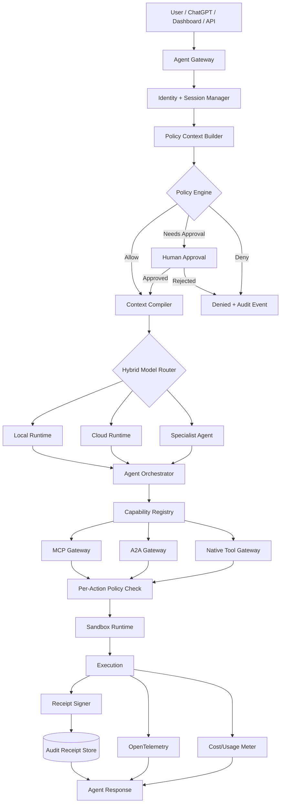

# Phase 20.54.1 — Pao-hubPro × Microsoft Agent Engineering Blueprint V2

## Hybrid Local/Cloud Agent Runtime, Production Evaluation Gates, Sandboxed Tool Execution, Cryptographically Verifiable Agent Audit & Policy-Governed MCP/A2A Operations

> **Document type:** Production-Oriented Implementation Blueprint
> **Phase:** 20.54.1 — **V2 sub-phase of Phase 20.54** (Pao-hubPro × Microsoft AI Agents for Beginners)
> **Parent Phase:** Phase 20.54 — Production Agent Engineering Blueprint, Agent Pattern Registry, MCP/A2A Interoperability, Context-Memory Architecture & Secure Multi-Agent Runtime
> **Project:** Pao-hubPro
> **Source of Truth:** `Phase 20.54.1 — Pao-hubPro × Microsoft Agent Engineering Blueprint V2.md`, processed under `PAO-HUBPRO_MASTER_PHASE_REQUEST.md`
> **Status:** Implementation Blueprint · **Priority:** Core Platform / Security / Reliability
> **Strategy:** Provider-neutral, local-first, policy-first, observable-by-default
> **Primary upstream reference:** Microsoft `ai-agents-for-beginners` (Lessons 11, 12, 13, 16, 17, 18)
> **Phase identity note:** 20.54.1 is the **approved production-hardening expansion of Phase 20.54** — do not create a duplicate top-level phase for the same Microsoft reference. Sub-decimal numbering preserved; no collision.
> **Filename/content consistency:** Filename and document header agree on Phase 20.54.1; no collision.

> **Core rule for this phase:**
> **No consequential agent action may bypass policy evaluation, sandbox enforcement, audit receipt generation, and telemetry.**

> **What receipts prove — and do not prove:** Cryptographic receipts prove **provenance/integrity/order** — not semantic correctness. A signature never implies that an action was correct or safe.

---

## 1. Executive Summary

Phase 20.54.1 upgrades the original Microsoft Agent Engineering Blueprint integration into a **production control plane** for Pao-hubPro.

The target is not to copy Microsoft Foundry as a product dependency. The target is to take the strongest engineering patterns demonstrated by the Microsoft course — scalable agent deployment, local agents, MCP, A2A, context engineering, memory, evaluation, human approval, observability, and cryptographic receipts — and implement them as **provider-neutral Pao-hubPro primitives**.

The new execution path:

```text
User / ChatGPT / Web App / API / Scheduled Job
                    ▼
             Pao Agent Gateway
                    ▼
          Identity + Session Context
                    ▼
               Policy Engine
          ┌─────────┴─────────┐
      auto-allow          approval gate
          └─────────┬─────────┘
                    ▼
             Context Compiler
                    ▼
         Hybrid Model Router
        ┌───────────┼────────────┐
        ▼           ▼            ▼
    Local SLM   Cloud LLM    Specialist Agent
                    ▼
            Agent Orchestrator
       ┌────────────┼──────────────┐
       ▼            ▼              ▼
      MCP           A2A          Native Tools
                    ▼
          Sandboxed Tool Runtime
                    ▼
         Cryptographic Receipt
                    ▼
         Audit + OTel + Cost Log
                    ▼
                Response
```

Without this phase, Pao-hubPro risks becoming a collection of powerful integrations with inconsistent security, auditability, routing, evaluation, and failure semantics. With this phase, **every agent, model, MCP server, A2A peer, browser worker, coding agent, local tool, and future capability can plug into the same control plane.**

---

## 2. Problem Statement

The original Phase 20.54 captured Microsoft agent patterns **conceptually**. Phase 20.54.1 turns those patterns into an **enforceable runtime architecture**.

The Microsoft reference now covers a broader production arc: scalable deployment and stateless agent services; model routing and response caching; offline evaluation gates before deployment; smoke testing after deployment; OpenTelemetry-based observability; human approval for high-risk actions; MCP as an external capability boundary; local SLM execution through an OpenAI-compatible endpoint; local RAG and local MCP; hybrid local/cloud routing; cryptographically signed, hash-chained receipts for agent actions.

Pao-hubPro already contains or plans many adjacent capabilities. **The missing piece is a single governed execution contract connecting them.**

---

## 3. Goals

1. **Hybrid Local/Cloud Agent Runtime** — model/runtime abstraction routing between local OpenAI-compatible endpoints, Foundry Local (if enabled), local Qwen or other tool-capable SLMs, OpenAI-compatible cloud providers, OpenAI, Claude/Anthropic-compatible adapters, and future providers through a provider registry. Routing must consider: sensitivity; task difficulty; tool-calling requirements; context size; latency target; cost budget; provider health; user policy; offline mode; required capabilities.
2. **Production Evaluation Gates** — before any new agent version, prompt pack, model route, policy, tool schema, MCP server, or orchestration graph is promoted: static validation; unit tests; offline evaluation; policy tests; tool-contract tests; sandbox tests; receipt verification tests; deployment smoke tests; optional canary evaluation; online regression monitoring.
3. **Sandboxed Tool Execution** — all side-effecting tools (shell commands; filesystem writes; Git operations; browser actions; deployment commands; database mutations; external API writes; MCP tools; A2A delegated operations; code execution) execute inside controlled boundaries enforcing: workspace boundaries; command allow/deny policy; environment isolation; resource limits; timeout; output limits; secret isolation; network policy; human approval where required.
4. **Cryptographically Verifiable Agent Audit** — every consequential action emits a signed receipt containing: which agent initiated the action; which policy decision authorized it; which tool was called; hashes of arguments and results; timestamp; sequence number; previous receipt hash; execution identity; runtime/session correlation IDs; signature metadata. Crypto profile: **RFC 8785 JSON Canonicalization + SHA-256 + Ed25519/EdDSA + chain linking + offline-capable verification**.
5. **Policy-Governed MCP/A2A** — MCP and A2A must not become unrestricted bypass paths; every discovered/registered capability maps into the Pao policy model.

---

## 4. Non-Goals

This phase must **not**:

- force Microsoft Foundry as the only runtime; force Qwen as the only local model;
- replace all existing Pao-hubPro components;
- give agents unrestricted shell or filesystem access;
- assume MCP servers are trusted; assume A2A peers are trusted;
- store model/provider secrets in prompts;
- log raw sensitive tool arguments by default;
- let evaluation be optional for production promotion;
- let a signature imply that an action was correct or safe.

**Cryptographic receipts prove provenance/integrity/order — not semantic correctness.**

---

## 5. Why This Phase Exists — Design Principles (P1–P8)

**P1 — Provider Neutrality.** All model-specific behavior sits behind adapters:

```text
Agent Runtime → Model Provider Interface
  ├── OpenAI ├── Anthropic ├── Local OAI └── Foundry Local
```

**P2 — Local First, Cloud When Valuable.** Prefer local execution when: data is sensitive; the user requests local-only; the task is bounded; tool routing is simple; the cloud is unavailable; local cost/latency is advantageous. Use cloud models when: deep multi-hop reasoning is needed; large-context reasoning is required; a specialist cloud capability is necessary; the data policy permits it.

**P3 — Policy Before Execution.** No side-effecting capability executes before a policy decision.

**P4 — Least Privilege.** Agents receive the smallest capability set necessary for the current task.

**P5 — Context Is Compiled, Not Dumped.** Do not blindly place entire project history into every prompt; context must be selected, compressed, isolated, and traceable.

**P6 — Everything Consequential Is Observable.** Model calls, tool calls, A2A delegations, MCP actions, approvals, policy decisions, errors, retries, and cost events must produce telemetry.

**P7 — Production Changes Must Pass Gates.** No "it worked once" deployments.

**P8 — Audit Data Must Be Tamper-Evident.** Operational logs remain useful, but consequential actions additionally produce signed hash-chained receipts.

---

## 6. Relationship to Pao-hubPro

### Layer mapping (Pao-hubPro core layers)

| Layer | Role in this phase |
|---|---|
| 02 AI / Agent Layer | Governed agents running the operating contract. |
| 03 Intent & Context Layer | Context Compiler (primary owner). |
| 05 MCP Gateway | Policy-governed MCP boundary (T0–T4 trust). |
| 06 Capability Registry | Normalized capability descriptors (Native/MCP/A2A/Browser/Workflow). |
| 07 Policy Engine | **Primary owner** — R0–R4 decisions. |
| 08 Approval Engine | First-class runtime primitive; argument-hash binding. |
| 09–10 Execution Runtime | Sandboxed tool runtime (11 profiles). |
| 12 State / Session Layer | Tasks/sessions/approvals/policies (operational DB). |
| 13 Memory / Knowledge Layer | 6 memory types; policy-checked writes. |
| 14 Secrets & Credential Layer | Secret injection broker; scoped credentials. |
| 15 Event / Queue Layer | Async jobs; events. |
| 16 Observability Layer | OTel spans (primary owner). |
| 17 Audit Layer | **Primary owner** — signed hash-chained receipts. |
| 19 Web Dashboard | Governed Agent Runtime area. |
| 20 External Provider Layer | Model providers (local/cloud). |

### Integration with existing Pao-hubPro directions (shared foundation, not a competitor)

```text
AI Reviewer Council            → uses A2A + model router + eval + receipts
Local Coding Agents            → use local runtime + sandbox + policy
Browser / WebMCP Agents        → use browser sandbox + approval + receipts
Repository Intelligence        → feeds Context Compiler
Persistent Context / Memory    → feed Memory + Context Compiler
Multi-Provider Gateways        → feed Hybrid Model Router
FinOps / Credit Control        → feed Budget Guardrails
Agent Fleet / Session Orchestration → runs above governed runtime
```

---

## 7. Upstream / External Project

### Upstream identity

Microsoft `ai-agents-for-beginners` — https://github.com/microsoft/ai-agents-for-beginners — used as **engineering reference patterns only** (not a runtime dependency; no vendor lock-in; do not blindly copy Foundry architecture). Relevant lessons:

| Lesson | Topic | URL path |
|---|---|---|
| 11 | Agentic protocols — MCP, A2A, NLWeb | `11-agentic-protocols` |
| 12 | Context Engineering | `12-context-engineering` |
| 13 | Agent Memory | `13-agent-memory` |
| 16 | Deploying Scalable Agents | `16-deploying-scalable-agents` |
| 17 | Creating Local AI Agents | `17-creating-local-ai-agents` |
| 18 | Securing AI Agents with Cryptographic Receipts | `18-securing-ai-agents` |

Plus course changelog for drift tracking.

### Separation of concerns

| Part | Owner | Notes |
|---|---|---|
| A. Upstream reference | Microsoft course material | Patterns only — no code copied as dependency. |
| B. Pao-hubPro adapter | Provider registry + ModelProvider interface | OpenAI/Anthropic/local-OAI/Foundry Local adapters. |
| C. Pao-hubPro policy wrapper | Policy Engine, Approval, sandbox, receipts, OTel | All governance lives here. |
| D. Pao-hubPro extensions | Context Compiler, Capability Registry, MCP/A2A gateways, Evaluation Gates, CLI | Built in this phase. |

### Risk assessment

- **License:** Microsoft course material is reference-only (MIT-typical for the repo — [Needs Verification] before reproducing content).
- **Maintenance:** course evolves; changelog tracked; patterns re-verified per release.
- **Dependency risk:** **zero runtime dependency** — patterns implemented as Pao primitives.
- **Security surface:** the whole point of this phase — the governed execution contract closes the gap between integrations.
- **Vendor lock-in:** none — provider neutrality is principle P1.

---

## 8. Current-State Assumptions

- **[Needs Verification] Repository discovery before changes:** inspect current project structure, runtime, provider integrations, MCP code, tool system, auth, database, tests, dashboard; identify reusable modules; produce `docs/phase-20.54.1/ARCHITECTURE_GAP.md` before large changes — record what already exists and what will be added.
- **[Assumption] Local model availability:** an OpenAI-compatible local endpoint (Qwen-class SLM or Foundry Local) exists or can be started; `local_only` enforcement is technical, never prompt-based.
- **[Assumption] Crypto stack:** mature Ed25519 implementation + RFC 8785 JCS library available (recommendation table, Section 34).
- **[Assumption] Incremental migration:** do not rewrite Pao-hubPro in one pass — 10-step shadow-mode migration (Section 34).

---

## 9. Target Architecture



---

## 10. Architecture Diagram

See Section 9 (mermaid). Complementary store separation:

```text
Operational DB   → tasks / sessions / approvals / policies
Memory Store     → working / episodic / project memory
Vector/RAG Store → embeddings + retrieval indexes
Receipt Store    → signed immutable-ish records (≠ mutable application logs!)
Telemetry Backend→ traces / metrics / logs
Artifact Store   → large outputs / patches / reports
```

---

## 11. Core Components

| # | Component | Purpose |
|---|---|---|
| 1 | Agent Gateway | Authn; request/session/trace IDs; workspace resolution; policy pack resolution; task normalization; REST/WS interfaces. |
| 2 | Policy Engine | Authoritative R0–R4 decisions; decision envelope with constraints. |
| 3 | Human Approval Service | First-class runtime primitive; argument-hash binding. |
| 4 | Context Compiler | Right-context-for-next-decision; 8-step pipeline; provenance metadata. |
| 5 | Hybrid Model Router | 11 routing inputs; 6-step sequence; provider registry. |
| 6 | Local Agent Runtime | OpenAI-compatible local path; no implicit cloud fallback on `local_only=true`. |
| 7 | Capability Registry | Normalized Native/MCP/A2A/Browser/Workflow descriptors (versioned). |
| 8 | MCP Gateway | T0–T4 trust levels; 12 mandatory controls. |
| 9 | A2A Gateway | Scoped delegation; no privilege inheritance. |
| 10 | Sandboxed Tool Runtime | 11 sandbox profiles; file/shell/browser isolation. |
| 11 | Receipt Signer + Store | RFC 8785 + SHA-256 + Ed25519 + hash chain; offline verification. |
| 12 | Evaluation Gates (0–5) | Release gates blocking promotion. |
| 13 | Observability + Budgets | 14 OTel spans; WARN/DEGRADE/PAUSE/STOP budgets. |
| 14 | Dashboard | Runtime overview, task trace, receipt inspector, evaluation center. |

---

## 12. Component Responsibilities

### 12.1 Agent Gateway

Responsibilities: authenticate caller; assign `request_id`, `session_id`, `trace_id`; resolve workspace/project; resolve active policy pack; normalize incoming task format; forward to context and policy layers; expose REST/WebSocket/internal interfaces.

```text
POST /v1/tasks          GET  /v1/tasks/{task_id}
POST /v1/tasks/{task_id}/approve
POST /v1/tasks/{task_id}/cancel
GET  /v1/tasks/{task_id}/trace
GET  /v1/tasks/{task_id}/receipts
POST /v1/receipts/verify
```

### 12.2 Policy Engine (authoritative for execution decisions)

Risk classes:

```text
R0 — Read-only / observation
R1 — Low-risk reversible write
R2 — Controlled mutation
R3 — High-impact or external side effect
R4 — Restricted / prohibited
```

Example mapping:

| Capability | Default risk | Default action |
|---|---:|---|
| Read project file | R0 | Auto allow within workspace |
| Semantic search | R0 | Auto allow |
| Create temporary file | R1 | Auto allow in sandbox |
| Modify source file | R2 | Allow with scoped write policy |
| Git commit | R2 | Policy-dependent |
| Git push | R3 | Human approval by default |
| Deploy production | R3 | Human approval required |
| Delete repository | R4 | Deny unless explicit break-glass policy |
| Arbitrary host shell | R4 | Deny by default |

**Policy decision envelope:**

```json
{
  "decision_id": "pol_dec_...",
  "action": "allow",
  "risk": "R2",
  "policy_id": "pao-default-v1",
  "capability": "filesystem.write",
  "scope": {"workspace": "...", "path": "src/**"},
  "constraints": {"timeout_ms": 30000, "network": "deny", "max_output_bytes": 1048576},
  "approval_required": false
}
```

### 12.3 Context Compiler

> Give the agent the **right context for the next decision**, not all available context.

Context classes (13): system/policy instructions; task instructions; workspace/project metadata; relevant source code; relevant documentation; relevant Phase specifications; tool definitions; MCP capability descriptions; A2A agent capabilities; recent conversation state; working memory; long-term project memory; prior execution outcomes; budget/latency constraints.

Pipeline:

```text
Candidate Context → Relevance Selection → Security Classification
→ Deduplication → Compression/Summarization → Conflict Detection
→ Token Budget Allocation → Context Pack
```

Provenance metadata (every injected block):

```json
{"source_id": "...", "source_type": "file|memory|tool|phase|rag|conversation",
 "content_hash": "sha256:...", "sensitivity": "internal",
 "retrieved_at": "...", "expires_at": null}
```

### 12.4 Hybrid Model Router

**Routing inputs (11):** `sensitivity_score; reasoning_complexity; tool_calling_required; vision_required; context_tokens_required; latency_target_ms; max_cost; provider_health; offline_mode; policy_allowed_providers; model_eval_score`.

**Routing sequence (deterministic):**

```text
1. Does policy force local-only?          yes → local
2. Is internet/cloud unavailable?         yes → local fallback
3. Is task sensitive?                     yes → local unless policy explicitly allows approved cloud
4. Is task bounded/simple + local eval profile supports?  yes → local
5. Does task require specialist capability?               yes → approved specialist
6. Otherwise → best cloud model under budget and evaluation threshold
```

**Provider interface:**

```python
class ModelProvider:
    async def health(self): ...
    async def capabilities(self): ...
    async def generate(self, request): ...
    async def stream(self, request): ...
    async def estimate_cost(self, request): ...
```

**Provider registry example:**

```yaml
providers:
  local_qwen:     {type: openai_compatible, base_url: "http://127.0.0.1:PORT/v1", local: true, capabilities: [text, tools]}
  foundry_local:  {type: foundry_local, local: true, capabilities: [text, tools]}
  openai_primary: {type: openai, local: false, capabilities: [text, tools, vision]}
  claude_primary: {type: anthropic, local: false, capabilities: [text, tools, vision]}
```

### 12.5 Local Agent Runtime

Follows the practical pattern from Microsoft Lesson 17: **let the SLM orchestrate bounded tasks and let tools perform the heavy lifting.**

Good local workloads: classification; extraction; summarization of known documents; tool selection; structured metadata generation; local code navigation; documentation search; policy pre-classification; low-cost agent loops.

Cloud escalation candidates: architecture reasoning; deep debugging; large cross-repository reasoning; long-horizon planning; difficult multimodal reasoning.

Local runtime requirements: OpenAI-compatible adapter first; configurable base URL/model; function/tool-calling compatibility checks; local health probe; model warm-up support; fallback policies; local-only RAG option; local MCP support; **no implicit cloud fallback when `local_only=true`**.

### 12.6 Capability Registry + descriptor

```text
Capability
├── Native Tool        ├── MCP Tool        ├── MCP Resource
├── MCP Prompt         ├── A2A Agent Skill ├── Browser Action
├── Workflow           └── Internal Service
```

```json
{
  "capability_id": "mcp.git.commit",
  "source": "mcp", "server_id": "git-local", "name": "commit",
  "description": "Create a local Git commit",
  "risk": "R2", "side_effect": true,
  "scopes": ["workspace.git"], "requires_approval": false,
  "sandbox_profile": "git-workspace",
  "input_schema_hash": "sha256:...", "version": "1.0.0"
}
```

All capability descriptors **versioned**.

### 12.7 MCP Gateway (external capability boundary — never trusted by default)

**Mandatory controls (12):** server allowlist/registry; pinned server version where feasible; server identity; capability snapshot/hash; input schema validation; output validation; timeout; rate limit; scoped secrets; scoped filesystem/network permissions; audit events; policy binding; optional sandbox isolation.

**MCP trust levels:** `T0 Unknown · T1 Registered/unverified · T2 Verified local · T3 Verified organization-managed · T4 High-trust internal` — **trust level influences policy but never bypasses policy.**

### 12.8 A2A Gateway

The gateway must record: remote/local agent identity; agent card hash; advertised skills; selected skill; delegated scope; task input hash; returned result hash; policy decision; correlation IDs; timeout/retry; receipt linkage.

**Delegation contract:**

```json
{
  "delegation_id": "dlg_...",
  "parent_task_id": "task_...",
  "from_agent": "pao-orchestrator",
  "to_agent": "code-reviewer",
  "skill": "review_patch",
  "allowed_actions": ["read", "analyze"],
  "forbidden_actions": ["write", "shell", "network"],
  "deadline": "...",
  "budget": {"max_tokens": 12000, "max_cost": 0.25}
}
```

**A delegated agent must never inherit all caller privileges automatically.**

### 12.9 Sandboxed Tool Runtime

**Execution model:**

```text
Tool Request → Schema Validation → Policy Check → Sandbox Profile Selection
→ Secret Injection Broker → Isolated Execution → Output Validation → Receipt + Telemetry
```

**Sandbox profiles (11):** `read-only-workspace · write-workspace · code-exec-no-network · code-exec-network-limited · git-local · git-remote-approved · browser-readonly · browser-transaction-approved · comfyui-local · api-readonly · api-write-approved`

**File sandbox requirements:** canonicalize path before authorization; block `..` traversal; block symlink escape; workspace allowlist; optional file extension policy; write staging before replace; backup/rollback for mutable project files; maximum file size; hash before and after mutation.

**Shell sandbox requirements:** deny host shell by default; command allowlist/structured command definitions preferred; no shell interpolation when avoidable; working-directory confinement; CPU/memory/time limits; output byte limit; environment allowlist; network disabled unless profile permits; secret redaction; **kill process tree on timeout**.

**Browser sandbox — separate:** observe actions; navigation; form filling; authenticated state use; submission; purchase/payment; account mutation; destructive actions. **Submitting consequential forms must require policy approval according to risk class.**

### 12.10 Human Approval Service (first-class runtime primitive, not a UI hack)

```json
{
  "approval_id": "apr_...", "task_id": "task_...", "agent_id": "...",
  "capability": "git.push", "risk": "R3",
  "summary": "Push 3 commits to origin/main",
  "proposed_args_hash": "sha256:...",
  "expires_at": "...", "policy_id": "..."
}
```

**The approval must bind to the exact proposed action hash. If arguments change after approval, approval becomes invalid.**

### 12.11 Production Evaluation Gates (Gate 0–5)

| Gate | Content |
|---|---|
| **Gate 0 — Static Validation** | configuration schema; tool schemas; provider configuration; policy references; prompt/template syntax; agent graph cycles; missing capability bindings |
| **Gate 1 — Unit/Contract Tests** | tool adapters; MCP clients; A2A envelopes; router decisions; policy outcomes; receipt generation; chain verification |
| **Gate 2 — Offline Agent Evaluation** | dataset contains: normal tasks; edge cases; refusal cases; policy violations; prompt injection attempts; ambiguous tool calls; local-vs-cloud routing cases; MCP failures; A2A failures; context poisoning cases. Metrics: task success rate; groundedness; tool selection accuracy; tool argument validity; policy violation rate; unauthorized action rate; approval trigger precision/recall; routing accuracy; cost per successful task; latency p50/p95; receipt verification rate |
| **Gate 3 — Security Tests** | path traversal; symlink escape; command injection; prompt injection from tool output; malicious MCP output; privilege escalation attempt; secret exfiltration attempt; approval replay; receipt tampering; receipt reordering/removal; malformed A2A Agent Card; forged agent identity |
| **Gate 4 — Deployment Smoke Test** | endpoint reachable; health response; local provider path; cloud provider path where enabled; one read-only tool call; policy engine reachable; receipt generated; receipt verifies; OTel trace emitted |
| **Gate 5 — Canary/Online Evaluation** | route small percentage to new version; compare quality/cost/latency; monitor policy denial spikes; monitor error rates; rollback on threshold breach |

**Evaluation manifest:**

```yaml
suite: pao-agent-core-v1
release_gate:
  min_task_success: 0.90
  max_policy_violation_rate: 0.00
  min_receipt_verification_rate: 1.00
  max_p95_latency_ms: 15000
routing: {min_accuracy: 0.90}
security: {unauthorized_action_tolerance: 0, secret_exfiltration_tolerance: 0}
smoke:
  required: [gateway_health, policy_health, local_runtime, receipt_sign_verify, telemetry_emit]
```

### 12.12 Memory integration

Memory is not one database — 6 types: Working Memory (current task state) · Session Memory (active interaction history) · Project Memory (stable decisions) · Episodic Memory (previous executions/outcomes) · Entity Memory (agents, tools, repos, providers) · Knowledge Memory (RAG/graph/docs).

**Memory writes should pass policy checks — memory poisoning is a real attack surface.** Every persistent memory item supports: source; confidence; timestamp; expiration; sensitivity; provenance hash; owner/workspace; superseded-by relationship.

---

## 13. Data Flow

**Execution path:** see Section 1 diagram. **Receipt flow:** `Execution → remove signature field → RFC 8785 canonical JSON → Ed25519 sign canonical bytes → chain via previous_receipt_hash → Receipt Store`. **Context flow:** candidate → 8-step pipeline → context pack with provenance. **Approval flow:** tool proposal (normalized args hash) → approval bound to hash → execute → receipt links approval_id.

---

## 14. Control Flow

Policy Engine decisions: **allow / deny / approval-required** (+ constraints envelope). All capability paths (Native/MCP/A2A) call the **same policy API** with per-action checks.

### Risk classification (R0–R4 — native to this phase)

See Section 12.2 mapping table. R3 ⇒ human approval by default; R4 ⇒ deny unless explicit break-glass policy.

### Critical Safety Invariants (must be encoded in tests)

```text
INVARIANT 1  No side effect without a policy decision.
INVARIANT 2  No R3 action without a valid approval when policy requires one.
INVARIANT 3  Approval is invalid if normalized action arguments change.
INVARIANT 4  No local-only request may invoke a cloud provider.
INVARIANT 5  No unregistered MCP/A2A capability receives privileged access by default.
INVARIANT 6  No sandboxed process may escape its authorized workspace.
INVARIANT 7  No consequential successful action may finish without a valid signed receipt.
INVARIANT 8  No candidate release reaches production if mandatory evaluation gates fail.
INVARIANT 9  No private signing key or provider secret may enter model context or telemetry.
```

---

## 15. Agent / Worker Model

**Terminology (strictly separated):**

| Term | Definition |
|---|---|
| Agent | Governed runtime entity with descriptor + version. |
| Task | Unit of work (`task_id`) with constraints/budget; lifecycle tracked. |
| Turn | One model/agent interaction within a task. |
| Session | Identity + context scope binding a conversation. |
| Tool | A capability (Native/MCP/A2A/Browser/Workflow) executed via sandbox. |
| Capability | Versioned descriptor in the registry. |
| Receipt | Signed hash-chained audit record. |
| Delegation | Scoped A2A sub-task (never inherits caller privileges). |

**Budget contract (per task):**

```json
{"budget": {"max_cost_usd": 1.00, "max_model_calls": 12,
            "max_tool_calls": 40, "max_runtime_seconds": 600}}
```

Budget responses: `WARN` nearing limit → `DEGRADE` route to cheaper/local model → `PAUSE` request approval for more budget → `STOP` hard budget exceeded. (Later integrates with Pao AI FinOps phases.)

---

## 16. Session / State Model

- **Task lifecycle:** `submitted → policy_evaluated → (approval_pending) → executing → receipts_emitted → completed | denied | failed | cancelled` — persisted in Operational DB with trace linkage.
- **Approval lifecycle:** `pending → approved | denied | expired`; bound to `proposed_args_hash`; argument change ⇒ invalid (Invariant 3).
- **Memory lifecycle:** items carry source/confidence/timestamp/expiration/sensitivity/provenance hash/owner/superseded-by.
- **Data stores separated** (Section 10) — receipt store is **not** mutable application logs.

---

## 17. MCP Integration

See Section 12.7 — MCP as external capability boundary with T0–T4 trust levels (influence policy, never bypass), 12 mandatory controls, capability snapshot/hashing, and the same policy API as native tools. Unregistered MCP servers must not receive privileged execution automatically (`mcp.unregistered_servers: deny`).

---

## 18. Capability Registry

See Section 12.6 — 8 capability kinds, versioned descriptors with risk/side_effect/scopes/sandbox_profile/schema hash. The registry is the single normalization point where MCP/A2A/native/browser/workflow capabilities become policy-checkable objects.

---

## 19. Policy Model

R0–R4 classes + decision envelope (Section 12.2); risk-based sandbox profile selection; `local_only` enforced technically (Invariant 4); MCP/A2A unregistered ⇒ deny by default; policy packs versioned (`pao-default-v1`); per-action policy checks for every capability path; policy tests are Gate 1 content; policy failures fail closed.

Configuration example:

```yaml
runtime:  {local_first: true, offline_fallback: true, default_policy: pao-default-v1}
router:   {strategy: policy_then_complexity_then_cost, local_complexity_threshold: 0.45, cloud_allowed: true}
sandbox:  {default_profile: read-only-workspace, host_shell: deny, network_default: deny}
receipts: {enabled: true, required_for_side_effects: true, canonicalization: rfc8785, hash: sha256, signature: ed25519, chain: true}
approval: {default_required_risk: [R3, R4]}
mcp:      {unregistered_servers: deny, validate_outputs: true}
A2A:      {unregistered_agents: deny, privilege_inheritance: false}
evaluation: {release_gate: true, smoke_test_after_deploy: true}
telemetry: {otel: true, redact_sensitive_attributes: true}
```

---

## 20. Security Model

### Threat model (T1–T7)

| Threat | Sources/Scenario | Mitigations |
|---|---|---|
| **T1 Prompt Injection** | web pages; documents; MCP output; tool output; A2A result; repository content | treat retrieved content as untrusted data; isolate instructions from data; restrict tool privileges; re-check policy at action time |
| **T2 Tool Injection / Argument Manipulation** | manipulated tool args | schema validation; policy on normalized arguments; approval bound to argument hash |
| **T3 Secret Exfiltration** | model/tool output | secret broker; tool-scoped credentials; no raw secret in model context; output redaction; egress restrictions |
| **T4 Malicious MCP Server** | rogue/broken server | untrusted boundary; allowlist; version pinning; sandbox; output validation; network restrictions |
| **T5 Malicious/Compromised A2A Agent** | rogue peer | trust registry; scoped delegation; result validation; never inherit caller privilege by default |
| **T6 Audit Tampering** | log modification | Ed25519 signatures; canonical JSON; hash chaining; append-oriented storage; external/offline verification |
| **T7 Local Privilege Escape** | sandbox breakout | sandbox/container boundary; project-scoped mounts; no host root; resource limits; deny dangerous syscalls where practical |

---

## 21. Approval Model

### R0–R4 summary

Native to this phase (Section 12.2). R3/R4 require approval per policy; approval binds to normalized action hash; expiry supported; **argument change invalidates approval** (Invariant 3 — test-proven).

### Approval API

```json
POST /v1/tasks/{task_id}/approve
{"approval_id": "apr_123", "approved_action_hash": "sha256:...", "decision": "approve"}
```

Approval is a **first-class runtime primitive** — the policy engine pauses execution (`approval_pending`), the gateway exposes approve/deny endpoints, and receipts link `approval_id` for the full chain.

---

## 22. Failure Handling

| Failure | Handling |
|---|---|
| **Provider failure** | retry policy → fallback provider allowed? yes → fallback route; no → fail safely |
| **Cloud outage** | use local model where capability/evaluation profile permits — **degrade in quality rather than lose control** |
| **MCP failure** | timeout; circuit breaker; mark capability unhealthy; **never hallucinate successful execution**; expose structured failure to orchestrator |
| **A2A failure** | preserve parent task; enforce retry budget; **do not expand delegated privileges on retry**; record delegation failure receipt/event |
| **Sandbox crash** | kill execution tree; retain logs safely; mark action incomplete; **do not sign a misleading success receipt** |
| **Approval unavailable** | fail closed for consequential actions |
| **Policy engine down** | fail closed for side effects |

**Deterministic tests preferred over model-judge tests; never fabricate a successful tool execution; fail explicitly when a required capability is unavailable.**

---

## 23. Recovery Model

- **Task recovery:** tasks/sessions persisted in Operational DB; trace linkage end-to-end; resumable per execution model.
- **Receipt recovery:** append-oriented receipt store; chain verification detects removal/reordering; public-key history retained for verification; revoke/retire metadata supported.
- **Provider recovery:** health probes + fallback routes; local-first keeps the system running through cloud outages.
- **Migration recovery:** 10-step incremental migration with shadow mode — compare old/new execution behavior before enforcement (Section 34); reversible; feature flags for enforcement steps.
- **Key recovery:** rotation support; public-key history retained; revoke/retire metadata; private keys never in source control.

---

## 24. Observability

### OTel spans (14)

```text
pao.request · pao.context.compile · pao.policy.evaluate · pao.model.route
pao.model.call · pao.agent.run · pao.mcp.call · pao.a2a.delegate
pao.tool.execute · pao.sandbox.start · pao.approval.wait · pao.receipt.sign
pao.memory.read · pao.memory.write
```

### Attributes (20)

```text
agent.id · agent.version · model.provider · model.name · model.route_reason
policy.id · policy.decision · risk.class · capability.id · mcp.server_id
a2a.agent_id · sandbox.profile · tool.duration_ms
usage.input_tokens · usage.output_tokens · usage.cost
receipt.id · error.type
```

**Never attach secrets or sensitive raw payloads as span attributes** (`telemetry.redact_sensitive_attributes: true`).

### Recommended success metrics

```text
100% consequential tool calls with policy decision
100% consequential successful tool calls with valid receipt
0 unauthorized side effects in security suite
0 cloud calls in local_only tests
100% high-risk actions correctly gated
>= 90% expected routing accuracy on eval dataset
>= configured task-success threshold
< target p95 policy overhead · < target p95 receipt-signing overhead
100% production candidate releases evaluated · 100% deployed versions smoke tested
```

---

## 25. Audit

**Cryptographic Agent Receipts — the most important V2 addition.** Operational logs answer *"What does the system claim happened?"*; signed receipts additionally answer *"Can we verify that this recorded action has not been silently altered?"*

**Receipt schema (`pao.agent.action.v1`):**

```json
{
  "type": "pao.agent.action.v1",
  "receipt_id": "rcpt_...",
  "task_id": "task_...", "trace_id": "trace_...", "session_id": "session_...",
  "agent_id": "agent_...", "agent_version": "...",
  "action_type": "tool_call",
  "capability_id": "filesystem.write",
  "tool_name": "write_file", "tool_version": "1.2.0",
  "args_hash": "sha256:...", "result_hash": "sha256:...",
  "policy_id": "pao-default-v1", "policy_decision_id": "pol_dec_...",
  "approval_id": null,
  "sandbox_profile": "write-workspace",
  "execution_environment_hash": "sha256:...",
  "timestamp": "2026-09-15T00:00:00Z",
  "sequence": 42,
  "previous_receipt_hash": "sha256:...",
  "signature": {"alg": "EdDSA", "key_id": "pao-agent-signing-2026-01", "sig": "base64url..."}
}
```

**Privacy rule:** do not automatically put raw secrets, prompts, file contents, or API payloads into receipts — prefer hashes and stable metadata; raw evidence, if required, lives in a separately protected evidence store with retention policy.

**Canonicalization:** `receipt payload → remove signature field → RFC 8785 canonical JSON → Ed25519 sign canonical bytes`.

**Hash chain:** `Receipt 0 → hash → Receipt 1.previous_receipt_hash → …` — deleting or reordering an intermediate receipt must fail chain verification.

**Key management:** development — local test key allowed, clearly marked non-production, never committed; production — OS-protected keystore/hardware-backed keystore/Vault/cloud KMS where available; key IDs instead of embedding private material; rotation support; public-key history retained; revoke/retire metadata.

**Receipt Verification CLI:**

```bash
pao receipts verify receipt.json
pao receipts verify-chain receipts/
pao receipts inspect receipt.json
pao receipts export --task task_123
```

```text
Signature     PASS
Payload hash  PASS
Chain link    PASS
Policy link   PASS
Sequence      PASS
Key status    VALID
Overall       VERIFIED
```

---

## 26. Data Model

Separated stores (Section 10): Operational DB · Memory Store · Vector/RAG Store · **Receipt Store** (signed, append-oriented, distinct from mutable logs) · Telemetry Backend · Artifact Store. Key entities: TaskRequest/TaskResult; AgentDescriptor; ModelProvider; ModelCapabilities; CapabilityDescriptor; PolicyDecision; ApprovalRequest; SandboxProfile; ActionReceipt; EvaluationManifest — all versioned contracts (workstream A).

---

## 27. API / Event Contracts

### 27.1 Agent Gateway endpoints

```text
POST /v1/tasks          GET  /v1/tasks/{task_id}
POST /v1/tasks/{task_id}/approve       POST /v1/tasks/{task_id}/cancel
GET  /v1/tasks/{task_id}/trace         GET  /v1/tasks/{task_id}/receipts
POST /v1/receipts/verify
```

### 27.2 Contracts

```json
POST /v1/tasks
{"instruction": "Review this repository and propose a safe patch",
 "workspace_id": "ws_123", "mode": "auto",
 "constraints": {"local_only": false, "max_cost_usd": 0.50, "allow_write": false}}
```

```json
{"tool_call_id": "tc_123", "capability_id": "git.commit", "arguments": {},
 "normalized_args_hash": "sha256:...", "risk": "R2", "policy_decision": "allow"}
```

OTel spans/attributes per Section 24; audit per Section 25.

---

## 28. Configuration

See Section 19 YAML. **Recommended initial technology choices (recommendations, not hard dependencies):**

| Concern | Starting point |
|---|---|
| API/runtime | Existing Pao-hubPro backend; FastAPI if Python service is needed |
| Schemas | Pydantic / JSON Schema |
| Local model API | OpenAI-compatible adapter |
| Local model runtime | Existing local stack; optional Foundry Local adapter |
| MCP | Official/compatible MCP SDK |
| A2A | Protocol-compatible adapter + Agent Card registry |
| Sandbox | Container/process isolation appropriate to host OS |
| Policy | Declarative YAML/JSON rules first; evolve to dedicated engine if needed |
| Crypto | Mature Ed25519 implementation + RFC 8785 JCS library |
| Telemetry | OpenTelemetry |
| Eval | Dataset + deterministic assertions + model-judge only where necessary |
| Storage | Existing DB + separate receipt/evidence abstraction |

---

## 29. Feature Flags

| Flag / config | Default | Gates |
|---|---|---|
| `runtime.local_first` | `true` | Local-first routing |
| `runtime.offline_fallback` | `true` | Cloud-outage degradation |
| `router.cloud_allowed` | `true` | Cloud routing (policy may restrict) |
| `sandbox.host_shell` | `deny` | Host shell (R4) |
| `sandbox.network_default` | `deny` | Sandbox egress |
| `receipts.enabled` | `true` | Receipt generation |
| `receipts.required_for_side_effects` | enforce after shadow mode | Invariant 7 |
| `approval.default_required_risk` | `[R3, R4]` | Approval gating |
| `mcp.unregistered_servers` | `deny` | Invariant 5 |
| `A2A.unregistered_agents` / `privilege_inheritance` | `deny` / `false` | Invariant 5 / delegation |
| `evaluation.release_gate` | `true` | Invariant 8 |
| Migration step flags | per step | Shadow-mode rollout (Section 34) |

---

## 30. Repository / Module Structure

Do not force this exact structure if the current repository already has equivalent modules — reuse and migrate incrementally:

```text
pao-hubpro/
├── apps/{api, dashboard}
├── core/{gateway, identity, context, policy, routing, orchestration, memory, evaluation}
├── providers/{openai, anthropic, openai_compatible, foundry_local}
├── capabilities/{registry, native, mcp, a2a}
├── runtime/{sandbox, approvals, receipts, telemetry, budgets}
├── security/{secrets, keys, validation}
├── evals/{datasets, suites, smoke, reports}
├── policies/{default.yaml, schemas}
├── tests/{unit, integration, security, e2e}
└── docs/phase-20.54.1/
```

---

## 31. Dashboard Integration

Add a **Governed Agent Runtime** area:

- **Runtime Overview:** active tasks; model routes; local/cloud ratio; tool calls; MCP health; A2A peers; pending approvals; policy denials; cost; p95 latency.
- **Task Trace timeline:** `Request → Policy → Context → Model Route → Agent Reasoning Event → Tool Proposal → Approval → Sandbox → Tool Result → Receipt → Final Response` — **do not expose hidden model chain-of-thought; display structured action/reason summaries only.**
- **Receipt Inspector:** signature status; chain status; agent; tool; policy; hashes; timestamp; key ID; verification result.
- **Evaluation Center:** current production version; candidate version; pass/fail gates; regressions; routing accuracy; policy failures; cost difference; latency difference.

---

## 32. Dependencies

### Required

- **Pao-hubPro existing backend** (API, DB, auth, config, telemetry conventions) — this phase is a foundation layer, not a replacement.
- **Mature Ed25519 + RFC 8785 JCS library** for receipts.
- **An OpenAI-compatible local endpoint** (existing local stack; optional Foundry Local adapter).

### Recommended

- **Official/compatible MCP SDK**; A2A protocol adapter + Agent Card registry.
- **Existing model/provider gateways** feeding the Hybrid Router; **FinOps phases** feeding budget guardrails; **memory/context systems** feeding the Context Compiler; **repository intelligence (Graft/Litho)** as context sources; **Reviewer Council** via A2A + receipts; **Agent Fleet (20.71)** running above this governed runtime.

### Optional

- Foundry Local adapter; container-isolation sandbox per host OS; canary evaluation infrastructure.

**Do not assume other phases are implemented.** Standalone path: the first implementation slice (Section 38) — core contracts + policy engine + capability registry + sandboxed read/write tool + receipts + verification + tests — works with a single local model and one workspace, before any cloud provider, MCP server, or A2A peer exists.

---

## 33. Compatibility

- **Vendor neutrality:** no Foundry lock-in; no Qwen lock-in; Microsoft material = reference patterns only
- **Receipt compatibility:** schema versioned (`pao.agent.action.v1`); key rotation with public-key history; offline verification across versions
- **Backward compatibility:** incremental 10-step migration; existing modules wrapped, not rewritten; backward compatibility maintained unless a change is required for security
- **Upstream drift:** course changelog tracked; patterns re-verified per course release
- **Invariant compatibility:** all 9 invariants encoded in tests — regressing any invariant fails CI

---

## 34. Migration

**Do not rewrite Pao-hubPro in one pass — incremental migration (10 steps):**

```text
Step 1  Add contracts/interfaces           Step 6  Add receipt generation in shadow mode
Step 2  Wrap existing providers            Step 7  Verify receipts but do not gate
Step 3  Route existing tools through capability registry
Step 4  Insert policy middleware           Step 8  Turn receipt requirement on for side effects
Step 5  Add sandbox profiles               Step 9  Add evaluation gate
                                           Step 10 Add dashboard/OTel views
```

During shadow mode, **compare old and new execution behavior before enforcement.** Keep migration reversible; add feature flags for enforcement steps; small coherent commits; preserve user data.

---

## 35. Rollback

- Step-wise rollback: each migration step reversible; enforcement flags return to shadow mode without deleting receipts
- Receipt store: append-only — never deleted on rollback (evidence retention)
- Keys: revoke/retire metadata; public-key history retained so historical receipts remain verifiable
- Router rollback: cloud_allowed=false reverts to local-first deterministically
- Evaluation gate: cannot be bypassed for promotion (Invariant 8) — rollback of code ≠ rollback of gates

---

## 36. Testing Strategy

### 36.1 Test matrix (17 rows)

| Test | Expected |
|---|---|
| Local-only simple task | Local model only |
| Local-only hard task | Local result or explicit capability failure; **never hidden cloud call** |
| Cloud-permitted complex task | Cloud route if policy/eval allows |
| Cloud unavailable | Local graceful degradation when supported |
| MCP unregistered server | Deny |
| MCP malicious output | Validate/isolate; no automatic instruction execution |
| A2A peer asks for extra privilege | Deny |
| Path traversal | Deny |
| Symlink escape | Deny |
| Shell timeout | Terminate process tree |
| R3 action | Approval required |
| Approval args changed | Approval invalid |
| Tool success | Signed receipt generated |
| Receipt modified | Signature verification fails |
| Receipt removed | Chain verification fails |
| Candidate eval below threshold | Release blocked |
| Deployed endpoint broken | Smoke test fails |

### 36.2 Gate coverage

Gates 0–5 (Section 12.11) as automated pipeline; security suite = Gate 3; invariants 1–9 encoded as tests; deterministic tests preferred over model-judge tests.

### 36.3 Agent-specific tests

Tool-selection test (router + capability registry); hallucinated-tool test (unknown capabilities denied); approval-bypass test (Invariant 2/3 — R3 unreachable without valid hash-bound approval); context-isolation test (malicious MCP output never becomes trusted instruction); receipt-integrity tests (modify/remove/reorder → verification fails).

### 36.4 First implementation slice (do not start with the dashboard)

```text
Core Contracts → Policy Engine → Capability Registry → Sandboxed read/write tool
→ Cryptographic Receipt → Receipt Verification → Tests
```

Why: creates the enforcement spine; later model providers plug in safely; MCP/A2A inherit governance; receipts available early to audit migration behavior; evaluation tests real enforcement boundaries. Then: Hybrid Model Router and MCP/A2A adapters.

---

## 37. Acceptance Criteria (Definition of Done)

- [ ] Core runtime is provider-neutral; local and cloud providers coexist
- [ ] `local_only` is enforced technically, not by prompt wording
- [ ] Model routing has deterministic test coverage
- [ ] Policy decisions occur before consequential execution
- [ ] R3 actions support human approval; approval binds to exact proposed action hash
- [ ] Native, MCP, and A2A capability paths use the same policy layer
- [ ] Side-effecting tools run through sandbox profiles; host filesystem escape blocked; host shell denied by default
- [ ] Every consequential action emits a signed receipt (canonical JSON, SHA-256, Ed25519, chain linkage)
- [ ] Receipt verification can run offline; tamper tests pass
- [ ] Offline evaluation gates can block release; smoke tests run after deployment
- [ ] OTel traces cover model/tool/policy/sandbox/receipt events; cost/usage attributable by task
- [ ] Sensitive data redacted from telemetry
- [ ] Dashboard exposes trace, approvals, eval results, and receipt verification
- [ ] Documentation explains what receipts prove and do not prove
- [ ] All 9 Critical Safety Invariants encoded in tests and passing

---

## 38. Implementation Roadmap

### Workstreams (20.54.1-A … H)

| WS | Build | Exit criteria |
|---|---|---|
| A — Runtime Contracts | task/agent/provider/capability/policy/receipt schemas | schemas versioned; validation tests pass; no provider-specific assumptions in core |
| B — Hybrid Model Router | provider registry; health checks; local/cloud routing; policy constraints; cost estimates; fallback | deterministic routing tests; local-only never calls cloud; fallback observable |
| C — Policy + Approval | risk model; policy packs; approval service; argument-hash binding; decision logs | R3 pauses; modified args invalidate approval; denied actions cannot execute through MCP/A2A/native |
| D — Sandbox Runtime | filesystem boundary; code/shell isolation; resource limits; network profiles; output redaction | path escape fails safely; timeout kills process tree; host shell denied by default |
| E — MCP/A2A Governance | registry; trust profile; capability normalization; scoped delegation; output validation | unregistered capability denied by default; no privilege inheritance; all calls traced+audited |
| F — Cryptographic Receipts | RFC 8785; SHA-256; Ed25519; hash chaining; verifier; CLI; store adapter | valid receipt verifies; one-byte change fails; removal/reordering breaks chain; private key never in logs |
| G — Evaluation Gates | eval manifest; offline runner; security suite; smoke tests; release decision report | failed threshold blocks promotion; smoke verifies endpoint + receipt path; reports stored as artifacts |
| H — Observability + Dashboard | OTel spans; cost meter; task timeline; receipt inspector; evaluation dashboard | one task traced end-to-end; no secret fields emitted; cost attributable |

**Recommended phase success metrics:** see Section 24.

---

## 39. Risks

| Risk | Impact | Mitigation |
|---|---|---|
| Prompt injection from any content source | Unauthorized actions | T1 mitigations; policy re-check at action time |
| Argument manipulation after approval | Approval bypass | Hash binding (Invariant 3); test-proven |
| Secret exfiltration via context/telemetry | Credential compromise | T3; Invariant 9; redaction; hash-only receipts |
| Malicious MCP/A2A boundary objects | Privilege escalation | T4/T5; unregistered=deny; scoped delegation; no inheritance |
| Audit tampering | Loss of accountability | T6; Ed25519 + chain + offline verification |
| Sandbox escape | Host compromise | T7; container boundary; workspace scoping; Invariant 6 |
| Vendor lock-in drift | Dependency risk | P1 provider neutrality; adapter boundary |
| Evaluation skipped under pressure | Unsafe promotion | Invariant 8; release gate mandatory |
| Receipt overhead (latency) | Performance | p95 receipt-signing overhead tracked as metric; async where safe |
| Shadow-mode divergence unnoticed | Broken enforcement | Step 7 explicit comparison before enforcement |
| Key management failure | Unverifiable history | Rotation + public-key history + KMS guidance |
| local_only violated by fallback | Privacy breach | Invariant 4; deterministic router tests |

---

## 40. Security Checklist

- [ ] INVARIANT 1: no side effect without a policy decision (test-encoded)
- [ ] INVARIANT 2: no R3 action without valid approval when required
- [ ] INVARIANT 3: approval invalid if normalized arguments change
- [ ] INVARIANT 4: local-only never invokes cloud (technically enforced)
- [ ] INVARIANT 5: unregistered MCP/A2A gets no privileged access by default
- [ ] INVARIANT 6: sandboxed process cannot escape authorized workspace
- [ ] INVARIANT 7: every consequential successful action has a valid signed receipt
- [ ] INVARIANT 8: mandatory evaluation gates block production promotion
- [ ] INVARIANT 9: no private signing key or provider secret in model context or telemetry
- [ ] Host shell denied by default; path traversal/symlink escape denied (test-proven)
- [ ] Shell timeout kills process tree; output limits enforced
- [ ] Receipts: RFC 8785 + SHA-256 + Ed25519 + chain; offline verification; tamper tests pass
- [ ] Private keys outside source control; KMS/keystore in production; rotation supported
- [ ] No raw secrets/prompts/payloads in receipts, logs, or span attributes
- [ ] Trust levels (MCP T0–T4) influence policy but never bypass it

---

## 41. Production Readiness Checklist

### Quality gates

All workstream exit criteria (Section 38) green; test matrix (Section 36.1) passing; all 9 invariants test-encoded; eval manifest thresholds met (`min_task_success 0.90; max_policy_violation_rate 0.00; min_receipt_verification_rate 1.00; max_p95_latency_ms 15000; routing min_accuracy 0.90; security tolerance 0/0`); smoke tests pass post-deploy; format/lint/typecheck/build per repo tooling; regressions caused by this phase fixed.

### Documentation required (`docs/phase-20.54.1/`)

`README.md · ARCHITECTURE.md · THREAT_MODEL.md · POLICY_MODEL.md · RECEIPTS.md · EVALUATION.md · MIGRATION.md · RUNBOOK.md` — **RECEIPTS.md must explain what receipts prove and do not prove.**

### Final output required from implementer

1. Summary of repository findings; 2. Files added/changed; 3. Architecture implemented; 4. Security controls implemented; 5. Test commands and results; 6. Evaluation results; 7. Remaining limitations/TODOs; 8. Exact run instructions; 9. Migration notes; 10. **Confirmation of each non-negotiable invariant.**

---

## 42. Future Extensions

- Deeper Foundry Local integration (optional adapter evolution)
- Additional provider adapters via the registry (per P1 neutrality)
- Canary/online evaluation expansion (Gate 5 → continuous evaluation)
- Receipt ecosystem: external verifiers, compliance exports, cross-system receipt federation
- Memory-layer policy packs refinement; context compiler learning loops
- Integration maturation with FinOps, Fleet (20.71), DSPy (20.68) evaluation gates

---

## 43. Definition of Done

See Section 37. Final architecture position — the **operating contract for future agents**:

```text
Discover → Compile Context → Evaluate Policy → Select Model/Agent
→ Propose Capability → Approve if needed → Execute in Sandbox
→ Validate Result → Sign Receipt → Observe + Measure → Learn from Outcome
```

The practical outcome is a Pao-hubPro where agents can become more capable **without becoming less controllable.** This phase is a **cross-cutting foundation** — not another isolated agent feature.

---

## 44. Codex One-Shot Implementation Prompt

Copy the block below into Codex at the root of the existing Pao-hubPro repository.

```text
You are implementing Phase 20.54.1 of the existing Pao-hubPro project.

PHASE TITLE:
Phase 20.54.1 — Pao-hubPro × Microsoft Agent Engineering Blueprint V2 — Hybrid
Local/Cloud Agent Runtime, Production Evaluation Gates, Sandboxed Tool
Execution, Cryptographically Verifiable Agent Audit & Policy-Governed MCP/A2A
Operations

PRIMARY GOAL:
Upgrade Pao-hubPro with a provider-neutral governed agent runtime inspired by
the production patterns in Microsoft's ai-agents-for-beginners repository,
especially Lessons 11, 12, 13, 16, 17, and 18.

IMPORTANT:
Do NOT blindly copy Microsoft Foundry architecture and do NOT create vendor
lock-in. Use Microsoft material as engineering reference patterns only.
Preserve the current Pao-hubPro architecture wherever it is already sound.
Inspect the repository before changing anything.
Do not delete or rewrite working modules unnecessarily.
Prefer adapters, interfaces, middleware, migrations, and feature flags.
Maintain backward compatibility unless a change is required for security.

NON-NEGOTIABLE INVARIANTS:
1. No consequential side effect executes without a policy decision.
2. R3/high-risk actions require human approval by default.
3. Approval must bind to the normalized action argument hash.
4. local_only requests must technically prevent all cloud model calls.
5. MCP servers and A2A peers are untrusted boundaries by default.
6. Sandboxed execution must be scoped to an authorized workspace/profile.
7. Every consequential successful action must create a cryptographically
   signed receipt.
8. Mandatory evaluation failure must block production promotion.
9. Secrets/private signing keys must never enter model context, logs, or
   telemetry.

IMPLEMENTATION ORDER:

A. REPOSITORY DISCOVERY
- Inspect the current project structure, runtime, provider integrations, MCP
  code, tool system, auth, database, tests, and dashboard.
- Identify reusable modules.
- Produce docs/phase-20.54.1/ARCHITECTURE_GAP.md before large changes.
- Record what already exists and what will be added.

B. CORE CONTRACTS
Create or adapt versioned contracts for:
- TaskRequest / TaskResult
- AgentDescriptor
- ModelProvider
- ModelCapabilities
- CapabilityDescriptor
- PolicyDecision
- ApprovalRequest
- SandboxProfile
- ActionReceipt
- EvaluationManifest

C. PROVIDER REGISTRY + HYBRID ROUTER
Support a provider registry capable of:
- OpenAI-compatible local endpoints
- optional Foundry Local adapter
- current cloud providers already present in Pao-hubPro
- future provider adapters

Router inputs must include:
- data sensitivity
- task complexity
- capability requirements
- context requirement
- latency target
- cost budget
- provider health
- offline mode
- policy-allowed providers
- evaluation score

Implement tests proving local_only never calls cloud.

D. POLICY ENGINE + HUMAN APPROVAL
Implement R0-R4 risk classes.
All capability execution paths must call the same policy API.
Approval must bind to an exact normalized-arguments hash.
If arguments change, require new approval.

E. CAPABILITY REGISTRY
Normalize: native tools; MCP tools/resources/prompts; A2A agent skills;
browser actions; workflows.
Each capability needs: stable ID; version; risk; side_effect flag; scopes;
sandbox profile; schema hash; approval requirement.

F. MCP GOVERNANCE
Implement: server registry; trust profile; capability snapshot; schema
validation; timeout; rate limit hooks; policy binding; output validation;
audit/trace events.
Unregistered MCP servers must not receive privileged execution automatically.

G. A2A GOVERNANCE
Implement: Agent Card registry/hash; trust profile; scoped delegation
envelope; no automatic privilege inheritance; timeout/retry budget; result
validation; trace and receipt linkage.

H. SANDBOXED TOOL RUNTIME
Add profiles such as:
- read-only-workspace
- write-workspace
- code-exec-no-network
- code-exec-network-limited
- git-local
- git-remote-approved
- browser-readonly
- browser-transaction-approved

At minimum enforce:
- canonical path validation
- traversal prevention
- symlink escape protection
- workspace scope
- timeouts
- output limits
- environment allowlist
- network policy
- process-tree kill on timeout
- secret redaction

Do not allow arbitrary host shell by default.

I. CRYPTOGRAPHIC RECEIPTS
Implement ActionReceipt v1 using:
- RFC 8785/JCS canonical JSON
- SHA-256 hashes
- Ed25519 signatures
- previous_receipt_hash chain

Receipt fields should include at least:
- receipt_id
- task_id
- trace_id
- session_id
- agent_id/version
- action_type
- capability_id
- tool_name/version
- args_hash
- result_hash
- policy_id
- policy_decision_id
- approval_id if any
- sandbox_profile
- timestamp
- sequence
- previous_receipt_hash
- signature algorithm/key_id/signature

Do NOT place raw secrets in receipts.
Keep the signing private key outside source control.
Provide:
- receipt signer
- single receipt verifier
- chain verifier
- tests for tampering/removal/reordering
- CLI commands or equivalent internal commands to inspect/verify/export
  receipts

J. EVALUATION GATES
Create an evaluation runner with:
- static/config validation
- unit/contract gate
- offline task evaluation
- policy evaluation
- security cases
- receipt verification
- deployment smoke tests

Release must fail if mandatory thresholds are not met.

Initial mandatory requirements:
- unauthorized action tolerance = 0
- secret exfiltration tolerance = 0
- receipt verification = 100%
- configured task success threshold

K. OBSERVABILITY
Instrument OpenTelemetry-compatible spans for:
- request
- context compile
- policy decision
- model route
- model call
- agent run
- MCP call
- A2A delegation
- tool execution
- sandbox
- approval wait
- receipt signing

Record task/model/tool cost attribution where possible.
Never emit secrets or sensitive raw payloads as telemetry attributes.

L. DASHBOARD
Extend the existing dashboard, if present, with:
- runtime overview
- local/cloud route ratio
- provider health
- MCP/A2A registry health
- pending approvals
- task trace timeline
- policy decisions
- receipt inspector/verification
- evaluation gate results
- cost/latency summaries

Do NOT expose hidden chain-of-thought. Show only structured execution events
and concise action summaries.

M. TESTS
Add unit, integration, security, and end-to-end tests.
Mandatory tests:
- local-only cannot call cloud
- policy denial blocks all execution paths
- R3 requires approval
- changed args invalidate approval
- path traversal denied
- symlink escape denied
- shell timeout kills process tree
- malicious MCP output does not become trusted instruction
- A2A privilege escalation denied
- valid receipt verifies
- modified receipt fails
- deleted/reordered receipt breaks chain
- failed eval blocks release
- smoke test detects broken runtime

N. DOCUMENTATION
Create docs/phase-20.54.1/ containing:
- README.md
- ARCHITECTURE.md
- THREAT_MODEL.md
- POLICY_MODEL.md
- RECEIPTS.md
- EVALUATION.md
- MIGRATION.md
- RUNBOOK.md

O. MIGRATION
Roll out incrementally:
1. interfaces/contracts
2. provider adapters/router
3. capability registry
4. policy middleware
5. sandbox
6. receipts in shadow mode
7. receipt verification
8. enforce receipts for side effects
9. evaluation release gate
10. dashboard and production telemetry

QUALITY RULES:
- Make small coherent commits if Git is available.
- Keep migration reversible.
- Add feature flags for enforcement where safe migration requires them.
- Prefer deterministic tests to model-judge tests.
- Never fabricate a successful tool execution.
- Fail closed for authorization/security decisions.
- Fail explicitly when a required capability is unavailable.
- Preserve user data.

FINAL OUTPUT REQUIRED FROM CODEX:
1. Summary of repository findings.
2. Files added/changed.
3. Architecture implemented.
4. Security controls implemented.
5. Test commands and results.
6. Evaluation results.
7. Remaining limitations/TODOs.
8. Exact run instructions.
9. Migration notes.
10. Confirmation of each non-negotiable invariant.

Before finishing, run the project's available lint/typecheck/test/build
commands and fix regressions caused by this phase.
```
