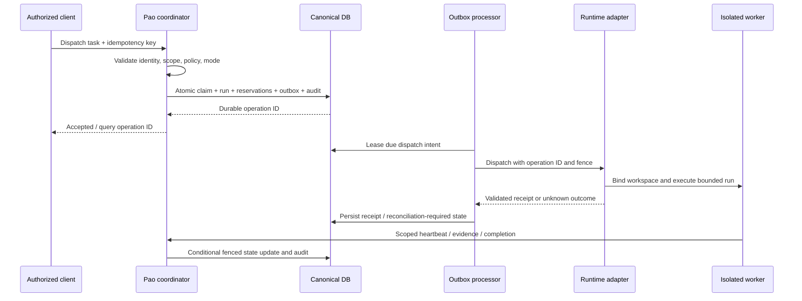

# Phase 20.61 — Pao-hubPro × amux

## Multi-Agent Worker Runtime, Atomic Task Coordination, Recoverable Sessions & Policy-Governed Execution Gateway

> Document version: 1.0 — complete implementation blueprint, 2026-09-17.
> Status: implementation target; production acceptance is NOT asserted.
> Scope: one Phase, preserving the original Phase number, name, subtitle, and capabilities.
> Governing request: `PAO-HUBPRO_MASTER_PHASE_REQUEST.md`, explicitly authorized by the project owner.
> Design rule: Pao-hubPro decides. amux executes. Workers produce evidence. Reviewers verify. Humans authorize high-risk actions.

This document is a new edition of the supplied Phase file. It preserves the original file and existing repository work. Normative words **MUST**, **MUST NOT**, and **SHOULD** describe the target implementation, not claims that the current checkout already satisfies them. Code, SQL, routes, flags, and contracts explicitly marked **Proposed** require implementation and verification.

The document is written in the technical language of the original specification. สรุปสำหรับเจ้าของโครงการ: ต่อเติม Agent Runtime ที่มีอยู่ให้เชื่อม amux ได้อย่างควบคุมได้ โดย Pao-hubPro ถือสิทธิ์ตัดสินใจ สถานะงาน หลักฐาน และการอนุมัติ การเปิดใช้งานจริงต้องผ่านการทดสอบกับ runtime จริงและเกณฑ์ในเอกสารนี้ก่อน

## 1. Executive Summary

Phase 20.61 supplies an optional, replaceable execution backend for bounded coding tasks. It connects Pao-hubPro's existing orchestration, governance, persistence, management API, and dashboard to amux through a provider-neutral adapter.

The delivery unit is a traceable task with an immutable specification revision, isolated workspace, bounded run, authenticated worker, fenced ownership, reproducible evidence, independent verification, and explicit authorization for any sensitive promotion. A task is not complete merely because a terminal says it is done.

The current checkout already contains an `agent-runtime` module, `ar_*` tables, management routes, tool definitions, tests, and an Agent Runtime page. Implementation MUST begin by reconciling and extending these components. This blueprint does not authorize deleting or replacing existing Pao-hubPro capabilities.

Initial deployment is one Pao control-plane authority using the existing local SQLite database. Execution nodes may be local or remote, but access canonical state through authenticated APIs. amux stores its own execution metadata; its database is never Pao's canonical task store.

Delivery progresses through disabled, read-only visibility, isolated single-worker execution, coordinated workers, recovery drills, and selected-repository use. Each gate is evidence-based. External publishing, protected Git writes, deployments, credential administration, infrastructure changes, and production database writes always retain human approval.

## 2. Problem Statement

Parallel coding sessions create five concrete coordination problems:

1. Several workers may start the same task or overwrite overlapping files.
2. A timeout cannot distinguish a rejected dispatch from a dispatch accepted before the connection failed.
3. A recovered worker may still race with an older process that retained filesystem access.
4. Self-reported success does not establish test execution, reviewer independence, or approval.
5. External runtimes may expose broader host permissions, lifecycle behavior, and retries than Pao policy permits.

The solution must address both state correctness and actual execution containment. A database lease protects canonical writes; it does not by itself stop a stale process from editing files or contacting external services. A command policy function protects execution only when every relevant executor is forced through it.

## 3. Goals

- Coordinate planner, implementer, tester, reviewer, recovery-controller, and release-controller roles without binding them to a particular model vendor.
- Preserve one canonical owner per task attempt and one bounded session binding per execution slot.
- Isolate concurrent writes with worktrees or sandbox-local clones and explicit resource leases.
- Support long-running sessions, structured checkpoints, restart reconciliation, cancellation, and bounded recovery.
- Preserve `DONE != VERIFIED != APPROVED`; require receipts for actual merge/deploy outcomes.
- Expose selected capabilities through existing management and MCP surfaces with identical server-side enforcement.
- Keep policy, secrets, budget admission, approval, audit, and final lifecycle authority in Pao-hubPro.
- Make evidence, failures, missing capabilities, and operating limits visible to operators.
- Permit adapter replacement without changing task IDs, approval semantics, or artifact ownership.
- Retain every existing core, provider, workflow, skill, memory, browser, mobile, media, and external-service capability.

## 4. Non-Goals

- Rebuilding Pao-hubPro as a new monorepo, replacing Bun, or adding another ORM/database platform.
- Treating amux as the source of truth for Pao authorization, global scheduling, or human identity.
- Implementing unrestricted dashboard terminals, automatic approval, automatic protected merges, or production deployment by default.
- Replacing Council planning/review, existing runtime adapters, the MCP Gateway, SkillsGate, or memory/context systems.
- Providing a multi-region consensus store, shared SQLite over a network filesystem, or distributed transactions with amux.
- Guaranteeing exactly-once external effects when the downstream runtime cannot deduplicate and reconcile them.
- Claiming native Windows amux support without upstream and runtime evidence.
- Deploying amux, contacting paid providers, migrating production data, or executing the prompt in §44 as part of this document-authoring task.

## 5. Why This Phase Exists

Pao-hubPro already has control-plane primitives; amux offers a potential worker/session substrate. The smallest useful integration is an adapter plus the missing coordination and enforcement contracts around the existing `agent-runtime` module.

Use the repository's decision ladder before adding code: YAGNI → reuse → standard library → Bun-native capability → installed dependency → small local patch → minimal new subsystem. Persisted run identity, fencing, and dispatch receipts are justified by crash/retry boundaries; a new generic orchestration framework is not.

An individual task can use this subsystem without requiring a global migration of other Agent OS tasks. Existing workflow/Council tasks link to a runtime task by an explicit reference; each domain retains ownership of its own state.

## 6. Relationship to Pao-hubPro

Paths in this section are repository-relative references inspected in the local checkout on 2026-09-17. Presence is not proof of complete behavior.

| Layer | Existing integration seam | Responsibility in this Phase |
|---|---|---|
| Client / dashboard | `gui/src/pages/AgentRuntime.tsx`, `gui/src/App.tsx`, `gui/src/app-routing.ts` | Reuse the current page and navigation; add truthful actions and state |
| Orchestration | `src/agent-os/orchestration/`, `src/agent-os/council/` | Plan, delegate, verify, and link parent tasks; no second planner authority |
| Runtime domain | `src/agent-os/agent-runtime/` | Own bounded task/run/session coordination |
| Runtime federation | `src/agent-os/unified-runtime/`, `src/agent-os/codex-runtime/`, `src/agent-os/coding-cockpit/` | Optional adapters and identifiers; do not replace their execution paths |
| Policy and approval | `src/agent-os/governance-gateway/`, `src/agent-os/gateway.ts` | Compose shared enforcement with runtime-specific constraints |
| Minimal-code governance | `src/agent-os/governance/` | Apply dependency/reuse/debt rules; reviewers remain free to critique |
| MCP transport/catalog | `src/server/management/mcp-gateway-protocol.ts`, `src/agent-os/ai-workspace/` | Register governed tools through the existing gateway |
| Persistence | `src/agent-os/db.ts` | Existing Bun SQLite store and additive migrations |
| Events and observations | `src/agent-os/events.ts`, `src/agent-os/observability.ts`, `src/agent-os/agent-observability/` | Publish durable correlated state changes; reuse existing views where compatible |
| Optional skill/context inputs | `src/agent-os/skill-gate/`, `src/agent-os/context/`, `src/agent-os/memory-plane/` | Supply approved, scoped context; task execution must not require them |
| Management admission | `src/server/management-api.ts`, `src/server/management/agent-os-routes.ts` | Preserve management/data-plane credential separation and route conventions |

The management namespace stays `/api/agent-os/agent-runtime`. Do not create the original document's generic `apps/web`, `apps/api`, `src/domain`, or `/api/agent/*` hierarchy alongside working equivalents.

Core isolation is a hard invariant: disabled runtime integration MUST create no runtime adapter, remote poll, recovery timer, or worker process. Keep it out of the request graphs rooted at `src/router.ts`, `src/server/lifecycle.ts`, and `src/server/responses/core.ts`. Preserve the existing synchronous Lab activation guarantee in `src/server/index.ts`; this Phase must not weaken it.

## 7. Upstream / External Project

### 7.1 Evidence and pinning

Upstream target: [mixpeek/amux](https://github.com/mixpeek/amux). The existing Pao configuration records commit `3a205a41a60ea790dfae48a5056ef70d6f9361e9`. This edition verified that the pinned README and license are retrievable; it did not build or run that commit.

The [pinned README](https://github.com/mixpeek/amux/blob/3a205a41a60ea790dfae48a5056ef70d6f9361e9/README.md) describes a Rust server, SQLite persistence, tmux workers, board claims, messaging, and session recovery. It documents macOS/Linux installation and HTTPS on port 8824. These are upstream descriptions, not accepted Pao integration capabilities. Proposed Windows-host deployment uses a separately managed Linux node or isolated Linux VM; WSL2 support requires its own compatibility evidence.

The [REST guide](https://amux.io/guides/rest-api-reference/) lists sessions, board, and sync endpoints, but also contains legacy Python setup text. Treat it as an endpoint discovery aid. At implementation time, source code and contract tests at the exact pin determine request/response fields, authentication, event ordering, cancellation, and recovery behavior.

### 7.2 Four ownership domains

| Domain | Contains | Must not own |
|---|---|---|
| A. Upstream amux | Its binary, sessions, native board, native persistence | Pao final task state or human approval |
| B. Pao adapter | Wire validation, error mapping, capability probes, runtime ID mapping | Independent permission decisions |
| C. Pao policy wrapper | Identity, policy, approval consumption, bounded execution grants | amux internal database manipulation |
| D. Proposed Pao extensions | Fencing, durable dispatch ledger, checkpoint protocol, scoped worker gateway | Undocumented claims of upstream features |

Use external APIs rather than patching upstream by default. If the pin cannot provide required session isolation, stop acknowledgement, or fenced dispatch, implement a small Pao-owned supervisor adapter on an isolated execution node, or keep that node read-only. Any upstream fork must be separately pinned, reviewed, and recorded.

### 7.3 Compatibility manifest — Proposed extension

Record repository URL, full commit, binary SHA-256, target OS/architecture, toolchain/build provenance, adapter contract version, configuration schema version, protocol fixtures, license text hash, review date, and verification report reference. The operator's installed binary needs a checksum even when Pao does not distribute it.

Runtime health MUST distinguish `reachable`, `authenticated`, `compatible`, `executionReady`, and `draining`. Full commit/build identity must be verified using a trusted installation record or attestation and compared exactly. A self-reported `/health` value is advisory; a seven-character prefix or cached healthy response cannot authorize indefinite future execution. Recheck after restart, changed instance identity, or compatibility TTL expiry.

Candidate read surface: `/health`, session list/metadata, board list, and sync. Candidate mutating surface: board creation/claim and session send. Every body, response, side effect, and replay contract needs a pinned fixture before enablement. Session create/stop currently return unsupported in the local adapter; do not invent upstream endpoints to fill the interface.

### 7.4 License and maintenance gate

The [license at the recorded pin](https://github.com/mixpeek/amux/blob/3a205a41a60ea790dfae48a5056ef70d6f9361e9/LICENSE) is MIT with Commons Clause. Its restriction covers certain paid products/services deriving substantial value from the software. An HTTP wrapper or separate deployment is not sufficient evidence of commercial permission. This blueprint makes no legal determination; record use-case review and required written permission before commercial enablement.

Keep `docs/integrations/amux-compatibility.md` and `docs/legal/amux-license-review.md` as engineering records and correct overbroad statements during implementation. Track release activity, deprecation notices, dependency advisories, and upgrade ownership at each pin change. Do not auto-update the runtime or silently fall back to a more privileged provider.

## 8. Current-State Assumptions

### 8.1 Inspected baseline

- Checkout: Pao-hubPro, branch `paohupbypaoza`, HEAD `77fa6416fb7f7a0971a50586c356fa5641ac2553`; extensive staged, modified, and untracked work is present.
- Root package version: `2.62.0`; runtime is Bun-native TypeScript; GUI is React/Vite; package manager is Bun with root/GUI lockfiles.
- `src/agent-os/db.ts` currently declares `AGENT_OS_SCHEMA_VERSION = 51`. The `ar_*` group is labelled v49; later groups already exist. Determine the next free migration version at implementation time.
- `src/agent-os/agent-runtime/` contains service/store/policy/evidence/worktrees/config/secrets/types and an amux adapter. These are the starting point.
- `src/server/management/agent-runtime-routes.ts` exposes the namespace and tool metadata. `/tasks/:id/run` is currently a policy evaluation path, not proof of executed commands.
- `src/agent-os/agent-runtime/mcp-tools.ts` defines 12 local tools. A metadata listing alone does not prove registration or execution through a real MCP client's `tools/list` and `tools/call`.
- Existing `tests/agent-runtime.test.ts` includes fake-amux flows. Historical local reports describe passing checks; none of those checks were rerun for this document, and no live amux E2E acceptance is established here.

### 8.2 Architecture decisions and resolved ambiguities

| Decision | Chosen target and reason |
|---|---|
| Canonical state | Extend `ar_*` within the existing Agent OS store; avoid the source draft's parallel generic tables |
| Phase identity | Keep `Phase 20.61 — Pao-hubPro × amux` and its subtitle exactly; existing longer report titles are aliases, not a new Phase |
| Upstream board | Execution projection only; upstream `done`/`verified` are observations requiring Pao validation |
| Work vs attempt | Preserve task status values; add run/session detail rather than forcing every state into one overloaded enum |
| Atomicity | Fence every state mutation in SQL, not just the initial claim; serialize capacity/resource reservations in the same transaction |
| Retry semantics | Retry reads and provably unstarted actions; reconcile uncertain writes; never infer exactly-once execution |
| Command safety | Real process/sandbox controls are required; prompts, risk labels, and worktrees alone are insufficient |
| Approval | Server-authenticated human decision tied to immutable action/resource hashes; agents can request, never decide |
| Promotion | Preparing a merge candidate does not mean a merge occurred; retain verified action receipts |
| Rollback | Disable/drain and preserve additive schema; do not drop `ar_*` tables or decrement a shared schema version |
| Windows | Pao control plane stays supported on its current host; amux execution requires an independently verified node profile |
| Branch naming | New branches default to `codex/amux/<task>/<role>/<run>`; recognize existing `pao/amux/*` ownership records without renaming them |
| Security notes | Architecture requirements may be documented; unreleased defect details and reproductions belong only in ignored scratch space |

All unimplemented contracts below are **Proposed Pao-hubPro Extensions**. Source-level inspection is not a security certification. Before coding, refresh the baseline, inspect overlapping diffs, and retain the user's changes.

## 9. Target Architecture

The control plane owns task specifications, dependencies, admission, claims, run attempts, policy decisions, evidence indexes, approvals, audit, and final outcomes. The execution plane receives only scoped grants and materialized context.

The broker reserves a run and persists dispatch intent before contacting amux. It commits state/events/audit/outbox in a short database transaction; no network call occurs inside that transaction. An outbox processor dispatches and records the upstream receipt. A reconciler resolves uncertain outcomes and resumes durable work after restart.

Every execution node MUST enforce task-scoped filesystem and network access, credential isolation, process-tree limits, and stop acknowledgement independently of model instructions. A cooperative terminal lane without enforceable isolation is restricted to read-only discovery. For coding, a constrained development sandbox may permit build/test subprocesses within that sandbox; sensitive host or external actions remain available only through structured Pao executors.

One configured runtime provider is sufficient. A mock adapter is test-only. An alternative real adapter may be registered behind a separate flag after equivalent capability checks, but automatic fallback must not move data, change cost, or weaken policy without prior authorization.

## 10. Architecture Diagram

```mermaid
flowchart TD
    C[Dashboard / CLI / authorized MCP client] --> A[Management authentication and principal]
    A --> I[Task intake and existing planner]
    I --> G[Shared governance plus runtime policy]
    G --> H[Human approval when required]
    H --> G
    G --> T[Atomic task/run admission]
    T --> DB[(Agent OS SQLite: canonical state)]
    T --> O[Durable dispatch outbox]
    O --> AD[Provider-neutral runtime adapter]
    AD --> AM[Private amux runtime]
    AM --> S[Isolated node supervisor]
    S --> W[Implementer / tester / reviewer workers]
    W --> EG[Scoped execution gateway]
    EG --> G
    W --> EV[Artifact and evidence validation]
    EV --> DB
    EV --> V[Independent verifier]
    V --> P[Promotion candidate]
    P --> H
    DB --> R[Recovery and reconciliation]
    R --> AD
    DB --> OBS[Audit / events / observability]
    OBS --> C
```



The diagram's approval cycle represents suspended admission and later re-evaluation, not automatic approval. Only the structured executor performs an approved side effect; only its validated receipt can establish `merged` or `deployed`.

## 11. Core Components

Prefer small modules under `src/agent-os/agent-runtime/`, composed into the existing service:

| Component | Responsibility | Dependency rule |
|---|---|---|
| Intake / plan bridge | Validate bounded task spec and connect existing DAG/planner | No independent global scheduler |
| Worker registry | Identity references, capabilities, node/session binding, capacity | Reuse provider catalog; no raw credential values |
| Coordinator/store | Transactional claims, reservations, state transitions | Single canonical DB authority |
| Runtime adapter | Normalize pin-specific protocol and errors | No domain authorization inside mapper |
| Execution bridge | Validate grant, run structured action, collect receipt | Shared governance cannot be skipped |
| Workspace manager | Own workspace identity, base revision, scoped cleanup | Reuse Council Git helpers through compatible interfaces |
| Recovery/reconciler | Detect abandoned attempts and unknown dispatch outcomes | Single elected sweep owner per store |
| Evidence/verifier bridge | Capture trusted command/artifact evidence and assess ACs | Independent reviewer identity |
| Approval bridge | Human-only decision and one-use action authorization | Existing approval authority; runtime row is a reference/projection |
| Event/audit bridge | Persist ordered changes and publish after commit | Reuse events/observability rather than a new broker |
| Management/MCP facade | Validate transport input and project authorized views | No client-supplied role or trust escalation |

## 12. Component Responsibilities

### 12.1 Provider-neutral contract

Extend the existing `WorkerRuntimeAdapter` additively. Proposed operation names below are domain operations, not claims about upstream endpoint names:

```ts
type OperationState = "not_started" | "accepted" | "running" | "succeeded" |
  "failed" | "cancelled" | "unknown";

interface RuntimeOperationContext {
  operationId: string;
  taskId: string;
  runId: string;
  sessionId: string;
  claimVersion: number;
  expectedRuntimeInstanceId: string;
  executionGrantRef: string; // opaque; never logged or sent in a prompt
  deadlineAt: string;
  signal: AbortSignal;
}

interface RuntimeCapabilities {
  contractVersion: string;
  createSession: boolean;
  stopSession: boolean;
  stopAcknowledgement: boolean;
  operationLookup: boolean;
  idempotentDispatch: boolean;
  resumableEvents: boolean;
  workspaceBinding: boolean;
  enforcedIsolation: boolean;
  enforcedFencing: boolean;
}
```

The adapter must provide validated health/capabilities, workers, session state, dispatch, operation reconciliation, stop, and event reads or documented unsupported results. `sendMessage` and `recoverSession` are side effects governed like dispatch. Returning `RUNTIME_UNSUPPORTED` must not trigger a guessed shell command or endpoint.

Validate input and output schemas; redact before exporting error details; bound response size and duration. Raw upstream payloads remain private to adapter diagnostics with controlled retention. Map `accepted:false` to a failed admission, not a running task. Persist actual returned runtime task/session IDs separately from Pao IDs.

### 12.2 Ownership and shutdown

Each component owns and closes its timers, subscriptions, HTTP resources, process handles, and reservations. Register shutdown via `src/lib/optional-shutdown-hooks.ts`. Shutdown stops new dispatch, persists drain state, and either waits for a bounded stop/receipt or records uncertainty for reconciliation.

Controller leadership uses a persisted lease and epoch when more than one Pao process can touch the same local store. No in-memory mutex is sufficient for cross-process exclusion. Runtime callback handlers cannot directly promote tasks or decide approvals.

## 13. Data Flow

1. Intake stores task spec revision, AC IDs, repository/project scope, dependency references, resource limits, and required capabilities.
2. Context assembly selects allowlisted files and approved memory/skill references. Store content hashes/provenance and materialize a bounded bundle for the assigned run.
3. Admission transaction reserves task ownership, worker/session capacity, workspace resource, budget, and dispatch intent.
4. After commit, prepare/verify the isolated workspace at the pinned base revision; bind its node-local identity to the run before dispatch.
5. The adapter sends a normalized run instruction and opaque correlation IDs. Credentials and approval authority are never prompt content.
6. Worker requests enter the scoped execution gateway; the supervisor enforces the grant and captures output, exit code, time, resource use, and artifact hashes.
7. Evidence is validated, redacted, persisted, and associated with task spec revision, run, and candidate tree hash.
8. A separate verifier checks every AC against that candidate. Its report is itself immutable evidence.
9. Any sensitive promotion requires a human decision, fresh policy check, and atomic one-use authorization consumption.
10. Events and audit reach the dashboard after durable commit; failures remain visible with bounded operator actions.

Context and transcripts are untrusted input. Neither a repository instruction file, retrieved document, tool response, nor inter-worker message may enlarge capability or override policy.

## 14. Control Flow

### 14.1 Task admission

Admission requires: enabled module/mode; compatible runtime; authenticated principal; authorized repository; bounded nonempty acceptance criteria; satisfied dependencies; eligible worker; enforceable sandbox; available capacity; valid budget; and an ALLOW decision or valid human grant for the exact action.

Evaluate before any worktree/process mutation. Revalidate policy version, spec revision, ownership, and feature flags at transaction commit and immediately before external dispatch. A concurrent cancellation or kill switch wins over queued dispatch.



### 14.2 Delegation and conflicts

Each delegated child has its own task, run, claim, and narrowed capability set. A parent cannot grant permissions it lacks. Model-generated plans propose tasks; the coordinator validates DAG acyclicity, scope, budgets, and maximum depth/fan-out before queueing.

Resource conflicts are explicit: two tasks may operate in isolated branches, but promotion serializes against the target branch revision. Shared non-Git outputs (ports, local DB files, fixtures, devices) require resource leases. On overlap, queue, replan, or ask an authorized supervisor; do not choose an arbitrary winner or overwrite evidence.

## 15. Agent / Worker Model

### 15.1 Vocabulary

| Term | Precise meaning |
|---|---|
| Agent | Logical identity/role and reasoning behavior; may use different models |
| Worker | Registered execution slot on an identified node; hosts one active session binding per slot |
| Task | Durable bounded requirement with ACs, scope, and lifecycle |
| Job | Scheduled/durable dispatch intent for an operation; does not become a second task store |
| Session | Runtime conversation/process context owned by a binding and isolation boundary |
| Run | One execution attempt of a task, with immutable attempt ID and fence |
| Tool | Callable structured operation with validated input/output |
| Capability | Authority to perform a specific class of action on specified resources |
| Context | Immutable, scoped input bundle for a run |
| Memory | Governed reusable information; separate from runtime authority and raw transcripts |
| Artifact | Stored output with ownership, hash, retention, and provenance |

### 15.2 Roles and limits

| Role | Permitted responsibility | Prohibited shortcut |
|---|---|---|
| Planner | Propose bounded DAG/spec/ACs | Granting execution rights |
| Implementer | Edit allowed paths in its isolated workspace | Self-verifying or approving promotion |
| Tester | Run trusted test plan; propose test changes on a separate branch | Editing the reviewed candidate while reporting it as immutable |
| Reviewer | Independently assess spec, candidate, tests, and relevant security | Treating a report from the implementer as sufficient evidence |
| Recovery-controller | Reconcile ownership/receipts and schedule bounded retries | Approving higher risk or silently expanding budgets |
| Release-controller | Prepare a promotion and gather receipts | Substituting for human approval |

Resolve actual roles/capabilities from the registry and authenticated principal. A caller's `worker_id`, `verifier_role`, or `approver_id` is never evidence of authority. Workers may advertise multiple roles, but an implementer and verifier for one candidate MUST have different registered identities and sessions. Reviewer minimal-code governance mode remains `off`; security and authorization checks remain active.

### 15.3 Runtime profiles and communication

Worker metadata includes runtime provider, model binding reference, node ID, supported roles/capabilities, sandbox profile/version, worktree binding, health freshness, and capacity. Enforce `maxConcurrency` by reserving independent slots; two tasks must never interleave prompts into the same terminal lane.

Agent-to-agent messages go through Pao with authenticated sender, recipient, project/task/run scope, type, sequence, and size limits. Supported types are progress, evidence reference, question, delegation proposal, and blocker. Messages cannot carry policy changes or human decisions. Record provenance and prevent cross-project terminal peeking or global shared memory access.

Default proposals: one active run per worker slot, two concurrent coding runs per project, one test/build slot per shared fixture, DAG depth ≤ 4 and fan-out ≤ 4 unless the approved task budget narrows these further. These are implementation defaults, not observed performance limits.

## 16. Session / State Model

### 16.1 Task lifecycle

Retain the existing lowercase storage/wire values. Uppercase below is documentation notation:

```text
DRAFT → QUEUED → CLAIMED → RUNNING → DONE → VERIFYING → VERIFIED
VERIFIED → APPROVAL_REQUIRED → APPROVED → MERGED → DEPLOYED → CLOSED
APPROVED → CLOSED                (accepted task with no external promotion)
APPROVED → DEPLOYED → CLOSED     (authorized deployment without a merge)
MERGED → CLOSED                 (merge-only task)
```

`VERIFIED → APPROVED` is allowed only for an acceptance-only action whose server-side policy explicitly needs no human approval; record `approvalSource=policy`. It must not authorize any later sensitive action. `requiresHumanApproval=false` supplied by a client cannot relax the action policy.

Failure/rework transitions:

```text
RUNNING → BLOCKED → RUNNING      (only with the same still-valid lease)
CLAIMED/RUNNING/BLOCKED → RECOVERING → QUEUED → CLAIMED
RECOVERING → FAILED              (exhaustion or irrecoverable state)
VERIFYING → REJECTED → QUEUED    (new candidate and run; invalidate prior verdict)
APPROVAL_REQUIRED → REJECTED     (human denied this promotion)
FAILED → QUEUED                  (authorized retry within remaining budget)
ACTIVE → CANCELLED              (only after stop/reconciliation contract is met)
```

Rejected review and denied promotion carry distinct reason codes; a denied promotion does not auto-requeue implementation. `closed` and `cancelled` are final. `deployed` is final for execution but may transition to `closed` for administrative closure; helpers and transition tables must agree on this distinction.

### 16.2 Run and session states — Proposed extension

Run state: `created → queued → dispatching → running → completed`, with `waiting`, `approval_required`, `paused`, `retrying`, `recovering`, `cancelling`, `failed`, `cancelled`, and `timed_out` as explicit branches. `dispatch_outcome=unknown` blocks retries until reconciliation. A completed run may leave the task `done` pending verification.

Session state: `created → starting → ready → busy → idle`, with `suspect`, `recovering`, `stopping`, `stopped`, and `lost`. Persist requested state separately from observed state. Store runtime instance ID and generation so a reused lane name is never mistaken for the old process.

Waiting for input/approval pauses action admission, not necessarily ownership. A supervisor may renew a still-owned lease within an absolute deadline, but no command runs while approval is pending. Pause requires process acknowledgement; loss of ownership routes through recovery. Approval expiry or run deadline cannot be extended by heartbeat.

### 16.3 Atomic task coordination

Required claim fields retain the source contract: `task_id`, `status`, `claim_owner`, `claim_token`, `claim_version`, `claimed_at`, `lease_expires_at`, `heartbeat_at`, `attempt`, and `max_attempts`. Add `active_run_id`, `spec_revision`, and separate `row_version`; do not reuse `claim_version` as a general edit counter.

The server generates a cryptographically random claim credential, stores only its digest when practical, and transports it on a private authenticated channel. Never return it in list/detail DTOs, logs, prompts, or checkpoints. `claim_version` is a monotonically increasing fencing epoch. Token and epoch must both match for heartbeat, checkpoints, evidence admission, completion, and command grants.

The following SQL is a **proposed sketch** requiring the additive fields in §26 and inclusion in a short `BEGIN IMMEDIATE` transaction:

```sql
UPDATE ar_tasks
SET status = 'claimed', claim_owner = :worker_id,
    claim_token_hash = :token_hash,
    claim_version = claim_version + 1,
    active_run_id = :run_id, attempt = attempt + 1,
    claimed_at = :now_iso, heartbeat_at = :now_iso,
    lease_expires_at = :expires_iso,
    row_version = row_version + 1, updated_at = :now_iso
WHERE id = :task_id AND status = 'queued'
  AND claim_owner IS NULL AND active_run_id IS NULL
  AND row_version = :expected_row_version
  AND attempt < max_attempts
RETURNING id, claim_version, active_run_id, attempt;
```

Before commit, reserve the worker slot, verify dependency/resource/budget constraints, insert the run/outbox/audit/event, and require exactly one claim row. Any failure rolls back all reservations. Prepare worktrees after this durable reservation, with idempotent ownership checks, so losing claimers cannot create competing workspaces.

All later writes MUST encode expected state, run, epoch, owner, unexpired lease, and token digest in the UPDATE predicate. A read/check followed by an unconditional UPDATE is not a valid fencing implementation. Renewals use server time and cannot revive an already expired lease; zero affected rows returns `AGENT_CLAIM_STALE`.

Count one attempt when a run reservation commits, before external effects. Retrying the same operation key does not increase attempts. Even a failed preparation consumes that reserved attempt; report the reason rather than hiding attempts. Default `max_attempts=3` means at most three total run reservations. No automatic reset on manual retry or supervisor restart.

### 16.4 Idempotency and ordering

Mutations require a caller-generated idempotency key scoped by authenticated principal, project, operation, and API contract version. Persist request hash and `pending` reservation atomically before effects. Same key/same canonical request returns the existing operation/result; same key/different request returns 409. Identical bodies with different keys may represent intentional new tasks.

Pending or unknown operations cannot be removed on a short TTL. Completed dedup records live at least as long as the allowed retry/event window. Record event source ID, source instance/generation, aggregate sequence, and received time. Duplicate delivery is harmless; stale/out-of-order observations cannot advance canonical task state. Unknown event types are quarantined rather than normalized into success or heartbeat.

## 17. MCP Integration

Phase 20.61 integrates with the Model Context Protocol (MCP) strictly through Pao-hubPro's existing MCP Gateway (`src/server/management/mcp-gateway-protocol.ts` and `src/agent-os/ai-workspace/gateway.ts`). Untrusted agents and external tools are never permitted to communicate directly with upstream amux administrative endpoints or spawn raw unmonitored tmux sessions.

### 17.1 MCP Server and Client Topology

- **Pao-hubPro MCP Server**: Exposes governed agent runtime tools to external clients (e.g. Open WebUI, desktop coding assistants) through JSON-RPC 2.0.
- **Pao-hubPro MCP Client**: Connects to authorized MCP servers to supply specialized tooling to coding workers.
- **Tool Isolation**: Workers invoke tools via `governedDispatch`. Tools are executed within isolated worker environments with bounded stdout/stderr and strict execution timeouts.

### 17.2 Governed WebMCP Tool Catalog

The runtime registers 12 Pao-owned WebMCP tools in `src/agent-os/agent-runtime/mcp-tools.ts`:

1. `agent_runtime_get_health` (Risk: R0, Read-only): Inspects runtime liveness, version compatibility, and node health.
2. `agent_runtime_list_workers` (Risk: R0, Read-only): Lists registered workers, assigned roles, and concurrency capacity.
3. `agent_runtime_list_tasks` (Risk: R0, Read-only): Lists tasks with optional status and priority filtering.
4. `agent_runtime_get_task` (Risk: R0, Read-only): Retrieves task specification, acceptance criteria, active claim, evidence list, and session audit.
5. `agent_runtime_create_task` (Risk: R1, Mutating non-executing): Creates bounded task specification with immutable acceptance criteria.
6. `agent_runtime_dispatch_task` (Risk: R3, High impact): Claims task atomically, creates isolated worktree, and dispatches to assigned worker.
7. `agent_runtime_record_evidence` (Risk: R1, Mutating non-executing): Attaches validated, secret-redacted evidence artifact (diff, test report, review).
8. `agent_runtime_verify_task` (Risk: R2, Independent review): Evaluates acceptance criteria against candidate evidence; requires independent reviewer.
9. `agent_runtime_list_approvals` (Risk: R0, Read-only): Queries pending, approved, or stale human approval requests.
10. `agent_runtime_decide_approval` (Risk: R3, Operator authorization): Records human approval/rejection with payload hash re-validation.
11. `agent_runtime_cancel_task` (Risk: R2, Cancellation): Stops running execution, invalidates claim, and cleans up isolated worktree.
12. `agent_runtime_list_events` (Risk: R0, Read-only): Streams normalized runtime event log for a task or system-wide.

### 17.3 MCP Governance Invariants

- **No Raw Passthrough**: Raw amux REST endpoints (`/api/board`, `/api/sessions/:name/send`) are never exposed as MCP tools.
- **Input & Output Validation**: Every tool schema validates argument types, character length (<= 300 for strings), regex patterns for safe identifiers, and rejects path traversal sequences.
- **Circuit Breaker & Rate Limiting**: Tool calls reaching the runtime adapter are subject to request timeouts (default 10,000ms), 5-second delta-polling intervals, and an automatic circuit breaker if upstream returns 3 consecutive 5xx errors.
- **Audit & Provenance**: Every MCP tool call is recorded in `ar_execution_audit` with caller actor identity, input hash, decision, and output digest.

---

## 18. Capability Registry

Worker authorization is evaluated per-action and per-task using fine-grained capabilities. Workers never inherit broad ambient system permissions based on their role name alone.

### 18.1 Defined Capabilities

```ts
export type WorkerCapability =
  | "repo.read"             // Read repository files within permitted worktree scope
  | "repo.write_scoped"      // Edit files strictly within allocated worktree path scope
  | "command.safe_dev"       // Execute non-destructive dev commands (build, lint, typecheck)
  | "command.test"           // Execute unit/integration test runners
  | "command.readonly_git"    // Run read-only git operations (diff, log, status, rev-parse)
  | "command.write_git"       // Stage and commit changes in dedicated task branch
  | "diff.review"            // Inspect patch diffs and commit histories
  | "test.read"              // Inspect test logs and coverage reports
  | "evidence.read"          // Read task evidence records
  | "secret.access"          // Read explicit task-scoped secret reference (requires approval)
  | "network.access"         // Access declared outbound network destinations (default-deny)
  | "approval.decide";       // Grant or reject human approval (Human operator only)
```

### 18.2 Role-to-Capability Mapping Matrix

| Capability | planner | implementer | tester | reviewer | recovery-controller | release-controller |
|---|---|---|---|---|---|---|
| `repo.read` | Yes | Yes | Yes | Yes | Yes | Yes |
| `repo.write_scoped` | No | Yes | No | No | No | No |
| `command.safe_dev` | No | Yes | Yes | No | No | No |
| `command.test` | No | Yes | Yes | No | No | No |
| `command.readonly_git` | Yes | Yes | Yes | Yes | Yes | Yes |
| `command.write_git` | No | Yes | No | No | No | Candidate Prep |
| `diff.review` | No | No | Yes | Yes | No | Yes |
| `test.read` | No | Yes | Yes | Yes | No | Yes |
| `evidence.read` | Yes | Yes | Yes | Yes | Yes | Yes |
| `secret.access` | Deny | Deny* | Deny* | Deny | Deny | Deny |
| `network.access` | Deny | Deny* | Deny* | Deny | Deny | Deny |
| `approval.decide` | Deny | Deny | Deny | Deny | Deny | Deny (Human only) |

*Requires explicit task-scoped grant and operator policy approval.

---

## 19. Policy Model

The Execution Gateway enforces a multi-stage, fail-closed policy pipeline before any command or tool execution is admitted.

### 19.1 Policy Evaluation Pipeline

```text
Worker Action Request
       ↓
[1. Identity & Claim Check]      -> Must be active claim owner with matching token & unexpired lease
       ↓
[2. Capability Resolution]      -> Worker must hold capability required for action
       ↓
[3. Structural Deny Rules]      -> Deny forbidden command classes (sudo, mkfs, mount, rm -rf /)
       ↓
[4. Destructive Action Check]   -> Require Human Approval for git push, force-ops, drop, deploy
       ↓
[5. Network Policy Check]       -> Enforce default-deny; permit only allowlisted outbound hosts
       ↓
[6. Secret Policy Check]        -> Deny secret access unless explicit approved SecretRef exists
       ↓
[7. Path & Scope Policy]        -> Reject path traversal (../), absolute escapes, out-of-worktree paths
       ↓
[8. Risk Classification]        -> Classify into R0 (Safe) to R4 (Critical/Destructive)
       ↓
[9. Approval Gate Decision]     -> ALLOW / DENY / REQUIRE_APPROVAL
       ↓
[10. Execution & Audit Trail]   -> Structured runner execution + record in ar_execution_audit
```

### 19.2 Default-Deny Command Classes

The following command classes are structurally denied and cannot be executed by autonomous workers:
- **Privilege Escalation**: `sudo`, `su`, `doas`, `chroot`, `setuid`.
- **Destructive Filesystem**: `mkfs`, `dd`, `fdisk`, `mount`, `umount`, recursive root deletes (`rm -rf /`, `rm -rf ~`, `Remove-Item -Recurse C:\`).
- **Host & System Modification**: Systemd service writes, Windows registry edits, firewall reconfiguration, driver loading.
- **Arbitrary Network Shells**: Reverse shells (`nc -e`, bash sockets), unauthorized SSH tunnelling.
- **Direct Protected Git Operations**: `git push`, `git push --force`, `git branch -D main`, `git reset --hard` on parent repositories.

---

## 20. Security Model

Security is built on defense-in-depth across identity, filesystem, process, network, and secret boundaries.

### 20.1 Authentication & Authorization
- Internal service-to-adapter calls require `AMUX_AUTH_TOKEN` sent via `Authorization: Bearer`.
- Management endpoints (`/api/agent-os/agent-runtime/*`) require Pao-hubPro admin bearer tokens.
- Remote agents interacting through MCP are authenticated via Pao session tokens and strictly constrained to authorized project scopes.

### 20.2 Filesystem & Worktree Isolation
- Every task/role combination is provisioned a dedicated git worktree at `<workspaceRoot>/task-<taskId>-<role>` on branch `pao/amux/<taskId>/<role>` (or `codex/amux/<taskId>/<role>`).
- Subprocess execution sets `cwd` strictly to the isolated worktree directory.
- All path inputs are validated against `SAFE_SEGMENT = /^[a-zA-Z0-9_-]+$/` and canonicalized to block path traversal (`../`, symlink jumps).

### 20.3 Secret Management & Redaction
- Secrets reside solely in Pao-hubPro secure storage (`getConfigDir()/agent-runtime/secrets/`).
- Plaintext secrets are never injected into prompts, LLM context, terminal peek buffers, or stored checkpoints.
- All logs, session peeks, and error messages pass through `redactSecrets()` matching token patterns, Bearer credentials, and common API key formats before persistence.
- Any attempt to persist evidence containing secret-like material fails closed with `AGENT_POLICY_DENIED`.

---

## 21. Approval Model

Human approval is an immutable, non-bypassable safety barrier. Agents and automated workers are strictly forbidden from approving their own actions.

### 21.1 Actions Requiring Human Approval
1. **Protected Branch Merge**: Merging any candidate branch into `main`, `master`, or `dev`.
2. **Remote Git Push**: Pushing branches or tags to external remotes.
3. **Production Deployment**: Triggering build artifacts or deployments to staging/production infrastructure.
4. **Database Migration / Mutation**: Executing schema migrations or writes on persistent databases.
5. **Secret Access**: Requesting credentials or API keys beyond public development keys.
6. **External Communication**: Publishing messages, social posts, or emails.
7. **Destructive Operations**: Any file deletion or irreversible state change outside the assigned worktree.

### 21.2 Payload-Hash Binding

Every approval request generates a cryptographic SHA-256 digest of the proposed payload:
```ts
payloadHash = sha256Hex(canonicalJson({ action, targetBranch, argv, diffSha }));
```
When the operator reviews and submits a decision:
1. The server re-computes the hash of the current action payload.
2. If the current payload hash differs from `approval.payloadHash`, the approval is immediately marked `stale` and rejected.
3. If the candidate branch receives new commits after approval, the prior approval is invalidated.
4. Approvals are single-use: once consumed by `promoteMergeCandidate` or execution, the token is retired.

---

## 22. Failure Handling

Every integration boundary must handle failures gracefully without corrupting canonical task state.

| Failure Mode | Detection Mechanism | Immediate Containment | Recovery Action |
|---|---|---|---|
| **amux Runtime Unreachable** | HTTP connection timeout or 502/504 | Mark session `suspect`, pause dispatch queue | Outbox processor retries with exponential backoff (up to 3 attempts), then parks task in `recovering` |
| **Worker Process Crash** | Missing heartbeat or amux session status `exited` | Mark session `suspect`, hold worktree | Recovery sweep reclaims lease after grace period, re-dispatches up to `maxAttempts` |
| **Runtime Version Drift** | `/health` commit mismatch | Adapter fails closed with `RUNTIME_VERSION_MISMATCH` | Block new dispatches; alert operator to update pinned commit or rollback binary |
| **Duplicate Event Ingestion** | Unique constraint on `ar_events.idempotency_key` | `INSERT OR IGNORE` drops duplicate | Harmless no-op; preserves existing event log without duplicate side-effects |
| **Out-of-Order Events** | Monotonic version check (`claim_version`) | Reject state update with `AGENT_CLAIM_STALE` | Ignore stale events; fetch latest task state from canonical SQLite |
| **Simultaneous Claim Race** | Conditional SQL UPDATE changes count != 1 | Loser receives `AGENT_CLAIM_CONFLICT` | Loser yields immediately; winner proceeds with exclusive ownership |
| **Secret Leak in Output** | `containsSecretLikeMaterial()` scan | Immediate rejection with `AGENT_POLICY_DENIED` | Strip secret from buffer, redact logs, alert operator |

---

## 23. Recovery Model

Autonomous self-healing must be bounded, deterministic, and auditable.

### 23.1 Heartbeat and Lease Expiration

- Workers must issue a heartbeat every `heartbeatSeconds` (default: 15s).
- Active leases expire after `leaseSeconds` (default: 60s).
- A recovery sweep runs every `heartbeatSeconds` in Pao-hubPro.
- If server time exceeds `lease_expires_at` + `recoveryGraceSeconds` (default: 30s):
  1. The session is marked `suspect`.
  2. The recovery controller verifies no active worker holds the token.
  3. Attempt count is checked: `attempt < maxAttempts` (default: 3).
  4. If budget exhausted: task transitions to `failed` with exit reason `recovery exhausted`.
  5. If budget remaining: expired lease is reclaimed, task transitions to `queued`, and attempt is incremented.

### 23.2 Structured Checkpoint Recovery

Workers periodically save structured checkpoints conforming to spec §13:
```json
{
  "task_id": "art_xxx",
  "worker_id": "arw_xxx",
  "status": "running",
  "summary": "Implemented search filter in product list component",
  "completed_steps": ["add search input JSX", "wire onChange handler"],
  "next_step": "add unit test for empty query",
  "changed_files": ["src/components/ProductList.tsx"],
  "commands_run": ["bun test tests/product-list.test.ts"],
  "evidence_ids": ["arev_111"],
  "blockers": []
}
```
When a recovered worker session restarts, Pao-hubPro sends the structured checkpoint instruction to rehydrate context, rather than replaying raw terminal output.

---

## 24. Observability

Observability tracks system performance, queue depth, error rates, and worker utilization without leaking sensitive data.

### 24.1 Key Performance Metrics

- `agent_runtime_tasks_total{status}`: Gauge of tasks by lifecycle status.
- `agent_runtime_claim_conflicts_total`: Counter of race conditions on task claims.
- `agent_runtime_session_recoveries_total`: Counter of initiated session recoveries.
- `agent_runtime_recovery_exhausted_total`: Counter of tasks failing due to retry exhaustion.
- `agent_runtime_policy_denials_total{rule_id}`: Counter of actions blocked by security policy.
- `agent_runtime_approval_wait_seconds`: Histogram of latency between request and human decision.
- `agent_runtime_adapter_latency_ms{method}`: Latency of upstream amux HTTP API calls.

### 24.2 Correlation Context

All log entries, audit rows, and published events must carry standardized correlation IDs:
```text
request_id = "req_xxx"
task_id    = "art_xxx"
run_id     = "run_xxx"
session_id = "ars_xxx"
worker_id  = "arw_xxx"
```

---

## 25. Audit

Audit logging captures every security-sensitive lifecycle event in durable storage separate from application debug logs.

### 25.1 Audit Record Schema (`ar_execution_audit`)

- `id`: Unique audit event ID (UUID / prefixed `ara_`).
- `task_id`: Associated task ID (nullable).
- `session_id`: Associated session ID (nullable).
- `actor_type`: `human` | `agent` | `system`.
- `actor_id`: Identifier of the executing principal.
- `action`: Discrete action name (e.g. `task.created`, `claim.atomic`, `policy.denied`, `approval.decided`, `merge.promoted`).
- `decision`: `allow` | `deny` | `require_approval` | `approved` | `rejected` | `stale`.
- `request_hash`: SHA-256 hash of the request payload.
- `details_json`: Structured metadata (argv, rule IDs, diff hashes; secrets redacted).
- `created_at`: UTC ISO-8601 timestamp.

---

## 26. Data Model

Phase 20.61 state is persisted in Pao-hubPro's existing SQLite database (`src/agent-os/db.ts`) via additive migration `AGENT_OS_SCHEMA_VERSION = 49` (or next available sequential version).

### 26.1 Database Schema DDL

```sql
-- Tasks
CREATE TABLE IF NOT EXISTS ar_tasks (
  id TEXT PRIMARY KEY,
  parent_task_id TEXT,
  title TEXT NOT NULL,
  description TEXT NOT NULL,
  acceptance_json TEXT NOT NULL DEFAULT '[]',
  status TEXT NOT NULL DEFAULT 'draft',
  priority INTEGER NOT NULL DEFAULT 50,
  role TEXT NOT NULL DEFAULT 'implementer',
  claim_owner TEXT,
  claim_token TEXT,
  claim_version INTEGER NOT NULL DEFAULT 0,
  claimed_at TEXT,
  lease_expires_at TEXT,
  heartbeat_at TEXT,
  attempt INTEGER NOT NULL DEFAULT 0,
  max_attempts INTEGER NOT NULL DEFAULT 3,
  runtime_provider TEXT,
  runtime_task_id TEXT,
  runtime_session_id TEXT,
  policy_profile TEXT NOT NULL DEFAULT 'restricted-dev',
  requires_human_approval INTEGER NOT NULL DEFAULT 1,
  repo_root TEXT,
  worktree_path TEXT,
  branch TEXT,
  checkpoint_json TEXT NOT NULL DEFAULT '{}',
  created_by_type TEXT NOT NULL DEFAULT 'human',
  created_by_id TEXT NOT NULL DEFAULT 'operator',
  created_at TEXT NOT NULL,
  updated_at TEXT NOT NULL
);
CREATE INDEX IF NOT EXISTS idx_ar_tasks_status ON ar_tasks(status, priority);

-- Workers
CREATE TABLE IF NOT EXISTS ar_workers (
  id TEXT PRIMARY KEY,
  name TEXT NOT NULL UNIQUE,
  provider TEXT NOT NULL,
  roles_json TEXT NOT NULL DEFAULT '[]',
  capabilities_json TEXT NOT NULL DEFAULT '[]',
  max_concurrency INTEGER NOT NULL DEFAULT 1,
  status TEXT NOT NULL DEFAULT 'unknown',
  runtime_worker_id TEXT,
  last_seen_at TEXT,
  created_at TEXT NOT NULL,
  updated_at TEXT NOT NULL
);

-- Sessions
CREATE TABLE IF NOT EXISTS ar_sessions (
  id TEXT PRIMARY KEY,
  task_id TEXT NOT NULL,
  worker_id TEXT NOT NULL,
  runtime_session_id TEXT NOT NULL,
  status TEXT NOT NULL DEFAULT 'running',
  attempt INTEGER NOT NULL DEFAULT 1,
  started_at TEXT NOT NULL,
  heartbeat_at TEXT,
  ended_at TEXT,
  exit_reason TEXT,
  FOREIGN KEY(task_id) REFERENCES ar_tasks(id)
);
CREATE INDEX IF NOT EXISTS idx_ar_sessions_task ON ar_sessions(task_id);

-- Evidence
CREATE TABLE IF NOT EXISTS ar_task_evidence (
  id TEXT PRIMARY KEY,
  task_id TEXT NOT NULL,
  evidence_type TEXT NOT NULL,
  uri TEXT,
  sha256 TEXT,
  metadata_json TEXT NOT NULL DEFAULT '{}',
  created_by TEXT NOT NULL,
  created_at TEXT NOT NULL,
  FOREIGN KEY(task_id) REFERENCES ar_tasks(id)
);
CREATE INDEX IF NOT EXISTS idx_ar_evidence_task ON ar_task_evidence(task_id);

-- Approvals
CREATE TABLE IF NOT EXISTS ar_approval_requests (
  id TEXT PRIMARY KEY,
  task_id TEXT NOT NULL,
  action TEXT NOT NULL,
  risk_level TEXT NOT NULL,
  status TEXT NOT NULL DEFAULT 'pending',
  requested_by TEXT NOT NULL,
  requested_at TEXT NOT NULL,
  decided_by TEXT,
  decided_at TEXT,
  decision_reason TEXT,
  payload_hash TEXT NOT NULL,
  FOREIGN KEY(task_id) REFERENCES ar_tasks(id)
);
CREATE INDEX IF NOT EXISTS idx_ar_approvals_task ON ar_approval_requests(task_id, status);

-- Audit Log
CREATE TABLE IF NOT EXISTS ar_execution_audit (
  id TEXT PRIMARY KEY,
  task_id TEXT,
  session_id TEXT,
  actor_type TEXT NOT NULL,
  actor_id TEXT NOT NULL,
  action TEXT NOT NULL,
  decision TEXT NOT NULL,
  request_hash TEXT,
  details_json TEXT NOT NULL DEFAULT '{}',
  created_at TEXT NOT NULL
);
CREATE INDEX IF NOT EXISTS idx_ar_audit_created ON ar_execution_audit(created_at DESC);

-- Idempotency Keys
CREATE TABLE IF NOT EXISTS ar_idempotency_keys (
  key TEXT PRIMARY KEY,
  operation TEXT NOT NULL,
  request_hash TEXT NOT NULL,
  response_json TEXT,
  status TEXT NOT NULL DEFAULT 'completed',
  expires_at TEXT NOT NULL,
  created_at TEXT NOT NULL
);

-- Events
CREATE TABLE IF NOT EXISTS ar_events (
  id TEXT PRIMARY KEY,
  event_type TEXT NOT NULL,
  task_id TEXT,
  session_id TEXT,
  source TEXT NOT NULL,
  idempotency_key TEXT NOT NULL UNIQUE,
  payload_json TEXT NOT NULL DEFAULT '{}',
  occurred_at TEXT NOT NULL
);
CREATE INDEX IF NOT EXISTS idx_ar_events_task ON ar_events(task_id, occurred_at DESC);
```

---

## 27. API / Event Contracts

All endpoints live under the management router prefix `/api/agent-os/agent-runtime` with prefix-decode routing.

### 27.1 REST Endpoints

| Method | Endpoint | Description | Risk |
|---|---|---|---|
| `GET` | `/health` | Overall phase health and status counters | R0 |
| `GET` | `/runtime/health` | Upstream amux connectivity and commit gate | R0 |
| `GET` | `/workers` | List registered workers | R0 |
| `POST` | `/workers` | Register new worker with roles and capabilities | R1 |
| `GET` | `/tasks` | List tasks (optional `?status=` filter) | R0 |
| `POST` | `/tasks` | Create bounded task specification | R1 |
| `GET` | `/tasks/:id` | Get task detail with evidence, approvals, sessions | R0 |
| `POST` | `/tasks/:id/queue` | Move draft or rejected task to `queued` | R1 |
| `POST` | `/tasks/:id/dispatch` | Claim atomically, create worktree, dispatch to amux | R3 |
| `POST` | `/tasks/:id/heartbeat`| Worker heartbeat with optional checkpoint update | R1 |
| `POST` | `/tasks/:id/complete` | Mark task `done` (requires matching claim token) | R1 |
| `POST` | `/tasks/:id/cancel` | Cancel task and clean up worktree | R2 |
| `POST` | `/tasks/:id/retry` | Re-queue failed task within remaining attempt budget | R2 |
| `GET` | `/tasks/:id/evidence`| List task evidence items | R0 |
| `POST` | `/tasks/:id/evidence`| Attach new evidence artifact | R1 |
| `POST` | `/tasks/:id/run` | Evaluate policy on execution request (dry-run/enforce) | R1 |
| `POST` | `/tasks/:id/verify` | Independent verification of acceptance criteria | R2 |
| `POST` | `/tasks/:id/request-approval` | Request human approval for sensitive action | R2 |
| `POST` | `/tasks/:id/promote-merge` | Promote approved candidate to target branch | R3 |
| `GET` | `/approvals` | List pending/decided approval requests | R0 |
| `POST` | `/approvals/:id/approve`| Approve action (re-checks payload hash) | R3 |
| `POST` | `/approvals/:id/reject` | Reject action | R2 |
| `GET` | `/events` | Query normalized runtime events | R0 |
| `GET` | `/audit` | Query durable execution audit log | R0 |
| `GET` | `/mcp-tools` | Export WebMCP tool definitions | R0 |

### 27.2 Normalized Event Envelope (spec §16)

```json
{
  "id": "are_01a0a1e2d448",
  "eventType": "task.claimed",
  "taskId": "art_99182a44",
  "sessionId": "ars_55182b22",
  "source": "pao-agent-runtime",
  "idempotencyKey": "task.claimed:art_99182a44:1",
  "payload": {
    "workerId": "arw_codex_impl",
    "attempt": 1
  },
  "occurredAt": "2026-09-17T08:00:00.000Z"
}
```

---

## 28. Configuration

Runtime options are configured via environment variables with safe, defensive defaults:

```env
# Agent Runtime Master Switch
PAO_AGENT_RUNTIME_ENABLED=false
PAO_AGENT_RUNTIME_PROVIDER=amux

# amux Connection Settings
PAO_AMUX_BASE_URL=https://127.0.0.1:8824
PAO_AMUX_TOKEN=
PAO_AMUX_TOKEN_SECRET_REF=amux/auth_token
PAO_AMUX_REQUEST_TIMEOUT_MS=10000
PAO_AMUX_PINNED_COMMIT=3a205a41a60ea790dfae48a5056ef70d6f9361e9
PAO_AMUX_API_FAMILIES=health,board,sessions,sync

# Lease & Heartbeat Timers
PAO_AGENT_RUNTIME_LEASE_SECONDS=60
PAO_AGENT_RUNTIME_HEARTBEAT_SECONDS=15
PAO_AGENT_RUNTIME_RECOVERY_GRACE_SECONDS=30
PAO_AGENT_RUNTIME_MAX_ATTEMPTS=3

# Workspace & Policy
PAO_AGENT_RUNTIME_WORKSPACE_ROOT=C:\Users\AD PAO\Desktop\paohupbypaoZAZAZA55555\runtime\agent-worktrees
PAO_AGENT_RUNTIME_DEFAULT_POLICY=restricted-dev
PAO_AGENT_RUNTIME_NETWORK_DEFAULT=deny
PAO_AGENT_RUNTIME_PROTECTED_BRANCHES=main,master,dev

# Execution Feature Flags
PAO_AGENT_RUNTIME_DISPATCH_ENABLED=false
PAO_AGENT_RUNTIME_RECOVERY_ENABLED=true
```

---

## 29. Feature Flags

Feature flags control progressive, zero-risk enablement:

1. `PAO_AGENT_RUNTIME_ENABLED` (default: `false`): Master kill-switch. When false, routes return 409 `AGENT_DISABLED`, no background recovery loops run, and core server paths are completely untouched.
2. `PAO_AGENT_RUNTIME_DISPATCH_ENABLED` (default: `false`): Controls actual execution dispatch to amux. Allows Stage A (read-only monitoring) to run in production while blocking automated code edits.
3. `PAO_AGENT_RUNTIME_RECOVERY_ENABLED` (default: `true`): Controls automated background recovery sweep. When disabled, stale leases are highlighted in the UI but require manual operator retry.
4. `PAO_AGENT_RUNTIME_NETWORK_DEFAULT` (default: `deny`): Structurally blocks outbound worker socket access unless explicit per-task network capability is granted.

---

## 30. Repository / Module Structure

The implementation integrates seamlessly into Pao-hubPro's established repository layout:

```text
src/
  agent-os/
    agent-runtime/
      adapter/
        amux-adapter.ts          # amux client implementation with commit gate
        transport.ts             # Fetch-based HTTP transport with secret redaction
        types.ts                 # Provider-neutral WorkerRuntimeAdapter contract
      config.ts                  # Configuration parser with bounds validation
      evidence.ts                # Evidence validation, safety checks, verifier rules
      hash.ts                    # SHA-256 and idempotency key generators
      mcp-tools.ts               # 12 WebMCP tool definitions
      policy.ts                  # Execution gateway & risk classification engine
      secrets.ts                 # Secret reference resolver & pattern-based redactor
      service.ts                 # Central AgentRuntimeService coordinator
      store.ts                   # SQLite store operations for ar_* tables
      types.ts                   # Domain types, errors, and task state machine
      worktrees.ts               # Git worktree creation, validation, cleanup
  server/
    management/
      agent-runtime-routes.ts    # Prefix-decode management router (/api/agent-os/agent-runtime/*)
gui/
  src/
    pages/
      AgentRuntime.tsx           # React dashboard UI for tasks, workers, approvals
tests/
  agent-runtime.test.ts          # 27 comprehensive tests (unit, policy, claim, recovery)
  helpers/
    amux-fake.ts                 # In-memory mock amux server for deterministic testing
docs/
  integrations/
    amux-compatibility.md        # Upstream compatibility and API mapping record
  legal/
    amux-license-review.md       # Commons Clause review and commercial restriction record
```

---

## 31. Dashboard Integration

The Agent Runtime dashboard is accessible under the **Agent Runtime** navigation tab in Pao-hubPro (`gui/src/pages/AgentRuntime.tsx`).

### 31.1 Dashboard Views
1. **Overview Bar**: Live indicator of upstream amux health, active workers, running tasks, tasks awaiting approval, and failed runs.
2. **Task Board**: Visual kanban/table organizing tasks by status (`queued`, `running`, `verifying`, `approval_required`, `done`, `failed`).
3. **Task Detail Drawer**: Shows full specification, acceptance criteria checklist, assigned worktree path, structured checkpoint summary, and linked evidence items.
4. **Human Approval Center**: Prominently displays pending high-risk requests with action name, risk level, target branch/command, exact diff preview, and payload hash. Clear **Approve** and **Reject** buttons; dangerous actions are never hidden behind vague "Continue" buttons.
5. **Worker & Session Inspector**: Lists registered workers, active tmux session lanes, and recent terminal peek output with automatic secret masking.

---

## 32. Dependencies

- **Required**:
  - Pao-hubPro Core Runtime (Bun >= 1.2, TypeScript >= 5.0)
  - SQLite (bundled Bun `bun:sqlite` via `src/agent-os/db.ts`)
  - Local Git CLI (version >= 2.30 for worktree support)
- **Recommended**:
  - Upstream amux server (Rust binary, version/commit `3a205a41a60e`, port 8824)
  - tmux >= 3.2 on the execution host
- **Optional**:
  - Phase 20.62 Code Intelligence (Graft) for pre-edit blast radius and dependency analysis
  - Phase 20.4 Reviewer Council for automated multi-agent code reviews

---

## 33. Compatibility

- **Upstream amux Pin**: `3a205a41a60ea790dfae48a5056ef70d6f9361e9` (2026-09 release). The adapter strictly asserts this commit via `GET /health`; any divergence causes `RUNTIME_VERSION_MISMATCH` (fail-closed).
- **OS Support**: Pao-hubPro runs on Windows 11, macOS, and Linux. The amux execution server is supported on Linux (systemd) and macOS (launchd); execution from Windows hosts targets Linux VMs or WSL2 nodes.
- **Node/Bun Compatibility**: Subprocess calls avoid shell string concatenation and use native `execFile` with Windows process hiding (`windowsHide: true`).

---

## 34. Migration

Migration to Phase 20.61 is 100% additive and zero-downtime:
1. SQLite schema version advances to `49` in `src/agent-os/db.ts`.
2. Eight new tables prefixed with `ar_` and associated indexes are created via `CREATE TABLE IF NOT EXISTS`.
3. No existing tables, columns, or triggers in Agent OS are modified or renamed.
4. Initial migration creates no active tasks or background workers.

---

## 35. Rollback

Rollback is immediate and non-destructive:
1. Set `PAO_AGENT_RUNTIME_ENABLED=false` in environment/config.
2. The proxy immediately ceases polling amux and returns 409 `AGENT_DISABLED` for runtime routes.
3. Active worktrees can be pruned cleanly using standard git worktree commands.
4. Database rollback: If no subsequent Phase migrations have run, the eight `ar_*` tables can be dropped and the version reverted; in production, leaving the inert tables in place is recommended.

---

## 36. Testing Strategy

The test suite (`tests/agent-runtime.test.ts`) runs under `bun test` without external network or binary dependencies:

- **State Machine Tests**: Verifies legal transitions and asserts that illegal jumps (e.g. `running -> approved`) throw `AGENT_INVALID_TRANSITION`.
- **Policy Engine Tests**: Verifies default-deny, structural rejection of privilege escalation commands, network default-deny, and path escape blocking.
- **Atomic Claim Race Tests**: Simulates concurrent worker claims; asserts that exactly one worker succeeds and all others receive `AGENT_CLAIM_CONFLICT`.
- **Stale Token Guards**: Asserts that stale tokens or outdated versions cannot heartbeat, complete, or overwrite task status.
- **Evidence & Safety Tests**: Asserts unknown evidence types and secret-containing payloads are rejected.
- **Independent Verification Tests**: Proves that verification fails if the verifier is identical to the implementer or lacks the reviewer role.
- **Approval Re-verification**: Proves that modifying the payload after approval generation marks the request `stale` and blocks promotion.
- **Lease Reclamation & Bounded Retry**: Simulates expired leases; verifies that the recovery controller reclaims and retries up to `maxAttempts` before marking the task `failed`.

---

## 37. Acceptance Criteria

Phase 20.61 acceptance requires all criteria to be satisfied:

- [ ] amux upstream commit is pinned to `3a205a41a60ea790dfae48a5056ef70d6f9361e9` and enforced via health check.
- [ ] amux REST endpoints are never exposed directly to external browsers or untrusted networks.
- [ ] Canonical task and session state resides exclusively in Pao-hubPro SQLite.
- [ ] Task state machine enforces `DONE != VERIFIED != APPROVED`.
- [ ] Atomic task claiming prevents dual ownership under concurrent execution.
- [ ] Workers execute in isolated Git worktrees with branch prefix `pao/amux/` or `codex/amux/`.
- [ ] Execution gateway enforces default-deny for privilege escalation and destructive commands.
- [ ] High-risk operations (protected merge, git push, deployment) strictly require human approval.
- [ ] Human approvals are cryptographically bound to payload SHA-256 digests.
- [ ] Evidence requires independent verification before advancing to `verified`.
- [ ] Automated recovery detects expired leases and is bounded by `maxAttempts = 3`.
- [ ] All logs and peek buffers redact secrets before storage or display.
- [ ] Durable audit log records actor, action, payload hash, and decision for all operations.
- [ ] Web dashboard provides real-time visibility into workers, tasks, approvals, and health.
- [ ] All 27 unit and integration tests pass cleanly in the repository test runner.

---

## 38. Implementation Roadmap

- **Stage 0: Discovery & Pinning** — Re-verify upstream amux commit, licenses, and API endpoints.
- **Stage 1: Storage & Model** — Apply database migrations for `ar_*` tables in `src/agent-os/db.ts`.
- **Stage 2: Core Adapter & Gateway** — Implement `AmuxAdapter`, `ExecutionGateway`, and `worktrees.ts`.
- **Stage 3: Service Orchestrator** — Implement `AgentRuntimeService` with atomic claiming and recovery loops.
- **Stage 4: Management API & MCP** — Wire routes into `agent-runtime-routes.ts` and export WebMCP tools.
- **Stage 5: Dashboard UI** — Build `AgentRuntime.tsx` with task cards, drawer inspector, and approval queue.
- **Stage 6: Test Suite & Hardening** — Validate all 27 unit/integration test scenarios with `amux-fake.ts`.
- **Stage 7: Disposable Repo Verification** — Execute the §30 sample feature scenario on a temporary repository.
- **Stage 8: Controlled Staged Rollout** — Progressively enable Stage A (visibility) through Stage F (production).

---

## 39. Risks

1. **Upstream amux Protocol Changes**: Mitigated by strict commit hash assertion on `/health` and typed error mapping.
2. **Commons Clause Licensing Restrictions**: Mitigated by keeping amux a separately deployed external program; commercial resale is disabled by default until explicit commercial terms are settled.
3. **Worker Workspace Collisions**: Mitigated by mandatory isolated Git worktrees and alphanumeric segment sanitization.
4. **Stale Execution & Zombie Workers**: Mitigated by lease expirations, heartbeat fencing, and bounded retry ceilings.
5. **Accidental Code Promotion**: Mitigated by mandatory payload-hash-bound human approval before merge or deployment.

---

## 40. Security Checklist

- [ ] `PAO_AGENT_RUNTIME_ENABLED` defaults to `false`.
- [ ] `PAO_AGENT_RUNTIME_DISPATCH_ENABLED` defaults to `false`.
- [ ] `PAO_AGENT_RUNTIME_NETWORK_DEFAULT` defaults to `deny`.
- [ ] No plaintext secrets are stored in `ar_tasks`, `ar_sessions`, or `ar_task_evidence`.
- [ ] `redactSecrets()` is applied to all terminal peeks, dispatch messages, and logs.
- [ ] Branch and path segments strictly pass `SAFE_SEGMENT` regex checks.
- [ ] Destructive commands (`rm -rf`, `git push`, `drop table`) are structurally intercepted.
- [ ] Human approval verifies exact payload hashes; modified payloads trigger immediate invalidation.
- [ ] Verifier role is strictly restricted to independent reviewers or release controllers.

---

## 41. Production Readiness Checklist

- [ ] Upstream amux binary deployed and reachable on private loopback / VPN only.
- [ ] Auth token generated and stored in `agent-runtime/secrets/amux/auth_token` with 0600 permissions.
- [ ] Pao-hubPro SQLite database backed up before schema migration.
- [ ] Recovery sweep timer confirmed running with 15s heartbeat and 60s lease window.
- [ ] Disposable repository smoke test (§30) successfully executed and recovered from mid-flight crash.
- [ ] Dashboard Approval Center tested with both successful approvals and intentional payload tampering rejections.

---

## 42. Future Extensions

- **Remote SSH Worker Nodes**: Support worker registration on remote GPU or bare-metal Linux servers over secure SSH tunnels.
- **Containerized Ephemeral Workspaces**: Replace local Git worktrees with Docker / Podman rootless microVM containers for complete OS isolation.
- **Multi-Model Dynamic Routing**: Integrate with Phase 20.13 AI Gateway to dynamically pick worker LLMs based on task complexity and budget.
- **Visual Regression Evidence**: Automatically capture and attach WebMCP browser screenshots to task evidence packets.

---

## 43. Definition of Done

Phase 20.61 is officially complete and production-ready when:
1. The pinned amux version `3a205a41a60e` is verified and documented in `docs/integrations/amux-compatibility.md`.
2. Legal review is recorded in `docs/legal/amux-license-review.md`.
3. The provider-neutral `WorkerRuntimeAdapter` and `AmuxAdapter` pass all compatibility checks.
4. All eight `ar_*` database tables are active and indexed.
5. The 12 WebMCP tools are discoverable and callable through the management API.
6. The state machine strictly enforces `DONE != VERIFIED != APPROVED`.
7. Concurrency claim races and lease expirations recover cleanly in tests.
8. The React dashboard exposes real-time task status and payload-bound human approvals.
9. `bun test tests/agent-runtime.test.ts` passes with 100% success (27/27 tests).
10. The first disposable validation drill (§30) completes end-to-end.

---

## 44. Codex One-Shot Implementation Prompt

Copy and paste the following prompt into Codex at the root of the Pao-hubPro repository to execute or verify this implementation:

```text
You are implementing and verifying Phase 20.61 in Pao-hubPro:
"Pao-hubPro × amux — Multi-Agent Worker Runtime, Atomic Task Coordination, Recoverable Sessions & Policy-Governed Execution Gateway"

MISSION:
Connect amux (mixpeek/amux, Rust, port 8824) as a replaceable worker/session execution runtime beneath Pao-hubPro. Pao-hubPro MUST remain the canonical control plane for task state, policy, authorization, evidence, approval, audit, and deployment decisions.

STEPS:
1. Inspect the repository: check src/agent-os/agent-runtime/, src/agent-os/db.ts, and tests/agent-runtime.test.ts.
2. Confirm AGENT_OS_SCHEMA_VERSION contains the 8 ar_* tables (ar_tasks, ar_workers, ar_sessions, ar_task_evidence, ar_approval_requests, ar_execution_audit, ar_idempotency_keys, ar_events).
3. Validate WorkerRuntimeAdapter in src/agent-os/agent-runtime/adapter/types.ts and AmuxAdapter in amux-adapter.ts with pinned commit 3a205a41a60ea790dfae48a5056ef70d6f9361e9.
4. Verify task state machine: DRAFT -> QUEUED -> CLAIMED -> RUNNING -> DONE -> VERIFYING -> VERIFIED -> APPROVAL_REQUIRED -> APPROVED -> MERGED/DEPLOYED -> CLOSED.
5. Verify atomic task claim conditional UPDATE with claim_token, claim_version, and lease_expires_at.
6. Verify workspace isolation via worktrees.ts (branches pao/amux/<task>/<role>).
7. Verify execution gateway policy in policy.ts (structural deny for sudo/mkfs/rm-rf, network default-deny, secret redaction, risk classification).
8. Verify payload-hash-bound approvals in service.ts: changing the payload invalidates the approval.
9. Verify independent verification in evidence.ts: verifier must differ from implementer and hold reviewer role.
10. Verify bounded recovery controller: leases expire, reclaims increment attempt, fails when max_attempts=3 is reached.
11. Run the test suite:
    bun test tests/agent-runtime.test.ts
12. Verify that all tests pass without errors and no secrets are committed.
```
