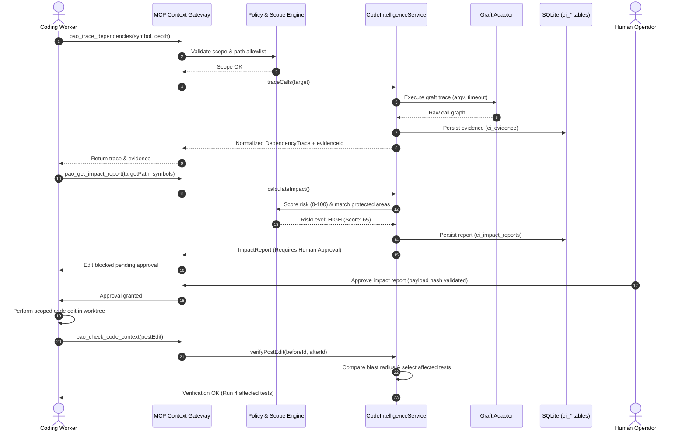

# Phase 20.62 — Pao-hubPro × Graft

## Living Codebase Context Graph, Cross-Agent Repository Intelligence, Dependency & Blast-Radius Analysis, MCP Context Gateway & Policy-Governed Coding Intelligence Runtime

> Document version: 1.0 — complete implementation blueprint, 2026-09-17.  
> Status: Implementation target; production acceptance is NOT asserted.  
> Scope: One Phase, preserving the original Phase number (20.62) and name.  
> Governing request: `PAO-HUBPRO_MASTER_PHASE_REQUEST.md`, explicitly authorized by the project owner.  
> Primary architectural rule: **Graft informs. Pao-hubPro decides. Workers execute. Reviewers verify. Humans authorize high-risk actions.**

This document is a complete, production-oriented implementation blueprint for Phase 20.62 of Pao-hubPro. It establishes a governed repository intelligence layer around Graft so every coding agent obtains consistent, fresh, and auditable codebase context before modifying or reviewing code.

---

## 1. Executive Summary

Phase 20.62 delivers a governed, living codebase context graph and blast-radius intelligence layer for Pao-hubPro. By integrating upstream Graft (`@nanonets/graft`, Node.js >= 20, MIT) through a provider-neutral abstraction (`CodeIntelligenceProvider`), Pao-hubPro transitions from speculative, unguided prompt exploration to structured, dependency-aware coding orchestration.

Key capabilities introduced by this Phase include:
1. **Provider-Neutral Code Intelligence**: A stable internal contract shielding Pao-hubPro from upstream Graft CLI/MCP changes.
2. **Production Graft Adapter**: Local, deterministic tree-sitter AST parsing for structural graphs without requiring cloud LLM keys, with optional deep semantic enrichment.
3. **Pao-hubPro MCP Context Gateway**: Seven Pao-owned tools (`pao_repo_map`, `pao_find_code`, `pao_file_api`, `pao_find_all`, `pao_trace_dependencies`, `pao_check_code_context`, `pao_get_impact_report`) replacing raw, unmonitored MCP endpoints.
4. **Pre-Edit Impact Gate**: Quantitative 0-100 risk scoring evaluating direct/transitive dependents, protected modules, schema migrations, and freshness prior to code mutations.
5. **Post-Edit Verification Gate**: Pre/post impact delta analysis (`ImpactDelta`) detecting unexpected dependency expansion, paired with an Affected-Test Planner.
6. **Multi-Repository Federation & Scopes**: Strict directory/workspace boundaries preventing path traversal and cross-repo data leakage.
7. **Safe Governance Defaults**: Telemetry disabled by default (`PAO_GRAFT_TELEMETRY=false`), machine-wide agent config writes blocked (`PAO_CODEINTEL_ALLOW_MACHINE_WIDE_CONFIG=false`), and fail-closed freshness policies.

---

## 2. Problem Statement

Without a persistent, shared codebase context graph, multi-agent coding workflows suffer from four severe systemic failures:

1. **Token Waste & Latency**: Every worker agent (Codex, Claude Code, Gemini CLI, local models) repeatedly scans the filesystem, reads entire files, and traces imports from scratch across turns.
2. **Inconsistent Mental Models**: Different LLM agents independently form conflicting, fragmented representations of the same repository, leading to architectural drift.
3. **Blind Mutations & Silent Breakages**: Workers modify functions, types, and schemas without visibility into upstream callers or downstream consumers, causing cascading regressions.
4. **Post-Hoc Review Burden**: Reviewers (human operators and automated Reviewer Councils) are forced to reconstruct dependency blast radiuses manually after code diffs are already written.

Phase 20.62 enforces **context before mutation**: every code modification must be preceded by an authenticated impact assessment.

---

## 3. Goals

- Establish a decoupled `CodeIntelligenceProvider` contract supporting Graft as the primary provider with pluggable fallbacks.
- Support local, zero-cost structural graph generation across TypeScript, JavaScript, Python, Go, Rust, and C/C++ via tree-sitter.
- Keep deep LLM enrichment completely optional and routed strictly through Pao-hubPro's approved AI Gateway (Phase 20.13/20.51).
- Provide a secure MCP Context Gateway enforcing caller RBAC, path allowlists, and secret redaction.
- Calculate a deterministic 0-100 impact risk score classifying edits into LOW, MEDIUM, HIGH, and CRITICAL tiers.
- Tie impact evidence directly to Phase 20.61 isolated Git worktrees and commit fingerprints.
- Enforce that HIGH and CRITICAL risk edits require fresh context, affected test coverage, and human approval.
- Detect graph freshness changes and invalidate stale approvals when candidate diffs mutate.
- Support multi-repository workspaces without crossing declared tenant or trust boundaries.
- Retain 100% backward compatibility with existing Agent OS, Council, and Workflow subsystems.

---

## 4. Non-Goals

- Graft MUST NOT become the canonical database, task queue, or authorization authority of Pao-hubPro.
- Remote agents MUST NOT be granted direct access to raw Graft CLI or unauthenticated Graft MCP sockets.
- Machine-wide configuration modifications (e.g. `~/.codex/config.toml`, `~/.claude/`) MUST NOT occur automatically.
- Telemetry and cloud phone-home features MUST NOT be enabled by default.
- Cloud LLM API keys MUST NOT be mandatory for building structural dependency graphs.
- Phase 20.62 MUST NOT replace or duplicate Phase 20.61 worker session orchestration, worktree management, or leasing.
- Automated test passing alone MUST NOT bypass human approval gates for critical infrastructure or schema mutations.

---

## 5. Why This Phase Exists

As Pao-hubPro evolves into a coordinated multi-agent engineering control plane, code context cannot remain disposable prompt trivia. Code intelligence is a governed runtime capability.

Applying the repository's 7-rung minimal-code decision ladder:
1. **YAGNI**: Ad-hoc full-file dumping is unscalable; structured graph indexing is necessary for complex codebases.
2. **Reuse**: Pao-hubPro reuses tree-sitter graph extraction via Graft rather than reinventing language AST parsers.
3. **Standard Library / Native**: AST parsing in pure TypeScript is slow; native compiled bindings provided by upstream binaries offer orders-of-magnitude faster indexation.
4. **Adapter Isolation**: Upstream `@nanonets/graft` is isolated behind `GraftProvider` and `GraftProcessRunner`; no upstream types contaminate Pao core.
5. **Governance Integration**: The blast-radius output directly feeds Pao-hubPro's existing Policy Engine and Reviewer Council.

---

## 6. Relationship to Pao-hubPro

Phase 20.62 maps directly into Pao-hubPro's layered architecture:

| Layer | Component | Phase 20.62 Integration Point |
|---|---|---|
| **01 Client Layer** | Web Dashboard / CLI | `gui/src/pages/CodeIntelligence.tsx`, `ocx codeintel` commands |
| **04 Orchestration** | Reviewer Council / Planner | Pre-edit blast radius fed to Council; post-edit verification |
| **05 MCP Gateway** | MCP Gateway Protocol | Governed tool exposure (`pao_repo_map`, `pao_trace_dependencies`) |
| **06 Capability Registry**| Agent Capabilities | Enforces `codeintel.read`, `codeintel.query`, `codeintel.impact` |
| **07 Policy Engine** | Governance Gateway | Pre-Edit Impact Gate rules, protected area policies |
| **08 Approval Engine** | Human Approval Center | Risk score >= 50 escalates to mandatory human review |
| **09 Execution Runtime** | Phase 20.61 Worker Runtime | Context packs delivered to workers; worktree fingerprint binding |
| **12 State Layer** | SQLite (`ar_tasks`, `ci_*`) | Persisted graph builds, evidence IDs, and impact reports |
| **16 Observability** | Observability Engine | Graph build durations, stale graph metrics, query latencies |
| **17 Audit Layer** | Execution Audit | Durable audit rows for every code query, build, and decision |

Core isolation guarantees: Disabling Phase 20.62 (`PAO_GRAFT_ENABLED=false`) completely deactivates all subprocess spawns, graph background timers, and route registrations. The primary proxy request path remains 100% decoupled from code intelligence modules.

---

## 7. Upstream / External Project

### 7.1 Upstream Provenance & Pinning
- **Repository**: `https://github.com/trailhq/Graft`
- **Package**: `@nanonets/graft`
- **Verified Version**: `0.18.0`
- **License**: MIT (Verified 2026-09-15)
- **Runtime Requirement**: Node.js `>= 20.0.0` (or compatible Bun runtime environment)

### 7.2 Upstream Functional Baseline
- `graft build`: Builds structural graph and file summaries via tree-sitter locally without API keys.
- `graft build --deep`: Adds semantic summaries using configured LLMs.
- `graft check`: Returns repository freshness against working tree uncommitted changes.
- `graft/`: Local output cache directory (always gitignored).
- Monorepo / Multi-repo: Natively traverses workspaces, nested Git roots, and submodules.
- Telemetry: Built-in anonymous usage reporting. **Mandatory Pao policy: disable via `DO_NOT_TRACK=1` and CLI telemetry flags.**

### 7.3 Adapter Boundary & Four Ownership Domains

| Domain | Owned By | Contained Logic |
|---|---|---|
| **A. Upstream Project** | `trailhq/Graft` | Tree-sitter parsers, graph database, CLI binary, symbol extractor |
| **B. Pao Adapter** | `GraftProvider` | Subprocess execution, JSON normalization, error translation, version check |
| **C. Pao Policy Wrapper** | `CodeIntelScope` | Repository allowlists, path traversal rejection, secret masking, risk scoring |
| **D. Pao Extensions** | `ImpactGate` / `Council` | Pre/post impact diff, affected-test planner, worktree evidence binding |

---

## 8. Current-State Assumptions

- **Repository Status**: Pao-hubPro (`paohupbypaoza` branch) is a Bun-native TypeScript project.
- **Existing Code Intelligence Modules**: Baseline files exist under `src/agent-os/code-intelligence/` (service, store, config, types, risk, scope, graft runner/adapter).
- **Database Schema**: Existing SQLite store uses `AGENT_OS_SCHEMA_VERSION = 51`. Schema v50 introduced seven `ci_*` tables (`ci_repositories`, `ci_workspace_repositories`, `ci_graph_builds`, `ci_evidence`, `ci_impact_reports`, `ci_provider_status`, `ci_audit`).
- **Test Fixtures**: Initial tests exist in `tests/code-intelligence.test.ts` using `tests/helpers/graft-fake.ts`.
- **UI Surface**: Dashboard page exists at `gui/src/pages/CodeIntelligence.tsx`.

Any unverified runtime behaviors are treated as **Proposed Pao-hubPro Extensions** until confirmed by live test execution.

---

## 9. Target Architecture

```text
┌────────────────────────────────────────────────────────────────────────┐
│                         Pao-hubPro Control Plane                       │
│                                                                        │
│   Agent / Dashboard / MCP Client                                       │
│                 │                                                      │
│                 ▼                                                      │
│   ┌───────────────────────────┐                                        │
│   │ Pao MCP Context Gateway   │  (pao_repo_map, pao_trace_dependencies)│
│   └─────────────┬─────────────┘                                        │
│                 │                                                      │
│        ┌────────┴────────┐                                             │
│        ▼                 ▼                                             │
│   Auth & Scope     Policy Engine (Risk & Protected Paths)              │
│        │                 │                                             │
│        └────────┬────────┘                                             │
│                 ▼                                                      │
│   ┌───────────────────────────┐                                        │
│   │ CodeIntelligenceProvider  │  (Provider-neutral interface)          │
│   └─────────────┬─────────────┘                                        │
│                 │                                                      │
│          Graft Adapter                                                 │
│                 │                                                      │
│      ┌──────────┴──────────┐                                           │
│      ▼                     ▼                                           │
│  Tier 1: Structural   Tier 2: Deep Enrichment (Optional via AI Gateway)│
│  (tree-sitter, local)      │                                           │
│      │                     │                                           │
│      └──────────┬──────────┘                                           │
│                 ▼                                                      │
│   ┌───────────────────────────┐                                        │
│   │ Evidence & Normalizer     │  (Normalized digests & fingerprinting) │
│   └─────────────┬─────────────┘                                        │
│                 │                                                      │
│        ┌────────┴────────┐                                             │
│        ▼                 ▼                                             │
│   Pre-Edit Gate    Post-Edit Verification                              │
│        │                 │                                             │
│        ▼                 ▼                                             │
│   Risk Decision     Impact Delta & Test Planner                        │
│        │                 │                                             │
│        └────────┬────────┘                                             │
│                 ▼                                                      │
│    Audit Log & Observability                                           │
└─────────────────┬──────────────────────────────────────────────────────┘
                  │
                  ▼
    Phase 20.61 Worker Runtime (Isolated Worktree Execution)
```

---

## 10. Architecture Diagram



---

## 11. Core Components

All components are housed in `src/agent-os/code-intelligence/`:

1. `CodeIntelligenceService` (`service.ts`): Central facade coordinating graph builds, queries, risk calculations, and evidence generation.
2. `CodeIntelligenceStore` (`store.ts`): Typed SQLite store managing repository entities, graph build records, evidence, and audit trails.
3. `CodeIntelScopePolicy` (`scope.ts`): Validates path boundaries, canonicalizes paths, enforces denied prefixes, and manages cross-repo permissions.
4. `ImpactRiskModel` (`risk.ts`): Deterministic 0-100 scoring algorithm translating graph metrics into policy decisions.
5. `GraftAdapter` (`provider/graft/adapter.ts`): Subprocess abstraction executing Graft CLI with argv arrays, secret masking, and JSON parsing.
6. `GraftProcessRunner` (`provider/graft/runner.ts`): Low-level execution manager enforcing timeouts, buffer caps, and process tree termination.
7. `FallbackProvider` (`provider/fallback.ts`): Graceful degradation provider supplying basic regex/file search when Graft is unavailable.
8. `CodeIntelMcpTools` (`mcp-tools.ts`): Pao-hubPro WebMCP tool definitions exposing governed intelligence to agents.

---

## 12. Component Responsibilities

### 12.1 CodeIntelligenceProvider Interface (`src/agent-os/code-intelligence/types.ts`)

```ts
export interface CodeIntelligenceProvider {
  readonly key: string;
  healthCheck(): Promise<ProviderHealth>;
  buildGraph(input: BuildGraphInput): Promise<GraphBuildResult>;
  checkFreshness(input: FreshnessInput): Promise<FreshnessReport>;
  getRepositoryMap(input: RepositoryMapInput): Promise<RepositoryMap>;
  findCode(input: FindCodeInput): Promise<CodeSearchResult[]>;
  getFileApi(input: FileApiInput): Promise<FileApiSurface>;
  findAll(input: FindAllInput): Promise<CodeOccurrence[]>;
  traceCalls(input: TraceCallsInput): Promise<DependencyTrace>;
}
```

### 12.2 Subprocess Security & Runner Rules
- **Argv Arrays Only**: Commands are executed strictly via `execFile` with explicit argument arrays. Shell string interpolation (`cmd /c` or `bash -c`) is prohibited.
- **Timeout & Memory Caps**: Maximum query execution time defaults to 30s; graph build defaults to 300s. Buffer outputs are capped at 8MB.
- **Process Cleanup**: Subprocess trees are terminated with `SIGKILL` upon timeout expiration.
- **Secret Redaction**: Environment variables passed to Graft are sanitized; output logs pass through pattern-based secret redaction before storage.

---

## 13. Data Flow

1. **Intake & Scope Binding**: Incoming tool requests are authenticated and mapped to an authorized repository ID and path scope.
2. **Graph Build / Freshness Check**: The provider inspects `.graft/` cache against current Git working tree status. If uncommitted changes exist, Graft performs incremental re-parsing.
3. **Query Execution**: AST symbol search, file API skeleton extraction, or call graph tracing runs via `GraftAdapter`.
4. **Evidence Generation**: Output digests, query parameters, and freshness metadata are saved into `ci_evidence` and returned as immutable evidence IDs.
5. **Pre-Edit Impact Evaluation**: Symbol references and changed files are evaluated by `scoreImpact()`, generating a persisted `ci_impact_reports` record.
6. **Worker Consumption**: The worker receives a bounded `CodeContextPack` containing only relevant symbols, dependencies, and risk constraints.
7. **Post-Edit Delta**: After file edits, the graph is re-checked. `ImpactDelta` computes added/removed dependencies and triggers test planning.

---

## 14. Control Flow

### 14.1 Pre-Edit Impact Gate Flow

```text
Edit Request Received
       ↓
[Extract Target Symbols & Paths]
       ↓
[Graft Dependency Trace: Inbound & Outbound]
       ↓
[Calculate Metrics: Direct & Transitive Dependents]
       ↓
[Check Protected Paths: auth, db, router, deploy]
       ↓
[Evaluate Freshness: fresh / stale / missing]
       ↓
[Score Impact: 0 - 100 Points]
       ↓
 ┌─────────────────┬─────────────────┬─────────────────┐
 │ 0 - 24: LOW     │ 25 - 49: MEDIUM │ 50 - 74: HIGH   │ 75 - 100: CRITICAL
 ▼                 ▼                 ▼                 ▼
Allow mutation    Allow mutation    Require Indep.    Block autonomous edit;
Normal tests      Attach report     Reviewer + Tests  Require Operator Approval
                  Reviewer required Mandatory Approval Council Review Required
```

---

## 15. Agent / Worker Model

Phase 20.62 serves context to multiple agent personas while strictly enforcing least-privilege context boundaries:

1. **Planner Agent**: Uses `pao_repo_map` and `pao_find_code` to understand module architecture and break requests into bounded tasks.
2. **Implementer Worker**: Queries `pao_file_api` and `pao_trace_dependencies` for immediate targets; must obtain an Impact Report before code mutations.
3. **Tester Worker**: Reads affected-test suggestions from the impact report to execute targeted test suites rather than unguided full test runs.
4. **Reviewer Agent / Council**: Receives the `ImpactDelta` showing before/after blast radiuses; operates with strictly read-only context privileges.
5. **Recovery Controller**: Verifies graph build status during task recoveries to prevent workers from resuming against corrupt or missing AST caches.

---

## 16. Session / State Model

### 16.1 Graph Lifecycle State Machine

```text
UNINITIALIZED
     │
     ▼ (buildGraph)
  BUILDING ─────────► FAILED
     │
     ▼ (build success)
   READY ◄──────────┐
     │              │
     ▼ (file edit)  │ (check/refresh)
   STALE            │
     │              │
     ▼ (rebuild)    │
 REFRESHING ────────┘
     │
     ▼ (error)
  DEGRADED
```

- **READY**: Graph is fresh and synchronized with the working tree.
- **STALE**: Files modified since last build; permitted for LOW-risk queries, blocked for HIGH/CRITICAL mutations.
- **DEGRADED**: Provider failed or syntax errors occurred; fallback provider is engaged with reduced-confidence flags.
- **FAILED**: Structural build process crashed; operator intervention or clean rebuild required.
- **DISABLED**: Module turned off via configuration.

Transitions are strictly enforced via `assertGraphTransition()` in `src/agent-os/code-intelligence/types.ts`.

---
## 17. MCP Integration

Phase 20.62 exposes code intelligence exclusively through Pao-hubPro's governed MCP Context Gateway (`src/agent-os/code-intelligence/mcp-tools.ts`). Untrusted agents are never permitted to interact with raw Graft MCP sockets or bypass Pao authorization.

### 17.1 Governed Context Tool Catalog

1. `pao_repo_map` (Risk: R0, Read-only): Returns top-level architecture clusters, file counts, hotspots, and coupling summaries.
2. `pao_find_code` (Risk: R0, Read-only): Semantic and structural AST symbol search answering architectural queries.
3. `pao_file_api` (Risk: R0, Read-only): Extracts skeletal file API contracts, exports, classes, methods, and type signatures.
4. `pao_find_all` (Risk: R0, Read-only): Performs exhaustive symbol and reference searches across permitted workspace paths.
5. `pao_trace_dependencies` (Risk: R0, Read-only): Traces inbound callers and outbound callees up to an authorized depth ceiling.
6. `pao_check_code_context` (Risk: R0, Read-only): Evaluates AST graph freshness against current Git working tree uncommitted changes.
7. `pao_get_impact_report` (Risk: R1, Analysis & Evidence Creation): Calculates pre-edit blast-radius risk score (0-100) and persists evidence.

### 17.2 Tool Schemas & Input Validation

- **Repository Isolation**: Every tool call requires a valid `repositoryId`. Arbitrary absolute paths provided by callers are strictly rejected.
- **Path Scope Enforcement**: `pathScope` parameters must resolve within the registered repository root and cannot match denied prefixes.
- **Depth Clamping**: Traversal depth in `pao_trace_dependencies` is clamped between 1 and `PAO_CODEINTEL_MAX_TRACE_DEPTH` (default: 5).
- **Response Bounding**: Payloads exceeding `PAO_CODEINTEL_MAX_RESPONSE_BYTES` (256KB) are truncated with an explicit `truncated: true` flag and evidence pointer.

---

## 18. Capability Registry

Code intelligence permissions are governed by explicit fine-grained capabilities:

- `codeintel.read`: Read repository maps, file skeletons, and freshness reports.
- `codeintel.query`: Execute symbol searches, reference traces, and call graphs.
- `codeintel.impact`: Generate pre-edit impact reports and risk assessments.
- `codeintel.build`: Trigger structural graph re-indexing or cache clearing.
- `codeintel.deep_enrich`: Trigger optional LLM-backed concept enrichment (gated by AI Gateway quota).
- `codeintel.admin`: Register repositories, modify path scopes, or configure providers.
- `codeintel.machine_config.write`: Modify machine-wide developer configuration (Disabled by default; Human operator only).

### Role Mapping Matrix

| Capability | Planner | Implementer | Tester | Reviewer | Operator / Admin |
|---|---|---|---|---|---|
| `codeintel.read` | Yes | Yes | Yes | Yes | Yes |
| `codeintel.query` | Yes | Yes | Yes | Yes | Yes |
| `codeintel.impact` | Yes | Yes | No | Yes | Yes |
| `codeintel.build` | No | Yes | No | No | Yes |
| `codeintel.deep_enrich` | No | No | No | No | Yes (Opt-in) |
| `codeintel.admin` | No | No | No | No | Yes |
| `codeintel.machine_config.write` | Deny | Deny | Deny | Deny | Deny (Explicit prompt) |

---

## 19. Policy Model

The Pre-Edit Impact Gate implements a transparent, deterministic scoring algorithm (0-100 points) implemented in `src/agent-os/code-intelligence/risk.ts`.

### 19.1 Risk Factor Weights

1. **Direct Dependents**: +3 points per dependent symbol/file (Max: 20 pts).
2. **Transitive Dependents**: +2 points per transitive dependent beyond direct (Max: 15 pts).
3. **Cross-Repository Edges**: +5 points per cross-repo boundary crossed (Max: 10 pts).
4. **Protected Area Matches**: +15 points per matched protected pattern (Max: 30 pts).
5. **Public API Impact**: +10 points if targeting public interfaces or exports.
6. **Database & Schema Changes**: +15 points for migrations, schema definitions, or DB layer files.
7. **Auth & Security Relevance**: +15 points for auth, vault, security, or policy files.
8. **Deployment & Infra Impact**: +10 points for Dockerfiles, CI workflows, or deploy scripts.
9. **Test Coverage Uncertainty**: Up to +15 points if no affected tests are identified.
10. **Graph Freshness Penalty**: +0 if fresh, +10 if stale, +20 if graph is missing.
11. **Large Diff Penalty**: +1 point per file modified beyond 5 files (Max: 10 pts).

### 19.2 Risk Tiers & Enforcement Rules

- **LOW (0 - 24 points)**: Safe local edit. Autonomous worker may proceed. Standard unit tests required.
- **MEDIUM (25 - 49 points)**: Moderate risk. Autonomous worker may proceed. Impact report attached to PR; peer review required before merge.
- **HIGH (50 - 74 points)**: Substantial blast radius. Independent reviewer required. Affected test suite execution mandatory. Human approval strictly required before merge.
- **CRITICAL (75 - 100 points)**: Core system or security impact. Autonomous mutations blocked by default. Explicit operator approval, 100% fresh graph, and Reviewer Council audit required.

---

## 20. Security Model

### 20.1 Path Traversal & Denied Prefixes
All repository paths are canonicalized via `realpath`. Requests attempting to escape the registered repository root or access the following sensitive prefixes are blocked immediately:
```text
.env
.env.*
secrets/
credentials/
private-keys/
*.pem
*.key
*.p12
*.pfx
vault/
backups/
production-dumps/
```

### 20.2 Subprocess Isolation & Sandboxing
- Graft is executed with `execFile` using explicit argument arrays.
- `DO_NOT_TRACK=1` and `--no-telemetry` are enforced on every invocation.
- Environment variables are filtered to pass only essential system paths (`PATH`, `HOME`, `TEMP`). Host API keys and credentials are never inherited.
- Process execution times out after 30s (queries) or 300s (builds), terminating subprocess trees cleanly.

### 20.3 Machine-Wide Configuration Guard
Upstream Graft features that attempt to write global hooks into `~/.codex/` or `~/.claude/` are disabled (`PAO_CODEINTEL_ALLOW_MACHINE_WIDE_CONFIG=false`). Pao-hubPro communicates with Graft via scoped project-level CLI/adapters without altering global developer environments.

---

## 21. Approval Model

Human approval is required for all HIGH and CRITICAL risk changes and is strictly bound to cryptographic digests:

1. **Impact Report Digest**: Every impact report calculates `reportHash = sha256Hex(canonicalJson(report.summary))`.
2. **Patch & Tree Fingerprint**: Before human review, the Git diff SHA and working tree commit hash are bound to the approval request.
3. **Stale Approval Invalidation**: If the implementer modifies the code after approval is requested, the working tree fingerprint changes, marking the pending approval `stale`.
4. **One-Time Consumption**: Once an approval is consumed to promote or merge a change, it is retired and cannot be reused.

---

## 22. Failure Handling

| Failure Mode | Detection | Immediate Behavior | Recovery |
|---|---|---|---|
| **Graft Binary Missing** | ENOENT on spawn | FallbackProvider engaged; health marked `degraded` | Alert operator to install `@nanonets/graft` via npm |
| **Incompatible Graft Version** | `graft --version` mismatch | Adapter returns `CODEINTEL_VERSION_MISMATCH` | Reject builds; enforce pinned version `0.18.0` |
| **Node Runtime < 20** | Engine inspection | Health reports `incompatible_runtime` | Block execution; alert operator |
| **Stale Graph on HIGH Risk** | `graft check` detects unindexed files | Pre-Edit Impact Gate throws `CODEINTEL_GRAPH_STALE` | Trigger automated `buildGraph()` refresh before proceeding |
| **Subprocess Timeout** | Timeout timer fires (30s/300s) | Terminate process tree; throw `CODEINTEL_TIMEOUT` | Return partial results if safe or mark operation failed |
| **Corrupted .graft Cache** | SQLite read error in Graft cache | Graph state transitions to `FAILED` | Remove `.graft/` directory and trigger clean rebuild |
| **Scope Violation / Path Escape**| Path canonicalization check | Immediate 403 `CODEINTEL_SCOPE_VIOLATION` | Log security audit event; block task |

---

## 23. Recovery Model

1. **Automated Graph Recovery**: If an AST build fails midway, the graph transitions to `FAILED`. A subsequent query triggers an isolated rebuild with an exponential backoff circuit breaker.
2. **Cache Pruning**: Corrupted or out-of-date `.graft/` directories can be purged without affecting canonical Pao-hubPro SQLite state.
3. **Worker Context Rehydration**: When a Phase 20.61 worker recovers after a crash, it queries `pao_check_code_context`. If fresh, execution resumes immediately; if stale, a quick incremental check is executed.

---

## 24. Observability

Metrics are exported without high-cardinality or sensitive labels (no paths, symbols, or prompts):
- `codeintel_queries_total{operation, status}`: Total code intelligence queries.
- `codeintel_query_latency_ms`: Histogram of query execution latencies.
- `codeintel_graph_build_duration_seconds`: Histogram of graph build times.
- `codeintel_graph_stale_total`: Counter of stale graph detections.
- `codeintel_impact_risk_level_total{level}`: Gauge of impact reports by risk level.
- `codeintel_policy_blocks_total`: Counter of mutations blocked by policy.
- `codeintel_fallback_total`: Counter of queries handled by FallbackProvider.

---

## 25. Audit

Durable audit events are persisted in `ci_audit` with correlation IDs:
- `CODEINTEL_QUERY_REQUESTED`: Logged when an agent initiates a search or trace.
- `CODEINTEL_IMPACT_CREATED`: Logged when an impact report and risk score are generated.
- `CODEINTEL_RISK_ESCALATED`: Logged when a change exceeds MEDIUM risk.
- `CODEINTEL_POLICY_BLOCKED`: Logged when an edit is halted due to stale graph or unapproved risk.
- `CODEINTEL_GRAPH_BUILD_COMPLETED`: Logged upon successful graph indexing.
- `CODEINTEL_VERSION_MISMATCH`: Logged if an unpinned Graft binary is detected.

---

## 26. Data Model

Schema v50 additive migrations in `src/agent-os/db.ts`:

```sql
-- Repositories
CREATE TABLE IF NOT EXISTS ci_repositories (
  id TEXT PRIMARY KEY,
  name TEXT NOT NULL,
  canonical_path TEXT NOT NULL UNIQUE,
  repo_type TEXT NOT NULL DEFAULT 'single',
  vcs_type TEXT NOT NULL DEFAULT 'git',
  remote_url TEXT,
  default_branch TEXT,
  trust_level TEXT NOT NULL DEFAULT 'trusted',
  sensitivity TEXT NOT NULL DEFAULT 'normal',
  indexing_enabled INTEGER NOT NULL DEFAULT 1,
  deep_enrichment_enabled INTEGER NOT NULL DEFAULT 0,
  provider_key TEXT NOT NULL DEFAULT 'graft',
  graph_state TEXT NOT NULL DEFAULT 'uninitialized',
  last_build_at TEXT,
  last_fingerprint TEXT,
  created_at TEXT NOT NULL,
  updated_at TEXT NOT NULL
);

-- Workspace Multi-Repo Linkages
CREATE TABLE IF NOT EXISTS ci_workspace_repositories (
  id TEXT PRIMARY KEY,
  workspace_id TEXT NOT NULL,
  repository_id TEXT NOT NULL,
  alias TEXT,
  cross_repo_trace_enabled INTEGER NOT NULL DEFAULT 0,
  trust_boundary TEXT NOT NULL DEFAULT 'trusted',
  created_at TEXT NOT NULL,
  UNIQUE(workspace_id, repository_id)
);

-- Graph Build Records
CREATE TABLE IF NOT EXISTS ci_graph_builds (
  id TEXT PRIMARY KEY,
  repository_id TEXT NOT NULL,
  provider TEXT NOT NULL,
  provider_version TEXT,
  build_mode TEXT NOT NULL DEFAULT 'structural',
  status TEXT NOT NULL DEFAULT 'started',
  fingerprint TEXT,
  started_at TEXT NOT NULL,
  completed_at TEXT,
  duration_ms INTEGER,
  indexed_files INTEGER,
  indexed_symbols INTEGER,
  error_code TEXT,
  error_summary TEXT
);
CREATE INDEX IF NOT EXISTS idx_ci_builds_repo ON ci_graph_builds(repository_id, started_at DESC);

-- Evidence Storage
CREATE TABLE IF NOT EXISTS ci_evidence (
  id TEXT PRIMARY KEY,
  repository_id TEXT NOT NULL,
  graph_build_id TEXT,
  operation TEXT NOT NULL,
  request_fingerprint TEXT NOT NULL,
  request_json TEXT NOT NULL DEFAULT '{}',
  result_digest TEXT NOT NULL,
  metadata_json TEXT NOT NULL DEFAULT '{}',
  freshness_state TEXT NOT NULL DEFAULT 'unavailable',
  provider TEXT NOT NULL,
  provider_version TEXT,
  actor_id TEXT NOT NULL,
  task_id TEXT,
  created_at TEXT NOT NULL
);
CREATE INDEX IF NOT EXISTS idx_ci_evidence_repo ON ci_evidence(repository_id, created_at DESC);

-- Impact Reports
CREATE TABLE IF NOT EXISTS ci_impact_reports (
  id TEXT PRIMARY KEY,
  repository_id TEXT NOT NULL,
  task_id TEXT,
  worktree_path TEXT,
  requested_by TEXT NOT NULL,
  target_type TEXT NOT NULL,
  target_ref TEXT NOT NULL,
  direction TEXT NOT NULL DEFAULT 'in',
  depth INTEGER NOT NULL DEFAULT 2,
  graph_build_id TEXT,
  freshness_state TEXT NOT NULL DEFAULT 'missing',
  fingerprint TEXT,
  direct_dependency_count INTEGER NOT NULL DEFAULT 0,
  transitive_dependency_count INTEGER NOT NULL DEFAULT 0,
  cross_repo_dependency_count INTEGER NOT NULL DEFAULT 0,
  affected_tests_json TEXT NOT NULL DEFAULT '[]',
  protected_json TEXT NOT NULL DEFAULT '[]',
  risk_score INTEGER NOT NULL DEFAULT 0,
  risk_level TEXT NOT NULL DEFAULT 'low',
  policy_decision TEXT NOT NULL DEFAULT 'allow',
  factors_json TEXT NOT NULL DEFAULT '[]',
  provider TEXT NOT NULL DEFAULT 'graft',
  reduced_confidence INTEGER NOT NULL DEFAULT 0,
  created_at TEXT NOT NULL
);
CREATE INDEX IF NOT EXISTS idx_ci_impact_repo ON ci_impact_reports(repository_id, created_at DESC);
CREATE INDEX IF NOT EXISTS idx_ci_impact_risk ON ci_impact_reports(risk_level);

-- Provider Status
CREATE TABLE IF NOT EXISTS ci_provider_status (
  id TEXT PRIMARY KEY,
  provider_key TEXT NOT NULL,
  repository_id TEXT,
  detected_version TEXT,
  expected_version_range TEXT,
  runtime_version TEXT,
  status TEXT NOT NULL DEFAULT 'unavailable',
  last_health_check_at TEXT,
  last_success_at TEXT,
  last_error_code TEXT,
  last_error_summary TEXT,
  capabilities_json TEXT NOT NULL DEFAULT '{}',
  created_at TEXT NOT NULL,
  updated_at TEXT NOT NULL
);

-- Audit Log
CREATE TABLE IF NOT EXISTS ci_audit (
  id TEXT PRIMARY KEY,
  action TEXT NOT NULL,
  decision TEXT NOT NULL,
  repository_id TEXT,
  actor_id TEXT NOT NULL,
  details_json TEXT NOT NULL DEFAULT '{}',
  created_at TEXT NOT NULL
);
```

---

## 27. API / Event Contracts

Endpoints live under `/api/agent-os/code-intelligence`:

- `GET /status`: Overall subsystem health, registered repositories count, provider status.
- `GET /repositories`: List registered repositories and current graph states.
- `POST /repositories`: Register new repository with canonical path and sensitivity level.
- `GET /repositories/:id`: Get repository details, graph freshness, and build history.
- `POST /repositories/:id/build`: Trigger structural or deep graph indexation.
- `POST /repositories/:id/check`: Check working tree freshness without a full rebuild.
- `POST /repositories/:id/map`: Retrieve repository cluster map and hotspot scores.
- `POST /repositories/:id/find`: Execute semantic/keyword symbol search.
- `POST /repositories/:id/file-api`: Extract skeletal API signatures for a specific file.
- `POST /repositories/:id/trace`: Trace inbound callers or outbound callees.
- `POST /repositories/:id/impact`: Generate pre-edit blast-radius analysis and risk decision.
- `GET /impact-reports/:id`: Retrieve stored impact report by ID.
- `GET /mcp-tools`: Export definitions for the 7 WebMCP context tools.

---

## 28. Configuration

```env
# Code Intelligence Master Switch
PAO_GRAFT_ENABLED=true
PAO_CODEINTEL_PROVIDER=graft

# Graft Upstream Path & Pinning
PAO_GRAFT_BIN=graft
PAO_GRAFT_PINNED_VERSION=0.18.0
PAO_GRAFT_VERSION_POLICY=compatible

# Privacy & Security Defaults
PAO_GRAFT_TELEMETRY=false
PAO_GRAFT_DEEP_ENRICHMENT=false
PAO_CODEINTEL_ALLOW_MACHINE_WIDE_CONFIG=false

# Resource & Query Limits
PAO_CODEINTEL_MAX_RESULTS=20
PAO_CODEINTEL_MAX_TRACE_DEPTH=5
PAO_CODEINTEL_MAX_RESPONSE_BYTES=262144
PAO_CODEINTEL_MAX_CONTEXT_PACK_BYTES=131072
PAO_CODEINTEL_MAX_QUERY_SECONDS=30
PAO_CODEINTEL_MAX_BUILD_SECONDS=300

# Risk Thresholds
PAO_CODEINTEL_REQUIRE_FRESH_FOR_HIGH_RISK=true
PAO_CODEINTEL_RISK_MEDIUM=25
PAO_CODEINTEL_RISK_HIGH=50
PAO_CODEINTEL_RISK_CRITICAL=75
```

---

## 29. Feature Flags

1. `PAO_GRAFT_ENABLED` (default: `false`): Master kill switch for code intelligence.
2. `PAO_GRAFT_DEEP_ENRICHMENT` (default: `false`): Controls LLM-backed concept summaries; keeps cloud keys optional.
3. `PAO_GRAFT_TELEMETRY` (default: `false`): Strictly enforces zero external tracking.
4. `PAO_CODEINTEL_ALLOW_MACHINE_WIDE_CONFIG` (default: `false`): Prevents automated writes to developer global directories.
5. `PAO_CODEINTEL_REQUIRE_FRESH_FOR_HIGH_RISK` (default: `true`): Blocks mutations on stale graphs for risk >= 50.

---

## 30. Repository / Module Structure

```text
src/
  agent-os/
    code-intelligence/
      config.ts                  # Configuration and threshold definitions
      fingerprint.ts             # Tree fingerprinting and hash generation
      mcp-tools.ts               # 7 WebMCP context tool definitions
      risk.ts                    # 0-100 impact risk scoring model
      scope.ts                   # Path allowlists and traversal guards
      service.ts                 # Central CodeIntelligenceService facade
      store.ts                   # SQLite operations for ci_* tables
      types.ts                   # Types, graph state machine, error classes
      provider/
        fallback.ts              # Basic regex search fallback provider
        graft/
          adapter.ts             # Graft CLI adapter with JSON normalization
          runner.ts              # Subprocess execution manager with timeouts
  server/
    management/
      code-intelligence-routes.ts# API routes under /api/agent-os/code-intelligence/*
gui/
  src/
    pages/
      CodeIntelligence.tsx       # UI dashboard for repositories, graphs, impact
tests/
  code-intelligence.test.ts      # Comprehensive test suite (risk, scope, graph, fallback)
  helpers/
    graft-fake.ts                # In-memory mock Graft CLI runner
docs/
  integrations/
    graft.md                     # Upstream compatibility record
  security/
    code-intelligence.md         # Security invariants and threat model
  runbooks/
    graft-code-intelligence.md   # Operational troubleshooting guide
```

---

## 31. Dashboard Integration

Accessible via the **Code Intelligence** tab in Pao-hubPro (`gui/src/pages/CodeIntelligence.tsx`):
- **Repository Status**: Displays registered repos, Git branches, graph state (READY, STALE, BUILDING), and last index timestamp.
- **Repository Map Explorer**: Visualizes directory clusters, file density, and hotspot coupling scores.
- **Pre-Edit Impact Inspector**: Allows operators to preview blast radiuses, affected callers, and risk scores before approving tasks.
- **Provider Health & Diagnostics**: Verifies Graft executable availability, Node.js version, telemetry status, and fallback state.

---

## 32. Dependencies

- **Required**: Node.js `>= 20.0.0` or Bun `>= 1.2`, SQLite (bundled `bun:sqlite`).
- **Recommended**: `@nanonets/graft@0.18.0` installed locally or available on `PATH`.
- **Optional**: Phase 20.13 AI Gateway for deep enrichment; Phase 20.61 Agent Runtime for isolated worktree execution.

---

## 33. Compatibility

- **Graft Version**: Pinned to `0.18.0`. Mismatched versions fail closed under `exact` policy, or warn under `compatible` policy.
- **Cross-Platform Pathing**: Uses normalized forward slashes for internal graph keys while supporting Windows drive letters and UNC paths safely.
- **Monorepo / Multi-Repo**: Natively queries parent workspaces without crossing unlinked repository boundaries.

---

## 34. Migration

1. Schema migration to version `50` in `src/agent-os/db.ts` creates the seven `ci_*` tables.
2. Non-destructive: Existing task, agent, and memory tables remain untouched.
3. Initial repository registration is performed via API or CLI without auto-indexing all local disks.

---

## 35. Rollback

1. Set `PAO_GRAFT_ENABLED=false` to immediately halt all code intelligence routines.
2. Delete `.graft/` folders in project repositories to free cache space.
3. Revert schema version in `db.ts` if no subsequent migrations have been applied.

---

## 36. Testing Strategy

- **Unit Tests**: Verifies risk calculation clamping (0-100), path traversal rejection (`../`, `~`), denied prefix filtering, and graph state transitions.
- **Mock Provider Tests**: Validates `GraftAdapter` command line generation and JSON output parsing using `tests/helpers/graft-fake.ts`.
- **Security Tests**: Asserts arbitrary CLI flag injections are rejected and machine-wide config writes are blocked.
- **Impact Verification**: Tests low-risk local edits vs. critical auth/database edits and confirms approval escalation.
- **Fallback Tests**: Tests graceful degradation to `FallbackProvider` when Graft binary is absent.

---

## 37. Acceptance Criteria

- [ ] Graft version pinned to `0.18.0` and verified in `docs/integrations/graft.md`.
- [ ] `CodeIntelligenceProvider` abstraction decouples Pao-hubPro from upstream Graft specifics.
- [ ] Structural AST graph builds locally without cloud LLM keys.
- [ ] Telemetry is verified disabled by default (`DO_NOT_TRACK=1`).
- [ ] Machine-wide developer config modifications default to denied.
- [ ] 7 WebMCP tools are exported and callable through the management gateway.
- [ ] Pre-Edit Impact Gate calculates deterministic 0-100 risk score.
- [ ] Edits with risk >= 50 strictly require independent reviewer and human approval.
- [ ] Post-Edit Verification Gate detects blast-radius expansion via `ImpactDelta`.
- [ ] Multi-repo workspaces enforce declared tenant boundaries.
- [ ] Sensitive paths (`.env`, `secrets/`, `*.pem`) are strictly denied from indexing.
- [ ] All unit and integration tests pass cleanly under `bun test tests/code-intelligence.test.ts`.

---

## 38. Implementation Roadmap

- **Stage 0: Upstream Verification** — Verify Graft `0.18.0` compatibility and licensing.
- **Stage 1: Persistence** — Apply schema v50 migrations in `src/agent-os/db.ts`.
- **Stage 2: Core Adapter** — Implement `GraftAdapter`, `GraftProcessRunner`, and `FallbackProvider`.
- **Stage 3: Scope & Risk** — Implement `CodeIntelScopePolicy` and `scoreImpact()` engine.
- **Stage 4: Service Facade** — Wire `CodeIntelligenceService` and link to Phase 20.61 worktrees.
- **Stage 5: MCP & API** — Register WebMCP tools and `/api/agent-os/code-intelligence/*` endpoints.
- **Stage 6: Dashboard** — Implement `CodeIntelligence.tsx` with graph status and impact inspector.
- **Stage 7: Test Suite & Hardening** — Validate test coverage against fixture repositories.
- **Stage 8: Controlled Staged Rollout** — Enable read-only repository maps before enabling impact gates.

---

## 39. Risks

1. **AST Parse Failure on Novel Syntax**: Mitigated by graceful fallback to regex search with `reduced_confidence` warnings.
2. **Large Monorepo Indexing Latency**: Mitigated by incremental caching in `.graft/` and 300s build timeouts.
3. **Dynamic Dispatch Blindspots**: Mitigated by test uncertainty penalties increasing risk scores when dynamic calls cannot be statically traced.
4. **Accidental Cloud Exfiltration**: Mitigated by keeping deep enrichment disabled by default and routing all LLM calls through local AI Gateway.

---

## 40. Security Checklist

- [ ] `PAO_GRAFT_TELEMETRY` confirmed `false`.
- [ ] `PAO_CODEINTEL_ALLOW_MACHINE_WIDE_CONFIG` confirmed `false`.
- [ ] Subprocess execution uses `execFile` with explicit argument arrays.
- [ ] Path canonicalization strictly prevents directory traversal escapes.
- [ ] Secret files (`.env*`, `*.key`) are completely excluded from graph summaries.
- [ ] High-risk edits on stale graphs fail closed.
- [ ] Read-only reviewers cannot trigger graph mutations or code edits.

---

## 41. Production Readiness Checklist

- [ ] Node.js `>= 20.0.0` verified on host/worker environment.
- [ ] `@nanonets/graft@0.18.0` installed in worker execution images.
- [ ] SQLite database backed up before v50 schema migration.
- [ ] Pre-edit impact gate tested on sample PR with intentional auth changes.
- [ ] Dashboard Code Intelligence page renders cleanly with zero console errors.

---

## 42. Future Extensions

- **Visual Call Graph in UI**: Interactive DAG exploration of symbol relationships in the React dashboard.
- **Automated Refactoring Simulation**: Real-time blast-radius previews as code is typed in the editor.
- **LSIF / SCIP Cross-Repository Indexing**: Deep cross-language symbol indexing for enterprise monorepos.

---

## 43. Definition of Done

Phase 20.62 is officially complete when:
1. Graft `0.18.0` compatibility is documented in `docs/integrations/graft.md`.
2. Security model and runbooks are documented in `docs/security/` and `docs/runbooks/`.
3. The provider-neutral `CodeIntelligenceProvider` and `GraftAdapter` pass all checks.
4. All seven `ci_*` tables are migrated and verified in SQLite.
5. The 7 WebMCP tools are functional and gated by authorization scopes.
6. The Pre-Edit Impact Gate accurately scores risks and blocks unapproved high-risk changes.
7. Post-edit verification calculates `ImpactDelta` and selects affected tests.
8. Telemetry and machine-wide config writes are proven disabled by default.
9. `bun test tests/code-intelligence.test.ts` passes with 100% success.
10. The vertical slice demonstrates safe context retrieval, impact analysis, and verified execution.

---

## 44. Codex One-Shot Implementation Prompt

Copy and paste the following prompt into Codex at the root of the Pao-hubPro repository to execute or verify this implementation:

```text
You are implementing and verifying Phase 20.62 in Pao-hubPro:
"Pao-hubPro × Graft — Living Codebase Context Graph, Cross-Agent Repository Intelligence, Dependency & Blast-Radius Analysis, MCP Context Gateway & Policy-Governed Coding Intelligence Runtime"

MISSION:
Integrate Graft (@nanonets/graft, Node >= 20, MIT) as a living codebase context graph provider. Pao-hubPro MUST remain the canonical authority for repository registration, identity, authorization, path scope, policy, risk, approval, audit, task lifecycle, and merge/deploy decisions.

STEPS:
1. Inspect the repository: check src/agent-os/code-intelligence/, src/agent-os/db.ts, and tests/code-intelligence.test.ts.
2. Confirm AGENT_OS_SCHEMA_VERSION contains the 7 ci_* tables (ci_repositories, ci_workspace_repositories, ci_graph_builds, ci_evidence, ci_impact_reports, ci_provider_status, ci_audit).
3. Validate CodeIntelligenceProvider in src/agent-os/code-intelligence/types.ts and GraftAdapter in provider/graft/adapter.ts with pinned version 0.18.0.
4. Verify safe defaults in config.ts: telemetry disabled (DO_NOT_TRACK=1), machine-wide agent config writes disabled, deep enrichment disabled by default.
5. Verify path traversal guards and denied prefixes (.env, secrets/, *.key) in scope.ts.
6. Verify Pre-Edit Impact Gate scoring in risk.ts: 0-100 points calculated from direct/transitive dependents, protected modules, schema changes, and freshness.
7. Verify risk tiers: LOW (0-24), MEDIUM (25-49), HIGH (50-74), CRITICAL (75-100). HIGH and CRITICAL strictly require independent review and human approval.
8. Verify the 7 WebMCP tools in mcp-tools.ts: pao_repo_map, pao_find_code, pao_file_api, pao_find_all, pao_trace_dependencies, pao_check_code_context, pao_get_impact_report.
9. Verify Phase 20.61 integration: bind context and impact reports to isolated worktree fingerprints.
10. Verify Post-Edit Verification: compare pre/post impact delta and select affected tests.
11. Run the test suite:
    bun test tests/code-intelligence.test.ts
12. Verify that all tests pass without errors and no secrets are committed.
```
