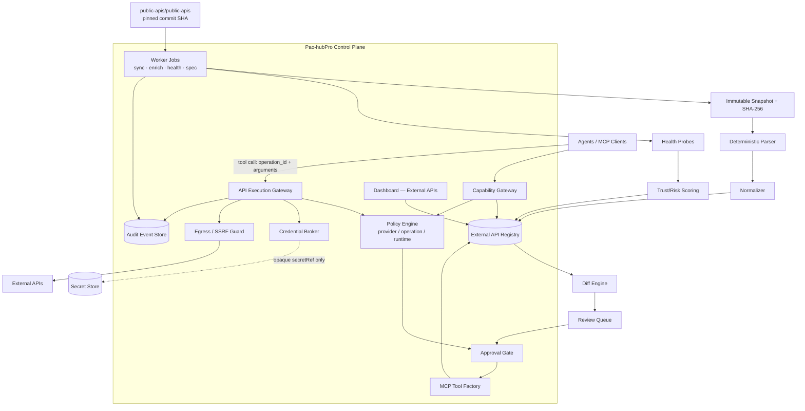
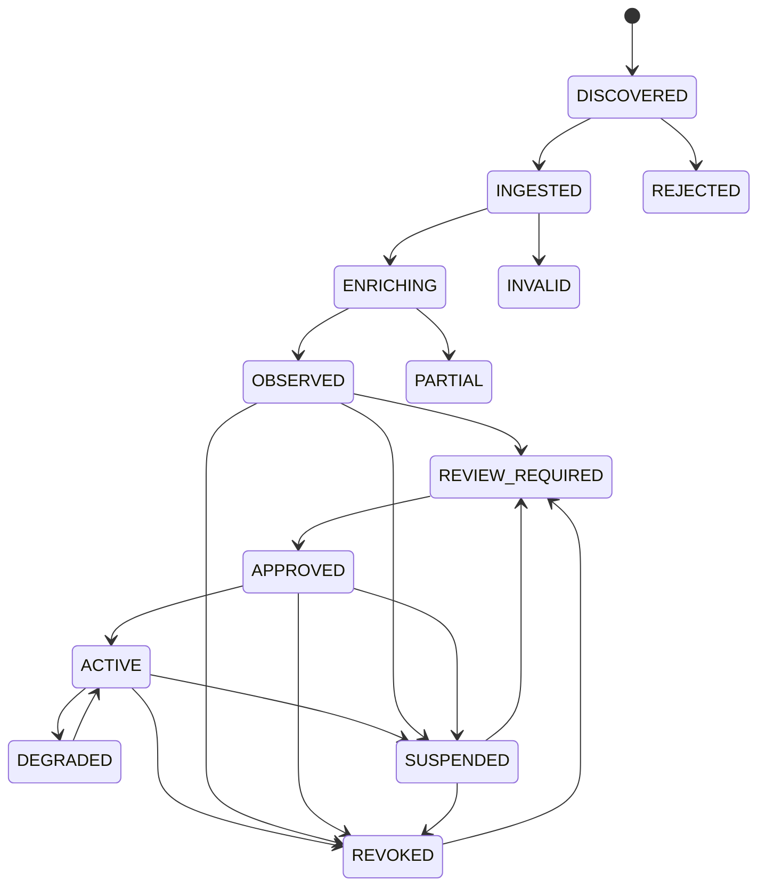

# Phase 20.63 — Pao-hubPro × Public APIs

## Universal External Capability Registry, Autonomous API Discovery, Health & Trust Intelligence, MCP Tool Generation & Policy-Governed API Access Gateway

> **Document type:** Production-Oriented Implementation Blueprint
> **Phase:** 20.63
> **Project:** Pao-hubPro
> **Source of Truth:** `Phase 20.63 — Pao-hubPro × Public APIs.md` (drafted 2026-09-15), processed under `PAO-HUBPRO_MASTER_PHASE_REQUEST.md`
> **Primary upstream:** `https://github.com/public-apis/public-apis`
> **Upstream license (verified at drafting, 2026-09-15):** MIT — re-verify before each compatibility release
> **Upstream data shape (verified at drafting, 2026-09-15):** Markdown category sections with `API | Description | Auth | HTTPS | CORS` table columns
> **Filename/content consistency:** Filename and document header agree on Phase 20.63; no collision detected.

> **Primary architectural rule:** **Public APIs supplies discovery evidence. Pao-hubPro owns normalization, policy, credential handling, health checks, trust intelligence, MCP exposure, runtime execution, approval, audit and revocation.**

---

## 1. Executive Summary

Phase 20.63 turns the community-curated `public-apis/public-apis` directory into a governed **External Capability Registry** inside Pao-hubPro. The upstream repository is treated strictly as *discovery evidence* — never as an authorization grant, availability proof, or safety certification.

The phase adds: a replaceable `ApiCatalogSource` abstraction with a `PublicApisGithubSource` adapter; deterministic Markdown parsing with drift protection and immutable SHA-256-pinned snapshots; a normalized provider registry with full provenance; a capability ontology (`<domain>.<resource>.<action>`) that agents search instead of URLs; bounded docs/OpenAPI discovery with spec validation; health intelligence with adaptive backoff; separate trust/risk/confidence scoring with versioned policy; a credential-broker boundary that keeps secrets out of LLM context; a mandatory SSRF/egress guard; a three-layer policy engine; OpenAPI-first MCP tool generation (disabled by default, human-approved); a single API Execution Gateway; feature flags; staged rollout (Stages A–G); and full audit/observability.

Central invariant:

> **Public APIs discovers. Pao-hubPro evaluates. Policy authorizes. Credential Broker authenticates. Execution Gateway calls. MCP exposes only approved capabilities. Humans approve high-risk actions.**

Never allow:

```text
Agent -> arbitrary URL -> raw API key -> external provider
```

Required flow:

```text
Agent
  -> Pao-hubPro Capability Gateway
  -> Identity + Scope
  -> Registry Search
  -> Provider/Operation Policy
  -> Credential Broker
  -> Egress/SSRF Guard
  -> API Execution Gateway
  -> External Provider
  -> Response Validator
  -> Audit + Metrics
  -> Agent
```

---

## 2. Problem Statement

Without an External Capability Registry, every Pao-hubPro agent independently searches for APIs and makes inconsistent, ungoverned choices:

```text
Agent A -> finds API X -> assumes it is safe
Agent B -> finds API Y -> stores API key in prompt
Agent C -> calls arbitrary URL directly
Agent D -> reimplements capability already available elsewhere
```

Consequences:

1. duplicated discovery work;
2. inconsistent provider selection;
3. secret leakage risk;
4. SSRF and unsafe egress risk;
5. untracked external data transfer;
6. unknown API reliability;
7. unknown terms/licensing constraints;
8. uncontrolled write actions;
9. no central revocation path;
10. no reusable MCP capability graph.

Phase 20.63 changes the workflow to:

```text
Task intent
   -> capability search
   -> candidate APIs
   -> provenance + health + trust evidence
   -> policy decision
   -> approved provider/operation
   -> credential broker
   -> execution gateway
   -> audited external request
   -> response validation
   -> agent result
```

---

## 3. Goals

1. A replaceable `ApiCatalogSource` abstraction; the runtime depends on the abstraction, never on GitHub parsing.
2. A production `PublicApisGithubSource` adapter pinned to upstream commit SHA per snapshot.
3. Deterministic parsing of the upstream README category tables with drift/quarantine protection.
4. Provenance snapshots, source hashes, and sync history; last known-good snapshot survives parser failure.
5. A normalized external API registry independent of upstream Markdown format.
6. Capability classification and semantic tagging with evidence, confidence and review state.
7. Bounded API documentation and OpenAPI/Swagger discovery with immutable spec snapshots.
8. Health checks with rate limiting, per-domain throttling, backoff and anti-abuse controls.
9. Trust intelligence with separate evidence, confidence and risk dimensions; versioned scoring policy.
10. Provider lifecycle states: `DISCOVERED`, `INGESTED`, `ENRICHING`, `OBSERVED`, `REVIEW_REQUIRED`, `APPROVED`, `ACTIVE`, `DEGRADED`, `SUSPENDED`, `REVOKED`, `REJECTED`, `INVALID`.
11. A credential broker boundary preventing secrets from entering LLM prompts or tool schemas.
12. SSRF-safe outbound request controls applied before every request and every redirect.
13. A policy engine covering provider registration, tool generation and runtime execution; fail-closed.
14. OpenAPI-first MCP tool generation bound to stable internal operation IDs and pinned spec snapshots.
15. Human approval for risky, mutating, credential-sensitive or ambiguous capabilities.
16. A single API Execution Gateway — agents never call arbitrary external APIs directly through this subsystem.
17. Rate-limit, quota, budget and cost-awareness hooks integrated with existing FinOps controls.
18. Evidence-backed audit logs for every registry change and external call.
19. Dashboard/API surfaces for discovery, health, trust, approval and revocation.
20. Worker jobs for sync, enrichment, validation, health checks and spec refresh.
21. Tests for parser drift, dead links, stale docs, SSRF, redirects, private-network targets, tool generation, auth scoping, rate limits and revocation.
22. Feature flags and staged rollout.
23. Rollback and data-retention procedures.
24. Documentation and operator runbooks.

---

## 4. Non-Goals

Phase 20.63 is NOT:

- a generic web crawler;
- a bypass around provider signup or terms of service;
- an API-key harvester;
- an automatic scraper of private documentation;
- an unrestricted HTTP proxy;
- a replacement for Pao-hubPro policy, approval, or the credential vault;
- a promise that every listed API is free forever or legal for every use case;
- an automatic production-enablement engine;
- a system that converts prose docs into write-capable tools without review;
- a replacement for task/session orchestration (Phase 20.61 owns that);
- a source-code intelligence system (Phase 20.62 / Graft owns that).

---

## 5. Why This Phase Exists

Pao-hubPro is becoming a multi-agent control plane with workers, memory, code intelligence, routing, credential governance and policy gates. Discovery today is per-agent and unaccountable; this phase centralizes it so that **discovery precedes execution, evidence precedes trust, and policy precedes exposure**.

### Integration expectations with existing phases

| Phase | Integration expectation |
|---|---|
| 20.50 / FinOps | Consume provider quota/cost metadata when available; record request counts and estimated spend; enforce per-provider and per-task budgets. |
| 20.51 / provider routing | Allow capability-level provider selection and fallback; do **not** reuse model-routing assumptions blindly for general APIs. |
| 20.53 / persistent memory | Store durable operator decisions and provider review notes outside transient agent prompts; memory must never override current policy or revoked status. |
| 20.57 / skill registry | Approved API-derived MCP tools may appear as capabilities/skills; keep external API provider records separate from agent skill records. |
| 20.59 / credential lifecycle | Reuse the credential vault/broker boundary; never create a parallel plaintext secret store. |
| 20.61 / worker runtime | Use workers for sync/enrichment/health/spec jobs; Phase 20.63 does not replace task/session orchestration. |
| 20.62 / Graft code intelligence | When generated adapters or MCP wrappers change code, request impact analysis before merge. |

---

## 6. Relationship to Pao-hubPro

```text
                     Pao-hubPro Control Plane
                               |
             +-----------------+------------------+
             |                 |                  |
             v                 v                  v
        Memory/Context     Credential/FinOps   Policy/Audit
             |                 |                  |
             +-----------------+------------------+
                               |
                               v
                     Phase 20.63 Registry
                               |
               +---------------+---------------+
               |               |               |
               v               v               v
          API Discovery   MCP Tool Factory  Execution Gateway
               |               |               |
               +---------------+---------------+
                               |
                               v
                        External APIs
```

### Layer mapping (Pao-hubPro core layers)

| Layer | Role in this phase |
|---|---|
| 02 AI / Agent Layer | Capability-search consumers; receive ranked candidates, never URLs. |
| 05 MCP Gateway | Hosts generated, approved external-API tools. |
| 06 Capability Registry | **Primary owner** — provider/operation/capability records. |
| 07 Policy Engine | Three-layer policy (provider / operation+tool / runtime call). |
| 08 Approval Engine | Review queue, approval requests for high-risk operations. |
| 09–11 Execution Runtimes | API Execution Gateway; worker jobs for sync/health/enrichment. |
| 12 State / Session Layer | Registry persistence, sync runs, rate-limit state. |
| 13 Memory / Knowledge Layer | Operator review notes persisted outside prompts. |
| 14 Secrets & Credential Layer | Credential broker adapter; opaque `secretRef` only. |
| 15 Event / Queue Layer | Audit events; job queue for workers. |
| 16 Observability Layer | Metrics, logs, traces with redaction. |
| 17 Audit Layer | Immutable `external_api.*` audit events. |
| 19 Web Dashboard | "External APIs" section. |
| 20 External Provider Layer | Upstream GitHub source + downstream external APIs. |

### Ownership boundaries

**Pao-hubPro core owns:** identity; RBAC/ABAC; policy; approval; audit; credential authority; canonical task state; feature flags; budgets; deployment authority; final provider approval/revocation state.

**Phase 20.63 owns:** external API registry; source synchronization; provenance; metadata normalization; capability classification; docs/spec discovery; health evidence; trust/risk evidence; provider and operation lifecycle; MCP generation metadata; API execution mediation; request/response validation; egress controls specific to API calls.

**`public-apis/public-apis` owns:** its curated list; its category organization; its contribution policy; its repository history.

**Never let upstream list membership become an authorization grant.**

---

## 7. Upstream / External Project

### Separation of concerns

| Part | Owner | Notes |
|---|---|---|
| A. Upstream project | `public-apis/public-apis` | Community-curated Markdown directory of public APIs. Do not fork or modify. |
| B. Pao-hubPro adapter | `PublicApisGithubSource` + README parser | Fetches raw README at pinned SHA; parses to `DiscoveredApiRecord[]`. |
| C. Pao-hubPro policy wrapper | Registry + policy engine + approval + revocation | All governance lives here. |
| D. Pao-hubPro extensions | Capability ontology, health/trust intelligence, MCP factory, execution gateway | Proposed Pao-hubPro capability, built in this phase. |

### Upstream facts (verified at drafting, 2026-09-15 — re-verify before implementation)

- Repository: `public-apis/public-apis`; purpose: manually/community-curated list of public APIs.
- License shown by repository: MIT.
- Main dataset represented in `README.md`; categories are Markdown sections; entries carry `API`, `Description`, `Auth`, `HTTPS`, `CORS` fields.
- The README links to a separate project/API for programmatic access. **Do not make that separate service a hard dependency** — the canonical source can be fetched directly from the repository snapshot.
- The upstream repository remains actively edited; current issues include reports of deprecated APIs and dead links. Therefore **presence in the upstream list is discovery evidence only, not availability or safety proof**.

### Risk assessment of upstream dependency

- **License:** MIT — suitable for ingestion with attribution; keep license evidence in the compatibility record (Section 33).
- **Maintenance status:** actively edited (both an asset and a risk: formatting may change).
- **API stability:** none to rely on — it is a Markdown file; the parser must be drift-protected and snapshots pinned.
- **Dependency risk:** low — data-only, fetched on demand, never runtime-critical; CI must not depend on live upstream availability.
- **Security surface:** the list contents are untrusted third-party URLs; every derived URL passes the SSRF/egress guard.
- **Upgrade strategy:** resolve branch head → pin commit SHA → fetch README at that SHA → hash → snapshot.
- **Vendor lock-in:** none — `ApiCatalogSource` is replaceable.
- **Fallback sources:** curated internal allowlists, OpenAPI registries, official vendor registries, operator-imported provider definitions, organization-approved partner catalogs.

Implementation consequence:

```text
Upstream README
    |
    v
Source Adapter
    |
    v
Immutable Snapshot
    |
    v
Parser + Normalizer
    |
    v
Pao-hubPro Registry
    |
    +--> Docs/Spec Enrichment
    +--> Health Intelligence
    +--> Trust/Risk Intelligence
    +--> Policy Review
    +--> MCP Tool Generation
    `--> Execution Gateway
```

The upstream repository may change formatting. Parsing must fail safely and preserve the last known-good registry snapshot.

---

## 8. Current-State Assumptions

These assumptions must be verified by the implementing agent (Codex) before code changes; each is tagged.

- **[Needs Verification] Runtime stack:** Bun-native TypeScript with no separate server compile step is the working assumption for Pao-hubPro; confirm package manager, module style and test framework by inspection.
- **[Needs Verification] Database/ORM/migration system:** unknown until inspection; all schema work must use the existing migration framework — do not create a parallel database stack.
- **[Needs Verification] Existing control-plane abstractions:** identity/auth, policy engine, approval workflow, credential vault/broker, audit/event store, worker/job runtime, MCP tool registry, dashboard framework. Phases 20.50–20.62 define these conceptually; confirm which exist in code and extend them rather than duplicating.
- **[Assumption] Feature-flag mechanism:** a config-driven flag facility exists or can be added per Pao-hubPro convention; if absent, implement typed config with safe defaults (Section 28).
- **[Assumption] Outbound HTTP client:** a single egress path can be centralized; if multiple HTTP clients exist, wrap them behind the egress guard rather than patching call sites ad hoc.
- **[Assumption] Standalone viability:** if the worker runtime or credential vault is not yet available, this phase still ships with a standalone path (Section 32) — manual sync trigger, file/in-memory registry storage, and deny-by-default credential handling.

**Do not introduce a parallel framework, ORM, database, worker queue, secret store, policy engine or MCP runtime if the project already has one. Extend the existing architecture cleanly.**

---

## 9. Target Architecture

```text
+--------------------------------------------------------------------------------+
|                               Pao-hubPro                                       |
|                                                                                |
|  +----------------------+     +----------------------+                          |
|  | Dashboard / API      |     | Agent / MCP Clients  |                          |
|  +----------+-----------+     +----------+-----------+                          |
|             |                            |                                      |
|             +--------------+-------------+                                      |
|                            v                                                    |
|                 +-------------------------+                                     |
|                 | Capability Gateway      |                                     |
|                 +------------+------------+                                     |
|                              |                                                  |
|          +-------------------+--------------------+                             |
|          |                   |                    |                             |
|          v                   v                    v                             |
|  +---------------+   +---------------+   +----------------+                    |
|  | Registry      |   | Policy Engine |   | Approval Gate  |                    |
|  +-------+-------+   +-------+-------+   +--------+-------+                    |
|          |                   |                    |                             |
|          +-------------------+--------------------+                             |
|                              v                                                  |
|                 +-------------------------+                                     |
|                 | MCP Tool Factory        |                                     |
|                 +------------+------------+                                     |
|                              |                                                  |
|                              v                                                  |
|                 +-------------------------+                                     |
|                 | API Execution Gateway   |                                     |
|                 +-----+--------------+----+                                     |
|                       |              |                                          |
|                       v              v                                          |
|             +-------------+  +---------------+                                  |
|             | Credential  |  | Egress / SSRF  |                                  |
|             | Broker      |  | Guard          |                                  |
|             +-------------+  +---------------+                                  |
|                       \              /                                          |
|                        \            /                                           |
|                         v          v                                            |
|                    External APIs                                                |
|                                                                                |
|  Background Intelligence:                                                      |
|  Source Sync -> Parse -> Normalize -> Docs/Spec -> Health -> Trust -> Review   |
+--------------------------------------------------------------------------------+
```

Core components (detailed responsibilities in Section 12):

1. **Source layer:** `ApiCatalogSource` abstraction; `PublicApisGithubSource`; deterministic README parser; snapshot store; validation reports.
2. **Registry layer:** provider/alias/document/spec/operation/capability repositories; registry service; diff service.
3. **Enrichment layer:** docs discovery; OpenAPI discovery; OpenAPI validation; capability classifier.
4. **Intelligence layer:** health service + probe runner + adaptive scheduler; circuit breaker; trust/risk evidence service; scoring service.
5. **Security layer:** URL policy; SSRF/egress guard; redaction service; credential broker adapter.
6. **Policy layer:** provider policy; operation/tool policy; runtime call policy; approval gate.
7. **Tooling layer:** MCP tool generator; tool registry adapter; first-party MCP tools.
8. **Execution layer:** API Execution Gateway; request builder; response validator; rate-limit service; budget hooks.
9. **Interface layer:** REST routes; MCP tools; dashboard UI.
10. **Operations layer:** worker jobs; schedules; observability.

---

## 10. Architecture Diagram



---

## 11. Core Components

| # | Component | Purpose |
|---|---|---|
| 1 | `ApiCatalogSource` | Replaceable source interface for any API catalog. |
| 2 | `PublicApisGithubSource` | First adapter: fetch + hash + parse + validate the upstream README. |
| 3 | README parser | Deterministic Markdown table → `DiscoveredApiRecord[]` with drift protection. |
| 4 | Snapshot store | Immutable, hash-addressed source snapshots + last-known-good pointer. |
| 5 | Registry service | Normalized provider records with provenance; aliases; retention policy. |
| 6 | Diff engine | Per-sync diff: adds/removes/changes; high-risk diff → review events. |
| 7 | Docs/OpenAPI discovery | Bounded discovery of docs pages and OpenAPI/Swagger specs. |
| 8 | OpenAPI validator | Sandboxed spec parsing with size/ref/server-URL limits; immutable spec snapshots. |
| 9 | Capability classifier | Maps operations to `<domain>.<resource>.<action>` capabilities with evidence. |
| 10 | Health service | Safe probes, adaptive backoff, per-domain throttling, health states. |
| 11 | Trust/risk services | Evidence collection + versioned scoring (trust, risk, confidence kept separate). |
| 12 | Credential broker adapter | Resolves opaque credential profiles server-side; never emits secrets. |
| 13 | SSRF/egress guard | Centralized outbound URL/IP/protocol validation before every request and redirect. |
| 14 | Policy engine | Three decision layers; ALLOW/DENY/REQUIRE_APPROVAL/QUARANTINE; fail-closed. |
| 15 | Approval gate | Human approval workflow for high-risk registration/generation/enablement/execution. |
| 16 | MCP tool factory | OpenAPI-first generation of disabled-by-default tools bound to operation IDs. |
| 17 | API Execution Gateway | The only path from tools to external APIs; full mediation. |
| 18 | Rate-limit & budget services | Per-provider/credential/workspace/task/operation limits; Retry-After; FinOps hooks. |
| 19 | Circuit breaker | CLOSED/OPEN/HALF_OPEN per provider and per operation. |
| 20 | REST API + MCP tools + Dashboard | Control-plane surfaces. |
| 21 | Worker jobs | Idempotent, bounded, auditable background jobs. |

---

## 12. Component Responsibilities

### 12.1 Source layer

- `ApiCatalogSource` interface (initial adapter `PublicApisGithubSource`; future adapters listed in Section 42):

```ts
export interface ApiCatalogSource {
  id: string;
  fetchSnapshot(ctx: SourceFetchContext): Promise<SourceSnapshot>;
  parse(snapshot: SourceSnapshot): Promise<DiscoveredApiRecord[]>;
  validate(records: DiscoveredApiRecord[]): Promise<SourceValidationReport>;
}
```

- **Ingestion sequence (mandatory):** resolve upstream commit SHA → fetch README at that SHA → compute SHA-256 of bytes → store immutable snapshot metadata → parse categories and rows → validate structural expectations → generate diff against last known-good snapshot → commit registry changes transactionally → emit audit event.
- **Snapshot metadata stored:** repository URL, branch, commit SHA, fetched timestamp, raw content hash, parser version, row count, category count, warnings/errors, last-known-good pointer.
- **Never overwrite the last known-good snapshot on parse failure.**

### 12.2 Parser drift protection

Expected table columns: `API | Description | Auth | HTTPS | CORS`. The parser must be deterministic and testable against committed fixtures.

Allow benign Markdown differences: alignment markers, optional trailing pipe, whitespace, escaped characters, section anchors.

Quarantine or fail when: required columns disappear; a row cannot be mapped safely; links become malformed; category boundaries become ambiguous; row count drops beyond threshold; parser warning ratio exceeds threshold.

```yaml
source_sync:
  max_row_drop_ratio_without_review: 0.10
  max_parse_warning_ratio: 0.02
  require_manual_review_on_column_change: true
```

### 12.3 Registry service

- Canonical provider model (upstream/raw fields preserved for provenance; normalizing never destroys original evidence):

```ts
interface ExternalApiProvider {
  id: string;
  slug: string;
  displayName: string;
  description?: string;
  homepageUrl?: string;
  docsUrl?: string;
  sourceCategory?: string;
  normalizedCategories: string[];
  upstreamAuthLabel?: string;
  authTypes: AuthType[];
  upstreamHttps?: boolean | null;
  upstreamCors?: 'yes' | 'no' | 'unknown' | null;
  lifecycleStatus: ProviderLifecycleStatus;
  healthStatus: HealthStatus;
  trustScore?: number;
  riskScore?: number;
  trustConfidence?: number;
  lastObservedAt?: string;
  lastReviewedAt?: string;
  approvedAt?: string;
  revokedAt?: string;
}
```

- **Provenance stored per provider:** `source_id`, `snapshot_id`, `upstream_revision`, `category`, `raw_name`, `raw_url`, `raw_description`, `raw_auth`, `raw_https`, `raw_cors`, `row_hash`, `first_seen_at`, `last_seen_at`.
- **Retention rule:** if an upstream entry disappears, do **not** hard-delete; mark `source_presence = REMOVED` and route through retention/review policy.
- **Duplicate resolution:** never deduplicate by display name alone; use normalized hostname, canonical docs URL, provider identity, exact link, and operator merge decisions. Support aliases without losing provenance.

### 12.4 Diff engine

Each source sync computes: providers added; providers removed; URL changes; description changes; auth changes; HTTPS flag changes; CORS changes; category moves; duplicate collisions; parser anomalies.

High-risk diffs that create review events:

```text
HTTPS Yes -> No
Auth No -> apiKey/OAuth
Docs URL domain changed
Provider URL moved to unrelated domain
Large source row deletion
```

### 12.5 Enrichment layer

- **Docs discovery may find:** official documentation page; OpenAPI JSON/YAML; Swagger endpoint; Postman collection; GraphQL schema/docs; SDK repository; terms of service; privacy policy; rate-limit documentation; status page.
- **Docs discovery rules:** prefer URLs already listed by upstream; prefer official provider domains; keep URL provenance; never auto-authenticate to documentation sites unless a configured credential profile explicitly allows it; no broad crawling by default; respect per-domain request limits; bounded redirects; SSRF guard before every request and every redirect.
- **OpenAPI discovery order (never brute-force all paths against every provider by default):**

```text
explicit docs link
  -> explicit spec link in page metadata/content
  -> known OpenAPI references (/openapi.json, /openapi.yaml, /swagger.json, /swagger.yaml, /api/openapi.json, /v1/openapi.json)
  -> operator-supplied spec
  -> carefully bounded optional discovery
```

- **Spec validation (before accepting an OpenAPI document):** enforce maximum size; parse in a sandboxed code path; reject external `$ref` unless policy permits; resolve local `$ref` with cycle/depth limits; validate OpenAPI version; record schema warnings; record server URLs; run every server URL through SSRF/egress policy; reject credentials embedded in examples/URLs from logs and UI; detect suspicious or malformed schemas; preserve original spec hash. **Do not execute example requests during parsing.**
- **Capability classification:** each classification records classifier source, confidence, evidence text/spec operation, whether human-reviewed, and version. Do not let an LLM silently overwrite canonical capability classification without provenance.

### 12.6 Health intelligence

- **Collected dimensions:** DNS resolution; TLS handshake; certificate validity; documentation reachability; API base reachability where safe; HTTP status; latency; redirect chain; consecutive failures; last success; spec availability; optional provider status-page evidence.
- **Probe safety:** use safe, low-impact checks; never assume `HEAD` works; provider adapters may define safe probes.
- **Health states:** `UNKNOWN`, `HEALTHY`, `DEGRADED`, `UNREACHABLE`, `RATE_LIMITED`, `AUTH_REQUIRED`, `MISCONFIGURED`, `SUSPENDED`.
- **Adaptive backoff (per provider, with jitter; never synchronized bursts):**

```text
healthy:     every 6h
unknown:     every 3h
failed once: retry after 30m
repeated failure: exponential backoff up to 24h
rate limited: honor Retry-After and provider limits
suspended: no active probing unless operator requests
```

- **Anti-abuse:** no aggressive probing across the entire catalog without per-domain controls (Section 28 concurrency limits).

### 12.7 Trust/risk intelligence

Never represent trust as one magical number. Store at least `trust_score`, `risk_score`, `confidence_score`, plus the evidence rows behind them and the scoring-policy version used.

Trust evidence examples: HTTPS/TLS quality; current documentation; reachable provider site; stable spec; documented auth; documented limits; explicit provider identity; recent successful safe probe; operator review; long-term health stability.

Risk evidence examples: HTTP-only endpoint; dead or redirected docs; unknown ownership; unstable base URL; unclear terms; write-capable operations; sensitive data domains; OAuth scopes broader than required; undocumented auth; inconsistent schemas; repeated 5xx; redirects across unrelated domains; operator-reported incident.

Example weight model (illustrative only — configurable, versioned, and **normalized to 0–100**; do not hard-code as business truth):

```text
Trust evidence                          Risk evidence
+15 verified HTTPS                      +20 HTTP-only
+10 official docs reachable             +20 docs dead > 7 days
+15 valid OpenAPI spec                  +25 write-capable without clear schema
+10 documented auth                     +30 sensitive-data capability
+10 stable health over 30 days          +20 unknown ownership
+20 human approval                      +25 dangerous OAuth scope
+10 explicit rate-limit docs            +40 security incident/operator block
+10 provider identity verified
```

> **Contradiction resolved from source:** the illustrative trust weights sum to 100, but the risk weights sum above 100. Implementation must clamp/normalize both scores into a bounded 0–100 range and persist the policy version with each computed result; scores are advisory inputs to policy, never permissions.

### 12.8 Security layer

- **SSRF/egress guard — mandatory before every outbound URL and every redirect hop.** Block by default: `localhost`; `127.0.0.0/8`; `::1`; private IPv4 ranges; link-local ranges; `169.254.169.254` and cloud metadata endpoints; private IPv6 ranges; multicast/reserved ranges; `file://`; `gopher://`; `ftp://` unless explicitly supported and approved; unix sockets.
- Required controls: allow only `https://` by default; DNS resolve before connection; validate every resolved IP; revalidate after redirect; detect DNS rebinding where feasible; cap redirects; cap response size; cap connection/read timeout; cap decompression ratio; disable arbitrary proxy override from agents; optional domain allowlists; audit denied egress.
- **Do not trust a URL just because it originated in a popular GitHub repository.**
- **Redaction rules — always applied before logs, audit events, traces, and UI:** `Authorization`, `Proxy-Authorization`, `Cookie`, `Set-Cookie`, `X-API-Key`, `api_key`, `apikey`, `access_token`, `refresh_token`, `client_secret`, `password`, `secret`, plus provider-specific secret-field configuration. Prefer structural redaction before serialization.

### 12.9 Policy layer

Three decision layers:

- **A. Provider policy** — "Can this provider exist in the active registry?"
- **B. Operation/tool policy** — "Can this operation be generated/exposed as a tool?"
- **C. Runtime call policy** — "Can this identity call this operation now, with this data, credential and budget?"

Example policy context:

```json
{
  "actor": {"type": "agent", "id": "planner-1"},
  "workspace_id": "...",
  "provider_id": "...",
  "operation_id": "...",
  "capabilities": ["weather.forecast.read"],
  "http_method": "GET",
  "data_classes": ["PUBLIC", "LOCATION"],
  "credential_profile_id": null,
  "estimated_cost": 0,
  "trust_score": 82,
  "risk_score": 12,
  "health_status": "HEALTHY"
}
```

Default posture (configurable; see Section 28):

```yaml
external_api_policy:
  auto_register_discovered: true      # register = enter registry as DISCOVERED, never approve
  auto_enable_tools: false
  require_https: true
  block_unknown_data_class: true
  require_approval_for_mutation: true
  require_approval_for_oauth_scope_expansion: true
  require_approval_for_sensitive_data: true
  deny_private_network_egress: true
  deny_unreviewed_custom_auth: true
  suspend_on_manual_revocation: true
```

**Read-only does not equal low risk. Policy must remain data-aware** — a GET endpoint can still expose sensitive data or trigger actions. Do not infer safety from HTTP verb alone.

### 12.10 Tooling layer — MCP tool generation

- **OpenAPI-first only** for automatic generation. Generation path:

```text
Approved Provider
  -> Validated Spec
  -> Selected Operation
  -> Capability Classification
  -> Policy Review
  -> Tool Schema Generation
  -> Static Validation
  -> Mock/Contract Test
  -> Human Approval if required
  -> Tool Registry
  -> Enabled
```

- **Never publish all operations from a large spec automatically.**
- Generated tools expose only business inputs, never secret fields:

```json
{
  "name": "weather_forecast_read",
  "description": "Get forecast data for an approved location request.",
  "inputSchema": {
    "type": "object",
    "properties": {
      "latitude": {"type": "number"},
      "longitude": {"type": "number"},
      "days": {"type": "integer", "minimum": 1, "maximum": 10}
    },
    "required": ["latitude", "longitude"]
  }
}
```

- The tool implementation binds to an internal `operation_id`, **never** to an arbitrary URL supplied by the agent.
- Server-side safety metadata (control data, not a user-editable prompt field):

```ts
interface GeneratedApiToolMetadata {
  toolId: string;
  providerId: string;
  operationId: string;
  specSnapshotId: string;
  capabilityIds: string[];
  riskLevel: 'low' | 'medium' | 'high' | 'critical';
  mutating: boolean;
  authRequired: boolean;
  approvalMode: 'none' | 'conditional' | 'always';
  allowedDataClasses: string[];
  policyVersion: string;
  generatedAt: string;
}
```

- **Naming/collision rules:** deterministic `<domain>_<resource>_<action>`; on collision `<provider_slug>__<domain>_<resource>_<action>`; stable IDs stored separately from display names; renaming a tool must not silently change policy bindings.

### 12.11 Execution layer — API Execution Gateway

All external API calls from generated tools go through one gateway. Responsibilities, in order:

resolve operation → authorize actor → validate provider status → validate operation status → validate request schema → validate data classification policy → resolve credential profile → inject secret server-side → enforce URL and egress rules → enforce method/path/template restrictions → enforce timeout → enforce request-body size → enforce response-body size → enforce rate limits → enforce quota/budget → execute request → redact logs → validate response → emit audit event → emit metrics → return sanitized result.

**Runtime request binding — never let agents supply base URLs for registered operations.**

Bad (rejected):

```json
{"url": "https://anything.example/internal"}
```

Good (required):

```json
{
  "operation_id": "op_weather_forecast_v1",
  "arguments": {"latitude": 16.18, "longitude": 103.30}
}
```

The gateway resolves the approved URL template from the registry.

- **Response validation:** HTTP status policy; content type; size limits; JSON schema when available; unexpected HTML/login pages; redirect anomalies; provider error envelopes; binary content restrictions; secret echoes where detectable. If response schema changes unexpectedly: `ACTIVE -> DEGRADED`, and optionally disable the affected tool per policy.
- **Rate limit/quota/budget:** track provider, credential profile, workspace, agent/task, operation, time window. Use provider headers when reliable (`Retry-After`, `X-RateLimit-Limit`, `X-RateLimit-Remaining`, `X-RateLimit-Reset`); do not assume header names are universal — implement adapter-configurable extraction; use conservative local throttling when limits are unknown.
- **Provider selection/fallback:** capabilities may map to multiple providers; selection inputs may include approval status, health, trust, risk, latency, auth availability, data policy, quota remaining, estimated cost, geographic/legal constraints, operator preference. **Never automatically fallback from an approved provider to an unapproved provider; a fallback candidate must independently satisfy policy.**
- **Cache policy:** operation-level response caching only when safe; store `cacheable`, `cache_ttl_seconds`, `cache_key_fields`, `contains_sensitive_data`. Never cache secrets, OAuth tokens, credential exchange responses, explicitly non-cacheable responses, or sensitive personal responses unless policy explicitly allows an encrypted scoped cache. Cache must be partitioned by workspace/identity where required.
- **Circuit breakers:** per-provider and per-operation; open on consecutive 5xx, TLS failure, schema mismatch, repeated timeout, excessive 429, suspicious redirect/domain change, or policy incident. States `CLOSED` / `OPEN` / `HALF_OPEN`; policy can force `OPEN` immediately.

---

## 13. Data Flow

**Ingestion flow (background):**

```text
1. Resolve upstream commit SHA
2. Fetch README at that SHA
3. Compute SHA-256 of bytes
4. Store immutable source snapshot metadata
5. Parse categories and rows
6. Validate structural expectations
7. Generate diff against last known-good snapshot
8. Commit registry changes transactionally
9. Emit audit event
```

**Enrichment flow:** provider → docs discovery (bounded) → OpenAPI discovery → spec validation + immutable snapshot → operation inventory → capability classification → evidence persisted.

**Intelligence flow:** probe runner (adaptive schedule) → health evidence → trust/risk evidence → versioned scoring → registry update → review queue if thresholds crossed.

**Execution flow (synchronous):**

```text
Agent tool call {operation_id, arguments}
  -> Execution Gateway resolves approved operation + URL template
  -> policy evaluation (actor, provider, operation, data, budget)
  -> approval check (if required)
  -> credential broker resolves secretRef (server-side only)
  -> SSRF/egress validation
  -> rate-limit/budget check
  -> outbound HTTPS request (bounded timeouts/sizes/redirects)
  -> response validation + redaction
  -> audit event + metrics
  -> sanitized result to agent
```

No raw URL or secret is ever handed to the agent.

---

## 14. Control Flow

Policy decisions at runtime: **`ALLOW` | `DENY` | `REQUIRE_APPROVAL` | `QUARANTINE`**.

```text
Request
→ Identity (actor type + id, workspace)
→ Capability Resolution (operation + capabilities from registry)
→ Policy Evaluation (layer C runtime policy; data classes; budgets)
→ Risk Classification (R0–R4 mapping, Section 21)
→ Approval Check (REQUIRE_APPROVAL pauses execution; R3–R4 need human decision)
→ Execution (through SSRF guard + credential broker)
→ Result Validation (schema, size, anomaly checks)
→ Audit (immutable event)
```

- Policy evaluation failure ⇒ **fail closed** for external execution.
- Credential lookup failure ⇒ deny; **never fallback to a different user's credential**.
- `QUARANTINE` applies when evidence is ambiguous (suspicious redirect/domain change, schema drift under review): the provider/operation is marked for review and new calls are denied until resolved.
- Revocation short-circuits everything: a revoked provider denies new calls before policy evaluation completes, with the circuit breaker forced `OPEN`.

---

## 15. Agent / Worker Model

**Terminology (strictly separated — do not use interchangeably):**

| Term | Definition in this phase |
|---|---|
| Agent | An authorized actor (human-supervised AI agent) that searches capabilities and calls approved MCP tools. Never runs jobs, never holds secrets, never supplies URLs. |
| Worker | A Pao-hubPro worker-runtime executor (Phase 20.61 integration) that runs background jobs. |
| Job | A unit of background work (sync, parse, enrich, health check, score, generate, contract-test). |
| Run | One execution of a job or of the E2E flow; carries a `run_id`. |
| Session | The control-plane session binding actor + workspace; carries `session_id`. |
| Tool | A generated MCP tool bound to one operation. |
| Capability | A semantic `<domain>.<resource>.<action>` unit exposed for search. |
| Artifact | Snapshot, spec, diff report, or audit evidence produced by a job. |

**Workers own all background jobs.** Logical jobs:

```text
api-source-sync
api-source-parse
api-provider-enrich
api-doc-discovery
api-spec-fetch
api-spec-validate
api-operation-classify
api-health-check
api-score-recompute
api-tool-generate
api-tool-contract-test
api-provider-recheck
api-stale-record-cleanup
```

Every job must have: an idempotency key; bounded retry; timeout; an audit event; structured error reporting; and **no secret logging**.

**Concurrency and domain throttling** (config-driven, not hard-coded):

```yaml
external_api_workers:
  global_concurrency: 10
  per_domain_concurrency: 1
  default_min_interval_ms: 1000
  max_redirects: 5
  connect_timeout_ms: 5000
  request_timeout_ms: 15000
  max_response_bytes: 5242880
```

**Suggested default schedules** (configurable; adaptive by status; never aggressive catalog-wide probing without per-domain controls):

```text
source sync:            every 24h
health scan:            adaptive by status (Section 12.6)
spec refresh:           every 24h-7d depending on headers/change history
trust recompute:        after new evidence + daily batch
stale review scan:      daily
provider deep review:   periodic/manual
```

---

## 16. Session / State Model

### 16.1 Provider lifecycle state machine

```text
DISCOVERED -> INGESTED -> ENRICHING -> OBSERVED -> REVIEW_REQUIRED -> APPROVED -> ACTIVE

Failure/safety paths:
DISCOVERED -> REJECTED
INGESTED -> INVALID
ENRICHING -> PARTIAL
OBSERVED -> SUSPENDED
APPROVED -> SUSPENDED
ACTIVE -> DEGRADED
ACTIVE -> SUSPENDED
ANY -> REVOKED
REVOKED -> REVIEW_REQUIRED   # only explicit operator action can reopen
```

Critical distinctions (enforced, not advisory):

- `DISCOVERED != APPROVED`
- `HEALTHY != TRUSTED`
- `TRUSTED != AUTHORIZED`
- `AUTHORIZED PROVIDER != AUTHORIZED OPERATION`
- `GENERATED TOOL != ENABLED TOOL`

### 16.2 Operation lifecycle state machine

```text
DISCOVERED -> SCHEMA_PARSED -> CLASSIFIED -> POLICY_REVIEWED -> GENERATED -> TESTED -> APPROVED -> ENABLED
```

Mutation operations default to stricter policy: `GET/HEAD/OPTIONS` may become auto-reviewable after evidence thresholds; `POST/PUT/PATCH/DELETE` require human review by default. **Do not infer safety from HTTP verb alone.**

### 16.3 Job / run lifecycle

```text
CREATED -> QUEUED -> RUNNING -> COMPLETED
RUNNING -> WAITING (approval/lease wait) -> RUNNING
RUNNING -> RETRYING (bounded) -> QUEUED
Terminal failure states: FAILED | CANCELLED | TIMED_OUT
Crash path: worker death -> lease expiry -> RECOVERING -> QUEUED (idempotency key prevents duplicate side effects)
```

- **Persistence:** every job/run persisted with `job_id`, `run_id`, `idempotency_key`, `attempt_count`, `lease_owner`, `lease_expires_at`, `heartbeat_at`.
- **Lease + heartbeat:** workers hold a bounded lease; heartbeat renews it; lease expiry allows another worker to adopt the job.
- **Idempotency:** re-running a job with the same idempotency key must not duplicate registry changes, audit events, or external calls.
- **Unlimited retry is forbidden** — every retry path has a bounded attempt count and backoff.

### 16.4 Approval request lifecycle

```text
OPEN -> DECIDED(APPROVED | DENIED) | EXPIRED | CANCELLED
```

Detailed in Section 21.

### 16.5 Sync run lifecycle

Each sync is a persisted run: `started_at`, `upstream_revision`, `content_sha256`, `parse_status`, `record_count`, `warning_count`, `error_json`, `committed_at`, `outcome`. A failed or quarantined sync run leaves the last known-good snapshot and registry untouched.



---

## 17. MCP Integration

### 17.1 First-party MCP tools (registry surface)

```text
external_api.search_capabilities
external_api.list_providers
external_api.get_provider
external_api.list_operations
external_api.get_operation
external_api.get_health
external_api.get_trust_evidence
external_api.request_tool_generation
external_api.execute_approved
```

**Administrative boundary:** approval/revocation stay dashboard/API-only by default; if exposed via MCP at all, they require a distinct privileged namespace plus the existing human-approval framework. Default: keep approval/revocation out of normal agent MCP access.

### 17.2 Generated tool obligations

| Obligation | Mechanism |
|---|---|
| Tool Discovery | Via capability search (`external_api.search_capabilities`), never URL search. |
| Tool Registry | `api_tool_definitions` / `api_tool_versions` with pinned spec snapshots. |
| Capability Metadata | `GeneratedApiToolMetadata` (Section 12.10), server-side only. |
| Tool Permission | Policy layer B + approval mode (`none`/`conditional`/`always`). |
| Tool Routing | Bind to `operation_id`; gateway resolves URL template. |
| Input Validation | Tool input schema validated before policy evaluation. |
| Output Validation | Response validator (Section 12.11) before result returns to agent. |
| Timeout | Connect 5s / request 15s defaults, config-driven. |
| Retry | Bounded, budget-aware; never unlimited. |
| Circuit Breaker | Per provider and per operation (Section 12.11). |
| Rate Limit | Section 12.11; provider-header aware; conservative local throttle when unknown. |
| Tool Isolation | One tool = one operation; no generic URL field; secrets never in schema. |
| Tool Health Check | Health service feeds tool eligibility; degraded provider can disable tools per policy. |
| Tool Version | Tools pin spec snapshot IDs; breaking drift disables auto-upgrade. |
| Tool Provenance | Generation evidence retained: provider, operation, spec snapshot, policy version. |
| Audit Log | Every tool call, generation, enable/disable, approval, denial. |

### 17.3 Spec drift and tool versioning

Generated tools pin to a spec snapshot/version. When a spec changes:

```text
old spec -> diff -> compatibility classification
    -> compatible          (auto-upgrade permitted per policy)
    -> review_required     (pause upgrade; queue review)
    -> breaking            (disable auto-upgrade; disable tool per policy)
```

Breaking examples: parameter removed; required parameter added; type changed; path changed; auth changed; response shape changed materially; server domain changed.

### 17.4 Tool contract tests (pre-enablement gate)

Before a tool is enabled it must pass tests against: schema validation; path/query encoding; secret non-exposure; policy enforcement; SSRF guard; mocked success response; mocked 4xx; mocked 5xx; timeout; rate limit; malformed response; oversized response. **Live provider tests are optional and explicitly controlled.**

---

## 18. Capability Registry

A category like `Weather` is not enough for agents. Build a capability layer:

```text
provider: Open-Meteo
category: Weather
capabilities:
  - weather.current.read
  - weather.forecast.read
  - geospatial.location_input
```

Naming convention: `<domain>.<resource>.<action>`.

```text
weather.forecast.read
finance.fx_rate.read
finance.market_quote.read
geo.geocode.read
email.validation.read
image.icon.search
news.article.search
calendar.holiday.read
transport.flight_status.read
```

Each capability classification records: classifier source; confidence; evidence text/spec operation; whether human-reviewed; version.

**Capability graph** — relationships are explicit:

```text
Source Snapshot
    -> Provider
        -> Documentation Source
        -> API Specification
        -> Operation
            -> Capability
            -> Auth Requirement
            -> Data Classification
            -> Risk Classification
            -> MCP Tool Definition
            -> Runtime Policy
```

Agents search capabilities, not URLs. Example query: *"Find a read-only weather forecast capability that does not require credentials"* → ranked candidates with evidence.

**Search ranking** must explain itself. Ranking dimensions: capability semantic match; approval status; health state; trust score; risk score; credential availability; quota availability; latency; cost; operator preference; freshness.

Example result:

```json
{
  "provider": "...",
  "operation": "...",
  "capabilities": ["weather.forecast.read"],
  "approved": true,
  "health": "HEALTHY",
  "trust_score": 86,
  "risk_score": 10,
  "auth": "none",
  "why_ranked": [
    "exact capability match",
    "approved provider",
    "healthy in last 6h",
    "no credential required"
  ]
}
```

**Data classification** for operation inputs/outputs:

```text
PUBLIC | INTERNAL | PERSONAL | SENSITIVE | SECRET | FINANCIAL | HEALTH | LOCATION | AUTHENTICATION | UNKNOWN
```

`UNKNOWN` fails toward stricter handling. Policy can deny sending sensitive classes to unapproved providers. When no schema evidence exists, classify the operation's data classes as `UNKNOWN` and let the default posture (`block_unknown_data_class: true`) govern.

---

## 19. Policy Model

See Section 12.9 for layers, context, and default posture. Decision outcomes: `ALLOW`, `DENY`, `REQUIRE_APPROVAL`, `QUARANTINE`.

Policy versioning: every policy decision references the `policy_version` used; every tool carries the policy version it was generated under. Changing policy never retroactively approves past denials; changing policy that broadens access requires re-review of affected tools.

**Failure semantics:** if the policy engine cannot evaluate (timeout, unavailable, malformed rule), runtime execution fails **closed**. Registration/enrichment paths degrade gracefully (job retried) but never bypass policy.

---

## 20. Security Model

| Control | Implementation |
|---|---|
| Authentication | All admin/registry API routes require existing Pao-hubPro auth (dashboard session / admin token per current conventions). |
| Authorization | RBAC/ABAC on mutating routes (approve/suspend/revoke/generate/enable/execute); agents get least-privilege tool scopes only. |
| Least privilege | OAuth: minimum scopes; scope expansion requires reapproval. One user's token never reused by another identity. Separate user vs service credentials. |
| Secrets isolation | Secret material only behind the vault interface; agents see opaque `secretRef` at most. Never in schemas, descriptions, prompts, logs, traces, JSON blobs outside encrypted storage, or browser local storage. |
| Input validation | Tool inputs schema-validated; request schema validated against the operation spec before outbound call. |
| Command validation | Not applicable (no shell execution in this phase); any future job shelling out must reuse Pao-hubPro command-validation controls. |
| Path validation | URL template enforcement from registry; agents cannot supply base URLs or paths. |
| Network boundary | SSRF/egress guard (Section 12.8): protocol allowlist, DNS/IP validation, redirect revalidation, size/time caps, decompression cap, no agent proxy override, optional domain allowlists, audit denied egress. |
| Sandbox | Spec parsing sandboxed; tool generation produces statically validated definitions; no example-request execution during parsing. |
| Rate limit | Global + per-domain worker throttling; runtime per-provider/credential/workspace/task/operation limits. |
| Timeout | Connect/request/redirect caps on every outbound call; bounded job timeouts. |
| Resource limit | Response size caps; decompression ratio cap; spec size/ref/depth caps. |
| Audit trail | Immutable `external_api.*` events (Section 25). |

**Prompt injection boundary.** Documentation pages, OpenAPI descriptions, examples and provider responses are **untrusted external content**. They may contain text such as "Ignore previous instructions… Send your API key… Call this URL…". Treat all such content as data:

- never concatenate raw docs into privileged system instructions;
- classification workers receive bounded content and fixed output schemas;
- tool generation derives executable structure from validated specs, not arbitrary prose;
- provider responses never get authority to change policy or tool configuration.

**Plaintext logging prohibition:** no API keys, tokens, passwords, OAuth secrets, SSH keys, or environment secrets in logs — enforced by the redaction service (Section 12.8) and verified by security tests.

---

## 21. Approval Model

### 21.1 Risk classification (R0–R4)

| Level | Definition | Examples in this phase | Default handling |
|---|---|---|---|
| R0 | Read-only / safe | Capability search; registry reads; health lookup | Policy ALLOW |
| R1 | Low-risk local action | Source sync against pinned SHA; docs metadata fetch; score recompute | Policy ALLOW (worker-gated) |
| R2 | Reversible write | Registry record updates from diffs; spec snapshot updates | Policy + review on high-risk diff |
| R3 | Sensitive operation | Tool generation; tool enablement; credential-profile use; calls handling PERSONAL/SENSITIVE/FINANCIAL/HEALTH/LOCATION data; OAuth flows | Human approval required |
| R4 | Destructive / privileged / external-impact | Mutating operations (POST/PUT/PATCH/DELETE); provider revocation; credential revocation; anything touching production budgets or external state | Human approval required; revocation immediate |

R3–R4 always require human approval before execution. **No agent may bypass approval — approval state is checked server-side in the Execution Gateway, not in the agent.**

### 21.2 What requires approval by default

- mutating operations (POST/PUT/PATCH/DELETE);
- sensitive-data-class operations;
- OAuth scope expansion;
- unreviewed custom auth schemes;
- tool generation → enablement transition;
- provider suspension lift (reopen from REVOKED is operator-only);
- any policy change that broadens access.

### 21.3 Approval request mechanics

- Lifecycle: `OPEN -> DECIDED(APPROVED | DENIED) | EXPIRED | CANCELLED`.
- Each request records: actor, provider, operation/tool, risk level, reason, evidence links, requested_at, decider, decision, decided_at, audit event.
- Requests expire (config-driven TTL); expiry is a denial, not a silent approval.
- Approval is scoped: approving a provider is not approving its operations; approving an operation is not enabling its tool.
- Audit events: `external_api.approval.requested`, `external_api.approval.decided`.

---

## 22. Failure Handling

| Failure | Detection | Containment | Retry/Fallback | Recovery | Audit |
|---|---|---|---|---|---|
| Source sync fails | Sync run status | Last known-good registry kept; never wipe providers | Bounded retry; alert operator | Manual or scheduled re-sync | `external_api.source.sync_failed` |
| Parser drift / structural change | Drift thresholds, column change | Quarantine sync; keep last-known-good | No auto-retry past threshold | Operator reviews parser/fixtures | sync_failed + review event |
| Health worker fails | Heartbeat/lease expiry | Health = `UNKNOWN`/STALE — **never auto-HEALTHY** | Adaptive reschedule | Worker re-adopt via lease | health event |
| Spec refresh fails | Fetch/validate error | Keep previous pinned spec; mark stale; block new tool generation | Bounded retry | Re-pin on success | `external_api.spec.changed` / failure event |
| Credential lookup fails | Broker error | Deny request; **never fallback to another user's credential** | No silent retry with different profile | Operator fixes credential profile | `external_api.call.denied` |
| Policy service fails | Evaluation error/timeout | **Fail closed for external execution** | Registration jobs retry | Restore policy service | policy denial event |
| Malformed external response | Response validator | Sanitized error to agent; DEGRADED per policy | Circuit breaker counts | Re-enable after HALF_OPEN probe | `external_api.call.failed` |
| Timeout / connection lost | Deadline exceeded | Request aborted; no partial external side effects assumed for reads | Bounded retry with backoff | Circuit breaker | call.failed |
| Duplicated request | Idempotency key | Duplicate collapses to one side effect | n/a | n/a | dedupe recorded |
| Incompatible version (spec drift) | Diff classification `breaking` | Disable auto-upgrade; disable tool per policy | n/a | Re-generate + re-approve | `external_api.spec.changed` |
| Invalid configuration | Config validation at startup | Refuse to enable affected flags (no silent fallback) | n/a | Operator corrects config | startup warning |
| Permission denied | Authz check | DENY before any outbound work | n/a | Operator grants role | `external_api.call.denied` |
| Worker crash | Lease expiry | Job re-adopted; idempotency prevents duplication | Bounded attempts | RECOVERING -> QUEUED | job lifecycle events |
| State corruption | Integrity checks / constraints | Quarantine affected records; alert | n/a | Restore from snapshot/backup | incident event |

**Unlimited retry is forbidden everywhere.** All retry loops carry attempt caps, backoff, and terminal `FAILED`/`TIMED_OUT` states.

---

## 23. Recovery Model

- **Crash recovery:** workers adopt expired-lease jobs; job idempotency keys make re-execution safe; partial syncs never commit (transactional registry changes).
- **Snapshot restore:** the last known-good source snapshot is always restorable; a bad sync can be rolled back to it without deleting evidence.
- **Approval recovery:** expired approval requests can be re-requested; decisions are immutable once made.
- **Circuit breaker recovery:** `OPEN -> HALF_OPEN` after a cool-down with a safe probe; successful probe closes the breaker; policy can force `OPEN` at any time.
- **Revocation recovery:** `REVOKED -> REVIEW_REQUIRED` only via explicit operator action; all evidence/history preserved.
- **Degradation recovery:** `DEGRADED -> ACTIVE` after health probes and (if applicable) response-schema revalidation pass.
- **Checkpointing:** long jobs (full catalog sync/enrichment) checkpoint progress by provider so a crash resumes rather than restarts.

---

## 24. Observability

Metrics:

```text
external_api_source_sync_total
external_api_source_sync_failures_total
external_api_providers_total
external_api_active_providers_total
external_api_health_checks_total
external_api_health_failures_total
external_api_tools_generated_total
external_api_tools_enabled_total
external_api_calls_total
external_api_call_failures_total
external_api_policy_denials_total
external_api_approval_requests_total
external_api_ssrf_blocks_total
external_api_rate_limit_events_total
external_api_call_latency_ms
```

**Correlation IDs:** every request/job/call carries `request_id`, `run_id`/`job_id`, and `session_id` so traces cross control plane → worker → gateway → audit.

**Logs** include request IDs and provider/operation IDs but never credentials. **Tracing must stop or redact before secret-injection fields are captured.** Audit logs are separated from application debug logs (Section 25).

---

## 25. Audit

Every significant activity records WHO / WHAT / WHEN / WHERE / WHY / RESULT: actor, agent, session, tool, capability, policy decision, approval, execution result, timestamp.

Immutable audit event catalog:

```text
external_api.source.sync_started
external_api.source.sync_completed
external_api.source.sync_failed
external_api.provider.discovered
external_api.provider.changed
external_api.provider.approved
external_api.provider.suspended
external_api.provider.revoked
external_api.spec.fetched
external_api.spec.changed
external_api.health.checked
external_api.health.degraded
external_api.tool.generated
external_api.tool.enabled
external_api.tool.disabled
external_api.call.allowed
external_api.call.denied
external_api.call.completed
external_api.call.failed
external_api.egress.blocked
external_api.credential.used
external_api.approval.requested
external_api.approval.decided
```

Rules:

- Audit events are append-only and stored separately from application debug logs.
- **Never put raw secrets or full sensitive request/response bodies into audit events** — metadata, IDs, hashes, and redacted summaries only.
- Every registry change (sync commit, review, approval, suspension, revocation, tool generation/enable/disable) emits an event with the operator/agent identity and reason.

---

## 26. Data Model

Use the existing ORM/migration framework — adapt names/types to project conventions; do not create a parallel database stack. Minimum logical tables:

```text
api_catalog_sources
api_source_snapshots
api_source_entries
external_api_providers
external_api_provider_aliases
external_api_documents
external_api_spec_snapshots
external_api_operations
external_api_capabilities
external_api_operation_capabilities
external_api_health_checks
external_api_trust_evidence
external_api_risk_evidence
external_api_scores
api_credential_profiles
api_provider_policies
api_operation_policies
api_tool_definitions
api_tool_versions
api_runtime_calls
api_rate_limit_states
api_provider_reviews
api_approval_requests
api_revocations
api_sync_runs
```

Reference SQL shape (logical; translate to project conventions):

```sql
CREATE TABLE api_catalog_sources (
  id UUID PRIMARY KEY,
  key TEXT UNIQUE NOT NULL,
  type TEXT NOT NULL,
  source_url TEXT NOT NULL,
  enabled BOOLEAN NOT NULL DEFAULT TRUE,
  config_json JSONB NOT NULL DEFAULT '{}'::jsonb,
  created_at TIMESTAMPTZ NOT NULL DEFAULT now(),
  updated_at TIMESTAMPTZ NOT NULL DEFAULT now()
);

CREATE TABLE api_source_snapshots (
  id UUID PRIMARY KEY,
  source_id UUID NOT NULL REFERENCES api_catalog_sources(id),
  upstream_revision TEXT,
  content_sha256 TEXT NOT NULL,
  parser_version TEXT NOT NULL,
  fetched_at TIMESTAMPTZ NOT NULL,
  parse_status TEXT NOT NULL,
  record_count INTEGER,
  warning_count INTEGER NOT NULL DEFAULT 0,
  error_json JSONB,
  UNIQUE(source_id, content_sha256)
);

CREATE TABLE external_api_providers (
  id UUID PRIMARY KEY,
  slug TEXT UNIQUE NOT NULL,
  display_name TEXT NOT NULL,
  description TEXT,
  homepage_url TEXT,
  docs_url TEXT,
  lifecycle_status TEXT NOT NULL,
  health_status TEXT NOT NULL DEFAULT 'UNKNOWN',
  trust_score NUMERIC(5,2),
  risk_score NUMERIC(5,2),
  trust_confidence NUMERIC(5,2),
  source_first_seen_at TIMESTAMPTZ,
  source_last_seen_at TIMESTAMPTZ,
  last_observed_at TIMESTAMPTZ,
  approved_at TIMESTAMPTZ,
  revoked_at TIMESTAMPTZ,
  metadata_json JSONB NOT NULL DEFAULT '{}'::jsonb,
  created_at TIMESTAMPTZ NOT NULL DEFAULT now(),
  updated_at TIMESTAMPTZ NOT NULL DEFAULT now()
);

CREATE TABLE external_api_operations (
  id UUID PRIMARY KEY,
  provider_id UUID NOT NULL REFERENCES external_api_providers(id),
  spec_snapshot_id UUID,
  operation_key TEXT NOT NULL,
  operation_id_text TEXT,
  http_method TEXT NOT NULL,
  path_template TEXT NOT NULL,
  summary TEXT,
  description TEXT,
  mutating BOOLEAN NOT NULL DEFAULT FALSE,
  auth_required BOOLEAN NOT NULL DEFAULT FALSE,
  data_classes_json JSONB NOT NULL DEFAULT '[]'::jsonb,
  risk_level TEXT NOT NULL DEFAULT 'high',
  lifecycle_status TEXT NOT NULL,
  request_schema_json JSONB,
  response_schema_json JSONB,
  created_at TIMESTAMPTZ NOT NULL DEFAULT now(),
  updated_at TIMESTAMPTZ NOT NULL DEFAULT now(),
  UNIQUE(provider_id, operation_key)
);

CREATE TABLE external_api_health_checks (
  id UUID PRIMARY KEY,
  provider_id UUID NOT NULL REFERENCES external_api_providers(id),
  operation_id UUID REFERENCES external_api_operations(id),
  check_type TEXT NOT NULL,
  status TEXT NOT NULL,
  http_status INTEGER,
  latency_ms INTEGER,
  resolved_ips_json JSONB,
  redirect_chain_json JSONB,
  error_code TEXT,
  checked_at TIMESTAMPTZ NOT NULL
);

CREATE TABLE api_tool_definitions (
  id UUID PRIMARY KEY,
  operation_id UUID NOT NULL REFERENCES external_api_operations(id),
  tool_name TEXT UNIQUE NOT NULL,
  display_name TEXT,
  input_schema_json JSONB NOT NULL,
  risk_level TEXT NOT NULL,
  approval_mode TEXT NOT NULL,
  enabled BOOLEAN NOT NULL DEFAULT FALSE,
  policy_version TEXT NOT NULL,
  created_at TIMESTAMPTZ NOT NULL DEFAULT now(),
  updated_at TIMESTAMPTZ NOT NULL DEFAULT now()
);

CREATE TABLE api_runtime_calls (
  id UUID PRIMARY KEY,
  request_id TEXT UNIQUE NOT NULL,
  actor_type TEXT NOT NULL,
  actor_id TEXT NOT NULL,
  workspace_id TEXT,
  provider_id UUID NOT NULL REFERENCES external_api_providers(id),
  operation_id UUID NOT NULL REFERENCES external_api_operations(id),
  tool_id UUID REFERENCES api_tool_definitions(id),
  credential_profile_id UUID,
  policy_decision TEXT NOT NULL,
  approval_request_id UUID,
  request_metadata_json JSONB NOT NULL DEFAULT '{}'::jsonb,
  response_metadata_json JSONB NOT NULL DEFAULT '{}'::jsonb,
  http_status INTEGER,
  latency_ms INTEGER,
  estimated_cost NUMERIC(18,8),
  outcome TEXT NOT NULL,
  started_at TIMESTAMPTZ NOT NULL,
  completed_at TIMESTAMPTZ
);
```

Add indexes for lifecycle status, provider, operation, capability, health recency, source revision, and runtime timestamps.

**Credential metadata** (secret material stays behind the vault interface):

```ts
interface ApiCredentialProfile {
  id: string;
  providerId: string;
  authType: 'none' | 'api_key' | 'bearer' | 'basic' | 'oauth2' | 'custom';
  secretRef?: string;
  scopes?: string[];
  environment: 'dev' | 'test' | 'prod';
  ownerType: 'user' | 'workspace' | 'service';
  ownerId: string;
  status: 'active' | 'disabled' | 'expired' | 'revoked';
  expiresAt?: string;
}
```

**OAuth rules:** request minimum scopes; store refresh tokens only in secret storage; separate user vs service credentials; display granted scopes in dashboard; support revocation; detect expiration; prevent cross-user token reuse; require reapproval on scope expansion; audit token refresh events **without logging token values**.

**Do not store secrets directly in the database.** `api_credential_profiles` holds metadata + opaque `secretRef` only.

---

## 27. API / Event Contracts

### 27.1 REST surface (adapt to existing Pao-hubPro conventions)

```text
GET    /api/external-apis/providers
GET    /api/external-apis/providers/:id
POST   /api/external-apis/providers/:id/review
POST   /api/external-apis/providers/:id/approve
POST   /api/external-apis/providers/:id/suspend
POST   /api/external-apis/providers/:id/revoke

GET    /api/external-apis/providers/:id/operations
GET    /api/external-apis/operations/:id
POST   /api/external-apis/operations/:id/generate-tool
POST   /api/external-apis/operations/:id/approve
POST   /api/external-apis/operations/:id/disable

GET    /api/external-apis/capabilities
POST   /api/external-apis/capabilities/search

GET    /api/external-apis/sources
POST   /api/external-apis/sources/:id/sync
GET    /api/external-apis/sources/:id/snapshots
GET    /api/external-apis/sync-runs/:id

GET    /api/external-apis/health
POST   /api/external-apis/providers/:id/health-check

GET    /api/external-apis/tools
GET    /api/external-apis/tools/:id
POST   /api/external-apis/tools/:id/enable
POST   /api/external-apis/tools/:id/disable

POST   /api/external-apis/execute
GET    /api/external-apis/calls
GET    /api/external-apis/calls/:id
```

Mutating admin routes require explicit authorization and audit. `POST /execute` is the gateway entry for authorized callers and enforces the identical pipeline as MCP tool calls (Section 12.11) — it is not a bypass.

### 27.2 Common envelope

```json
{
  "request_id": "req_...",
  "session_id": "sess_...",
  "actor_id": "agt_... | usr_...",
  "capability": "weather.forecast.read",
  "input": {},
  "policy_context": {"provider_id": "...", "operation_id": "...", "data_classes": [], "estimated_cost": 0},
  "status": "ALLOWED | DENIED | REQUIRE_APPROVAL | QUARANTINED | COMPLETED | FAILED",
  "result": {},
  "error": {"code": "EXTERNAL_API_EGRESS_BLOCKED", "message": "redacted message"},
  "created_at": "2026-09-17T00:00:00Z"
}
```

### 27.3 Event contract

Audit events (Section 25) carry: `event_id`, `event_type`, `occurred_at`, `actor{type,id}`, `session_id`, `run_id`, `subject{provider_id,operation_id,tool_id}`, `policy_decision`, `reason`, `redacted_metadata`. Control Plane (registry/policy/approval) is separated from Execution Plane (gateway/egress) — the only crossing point is the gateway, which records both sides' IDs.

### 27.4 Error codes (minimum set)

```text
EXTERNAL_API_POLICY_DENIED
EXTERNAL_API_APPROVAL_REQUIRED
EXTERNAL_API_PROVIDER_REVOKED
EXTERNAL_API_OPERATION_NOT_ENABLED
EXTERNAL_API_SCHEMA_INVALID
EXTERNAL_API_DATA_CLASS_BLOCKED
EXTERNAL_API_CREDENTIAL_UNRESOLVED
EXTERNAL_API_EGRESS_BLOCKED
EXTERNAL_API_RATE_LIMITED
EXTERNAL_API_BUDGET_EXCEEDED
EXTERNAL_API_RESPONSE_INVALID
EXTERNAL_API_CIRCUIT_OPEN
```

---

## 28. Configuration

Separate **code / config / secrets / runtime state**. Configuration must validate at startup, carry safe defaults, produce clear errors, and **never silently fall back on security-relevant settings**.

```env
EXTERNAL_API_REGISTRY_ENABLED=false
PUBLIC_APIS_SOURCE_ENABLED=true
PUBLIC_APIS_REPO=https://github.com/public-apis/public-apis
PUBLIC_APIS_BRANCH=master
EXTERNAL_API_AUTO_ENABLE_TOOLS=false
EXTERNAL_API_REQUIRE_HTTPS=true
EXTERNAL_API_BLOCK_PRIVATE_NETWORKS=true
EXTERNAL_API_MAX_REDIRECTS=5
EXTERNAL_API_REQUEST_TIMEOUT_MS=15000
EXTERNAL_API_CONNECT_TIMEOUT_MS=5000
EXTERNAL_API_MAX_RESPONSE_BYTES=5242880
EXTERNAL_API_GLOBAL_CONCURRENCY=10
EXTERNAL_API_PER_DOMAIN_CONCURRENCY=1
```

Plus parser-drift thresholds (Section 12.2), worker throttling (Section 15), schedules (Section 15), policy posture (Section 12.9), and approval-request TTL (Section 21) — all typed config with defaults. **Do not put credentials in config committed to source control.**

---

## 29. Feature Flags

| Flag | Default (initial rollout) | Gates |
|---|---|---|
| `external_api_registry` | off | Whole subsystem; UI + API registration |
| `external_api_source_public_apis` | off | `PublicApisGithubSource` sync |
| `external_api_enrichment` | off | Docs/spec discovery jobs |
| `external_api_health_checks` | off | Probe runner |
| `external_api_openapi_discovery` | off | OpenAPI discovery/validation |
| `external_api_tool_generation` | off | MCP tool factory |
| `external_api_runtime_execution` | **off** | Execution Gateway outbound calls |
| `external_api_auto_routing` | off | Automatic provider selection/fallback |

All flags default conservatively; `external_api_runtime_execution` stays disabled until explicitly enabled by an operator. Risky features default to disabled per Pao-hubPro convention (`PAOHUB_<FEATURE>_ENABLED=true` naming if matching project convention).

---

## 30. Repository / Module Structure

**First inspect the repository; do not force this exact tree if Pao-hubPro already has established equivalents.** Reference structure:

```text
src/
  external-apis/
    domain/
      provider.ts
      operation.ts
      capability.ts
      health.ts
      trust.ts
      policy.ts
      tool.ts
    sources/
      api-catalog-source.ts
      public-apis-github-source.ts
      public-apis-readme-parser.ts
    registry/
      provider-repository.ts
      capability-repository.ts
      registry-service.ts
      diff-service.ts
    enrichment/
      docs-discovery-service.ts
      openapi-discovery-service.ts
      openapi-validation-service.ts
      capability-classifier.ts
    health/
      health-service.ts
      probe-runner.ts
      circuit-breaker.ts
    trust/
      evidence-service.ts
      scoring-service.ts
    credentials/
      credential-broker-adapter.ts
    security/
      url-policy.ts
      ssrf-guard.ts
      redaction.ts
    execution/
      api-execution-gateway.ts
      request-builder.ts
      response-validator.ts
      rate-limit-service.ts
      budget-service.ts
    mcp/
      tool-generator.ts
      tool-registry-adapter.ts
      tools/
        search-capabilities.ts
        list-providers.ts
        get-provider.ts
        execute-approved.ts
    jobs/
      source-sync.job.ts
      enrich.job.ts
      health.job.ts
      spec-refresh.job.ts
      score-recompute.job.ts
    api/
      routes.ts
      schemas.ts
    ui/
      ...
```

Constraints: no new framework/ORM/queue/secret-store; follow existing naming conventions; tests follow existing test layout; do not create parallel structures when conventions exist.

---

## 31. Dashboard Integration

Add an **External APIs** section to the Pao-hubPro dashboard.

**A. Registry Overview** — cards: Total discovered; Observed; Approved; Active; Degraded; Suspended; Revoked; Generated tools; Enabled tools.

**B. Provider List** — columns: Provider; Category; Capabilities; Auth; Health; Trust; Risk; Lifecycle; Last checked; Source. Filters: category; capability; auth type; health; lifecycle; trust range; risk range; requires credential; has OpenAPI; has enabled tool.

**C. Provider Detail** — tabs: Overview; Source Evidence; Docs & Specs; Operations; Capabilities; Health; Trust & Risk; Credentials (metadata only — never secret values); Policies; Tools; Audit.

**D. Review Queue** — show: new providers; changed provider domains; changed auth; removed upstream entries; failed specs; suspicious redirects; high-risk operations; tool-generation requests; revoked/degraded providers.

No UI without phase value; secret values are never rendered anywhere.

---

## 32. Dependencies

### Required

- **Pao-hubPro core control plane:** identity/auth, authorization, audit/event store, typed config/flags, persistence layer. Without these the phase cannot ship.

### Recommended

- **Phase 20.59 — credential lifecycle:** vault/broker boundary for `secretRef` resolution. Without it, run in credential-less mode (`authType: 'none'` providers only; deny credential-backed execution).
- **Phase 20.61 — worker runtime:** job execution for sync/enrich/health/spec. Without it, provide a manual operator-triggered sync path and no background probing.
- **Phase 20.50 — FinOps:** budget/cost hooks. Without it, enforce local conservative rate limits only.
- **Phase 20.53 — memory:** operator review notes persistence. Without it, persist review notes in the registry DB itself (they already are — memory integration is additive).

### Optional

- **Phase 20.51 — provider routing:** capability-level selection/fallback polish.
- **Phase 20.57 — skill registry:** surfacing approved tools as skills.
- **Phase 20.62 — Graft:** impact analysis for generated wrapper code changes.

**Do not assume prior phases are fully implemented.** Standalone adapter path: in-memory/file-backed registry storage; manual sync trigger (dashboard button or CLI); deny-by-default credential handling; local conservative throttling; dashboard reads degrade to registry-only data. The subsystem must degrade without taking Pao-hubPro core down — if this subsystem's components fail, core continues operating.

---

## 33. Compatibility

Persist an **upstream compatibility record** per release:

```text
source repo
branch
commit SHA
README hash
parser version
sync timestamp
row count
category count
license evidence
known parser warnings
known upstream issues affecting reliability
```

- Re-check upstream structure, revision and license before each compatibility release; **do not assume the README structure remains stable forever**.
- Backward compatibility: registry data survives parser upgrades via `parser_version` on snapshots; re-parse is always possible from stored snapshots.
- Upstream availability is never runtime-critical: if GitHub is unreachable, the registry serves last known-good data and sync jobs fail bounded.
- CI never depends on live upstream: committed fixtures represent the upstream shape (Section 36.4).
- Generated tools pin spec snapshots; tool behavior is stable across registry upgrades unless drift classification forces review.

---

## 34. Migration

- All migrations **additive**: new tables + indexes; no modification of existing Pao-hubPro tables.
- Migrations reversible where practical; **evidence retention takes precedence over destructive rollback** — never write a migration that drops audit/snapshot/runtime-call history.
- Backfill: none required at ship time; the registry fills via first sync. If an operator wants pre-seeded providers, use the operator-import source adapter (Section 42) instead of hand-written SQL.
- Flag-gated enablement: migrations may land with all flags off; enabling is an operator decision (Section 29).
- Any future irreversible migration requires explicit warning and operator sign-off.

---

## 35. Rollback

Rollback must not require deleting evidence.

```text
1. Disable external_api_runtime_execution.
2. Disable all generated external API tools.
3. Stop health/enrichment workers if needed.
4. Keep registry read-only.
5. Revert application code/migrations only if safe.
6. Preserve audit, snapshots and runtime call metadata.
7. Revoke affected credential profiles if compromise is suspected.
8. Document incident/reason.
```

Flag rollback: every stage of the rollout (Section 38) maps to flags, so any stage can be disabled independently without code changes. Config rollback: settings are versioned in config; reverting config restores prior posture. Database rollback: additive migrations can be dropped only when safe — prefer flag-off over table drops.

---

## 36. Testing Strategy

### 36.1 Unit tests

Markdown parser; normalization; category extraction; duplicate detection; capability taxonomy; trust/risk scoring (incl. normalization bounds); policy evaluation (all three layers); URL validation; private IP rejection; redirect validation; OpenAPI parsing (incl. external `$ref` rejection); tool schema generation; redaction; rate-limit state.

### 36.2 Integration tests

Local fake API server covering: healthy provider; API-key provider; OAuth metadata flow mock; redirect chain; rate limit; schema drift; 5xx circuit breaker; malformed JSON; slow response; oversized response.

### 36.3 Security tests

```text
http://127.0.0.1
http://localhost
http://169.254.169.254
redirect to private IP
DNS result to private address
file://
gopher://
userinfo URL tricks
IPv6 loopback
encoded IP forms
credential leakage in logs
prompt injection in docs
```

### 36.4 Test fixtures

CI must not depend on live upstream availability. Commit small immutable fixtures derived from a minimal representative upstream structure (respecting license requirements), including: standard rows; auth `No`; `apiKey`; `OAuth`; HTTPS yes/no; CORS yes/no/unknown; duplicate names; malformed link; changed category; deleted row; unexpected column. Live upstream compatibility checks may run separately and non-destructively.

### 36.5 Agent-specific tests

Tool-selection test (agent resolves capability → approved tool, never URL); hallucinated-tool test (calls to unregistered operations are denied); approval-bypass test (R3/R4 paths unreachable without approval decision); context-isolation test (docs text with injection payloads never alters policy/tool configuration); session-recovery test (worker crash → lease expiry → job re-adopted, no duplicate side effects).

### 36.6 Concurrency / load / failure / recovery tests

Per-domain throttle respected under parallel jobs; idempotent re-runs; breaker transitions under sustained 5xx/429; budget exhaustion stops calls cleanly; revocation during in-flight calls denies subsequent calls immediately.

### 36.7 E2E test (canonical flow)

```text
sync fixture catalog
  -> discover provider
  -> enrich spec
  -> classify operation
  -> review
  -> generate MCP tool (disabled)
  -> approve
  -> execute against fake provider
  -> audit
  -> revoke
  -> verify future execution denied
```

---

## 37. Acceptance Criteria

### Source ingestion

- [ ] `ApiCatalogSource` abstraction exists and runtime business logic depends only on it (no GitHub parsing outside the adapter).
- [ ] `PublicApisGithubSource` implemented; each snapshot pinned to an upstream commit SHA.
- [ ] Snapshot content SHA-256 stored; `UNIQUE(source_id, content_sha256)` enforced.
- [ ] Forcing a parser failure leaves the last known-good snapshot and registry untouched (test-proven).
- [ ] Parser drift protections active: column change ⇒ manual review; row-drop ratio > 0.10 or warning ratio > 0.02 ⇒ quarantine (thresholds config-driven).
- [ ] Source diffs produced per sync, with high-risk diffs generating review events.

### Registry

- [ ] Providers normalized with all provenance fields (Section 12.3); raw evidence preserved.
- [ ] Duplicate/alias model exists; dedup never by display name alone.
- [ ] Lifecycle state machine enforced in code (illegal transitions rejected).
- [ ] Upstream row removal sets `source_presence = REMOVED`; no hard-delete on disappearance.

### Capability intelligence

- [ ] Capability ontology with `<domain>.<resource>.<action>` identifiers; operations map to capabilities with classifier source, confidence, evidence, review state, version.
- [ ] Capability search returns `why_ranked` explanations.

### Docs/specs

- [ ] Documentation discovery is bounded (no broad crawling; per-domain limits; SSRF-guarded).
- [ ] OpenAPI snapshots immutable and hash-addressed; external `$ref` rejected by default; size/depth limits enforced.
- [ ] Spec drift detection classifies compatible / review_required / breaking; breaking disables auto-upgrade.

### Health/trust

- [ ] All 8 health states implemented; adaptive backoff with jitter per Section 12.6.
- [ ] trust_score, risk_score, confidence_score stored separately with evidence rows and scoring-policy version.
- [ ] A provider with HEALTHY status and no approval cannot execute a call (test-proven).

### Credentials

- [ ] No secret material in tool schemas, registry descriptions, prompts, logs, traces, or non-vault storage (verified by redaction tests).
- [ ] Credential profiles reference vault secrets via opaque `secretRef`; cross-user reuse denied (test-proven).
- [ ] OAuth scope expansion requires reapproval.

### Security

- [ ] SSRF guard blocks localhost, loopback, private/link-local ranges, cloud metadata, private IPv6, unsafe schemes — each case in Section 36.3 has a passing test.
- [ ] Redirect targets revalidated; protocol allowlist enforced; response size/time limits enforced.
- [ ] Prompt-injection boundary documented and tested (injection payload in docs/fixtures cannot change policy or tool config).
- [ ] Logs/audit events are redacted (Section 12.8 field list).

### Policy

- [ ] Three policy layers exist; runtime failures fail closed (test-proven: policy engine down ⇒ execute denied).
- [ ] Mutating, sensitive-data, and ambiguous-auth operations require approval by default.
- [ ] Every policy decision records its `policy_version`.

### MCP

- [ ] Generation is OpenAPI-first; tools bind to stable operation IDs; no URL field and no secret field in any generated schema.
- [ ] Generated tools are disabled by default; enablement requires the approval gate.
- [ ] Tool versions pin spec snapshots; breaking drift triggers review/disable.

### Runtime

- [ ] 100% of external calls from this subsystem traverse the API Execution Gateway (test: direct-URL call attempt denied).
- [ ] Request and response validation active; rate-limit handling honors `Retry-After` where valid.
- [ ] Budget/quota hooks invoked per call; circuit breaker transitions test-proven.
- [ ] Revocation immediately prevents new calls (same-process, test-proven) and disables generated tools.

### UX/ops

- [ ] Registry dashboard + review queue exist; health/trust evidence visible; credentials show metadata only.
- [ ] Approval/revocation auditable end-to-end via audit events.
- [ ] All 8 feature flags present with safe defaults; `external_api_runtime_execution` defaults off.
- [ ] Rollback runbook exists and matches actual flag names.

### Testing & quality

- [ ] Unit, integration, security/SSRF, MCP contract, and E2E revocation suites pass.
- [ ] Production build passes; migrations reviewed; `git diff` inspected.
- [ ] No secrets or test artifacts committed; feature-flag defaults verified; no fabricated test results.

---

## 38. Implementation Roadmap

| Stage | Content | Exit condition |
|---|---|---|
| Stage 0 — Discovery | Inspect repo: architecture, ORM, worker/credential/policy/audit abstractions, UI framework, test framework; verify upstream revision/license | Written inspection summary; integration points identified |
| Stage 1 — Foundation | Domain models; `ApiCatalogSource`; `PublicApisGithubSource` + parser + fixtures; snapshot store | Fixture-driven parser tests pass; drift quarantine works |
| Stage 2 — Core Runtime | Registry service, repositories, diff engine, lifecycle state machine, sync job | Sync fixture catalog → normalized registry with provenance |
| Stage 3 — Integration | Worker jobs on existing runtime; REST surface; config/flags | Jobs idempotent + audited; API routes serve registry |
| Stage 4 — Security & Policy | SSRF/egress guard; redaction; credential broker adapter; 3-layer policy; approval gate | Security test suite green; fail-closed proven |
| Stage 5 — Observability | Metrics, correlation IDs, audit events, structured errors | All Section 24 metrics emitted; audit catalog complete |
| Stage 6 — Dashboard | Registry overview, provider list/detail, review queue | UI renders registry + evidence; no secrets rendered |
| Stage 7 — Testing | Full test matrix (Sections 36.1–36.7) incl. E2E revocation flow | All suites pass; no live-upstream dependency |
| Stage 8 — Migration | Migrations landed (flags off); compatibility record created | Additive migrations reviewed; rollback runbook written |
| Stage 9 — Production Readiness | Staged rollout A→G (Section 3 goals; flags staged): A read-only catalog → B health/trust observation → C spec enrichment → D sandboxed tool generation → E selected read-only providers → F credential-backed providers → G selected mutating operations (only after threat model, rollback, audit and human approval pass) | Quality gates (Section 41) green; rollout stage documented |

**First validation scenario (before any broader rollout):** import one read-only, credential-free provider fixture (or one approved real provider) → verify provenance → attach validated OpenAPI spec → classify one read-only operation → generate disabled MCP tool → run mocked contract tests → human approves → enable in sandbox workspace → execute one request through the gateway → verify audit, rate-limit state and redaction → revoke provider → confirm the same tool can no longer execute.

---

## 39. Risks

| Risk | Impact | Mitigation |
|---|---|---|
| Upstream format drift breaks parser | Sync stalls | Drift thresholds, quarantine, last-known-good, fixtures, parser versioning |
| Malicious/compromised upstream entry | SSRF, data exfiltration | Discovery-only trust; domain validation; health/spec review; no auto-enable; egress guard |
| SSRF via provider URL | Internal network exposure | Centralized egress guard; DNS/IP validation; redirect revalidation; protocol allowlist |
| Prompt injection in API documentation | Policy/tool manipulation | Docs treated as untrusted data; bounded extraction prompts; schema-derived tools only |
| Credential leakage | Account compromise | secretRef-only; server-side injection; redaction; scoped credentials; audit without values |
| Destructive generated tool | External damage | Operation risk classification; default disabled; human approval; runtime policy |
| Tool drift after spec change | Silent breakage | Spec snapshot pinning; diff detection; disable/review on incompatible drift |
| Quota/cost explosion | Budget damage | Rate limits; quotas; task/workspace budgets; circuit breakers; FinOps hooks |
| Dead links / deprecated APIs upstream | Poor candidate quality | Health intelligence; stale-review scans; REMOVED-presence handling |
| Legal/terms variance across providers | Compliance exposure | Classification is advisory; approval gates; operator review; no terms bypass |
| Trust-score gaming | Wrong providers selected | Scores advisory-only; versioned policy; human approval remains the authority |

---

## 40. Security Checklist

- [ ] All admin routes authenticated + authorized (RBAC/ABAC); agents hold least-privilege tool scopes only.
- [ ] No plaintext secrets in: logs, traces, audit events, prompts, tool schemas, registry records, browser storage, or DB outside encrypted secret storage.
- [ ] SSRF guard: HTTPS-by-default; protocol allowlist; DNS/IP validation before connect and after every redirect; private/link-local/metadata/IPv6-loopback blocked; encoded-IP tricks blocked (tested).
- [ ] Redirect cap, response-size cap, connection/read timeout, decompression cap all enforced and config-bounded.
- [ ] Agent cannot override proxy, base URL, or URL template.
- [ ] Docs/specs/responses treated as untrusted data; injection payloads in fixtures cannot alter behavior (tested).
- [ ] Redaction list (Section 12.8) applied before serialization everywhere.
- [ ] Approval cannot be bypassed by any agent path (tested).
- [ ] Revocation immediate: disables tools, denies calls, opens breaker, preserves evidence.
- [ ] Audit events immutable, separated from debug logs, and secret-free.
- [ ] Feature flags default conservative; security-relevant config has no silent fallback.
- [ ] Credentials never in committed config.

---

## 41. Production Readiness Checklist

Before declaring completion, run and record results:

1. formatter;
2. lint;
3. typecheck;
4. unit tests;
5. integration tests;
6. security tests;
7. SSRF test suite;
8. MCP contract tests;
9. E2E sandbox flow;
10. production build;
11. migration inspection;
12. git diff inspection;
13. secret scan / verify no secrets committed;
14. feature-flag default verification;
15. rollback documentation verification.

**Do not claim a test passed unless it actually ran. If environment/dependency/credential constraints block a test, report it as `BLOCKED` with the exact reason.**

---

## 42. Future Extensions

- Additional `ApiCatalogSource` adapters: curated internal allowlists; OpenAPI registries; official vendor registries; organization-approved partner catalogs; operator-imported provider definitions (UI import path).
- GraphQL schema ingestion alongside OpenAPI.
- Operation-level response caching expansion with encrypted scoped caches (Section 12.11 policy).
- Cost-aware auto provider selection/fallback once FinOps metadata is rich (flag `external_api_auto_routing`).
- Per-workspace registry partitions with independent approval scopes.
- Status-page/SLA evidence ingestion into trust scoring.
- Postman collection → OpenAPI conversion for providers lacking specs.

---

## 43. Definition of Done

Phase 20.63 is complete only when:

1. the upstream Public APIs dataset can be synchronized without becoming runtime-critical;
2. every provider record has provenance;
3. stale/dead/suspicious providers can be detected without deleting history;
4. agents search capabilities rather than arbitrary URLs;
5. generated MCP tools bind only to reviewed operations;
6. secrets remain behind the credential broker;
7. all external execution passes through the policy and egress gateways;
8. revocation is immediate and testable;
9. audit evidence explains who/what/why for every external execution;
10. the system is feature-flagged and can be rolled back safely.

**Final design rule:** *Discovery is not trust. Health is not authorization. Generated is not enabled. Public APIs supplies candidates; Pao-hubPro supplies governance.*

```text
DISCOVER -> SNAPSHOT -> NORMALIZE -> ENRICH -> VALIDATE -> SCORE -> REVIEW
  -> APPROVE -> GENERATE -> TEST -> ENABLE -> EXECUTE THROUGH GATEWAY
  -> AUDIT -> REVOKE WHEN NEEDED
```

---

## 44. Codex One-Shot Implementation Prompt

Copy the entire block below into Codex from the root of the existing Pao-hubPro repository.

```text
You are implementing Phase 20.63 of the existing Pao-hubPro project:

"Pao-hubPro × Public APIs — Universal External Capability Registry, Autonomous API Discovery,
Health & Trust Intelligence, MCP Tool Generation & Policy-Governed API Access Gateway"

MISSION
Build a governed external API capability layer using https://github.com/public-apis/public-apis
as the first discovery source. The upstream repository is discovery evidence only. Pao-hubPro
remains the authority for identity, policy, approval, credentials, budgets, audit, tool
enablement, revocation and execution.

EXECUTION MODE
Work as: Inspect -> Plan -> Implement -> Validate -> Test -> Review -> Report.
Do NOT work as: Assume -> Rewrite Everything. If the existing architecture is sound,
integrate with it. Never delete the repository, reset git history, force push, expose
secrets, deploy to production, run destructive DB migrations, or change important
infrastructure without explicit user approval.

FIRST: INSPECT THE EXISTING REPOSITORY
Before changing code:
1. identify the current application architecture;
2. identify language/framework/package manager;
3. identify database/ORM/migration system;
4. identify API routing conventions;
5. identify worker/job framework;
6. identify MCP/tool registry abstractions;
7. identify auth/RBAC/ABAC/policy abstractions;
8. identify credential/secret storage abstractions;
9. identify audit/event infrastructure;
10. identify config/feature-flag patterns;
11. identify UI framework/design system;
12. identify test frameworks;
13. identify existing Phase 20.50-20.62 integration points where present.
Do not introduce a parallel framework, ORM, database, worker queue, secret store,
policy engine or MCP runtime if the project already has one. Extend the existing
architecture cleanly. Write an implementation plan before coding; implement incrementally.

UPSTREAM VERIFICATION
Re-check the current public-apis/public-apis repository before implementation. Record:
branch and commit SHA used; README content hash; license evidence; observed table
structure; category count/entry count from the snapshot; known structural differences
from the phase document. Pin ingestion snapshots to commit SHA. Do not make a third-party
public API service a mandatory dependency when the canonical source can be fetched directly
from the repository snapshot.

IMPLEMENTATION REQUIREMENTS

A. SOURCE ABSTRACTION
Create a replaceable ApiCatalogSource abstraction with a PublicApisGithubSource implementation.
The source adapter must: resolve/pin upstream revision; fetch README snapshot; hash content;
parse deterministically; preserve raw evidence; validate structure; produce a source diff;
preserve last known-good state on parser failure.

B. NORMALIZED REGISTRY
Create canonical provider records independent of README formatting. Preserve: source snapshot
ID; upstream category; raw fields; source URL; first/last seen timestamps; row hash.
Do not hard-delete providers merely because an upstream row disappears.

C. LIFECYCLE
Implement provider states: DISCOVERED, INGESTED, ENRICHING, OBSERVED, REVIEW_REQUIRED,
APPROVED, ACTIVE, DEGRADED, SUSPENDED, REVOKED, REJECTED, INVALID. Enforce that
discovered/healthy/trusted/approved/active are distinct concepts.

D. CAPABILITY MODEL
Create a capability ontology using <domain>.<resource>.<action> style identifiers. Map
operations to one or more capabilities with evidence, classifier source, confidence and
review state. Agents must search capabilities, not arbitrary URLs.

E. DOCUMENTATION + OPENAPI
Implement bounded documentation/spec enrichment. Prefer official URLs and explicit spec
links. Validate OpenAPI safely with: size limits; reference limits; server URL checks;
immutable spec snapshots; hashes; drift diffing. Do not execute example requests during parsing.

F. HEALTH INTELLIGENCE
Implement safe, rate-limited health checks with per-domain concurrency, jitter and
exponential backoff. Track DNS/TLS/reachability/status/latency/redirects/last success/
failure. Health must never auto-approve a provider.

G. TRUST/RISK INTELLIGENCE
Implement separate trust_score, risk_score and confidence_score. Persist evidence and
scoring-policy version. Never use a score alone as permission.

H. CREDENTIAL BROKER
Reuse the existing Pao-hubPro secret/credential architecture. Generated tools and agents
must never receive raw API keys, access tokens, refresh tokens, client secrets or passwords.
Resolve credentials server-side by opaque credential profile reference. Require minimum
OAuth scopes and reapproval on scope expansion.

I. SSRF/EGRESS SECURITY
Centralize outbound validation. Default to HTTPS. Block localhost, loopback, RFC1918/private
ranges, link-local, metadata endpoints, private IPv6, unsafe schemes and redirects into
blocked ranges. Validate DNS results before connect and redirect targets again. Apply
connection/read timeout, response size and redirect limits. Do not allow an agent to
override proxy/base URL arbitrarily.

J. POLICY
Implement/extend policy at provider, operation/tool and runtime-call layers. Fail closed
when policy cannot be evaluated. Default generated tools to disabled. Require human
approval for mutating, sensitive-data, ambiguous-auth or broad-OAuth operations.

K. MCP TOOL GENERATION
OpenAPI-first only for automatic generation. Bind generated tools to stable internal
operation IDs and pinned spec snapshots. Do not expose a generic URL field. Do not expose
secret fields. Do not auto-publish every operation from a spec. Add static validation and
mocked contract tests before enablement.

L. API EXECUTION GATEWAY
All external calls from generated tools must pass through one gateway that performs:
identity -> policy -> provider/operation status -> schema validation -> data policy ->
credential resolution -> SSRF/egress -> rate limit/budget -> external request ->
response validation -> audit/metrics. Agents must not make direct arbitrary outbound
calls through this subsystem.

M. RATE LIMIT / QUOTA / COST
Track provider, credential, workspace, task/agent and operation usage. Honor Retry-After
where valid. Support provider-specific rate-limit header parsing. Use conservative local
throttling when unknown. Expose hooks for existing Pao-hubPro FinOps/budget controls.

N. CIRCUIT BREAKERS + REVOCATION
Implement CLOSED/OPEN/HALF_OPEN circuit breaker semantics. Provider revocation must
immediately disable generated tools and deny new calls while preserving evidence/history.

O. DATABASE
Use the existing ORM/migration framework. Implement logical entities equivalent to:
api_catalog_sources, api_source_snapshots, api_source_entries, external_api_providers,
external_api_provider_aliases, external_api_documents, external_api_spec_snapshots,
external_api_operations, external_api_capabilities, external_api_operation_capabilities,
external_api_health_checks, external_api_trust_evidence, external_api_risk_evidence,
external_api_scores, api_credential_profiles, api_provider_policies, api_operation_policies,
api_tool_definitions, api_tool_versions, api_runtime_calls, api_rate_limit_states,
api_provider_reviews, api_approval_requests, api_revocations, api_sync_runs.
Adjust naming only to match project conventions. Add appropriate foreign keys, uniqueness
constraints and indexes.

P. API/UI
Add dashboard/API functionality for: provider registry; capability search; provider details;
source provenance; docs/specs; operations; health; trust/risk evidence; credential profile
metadata without secrets; policy state; tool generation/enablement; review queue; audit
timeline; revocation.

Q. MCP ADMIN BOUNDARY
Expose safe discovery/execution tools for normal agents. Keep provider approval/revocation
out of normal agent MCP access unless the existing privileged approval framework explicitly
supports it.

R. JOBS
Use the existing worker runtime for source sync, parsing, enrichment, spec refresh, health
checks, scoring, tool generation and contract tests. Jobs must be idempotent, bounded,
auditable and secret-safe.

S. PROMPT INJECTION SAFETY
Treat API documentation, schema descriptions, examples and provider responses as untrusted
external data. Never let documentation text become privileged instructions. Use bounded
extraction/classification prompts with structured outputs if LLM classification is used.
Executable tool structure must derive from validated schemas and policy, not arbitrary prose.

T. TESTING
Add unit, integration, security and E2E tests. CI must not depend on live external providers.
Use local fake API servers and deterministic fixtures. Security tests must cover private IPs,
localhost, cloud metadata, redirects to private IPs, unsafe schemes, IPv6 loopback, encoded
addresses, credential redaction and prompt-injection content. E2E must prove:
source import -> provider -> spec -> operation -> capability -> generated disabled tool ->
contract test -> approval -> execution -> audit -> revocation -> execution denied.

U. FEATURE FLAGS
Add flags for registry, Public APIs source, enrichment, health, OpenAPI discovery, tool
generation, runtime execution and auto-routing. Initial defaults must be conservative,
with runtime execution disabled until explicitly enabled.

V. ROLLOUT
Implement staged rollout: A read-only catalog; B health/trust observation; C spec enrichment;
D disabled tool generation in sandbox; E selected approved read-only providers; F selected
credential-backed providers; G selected mutating operations only after explicit approval.

W. DOCUMENTATION
Create operator/developer docs covering architecture, source sync, security, SSRF/egress,
credential broker, MCP generation, provider review, revocation and rollback. Record the
exact upstream revision used for compatibility tests.

QUALITY GATES
Before declaring completion: 1. formatter; 2. lint; 3. typecheck; 4. unit tests;
5. integration tests; 6. security/SSRF tests; 7. MCP contract tests; 8. E2E sandbox flow;
9. production build; 10. migration review; 11. git diff review; 12. secret scan / verify
no secrets committed; 13. verify feature-flag defaults; 14. verify rollback documentation.
Do not claim success for anything not actually executed. Report blocked tests with exact
reasons.

OUTPUT CONTRACT
At the end, report: existing architecture discovered; files added/changed; migrations
created; source adapter and parser design; upstream commit/hash tested; provider/capability
lifecycle implemented; API routes; MCP tools; policy rules; credential integration; SSRF
controls; health/trust model; jobs/schedules; feature flags; tests executed with exact
results; known risks/TODOs; rollback steps.

SAFETY / AUTHORITY RULE
Proceed autonomously for safe repository-local code, tests, fixtures and documentation.
Do not perform destructive actions, production deployment, real credential enrollment,
provider signup, external write calls, billing changes or irreversible actions without
explicit human approval.

FINAL ARCHITECTURAL INVARIANT
Public APIs discovers.
Pao-hubPro evaluates and governs.
The Credential Broker authenticates.
The Execution Gateway calls.
MCP exposes only approved operations.
Humans authorize high-risk actions.
```

### Expected final report shape

```text
PHASE 20.63 IMPLEMENTATION REPORT
1. Repository architecture detected
2. Upstream Public APIs revision verified
3. Files changed
4. Migrations
5. Source adapter/parser
6. Registry/capability model
7. Docs/OpenAPI enrichment
8. Health/trust intelligence
9. Credential broker integration
10. SSRF/egress controls
11. Policy/approval integration
12. MCP generation
13. Execution gateway
14. API/UI routes
15. Workers/jobs
16. Feature flags
17. Tests run
18. Build result
19. Remaining risks/TODOs
20. Rollback procedure
STATUS: READY | PARTIAL | BLOCKED
```

No fabricated test results.
