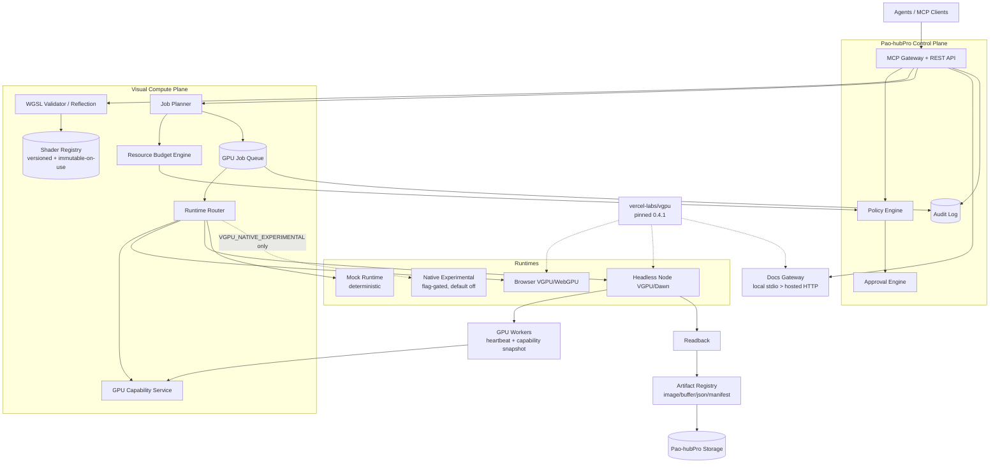
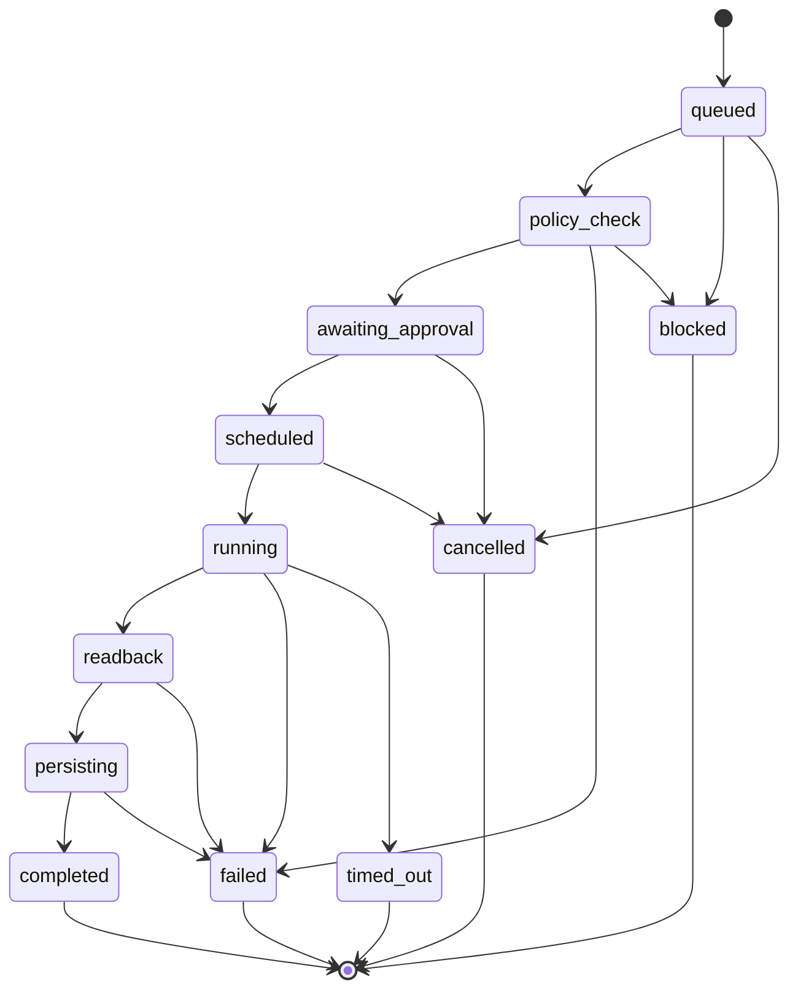

# Phase 20.64 — Pao-hubPro × Vercel vgpu

## Cross-Runtime WebGPU Compute & Rendering Runtime, Typed WGSL Shader Toolchain, Headless GPU Execution, MCP Documentation Gateway & Policy-Governed Visual Compute Plane

> **Document type:** Production-Oriented Implementation Blueprint
> **Phase:** 20.64
> **Project:** Pao-hubPro
> **Source of Truth:** `Phase 20.64 — Pao-hubPro × Vercel vgpu.md` (prepared 2026-09-15), processed under `PAO-HUBPRO_MASTER_PHASE_REQUEST.md`
> **Primary upstream:** `https://github.com/vercel-labs/vgpu` — docs: `https://vgpu.sh`
> **Production baseline:** `vgpu@0.4.1` · **Experimental track:** `0.5.0-rc.1` / `@vgpu/native` behind feature flags only
> **Filename/content consistency:** Filename and document header agree on Phase 20.64; no collision detected.

> **Primary goal:** Add a policy-governed, agent-operable WebGPU compute/rendering layer to Pao-hubPro without replacing the existing AI-generation/GPU infrastructure.

> **Final phase principle:** *GPU power is a capability, not a permission.* Pao-hubPro may give agents the ability to reason about shaders, build shaders, validate shaders, and request GPU work — but the Control Plane remains responsible for deciding who may run it, what may run, where it may run, how large it may be, how long it may run, what it may read/write, what artifact it may produce, and how the action is audited.

---

## 1. Executive Summary

Phase 20.64 adds a **Visual Compute Plane** to Pao-hubPro: a compact GPU execution subsystem for WebGPU rendering (browser and headless Node), GPU compute jobs, typed WGSL shader modules, shader reflection/validation, deterministic GPU mocking for tests, agent-generated shaders with validation before execution, controlled render/readback pipelines, GPU capability detection, artifact generation, policy-controlled compute budgets, MCP access to VGPU documentation/examples, and full auditability.

The purpose is **not** to replace CUDA, PyTorch, ComfyUI, Runpod, MiniMax H3, or other model runtimes — those solve neural-network inference. VGPU fills the smaller but strategically useful layer of lightweight, agent-operable rendering and compute.

The target end-to-end flow:

```text
Agent
  ↓
Pao-hubPro MCP/API
  ↓
Policy Evaluation
  ↓
WGSL Resolve / Validate / Reflect
  ↓
GPU Capability Match
  ↓
Job Queue
  ↓
Browser | Headless Node | Mock
  ↓
Render / Compute
  ↓
Readback / Artifact
  ↓
Validation
  ↓
Artifact Registry + Audit + Dashboard
```

A successful Phase 20.64 means Pao-hubPro can safely receive a shader or visual-compute request, validate it, enforce resource limits, select a suitable runtime, execute it, store the result, and expose the operation to users and agents through an auditable control plane — **without exposing arbitrary GPU, shell, filesystem, network, or unbounded execution**.

---

## 2. Problem Statement

There is still a gap between:

```text
AI agent generates code
```

and:

```text
AI agent can safely execute visual GPU code,
observe the result,
validate it,
and iterate.
```

Traditional AI image pipelines (ComfyUI) run neural-network inference pipelines; they are not a lightweight general-purpose rendering and compute runtime for an agent workspace. Without a governed visual-compute layer, an agent that wants a procedural background, a LUT-like transform, a thumbnail, or a shader prototype has no safe path: it would either shell out to arbitrary tools, abuse the AI-generation stack for non-inference work, or simply be unable to act.

### What this layer enables

- Procedural backgrounds; noise and grain; color transformations; LUT-like transforms.
- Image compositing; mask operations; thumbnail generation; visualization.
- GPU particle previews; mathematical visualizations; shader prototyping.
- Fast interactive dashboard previews; headless render regression tests.
- GPU capability testing; agent-generated WebGPU experiments.

### Relationship to ComfyUI / Runpod (correct architecture)

```text
                Pao-hubPro
                /        \
               /          \
      Visual Compute      AI Generation
        Plane               Plane
          │                   │
        VGPU              ComfyUI/H3
          │                   │
     WebGPU/Dawn         CUDA/PyTorch
          │                   │
      local GPU           Runpod GPU
```

| Use VGPU when | Use ComfyUI/Runpod when |
|---|---|
| shader/compute/render work | model inference |
| lightweight image processing | image generation |
| browser preview | video generation |
| headless WebGPU | large neural workloads |
| deterministic visual tests | CUDA-specific nodes |

### Adobe Stock workflow (Phase 20.31 ecosystem)

Phase 20.64 can support Pao AI Image Factory / Adobe Stock workflows as a **preprocessing and postprocessing layer**: procedural backgrounds, grain/noise, mask generation, gradient generation, image compositing, color transforms, thumbnail generation, simple GPU effects, visual QA overlays, preview effects, contact-sheet-like visual assembly. Keep provenance: if a stock asset uses Phase 20.64 processing, the production manifest should record source artifact ids, shader version ids, parameters, output artifact id, and hashes. **Do not treat WebGPU output as proof of Adobe Stock policy compliance — policy/commercial-submission checks remain in the existing Adobe Stock workflow.**

---

## 3. Goals

**G1 — Cross-runtime GPU abstraction.** One Pao-hubPro abstraction over browser WebGPU, headless Node WebGPU, and a deterministic mock/test runtime.

**G2 — WGSL toolchain.** WGSL module registration, source hashing, validation, reflection, binding inspection, import resolution, versioning, compile diagnostics, and policy checks.

**G3 — GPU execution queue.** Every headless compute/render request becomes a managed job. No arbitrary agent request may execute directly against the GPU outside the job/policy layer.

**G4 — Artifact production.** Jobs may produce PNG/WebP/JPEG (where supported by the project stack), raw RGBA buffers, float buffers, JSON metrics, thumbnails, debug manifests, and shader reflection manifests.

**G5 — Agent/MCP access.** Safe tools for capability inspection, shader validation, shader registration, job submission, job inspection, artifact inspection, and documentation lookup.

**G6 — Documentation gateway.** Wrap VGPU's local/hosted MCP documentation access behind the existing Pao-hubPro MCP routing and policy system.

**G7 — Resource governance.** Enforce max shader size, max texture dimensions, max output bytes, max buffer allocation, max dispatch dimensions, max execution duration, max concurrent jobs, and per-user/per-agent quotas.

**G8 — Observability.** Record selected adapter, runtime, timing, resource estimate, output sizes, failures, policy decisions, shader hash, dependency version, and artifact hashes.

---

## 4. Non-Goals

Do NOT turn Phase 20.64 into any of the following:

- CUDA replacement; PyTorch replacement; ComfyUI replacement; Runpod replacement.
- Distributed model-training system.
- General arbitrary code execution engine.
- Unrestricted shader playground exposed to the public Internet.
- Automatic execution of unknown agent-generated host code.
- Automatic native Swift/Metal deployment.
- General 3D game engine rewrite; browser remote desktop system.

The scope is exactly:

```text
controlled visual compute
+ controlled WebGPU rendering
+ controlled WGSL execution
```

---

## 5. Why This Phase Exists

Pao-hubPro already aims to become a central MCP/agent workspace with safe access to local tools, remote services, coding tools, AI generation systems, and automation infrastructure. The Visual Compute Plane closes the execute-observe-iterate loop for visual work (Section 2) while keeping every GPU touchpoint behind policy, budgets, jobs, and audit — the same governance posture as every other Pao-hubPro capability.

Agent-authored source is never automatically trusted:

```text
Agent-authored source ≠ automatically trusted source
```

**Definition of "safe agent execution" for this phase:**

```text
agent CAN:  propose WGSL · validate WGSL · register versioned WGSL · request execution
agent CANNOT: bypass policy · create arbitrary shell · choose arbitrary filesystem paths
              · exceed hard resource limits · activate experimental native runtime
              · silently fetch arbitrary network resources
```

---

## 6. Relationship to Pao-hubPro

```text
┌─────────────────────────────────────────────────────────────┐
│                        AI / USER LAYER                      │
│ ChatGPT | Codex | Local AI | Claude | Dashboard | API      │
└──────────────────────────┬──────────────────────────────────┘
                           ▼
┌─────────────────────────────────────────────────────────────┐
│                  PAO-HUBPRO CONTROL PLANE                   │
│ MCP Gateway · REST/API · Authentication · Agent Identity    │
│ Policy Engine · Approval Engine · Audit Log                 │
└──────────────────────────┬──────────────────────────────────┘
                           ▼
┌─────────────────────────────────────────────────────────────┐
│                    VISUAL COMPUTE PLANE                     │
│ GPU Capability Service · Shader Registry                    │
│ WGSL Validator / Reflection · Job Planner · GPU Job Queue   │
│ Resource Budget Engine · Runtime Router                     │
└───────────────┬────────────────┬────────────────────────────┘
                ▼                ▼
        ┌──────────────┐ ┌──────────────┐
        │ Browser      │ │ Headless Node│
        │ VGPU/WebGPU  │ │ VGPU/Dawn    │
        └──────┬───────┘ └──────┬───────┘
               └───────┬────────┘
                       ▼
                 ┌───────────┐
                 │ GPU Adapter│
                 └─────┬─────┘
       ┌───────────────┼───────────────────┐
       ▼               ▼                   ▼
  Render Target     Compute            Readback
       └───────────────┴───────────────────┘
                       ▼
┌─────────────────────────────────────────────────────────────┐
│                     ARTIFACT PLANE                          │
│ Preview | Image | Buffer | Manifest | Metrics | Hash       │
└──────────────────────────┬──────────────────────────────────┘
                           ▼
                    Audit + Dashboard
```

### Layer mapping (Pao-hubPro core layers)

| Layer | Role in this phase |
|---|---|
| 02 AI / Agent Layer | Shader authoring + job submission via MCP. |
| 05 MCP Gateway | Hosts `visual_gpu.*` tools and the docs gateway. |
| 07 Policy Engine | Risk-class evaluation on every executable operation. |
| 08 Approval Engine | Human approval for HIGH-risk jobs. |
| 09 Execution Runtime | Headless Node VGPU execution. |
| 10 Local Tool Runtime | Browser runtime; safe CLI wrapper (`vgpu check`). |
| 11 Remote Worker Runtime | GPU workers with heartbeats (future: remote federation). |
| 12 State / Session Layer | Jobs, shaders, artifacts, workers, capability snapshots. |
| 15 Event / Queue Layer | GPU job queue. |
| 16 Observability Layer | Metrics + structured logs. |
| 17 Audit Layer | `VISUAL_*` audit events. |
| 19 Web Dashboard | "Visual Compute" section. |
| 20 External Provider Layer | Upstream `vercel-labs/vgpu` (library dependency, not a service). |

Not applicable: Layer 14 (secrets) — this phase handles no credentials; Layer 03/04 (intent/orchestration) — job planning here is scoped to visual compute, not general task orchestration.

### Ownership boundaries

**Pao-hubPro owns:** identity, RBAC, policy, approval, audit, feature flags, budgets, artifact storage, job queue, dashboard, deployment authority.

**Phase 20.64 owns:** the Visual Compute Plane — runtime abstraction/adapters, capability service, shader registry, WGSL toolchain, job model, budget engine, runtime router, worker infrastructure, artifact integration for visual outputs, MCP tools, docs gateway.

**Upstream `vercel-labs/vgpu` owns:** the WebGPU library, its WGSL tooling, its CLI, its documentation and MCP surface.

---

## 7. Upstream / External Project

### Separation of concerns

| Part | Owner | Notes |
|---|---|---|
| A. Upstream project | `vercel-labs/vgpu` | TypeScript WebGPU library with typed WGSL imports, GPU-first API, common API across browser/headless/mock, explicit render frames, CLI docs/validation, agent-oriented documentation surface. Do not fork or modify. |
| B. Pao-hubPro adapter | `VisualGpuRuntime` implementations (browser / node / mock) + runtime router | All VGPU-specific details stay inside adapters. |
| C. Pao-hubPro policy wrapper | Policy engine integration, budget engine, approval, audit, MCP tool surface | All governance lives here. |
| D. Pao-hubPro extensions | Shader registry, capability service, docs gateway, dashboard, demonstrators | Built in this phase. |

### Upstream facts (at Phase-definition time, 2026-09-15 — re-verify against releases before implementation)

- Stable release: `v0.4.1`; `v0.5.0-rc.1` is a prerelease/native beta (build-time WGSL → Swift/Metal tooling with platform/toolchain constraints).
- VGPU provides typed WGSL imports and targets browser, headless Node, and deterministic mock/test usage.
- The project exposes agent-oriented docs/CLI tooling.
- Local STDIO and hosted HTTP MCP support for docs/examples entered the stable line in `v0.3.1`.
- Pre-1.0 upgrades may contain breaking changes; production must remain pinned and migration-tested.

**[Needs Verification] All upstream facts must be re-checked against the repository/releases at implementation time** — record the verified version, release date, and any structural differences in the compatibility record (Section 33). Do not assume capabilities not listed above.

### Dependency strategy

- Detect the existing package manager first; preferred policy: `existing package manager > pnpm`. Do not convert npm/yarn/bun repositories merely for this phase.
- Production packages (conceptual): `vgpu@0.4.1`, `@webgpu/types`.
- Development/tooling packages: `@vgpu/cli@0.4.1`, `@vgpu/wgsl@0.4.1`; add `@vgpu/wgsl-std` **only** when the implementation actually uses it.
- Do not add unnecessary GPU frameworks. If the repository already uses Three.js, React Three Fiber, TypeGPU, or another rendering stack, integrate carefully instead of replacing it.

### Version policy (mandatory)

```json
{
  "vgpuPolicy": {
    "channel": "stable",
    "productionVersion": "0.4.1",
    "allowPrerelease": false
  }
}
```

- Do **not** silently track `latest`, `next`, `canary`, or a Git branch in production.
- `VGPU_NATIVE_EXPERIMENTAL=false` is the default. Experimental native functionality must: never activate automatically; require an explicit feature flag; require a compatible host; be isolated from normal WebGPU runtime execution; require a policy decision; be visibly marked "experimental"; and not become a production dependency of ordinary browser/headless jobs.

### Upstream risk assessment

- **License:** [Needs Verification] record the upstream license at implementation time in the compatibility record.
- **Maintenance status:** [Needs Verification] active Vercel Labs project at drafting; pre-1.0 — expect breaking changes.
- **API stability:** pre-1.0, treat as unstable; pin and migration-test every upgrade.
- **Dependency risk:** low-medium — a library dependency (no network service required at runtime); the mock runtime removes the hard GPU requirement for CI.
- **Security surface:** shader source is untrusted input; CLI tooling is wrapped (Section 20); upstream MCP is proxied behind Pao policy (Section 17).
- **Upgrade strategy:** `dependency diff → migration review → shader contract tests → headless render tests → browser smoke tests → readback regression tests → policy regression tests → manual promotion`. **Never auto-upgrade a pre-1.0 GPU runtime in production.**
- **Vendor lock-in:** contained — all VGPU usage sits behind the internal `VisualGpuRuntime` contract (Section 12.1).
- **Fallback:** mock runtime (deterministic, no GPU) and software renderers where available.

---

## 8. Current-State Assumptions

- **[Needs Verification] Runtime stack:** Bun-native TypeScript is the working assumption; confirm package manager, monorepo/workspace layout, backend/frontend frameworks, DB/ORM/migrations, auth/RBAC, MCP implementation, job/queue infrastructure, artifact/file storage, audit log, policy/approval engine, config/env validation, structured logging, metrics stack, test frameworks (incl. browser tests), existing GPU/ComfyUI/Runpod modules, and coding conventions by inspection.
- **[Assumption] Job queue:** if the project already has a queue/job framework, reuse it; do not introduce a second queue system. If none exists, implement a minimal DB-backed queue with the job state machine in Section 16.
- **[Assumption] Artifact/blob storage:** if an artifact/storage layer exists, reuse it; visual artifacts must not invent a parallel storage stack.
- **[Assumption] Validation library:** use the schema system already used by Pao-hubPro (Zod / Valibot / JSON Schema / existing internal validator); do not introduce a second validation library without reason.
- **[Assumption] GPU availability:** CI and many hosts have no GPU — the mock runtime is the default execution path in tests, and headless execution must fail closed when no allowed adapter is available.

**Do not replace the existing authentication, database, ORM, job system, artifact store, audit system, MCP gateway, policy engine, UI system, logging stack, or config system if equivalents already exist.**

---

## 9. Target Architecture

Core components:

1. **Runtime layer:** `VisualGpuRuntime` contract; browser adapter; headless Node adapter; mock adapter; runtime router. Optional experimental native adapter shell (flag-gated).
2. **Capability layer:** GPU capability service; capability snapshots; deterministic capability matching.
3. **Shader layer:** shader registry (versioned, immutable-on-use); WGSL pipeline (normalize → hash → import resolution → validate → reflect → policy scan); import manifest; CLI wrapper for `vgpu check`-style tooling.
4. **Execution layer:** visual GPU job model; job planner; job queue; scheduler; worker infrastructure with heartbeats; resource budget engine.
5. **Governance layer:** risk classification; policy decision service (persisted decisions); approval gate.
6. **Artifact layer:** artifact registry; image encoding pipeline; reproducibility manifests; retention classes.
7. **Interface layer:** MCP tools (`visual_gpu.*`); docs gateway (local + optional hosted); REST/API surface.
8. **Operations layer:** structured logging; metrics; audit events; dashboard; `visual-gpu doctor` diagnostics.

---

## 10. Architecture Diagram



---

## 11. Core Components

| # | Component | Purpose |
|---|---|---|
| 1 | `VisualGpuRuntime` contract | One internal runtime interface over browser/node/mock(/native-experimental). |
| 2 | Browser runtime | Interactive previews, parameter tuning, low-latency visualization. |
| 3 | Headless Node runtime | Principal server-side render/compute execution target. |
| 4 | Mock runtime | Deterministic CI/test/orchestration behavior; no physical GPU. |
| 5 | Runtime router | Selects runtime per job from request, capabilities, policy, worker availability. |
| 6 | GPU capability service | Probe, normalize, cache, and match adapter capabilities. |
| 7 | Shader registry | First-class versioned WGSL shader objects with immutable executed versions. |
| 8 | WGSL toolchain | Normalize → hash → import resolution → validate → reflect → policy scan. |
| 9 | Safe CLI wrapper | Controlled `vgpu check`-style validation (argv array, no shell interpolation). |
| 10 | Job model + queue + scheduler | Every headless execution is a persisted, policy-checked, cancellable job. |
| 11 | Resource budget engine | Mandatory hard limits estimated and enforced before GPU touch. |
| 12 | Policy decision service | Persisted per-job decisions (allow/deny/require_approval) with evaluated rules. |
| 13 | Worker infrastructure | Heartbeats, capability advertisement, stale detection, graceful degradation. |
| 14 | Artifact registry + encoder | Bounded readback → encode → hash → store → manifest. |
| 15 | MCP tools + docs gateway | Safe agent surface; local-first VGPU docs with policy/audit. |
| 16 | Dashboard | Visual Compute section (overview, shaders, jobs, workers, artifacts, policy events). |
| 17 | Doctor diagnostics | Machine-readable subsystem health check. |

---

## 12. Component Responsibilities

### 12.1 Runtime abstraction

```ts
export type VisualRuntimeKind =
  | "browser"
  | "node"
  | "mock"
  | "native-experimental";

export interface VisualGpuRuntime {
  kind: VisualRuntimeKind;
  probe(): Promise<GpuCapabilitySnapshot>;
  validateShader(input: ValidateShaderInput): Promise<ShaderValidationResult>;
  render(input: RenderJobInput): Promise<VisualJobResult>;
  compute(input: ComputeJobInput): Promise<VisualJobResult>;
  dispose(): Promise<void>;
}
```

Rules: application code depends on `VisualGpuRuntime`, never on a global GPU singleton; VGPU-specific details stay inside adapters; runtime selection is performed by the router; tests swap in the deterministic mock; every runtime exposes an explicit disposal path.

### 12.2 Browser runtime

Intended for interactive previews, parameter tuning, low-latency visualization, user-controlled experiments, GPU-capable dashboard components.

Responsibility flow: request adapter/device → collect capability info → create surface/target → load **validated** shader module → render → report metrics → dispose resources.

MUST: gracefully detect missing WebGPU and display unsupported status rather than crash; never assume a discrete GPU; apply DPR limits; respect preview resolution limits; stop frame loops on unmount; release resources.

Preview limits (configurable):

```text
max preview width: 2048 · max preview height: 2048
default DPR cap: 2 · default preview FPS cap: 60
background-tab work: pause or heavily throttle
```

Preview presets: `tiny 256×256 · standard 512×512 · large 1024×1024 · review 2048×2048`; anything above the review preset requires explicit dimensions and policy evaluation.

### 12.3 Headless Node runtime

The principal execution target for server-side render/compute jobs. Use the VGPU Node path rather than raw WebGPU initialization scattered through the app.

Adapter flow: create target → execute render/compute → readback → encode artifact → store artifact → dispose GPU context.

Each worker must: probe GPU availability at startup; publish its capability snapshot; advertise hardware-backed vs software-backed; enforce job budgets; **fail closed if no allowed adapter is available**; restart cleanly after device-loss-class failures. No request handler may directly hold an unbounded persistent GPU workload.

### 12.4 Mock runtime

Deterministic runtime for CI, unit tests, orchestration tests, agent contract tests, policy tests, and failure simulation. It is not a performance benchmark. Tests never require a physical GPU unless explicitly tagged as integration/GPU tests.

Test layers:

```text
unit          → mock runtime
integration   → mock + optional headless
gpu-smoke     → real adapter
browser       → browser WebGPU when available
```

> **Policy note (ambiguity resolved):** `VGPU_MOCK_ENABLED=true` by default exists for tests and diagnostics. The runtime router must not select the mock runtime for real (non-test, non-diagnostic) jobs in production unless policy explicitly allows it — mock must never silently stand in for a hardware render.

### 12.5 GPU capability service

```ts
export interface GpuCapabilitySnapshot {
  id: string;
  workerId: string;
  runtime: "browser" | "node" | "mock" | "native-experimental";
  available: boolean;
  adapterName?: string;
  backend?: string;
  deviceType?: string;
  limits: Record<string, number | string | boolean>;
  features: string[];
  softwareRenderer: boolean;
  detectedAt: string;
  vgpuVersion: string;
  appVersion: string;
}
```

Expose normalized values, not raw environment internals only. Capability matching is deterministic: `job requires storage texture AND worker lacks capability → do not dispatch → return CAPABILITY_MISMATCH`. Cache capability snapshots with controlled refresh — do not repeatedly discover capabilities for every job.

### 12.6 Shader registry

A shader is a first-class Pao-hubPro object.

Shader fields: `id, name, slug, description, source, source_hash, language (wgsl), status, created_by, created_at, updated_at, current_version_id, tags, risk_class`.

Shader version fields: `id, shader_id, version, source, source_hash, reflection_json, validation_json, created_by, created_at, vgpu_version`.

Shader statuses: `draft, validating, valid, invalid, approved, deprecated, blocked`.

**Do not overwrite shader history — each mutation creates a new version.** Once a shader version is used by an executed job, its source is **immutable**; changes require a new version. This is required for auditability.

### 12.7 WGSL toolchain pipeline

```text
source intake
→ normalize
→ hash
→ import resolution
→ parse/validate
→ reflection
→ policy scan
→ registry version
→ optional approval
→ executable state
```

Store validation diagnostics:

```ts
export interface ShaderDiagnostic {
  severity: "info" | "warning" | "error";
  code?: string;
  message: string;
  line?: number;
  column?: number;
  source?: string;
}
```

Store reflection data: bindings, layouts, entry points, uniforms, storage bindings, texture bindings, samplers, workgroup metadata. **Never ask an AI agent to manually duplicate reflection metadata if tooling can derive it.**

### 12.8 Safe CLI wrapper (`vgpu check` integration)

Create a tooling wrapper around shader validation. **Do not let agents invoke arbitrary shell strings.**

Bad (forbidden): `run("npx vgpu check " + userInput)`

Good (required): `VisualShaderTool.validate({ shaderId, versionId })`

Internally: controlled temp directory → controlled filename → CLI invocation using argument array → timeout → bounded stdout/stderr → parse reflection JSON → delete temp data. No shell interpolation; no raw path supplied by a remote agent.

### 12.9 Shader import policy

Default allowed sources: project-owned shader modules; approved registry modules; `@vgpu/wgsl-std`; explicitly approved dependency modules.

Default blocked: arbitrary URL imports; runtime network fetch; untrusted absolute filesystem paths; parent traversal; unknown package imports.

Normalize and resolve import graphs before approval; store an import manifest:

```json
{
  "root": "shader-id",
  "dependencies": [
    {"specifier": "@vgpu/wgsl-std/noise", "resolved": "...", "hash": "..."}
  ]
}
```

### 12.10 Visual GPU job model

Job types: `render, compute, validate, readback, benchmark, preview`.

> **Contradiction resolved from source:** the prose job-type list includes `benchmark` and `preview`, but the interface union in the source omits them. Implementation union: `"render" | "compute" | "validate" | "readback" | "preview"`; `benchmark` is reserved as an internal/operator-only type, not exposed via MCP in this phase.

```ts
export interface VisualGpuJob {
  id: string;
  type: "render" | "compute" | "validate" | "readback" | "preview";
  shaderVersionId: string;
  requestedBy: { actorType: "user" | "agent" | "system"; actorId: string };
  runtimePreference?: "auto" | "browser" | "node" | "mock";
  inputs: Record<string, unknown>;
  resourceRequest: VisualResourceRequest;
  policyDecisionId?: string;
  assignedWorkerId?: string;
  status: VisualJobStatus;
  createdAt: string;
  startedAt?: string;
  finishedAt?: string;
}
```

All server/headless execution must become a job — no direct GPU execution from request handlers.

### 12.11 Resource budget engine (mandatory security component)

Configurable budgets; production starting point:

```yaml
visualCompute:
  maxShaderSourceBytes: 262144
  maxTextureWidth: 4096
  maxTextureHeight: 4096
  maxTextureLayers: 32
  maxSingleBufferBytes: 134217728
  maxTotalEstimatedGpuBytes: 536870912
  maxReadbackBytes: 268435456
  maxExecutionMs:
    preview: 5000
    render: 30000
    compute: 30000
  maxConcurrentJobsPerWorker: 2
  maxQueuedJobsPerActor: 20
  maxArtifactsPerJob: 20
```

These are initial Pao-hubPro application limits, **not claims about VGPU/WebGPU platform maxima**. All values configurable.

Before execution calculate: estimated texture memory + buffer memory + readback memory + artifact output + dispatch dimensions. **Reject clearly unsafe requests before touching the GPU.** Hard limits must not be overrideable by ordinary agent parameters.

### 12.12 Job scheduler

Scheduling considers: runtime requirement; adapter capabilities; software vs hardware; job risk; estimated memory; worker load; queue depth; actor quota.

Simple initial score: `eligible? → no: reject worker` then hardware preferred? / capability match? / memory headroom? / queue depth? / same-runtime affinity?. Avoid premature distributed-scheduler complexity: the first implementation can be a local worker with clean interfaces allowing remote workers later. **The scheduler must not assign jobs to stale workers.**

### 12.13 Worker heartbeats

Each headless worker advertises: worker id; status; runtime; adapter metadata; software renderer flag; current jobs; queue capacity; capability snapshot id; last heartbeat; app version; vgpu version.

Worker states: `starting, ready, busy, degraded, draining, offline`.

### 12.14 Artifacts and image encoding

Every useful output is an artifact. Artifact types: `image, thumbnail, raw-buffer, float-buffer, json, reflection, diagnostic, metrics, manifest`. Metadata: artifact id, job id, type, MIME type, byte size, width, height, hash, storage location, created at, retention class.

Reproducibility manifest:

```json
{
  "jobId": "...",
  "shaderVersionId": "...",
  "shaderHash": "...",
  "inputs": {},
  "runtime": "node",
  "vgpuVersion": "0.4.1",
  "capabilitySnapshotId": "...",
  "outputs": [],
  "createdAt": "..."
}
```

**Do not store binary artifacts directly in large audit-log rows** — use the existing Pao-hubPro artifact/blob/storage layer.

Image encoding pipeline (separate GPU readback from image encoding; do not tightly couple VGPU to one encoder; reuse existing image tooling):

```text
GPU target → bounded readback → normalized pixel representation
→ encoder → hash → storage → artifact record
```

### 12.15 MCP documentation gateway

VGPU provides agent-oriented documentation access and MCP tooling. Phase 20.64 must **not** simply expose upstream MCP directly to every agent:

```text
Agent → Pao-hubPro MCP Gateway → MCP policy → VGPU Docs Provider
                                                ├─ local stdio MCP
                                                └─ optional hosted HTTP MCP
```

Default preference: **local bundled documentation > hosted documentation** — deterministic version alignment, lower external dependency, policy control, auditability, offline/local-first compatibility. Hosted endpoint is optional and flag-gated.

**Upstream MCP safety rules:** read-only documentation/example operations by default; do not expose arbitrary output directories; if example download functionality is enabled, create one dedicated sandbox root with relative child paths only; never pass user-controlled absolute paths; record upstream MCP version/transport; put network use behind Pao-hubPro outbound policy; cache safe docs responses when useful.

```yaml
vgpuDocs:
  provider: local
  hostedFallback: false
  allowExampleDownload: false
  cacheTtlSeconds: 3600
```

### 12.16 Deterministic job fingerprint

```text
hash(shader_hash + normalized_inputs + output_spec + runtime_contract_version)
```

Supports future caching, duplicate detection, reproducibility, and regression comparisons. **Do not automatically reuse artifacts until cache semantics are explicitly defined.**

---

## 13. Data Flow

**Shader authoring flow:**

```text
source intake → source size check → normalize → hash → import resolution
→ validation → reflection → policy scan → registry version (immutable)
```

**Job execution flow:**

```text
job_submit → schema validation → actor resolution → resource estimate
→ policy evaluation → approval (if required) → queue → scheduler selects worker
→ worker executes on allowed runtime → bounded readback → encode
→ artifact store (hash + metadata) → audit event → actor inspects result
```

**Agent loop (desired):**

```text
1. Agent searches VGPU docs.
2. Agent creates WGSL source.
3. Agent calls shader_validate.
4. Validation returns diagnostics/reflection.
5. Agent fixes source if necessary.
6. Agent registers a shader version.
7. Agent submits a small preview render.
8. Policy evaluates the job.
9. Scheduler selects a worker.
10. Worker executes.
11. Artifact is stored.
12. Agent inspects artifact metadata.
13. Human can inspect preview.
14. Larger/high-risk job requires additional policy/approval.
```

---

## 14. Control Flow

Every executable operation results in a persisted policy decision:

```ts
export interface VisualPolicyDecision {
  id: string;
  jobId?: string;
  effect: "allow" | "deny" | "require_approval";
  risk: "low" | "medium" | "high" | "blocked";
  reasons: string[];
  evaluatedRules: Array<{ ruleId: string; result: "pass" | "fail" | "skip" }>;
  actorId: string;
  createdAt: string;
}
```

**Persist every decision — never only print policy decisions to logs.**

Flow: Request → Identity → Schema validation → Resource estimate → Risk classification → Policy evaluation → Approval check → Execution → Result validation → Audit.

Risk-class → R0–R4 mapping (per Pao-hubPro risk convention):

| Class | R-level | Examples | Default |
|---|---|---|---|
| LOW | R0/R1 | shader validation; reflection; docs lookup; capability inspection; mock execution; small browser preview | auto-allow authenticated user/agent |
| MEDIUM | R2 | headless 2048×2048 render; moderate compute dispatch; artifact persistence | policy allow within quota |
| HIGH | R3 | large texture/buffer allocation; long compute; batch render; experimental runtime | approval or privileged role |
| BLOCKED | beyond R4 | unbounded execution; unknown filesystem access; arbitrary process invocation; runtime network fetching from shader workflow; native experimental build without explicit enablement; path traversal; resource request above hard cap | **deny — no approval path** |

R3–R4 require human approval before execution; **no agent may bypass approval**. Policy evaluation failure fails closed.

---

## 15. Agent / Worker Model

**Terminology (strictly separated):**

| Term | Definition in this phase |
|---|---|
| Agent | An authenticated actor (user-supervised AI) that authors/validates/registers WGSL and submits jobs via MCP. Never runs shell, never picks filesystem paths, never exceeds budgets. |
| Worker | A headless GPU executor process advertising capabilities and heartbeats. |
| Job | A persisted unit of visual GPU work (render/compute/validate/readback/preview). |
| Run | One execution of a job; carries `jobId` + `requestId`. |
| Session | Control-plane session binding actor + workspace; carries `session_id`. |
| Tool | An MCP `visual_gpu.*` operation. |
| Capability | A GPU feature/limit snapshot (distinct from 20.63's semantic API capabilities). |
| Artifact | A stored output (image/buffer/json/manifest) with hash + retention class. |

**Workers own all GPU execution.** Job submission is available to agents; execution happens only through queue → scheduler → worker. Concurrency starts conservative: **1–2 headless GPU jobs per worker** (configurable). Do not infer that a GPU can safely run many concurrent WebGPU jobs merely because the host has substantial VRAM; tune from observed performance.

**Software renderer strategy:** useful for CI, GPU-less VPS, deterministic fallback, and development — but not equivalent to hardware performance. Worker metadata MUST identify `softwareRenderer=true`. Scheduling may prefer hardware for render/compute and software for validation/smoke/fallback. **Do not silently turn a large production compute job into a CPU software-rendered job.**

**Linux backend strategy:** explicitly detect and report the chosen backend; do not hide backend behavior. Worker diagnostics identify runtime, adapter, backend, software/hardware, VGPU version. If the required backend/driver is unavailable: `worker = degraded` — never pretend the GPU worker is ready.

---

## 16. Session / State Model

### 16.1 Job state machine

```text
queued → policy_check → awaiting_approval → scheduled → running → readback
       → persisting → completed

Terminal/safety states: failed | cancelled | timed_out | blocked
```



### 16.2 Timeouts and cancellation

Every server-side job needs: queue timeout; execution timeout; readback timeout; artifact persistence timeout. A job exceeding a hard execution budget transitions to `timed_out` and emits an audit event. **Timeouts must not leave a job permanently in `running`.**

Cancellation is best-effort and state-aware. Allowed from: `queued`, `awaiting_approval`, `scheduled`, and `running` when the runtime supports controlled cancellation. **Never report "cancelled" before the state transition is persisted.**

### 16.3 Worker lifecycle

```text
starting → ready ⇄ busy → degraded → draining → offline
```

Heartbeats renew liveness; stale workers are removed from scheduling; drain mode finishes current jobs before going offline.

### 16.4 Shader lifecycle

```text
draft → validating → valid | invalid → approved | deprecated | blocked
```

Each mutation creates a new version; versions are immutable once executed.

### 16.5 Idempotency

Job submission supports idempotency where the existing API layer supports it: key = `actor + idempotency key`. This prevents an agent retry from accidentally creating multiple expensive jobs. A completed idempotent request returns the original job reference when appropriate.

---

## 17. MCP Integration

### 17.1 Pao-hubPro MCP tool surface (conservative)

```text
visual_gpu.capabilities      — capability/runtime inspection (LOW risk)
visual_gpu.shader_validate   — validate source or registered version (LOW)
visual_gpu.shader_get        — fetch shader/version record (LOW)
visual_gpu.shader_list       — list shaders (LOW)
visual_gpu.shader_register   — register new shader version (LOW-R1; no auto-execution)
visual_gpu.job_submit        — submit render/compute job (risk per estimate)
visual_gpu.job_get           — job status (LOW)
visual_gpu.job_cancel        — cancel job (R2, state-aware)
visual_gpu.artifact_get      — artifact metadata/content per permissions (LOW)
visual_gpu.artifact_list     — list artifacts (LOW)
visual_gpu.docs_search       — VGPU docs search via gateway (LOW)
visual_gpu.docs_read         — VGPU docs read via gateway (LOW)
```

**Do not initially expose:** `visual_gpu.raw_shell`, `visual_gpu.raw_node_eval`, `visual_gpu.arbitrary_path`, `visual_gpu.unbounded_dispatch`, or any generic process-execution tool.

### 17.2 Tool contracts (key examples)

`visual_gpu.capabilities` — input `{"runtime": "auto"}`; output `{"available": true, "workers": [], "recommendedRuntime": "node"}`. LOW risk.

`visual_gpu.shader_validate` — input `{source, name?}` or `{shaderId, versionId}`; output `{valid, hash, diagnostics, reflection}`. **Validation does not imply execution approval.**

`visual_gpu.shader_register` — input `{name, source, description, tags}`; flow: authenticate → validate → policy scan → create shader → create version → return registry record. **Do not execute automatically.**

`visual_gpu.job_submit` — input example:

```json
{
  "type": "render",
  "shaderVersionId": "...",
  "runtime": "auto",
  "size": [1024, 1024],
  "inputs": {"time": 0, "seed": 42},
  "output": {"format": "png"}
}
```

Flow: schema validation → actor resolution → resource estimate → policy → approval if required → queue → worker → readback → artifact → audit.

`visual_gpu.job_cancel` — best-effort, state-aware (Section 16.2).

### 17.3 MCP obligations

| Obligation | Mechanism |
|---|---|
| Tool Discovery | Pao-hubPro MCP registry; strict schemas per current MCP conventions. |
| Tool Permission | Risk class + role/quota per Section 14. |
| Input Validation | Schema-validated: shader source size, dimensions, format, parameters, dispatch dimensions, buffer sizes, artifact options, runtime preference, IDs, pagination. |
| Output Validation | Sanitized results; no raw stack traces to ordinary users. |
| Timeout / Retry | Per-job timeouts (Section 16.2); bounded retries only (Section 22). |
| Circuit Breaker | GPU device-loss handling (Section 22); worker stale detection. |
| Rate Limit | `maxQueuedJobsPerActor` + queue depth; concurrency caps. |
| Tool Isolation | One tool = one operation; no shell/path/eval surfaces. |
| Tool Health Check | Capability service + doctor diagnostics. |
| Tool Version / Provenance | Shader versions, VGPU version, capability snapshots persisted. |
| Audit Log | Every tool call and policy decision (Section 25). |

---

## 18. Capability & Shader Registry

- **GPU capability registry:** `GpuCapabilitySnapshot` per worker/runtime (Section 12.5); deterministic matching; cached with controlled refresh; persisted per headless worker.
- **Shader registry:** versioned WGSL objects with statuses, hashes, reflection, validation JSON, and immutable executed versions (Section 12.6).
- **Import registry:** import manifests per shader version (Section 12.9) with resolved dependency hashes.

Both registries persist in the logical schema (Section 26); both feed the scheduler (capability match) and the policy engine (risk inputs).

---

## 19. Policy Model

- Reuse the existing Pao-hubPro policy/approval architecture if available; extend with visual-compute risk classes (Section 14) and the persisted `VisualPolicyDecision` record.
- Decisions: `allow | deny | require_approval`.
- Every decision stores: actor, job (if any), effect, risk, reasons, evaluated rules, timestamp.
- Hard limits (Section 12.11) are enforced before policy scoring and cannot be softened by agent parameters.
- Fail closed: if policy cannot be evaluated, the job does not execute.

---

## 20. Security Model

### Threats

```text
GPU denial-of-service · large allocation request · path traversal through tooling
arbitrary shell invocation · malicious imported modules · job flooding
artifact storage flooding · sensitive environment leakage
unsafe native toolchain activation · unbounded external MCP access
```

### Controls

| Control | Implementation |
|---|---|
| Authentication | All API/MCP operations require existing Pao-hubPro auth; actors resolved server-side. |
| Authorization | RBAC on mutating routes; agent tool scopes least-privilege. |
| Resource budgets | Hard caps on shader size, texture dims, buffer/readback bytes, estimated GPU memory, execution duration, concurrency, per-actor queue (Section 12.11). |
| Queue quotas | `maxQueuedJobsPerActor: 20`; job flooding contained. |
| Artifact quotas | `maxArtifactsPerJob: 20`; retention classes; no unbounded storage. |
| Process execution safety | Executable + argv array; no shell interpolation; controlled cwd; controlled environment (allowlist); timeout; stdout/stderr caps; kill process tree on timeout; normalized errors; redacted secrets. |
| Filesystem sandbox | Per-job dedicated directory; canonicalize paths; deny `..`, absolute user paths, symlink escape; delete temp per retention; persist only approved artifacts. |
| Network policy | Ordinary shader execution requires no arbitrary network access (`worker network = no additional outbound requirement`). VGPU hosted MCP docs pass through explicit outbound provider policy. **Do not allow a render job to fetch arbitrary remote content by URL** unless a future phase adds a controlled asset-fetch gateway. |
| Import policy | Allowlist-based WGSL import resolution (Section 12.9). |
| Version pinning | vgpu pinned to 0.4.1; prerelease/native behind explicit flags. |
| Feature flags | All risky paths flag-gated with safe defaults (Section 29). |
| Audit + approval gates | Every executable operation audited; HIGH requires approval. |
| Worker isolation | Jobs run in worker processes; no request handler holds GPU workloads. |

### Process execution contract (conceptual)

```ts
safeExec({
  executable: resolvedVgpuCli,
  args: ["check", controlledShaderPath],
  cwd: sandbox,
  timeoutMs: 10_000,
  env: approvedEnv
})
```

**Never:** `exec(`npx vgpu check ${input.path}`)`.

### Filesystem sandbox layout

```text
runtime-data/
└── visual-gpu/
    └── jobs/
        └── <job-id>/
            ├── input/
            ├── work/
            ├── output/
            └── manifest.json
```

Use the project's existing sandbox abstraction if one exists.

**Secrets:** this phase handles no credentials; do not log raw env dumps; redact secrets from all logs.

---

## 21. Approval Model

### R0–R4 mapping

See Section 14 table. Summary: LOW → automatic; MEDIUM → automatic for trusted authenticated roles within quota; HIGH → human approval; BLOCKED → no approval path, deny.

### Examples requiring HIGH (human approval)

```text
job estimated > configured memory threshold
batch count > threshold
experimental native runtime
unusual output dimensions
long execution budget
large readback
```

### Approval request lifecycle

```text
OPEN → DECIDED(APPROVED | DENIED) | EXPIRED | CANCELLED
```

Each request records actor, job, shader version, risk, reason, evidence (resource estimate), decider, decision, timestamps, and audit event. Requests expire (config TTL); expiry is a denial, not silent approval. Approval is scoped to the specific job/shader version — approving one job never pre-approves another.

Audit events: `VISUAL_JOB_APPROVAL_REQUIRED` on request; approval decision recorded with the job's policy decision id.

---

## 22. Failure Handling

### Normalized failure classes

```text
VALIDATION_FAILED · POLICY_DENIED · CAPABILITY_MISMATCH · ADAPTER_UNAVAILABLE
DEVICE_LOST · GPU_TIMEOUT · RESOURCE_LIMIT · READBACK_FAILED
ARTIFACT_ENCODING_FAILED · WORKER_CRASHED · CANCELLED · UNKNOWN
```

Each failure is tagged `retryable=true|false`:

| Failure | Retry behavior |
|---|---|
| VALIDATION_FAILED | no retry (input defect) |
| POLICY_DENIED | no retry (policy is authoritative) |
| RESOURCE_LIMIT | no retry (request is defective against caps) |
| CAPABILITY_MISMATCH | no auto-retry; surface mismatch to actor |
| ADAPTER_UNAVAILABLE | retry later per queue policy / fail closed |
| DEVICE_LOST | **one** controlled retry on another healthy worker |
| WORKER_CRASHED | retry according to existing job policy (bounded) |
| GPU_TIMEOUT | no automatic infinite retry |
| READBACK_FAILED / ARTIFACT_ENCODING_FAILED | bounded retry of the encode/readback stage |
| CANCELLED | terminal |

**Never create an uncontrolled retry loop against a failing GPU.** All retries bounded with backoff and terminal states.

### Failure handling table

| Failure | Detection | Containment | Recovery | Audit |
|---|---|---|---|---|
| No adapter available | Worker probe | Worker `degraded`; fail closed for jobs | Backend/driver fixed by operator; worker re-probes | `VISUAL_WORKER_DEGRADED` |
| Device lost | Runtime device-loss signal | Job fails `DEVICE_LOST`; adapter re-init | One bounded retry on healthy worker | `VISUAL_JOB_FAILED` |
| Worker crash | Heartbeat expiry / process death | Jobs re-assignable; queue adopts | Worker restarts; stale jobs cleaned | `VISUAL_WORKER_OFFLINE` |
| Stale worker | Heartbeat TTL | Removed from scheduling | Rejoins on fresh heartbeat | worker events |
| Oversized request | Budget estimate pre-GPU | Denied `RESOURCE_LIMIT` before execution | Actor resubmits within caps | policy denial event |
| Timeout | Deadline monitors | `timed_out` transition; GPU context disposed | Job resubmittable | `VISUAL_JOB_FAILED` |
| Invalid config | Startup validation | Fail fast on invalid limits (no silent fallback) | Operator corrects config | startup warning |
| Encoder failure | Encode stage error | Artifact stage retried bounded; job fails if persistent | Re-encode on resubmission | `VISUAL_JOB_FAILED` |
| Duplicate submission | Idempotency key | Collapses to original job | n/a | dedupe recorded |

---

## 23. Recovery Model

- **Device-loss recovery:** adapter re-initialization; one controlled retry on another healthy worker for device-lost jobs; clean restart after device-loss-class failures.
- **Worker recovery:** process restart re-probes capabilities, publishes a fresh snapshot, and resumes from `starting`; stale jobs from the dead worker are re-queued or failed per bounded policy.
- **Queue recovery:** persisted job states survive process restarts; no job is lost by a worker crash; no job remains permanently `running` (timeout guarantees).
- **Config recovery:** invalid config fails fast at startup with clear errors; the subsystem can also be fully disabled (`VISUAL_COMPUTE_ENABLED=false`) without affecting the rest of the application (mandatory backward compatibility).
- **Migration recovery:** additive migrations only (Section 34); existing users/projects/jobs preserved.
- **Checkpointing:** job state transitions are persisted incrementally (queued → running → readback → persisting), so a crash mid-pipeline leaves an auditable, resumable-or-failable state rather than an ambiguous one.

---

## 24. Observability

### Metrics (minimum)

```text
visual_gpu_jobs_total{type,status}
visual_gpu_job_duration_ms
visual_gpu_queue_depth
visual_gpu_policy_denials_total
visual_gpu_timeouts_total
visual_gpu_device_loss_total
visual_gpu_worker_online
visual_gpu_worker_jobs_running
visual_gpu_estimated_memory_bytes
visual_gpu_readback_bytes
visual_gpu_artifact_bytes
visual_gpu_shader_validation_total{result}
visual_gpu_mcp_docs_requests_total{provider,result}
```

### Instrumentation (from day one — do not optimize prematurely)

Track: GPU init time; shader validation time; queue wait time; execution time; readback time; encoding time; artifact persistence time; end-to-end job time.

### Logging

Structured logging with correlation IDs (`request_id`, `job_id`, `session_id`, `worker_id`):

```json
{
  "event": "visual_gpu_job_completed",
  "jobId": "...",
  "workerId": "...",
  "runtime": "node",
  "durationMs": 315,
  "artifactCount": 2
}
```

Avoid freeform strings ("GPU stuff worked!!!"). Redact secrets; do not log entire user payloads by default.

### Dashboard cards

```text
GPU Runtime Status · Active Workers · Queued Jobs · Jobs / 24h · Failure Rate
Policy Denials · Average Render Time · GPU Adapter · Software Renderer Status · VGPU Version
```

---

## 25. Audit

Every significant activity records WHO / WHAT / WHEN / WHERE / WHY / RESULT: actor, request id, job id, shader id/version, policy decision id, runtime, result, timestamps.

Event catalog:

```text
VISUAL_SHADER_REGISTERED
VISUAL_SHADER_VERSION_CREATED
VISUAL_SHADER_VALIDATED

VISUAL_JOB_SUBMITTED
VISUAL_JOB_POLICY_ALLOWED
VISUAL_JOB_POLICY_DENIED
VISUAL_JOB_APPROVAL_REQUIRED
VISUAL_JOB_STARTED
VISUAL_JOB_COMPLETED
VISUAL_JOB_FAILED
VISUAL_JOB_CANCELLED

VISUAL_ARTIFACT_CREATED

VISUAL_WORKER_ONLINE
VISUAL_WORKER_DEGRADED
VISUAL_WORKER_OFFLINE

VGPU_DOCS_MCP_REQUEST
```

Rules: audit records are structured and immutable; **never put raw large binary data into audit logs** (store hashes + storage keys); audit is separated from application debug logs.

---

## 26. Data Model

**Use the existing database, ORM, and migration system. Do not introduce a second ORM for this phase.** Use JSON/JSONB according to existing DB capabilities.

### `visual_gpu_shaders`

```text
id PK · name · slug (unique) · description nullable · status · risk_class
current_version_id nullable · created_by · created_at · updated_at
```

### `visual_gpu_shader_versions`

```text
id PK · shader_id FK · version_no · source · source_hash
reflection_json · validation_json · vgpu_version · created_by · created_at
UNIQUE(shader_id, version_no)
```

### `visual_gpu_jobs`

```text
id PK · type · status · shader_version_id FK · requested_by_type · requested_by_id
runtime_preference · assigned_worker_id nullable · resource_request_json · inputs_json
policy_decision_id nullable · idempotency_key nullable · error_code nullable
error_message nullable · created_at · started_at nullable · finished_at nullable
```

### `visual_gpu_artifacts`

```text
id PK · job_id FK · type · mime_type · storage_key · sha256 · byte_size
width nullable · height nullable · retention_class · metadata_json · created_at
```

### `visual_gpu_workers`

```text
id PK · name · runtime · status · software_renderer
capability_snapshot_id nullable · last_heartbeat_at · metadata_json
created_at · updated_at
```

### `visual_gpu_capability_snapshots`

```text
id PK · worker_id · runtime · adapter_name nullable · backend nullable
features_json · limits_json · software_renderer · vgpu_version · detected_at
```

### `visual_gpu_policy_decisions`

```text
id PK · job_id nullable · actor_type · actor_id · effect · risk
reasons_json · rules_json · created_at
```

### Indexes

```text
jobs(status, created_at)
jobs(requested_by_id, created_at)
artifacts(job_id)
shader_versions(shader_id, version_no)
workers(status, last_heartbeat_at)
policy_decisions(job_id)
```

---

## 27. API / Event Contracts

### 27.1 REST surface (follow existing REST/RPC/server-action conventions; do not add duplicate transports)

```text
GET    /api/visual-gpu/capabilities

GET    /api/visual-gpu/shaders
POST   /api/visual-gpu/shaders
GET    /api/visual-gpu/shaders/:id
POST   /api/visual-gpu/shaders/:id/validate
POST   /api/visual-gpu/shaders/:id/versions

GET    /api/visual-gpu/jobs
POST   /api/visual-gpu/jobs
GET    /api/visual-gpu/jobs/:id
POST   /api/visual-gpu/jobs/:id/cancel

GET    /api/visual-gpu/jobs/:id/artifacts
GET    /api/visual-gpu/artifacts/:id

GET    /api/visual-gpu/workers
```

Do not create duplicate APIs if MCP can internally call existing services; use existing auth/RBAC.

### 27.2 Common envelope

```json
{
  "request_id": "req_...",
  "session_id": "sess_...",
  "actor_id": "agt_... | usr_...",
  "operation": "visual_gpu.job_submit",
  "input": {},
  "status": "ALLOWED | DENIED | REQUIRE_APPROVAL | QUEUED | COMPLETED | FAILED",
  "result": {"jobId": "...", "policyDecisionId": "..."},
  "error": {"code": "RESOURCE_LIMIT", "message": "redacted user-facing message"},
  "created_at": "2026-09-17T00:00:00Z"
}
```

### 27.3 Error codes and user-facing UX

Do not expose raw stack traces to ordinary users; translate common errors and keep full details in privileged logs/audit diagnostics.

```text
VALIDATION_FAILED         "WGSL ไม่ผ่านการตรวจสอบ กรุณาดู diagnostics"
POLICY_DENIED             "งานนี้เกินขีดจำกัด Visual Compute ที่กำหนด"
ADAPTER_UNAVAILABLE       "ไม่พบ WebGPU adapter ที่พร้อมใช้งานบน worker นี้"
GPU_TIMEOUT               "งาน GPU ใช้เวลานานเกินขีดจำกัดและถูกหยุด"
CAPABILITY_MISMATCH       "worker ไม่รองรับความสามารถที่งานนี้ต้องใช้"
RESOURCE_LIMIT            "คำขอเกินลิมิตทรัพยากรที่กำหนดไว้"
```

(Error copy may be adapted to project i18n conventions; codes remain stable.)

---

## 28. Configuration

### Typed configuration (one source; validate at startup; fail fast on invalid limits)

```ts
export interface VisualComputeConfig {
  enabled: boolean;
  runtime: {
    browser: boolean;
    node: boolean;
    mock: boolean;
    nativeExperimental: boolean;
  };
  docs: {
    provider: "local" | "hosted";
    hostedFallback: boolean;
  };
  limits: {
    maxShaderSourceBytes: number;
    maxTextureWidth: number;
    maxTextureHeight: number;
    maxSingleBufferBytes: number;
    maxTotalEstimatedGpuBytes: number;
    maxReadbackBytes: number;
    maxExecutionMs: number;
    maxConcurrentJobsPerWorker: number;
  };
}
```

### Environment variables (adapt names to project conventions; add to `.env.example`, config schema, deployment docs; never commit secrets)

```text
VISUAL_COMPUTE_ENABLED
VGPU_BROWSER_ENABLED
VGPU_NODE_ENABLED
VGPU_MOCK_ENABLED
VGPU_NATIVE_EXPERIMENTAL
VGPU_DOCS_PROVIDER
VGPU_REMOTE_DOCS_MCP_ENABLED
VGPU_MAX_SHADER_BYTES
VGPU_MAX_TEXTURE_WIDTH
VGPU_MAX_TEXTURE_HEIGHT
VGPU_MAX_GPU_BYTES
VGPU_MAX_READBACK_BYTES
VGPU_MAX_EXECUTION_MS
VGPU_MAX_CONCURRENT_JOBS
```

### Recommended production defaults

```yaml
visualCompute:
  enabled: true                      # authenticated internal use
  runtime:
    browser: true
    node: true
    mock: true                       # tests/diagnostics; router must not use mock for real jobs
    nativeExperimental: false
  agent:
    shaderCreate: true
    shaderExecute: false             # deliberate enablement after policy/approval UX verified
  publicExecution: false
  docs:
    provider: local
    hostedFallback: false
    exampleDownload: false
  limits:
    maxShaderSourceBytes: 262144
    maxTextureWidth: 4096
    maxTextureHeight: 4096
    maxSingleBufferBytes: 134217728
    maxTotalEstimatedGpuBytes: 536870912
    maxReadbackBytes: 268435456
    maxConcurrentJobsPerWorker: 2
```

> **Default-posture note (decision recorded):** the source blueprint defaults the subsystem to enabled for authenticated use while keeping the genuinely risky paths disabled (agent shader execution, public execution, remote docs, native experimental). In security-sensitive deployments, operators may set `VISUAL_COMPUTE_ENABLED=false`; the application must start and operate normally either way. Security-relevant settings never silently fall back.

---

## 29. Feature Flags

| Flag | Default | Gates |
|---|---|---|
| `VISUAL_COMPUTE_ENABLED` | `true` (authenticated use; `false` acceptable in hardened deployments) | Whole subsystem; disabled mode must leave the app fully functional |
| `VGPU_BROWSER_ENABLED` | `true` | Browser runtime/preview |
| `VGPU_NODE_ENABLED` | `true` | Headless Node runtime |
| `VGPU_MOCK_ENABLED` | `true` | Mock runtime (tests/diagnostics) |
| `VGPU_LOCAL_DOCS_MCP_ENABLED` | `true` | Local bundled docs provider |
| `VGPU_REMOTE_DOCS_MCP_ENABLED` | `false` | Hosted HTTP VGPU MCP |
| `VGPU_NATIVE_EXPERIMENTAL` | `false` | Native Metal experimental track |
| `VGPU_AGENT_SHADER_CREATE_ENABLED` | `true` | Agent shader validation/registration |
| `VGPU_AGENT_SHADER_EXECUTE_ENABLED` | `false` | Agent-initiated job execution |
| `VGPU_PUBLIC_EXECUTION_ENABLED` | `false` | Public/anonymous GPU execution |

Safe default posture: validation allowed; registration allowed; preview execution restricted; headless execution policy-controlled; public anonymous execution blocked; native experimental blocked.

---

## 30. Repository / Module Structure

**Adapt to the repository; do not force this exact structure if it conflicts with existing conventions.** Codex MUST inspect the current repository before selecting final paths. If Pao-hubPro is not a monorepo, use equivalent folders inside the current application. Create a distinct domain/module for visual compute; do not introduce an unrelated architecture style if the project already has one.

```text
apps/
  web/
    visual-compute/
      components/
      pages-or-routes/
      hooks/

packages/
  visual-compute-core/
    src/
      contracts/
      capability/
      shader/
      jobs/
      policy/
      artifacts/

  visual-compute-vgpu/
    src/
      browser-runtime.ts
      node-runtime.ts
      mock-runtime.ts
      runtime-router.ts
      shader-validator.ts

  visual-compute-mcp/
    src/
      tools/
      docs-provider/
      schemas/

  visual-compute-worker/
    src/
      worker.ts
      scheduler.ts
      heartbeat.ts
      executor.ts
```

Alternative flat layout (equivalent, single-app repositories): `visual-compute/{capability,runtime,shader,jobs,policy,artifacts,mcp,telemetry,tests}`.

---

## 31. Dashboard Integration

Add a **Visual Compute** area to Pao-hubPro following the existing UI/design system. Screens:

```text
Visual Compute Overview · Shaders · Shader Detail · Shader Editor / Validator
Jobs · Job Detail · Workers / Capabilities · Artifacts · Policy Events · Settings
```

- **Overview:** runtime health; adapter summary; queue status; recent jobs; failure rate; VGPU version; feature flags.
- **Shader editor:** WGSL editor; Validate; Diagnostics; Reflection; Bindings; Version history; Risk class; Approve/Deprecate controls; Preview button when allowed. **Do not execute on every keystroke** — debounced validation is acceptable.
- **Job detail:** state timeline; actor; policy decision; runtime; worker; shader hash; input summary; resource estimate; duration; errors; artifacts.
- **Artifact viewer:** images — preview, dimensions, size, hash, job, shader version, download/export per existing permissions; buffers — metadata with bounded preview, **no giant raw DOM dump**.
- **Workers/Capabilities:** worker states, adapter/backend, software-renderer flag, capability snapshots, heartbeats.
- **Policy Events:** decision history with reasons and evaluated rules.

No UI without phase value; secrets do not exist here but env values must not be rendered.

---

## 32. Dependencies

### Required

- **Pao-hubPro core control plane:** auth/identity, RBAC, policy engine (or a policy seam to extend), audit log, typed config/flags, persistence layer, structured logging. Without these the phase cannot ship.
- **`vgpu@0.4.1` + `@webgpu/types`** (pinned, Section 7).

### Recommended

- **Existing job/queue framework** — reuse instead of a second queue; if absent, a minimal DB-backed queue is in scope.
- **Existing artifact/blob/storage layer** — visual artifacts integrate with it; do not invent parallel storage.
- **Existing schema/validation library** — one validation stack only.
- **Worker runtime conventions** (Phases 20.61-style patterns if present) — worker heartbeat/lease patterns should match project norms.

### Optional

- **Phase 20.31 ecosystem (Adobe Stock / AI Image Factory):** preprocessing/postprocessing integration with provenance manifests (Section 2).
- **Phase 20.50-style FinOps:** GPU cost accounting hooks (future).
- **Phase 20.63-style capability search:** surfacing visual compute as searchable capabilities (future).

**Do not assume other phases are implemented.** Standalone adapter path: the mock runtime plus local DB-backed queue and artifact storage make this phase fully functional on a GPU-less host — CI, policy, registry, MCP, and dashboard all work without physical hardware; headless GPU execution simply reports `ADAPTER_UNAVAILABLE`/`degraded` until a capable worker exists.

---

## 33. Compatibility

- **Backward compatibility is mandatory:** existing Pao-hubPro operations must continue to work when `VISUAL_COMPUTE_ENABLED=false`. The application starts normally with the entire subsystem disabled. The subsystem is optional and modular; if it fails, Pao-hubPro core continues.
- **Upstream compatibility record** (persist per release): verified upstream version; release date; license; docs/MCP support level; observed API differences from this phase document; WGSL toolchain behavior notes.
- **Version pinning:** production pinned to `vgpu@0.4.1`; no `latest`/`next`/`canary`/branch tracking.
- **Upgrade chain (mandatory):** dependency diff → migration review → shader contract tests → headless render tests → browser smoke tests → readback regression tests → policy regression tests → manual promotion.
- **Pre-1.0 caution:** breaking changes expected; migration-tested upgrades only.
- **Upstream CLI caveat:** `vgpu check`-style tooling is wrapped behind controlled contracts; do not assume the stable upstream CLI provides a production-ready `doctor` workflow with identical behavior — the doctor command in this phase is a **Pao-hubPro** diagnostic, not an upstream feature claim.

---

## 34. Migration

- Additive migrations only; no destructive changes to unrelated tables.
- Preserve existing users/projects/jobs.
- Provide down/rollback guidance when the migration system supports it.
- Do not rename unrelated environment variables; do not change authentication behavior globally.
- Migrations may land with `VISUAL_COMPUTE_ENABLED=false`; enabling is an operator decision.

---

## 35. Rollback

```text
1. Set VISUAL_COMPUTE_ENABLED=false (full subsystem off; app unaffected).
2. Disable per-surface flags as needed (node runtime, agent execution, docs, native).
3. Drain/stop GPU workers; in-flight jobs complete or fail per bounded policy.
4. Keep registry/job/artifact data read-only (evidence retention).
5. Revert application code/migrations only if safe; additive migrations may be dropped only when safe — prefer flag-off.
6. Preserve audit, job history, artifact metadata, and policy decisions.
7. If a shader is suspected malicious: set status=blocked; audit; review imports.
8. Document incident/reason.
```

Flag rollback maps to rollout stages (Section 38); config rollback restores prior limits by reverting typed config.

---

## 36. Testing Strategy

### 36.1 Unit tests (mock runtime; no GPU)

Config parsing (defaults + invalid values); budget estimation; policy decisions (all classes, hard-cap override attempts); job state transitions; shader registry versioning + immutability; artifact manifest generation; runtime routing; MCP schema validation.

### 36.2 Integration tests (mock + optional headless)

Validate known WGSL; reject invalid WGSL; submit mock render; complete mock render; create artifact metadata; policy deny oversized job; cancel queued job; timeout simulation; worker stale-heartbeat handling.

### 36.3 Headless GPU tests (tagged; when adapter available)

Initialize Node runtime; render basic shader; read pixels; compute buffer result; dispose; run second job; verify no leaked active job state.

### 36.4 Browser tests (when WebGPU available)

Feature detect; initialize; render basic preview; cleanup on unmount; unsupported fallback UI.

### 36.5 Security tests (required)

```text
path traversal blocked
absolute tool path input blocked
oversized shader blocked
oversized texture blocked
oversized readback blocked
invalid runtime blocked
unknown import blocked
raw shell tool unavailable
native experimental disabled by default
public anonymous execution disabled by default
hard caps cannot be overridden by agent parameters
```

### 36.6 Agent-specific tests

Tool-selection test (agent resolves docs → validate → register → submit); hallucinated-tool test (calls to unregistered `visual_gpu.*` operations denied); approval-bypass test (HIGH-risk jobs unreachable without approval decision); context-isolation test (docs/diagnostic text cannot alter policy or limits); session-recovery test (worker crash → stale detection → job re-queued, no duplicate execution).

### 36.7 Golden render tests

Curated deterministic shader set: solid color; gradient; checkerboard; simple noise; triangle; compute add; buffer roundtrip; texture readback. For deterministic cases: render → readback → compare hash or bounded numeric tolerance. **Do not use visually unstable floating-point outputs as exact hashes across unrelated hardware unless verified stable** — use tolerance-aware checks where necessary.

### 36.8 CI strategy

Default CI must succeed **without a physical GPU**:

```text
lint → typecheck → unit tests → mock runtime tests → policy tests
→ MCP contract tests → build
```

Optional tagged GPU pipeline: `headless-gpu-smoke`, `browser-webgpu-smoke`. **Never make normal pull requests depend on a GPU runner** unless the infrastructure is intentionally provisioned for it.

---

## 37. Acceptance Criteria

### Architecture

- [ ] Visual Compute is isolated as its own domain; application code does not spread raw VGPU initialization outside adapters.
- [ ] Existing Pao-hubPro features work with `VISUAL_COMPUTE_ENABLED=false` (test-proven: app boots and serves core routes with subsystem off).
- [ ] Browser, Node, and Mock runtimes implement one internal contract (`VisualGpuRuntime`).
- [ ] Runtime router never silently substitutes the mock runtime for a real production job.

### Dependency governance

- [ ] Production baseline pinned to `vgpu@0.4.1`; no dependency tracks `next`/`canary`/a Git branch.
- [ ] Experimental native support disabled by default and invisible to ordinary jobs.
- [ ] VGPU version visible in diagnostics and capability snapshots.

### Shader system

- [ ] WGSL validates; diagnostics and reflection are captured and stored.
- [ ] Shader source is hashed; versions are immutable after first executed use (test-proven).
- [ ] Import policy blocks URL imports, traversal, absolute paths, unknown packages (test-proven).
- [ ] An invalid shader cannot reach any GPU runtime (test-proven end-to-end).

### Jobs

- [ ] All headless execution is a persisted managed job; direct GPU execution from request handlers is impossible.
- [ ] Job state machine persisted; timeouts transition to `timed_out` (no job stuck in `running`).
- [ ] Queued/awaiting-approval/scheduled jobs cancellable; `cancelled` only after persisted transition.
- [ ] Failed jobs carry normalized error codes; retry behavior bounded (device-loss = one controlled retry; test-proven).

### Resources

- [ ] All caps exist and are enforced pre-GPU: shader bytes, texture dims, buffer bytes, estimated GPU memory, readback bytes, execution timeout, concurrency, per-actor queue quota (each denial test-proven).
- [ ] Hard caps cannot be overridden by ordinary agent parameters (test-proven).

### Workers

- [ ] Heartbeats + capability snapshots persisted; stale workers not schedulable (test-proven).
- [ ] Software renderer clearly identified; large jobs not silently software-rendered.

### Artifacts

- [ ] Render result persistable with SHA-256 hash and metadata; job→artifact relationship queryable.
- [ ] Reproducibility manifest contains job, shader version, hash, inputs, runtime, VGPU version, capability snapshot, outputs.
- [ ] No binary blob stored in audit rows.

### MCP

- [ ] All 12 `visual_gpu.*` tools exist with strict schemas; no raw-shell/eval/path/unbounded tool exists (test-proven absence).
- [ ] Docs gateway prefers local docs; hosted is flag-gated and passes outbound policy; docs requests audited.
- [ ] `shader_register` never auto-executes; `shader_validate` does not imply execution approval.

### Security

- [ ] No shell interpolation with agent/user input anywhere (code review + tests).
- [ ] CLI wrapper uses argv array, controlled cwd, env allowlist, timeout, capped output, cleanup.
- [ ] Path traversal / absolute-path / symlink-escape tests pass.
- [ ] Agent cannot bypass policy, pick filesystem paths, exceed caps, activate native runtime, or fetch arbitrary network resources (each test-proven).

### Observability & ops

- [ ] All Section 24 metrics emitted; structured logs with correlation IDs; dashboard renders runtime health.
- [ ] `visual-gpu doctor` returns machine-readable `{ok, checks}` output.
- [ ] Audit catalog (Section 25) fully emitted.

### Testing & demos

- [ ] Unit + mock-runtime + policy + MCP contract + security suites pass in GPU-less CI.
- [ ] Demo A (Procedural Gradient), Demo B (Grain/Noise), Demo C (Compute Buffer Test) work through the **real** Visual Compute service path (no bypass); at least one headless artifact visible in the Dashboard.
- [ ] Agent flow docs → validate → register → submit → inspect result works end-to-end.
- [ ] Build + typecheck + lint pass.

---

## 38. Implementation Roadmap

| Stage | Content | Exit condition |
|---|---|---|
| Stage 0 — Discovery | Repository inspection (Section 8 checklist); upstream version/license verification | Written inspection summary; integration points identified |
| Stage 1 — Foundation | Contracts, config, DB migration, shader registry, validator, mock runtime, policy engine | Validation + mock job + audit working |
| Stage 2 — Core Runtime | Headless Node runtime, worker, queue, readback, artifacts, capability snapshots | Headless demo render artifact working |
| Stage 3 — Integration | Browser runtime, preview UI, capability detection, shader preview | Safe browser preview working |
| Stage 4 — Security & Policy | Security tests, timeouts, device-loss handling, quotas | Security suite green; fail-closed proven |
| Stage 5 — Observability | Metrics, structured logs, audit events, dashboard cards | Metrics + audit complete |
| Stage 6 — Dashboard | Full Visual Compute UI (Section 31) | UI renders registry/jobs/artifacts/policy |
| Stage 7 — Agent/MCP | Pao MCP tools, VGPU docs provider, tool policy, audit | Agent can validate → submit → inspect |
| Stage 8 — Testing & Docs | Full test matrix (Section 36); documentation set (Section 41 deliverables) | All suites pass; docs complete |
| Stage 9 — Production Readiness | Hardening: doctor diagnostics, error UX, production defaults, demonstrators | Acceptance checklist passes |

Rollout order within implementation (do not stop after scaffolding): repository inspection → config/contracts → DB migration → shader registry + validator → policy/budget engine → mock runtime → Node runtime → worker/jobs → artifacts → browser runtime → MCP tools → VGPU docs provider → dashboard → telemetry/audit → tests → docs → final verification.

**Demonstrators (Stage 9 exit evidence):**

- **Demo A — Procedural Gradient:** input width/height/color A/color B/direction → headless PNG artifact.
- **Demo B — Grain / Noise Preview:** input seed/amount/scale → browser preview + headless artifact.
- **Demo C — Compute Buffer Test:** small numeric buffer → simple deterministic compute → JSON/typed readback.

Demos must use the real Visual Compute service path, not bypass it. They prove rendering, preview, compute, readback, artifacts, and policy.

---

## 39. Risks

| Risk | Impact | Mitigation |
|---|---|---|
| Pre-1.0 upstream breaking changes | Runtime breakage on upgrade | Version pinning; upgrade test chain; manual promotion |
| GPU DoS via oversized jobs | Host instability | Budget engine pre-GPU rejection; hard caps; queue quotas |
| Malicious WGSL / imports | Arbitrary effects, resource abuse | Validation, import allowlist, policy scan, registry review |
| Agent job flooding | Queue exhaustion | Per-actor queue quota; idempotency; concurrency caps |
| Path traversal via tooling | Filesystem escape | Sandbox root; canonicalization; argv-only CLI; tests |
| Software-renderer silently degrading jobs | Wrong performance expectations | `softwareRenderer=true` advertising; scheduling preference; explicit policy |
| Device loss mid-job | Lost work / stuck states | Normalized failure classes; timeout guarantees; bounded retry |
| Unsafe native activation | Toolchain attacks, platform breakage | Flag default off; separate runtime kind/probe/policy/audit/tests |
| Unbounded upstream MCP access | Data exfiltration | Pao gateway proxy; local-first docs; outbound policy; audit |
| Artifact storage flooding | Disk exhaustion | Per-job artifact cap; retention classes; quota |
| Floating-point nondeterminism across GPUs | False regression alarms | Tolerance-aware golden tests; no cross-hardware exact-hash claims |
| WebGPU unavailable on host | Feature gap | Graceful unsupported UI; mock runtime; fail-closed headless |

---

## 40. Security Checklist

- [ ] All API/MCP routes authenticated + authorized; agents least-privilege.
- [ ] No shell interpolation with agent/user input; CLI wrapper argv-array only, timeout, capped output, env allowlist.
- [ ] No arbitrary absolute path input anywhere; traversal/symlink escape blocked (tested).
- [ ] Hard resource limits enforced pre-GPU and not agent-overridable (tested).
- [ ] WGSL import allowlist enforced; unknown/network imports blocked (tested).
- [ ] Raw-shell/eval/path/unbounded MCP tools do not exist (tested absence).
- [ ] Experimental native runtime disabled by default; activation requires explicit config + policy + audit.
- [ ] Public anonymous GPU execution disabled by default.
- [ ] Shader jobs require no arbitrary network access; hosted docs behind outbound policy.
- [ ] Secrets redacted from logs; no raw env dumps; no payloads logged by default.
- [ ] Policy decisions persisted; evaluation failure fails closed; approval cannot be bypassed by any agent path (tested).
- [ ] Audit events immutable, structured, binary-free.

---

## 41. Production Readiness Checklist

### `visual-gpu doctor` (Pao-hubPro diagnostic command — not an upstream CLI assumption)

Reports: feature enabled?; runtime packages installed?; VGPU version?; Node version?; GPU runtime initialization?; adapter detected?; backend?; software renderer?; mock runtime works?; shader validation works?; simple render/readback works (when permitted)?; artifact storage works?; MCP docs provider works?

Machine-readable output option:

```json
{"ok": true, "checks": []}
```

### Quality gates before declaring completion

1. dependencies installed with the existing package manager;
2. migration checks;
3. typecheck;
4. lint;
5. format check (if configured);
6. unit tests;
7. integration tests (mock);
8. policy tests;
9. MCP contract tests;
10. security regression tests;
11. build;
12. Visual Compute mock flow;
13. headless real smoke render (if environment supports);
14. disabled-mode verification (`VISUAL_COMPUTE_ENABLED=false`);
15. native-experimental-still-disabled verification;
16. no-raw-shell-MCP-tool verification;
17. oversized-job denial verification;
18. artifact metadata/hash verification;
19. audit record verification;
20. dashboard pages load;
21. agent MCP flow: docs → validate → register → submit → inspect result.

**Do not claim a check passed unless it was actually run. Report blocked checks with exact reasons (e.g., no GPU runner in CI → headless smoke = `BLOCKED`, not skipped silently). Do not silence pre-existing unrelated failures without documenting them.**

### Documentation deliverables

```text
docs/visual-compute/README.md
docs/visual-compute/architecture.md
docs/visual-compute/security.md
docs/visual-compute/operations.md
docs/visual-compute/mcp-tools.md
docs/visual-compute/troubleshooting.md
```

(Adapt paths to repository conventions.) Document: what VGPU is used for; what it does not replace; how to enable; how to run a worker; how to validate a shader; how to inspect capabilities; how to submit a job; how to inspect an artifact; how policy works; how to troubleshoot no-adapter/device-lost cases; how upgrades are handled; relationship to ComfyUI/Runpod. Clearly state: **VGPU Visual Compute does not replace AI model inference infrastructure.**

---

## 42. Future Extensions

Do not block Phase 20.64 on these items:

- Remote GPU worker federation; GPU worker leases.
- Adaptive render quality; pipeline cache intelligence.
- Shader similarity/deduplication; shader optimization agent.
- Visual regression agent; cross-device benchmark registry.
- GPU cost accounting / GPU FinOps.
- Artifact DAG; WebGPU → stock preprocessing recipes.
- Controlled asset-fetch gateway for render jobs (explicitly out of scope here).
- Native Metal production track after upstream stabilizes.

A particularly valuable follow-up: **Pao-hubPro Visual Regression & GPU Benchmark Lab** — agents generate a shader → render on multiple adapters → compare visual/numeric output → detect regression → benchmark → recommend runtime.

---

## 43. Definition of Done

Phase 20.64 is complete only when Pao-hubPro can:

```text
validate a WGSL shader
→ version it
→ policy-check it
→ schedule it
→ run it on an allowed VGPU runtime
→ read the result back
→ persist an artifact
→ show the operation in the Dashboard
→ expose the safe workflow through MCP
→ retain a complete audit trail
```

**without exposing arbitrary GPU, shell, filesystem, network, or unbounded execution** — and with the entire subsystem cleanly disableable without affecting any existing Pao-hubPro capability.

---

## 44. Codex One-Shot Implementation Prompt

Copy the entire prompt below into Codex while Codex is opened at the root of the Pao-hubPro repository.

```text
You are implementing:

Phase 20.64 — Pao-hubPro × Vercel vgpu —
Cross-Runtime WebGPU Compute & Rendering Runtime,
Typed WGSL Shader Toolchain,
Headless GPU Execution,
MCP Documentation Gateway &
Policy-Governed Visual Compute Plane.

IMPORTANT:
Work directly in the existing Pao-hubPro repository.
Do not create a separate demo repository.
Do not rewrite the application architecture.
Do not remove existing functionality.
Do not replace the existing authentication, database, ORM, job system,
artifact store, audit system, MCP gateway, policy engine, UI system,
logging stack, or config system if equivalents already exist.

EXECUTION MODE
Work as: Inspect -> Plan -> Implement -> Validate -> Test -> Review -> Report.
Do NOT work as: Assume -> Rewrite Everything. Never delete the repository, reset
git history, force push, expose secrets, deploy to production, run destructive DB
migrations, or change important infrastructure without explicit user approval.

FIRST:
Inspect the repository thoroughly. Determine:
- package manager
- monorepo/workspace layout
- backend framework
- frontend framework
- database
- ORM
- migration system
- auth
- RBAC/permissions
- MCP implementation
- job/queue infrastructure
- artifact/file storage
- audit log
- policy/approval engine
- config/env validation
- structured logging
- metrics/telemetry
- test framework
- browser test framework
- existing GPU/ComfyUI/Runpod modules
- coding conventions
Write an implementation plan before coding; implement incrementally using existing
project conventions.

A. VERSION POLICY
Use stable vgpu 0.4.1 as the production baseline. Do not silently use next/canary/git
main. Add the minimum required packages using the existing package manager. Likely
requirements: vgpu@0.4.1; @webgpu/types; @vgpu/cli@0.4.1 for controlled tooling if
needed; @vgpu/wgsl@0.4.1 when required for shader check tooling. Do not add packages
that are not used. Implement an explicit version policy/config. Experimental VGPU
0.5/native functionality must remain disabled by default: VGPU_NATIVE_EXPERIMENTAL=false.
Do not make normal WebGPU jobs depend on native Swift/Metal tooling.

B. FEATURE FLAGS
Add typed feature flags using the project's existing config system:
VISUAL_COMPUTE_ENABLED, VGPU_BROWSER_ENABLED, VGPU_NODE_ENABLED, VGPU_MOCK_ENABLED,
VGPU_LOCAL_DOCS_MCP_ENABLED, VGPU_REMOTE_DOCS_MCP_ENABLED, VGPU_NATIVE_EXPERIMENTAL,
VGPU_AGENT_SHADER_CREATE_ENABLED, VGPU_AGENT_SHADER_EXECUTE_ENABLED,
VGPU_PUBLIC_EXECUTION_ENABLED.
Safe defaults: subsystem may be enabled for authenticated use; validation enabled;
browser/node based on environment; mock enabled in test; local docs preferred; remote
docs disabled unless explicitly configured; native experimental disabled; public
anonymous execution disabled. Update .env.example and config validation.

C. INTERNAL DOMAIN
Create a Visual Compute domain aligned with repository architecture. Core contracts:
VisualGpuRuntime, GpuCapabilitySnapshot, ShaderValidationResult, ShaderDiagnostic,
VisualGpuJob, VisualJobResult, VisualResourceRequest, VisualPolicyDecision,
VisualArtifact. Runtime kinds: browser, node, mock, native-experimental. Do not expose
VGPU implementation details across unrelated app layers.

D. RUNTIME ADAPTERS
Implement: 1. Browser VGPU runtime; 2. Headless Node VGPU runtime; 3. Mock runtime.
Each implements the same internal contract.
Browser: detect WebGPU; render safe previews; limit DPR and resolution; clean up frame
loops/resources; graceful unsupported fallback.
Node: initialize headless VGPU; target/render/compute; bounded readback; explicit
disposal; normalized device errors.
Mock: deterministic CI behavior; no physical GPU required.
Add runtime router: requested runtime; capabilities; policy; worker availability;
fallback rules. Never silently execute large jobs on a software renderer.

E. GPU CAPABILITY SERVICE
Implement capability probing. Capture: runtime; availability; adapter/backend metadata
where safely available; features; limits; softwareRenderer boolean; detectedAt; VGPU
version; app version. Persist headless worker capability snapshots. Cache probes. Do
not probe the GPU for every request. Expose an admin/API/MCP capability read operation.

F. SHADER REGISTRY
Implement first-class WGSL shader registry. Logical records: visual_gpu_shaders,
visual_gpu_shader_versions. Shader fields: id, name, slug, description, status, risk
class, current version, creator, timestamps. Version fields: shader id, version number,
source, source hash, reflection JSON, validation JSON, VGPU version, creator, timestamp.
Statuses: draft, validating, valid, invalid, approved, deprecated, blocked. Never
destructively overwrite executed shader versions.

G. WGSL VALIDATION / REFLECTION
Implement pipeline: source intake -> source size check -> normalize -> hash -> import
resolution -> validation -> reflection -> policy scan -> registry.
Wrap VGPU tooling safely. If a CLI is used: spawn executable with argv array; no shell
interpolation; controlled cwd; controlled temporary directory; timeout; stdout/stderr
caps; environment allowlist; cleanup. Never accept an arbitrary path from MCP/API and
concatenate it into a shell command. Store diagnostics and reflection.
Import policy default allow: project-owned modules; approved shader registry modules;
@vgpu/wgsl-std when installed/used; explicitly approved packages.
Block: arbitrary network imports; path traversal; uncontrolled absolute paths; unknown
packages.

H. VISUAL GPU JOBS
Implement persisted visual GPU jobs. Types: render, compute, validate, readback, preview
(benchmark reserved internal). States: queued, policy_check, awaiting_approval,
scheduled, running, readback, persisting, completed, failed, cancelled, timed_out,
blocked. Reuse the existing queue/job framework if available. Do not introduce a second
queue system if one already exists. Each server/headless render or compute operation
must be represented as a managed job.

I. RESOURCE BUDGET ENGINE
Implement configurable hard limits. Initial application defaults:
maxShaderSourceBytes = 262144
maxTextureWidth = 4096; maxTextureHeight = 4096; maxTextureLayers = 32
maxSingleBufferBytes = 134217728; maxTotalEstimatedGpuBytes = 536870912
maxReadbackBytes = 268435456
preview execution default max = 5000 ms; render/compute default max = 30000 ms
maxConcurrentJobsPerWorker = 2; maxQueuedJobsPerActor = 20; maxArtifactsPerJob = 20
These are Pao-hubPro safety defaults, not claims about WebGPU's absolute hardware
limits. Make them configurable. Estimate resource use before dispatch. Hard limits
must not be overrideable by ordinary agent parameters.

J. POLICY ENGINE
Reuse existing Pao-hubPro policy/approval architecture if available. Visual risk
classes:
LOW: docs; capability reads; validation; reflection; mock; small preview.
MEDIUM: normal bounded headless render; normal bounded compute; artifact persistence.
HIGH: large jobs; batch jobs; long execution; high memory; experimental runtime.
BLOCKED: unbounded resource requests; arbitrary shell; arbitrary filesystem path;
unsafe imports; disallowed network behavior; experimental native without explicit flag;
hard-cap violation.
Decision: allow / deny / require_approval. Persist policy decisions.

K. WORKER + SCHEDULER
Implement or extend GPU worker infrastructure. Worker states: starting, ready, busy,
degraded, draining, offline. Worker advertises: id; runtime; adapter/backend; software
renderer; capability snapshot; VGPU version; running jobs; queue capacity; heartbeat.
Scheduler considers: capability match; runtime requirement; hardware/software; estimated
resources; worker load; policy; quota. Do not assign jobs to stale workers. Start
simple/local if the existing app is not distributed, but create clean interfaces for
future remote GPU workers.

L. FAILURE MODEL
Normalize failures: VALIDATION_FAILED, POLICY_DENIED, CAPABILITY_MISMATCH,
ADAPTER_UNAVAILABLE, DEVICE_LOST, GPU_TIMEOUT, RESOURCE_LIMIT, READBACK_FAILED,
ARTIFACT_ENCODING_FAILED, WORKER_CRASHED, CANCELLED, UNKNOWN. Tag retryable behavior.
Never create infinite GPU retry loops. A device-lost or worker-crashed job may have one
bounded retry when safe. Validation/policy/resource failures are not automatic retry
candidates.

M. ARTIFACTS
Reuse the current artifact/blob/storage layer. Visual artifacts: image, thumbnail,
raw-buffer, float-buffer, json, reflection, diagnostic, metrics, manifest. Store: job
id; artifact type; MIME; storage key; SHA-256; byte size; dimensions; metadata;
timestamp. Create reproducibility manifest: job; shader version; shader hash;
normalized inputs; runtime; VGPU version; capability snapshot; artifact ids/hashes.
Do not store giant binary payloads in audit log/database text columns if the existing
blob layer is available.

N. MCP DOCUMENTATION GATEWAY
VGPU upstream provides agent-oriented docs and MCP access. Integrate through Pao-hubPro's
MCP gateway. Default: local version-aligned docs first. Optional: hosted HTTP VGPU MCP
only behind VGPU_REMOTE_DOCS_MCP_ENABLED=true. Do not expose upstream MCP directly
without Pao policy/audit. Create a docs provider abstraction. Capabilities: docs search;
docs read; examples metadata/read; optional example download only if explicitly enabled.
If any example download is enabled: use dedicated sandbox output root; relative
destination only; block absolute path; block traversal; audit action. Default example
download = disabled.

O. PAO MCP TOOL SURFACE
Implement safe tools: visual_gpu.capabilities; visual_gpu.shader_validate;
visual_gpu.shader_get; visual_gpu.shader_list; visual_gpu.shader_register;
visual_gpu.job_submit; visual_gpu.job_get; visual_gpu.job_cancel;
visual_gpu.artifact_get; visual_gpu.artifact_list; visual_gpu.docs_search;
visual_gpu.docs_read.
Do NOT expose: arbitrary shell; node eval; arbitrary filesystem path; unbounded
dispatch; generic process execution. Use strict schemas and current MCP conventions.

P. API SURFACE
Reuse current REST/RPC/server-action style. Provide equivalent operations for:
capabilities; shaders (list/create/get/validate/version); jobs (list/submit/get/cancel);
artifacts (list/get); workers (list/detail). Use existing auth/RBAC. Do not create
duplicate APIs if MCP can internally call existing services.

Q. DATABASE
Use the existing DB + ORM + migration system. Logical entities:
visual_gpu_shaders, visual_gpu_shader_versions, visual_gpu_jobs, visual_gpu_artifacts,
visual_gpu_workers, visual_gpu_capability_snapshots, visual_gpu_policy_decisions.
Indexes: jobs(status, created_at); jobs(requested_by_id, created_at);
artifacts(job_id); shader_versions(shader_id, version_no);
workers(status, last_heartbeat_at); policy_decisions(job_id).
Use JSON/JSONB according to existing DB capabilities. Never introduce a second ORM
for this Phase.

R. AUDIT
Emit existing audit events for: VISUAL_SHADER_REGISTERED, VISUAL_SHADER_VERSION_CREATED,
VISUAL_SHADER_VALIDATED, VISUAL_JOB_SUBMITTED, VISUAL_JOB_POLICY_ALLOWED,
VISUAL_JOB_POLICY_DENIED, VISUAL_JOB_APPROVAL_REQUIRED, VISUAL_JOB_STARTED,
VISUAL_JOB_COMPLETED, VISUAL_JOB_FAILED, VISUAL_JOB_CANCELLED, VISUAL_ARTIFACT_CREATED,
VISUAL_WORKER_ONLINE, VISUAL_WORKER_DEGRADED, VISUAL_WORKER_OFFLINE,
VGPU_DOCS_MCP_REQUEST. Include actor/request/job/shader/policy/runtime/result identifiers.

S. METRICS + LOGGING
Add metrics using current telemetry stack: visual_gpu_jobs_total,
visual_gpu_job_duration_ms, visual_gpu_queue_depth, visual_gpu_policy_denials_total,
visual_gpu_timeouts_total, visual_gpu_device_loss_total, visual_gpu_worker_online,
visual_gpu_worker_jobs_running, visual_gpu_estimated_memory_bytes,
visual_gpu_readback_bytes, visual_gpu_artifact_bytes, visual_gpu_shader_validation_total,
visual_gpu_mcp_docs_requests_total. Use structured logs. No raw secret/env dump.

T. DASHBOARD
Add Visual Compute section following the existing Pao-hubPro UI/design system. Screens:
Overview; Shaders; Shader Detail; Shader Editor/Validator; Jobs; Job Detail;
Workers/Capabilities; Artifacts; Policy Events; Settings.
Overview: runtime health; worker health; adapter; hardware/software; queue; recent jobs;
failure rate; policy denials; VGPU version.
Shader editor: WGSL editor; validate; diagnostics; reflection; bindings; versions;
risk/status; preview action. Do not auto-execute on every keystroke.
Job detail: timeline; actor; policy decision; worker/runtime; shader hash/version;
resource estimate; duration; errors; artifacts.

U. DEMO WORKLOADS
Implement at least:
1. Procedural Gradient — configurable dimensions/colors/direction; headless PNG artifact.
2. Grain / Noise — seed/amount/scale; browser preview; headless artifact.
3. Compute Buffer Test — deterministic small numeric compute; bounded readback; JSON result.
These demos must use the real Visual Compute service path, not bypass it.

V. DOCTOR / DIAGNOSTICS
Add a Pao-hubPro Visual Compute diagnostic action/command. It should check: subsystem
configuration; installed VGPU version; Node version; runtime availability; GPU adapter
availability; backend metadata; software renderer state; mock runtime; shader validation;
simple render/readback when permitted; artifact storage; docs provider. Support
machine-readable output. Do not assume the stable upstream CLI itself provides an
identical doctor workflow.

W. TESTS
Normal CI must not require a physical GPU. Add tests for:
Config: defaults; invalid values.
Shader: valid; invalid; source too large; version immutability; import restrictions.
Policy: LOW allow; MEDIUM allow according to role/quota; HIGH approval; BLOCKED deny;
hard cap cannot be overridden.
Jobs: lifecycle; cancellation; timeout; failure normalization; bounded retry.
Worker: heartbeat; stale detection; capability match; software-renderer flag.
Artifacts: manifest; hash metadata; job relationship.
MCP: schema; auth; policy; no raw shell tool.
Security: path traversal; absolute path rejection; oversized texture; oversized readback;
unknown import; native experimental disabled.
Mock: deterministic execution.
Optional tagged integration: headless Node real render; readback; compute; browser
WebGPU smoke.
Run: lint; format check if configured; typecheck; unit tests; integration tests; build.
Fix regressions introduced by this Phase. Do not silence pre-existing unrelated failures
without documenting them.

X. DOCUMENTATION
Add/update docs using repository conventions. Document: architecture; security; runtime
selection; worker operation; resource limits; shader registry; MCP tools; docs gateway;
troubleshooting; upgrade policy; relationship to ComfyUI/Runpod. Clearly state: VGPU
Visual Compute does not replace AI model inference infrastructure.

Y. ROLLOUT
Implement in this order: 1. repository inspection; 2. config/contracts; 3. DB migration;
4. shader registry + validator; 5. policy/budget engine; 6. mock runtime; 7. Node
runtime; 8. worker/jobs; 9. artifacts; 10. browser runtime; 11. MCP tools; 12. VGPU
docs provider; 13. dashboard; 14. telemetry/audit; 15. tests; 16. docs; 17. final
verification. Do not stop after scaffolding.

Z. FINAL VERIFICATION
Before declaring success:
- install dependencies using existing package manager
- run migration checks
- run typecheck
- run lint
- run tests
- run build
- run Visual Compute mock flow
- if environment supports headless WebGPU, run real smoke render
- verify Visual Compute disabled mode
- verify native experimental remains disabled
- verify no raw-shell MCP tool exists
- verify resource limits actually deny oversized jobs
- verify artifact metadata and hashes
- verify audit records
- verify dashboard pages load
- verify agent MCP flow: docs -> validate -> register -> submit -> inspect result

Provide a final implementation report with:
1. repository architecture detected
2. files created
3. files modified
4. packages added
5. migrations added
6. routes/tools added
7. feature flags
8. security controls
9. tests added
10. commands run
11. test/build results
12. known limitations
13. recommended next Phase

Do not claim a check passed unless it was actually run.

The Phase is complete only when Pao-hubPro can:
validate WGSL -> version it -> policy-check it -> schedule it -> execute it on an
allowed VGPU runtime -> read the result back -> persist the artifact -> expose the
result through Dashboard/API/MCP -> retain a complete audit trail
without exposing arbitrary shell, filesystem, network, or unbounded GPU execution.
```

### Validation commands (adapt to the repository's package manager; pnpm-style examples only)

```bash
pnpm install
pnpm lint
pnpm typecheck
pnpm test
pnpm build
pnpm exec vgpu check ./path/to/controlled-shader.wgsl   # when tooling is installed
```

**Do not expose the `vgpu check` command directly as a remote arbitrary-path MCP tool.**
