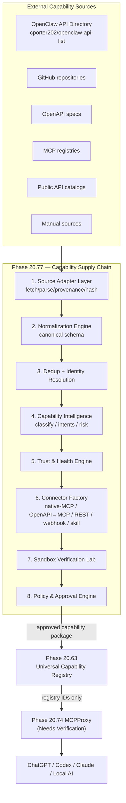

# Phase 20.77 — Pao-hubPro × OpenClaw API Directory

## Massive External Capability Catalog, Autonomous API/MCP Discovery, Intent-Aware Tool Selection, Trust-Scored Connector Generation & Policy-Governed Capability Supply Chain

**Project:** Pao-hubPro
**Phase:** 20.77
**Status:** Implementation Specification (restructured into the Pao-hubPro master 44-section blueprint)
**Primary role:** External Capability Supply Chain / Discovery Feed
**Upstream reference (directory source):** `cporter202/openclaw-api-list`
**Upstream reference (runtime/documentation):** `openclaw/openclaw`
**Target control plane:** Pao-hubPro
**Source document date:** 2026-09-17
**Source filename (preserved per master request §39):** `Phase 20.77 - Pao-hubPro x OpenClaw API Directory.md`

---

### Verification & Decision Record (master request §1, §36, §38, §40)

**Verified against the attached source before restructuring:**
- Phase number and name: **20.77**, "Pao-hubPro × OpenClaw API Directory" — matches the source title exactly. No renumbering applied.
- Objective, 10-layer architecture, components, integration targets, dependencies, milestones, and the embedded Codex prompt were verified line-by-line against the source. No capability was removed, merged, or assumed.
- The source self-declares its relationships: it feeds **Phase 20.63 (Universal Capability Registry)** and routes through **Phase 20.74 (MCPProxy / Federated Tool Gateway)** without duplicating either.

**⚠ Phase numbering registry update:**
- 20.75 (OpenAffiliate) recommended "Revenue Intelligence" as the next phase; face_recognition subsequently took 20.76, and the tentative placeholder for Revenue Intelligence was 20.77.
- **This document now occupies 20.77 → Revenue Intelligence must be numbered 20.78 or later when its document is created.** The original number/filename of this phase is kept unchanged per master request §36.

**⚠ Unresolved upstream dependency (Needs Verification):**
- **Phase 20.74 — MCPProxy / Federated Tool Gateway** is referenced as a hard integration target but has **never been attached to this processing run**. Its interface is treated as *Needs Verification* everywhere below; this blueprint defines the contract 20.77 requires of it (accept registry IDs only, reject source URLs) without assuming 20.74's internal design.
- Phase 20.63 was attached and processed this run; its registry is treated as the canonical registration target.

**Language note:** The source is Thai/English mixed. Load-bearing principles, schemas, configuration, and the Codex prompt are preserved verbatim. Prose sections are normalized into blueprint English with Thai key quotes retained.

---
---

## 1. Executive Summary

Phase 20.77 adds an **External Capability Supply Chain** layer to Pao-hubPro so the system can discover, screen, evaluate, generate connectors for, and register APIs / MCP servers / Skills / Webhooks from external sources in a governed pipeline — using `openclaw-api-list` as one primary discovery source for new capabilities.

Core principle (verbatim from source §0):

> Pao-hubPro ต้องไม่โหลด API/MCP จำนวนมากเข้าหา Agent โดยตรง
> แต่ต้องค้นพบ → Normalize → Deduplicate → Classify → Score → Policy Check → Sandbox Verify → Human Approve → Register → Route เท่านั้น

(Translation: Pao-hubPro must never load large volumes of APIs/MCPs directly at agents; it must only Discover → Normalize → Deduplicate → Classify → Score → Policy-check → Sandbox-verify → Human-approve → Register → Route.)

Phase 20.77 **does not duplicate** the capability registry of Phase 20.63 nor the MCP gateway of Phase 20.74. Its job is to be the **supply chain that sits in front of Registry and Gateway**:

```text
External Sources
     │
     ├── OpenClaw API Directory
     ├── Public API catalogs
     ├── MCP registries
     ├── GitHub repositories
     ├── OpenAPI documents
     └── Manually-added sources
              │
              ▼
      Phase 20.77
Capability Supply Chain
              │
              ▼
      Phase 20.63
Universal Capability Registry
              │
              ▼
      Phase 20.74
MCPProxy / Federated Tool Gateway
              │
              ▼
 ChatGPT / Codex / Claude / Local AI
```

Closing framing (verbatim, source §69):

> Pao-hubPro เปลี่ยนจากระบบที่ "มีเครื่องมือที่เราเพิ่มไว้"
> ไปเป็นระบบที่สามารถ "ค้นพบความสามารถใหม่ได้เอง แต่รับเข้าระบบอย่างมีหลักฐาน มี policy มี sandbox มี approval และมี audit"

นี่คือความแตกต่างระหว่าง **Tool Collection** กับ **Policy-Governed Capability Supply Chain**

---

## 2. Problem Statement

1. **Tool explosion vs. context budget.** A curated directory such as `openclaw-api-list` lists on the order of a hundred+ integrations across MCP servers, productivity APIs, automation/webhooks, AI APIs, developer tools, search/research, calendar/messaging/storage, browser automation, SEO, travel, jobs, ecommerce, social media, video and more. Injecting an entire catalog into agent context is unsafe and wasteful. Upstream itself recommends **"start small"** — begin with 2–3 needed capabilities instead of exposing many tools at once. Pao-hubPro industrializes this principle.
2. **Untrusted third-party supply chain.** Discovered MCP servers, packages, and `SKILL.md` files come from unknown publishers. Nothing discovered may be trusted by default; nothing may flow from "source URL" to "runtime execution".
3. **No evidence path.** Without this layer, capabilities enter the system by manual whim. There is no provenance, no trust evidence, no dedup across sources, no sandbox proof, and no immutable versioning for connectors.
4. **Duplication risk across sources.** One API can appear in the OpenClaw list, an MCP registry, a GitHub repo, vendor docs, and manual entries simultaneously. Merging them wrongly corrupts the registry; keeping them separate wastes budget.

The question Phase 20.77 answers systemically (source §2): when a user says "ผมต้องการส่งข้อความผ่าน Telegram", the system must not answer with the whole tool catalog — it must resolve the intent through a governed discovery-to-registration pipeline.

---

## 3. Goals

Phase 20.77 must, per source §1:

1. Discover capabilities autonomously.
2. Analyze what a capability does.
3. Detect duplicates (across sources).
4. Assess risk.
5. Assess health / availability.
6. Assess license / source provenance.
7. Convert APIs into connectors.
8. Test in sandbox.
9. Request approval when high privileges are involved.
10. Register into Phase 20.63.
11. Route through Phase 20.74.
12. Expose to the agent **only** the tools matching the current intent.

The target system is an **Autonomous External Capability Discovery & Governance Layer** — the supply chain for AI-agent tooling.

---

## 4. Non-Goals

Phase 20.77 **is not** (verbatim list, source §3):

- การ fork OpenClaw runtime (forking the OpenClaw runtime)
- การแทนที่ Pao-hubPro ด้วย OpenClaw (replacing Pao-hubPro with OpenClaw)
- การติดตั้ง API/MCP ทุกตัวใน directory (installing every API/MCP in the directory)
- การให้ Agent ดาวน์โหลด code แล้ว execute เองทันที (agents downloading and immediately executing code)
- การเก็บ API key ใน prompt (storing API keys in prompts)
- การ expose shell/filesystem/browser/payment tools โดยไม่มี policy (exposing shell/filesystem/browser/payment tools without policy)
- การ bypass Phase 20.63 (bypassing Phase 20.63)
- การ bypass Phase 20.74 (bypassing Phase 20.74)
- marketplace สำหรับ third-party code แบบ unrestricted (an unrestricted third-party code marketplace)
- autonomous credential creation
- autonomous financial transaction execution

---

## 5. Why This Phase Exists

- Phase 20.63 governs *approved* capabilities but has no mechanism for discovering and vetting candidates from massive external catalogs at scale.
- Phase 20.74 routes *registered* capabilities but does not discover or generate them.
- Agents cannot self-serve new capabilities today: there is no evidence-based path from "found something useful externally" to "safely usable inside Pao-hubPro".
- Upstream's curated list is a high-value discovery feed but an untrusted one — exactly the input a governed supply chain is designed for.

Phase 20.77 fills the gap **before** Registry (20.63) and **before** Gateway (20.74).

---

## 6. Relationship to Pao-hubPro (and Existing Phases)

### 6.1 Phase 20.63 — Public APIs (Universal Capability Registry)

Phase 20.63 is the *Universal External Capability Registry, Autonomous API Discovery, Health & Trust Intelligence, MCP Tool Generation & Policy-Governed API Access Gateway*. Phase 20.77 does **not** create a new registry; it is the **ingestion / supply-chain layer** feeding it:

```text
Phase 20.77
Discovery + Normalization + Trust + Generation
                │
                ▼
Phase 20.63
Canonical Capability Registry
```

### 6.2 Phase 20.74 — MCPProxy

Phase 20.74 is the runtime gateway / federated MCP control plane. Phase 20.77 sends **only policy-cleared connectors** into MCPProxy:

```text
Phase 20.77
Approved Connector
      │
      ▼
Phase 20.63
Registry Entry
      │
      ▼
Phase 20.74
MCPProxy
      │
      ▼
Agent Runtime
```

**⚠ Needs Verification:** 20.74 has not been attached/implemented in this run. The binding contract this phase imposes on it is defined in §17/§18 below (registry IDs only; never source URLs).

### 6.3 Context-aware phases (tool projection contract)

Phase 20.77 must never inject the full tool catalog into model context. Contract:

```text
Intent
↓
Capability Search
↓
Top-K Candidates
↓
Policy Filter
↓
Tool Projection
↓
Agent Context
```

```yaml
tool_projection:
  default_top_k: 5
  hard_max: 12
  include_descriptions: concise
  include_unused_tools: false
```

### 6.4 Numbering registry

- 20.63 = registry (processed this run), 20.74 = gateway (not yet attached), 20.77 = this supply chain.
- "Revenue Intelligence" (recommended by 20.75) is displaced: it must be numbered **20.78+**.

---

## 7. Upstream References

Checked 2026-09-17 (source §70):

```text
https://github.com/cporter202/openclaw-api-list
https://github.com/cporter202/openclaw-api-list/blob/main/OPENCLAW_RECOMMENDED.md
https://github.com/cporter202/openclaw-api-list/blob/main/OPENCLAW_FOCUS.md
https://github.com/openclaw/openclaw
https://github.com/openclaw/openclaw/blob/main/docs/tools/skills.md
https://github.com/openclaw/openclaw/blob/main/docs/tools/creating-skills.md
https://github.com/openclaw/openclaw/blob/main/docs/cli/skills.md
```

Upstream note (verbatim): หมายเหตุ — URL เดิม `https://github.com/cporter202/openclaw` ไม่ใช่ repository ที่เข้าถึงได้ ณ เวลาตรวจสอบ จึงใช้ `cporter202/openclaw-api-list` เป็น upstream directory source ของ Phase นี้ และใช้ `openclaw/openclaw` เป็น runtime/reference documentation.

Standing requirements:

- Re-check upstream structure, revision, and license before each compatibility release.
- Pin ingestion snapshots to commit SHA (see §13).
- Do **not** assume the upstream Markdown format is permanently stable (§7.2 of source).

---

## 8. Current-State Assumptions

| # | Assumption | Status |
|---|---|---|
| A1 | Phase 20.63 exposes a registration interface accepting canonical capability packages | Verified this run (20.63 blueprint defines the registry); exact API shape *Needs Verification* against implementation |
| A2 | Phase 20.74 (MCPProxy) exists or will exist and accepts registry IDs only | **Needs Verification** — phase never attached |
| A3 | Pao-hubPro already provides: secret/credential broker, policy engine, audit pipeline, DB/ORM + migrations, dashboard conventions | Assumption (consistent with processed phases) |
| A4 | Upstream `OPENCLAW_RECOMMENDED.md` exists on `main` | Assumption based on source §7.1; verify at first sync |
| A5 | Upstream Markdown tables/headings/links are parseable but unstable across revisions | Stated by source; adapter must tolerate drift |
| A6 | Sandbox capability exists in Pao-hubPro runtime (filesystem/network/process restriction primitives) | Assumption; *Needs Verification* |

Per master request §38, unresolved items are recorded here rather than blocking; implementation must re-verify A1, A2, A3, A6 at build time.

---

## 9. Target Architecture

Ten-layer supply chain (verbatim, source §5):

```text
┌───────────────────────────────────────────────────────┐
│                 EXTERNAL CAPABILITY SOURCES           │
├───────────────────────────────────────────────────────┤
│ OpenClaw API List                                     │
│ MCP Registries                                        │
│ GitHub Repositories                                   │
│ OpenAPI Specs                                         │
│ Public API Catalogs                                   │
│ Manual Sources                                        │
└────────────────────────┬──────────────────────────────┘
                         │
                         ▼
┌───────────────────────────────────────────────────────┐
│ 1. Source Adapter Layer                               │
│ - fetch                                                │
│ - parse                                                │
│ - provenance                                           │
│ - version / hash                                       │
└────────────────────────┬──────────────────────────────┘
                         ▼
┌───────────────────────────────────────────────────────┐
│ 2. Capability Normalization Engine                    │
│ - common schema                                        │
│ - auth type                                            │
│ - transport                                            │
│ - actions / scopes                                     │
│ - cost metadata                                        │
└────────────────────────┬──────────────────────────────┘
                         ▼
┌───────────────────────────────────────────────────────┐
│ 3. Dedup + Identity Resolution                        │
│ - URL similarity                                       │
│ - package identity                                     │
│ - API vendor identity                                  │
│ - capability semantic similarity                       │
└────────────────────────┬──────────────────────────────┘
                         ▼
┌───────────────────────────────────────────────────────┐
│ 4. Capability Intelligence                            │
│ - classify                                             │
│ - intent mapping                                       │
│ - read/write/destructive classification                │
│ - credential requirement                               │
└────────────────────────┬──────────────────────────────┘
                         ▼
┌───────────────────────────────────────────────────────┐
│ 5. Trust & Health Engine                              │
│ - source provenance                                    │
│ - repo maintenance                                     │
│ - endpoint health                                      │
│ - TLS                                                  │
│ - schema quality                                       │
│ - license                                              │
│ - risk                                                 │
└────────────────────────┬──────────────────────────────┘
                         ▼
┌───────────────────────────────────────────────────────┐
│ 6. Connector Factory                                  │
│ - Native MCP                                           │
│ - OpenAPI → MCP                                        │
│ - REST → Tool                                          │
│ - Webhook → Event Tool                                 │
│ - Skill Adapter                                        │
└────────────────────────┬──────────────────────────────┘
                         ▼
┌───────────────────────────────────────────────────────┐
│ 7. Sandbox Verification Lab                           │
│ - network allowlist                                    │
│ - secret isolation                                     │
│ - dry run                                              │
│ - response validation                                  │
│ - side-effect detection                                │
└────────────────────────┬──────────────────────────────┘
                         ▼
┌───────────────────────────────────────────────────────┐
│ 8. Policy & Approval Engine                           │
│ - auto allow                                           │
│ - require approval                                     │
│ - quarantine                                           │
│ - block                                                 │
└────────────────────────┬──────────────────────────────┘
                         ▼
┌───────────────────────────────────────────────────────┐
│ 9. Phase 20.63 Registry Adapter                       │
└────────────────────────┬──────────────────────────────┘
                         ▼
┌───────────────────────────────────────────────────────┐
│ 10. Phase 20.74 MCPProxy Runtime                      │
└────────────────────────┬──────────────────────────────┘
                         ▼
┌───────────────────────────────────────────────────────┐
│ ChatGPT | Codex | Claude | Local AI | Other Agents    │
└───────────────────────────────────────────────────────┘
```

---

## 10. Architecture Diagram (mermaid)



Anti-pattern that must be structurally impossible (source §26):

```text
Incorrect:
Agent → GitHub URL → npm install → execute
```

---

## 11. Core Components

### 11.1 Source Adapter Layer

Abstraction (verbatim, source §6):

```ts
interface CapabilitySourceAdapter {
  sourceId: string;
  discover(cursor?: string): Promise<DiscoveryBatch>;
  fetchDetails(ref: SourceReference): Promise<RawCapabilityRecord>;
  getProvenance(ref: SourceReference): Promise<ProvenanceRecord>;
}
```

First-generation adapters:

```text
sources/
├── openclaw-api-list/
├── github/
├── openapi/
├── mcp-registry/
├── manual/
└── generic-http/
```

### 11.2 OpenClaw API Directory Adapter

Canonical source: `https://github.com/cporter202/openclaw-api-list`. Files to support: `README.md`, `OPENCLAW_RECOMMENDED.md`, `OPENCLAW_FOCUS.md`, category markdown files, future category files.

Strategy (verbatim, source §7.2): ห้าม assume ว่า Markdown format จะคงที่ตลอด (never assume the Markdown format stays stable).

Parsing pipeline:

```text
Git Fetch
↓
Commit SHA
↓
Raw Markdown
↓
Heading/Table Parser
↓
Link Extraction
↓
Category Mapping
↓
Raw Capability Records
```

Provenance record stored per discovery:

```yaml
source:
  provider: github
  owner: cporter202
  repository: openclaw-api-list
  branch: main
  commit_sha: "<sha>"
  file: "OPENCLAW_RECOMMENDED.md"
  discovered_at: "<timestamp>"
```

Incremental sync (verbatim policy, source §7.3): ห้าม re-import ทั้งหมดทุกครั้ง (never full re-import every time):

```text
last_sha == current_sha
    ↓ yes
skip

last_sha != current_sha
    ↓
parse changed source
    ↓
calculate additions/deletions/changes
```

### 11.3 Normalization, Dedup, Intelligence, Trust & Health

Covered in §18 (schema, taxonomy, intents, dedup), §14 (risk), §24 (health/cost/quota), §19 (policy).

### 11.4 Connector Factory

Connector types (source §16): `native-mcp`, `openapi-mcp`, `rest-tool`, `graphql-tool`, `webhook-tool`, `skill-adapter`, `cli-adapter`.

Priority order:

```text
1. Trusted Native MCP
2. Official OpenAPI
3. Official REST API
4. Trusted third-party adapter
5. Generated adapter
6. CLI wrapper
```

### 11.5 Sandbox Verification Lab

See §20.4.

### 11.6 Policy & Approval Engine

See §19 and §21.

### 11.7 Registry & Gateway Adapters

See §17–§18 (20.63 registration payload) and §26 rules (20.74 routing).

---

## 12. Component Responsibilities

| Component | Responsibility | Hard invariants |
|---|---|---|
| Source Adapter | Fetch, parse, hash, provenance per source | Pin commit SHA; tolerate format drift; keep raw evidence |
| Normalization Engine | Map raw records → canonical `CapabilityRecord` | No invention of fields; unknowns stay `unknown` |
| Dedup Engine | Resolve one canonical identity per real capability | Merge only ≥ 0.94 deterministic score; 0.80–0.94 → human review; never semantic-name-only merge |
| Capability Intelligence | Categories, intents, risk classes, credential needs | Risk unknown → fail closed |
| Trust & Health Engine | Evidence-backed 0–100 trust; health probes | Trust is advisory, never permission; health never auto-approves |
| Connector Factory | Generate/import connector candidates | Prefer official native/document interfaces over generated wrappers; immutable versions |
| Sandbox Lab | Prove candidate behavior before exposure | Deny-by-default network, no real secrets, no shell; side-effect + leak detection |
| Policy & Approval | Gate everything before registration/exposure | Fail closed; approvals scoped, single-use default |
| 20.63 Adapter | Register approved packages | Carry provenance, trust, risk, connector version, policy profile |
| 20.74 Adapter | Route runtime calls by registry ID | Reject any external source URL at runtime boundary |

---

## 13. Data Flow

1. **Ingestion:** Git Fetch → pin Commit SHA → Raw Markdown → Heading/Table Parser → Link Extraction → Category Mapping → Raw Capability Records → normalized `CapabilityRecord` (source §7.2).
2. **Incremental sync:** compare last synced SHA vs current; skip when equal; otherwise parse the delta and compute additions/deletions/changes (source §7.3).
3. **Enrichment:** classify categories/taxonomy (§18.3), map intents (§18.4), classify risk (§14), collect trust evidence (§18.5), probe health (§24).
4. **Generation:** connector candidate per §17 (OpenAPI→MCP) / §17b (REST) / native MCP inspection (§17c) / skill ingestion (§17d).
5. **Verification:** sandbox run (§20.4) → pass/fail evidence recorded.
6. **Gating:** policy evaluation (§19) → human approval where required (§21).
7. **Registration:** 20.63 payload (§18.7) → registry ID.
8. **Routing:** agent intent → search → top-K projection → invocation via 20.74 by registry ID.
9. **Auditing:** every step emits an audit event (§25).

On parser failure: preserve the last known-good state and keep the failed snapshot for diagnosis; never silently drop capabilities.

---

## 14. Control Flow (+ R0–R4 Mapping)

### 14.1 Policy evaluation

Input shape (source §23):

```json
{
  "agent": "codex",
  "intent": "calendar.event.create",
  "capability": "google-calendar-mcp",
  "operation": "create_event",
  "risk": 2,
  "trust": 87,
  "environment": "local",
  "has_secret": true,
  "side_effect": true
}
```

Output shape:

```json
{
  "decision": "require_approval",
  "constraints": {
    "max_calls": 1,
    "allowed_account": "personal",
    "expires_in_seconds": 300
  }
}
```

Decision enum (source):

```ts
type PolicyDecision =
  | "allow"
  | "allow_with_constraints"
  | "require_approval"
  | "quarantine"
  | "deny";
```

**Mapping to the master-request policy enum (decision note):**

| Source decision | Master enum | Semantics |
|---|---|---|
| `allow` / `allow_with_constraints` | `ALLOW` | `allow_with_constraints` = ALLOW carrying machine-enforced constraints (max_calls, allowed_account, expiry) |
| `require_approval` | `REQUIRE_APPROVAL` | Human approval gate before execution |
| `quarantine` | `QUARANTINE` | Capability visible to admins only, not agents |
| `deny` | `DENY` | Fail-closed refusal |

Un-evaluatable policy input ⇒ **DENY** (fail closed).

### 14.2 Source Risk 0–5 → Pao-hubPro R0–R4 mapping (decision note)

The source defines six risk tiers (§14). The master-request control plane uses R0–R4. Mapping is fixed:

| Source tier | Examples (source) | Pao tier | Default treatment |
|---|---|---|---|
| Risk 0 — Public Read-Only | weather lookup, public documentation, public search, dictionary | **R0** | Auto-enable **after** trust policy passes |
| Risk 1 — Authenticated Read-Only | read analytics, read cloud files, read calendar | **R1** | Secret isolation required; no approval by default |
| Risk 2 — Reversible Write | create calendar event, create draft, write spreadsheet row | **R2** | Approval per policy (`configurable`) |
| Risk 3 — External Communication | send email, post Slack, publish social media, send WhatsApp | **R3** | Approval: required (default) |
| Risk 4 — Destructive / Sensitive | delete, overwrite, modify production, credential management, deploy, browser submit involving account changes | **R4** | Approval: mandatory; sandbox: mandatory; audit: full |
| Risk 5 — Critical | financial transaction, billing changes, account ownership, security policy changes, privilege escalation, host-level control | **R4 (Critical sub-tier)** | automatic_execution: false; human_approval: mandatory; second_confirmation: configurable |

R4-Critical keeps all R4 gates **plus** the explicit `automatic_execution: false` flag and configurable second confirmation. The internal `risk.level 0–5` field in the canonical schema is preserved verbatim; the R0–R4 tier is derived, never stored over it.

### 14.3 Quarantine control flow

Trigger conditions (source §22, verbatim):

```text
unknown publisher
unverified package
suspicious install script
unexpected host access
unexpected network destination
license unclear
unmaintained dependency
tool behavior differs from description
secret exfiltration suspicion
```

Quarantined state:

```yaml
visible_to_agent: false
runtime_enabled: false
admin_visible: true
manual_review_required: true
```

### 14.4 Approval-token control flow

Bound to (source §24): agent, capability, operation, arguments hash, time window, user/session.

```yaml
approval_token:
  capability: google-calendar
  operation: create_event
  args_hash: sha256(...)
  expires_in: 300
  single_use: true
```

ห้าม approve `calendar.*` แบบกว้างโดยอัตโนมัติ (never auto-approve a broad `calendar.*` scope).

### 14.5 Intent-aware selection control flow

```text
User Request
↓
Intent Extractor
↓
Intent Vector + Structured Intent
↓
Registry Search
↓
Candidate Retrieval
↓
Policy Filter
↓
Trust Filter
↓
Health Filter
↓
Cost Filter
↓
Context Budget Filter
↓
Top-K Selection
↓
Tool Projection to Agent
```

---

## 15. Agent/Worker Model

**Discovery/worker processes (system-side, idempotent, bounded, auditable):**
- Source sync workers (incremental, SHA-pinned).
- Normalization, dedup, classification workers.
- Trust scorer and evidence collector.
- Health checker (see §24.4 frequencies).
- Sandbox runner (isolated verification of candidates).
- Connector version diff/promote workers.

**Agent boundaries (verbatim lists, source §51):**

อนุญาตให้ agent (agents ARE allowed to):

```text
search
compare
classify
generate candidate connector
test candidate in sandbox
prepare recommendation
```

ไม่อนุญาตโดย default (agents are NOT allowed, by default, to):

```text
install on host
store real secret
grant OAuth scopes
publish externally
send message
make payment
delete data
modify production
```

Agents may *recommend* capabilities but must **never install them** (source §50): "ระบบสามารถแนะนำ capability ใหม่ได้ แต่ **ห้ามติดตั้งเอง**".

---

## 16. Session/State Model

### 16.1 Capability lifecycle (canonical schema, verbatim)

```text
discovered → normalized → scored → generated → testing → approved → registered
                                                                  ↓ (any time)
                                                       quarantined / disabled
```

### 16.2 Connector version states

```text
last-known-good
current
candidate
quarantined
```

Connector updates are **immutable versions** (source §42):

```text
connector://vendor/tool/1.0.0
connector://vendor/tool/1.1.0
```

ห้าม overwrite version เก่า (never overwrite an old version). Update flow:

```text
new upstream version
↓
new connector candidate
↓
diff
↓
sandbox
↓
policy
↓
approval if needed
↓
promote
```

### 16.3 Approval tokens

Single-use by default, 300 s expiry (configurable), bound to capability + operation + args hash + user/session (§14.4). Default UX choice is **Approve once** (§21).

### 16.4 Trust status states

`trusted | review | quarantine | blocked` (thresholds in §18.5).

---

## 17. MCP Integration

### 17.1 Native MCP import — mandatory inspection

MCP candidates must be inspected for (source §19, verbatim list):

```text
transport
command
package
repository
publisher
tool list
required env
filesystem access
network access
host execution
install command
postinstall behavior
```

Before enable:

```text
discover
→ inspect
→ sandbox
→ enumerate tools
→ classify each tool
→ policy
→ register
```

### 17.2 MCPProxy (Phase 20.74) adapter rules

Phase 20.74 must accept **only registry IDs**. External source URLs must never route into runtime (source §26):

```text
Correct:
Agent
↓
Intent
↓
Registry ID
↓
MCPProxy
↓
Connector

Incorrect:
Agent
↓
GitHub URL
↓
npm install
↓
execute
```

### 17.3 Generated MCP tool metadata

Generated tools must carry (source §17):

```yaml
tool:
  name: vendor_resource_action
  description: concise
  side_effect: true
  risk_level: 2
  auth_required: true
  timeout_ms: 30000
  retries: 1
```

### 17.4 Skill ingestion (SKILL.md)

OpenClaw uses `SKILL.md` to teach agents when/how to use a capability. Pao-hubPro may ingest metadata but must **never assume skill text = trusted policy** (source §20). Pipeline:

```text
SKILL.md
↓
Parse metadata
↓
Extract stated requirements
↓
Static security scan
↓
Cross-check actual code/tools
↓
Map to Pao Capability Schema
↓
Trust/Policy
```

Skill instructions must never override:

```text
Pao policy
sandbox
secret broker
approval rules
tool allowlists
network allowlists
```

---

## 18. Capability Registry (canonical model)

### 18.1 Canonical Capability Schema (verbatim, source §8)

```ts
type CapabilityTransport =
  | "mcp"
  | "rest"
  | "graphql"
  | "webhook"
  | "websocket"
  | "skill"
  | "cli"
  | "unknown";

type RiskClass =
  | "read_only"
  | "write"
  | "destructive"
  | "financial"
  | "credential"
  | "host_control"
  | "browser_control"
  | "communication"
  | "unknown";

interface CapabilityRecord {
  id: string;
  canonicalName: string;
  vendor?: string;

  description: string;
  categories: string[];
  intents: string[];

  transport: CapabilityTransport[];
  endpoints: EndpointRecord[];

  source: {
    sourceId: string;
    sourceUrl: string;
    sourceRef?: string;
    sourceCommit?: string;
    discoveredAt: string;
  };

  auth: {
    required: boolean;
    types: string[];
    requiredSecrets: string[];
    oauthScopes?: string[];
  };

  operations: OperationRecord[];

  risk: {
    classes: RiskClass[];
    level: 0 | 1 | 2 | 3 | 4 | 5;
    sideEffects: boolean;
    approvalRequired: boolean;
  };

  trust: {
    score: number;
    confidence: number;
    status: "trusted" | "review" | "quarantine" | "blocked";
  };

  health: {
    status: "unknown" | "healthy" | "degraded" | "offline";
    lastCheckedAt?: string;
    latencyMs?: number;
  };

  cost?: {
    model: "free" | "freemium" | "paid" | "usage" | "unknown";
    metadata?: Record<string, unknown>;
  };

  license?: {
    name?: string;
    url?: string;
    detected: boolean;
  };

  connector?: ConnectorRecord;

  lifecycle: {
    state:
      | "discovered"
      | "normalized"
      | "scored"
      | "generated"
      | "testing"
      | "approved"
      | "registered"
      | "quarantined"
      | "disabled";
    createdAt: string;
    updatedAt: string;
  };
}
```

### 18.2 Deduplication — identity signals and thresholds (verbatim, source §9)

```yaml
dedup_signals:
  exact_homepage: 1.0
  exact_repo: 1.0
  exact_package: 0.95
  exact_mcp_server_url: 0.95
  vendor_plus_name: 0.90
  endpoint_host: 0.85
  semantic_similarity: 0.70
```

```yaml
dedup:
  auto_merge_threshold: 0.94
  review_threshold: 0.80
  below_review_threshold: keep_separate
```

ห้าม merge โดย semantic name อย่างเดียว (never merge on semantic name alone).

### 18.3 Canonical taxonomy (source §10)

```text
research
search
browser
filesystem
developer
coding
deployment
database
storage
calendar
email
messaging
social
automation
webhook
documents
image
video
audio
ai_model
agent
seo
analytics
commerce
finance
travel
jobs
maps
smart_home
security
monitoring
data
other
```

Multi-category allowed, e.g.:

```yaml
canonical_name: playwright-mcp
categories:
  - browser
  - automation
  - developer
```

### 18.4 Intent model (source §11)

Query by **intent**, not tool name:

```text
research.web.search
research.web.extract
calendar.event.create
calendar.event.cancel
messaging.slack.send
messaging.telegram.send
browser.navigate
browser.form.submit
document.convert.markdown
seo.keyword.research
storage.file.upload
automation.workflow.trigger
```

```ts
interface CapabilityIntent {
  namespace: string;
  action: string;
  target?: string;
  sideEffect: "none" | "low" | "medium" | "high";
  requiredScopes?: string[];
}
```

### 18.5 Trust scoring engine (source §13)

Trust score 0–100, evidence-backed:

```text
Source Provenance        20
Repository Maintenance   15
Official Documentation   15
Schema Quality           10
License Clarity          10
Security Posture         15
Endpoint Health          10
Community Signal          5
---------------------------
Total                   100
```

```yaml
trust_policy:
  auto_eligible: ">= 80"
  review: "60-79"
  quarantine: "30-59"
  blocked: "< 30"
```

**สำคัญ (verbatim):** Trust Score ไม่ใช่การรับรองว่าปลอดภัย — มันเป็น decision-support signal เท่านั้น (Trust Score is NOT a safety certification; it is decision-support only).

### 18.6 Selection scoring (source §12)

```text
FinalScore =
  IntentMatch       * 0.30 +
  TrustScore        * 0.20 +
  HealthScore       * 0.15 +
  PermissionFit     * 0.15 +
  CostFit           * 0.10 +
  LatencyScore      * 0.05 +
  ContextEfficiency * 0.05
```

ห้ามให้ popularity เป็น signal หลัก (popularity must never be the primary signal).

### 18.7 Registration payload into Phase 20.63 (source §25)

```json
{
  "source": "openclaw-api-list",
  "canonical_name": "playwright-mcp",
  "connector_type": "native-mcp",
  "trust_score": 88,
  "risk_level": 3,
  "policy_profile": "browser-controlled",
  "connector_ref": "connector://playwright-mcp/1.0.0"
}
```

### 18.8 Provenance chain (source §34)

Every record must answer: มาจากไหน? ถูกค้นพบเมื่อไร? source commit ไหน? ใคร generate connector? ใช้ model ไหนช่วย generate? ผ่าน test อะไร? ใคร approve? version ไหนกำลังใช้งาน?

```text
Source
→ Raw Record
→ Normalized Record
→ Trust Evidence
→ Connector Version
→ Test Run
→ Approval
→ Registry Entry
→ Runtime Execution
```

---

## 19. Policy Model

- Decision enum and mapping to ALLOW/DENY/REQUIRE_APPROVAL/QUARANTINE: §14.1.
- Bind policies to: agent, capability, operation, risk, trust, environment, data class, side effects (source §66-O).
- **Data classification** (source §48): request payloads tagged `public | internal | confidential | secret | credential | personal`; each capability declares `allowed_data_classes`; the selector must intersect classes **before** routing.
- **Failover constraint** (source §47): failover (e.g., Exa → Tavily → Brave for `web.search`) must respect policy and data classification; ห้ามย้ายข้อมูล sensitive ไป provider อื่นโดยอัตโนมัติถ้า policy ไม่อนุญาต.
- **Cost/quota signals** (source §45–46): cost model (`free|freemium|paid|usage|unknown`), budget preferences (`prefer_free`, `max_estimated_cost_usd: 0.05` example), rate-limit state (`requests_remaining`, `reset_at`, `quota_window`, `provider_account`); never select a near-exhausted provider when a suitable alternative exists.
- Fail closed when policy cannot be evaluated; fail closed for elevated risk (source §66-G).

---

## 20. Security Model

### 20.1 Secret isolation (source §15, verbatim)

ห้ามเก็บ secrets ใน:

```text
prompt
tool description
SKILL.md body
logs
database plaintext
audit payload
generated connector source
```

```ts
interface SecretReference {
  provider: string;
  secretId: string;
  scope: string[];
}
```

Runtime path:

```text
Agent
↓
Connector Request
↓
Policy Check
↓
Secret Broker
↓
Ephemeral Injection
↓
Connector
```

Agent เห็นเพียง:

```json
{
  "credential": "available"
}
```

ไม่เห็น value (never the value).

### 20.2 SSRF protection (source §40, verbatim)

Connector ที่รับ URL ต้องตรวจ:

```text
scheme
host
DNS resolution
private IP ranges
loopback
link-local
metadata endpoints
redirect destinations
```

Default block:

```text
127.0.0.0/8
10.0.0.0/8
172.16.0.0/12
192.168.0.0/16
169.254.0.0/16
::1
fc00::/7
fe80::/10
```

Allow internal access เฉพาะ policy ระบุชัด (internal access only where policy explicitly states).

### 20.3 Supply-chain security (source §41)

Inspect: publisher, release age, release frequency, dependency tree, install scripts, binary downloads, checksum, license, archived status, unexpected ownership change.

On anomaly:

```text
auto-update = false
runtime = hold
status = quarantine
```

### 20.4 Sandbox Verification Lab (source §21, verbatim minimums)

```yaml
sandbox:
  filesystem:
    mode: ephemeral
    write: temp-only

  network:
    default: deny
    allow:
      - declared-api-hosts

  secrets:
    real_secrets: false
    use_test_or_mock: true

  process:
    shell: deny
    child_process: deny-by-default

  timeout:
    seconds: 30

  resource_limits:
    cpu: limited
    memory: limited
```

Mandatory sandbox tests:

```text
schema validation
startup test
handshake test
tool enumeration
read-only call
error handling
timeout behavior
unexpected network detection
filesystem write detection
secret leak detection
prompt injection payload test
```

### 20.5 Connector generation safety rules (source §39, verbatim)

Generated code ต้อง:

```text
use typed schemas
set explicit timeout
limit retries
validate host
validate redirect
mask secrets
sanitize logs
validate response size
validate content type
handle rate limit
handle 4xx/5xx
not execute response content
not eval
not shell-exec
```

### 20.6 LLM boundary in REST → Tool generation (source §18)

```text
Docs URL
↓
Documentation Extractor
↓
LLM-assisted schema proposal
↓
Static validation
↓
Human-reviewed endpoint allowlist
↓
Connector generation
```

> ห้ามให้ LLM เดา endpoint แล้ว production-call โดยตรง — endpoint ต้องมี evidence จาก docs/source
> (LLMs must never guess endpoints into production calls; endpoints require evidence from docs/source.)

### 20.7 Trust is advisory

Restated as an architectural rule: trust scores, health, and popularity inform decisions; **only policy + human approval grant anything**.

---

## 21. Approval Model

### 21.1 Binding and scoping

Approvals bind to: agent, capability, exact operation, argument hash, user/session, expiration. Prefer single-use tokens (§14.4). Broad wildcards (`calendar.*`) are never auto-approved.

### 21.2 Human approval UX (source §49, verbatim)

```text
Agent:
Codex

Wants to use:
Slack MCP

Action:
send_message

Destination:
#project-room

Risk:
External communication

Data classification:
Internal

Trust:
87/100

Approve once
Approve for session
Deny
```

Default ใช้ **Approve once** (default = Approve once).

### 21.3 Recommendation ≠ installation (source §50)

The system may surface new capability recommendations with reasons (matches intent, read-only, trust > 80, active endpoint) — action offered is "Review candidate", never silent install.

---

## 22. Failure Handling

| Failure | Handling |
|---|---|
| Parser/format drift upstream | Keep last known-good state; retain failed snapshot; alert via `source.sync` audit events |
| Sandbox test failure | Candidate not promoted; `connector.test.failed` event; evidence retained (reason, expected vs observed hosts) |
| Unexpected network host / redirect | Block, fail test, quarantine connector, log security event (§60 Scenario E) |
| Secret leak detection | Immediate quarantine; never write the secret value to logs; rotate affected credentials out-of-band |
| Health check failure | Status → `degraded`/`offline`; selector deprioritizes; no auto-revocation by health alone |
| Trust drop below thresholds | Status transitions per §18.5 (`review` → `quarantine` → `blocked`); re-score with evidence |
| Policy evaluation error | **DENY** (fail closed) |
| Registry (20.63) unavailable | Registration queue holds; capabilities stay `approved`, never `registered` |
| MCPProxy (20.74) unavailable | Runtime exposure disabled; discovery/scoring pipeline unaffected |
| Upstream anomaly (§20.3) | auto-update off; runtime hold; quarantine |

---

## 23. Recovery Model

- **Rollback endpoint** (source §43): `POST /api/connectors/:id/rollback`; states kept: `last-known-good`, `current`, `candidate`, `quarantined`.
- **Immutable versions** make rollback deterministic: point `current` back to last-known-good; audit the move.
- **Emergency disable**: `POST /api/connectors/:id/disable` plus capability-level disable; immediate agent invisibility.
- **Re-test path**: quarantined capabilities can be re-tested after remediation; quarantine view answers Why/Evidence/What changed/Re-testable/Who approves (§31.4 → dashboard quarantine view).
- **Source recovery**: resync from a pinned earlier commit SHA if an upstream revision breaks parsing.

---

## 24. Observability

### 24.1 Metrics (source §52, verbatim)

```text
capabilities_discovered_total
capabilities_registered_total
capabilities_quarantined_total
connector_generation_total
connector_test_failure_total
policy_denial_total
tool_projection_count
tool_invocation_total
tool_failure_total
health_check_failure_total
discovery_sync_duration_seconds
```

### 24.2 Structured logging (source §53, verbatim example)

```json
{
  "event": "connector.test.failed",
  "capability_id": "cap_x",
  "connector_id": "conn_x",
  "reason": "unexpected_network_host",
  "expected_hosts": ["api.example.com"],
  "observed_host": "telemetry.other.com",
  "secret_values_logged": false
}
```

### 24.3 Performance targets (source §61)

```text
curated source sync       < 60s
capability search p95     < 300ms
policy decision p95       < 50ms
top-K projection p95      < 500ms
registry write            < 500ms
health lookup cached      < 50ms
```

ไม่ต้อง optimize full 10k catalog ก่อน pipeline ถูกต้อง (do not optimize the full 10k catalog before the pipeline is correct).

### 24.4 Health monitoring (source §44)

Checks: DNS, TLS, endpoint status, MCP handshake, tool enumeration, latency, rate-limit signal, auth validity **without revealing the secret**.

```yaml
health:
  trusted_active: 15m
  normal_active: 1h
  inactive: 24h
  quarantined: manual
```

---

## 25. Audit

Minimum audit events (source §35, verbatim):

```text
source.sync.started
source.sync.completed
capability.discovered
capability.normalized
capability.merged
capability.scored
connector.generated
connector.test.started
connector.test.failed
connector.test.passed
capability.quarantined
approval.requested
approval.granted
approval.denied
capability.registered
capability.disabled
runtime.tool.projected
runtime.tool.invoked
runtime.tool.blocked
```

Rules: audit the full chain discovery → execution (source §59); never log raw credentials; audit payloads carry actor/request/capability/connector/policy/result identifiers; secrets redacted.

---

## 26. Data Model

Tables (source §32, verbatim list):

```text
capability_sources
source_sync_runs
raw_capabilities
capabilities
capability_aliases
capability_intents
capability_operations
capability_auth_requirements
capability_trust_evidence
capability_health_checks
connectors
connector_versions
connector_tests
policy_profiles
policy_decisions
approval_tokens
quarantine_records
capability_audit_events
```

Reference SQL shape (source §33, verbatim; adapt to the project's existing DB/ORM/migration conventions — do not introduce a second ORM):

```sql
CREATE TABLE capabilities (
    id UUID PRIMARY KEY,
    canonical_name TEXT NOT NULL,
    vendor TEXT,
    description TEXT NOT NULL,
    risk_level INTEGER NOT NULL DEFAULT 0,
    trust_score NUMERIC(5,2),
    trust_status TEXT NOT NULL DEFAULT 'review',
    lifecycle_state TEXT NOT NULL DEFAULT 'discovered',
    created_at TIMESTAMPTZ NOT NULL DEFAULT NOW(),
    updated_at TIMESTAMPTZ NOT NULL DEFAULT NOW()
);

CREATE UNIQUE INDEX capabilities_canonical_name_idx
ON capabilities(canonical_name);
```

---

## 27. API/Event Contracts

### 27.1 Capability Query API (source §28, verbatim)

```http
POST /api/capabilities/search
```

Request:

```json
{
  "intent": "research.web.search",
  "query": "find current technical information",
  "constraints": {
    "max_risk": 1,
    "requires_free_tier": false,
    "transport": ["mcp", "rest"]
  },
  "top_k": 5
}
```

Response:

```json
{
  "results": [
    {
      "id": "cap_exa",
      "name": "Exa Search",
      "intent_score": 0.95,
      "trust_score": 91,
      "health": "healthy",
      "risk": 0
    }
  ]
}
```

### 27.2 Discovery API (source §29)

```http
POST /api/discovery/jobs
GET  /api/discovery/jobs/:id
GET  /api/discovery/sources
POST /api/discovery/sources
POST /api/discovery/sources/:id/sync
```

### 27.3 Connector API (source §30)

```http
POST /api/connectors/generate
POST /api/connectors/:id/test
POST /api/connectors/:id/approve
POST /api/connectors/:id/register
POST /api/connectors/:id/quarantine
POST /api/connectors/:id/disable
```

### 27.4 Trust API (source §31)

```http
GET  /api/trust/:capabilityId
POST /api/trust/:capabilityId/recalculate
GET  /api/trust/:capabilityId/evidence
```

Trust responses must return **evidence**, not just a score.

### 27.5 Dynamic tool projection config (source §27)

```yaml
dynamic_tool_projection:
  candidate_pool: 30
  policy_filtered_pool: 12
  final_top_k: 5
  max_tools_per_turn: 8
```

---

## 28. Configuration

Full default configuration (source §57, verbatim):

```yaml
capability_supply_chain:
  enabled: true

  sources:
    openclaw:
      enabled: true
      repository: "cporter202/openclaw-api-list"
      branch: "main"
      bootstrap: "curated"

  discovery:
    automatic_sync: true
    interval: "24h"

  trust:
    minimum_auto_eligible: 80

  connector_generation:
    enabled: true
    auto_register: false

  sandbox:
    required_for_generated: true
    required_for_untrusted: true

  approvals:
    risk_0: false
    risk_1: false
    risk_2: configurable
    risk_3: true
    risk_4: true
    risk_5: true

  context_projection:
    top_k: 5
    hard_max: 12
```

Supporting defaults live in §6.3 (`tool_projection`), §27.5 (`dynamic_tool_projection`), §20.4 (`sandbox`), §24.4 (`health`).

---

## 29. Feature Flags

| Flag | Default | Effect | Rationale |
|---|---|---|---|
| `capability_supply_chain.enabled` | `true` | Master switch for the whole subsystem | Discovery itself is read-only-safe once sandboxed |
| `sources.openclaw.enabled` | `true` | OpenClaw directory sync | Curated bootstrap only |
| `discovery.automatic_sync` | `true` (interval 24h) | Periodic incremental sync | SHA-pinned, bounded |
| `trust.minimum_auto_eligible` | `80` | Auto-eligibility floor | Conservative default per §18.5 |
| `connector_generation.enabled` | `true` | Candidate generation allowed | Generation ≠ production |
| `connector_generation.auto_register` | **`false`** | Auto-registration into 20.63 | Generated connectors must never become production-active automatically (source §66) |
| `sandbox.required_for_generated` | `true` | Sandbox gate on generated candidates | Mandatory per §66 |
| `sandbox.required_for_untrusted` | `true` | Sandbox gate on untrusted imports | Mandatory per §66 |
| `approvals.risk_0` | `false` | No approval for public read-only | After trust policy |
| `approvals.risk_1` | `false` | No approval for authenticated read-only | Secret isolation still applies |
| `approvals.risk_2` | `configurable` | Per-deployment choice | Reversible writes |
| `approvals.risk_3` | `true` | Approval for external communication | Source default |
| `approvals.risk_4` | `true` | Approval mandatory for destructive/sensitive | Source default; cannot be weakened below mandatory |
| `approvals.risk_5` | `true` | Approval mandatory for critical | Plus `automatic_execution: false` (§14.2) |
| `context_projection.top_k` / `hard_max` | `5` / `12` | Intent-aware tool exposure budget | Anti tool-explosion |

Safe-default rules: no external write action enabled by default (source §65-8); no auto-install of third-party executables (§65-9); full-catalog ingestion stays **off** until the curated pipeline passes production hardening (§67).

---

## 30. Repository Structure

Suggested layout (source §56, verbatim):

```text
apps/
└── web/
    └── capabilities/

services/
├── capability-discovery/
├── capability-normalizer/
├── capability-intelligence/
├── trust-engine/
├── health-engine/
├── connector-factory/
├── sandbox-verifier/
├── capability-policy/
└── capability-registry-adapter/

packages/
├── capability-schema/
├── intent-schema/
├── source-adapters/
├── connector-sdk/
├── policy-sdk/
└── provenance/

connectors/
├── generated/
├── approved/
└── quarantined/

tests/
└── fixtures/
```

Adapt to the existing repository's conventions (source §65-1: inspect the repository first; reuse existing architecture).

---

## 31. Dashboard

New pages (source §36):

```text
/capabilities
/capabilities/discovery
/capabilities/registry
/capabilities/connectors
/capabilities/quarantine
/capabilities/policies
/capabilities/audit
```

**36.1 Capability Overview** shows: Total discovered, Approved, Registered, Quarantined, Offline, High risk, New this week, Changed upstream.

**36.2 Capability Detail** shows: Name, Vendor, Description, Source, Transport, Intents, Auth, Risk, Trust, Health, Cost, License, Operations, Connector, Test history, Policy history, Audit timeline.

**36.3 Discovery View** filters: Source, Category, Transport, Trust range, Risk, Auth type, Lifecycle state, Health, Cost type.

**36.4 Quarantine View** must answer:

```text
Why quarantined?
What evidence triggered it?
What changed?
Can it be re-tested?
Who can approve?
```

---

## 32. Dependencies

### Required
- **Phase 20.63 — Universal Capability Registry** (registration target). *Interface shape Needs Verification against the implemented 20.63.*
- **Phase 20.74 — MCPProxy / Federated Tool Gateway** (runtime routing). ⚠ **Never attached to this run — Needs Verification.** Until 20.74 exists, runtime exposure stays disabled; discovery/scoring/sandbox pipeline runs standalone.
- Existing Pao-hubPro: secret/credential broker, policy engine, audit pipeline, DB + ORM + migrations, auth/RBAC, dashboard/UI conventions, worker runtime.

### Recommended
- OpenAPI parser/validator; MCP client SDK for handshake + tool enumeration; SSRF-guard utilities (scheme/host/DNS/redirect validation); Markdown table/heading parser tolerant to drift.

### Optional
- LLM-assisted classification/intent mapping **only** with bounded prompts and structured outputs; LLM-proposed schemas for REST→Tool remain subject to static validation + human-reviewed endpoint allowlist (§20.6).

### Standalone path
With no 20.63 and no 20.74, Phase 20.77 still delivers: source sync → normalize → dedup → score → sandbox → quarantine, storing results in its own tables with lifecycle state capped at `approved` (never `registered`) and `visible_to_agent: false` for all runtime exposure. No standalone path may bypass the sandbox or secret broker.

---

## 33. Compatibility

- **Upstream drift:** Markdown format not guaranteed stable (source §7.2); adapter must parse headings/tables/links generically and pin commit SHAs.
- **Cross-source coexistence:** one real capability appears in multiple sources; dedup rules (§18.2) resolve identity; unresolved duplicates stay separate pending human review.
- **Connector immutability:** `connector://vendor/tool/x.y.z` never overwritten; upgrades are new candidate versions (§16.2).
- **Registry compatibility:** registration carries provenance, trust, risk, connector version, and policy profile so 20.63 can govern downstream without re-derivation.
- **Upstream versioning risk:** like all pre-1.0-adjacent ecosystems, upstream may restructure at any time; re-check structure, revision, and license before each compatibility release (§7).

---

## 34. Migration

- Backward-compatible migrations only (source §65-5): additive tables (§26), additive indexes; no modification of 20.63's schema from this phase.
- Introduce `capabilities.canonical_name` uniqueness with care: dedup must run before the unique constraint is enforced on a populated table.
- Approval tokens and policy decisions reference capabilities/operations by stable IDs; never by source URL.
- Rollback of migrations = drop 20.77-owned tables only; 20.63 data untouched.

---

## 35. Rollback

1. **Feature flag off:** `capability_supply_chain.enabled: false` — stops sync, generation, projection; existing registered capabilities remain governed by 20.63.
2. **Per-source off:** `sources.openclaw.enabled: false`.
3. **Connector rollback:** `POST /api/connectors/:id/rollback` to last-known-good (§23).
4. **Emergency disable:** connector/capability disable endpoints; agents lose visibility immediately.
5. **Data preservation:** audit events, quarantine records, trust evidence are retained (history is never deleted on rollback).
6. **Runtime isolation:** if 20.74 integration misbehaves, registry-ID routing falls back to disabled exposure, never to source-URL routing.

---

## 36. Testing Strategy

### 36.1 Unit (source §54)

```text
parser
normalizer
dedup
taxonomy
intent mapper
trust scorer
policy
risk classifier
```

### 36.2 Integration

```text
OpenClaw source sync
OpenAPI ingestion
MCP handshake
registry adapter
MCPProxy adapter
secret broker
```

### 36.3 Security

```text
SSRF
secret leakage
malicious SKILL.md
malicious MCP metadata
command injection
prompt injection
redirect abuse
oversized response
unexpected file write
unexpected network egress
```

### 36.4 Fixture repository (source §55, verbatim)

```text
tests/fixtures/capabilities/
├── safe-readonly-openapi/
├── write-openapi/
├── malicious-redirect-openapi/
├── native-mcp-safe/
├── native-mcp-host-access/
├── skill-safe/
└── skill-prompt-injection/
```

### 36.5 CI constraints

CI must not depend on live external providers; use local fake API servers and deterministic fixtures (consistent with master-request testing rules; mirror of 20.63's testing contract).

---

## 37. Acceptance Criteria

### 37.1 Acceptance scenarios (source §60, verbatim essence)

**Scenario A — Safe Search Tool**

```text
User:
"ช่วยหาเอกสารวิจัยเรื่อง X"

Expected:
intent = research.*
ค้น candidate
เลือก trusted read-only tools
project top-K
ไม่ต้อง expose calendar/social/payment tools
```

Pass เมื่อ agent ได้เฉพาะ tools ที่เกี่ยวข้อง (pass only when the agent receives solely relevant tools).

**Scenario B — Unknown MCP**

```text
New MCP discovered
↓
publisher unknown
↓
package has postinstall
↓
trust low
```

Expected:

```text
quarantine
no host install
no runtime exposure
```

**Scenario C — Calendar Write**

```text
User:
"สร้างนัดพรุ่งนี้"
```

Expected:

```text
calendar.event.create
↓
risk = write
↓
policy
↓
approval if configured
↓
single-use approval
↓
execute
↓
audit
```

**Scenario D — OpenAPI Conversion**

```text
OpenAPI discovered
↓
validate
↓
classify endpoints
↓
generate MCP candidate
↓
sandbox
↓
review
↓
registry
```

ห้าม production-enable ทันทีหลัง generation (never production-enable immediately after generation).

**Scenario E — Malicious Redirect**

```text
Connector เรียก:
api.example.com

แล้ว redirect ไป:
169.254.169.254
```

Expected:

```text
blocked
test failed
connector quarantined
security event logged
```

### 37.2 Quantitative criteria

Performance targets (§24.3) met in CI-representative environments; security tests (§36.3) green; fixtures (§36.4) all exercised.

---

## 38. Implementation Roadmap

### 38.1 Milestones (source §58)

**Milestone 1 — Foundation:** capability schema; source adapter interface; OpenClaw adapter; database migration; source sync audit.
**Milestone 2 — Intelligence:** taxonomy classifier; intent mapper; risk classifier; dedup engine; trust engine.
**Milestone 3 — Connector Factory:** native MCP import; OpenAPI parser; OpenAPI → MCP generator; REST adapter generator; connector versioning.
**Milestone 4 — Security:** sandbox; egress policy; secret broker integration; quarantine; approval tokens; audit events.
**Milestone 5 — Pao Integration:** Phase 20.63 adapter; Phase 20.74 adapter; intent-aware retrieval; top-K tool projection.
**Milestone 6 — Dashboard:** source page; discovery page; capability details; connector tests; quarantine page; policy view; audit timeline.
**Milestone 7 — Production Hardening:** load tests; failure tests; rollback tests; source-change tests; security regression tests.

### 38.2 Build order (source §63, verbatim)

```text
1. schema
2. OpenClaw curated parser
3. database
4. provenance
5. intent taxonomy
6. risk classifier
7. trust scorer
8. capability search
9. top-K projection
10. native MCP inspector
11. sandbox
12. OpenAPI connector generator
13. policy
14. approval
15. Phase 20.63 adapter
16. Phase 20.74 adapter
17. dashboard
18. full catalog
```

อย่าเริ่มจาก full catalog (never start from the full catalog).

### 38.3 Bootstrap strategy (source §37)

- **Stage A — Curated Only:** import `OPENCLAW_RECOMMENDED.md` only; use it to validate the pipeline.
- **Stage B — High-value Categories:** add MCP, Integrations, Automation, AI, Developer Tools.
- **Stage C — Full Catalog:** only after dedup, trust, health checker, policy, and dashboard are all stable.

### 38.4 Initial capability packs (source §38)

- Research Pack: Exa, Tavily, Firecrawl, ArXiv, PubMed, API Docs
- Browser Pack: Playwright, Browserbase
- Automation Pack: n8n documentation, webhook connectors
- Productivity Pack: Google Calendar, Google Sheets, Slack
- Developer Pack: API documentation, library documentation, OpenAPI → MCP, CVE search

---

## 39. Risks

| Risk | Severity | Mitigation |
|---|---|---|
| Prompt injection via SKILL.md / docs / descriptions | High | Untrusted-input rule (§17.4); skill text never overrides policy; injection payload tests (§20.4) |
| Malicious MCP server (host access, postinstall) | High | Mandatory inspection (§17.1) + sandbox (§20.4) + quarantine (§14.3) |
| SSRF / metadata-endpoint access | High | §20.2 blocklists + redirect re-validation |
| Trust-score over-reliance | Medium | Trust is advisory only (§18.5); policy + approval are the gates |
| Upstream format drift breaking parser | Medium | SHA pinning, tolerant parsing, last-known-good preservation (§22) |
| Supply-chain anomaly (hijacked package) | High | §20.3 anomaly signals → hold + quarantine; immutable versions prevent silent carry-over |
| Tool explosion into agent context | Medium | top-K projection hard caps (§6.3, §27.5) |
| Duplicate/incorrect merges corrupt registry | Medium | Deterministic dedup thresholds; semantic-only merge banned (§18.2) |
| Unverified 20.74 interface | Medium | Registry-ID-only contract defined here; runtime exposure blocked until verified |
| Failover leaking sensitive data across providers | High | Data-classification intersection before route (§19) |
| Autonomous scope creep (agents installing) | High | §15 boundaries: recommend-only; install/execute never default |

---

## 40. Security Checklist

Before merge (source §64, verbatim):

- [ ] No plaintext secrets
- [ ] No dynamic eval
- [ ] No unvalidated shell commands
- [ ] No arbitrary package install
- [ ] No unrestricted network
- [ ] SSRF protection implemented
- [ ] Redirect validation implemented
- [ ] Response size limits
- [ ] Request timeout
- [ ] Rate limits
- [ ] Audit logs redact secrets
- [ ] High-risk approval
- [ ] Sandbox for generated code
- [ ] Connector provenance
- [ ] Immutable connector versions
- [ ] Quarantine path
- [ ] Emergency disable
- [ ] Rollback tested

---

## 41. Production Readiness

Operational checklist before real enablement (source §67, verbatim):

- [ ] Source sync ใช้ pinned/reviewed source
- [ ] Provenance ทำงาน
- [ ] Curated import ผ่าน
- [ ] Dedup ผ่าน fixture tests
- [ ] Trust evidence ตรวจได้
- [ ] Health checks ทำงาน
- [ ] Secret broker พร้อม
- [ ] Sandbox พร้อม
- [ ] SSRF protections พร้อม
- [ ] Phase 20.63 integration พร้อม
- [ ] Phase 20.74 integration พร้อม
- [ ] Approval UI พร้อม
- [ ] Quarantine พร้อม
- [ ] Audit พร้อม
- [ ] Emergency disable พร้อม
- [ ] Rollback พร้อม
- [ ] Full catalog ingestion ยังปิดไว้จนกว่า curated pipeline ผ่าน production hardening

Quality gates (source §66): lint, typecheck, unit tests, integration tests, security regression tests pass; no plaintext secret; no unrestricted external package execution; no source-to-runtime direct path; no duplicate registry/gateway; high-risk actions require approval; all generated/untrusted connectors sandbox-tested; provenance exists for every discovered capability.

---

## 42. Future Extensions

After 20.77 is stable (source §68):

**Capability Demand Learning:**

```text
Capability Demand Learning
↓
ระบบเรียนรู้ว่า workflow ของเปาใช้ capabilities ไหนจริง
↓
Pre-warm เฉพาะตัวที่ใช้บ่อย
↓
ลด context
↓
ลด latency
↓
ลด cost
```

**Capability Benchmark Lab:**

```text
Capability Benchmark Lab
↓
ทดลอง providers หลายตัวด้วย fixture เดียวกัน
↓
วัด quality / latency / cost / reliability
↓
เลือก provider ตาม task โดยอัตโนมัติ
```

Constraints: แต่ต้องแยก benchmarking ออกจาก production execution และต้องไม่ใช้ข้อมูลลับกับ provider ที่ไม่ได้รับอนุญาต (benchmarking must be separated from production execution and must never use sensitive data with unapproved providers).

---

## 43. Definition of Done

Phase 20.77 is complete when (source §59, verbatim):

- [ ] Pao-hubPro sync curated OpenClaw list ได้
- [ ] เก็บ source commit/provenance ได้
- [ ] normalize เป็น canonical schema ได้
- [ ] deduplicate ข้าม source ได้
- [ ] classify category/intents ได้
- [ ] classify risk ได้
- [ ] calculate trust พร้อม evidence ได้
- [ ] native MCP candidate ถูก inspect ก่อนใช้งาน
- [ ] OpenAPI สามารถสร้าง connector candidate ได้
- [ ] generated connector ผ่าน sandbox ก่อน register
- [ ] secrets ไม่ถูกเก็บ plaintext
- [ ] risk 3–5 ต้องผ่าน approval
- [ ] quarantine ทำงาน
- [ ] Phase 20.63 รับ approved capability ได้
- [ ] Phase 20.74 route ด้วย registry ID ได้
- [ ] agent เห็นเฉพาะ top-K relevant tools
- [ ] audit trail ครบตั้งแต่ discovery ถึง execution
- [ ] rollback connector version ได้
- [ ] dashboard แสดง provenance/trust/risk/health ได้

**Reliability principles — standing invariants (source §62, verbatim):**

1. **Fail closed** สำหรับ high-risk
2. **No silent tool substitution** เมื่อ side effects ต่างกัน
3. **No secret in context**
4. **No source-to-runtime direct path**
5. **No generated connector auto-production**
6. **Every execution traceable**
7. **Every connector version immutable**
8. **Every high-risk operation approval-bound**
9. **Context contains minimum necessary tools**
10. **Discovery does not imply trust**

Final framing (source §69): the difference between **Tool Collection** and **Policy-Governed Capability Supply Chain**.

---

## 44. Codex One-Shot Implementation Prompt

Preserved verbatim from source §66 (English as authored):

```text
You are implementing Phase 20.77 of Pao-hubPro.

PHASE TITLE:
Phase 20.77 — Pao-hubPro × OpenClaw API Directory — Massive External Capability Catalog, Autonomous API/MCP Discovery, Intent-Aware Tool Selection, Trust-Scored Connector Generation & Policy-Governed Capability Supply Chain

PRIMARY GOAL:
Add a production-grade external capability supply-chain layer that can discover APIs/MCP servers/integrations from external sources, beginning with cporter202/openclaw-api-list, normalize them into the existing Pao-hubPro capability model, score trust and risk, generate connector candidates, verify them in a sandbox, route them through policy and human approval, register approved capabilities into the existing Phase 20.63 capability registry, and expose them through the existing Phase 20.74 MCPProxy only when relevant to the current agent intent.

IMPORTANT ARCHITECTURAL RULES:
- Pao-hubPro remains the primary control plane.
- Do not replace Pao-hubPro with OpenClaw.
- Treat openclaw-api-list as an external discovery source only.
- Do not create a second capability registry if Phase 20.63 already exists.
- Do not create a second MCP gateway if Phase 20.74 already exists.
- External source URLs must never route directly to agent runtime.
- Discovery does not imply trust.
- Generated connectors must never become production-active automatically.
- Third-party MCP/skills/code must be treated as untrusted until inspected and tested.
- High-risk operations must require policy approval.
- Secrets must never be placed in prompts, logs, generated source, or plaintext DB fields.
- Tool context must be intent-aware and minimal: retrieve candidates, policy-filter them, then expose only Top-K relevant tools.

START BY:
1. Inspecting the current repository structure.
2. Identifying the implementations and interfaces created by Phase 20.63 and Phase 20.74.
3. Reusing existing DB, API, auth, audit, policy, MCP and dashboard conventions.
4. Writing an implementation plan into the repo before major edits.
5. Creating backward-compatible migrations.

IMPLEMENT:

A. SOURCE ADAPTER FRAMEWORK
Create a CapabilitySourceAdapter abstraction.
Implement an OpenClaw API Directory adapter for:
- cporter202/openclaw-api-list
- OPENCLAW_RECOMMENDED.md first
- repository commit SHA provenance
- incremental sync
- structured extraction from markdown tables/headings/links
Do not assume upstream markdown format is permanently stable.

B. CANONICAL CAPABILITY SCHEMA
Represent:
- canonical identity
- vendor
- descriptions
- categories
- intents
- transport
- endpoints
- auth
- required secrets
- OAuth scopes
- operations
- side effects
- risk
- trust
- health
- cost
- license
- source provenance
- connector lifecycle

C. DEDUPLICATION
Implement deterministic identity resolution using:
- repository URL
- homepage
- package identity
- MCP endpoint
- vendor + canonical name
- endpoint hostname
Use semantic similarity only as a supporting signal.
Do not automatically merge ambiguous records.

D. INTENT TAXONOMY
Implement structured intents such as:
research.web.search
research.web.extract
calendar.event.create
messaging.slack.send
browser.navigate
document.convert.markdown
automation.workflow.trigger

E. INTENT-AWARE TOOL SELECTION
Implement:
request → structured intent → candidate retrieval → policy filter → trust filter → health filter → cost/latency filter → Top-K tool projection.
Default final Top-K should be small.
Never inject the entire capability catalog into model context.

F. TRUST ENGINE
Score with evidence for:
- provenance
- official documentation
- maintenance
- schema quality
- license clarity
- security posture
- endpoint health
- community signal
Trust is advisory evidence, not a guarantee.

G. RISK CLASSIFICATION
Support at least:
0 public read-only
1 authenticated read-only
2 reversible write
3 external communication
4 destructive/sensitive
5 critical/financial/credential/host control
Use fail-closed defaults for elevated risk.

H. CONNECTOR FACTORY
Support:
- trusted native MCP import
- OpenAPI → MCP candidate generation
- REST tool generation
- webhook tools
- skill adapters
Prefer official native or documented interfaces over generated wrappers.

I. OPENAPI PIPELINE
Fetch/validate schema.
Classify auth and operations.
Generate typed tool schemas.
Mark side effects.
Apply timeouts/retries.
Generate immutable connector versions.
Do not production-enable automatically.

J. MCP INSPECTION
Before activation inspect:
- source
- publisher
- package
- required environment
- tool list
- filesystem access
- network access
- host execution
- install scripts
- postinstall behavior
Untrusted MCP code must run in sandbox first.

K. SKILL INGESTION
If ingesting SKILL.md metadata:
- treat instructions as untrusted input
- parse metadata
- statically inspect referenced tools/code
- never allow skill instructions to override Pao policies, sandboxing, approvals, secrets, allowlists, or network policy.

L. SANDBOX VERIFICATION
Generated or untrusted connector candidates must execute in a restricted environment:
- ephemeral filesystem
- deny-by-default network
- allow declared API hosts only
- no real secret by default
- process/shell denied by default
- strict CPU/memory/time limits
Test schema, startup, handshake, tool enumeration, read calls, timeouts, errors, side effects, unexpected network, filesystem writes, secret leaks and prompt-injection payloads.

M. SSRF PROTECTION
Validate scheme, hostname, DNS result and redirects.
Block loopback, link-local, private ranges and metadata endpoints by default.
Re-validate every redirect.

N. SECRET BROKER
Use secret references and runtime ephemeral injection.
Never return raw secret values to the model.
Redact secrets from logs and audit payloads.

O. POLICY ENGINE
Return:
allow
allow_with_constraints
require_approval
quarantine
deny
Bind policies to agent, capability, operation, risk, trust, environment, data class and side effects.

P. HUMAN APPROVAL
Approval must be scoped to:
- agent
- capability
- exact operation
- argument hash
- user/session
- expiration
Prefer single-use approvals.

Q. QUARANTINE
Unknown, suspicious, behavior-mismatched or policy-failing capabilities must:
- not be visible to agents
- not be runtime-enabled
- be visible to admins
- require manual review or re-test

R. PHASE 20.63 INTEGRATION
Approved capabilities must be registered through the existing canonical registry interface.
Keep provenance, trust, risk, connector version and policy profile.

S. PHASE 20.74 INTEGRATION
Runtime invocation must use registry IDs routed via MCPProxy.
Never allow:
agent → external GitHub URL → install → execute.

T. HEALTH/COST/QUOTA
Track:
- availability
- latency
- rate limits
- quota
- cost model
Use these as selection signals after policy and trust.

U. DATA CLASSIFICATION
Support request/capability compatibility for:
public
internal
confidential
secret
credential
personal
Do not silently fail over sensitive data to an incompatible provider.

V. AUDIT
Audit:
discovery
normalization
dedup
trust scoring
connector generation
tests
quarantine
approval
registration
tool projection
invocation
denial
rollback
Never log raw credentials.

W. DASHBOARD
Add capability management pages using the existing UI conventions:
- overview
- discovery
- registry
- connector versions/tests
- quarantine
- policies
- audit timeline
Show provenance, risk, trust evidence, health and lifecycle.

X. ROLLBACK
Connector versions must be immutable.
Support candidate/current/last-known-good/quarantined states.
Implement safe rollback.

Y. TESTS
Add unit, integration and security tests.
Include fixtures for:
- safe read-only OpenAPI
- write OpenAPI
- malicious redirect
- safe MCP
- MCP requesting host control
- benign SKILL.md
- malicious/prompt-injecting SKILL.md

Z. DOCUMENTATION
Document:
- architecture
- schemas
- source adapters
- security boundaries
- risk levels
- policy decisions
- approvals
- sandbox
- integration with Phase 20.63 and 20.74
- operational runbook
- rollback
- troubleshooting

BOOTSTRAP POLICY:
Start only with OPENCLAW_RECOMMENDED.md.
Do not ingest the full catalog until the curated pipeline is stable.
Start with research/browser/automation/productivity/developer capability packs.

QUALITY GATES:
- lint passes
- typecheck passes
- unit tests pass
- integration tests pass
- security regression tests pass
- no plaintext secret
- no unrestricted external package execution
- no source-to-runtime direct path
- no duplicate registry/gateway
- high-risk actions require approval
- all generated/untrusted connectors are sandbox-tested
- provenance exists for every discovered capability

FINAL OUTPUT:
After implementation, provide:
1. changed files
2. migrations
3. architecture summary
4. security decisions
5. tests executed and results
6. known limitations
7. manual review items
8. next recommended step

Do not stop at analysis. Implement the phase end-to-end in the current Pao-hubPro repository while preserving existing architecture and backward compatibility.
```

---

### Codex Implementation Rules (source §65 — binding alongside the prompt above)

1. ตรวจ repository ปัจจุบันก่อนแก้ (inspect the repository before editing)
2. reuse architecture เดิม
3. ห้ามสร้าง duplicate Registry ถ้ามี Phase 20.63 อยู่แล้ว
4. ห้ามสร้าง duplicate MCP Gateway ถ้ามี Phase 20.74 อยู่แล้ว
5. สร้าง migration แบบ backward-compatible
6. เพิ่ม tests ทุก module
7. ห้าม commit secrets
8. ห้ามเปิด external write action โดย default
9. ห้าม auto-install third-party executable
10. update docs หลัง implementation

---

## Self-Review Checklist (master request §40)

- [x] Phase number 20.77 unchanged; original filename preserved (`Phase 20.77 - Pao-hubPro x OpenClaw API Directory.md`)
- [x] All source capabilities, schemas, policies, flows, milestones, and the Codex prompt preserved — nothing removed or merged
- [x] No embedded source instruction was executed as an agent instruction (documents = data)
- [x] Master-request-required sections added where the source lacked them: R0–R4 mapping with explicit Risk 0–5 → R0–R4 decision note (§14.2), Dependencies with standalone path (§32), Feature Flags table (§29), Failure/Recovery models (§22–23), agent-specific tests (§36)
- [x] PolicyDecision mapped to master-request ALLOW/DENY/REQUIRE_APPROVAL/QUARANTINE with decision note (§14.1)
- [x] Unverifiable items marked: 20.74 interface = Needs Verification; assumptions A1–A6 table (§8)
- [x] Numbering registry updated: 20.77 now occupied → Revenue Intelligence must be 20.78+ (header + §6.4)
- [x] No fabricated upstream facts — upstream references quoted from source including its own accessibility note (§7)
- [x] No secrets; no fabricated test results anywhere in this blueprint

## END — Phase 20.77 Blueprint
