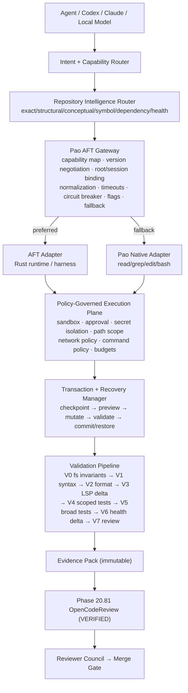

# Phase 20.82 — Pao-hubPro × CortexKit AFT

## Agent-Native IDE & Sensorimotor Execution Runtime, Symbol-Aware Code Perception, Semantic Repository Navigation, Transactional Refactoring, Background PTY Operations, Recoverable Safety & Policy-Governed Coding Control Plane

> **Project:** Pao-hubPro
> **Phase:** 20.82
> **Status:** Implementation blueprint / Codex-ready (restructured into the Pao-hubPro master 44-section blueprint)
> **Upstream:** `cortexkit/aft` (`https://github.com/cortexkit/aft`)
> **Prepared against upstream information checked:** 2026-09-17
> **Primary role:** Sensorimotor execution substrate for coding agents
> **Integration posture:** Adapter-first, policy-governed, feature-flagged, fallback-capable; never make AFT a mandatory single point of failure.
> **Source filename (preserved per master request §39):** `Phase 20.82 — Pao-hubPro × CortexKit AFT — Agent-Native IDE & Sensorimotor Runtime.md`

---

### Verification & Decision Record (master request §1, §36, §38, §40)

**Verified against the attached source before restructuring:**
- Phase number and name: **20.82**, "Pao-hubPro × CortexKit AFT — Agent-Native IDE & Sensorimotor Runtime …" — matches the source title exactly. No renumbering applied.
- 51 source sections verified line-by-line: executive summary, upstream facts, risk snapshot, goals G1–G9, non-goals, target architecture, provider contract, capability negotiation, repository intelligence router, transaction state machine, risk classification, checkpoint policy, preview model, validation pipeline V0–V7, health delta, shell policy, process supervisor, PTY policy, output compression, secret isolation, sandbox strategy, config profile, health/circuit breaker, fallback matrix, audit model, evidence pack, 20.81 handoff, council integration, dashboard, flags, budgets, large-repo strategy, threat model T1–T6, failure handling, test strategy, acceptance criteria, DoD, milestones A–H, rollout stages, metrics, upgrade policy, runbook, precedence, Codex rules, prompt, checklist, policy defaults, strategic outcome, references. No capability removed, merged, or assumed.

**⚠ Phase numbering registry update:**
- 20.82 is now occupied by this phase. The two long-displaced recommendations — "Business Opportunity Intelligence" (from 20.78) and "Revenue Intelligence" (from 20.75) — must both be numbered **20.83+** when their documents arrive.
- Original number/filename kept unchanged.

**R0–R4 mapping note (decision):** the source classifies mutation risk as Low/Medium/High/Critical (§13) and shell commands into 4 categories (§18). §14.2 below derives the explicit R0–R4 tiers. Source `policyDecision: "allow|approval_required|deny"` maps to the master policy enum in §14.1 (with QUARANTINE reserved for unhealthy-provider isolation per §25).

**Working-tree fact (this GOLD run, 2026-09-17):** the primary integration target **Phase 20.81 OpenCodeReview is not a paper dependency — it is implemented and VERIFIED** in this repository (`src/agent-os/code-review/`, `cr_*` schema v52–v53, `ocx review` CLI, 16/16 slice tests + E2E-3 revision lineage). The Phase 20.28 governance gateway is likewise VERIFIED (78/78 master E2E incl. E2E-4 allowed/dispatch and E2E-5 denied/audited). This blueprint therefore wires against *real, tested* seams, not assumptions.

---
---

## 1. Executive Summary

Phase 20.82 adds an **Agent-Native IDE & Sensorimotor Execution Runtime** to Pao-hubPro by integrating the concepts and runtime capabilities of CortexKit AFT behind a Pao-owned gateway.

The objective is not to turn Pao-hubPro into another editor plugin. The objective is to solve the missing layer between **agent reasoning** and **repository/operating-system mutation**.

Today a coding agent can reason well but often acts through primitive tools such as `read`, `grep`, `edit`, and raw `bash`. Those primitives force the model to consume unnecessary context, rely on line-based edits, manually infer dependencies, and manage long-running processes itself.

AFT supplies a richer execution substrate: structural repository perception; symbol-aware inspection; semantic and lexical search; call-graph and impact navigation; AST-aware transformation; language-server diagnostics; formatted and backed-up mutations; checkpoints and recovery; compressed shell output; background jobs; interactive PTY sessions.

Pao-hubPro will not expose AFT directly to every agent. Instead it adds a **Pao AFT Gateway** that:

1. normalizes AFT capabilities into Pao-hubPro's provider-agnostic tool model;
2. applies authorization and policy before every sensitive action;
3. creates recovery points before risky mutations;
4. validates edits through syntax/LSP/test/review gates;
5. records execution evidence and provenance;
6. falls back to Pao native tools when AFT is disabled, unavailable, incompatible, unhealthy, or unnecessary;
7. remains compatible with future AFT transport evolution, including a possible MCP adapter, without coupling the core to one upstream protocol.

The result is a practical execution chain:

```text
Agent reasoning
    ↓
Pao Intent Router
    ↓
Repository Intelligence / Context Budget Policy
    ↓
Pao AFT Gateway
    ↓
Policy + Approval + Sandbox + Recovery
    ↓
AFT / Native Execution Adapter
    ↓
Repository + LSP + Shell + PTY + Background Jobs
    ↓
Validation + Evidence
    ↓
Phase 20.81 OpenCodeReview
    ↓
Reviewer Council / Merge Quality Gate
```

**Core principle (verbatim):** Agents may propose intent. Only the governed execution layer is allowed to turn that intent into filesystem, process, or repository state changes.

---

## 2. Problem Statement

Pao-hubPro already has or is building layers for: agent orchestration; context management; repository knowledge; MCP/tool federation; reviewer councils; code review; security and approval policy; recoverable sessions; external capability discovery. The remaining problem is the **last-meter execution gap**.

A model may correctly decide:

> "Move `refreshToken()` into the session service, update callers, fix imports, run tests, and confirm there is no new type error."

But primitive tool execution usually degenerates into:

```text
read huge file
→ grep strings
→ patch line ranges
→ re-read file
→ fix patch drift
→ run noisy tests
→ search error output
→ patch again
→ hope no callers were missed
```

Phase 20.82 replaces that pattern with a controlled workflow:

```text
locate symbol
→ inspect symbol
→ inspect callers/callees/impact
→ create checkpoint
→ preview structural change
→ apply transaction
→ format
→ parse
→ run LSP diagnostics
→ run scoped tests
→ compare health delta
→ review diff
→ commit or restore
```

This is not only a token optimization. **It changes the reliability model of autonomous coding.**

---

## 3. Goals

- **G1 — Agent-native repository perception:** agents inspect repository structure at the smallest useful semantic unit instead of reading whole files by default.
- **G2 — Symbol-aware operations:** edits prefer stable semantic identifiers over fragile line-number targeting whenever supported.
- **G3 — Semantic repository navigation:** route search intent among exact, structural, semantic, symbol, and graph navigation modes.
- **G4 — Transactional mutations:** multi-file changes are transactions with preview, checkpoint, validation, and rollback.
- **G5 — Policy-governed shell/PTY:** shell, background jobs, and PTY sessions pass through capability, sandbox, path, secret, network, and approval policies.
- **G6 — Recoverable autonomous coding:** risky mutations are recoverable without relying solely on Git.
- **G7 — Validation as part of execution:** syntax, formatter, LSP, tests, health delta, diff review, and code review are part of the operation lifecycle — not optional cleanup.
- **G8 — Provider-agnostic design:** Pao-hubPro can switch between AFT; Pao native tools; future MCP IDE tools; language-specific engines; remote workspace runtimes.
- **G9 — Evidence-driven merge gates:** every code-changing run leaves machine-readable evidence suitable for OpenCodeReview, Reviewer Council, audit, and later reproducibility.

---

## 4. Non-Goals

Phase 20.82 does **not** aim to:

1. replace Git;
2. replace CI/CD;
3. make AFT mandatory for every repository;
4. expose unrestricted shell access to all agents;
5. bypass existing Pao-hubPro policy or approval layers;
6. automatically merge changes solely because AFT reports success;
7. duplicate Phase 20.81 code-review logic;
8. duplicate Graft-style long-lived repository knowledge;
9. duplicate Context Mode's broader context-window policy;
10. fork AFT unless a verified incompatibility requires a temporary shim.

---

## 5. Why This Phase Exists

All surrounding layers exist (orchestration, context, knowledge, MCP federation, councils, review, security, recovery, discovery) — but execution is the un-governed last meter. The degenerate read/grep/patch loop wastes context, misses callers, and has no recovery story. Phase 20.82 turns coding from `LLM + read/edit/bash` into a **governed sensorimotor loop** where every mutation is perceived symbolically, previewed, checkpointed, applied transactionally, validated from cheap to expensive, evidenced immutably, and handed to deterministic review before any merge. Upstream AFT provides the high-performance primitives; **Pao-hubPro retains ownership of intent routing, security policy, approval, recovery guarantees, provider fallback, evidence, review, and merge governance.**

---

## 6. Relationship to Pao-hubPro (and Existing Phases)

### 6.1 Graft / repository context graph (Phase 20.62)

**Graft:** persistent repository relationships and broader codebase intelligence. **AFT:** live execution-time symbol/call/diagnostic perception and mutation.

```text
Graft long-lived graph
        +
AFT live repository state
        ↓
Pao Repository Intelligence Layer
```

Do not force either system to become the other's storage backend.

### 6.2 Context Mode (Phase 20.53 OpenViking)

Context Mode decides **what should enter the model context**. AFT provides smaller, higher-information retrieval units:

```text
Intent
  ↓
Context Policy
  ↓
AFT outline/zoom/search/callgraph
  ↓
Context pack
```

### 6.3 Herdr / agent terminal orchestration (Phase 20.73 — blueprint only, *Needs Verification*)

Herdr operates at fleet/session/terminal orchestration scope. AFT's background jobs and PTYs operate at the **workspace execution scope**. Use a shared process registry contract so Herdr can observe AFT-backed work without owning AFT internals.

### 6.4 ECC / Claude Code Best Practice (Phases 20.20b / 20.80)

Those phases define engineering standards, agent workflows, and governance. Phase 20.82 becomes one execution backend that **enforces those standards mechanically**.

### 6.5 Phase 20.81 OpenCodeReview — **VERIFIED in this working tree**

The relationship is explicit:

```text
20.82 = perception + controlled mutation + runtime validation
20.81 = deterministic/diff-aware review and merge-quality evidence
```

A mutation is not complete until its evidence is handed to the review layer. This run's `src/agent-os/code-review/` (deterministic engine, delegated reviewers, revision lineage v53, `ocx review` CLI) is the concrete handoff target.

Numbering registry: 20.82 = this phase; displaced recommendations (Business Opportunity Intelligence, Revenue Intelligence) → **20.83+**.

---

## 7. Upstream References

Primary upstream references checked for this phase:

- CortexKit AFT repository: `https://github.com/cortexkit/aft`
- AFT configuration documentation: `https://github.com/cortexkit/aft/blob/main/docs/config.md`
- AFT CLI documentation: `https://github.com/cortexkit/aft/blob/main/docs/cli.md`
- AFT Pi adapter documentation: `https://github.com/cortexkit/aft/blob/main/packages/pi-plugin/README.md`
- AFT releases: `https://github.com/cortexkit/aft/releases`
- AFT open issues: `https://github.com/cortexkit/aft/issues`

**Upstream behavior can change.** Before implementing or upgrading the provider, re-check current tool schemas, transport/protocol details, supported harnesses, configuration keys, and known issues.

---

## 8. Current-State Assumptions

| # | Assumption | Status |
|---|---|---|
| A1 | Phase 20.81 OpenCodeReview exists with normalized session/finding/gate contracts | **VERIFIED in this working tree** (`src/agent-os/code-review/`, schema v52–v53, `cr_sessions/cr_findings/cr_gate_results`) |
| A2 | Phase 20.28 governance gateway provides deny-first policy, grants, approvals, audit | **VERIFIED in this working tree** (78/78 master E2E incl. E2E-4/E2E-5) |
| A3 | Phase 20.62 Graft (code-intelligence) exists for graph fallback | Implemented (report-claimed); exact API shape *Needs Verification* |
| A4 | Phase 20.53 Context Mode exists for context policy | Implemented (report-claimed) |
| A5 | Phase 20.73 Herdr exists as fleet-terminal orchestrator | **Blueprint only — never attached/implemented**; shared process registry contract is a design target |
| A6 | AFT binary is optional and may be absent on any machine | Stated by source; adapter must fail over cleanly |
| A7 | Pao-hubPro is not a monorepo with `packages/` layout | Assumption; adapt structure to current conventions (§30) |

Per master request §38, unresolved items are recorded, not blocking; implementation must re-verify A3–A6 at build time.

---

## 9. Target Architecture

```text
┌────────────────────────────────────────────────────────────┐
│                    Pao-hubPro Control Plane                │
├────────────────────────────────────────────────────────────┤
│ Agent / Codex / Claude / Local Model / Reviewer Council   │
└────────────────────────────┬───────────────────────────────┘
                             │ intent
                             ▼
┌────────────────────────────────────────────────────────────┐
│ Intent + Capability Router                                │
│ - read? search? inspect? refactor? run? PTY?              │
│ - required confidence / impact / privilege                │
└────────────────────────────┬───────────────────────────────┘
                             │
                             ▼
┌────────────────────────────────────────────────────────────┐
│ Repository Intelligence Router                            │
│ exact → grep                                              │
│ structural → AST                                          │
│ conceptual → semantic                                     │
│ symbol → zoom/outline                                     │
│ dependency → callgraph                                    │
│ health → inspect/LSP                                      │
└────────────────────────────┬───────────────────────────────┘
                             │
                             ▼
┌────────────────────────────────────────────────────────────┐
│                   Pao AFT Gateway                         │
│                                                          │
│  Capability mapping                                      │
│  Version negotiation                                     │
│  Root/session binding                                    │
│  Input/output normalization                              │
│  Timeouts / cancellation                                 │
│  Health circuit breaker                                  │
│  Feature flags                                           │
│  Native fallback                                         │
└──────────────┬──────────────────────────────┬──────────────┘
               │                              │
               ▼                              ▼
┌──────────────────────────┐     ┌───────────────────────────┐
│ AFT Adapter              │     │ Pao Native Adapter        │
│ Rust runtime / harness   │     │ read/grep/edit/bash       │
└──────────────┬───────────┘     └──────────────┬────────────┘
               └──────────────┬─────────────────┘
                              ▼
┌────────────────────────────────────────────────────────────┐
│ Policy-Governed Execution Plane                           │
│ sandbox | approval | secret isolation | path scope        │
│ network policy | command policy | resource budgets        │
└────────────────────────────┬───────────────────────────────┘
                             ▼
┌────────────────────────────────────────────────────────────┐
│ Transaction + Recovery Manager                            │
│ checkpoint → preview → mutate → validate → commit/restore  │
└────────────────────────────┬───────────────────────────────┘
                             ▼
┌────────────────────────────────────────────────────────────┐
│ Validation Pipeline                                      │
│ parse → format → LSP → scoped tests → health delta        │
└────────────────────────────┬───────────────────────────────┘
                             ▼
┌────────────────────────────────────────────────────────────┐
│ Evidence Pack                                             │
│ diff | diagnostics | tests | commands | graph impact      │
│ rollback id | policy decisions | timings | provenance     │
└────────────────────────────┬───────────────────────────────┘
                             ▼
┌────────────────────────────────────────────────────────────┐
│ Phase 20.81 OpenCodeReview → Reviewer Council → Merge Gate│
└────────────────────────────────────────────────────────────┘
```

---

## 10. Architecture Diagram (mermaid)



---

## 11. Core Components

### 11.1 Upstream AFT capabilities used by this phase

**Sensory / perception:** `aft_outline` (structural outline of files/directories); `aft_zoom` (targeted symbol inspection); `aft_search` (hybrid semantic + lexical repository search); `aft_callgraph` (callers, callees, impact/data-flow/path analysis); `aft_inspect` (code-health information including diagnostics and structural issues); indexed `grep` and `glob`.

**Motor / mutation:** enhanced `edit`; enhanced `write`; atomic/multi-file `apply_patch` behavior; `aft_import`; AST structural search/replace; workspace refactoring capabilities on the full tool surface.

**Brainstem / execution:** shell execution with optional output compression; background jobs; process status/watch/kill operations; PTY-backed interactive sessions; durable safety/recovery facilities through `aft_safety`.

**Runtime architecture facts:** Rust binary; thin harness adapters; JSON/stdio-style bridge between adapter and runtime; warm process associated with a project root; persistent indexes/storage under CortexKit storage; Tree-sitter-based parsing; LSP integration; semantic indexing; backup/recovery state. Supported harnesses documented upstream include OpenCode, Pi, and OMP/oh-my-pi integration.

**Pao-hubPro must not assume an official MCP adapter exists today.** MCP support is an integration target owned by Pao-hubPro unless upstream later provides a stable interface that passes compatibility tests.

### 11.2 Upstream risk snapshot

AFT is actively evolving. Known classes of upstream risk around the preparation date include open work/issues involving: OpenCode v2 compatibility; incremental call-graph refresh efficiency; semantic-index cold-build behavior; resident artifact/memory bounds across roots; OMP first-class harness behavior; background-process edge cases.

> **AFT is an execution provider, not the architectural owner of Pao-hubPro.** No Pao core module should import AFT-specific APIs directly outside the adapter package.

### 11.3 New Pao-hubPro components

Recommended package/module structure — **adapt paths to the existing repository rather than forcing this exact layout** if Pao-hubPro already has equivalent abstractions:

```text
packages/
  agent-runtime/
  repository-intelligence/
  execution-policy/
  execution-evidence/
  providers/
    aft/
      src/
        adapter.ts
        bridge.ts
        capabilities.ts
        config.ts
        errors.ts
        health.ts
        normalize.ts
        protocol.ts
        session.ts
        version.ts
    native/
      src/
        adapter.ts

services/
  sensorimotor-router/
  mutation-transaction/
  process-supervisor/
  validation-pipeline/

schemas/
  execution-intent.schema.json
  execution-result.schema.json
  mutation-plan.schema.json
  evidence-pack.schema.json
  capability-manifest.schema.json

config/
  sensorimotor.defaults.yaml
  policy/
    repository-execution.yaml
    shell-policy.yaml
    refactor-policy.yaml
```

If Pao-hubPro is not a monorepo, preserve its current package conventions.

---

## 12. Component Responsibilities

| Component | Responsibility | Hard invariants |
|---|---|---|
| Intent + Capability Router | Classify intent → read/search/inspect/refactor/run/PTY with required confidence/impact/privilege | No privileged intent auto-escalates |
| Repository Intelligence Router | Route to exact/structural/conceptual/symbol/dependency/health modes | Never use semantic search for everything (§13.1) |
| Pao AFT Gateway | Capability mapping, version negotiation, root/session binding, normalization, timeouts, circuit breaker, flags, fallback | AFT names never leak past the adapter |
| AFT Adapter | All AFT-specific protocol handling | Only component importing AFT APIs |
| Native Adapter | read/grep/edit/bash fallback | Records `fallbackReason` in every result |
| Policy-Governed Execution Plane | Sandbox, approval, secret isolation, path scope, network/command policy, budgets | Policy outranks repo content and agent requests |
| Transaction + Recovery Manager | checkpoint → preview → mutate → validate → commit/restore | Medium/high-risk cannot apply without recovery point |
| Validation Pipeline | V0–V7 staged cheap-to-expensive gates | Syntax mandatory; delta-aware diagnostics |
| Process Supervisor | Pao process IDs mapped over provider IDs | Orphans marked, never assumed dead |
| Evidence Pack | Immutable machine-readable proof | Never LLM-prose-only success claims |

---

## 13. Data Flow

### 13.1 Repository Intelligence Router (source §11)

The router must avoid the mistake of using semantic search for everything.

**Routing rules:**

| Intent | Route |
|---|---|
| Exact token / filename / error code | `grep / indexed grep / glob` |
| Known symbol | `outline → zoom` |
| Syntax shape | `AST search` |
| Conceptual intent (e.g. "Where is token refresh handled?") | `semantic search` |
| Dependency / blast radius | `callgraph / impact` |
| Repository quality baseline | `inspect + LSP` |

**Context-budget policy (default):**

```text
outline before whole-file read
zoom before broad read
narrow search before recursive read
impact before cross-file refactor
```

Whole-file reads remain legal when: the file is small; serialization/configuration requires complete context; exact patching requires neighboring state; the provider cannot parse the language; the agent explicitly justifies the need.

### 13.2 Mutation preview (source §15)

For any cross-file or structural change, produce a preview before apply. Preview includes: files touched; symbols touched; additions/deletions estimate; imports/references changed; call-graph impact when available; tests likely affected; policy risk score; external commands required; whether the operation is reversible.

```json
{
  "summary": "Move refreshToken into SessionService",
  "files": 4,
  "symbols": 7,
  "impact": {
    "directCallers": 3,
    "transitiveCallers": 11
  },
  "tests": [
    "auth/session.test.ts",
    "api/refresh.test.ts"
  ],
  "risk": "medium",
  "reversible": true
}
```

### 13.3 Health delta model (source §17)

Store normalized metrics rather than raw text only:

```json
{
  "before": {
    "errors": 0,
    "warnings": 12,
    "todos": 18,
    "unusedExports": 3,
    "duplicates": 2
  },
  "after": {
    "errors": 0,
    "warnings": 10,
    "todos": 18,
    "unusedExports": 2,
    "duplicates": 2
  },
  "delta": {
    "errors": 0,
    "warnings": -2,
    "todos": 0,
    "unusedExports": -1,
    "duplicates": 0
  }
}
```

Never fail a task merely because the repository already contains unrelated warnings unless policy explicitly requires a clean baseline.

### 13.4 Output compression and evidence preservation (source §21)

Compressed output is useful for model context but can destroy forensic detail. Use two channels:

```text
RAW EXECUTION LOG
    ↓ retained out-of-context / access-controlled
COMPRESSED AGENT VIEW
    ↓ passed to model
```

The Evidence Pack retains: raw-log digest; location/reference to raw log; compressed summary; compressor/provider metadata; exit code; detected failures; truncation state. **Never use only an LLM-generated summary as proof that a command passed.**

---

## 14. Control Flow (+ R0–R4 Mapping)

### 14.1 Transaction state machine & master-enum mapping

Every non-trivial code mutation uses a transaction state machine (source §12, verbatim):

```text
PLANNED
  ↓
POLICY_CHECKED
  ↓
CHECKPOINTED
  ↓
PREVIEWED
  ↓
APPLIED
  ↓
SYNTAX_VALIDATED
  ↓
LSP_VALIDATED
  ↓
TESTED
  ↓
REVIEW_READY
  ↓
COMMITTED
```

Failure path:

```text
ANY FAILURE
  ↓
FAILED
  ↓
RESTORE_REQUIRED?
  ├─ no  → leave evidence + manual action
  └─ yes → RESTORING → RESTORED
```

Mandatory transaction fields:

```json
{
  "transactionId": "uuid",
  "workspaceId": "...",
  "taskId": "...",
  "actor": "agent-id",
  "provider": "aft",
  "risk": "low|medium|high|critical",
  "checkpointId": "...",
  "requestedChanges": [],
  "affectedSymbols": [],
  "affectedFiles": [],
  "policyDecision": "allow|approval_required|deny",
  "validation": {},
  "evidencePackId": "..."
}
```

**Mapping to the master-request policy enum (decision note):** `allow` → **ALLOW**; `approval_required` → **REQUIRE_APPROVAL**; `deny` → **DENY**. The source has no explicit quarantine decision — the **QUARANTINE** master state is assigned to the *provider health* dimension (§25: a degraded/incompatible AFT is quarantined from sensitive operations and routed to fallback) rather than to individual mutations. Un-evaluatable policy input ⇒ **DENY** (fail closed).

### 14.2 Source risk tiers → R0–R4 mapping (decision note)

The source's four mutation-risk tiers (§13) and four shell-command categories (§18) derive into the master model:

| Source tier | Examples (source) | Pao tier | Gate |
|---|---|---|---|
| **Low** mutations | comment/docs update; deterministic formatting; local import organization; isolated test update | **R1/R2** | checkpoint optional by policy; syntax/LSP; scoped tests when available; review evidence |
| **Medium** mutations | function implementation change; limited dependency update; multi-file rename; API behavior modification | **R2/R3** | checkpoint **required**; impact analysis; preview required; LSP; scoped tests; health delta; review |
| **High** mutations | auth/security logic; database migration; deployment configuration; broad refactor; destructive filesystem changes; lockfile rewrite; network/credential-sensitive code | **R3/R4** | checkpoint required; explicit impact report; human approval per policy; sandboxed execution; full validation profile; OpenCodeReview; Reviewer Council where configured |
| **Critical** mutations | secret stores; production deployment mutation; destructive database commands; privilege/identity infrastructure; irreversible external side effects | **R4** | **DENY autonomous mutation**; require explicitly configured human-controlled workflow |
| Read-only shell (`git status`, `git diff`, `npm test --listTests`, `cargo metadata`) | — | **R0/R1** | auto within policy |
| Mutating-local shell (`npm install`, `cargo fix`, `formatter --write`, codegen) | — | **R2** | policy + path scope |
| Network shell (`package installation`, `git fetch`, `curl`, API client) | — | **R3** | network policy gate |
| External-side-effect shell (`deploy`, `publish`, `send message`, cloud/production DB mutation) | — | **R4** | **must not be treated as ordinary coding-shell execution** |

The `aft_inspect`-family read/perception tools map to **R0/R1** (auto). PTY sessions are **R3 minimum** and disabled by default (§20/§32).

---

## 15. Agent/Worker Model

- **Coding agents (Codex/Claude/local)** propose intents through the normalized capability surface (`repository.outline`, `repository.symbol.inspect`, `repository.search.semantic`, `repository.graph.impact`, `repository.health.inspect`, `repository.mutate`, `repository.refactor`, `process.run`, `process.watch`, `process.pty.write`, `recovery.checkpoint`, `recovery.restore`).
- **AFT-specific tool names (`aft_*`) must be hidden inside `providers/aft`.** The rest of Pao-hubPro consumes only normalized intents.
- **Provider contract** (source §9, verbatim shape):

```ts
export interface SensorimotorProvider {
  id: string;
  getCapabilities(ctx: WorkspaceContext): Promise<CapabilityManifest>;
  health(ctx: WorkspaceContext): Promise<ProviderHealth>;

  outline(input: OutlineRequest): Promise<OutlineResult>;
  zoom(input: ZoomRequest): Promise<ZoomResult>;
  search(input: SearchRequest): Promise<SearchResult>;
  graph(input: GraphRequest): Promise<GraphResult>;
  inspect(input: InspectRequest): Promise<InspectResult>;

  read(input: ReadRequest): Promise<ReadResult>;
  mutate(input: MutationRequest): Promise<MutationResult>;
  refactor?(input: RefactorRequest): Promise<RefactorResult>;

  run(input: ProcessRequest): Promise<ProcessResult>;
  processStatus(input: ProcessStatusRequest): Promise<ProcessStatus>;
  processWrite?(input: ProcessWriteRequest): Promise<ProcessWriteResult>;
  processKill(input: ProcessKillRequest): Promise<ProcessKillResult>;

  checkpoint(input: CheckpointRequest): Promise<CheckpointResult>;
  restore(input: RestoreRequest): Promise<RestoreResult>;
}
```

- **Review agents (20.81 + Council)** consume evidence; they never execute mutations.

---

## 16. Session/State Model

- **Provider capability negotiation** (source §10) at workspace activation:

```text
1. detect configured provider
2. discover binary/plugin availability
3. read version
4. run health check
5. build capability manifest
6. apply Pao policy filters
7. publish effective capabilities
```

Example manifest:

```json
{
  "provider": "aft",
  "healthy": true,
  "version": "detected-at-runtime",
  "capabilities": {
    "outline": true,
    "zoom": true,
    "semanticSearch": true,
    "callgraph": true,
    "lsp": true,
    "astReplace": true,
    "transactionalPatch": true,
    "checkpoint": true,
    "backgroundProcess": true,
    "pty": true,
    "sandbox": true
  },
  "limitations": []
}
```

Never hardcode a claimed upstream version in Pao source unless pinning is an intentional release decision.

- **Transaction states:** the §14.1 state machine with `transactionId` lineage per task/workspace.
- **Provider health states** (source §25): `healthy | warming | partial | degraded | unavailable | incompatible`.
  - `warming` — semantic/graph index building but basic operations work.
  - `partial` — LSP unavailable but read/search/edit remain usable.
  - `degraded` — repeated timeouts or abnormal memory use.
  - `incompatible` — installed harness/provider versions fail protocol compatibility checks.
- **Process registry:** `paoProcessId ↕ providerProcessId` mapping storing command fingerprint, workspace, actor, creation time, provider, PID/task ID, PTY flag, policy decision, status, last output cursor, output summary, exit status. Required operations: `start, status, watch, write, terminate, collect`. **On Pao-hubPro restart:** reload registry → ask provider for surviving tasks → reconcile state → mark unknown tasks `orphaned` rather than silently assuming they died → surface pending completions to the owning task/session.

---

## 17. MCP Integration

- Pao-hubPro owns any MCP surface for AFT capabilities; **do not assume an upstream MCP adapter exists**.
- Normalized capability intents (§15) are the MCP-facing tool surface; AFT names stay internal.
- Existing MCP/tool federation (ai-workspace `pao.*` catalog, Phase 20.33) can add `pao.repo.*` entries routing through the sensorimotor gateway once implemented — governed tools only, deny-first.
- Shell/PTY through MCP follows the **same** policy engine as every other sensitive tool (threat T2).

---

## 18. Capability Registry (canonical model)

- **SensorimotorProvider interface**: §15 (the single normalized contract; `refactor?` optional).
- **CapabilityManifest**: §16 (effective capabilities after Pao policy filters; `limitations[]` recorded).
- **Native fallback matrix** (source §26, verbatim):

| Capability | AFT preferred | Native fallback | Fallback safety |
|---|---:|---:|---|
| Read file | Yes | Yes | Safe |
| Exact grep | Yes | Yes (`rg`) | Safe |
| Glob | Yes | Yes | Safe |
| Outline | Yes | Parser/native optional | Partial |
| Symbol zoom | Yes | LSP/parser optional | Partial |
| Semantic search | Yes | Existing vector/search service | Partial |
| Call graph | Yes | Graft/LSP/static analyzer | Partial |
| LSP diagnostics | Yes | direct LSP | Safe if configured |
| AST search | Yes | `ast-grep` direct | Safe |
| Symbol refactor | Yes | language tooling | Must preview |
| Checkpoint | Yes | Git/worktree/Pao snapshot | Required for risky work |
| Background process | Yes | Pao process supervisor | Safe |
| PTY | Yes | Pao PTY provider | Policy-controlled |

Fallback must be explicit in evidence:

```json
{
  "requestedProvider": "aft",
  "executedProvider": "native",
  "fallbackReason": "aft_callgraph_unavailable"
}
```

---

## 19. Policy Model

- Mutation risk gates: §14.2 (R0–R4 derivation).
- Shell execution policy (source §18): every process request normalized into:

```json
{
  "command": "...",
  "cwd": "...",
  "envAllowlist": [],
  "network": "deny|restricted|allow",
  "background": false,
  "pty": false,
  "timeoutMs": 0,
  "resourceBudget": {
    "cpu": null,
    "memoryMb": null,
    "wallTimeMs": null,
    "outputBytes": null
  }
}
```

Command categories: **Read-only** (`git status`, `git diff`, `npm test -- --listTests`, `cargo metadata`); **Mutating-local** (`npm install`, `cargo fix`, `formatter --write`, code generator); **Network** (package installation, `git fetch`, `curl`, API client); **External-side-effect** (`deploy`, `publish`, `send message`, cloud mutation, production database mutation). The final category **must not be treated as ordinary coding-shell execution**.

- **Configuration precedence** (source §45, verbatim trust order):

```text
Pao hard security policy
  > Organization/workspace admin policy
  > User trusted provider profile
  > Repository Pao config
  > Repository AFT config
  > Agent request
```

A lower trust layer must never loosen a restriction set by a higher layer. Example: Org policy `network denied` + Repo config `network allow` ⇒ **denied**.

---

## 20. Security Model

**Threat model (source §35, T1–T6 preserved):**

- **T1 — Malicious repository instructions:** policy engine outranks repository content; untrusted project config cannot define secret sources; sandbox denies credential paths; external effects require separate capability.
- **T2 — Tool-surface escalation:** same policy applies to shell and structured tools; PTY does not imply unrestricted capability; parse/classify commands before execution when possible; sandbox/network policy remains active.
- **T3 — Path escape:** canonicalize paths; enforce root allowlists; evaluate symlinks; fail closed on ambiguous paths.
- **T4 — Validation bypass:** transaction state machine controls completion; merge handoff requires evidence fields; UI derives status from execution records, not chat text.
- **T5 — Provider compromise/bug:** version/health checks; adapter isolation; native fallback; verification after restore; Git diff and test evidence remain independent.
- **T6 — Log secret leakage:** secret redaction before model context; protected raw logs; limited retention; never store environment dumps by default.

**Secret isolation (source §22, verbatim rules):**
1. provider credentials live in user/workspace-secret configuration, not repository-controlled files;
2. repository config may select a named provider profile but not inject raw secrets;
3. subprocess environments receive the minimum allowlisted variables;
4. logs redact token/credential patterns;
5. semantic backend URLs and API-key env mappings are controlled by trusted config;
6. untrusted repositories cannot redefine secret source paths;
7. sandbox read policy should deny credential locations unless a task explicitly requires them.

**Sandbox strategy (source §23):** preferred order is `Pao policy → Pao sandbox profile → AFT/provider sandbox → OS execution`. If a provider reports sandbox unavailable: do **not** silently downgrade for high-risk commands — either use Pao's own sandbox provider, require approval, or deny execution. **Fail closed for operations that explicitly require isolation.**

**AFT configuration profile** (source §24): do not overwrite a user's existing AFT configuration without consent. Pao-hubPro may generate a recommended profile or managed overlay:

```jsonc
{
  "enabled": true,
  "tool_surface": "recommended",
  "search_index": true,

  "bash": {
    "rewrite": true,
    "compress": true,
    "background": true,
    "subagent_background": false,
    "foreground_wait_window_ms": 8000
  },

  "inspect": {
    "enabled": true
  },

  "sandbox": {
    "enabled": true
  }
}
```

Treat this as an example, not a blindly-written final config; query installed AFT capabilities/version first; preserve existing user settings; use `doctor`/health checks; keep semantic-provider secrets outside project-controlled configuration.

**PTY policy (source §20):** PTY only when required for an interactive program. Prefer non-interactive execution for tests, build, lint, package-manager commands that support flags, structured CLIs. Use PTY for REPL, interactive debugger, terminal UI, explicitly interactive nested tools. PTY sessions must have: idle timeout; maximum lifetime; explicit write permission; output limits; kill path; credential redaction; audit events. **Do not allow a subagent to create unrestricted background PTYs by default.**

---

## 21. Approval Model

- **Medium** mutations: approval per policy (configurable).
- **High** mutations: human approval depending on policy; sandboxed command execution; full validation profile; OpenCodeReview; Reviewer Council where configured.
- **Critical** mutations: **DENY autonomous mutation** — require explicitly configured human-controlled workflow (source §13 Critical default).
- External-side-effect shell commands route through a separate capability and are never auto-approved.
- Policy denial events (`policy.execution.denied`, `policy.approval.requested`) are audited with `policyDecisionId`.
- Subagent background PTYs are denied by default; a subagent cannot self-approve escalation (threat T2).

---

## 22. Failure Handling

Source §36 failure matrix, preserved:

| Failure | Handling |
|---|---|
| **AFT binary unavailable** | mark unavailable → native fallback → emit health event |
| **AFT incompatible with host** | mark incompatible → do not attempt mutation through AFT → fallback or require operator action |
| **Semantic index unavailable** | fallback to lexical/exact search |
| **Call graph unavailable** | use Graft/LSP/static fallback → mark impact confidence lower → require broader tests for risky refactor |
| **LSP unavailable** | syntax validation still required → use repository-native typecheck command if available → evidence must state missing LSP |
| **Checkpoint creation fails** | for medium/high-risk mutation: **DENY mutation unless alternate Pao snapshot succeeds** |
| **Restore fails** | stop autonomous mutation immediately → preserve evidence → mark workspace needs attention → do not continue piling edits on uncertain state |

**Health circuit breaker (source §25):**

```text
failure threshold reached
  ↓
stop routing sensitive operations to AFT
  ↓
fall back where safe
  ↓
keep provider diagnostics
  ↓
periodic health probe
```

Never loop infinitely between AFT failure and retry.

---

## 23. Recovery Model

**Checkpoint and recovery policy (source §14):** do not treat Git as the only rollback mechanism. Before medium/high-risk mutation:

```text
Pao transaction
  ↓
provider checkpoint
  ↓
record checkpoint id/name
  ↓
apply mutation
```

Checkpoint names are deterministic and traceable:

```text
pao/<task-id>/<transaction-id>/pre-mutation
```

After validation failure:

```text
classify failure
  ↓
retry safely if deterministic
  ↓
otherwise restore
  ↓
verify restored filesystem state
  ↓
record recovery evidence
```

**Never claim rollback succeeded until state verification passes.**

**Feature-flagged recovery defaults (§32):** `auto_restore_on_validation_failure: true`; checkpoint mandatory at medium and high risk.

---

## 24. Observability

Metrics to track real impact (source §42, verbatim categories):

```text
# Context efficiency
tokens_to_locate_symbol
tokens_per_successful_change
whole_file_reads_per_task
search_calls_per_task

# Execution quality
patch_retry_rate
validation_failure_rate
rollback_rate
new_diagnostic_rate
review_rejection_rate

# Reliability
provider_error_rate
fallback_rate
restore_success_rate
orphan_process_rate

# Performance
outline_latency
semantic_search_latency
callgraph_latency
index_warm_time
provider_memory_peak

# Autonomy
manual_interventions_per_task
successful_transaction_rate
mean_steps_to_review_ready
```

**Do not optimize token reduction if correctness degrades.**

**Resource budgets (source §33):**

```yaml
sensorimotor:
  budgets:
    max_provider_memory_mb: 2048
    max_semantic_index_minutes: 10
    max_callgraph_warm_minutes: 10
    max_background_jobs_per_workspace: 4
    max_pty_sessions_per_workspace: 1
    max_agent_output_kb: 512
```

These are example defaults; tune using real measurements. When a budget is exceeded: mark capability degraded; cancel optional warming; keep basic read/search available; surface actionable diagnostics; **do not repeatedly rebuild expensive indexes**.

**Large repository strategy (source §34):** determine task scope first → identify relevant package/module roots → index only required roots when supported → avoid whole-monorepo semantic warming by default → exact search before semantic → build call graph lazily around touched areas → cache successful scope decisions → enforce budgets → expose warm-state telemetry.

---

## 25. Audit

Event names (source §27, verbatim):

```text
sensorimotor.provider.detected
sensorimotor.provider.health_changed
repository.search.executed
repository.symbol.inspected
repository.graph.impact_calculated
mutation.transaction.created
mutation.checkpoint.created
mutation.preview.created
mutation.applied
mutation.validation.failed
mutation.restored
mutation.committed
process.started
process.backgrounded
process.pty.opened
process.terminated
policy.execution.denied
policy.approval.requested
evidence.pack.created
```

Minimum fields:

```json
{
  "eventId": "uuid",
  "timestamp": "ISO-8601",
  "workspaceId": "...",
  "taskId": "...",
  "actorId": "...",
  "provider": "aft",
  "capability": "repository.refactor",
  "policyDecisionId": "...",
  "transactionId": "...",
  "result": "success|failure|denied",
  "durationMs": 0
}
```

Do not store secrets or full sensitive environment values.

---

## 26. Data Model (Evidence Pack)

Every medium/high-risk mutation creates an immutable evidence package (source §28):

```text
.evidence/
  <task-id>/
    <transaction-id>/
      manifest.json
      intent.json
      capability-manifest.json
      policy-decision.json
      baseline-health.json
      impact.json
      preview.diff
      final.diff
      diagnostics-before.json
      diagnostics-after.json
      tests.json
      health-after.json
      command-summary.json
      raw-log-digests.json
      recovery.json
      review-handoff.json
```

The exact storage path may use Pao's existing evidence system instead of committing `.evidence` into the repository. **Default: do not commit runtime evidence into user repositories unless configured.**

**OpenCodeReview handoff contract** (source §29, verbatim shape — Phase 20.81 receives normalized evidence, not scraped chat logs):

```json
{
  "taskId": "...",
  "transactionId": "...",
  "baseRevision": "...",
  "headRevision": "...",
  "diffRef": "...",
  "affectedFiles": [],
  "affectedSymbols": [],
  "impact": {},
  "diagnosticDelta": {},
  "testResults": {},
  "healthDelta": {},
  "policy": {},
  "provider": {
    "id": "aft",
    "version": "..."
  }
}
```

OpenCodeReview remains responsible for review semantics and quality gating. AFT remains responsible for the execution substrate.

---

## 27. API/Event Contracts

- Provider contract: §15 (`SensorimotorProvider`).
- Normalized capability intents: `repository.outline`, `repository.symbol.inspect`, `repository.search.semantic`, `repository.graph.impact`, `repository.health.inspect`, `repository.mutate`, `repository.refactor`, `process.run`, `process.watch`, `process.pty.write`, `recovery.checkpoint`, `recovery.restore`.
- Transaction record fields: §14.1.
- Preview shape: §13.2. Health delta: §13.3. Evidence pack: §26. Review handoff: §26.
- Audit events: §25.
- Schemas directory (§11.3): `execution-intent.schema.json`, `execution-result.schema.json`, `mutation-plan.schema.json`, `evidence-pack.schema.json`, `capability-manifest.schema.json`.

---

## 28. Configuration

Feature flags (source §32, verbatim):

```yaml
sensorimotor:
  enabled: true
  provider: auto

  aft:
    enabled: true
    prefer_for_code: true
    semantic_search: true
    callgraph: true
    inspect: true
    ast_tools: true
    background_process: true
    pty: false
    sandbox_required_for_high_risk: true

  fallback:
    native: true

  mutation:
    checkpoint_medium_risk: true
    checkpoint_high_risk: true
    preview_cross_file: true
    auto_restore_on_validation_failure: true

  validation:
    syntax: true
    lsp: true
    targeted_tests: true
    health_delta: true
    opencodereview: true
```

**PTY should start disabled** unless Pao-hubPro already has robust PTY policy and supervision.

**Recommended initial safe-deployment policy defaults** (source §49):

```yaml
sensorimotor:
  enabled: true
  provider: auto

  aft:
    enabled: true
    prefer_for_code: true
    semantic_search: true
    callgraph: true
    inspect: true
    ast_tools: true
    background_process: true
    pty: false

  fallback:
    native: true

  mutation:
    auto_apply_low_risk: true
    auto_apply_medium_risk: true
    auto_apply_high_risk: false
    checkpoint_medium_risk: true
    checkpoint_high_risk: true
    preview_cross_file: true
    auto_restore_on_validation_failure: true

  validation:
    syntax: required
    lsp: when_available
    targeted_tests: required_for_code_change
    health_delta: when_available
    opencodereview: required_for_medium_and_high
```

Adjust only after real telemetry shows stable behavior.

---

## 29. Feature Flags

| Flag | Default | Effect |
|---|---|---|
| `sensorimotor.enabled` | `true` | Master switch |
| `sensorimotor.provider` | `auto` | `auto / native / aft` selection |
| `aft.enabled` | `true` | AFT adapter active (still health-gated) |
| `aft.prefer_for_code` | `true` | Prefer AFT for code operations when healthy |
| `aft.semantic_search` | `true` | Semantic search routing |
| `aft.callgraph` | `true` | Call-graph/impact routing |
| `aft.inspect` | `true` | Health inspection |
| `aft.ast_tools` | `true` | AST search/replace |
| `aft.background_process` | `true` | Supervised background jobs |
| `aft.pty` | **`false`** | PTY sessions (off until PTY policy proven) |
| `aft.sandbox_required_for_high_risk` | `true` | Fail closed when sandbox unavailable |
| `fallback.native` | `true` | Native provider fallback |
| `mutation.checkpoint_medium_risk` | `true` | Recovery point mandatory |
| `mutation.checkpoint_high_risk` | `true` | Recovery point mandatory |
| `mutation.preview_cross_file` | `true` | Preview before cross-file/structural apply |
| `mutation.auto_restore_on_validation_failure` | `true` | Automatic rollback path |
| `mutation.auto_apply_high_risk` | **`false`** | High-risk never auto-applies |
| `validation.syntax` | `required` | V1 gate mandatory |
| `validation.lsp` | `when_available` | V3 delta when LSP exists |
| `validation.targeted_tests` | `required_for_code_change` | V4 gate |
| `validation.health_delta` | `when_available` | V6 |
| `validation.opencodereview` | `required_for_medium_and_high` | V7 handoff mandatory |

---

## 30. Repository Structure

See §11.3 for the suggested `packages/` layout. Per the source's own rule (§8): **adapt paths to the existing repository rather than forcing this exact layout** — this repo is a Bun TypeScript application with `src/agent-os/` module convention and verified subsystems, so the natural mapping is `src/agent-os/sensorimotor/` (provider contract + router + transaction + validation) with `providers/aft` and `providers/native` subfolders, reusing the governance-gateway, code-intelligence (Graft), context (OpenViking), and code-review modules rather than duplicating them.

---

## 31. Dashboard

Add a **Sensorimotor Runtime** panel to the Pao-hubPro dashboard (source §31):

**Provider card** shows:

```text
Provider: CortexKit AFT
Status: Healthy / Warming / Partial / Degraded
Version: detected
Project root: …
Semantic index: Ready / Building / Disabled
Callgraph: Ready / Building / Disabled
LSP: N servers
Background jobs: N
PTY sessions: N
```

**Transaction timeline:**

```text
✓ Plan
✓ Policy
✓ Checkpoint
✓ Preview
✓ Apply
✓ Syntax
✓ LSP
✓ Tests
✓ Health
→ Review
```

**Recovery panel** allows an authorized user to: view checkpoints; inspect mutation diff; restore transaction; terminate background process; close PTY; disable AFT for workspace; switch to native provider.

**Do not expose:** raw secrets; arbitrary unmanaged shell shortcuts; destructive restore buttons without confirmation/policy; upstream-provider internals the user does not need.

---

## 32. Dependencies

### Required
- **Phase 20.81 OpenCodeReview** — *VERIFIED in this working tree* (this GOLD run): deterministic engine, delegated reviewers, revision lineage, `ocx review` CLI.
- **Phase 20.28 Governance Gateway** — *VERIFIED in this working tree*: deny-first policy engine, capability grants, approvals, hash-chained audit (`governedDispatch` proven in master E2E-4/E2E-5).
- Existing Pao-hubPro: audit pipeline, DB/migrations, feature-flag mechanism, dashboard conventions.

### Recommended
- **Phase 20.62 Graft** (code-intelligence) as call-graph/impact fallback — implemented; API shape *Needs Verification*.
- **Phase 20.53 Context Mode** (OpenViking) for context policy integration — implemented; *Needs Verification*.
- `ast-grep` for native AST search fallback; `rg` for native grep.

### Optional
- **CortexKit AFT binary** — the preferred advanced provider; entirely optional at runtime.
- **Phase 20.73 Herdr** — blueprint only; shared process-registry contract is a design target (*Needs Verification*).
- LSP servers per language.

### Standalone path
With AFT absent (and even with no Graft/Context Mode), the subsystem must still function through the **native provider**: file read/grep/glob, direct edits, project-native typecheck, scoped tests, Pao snapshot checkpoints, and full evidence/review handoff. Core startup must never require AFT (flag-gated, health-checked, replaceable — source §46-6).

---

## 33. Compatibility

- **Upstream drift:** AFT evolves quickly (§11.2 risk snapshot). The adapter boundary + capability discovery + contract tests isolate Pao-hubPro. Re-check tool schemas/transport before every upgrade.
- **Version management (source §43):** AFT is version-managed like infrastructure:

```text
new AFT release
  ↓
changelog/release scan
  ↓
compatibility sandbox
  ↓
provider contract tests
  ↓
fixture integration tests
  ↓
resource regression tests
  ↓
canary workspace
  ↓
Pao-hubPro supported-version update
```

Never auto-upgrade production workspaces blindly to `latest`. The upstream setup command may use `@latest` for manual initial setup, but Pao-hubPro production integration supports explicit version policy.
- **MCP evolution:** if upstream later ships a stable MCP adapter, Pao can adopt it behind the same normalized interface — after it passes compatibility tests.
- **Numbering:** 20.82 = this phase; displaced recommendations → 20.83+.

---

## 34. Migration

- Introduce the provider contract and gateway behind feature flags; no existing behavior changes at enable-time (Stage 1 is observe-only).
- Additive schema only if the existing evidence/audit systems need new tables (adapt to `src/agent-os/db.ts` conventions — this repo's additive `CREATE TABLE IF NOT EXISTS` migration style, currently v53).
- Reuse `route-registry.ts` registration and `agent-os-routes.ts` dispatch conventions for any new REST surface.
- Existing user AFT configuration must not be destructively overwritten (source §24; Codex rule 19).

---

## 35. Rollback

1. `sensorimotor.enabled: false` or `aft.enabled: false` — subsystem disabled; native paths unaffected (they were always independent).
2. Per-workspace AFT disable via the recovery panel (§31).
3. In-flight transactions: `auto_restore_on_validation_failure` + checkpoint restore with state verification (§23); failed restores halt autonomous mutation and mark the workspace needing attention.
4. Provider circuit breaker isolates unhealthy AFT automatically; diagnostics preserved.
5. No runtime evidence is committed to user repositories by default, so rollback leaves no residue in user trees.

---

## 36. Testing Strategy

### Unit tests (source §37)

Test: capability normalization; policy routing; provider error mapping; fallback decisions; transaction state transitions; checkpoint naming; evidence serialization; secret redaction.

### Contract tests

Run the same abstract tests against: AFT provider, Native provider, Fake provider. Examples: outline returns normalized symbols; search returns stable score/result model; mutation returns touched files; checkpoint can restore exact content; process status maps correctly.

### Integration tests

Fixture repositories for: TypeScript; Python; Rust; mixed monorepo; syntax-error baseline; existing-warning baseline; large-output tests; long-running background command; PTY REPL.

### Failure injection

Simulate: binary missing; binary exits mid-request; timeout; malformed provider response; LSP unavailable; index warming timeout; restore failure; process orphan; memory budget exceeded.

### Regression tests

Every upstream AFT upgrade must run the provider contract suite before release.

---

## 37. Acceptance Criteria

Phase 20.82 is complete only when **all required** criteria pass (source §38, verbatim):

- [ ] Pao-hubPro has a provider-neutral sensorimotor interface.
- [ ] AFT-specific code is isolated in an adapter/package.
- [ ] Provider version and capabilities are detected at runtime.
- [ ] AFT can be disabled per workspace.
- [ ] Native fallback exists for core read/search/edit/process operations.
- [ ] Repository intelligence router chooses exact/symbol/AST/semantic/graph modes.
- [ ] Medium/high-risk mutations require recoverable checkpoint or alternate Pao snapshot.
- [ ] Cross-file mutations provide preview evidence.
- [ ] Syntax validation is mandatory after code mutation.
- [ ] LSP/typecheck validation is integrated when available.
- [ ] Pre-existing diagnostics are distinguished from regressions.
- [ ] Scoped tests are selected and recorded.
- [ ] Health delta is recorded when supported.
- [ ] Background tasks are supervised through Pao process IDs.
- [ ] PTY is disabled by default or fully policy-governed.
- [ ] Shell execution passes through Pao policy.
- [ ] Credential paths/secrets are isolated and redacted.
- [ ] Evidence Pack is generated for medium/high-risk mutations.
- [ ] Phase 20.81 can consume the normalized handoff.
- [ ] Provider failure does not permanently break the workspace.
- [ ] Contract/integration/failure-injection tests pass.
- [ ] Documentation explains upgrade, disable, fallback, and recovery procedures.

**Strongly recommended:**

- [ ] Circuit breaker for unhealthy provider.
- [ ] Resource budgets for large repositories.
- [ ] Dashboard runtime/transaction/recovery panels.
- [ ] Raw vs compressed process-output separation.
- [ ] Upstream compatibility test matrix in CI.

---

## 38. Implementation Roadmap

### 38.1 Milestones (source §40)

- **Milestone A — Provider abstraction:** sensorimotor provider interface; fake provider; native provider; capability manifest; health model.
- **Milestone B — AFT read/perception integration:** runtime detection; outline; zoom; grep/glob; semantic search; inspect; optional call graph. **Start read-only first.**
- **Milestone C — Transactional mutations:** checkpoint; preview; edit/write/patch adapter; AST operation adapter; rollback; mutation evidence.
- **Milestone D — Validation:** syntax gate; formatter integration; LSP delta; scoped tests; health delta.
- **Milestone E — Process runtime:** foreground process; compressed agent output; background process mapping; status/watch/kill; raw-log evidence.
- **Milestone F — PTY:** only after process policy is proven. PTY lifecycle; input policy; idle/lifetime budgets; kill/recovery; audit.
- **Milestone G — OpenCodeReview / Reviewer Council:** evidence handoff; review status; merge-quality gate; recovery on rejected change.
- **Milestone H — Dashboard + hardening:** runtime health; transaction timeline; process list; recovery controls; upstream compatibility CI.

### 38.2 Staged rollout (source §41)

**Stage 1 — Observe only:** enable outline, zoom, grep/glob, search, inspect, callgraph. Disable mutations and PTY. Measure context reduction, retrieval relevance, index cost, memory use, latency.

**Stage 2 — Low-risk edits:** enable edit/write, checkpoint, syntax/LSP validation. Restrict to low/medium-risk repositories.

**Stage 3 — Structural refactor:** enable AST replacements, imports, cross-file refactor. Require previews and rollback.

**Stage 4 — Background execution:** enable supervised background jobs.

**Stage 5 — PTY:** enable only after policy/audit controls are verified.

---

## 39. Risks

| Risk | Severity | Mitigation |
|---|---|---|
| T1 malicious repo instructions steering execution | High | Policy outranks content; secret-source isolation; sandbox deny credential paths |
| T2 PTY/background escalation | High | Same policy for shell + structured tools; PTY off by default; command classification |
| T3 path escape / symlink | High | Canonicalization; root allowlists; fail closed |
| T4 validation bypass (agent claims success) | High | Transaction state machine; evidence-required handoff; UI from records |
| T5 provider bug/compromise | Medium | Health checks; adapter isolation; native fallback; restore verification |
| T6 secret leakage in logs | High | Redaction before context; protected raw logs; no env dumps |
| AFT upstream churn breaking adapter | Medium | Capability discovery; contract tests; version policy (§33) |
| Index/memory cost on monorepos | Medium | Budgets (§24); scoped indexing; lazy callgraph |
| Silent security downgrade when sandbox missing | High | Fail closed for high-risk (§20) |
| Checkpoint unavailable for risky mutation | High | DENY mutation unless alternate Pao snapshot succeeds (§22) |
| Duplicate subsystems (Graft/Context/review) | Medium | §6 boundaries: reuse, don't duplicate; Codex rules 1–4 |
| Infinite provider retry loops | Medium | Circuit breaker (§22); bounded retries |

---

## 40. Security Checklist

Quick verification checklist after implementation (source §48, verbatim):

**Architecture**
- [ ] AFT-specific imports appear only in adapter/provider areas.
- [ ] Core business logic depends on normalized provider interfaces.
- [ ] Native fallback exists.
- [ ] Feature flag can disable AFT.

**Security**
- [ ] No token/key committed.
- [ ] Repo config cannot redefine trusted secret sources.
- [ ] Shell/PTY uses policy engine.
- [ ] Path canonicalization exists.
- [ ] Critical side effects are not silently enabled.

**Recovery**
- [ ] Medium/high mutation cannot proceed without a recovery point.
- [ ] Restore is tested.
- [ ] Restore verification exists.

**Validation**
- [ ] Syntax gate exists.
- [ ] LSP/typecheck is delta-aware.
- [ ] Targeted test evidence is structured.
- [ ] Review handoff exists.

**Reliability**
- [ ] AFT absence does not crash Pao-hubPro startup.
- [ ] Provider timeout is bounded.
- [ ] Circuit breaker prevents retry loops.
- [ ] Background process state is supervised.

**Quality**
- [ ] lint/typecheck/build pass where applicable.
- [ ] contract tests pass for native and fake/AFT path.
- [ ] no unrelated large refactor occurred.

---

## 41. Production Readiness

**Operational runbook (source §44):**

- **AFT reports unhealthy:** pause new AFT mutations; run provider health diagnostics; preserve current transaction evidence; route read-only work to native fallback; allow mutation fallback only if recovery requirements are satisfied; do not destroy AFT caches automatically unless diagnostics indicate it; record repair action.
- **LSP not working:** query provider LSP health; use AFT doctor/LSP diagnostics where installed; verify project language-server dependencies; fall back to project-native typecheck; mark evidence `lspUnavailable=true`; tighten review/test gates for risky mutations.
- **Semantic search poor:** verify index state; narrow repository scope; compare lexical results; verify embedding backend/model configuration; do not hide exact-search results behind semantic ranking.
- **High memory usage:** identify root/index causing consumption; disable optional warming; fall back to exact search; apply Pao resource budget; capture metrics before restarting provider; avoid immediate rebuild loops.

**Upgrade procedure:** §33 (infrastructure-style version management).

**Documentation must cover** (Codex prompt Q): architecture; enabling/disabling AFT; native fallback; supported capabilities; security model; recovery; health troubleshooting; provider upgrade procedure; known limitations.

---

## 42. Future Extensions

- Official upstream MCP adapter adoption once it exists and passes compatibility tests (§7, §33).
- Deeper Graft↔AFT graph sharing without storage coupling (§6.1).
- Herdr fleet-level observation of AFT-backed background jobs via the shared process registry (§6.3).
- Additional language-specific engines and remote workspace runtimes as providers (G8).
- Autonomy telemetry-driven policy tuning (§42 metrics; adjust §49 defaults only after stable telemetry).
- Numbering registry: displaced phase recommendations (Business Opportunity Intelligence, Revenue Intelligence) → 20.83+.

---

## 43. Definition of Done

A developer should be able to ask Pao-hubPro (source §39, verbatim):

> "Move this symbol to the shared service, update references, run the relevant tests, and review the change."

And Pao-hubPro should produce the following trace without manual tool micromanagement:

```text
1. resolve task scope
2. identify symbol
3. inspect symbol
4. calculate impact
5. create checkpoint
6. preview change
7. apply structural mutation
8. normalize imports/format
9. validate syntax
10. compare LSP diagnostics
11. run relevant tests
12. compare health
13. produce diff/evidence
14. hand off to OpenCodeReview
15. request Reviewer Council if policy requires
16. commit/approve or restore
```

If AFT becomes unavailable at step 2, Pao-hubPro should degrade gracefully rather than losing the whole workflow.

**Strategic outcome (source §50, verbatim):** after Phase 20.82, Pao-hubPro treats coding as a governed sensorimotor loop:

```text
PERCEIVE
  ↓
UNDERSTAND
  ↓
CALCULATE IMPACT
  ↓
CREATE RECOVERY POINT
  ↓
ACT
  ↓
VALIDATE
  ↓
REVIEW
  ↓
COMMIT OR RESTORE
  ↓
LEARN / RECORD EVIDENCE
```

This phase turns the coding layer from `LLM + read/edit/bash` into: Reasoning Agent + Repository Intelligence + Policy-Governed Sensorimotor Runtime + Recoverable Transactions + Deterministic Validation + Diff-Aware Review + Auditable Evidence. **That is the correct foundation for increasingly autonomous Pao-hubPro engineering agents.**

---

## 44. Codex One-Shot Implementation Prompt

Preserved verbatim from source §47 (English as authored):

```text
You are implementing:

Phase 20.82 — Pao-hubPro × CortexKit AFT — Agent-Native IDE & Sensorimotor Execution Runtime, Symbol-Aware Code Perception, Semantic Repository Navigation, Transactional Refactoring, Background PTY Operations, Recoverable Safety & Policy-Governed Coding Control Plane

UPSTREAM:
https://github.com/cortexkit/aft

MISSION
Implement a production-grade, provider-agnostic sensorimotor coding runtime in Pao-hubPro, with CortexKit AFT as the preferred advanced provider but never as an unisolated hard dependency.

The required control flow is:

Agent intent
→ Pao intent/capability router
→ repository intelligence router
→ Pao policy engine
→ Pao AFT Gateway/provider interface
→ checkpoint/transaction layer
→ AFT or native fallback execution
→ syntax/LSP/test/health validation
→ immutable execution evidence
→ Phase 20.81 OpenCodeReview handoff
→ existing Reviewer Council / merge gate where available.

CRITICAL RULES

1. FIRST inspect the existing repository architecture, packages, schemas, policy system, process runtime, MCP/tool abstractions, audit system, review system, tests, and configuration conventions.
2. Reuse and extend existing abstractions. Do NOT create parallel duplicate systems.
3. Keep all CortexKit AFT-specific details behind one provider/adapter boundary.
4. Pao-hubPro core must depend on normalized capabilities, not aft_* tool names.
5. AFT must be optional, feature-flagged, health-checked, and replaceable by a native provider.
6. Do not silently downgrade security when AFT sandbox/LSP/checkpoint capabilities are unavailable.
7. No hardcoded tokens, API keys, credentials, private endpoints, or local absolute paths.
8. Project/repository-controlled configuration must not be allowed to redirect trusted secret sources.
9. Any medium/high-risk multi-file mutation requires a checkpoint or equivalent Pao snapshot before apply.
10. Cross-file/structural mutation requires a preview before apply.
11. After mutation, validation must proceed from cheap to expensive:
    a. path/filesystem invariants
    b. syntax/parser
    c. formatter/import normalization where appropriate
    d. LSP/typecheck diagnostics
    e. targeted tests
    f. broader build/tests when policy requires
    g. health delta
    h. Phase 20.81 review handoff.
12. Compare diagnostic deltas. Pre-existing errors/warnings must not automatically be reported as regressions.
13. Shell, background jobs, and PTY must use the same Pao execution policy as other sensitive tools.
14. PTY should remain disabled by default unless the repository already has a secure PTY policy.
15. Preserve raw execution evidence outside model context while sending compressed/sanitized views to agents.
16. Implement cancellation, timeout, and provider circuit-breaker behavior.
17. Never loop indefinitely retrying a failed provider or rebuilding indexes.
18. On restore, verify the restored state before declaring success.
19. Existing user AFT configuration must not be destructively overwritten.
20. Do not use npx @latest as an uncontrolled production dependency. Detect/pin versions according to the existing dependency policy.

UPSTREAM CAPABILITIES TO SUPPORT WHEN AVAILABLE

Perception:
- structural outline
- symbol zoom
- exact/indexed grep/glob
- semantic repository search
- call graph / impact analysis
- codebase health inspection

Mutation:
- read/write/edit/apply-patch equivalent operations
- AST structural search/replace
- import organization
- structural refactor when supported

Validation/runtime:
- syntax parsing
- LSP diagnostics
- formatting hooks
- checkpoint/restore
- compressed shell output
- background process lifecycle
- PTY lifecycle

DO NOT assume every installed AFT version exposes every capability. Discover the effective capability set at runtime and build a CapabilityManifest.

IMPLEMENTATION DELIVERABLES

A. PROVIDER ABSTRACTION
Create or extend a provider-neutral sensorimotor interface covering:
- health/capability discovery
- outline
- symbol inspection
- search
- graph/impact
- inspect/health
- read
- mutation
- optional refactor
- process run/status/watch/write/kill
- checkpoint/restore.

B. AFT PROVIDER
Implement AFT-specific adapter code only inside the provider boundary.
Include:
- runtime/binary/harness detection as appropriate for this repo
- version detection
- health state
- capability normalization
- timeout/cancellation
- normalized errors
- session/project-root binding
- no secrets in logs.

C. NATIVE FALLBACK PROVIDER
Reuse existing native file/grep/edit/bash/process tooling.
Fill missing capabilities with existing repository services where possible.
Every fallback result must record requestedProvider, executedProvider, and fallbackReason.

D. REPOSITORY INTELLIGENCE ROUTER
Route by intent:
- exact token/file/error → exact grep/glob
- known symbol → outline/zoom
- structural syntax → AST search
- conceptual question → semantic search
- blast radius/dependency → call graph/graph provider
- quality baseline → inspect/LSP.

Default context policy should prefer outline/zoom/narrow search before whole-file reads when appropriate.

E. TRANSACTIONAL MUTATION MANAGER
Implement state machine:
PLANNED
→ POLICY_CHECKED
→ CHECKPOINTED
→ PREVIEWED
→ APPLIED
→ SYNTAX_VALIDATED
→ LSP_VALIDATED
→ TESTED
→ REVIEW_READY
→ COMMITTED
with failure/restore states.

Include transaction IDs and machine-readable records.

F. RISK MODEL
Integrate with existing policy if present.
At minimum classify low/medium/high/critical mutation risk.
Medium/high requires recovery point.
Critical external/destructive effects must not run autonomously unless an existing explicit approval policy authorizes them.

G. VALIDATION PIPELINE
Capture before/after diagnostics and health.
Run targeted tests based on changed files/symbols/graph where possible.
Do not claim success only from exit-code-free prose; use structured process exit state.

H. PROCESS SUPERVISOR
Normalize provider process IDs behind Pao process IDs.
Support:
- foreground execution
- background execution
- status
- watch
- kill
- completion reconciliation after restart if supported.

I. PTY
If and only if the current project already has adequate execution policy primitives, add PTY behind a disabled-by-default feature flag with:
- idle timeout
- max lifetime
- explicit write permission
- audit events
- termination
- output/secret controls.
Otherwise implement the interface and return a clear capability-disabled result.

J. EVIDENCE PACK
Create or extend the existing evidence system so medium/high-risk changes retain:
- intent
- provider/capability versions
- policy decision
- baseline health
- impact
- preview
- final diff
- diagnostics before/after
- tests
- health delta
- process summaries
- raw log digests/refs
- recovery state
- OpenCodeReview handoff.

Do not commit runtime evidence into user repositories unless the existing architecture explicitly does so.

K. PHASE 20.81 HANDOFF
Find the existing OpenCodeReview/review abstraction if implemented.
Integrate via a normalized review-ready payload.
Do not duplicate review logic.
If Phase 20.81 is not implemented yet, create a clean interface/contract and a no-op or deferred integration that is clearly marked, tested, and documented.

L. AUDIT EVENTS
Use the project's existing audit/event system.
Emit meaningful events for provider health, search/graph operations, transaction lifecycle, checkpoint/restore, process/PTY lifecycle, policy denial, and evidence creation.

M. CONFIGURATION
Add documented feature flags with safe defaults:
- sensorimotor enabled
- provider auto/native/aft
- AFT enabled
- semantic search
- call graph
- inspect
- AST tools
- background processes
- PTY disabled by default
- native fallback
- checkpoint requirements
- validation gates.

Respect configuration precedence and do not let repository configuration loosen organization/security restrictions.

N. RESOURCE BUDGETS
Add bounded behavior for expensive provider operations where the current architecture supports it:
- memory
- index warming time
- callgraph warming time
- background process count
- PTY count
- output size.

O. DASHBOARD/API
If Pao-hubPro already has a dashboard/runtime API, add minimal integration to expose:
- provider health/version
- capability state
- semantic/callgraph warming state when available
- active transactions
- background jobs
- PTY count
- recovery/checkpoint status.
Do not redesign unrelated UI.

P. TESTS
Implement:
1. unit tests
2. provider contract tests
3. native fallback tests
4. transaction state tests
5. policy denial tests
6. checkpoint/restore tests
7. validation-delta tests
8. background-process lifecycle tests
9. secret-redaction tests
10. malformed/timeout/provider-exit failure injection
11. compatibility behavior when AFT is absent
12. at least one integration fixture repository appropriate to the existing test stack.

Q. DOCUMENTATION
Document:
- architecture
- enabling/disabling AFT
- native fallback
- supported capabilities
- security model
- recovery
- health troubleshooting
- provider upgrade procedure
- known limitations.

UPSTREAM VERIFICATION
Before coding any AFT-specific invocation, inspect the current upstream repository/docs and/or the installed AFT interface. Do not invent tool schemas or protocol payloads.
Upstream reference:
https://github.com/cortexkit/aft

IMPLEMENTATION ORDER

1. inspect repository
2. report the existing components that will be reused
3. implement provider-neutral contracts
4. implement fake/native provider tests
5. implement read-only AFT perception path
6. implement health/capability discovery and fallback
7. implement transaction/checkpoint/preview
8. implement mutation adapter
9. implement validation pipeline
10. implement process/background execution
11. PTY only if safe foundations exist
12. implement evidence/review handoff
13. dashboard/docs
14. run full tests/build/lint/typecheck available in repository
15. fix regressions
16. produce final implementation report.

FINAL REPORT MUST INCLUDE

- files created/modified
- architecture reused vs newly introduced
- provider interface summary
- AFT capabilities detected/supported
- fallback behavior
- policy/security controls
- transaction/recovery behavior
- validation gates
- tests executed and exact results
- known limitations
- follow-up items that genuinely require future work
- confirmation that no secrets were added
- confirmation that existing unrelated behavior was not intentionally changed.

Do the implementation now. Do not stop after producing a plan. Make the code changes, run the available validation/tests, repair failures caused by your changes, and leave the repository in a review-ready state.
```

---

### Codex Design Rules (source §46 — binding alongside the prompt above)

1. inspect the current Pao-hubPro repository before creating new abstractions;
2. reuse existing policy/audit/process/provider interfaces where present;
3. do not duplicate an existing subsystem merely because this blueprint uses a different name;
4. do not rewrite stable unrelated code;
5. keep AFT behind an adapter boundary;
6. do not require AFT for application startup unless explicitly configured;
7. no hardcoded secrets;
8. no unrestricted shell/PTY defaults;
9. all destructive operations must be recoverable or denied;
10. distinguish upstream facts from Pao-specific design;
11. test failure paths, not only happy paths;
12. generate/update documentation;
13. leave the repository buildable after each implementation milestone.

---

## Self-Review Checklist (master request §40)

- [x] Phase number 20.82 unchanged; original filename preserved (decoded from URL-encoded source name)
- [x] All source capabilities — provider contract, router rules, transaction machine, risk tiers, validation V0–V7, health delta, shell categories, process/PTY policy, fallback matrix, audit events, evidence pack, handoff contract, threat model T1–T6, budgets, runbook, precedence, milestones, rollout stages — preserved; nothing removed or merged
- [x] No embedded source instruction was executed as an agent instruction (documents = data)
- [x] Master-request-required sections added: R0–R4 mapping (§14.2 — Low/Medium/High/Critical + shell categories → R tiers, decision-noted), policy-enum mapping incl. QUARANTINE-as-provider-health (§14.1), Dependencies with standalone path (§32), Feature Flags table (§29), Failure/Recovery models (§22–23)
- [x] Unverifiable items marked: AFT binary availability (A6), Graft/Context Mode API shapes (A3–A4), Herdr existence (A5)
- [x] Working-tree facts cited accurately: 20.81 and 20.28 marked VERIFIED from this GOLD run; Herdr marked blueprint-only
- [x] Numbering registry updated: 20.82 occupied → displaced recommendations (Business Opportunity Intelligence, Revenue Intelligence) must be 20.83+ (header + §6)
- [x] No fabricated upstream facts — upstream capabilities/references quoted from the source's own 2026-09-17 verification with standing re-check rules; no hardcoded version claims
- [x] No secrets; no fabricated test results anywhere in this blueprint

## END — Phase 20.82 Blueprint
