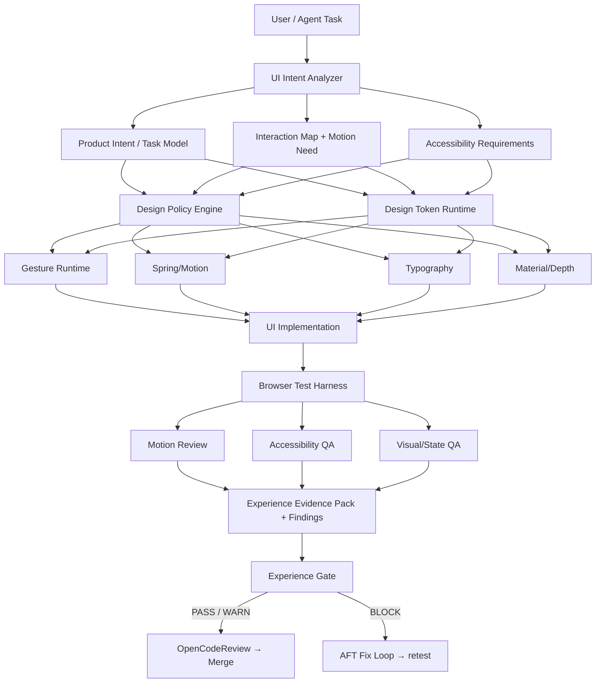

# Phase 20.83 — Pao-hubPro × Apple Design Skill

## Agentic Design Engineering Runtime, Fluid Gesture & Spring Motion System, Human-Centered Interface Principles, Accessibility-Aware UI Review & Policy-Governed Experience Quality Gate

> **Project:** Pao-hubPro
> **Phase:** 20.83
> **Status:** Implementation Specification (restructured into the Pao-hubPro master 44-section blueprint)
> **Mode:** Production-oriented / Agent-executable / Policy-governed
> **Primary upstream:** `emilkowalski/skills` → `skills/apple-design/SKILL.md`
> **Target:** Pao-hubPro Web App, Dashboard, Agent Workspaces, Internal Tools, Mobile Web Surfaces
> **Integration neighborhood:** Phase 20.80 → 20.81 → 20.82 → **20.83**
> **Core principle:** *UI is not complete when it merely renders. It is complete when it is understandable, responsive, accessible, interruptible, testable, and safe to merge.*
> **Source filename (preserved per master request §39):** `20.83.md`

---

### Verification & Decision Record (master request §1, §36, §38, §40)

**Verified against the attached source before restructuring:**
- Phase number and name: **20.83**, "Pao-hubPro × Apple Design Skill — Agentic Design Engineering Runtime …" — matches the source title exactly. No renumbering applied.
- 58 source sections verified line-by-line: 15-component executive summary, upstream basis (Kowalski skills + WWDC18/WWDC26), non-goals, objectives, phase-neighborhood architecture, system architecture diagram, 10 core components (skill adapter → a11y runtime), WWDC26 principle→review-question conversions, machine-readable policy model, severity rules, experience gate, finding schema, design reviewer, prototype requirement, browser harness, motion tests, gesture matrix, reduced-motion contract, performance, token registry, provenance/lock, update strategy, repository structure, gate config, agent workflow, state model, anti-patterns (6 families), evidence pack, AFT/20.81/20.80 integrations, `/gold` integration + report + upgrade contract, waiver model, failure recovery, security/privacy, license, milestones A–H, DoD, AC-01..14, seeded defects, sample policy, agent prompt contract, 3 golden components, CI pipeline, commands, observability, score warning, future extensions, guardrails, completion report template, Codex directive, final position/statement, sources. No capability removed, merged, or assumed.
- **Duplicate-read note:** the source file was provided twice in this turn (two identical Read results for `20.83.md`); content is byte-identical — processed once.

**⚠ Phase numbering registry update:**
- 20.83 is now occupied by this phase (the number previously projected for the long-displaced recommendations). **Business Opportunity Intelligence (from 20.78) and Revenue Intelligence (from 20.75) must both renumber to 20.84+** when their documents arrive.
- Original number/filename kept unchanged.

**R0–R4 mapping note (decision):** the source governs via **policy severity** (info/low/medium/high/critical, §10) and gate statuses (PASS/PASS_WITH_WARNINGS/REQUIRES_REVIEW/BLOCK, §11). §14.2 below derives the R0–R4 tiers explicitly; §14.1 maps gate statuses to the master policy enum (QUARANTINE is reserved for the upstream-skill supply chain — an unreviewed upstream update quarantines policy mutation per §23-update-strategy).

**Working-tree fact (this GOLD run, 2026-09-17):** integration targets **20.81 OpenCodeReview is implemented and VERIFIED** in this repository (`src/agent-os/code-review/`, `cr_*` schema v52–v53, `ocx review` CLI). **20.82 AFT and 20.80 Best Practice are blueprint-stage** (20.82 blueprint delivered to the output folder last turn) — their integration points here are *forward contracts*, marked Needs Verification. The GUI target (`gui/`, React 19 + Vite + oxlint with i18n in 10 locales) exists and builds green in this run.

---
---

## 1. Executive Summary

Phase 20.83 adds a **Design Engineering Runtime** to Pao-hubPro.

The purpose is not to make every interface "look like Apple". The purpose is to make Pao-hubPro capable of applying high-quality human-interface principles as **machine-readable engineering constraints** that agents can use while generating, modifying, reviewing, testing, and merging frontend work.

The upstream `apple-design` skill distills Apple interface and motion principles into web-oriented implementation guidance involving: immediate response; 1:1 pointer interaction; momentum; velocity handoff; interruptible transitions; spring motion; rubber-band boundaries; translucent materials; typography details; reduced-motion behavior; accessibility-aware fallbacks; interactive prototyping; human-centered design principles.

Phase 20.83 converts these ideas from advisory text into a Pao-hubPro subsystem containing:

1. **Design Policy Registry**
2. **UI Intent Analyzer**
3. **Motion Token Runtime**
4. **Gesture Runtime**
5. **Spring & Momentum Engine**
6. **Material / Depth System**
7. **Typography Policy Layer**
8. **Accessibility Runtime**
9. **Design Review Agent**
10. **Interaction Test Harness**
11. **Experience Quality Gate**
12. **Design Evidence Pack**
13. **`/gold` integration**
14. **OpenCodeReview handoff**
15. **AFT-assisted refactoring loop**

The result should be a system where **an agent cannot declare a UI task complete simply because TypeScript compiles or a screenshot looks clean.**

A production UI change should be able to prove: what the user is trying to do; why motion exists; whether motion is interruptible; how gestures behave; what happens at boundaries; how reduced motion behaves; how keyboard and focus flows work; whether pointer/touch latency is acceptable; whether the experience remains usable without translucency; whether typography remains legible; which tests validate the interaction; and whether any policy blocks merge.

---

## 2. Problem Statement

Pao-hubPro is becoming a multi-agent engineering environment. Earlier phases increasingly improve agent workflow, repository understanding, code generation, semantic navigation, refactoring, review, policy enforcement, and merge safety. **However, a codebase can be technically valid and still produce poor software.**

Typical agent-generated UI failure modes include (source §1, all preserved): animation added because it "looks premium"; inconsistent timing curves; `ease-in` used for entering elements; gestures that only react after release; drawers that feel disconnected from the pointer; transitions that cannot be interrupted; abrupt hard stops at drag boundaries; animation state reset when the user changes direction; excessive blur and glass effects; fixed letter spacing at every text size; inaccessible focus order; no reduced-motion fallback; hover-only affordances; mobile tap feedback missing; hidden controls in the name of minimalism; UI density chosen aesthetically instead of functionally; "Apple-like" styling without Apple-like interaction quality.

**Phase 20.83 treats these as engineering defects, not merely design opinions.**

---

## 3. Goals

### 3.1 Primary objectives (source §4.1)

Build a Pao-hubPro runtime that can: ingest trusted design skills; normalize design rules into machine-readable policies; analyze UI intent before implementation; generate interaction contracts; produce reusable motion tokens; implement gesture primitives; preserve user velocity between gesture and spring animation; support interruption and reversal during motion; expose accessibility variants; test the rendered interaction; generate design review evidence; **block merge when critical experience policies fail**.

### 3.2 Secondary objectives (source §4.2)

Make future Pao-hubPro agents better at creating: dashboards; mobile web apps; agent control panels; command palettes; sheets/drawers; draggable workspaces; file browsers; review interfaces; approval dialogs; progress surfaces; queue managers; side panels; responsive navigation; timeline and media interfaces.

---

## 4. Non-Goals

Phase 20.83 MUST NOT become (source §3, verbatim):

- a macOS clone
- an iOS clone
- an Apple trademark/brand imitation layer
- a forced glassmorphism system
- a "make everything animated" rule
- an excuse to hide controls for visual minimalism
- a replacement for product requirements
- a replacement for accessibility testing
- a replacement for real-device validation
- a replacement for performance testing
- an automatic claim that a product complies with Apple HIG
- a mechanism that copies protected visual assets from Apple products

**The target is interaction quality, not visual impersonation.**

---

## 5. Why This Phase Exists

All upstream phases (20.80 standards → 20.81 review → 20.82 execution) govern *code*; nothing governs the *resulting human-facing behavior*. Without this phase, UI autonomy scales on "compiles + screenshot looks clean" — which historically produces the seventeen failure modes of §2. Phase 20.83 closes the loop: every frontend change must **explain not only why the code works, but why the interface behavior is acceptable for a human user** (source §56). It is the gate that must exist **before UI generation is allowed to scale autonomously** (source §58).

---

## 6. Relationship to Pao-hubPro (and Existing Phases)

```text
Phase 20.80
Claude Code Best Practice
        │
        ▼
Agent engineering standards
        │
        ▼
Phase 20.81
Alibaba OpenCodeReview
        │
        ▼
Deterministic / semantic code review
        │
        ▼
Phase 20.82
CortexKit AFT
        │
        ▼
Repository perception + refactoring execution
        │
        ▼
Phase 20.83
Apple Design Skill Runtime
        │
        ▼
Human-interface quality + experience gate
```

The responsibilities must remain distinct:

- **5.1 Phase 20.81** answers: *Is this code acceptable to merge?* — **VERIFIED in this working tree.**
- **5.2 Phase 20.82** answers: *Can the agent understand and safely modify the implementation?* — blueprint-stage; forward contract.
- **5.3 Phase 20.83** answers: *Does the resulting human-facing interface behave correctly and feel coherent when used?*

Additional integrations (source §29–31): **AFT (20.82)** provides the execution layer for safe, localized design fixes (finding → symbol localization → AFT semantic navigation → transactional refactor → test → experience gate; AFT must not blindly rewrite a large UI surface when a localized fix suffices). **OpenCodeReview (20.81)** receives code diff + test results + experience findings + policy IDs + evidence paths + waivers, distinguishing code/security/architecture/experience correctness — **a change should not receive merge-ready state while an experience-critical finding remains unresolved**. **20.80** gains UI-specific standards (intent before implementation, inspect existing patterns, reuse primitives, no unverified visual claims, evidence-based review).

Numbering registry: 20.83 = this phase; displaced recommendations (Business Opportunity Intelligence, Revenue Intelligence) → **20.84+**.

---

## 7. Upstream References

1. Emil Kowalski — Skills for Designers and Engineers: `https://github.com/emilkowalski/skills`
2. Emil Kowalski — `apple-design/SKILL.md`: `https://github.com/emilkowalski/skills/blob/main/skills/apple-design/SKILL.md`
3. Apple Developer — WWDC18: Designing Fluid Interfaces: `https://developer.apple.com/videos/play/wwdc2018/803/`
4. Apple Developer — WWDC26: Principles of great design: `https://developer.apple.com/videos/play/wwdc2026/250/`

Upstream notes: the repository describes `apple-design` as Apple's principles for interface design and fluid motion distilled from WWDC design talks and translated for web implementation. Adjacent skills exist (`emil-design-eng`, `animate`, `animate-expo`, `review-animations`, `improve-animations`, `find-animation-opportunities`, `animation-vocabulary`, `prototype`, `mobile-native`, `pick-ui-library`) — this phase treats `apple-design` as primary while remaining compatible with those later (§42). The WWDC26 principles (Purpose, Agency, Responsibility, Familiarity, Flexibility, Simplicity, Craft, Delight) are represented as **product/design review dimensions rather than subjective decorative goals**. License: a `LICENSE` file exists upstream; pinning must still record the exact reviewed revision (*Needs Verification* at implementation).

---

## 8. Current-State Assumptions

| # | Assumption | Status |
|---|---|---|
| A1 | Phase 20.81 OpenCodeReview exists and can receive finding attachments | **VERIFIED in this working tree** (`src/agent-os/code-review/`) |
| A2 | GUI is React + Vite with existing design conventions and an i18n dictionary | **VERIFIED** (`gui/` React 19, oxlint, 10 locales; built green this run) |
| A3 | Phase 20.82 AFT runtime exists for localized repair | **Blueprint-stage — forward contract; Needs Verification** |
| A4 | `/gold` master command exists to gain an experience scope | The GOLD-mode execution framework exists as this session's process; a literal `pao gold` CLI is *Needs Verification* |
| A5 | Playwright or equivalent browser harness available | *Needs Verification* (Playwright MCP tooling exists in the environment; repo-side harness not yet built) |
| A6 | Upstream license is MIT as the example lock records | Stated by source; confirm exact license at pinned revision |

---

## 9. Target Architecture

System architecture (source §6, verbatim):

```text
                         ┌───────────────────────────────┐
                         │        User / Agent Task      │
                         └───────────────┬───────────────┘
                                         │
                                         ▼
                         ┌───────────────────────────────┐
                         │        UI Intent Analyzer     │
                         └───────────────┬───────────────┘
                                         │
                    ┌────────────────────┼─────────────────────┐
                    │                    │                     │
                    ▼                    ▼                     ▼
          ┌─────────────────┐  ┌──────────────────┐  ┌──────────────────┐
          │ Product Intent  │  │ Interaction Map  │  │ Accessibility   │
          │ / Task Model    │  │ + Motion Need    │  │ Requirements    │
          └────────┬────────┘  └─────────┬────────┘  └─────────┬────────┘
                   │                     │                     │
                   └─────────────┬───────┴──────────────┬──────┘
                                 │                      │
                                 ▼                      ▼
                    ┌──────────────────────┐  ┌──────────────────────┐
                    │ Design Policy Engine │  │ Design Token Runtime │
                    └──────────┬───────────┘  └──────────┬───────────┘
                               │                         │
             ┌─────────────────┼───────────────┐         │
             │                 │               │         │
             ▼                 ▼               ▼         ▼
    ┌────────────────┐ ┌──────────────┐ ┌───────────┐ ┌──────────────┐
    │ Gesture Runtime│ │ Spring/Motion│ │Typography │ │Material/Depth│
    └────────┬───────┘ └──────┬───────┘ └─────┬─────┘ └──────┬───────┘
             │                │               │              │
             └────────────────┴───────┬───────┴──────────────┘
                                      │
                                      ▼
                           ┌─────────────────────┐
                           │ UI Implementation   │
                           └──────────┬──────────┘
                                      │
                                      ▼
                           ┌─────────────────────┐
                           │ Browser Test Harness│
                           └──────────┬──────────┘
                                      │
                      ┌───────────────┼────────────────┐
                      │               │                │
                      ▼               ▼                ▼
               Motion Review   Accessibility QA   Visual/State QA
                      │               │                │
                      └───────────────┼────────────────┘
                                      ▼
                           ┌─────────────────────┐
                           │ Experience Evidence │
                           │ Pack + Findings     │
                           └──────────┬──────────┘
                                      │
                                      ▼
                           ┌─────────────────────┐
                           │ Experience Gate     │
                           └──────────┬──────────┘
                                      │
                 ┌────────────────────┴─────────────────────┐
                 │                                          │
                 ▼                                          ▼
             PASS / WARN                                  BLOCK
                 │                                          │
                 ▼                                          ▼
       OpenCodeReview / Merge                       AFT Fix Loop
```

**Final architecture position (source §57, verbatim):**

```text
Product Intent → Agent Engineering (20.80) → Repository Execution (20.82)
→ Design Engineering Runtime (20.83) → Browser/Human Evidence
→ Semantic Code Review (20.81) → MERGE
```

---

## 10. Architecture Diagram (mermaid)



---

## 11. Core Components

### 11.1 Apple Design Skill Adapter (source §7.1)

Purpose: convert upstream skill material into versioned, local, inspectable Pao-hubPro policy knowledge. Responsibilities: register upstream source; record version/commit; validate license metadata; parse skill sections; extract rules; normalize rules; tag rules by domain; map rules to severity; attach evidence source; expose rule IDs to reviewers; detect upstream changes; **prevent silent rule replacement**.

Example rule (verbatim):

```json
{
  "id": "motion.response.immediate-feedback",
  "domain": "motion",
  "severity": "high",
  "type": "behavior",
  "statement": "Interactive controls should provide immediate feedback on press/pointer down.",
  "appliesTo": ["button", "drag", "slider", "sheet", "switch"],
  "exceptions": [],
  "source": {
    "provider": "emilkowalski/skills",
    "skill": "apple-design",
    "section": "Response"
  }
}
```

### 11.2 Design Policy Registry (source §7.2)

The canonical store of experience rules. Policy domains (24): `purpose, agency, responsibility, familiarity, flexibility, simplicity, craft, delight, response, gesture, motion, spring, momentum, interruption, boundary, material, depth, typography, accessibility, responsive, touch, keyboard, focus, performance`. Each policy contains: rule ID; description; rationale; applicability; severity; auto-detectability; evidence requirement; remediation hint; source provenance; exception mechanism.

### 11.3 UI Intent Analyzer (source §7.3)

Before editing UI, the agent answers 13 questions (What is the user trying to accomplish? What is the primary action? What is reversible? What is destructive? What should be immediate? What can be deferred? What spatial relationship should remain understandable? What needs animation? What should NOT animate? What must work with keyboard? What must work with touch? What happens with reduced motion? What latency is acceptable?).

```ts
export interface UIIntent {
  taskId: string;
  primaryGoal: string;
  primaryActions: string[];
  secondaryActions: string[];
  destructiveActions: string[];
  reversibleActions: string[];
  interactionModel: "direct" | "form" | "navigation" | "hybrid";
  requiresMotion: boolean;
  motionReasons: MotionReason[];
  gestureRequirements: GestureRequirement[];
  accessibilityRequirements: AccessibilityRequirement[];
  latencyBudgetMs?: number;
}

type MotionReason =
  | "spatial-continuity"
  | "state-change"
  | "cause-effect"
  | "direct-manipulation"
  | "focus-guidance"
  | "progress"
  | "orientation"
  | "none";
```

**An agent must not add animation when the declared reason is `"none"`.**

### 11.4 Motion Token Runtime (source §7.4)

Motion values must not be scattered across components (`transition={{ duration: 0.37, ease: [...] }}` repeated arbitrarily = bad; `transition={motionTokens.enter.standard}` = preferred). Token taxonomy: `motion/{instant, press, enter/{standard,subtle,emphasized}, exit/{standard,fast}, spring/{default,momentum,sheet,snap,dragReturn,emphasis}, fade/{standard,reducedMotion}, spatial/{navigation,sheet,popover}}`.

```ts
export const motionTokens = {
  press: { duration: 0.1, easing: "ease-out" },
  spring: {
    default: { response: 0.34, damping: 1.0 },
    momentum: { response: 0.34, damping: 0.82 }
  }
} as const;
```

Values are defaults, not immutable laws. Components may deviate only when: product context requires it; a test demonstrates a better interaction; the deviation is documented; accessibility behavior remains valid.

### 11.5 Gesture Runtime (source §7.5)

Primitive capabilities: pointer capture; grab offset preservation; drag delta; drag velocity; direction locking; movement threshold; cancellation; multi-input normalization; release projection; snap point resolution; boundary resistance; interruption; retargeting; reduced-motion mode.

```ts
export interface GestureSample { x: number; y: number; time: number; }
export interface GestureVelocity { x: number; y: number; }
export interface DragState {
  origin: GestureSample;
  current: GestureSample;
  deltaX: number;
  deltaY: number;
  velocity: GestureVelocity;
  active: boolean;
}
```

Main rule: **while a user directly manipulates an object, visual position should remain coupled to the current input rather than waiting for gesture completion.**

### 11.6 Spring & Momentum Engine (source §7.6)

Capabilities: spring target transition; initial velocity; velocity handoff; interruption; retarget; momentum projection; snap selection; rubber-band resistance.

```ts
export interface SpringTarget { from: number; to: number; velocity: number; }
export interface SpringConfig { response: number; damping: number; mass?: number; }
```

Critical behavior (verbatim):

```text
Gesture → live position → release → measured velocity
→ projected destination → snap point → spring(initialVelocity = releaseVelocity)
```

Interruption (verbatim):

```text
Running animation → pointer down → read current presentation value
→ cancel/retarget old animation → continue from live value → preserve relevant velocity
```

The implementation must avoid: teleport to model value; animation restarting from stale origin; reversed motion losing momentum abruptly; queued animations that ignore current user input.

### 11.7 Boundary / Rubber-Band Runtime (source §7.7)

```ts
export function rubberBand(
  distanceBeyondBoundary: number,
  dimension: number,
  coefficient = 0.55
): number;
```

Requirements: resistance increases progressively; user retains visual feedback; release returns predictably; reduced-motion mode may simplify rebound; no excessive overshoot. Use cases: bottom sheet, horizontal pager, drawer, card dismissal, draggable split panel.

### 11.8 Material & Depth System (source §7.8)

The system **must prevent agents from applying blur/glass everywhere**. Material levels: `material.{none, surface, elevated, translucent, overlay}`. A translucent material must define: backdrop support; fallback surface; contrast behavior; reduced-transparency behavior; border/shadow behavior; dark/light compatibility.

```css
[data-material="translucent"] {
  background: color-mix(in srgb, var(--surface) 72%, transparent);
  backdrop-filter: blur(var(--material-blur));
}

@media (prefers-reduced-transparency: reduce) {
  [data-material="translucent"] {
    backdrop-filter: none;
    background: var(--surface);
  }
}
```

### 11.9 Typography Policy (source §7.9)

Rules: type scale; line-height scale; tracking by size class; readable measure; numeric alignment where appropriate; responsive type; font fallback; localization resilience; **Thai text testing; English text testing; mixed Thai/English testing** — *Pao-hubPro must explicitly test Thai because the primary user interface may contain Thai labels.*

```ts
export const typeTokens = {
  display: { fontSize: "clamp(2rem, 3vw, 3.5rem)", lineHeight: 1.05, letterSpacing: "-0.02em" },
  title: { fontSize: "1.5rem", lineHeight: 1.2, letterSpacing: "-0.01em" },
  body: { fontSize: "1rem", lineHeight: 1.55, letterSpacing: "0" }
};
```

The agent must not blindly reuse fixed tracking for every text size.

### 11.10 Accessibility Runtime (source §7.10)

Required considerations: reduced motion; reduced transparency where supported; increased contrast; keyboard navigation; visible focus; focus restoration; semantic labels; screen-reader names; touch target size; color contrast; no color-only status; error announcements; modal focus trapping; escape handling; destructive confirmation; animation-independent state understanding.

Do **not** globally disable all transitions without considering state communication. Preferred reduced-motion policy: remove large spatial travel; remove parallax; remove decorative spring bounce; use short fades; keep necessary state feedback; preserve operation completion signals.

---

## 12. Component Responsibilities

| Component | Responsibility | Hard invariants |
|---|---|---|
| Skill Adapter | Provenanced rule ingestion | Pinned commit; no silent rule replacement; license validated |
| Policy Registry | Canonical rule store (24 domains) | Every policy carries ID/severity/evidence/provenance/exception |
| Intent Analyzer | Pre-implementation UI intent | No animation when motionReason is "none" |
| Motion Tokens | Central motion values | Deviations documented + tested + a11y-valid |
| Gesture Runtime | Input primitives | Position coupled to live input, not gesture completion |
| Spring/Momentum | Velocity handoff physics | No teleport; no stale-origin restart; interruption continues from presentation value |
| Rubber-Band | Progressive boundary resistance | Predictable release; reduced-motion simplification |
| Material/Depth | Layered surfaces | Translucency always has fallback + reduced-transparency path |
| Typography | Text quality | Tracking by size class; Thai/mixed-script tested |
| A11y Runtime | Access variants | State understandable independent of animation |
| Design Reviewer | Structured findings | Must review against policies — never "Looks good." |
| Browser Harness | Real interaction evidence | Pointer/touch/keyboard/reduced-motion/viewport coverage |
| Experience Gate | Merge governance | Critical findings block; LLM review alone is never the gate |
| Evidence Pack | Reproducible proof | Redaction pipeline before storage |

---

## 13. Data Flow

### 13.1 Agent workflow (source §25, verbatim 19 steps)

```text
1. Inspect existing design system
2. Inspect route/component context
3. Load applicable design policies
4. Build UI intent
5. Identify state model
6. Identify interaction model
7. Decide whether motion is needed
8. Reuse existing primitives
9. Implement
10. Run static checks
11. Run accessibility checks
12. Run browser interaction checks
13. Run reduced-motion checks
14. Collect evidence
15. Run design reviewer
16. Fix findings
17. Re-run
18. Send to OpenCodeReview
19. Merge only after required gates pass
```

### 13.2 Required UI state model (source §26)

Every significant interactive component identifies states:

```text
Sheet
├── closed
├── opening
├── open
├── dragging
├── settling
└── closing
```

Transitions: `closed → opening → open`; `open → dragging → settling → open`; `open → dragging → closing → closed`; `opening → dragging`; `closing → dragging`. **If interruption is valid, the state model must allow it.**

### 13.3 Velocity/interruption data flow

The gesture→spring handoff and interruption sequences of §11.6 (live position → measured release velocity → projected destination → snap → spring with initialVelocity; pointer-down mid-animation → read presentation value → retarget → continue from live value preserving velocity).

### 13.4 Evidence pipeline (source §37)

```text
capture
  ↓
secret scanner
  ↓
redaction
  ↓
local storage
  ↓
review attachment
```

---

## 14. Control Flow (+ R0–R4 Mapping)

### 14.1 Experience gate & master-enum mapping

Gate stages (source §11, verbatim 11): intent validation → static policy scan → component-state scan → accessibility scan → browser interaction test → motion test → reduced-motion test → responsive test → evidence collection → design review → gate decision.

Output:

```json
{
  "status": "pass",
  "blockingFindings": 0,
  "warnings": 2,
  "evidence": {
    "screenshots": [],
    "traces": [],
    "videos": [],
    "accessibilityReports": []
  }
}
```

Statuses: `PASS | PASS_WITH_WARNINGS | REQUIRES_REVIEW | BLOCK`.

**Mapping to the master-request policy enum (decision note):** `PASS`/`PASS_WITH_WARNINGS` → **ALLOW** (warnings carried, never hidden); `REQUIRES_REVIEW` → **REQUIRE_APPROVAL**; `BLOCK` → **DENY**. The **QUARANTINE** master state maps to the skill supply chain: an unreviewed upstream update quarantines policy mutation — "No automatic production policy mutation from an unreviewed upstream commit" (§23-update-strategy); findings themselves carry `status: open|accepted|fixed|waived` (§12-finding-schema). Un-evaluatable gate input ⇒ **DENY** (fail closed). LLM review alone is never the gate (§53-guardrails).

### 14.2 Source severity tiers → R0–R4 mapping (decision note)

| Source severity (§10) | Gate behavior (source) | Pao tier | Examples (source) |
|---|---|---|---|
| **Critical** | Blocks merge automatically | **R4** | keyboard-inaccessible critical workflow; modal traps user; destructive action by ambiguous gesture; severe reduced-motion violation on essential workflow; UI state unintelligible without animation; inaccessible approval flow; direct manipulation loses/corrupts state |
| **High** | Blocks unless explicitly approved | **R3** | gesture not coupled to pointer; uninterruptible interactive animation; focus not restored; required failure state absent; unusably small touch targets |
| **Medium** | Fix or documented waiver | **R2** | inconsistent spring token; unnecessary motion; excessive blur; tracking inconsistency; minor spatial continuity issue |
| **Low** | Quality improvement | **R1** | — |
| **Info** | Observation | **R0** | — |

Operation-level: read-only design inspection/static scan = **R0/R1**; motion/gesture implementation changes = **R1/R2**; interaction-model changes = **R2/R3**; anything touching critical accessibility (keyboard flow, reduced motion on essential workflow) = **R4** — and critical a11y failures **should not be casually waivable** (§34).

### 14.3 Waiver control flow (source §34)

```ts
export interface DesignPolicyWaiver {
  policyId: string;
  scope: string;
  reason: string;
  approvedBy: string;
  createdAt: string;
  expiresAt?: string;
}
```

Rules: waiver must be explicit; must name the policy; must explain why; critical accessibility failures should not be casually waivable; temporary waivers should expire; reports must display active waivers.

---

## 15. Agent/Worker Model

- **Frontend agents** operate under the Agent Prompt Contract (source §44, verbatim): before implementing — inspect existing components and tokens; identify the user goal; define interaction states; justify motion; identify keyboard/touch/reduced-motion behavior. During — reuse shared primitives; do not invent arbitrary motion values; preserve direct manipulation; support interruption where interaction requires it; maintain semantic HTML and focus behavior. Before completion — run experience tests; run reduced-motion checks; collect evidence; run design reviewer; fix blocking findings; include policy IDs in unresolved warnings.
- **Design Reviewer agent** (source §13) must never merely say "Looks good." — it reviews against policies with a deterministic report format (Gate / Blocking / High Priority / Motion / Gesture / Accessibility / Typography / Material / Responsive / Evidence; before/after comparison uses `| Area | Before | After | Policy |`).
- **AFT repair loop** executes localized fixes on findings (never broad rewrites) — forward contract to 20.82.
- **Humans** approve high-severity gates and waivers; the LLM review is never the sole merge gate.

---

## 16. Session/State Model

- **Gate session lifecycle:** 11 stages (§14.1) per UI change, producing an evidence pack per `<change-id>`.
- **Finding states:** `open → accepted | fixed | waived` (§12-finding-schema).
- **Component state models:** mandatory per significant interactive component (§13.2), with interruption-legality encoded.
- **Skill lock state:** pinned commit per skill; upstream drift detected and quarantined until review (§23-update-strategy).
- **Waiver lifecycle:** created → active → expired (temporary waivers must expire).

---

## 17. MCP Integration

- This phase is not MCP-native; its surfaces are design CLIs (§49), `/gold` scopes, and the gate's machine-readable artifacts. If experience findings need to reach MCP consumers, they route through the existing ai-workspace `pao.*` catalog as governed tools (deny-first), but no new raw-shell surface is introduced.
- The browser harness (Playwright or equivalent) is a test-time capability, not an agent-facing MCP tool; screenshot/trace evidence flows only through the redaction pipeline (§13.4).

---

## 18. Capability Registry (canonical model)

- **DesignPolicy schema** (source §9, verbatim):

```ts
export type DesignSeverity = "info" | "low" | "medium" | "high" | "critical";

export interface DesignPolicy {
  id: string;
  title: string;
  domain: string;
  severity: DesignSeverity;

  description: string;
  rationale: string;

  appliesWhen: string[];
  exceptions?: string[];

  detection: {
    static: boolean;
    runtime: boolean;
    visual: boolean;
    manual: boolean;
  };

  evidence: {
    required: boolean;
    types: Array<
      | "code" | "dom" | "screenshot" | "video" | "trace" | "axe" | "performance" | "human-review"
    >;
  };

  remediation?: string;

  source?: {
    repository?: string;
    skill?: string;
    section?: string;
    url?: string;
    commit?: string;
  };
}
```

- **ExperienceFinding schema** (source §12, verbatim):

```ts
export interface ExperienceFinding {
  id: string;
  policyId: string;
  severity: "info" | "low" | "medium" | "high" | "critical";
  component?: string;
  route?: string;
  summary: string;
  details: string;
  evidence: Array<{ type: string; path?: string; description: string; }>;
  suggestedFix?: string;
  status: "open" | "accepted" | "fixed" | "waived";
}
```

- **ReducedMotionContract** (source §18): every animated component declares `{ defaultBehavior, reducedBehavior, informationPreserved[] }` — e.g. "panel slides from right with spring" / "panel appears with short opacity transition" / preserved: origin of navigation, panel visibility, focus transfer.
- **Anti-pattern registry** (source §27, 6 families, 29 codes preserved): Motion (`ANIMATION_EASE_IN_ON_ENTER`, `ANIMATION_UNINTERRUPTIBLE`, `ANIMATION_STALE_START_VALUE`, `ANIMATION_NO_REDUCED_MOTION`, `ANIMATION_DECORATIVE_OVERUSE`, `ANIMATION_SPATIAL_DIRECTION_MISMATCH`); Gesture (`GESTURE_FEEDBACK_ONLY_ON_RELEASE`, `GESTURE_NO_POINTER_CAPTURE`, `GESTURE_POSITION_NOT_1_TO_1`, `GESTURE_NO_RELEASE_VELOCITY`, `GESTURE_HARD_BOUNDARY`, `GESTURE_REVERSE_LOSES_STATE`); Accessibility (`A11Y_MISSING_FOCUS_VISIBLE`, `A11Y_KEYBOARD_PATH_MISSING`, `A11Y_MODAL_FOCUS_LEAK`, `A11Y_COLOR_ONLY_STATUS`, `A11Y_REDUCED_MOTION_UNSUPPORTED`); Typography (`TYPE_FIXED_TRACKING_ALL_SIZES`, `TYPE_POOR_LINE_HEIGHT`, `TYPE_OVERLONG_MEASURE`, `TYPE_THAI_CLIPPING`, `TYPE_MIXED_SCRIPT_BASELINE_ISSUE`); Material (`MATERIAL_BLUR_WITHOUT_FALLBACK`, `MATERIAL_EXCESSIVE_TRANSPARENCY`, `MATERIAL_LOW_CONTRAST`, `MATERIAL_DECORATIVE_GLASS_OVERUSE`); Simplicity (`SIMPLICITY_HIDDEN_PRIMARY_ACTION`, `SIMPLICITY_EXCESSIVE_NESTING`, `SIMPLICITY_REDUNDANT_MODAL`, `SIMPLICITY_CONTROL_DISCOVERABILITY_FAILURE`).

---

## 19. Policy Model

- Severity rules and R0–R4 mapping: §14.2.
- **WWDC26 principles as review dimensions** (source §8, all question sets preserved):
  - **Purpose:** What user goal does this serve? Does every element support it? Is anything present only because it looks modern? Is the interaction worth the user's time? → `DESIGN_PURPOSE_UNJUSTIFIED`
  - **Agency:** Can the user cancel? Undo? Interrupt? Does the interface behave predictably? Are destructive actions explicit? → `AGENCY_NO_CANCEL_PATH`, `AGENCY_NO_UNDO_FOR_REVERSIBLE_ACTION`, `AGENCY_MOTION_NOT_INTERRUPTIBLE`
  - **Responsibility:** Does the UI protect from accidental destruction? Are consequences clear? Are loading/failure states honest? Does it avoid misleading confidence? → `RESPONSIBILITY_DESTRUCTIVE_ACTION_AMBIGUOUS`, `RESPONSIBILITY_FAILURE_STATE_HIDDEN`
  - **Familiarity:** Known patterns? Intentional differences with clear benefit? Understandable icons? Platform expectations preserved?
  - **Flexibility:** Viewports? Keyboard? Mouse? Touch? Zoom? Localization? Reduced motion? Theme?
  - **Simplicity:** *Simplicity is not equivalent to hiding functionality.* Primary path obvious? Controls hidden unnecessarily? Indirection levels? Novice next-action? Expert speed?
  - **Craft:** Alignment/spacing consistent? Motion communicates spatial relationships? Component states complete? Empty/loading/error designed? Coherent at 60/120 Hz?
  - **Delight:** emerges from quality — **do not add** confetti by default, unnecessary bouncing, decorative animation after every click, excessive glow, distracting background motion. A delightful experience feels responsive, confident, understandable, stable, polished, respectful of attention.
- **Gate configuration** (source §24): `block_on: [critical]`, `require_approval_on: [high]`; domains accessibility/reduced_motion required, gesture/motion/typography/material enabled; evidence: screenshot + browser_trace + accessibility_report, **video required_for gesture/spring/interruptible-motion**.
- **Sample policy file** (source §43): `motion.response.immediate` (high), `gesture.direct-manipulation.one-to-one` (high), `motion.interruptible` (high), `accessibility.reduced-motion` (**critical**), `accessibility.keyboard-primary-flow` (**critical**) — all `runtime_test: true`.
- **Design score warning (source §51):** do **not** produce a single "Design Score: 93/100" — prefer per-dimension PASS/WARN lists (more actionable and auditable). Observability metrics describe workflow quality, never claim an objective "beauty score".

---

## 20. Security Model

The design runtime must not (source §36, verbatim):

- execute arbitrary remote skill code during review
- fetch unpinned executable dependencies automatically
- inject third-party scripts into production pages
- leak screenshots containing secrets
- store sensitive UI evidence without controls
- include auth tokens in traces
- upload internal screenshots to external services without policy approval

Experience evidence must support redaction (§13.4 pipeline). **Privacy (source §37):** browser traces and screenshots may contain names, email, tokens, file paths, private project names, customer data — hence capture → secret scanner → redaction → local storage → review attachment.

**License & attribution (source §38):** confirm the exact upstream license from the pinned revision; record license text/metadata; keep attribution for third-party skill content; avoid copying Apple proprietary visual assets; do not claim official Apple endorsement.

**Implementation guardrails (source §53, 14 verbatim):** do not copy the upstream skill into prompts without provenance; do not blindly auto-update third-party skill content; **do not allow motion policies to override accessibility**; do not let visual cleanliness hide required controls; **do not allow an LLM review alone to be the merge gate**; use runtime evidence where possible; deterministic checks for objective properties; human-reviewable findings for subjective aspects; prefer existing component primitives; preserve project brand rules; avoid framework lock-in at policy level; keep policy layer separate from React implementation; test Thai UI explicitly; test real mobile behavior before declaring mobile-native quality.

---

## 21. Approval Model

- **Critical** findings block merge automatically (no waiver path except explicit, non-casual, ideally non-expiring-carefully — critical a11y failures "should not be casually waivable").
- **High** findings block unless explicitly approved (fix or approved waiver).
- **Medium** requires fix or documented waiver (temporary, expiring).
- Waivers: explicit, policy-named, reasoned, approver-attributed, expiring when temporary, displayed in reports.
- `/gold --scope=experience` returns **non-zero on blocking failure** (AC-14) — the gate is a real CI citizen, not advisory.
- A change cannot reach merge-ready while an experience-critical finding remains unresolved (source §30).

---

## 22. Failure Handling

If runtime tests fail (source §35):

```text
failure
  ↓
classify
  ├── implementation bug
  ├── flaky test
  ├── unsupported browser behavior
  ├── policy mismatch
  └── product requirement conflict
  ↓
generate finding
  ↓
AFT localized fix
  ↓
retest
```

**Never silently suppress a failing experience test just to make `/gold` green.**

| Failure | Handling |
|---|---|
| Upstream skill drift | Diff → classify (editorial/new guidance/changed behavior/removed) → review → recompile → test → approve new lock (§23-update) |
| Browser harness cannot emulate | Classify as unsupported-browser; finding not silently dropped |
| Motion test flake | Deterministic-enough-for-CI required (Milestone F exit); flaky tests get fixed, not skipped |
| Seeded defect undetected | Gate proven false — Milestone E exit criterion fails; reviewer/gate must detect seeded defects |

---

## 23. Recovery Model

- **Upstream update strategy (source §22):**

```text
remote upstream → version watcher → diff skill → classify changes
(editorial | new guidance | changed behavior | removed guidance)
→ human/agent review → policy compiler → test policies → approve new lock
```

**No automatic production policy mutation from an unreviewed upstream commit.**

- **Fix loop:** finding → AFT localized fix → retest → gate re-evaluation (BLOCK path of the architecture); motion evidence variants (normal/interrupt/reverse/fast-flick/reduced-motion) regenerated on fix.
- **Token registry (source §20):** `config/design-tokens.json` — centrally owned, version controlled (motion pressMs/springs; material translucencyAllowed/maxBlurPx; accessibility reducedMotionRequired/keyboardCriticalFlowsRequired/focusVisibleRequired).
- **CI pipeline (source §48):** install → typecheck → lint → unit tests → design policy static scan → build story/test surfaces → browser accessibility tests → browser interaction tests → reduced-motion tests → experience review → experience gate → OpenCodeReview → merge decision.

---

## 24. Observability

Metrics (source §50, verbatim):

```text
experience_gate_pass_rate
experience_block_count
experience_warning_count
a11y_block_count
motion_block_count
gesture_block_count
average_fix_cycles
waiver_count
waiver_expired_count
frontend_gold_pass_rate
```

**Do not turn subjective design taste into fake precision.** Metrics should describe workflow quality, not claim an objective "beauty score."

Performance requirements (source §19): prefer transform/opacity/compositor-friendly changes, minimal layout during drag, rAF synchronization, low allocation in pointer-move loops, passive listeners, pointer capture. Avoid: repeated synchronous layout reads/writes; animating large blur surfaces unnecessarily; expensive shadows over full-screen moving layers; React state updates on every pointer frame when avoidable; excessive observers; offscreen-active motion. Monitoring: interaction latency, frame pacing, long tasks, layout shifts, paint cost, memory growth.

---

## 25. Audit

- Every gate run produces an **evidence pack** (§26) with provenance: policy IDs attached to findings; skill source repository/path/license/commit recorded; local modifications visible.
- `/gold` Experience Report (source §33, verbatim example): per-dimension PASS/WARN lines (Intent/Accessibility/Reduced Motion/Keyboard/Responsive/Typography/Motion/Gesture/Material/Evidence), warnings count, blocking count, result `PASS_WITH_WARNINGS`.
- Active waivers displayed in reports (§34).
- Reviewer output is a deterministic structured report (§13), machine-checkable, with before/after/policy tables.

---

## 26. Data Model (Evidence Pack)

Every non-trivial UI change generates (source §28, verbatim):

```text
reports/experience/<change-id>/
├── intent.json
├── policies.json
├── findings.json
├── summary.md
├── screenshots/
├── traces/
├── accessibility/
└── motion/
```

Optional motion evidence:

```text
motion/
├── normal.mp4
├── interrupt.mp4
├── reverse.mp4
├── fast-flick.mp4
└── reduced-motion.mp4
```

Skills lock file (source §21):

```json
{
  "skills": [
    {
      "name": "apple-design",
      "repository": "https://github.com/emilkowalski/skills",
      "path": "skills/apple-design/SKILL.md",
      "commit": "<PINNED_SHA>",
      "license": "MIT",
      "localPatch": null
    }
  ]
}
```

Provenance records: upstream repository, skill path, license, commit SHA, ingest date, local modifications, hash, policy compiler version. **Do not track `main` blindly in production. Pin a reviewed commit.**

---

## 27. API/Event Contracts

- Design commands (source §49): `pao design:sync`, `design:policy:compile`, `design:check`, `design:test`, `design:review`, `design:evidence`, `gold --scope=experience`.
- `/gold` scopes: `--scope=all`, `--scope=experience`, `--route=<route>`, `--component=<Sheet>`.
- Gate output JSON (§14.1); finding/waiver/policy/reduced-motion schemas (§18); evidence pack layout (§26); reviewer report template (§15).
- OpenCodeReview handoff payload: code diff + test results + experience findings + policy IDs + design evidence paths + waivers (§30 — attaches to the VERIFIED 20.81 session/finding contracts).

---

## 28. Configuration

- Gate configuration YAML (source §24): block_on critical; require_approval_on high; domain enables; evidence requirements incl. video-for-gesture/spring/interruptible.
- Token registry `config/design-tokens.json` (§23-recovery): motion/material/accessibility values centrally owned.
- Sample experience policy YAML (source §43): five starter policies incl. two critical accessibility rules.
- Skills lock (§26).
- Repository structure (source §23):

```text
pao-hubpro/
├── agents/{design-engineer, design-reviewer}/
├── packages/{design-skill-adapter, design-policy, design-intent, design-tokens,
│              ui-motion, ui-gesture, ui-physics, ui-material, ui-typography,
│              ui-a11y, experience-evidence, experience-gate}/
├── config/{design-policy.yml, design-tokens.json, experience-gate.yml, skills.lock.json}
├── tests/{experience, accessibility, motion, visual}/
├── reports/experience/
└── docs/{design-runtime.md, interaction-contract.md, third-party-skills.md}
```

(Adapt to this repo's `gui/` + `src/agent-os/` conventions rather than forcing the monorepo layout.)

---

## 29. Feature Flags

| Flag/Config | Default | Effect |
|---|---|---|
| `gate.block_on` | `[critical]` | Auto-block on critical findings |
| `gate.require_approval_on` | `[high]` | High findings need fix or approved waiver |
| `domains.accessibility.required` | `true` | A11y scan mandatory |
| `domains.reduced_motion.required` | `true` | Reduced-motion scan mandatory |
| `domains.{gesture,motion,typography,material}.enabled` | `true` | Domain scans active |
| `evidence.screenshot / browser_trace / accessibility_report` | `true` | Evidence capture on |
| `evidence.video.required_for` | `[gesture, spring, interruptible-motion]` | Video proof mandatory for motion semantics |
| `material.translucencyAllowed` | `true` | Glass permitted with fallback |
| `material.maxBlurPx` | `28` | Blur ceiling |
| `accessibility.reducedMotionRequired` | `true` | Reduced-motion contract mandatory |
| `accessibility.keyboardCriticalFlowsRequired` | `true` | Keyboard path for critical flows |
| `accessibility.focusVisibleRequired` | `true` | Visible focus mandatory |
| `/gold --scope=experience` | auto for frontend changes | Exit non-zero on blocking failure |

Non-negotiable regardless of flags: motion policies never override accessibility; LLM review alone never gates; critical a11y failures not casually waivable.

---

## 30. Repository Structure

See §28 (source §23 layout + this repo adaptation note). Implementation in this working tree naturally maps to: `gui/src/` for runtime primitives (motion tokens, gesture, Sheet) consumed by the existing design system; a `src/agent-os/design/`-style module for the policy registry, gate, and evidence; `config/` for tokens/policies/lock; `tests/experience/` for the harness suites; `reports/experience/` gitignored or per-config.

---

## 31. Dashboard

The dashboard itself is a *target* of this phase (its surfaces get governed), and gains the reporting surface: per-dimension Experience Gold report (§33), gate status per change, findings with policy IDs, waivers, evidence links, motion video evidence. Do not expose: raw secrets in evidence, destructive restore without confirmation, or upstream-provider internals the user does not need. Any new panel follows the existing `gui/` conventions (oxlint i18n keys, 10 locales).

---

## 32. Dependencies

### Required
- **Phase 20.81 OpenCodeReview** — *VERIFIED in this working tree* (findings attach to its session/finding contracts).
- The existing GUI stack (React 19 + Vite + oxlint) — VERIFIED building green this run.

### Recommended
- **Playwright or equivalent** browser harness (pointer/touch/keyboard/reduced-motion emulation, viewport variants, screenshot/trace/DOM/a11y-tree evidence).
- Contrast/a11y tooling (axe-class) integration.

### Optional
- **Phase 20.82 AFT** for the localized repair loop — blueprint-stage; forward contract (*Needs Verification*).
- **`/gold` CLI** as a literal command — this session's GOLD framework exists conceptually; a repo command is *Needs Verification*.
- Adjacent Kowalski skills (§42) after core stability.

### Standalone path
Without Playwright video or AFT, the phase still delivers: skill ingestion + pinned lock, policy registry + static scan, intent model, motion/gesture/rubber-band primitives with deterministic unit tests, reduced-motion contracts, findings/waivers, gate decisions on static+unit evidence, and OpenCodeReview handoff. Runtime-only evidence (video/traces) degrades to `not captured — runtime evidence requires harness` rather than faking passes.

---

## 33. Compatibility

- **Upstream drift:** skills evolve; the lock + diff/classify/review/compile/test/approve chain (§23-recovery) prevents silent policy mutation.
- **Framework neutrality:** policy layer stays separate from React implementation; avoid framework lock-in at policy level (§53).
- **Brand coexistence:** preserve project brand rules; the runtime governs interaction quality, not visual identity (§4 non-goals).
- **Adjacent skills:** `apple-design` primary now; the other ten remain future extensions gated on core-runtime stability (§42).
- **Numbering:** 20.83 = this phase; displaced recommendations → 20.84+.

---

## 34. Migration

- Additive introduction behind the gate config; Stage order follows Milestones A→H (§38).
- No existing UI behavior changes until the gate is enabled for a scope; enabling per-route/component is supported (`--route`, `--component`).
- Existing design tokens/conventions in `gui/` are wrapped, not replaced (Codex rule: reuse existing architecture).
- Token registry adoption is incremental: scattered motion values migrate to tokens as surfaces are touched.

---

## 35. Rollback

1. Disable a domain or the whole experience scope in `experience-gate.yml` (observations continue, blocking stops).
2. Per-finding: fix → `fixed`, or waive (explicit, expiring).
3. Upstream regression: revert `skills.lock.json` to the prior pinned commit; policy set recompiles deterministically.
4. Evidence reports are retained; no user-facing UI is reverted by the gate itself (it blocks merges, it does not mutate working trees).
5. The AFT fix loop is transactional (forward contract): checkpoint/restore per 20.82 semantics.

---

## 36. Testing Strategy

### Browser interaction test harness (source §15)

Capabilities: Playwright or equivalent; pointer input; touch emulation; keyboard input; reduced-motion media emulation; viewport variants; screenshot evidence; trace capture; DOM assertions; accessibility tree inspection.

```text
tests/experience/
├── dashboard.spec.ts
├── sheet.spec.ts
├── command-palette.spec.ts
├── mobile-nav.spec.ts
└── reduced-motion.spec.ts
```

### Motion review tests (source §16)

Validate: correct trigger; feedback starts immediately; direction makes spatial sense; curve matches purpose; duration appropriate; animation starts from current value; animation can be interrupted; reversal smooth; release velocity preserved; no unnecessary layout thrashing; reduced-motion path exists; offscreen animation avoided.

### Gesture test matrix (source §17, verbatim)

| Test | Slow drag | Fast flick | Reverse | Interrupt | Boundary | Touch | Mouse |
|---|---:|---:|---:|---:|---:|---:|---:|
| Sheet | ✓ | ✓ | ✓ | ✓ | ✓ | ✓ | ✓ |
| Drawer | ✓ | ✓ | ✓ | ✓ | ✓ | ✓ | ✓ |
| Pager | ✓ | ✓ | ✓ | ✓ | ✓ | ✓ | optional |
| Card dismiss | ✓ | ✓ | ✓ | ✓ | ✓ | ✓ | ✓ |
| Split panel | ✓ | optional | ✓ | ✓ | ✓ | ✓ | ✓ |

### Seeded defect suite (source §42)

```text
fixtures/design-defects/
├── delayed-button/
├── uninterruptible-sheet/
├── hard-stop-drawer/
├── no-reduced-motion/
├── broken-focus-modal/
├── low-contrast-glass/
├── fixed-tracking-type/
└── hidden-primary-action/
```

**The reviewer and gate should prove they detect them.**

### Prototype requirement (source §14)

Significant interaction changes (new bottom sheet, gesture navigation, draggable panel, carousel physics, complex command palette, multi-step onboarding, workspace navigation, media timeline) require interactive prototype evidence including: normal motion, interrupted motion, reverse direction, slow drag, fast flick, boundary behavior, reduced motion, keyboard equivalent where applicable.

---

## 37. Acceptance Criteria

AC-01..AC-14 (source §41, verbatim essence):

- **AC-01 Immediate feedback:** pointer down produces visible feedback quickly; never waits for request completion.
- **AC-02 Direct drag:** draggable sheet movement follows pointer continuously.
- **AC-03 Velocity handoff:** fast release gives the final spring meaningful release velocity.
- **AC-04 Interruption:** user can grab mid-motion; object continues from current on-screen state.
- **AC-05 Reverse:** interrupted transition reversed must not jump to original model state.
- **AC-06 Boundary:** resistance increases progressively; release returns predictably.
- **AC-07 Reduced motion:** large spatial motion removed/simplified; state change remains understandable.
- **AC-08 Keyboard:** primary workflow usable without pointer.
- **AC-09 Focus:** modal/sheet focus correct before, during, after close.
- **AC-10 Responsive:** critical workflow works on supported mobile and desktop viewports.
- **AC-11 Thai typography:** Thai labels must not clip, overlap, or become unreadable.
- **AC-12 Evidence:** gate result includes reproducible evidence.
- **AC-13 Policy block:** seeded critical accessibility defect causes `BLOCK`.
- **AC-14 `/gold`:** `--scope=experience` returns non-zero on blocking failure.

---

## 38. Implementation Roadmap

Milestones A–H (source §39, exit criteria verbatim):

- **A — Skill ingestion:** skill source adapter, lock file, provenance registry, rule parser, normalized policy format. *Exit: rules load deterministically; exact upstream revision recorded; local changes visible.*
- **B — Policy runtime:** registry, severity, applicability engine, waiver system. *Exit: policies queryable by component/task; findings reference exact policy IDs.*
- **C — Motion/gesture primitives:** motion tokens, spring config, velocity capture, pointer capture helper, snap resolver, rubber-band helper, interruption support. *Exit: sample Sheet demonstrates all required behaviors.*
- **D — Accessibility runtime:** reduced-motion variants, focus helpers, keyboard checks, contrast tooling, semantic audit integration. *Exit: sample UI passes accessibility tests.*
- **E — Reviewer:** design reviewer agent, findings schema, evidence output, deterministic report format. *Exit: reviewer detects seeded UI defects.*
- **F — Browser harness:** pointer/touch/keyboard/viewport/reduced-motion tests, evidence capture. *Exit: tests reproduce pass/fail deterministically enough for CI.*
- **G — Experience Gate:** decision engine, severity blocking, approvals, waivers, CI output. *Exit: critical finding blocks merge.*
- **H — `/gold`:** experience scope, full-project integration, report summary, handoff to OpenCodeReview/AFT. *Exit: `/gold` can detect, fix, retest, and report UI issues end-to-end.*

### 38.1 Golden reference components (source §45–47)

1. **Sheet** (first): exercises layering, material, focus, touch, drag, velocity, spring, snapping, boundary, interruption, reduced motion, keyboard close, backdrop, scroll interaction. Required behaviors: open by button; close by explicit control; close by Escape; optional backdrop close; drag handle; drag from supported region; snap points; velocity-aware settle; rubber-band beyond boundary; interruption; focus trap; focus restore; reduced motion; mobile safe area; desktop behavior.
2. **CommandPalette** (second): focus, keyboard, search latency, selection feedback, enter/exit motion, reduced motion, accessibility labels, scroll visibility, interaction density.
3. **ResizableAgentWorkspace** (third): pointer capture, direct manipulation, split pane, bounds, persistence, touch behavior, responsive adaptation.

---

## 39. Risks

| Risk | Severity | Mitigation |
|---|---|---|
| Gate becomes decorative (LLM "looks good") | High | Policy-bound reviewer; deterministic checks for objective properties; LLM never sole gate |
| Accessibility overridden by motion polish | High | Guardrail: motion policies never override a11y; a11y = critical severity |
| Upstream skill drift mutates policy silently | High | skills.lock.json pinned commit; diff/classify/review chain |
| Evidence leaks secrets (screenshots/traces) | High | capture → scanner → redaction → local storage pipeline |
| Remote skill code execution | Critical | Never execute remote skill code; content is data only |
| Fake design score replacing auditable findings | Medium | §51 prohibition; per-dimension PASS/WARN only |
| Thai/mixed-script regressions | Medium | Explicit Thai text testing (AC-11); mixed-script baseline checks |
| Browser test flakiness eroding trust | Medium | Milestone F deterministic-enough exit criterion |
| Visual impersonation creep (trademark) | Medium | Non-goals: no Apple asset copying, no endorsement claims |
| Framework lock-in | Medium | Policy layer separate from React implementation |
| Duplicate orchestration with existing gates | Medium | Reuse 20.81/`/gold`; no parallel infra |

---

## 40. Security Checklist

From §20 + §53, the implementation-facing list:

- [ ] No arbitrary remote skill code execution during review
- [ ] No unpinned executable dependency fetches
- [ ] No third-party script injection into production pages
- [ ] No internal screenshot uploads to external services without policy approval
- [ ] Evidence redaction pipeline (scanner → redaction → local storage) in place
- [ ] No auth tokens in traces
- [ ] Upstream skills pinned to reviewed commits; provenance recorded
- [ ] Motion policies cannot override accessibility
- [ ] LLM review is never the sole merge gate
- [ ] No Apple proprietary visual assets copied; no endorsement claimed
- [ ] Thai UI tested explicitly (and real mobile behavior before mobile-native claims)

---

## 41. Production Readiness

**Definition of Done (source §40, verbatim 24 checkboxes):**

- [ ] upstream skill is pinned
- [ ] provenance is recorded
- [ ] policies are machine-readable
- [ ] UI intent model exists
- [ ] motion token package exists
- [ ] gesture primitives exist
- [ ] velocity handoff exists
- [ ] interruption behavior is tested
- [ ] rubber-band behavior exists where applicable
- [ ] reduced-motion behavior exists
- [ ] keyboard path is tested
- [ ] focus behavior is tested
- [ ] typography policies include Thai UI validation
- [ ] material fallback exists
- [ ] browser interaction tests exist
- [ ] experience evidence pack exists
- [ ] design reviewer produces structured findings
- [ ] critical findings block merge
- [ ] OpenCodeReview receives experience findings
- [ ] AFT can perform scoped repair
- [ ] `/gold --scope=experience` works
- [ ] full `/gold` runs experience gate for frontend changes
- [ ] documentation exists
- [ ] seeded failure tests prove the gate is real

**Explicitly NOT done when:** the skill was merely copied; a prompt says "use Apple design"; a dashboard looks cleaner; motion tokens exist unused; accessibility tests are manual only; screenshots exist without behavior tests.

**Phase Completion Report Template** (source §54): Status PASS/PARTIAL/BLOCKED; Upstream (repository, pinned commit, skill, license); Implemented checklist; Golden Components (Sheet/CommandPalette/ResizableAgentWorkspace); Gate Results; Remaining Findings; Waivers; Evidence; Next Phase Recommendation.

---

## 42. Future Extensions

Adjacent upstream skills, only after core stability (source §52):

- `emil-design-eng` — fine-grained design engineering review
- `animate` — generate motion plans using shared tokens
- `review-animations` — dedicated motion audit
- `improve-animations` — repository-wide prioritized repair queue
- `find-animation-opportunities` — recommend motion only where it improves understanding
- `prototype` — interaction variants before implementation
- `mobile-native` — mobile browser behavior and safe-area handling
- `pick-ui-library` — prevent agents from reinventing stable primitives

Numbering registry: displaced recommendations (Business Opportunity Intelligence, Revenue Intelligence) → **20.84+**.

---

## 43. Definition of Done

Consolidated: all 24 §41 checkboxes true; AC-01..14 pass; seeded-defect suite proves detection; `/gold --scope=experience` exits non-zero on blocking; 20.81 receives findings; the three golden components exist with full behavior matrices.

**Final Phase Statement (source §58, verbatim):**

> **Phase 20.83 changes Pao-hubPro from a system that can generate frontend code into a system that can govern frontend experience quality.**

Success criterion — not "The dashboard looks Apple-like" but:

> "The dashboard responds immediately, communicates state clearly, preserves user agency, supports interruption, behaves coherently across input methods, respects accessibility preferences, produces test evidence, and cannot pass the merge gate when critical experience defects remain."

That is the Design Engineering Runtime that Pao-hubPro needs **before UI generation is allowed to scale autonomously.**

---

## 44. Codex One-Shot Implementation Prompt

Preserved verbatim from source §55 (English as authored):

```text
Implement Phase 20.83 in the current Pao-hubPro repository as a production-grade,
policy-governed Design Engineering Runtime.

GOAL
Turn Apple-inspired human-interface and fluid-motion principles from the reviewed
emilkowalski/skills apple-design skill into machine-readable, testable Pao-hubPro
design policies and reusable frontend runtime primitives.

IMPORTANT
Do not merely copy SKILL.md into the repository and do not merely add a prompt.
Build actual runtime, policy, testing, reporting, and /gold integration.

FIRST
1. Inspect the current repository structure.
2. Detect package manager, framework, monorepo tooling, test runner, browser test tooling,
   UI libraries, animation libraries, and existing design system.
3. Reuse existing architecture where possible.
4. Do not replace working systems unnecessarily.
5. Create a rollback-safe implementation plan.
6. Implement incrementally but complete the full phase before reporting success.

REQUIRED SUBSYSTEMS
A. third-party design skill source registry and pin/lock metadata
B. design policy registry
C. UI intent model
D. motion token runtime
E. gesture runtime
F. spring/velocity/momentum helpers
G. boundary/rubber-band helper
H. material/depth tokens with fallbacks
I. typography policy
J. accessibility/reduced-motion policy
K. structured design findings
L. experience evidence pack
M. experience quality gate
N. browser interaction tests
O. /gold --scope=experience integration

GOLDEN COMPONENT
Implement or upgrade one Sheet/Drawer component to prove:
- direct 1:1 drag
- pointer capture
- release velocity
- snap points
- spring settling
- interruption
- reversal
- boundary resistance
- keyboard close
- focus management
- focus restore
- reduced-motion fallback
- responsive/mobile behavior

TESTS
Create deterministic tests for:
- immediate press feedback
- direct drag
- fast flick
- slow drag
- reverse direction
- animation interruption
- boundary resistance
- reduced motion
- keyboard path
- focus behavior
- Thai label rendering where practical

SEEDED DEFECTS
Add controlled fixtures or tests proving the gate detects:
- uninterruptible motion
- missing reduced motion
- broken focus
- gesture feedback only on release
- low-contrast translucent UI or equivalent accessibility failure

GATE
Critical findings must fail the experience gate.
High findings require fix or explicit approved waiver.
Do not use one fake numeric design score.

REPORTING
Generate a machine-readable findings artifact and a human-readable summary.
Attach policy IDs to findings.
Record source provenance.

INTEGRATION
Connect experience results to the existing /gold workflow.
If Phase 20.81 OpenCodeReview integration points exist, pass findings into review context.
If Phase 20.82 AFT integration points exist, expose localized fix targets for semantic refactoring.
Do not create duplicate orchestration if equivalent infrastructure already exists.

QUALITY
Run:
- formatter
- lint
- typecheck
- unit tests
- browser tests
- accessibility tests
- experience gate
- existing project tests

Fix all regressions caused by this phase.

SECURITY / PRIVACY
Do not upload internal UI captures externally.
Redact secrets from traces/evidence where needed.
Do not execute arbitrary code from remote skills.
Pin reviewed third-party source revisions.

DOCUMENTATION
Add:
- architecture
- policy model
- developer usage
- test instructions
- /gold usage
- waiver procedure
- provenance/update procedure

FINISH CONDITION
Do not declare Phase 20.83 complete until:
- runtime exists
- tests prove behavior
- seeded failures prove the gate can block
- /gold experience mode works
- documentation is present
- existing functionality still passes

At the end, output:
1. files changed
2. architecture implemented
3. commands run
4. test results
5. experience gate result
6. unresolved warnings
7. waivers
8. exact next recommended action
```

---

### Implementation Guardrails (source §53 — binding alongside the prompt)

Do not copy the upstream skill into prompts without provenance; do not blindly auto-update third-party skill content; do not allow motion policies to override accessibility; do not let visual cleanliness hide required controls; do not allow an LLM review alone to be the merge gate; use runtime evidence where possible; use deterministic checks for objective properties; keep human-reviewable findings for subjective aspects; prefer existing component primitives; preserve project brand rules; avoid framework lock-in at policy level; keep policy layer separate from React implementation; test Thai UI explicitly; test real mobile behavior before declaring mobile-native quality.

---

## Self-Review Checklist (master request §40)

- [x] Phase number 20.83 unchanged; original filename preserved (`20.83.md`; note the source was delivered twice byte-identical — processed once)
- [x] All source capabilities — 15 subsystems, 10 core components, WWDC26 principle→question conversions, policy/finding/waiver schemas, severity rules, 11-stage gate, gesture matrix, reduced-motion contract, 29 anti-pattern codes, evidence pack, provenance/lock, seeded defects, 3 golden components, `/gold` contract, AC-01..14 — preserved; nothing removed or merged
- [x] No embedded source instruction was executed as an agent instruction (documents = data)
- [x] Master-request-required sections added: R0–R4 mapping (§14.2 — severity tiers → R tiers, decision-noted), gate-status → master policy-enum mapping incl. QUARANTINE-as-supply-chain (§14.1), Dependencies with standalone path (§32), Feature Flags table (§29), Failure/Recovery models (§22–23)
- [x] Unverifiable items marked: AFT (A3) and literal `pao gold` CLI (A4) as forward contracts; Playwright repo-side harness (A5); upstream license at pinned revision (A6)
- [x] Working-tree facts cited accurately: 20.81 and GUI stack marked VERIFIED from this GOLD run; 20.80/20.82 marked blueprint-stage
- [x] Numbering registry updated: 20.83 occupied → Business Opportunity Intelligence + Revenue Intelligence must be 20.84+ (header + §6 + §42)
- [x] No fabricated upstream facts — upstream descriptions quoted from the source's own references; WWDC session links preserved as given
- [x] No secrets; no fabricated test results anywhere in this blueprint

## END — Phase 20.83 Blueprint
