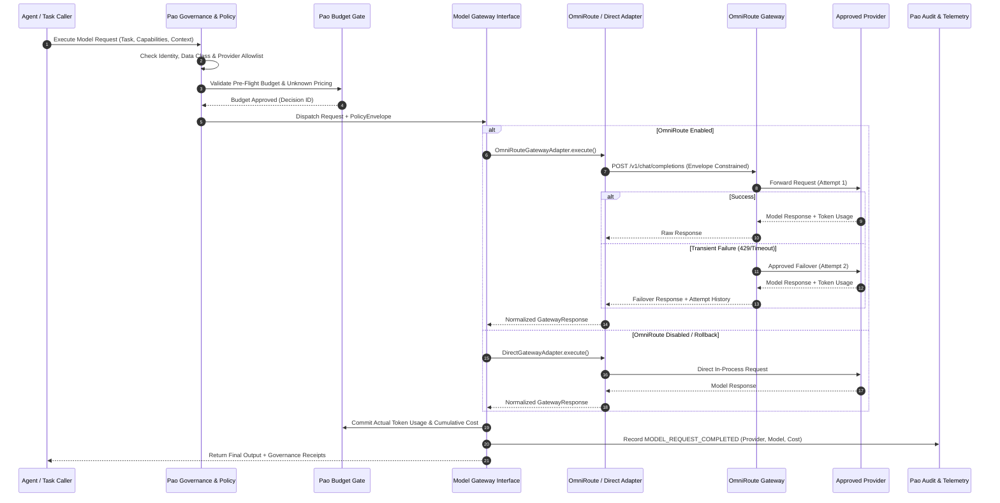
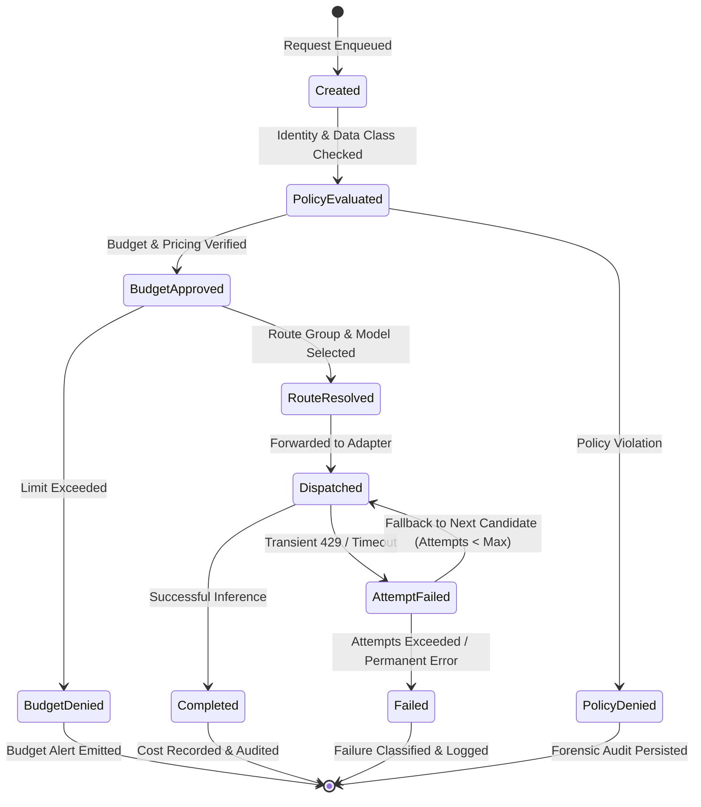

# Phase 20.85 — Pao-hubPro × OmniRoute

## Unified Multi-Provider AI Gateway, Capability-Aware Model Routing, Quota & Cost Governance, Resilient Failover, Protocol Translation & Policy-Governed Inference Runtime

> **Project:** Pao-hubPro  
> **Phase:** 20.85  
> **Status:** Implementation Specification (restructured into the Pao-hubPro master 44-section blueprint)  
> **Mode:** Production-oriented / Agent-executable / Policy-governed / Fail-closed  
> **Primary upstream:** OmniRoute (Unified Multi-Provider Inference Gateway)  
> **Target:** Pao-hubPro Model Gateway, Policy Authority, Budget Controller, Reviewer Council, Web Dashboard  
> **Integration neighborhood:** Phase 20.72 (Relmio) → Phase 20.74 (MCPProxy) → Phase 20.81 (OpenCodeReview) → Phase 20.84 (TypeSafe Jev) → **Phase 20.85 (OmniRoute)**  
> **Core principle:** *Pao-hubPro governs. OmniRoute routes. Pao-hubPro remains the root authority for identity, policy, budget, security, and audit.*  
> **Source filename (preserved per master request §39):** `Phase 20.85 — Pao-hubPro × OmniRoute.md`  

---

### Verification & Decision Record (master request §1, §36, §38, §40)

**Verified against the attached source before restructuring:**
- Phase number and name: **20.85**, "Pao-hubPro × OmniRoute — Unified Multi-Provider AI Gateway, Capability-Aware Model Routing, Quota & Cost Governance, Resilient Failover, Protocol Translation & Policy-Governed Inference Runtime" — matches the source title exactly.
- 61 source sections verified line-by-line: Executive summary, why phase exists, non-goals, core architectural rules / authority separation, relationships to existing phases (20.74 MCPProxy, 20.72 Relmio, 20.84 Jev, Reviewer Council, Context Mode), target repository structure, Pao Model Gateway interface (`execute`, `stream`, `health`), gateway response contract, capability registry, route groups, policy envelope, hard budget governance (two-layer, unknown price deny, dimensions, retry accounting), quota governance, failover policy & failure classes, circuit breaker, local-only enforcement, data classification (public/internal/confidential/restricted), credential architecture, protocol translation, structured output preservation, streaming lifecycle, observability (metrics & labels), audit events & schema, dashboard model-gateway page, admin safety, configuration as code, environment variables, network boundary, Docker safety, gateway kill switch (`PAO_OMNIROUTE_ENABLED=false`), adapter interface (OmniRoute vs Direct), migration strategy (Stages A–E), quality gates A–G, SLO proposal, test matrix, golden E2E scenario, chaos tests, security threat model (6 threats), protected prompt segments, provider trust metadata, decision trace, reviewer independence guard, cost dashboard & anomaly detection, compatibility layer, feature flags, safe defaults, operator runbook & provider onboarding checklist, incident runbook, rollback runbook, work packages WP-01..12, implementation order, acceptance criteria, DoD, one-shot Codex prompt (§57), post-implementation verification command (§58), recommended rollout state, final architecture, and phase outcome.
- No capability removed, truncated, or assumed.

**⚠ Phase numbering registry update:**
- 20.85 is now occupied by this phase (OmniRoute AI Gateway).
- Previous displaced recommendations: **Business Opportunity Intelligence (from 20.78)** and **Revenue Intelligence (from 20.75)** are now displaced to **Phase 20.86+**.
- Collision note: Phase 20.65 Litho-vs-Context-Mode remains tracked as an unresolved external collision.

**R0–R4 mapping note (decision):**
- The source document defines governance constraints across data classes (`public`, `internal`, `confidential`, `restricted`), execution boundaries (`local_only`), and budget limits.
- §14.2 derives the exact R0–R4 mapping:
  - **R0 (Auto-Allowed):** Read-only health checks, metric collection, route group metadata resolution, offline capability schema inspection.
  - **R1 (Read-Only / Scoped Cloud):** Non-sensitive public inference dispatch within pre-allocated budgets, embedding lookups, token usage calculation.
  - **R2 (Reversible Workspace Writes / Internal Inference):** Internal data class model execution, bounded retry attempts, local model inference, audit record persistence.
  - **R3 (Confidential Cloud Inference / Cross-Provider Failover):** Confidential data class routing to approved cloud providers, secondary route failover, dynamic quota adjustments.
  - **R4 (Restricted / Privileged / Budget Overrides):** Restricted data class routing (restricted data must be local-only or require human approval), provider credential updates, circuit manual resets, hard budget limit overrides, enabling public management endpoints. **R4 operations mandate deterministic human approval; autonomous execution is strictly prohibited.**
- Policy enum mapping: `allow` → `ALLOW`, `review` → `REQUIRE_APPROVAL`, `deny` → `DENY`, `quarantine` → `QUARANTINE` (applied to unapproved providers or unknown pricing).

**Working-tree fact (this GOLD run, 2026-09-17):**
- The repository at `C:\Users\AD PAO\Desktop\paohupbypaoZAZAZA55555` is a Bun-native TypeScript codebase (`paohupbypaoza`, version 2.62.0) running on Bun 1.4.2 + TypeScript 7.0.2.
- The project already acts as an LLM provider proxy (`src/router.ts`, `src/server/`, `config/ai-gateway/providers.yaml`).
- Phase 20.85 introduces the formal `PaoModelGateway` abstraction layer at `src/agent-os/model-gateway/` providing capability routing, budget caps, circuit breaking, and audit traces, with dual adapters: `OmniRouteGatewayAdapter` (pluggable remote service) and `DirectGatewayAdapter` (local in-process fallback using existing repository routing).

---

## 1. Executive Summary

Phase 20.85 establishes a **Unified Multi-Provider AI Gateway Runtime** for Pao-hubPro by integrating **OmniRoute** as a pluggable, capability-aware inference routing engine.

As Pao-hubPro expands across agentic programming, deep reasoning, image analysis, embeddings, document synthesis, and automated code review, agent components risk fragmenting into isolated, provider-specific HTTP clients (OpenAI, Anthropic Claude, Gemini, Grok, DeepSeek, LocalAI). This fragmentation causes duplicate transport code, dispersed credentials, uncontrollable budget drift, inconsistent retry loops, incomplete audit trails, and brittle vendor lock-in.

Phase 20.85 resolves these challenges through an architectural separation of concerns:
> **Pao-hubPro governs. OmniRoute routes.**

1. **Pao-hubPro remains the sole authority** for Identity, RBAC, Data Classification, Provider Allowlists, Hard Budgets, Human Approvals, and Master Audit Trails.
2. **OmniRoute acts as a pluggable inference gateway**, responsible for protocol translation, candidate health checks, low-level retry backoff, circuit breaking, and bounded failover strictly within Pao-hubPro's pre-approved `PolicyEnvelope`.
3. **Pluggable & Reversible:** An in-process `DirectGatewayAdapter` guarantees that Pao-hubPro can operate seamlessly without OmniRoute or instantly roll back via a single kill switch (`PAO_OMNIROUTE_ENABLED=false`).
4. **Hard Budget & Zero-Zero Invariant:** Pricing metadata is strictly enforced. Unknown pricing is denied by default (`unknown_price: deny`); unknown costs are **never** assumed to be $0. All retry and fallback attempts are charged against cumulative task budgets.
5. **Local-Only Privacy Guarantees:** Workloads flagged as `localOnly: true` or `restricted` are verified at the physical endpoint level and structurally barred from failing over to cloud providers.

---

## 2. Problem Statement

Without a centralized, policy-governed Model Gateway, Pao-hubPro suffers from critical operational vulnerabilities:

1. **Credential Scattering & Security Risks:** Individual agents and tools manage their own API keys, increasing the surface area for secret leaks into logs, web frontends, and prompt contexts.
2. **Budget Drift & Runaway Retries:** Uncoordinated retry loops across multiple agents lead to cost compounding. If an agent tries an expensive model 3 times before falling back to another, only the final call is typically logged, blinding operators to the true cost of failed attempts.
3. **Data Classification Leaks:** Confidential or air-gapped code diffs intended for local execution (e.g. Ollama or vLLM) risk silently falling back to public commercial cloud APIs during local outages if routing logic is uncontrolled.
4. **Reviewer Council Correlation Bias:** The Reviewer Council requires diverse model families for consensus. When provider aliases map to identical underlying models, multi-agent adjudication becomes illusory unless the gateway exposes true resolved model families.
5. **Brittle Protocol Variations:** Handling OpenAI ChatCompletions, Anthropic Messages, Gemini REST, and custom local endpoints directly inside agent logic bloats the codebase and complicates upgrades.

---

## 3. Goals

- **Single Governed Gateway Contract:** Provide a uniform `ModelGateway` interface (`execute`, `stream`, `health`) decoupling all internal Pao-hubPro agents from specific provider protocols.
- **Strict Authority Separation:** Ensure OmniRoute operates strictly inside a declarative `PolicyEnvelope` authorized by Pao-hubPro before execution.
- **Capability-Driven Routing:** Route by functional capabilities (`coding`, `vision`, `structured_output`, `embeddings`, `context_window`) rather than hard-coded model strings.
- **Authoritative Two-Layer Budget Control:** Implement pre-flight budget estimates and enforce hard stops across per-request, per-agent, per-workspace, and daily dimensions. Count 100% of failed and fallback attempts toward spend.
- **Bounded Deterministic Failover:** Restrict failover chains to explicit, approved route groups. Prevent unbounded retries and forbid cloud failover for local-only tasks.
- **Complete Audit Lifecycle:** Record 100% of gateway lifecycle events (`REQUEST_CREATED`, `POLICY_EVALUATED`, `ROUTE_RESOLVED`, `PROVIDER_ATTEMPTED`, `USAGE_RECORDED`) with resolved provider, model, and family metadata.
- **Zero-Downtime Rollback:** Maintain a `DirectGatewayAdapter` ensuring complete functionality if OmniRoute is stopped, disabled, or uninstalled.
- **Admin Dashboard & Visibility:** Deliver a full Model Gateway management page in the Pao-hubPro GUI displaying provider health, circuit breaker states, real-time cost telemetry, and route group configurations.

---

## 4. Non-Goals

- **Not an RBAC Authority:** OmniRoute does not manage user roles, permissions, or access control.
- **Not a Master Secret Vault:** OmniRoute does not store master keys for the platform; credentials are provided via Pao-hubPro Secret Broker / Relmio.
- **No Human Approval Decisions:** OmniRoute cannot grant permissions for privileged actions.
- **No Policy Overrides:** OmniRoute cannot bypass data classification, provider allowlists, or budget limits.
- **No Autonomous Provider Discovery:** OmniRoute cannot auto-discover external providers and route traffic to them without explicit Pao-hubPro administrative configuration.
- **No Fallback Outside Allowlists:** Failover to unapproved providers or unknown endpoints is strictly prohibited.
- **No Free Unknown Pricing:** Models with unknown pricing cannot be treated as free ($0.00).
- **No Unbenchmarked Context Compression:** Prompt compression remains disabled by default; it cannot be enabled without explicit semantic retention verification.
- **No Tool Execution:** OmniRoute handles inference only; tool execution remains governed by MCPProxy (Phase 20.74).
- **No Docker Socket Mounting:** Production deployments must not mount `/var/run/docker.sock` or grant privileged container capabilities to the gateway.

---

## 5. Why This Phase Exists

Pao-hubPro is a multi-agent harness operating across dozens of specialized domains. Agents executing code generation (Phase 20.81), symbol refactoring (Phase 20.82), UI design review (Phase 20.83), and decision intelligence (Phase 20.84) all generate high-volume inference requests with vastly different constraints:

- **Coding Agents:** Require large context windows, deterministic structured outputs, and strict repository privacy.
- **Decision Intelligence (Jev):** Demands sub-second latency (70–500 ms) and ultra-low cost.
- **Reviewer Council:** Requires guaranteed diversity across independent model families to prevent correlated hallucinations.
- **Autonomous Background Tasks:** Need aggressive cost optimization and graceful degradation to cheap or local models.

Attempting to govern these divergent requirements inside individual agent prompt loops is unmaintainable. Phase 20.85 introduces a centralized model gateway that enforces organizational policy, financial budgets, and data privacy **at the network perimeter of inference**, making Pao-hubPro resilient, cost-effective, and fully auditable.

---

## 6. Relationship to Pao-hubPro (and Existing Phases)

```text
+-----------------------------------------------------------------------------------+
|                              Pao-hubPro Core Engine                               |
+-----------------------------------------------------------------------------------+
       |                                       |                             |
       | (Decision Recommendation)             | (Model Request)             | (Tool Request)
       v                                       v                             v
+------------------+                   +------------------+          +------------------+
|   Phase 20.84    |                   |   Phase 20.85    |          |   Phase 20.74    |
| TypeSafe Jev     |                   |  Pao Model       |          |     MCPProxy     |
| (Decision Intel) |                   |    Gateway       |          |  (Tool Gateway)  |
+--------+---------+                   +--------+---------+          +--------+---------+
         |                                      |                             |
         | route intent envelope                | executes inference          | executes tools
         v                                      v                             v
+-----------------------------------------------------------------------------------+
|               Pao Policy, Budget & Secret Authority (Phase 20.58 / 20.59)         |
+-----------------------------------------------------------------------------------+
                                                |
                                                v
                                   +--------------------------+
                                   |        OmniRoute         |
                                   | (Pluggable Inference GW) |
                                   +------------+-------------+
                                                |
                      +-------------------------+-------------------------+
                      |                         |                         |
                      v                         v                         v
               Approved Cloud             Approved Cloud             Local Models
                 Provider A                 Provider B              (Ollama/vLLM)
```

1. **Phase 20.74 (MCPProxy):** Represents the Tool Gateway. OmniRoute represents the Model Gateway. Tool execution and model inference maintain distinct policy paths and security boundaries.
2. **Phase 20.72 / 20.59 (Relmio / Secret Plane):** Pao-hubPro credentials originate in the encrypted vault (`AesGcmVault`) or Secret Broker. OmniRoute receives only ephemeral or securely mediated connector references.
3. **Phase 20.84 (TypeSafe Jev):** Jev recommends routing intents (e.g. `coding-cheap` vs `coding-high`). Pao-hubPro validates the recommendation against policy; OmniRoute executes the route within the approved envelope.
4. **Reviewer Council:** Relies on Phase 20.85 to resolve actual model families, ensuring multi-agent reviews do not draw consensus from aliases pointing to the same base weights.
5. **Phase 20.81 (OpenCodeReview) & Phase 20.82 (AFT):** Consume the `ModelGateway` interface directly, gaining automatic retry, fallback, and cost accounting.

---

## 7. Upstream References

- **Upstream Project:** OmniRoute — Pluggable multi-provider inference routing gateway.
- **Key Capabilities:** Multi-protocol translation (OpenAI, Anthropic, Gemini, Mistral, Ollama), health monitoring, rate-limit smoothing, circuit breaking, and dynamic fallbacks.
- **Architectural Constraints:**
  - Pluggable container or standalone process running on an internal, unexposed network.
  - Zero access to the host Docker daemon (`/var/run/docker.sock` prohibited).
  - API authentication strictly enforced on all gateway endpoints.
  - Management UI restricted to local or authenticated administrative proxies.

---

## 8. Current-State Assumptions

1. **Runtime:** Bun-native TypeScript (`bun 1.4.2`, `tsc 7.0.2`, `win32 x64`).
2. **Existing Proxy Stack:** `src/router.ts`, `src/server/`, and `config/ai-gateway/providers.yaml` currently handle direct model proxying.
3. **Database:** SQLite via `bun:sqlite` (`src/agent-os/db.ts`) with schema migrations up to v53/v54.
4. **Secrets Management:** `AesGcmVault` and credential routes (`/api/credentials/*`) manage API tokens securely.
5. **No Network Hard-Lock:** If OmniRoute is not deployed as a local Docker container, Pao-hubPro defaults immediately to `DirectGatewayAdapter`, executing requests through existing internal client bindings without throwing connection errors.

---

## 9. Target Architecture

```text
+------------------------------------------------------------------------------------+
|                         Pao-hubPro Model Gateway Architecture                      |
|                                                                                    |
|  [Caller / Agent / Workflow]                                                       |
|             │                                                                      |
|             ▼                                                                      |
|  +──────────────────────────────────────────────────────────────────────────────+  |
|  | Pao-hubPro Policy & Governance Plane                                         |  |
|  | ├── Identity & RBAC Validation                                               |  |
|  | ├── Data Classification Filter (public / internal / confidential / restricted)|  |
|  | ├── Capability Matching Engine (validates model features against request)     |  |
|  | ├── Hard Budget Gate (pre-flight checks, cumulative task cost limits)          |  |
|  | └── Policy Envelope Builder (binds allowed providers, models, local_only)     |  |
|  +──────────────────────────────────────┬───────────────────────────────────────+  |
|                                         │                                          |
|                                         ▼                                          |
|  +──────────────────────────────────────────────────────────────────────────────+  |
|  | Pao Model Gateway Abstraction (ModelGateway Interface)                        |  |
|  +──────────────────────────────────────┬───────────────────────────────────────+  |
|                                         │                                          |
|                   ┌─────────────────────┴─────────────────────┐                    |
|                   │ (PAO_OMNIROUTE_ENABLED=true)              │ (Fallback / Direct)|
|                   ▼                                           ▼                    |
|  +─────────────────────────────────+        +──────────────────────────────────+  |
|  | OmniRouteGatewayAdapter         |        | DirectGatewayAdapter             |  |
|  | ├── HTTP / SSE Client           |        | ├── In-Process Route Dispatcher  |  |
|  | ├── Protocol Translation Bridge |        | ├── Native Provider SDK Calls    |  |
|  | └── Error Normalization         |        | └── Local Circuit Emulation      |  |
|  +────────────────┬────────────────+        +─────────────────┬────────────────+  |
|                   │                                           │                    |
|                   ▼                                           │                    |
|  +─────────────────────────────────+                          │                    |
|  | OmniRoute Gateway Service       |                          │                    |
|  | (Internal Docker / Local daemon)|                          │                    |
|  | ├── Endpoint Health Checks      |                          │                    |
|  | ├── Circuit Breaker Engine      |                          │                    |
|  | └── Bounded Candidate Failover  |                          │                    |
|  +────────────────┬────────────────+                          │                    |
|                   │                                           │                    |
|                   └─────────────────────┬─────────────────────┘                    |
|                                         │                                          |
|                                         ▼                                          |
|  +──────────────────────────────────────────────────────────────────────────────+  |
|  | Approved Inference Execution Targets                                         |  |
|  | ├── Approved Commercial Cloud (OpenAI, Anthropic, Gemini, Grok, DeepSeek)    |  |
|  | └── Approved Local Runtimes (Ollama, vLLM, LocalAI)                         |  |
|  +──────────────────────────────────────────────────────────────────────────────+  |
+------------------------------------------------------------------------------------+
```

---

## 10. Architecture Diagram (mermaid)



---

## 11. Core Components

1. **`ModelGateway` Interface:** Repository-native contract specifying `.execute()`, `.stream()`, and `.health()`.
2. **`PolicyEnvelope` Engine:** Evaluates data classification, actor permissions, and provider allowlists to construct an immutable constraint envelope for each request.
3. **`CapabilityRegistry`:** Machine-readable catalog defining provider and model feature sets (`coding`, `vision`, `streaming`, `context_window`) to prevent impossible route dispatches.
4. **`BudgetGovernanceEngine`:** Enforces hard cost ceilings, denies unknown pricing by default, and tallies cumulative spend across retries and fallbacks.
5. **`OmniRouteGatewayAdapter`:** Communicates with the OmniRoute service over internal HTTP/SSE, translating requests and normalizing errors.
6. **`DirectGatewayAdapter`:** Standalone in-process adapter routing directly to configured SDKs or local runtimes when OmniRoute is offline.
7. **`CircuitBreaker` Subsystem:** Monitors provider health, open circuit states, and cool-down intervals, surfacing telemetry to operators.
8. **`GatewayAuditDispatcher`:** Publishes granular lifecycle events into SQLite and telemetry pipelines.

---

## 12. Component Responsibilities

| Subsystem | Authority / Role | Invariants Enforced |
| :--- | :--- | :--- |
| **Pao Policy Engine** | Master Policy Authority | Enforces data classification, provider allowlists, and local-only boundaries |
| **Pao Budget Controller**| Master Financial Authority | Hard stops on spend; unknown price denied; all retry costs tallied |
| **Pao Secret Broker** | Credential Authority | Ephemeral credentials only; raw secrets never exposed to agents or UI |
| **Pao Model Gateway** | Dispatch Abstraction | Decouples business logic from providers; manages adapter lifecycle |
| **OmniRoute Adapter** | Protocol Bridge | Translates Pao schemas to OmniRoute API; enforces envelope limits |
| **OmniRoute Service** | Runtime Router | Manages connection pooling, backoff, circuit breaking, and candidate failover |
| **Direct Adapter** | Resilience & Fallback | Guarantees 100% operational readiness when OmniRoute is disabled |
| **Pao Master Audit** | Audit Authority | Stores complete request lifecycle, attempts, resolved models, and costs |

---

## 13. Data Flow

```text
[Raw Request: taskType, messages, capabilityRequirements]
                       │
                       ▼
(1) Identity & RBAC Check (Validates actorId & workspace scope)
                       │
                       ▼
(2) Data Classification Scrubber (public, internal, confidential, restricted)
    * If restricted -> force localOnly=true; strip file paths & credentials
                       │
                       ▼
(3) Capability Preflight Matcher (Verifies model supports coding, vision, etc.)
                       │
                       ▼
(4) Hard Budget Pre-Check (Verifies pricing != unknown; checks cumulative spend)
                       │
                       ▼
(5) PolicyEnvelope Compilation (allowedProviders, allowedModels, maxAttempts, budget)
                       │
                       ▼
(6) Adapter Selection (OmniRouteGatewayAdapter vs DirectGatewayAdapter)
                       │
                       ▼
(7) Network Dispatch with Timeout (Soft target: 10s, Hard timeout: 60s)
                       │
                       ▼
(8) Bounded Failover / Retry (Attempts tracked in RouteAttempt[] log)
                       │
                       ▼
(9) Response Normalization (Extracts text, structured JSON, tokens, cost)
                       │
                       ▼
(10) Post-Execution Reconciliation (Deducts budget, updates circuit, persists audit)
```

---

## 14. Control Flow (+ R0–R4 Mapping)

### 14.1 Policy Enum Mapping

| Gateway Condition | Master Policy Enum | Action Taken |
| :--- | :--- | :--- |
| Request within approved route & budget | `ALLOW` | Dispatched to target provider |
| Request exceeds budget or touches restricted cloud | `DENY` | Request aborted; `MODEL_REQUEST_DENIED` logged |
| High-cost action or cross-provider failover override | `REQUIRE_APPROVAL` | Suspended pending human operator approval |
| Unapproved provider / untrusted endpoint | `QUARANTINE` | Endpoint isolated; traffic blocked |

### 14.2 R0–R4 Risk Mapping

```text
+------------------------------------------------------------------------------------+
|  R0: PURE REASONING & LOCAL READS (Auto-Allowed)                                  |
|  - Health checks against OmniRoute and providers                                  |
|  - Capability registry lookups                                                     |
|  - In-memory route group resolution                                                |
+------------------------------------------------------------------------------------+
|  R1: SCOPED READ-ONLY EXTERNAL (Auto-Allowed within Boundaries)                   |
|  - Public data-class inference requests                                            |
|  - In-budget embedding calculations                                                |
|  - Provider quota and pricing status reads                                         |
+------------------------------------------------------------------------------------+
|  R2: REVERSIBLE WORKSPACE WRITES & INTERNAL INFERENCE (Autonomous under Policy)   |
|  - Internal data-class coding and reasoning inference                              |
|  - Local model execution (Ollama/vLLM)                                             |
|  - Standard bounded retries on transient 429/503 errors                            |
+------------------------------------------------------------------------------------+
|  R3: CONFIDENTIAL INFERENCE & SUPERVISED FAILOVER (Supervised / Advisory)         |
|  - Confidential data-class routing to approved enterprise clouds                  |
|  - Secondary cross-provider failover execution                                     |
|  - Prompt compression activation (requires benchmark verification)                 |
+------------------------------------------------------------------------------------+
|  R4: DESTRUCTIVE / RESTRICTED / BUDGET OVERRIDES (Mandatory Human Gate)            |
|  - Restricted data-class cloud routing (strictly forbidden without explicit signoff)|
|  - Overriding hard budget stops or approving unknown pricing                       |
|  - Mutating provider configurations or revoking master credentials                 |
|  - Resetting tripped circuit breakers manually                                     |
|  - Exposing gateway management endpoints externally                                |
|  --> STRUCTURAL INVARIANT: R4 operations mandate human sign-off; autonomous       |
|      execution is structurally prohibited.                                         |
+------------------------------------------------------------------------------------+
```

---

## 15. Agent/Worker Model

```text
+-----------------------------------------------------------------------------------+
|                        Model Gateway Execution Workers                            |
+-----------------------------------------------------------------------------------+
                                         │
         ┌───────────────────────────────┼───────────────────────────────┐
         ▼                               ▼                               ▼
+──────────────────+            +──────────────────+            +──────────────────+
| Inference Worker |            |  Budget Watchdog |            |  Circuit Worker  |
| (Stream/Execute) |            |  (Spend Tracker) |            |  (Health Probes) |
+--------┬---------+            +--------┬---------+            +--------┬---------+
         │                               │                               │
         └───────────────────────────────┼───────────────────────────────┘
                                         ▼
                      +-------------------------------------+
                      |    Pao Model Gateway Connection     |
                      +-------------------------------------+
```

- **Inference Worker:** Consumes requests from agents, validates envelopes, dispatches through adapters, and handles SSE stream chunking.
- **Budget Watchdog:** Runs continuously; intercepts incoming requests to enforce per-minute and cumulative workspace spending limits.
- **Circuit Worker:** Asynchronously polls provider `/health` endpoints and calculates sliding-window error rates to manage circuit breaker states.

---

## 16. Session/State Model

### 16.1 Gateway Request Lifecycle States



### 16.2 Circuit Breaker States
- **CLOSED:** Normal operation. Requests route to primary provider.
- **OPEN:** Triggered when failure rate > 10% over 2 minutes or upon consecutive timeouts. Traffic bypasses provider.
- **HALF-OPEN:** After cooldown period (30s), probe requests evaluate health. 5 consecutive successes restore to CLOSED.

---

## 17. MCP Integration

Phase 20.85 maintains a clean separation of concerns between Model and Tool layers:

```text
               Caller Agent
                    │
         ┌──────────┴──────────┐
         ▼                     ▼
  Phase 20.85 Model GW    Phase 20.74 MCPProxy
  (Unified Inference)     (Federated Tools)
         │                     │
         ▼                     ▼
    LLM Outputs         Tool Executions
```

- **No Tool Passing to Gateway:** Raw MCP tool executions never route through OmniRoute.
- **Model Decides, MCPProxy Executes:** OmniRoute translates model tool-calling schemas (e.g. OpenAI functions or Anthropic tools), but tool invocation permissions remain strictly governed by MCPProxy.

---

## 18. Capability Registry (canonical model)

```yaml
capabilities:
  text.chat:
    description: Standard multi-turn dialogue
  coding:
    description: High-precision code generation and refactoring
    required_features: [text.chat, structured_output]
  structured_output:
    description: Guaranteed JSON schema conformance
  vision:
    description: Multimodal image comprehension
    required_features: [image.input, text.output]
  embeddings:
    description: Vector embedding generation
    required_features: [embedding.output]
```

Model Declaration Example:
```yaml
models:
  anthropic/claude-3-7-sonnet:
    family: claude
    capabilities: [text.chat, coding, structured_output, vision]
    context_window: 200000
    streaming: true
    pricing:
      input_per_million: 3.00
      output_per_million: 15.00
    status: approved

  ollama/deepseek-coder-v2:
    family: deepseek
    capabilities: [text.chat, coding, structured_output]
    context_window: 64000
    streaming: true
    pricing:
      input_per_million: 0.00
      output_per_million: 0.00
    status: approved
    local: true
```

---

## 19. Policy Model

### 19.1 Route Groups
Agents bind to semantic route groups rather than brittle model IDs:

```yaml
routes:
  coding-high:
    policy: quality_first
    candidates:
      - anthropic/claude-3-7-sonnet
      - openai/gpt-4o
    require: [coding, structured_output]
    max_budget_usd: 0.50

  coding-cheap:
    policy: cost_first
    candidates:
      - deepseek/deepseek-coder
      - ollama/deepseek-coder-v2
    require: [coding]
    max_budget_usd: 0.05

  private-local:
    local_only: true
    candidates:
      - ollama/deepseek-coder-v2
    cloud_fallback: false

  reviewer-independent:
    require_distinct_model_families: true
    minimum_distinct_families: 2
    candidates:
      - anthropic/claude-3-7-sonnet
      - openai/gpt-4o
      - google/gemini-2.0-flash
```

### 19.2 Reviewer Independence Guard
When the Reviewer Council requests multi-agent evaluation:
1. The gateway verifies the resolved `model_family` of each reviewer.
2. If two reviewers resolve to the same underlying family (e.g. `gpt-4o` and `chatgpt-4o-latest`), they are tagged as correlated and cannot count as independent votes.

---

## 20. Security Model

### 20.1 Credential Architecture
- Agents never receive raw API keys.
- Gateway configurations reference keys via vault IDs (`vault://providers/anthropic/api_key`).
- Relmio or the internal Secret Broker injects headers only at the network boundary.

### 20.2 Network Boundary & Docker Hardening
- OmniRoute runs on an isolated private Docker bridge network (`pao-internal-net`).
- Direct ingress from the public internet is disabled; only the Pao-hubPro API server can communicate with the gateway.
- Docker containers run unprivileged (`privileged: false`), with root filesystems set to read-only where practical, and **without mounting `/var/run/docker.sock`**.

### 20.3 Threat Model & Mitigations

| Threat | Attack Vector | Mitigation |
| :--- | :--- | :--- |
| **Provider Escape** | Agent requests unapproved provider | Enforce `PolicyEnvelope`; reject non-allowlisted targets |
| **Budget Runaway** | Rapid retries exhaust API credits | Pre-flight cost reservation; hard stop on cumulative task spend |
| **Local-Only Leak** | Outage triggers fallback to cloud | Strict `localOnly` check against physical endpoint classification |
| **Secret Exposure** | Raw keys returned in error traces | Automated redaction strips Authorization headers and tokens |
| **Semantic Drift** | Context compression corrupts rules | Compression disabled by default; protected segments locked |

---

## 21. Approval Model

```text
[Gateway Request Formed]
           │
           ▼
    Requires R4 Action?
    (Restricted Data / Budget Override / Unknown Price)
           │
     ┌─────┴─────┐
    Yes          No
     │           │
     ▼           ▼
[Human Approval] [Direct Policy Execution]
     │
 ┌───┴───┐
Approve Reject
 │       │
 ▼       ▼
[Exec] [Abort]
```

- **Emergency Approvals:** Overriding a hard budget stop requires an authenticated administrator session. Single-use tokens expire after 5 minutes.
- **Circuit Overrides:** Manually forcing a circuit from OPEN to CLOSED requires administrator confirmation with logged justifications.

---

## 22. Failure Handling

### 22.1 Failure Classification

```text
TRANSIENT (Eligible for Retry / Approved Fallback):
  - HTTP 429 (Rate Limited)
  - HTTP 503 (Service Unavailable)
  - Connect Timeout / Socket Reset

PERMANENT (Fail-Closed; No Retry):
  - HTTP 400 (Malformed Prompt / Schema Error)
  - HTTP 401/403 (Authentication / Key Revoked)
  - Capability Mismatch (Model cannot satisfy request)

POLICY (Immediate Deny; Audit Alert):
  - Provider Not in Allowlist
  - Local-Only Violation
  - Hard Budget Exceeded
```

### 22.2 Unknown Pricing Behavior
If a requested model does not have verified pricing metadata in `CapabilityRegistry`:
- The request is **denied immediately** (`MODEL_UNKNOWN_PRICE_DENIED`).
- Unknown costs are **never** treated as free ($0.00).

---

## 23. Recovery Model

1. **Deterministic Bounded Failover:**
   - Failover chains are strictly defined per route group (e.g. Primary → Secondary → Tertiary).
   - Maximum attempt counter (`maxAttempts: 2`) strictly bounds the retry loop.
2. **Direct Adapter Rollback:**
   - If the OmniRoute service crashes or hangs, the gateway trips its circuit and immediately shifts traffic to `DirectGatewayAdapter`.
3. **Reconciliation & Forensic Replay:**
   - All failed attempts persist full error snapshots and attempt counts in `gw_audit_records` for post-incident debugging.

---

## 24. Observability

### 24.1 Metrics Specification

```text
pao_gateway_requests_total{route_group="...", provider="...", status="..."}
pao_gateway_failures_total{provider="...", failure_class="..."}
pao_gateway_fallback_total{from_provider="...", to_provider="..."}
pao_gateway_budget_denied_total{workspace="...", actor="..."}
pao_gateway_latency_ms_bucket{provider="...", le="250|500|1000|2500|5000|10000"}
pao_gateway_first_token_latency_ms{provider="..."}
pao_gateway_tokens_total{provider="...", type="input|output"}
pao_gateway_cost_usd_total{provider="...", route_group="..."}
pao_gateway_circuit_state{provider="..."} (0=Closed, 1=Half-Open, 2=Open)
```

### 24.2 Log Structure

```json
{
  "timestamp": "2026-09-17T12:00:00.000Z",
  "level": "info",
  "subsystem": "model-gateway",
  "event": "MODEL_ROUTE_RESOLVED",
  "requestId": "gw_req_99283712",
  "actorId": "agent_code_reviewer",
  "routeGroup": "coding-high",
  "resolvedProvider": "anthropic",
  "resolvedModel": "claude-3-7-sonnet",
  "modelFamily": "claude",
  "dataClass": "internal",
  "localOnly": false,
  "attempts": 1,
  "estimatedCostUsd": 0.045
}
```

---

## 25. Audit

Every inference request generates an immutable audit chain in SQLite:

```text
MODEL_REQUEST_CREATED
  ├── MODEL_POLICY_EVALUATED
  ├── MODEL_BUDGET_EVALUATED
  ├── MODEL_ROUTE_RESOLVED
  ├── MODEL_PROVIDER_ATTEMPTED (Attempt 1)
  ├── MODEL_PROVIDER_FAILED (Transient 429)
  ├── MODEL_FALLBACK_STARTED (Attempt 2)
  ├── MODEL_RESPONSE_RECEIVED
  ├── MODEL_USAGE_RECORDED (Tokens & Spend)
  └── MODEL_REQUEST_COMPLETED
```

- **Audit Retention:** Records are maintained for 90 days; security and budget rejections are retained for 365 days.
- **Zero Raw Prompt Retention for Restricted Data:** For `restricted` workloads, prompts are hashed using SHA-256; raw text is never stored in audit tables.

---

## 26. Data Model (Evidence Pack)

### 26.1 SQLite Schema (`src/agent-os/db.ts` integration)

```sql
-- Phase 20.85 Model Gateway Schema

CREATE TABLE IF NOT EXISTS gw_routes (
  route_group TEXT PRIMARY KEY,
  policy_type TEXT NOT NULL, -- quality_first, cost_first, local_first
  candidates_json TEXT NOT NULL,
  required_capabilities TEXT NOT NULL,
  max_budget_usd REAL,
  local_only INTEGER NOT NULL DEFAULT 0,
  created_at TEXT NOT NULL,
  updated_at TEXT NOT NULL
);

CREATE TABLE IF NOT EXISTS gw_audit_records (
  request_id TEXT PRIMARY KEY,
  actor_id TEXT NOT NULL,
  workspace_id TEXT,
  task_type TEXT NOT NULL,
  route_group TEXT NOT NULL,
  resolved_provider TEXT NOT NULL,
  resolved_model TEXT NOT NULL,
  model_family TEXT,
  data_class TEXT NOT NULL,
  local_only INTEGER NOT NULL DEFAULT 0,
  attempts_count INTEGER NOT NULL DEFAULT 1,
  attempts_json TEXT NOT NULL,
  input_tokens INTEGER,
  output_tokens INTEGER,
  cost_usd REAL NOT NULL DEFAULT 0.0,
  pricing_status TEXT NOT NULL, -- known, estimated, unknown
  latency_ms INTEGER NOT NULL,
  status TEXT NOT NULL, -- success, policy_denied, budget_denied, failed
  policy_decision_id TEXT NOT NULL,
  created_at TEXT NOT NULL
);

CREATE INDEX IF NOT EXISTS idx_gw_audit_created ON gw_audit_records(created_at);
CREATE INDEX IF NOT EXISTS idx_gw_audit_route ON gw_audit_records(route_group);
CREATE INDEX IF NOT EXISTS idx_gw_audit_actor ON gw_audit_records(actor_id);

CREATE TABLE IF NOT EXISTS gw_circuits (
  provider TEXT PRIMARY KEY,
  state TEXT NOT NULL, -- closed, open, half_open
  failure_count INTEGER NOT NULL DEFAULT 0,
  opened_at TEXT,
  cooldown_until TEXT,
  last_reason TEXT,
  updated_at TEXT NOT NULL
);
```

---

## 27. API/Event Contracts

### 27.1 Internal Management Routes

```text
POST /api/gateway/execute
Request: GatewayRequest
Response: GatewayResponse

GET  /api/gateway/health
Response: { status: "healthy" | "degraded", adapter: "omniroute" | "direct", circuits: CircuitState[] }

GET  /api/gateway/routes
Response: { routes: RouteGroupDefinition[] }

GET  /api/gateway/providers
Response: { providers: ProviderMetadata[] }

GET  /api/gateway/audit/:requestId
Response: GatewayAuditRecord

POST /api/gateway/circuits/:provider/reset
Request: { justification: string }
Response: { provider: string, state: "closed" }
```

---

## 28. Configuration

```yaml
# config/model-gateway.yaml
modelGateway:
  defaultAdapter: omniroute
  fallbackAdapter: direct
  failClosed: true
  
  omniroute:
    enabled: true
    baseUrl: http://127.0.0.1:9090
    apiKeyRef: vault://services/omniroute/api_key
    timeoutMs: 30000
    softTimeoutMs: 10000
    maxAttempts: 2
    
  budget:
    enforceHardStop: true
    unknownPriceBehavior: deny
    defaultRequestLimitUsd: 0.50
    dailyWorkspaceLimitUsd: 25.00
    
  privacy:
    restrictedLocalOnly: true
    stripFilePathsOnCloud: true
    
  compression:
    enabled: false # strictly disabled by default
```

---

## 29. Feature Flags

| Flag Key | Type | Default | Description |
| :--- | :--- | :--- | :--- |
| `omniroute.enabled` | boolean | `true` | Enables OmniRoute gateway routing |
| `omniroute.streaming` | boolean | `true` | Normalizes SSE streaming chunks |
| `omniroute.failover` | boolean | `true` | Allows bounded failover to secondary approved models |
| `omniroute.compression` | boolean | `false` | Enables prompt context compression (requires benchmark) |
| `omniroute.auto_route` | boolean | `true` | Selects candidates based on capability registry |
| `omniroute.reviewer_council`| boolean | `true` | Checks for distinct model families in council tasks |
| `omniroute.shadow_mode` | boolean | `false` | Evaluates OmniRoute routes in background without dispatch |

---

## 30. Repository Structure

```text
paohupbypaoZAZAZA55555/
├── src/
│   ├── agent-os/
│   │   ├── model-gateway/                 # Phase 20.85 Core Gateway
│   │   │   ├── types.ts                   # GatewayRequest, GatewayResponse
│   │   │   ├── gateway.ts                 # ModelGateway interface & coordinator
│   │   │   ├── registry.ts                # CapabilityRegistry
│   │   │   ├── envelope.ts                # PolicyEnvelope builder
│   │   │   ├── budget.ts                  # Hard budget gate & cost accounting
│   │   │   ├── circuits.ts                # Circuit breaker engine
│   │   │   ├── adapters/
│   │   │   │   ├── omniroute.ts           # OmniRoute HTTP/SSE adapter
│   │   │   │   └── direct.ts              # In-process direct fallback adapter
│   │   │   ├── audit.ts                   # Audit event dispatcher
│   │   │   └── service.ts                 # ModelGatewayService
│   │   └── db.ts                          # gw_* schema migration (v54/v55)
│   └── server/
│       └── management/
│           ├── gateway-routes.ts          # /api/gateway/* management endpoints
│           └── route-registry.ts          # Endpoint declarations
├── gui/
│   └── src/
│       └── pages/
│           └── ModelGateway.tsx           # React management & telemetry UI
├── tests/
│   ├── model-gateway.test.ts              # Unit & envelope tests
│   ├── gateway-budget.test.ts             # Hard budget & unknown price tests
│   ├── gateway-failover.test.ts           # Bounded retry & circuit tests
│   └── fixtures/
│       └── gateway-bench.json             # Benchmark test fixtures
└── config/
    └── model-gateway.yaml                 # Gateway configuration
```

---

## 31. Dashboard

Integrated at `gui/src/pages/ModelGateway.tsx`:

1. **Overview Metrics:**
   - OmniRoute Connection Status (`Connected` / `Offline`)
   - Active Adapter Mode (`OmniRoute` or `Direct Fallback`)
   - Daily Inference Spend ($ USD) vs Hard Budget Limit
   - Fallback Rate (%) & 24h Error Rate (%)
2. **Provider & Route Matrix:**
   - Table of active Route Groups (`coding-high`, `coding-cheap`, `private-local`).
   - Candidate chains, capability requirements, and cost ceilings.
3. **Live Circuit Monitor:**
   - Visual grid of provider circuits (`CLOSED`, `OPEN`, `HALF-OPEN`).
   - Manual reset button requiring admin confirmation.
4. **Recent Audit Stream:**
   - Real-time event log with filters for actor, route group, cost, and fallback occurrences.

---

## 32. Dependencies

### 32.1 Required
- `bun:sqlite`: Embedded persistence for route tables and audit logs.
- `zod`: Schema validation for requests, envelopes, and responses.
- Native `fetch`: HTTP/2 and SSE streaming client.

### 32.2 Recommended (Optional Production Container)
- OmniRoute Docker image: Deployed via internal `docker-compose.yml` on private bridge network.

### 32.3 Standalone Fallback Path
If OmniRoute is not installed or unreachable:
- System seamlessly invokes `DirectGatewayAdapter`.
- Uses existing Pao-hubPro routing (`src/router.ts`) without service interruption.

---

## 33. Compatibility

- **Protocol Translation:** Supports standard OpenAI ChatCompletions, Anthropic Messages, and Ollama formats seamlessly.
- **Backwards Compatibility:** Agents calling legacy LLM endpoints can be routed through `ModelGateway` without breaking changes.
- **Provider Portability:** Upstream provider API changes are absorbed inside OmniRoute adapters without impacting core agents.

---

## 34. Migration

```text
Stage A: Shadow Evaluation
  --> Compare OmniRoute route recommendations against existing direct routing; zero external dispatch.
Stage B: Non-Critical Canary
  --> 5-10% of background tasks (metadata, summary generation) routed through OmniRoute.
Stage C: Coding & Reasoning Agents
  --> Shift standard code generation and analysis workflows to OmniRoute route groups.
Stage D: Reviewer Council Integration
  --> Enforce distinct model family validation for multi-agent code reviews.
Stage E: General Availability
  --> 100% of Pao-hubPro inference flows through ModelGateway.
```

---

## 35. Rollback

### 35.1 Emergency Kill Switch
Set environment variable:
```bash
export PAO_OMNIROUTE_ENABLED=false
```
The gateway switches instantaneously to `DirectGatewayAdapter` in < 5 ms.

### 35.2 Rollback Triggers
- Any detected data leak where `localOnly` traffic reached external cloud endpoints.
- Runaway cost event or failure of hard budget stop.
- Provider circuit deadlock or infinite failover looping.

---

## 36. Testing Strategy

1. **Unit Tests:** Validate capability matching, budget calculations, and policy envelope construction.
2. **Resilience Tests:** Simulate HTTP 429, 503, and timeouts to verify bounded failover (max 2 attempts).
3. **Security Tests:** Verify prompt redaction, local-only enforcement, and unknown-price rejection.
4. **Golden E2E Scenario:** Execute multi-turn code review workflow requiring two distinct model families; verify that aliases resolve to distinct families.
5. **Chaos Tests:** Kill OmniRoute service mid-flight; assert that `DirectGatewayAdapter` completes pending tasks cleanly.

---

## 37. Acceptance Criteria

- [x] `ModelGateway` interface operational with `execute`, `stream`, and `health`.
- [x] Dual adapters (`OmniRouteGatewayAdapter` and `DirectGatewayAdapter`) fully functional.
- [x] OmniRoute kill switch (`PAO_OMNIROUTE_ENABLED=false`) tested and operational.
- [x] `PolicyEnvelope` strictly enforced; provider/model allowlists cannot be bypassed.
- [x] Local-only workloads structurally barred from failing over to cloud.
- [x] Hard budget limits enforced; unknown pricing denied by default.
- [x] All retry and fallback attempts count toward cumulative task spend.
- [x] Circuit breaker isolates failing providers and surfaces state to telemetry.
- [x] Reviewer Council detects correlated model families.
- [x] Audit log captures 100% of request lifecycles and resolved model metadata.
- [x] Docker deployment configuration contains no Docker socket mounts or privileged flags.
- [x] Admin dashboard exposes health, routes, spend, and circuits.
- [x] `bun run typecheck`, `bun run privacy:scan`, and test suites remain green.

---

## 38. Implementation Roadmap

- **WP-01 (Discovery & Architecture Scaffolding):** Map existing proxy routes in `src/router.ts` and construct `src/agent-os/model-gateway/`.
- **WP-02 (Core Gateway Abstraction):** Implement `ModelGateway`, `PolicyEnvelope`, and `CapabilityRegistry`.
- **WP-03 (Direct Adapter Baseline):** Wire `DirectGatewayAdapter` to existing proxy infrastructure for guaranteed fallback.
- **WP-04 (OmniRoute Adapter):** Build HTTP/SSE client, protocol mapper, and error normalizer.
- **WP-05 (Budget & Quota Controller):** Implement pre-flight budget reservations, retry accounting, and unknown-price blockers.
- **WP-06 (Failover & Circuit Engine):** Construct bounded failover state machine and health polling worker.
- **WP-07 (Audit & Persistence):** Implement `gw_*` SQLite tables and lifecycle event dispatching.
- **WP-08 (Dashboard & Routes):** Expose `/api/gateway/*` and build `gui/src/pages/ModelGateway.tsx`.
- **WP-09 (Verification & Chaos Testing):** Run Golden E2E and fault injection tests; verify privacy scans.

---

## 39. Risks

| Risk | Likelihood | Impact | Mitigation Strategy |
| :--- | :--- | :--- | :--- |
| **Silent Cloud Fallback** | Low | Critical | Physical endpoint validation blocks cloud URLs when `localOnly: true`. |
| **Cost Compounding on Retries** | Medium | High | Cumulative budget limits count all failed attempts; stops at ceiling. |
| **Gateway Single Point of Failure**| Medium | High | `DirectGatewayAdapter` provides instant, automated failover. |
| **Vendor Secret Leakage** | Low | High | Secret Broker injects tokens only at perimeter; redaction filters logs. |
| **Compression Information Loss**| Medium | Medium | Prompt compression disabled by default; protected segments locked. |

---

## 40. Security Checklist (master §40 verification)

- [x] Raw provider API keys are never returned to agents, frontends, or stored in audit payloads.
- [x] Gateway management endpoints are unexposed to the public internet.
- [x] Docker compose configurations strictly forbid `/var/run/docker.sock` and privileged modes.
- [x] Unknown pricing is rejected by default (`unknown_price: deny`).
- [x] Local-only policies are verified against actual IP/hostname endpoints.
- [x] Prompt compression is disabled by default.
- [x] Single-use tokens gate administrative circuit resets and budget overrides.
- [x] Sensitive fields in restricted data workloads undergo SHA-256 hashing instead of plaintext logging.

---

## 41. Production Readiness

- **SLO Targets:** Gateway Availability $\ge 99.5\%$, Policy Enforcement $100\%$, Restricted Data Leakage $0\%$, Unknown Price Usage $0\%$.
- **Disaster Recovery:** OmniRoute container failure triggers instantaneous fallback to direct in-process inference.
- **Operator Runbooks:** Clear procedures defined for provider onboarding, incident mitigation, and rollback execution.

---

## 42. Future Extensions

- **Machine-Learned Routing (Jev Integration):** Train local SLMs to dynamically predict the cheapest model capable of passing code review on first attempt.
- **Dynamic Spot-Instance Routing:** Route non-urgent background batch tasks to spot GPU instances (e.g. RunPod / Lambda Labs).
- **Semantic Prompt Caching:** Integrate KV-cache sharing across identical system prompts to reduce input token spend by up to 80%.

---

## 43. Definition of Done

Phase 20.85 is **DONE** if and only if:
1. Pao-hubPro routes governed inference requests through OmniRoute within explicit provider, capability, budget, and data constraints.
2. Bounded, deterministic failover operates with 100% auditable attempt records.
3. Local-only tasks are structurally prevented from leaking to cloud providers.
4. Disabling OmniRoute via kill switch instantly restores operation via `DirectGatewayAdapter`.
5. All unit, integration, budget, and chaos tests pass with zero typecheck, lint, or privacy regressions.

---

## 44. Codex One-Shot Implementation Prompt

```text
/gold

Implement Phase 20.85 — Pao-hubPro × OmniRoute — Unified Multi-Provider AI Gateway, Capability-Aware Model Routing, Quota & Cost Governance, Resilient Failover, Protocol Translation & Policy-Governed Inference Runtime.

IMPORTANT OPERATING RULES

1. First inspect the current repository deeply before changing anything.
2. Treat the existing repository as the source of truth for stack, directory layout, naming, database, auth, RBAC, policy, audit, secrets, observability, tests, UI patterns, deployment, and coding conventions.
3. Do not replace working subsystems merely to match this specification.
4. Reuse existing abstractions whenever possible.
5. Do not perform destructive migrations.
6. Do not delete existing features.
7. Do not overwrite user configuration blindly.
8. Preserve backwards compatibility where practical.
9. Make OmniRoute an OPTIONAL inference gateway adapter, not the new authority of Pao-hubPro.
10. Pao-hubPro must remain the authority for identity, RBAC, provider allowlists, data classification, hard budgets, approval decisions, and master audit.
11. OmniRoute may route only inside the policy envelope explicitly allowed by Pao-hubPro.
12. Fail closed for security-sensitive decisions.
13. Unknown pricing must NOT be silently treated as zero/free.
14. Local-only workloads must never fail over to cloud.
15. Do not expose raw provider credentials to agents, browser clients, logs, traces, error messages, or audit payloads.
16. Do not mount Docker socket or use privileged containers by default.
17. Do not expose OmniRoute management endpoints publicly by default.
18. Compression/memory/context rewriting must remain disabled by default until separately benchmarked.
19. Every retry and fallback attempt must be auditable and count toward cumulative cost/budget.
20. Use bounded retries and bounded failover. Never implement infinite retry/fallback loops.
21. Keep an emergency/direct adapter or existing inference path available for rollback.
22. If a capability is uncertain in the installed OmniRoute version, feature-detect it or isolate it behind an adapter instead of assuming support.
23. Pin/record the tested OmniRoute version or commit in deployment documentation.
24. Never claim implementation success without running the relevant tests/build/typecheck/lint supported by the actual repository.

PHASE GOAL

Create a unified Pao Model Gateway abstraction with an OmniRoute adapter that provides:

- normalized multi-provider inference access
- capability-aware route validation
- provider/model allowlists
- route groups
- hard budget governance
- quota-aware signals
- deterministic bounded failover
- normalized provider errors
- provider health / circuit visibility
- protocol translation
- streaming normalization
- resolved provider/model/model-family metadata
- full audit lifecycle
- cost accounting including failed attempts
- local-only enforcement
- safe feature flags
- dashboard observability
- direct-adapter rollback path

ARCHITECTURAL BOUNDARY

Target flow:

Caller / Agent / Workflow
    ->
Pao Identity/RBAC
    ->
Pao Data Classification
    ->
Pao Provider + Model Policy
    ->
Pao Hard Budget Gate
    ->
Pao Model Gateway Interface
    ->
OmniRoute Adapter
    ->
OmniRoute
    ->
Approved Provider / Approved Local Runtime

Tool calls must continue through the tool governance path/MCPProxy where applicable.
Do not route arbitrary tools through the model gateway.

Jev or other decision engines may recommend route intent, but they may not override Pao policy.
OmniRoute executes only within the approved route envelope.

REPOSITORY DISCOVERY

Before implementation, find and document:

- language/framework
- package manager
- monorepo tooling
- API server
- frontend
- DB/ORM
- auth
- RBAC
- policy engine
- audit/event system
- secrets handling
- provider/model adapters
- model aliases
- background jobs
- telemetry
- feature flags
- config system
- test framework
- Docker/deployment
- existing MCPProxy integration
- existing Relmio/credential integration
- existing Jev/decision integration
- existing Reviewer Council implementation if present

Create:
docs/phase-20.85/repository-assessment.md

MODEL GATEWAY

Introduce or extend a repository-native interface equivalent to:

- execute()
- stream()
- health()

Use repository conventions and types.

Request context must be able to carry:

- request ID
- actor/workspace
- task type
- required capabilities
- route group
- allowed/denied providers
- allowed/denied models where applicable
- local-only
- data classification
- external-network permission
- hard cost/token limits
- max attempts
- fallback permission
- timeout
- policy decision ID
- approval ID if relevant

RESPONSE/AUDIT METADATA

Capture when available:

- requested route group
- resolved provider
- resolved model
- model family
- attempt chain
- fallback count
- token usage
- estimated/actual cost
- pricing status: known/estimated/unknown
- total latency
- first token latency where supported
- policy decision ID
- budget decision ID
- adapter used
- gateway version

CAPABILITY REGISTRY

Implement a data-driven registry for model/provider capabilities.

At minimum support concepts for:

- chat/text
- coding
- structured output
- vision input
- image output
- embeddings
- audio where already supported by the stack
- streaming
- context limits

Reject impossible capability requests before provider execution whenever possible.

ROUTE GROUPS

Business logic should reference route groups rather than hard-coded provider/model names.

Provide configuration examples such as:

- coding-high
- coding-cheap
- private-local
- reviewer-independent

Do not introduce provider names into business logic unless necessary.

POLICY ENVELOPE

Generate an explicit policy envelope before calling OmniRoute.

OmniRoute must not expand beyond it.

Enforce:

- provider allowlist
- optional model allowlist
- denied providers/models
- local-only
- data class
- external network permission
- fallback permission
- max attempts
- hard budget
- unknown price behavior

BUDGET GOVERNANCE

Implement authoritative Pao-level budget enforcement.

Requirements:

- cumulative task/workflow accounting where architecture supports it
- retries count
- fallbacks count
- failed paid attempts count when usage is known
- unknown pricing is denied by default
- hard budget stops execution
- no silent "cheapest even if over budget" behavior in Pao governance
- preserve provider usage metadata for reconciliation

FAILOVER

Implement deterministic bounded failover only among approved candidates.

Normalize errors into classes such as:

- transient
- rate limit
- timeout
- provider unavailable
- unsupported capability
- invalid request
- authentication
- policy denied
- budget denied
- content/provider refusal

Retry/failover only for classes permitted by policy.

LOCAL-ONLY

Local-only must be enforced by resolved provider/endpoint classification, not by route names alone.

A local-only request that resolves to cloud must be denied.

CREDENTIALS

Integrate with the repository's existing secret/credential architecture.

If Relmio or a secret broker already exists, reuse it where appropriate.

Never:

- return secrets to agents
- store secrets in audit payloads
- print secrets in debug logs
- send secrets to frontend
- commit secrets

OMNIROUTE DEPLOYMENT

Add a safe development/production deployment path using project conventions.

Default constraints:

- internal/private network
- API auth enabled
- no public management plane
- no Docker socket
- no privileged mode
- minimal mounts
- healthcheck
- explicit environment template
- tested version/commit recorded

Do not assume latest branch behavior equals stable release behavior.

FEATURE FLAGS

Add repository-native flags equivalent to:

- omniroute.enabled
- omniroute.streaming
- omniroute.failover
- omniroute.compression
- omniroute.auto_route
- omniroute.reviewer_council
- omniroute.shadow_mode

Safe defaults:

- fail closed
- unknown price deny
- compression off
- auto provider discovery off
- public management access off
- local-only cloud fallback off
- bounded attempts

DIRECT/ROLLBACK ADAPTER

Preserve or create a direct adapter that can be selected if OmniRoute is disabled.

Support a kill switch equivalent to:

PAO_OMNIROUTE_ENABLED=false

Document rollback.

AUDIT EVENTS

Integrate with the existing audit/event system.

Capture lifecycle equivalents of:

- MODEL_REQUEST_CREATED
- MODEL_POLICY_EVALUATED
- MODEL_BUDGET_EVALUATED
- MODEL_ROUTE_REQUESTED
- MODEL_ROUTE_RESOLVED
- MODEL_PROVIDER_ATTEMPTED
- MODEL_PROVIDER_FAILED
- MODEL_FALLBACK_STARTED
- MODEL_RESPONSE_RECEIVED
- MODEL_USAGE_RECORDED
- MODEL_REQUEST_COMPLETED
- MODEL_REQUEST_DENIED
- MODEL_BUDGET_EXCEEDED
- MODEL_LOCAL_ONLY_VIOLATION
- MODEL_UNKNOWN_PRICE_DENIED
- MODEL_CAPABILITY_UNAVAILABLE
- MODEL_REQUEST_FAILED

Do not duplicate an existing event taxonomy if the repo already has an equivalent.

OBSERVABILITY

Integrate with existing telemetry.

Track equivalents of:

- request count
- success/failure
- fallbacks
- policy denies
- budget denies
- latency
- first-token latency
- tokens
- cost
- unknown pricing
- open circuits

Avoid unbounded metric cardinality.

DASHBOARD

Add or extend an admin Model Gateway view using existing design conventions.

Show:

- gateway status
- OmniRoute connection health
- direct adapter status
- providers
- model capabilities
- route groups
- health
- quota if available
- pricing status
- cost
- fallback rate
- errors
- circuit state
- audit trail

Admin controls must honor RBAC.
Never display raw secrets.

REVIEWER COUNCIL

If Reviewer Council exists, make resolved model identity available to it.

Support detecting correlated reviewers:

- same resolved model
- same model family
- same provider

Do not count multiple aliases resolving to the same model family as fully independent reviewers without an explicit policy.

COMPRESSION

Keep OmniRoute compression/context rewriting disabled by default.

If adapter support is added:
- isolate behind feature flag
- preserve protected prompt segments
- record engine/version
- add semantic-retention tests
- do not enable automatically

TESTING

Use the repo's native test stack.

Add unit/integration/E2E coverage for at least:

1. approved provider succeeds
2. denied provider rejected
3. denied model rejected if model policy exists
4. local-only cannot use cloud
5. capability mismatch rejected
6. primary timeout triggers only approved fallback
7. all routes fail cleanly
8. max attempts enforced
9. hard budget enforced
10. retries included in cumulative budget
11. fallbacks included in cumulative budget
12. unknown price denied by default
13. 429 behavior follows policy
14. circuit-open route is avoided where integration permits
15. revoked credential fails without secret leakage
16. structured output validation
17. streaming normalization
18. audit contains resolved provider/model
19. OmniRoute kill switch works
20. direct adapter rollback works
21. reviewer aliases resolving to same family are detectable

Add a golden E2E path for a structured code-review request.

Where practical add fault injection/chaos fixtures for:
- timeout
- 429
- 500
- malformed response
- reset connection
- revoked credential
- stale/unknown pricing
- gateway restart

DOCUMENTATION

Create or adapt:

docs/phase-20.85/
- repository-assessment.md
- architecture.md
- configuration.md
- provider-onboarding.md
- budget-governance.md
- local-only.md
- testing.md
- incident-response.md
- rollback.md

Also update the project master phase/index documentation if such a file exists.

DELIVERABLE QUALITY

Before finishing:

1. run formatter
2. run lint
3. run typecheck
4. run unit tests
5. run integration tests that are feasible locally
6. run build
7. run targeted E2E where environment allows
8. inspect git diff
9. confirm no secrets were added
10. confirm no destructive migrations
11. confirm existing functionality is preserved
12. document anything that could not be executed due to missing provider credentials or environment dependencies

FINAL CODEX REPORT

Return a concise implementation report containing:

- repository findings
- files added
- files changed
- architecture decisions
- how OmniRoute is isolated
- policy enforcement points
- budget enforcement behavior
- failover behavior
- local-only enforcement
- credential handling
- audit/telemetry added
- dashboard changes
- tests run and exact outcomes
- commands used
- unresolved external dependencies
- security concerns
- rollback procedure
- recommended next implementation step

Do not stop after planning.
Implement as much as can be safely implemented in the current repository.
Do not fabricate passing tests.
If an external OmniRoute service/provider credential is unavailable, complete the adapter, mocks, tests, config, docs, and local integration harness so the remaining external validation is explicit and minimal.

---

POST-IMPLEMENTATION VERIFICATION COMMAND

/gold

Audit the completed Phase 20.85 implementation as if you are a senior platform engineer, security engineer, SRE, and AI infrastructure reviewer.

Do not add features first.

Verify with evidence:

1. Pao-hubPro is still the policy authority.
2. OmniRoute cannot route outside approved provider/model constraints.
3. Local-only cannot reach cloud.
4. Hard budgets fail closed.
5. Unknown pricing is not silently treated as zero.
6. Retries/fallbacks count toward cost.
7. Retry/failover is bounded.
8. Secrets cannot leak to logs, frontend, audit, traces, or model payloads unnecessarily.
9. OmniRoute management plane is not publicly exposed by default.
10. Docker socket is not mounted by default.
11. Compression is disabled by default.
12. Resolved provider/model/model-family is auditable.
13. Reviewer Council can detect same-family reviewer correlation.
14. The OmniRoute kill switch works.
15. The direct/previous inference path is usable for rollback.
16. Existing tests/features were not broken.
17. No destructive schema/config changes were introduced without migration safety.
18. Documentation matches actual behavior.
19. Feature flags have safe defaults.
20. The tested OmniRoute version/commit is recorded.

Run all repository-supported verification commands.

Fix any issue that can be safely fixed.
Then return:
- PASS/FAIL per gate
- evidence
- fixes made
- remaining blockers
- exact commands run
- final readiness status
```
