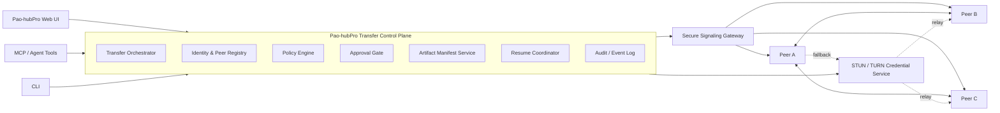
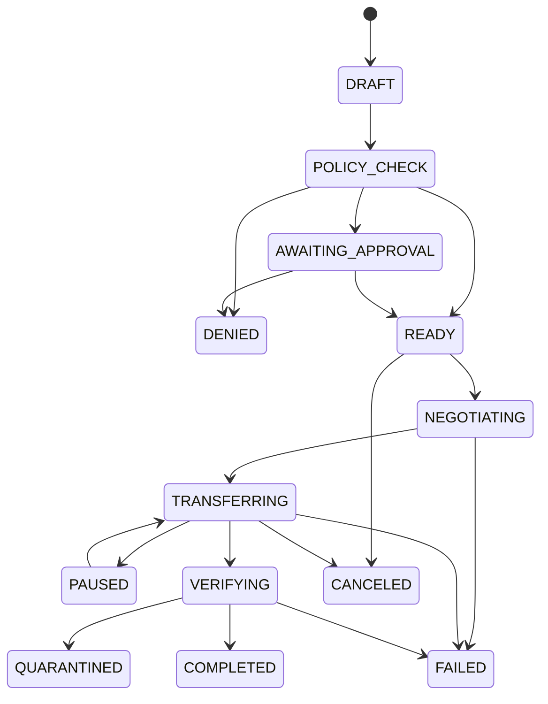

# Phase 20.87 — Pao-hubPro × FileSync

## Secure Peer-to-Peer Artifact Transfer Fabric, Native WebRTC Streaming, Resumable Multi-Device Distribution, Agent-to-Agent File Exchange, Integrity Verification & Policy-Governed Data Movement Plane

> **Project:** Pao-hubPro  
> **Phase:** 20.87  
> **Status:** Implementation Specification (restructured into the Pao-hubPro master 44-section blueprint)  
> **Mode:** Production-oriented / Adapter-wrapped upstream / Policy-governed / Fail-closed  
> **Primary upstream:** `polius/FileSync` (native WebRTC transfer) — **Production baseline: v4.1.0 pinned**; current `main` observed at API 4.2.0 (observe/test only, never auto-follow)  
> **License:** MIT (upstream)  
> **Target:** Pao-hubPro Data Movement Plane — Browser, Local PC, VPS, RunPod, NAS, Codex/Claude coding agents, GPU workers, ComfyUI pipeline, Adobe Stock asset pipeline  
> **Integration neighborhood:** Phase 20.74 (MCPProxy) → Phase 20.82 (CortexKit AFT) → Phase 20.86 (Capability Marketplace) → **Phase 20.87 (FileSync)**  
> **Core principle:** *Pao-hubPro = Identity + Policy + Approval + Audit + Orchestration. FileSync = WebRTC + Signaling + TURN + Browser streaming primitives. Control Plane and Data Plane are strictly separated; file bytes never enter the Control Plane in the normal path.*  
> **Source filename (preserved per master request §39):** `Phase 20.87 — Pao-hubPro × FileSync.md`  

---

### Verification & Decision Record (master request §1, §36, §38, §40)

**Verified against the attached source before restructuring:**
- Phase number and name: **20.87**, "Pao-hubPro × FileSync — Secure Peer-to-Peer Artifact Transfer Fabric, Native WebRTC Streaming, Resumable Multi-Device Distribution, Agent-to-Agent File Exchange, Integrity Verification & Policy-Governed Data Movement Plane" — matches the source title and frontmatter exactly.
- 60 source sections verified: executive decision (ADOPT WITH ADAPTER — no blind merge; reasons: upstream lacks enterprise/agent authorization, room/peer ids are not security identity, Pao must add durable resume/cryptographic hash/policy/approval/malware-DLP hooks/quota/audit/multi-agent automation), upstream facts (native WebRTC, WebSocket signaling at `/ws`, STUN/TURN NAT traversal, HTTPS streaming-to-disk, save strategy File System Access API → Service Worker → Blob fallback, one-to-many rooms, v4.1.0 hardening: strict CSP/filename sanitization/signaling payload validation/received byte count check, in-memory single-worker signaling registry requiring Redis/NATS backplane for scale, short-lived TURN credentials + JWT from server secret, MIT license, source URLs recorded), problem statement (hub-and-spoke transfer waste), 12 primary + secondary goals, non-goals (no Dropbox clone/no continuous folder sync/no backup/no permanent object storage/no auto-execution of received binaries), core architecture + control/data plane separation rule, repository layout with vendor pinning discipline (`vendor/filesync/VERSION|UPSTREAM.md|PATCHES.md`), peer identity model (4-way split: principal_id / node_id / peer_id / session_id with token binding requirements), trust zones (6 zones with zone-pair policy matrix), transfer lifecycle state machine (13 canonical states with mermaid diagram), artifact manifest (SHA-256 mandatory final hash; BLAKE3 chunk acceleration optional; byte-count ≠ cryptographic integrity), resumable protocol (4 MiB logical chunks / 64 KiB wire frames / 4–16 ack window / resume handshake / durable-resume capability matrix by runtime), backpressure and memory safety (`bufferedAmount` high-water-mark discipline), multi-device distribution (per-target queues, 4 distribution modes, partial-failure semantics), transport selection order (direct → TURN UDP → TURN TCP/TLS → future HTTPS relay), signaling gateway hardening (13 required controls + Redis/NATS scale-out), TURN credential service (short-lived JWT, TTL 300s), cryptographic security (DTLS/SCTP + signed manifest + optional AEAD application-layer envelope encryption X25519/HKDF/AES-256-GCM for external zones), filename/path safety (traversal, NUL, reserved names, unicode collisions, Zip Slip, symlink escape, decompression bomb), file classification (15 classes) with YAML policy example, approval gates (5 decision actions; agents cannot self-approve), quarantine pipeline (9-stage), hook registry (18 lifecycle hooks with fail-open/fail-closed/warn-only/retry semantics; security hooks default fail_closed), MCP tool contract (`artifact_transfer.*` namespace, 15 tools, policy bypass prohibited), REST API (18 endpoints + 2 WebSocket channels), PostgreSQL schema (9 tables with indexes; compact checkpoint rule — no row per wire frame), event model (25 canonical events, throttled progress), capability registry entry, agent skill registry, native agent (headless + CLI verbs), browser client capability detection, Web UI (dashboard cards, transfer rows, detail tabs, "Verifying integrity…" ≠ "Completed ✓" UX rule), Transfer Doctor diagnostics (16 checks, redacted export), observability (17 metrics, structured logs, never-log list), failure taxonomy (27 machine-readable error codes), retry policy per error class, data retention defaults, integration use cases (5), provenance chain, deployment topology (firewall baseline: 443/tcp, 3478/tcp+udp, 50000-50100/udp; secret management rules), Docker services (pinned versions, no floating latest), upstream upgrade strategy (9-step gated flow, no production auto-follow of main), security threat model (25 enumerated threats), test plan (unit/integration/E2E/large-file/browser matrix), load targets (regression gates, one-to-many stress), agent behavior rules, destination conflict policy (5 modes, never silent overwrite), destination path scope (allowed roots, symlink escape = deny), network cost governance (TURN budget caps), transfer scheduling, 14 sub-phases (20.87.0–20.87.13), required deliverables (27 items), acceptance checklist (architecture/security/transfer/integrity/governance/UX/operations), definition of done (16-step end-to-end scenario incl. mid-transfer network drop at ~37% + resume + forced TURN), rollback strategy (7 steps, never delete transfer DB), feature flags, conservative initial production policy, key design decisions table, `/gold` one-shot Codex contract, final recommendation (shared infrastructure capability), completion marker.
- No capability removed, truncated, or assumed. Upstream facts marked *verified at drafting (2026-09-18)* per source frontmatter; release pin v4.1.0 recorded.

**⚠ Phase numbering registry update:**
- **20.87** is officially assigned to this phase (Pao-hubPro × FileSync — Secure Peer-to-Peer Artifact Transfer Fabric). No collision in the current corpus.
- Standing ledger: **20.65** Litho-vs-Context-Mode collision remains unresolved (user decision pending); displaced recommendations *Business Opportunity Intelligence* and *Revenue Intelligence* remain at **20.88+** (previously 20.86+, now occupied by AI APIs You Can Ship Today).

**Implementation status annotation (2026-09-18):** NOT YET IMPLEMENTED in the Pao-hubPro repository. Phase 20.74 MCPProxy is operational (tool gating for `artifact_transfer.*`), Phase 20.82 AFT is production-closed (execution/repair layer), Phase 20.85 OmniRoute is hardened (governed inference), Phase 20.86 Capability Marketplace is specified (adapter admission pattern to reuse). This phase adds the shared **Data Movement Plane** as platform infrastructure.

**R0–R4 mapping note (decision):**
- The source defines governance through trust zones, approval gates, quarantine states, and policy profiles rather than an explicit numeric risk scale. Decision mapping onto R0–R4:
  - **R0 (Read-only):** `artifact_transfer.status`, `artifact_transfer.list`, `artifact_transfer.list_peers`, `artifact_transfer.diagnostics`, Transfer Doctor, metrics/dashboard reads, event timeline viewing.
  - **R1 (Low-risk local action):** manifest creation from local files within allowed roots, policy preflight evaluation, checkpoint serialization, peer registry queries, hash computation on local trusted artifacts.
  - **R2 (Reversible write):** transfer create/start/pause/resume/cancel within trusted zones (`ZONE_LOCAL_TRUSTED`, `ZONE_VPS_TRUSTED`) writing only within declared destination path scopes; checkpoint updates; quarantine release after passing scan hooks (policy-gated); destination `rename_with_suffix` / `content_addressed` writes.
  - **R3 (Sensitive operation — approval recommended):** external-zone transfers (`ZONE_EXTERNAL_APPROVED`), executable/script inbound (quarantine + approval required per policy), `overwrite` destination mode, TURN credential issuance above budget thresholds, `require_all` distribution to ephemeral GPU zones, `allow_metered_network` transfers.
  - **R4 (Destructive / privileged / external impact):** `secret_like` artifact outbound (deny by default — override is R4), disabling quarantine or scan hooks, auto-release of quarantined artifacts, unknown-peer allowance, production signaling backplane reconfiguration, destination `overwrite` on sensitive paths.
- Policy-enum mapping (note: the source natively includes a QUARANTINE admission state — preserved as a first-class outcome):
  - **ALLOW:** transfer sessions where policy evaluation passes, trust-zone matrix permits source→destination, budget/network caps satisfied, and the peer is authenticated and registered.
  - **DENY:** unknown peers, policy-denied classification (e.g. `secret_like` outbound), path-scope/symlink-escape violations, expired or replayed tokens, TURN budget exceeded, destination conflict under `fail_if_exists`.
  - **REQUIRE_APPROVAL:** executable/script/model inbound from external or ephemeral zones, TURN sessions above `require_approval_over_gb`, transfers with `allow_metered_network`, any policy-mandated approval gate — agents can never self-approve.
  - **QUARANTINE:** all untrusted inbound artifacts land in the quarantine pipeline (temp path → hash verify → MIME sniff → archive safety → malware scan hook → DLP/secret scan hook → policy re-evaluation → release) before touching any production workspace; security hooks default `fail_closed`.

---

## 1. Executive Summary

Phase 20.87 gives Pao-hubPro a **Data Movement Plane**: a policy-governed fabric for moving large files and artifacts between every execution surface the platform operates — Browser agents, local workstations, VPS nodes, RunPod/GPU workers, NAS storage, Codex/Claude coding agents, ComfyUI pipelines, and the Adobe Stock asset pipeline.

Today, inter-node artifact transfer degenerates into hub-and-spoke uploads through a central server: duplicated upload/download, wasted VPS bandwidth, added latency, accumulated temporary storage, an enlarged secret/asset exposure surface, per-agent bespoke integrations, non-standard retry/resume, and audit gaps. Phase 20.87 replaces this with a transport abstraction:

```text
Intent → Policy → Approval if required → Peer negotiation
→ Direct WebRTC when possible → TURN relay when required
→ Streaming receive → Integrity verify
→ Post-receive policy / quarantine → Artifact available
```

The implementation adopts `polius/FileSync` **as an adapter-wrapped upstream transport component** (production-pinned at v4.1.0) beneath a new Pao-hubPro **Transfer Control Plane** that owns identity (principal/node/peer/session split), policy, approval, manifests, resumable checkpoints, quarantine, audit, and observability. The upstream's WebRTC/TURN/signaling/streaming strengths are kept; its lack of enterprise authorization is compensated entirely inside the Control Plane. Transfer sessions are state-machined across 13 canonical states, verified by final SHA-256 (byte-count is necessary but never sufficient), resumable from durable checkpoints (native agents first-class), distributable one-to-many with independent per-target backpressure, and fully audited from request to completion, failure, or quarantine.

## 2. Problem Statement

Pao-hubPro operates many execution surfaces — local workstation, VPS, browser agents, Codex/Claude coding agents, RunPod/GPU workers, ComfyUI pipeline, Adobe Stock asset pipeline, Remote Desktop Commander, build/review/test agents, and future NAS nodes. Artifact movement between them currently funnels through a central server:

```text
Node A → upload → Central Server/Cloud Storage → download → Node B
```

Consequences: duplicated uploads/downloads; wasted VPS bandwidth; increased latency; multi-GB files forced through the central hop; temporary storage accumulation; a wider secret/asset exposure surface; bespoke integrations per agent; non-standard retry/resume semantics; and difficult-to-reconstruct audit ("who sent what, where, and did it arrive intact?"). Phase 20.87 eliminates the forced central hop with peer-to-peer transport while adding the governance layer upstream transfers lack.

## 3. Goals

**Primary:**
1. Peer-to-peer artifact transfer as the default when the network allows.
2. Automatic TURN relay fallback when direct paths fail.
3. Multi-GB files without buffering the whole artifact in RAM (bounded-memory streaming).
4. Interrupted transfers resume from checkpoints (durable on native agents).
5. One sender to many concurrent targets.
6. Browser↔Browser, Browser↔Agent, Agent↔Agent exchange.
7. Mandatory identity, capability, policy, and approval checks before transfer.
8. Cryptographic integrity verification after receipt.
9. Complete audit trail from request to completion/failure.
10. Exposure via Web UI, REST, MCP, and CLI.
11. Direct compatibility with ComfyUI / RunPod / Adobe Stock / build pipelines.
12. Local-first, self-hosted deployment.

**Secondary:** bandwidth shaping; per-peer concurrency limits; transfer priority; pause/resume; transfer expiration; temporary room/session links; signed artifact manifests; trusted device registry; quarantine workflow; observability metrics; upstream compatibility testing.

## 4. Non-Goals

Phase 20.87 is NOT: a Dropbox clone; a Syncthing replacement; continuous two-way folder synchronization; source control; a backup system; permanent object storage; a secret manager; public anonymous file hosting; or an automatic executor of received binaries. Folder-watcher/sync needs belong to a separate phase that may use 20.87 as its transport layer.

## 5. Why This Phase Exists

Every Pao-hubPro surface that produces or consumes artifacts — build agents emitting `build.zip`, GPU workers rendering media, ComfyUI batches feeding Stock QC, model distribution to worker fleets, Remote Desktop Commander shipping diagnostics — currently invents its own upload/download path. Each bespoke path re-implements auth, retry, integrity, and audit differently, and all of them pay the central-server bandwidth tax. The platform lacks a single primitive for "move this artifact from an authorized producer to authorized consumers, safely, resumably, and provably." Phase 20.87 supplies that primitive once, as shared infrastructure, so Build, Review, RunPod, ComfyUI, Adobe Stock, model distribution, logs, diagnostics, and future agent fleets plug in immediately.

## 6. Relationship to Pao-hubPro (and Existing Phases)

- **Phase 20.74 MCPProxy:** the `artifact_transfer.*` tool namespace (15 tools) registers through MCPProxy; MCP calls traverse the same policy/approval gates as REST/UI — no bypass path exists.
- **Phase 20.82 AFT (production-closed):** AFT is the execution/repair layer for adapter code and transfer service fixes; its transactional workspace model complements transfer quarantine (received artifacts are never auto-executed — AFT human-approved tasks are the only path to execution).
- **Phase 20.85 OmniRoute (hardened):** precedent for adapter-wrapped upstreams (kill switch, doctor, pinning) — FileSync adoption follows the same pattern (pin v4.1.0, adapter boundary, upgrade gate). OmniRoute routes *inference*; 20.87 routes *artifacts* — separate planes, shared governance style.
- **Phase 20.86 Capability Marketplace (specified):** the capability registry entry (`artifact-transfer`) and adapter-manifest lifecycle follow the 20.86 admission pattern; a future listing can publish the transfer capability through the same supply chain.
- **Identity/Policy/Approval/Audit core:** the Transfer Control Plane composes existing Pao-hubPro primitives rather than duplicating them (per master §6: Extend > Integrate > Replace).
- **Layer mapping (master §5):** 04 Orchestration (Transfer Orchestrator), 05/06 Gateway+Registry (peer registry, capability entry), 07 Policy Engine, 08 Approval, 09/10/11 Execution runtimes (browser/native/VPS/GPU clients), 12 State (checkpoints), 15 Event layer (signaling + backplane), 16 Observability, 17 Audit, 19 Dashboard.

## 7. Upstream / External Project

| Layer | Content |
| --- | --- |
| A. Upstream | `polius/FileSync` — native WebRTC browser transfer; WebSocket signaling at `/ws`; STUN/TURN traversal; streaming-to-disk over HTTPS (memory-safe vs Blob fallback); save strategy: File System Access API → Service Worker → Blob fallback; one-to-many rooms; v4.1.0 hardening (strict CSP, filename sanitization, signaling payload validation, received-byte-count check); in-memory single-worker signaling; short-lived TURN credentials + server-secret JWT; MIT. Sources of truth: repo `github.com/polius/FileSync`, release v4.1.0 (`releases/tag/v.4.1.0`), `api/main.py`, `api/signaling.py`, `web/js/modules/webrtc`. |
| B. Pao-hubPro Adapter | Transfer Control Plane (orchestrator, identity, policy, approvals, manifests, resume coordinator, audit) + Secure Signaling Gateway (identity-aware) + TURN credential service + browser/native clients. Upstream consumed behind a clean adapter boundary. |
| C. Policy Wrapper | Trust-zone matrix, classification policy YAML, approval gates, quarantine hooks, network cost caps, destination conflict policy, path scopes. |
| D. Extensions | Durable resume (native), multi-target distribution modes, provenance chain, envelope encryption (external zones), Transfer Doctor diagnostics, scheduling/priority, MCP/CLI surfaces. |
| Upgrade discipline | `vendor/filesync/{VERSION,UPSTREAM.md,PATCHES.md}`; every patch logged (upstream commit, reason, files, security implication, upstreamable?, regression tests); upgrades flow through compatibility branch → license/security review → unit tests → upstream e2e equivalent → Pao transfer e2e → forced-TURN → resume → security regression → manual approval → re-pin. Production never auto-follows `main` (observed API 4.2.0 there). |

## 8. Current-State Assumptions

- **NOT implemented in the repo** — everything in this blueprint is to be built (verified against repository state 2026-09-18; no `transfer-*` services, no `artifact_transfer.*` MCP namespace, no transfer DB tables exist).
- Pao-hubPro runtime is Bun-native TypeScript with SQLite (`agent-os.sqlite3` v56); the source targets PostgreSQL as canonical with SQLite as local-dev adapter — **Assumption:** implement against the existing SQLite layer first with schema-contract parity, keeping the PostgreSQL DDL as the canonical reference for VPS deployments. *(Needs Verification at implementation time.)*
- Existing identity/policy/approval/audit/MCP primitives are reusable per source §89 repository-first rules (verified: policy engine, approvals table, MCP gateway with risk tiers, management routes, dashboard all exist).
- STUN/TURN infrastructure (coturn) is not yet deployed; the compose stack adds it (pinned image).
- Browser fleet: Chrome/Edge/Firefox/Safari per source §43.5 matrix; File System Access API availability varies — runtime capability detection is mandatory, not assumed.

## 9. Target Architecture

**Executive decision: ADOPT WITH ADAPTER.** FileSync is the transport reference + upstream transport component; Pao-hubPro builds the Transfer Control Plane above it.

```text
Pao-hubPro = Identity + Policy + Approval + Audit + Orchestration
FileSync    = WebRTC + Signaling + TURN integration + Browser streaming primitives
```

Rationale (source §0): upstream excels at browser-to-browser native WebRTC and streaming-to-disk/TURN fallback (RAM/server savings); upstream is not an enterprise/agent authorization system; room/peer ids are not security identity; Pao must add durable resume, cryptographic hash, policy decision, approval, malware/DLP hooks, quota, audit, and multi-agent automation itself; an adapter boundary tracks upstream updates better than scattered core patches.

**Architectural rule — Control Plane / Data Plane separation (mandatory):**
- *Control Plane:* authentication, authorization, peer identity, policy, transfer creation, approval, manifest, signaling authorization, TURN credential issuance, lifecycle, audit, metrics.
- *Data Plane:* WebRTC DataChannel, chunk/frame transport, congestion/backpressure, direct P2P, TURN relay, stream-to-disk, resume retransmission.
- The Control Plane never receives file bytes in the normal path.

## 10. Architecture Diagram



Transfer lifecycle:



## 11. Core Components

1. **Transfer Orchestrator** — session lifecycle across 13 canonical states (`DRAFT, POLICY_CHECK, AWAITING_APPROVAL, READY, NEGOTIATING, TRANSFERRING, PAUSED, VERIFYING, QUARANTINED, COMPLETED, FAILED, DENIED, CANCELED, EXPIRED`); UI/MCP may never invent ad-hoc states.
2. **Identity & Peer Registry** — 4-way identity split: `principal_id` (user/agent), `node_id` (device/runtime, persistent), `peer_id` (ephemeral WebRTC endpoint), `session_id` (transfer session). Peer registration requires signed auth tokens binding `principal_id, node_id, peer_id, aud, exp, nonce` (default TTL ≤ 5 min for signaling/TURN bootstrap); peer takeover only via same identity/device or explicit recovery; knowing a peer id alone never kicks another peer.
3. **Trust Zone Matrix** — `ZONE_LOCAL_TRUSTED, ZONE_VPS_TRUSTED, ZONE_GPU_EPHEMERAL, ZONE_BROWSER_AUTHENTICATED, ZONE_EXTERNAL_APPROVED, ZONE_UNKNOWN`; zone-pair policy: local→local allow; local→GPU allow-with-manifest; GPU→local scan+verify; browser→local scan; external→local approval+quarantine; unknown→any deny.
4. **Artifact Manifest Service** — mandatory pre-transfer manifest (`manifest_version, transfer_id, artifact_id, name, size_bytes, mime_claimed/detected, sha256, source{principal,node}, classification, sensitivity, executable, archive, retention, metadata`); hash policy: final artifact SHA-256 mandatory, per-chunk SHA-256 or BLAKE3 acceleration, upstream byte-count retained but never a substitute for cryptographic integrity.
5. **Resumable Protocol + Resume Coordinator** — 4 MiB logical chunks / 64 KiB wire frames / 4–16 chunk ack window (all configurable); frame envelope (`v, type, transfer_id, artifact_id, chunk_index, frame_index, offset, length, flags`); receiver `resume_state` handshake (total_chunks, verified_chunks, contiguous_offset); sender validates identity, compares manifest/hash/size, rejects resume on artifact change, resends only missing chunks; durable-resume capability matrix honestly surfaced per runtime (native: full; Chromium FSA: conditional revalidation; SW stream: within live flow; Blob: limited/no).
6. **Secure Signaling Gateway** — authenticated WebSocket upgrade, token audience/expiry/nonce-replay checks, peer-id binding, session membership, rate limiting, max payload, strict schema, idle timeout, capacity guard, origin/host validation, structured security logs; horizontal scale via Redis Streams/PubSub or NATS backplane (`peer_id → gateway_instance`, `session_id → authorized_peer_ids`), never process-local registry in production.
7. **TURN Credential Service** — short-lived credentials only (JWT claims `sub, transfer_id, aud=turn, exp, jti`; TTL default 300 s); issuance only after policy allow; rate-limited; signing secret rotated; raw credentials never logged; no long-lived static TURN user/password exposed to clients.
8. **Quarantine Pipeline** — receive → temp quarantine path → hash verify → MIME sniff → archive safety (Zip Slip, symlink escape, decompression bomb, file-count, nested-archive recursion) → malware scan hook → DLP/secret scan hook → policy re-evaluation → release to destination. Untrusted inbound never writes directly to production workspaces.
9. **Hook Registry** — 18 lifecycle hooks (`transfer.before_create … transfer.quarantined`) with a uniform event contract (`event_id, event_type, transfer_id, artifact_id, principal_id, node_id, timestamp, payload`) and per-hook failure semantics (`fail_open | fail_closed | warn_only | retry`); security hooks default `fail_closed`.
10. **Native Agent Client** — headless Agent-to-Agent runtime: node registration, authentication, signaling channel, RTCPeerConnection/DataChannel, safe streaming file write, persistent checkpoints, restart recovery, final hash verify, quarantine integration, metrics; CLI: `pao transfer send|status|pause|resume|cancel|verify|doctor`.
11. **Browser Client** — runtime capability detection (`fileSystemAccess, serviceWorker, secureContext, webrtc, resumeTier, maxRecommendedSize`); non-secure contexts warn and disable large-file production workflows; Blob fallback carries explicit size limits.
12. **Transfer Doctor** — evolved from upstream `/test.html`: 16 checks (HTTPS context, signaling WS, STUN, TURN UDP/TCP-TLS, ICE candidate types, DataChannel, max message probe, FSA/SW support, disk write, token issuance, policy endpoint, clock skew, peer registration, direct-vs-relay route) with PASS/WARN/FAIL and a redacted diagnostic-bundle export (secrets, raw tokens, passwords, sensitive paths, private filenames removed).

## 12. Component Responsibilities

| Component | Owns | Must never |
| --- | --- | --- |
| Orchestrator | canonical state machine, session lifecycle | accept ad-hoc states from UI/MCP |
| Identity & Peer Registry | principal/node/peer/session binding | treat peer_id or room id as security identity |
| Policy Engine | zone-matrix + classification decisions | run after transfer starts |
| Approval Gate | human decision enforcement | let agents self-approve |
| Manifest Service | size/hash/classification claims | trust client-claimed hash without verify |
| Resume Coordinator | checkpoint bitmap/ranges, artifact-change invalidation | persist a row per wire frame |
| Signaling Gateway | identity-aware message relay | relay unauthenticated or oversized payloads |
| TURN Service | short-lived scoped credentials | issue before policy allow; log credentials |
| Quarantine Pipeline | untrusted-inbound isolation | write unverified artifacts to production paths |
| Backpressure controller | `bufferedAmount` high-water-mark discipline | aggregate multi-GB artifacts in memory |
| Distribution manager | per-target queues + modes | let the slowest target stall all targets |

## 13. Data Flow

```text
Sender: intent → manifest (path scope check → SHA-256 → classification) 
  → policy preflight → (approval) → session READY
  → signaling (authenticated) → ICE negotiation → route selected (direct_lan/wan, turn_udp/tcp/tls)
  → logical chunks → wire frames (backpressure-aware) → acks → checkpoints
Receiver: resume_state → missing-chunk request → sequential stream-to-disk 
  → final size + SHA-256 verify → (quarantine pipeline if untrusted) → release → COMPLETED
Events: every transition emits a canonical event; progress throttled 500 ms–2 s.
```

## 14. Control Flow (+ R0–R4 Mapping)

```text
Request → Identity (principal/node/peer token validation) 
→ Capability Resolution (destination node, path scope)
→ Policy Evaluation (zone matrix + classification policy)
→ Risk Classification (artifact class, zones, size, route)
→ Approval Check (human gates where policy requires)
→ Execution (negotiate → transfer → verify)
→ Result Validation (size + SHA-256; scan hooks)
→ Audit (route, bytes, resume events, policy reason, hash result)
```

| Operation | Risk | Enum |
| --- | --- | --- |
| status/list/peers/diagnostics/doctor | R0 | ALLOW |
| manifest build, policy preflight, local hash compute | R1 | ALLOW |
| trusted-zone transfer create/start/pause/resume/cancel; checkpoint write; scan-passed quarantine release | R2 | ALLOW (audited) |
| external-zone transfer; executable/script/model inbound; `overwrite` destination mode; TURN issuance above `require_approval_over_gb`; metered-network transfers | R3 | REQUIRE_APPROVAL |
| `secret_like` outbound; disable quarantine/scan hooks; auto-release quarantined artifacts; unknown-peer allowance; backplane reconfiguration | R4 | DENY unless explicitly human-approved |

## 15. Agent / Worker Model

- **Transfer Orchestrator** = worker (stateless per session transition; DB-backed state).
- **Signaling Gateway instances** = stateless relays with backplane coordination.
- **Probe/Scan Workers** = quarantine hook executors (malware, DLP/secret scan) with bounded time.
- **Native Agent / Browser Client** = peers (data-plane endpoints, not authorities).
- **Human Operator** = approval authority (R3/R4), admission of external zones, quarantine release for blocked scans.
- Clear separation (master §8): *Agent* requests transfers; *Worker* executes transport; *Task/Session* = transfer session (`session_id`); *Run* = one target attempt (`transfer_target`); *Capability* = `artifact-transfer` registry entry; *Artifact* = the manifest-bound file. Ownership: agents own their intents; the Control Plane owns sessions and state; peers own only their local file I/O.

## 16. Session / State Model

Canonical 13-state machine (§10 diagram) with: `EXPIRED` (session TTL via `expires_at`), per-target sub-states in `transfer_targets` (state, route_type, bytes_sent/received, resumed_bytes, retry_count, error_code), compact checkpoints (bitmap/range/high-water-mark — **never one DB row per wire frame**), and distribution-mode result semantics: session-level `COMPLETED` only when the mode's condition succeeds (`best_effort_all | require_all | require_quorum | selected_targets`); `require_all` with one failed target ⇒ session `FAILED_PARTIAL`/`FAILED` per policy — sender completion alone never implies target completion. Persistence: sessions/checkpoints survive orchestrator restarts; native-agent resume works across process restarts; browser resume honestly reported per capability tier.

## 17. MCP Integration

Namespace `artifact_transfer` (15 tools): `create, add_target, prepare, start, accept, pause, resume, cancel, status, list, list_peers, verify, release, retry_target, diagnostics`. Example create: `{source_path: "/workspace/dist/build.zip", targets: ["node:test-01"], classification: "build_artifact", distribution_mode: "require_all", expires_in_seconds: 3600}` → response includes `{transfer_id, state: "AWAITING_APPROVAL", policy: {decision: "approval_required", reason: …}}`. **MCP must never bypass the policy endpoint.** Registration through Phase 20.74 MCPProxy with risk tiers (status/list/diagnostics = R0; create/start = R2 within trusted scope; release from quarantine = R2 only post-scan; no R3/R4 operations exposed to autonomous agents). Agent skill `pao.artifact-transfer` constrains: never bypass policy, never auto-release quarantined artifacts, never send `secret_like` artifacts, explicit path scope required.

## 18. Capability Registry

```yaml
capability:
  id: artifact-transfer
  phase: "20.87"
  name: Secure P2P Artifact Transfer
  category: data-movement
  transports: [webrtc-direct, webrtc-turn]
  runtimes: [browser, native-agent, vps-agent, gpu-worker]
  operations: [send, receive, distribute, resume, verify, quarantine]
  governance: {policy_required: true, approval_supported: true, audit_required: true}
```

Skill registry entry `pao.artifact-transfer` v1 with allowed_tools subset (create, add_target, start, status, pause, resume, cancel, verify) and the four constraints listed in §17. This entry follows the Phase 20.86 adapter-manifest admission pattern for future marketplace listing.

## 19. Policy Model

Classification vocabulary: `image, video, audio, archive, source_code, build_artifact, model, lora, dataset, document, executable, script, secret_like, unknown`. Policy YAML (illustrative, configurable):

```yaml
transfer_policy:
  defaults: {max_file_size_gb: 50, require_hash: true, require_manifest: true, unknown_peer: deny}
  executable: {inbound: {approval: required, quarantine: required, scan: required}}
  script:     {inbound: {approval: required_if_external, scan: required}}
  image:      {inbound: {approval: automatic_if_trusted, scan: metadata_and_mime}}
  model:      {inbound: {max_file_size_gb: 100, approval: required_if_external}}
  secret_like: {outbound: {action: deny}}
```

Destination conflict policy: `fail_if_exists` (default, sensitive paths) / `rename_with_suffix` (safe download) / `overwrite` (explicit policy only) / `content_addressed` (artifact cache) / `versioned` (pipeline output) — **never silently overwrite**. Destination path scope: native agents receive `transfer_roots` (`inbound: /srv/pao/inbox, /srv/pao/artifacts; outbound: /srv/pao/exports, /workspace/builds`); paths canonicalize before authorization; symlink escape = deny. Network cost governance: `prefer_direct: true`; TURN budgets `max_session_gb: 50, max_daily_gb: 500, require_approval_over_gb: 100`; concurrency `per_peer: 3, global: 20`; dashboard shows direct bytes / TURN bytes / estimated relay cost. Scheduling: `priority 0–100 (critical, interactive, normal, bulk, background), not_before, expires_at, bandwidth_limit, allow_metered_network`.

## 20. Security Model

- **Transport:** HTTPS/WSS in production; WebRTC DTLS/SCTP encryption; TLS termination at reverse proxy.
- **Identity:** signed short-lived tokens (≤5 min bootstrap TTL) binding principal/node/peer/aud/exp/nonce; replay protection; peer takeover prevention across identities.
- **Integrity:** signed manifest + announced-size check + final SHA-256 (upstream byte-count kept as auxiliary signal).
- **TURN:** short-lived JWT credentials (300 s), rotated secret, rate-limited issuance, policy-gated, never logged.
- **Signaling:** schema-validated payloads, rate limits, payload caps, origin/host validation, structured security logs.
- **Filename/path:** reject/sanitize `../`, `..\\`, absolute paths, NUL/control chars, reserved device names, remote path separators, trailing-dot ambiguity, unicode-normalization collisions; archive extraction guards (Zip Slip, symlink escape, decompression bomb, excessive count, nested recursion); received artifacts never auto-open/auto-execute.
- **Optional application-layer envelope encryption for external/untrusted zones:** X25519 key agreement (or device public keys) → HKDF-SHA-256 → AES-256-GCM or XChaCha20-Poly1305, per-transfer data key, key never persisted in transfer logs; MVP scope: mandatory E2EE for external zone only, expanding later.
- **Network isolation:** egress-controlled adapter runtime; approved domains only for unknown endpoints (where architecture allows).
- **25-threat model enumerated for testing** (source §42): peer-id takeover, stolen/replayed tokens, session guessing, malicious SDP/ICE, signaling flood, oversized payloads, path traversal, unicode filenames, archive traversal, bombs, source-change-after-manifest, truncation, bit corruption, fake completion, checkpoint forgery, stale checkpoints, cross-tenant injection, TURN abuse, disk exhaustion, Blob memory exhaustion, log leakage, compromised relay/signaling, unauthorized quarantine release.

## 21. Approval Model

Approval object: `{transfer_id, policy_reason, requested_by, approver_role, expires_at, decision: pending}`. Actions: `approve_once, approve_session, reject, quarantine_only, request_changes`. Rules: agents can never approve their own transfers when policy specifies human approval; approvals expire; `quarantine_only` releases to quarantine without production access. Approval wait time is a tracked metric (`transfer_approval_wait_seconds`). MCP/CLI/UI traverse the identical gate — no bypass path.

## 22. Failure Handling

27-code machine-readable + human-readable taxonomy: `AUTH_FAILED, TOKEN_EXPIRED, POLICY_DENIED, APPROVAL_REQUIRED, APPROVAL_REJECTED, PEER_OFFLINE, PEER_UNAUTHORIZED, SIGNALING_FAILED, ICE_FAILED, TURN_FAILED, DATA_CHANNEL_FAILED, SOURCE_FILE_CHANGED, SOURCE_FILE_MISSING, DESTINATION_DENIED, DISK_FULL, WRITE_FAILED, READ_FAILED, HASH_MISMATCH, SIZE_MISMATCH, CHECKPOINT_INVALID, RESUME_UNSUPPORTED, TRANSFER_EXPIRED, TRANSFER_CANCELED, QUARANTINED, SCAN_FAILED, RATE_LIMITED, PROTOCOL_MISMATCH`. Retry policy per class: `PEER_OFFLINE/SIGNALING_FAILED` → backoff retry (exponential + jitter); `ICE_FAILED` → retry then TURN; `TURN_FAILED` → limited retry; `HASH_MISMATCH` → **no blind retry** (quarantine/fail); `POLICY_DENIED` → no retry; `DISK_FULL` → pause requiring intervention; `TOKEN_EXPIRED` → refresh while session valid; `SOURCE_FILE_CHANGED` → invalidate manifest, restart authorization. Failure must never corrupt the capability registry or lose checkpoint state.

## 23. Recovery Model

- Network drop → resume from compacted checkpoints (missing/unverified chunks only).
- Sender/receiver process restart (native) → durable resume from persisted checkpoints.
- Peer death → per-target retry with backoff; other targets unaffected (independent queues).
- Orchestrator restart → sessions recovered from DB state machine; no in-memory-only state.
- Disk full → `DISK_FULL` pause + human intervention; partial writes cleaned per retention policy.
- Corrupt/truncated artifact → `HASH_MISMATCH`/`SIZE_MISMATCH` → quarantine/fail; source-change invalidates resume and restarts authorization.
- Rollback (phase-level, source §54): disable `artifact_transfer.enabled=false` → stop new sessions → let active safe sessions finish or cancel by policy → revert service image tags → keep DB migrations backward-compatible ≥1 version → fall back to existing upload mechanism → preserve audit/events. **Never roll back by deleting the transfer database.**

## 24. Observability

17 metrics: `transfer_sessions_total, transfer_sessions_active, transfer_bytes_total, transfer_failures_total, transfer_resume_total, transfer_resumed_bytes_total, transfer_integrity_failures_total, transfer_policy_denials_total, transfer_approval_wait_seconds, transfer_duration_seconds, transfer_speed_bytes_per_second, transfer_route_total{route=direct|turn}, transfer_turn_bytes_total, transfer_peer_connections, transfer_signaling_messages_total, transfer_signaling_rate_limited_total, transfer_quarantine_total`. Plus transfer-buffer internals (`transfer_buffered_bytes, transfer_inflight_frames, transfer_memory_bytes, transfer_disk_write_latency_ms`). Structured JSON logs (example: `{event: "transfer.target.completed", transfer_id, target_id, bytes, route: "direct_wan", duration_ms, hash_verified: true}`). **Never logged:** TURN password, access tokens, envelope data keys, file contents, raw secret-scanner findings. Load regression gates (targets, not guarantees): Control-Plane API p95 < 300 ms (excluding bytes); signaling relay p95 < 150 ms same-region; direct transfer overhead low single-digit %; Control-Plane RAM independent of file size; browser streaming RAM bounded; resume retransmits only missing chunks.

## 25. Audit

Event model (25 canonical events, `transfer_events` table): `transfer.created, policy.allowed, policy.denied, approval.requested/approved/rejected, peer.connected/disconnected, route.direct, route.turn, started, progress (throttled 500 ms–2 s), checkpoint, paused, resumed, verify.started/passed/failed, quarantined, released, target.completed, target.failed, completed, failed, canceled, expired`. Each event: timestamp, actor, correlation ID, transfer/target/artifact IDs, decision, reason, policy rule IDs, safe metadata. Retention: active checkpoints until complete + 24 h; event detail 30–90 days; security audit 180–365 days; TURN credentials and plaintext data keys **never persisted**; quarantine files per policy TTL. Audit is separate from debug logs; secret redaction scrubbing applies to all emitters.

## 26. Data Model

PostgreSQL canonical (SQLite adapter for local dev, schema-contract parity):

```sql
transfer_peers (id, node_id UNIQUE, principal_id, display_name, trust_zone,
                runtime_type, capabilities_json, last_seen_at, revoked_at)
transfer_sessions (id, requested_by, source_peer_id, state, distribution_mode,
                   priority, expires_at, policy_snapshot, started_at, completed_at, canceled_at)
transfer_artifacts (id, transfer_id, name, size_bytes, mime_claimed, mime_detected,
                    classification, sensitivity, sha256, chunk_size_bytes, total_chunks,
                    source_path_hint, manifest_json)
transfer_targets (id, transfer_id, artifact_id, target_peer_id, state, route_type,
                  bytes_sent, bytes_received, resumed_bytes, retry_count, error_code,
                  UNIQUE(transfer_id, artifact_id, target_peer_id))
transfer_checkpoints (id, transfer_target_id UNIQUE, contiguous_offset,
                      verified_chunks BYTEA, checkpoint_version)
transfer_policy_decisions (id, transfer_id, decision, reason_code, policy_version,
                           input_snapshot, output_snapshot)
transfer_approvals (id, transfer_id, requested_by, required_role, decided_by,
                    decision DEFAULT 'pending', expires_at)
transfer_events (id, transfer_id, artifact_id, target_id, event_type, severity, payload_json)
```

Indexes: `sessions(state)`, `sessions(created_at DESC)`, `targets(state)`, `events(transfer_id, created_at)`. **DB rule: checkpoints compact to bitmap/range/high-water-mark — never insert per wire frame.**

## 27. API / Event Contracts

REST: `POST/GET /api/v1/transfers`, `GET /api/v1/transfers/{id}`, `POST …/targets|prepare|approve|reject|start|pause|resume|cancel|verify|release`, `GET …/events`, `GET /api/v1/peers`, `GET /api/v1/peers/{id}`, `GET /api/v1/transfer-diagnostics`, `WS /api/v1/transfer-events`, `WS /api/v1/signaling`. TURN credential endpoint is internal-only (never anonymous). MCP tools per §17; CLI verbs per §11.10. Provenance chain metadata: `{artifact_id, parent_artifact_ids, producer, pipeline, pipeline_run, source_hash, transform}` so Pao-hubPro knows which pipeline produced a file and which nodes carried it. Error contract: all 27 taxonomy codes machine-readable + human-readable.

## 28. Configuration

```yaml
features:
  artifact_transfer:
    enabled: true
    browser_client: true
    native_agent: true
    durable_resume: true
    multi_target: true
    forced_turn: true
    quarantine: true
    application_layer_e2ee: false      # enable for external zone first
    external_zone: false

production_defaults:
  https_only: true
  direct_p2p: true
  turn_fallback: true
  unknown_peer: deny
  external_transfer: deny
  max_file_size_gb: 20
  max_targets: 5
  require_sha256: true
  require_manifest: true
  executable_inbound: quarantine_and_approval
  archive_inbound: scan
  secret_like_outbound: deny
  native_resume: true
  browser_resume: capability_dependent
```

Conservative-first rollout: raise size limits and enable external zones only after metrics stabilize.

## 29. Feature Flags

`artifact_transfer.enabled` (master kill switch), `browser_client`, `native_agent`, `durable_resume`, `multi_target`, `forced_turn`, `quarantine`, `application_layer_e2ee` (default false), `external_zone` (default false). Per-capability incremental rollout supported; every flag maps to an immediate-rollback lever (source §54) without redeploy where config allows.

## 30. Repository Structure

```text
apps/web/src/features/transfers/   # TransferDashboard, Create, Details, PeerPicker,
                                   # ApprovalPanel, Diagnostics
services/transfer-control-plane/   # api, orchestration, policy, approvals, manifests,
                                   # resume, events
services/transfer-signaling/       # websocket, auth, peer-registry, redis-backplane
services/transfer-scanner/         # quarantine scan hooks
packages/transfer-sdk/             # shared client SDK
packages/transfer-protocol/        # frame/manifest/checkpoint protocol types
packages/transfer-policy-types/
packages/transfer-client-browser/
packages/transfer-client-native/
packages/mcp-transfer/             # MCP tool wiring
infra/filesync/                    # docker-compose(.prod).yml, Caddyfile, coturn/, README
vendor/filesync/                   # VERSION, UPSTREAM.md, PATCHES.md (pin discipline)
tests/transfer/                    # e2e, load, security, compatibility
```

Adapted to Bun monorepo conventions at implementation time (master §18: inspect repo first; no duplicate frameworks). Docker services pinned: `pao-hubpro/transfer-control`, `transfer-signaling`, `coturn/coturn:<pinned>`, `redis:<pinned>`, `caddy:<pinned>` — no floating `latest` in production.

## 31. Dashboard Integration

Apple-like, information-dense Web UI (source §31): **Dashboard cards** (Active Transfers, Queued, Awaiting Approval, Failed, Quarantined, Transferred Today, Direct P2P Ratio, TURN Relay Ratio); **transfer rows** (filename, source/target nodes, size, progress, speed, ETA, route direct/TURN, state, integrity state, policy state, approval state); **detail tabs** (Overview, Targets, Manifest, Policy, Integrity, Network, Events, Diagnostics); **network panel** showing direct/TURN bytes + estimated relay cost (source §48). Binding UX rule: bytes-delivered-but-hash-unverified renders **"Verifying integrity…"**, never "Completed ✓" — completion only after receiver verification. Diagnostics view embeds Transfer Doctor with redacted bundle export.

## 32. Dependencies

**Required:** Pao identity/policy/approval/audit core; SQLite/PostgreSQL persistence layer; signaling infrastructure (WS + coturn); Phase 20.74 MCPProxy (tool registration).
**Recommended:** Phase 20.82 AFT (safe artifact consumption/execution); Phase 20.86 Capability Marketplace (capability listing + adapter manifest pattern); Phase 20.85 OmniRoute (governance pattern precedent); ComfyUI/RunPod/Adobe Stock pipelines (primary consumers).
**Optional:** Redis/NATS (only for horizontal signaling scale; single-instance guard acceptable initially), malware/DLP scanners (hook-based; absent scanners = `fail_closed` or `warn_only` per config).
**Standalone path:** the Control Plane + signaling + coturn compose stack runs self-hosted without any other Pao phase; UI/CLI/MCP are additive consumers.

## 33. Compatibility

- Adapter boundary keeps upstream FileSync replaceable; no fork drift (PATCHES.md discipline).
- Existing Pao-hubPro workflows preserved; the transfer plane is additive (new tables, new services, new flags).
- Existing artifact-upload mechanisms remain as rollback path during rollout.
- MCP tools follow 20.74 conventions; dashboard follows repo GUI/i18n conventions.
- Backward compatibility of DB migrations maintained ≥1 version (rollback rule).

## 34. Migration

Additive DB migration only (new `transfer_*` tables; zero alteration of existing tables). Sub-phase order enforces safe landing: 20.87.0 ADR/pin → 20.87.1 domain model/schema/state machine → 20.87.2 identity-aware signaling → 20.87.3 WebRTC transport adapter → 20.87.4 native agent → 20.87.5 resumable protocol → 20.87.6 multi-target → 20.87.7 integrity/quarantine → 20.87.8 policy/approval → 20.87.9 MCP/CLI → 20.87.10 dashboard → 20.87.11 observability → 20.87.12 security/E2E/load tests → 20.87.13 production rollout (staging → canary → runbook → sign-off). No destructive migration at any step; SQLite local / PostgreSQL prod schema parity contract documented.

## 35. Rollback

Source §54 sequence: (1) disable `artifact_transfer.enabled=false`; (2) stop new sessions; (3) active safe sessions finish or cancel by policy; (4) revert service image tags; (5) DB migrations stay backward-compatible ≥1 version; (6) fall back to the pre-existing artifact upload mechanism; (7) preserve audit/events for incident review. **Never delete the transfer database as a rollback step.** Upstream rollback = re-pin previous `vendor/filesync/VERSION` and re-run the compatibility gate.

## 36. Testing Strategy

- **Unit (source §43.1):** manifest validation, filename sanitization, MIME classification, hash verification, state transition rules, policy decisions, approval expiry, checkpoint serialization, resume range calculation, capability token validation.
- **Integration (§43.2):** control plane + DB; signaling + auth; TURN credentials; Redis/NATS cross-instance routing; browser client; native client.
- **E2E (§43.3, minimum set):** Browser→Browser direct; Browser→Browser forced TURN; Native→Browser; Browser→Native; Native→Native; 1→3 targets; network drop + resume; sender restart + native durable resume; receiver restart + native durable resume; hash mismatch; size mismatch; peer offline/reconnect; approval required; policy deny; quarantine/release.
- **Large-file (§43.4):** CI: 10 MB / 100 MB / 1 GB; nightly/lab: 5 GB / 20 GB / 50 GB (configurable) — RAM measured; streaming-path memory must not grow with file size.
- **Browser matrix (§43.5):** Chrome/Chromium, Edge, Firefox, Safari — expectations differ per save-API capability.
- **Security (§42):** all 25 enumerated threats as executable tests (takeover, replay, flood, traversal, bombs, corruption, fake completion, checkpoint forgery, TURN abuse, log leakage, compromised relay/signaling, unauthorized release).
- **Load (§44):** 1→3 and 1→10 peers; 100 and 1000 concurrent signaling peers; regression gates on p95 latencies and RAM bounds.

## 37. Acceptance Criteria

**Architecture:** control/data plane separation explicit; FileSync via adapter + pin; no floating-main dependency in production; signaling scale-out has backplane or explicit single-instance guard.
**Security:** production HTTPS/WSS only; authenticated peer registration; peer_id ≠ primary identity; cross-identity takeover prevented; signaling schema validation; rate limiting; short-lived TURN credentials; no secrets in logs; path-traversal tests pass; quarantine path isolated.
**Transfer:** direct P2P works; forced TURN works; streaming RAM bounded; clean sender/receiver cancellation; network-drop recovery; native durable resume; browser capability honestly reported; one-to-many works; slow targets don't block fast ones.
**Integrity:** announced size checked; final SHA-256 checked; corrupt/truncated fails; success only after receiver verification; source-change invalidates resume.
**Governance:** policy runs before start; approval cannot be bypassed via MCP/CLI; denied transfers never open a DataChannel; audit records decision reasons; per-target results individually recorded.
**UX:** route (direct/TURN) visible; progress/speed/state clear; "Verifying" separate from "Completed"; quarantine obvious; diagnostics usable.
**Operations:** health checks; metrics; structured logs; rollback documented; upstream upgrade test documented; large-file regression passes.

## 38. Implementation Roadmap

Stage 0: ADR + upstream pin (v4.1.0, commit, license, VERSION/UPSTREAM/PATCHES) → Stage 1: domain model, schema, state machine, manifest/event models, API types → Stage 2: identity-aware signaling (auth WS, binding, replay protection, rate limit, backplane) → Stage 3: WebRTC transport adapter (browser client, DataChannel abstraction, route detection, backpressure, cancellation) → Stage 4: native agent runtime (headless, safe path roots, persistent checkpoints, restart recovery) → Stage 5: resumable protocol (chunks, frames, checkpoints, missing-chunk negotiation, invalidation) → Stage 6: multi-target distribution (per-target queues, modes, partial-failure semantics) → Stage 7: integrity & quarantine (SHA-256, size, MIME sniff, quarantine path, scanner hooks) → Stage 8: policy & approval (rules, zones, UI/API, deny/release flow) → Stage 9: MCP/CLI (namespace, verbs, machine-readable errors) → Stage 10: web dashboard (create, approval, detail, timeline, diagnostics) → Stage 11: observability (metrics, logs, retention, alerts) → Stage 12: security/E2E/load tests (browser matrix, forced TURN, resume, corruption, takeover, malicious signaling, large files) → Stage 13: production rollout (staging, canary, backup config, rollback, runbook, acceptance sign-off). Deployment topology: Caddy/reverse proxy on 443 (API + Control Plane + signaling WSS); coturn on 3478 tcp/udp + 50000–50100/udp relay range; 80/tcp only for redirect/ACME.

## 39. Risks

| Risk | Likelihood | Impact | Mitigation |
| --- | --- | --- | --- |
| Upstream `main` drift breaks adapter | Medium | Transfer outage | pin v4.1.0; gated 9-step upgrade flow; PATCHES.md discipline |
| Peer-id/session takeover | Low–Medium | Artifact theft/injection | signed token binding, takeover prevention, 25-threat test suite |
| TURN bandwidth cost blowout | Medium | VPS bandwidth exhaustion | TURN budgets (`max_session/daily_gb`), approval threshold, direct-preference policy, dashboard cost visibility |
| Memory blowout on large files | Medium | Node crash | backpressure high-water-mark, stream-to-disk, RAM regression gates |
| Malicious inbound (executables/archives) | Medium | Workspace compromise | mandatory quarantine + scan hooks (`fail_closed`) + human release |
| Browser resume overpromise | Medium | User data loss perception | honest capability matrix in UI; durable resume native-first |
| Single-instance signaling ceiling | Medium | Scale wall | backplane (Redis/NATS) or explicit single-instance guard documented |
| Hash mismatch mishandled as retryable | Low | Corruption spread | `HASH_MISMATCH` = no blind retry → quarantine/fail |
| Secret-like artifact exfiltration | Low–Medium | Credential leak | `secret_like` classification + outbound deny (R4 override only) |
| Approval fatigue → policy loosening | Medium | Governance erosion | approval_session scoping, metrics on wait times, conservative defaults until stable |

## 40. Security Checklist (master §40 verification)

- [x] Control Plane / Data Plane separation mandated; file bytes never transit Control Plane in normal path
- [x] Peer/room ids explicitly NOT security identity; 4-way identity model with signed token binding
- [x] Production HTTPS/WSS only; DTLS/SCTP transport encryption
- [x] Short-lived TURN credentials (300 s JWT), policy-gated issuance, never logged
- [x] Signaling: auth upgrade, audience/expiry/nonce checks, rate limits, payload caps, schema validation, structured security logs
- [x] Filename/path: traversal, NUL, reserved names, unicode collisions rejected at trust boundary; archive guards (Zip Slip, symlink escape, bombs)
- [x] Quarantine pipeline mandatory for untrusted inbound; security hooks `fail_closed`; no auto-execution of received binaries
- [x] SHA-256 final verification mandatory; byte-count is auxiliary only
- [x] Approval gates un-bypassable via MCP/CLI/UI; agents cannot self-approve
- [x] `secret_like` outbound denied by default (R4 override only)
- [x] 25-threat model enumerated with test mappings
- [x] Secrets/tokens/keys/data keys never persisted or logged
- [x] Deployment: pinned images, no floating latest, firewall baseline documented, secrets via provider/env-mount only

## 41. Production Readiness

- [ ] ADR + upstream pin committed (v4.1.0, commit hash, license attribution)
- [ ] Transfer control service, signaling gateway, TURN integration deployed via pinned compose
- [ ] DB migrations forward/backward verified (≥1 version compatibility)
- [ ] E2E: direct, forced TURN, interrupted-transfer resume, one-to-many, corruption/truncation — all passing
- [ ] Native durable resume demonstrated across process restart
- [ ] Policy/approval bypass tests pass (MCP/CLI/UI all gated)
- [ ] Security regression suite (25 threats) green
- [ ] Large-file regression suite green with RAM bounds verified
- [ ] Dashboard: route visibility, honest verification UX, quarantine visibility
- [ ] Observability: metrics, structured logs, alerts, retention configured
- [ ] Runbook + upgrade guide + rollback guide published; acceptance sign-off recorded
- Verdict: **blueprint ready; implementation gated behind the 14 sub-phases (20.87.0–20.87.13).**

## 42. Future Extensions

Optional HTTPS relay transport (beyond WebRTC/TURN); folder-watcher/continuous sync phase consuming 20.87 as transport; NAS/storage-node trust zone hardening; cross-tenant quota federation; WebTorrent/ Bitswap-style swarm distribution for model fleets; post-quantum envelope encryption option; per-pipeline bandwidth QoS; integration with Phase 20.86 marketplace for transfer-capability listing; provenance-chain analytics feeding Reviewer Council evidence.

## 43. Definition of Done

Phase 20.87 is DONE when this scenario passes end-to-end (source §53):

```text
1. Codex/Agent selects a 5 GB build artifact
2. Pao-hubPro creates SHA-256 + manifest
3. Policy allows source → destination
4. Transfer session created
5. Peers authenticate
6. WebRTC direct negotiation succeeds
7. Streaming transfer begins
8. Network cut at ~37%
9. Peer reconnects
10. Transfer resumes WITHOUT restarting the whole file
11. Receiver gets complete bytes
12. Size + SHA-256 verification passes
13. Post-receive scan passes
14. Artifact released to destination
15. UI/MCP report COMPLETED
16. Audit contains route, bytes, resume events, policy decision, hash result
```

…and the forced-TURN variant of the same scenario also passes. Additionally all 27 deliverables (source §51: ADR through rollback guide) exist, the acceptance checklist (§52: architecture/security/transfer/integrity/governance/UX/operations) is fully checked, and existing Pao-hubPro functionality remains intact.

## 44. Codex One-Shot Implementation Prompt

```text
/gold

Implement Phase 20.87 — Pao-hubPro × FileSync — Secure Peer-to-Peer Artifact Transfer
Fabric, Native WebRTC Streaming, Resumable Multi-Device Distribution, Agent-to-Agent
File Exchange, Integrity Verification & Policy-Governed Data Movement Plane.

Treat this specification as the source of truth.

MANDATORY RULES:
1. Inspect the current Pao-hubPro repository before changing architecture.
2. Reuse existing identity, policy, approval, audit, DB, event, MCP, UI and
   observability primitives where they already exist.
3. Do not create duplicate frameworks when an equivalent Pao-hubPro subsystem exists.
4. Pin FileSync upstream (v4.1.0); do not production-track main automatically.
5. Integrate FileSync behind a clean adapter boundary.
6. Keep file bytes out of the Pao-hubPro Control Plane in the normal data path.
7. Use authenticated, policy-authorized signaling; peer/room ids are not identity.
8. Production requires HTTPS/WSS.
9. Implement direct WebRTC with TURN fallback.
10. Implement bounded-memory streaming and DataChannel backpressure.
11. Implement resumable logical chunks/checkpoints for native agents; report browser
    resume capability honestly.
12. Implement one-to-many distribution with independent per-target state/backpressure.
13. Require manifest + size + final SHA-256 verification before COMPLETED.
14. Add quarantine/scanning hooks for untrusted inbound artifacts.
15. MCP/CLI/UI must all go through the same authorization and policy gates.
16. No approval bypass. 17. No silent overwrite.
18. No raw secrets/tokens/keys in logs.
19. Add migrations, tests, docs, runbook and rollback.
20. Preserve backward compatibility with existing Pao-hubPro workflows unless migration
    is explicitly documented.

IMPLEMENT IN SUB-PHASE ORDER:
20.87.0 ADR/upstream pin          20.87.1 domain model/schema/state machine
20.87.2 identity-aware signaling  20.87.3 WebRTC transport adapter
20.87.4 native agent runtime      20.87.5 resumable transfer protocol
20.87.6 multi-target distribution 20.87.7 integrity/quarantine
20.87.8 policy/approval           20.87.9 MCP/CLI
20.87.10 UI/dashboard/diagnostics 20.87.11 observability
20.87.12 security/e2e/load tests  20.87.13 production rollout/runbook

BEFORE FINISHING:
- run formatter/linter/typecheck and unit tests
- run integration tests
- run WebRTC direct E2E and forced TURN E2E
- run interrupted-transfer resume E2E and one-to-many E2E
- run corruption/truncation E2E
- run policy/approval bypass tests
- run path traversal / malicious filename tests
- run signaling rate-limit / malformed payload tests
- verify secrets are not logged
- verify DB migration forward/backward strategy
- verify documentation

OUTPUT:
1. implementation summary      2. files changed
3. architecture decisions      4. schema/migrations
5. API/MCP contracts           6. tests executed and exact results
7. security findings           8. known limitations
9. rollback instructions       10. remaining TODOs only if genuinely blocked

Do not stop at scaffolding or TODO placeholders. Implement the working vertical slice
end-to-end.

PROHIBITIONS (no exceptions without explicit user approval)
Do not delete the repository, reset git history, force push, deploy to production, run
destructive DB migrations, change critical infrastructure, expose secrets, or disable
existing tests to make results pass.
```

---

### Self-Review Checklist (master request §40)

- [x] Phase Number (20.87) and Name correct; scope preserved (all 60 source sections accounted for; Data Movement Plane positioning kept)
- [x] Architecture coherent; ADOPT-WITH-ADAPTER decision + control/data plane separation explicit
- [x] Integration with Pao-hubPro clear (identity/policy/approval/audit reuse; 20.74/20.82/20.85/20.86 boundaries)
- [x] Components have single responsibilities; upstream pinning discipline documented
- [x] Security model complete (identity, signaling, TURN, crypto, paths, quarantine, 25 threats)
- [x] Policy boundary explicit (zone matrix + classification policy; enum mapping in header note)
- [x] Human approval covers high-risk actions (R3/R4 mapping; agent self-approval prohibited)
- [x] Failure modes complete (27-code taxonomy; per-class retry rules)
- [x] Recovery model complete (resume, restart, rollback — never delete DB)
- [x] Observability + Audit present (17+ metrics; 25 events; retention; never-log list)
- [x] Testing strategy complete (unit/integration/E2E/large-file/browser-matrix/security/load)
- [x] Acceptance criteria PASS/FAIL verifiable (source §52 checklist preserved in full)
- [x] Migration/Rollback present (additive schema; 7-step rollback; never-delete rule)
- [x] Dependencies explicit (Required/Recommended/Optional + standalone compose path)
- [x] No fabricated capability — upstream facts marked verified-at-drafting; main-branch API 4.2.0 flagged observe-only
- [x] No exposed secrets; Codex One-Shot Implementation Prompt included with prohibitions
- [x] Ready for use as an implementation blueprint
