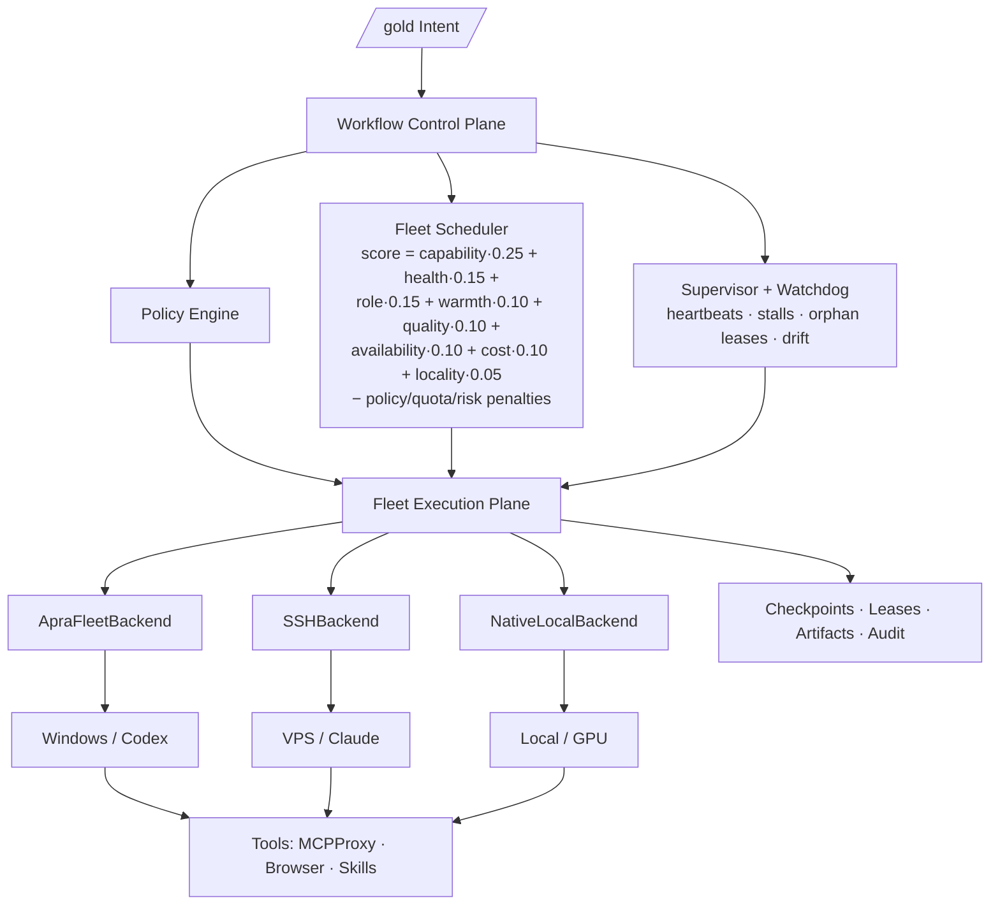

# Phase 20.91 — Pao-hubPro × Apra Fleet

## Distributed Multi-Machine Agent Fleet Control Plane, Durable Workflow Runtime, Cross-Provider Agent Scheduling, Secure Credential Brokerage, Resumable Autonomous Sprints, Knowledge-Aware Execution & Policy-Governed Agent Operations

> **Project:** Pao-hubPro  
> **Phase:** 20.91  
> **Status:** Architecture + Implementation Blueprint (restructured into the Pao-hubPro master 44-section blueprint)  
> **Date:** 2026-09-19 (Asia/Bangkok)  
> **Mode:** Provider-agnostic / Backend-agnostic / Adapter-wrapped / Policy-governed / Durable / Fail-safe  
> **Primary upstream:** `https://github.com/Apra-Labs/apra-fleet` — **adopt the architecture pattern; integrate as an optional FleetBackend; never a hard dependency; never couple Pao-hubPro domain logic to Apra Fleet**  
> **Target:** Pao-hubPro Fleet Execution Plane — multi-machine, multi-provider agent operations with durable/resumable workflows  
> **Integration neighborhood:** Phase 20.85 (OmniRoute) → Phase 20.74 (MCPProxy) → Phase 20.55 (SkillsGate) → Phase 20.82 (AFT) → Phase 20.87 (FileSync) → Phase 20.88-forge (20.90) → Phase 20.89 (Capability Hub) → **Phase 20.91 (Apra Fleet)**  
> **Core principle:** *Pao-hubPro owns intent, policy, workflow state, audit, budget and UX. Apra Fleet is an execution backend / architecture reference. No execution backend owns the whole platform.*  
> **Source filename (preserved per master request §39):** `Phase%2020.91%20%E2%80%94%20Pao-hubPro%20%C3%97%20Apra%20Fleet.md` (quirk: URL-encoded filename)  

---

### Verification & Decision Record (master request §1, §36, §38, §40)

**Verified against the attached source before restructuring:**
- Phase number and name: **20.91**, "Pao-hubPro × Apra Fleet — Distributed Multi-Machine Agent Fleet Control Plane, Durable Workflow Runtime, Cross-Provider Agent Scheduling, Secure Credential Brokerage, Resumable Autonomous Sprints, Knowledge-Aware Execution & Policy-Governed Agent Operations" — matches the source title and END marker exactly.
- **Numbering-registry note:** 20.91 was previously marked RESERVED (placeholder for Business Opportunity / Revenue Intelligence recommendations). A REAL specification now occupies the slot — per the precedent that a concrete spec supersedes a placeholder reservation, **20.91 = Apra Fleet (this document, recorded as 20.91a)**; the reserved topics are deferred to **20.94+** (20.92 remains the BrowserSkill renumber proposal; 20.93 is the proposed renumber for the second 20.91 claimant — Addy Osmani Agent Skills, which arrived later this session and carries its own ⚠ registry note). This is recorded as a numbering-ledger decision, not a silent change.
- 69 source sections verified: executive summary (Distributed Agent Operations: Fleet Member Registry, Cross-machine Dispatch, Cross-provider Scheduling, Durable Workflow Runtime, Checkpoint/Pause/Resume/Retry, Member Reservation/Lease, Supervisor+Watchdog, Secure Credential Brokerage, Knowledge-aware Session Prime, Per-repository Knowledge Isolation, Cost/Token/Quota Governance, Cross-provider Review, Human Approval Gates, Append-only Audit, `/gold` Fleet Runtime; failure chain: Detect→Checkpoint→Release Lease→Reassign→Re-prime→Resume — never restart from zero), why the phase exists (missing middle layer: scheduling/checkpoint/recovery/credential control across machines/agents/providers), verified upstream concepts (heterogeneous members incl. Windows/macOS/Linux/local/SSH/cloud; cross-provider runtimes Claude/Codex/Copilot/OpenCode/local; durable workflow as stateful program; supervisor/reservation/watchdog; out-of-band `{{secure.*}}` credentials; `kb_session_prime` + per-repo KB isolation; explore→operate compiler), 18 objectives, 9 non-goals, architecture position, ownership matrix (13 capabilities), core domain model (Workspace/FleetMember/WorkflowRun trees), fleet member registry (8 member types, 8 statuses, example member), member enrollment (8-step + CLI examples), scheduler (12 considerations, 8 strategies, weighted score formula with configurable weights), provider-vs-member selection separation, 11 agent role contracts, durable workflow runtime (11-state lifecycle + 3 terminal), workflow DSL (budget + phases + human_gate + fix conditions), checkpoints (11-field record + 8 resume validations), resume strategy (preserve intent/evidence/state; machine/provider may change), retry taxonomy (11 error classes + YAML policy), member reservation/lease (6 lease types + 10 fields), supervisor (9 duties + watchdog config), stall detection (7 signals → suspect/degraded/stalled), secure credential brokerage (8 rules + reference syntax + scoped policy), network egress policy (default deny + 4 risk classes), tool policy (effective permission = Agent Role ∩ Workflow ∩ Member ∩ Workspace ∩ Credential Scope), knowledge-aware execution (prime chain), knowledge confidence (5 states + promotion), strict repository isolation (6-part key; failed resolution → BLOCK write + ALLOW generic read + LOG), knowledge harvest (5 exclusions), explore→operate compiler (LLM only at judgment nodes), `/gold` Fleet Runtime pipeline (17 stages), agent topology (8 roles), cross-provider review rule (prefer alternate provider; same-provider fallback with reduced diversity marking), Reviewer Council integration (PASS/FIX/HUMAN), TypeSafe Jev integration (decision helper, deterministic validation first), MCPProxy integration (fleet decides WHERE, MCPProxy decides WHAT tools), BrowserSkill integration (browser sessions as reservable resources), artifact fabric (9 artifact types + hash-transfer-verify-register), database schema (27 recommended tables + 3 core SQL examples), event model (26 events), audit ledger (append-only, example event), cost governance (6 budget layers + provider tiers + routing guideline), observability (3 dashboard levels), UI structure (11 views), run timeline (human gate visible), human approval gates (9 protected actions + approval view with rollback plan), trust zones (6 zones + policy), quarantine (7 triggers + 6-step action), FleetBackend interface (9 methods + 5 adapters incl. ApraFleetBackend/NativeLocal/SSH/Clodex/Herdr), Apra adapter rules (7 do / 5 never), API proposal (18 endpoints), MCP tools proposal (22 tools; mutating tools through policy), folder structure, configuration, idempotency keys, failure scenarios (5), disaster recovery (control-plane restart sequence; durable state never RAM-only), testing strategy (unit/integration/chaos/security), acceptance checklist (8 families), definition of done (12 conditions), implementation stages 20.91-A..K, rollout modes 0–4 (Mode 4 only after chaos+security pass), migration strategy (10-step additive order), risk register (11 risks), recommended defaults, first dogfood test (member-kill chaos during review), one-shot `/gold` command, source references, final decision.
- No capability removed, truncated, or assumed. Upstream facts marked as validated from repository documentation at the source's date; no Apra Fleet capability asserted beyond the documented concepts.

**⚠ Phase numbering registry update:**
- **20.91 is assigned to this phase (Pao-hubPro × Apra Fleet — Fleet Execution Plane) as first claimant, recorded as 20.91a.** The prior RESERVED placeholder (Business Opportunity / Revenue Intelligence) is deferred to **20.94+** (20.92 = BrowserSkill renumber proposal; 20.93 = proposed renumber for the second 20.91 claimant, Addy Osmani Agent Skills — ⚠ open collision pending user decision). This supersedes the earlier "displaced to 20.91+/20.93+" ledger notes.
- Standing collision ledger: **20.65** Litho-vs-Context-Mode → RESOLVED (20.65 / 20.65.1); **20.88** Remotion-vs-Forge → RESOLVED (20.88 / 20.90); **20.91** Apra-Fleet-vs-Addy-Osmani → OPEN (20.91a / 20.91b, proposed 20.93 for 20.91b).

**Implementation status annotation (2026-09-18/19):** NOT YET IMPLEMENTED. Adjacent implemented/spec'd surfaces to reuse: Phase 20.85 OmniRoute (provider candidates — separate from member scheduling), Phase 20.74 MCPProxy (tool gateway), Phase 20.87 FileSync (artifact transport adapter), Phase 20.89 Capability Hub (registry + policy patterns), Phase 20.84 Jev (decision helper), Phase 20.40+/20.61/20.71/20.72 (existing agent/session/browser-provider registries — inspect and extend). Fleet member concept overlaps with Phase 20.61 amux and 20.71 Clodex — the FleetBackend adapter interface unifies them.

**R0–R4 mapping note (decision):**
- The source defines egress risk classes (LOW/MEDIUM/HIGH/CRITICAL) and protected-action lists (§45). Decision mapping onto R0–R4:
  - **R0 (Read-only):** fleet/registry/audit/cost queries, member health probes, run timeline views, knowledge reads (generic read-only context on failed repo resolution).
  - **R1 (Low-risk local action):** member registration/enrollment probes, manifest/contract generation, checkpoint writes, knowledge harvest candidate staging, scheduler scoring.
  - **R2 (Reversible write):** policy-allowed dispatch of agent sessions to healthy members, lease acquire/release, artifact transfer with hash verification, knowledge promotion to INFERRED.
  - **R3 (Sensitive — approval recommended):** dispatch to SSH/cloud members, privileged credential grants (`human_approval: true`), quarantined-member release, branch-drift reconciliation, provider fallback beyond policy, egress to unknown destinations (`prompt_on_unknown`).
  - **R4 (Destructive / privileged):** protected-branch merge, production deploy, destructive DB migration, delete-outside-workspace, credential elevation, external message send, financial actions — human gate mandatory; never agent- or fleet-auto-approved.
- Policy-enum mapping:
  - **ALLOW:** dispatch/lease/artifact flows satisfying role ∩ workflow ∩ member ∩ workspace ∩ credential-scope intersection with healthy members and remaining budget.
  - **DENY:** policy_denied retries (max 0), secrets into prompts/logs, egress to non-allowlisted destinations, quarantine-bypass, protected actions without human gate.
  - **REQUIRE_APPROVAL:** HIGH/CRITICAL egress classes, privileged credential grants, protected merges/deploys, budget soft-limit overrides.
  - **QUARANTINE:** members with integrity mismatch, unauthorized commands, unexpected secret access, abnormal egress, path escape, audit mismatch (stop dispatch → revoke leases → revoke ephemeral credentials → preserve evidence → human release).

---

## 1. Executive Summary

Phase 20.91 adds the **Distributed Agent Operations layer** — the **Fleet Execution Plane** — to Pao-hubPro, adapting the strongest concepts from Apra Fleet: a fleet member registry across heterogeneous machines (Windows/macOS/Linux/local/SSH/cloud), cross-provider agent runtimes (Claude, Codex, Copilot, OpenCode, local models), a **durable workflow runtime** (stateful programs with phases, retries, turn budgets, pause/resume, member reservation), a **supervisor + watchdog**, out-of-band secure credentials (`{{secure.GITHUB_TOKEN}}` resolved execution-side only), a knowledge layer with `kb_session_prime` and per-repository isolation, and the explore→operate compiler that keeps LLMs only at judgment nodes.

The architecture rule: **Pao-hubPro owns intent, policy, workflow state, audit, budget and UX; Apra Fleet is an execution backend / architecture reference; no execution backend owns the whole platform.** Failure chain: `Detect → Checkpoint → Release Lease → Reassign → Re-prime → Resume` — never restart from zero.

End state: `/gold "สร้าง Feature X ให้ Pao-hubPro"` compiles into a policy- and budget-checked task DAG scheduled across the fleet (Codex Builder on Windows, Claude Reviewer on VPS, local model for cheap tasks), runs PLAN → BUILD → TEST → REVIEW → FIX → VERIFY → RELEASE through human gates, survives machine/provider/network failures from checkpoints, and harvests knowledge — all audited.

## 2. Problem Statement

Pao-hubPro already operates OmniRoute/9Router, MCPProxy, Herdr/Clodex, OpenCodeReview, CortexKit AFT, Context Mode/OpenViking, SkillsGate, BrowserSkill/BrowserMCP, TypeSafe Jev, Graft, and Codex/Claude Code/OpenCode runtimes. What is missing is the middle layer answering: **when work runs across many machines, agents, and providers, how is it scheduled, checkpointed, recovered, audited, and credential-controlled through failures?** Without it, multi-machine agent operations mean ad-hoc SSH scripts, lost state on any crash, secrets pasted into prompts, no budget ceilings, no cross-machine lease coordination, and no audit trail of which agent ran what where.

## 3. Goals

Eighteen systems (source §3): Fleet Member Registry; Agent Runtime Registry; Provider Capability Registry; Distributed Scheduler; Member Lease/Reservation Engine; Durable Workflow Runtime; Checkpoint & Resume Engine; Supervisor + Watchdog; Secure Credential Broker; Knowledge Session Prime Layer; Artifact Transfer + Integrity Verification; Cost/Token/Quota Governance; Agent Role Contracts; Human Approval Gates; Audit Event Ledger; `/gold` Fleet Runtime; Fleet Dashboard; Apra Fleet Adapter + Native adapters.

## 4. Non-Goals

Phase 20.91 does NOT: replace OmniRoute, MCPProxy, BrowserSkill, OpenCodeReview, or Context Mode/OpenViking; force every task onto the fleet; expose secrets into prompts; auto-merge protected branches without policy/human gates; or hard-couple Pao-hubPro to Apra Fleet.

## 5. Why This Phase Exists

The platform's agent phases (runtimes, review, browser, knowledge, credentials) all assume execution happens in one place under one controller. Multi-machine operation breaks every one of those assumptions: leases, checkpoints, stall detection, member health, credential scoping, and budget governance become first-class concerns. Phase 20.91 is that missing layer — the difference between "agents that run" and "an agent fleet that operates": a single intent distributed across heterogeneous machines, surviving failures from checkpoints, with every credential scoped and every action audited.

## 6. Relationship to Pao-hubPro (and Existing Phases)

**Ownership matrix (source §6, preserved):** User Intent + `/gold` + Policy + Audit + Cost → **Pao-hubPro**; Provider/Model Routing → **OmniRoute/9Router**; Machine Scheduling → **Fleet Scheduler (this phase)**; Tool Gateway → **MCPProxy**; Browser → **BrowserSkill/BrowserMCP**; Agent Sessions → **Herdr/Clodex/native runtime**; Review → **OpenCodeReview/Reviewer Council**; Knowledge → **Context Mode/OpenViking/Pao KB**; Credentials → **Relmio + Pao Credential Broker**; Distributed Execution → **Fleet Backend adapters**.

Key separations: **OmniRoute is not a machine scheduler; the Fleet Scheduler is not a provider gateway** (source §11) — capability resolution → provider+model candidates (OmniRoute) → machine/runtime candidates (Fleet Scheduler) → policy → dispatch. **MCPProxy decides WHAT tools; the Fleet Plane decides WHERE they run.** Jev (20.84) is a decision *helper* (scheduler/retry/fallback/escalation) validated by deterministic policy first. Browser sessions (20.90) are reservable fleet resources. Layer mapping (master §5): 04 Orchestration, 06 Registries, 07/08 Policy/Approval, 09/11/12 Execution+State, 14 Secrets, 15 Events, 16/17 Observability+Audit.

## 7. Upstream / External Project

- **A. Upstream:** `Apra-Labs/apra-fleet` — validated concepts: heterogeneous member machines (Windows/macOS/Linux/local/SSH/cloud) with provider runtime, work folder, health, tags, permissions, execution capabilities; cross-provider execution (Claude/Codex/Copilot/OpenCode/OpenAI-compatible local); durable stateful workflows (phases, retries, turn budgets, persistent state, pause/resume, member reservation); supervisor (launch/pause/resume/stop, reservation ledger, watchdog, run history); out-of-band secrets (`{{secure.*}}` resolved execution-side); `kb_session_prime` + KB tools with freshness detection and per-repo isolation; explore→operate workflow hardening. Key upstream areas: README, docs/architecture.md, docs/provider-guide.md, docs/knowledge-layer.md, docs/features/oob-auth.md, docs/features/workflow-pause-resume.md, packages/apra-fleet-workflow, packages/apra-fleet-se, packages/fleet-api-contract.
- **B. Pao-hubPro Adapter:** `FleetBackend` interface (9 methods) + `ApraFleetBackend` (member mapping, dispatch, health/status/reservation mapping, supervisor event bridge, secure reference bridge, optional KB sync).
- **C. Policy Wrapper:** scheduling policies, lease engine, egress policy, tool policy, credential scopes, quarantine, human gates.
- **D. Extensions:** knowledge confidence promotion, explore→operate compiler, cost governance, `/gold` fleet runtime.
- **Final decision (source §68):** *Borrow the fleet operating model. Integrate the backend. Keep Pao-hubPro sovereign.* Adapter do/never: mapping/dispatch/bridges YES; owning global policy, credential truth, audit truth, bypassing human gates, coupling UI to Apra types NEVER.

## 8. Current-State Assumptions

- **NOT implemented** (verified against schema v57: no `fleet_*`, `workflow_*`, `agent_role_*`, `credential_refs` tables exist). Everything in this blueprint is to be built.
- Pao-hubPro runtime is Bun-native TypeScript + SQLite (v57); the source gives PostgreSQL DDL with UUID/JSONB/TIMESTAMPTZ — **Assumption:** implement against the existing SQLite layer with schema parity (TEXT ids, JSON columns, ISO timestamps), keeping the DDL canonical for VPS deployments *(Needs Verification)*.
- Existing members available for the first fleet: the operator's Windows PC (Codex), a VPS (Claude/OpenCode), local GPU/Linux (cheap tasks) per the dogfood test (§65).
- Phase 20.85 OmniRoute provides provider/model candidates; Phase 20.87 FileSync provides artifact transport; Phase 20.90-proposed provides browser sessions as reservable resources.
- Control-plane restart recovery is a hard requirement: durable state never lives in RAM only.

## 9. Target Architecture

```text
Pao-hubPro UI (Fleet / Runs / Agents / Costs / Policies)
  ↓ Intent Layer (/gold + manual tasks)
Workflow Control Plane
  ├── Policy Engine  ├── Scheduler  ├── Supervisor
  ↓
Fleet Execution Plane
  ├── Apra Adapter   ├── SSH Backend   ├── Local Backend
  ↓
Windows / VPS / Linux / GPU
  ↓
Codex / Claude / OpenCode / Local
  ↓
MCPProxy / Browser / Skills
```

Core domain model: `Workspace (Repository, Policies, Fleet Members, Providers, Workflows, Runs, Knowledge Namespace)`; `FleetMember (Machine, Transport, Runtime, Provider Bindings, Capabilities, Tags, Health, Lease State)`; `WorkflowRun (Phases, Activities, Agent Sessions, Checkpoints, Leases, Artifacts, Cost, Audit Events)`.

## 10. Architecture Diagram



## 11. Core Components

1. **Fleet Member Registry** — member types `local, ssh, cloud, container, windows, wsl, gpu, browser-worker`; statuses `registering, online, busy, reserved, degraded, offline, quarantined, maintenance`; example member `win-codex-01` with capability flags (`coding, review, browser, gpu, longRunning, shell: [powershell, git-bash]`).
2. **Member Enrollment** — Register → Identity Challenge → Connectivity Probe → OS/Runtime Probe → Provider Probe → Capability Discovery → Trust Classification → Policy Assignment → Ready; CLI: `pao fleet member add --name win-codex-01 --transport local --provider codex --workspace D:/Pao-hubPro` / SSH variant `--transport ssh --host 10.0.0.24 --user pao`.
3. **Fleet Scheduler** — 12 selection considerations (task requirements, role, capability, provider candidate, member health, load, credential scope, repo affinity, data sensitivity, cost budget, context warmth, quota, policy); 8 strategies (`best-fit, lowest-cost, fastest, privacy-first, quality-first, local-only, cross-provider-review, manual-pin`); weighted score (capability_match ×0.25, health ×0.15, role_affinity ×0.15, context_warmth ×0.10, quality ×0.10, availability ×0.10, cost_efficiency ×0.10, locality ×0.05 − policy/quota/risk penalties) with **configurable weights**.
4. **Provider vs Member Selection (separation law):** Task → Capability Resolver → OmniRoute/9Router → Provider+Model candidates → Fleet Scheduler → Machine/Runtime candidates → Policy → Dispatch. OmniRoute is never the machine scheduler; the Fleet Scheduler never becomes a provider gateway.
5. **Agent Role Contracts (11 roles):** Planner, Architect, Builder, Reviewer, Tester, Security Reviewer, Release Manager, Researcher, Browser Operator, Knowledge Harvester, Incident Investigator — each with `allowed_actions, forbidden_actions, required_outputs` (e.g. reviewer: read_repo/read_diff/run_tests/create_review_report allowed; merge/deploy_production/modify_secrets forbidden; outputs verdict/findings/evidence/confidence).
6. **Durable Workflow Runtime** — lifecycle `CREATED → QUEUED → PLANNING → RUNNING (PAUSED|RETRYING|WAITING_APPROVAL|BLOCKED|DEGRADED) → VERIFYING → COMPLETED`; terminal `FAILED, CANCELLED, ABORTED`; requirements: idempotent transitions, retry-safe workers, resumable jobs, no hidden local state, full event history, deterministic artifact references.
7. **Workflow DSL** — `gold-feature-delivery` v1: budget `{max_usd: 8, max_minutes: 180, max_agent_turns: 80}`; phases plan(premium) → build(retry 2) → test(deterministic_first) → review(provider_diversity) → fix(condition: review.failed||test.failed) → approval(human_gate for merge/deploy) → release.
8. **Checkpoints + Resume** — checkpoint record `{runId, workflowId, phase, activity, repoCommit, branch, member, provider, agentSession, artifacts, knowledgeRevision, budgetSpent, policyVersion}`; resume validation: repo commit, branch drift, artifact hashes, policy version, credential validity, member health, session resumability, remaining budget. Resume law: **preserve intent + evidence + workflow state; machine/provider may change.**
9. **Retry Taxonomy** — 11 error classes (`transient_network, provider_rate_limit, provider_unavailable, member_offline, tool_timeout, test_failure, policy_denied, credential_expired, repository_conflict, agent_stall, unknown`) with per-class YAML policy (e.g. `transient_network: max 3 exponential; member_offline: max 1 reassign; policy_denied: max 0 require_human`).
10. **Member Lease/Reservation Engine** — lease types `exclusive_workspace, exclusive_branch, shared_readonly, browser_session, gpu_slot, credential_scope`; fields `lease_id, member_id, workspace_id, repo_id, run_id, activity_id, lease_type, acquired_at, expires_at, heartbeat_at, status`; agents never mutate the same working tree without coordination.
11. **Supervisor + Watchdog** — separate service: run heartbeat, member heartbeat, stalled activity detection, orphan lease detection, branch drift detection, provider/session failure detection, controlled recovery, policy-violation pause, run history; watchdog config (`member_heartbeat_timeout_sec: 45, activity_no_output_timeout_sec: 300, lease_orphan_timeout_sec: 120, provider_retry_threshold: 3, branch_drift_policy: pause, budget_exceeded_policy: stop`).
12. **Stall Detection** — signals: no stdout, no tool events, no git changes, no progress event, repeated identical prompts, repeated identical tool errors, session alive without state progress; actions: suspect → ping; degraded → diagnostics + soft retry; stalled → checkpoint + terminate + reassign.
13. **Secure Credential Broker** — 8 rules: secret never enters LLM prompt; never in logs; not stored in workflow definitions; resolved execution-side only; scoped grants; TTL support; audit every resolution; human approval for high-risk grants. References `{{secure.GITHUB_TOKEN}}`; policy example scopes workspace/repo/permissions/network-allowlist/TTL/approval.
14. **Knowledge-Aware Execution** — session prime: Resolve Repo Identity → Branch+Commit → File Freshness → Confirmed Knowledge → Symbol Context → Prior Run Learnings → Minimal Context Package → Launch. Confidence ladder: UNVERIFIED → INFERRED → CONFIRMED (evidence/deterministic verification) → DEPRECATED/INVALID. **Strict repository isolation:** knowledge key `workspace_id + repo_remote_fingerprint + repo_root_hash + branch_scope + module + symbol`; failed repo resolution → BLOCK knowledge write, ALLOW generic read-only context, LOG unresolved namespace — **never a silent fallback to a global writable KB**.
15. **Knowledge Harvest** — transcript + tool events + test results + diff + review verdict → Harvester → Candidate Learnings → Evidence Validation → Knowledge Store; **never harvest secrets, tokens, unnecessary private data, unsupported hallucinations, or transient noise**.
16. **Explore→Operate Compiler** — analyze run history → detect deterministic operations → compile shell/git/file/API nodes → keep LLM only at judgment nodes (before: LLM→git status / LLM→npm test; after: program→git status, program→parse package.json, program→npm test, LLM→diagnose meaningful failure, program→commit).
17. **Artifact Fabric** — diff/patch, build output, logs, screenshots, test reports, coverage, SBOM, release packages, review reports; protocol: Hash → Transfer → Verify Hash → Register Artifact → Attach to Run; Phase 20.87 FileSync is one transport adapter.
18. **Cost Governance** — budget layers Global/Workspace/Run/Phase/Agent/Provider-Quota; `soft_limit_usd: 4 → downgrade_noncritical; hard_limit_usd: 8 → pause`; provider tiers cheap/standard/premium/local; routing guideline: mechanical edits → cheap/local, routine coding → standard, architecture → premium, final review → premium/provider-diverse, shell/git/files → deterministic program.

## 12. Component Responsibilities

| Component | Owns | Must never |
| --- | --- | --- |
| Fleet Scheduler | member/runtime candidate selection | become a provider gateway |
| Lease Engine | exclusive/shared resource coordination | allow uncoordinated same-tree mutation |
| Supervisor/Watchdog | heartbeats, stalls, orphans, drift, recovery | hide policy violations |
| Credential Broker | scoped, TTL'd, execution-side resolution | put secrets in prompts/logs/workflow definitions |
| Knowledge Layer | repo-isolated, evidence-linked learnings | silent global-KB fallback; harvest secrets |
| Checkpoint Engine | durable run state | depend on RAM-only state |
| FleetBackend adapters | transport to Apra/SSH/local/Clodex/Herdr | own policy, credential truth, audit truth, bypass human gates, couple UI to Apra types |
| Cost Governor | budgets per layer | silently exceed hard limits |
| Explore→Operate compiler | deterministic node extraction | remove LLM judgment nodes entirely |

## 13. Data Flow

```text
/gold intent → SCOPE → POLICY → KNOWLEDGE PRIME → RISK+BUDGET → PLAN → TASK DAG
→ SCHEDULE (score members) → dispatch (Agent Session per role)
→ BUILD → DETERMINISTIC TEST → CROSS-PROVIDER REVIEW → SECURITY REVIEW
→ FIX LOOP (max cycles, progress required) → REGRESSION → HUMAN APPROVAL
→ MERGE/RELEASE → KNOWLEDGE HARVEST → FINAL REPORT
```

## 14. Control Flow (+ R0–R4 Mapping)

```text
Request → Identity → Policy Intersection (Agent Role ∩ Workflow ∩ Member ∩
Workspace ∩ Credential Scope — most restrictive wins)
→ Risk Classification (egress class, protected actions)
→ Approval Check (human gates for protected actions)
→ Dispatch (member + provider) → Execution (checkpointed)
→ Verify → Audit (append-only)
```

| Source class | Pao risk | Enum |
| --- | --- | --- |
| LOW egress (read-only public) | R0/R1 | ALLOW |
| MEDIUM egress (authenticated SaaS), member dispatch, lease ops | R2 | ALLOW (audited) |
| HIGH egress (infrastructure mutation), SSH/cloud dispatch, privileged credential grants, branch-drift reconcile | R3 | REQUIRE_APPROVAL |
| CRITICAL (destructive/production-privileged), secret-in-prompt, quarantine override | R4 | DENY unless explicit human confirmation |

## 15. Agent / Worker Model

Agent topology for `/gold` (source §30): PM/Orchestrator → ChatGPT/Pao-hubPro; Planner → premium reasoning model; Builder → Codex; Secondary Builder → OpenCode/local; Reviewer → provider different from builder; Tester → deterministic first; Security Reviewer → independent role; Release Manager → deterministic + human gate. **Cross-provider review rule:** if reviewer.provider == builder.provider, prefer an alternate provider; same-provider fallback only with a fresh independent session and `review_diversity = reduced` marked; audit records builder/reviewer provider+model, session independence, context revision. Jev (20.84) may *recommend* scheduler/retry/fallback/escalation decisions with confidence — deterministic policy validates before execution.

## 16. Session / State Model

Workflow lifecycle (source §13): `CREATED → QUEUED → PLANNING → RUNNING {PAUSED, RETRYING, WAITING_APPROVAL, BLOCKED, DEGRADED} → VERIFYING → COMPLETED`; terminal `FAILED, CANCELLED, ABORTED`. Durable-state law: workflow state survives process restart; nothing lives in RAM only. Control-plane restart sequence: reload incomplete runs → reconcile leases → probe members → reconcile sessions → validate policies/checkpoints → resume safe workflows. Idempotency keys on every mutation: `run_123:phase_build:task_07:attempt_2` shape for launch/dispatch/grant/transfer/release.

## 17. MCP Integration

Fleet plane decides **where** work runs; MCPProxy decides **what tools** agents may use: `Agent on Member → MCP Client → MCPProxy → Policy Filter → Tool Server`. MCP tools (22, source §51): `fleet_list_members, fleet_get_member, fleet_probe_member, fleet_reserve_member, fleet_release_member, fleet_dispatch_agent, fleet_execute_command, fleet_get_session, fleet_pause_session, fleet_resume_session, fleet_cancel_session, workflow_list, workflow_run, workflow_get, workflow_pause, workflow_resume, workflow_cancel, workflow_checkpoint, fleet_get_cost, fleet_get_audit` — mutating tools traverse the Policy Engine; read-only fleet/registry queries are R0.

## 18. Capability Registry

Fleet members are registry entities: `{name, type, provider, tags[windows/codex/docker/git/browser], capabilities{coding, review, browser, gpu, longRunning, shell[]}}` with trust classification at enrollment. The FleetBackend adapter interface (`registerMember, probeMember, dispatchPrompt, executeCommand, pauseSession, resumeSession, cancelSession, collectLogs, transferArtifact`) unifies existing registries — Phase 20.61 amux, 20.71 Clodex, 20.72 Herdr backends become fleet adapters (`ClodexBackend`, `HerdrBackend`) rather than competing schedulers. Browser sessions (20.90) register as reservable resources (`browser_session` lease type with run owner, agent owner, profile, auth state, tab ownership, lease expiry, takeover state).

## 19. Policy Model

Effective permission = **Agent Role ∩ Workflow Policy ∩ Member Policy ∩ Workspace Policy ∩ Credential Scope** (most restrictive wins). Tool policy: shell allowlist (git/npm/node/pnpm/pytest/vitest), filesystem workspace-only, browser authenticated-session requires explicit borrow, deploy requires_human. Egress: default deny, allowlist (github.com, api.github.com, registry.npmjs.org, api.openai.com), `prompt_on_unknown: true`. Trust zones Zone 0–5 (Control Plane / Trusted Local / Trusted VPS / Ephemeral Cloud / External Providers / Public Internet) with policy: private code → trusted/local preferred; secrets → never model-visible; production creds → broker only; sensitive data → scoped/minimized.

## 20. Security Model

- **Credential brokerage:** execution-side resolution of `{{secure.*}}` references; scoped grants (workspace/repo/permissions/network/TTL/human_approval); audit every resolution without contents.
- **Quarantine triggers (7):** integrity mismatch, repeated unauthorized commands, unexpected secret access, abnormal egress, path escape, audit mismatch, suspicious runtime behavior → Stop Dispatch → Revoke Leases → Revoke Ephemeral Credentials → Preserve Evidence → Collect Diagnostics → **Human Release Required**.
- **Network egress:** default deny + allowlist + prompt-on-unknown; risk classes LOW (read-only public) / MEDIUM (authenticated SaaS) / HIGH (infrastructure mutation) / CRITICAL (destructive/production-privileged).
- **Threat coverage:** secret leakage, path traversal, command injection, egress bypass, lease bypass, prompt-driven privilege escalation (source §57 security tests) plus the 11-item risk register (backend lock-in, repo conflicts, provider outage, state corruption, knowledge contamination, cost runaway, infinite fix loops, destructive autonomy).
- **Audit immutability:** append-only ledger; security-sensitive events never retroactively edited.

## 21. Approval Model

Protected actions requiring the human gate (source §45): production deploy; protected-branch merge; release publish; destructive DB migration; delete outside workspace; credential elevation; unknown network destination; external message send; financial action. Approval view shows action, reason, risk, exact command/diff, credentials involved, target, rollback plan with decisions Approve Once / Approve For Run / Deny. Workflow DSL `human_gate` phase (`required_for: [merge, deploy]`) blocks RUN → WAITING_APPROVAL until resolution.

## 22. Failure Handling

Failure scenarios (source §55): **Agent CLI crash** → detect → collect logs → checkpoint → resume same session if possible else fresh session + knowledge prime; **Member offline** → invalidate lease → select alternate member → sync artifacts/repo → re-prime → resume; **Provider rate limit** → bounded retry → alternate provider if policy allows → mark provider degraded; **Branch drift** → pause → compare commit → reconcile/rebase by policy → human on unsafe conflict; **Credential expired** → pause privileged activity → renew through broker → never ask the Agent for plaintext. Retry taxonomy per §17 with per-class caps; `policy_denied` retries zero times and requires a human.

## 23. Recovery Model

Disaster recovery (source §56): control-plane restart → reload incomplete runs → reconcile leases → probe members → reconcile sessions → validate policies/checkpoints → resume safe workflows. **Durable state never lives exclusively in RAM.** Stall recovery: suspect (ping) → degraded (diagnostics + soft retry) → stalled (checkpoint + terminate + reassign). Quarantine recovery requires human release after evidence review. The dogfood chaos test (§65): kill the reviewer member mid-review → watchdog detects offline → checkpoint review activity → release lease → scheduler selects an alternate reviewer → re-prime context → continue review — **without restarting PLAN/BUILD**.

## 24. Observability

Fleet dashboard levels: **Global** (online members, active/paused runs, failures, provider health, estimated spend, token usage); **Per Run** (current phase, member, agent, provider/model, elapsed, budget, last checkpoint, artifacts, approvals); **Per Member** (health, provider runtime, active session, leases, workspace, heartbeat, failure rate). Run timeline (source §44): `00:00 PLAN ✓ Planner/premium · 00:08 BUILD ✓ Codex/win-codex-01 · 00:36 REVIEW ✕ Claude/review-vps · 00:42 FIX ✓ · 01:03 APPROVAL ● Waiting for Pao` — clicking a phase reveals output summary, tool events, diff, logs, artifacts, cost, retries, assignment, policy decisions. Metrics: install/dispatch success-failure rates, rollback rate, health failure rate, policy denials, approval count, MCP contract changes, provider errors, model latency, agent failures.

## 25. Audit

Append-only ledger recording every dispatch, policy decision, credential resolution (without secrets), human approval, retry/reassign. Event envelope: `{eventId, timestamp, workspaceId, runId, actorType, actorId, memberId, provider, action, resource, decision, policyVersion, correlationId}`. Event model (26 events): `fleet.member.registered/online/degraded/offline/quarantined, fleet.lease.acquired/released/expired, workflow.created/started/paused/resumed/checkpoint.created/activity.started/completed/failed/completed, agent.dispatched/session.started/stalled/recovered, credential.granted/resolved/denied, policy.allowed/denied, artifact.created/transferred/verified`. Correlation IDs span intent → run → activity → audit.

## 26. Data Model

27 recommended tables (source §37): `fleet_members, fleet_member_capabilities, fleet_member_provider_bindings, fleet_member_health_events, fleet_leases, workflow_definitions, workflow_versions, workflow_runs, workflow_run_phases, workflow_activities, workflow_checkpoints, workflow_retries, workflow_approvals, agent_sessions, agent_role_assignments, provider_dispatches, provider_usage, credential_refs, credential_grants, credential_audit_events, audit_events, artifacts, artifact_locations, artifact_hashes, knowledge_namespaces, knowledge_entries, knowledge_evidence, knowledge_file_freshness, cost_ledger, budget_policies, quota_snapshots`. Core SQL example (fleet_members with `UNIQUE(workspace_id, name)`; fleet_leases with member/run/activity refs + expiry/heartbeat; workflow_checkpoints with state_json/repo_commit/branch/member/provider/agent_session/artifact_manifest/policy_version/knowledge_revision). Implement on the repo SQLite layer additively; reuse existing `policies/approvals/audit` infrastructure rather than duplicating.

## 27. API / Event Contracts

REST (18 endpoints, source §50): `GET/POST /api/fleet/members`, `GET /:id`, `POST /:id/probe`, `POST /:id/quarantine`; `GET/POST /api/fleet/runs`, `GET /:id`, `POST /:id/pause|resume|cancel`; `GET/POST /api/fleet/workflows`, `POST /:id/run`; `GET /api/fleet/leases`; `GET /api/fleet/audit`; `GET /api/fleet/costs`. MCP tools per §17. Events per §25 envelope. FleetBackend interface: `registerMember, probeMember, dispatchPrompt, executeCommand, pauseSession, resumeSession, cancelSession, collectLogs, transferArtifact` — adapters: ApraFleetBackend, NativeLocalBackend, SSHBackend, ClodexBackend, HerdrBackend.

## 28. Configuration

```yaml
fleet:
  enabled: true
  default_backend: apra-fleet
  scheduler: {strategy: best-fit, require_cross_provider_review: true}
  supervisor: {enabled: true, heartbeat_sec: 15}
  credentials: {backend: pao-vault, never_expose_plaintext: true}
  knowledge: {prime_before_session: true, harvest_after_session: true, strict_repo_isolation: true}
  cost: {default_run_budget_usd: 5}
  approvals: {protected_branch_merge: true, production_deploy: true}
```

Recommended defaults (source §64): scheduling best-fit; cross-provider review true; max 3 parallel agents per repo; checkpoint every phase; max 3 fix cycles with progress required each cycle; workspace-files-only; secret-to-prompt never; unknown egress ask; production mutation human; knowledge repo-isolation strict with evidence-required promotion; cost soft 4 / hard 8 USD.

## 29. Feature Flags

Rollout modes (source §61): **Mode 0** Observe only → **Mode 1** Manual dispatch → **Mode 2** Scheduler proposes/human confirms → **Mode 3** Autonomous non-critical build/test/review → **Mode 4** `/gold` full fleet with protected human gates (**Mode 4 opens only after the chaos + security checklists pass**). Per-capability flags: member registry, scheduler, leases, workflow runtime, supervisor, credential broker, knowledge prime/harvest, cost governor — each an immediate-rollback lever.

## 30. Repository Structure

```text
services/fleet-control-plane/    # members, scheduler, leases, supervisor, workflow,
                                 # checkpoints, credentials, knowledge, artifacts,
                                 # audit, cost, adapters/{apra-fleet, native-local,
                                 # ssh, clodex, herdr}
packages/fleet-contracts/ workflow-runtime/ policy-contracts/
packages/audit-contracts/ knowledge-contracts/
apps/web/src/features/fleet/
```

Adapted to the Bun monorepo (`src/agent-os/fleet/` mirroring the marketplace pattern) — inspect the repo first (master §18); the source's Prisma-era stack yields to existing conventions.

## 31. Dashboard Integration

Fleet UI (source §43, 11 views): Overview, Members, Runs, Workflows, Reservations, Agents, Credentials, Knowledge, Policies, Costs, Audit — Apple-like clean hierarchy, status pills, timeline-centered run page (§44), progressive disclosure, expandable technical detail, command palette. UI direction: information-dense but uncluttered; never display secrets.

## 32. Dependencies

**Required:** Pao policy/audit/approval core; DB layer; secret layer (Relmio + broker).
**Recommended:** OmniRoute (provider candidates), MCPProxy (tool gateway), Phase 20.87 FileSync (artifact transport), Phase 20.90 BrowserSkill (browser_session leases), Phase 20.84 Jev (decision helper), Phase 20.89 Capability Hub (registry patterns), Context Mode/OpenViking (knowledge fabric), Herdr/Clodex/amux (as fleet backends).
**Optional:** GPU workers, cloud members.
**Standalone path:** NativeLocalBackend alone supports the full workflow lifecycle on one machine — the fleet layer works without Apra Fleet (source §59/§60: local backend first, Apra adapter second).

## 33. Compatibility

- Adapter boundary keeps Apra Fleet replaceable; domain logic never imports Apra types.
- Existing provider/agent systems migrate through the adapter layer (source §62): Existing Provider/Agent Systems → Adapter Layer → Fleet Contracts — incremental, never a big-bang rewrite.
- OmniRoute/MCPProxy/Council/Context Mode roles unchanged; the fleet adds scheduling/supervision.
- Additive DB migration; idempotency keys make re-runs safe; backward compatibility preserved (source rule: preserve working implementation).

## 34. Migration

Ten-step order (source §62): 1 Contracts → 2 Registry → 3 Local backend → 4 Apra adapter → 5 Scheduler → 6 Workflow runtime → 7 Supervisor → 8 Knowledge → 9 `/gold` → 10 UI. Never rewrite all systems simultaneously. Existing hard-coded agent prompts/configs migrate via the 20.89/20.90 registries. The first dogfood test (§65) is the acceptance anchor: `/gold "เพิ่มหน้า Fleet Members พร้อม health status"` with Planner→premium, Builder→Codex/Windows, Reviewer→Claude/VPS, deterministic tests, Pao approval — then **kill the reviewer member mid-review** and require checkpoint → lease release → alternate reviewer selection → re-prime → continue without restarting PLAN/BUILD.

## 35. Rollback

- Fleet flags off → plane inert; existing single-machine agent flows unaffected.
- Run-level: pause/cancel + checkpoint preservation (never delete workflow state as a rollback step).
- Member quarantine → lease release + credential revocation + evidence preservation; restore via human release after re-verification.
- Control-plane rollback: revert service images; DB migrations additive/backward-compatible; durable workflow state survives.
- Rollback triggers: state corruption, secret exposure, cost runaway, destructive autonomy, knowledge contamination (source §63).

## 36. Testing Strategy

- **Unit (source §57):** scheduler score, lease logic, error classification, policy intersection, cost/budget, checkpoint serialization.
- **Integration:** local dispatch, SSH dispatch, Apra adapter, pause/resume, member failover, secure ref resolution, artifact verification.
- **Chaos (8):** kill member process, network drop, provider 429, destroy agent session, expire credential, corrupt artifact, branch drift, restart control plane.
- **Security:** secret leakage, path traversal, command injection, egress bypass, lease bypass, prompt-driven privilege escalation.
- **Dogfood acceptance (§65):** the reviewer-kill chaos test above is the most important acceptance test of the phase.
- **Contract:** every FleetBackend adapter passes the same interface suite.

## 37. Acceptance Criteria

**Fleet:** [ ] register Windows member; [ ] register Linux/VPS member; [ ] heartbeats visible; [ ] capability discovery works; [ ] offline member excluded; [ ] quarantined member blocked.
**Scheduler:** [ ] capability matching; [ ] role matching; [ ] provider policy respected; [ ] cost tiers respected; [ ] privacy/local-only respected; [ ] cross-provider reviewer supported.
**Workflow:** [ ] persists after process restart; [ ] pause works; [ ] resume works; [ ] checkpoint works; [ ] retry works; [ ] reassign to alternate member works; [ ] budget pause works.
**Credentials:** [ ] no secret in prompt; [ ] no secret in logs; [ ] TTL enforced; [ ] scope enforced; [ ] egress enforced; [ ] privileged grant needs human gate.
**Knowledge:** [ ] repo isolation verified; [ ] file freshness detection works; [ ] warm session reduces rereads; [ ] harvest is evidence-linked; [ ] stale knowledge invalidates.
**Audit:** [ ] every dispatch logged; [ ] every policy decision logged; [ ] credential resolutions logged without secrets; [ ] human approvals logged; [ ] retry/reassign logged.
**`/gold`:** [ ] distributed workflow launch works; [ ] Planner/Builder/Reviewer roles work; [ ] deterministic test step works; [ ] member failure recovery works; [ ] human approval gate works; [ ] final report generated.

## 38. Implementation Roadmap

Stages 20.91-A..K (source §60): **A Contracts** (fleet contracts, DB schema, events, API types) → **B Member Registry** (local/SSH/provider probes, capabilities, heartbeat) → **C Scheduler + Lease** (candidates, scoring, reservation, renewal, reassign) → **D Apra Fleet Adapter** (Pao FleetBackend → ApraFleetBackend → Apra MCP/API/runtime) → **E Durable Workflow** (phases, activity state, retries, checkpoints, persistence, pause/resume) → **F Supervisor** (run/member monitor, watchdog, recovery coordinator) → **G Credential Broker** (secure refs, TTL, scope, egress, audit) → **H Knowledge Adapter** (repo identity, freshness, Context Mode, OpenViking, prime, harvest) → **I `/gold`** (intent→durable workflow, role assignment, provider/member scheduling, reviewer gates) → **J Dashboard** (overview, members, runs, timeline, costs, approvals, audit) → **K Chaos/Security Gate** (must pass before full autonomous mode). Rollout modes 0→4 gate autonomy; MVP first (source §56): contracts → registry → local backend → manual dispatch → checkpoint/resume → manual approval, then add multi-model/evolution-equivalents.

## 39. Risks

| Risk | Impact | Mitigation |
| --- | --- | --- |
| Backend lock-in (Apra) | High | adapter boundary; never couple domain logic to Apra types |
| Secret leakage via fleet dispatch | Critical | execution-side resolution only; scoped grants; audit; never in prompts/logs |
| Repository conflicts across members | High | exclusive leases + branch isolation + drift detection |
| Provider outage | High | bounded fallback + degraded marking + OmniRoute alternatives |
| Member offline mid-run | Medium–High | checkpoint + lease release + reassign + re-prime |
| State corruption | High | transactional checkpoints + append-only audit + DR reload |
| Knowledge contamination | High | strict repo namespaces; failed resolution blocks writes |
| Cost runaway | High | soft/hard budgets; provider tiers; deterministic-first routing |
| Infinite fix loops | High | max fix cycles + per-cycle progress required |
| Destructive autonomy | Critical | human gates + policy intersection + Mode 4 gating |
| Browser prompt injection via fleet-dispatched browser work | High | browser isolation (20.90) + scoped tools/credentials |
| Numbering-ledger churn | Low | canonical lock + importer resolution (this document) |

## 40. Security Checklist (master §40 verification)

- [x] Pao-hubPro remains source of truth for policy, audit, workspace identity, budget, human approvals, intent
- [x] Apra Fleet behind a FleetBackend adapter — never a hard dependency, never domain-coupled
- [x] Secrets never enter prompts, model-visible env dumps, logs, or workflow definitions (execution-side resolution only)
- [x] Credential grants scoped (workspace/repo/permissions/network) + TTL + human approval for high-risk
- [x] Egress default-deny with allowlist + prompt-on-unknown
- [x] Effective permission = role ∩ workflow ∩ member ∩ workspace ∩ credential scope (most restrictive wins)
- [x] Protected actions (merge/deploy/destructive/credential elevation) human-gated
- [x] Quarantine: 7 triggers → stop dispatch → revoke leases + ephemeral credentials → preserve evidence → human release
- [x] Knowledge strictly repo-isolated; unresolved resolution blocks writes; harvest excludes secrets/hallucinations
- [x] Durable workflow state survives restarts; idempotency keys on every mutation
- [x] Append-only audit with correlation IDs; security events immutable
- [x] Provider selection and member selection are independent (OmniRoute vs Fleet Scheduler)
- [x] Trust zones Zone 0–5 with private-code/secrets/production-creds minimization policy

## 41. Production Readiness

- [ ] ≥2 heterogeneous members registered (Windows + VPS per dogfood)
- [ ] Workflow dispatched across both members with checkpoint/resume verified
- [ ] Workflow survives control-plane restart and one member failure (chaos §65)
- [ ] Cross-provider reviewer (different provider from builder) verified
- [ ] Credential broker verified: no secrets in prompts/logs; TTL/scope enforced
- [ ] Knowledge repo-isolation + freshness + evidence-linked harvest verified
- [ ] `/gold` executes end-to-end via the fleet runtime with final report
- [ ] Rollout Mode 0→3 evidence collected before Mode 4 consideration
- [ ] Fleet dashboard (11 views) live against real data
- Verdict: **blueprint ready; implementation gated behind stages 20.91-A..K with the two-member dogfood chaos test as the completion anchor.**

## 42. Future Extensions

Explore→operate compiler expansion (more deterministic nodes compiled from run history); knowledge confidence auto-promotion; portfolio-level budget optimization across workspaces; GPU fleet slots; per-domain policy templates; policy simulation/dry-run; historical price forecasting for provider costs; automated adapter repair; browser-session fleet federation with Phase 20.90; SSH backend hardening (per-member egress enforcement).

## 43. Definition of Done

Phase 20.91 is DONE when the 12 conditions (source §59) hold: ≥2 heterogeneous members registered; a workflow dispatched across both; workflow survives control-plane restart AND one member failure; resume continues from checkpoint instead of restarting; secrets never enter model context; provider selection and member selection are independent; reviewer can use a different provider from builder; knowledge is repository-isolated; critical actions fully auditable; `/gold` executes end-to-end via the fleet runtime; protected merge/deploy remains policy + human controlled. Phase success metric (§69): *receive a single intent and run a multi-hour workflow across multiple machines/providers with inspect, pause, resume, reassign, recover, credential control, cost control, and policy/human gates — without restarting from scratch on failure.*

## 44. Codex One-Shot Implementation Prompt

```text
/gold

Implement Phase 20.91 — Pao-hubPro × Apra Fleet — Distributed Multi-Machine Agent
Fleet Control Plane, Durable Workflow Runtime, Cross-Provider Agent Scheduling,
Secure Credential Brokerage, Resumable Autonomous Sprints, Knowledge-Aware
Execution & Policy-Governed Agent Operations.

GOAL
Transform Pao-hubPro into a provider-agnostic distributed agent operations
platform that safely schedules and supervises agents across heterogeneous
machines, providers, runtimes and durable resumable workflows.

ARCHITECTURE RULES
1. Pao-hubPro remains source of truth for policy, audit, workspace identity,
   budget, human approvals and intent.
2. Integrate Apra Fleet behind a FleetBackend adapter. Never couple domain
   logic directly to Apra Fleet.
3. Keep provider/model routing separate from machine/member scheduling.
4. OmniRoute/9Router own provider candidates. Fleet Scheduler owns
   member/runtime candidates.
5. MCPProxy remains tool gateway.
6. Secrets MUST NEVER enter prompts, model-visible environment dumps or logs.
7. Privileged actions require deterministic policy checks.
8. Production deploy, protected branch merge, credential elevation and
   destructive actions require explicit human approval.
9. Workflow state must survive process restart.
10. Knowledge must be repository-isolated. Never silently write unresolved
    repo knowledge into shared global namespace.
11. Every mutation must be auditable and idempotent.
12. Prefer deterministic shell/git/file/API nodes; invoke LLMs only for
    judgment/reasoning.

IMPLEMENT
A. Fleet contracts + DB migrations
B. Fleet member registry
C. Capability + health probing
D. Provider bindings
E. FleetBackend interface
F. ApraFleetBackend
G. NativeLocalBackend
H. SSHBackend baseline
I. Scheduler + scoring
J. Lease/reservation engine
K. Durable workflow engine
L. Persistent workflow state
M. Checkpoint/resume
N. Retry/failover taxonomy
O. Supervisor/watchdog
P. Secure credential references + policy checks
Q. Network egress hooks
R. Knowledge prime/harvest adapters
S. Artifact transfer + hash verification
T. Append-only audit events
U. Cost/budget ledger
V. /gold distributed workflow integration
W. Fleet APIs
X. Fleet UI: Overview, Members, Runs, Timeline, Costs, Approvals, Audit
Y. Unit/integration/chaos/security tests
Z. Documentation + migration notes

DEFAULT /gold PIPELINE
INTENT → SCOPE → POLICY → KNOWLEDGE PRIME → RISK/BUDGET → PLAN → TASK DAG →
SCHEDULE → BUILD → DETERMINISTIC TEST → CROSS-PROVIDER REVIEW → SECURITY
REVIEW → FIX LOOP → REGRESSION → HUMAN APPROVAL → MERGE/RELEASE →
KNOWLEDGE HARVEST → FINAL REPORT

FAILURE RULES
- member offline: checkpoint + release lease + reassign
- provider unavailable: bounded retry + policy-approved fallback
- agent stalled: collect evidence + checkpoint + terminate + reassign
- branch drift: pause and reconcile safely
- credential expired: pause privileged activity and renew through broker
- control plane restart: reload incomplete runs and reconcile state
- hard budget limit: pause and require approval

QUALITY GATES
typecheck · lint · unit tests · integration tests · security tests · secret
leakage tests · adapter contract tests · workflow restart/resume tests ·
member failover tests · artifact integrity tests · audit completeness tests.

Do not stop at scaffolding.
Deliver an end-to-end vertical slice.
Prefer incremental migration over rewrite.
Preserve backward compatibility where practical.
Document every config/environment change.

FINAL REPORT MUST INCLUDE
- files changed; schema changes; architecture decisions; tests and results;
- remaining risks; known limitations; follow-up tasks;
- exact local run commands; exact acceptance verification commands.

PROHIBITIONS (no exceptions without explicit user approval)
Do not delete the repository, reset git history, force push, deploy to
production, run destructive DB migrations, change critical infrastructure,
expose secrets, auto-merge protected branches, bypass human gates, or disable
existing tests to make results pass.
```

---

### Self-Review Checklist (master request §40)

- [x] Phase Number (20.91) and Name correct; scope preserved (all 69 source sections accounted for; ownership matrix intact)
- [x] Architecture coherent; Pao sovereignty explicit (intent/policy/audit/budget/UX owned by Pao-hubPro)
- [x] Integration with Pao-hubPro explicit (OmniRoute separation law, MCPProxy WHERE/WHAT split, Jev advisory, BrowserSkill leases, FileSync transport)
- [x] Components have single responsibilities; adapter do/never rules preserved
- [x] Security model complete (credential brokerage, egress, trust zones, quarantine, threat tests)
- [x] Policy boundary explicit (permission intersection; most-restrictive-wins; enum mapping in header)
- [x] Human approval covers protected actions (9 protected actions; Mode 4 gating)
- [x] Failure modes complete (11-class retry taxonomy; 5 failure scenarios; chaos suite)
- [x] Recovery model complete (checkpoint/resume; control-plane restart DR; durable-state law)
- [x] Observability + Audit present (3 dashboard levels, 26 events, append-only)
- [x] Testing strategy complete (unit/integration/chaos/security + dogfood acceptance test)
- [x] Acceptance criteria PASS/FAIL verifiable (8-family checklist + 12-condition DoD + §69 success metric)
- [x] Dependencies explicit; migration incremental (adapter layer, never rewrite-all)
- [x] No fabricated capability — upstream concepts limited to documented material; no secrets
- [x] Codex One-Shot Implementation Prompt included with prohibitions
- [x] Ready for use as an implementation blueprint
