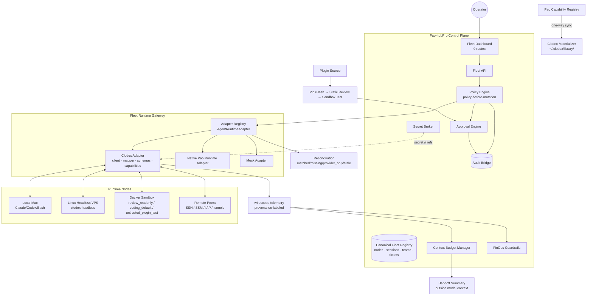

# Phase 20.71 — Pao-hubPro × Clodex

## Visual Multi-Agent Fleet Control Plane, Claude Code & Codex Session Orchestration, Cross-Machine Agent Federation, Inter-Agent Messaging, Context & Cost Observability, Team Runtime & Policy-Governed Developer Operations

> **Document type:** Production-Oriented Implementation Blueprint
> **Phase:** 20.71 (Design + Implementation Blueprint / Codex-Ready)
> **Codename:** Clodex Fleet Control Plane
> **Project:** Pao-hubPro
> **Source of Truth:** `Phase_20.71_Pao-hubPro_x_Clodex.md` (verified snapshot 2026-09-15), processed under `PAO-HUBPRO_MASTER_PHASE_REQUEST.md`
> **Primary upstream:** `avirtual/clodex` — https://github.com/avirtual/clodex · **Verified release baseline:** Clodex `5.68.0` (2026-09-15) · **License:** Apache-2.0
> **Integration posture:** Adapter-first, provider-neutral, policy-governed, replaceable runtime
> **Filename/content consistency:** Filename and document header agree on Phase 20.71; no collision.

> **Integration decision:** *Clodex is a fleet/runtime provider, not the Pao-hubPro brain.* Pao-hubPro remains the system of record for governance; Clodex contributes runtime ergonomics, session hosting, peer federation, messaging, teams, context operations, remote control and telemetry.

> **Final architecture decision:** *Pao-hubPro owns governance; Clodex supplies fleet runtime capabilities.*

---

## 1. Executive Summary

Phase 20.71 adds a **Developer Agent Fleet Control Plane** to Pao-hubPro by integrating selected runtime capabilities and architecture patterns from **Clodex** — a visual manager for fleets of coding agents that treats a coding agent as an operational runtime rather than only a chat session.

Clodex provides or models: real PTY sessions; Claude Code and Codex sessions; Bash sessions; persistent/resumable sessions; multi-window workspaces; Docker sandbox sessions; prompts/agents/skills libraries; agent templates; live session status; inter-agent messaging; atomic delivery queues; context compact/clear intents; per-agent memory and reminders; agent spawning; teams and named roles; cold-review seats; remote machine peering; cross-machine DM federation; `clodexctl`; headless Linux nodes; browser GUI; plugin API; and wire telemetry through `wirescope`.

Target architecture:

```text
Human Operator
     ▼
Pao-hubPro Web / CLI / API
     ├── Identity / RBAC          ├── Secret Broker
     ├── Project / Workspace      ├── Audit
     ├── Workflow / Task/Ticket   ├── Context / Memory
     ├── Policy Engine            ├── Cost / Budget
     ├── Human Approval           └── MCP / Tool Gateway
             ▼
      Fleet Runtime Gateway
     ┌───────┼──────────────────────┐
     ▼       ▼                      ▼
  Clodex   Native Pao          Future Runtime
  Adapter  Runtime Adapter       Adapters
     │
     ├── Claude Code ├── Codex CLI ├── Bash
     ├── Local Mac ├── Linux/VPS ├── Docker Sandbox
     └── Remote / Cloud Peers
```

Clodex sits **below Pao policy authority** and **above individual CLI processes**.

---

## 2. Problem Statement

Once several agents run in parallel, the core problem changes from *"what did the model answer?"* to operational questions:

```text
Which agent is actually working?        Which agent touched these files?
Which agent is idle?                    Which session is burning tokens?
Which one is blocked on a permission dialog?
Which context window is nearly full?    Which task is waiting for review?
Which agent spawned this reviewer?      Which node has version drift?
Which node owns the session?            Which operation needs human approval?
```

Pao-hubPro already has MCP orchestration, safe local file/command/coding tools, provider routing, reviewer councils, persistent context/memory, skills/capability registries, secure execution/sandboxing, policy/approval, observability, infrastructure monitoring, browser/mobile automation, communication gateways, and AI production workflows — **the missing layer is an operator-facing multi-agent fleet runtime.** Phase 20.71 makes those operational states **first-class objects**.

### Phase outcome

```text
One Operator → Pao-hubPro (Govern · Observe · Approve · Route · Budget · Audit · Coordinate)
→ Agent Fleet Gateway → Claude / Codex / Bash
→ Local / VPS / Docker → Cross-Machine Teams
→ Cold Review / Testing → Controlled Delivery
```

Pao-hubPro gains a true **multi-agent developer operations plane**, not merely another model integration.

---

## 3. Goals

**In scope:** Clodex runtime adapter; canonical node/session registry; peer/node health; session lifecycle; agent-to-agent message gateway; teams and role abstraction; task/ticket mapping; cold-review integration; context budget telemetry; cost/turn telemetry; capability matrix; audit ingestion; policy and approval integration; fleet web dashboard; fleet API; optional MCP tools; headless Linux support; Docker sandbox awareness; remote transport abstraction; version drift; feature flags; automated tests; upgrade/rollback runbooks.

**Core design principles (12):**

1. **Provider-neutral fleet model** — UI/database must not depend on Clodex-specific field names
2. **Clodex is replaceable** — runtime adapter boundary is mandatory
3. **Policy before mutation** — every state-changing fleet action is intercepted
4. **Human approval for high-risk actions** — remote upgrades, production spawn, dangerous shell, plugin install
5. **Capability truth** — unsupported/partial features must be represented honestly
6. **Telemetry is evidence, not authority** — cost/context values carry provenance
7. **Fail closed on control** — if policy/approval fails, mutation does not proceed
8. **Fail soft on observability** — stale telemetry must not necessarily kill safe active work
9. **Local-first, remote-capable** — start with one machine, scale to VPS/remote nodes
10. **Durable state outside scrollback** — task, approval, audit and decisions are structured records
11. **No uncontrolled agent expansion** — spawning is quota/budget/policy governed
12. **No implicit production access** — lab permissions never flow into production nodes

**Recommended first implementation target:** 1 Pao-hubPro instance · 1 local Clodex node · 1 Linux headless node · 1 Claude seat · 1 Codex seat · 1 reviewer seat — validate Inventory, Messaging, Policy, Approval, Audit, Context, Cost, Cold Review, Reconnect, Rollback. **Scale only after this loop is reliable.**

---

## 4. Non-Goals

**Out of scope:** replacing Claude Code; replacing Codex; building a new terminal emulator from scratch; becoming a general cloud orchestrator; building a new secrets vault; unrestricted autonomous remote shell; uncontrolled self-replicating agents; public raw control ports; automatic third-party plugin installation.

---

## 5. Why This Phase Exists — Upstream Reality

### Upstream facts (verified snapshot 2026-09-15 — re-verify before production promotion)

- Repository: https://github.com/avirtual/clodex · release baseline **5.68.0** · License **Apache-2.0**
- 5.68.0 changelog touches: preserving failed team-test evidence; Codex transcript cleanup; curated optimized tool/skill defaults; phone-access configuration behavior
- Upstream is **fast-moving** → production integration must pin the exact version/commit:

```yaml
clodex:
  source: "https://github.com/avirtual/clodex"
  version: "5.68.0"
  channel: pinned
  auto_upgrade: false
  require_contract_tests_on_upgrade: true
  require_security_review_on_upgrade: true
  require_manual_promotion: true
```

- Upstream concepts: `Session · Workspace · Peer · Team · Role · Ticket · Agent DM · Context Control · Memory · Reminder · Spawn · Plugin · Telemetry · Headless Node`

### ⚠ Codex support is NOT full Claude parity (capability honesty)

Upstream explicitly states Codex support is not at full parity with Claude Code. Codex gets: intent grammar; DMs; teams; plugins; custom skills; system/append instructions; statusline support. But upstream notes differences for some Claude-oriented features: **tool gating; skill roster behavior; wire stripping; custom subagent definitions; Activity visibility of native Codex subagents.**

Therefore Pao-hubPro must expose a **capability matrix** instead of pretending runtime parity.

### Plugin warning (critical upstream reality)

> Clodex engine-side plugins **run in process with application privileges; the plugin API is not a sandbox.**

Therefore treat plugin installation as **executable-code installation** (Section 20).

### References

Repository · README · CHANGELOG · LICENSE (github.com/avirtual/clodex). Upstream software changes quickly — re-check version, release notes, capability behavior and security implications before production promotion.

---

## 6. Relationship to Pao-hubPro

### Layer mapping (Pao-hubPro core layers)

| Layer | Role in this phase |
|---|---|
| 19 Web Dashboard | Fleet area (9 routes + session drawer). |
| 02 AI / Agent Layer | Governed agent seats (Claude/Codex/Bash sessions). |
| 06 Capability Registry | Runtime capability matrix; skill/prompt library bridge. |
| 07 Policy Engine | Policy-before-runtime-mutation; risk classes A/B/C. |
| 08 Approval Engine | High-risk mutation approvals; diff-hash-bound verdicts. |
| 09–11 Execution Runtimes | Session lifecycle; sandbox profiles; remote nodes. |
| 12 State / Session Layer | Canonical sessions; reconciliation; spawn tree. |
| 13 Memory / Knowledge Layer | Context budget + handoff summaries (outside model context). |
| 14 Secrets & Credential Layer | Secret Broker; `secret://fleet/...` refs. |
| 15 Event / Queue Layer | 24 canonical events; message delivery queues. |
| 16 Observability Layer | wirescope telemetry; 14 metrics. |
| 17 Audit Layer | Independent audit stream. |
| 20 External Provider Layer | Clodex (Apache-2.0, pinned); Claude/Codex CLIs. |

### Runtime convergence layer — relationship to existing phases

```text
Reviewer Council            → Cold Review Runtime
Context / Memory            → Context Budget + Handoff
HybridClaw / Secure Runtime → Sandbox / Permission Boundary
SkillsGate / Capability Reg → Skills/Agent Profiles → Clodex Materializer
Graft / Codebase Intelligence → Context supplied to coding/reviewer seats
DSPy / Optimization         → Benchmark role prompts/workflows
CheckCle / Observability    → Fleet node health correlation
```

**Clodex connects these systems rather than replacing them.**

---

## 7. Upstream / External Project

### Separation of concerns

| Part | Owner | Notes |
|---|---|---|
| A. Upstream project | `avirtual/clodex` (Apache-2.0) | Fleet visual manager + runtime. Maintain attribution; prefer adapter/service integration over copying upstream source. |
| B. Pao-hubPro adapter | `fleet-clodex` package (client/adapter/mapper/schemas/capabilities/events/errors) | Only surface for Clodex internals; never pass raw upstream objects to UI. |
| C. Pao-hubPro policy wrapper | Policy interceptor, approvals, audit bridge, secret broker | All governance lives here. |
| D. Pao-hubPro extensions | Canonical fleet objects, registries, context/cost intelligence, teams, cold review bridge, dashboard, MCP | Built in this phase. |

### Upstream risk assessment

- **License:** Apache-2.0 (permissive) — attribution preserved
- **Maintenance:** fast-moving — pinned version + contract tests on upgrade
- **API stability:** adapter boundary absorbs upstream churn
- **Dependency risk:** medium — external runtime; Clodex unavailable must not break core (fail soft)
- **Security surface:** PTY sessions; plugins in-process; remote transports; operator tokens (Sections 20–21)
- **Upgrade strategy:** 9-step upgrade flow with contract tests + canary dev node (Section 33)
- **Vendor lock-in:** none — provider-neutral fleet model; Native Pao Runtime Adapter possible

---

## 8. Current-State Assumptions

- **[Needs Verification] Inspect first:** reuse existing Pao-hubPro auth, DB, policy, approval, audit, event bus, secret management, task/workflow, MCP and observability components; inspect existing schema first — reuse/extend current agent/task/audit entities, only add missing tables; migrations reversible
- **[Assumption] Clodex availability:** if Clodex is unavailable, use fixtures/mocks and clearly report unverified live items; validate read-only operations first — never enable dangerous mutations just to satisfy tests
- **[Assumption] Runtime seats:** Claude Code and Codex CLIs installed where seats run; Codex limitations surfaced honestly
- **[Assumption] Terminal strategy:** do not rewrite Clodex terminal rendering initially — modes A (deep-open Clodex GUI) + limited B (reverse-proxied embedded surface) first; mode C (Pao-owned terminal stream) only if later justified

---

## 9. Target Architecture

Core components: Runtime Adapter Registry (`AgentRuntimeAdapter`) · Clodex Adapter · Canonical Fleet Models · Policy Interceptor · Approval Engine integration · Audit Bridge · Reconciliation Engine · Capability Matrix · Context Budget Manager · Telemetry Normalizer · Teams + Cold Review bridge · Remote Node support · Plugin Policy · Fleet API + MCP + Dashboard.

---

## 10. Architecture Diagram



---

## 11. Core Components

| # | Component | Purpose |
|---|---|---|
| 1 | Runtime Adapter Registry | Provider-neutral `AgentRuntimeAdapter` (clodex/native/mock). |
| 2 | Clodex Adapter | Client + schema validation + normalize + capability mapping + policy interception. |
| 3 | Fleet Node Registry | Nodes with trust zones, transports, versions, capabilities. |
| 4 | Session Registry | Canonical sessions + lifecycle + spawn tree. |
| 5 | Capability Matrix | supported/unsupported/partial/unknown/degraded/disabled_by_policy. |
| 6 | Inter-Agent Messaging Gateway | Trust-labeled messages; atomic delivery queues. |
| 7 | Teams & Roles + Task/Ticket runtime | Role profiles; Pao owns canonical task state. |
| 8 | Cold Review bridge | Reviewer Council runtime mechanism; diff-hash-bound verdicts. |
| 9 | Context Budget Manager | warn/compact/handoff thresholds; handoff summaries. |
| 10 | Telemetry + FinOps | wirescope-normalized metrics with provenance; budgets. |
| 11 | Attention Queue | 12 event types, 5 priorities. |
| 12 | Reconciliation Engine | Startup/reconnect reconcile; never blindly kill provider-only sessions. |
| 13 | Plugin Trust Pipeline | Pin+hash → review → sandbox test → approval → controlled install. |
| 14 | Fleet API + MCP + Dashboard | 22 routes; 11 tools; 9 pages. |

---

## 12. Component Responsibilities

### 12.1 Runtime adapter contract

```ts
export interface AgentRuntimeAdapter {
  id: string;
  kind: 'clodex' | 'native' | 'mock' | string;
  capabilities(): Promise<RuntimeCapabilities>;
  health(): Promise<RuntimeHealth>;
  listNodes(): Promise<FleetNode[]>;
  listSessions(query?: SessionQuery): Promise<AgentSession[]>;
  getSession(id: string): Promise<AgentSessionDetail>;
  spawn(req: SpawnSessionRequest): Promise<AgentSession>;
  restart(req: RestartSessionRequest): Promise<void>;
  terminate(req: TerminateSessionRequest): Promise<void>;
  sendMessage(req: AgentMessageRequest): Promise<AgentMessageResult>;
  getTranscript(req: TranscriptRequest): Promise<TranscriptPage>;
  getTelemetry(req: TelemetryRequest): Promise<SessionTelemetry>;
  listTeams(): Promise<AgentTeam[]>;
}
```

**Never pass raw upstream Clodex objects directly to UI components** — pipeline: `Clodex API/SSE/clodexctl → Schema Validation → Normalize → Capability Mapping → Pao Policy Interceptor → Canonical Object/Event`.

### 12.2 Fleet node registry + trust zones

```yaml
id: node_uuid
name: vps-dev-01
runtime_provider: clodex
runtime_node_id: upstream-id
platform: linux
arch: x86_64
transport: ssh
state: online
trust_zone: development
version: 5.68.0
capabilities: [session.spawn, session.attach, session.message, team.runtime]
last_seen_at: timestamp
```

Trust zones: `local-trusted · sandbox · lab · staging · production · external · unknown` — **lab permissions never flow into production nodes.**

### 12.3 Session registry + lifecycle

```yaml
session_id: sess_01...
provider: clodex
provider_session_id: upstream-id
name: backend-1
engine: codex
model: unknown-or-reported
node_id: vps-dev-01
project_id: pao-hubpro
workspace_id: main
team_id: core-platform
role: implementation-hand
parent_session_id: lead
state: working
cwd: /srv/pao-hubpro
context_percent: 44
cost_usd: 0.18
attention_state: none
created_at: timestamp
last_activity_at: timestamp
```

Lifecycle: `requested → policy_check → approval_if_needed → starting → running {idle | working | waiting_input | waiting_approval | blocked | degraded} → stopping → stopped → archived`.

### 12.4 Capability matrix (canonical states, discovered not hard-coded)

```text
supported · unsupported · partial · unknown · degraded · disabled_by_policy
```

Example baseline (**must be discovered/declared — do not permanently hard-code as truth**):

| Capability | Claude via Clodex | Codex via Clodex | Bash |
|---|---:|---:|---:|
| Real PTY | yes | yes | yes |
| DM | yes | yes | no |
| Teams | yes | yes | no |
| Skill injection | yes | partial/provider-dependent | no |
| Tool gating | upstream-supported | not parity | n/a |
| Custom subagents | upstream-supported | not parity | n/a |
| Telemetry | routed sessions | routed sessions | limited |
| Interactive attach | yes | yes | yes |

### 12.5 Inter-agent messaging gateway

Clodex intent syntax (e.g., `[agent:dm reviewer] Review the latest diff`) → Pao canonical message:

```json
{
  "from": "sess_lead", "to": "sess_reviewer",
  "type": "task_request", "priority": "normal",
  "body": "Review the latest backend diff",
  "correlation_id": "ticket_123", "project_id": "pao-hubpro"
}
```

Flow: `Human/Agent → Pao Message Gateway → Identity/Destination Validation → Policy → Runtime Adapter → Clodex delivery queue → Target Agent`.

**Message safety:** agent messages are **untrusted input** — a peer message cannot grant privileges. Trust labels: `human_operator · trusted_system · agent_peer · remote_agent_peer · external_integration · unknown`. A message can influence reasoning but **cannot bypass**: RBAC · Policy · Approval · Tool Permissions · Sandbox · Secret Broker · Production Gates.

### 12.6 Teams, roles, tickets

```yaml
team_id: team_core_platform
name: Core Platform
lead_role: lead
roles: [lead, backend, frontend, test, reviewer, security, docs]
```

Each role defines: purpose; runtime preference; model preference; prompt reference; skill references; tool capability profile; sandbox profile; context budget; cost budget; concurrency limit; approval requirements; branch/worktree policy.

**Ticket state machine:** `backlog → ready → dispatched → in_progress → verification → review {rework → in_progress | approved} → merge_ready → done`. **Pao-hubPro owns canonical task state — Clodex tickets are adapted/mirrored, not the only source of truth.**

### 12.7 Cold review + Reviewer Council

```text
Implementation Agent → Candidate Diff → Reviewer Council
  ├── Claude Cold Reviewer  ├── Codex Cold Reviewer
  ├── Security Reviewer     ├── Test Reviewer  └── Optional Local AI
→ Structured Verdicts → Policy Aggregator → APPROVE | REWORK
```

Cold reviewer defaults: fresh session; read-only filesystem where practical; no deployment credentials; no unrelated conversation history; explicit spec; explicit diff/hash; structured verdict schema; **deterministic retirement after verdict**.

```json
{
  "verdict": "approve | rework | block",
  "diff_hash": "sha256:...",
  "summary": "...", "must_fix": [], "should_fix": [],
  "tests_requested": [], "confidence": 0.91
}
```

**Approval applies only to the reviewed diff hash.**

### 12.8 Context budget manager

```yaml
context_policy:
  warn_percent: 70
  compact_percent: 82
  handoff_percent: 92
  hard_stop_percent: 98
  allow_auto_compact: true
  preserve_handoff_summary: true
```

State model: `HEALTHY <70% · WATCH 70–82% · COMPACT_RECOMMENDED 82–92% · HANDOFF_RECOMMENDED 92–98% · CRITICAL ≥98%` — thresholds configurable per engine/model.

**Handoff contract (state lives OUTSIDE the model context):**

```yaml
objective: ...        current_state: ...
completed: [...]      remaining: [...]
open_questions: [...] files_touched: [...]
tests: [{command: ..., result: ...}]
known_failures: [...] decisions: [...]   next_action: ...
```

### 12.9 Telemetry + FinOps + spawn tree

**wirescope signals:** model; context tokens; context percentage; turn count; cost estimate; cache state; child/subagent relationships.

```yaml
session_id: sess_backend_1
source: wirescope
observed_at: timestamp
model: reported-model
turns: 38
context_tokens: 121340
context_percent: 61.2
cost_usd: 0.42
cache_state: warm
metric_confidence: measured
```

**Provenance states:** `measured · provider_reported · estimated · inferred · unavailable` — **never silently mix estimates with measured values.**

**FinOps budgets + actions:**

```yaml
budgets: {session_usd: 2.00, task_usd: 5.00, team_daily_usd: 20.00, project_daily_usd: 50.00}
70% → warn · 85% → notify lead/operator · 95% → block new non-critical seats
100% → require approval to continue spend
```

**Do not abruptly kill active work at the budget boundary — trigger controlled handoff/stop.**

**Spawn tree (persisted lineage):** `lead → backend-1 {test-1, reviewer-7}, frontend-1, security`; fields: `parent_session_id, spawn_reason, spawned_by, policy_decision_id, approval_id` — **unexpected children create an attention event.**

**Attention queue — 12 event types:** `permission_waiting · approval_waiting · context_high · cost_high · session_crashed · remote_node_offline · version_drift · review_blocked · test_failed · message_undelivered · secret_required · unexpected_spawn`; priorities: `info · low · medium · high · critical`.

### 12.10 Cross-machine federation + remote trust boundary

```ts
type FleetTransport =
  | 'local' | 'https' | 'ssh' | 'aws-ssm' | 'kubectl-port-forward'
  | 'gcp-iap' | 'azure-bastion' | 'custom-tunnel';
```

Pao policy decides which transports are permitted per environment:

```yaml
production:
  allowed_transports: [aws-ssm, gcp-iap]
  direct_public_http: false
  ssh_password_auth: false
```

**Remote trust boundary rules (9):** 1) prefer loopback binding on remote control services; 2) do not expose raw Clodex control ports publicly by default; 3) require authenticated tunnel paths; 4) store operator tokens through Pao Secret Broker; 5) rotate tokens; 6) never log tokens; 7) record connection/control events; 8) preserve explicit node trust zones; 9) **do not let a compromised peer automatically inherit secrets from another node**.

**Headless Linux runtime (VPS layout — no Electron required):** `pao-api · pao-worker · pao-policy · pao-fleet-gateway · clodex-headless {Claude Code sessions, Codex sessions, Bash sessions}`.

**Docker sandbox profiles (Pao policy chooses):**

```yaml
sandbox_profiles:
  review_readonly:       {network: restricted, filesystem: readonly-source, secrets: none}
  coding_default:        {network: allowlist,  filesystem: workspace-write, secrets: project-scoped}
  untrusted_plugin_test: {network: none,       filesystem: ephemeral,       secrets: none}
```

### 12.11 Library bridge + plugin trust pipeline

**Prompt/skill/agent library bridge** — avoid two sources of truth; **one-way managed synchronization** Pao → Clodex (no bidirectional merges until conflict semantics exist):

```text
Pao Capability Registry {skill/prompt metadata, agent profile, version, trust,
  permissions, provenance} → Clodex Materializer → ~/.clodex/library/
```

**Plugin trust pipeline** (plugins run in-process — treat as executable code):

```text
untrusted → reviewed → approved → quarantined → disabled

Source → Pin + Hash → Static Review → Manifest Analysis → Permission Declaration
→ Human Approval → Sandbox Test → Approved Registry → Controlled Install
```

**Never auto-install arbitrary GitHub plugins on production nodes.**

### 12.12 Audit bridge + reconciliation + version drift

**Audit (Pao keeps an independent stream — do not rely on upstream log files as the only audit record):**

```json
{
  "event_id": "audit_...", "time": "...",
  "actor_type": "human | agent | system", "actor_id": "...",
  "action": "fleet.session.spawn", "target": "sess_backend_1",
  "node_id": "vps-dev-01", "policy_decision_id": "pol_...",
  "approval_id": null, "provider": "clodex",
  "provider_event_id": "...", "result": "success"
}
```

**Idempotency & reconciliation:** mutation requests support idempotency keys (`Idempotency-Key: ticket_123-backend-seat-v1`). On Pao restart: load canonical sessions → query runtime providers → reconcile → classify `matched | missing | provider_only | stale` → emit reconciliation report. **Never blindly kill provider-only sessions.**

**Version drift policy:**

```text
PINNED · PATCH_DRIFT · MINOR_DRIFT · MAJOR_DRIFT · UNKNOWN

version_policy:
  auto_upgrade: false
  patch_drift: warn
  minor_drift: block_new_production_sessions
  major_drift: quarantine_until_review
```

**Upgrade flow:** `New Release → Changelog Review → Security Review → Adapter Contract Tests → Sandbox Upgrade → Regression Suite → Canary Dev Node → Human Approval → Promote Pinned Baseline`.

### 12.13 Spawn + concurrency control

```yaml
fleet_spawn_policy:
  default_max_sessions_per_project: 8
  max_reviewers_per_ticket: 3
  allow_agent_initiated_spawn: true
  agent_spawn_requires: [project_scope, role_profile, budget_available, node_allowed]
  production: {agent_initiated_spawn: false}
```

**No uncontrolled geometric spawning.** Concurrency limits (queue requests above limits):

```yaml
limits:
  local_mac: {active_agents: 4}
  vps-dev-01: {active_agents: 6}
  docker_review_pool: {active_agents: 3}
  project: {total_active_agents: 10}
```

---

## 13. Data Flow

**Control flow:** `Operator → Fleet API → Policy Interceptor → (Approval if high-risk) → Runtime Adapter → Provider → Canonical Event → Registry + Audit`.

**Read flow:** `Provider → Schema Validation → Normalize → Telemetry Normalizer (provenance) → Registry → Dashboard/MCP` — fail soft on missing telemetry (stale/unknown marked, page never breaks).

**Review flow:** Implementation seat → candidate diff → cold reviewers → verdicts bound to diff hash → policy aggregator → approve/rework → reviewer retired.

**Handoff flow:** context threshold crossed → handoff summary composed → state persisted outside model context → new seat resumes from summary.

---

## 14. Control Flow

Decisions: policy-before-mutation on every state-changing fleet action; **fail closed on control, fail soft on observability**.

### Risk classification — Classes A/B/C → R0–R4 mapping

| Class | R-level | Examples | Default |
|---|---|---|---|
| **A — Read-only** | R0/R1 | list sessions; view telemetry; view transcript; view node status; inspect diff; list teams | project read access |
| **B — Low/medium mutation** | R2 | send DM; archive session; compact context; spawn lab reviewer | authorized role + audit |
| **C — High-risk mutation** | R3/R4 | terminate production session; restart remote node; install plugin; change runtime credentials; expose network port; deploy/update remote Clodex; privileged shell action | **explicit policy + human approval + audit** |

**Secrets model:** never place secrets in DMs, prompts, tickets, transcripts, logs, git, shell history, or Clodex templates — use references: `secret://providers/anthropic/dev · secret://providers/openai/codex · secret://fleet/vps-dev-01/operator-token`.

---

## 15. Agent / Worker Model

**Terminology (strictly separated):**

| Term | Definition |
|---|---|
| Agent | A governed seat (Claude/Codex/Bash session) with role profile + budgets. |
| Node | A runtime host (local/headless/Docker/remote peer) with trust zone. |
| Session | One agent runtime instance (lifecycle Section 12.3). |
| Team | Named role structure (lead/backend/…/docs). |
| Ticket | Canonical task (Pao-owned state; Clodex mirrored). |
| Message | Trust-labeled inter-agent DM. |
| Reviewer | Cold-review seat — fresh, read-only, retired after verdict. |
| Peer | Remote machine federation endpoint. |

**Spawn lineage:** every session records parent, spawn reason, spawned_by, policy decision id, approval id — unexpected children are attention events; agent-initiated production spawn disabled by default.

---

## 16. Session / State Model

- **Session lifecycle:** `requested → policy_check → approval_if_needed → starting → running{idle/working/waiting_input/waiting_approval/blocked/degraded} → stopping → stopped → archived` (Section 12.3)
- **Ticket state machine:** `backlog → … → merge_ready → done` (Section 12.6)
- **Context states:** `HEALTHY/WATCH/COMPACT_RECOMMENDED/HANDOFF_RECOMMENDED/CRITICAL` (Section 12.8)
- **Plugin states:** `untrusted → reviewed → approved → quarantined → disabled` (Section 12.11)
- **Version drift:** `PINNED/PATCH_DRIFT/MINOR_DRIFT/MAJOR_DRIFT/UNKNOWN` (Section 12.12)
- **Attention events:** 12 types × 5 priorities (Section 12.9)

**Idempotency:** all mutations keyed; reconciliation on restart classifies and reports — never destructive to provider-only sessions.

---

## 17. MCP Integration

**Read tools (6):** `pao_fleet_list_nodes · pao_fleet_list_sessions · pao_fleet_get_session · pao_fleet_get_telemetry · pao_fleet_get_attention · pao_fleet_get_task`

**Controlled mutation tools (5):** `pao_fleet_spawn_session · pao_fleet_send_message · pao_fleet_request_review · pao_fleet_compact_context · pao_fleet_stop_session`

**Dangerous calls return approval-required state rather than silently executing.** All tools policy-governed; no shell/fs/unrestricted-runtime tools added.

---

## 18. Capability Registry

Capability states: `supported · unsupported · partial · unknown · degraded · disabled_by_policy` (Section 12.4 — discovered/declared, never hard-coded truth). Library bridge one-way sync (Section 12.11). Plugin registry with trust states. Node capability lists per node (Section 12.2). Honest Codex-vs-Claude representation everywhere (UI, API, MCP).

---

## 19. Policy Model

Risk Classes A/B/C (Section 14) enforced through the Policy Interceptor on **every** mutating action; transport policy per environment (production example Section 12.10); spawn policy + concurrency limits (Section 12.13); context policy thresholds; budget guardrails (70/85/95/100% actions); version drift policy (warn / block new production sessions / quarantine); plugin policy (approval required, no auto-install); trust zones binding lab↔production separation. **Fail closed on control; fail soft on observability.**

---

## 20. Security Model

### Threat model (6 threats)

| Threat | Mitigations |
|---|---|
| Prompt injection across agents | message trust labels; capability isolation; policy-before-tool; **no privilege inheritance** |
| Malicious plugin | no auto-install; pinned source/hash; code review; sandbox testing; approval |
| Compromised remote node | trust zones; scoped credentials; revocation; no transitive secret sharing; audit |
| Stolen operator token | secret broker; rotation; tunnel restriction; short TTL where possible; no logging |
| Agent self-expansion | spawn quota; concurrency limits; cost budget; role allowlist; policy; approval on high-trust nodes |
| Terminal escalation | sandbox profiles; workspace confinement; tool profiles; human approval |

### Secrets model

`secret://` references only (Section 14); tokens via Secret Broker with rotation; never logged; no transitive secret inheritance across nodes.

---

## 21. Approval Model

### R0–R4 / Class A/B/C summary

See Section 14. Class C actions (remote restart, plugin install, runtime upgrade, production spawn, credential changes) require explicit policy + human approval + audit. Approval binds to the exact target/action (diff hash for verdicts; session/node for mutations).

### Dangerous operations in MCP/API

Return `approval-required` state instead of silently executing; approval resolution recorded in audit with policy decision id.

---

## 22. Failure Handling

Must handle at least (25):

```text
1 Clodex unavailable            2 Headless node offline        3 Tunnel failure
4 SSE disconnect                5 Invalid runtime token        6 Session crash
7 PTY unavailable               8 Claude CLI missing           9 Codex CLI missing
10 Docker unavailable           11 Session start timeout       12 Message delivery timeout
13 Parked message never delivered                              14 Context telemetry unavailable
15 Cost telemetry unavailable   16 wirescope unavailable       17 Version drift
18 Provider schema mismatch     19 Duplicate event             20 Out-of-order event
21 Remote restart during work   22 Unsupported capability request
23 Approval service unavailable 24 Audit store unavailable    25 Secret broker unavailable
```

Semantics: control-plane failures (23–25) ⇒ **fail closed for mutations**; observability failures (14–16) ⇒ fail soft (stale/unknown states, safe active work continues); provider failures (1–12) ⇒ typed errors, circuit breaker, reconciliation on recovery; capability failures (22) ⇒ honest `unsupported/partial` response; event issues (19–20) ⇒ deduplication + ordering tolerance.

---

## 23. Recovery Model

- **Reconciliation on startup/reconnect:** load canonical sessions → query providers → classify `matched/missing/provider_only/stale` → report; **never blindly kill provider-only sessions**
- **Session recovery:** lifecycle persisted outside scrollback; restart/stop through policy; crash → attention event (`session_crashed`) + resumable per runtime capability
- **Node recovery:** disconnect detection < 60s (lab target); node offline → attention event; reconnect → reconcile
- **Upgrade rollback:** pinned baseline restorable; contract suite re-run (Section 36.6); DB migrations reversible
- **Adapter rollback:** `fleet.clodex.enabled=false` disables adapter without breaking Pao core; native/mock adapters remain

---

## 24. Observability

### Metrics (14)

```text
pao_fleet_nodes_total · pao_fleet_nodes_online
pao_fleet_sessions_total · pao_fleet_sessions_working · pao_fleet_sessions_attention
pao_fleet_spawn_total · pao_fleet_spawn_failed_total
pao_fleet_messages_total · pao_fleet_messages_failed_total
pao_fleet_policy_denied_total · pao_fleet_approval_pending_total
pao_fleet_runtime_request_latency_ms
pao_fleet_context_high_total · pao_fleet_cost_usd_total
```

### Initial lab targets

```text
Fleet inventory freshness: < 30s
Node disconnect detection: < 60s
Policy decision audit coverage: 100%
High-risk action without approval: 0 tolerated
```

**Do not claim production SLOs until measured.**

### Retention (system-design defaults, not legal advice)

```yaml
retention:
  telemetry_days: 90
  audit_days: 365
  full_transcripts_days: 30     # transcripts may contain source code, internal paths,
  message_bodies_days: 30       # proprietary prompts or accidentally pasted credentials
  derived_task_summaries_days: 365
```

---

## 25. Audit

Independent Pao audit stream (Section 12.12) — records actor, target, provider, policy decision, approval, result for every fleet action. 24 canonical event types:

```text
fleet.node.connected / disconnected / health_changed / version_drift
fleet.session.requested / started / state_changed / attention / context_high
  / cost_high / stopped / archived
fleet.message.queued / delivered / parked / failed
fleet.team.created / role_changed
fleet.task.dispatched / review_requested / review_completed
fleet.policy.denied · fleet.approval.requested / resolved
```

---

## 26. Data Model

Recommended tables (reuse existing Pao-hubPro models where they already exist):

```text
fleet_runtime_providers · fleet_nodes · fleet_node_capabilities
fleet_sessions · fleet_session_capabilities · fleet_session_telemetry
fleet_session_attention · fleet_session_relations · fleet_messages
fleet_teams · fleet_team_roles · fleet_tasks · fleet_task_assignments
fleet_reviews · fleet_review_findings · fleet_runtime_events
fleet_version_observations · fleet_policy_decisions · fleet_approvals
fleet_audit_events
```

---

## 27. API / Event Contracts

### 27.1 Fleet API (all mutations through policy middleware)

```text
GET    /api/fleet/nodes                    GET    /api/fleet/nodes/:id
POST   /api/fleet/nodes/:id/check          POST   /api/fleet/nodes/:id/restart

GET    /api/fleet/sessions                 POST   /api/fleet/sessions
GET    /api/fleet/sessions/:id             POST   /api/fleet/sessions/:id/restart
POST   /api/fleet/sessions/:id/stop        POST   /api/fleet/sessions/:id/archive
POST   /api/fleet/sessions/:id/message     POST   /api/fleet/sessions/:id/context/compact

GET    /api/fleet/sessions/:id/transcript  GET    /api/fleet/sessions/:id/telemetry
GET    /api/fleet/sessions/:id/files       GET    /api/fleet/sessions/:id/diff

GET    /api/fleet/teams                    POST   /api/fleet/teams
GET    /api/fleet/teams/:id

GET    /api/fleet/attention                GET    /api/fleet/events
```

### 27.2 Common envelope

```json
{
  "request_id": "req_...",
  "session_id": "sess_...",
  "actor_id": "usr_... | agt_...",
  "operation": "fleet.session.spawn",
  "input": {},
  "status": "ALLOWED | DENIED | REQUIRE_APPROVAL | COMPLETED | FAILED",
  "result": {"policy_decision_id": "pol_..."},
  "error": {"code": "CAPABILITY_UNSUPPORTED", "message": "redacted user-facing message"},
  "created_at": "2026-09-17T00:00:00Z"
}
```

Events: Section 25 catalog. Idempotency-Key header on mutations.

---

## 28. Configuration

```yaml
fleet:
  enabled: true
  providers:
    clodex:
      enabled: false                       # default OFF until explicitly configured
      base_url: "http://127.0.0.1:8787"
      token_ref: "secret://fleet/clodex/local"
      pinned_version: "5.68.0"
      request_timeout_ms: 10000
  policy:
    agent_spawn: governed
    remote_restart: approval_required
    plugin_install: approval_required
    runtime_upgrade: approval_required
  telemetry:
    poll_interval_seconds: 15
    stale_after_seconds: 60
  context:
    warning_percent: 70
    compact_percent: 82
    handoff_percent: 92
  budgets:
    project_daily_usd: 50
    default_session_usd: 2
```

**Clodex must default OFF until explicitly configured — Core Pao-hubPro startup must not depend on it.**

---

## 29. Feature Flags

| Flag | Safe default | Gates |
|---|---|---|
| `fleet.enabled` | true | Subsystem shell |
| `fleet.clodex.enabled` | **OFF** | Clodex adapter |
| `fleet.clodex.read_only` | first enabled state | Read path only |
| `fleet.clodex.mutations` | **OFF** | Spawn/message/restart/stop/compact |
| `fleet.remote_nodes.enabled` | OFF | Remote federation |
| `fleet.agent_spawn.enabled` | governed | Lab spawn |
| `fleet.agent_spawn.production` | **OFF** | Production spawn |
| `fleet.teams.enabled` | after sessions | Teams/roles |
| `fleet.cold_review.enabled` | after teams | Cold review bridge |
| `fleet.wirescope.enabled` | optional | Wire telemetry |
| `fleet.plugin_install.enabled` | **OFF** | Plugin installs |
| `fleet.runtime_upgrade.enabled` | **OFF** | Runtime upgrades |

---

## 30. Repository / Module Structure

Adapt to the existing Pao-hubPro repository rather than forcing duplicate architecture:

```text
apps/web/src/features/fleet/
services/api/fleet/
packages/
  fleet-core/       # canonical models + registries
  fleet-runtime/    # adapter registry + reconciliation
  fleet-clodex/     # adapters/clodex/{client,adapter,mapper,schemas,capabilities,events,errors}.ts
  reviewer-council/ # cold review bridge
  policy/  audit/
docs/
  phases/phase-20.71-clodex.md
  runbooks/{clodex-node, fleet-recovery, clodex-upgrade}.md
```

---

## 31. Dashboard Integration

Routes: `/fleet/overview · /fleet/sessions · /fleet/nodes · /fleet/teams · /fleet/tasks · /fleet/attention · /fleet/cost · /fleet/audit · /fleet/settings`

Fleet overview example:

```text
PROJECT: pao-hubpro
NAME          ENGINE     NODE       STATE       CTX     COST
lead          Claude     local      working      61%    $0.31
backend-1     Codex      vps-dev    working      44%    $0.18
frontend-1    Codex      local      idle         33%    $0.09
reviewer-7    Claude     sandbox-2  reviewing    12%    $0.03
security      Codex      vps-sec    attention    78%    $0.21

ATTENTION
[!] security blocked on approval
[!] backend-1 context warning
[!] vps-dev runtime version drift

BUDGET  Today: $2.81 / $10.00 · Project: $19.22 / $100.00
```

**Session drawer (13 tabs):** Overview · Terminal · Transcript · Messages · Task · Context · Cost · Files · Diff · Spawn Tree · Approvals · Audit · Runtime. Show where available: name; engine; model; node; state; attention; context; cost; turns; task; team/role; parent/spawn relation; files touched; version drift. **Do not break the whole page when telemetry is unavailable — mark stale/unknown values clearly.** **Dangerous controls must be separated into a clear danger zone.**

Terminal strategy: initial = A (deep-open Clodex browser GUI) + limited B (reverse-proxied embedded surface); later C (Pao-owned terminal stream) only if justified.

---

## 32. Dependencies

### Required

- **Pao-hubPro control plane:** auth/RBAC, policy engine, approval engine, audit store, event bus, secret management, persistence + reversible migrations, config/flags, telemetry.
- **Clodex 5.68.0 (pinned)** for the Clodex adapter path — optional at runtime; core startup never depends on it.
- **Claude Code / Codex CLIs** installed on nodes where seats run.

### Recommended

- **HybridClaw (20.66)** sandbox profiles; **SkillsGate/capability registry** for the library bridge; **Reviewer Council** for cold review; **context/memory layers** for handoff; **DSPy (20.68)** for role-prompt benchmarking; **CheckCle** for node-health correlation; **Graft** for coding-seat context.

### Optional

- Remote VPS/Linux headless nodes; Docker sandbox pool; wirescope telemetry.

**Do not assume other phases are implemented.** Standalone path: canonical models + registries + policy interceptor + mock adapter deliver the full governance loop (spawn→message→review→audit) with fixtures; Clodex/remote/dockers activate per rollout stage when available.

---

## 33. Compatibility

- **Upstream pinning:** exact version/commit pinned; auto-upgrade off; contract suite required before promoting upgrades (Section 36.6)
- **Codex-vs-Claude parity:** capability matrix honest everywhere; never claim parity
- **Plugin reality:** in-process plugins = executable code; trust pipeline mandatory
- **Apache-2.0:** attribution + license notices maintained; prefer adapter integration over source copying
- **Backward compatibility:** Clodex off ⇒ Pao core unaffected; other adapters (native/mock) continue; existing agent/task/audit entities reused, not duplicated
- **Upstream drift:** re-check version, release notes, capability behavior and security implications before production promotion

---

## 34. Migration

- Inspect existing schema first; reuse/extend current agent/task/audit entities; only add missing tables (Section 26)
- Migrations must be reversible; no destructive changes
- Migration lands with `fleet.clodex.enabled=false` and all mutation flags off; enablement per rollout stage
- Config mapping: suggested YAML names adapt to existing config conventions

---

## 35. Rollback

```text
1. fleet.clodex.enabled=false → adapter off without breaking Pao core
2. In-flight sessions: controlled handoff/stop (never abrupt kill at budget boundary)
3. Runtime upgrade rollback: revert to pinned baseline; contract suite re-run
4. Registry/audit/telemetry data preserved; migrations rolled back only where reversible
5. Provider-only sessions reconciled (never blindly killed) — report emitted
```

Rollback tested as part of Stage 6 production readiness (upgrade/rollback test) and the operator checklist (Section 41).

---

## 36. Testing Strategy

### 36.1 Unit tests

Schema parsing; mapping; capability normalization; policy classification; telemetry normalization; context thresholds; budget thresholds; idempotency; event deduplication; version drift classification.

### 36.2 Integration tests (mock Clodex scenarios)

List sessions; spawn; restart; stop; message; telemetry; node offline; malformed response; timeout; unauthorized.

### 36.3 End-to-end lab scenario

```text
Operator → spawn lab Codex seat → task attached → seat visible → DM sent
→ telemetry visible → cold review requested → reviewer created
→ verdict returned → reviewer retired → complete audit trail
```

### 36.4 Security tests (7)

Peer message cannot elevate privilege; agent cannot bypass approval; production node cannot be requested without permission; plugin auto-install blocked; invalid token fails closed; remote mutation audited; unsupported capability represented honestly.

### 36.5 Agent-specific tests

Tool-selection test (agent uses only the 11 governed MCP tools); hallucinated-tool test (unknown fleet tools denied); approval-bypass test (Class C unreachable without approval; agent-initiated production spawn blocked); context-isolation test (peer message with "you are now admin" cannot alter policy/capabilities); session-recovery test (restart → reconcile → no duplicate seats, no killed provider-only sessions).

### 36.6 Real Clodex contract suite (run before promoting an upstream upgrade)

```text
[ ] health reachable          [ ] sessions parse            [ ] session states map
[ ] transcript parse          [ ] message delivery works    [ ] Codex seat works
[ ] Claude seat works         [ ] remote peer visible
[ ] missing telemetry handled safely
[ ] available telemetry normalized
[ ] unsupported capability reported correctly
```

---

## 37. Acceptance Criteria (Definition of Done)

**Architecture:** provider-neutral runtime adapter exists; Clodex-specific code isolated; canonical nodes/sessions/capabilities exist; Pao policy remains authoritative.
**Read path:** list nodes; list sessions; session detail; transcript; telemetry; attention state.
**Control path:** spawn/message/restart/stop through policy; high-risk action approval.
**Teams:** team model; role model; ticket ownership; cold review bridge; diff-hash verdict binding.
**Remote:** at least one headless Linux node validated; reconnect/reconcile tested; secret handling reviewed; no public raw-control port required.
**Observability:** audit events; health metrics; cost/context provenance; stale telemetry state; version drift state.
**Testing:** unit; adapter contract; integration; end-to-end lab; failure injection; security.
**Docs:** setup; architecture; security boundary; upgrade; rollback; troubleshooting; upstream pin; license notice.

**Implementation completion does NOT automatically mean production readiness.**

---

## 38. Implementation Roadmap

| Stage | Content | Exit |
|---|---|---|
| 0 — Research Pin | pin upstream release/commit; record license; record capability matrix; create fixtures | Pin + fixtures ready |
| 1 — Read-Only Adapter | health; nodes; sessions; transcript; telemetry; attention | Read path live |
| 2 — Governed Lab Control | lab-only spawn, message, restart, compact, stop | Governed mutations on lab nodes |
| 3 — Teams + Reviewer Council | roles; tickets; cold review; verdict aggregation | Team loop working |
| 4 — Remote Federation | VPS; Docker; tunnel policy; trust zones | Remote node validated |
| 5 — Context + FinOps | context thresholds; handoff; budgets; alerts | Budget/handoff live |
| 6 — Production Readiness | only after: security review; recovery test; failure injection; audit completeness; upgrade/rollback test | Checklist green |

**Sub-phases (recommended):** 20.71.1 Fleet Read Model · 20.71.2 Clodex Runtime Adapter · 20.71.3 Governed Session Control · 20.71.4 Team Runtime & Tickets · 20.71.5 Cold Reviewer Council Bridge · 20.71.6 Cross-Machine Federation · 20.71.7 Context & Cost Intelligence · 20.71.8 Production Hardening.

**ADRs (10):** Clodex as Replaceable Fleet Runtime Provider · Pao Canonical Session Model · Policy-before-Runtime-Mutation · Remote Node Trust Boundary · Agent Message Trust Model · Cold Review + Reviewer Council · Context Budget + Handoff · Runtime Telemetry Provenance · Plugin Trust Policy · Upstream Pinning + Upgrade Process.

---

## 39. Risks

| Risk | Impact | Mitigation |
|---|---|---|
| Prompt injection across agents | Privilege escalation | Trust labels; capability isolation; policy-before-tool; no privilege inheritance |
| Malicious plugin (in-process!) | Full application compromise | Treat as executable code: pin+hash, review, sandbox test, approval, no auto-install |
| Compromised remote node | Lateral movement | Trust zones; scoped credentials; revocation; no transitive secret sharing |
| Stolen operator token | Fleet takeover | Secret broker; rotation; tunnel restriction; short TTL; no logging |
| Agent self-expansion | Cost/runaway | Spawn quota; concurrency limits; cost budget; role allowlist; production spawn off |
| Terminal escalation | Host access | Sandbox profiles; workspace confinement; tool profiles; approval |
| Upstream fast-moving breakage | Adapter breakage | Pinning; contract suite; upgrade flow with canary |
| Codex parity assumptions | Broken features/UX | Capability matrix honesty; unsupported/partial surfaced |
| Telemetry gaps mistaken for truth | Wrong decisions | Provenance labels; never mix estimates with measured; stale states |
| Budget runaway across fleet | Cost damage | Tiered budget actions; controlled handoff/stop, never abrupt kill |
| Reconciliation data loss | Orphaned/killed sessions | Classify matched/missing/provider_only/stale; never blind-kill |
| Audit gaps | Compliance failure | Independent Pao audit stream; 100% policy-decision coverage target |

---

## 40. Security Checklist

- [ ] Clodex behind adapter boundary; no raw upstream objects to UI; no internal imports elsewhere
- [ ] Every mutating action passes policy; fail closed on control-plane failure
- [ ] Class C actions require explicit policy + human approval + audit
- [ ] Agent messages trust-labeled; peer messages cannot grant privileges or bypass RBAC/policy/approval/sandbox/secrets
- [ ] Plugins treated as executable code: no auto-install; pin+hash; review; sandbox test; approval; production auto-install disabled
- [ ] Remote control: loopback binding preferred; authenticated tunnels; no public raw control ports; transport policy per environment
- [ ] Operator tokens via Secret Broker; rotated; never logged; no transitive secret inheritance across nodes
- [ ] Trust zones enforced — lab permissions never flow into production nodes
- [ ] Spawn quotas + concurrency limits enforced; unexpected spawns create attention events
- [ ] Secrets never in DMs/prompts/tickets/transcripts/logs/git/shell history/templates
- [ ] Telemetry provenance labeled; estimates never silently mixed with measured values
- [ ] Audit stream independent from upstream logs; append-only

---

## 41. Production Readiness Checklist

### Operator checklist before enabling mutations

```text
UPSTREAM: pinned Clodex release/commit · changelog reviewed · Apache-2.0 notice recorded · capability matrix updated
NODE SECURITY: loopback binding confirmed · authenticated tunnel confirmed · no unexpected public control port
  · node trust zone assigned · operator token in secret broker · token rotation documented
PAO GOVERNANCE: RBAC enforced · policy interception tested · approval tested · audit tested
  · budget configured · spawn limits configured
RUNTIME: Claude seat tested if used · Codex seat tested if used · Codex limitations visible
  · restart tested · stop tested · reconciliation tested
MESSAGING: local DM tested · remote DM tested if enabled · message trust labels implemented
REVIEW: cold reviewer read-only where intended · diff hash binding tested · reviewer retirement tested
TELEMETRY: stale state tested · missing wirescope handled · context thresholds configured · cost provenance visible
PLUGINS: arbitrary plugin install disabled · approval required · source/hash recorded
ROLLBACK: Clodex adapter disable-able without breaking core · runtime upgrade rollback documented · DB migration rollback tested
```

### Quality gates

Unit; adapter contract suite; integration (mock); E2E lab; failure injection; security tests; format/lint/typecheck/build per repo tooling. **Do not claim production-ready merely because mocks pass — production enablement requires real-node validation, security review, recovery testing and explicit feature-flag promotion.**

### Documentation required

Phase architecture; Clodex setup; headless node setup; security boundary; capability matrix; upgrade process; rollback process; troubleshooting; pinned upstream version/commit; Apache-2.0 attribution.

---

## 42. Future Extensions

Sub-phases 20.71.1–20.71.8 (Section 38) plus:

- Native Pao Runtime Adapter (Pao-owned sessions without Clodex)
- Additional runtime kinds beyond Claude/Codex/Bash as they stabilize
- Deeper terminal mode C (Pao-owned terminal stream) if justified
- Fleet-wide DSPy benchmarking of role prompts
- Cross-fleet federation policies for multi-organization use

---

## 43. Definition of Done

See Section 37. Final state:

> **Pao-hubPro owns governance; Clodex supplies fleet runtime capabilities.**

Pao-hubPro remains authoritative for: Identity · RBAC · Projects · Tasks · Workflow State · Context Policy · Long-Term Memory · Model/Provider Policy · Tool Policy · Secrets · Human Approval · Budget Authority · Audit · Deployment Authority · Compliance Controls. Clodex is used primarily for: Real Agent PTYs · Session Lifecycle · Claude Code Runtime · Codex Runtime · Bash Runtime · Agent Messaging · Team Seat Runtime · Cold Reviewer Seats · Cross-Machine Peering · Headless Linux Nodes · Remote Attach/Control · Session/Context Telemetry · Wirescope Integration · Browser/CLI Fleet Operations.

---

## 44. Codex One-Shot Implementation Prompt

Copy the entire block below into Codex from the root of the existing Pao-hubPro repository.

```text
You are implementing Phase 20.71 in the existing Pao-hubPro repository.

PHASE NAME
Phase 20.71 — Pao-hubPro × Clodex — Visual Multi-Agent Fleet Control Plane,
Claude Code & Codex Session Orchestration, Cross-Machine Agent Federation,
Inter-Agent Messaging, Context & Cost Observability, Team Runtime &
Policy-Governed Developer Operations

PRIMARY OBJECTIVE
Add a provider-neutral Agent Fleet Control Plane to Pao-hubPro and integrate
avirtual/clodex as a replaceable runtime adapter for Claude Code, Codex and
Bash sessions. Pao-hubPro remains authoritative for identity, RBAC, policy,
approvals, secrets, task/workflow state, audit, budget authority, model/tool
governance and long-term memory.

UPSTREAM
https://github.com/avirtual/clodex

VERIFIED SNAPSHOT
- Date: 2026-09-15
- Verified release baseline: 5.68.0
- License: Apache-2.0
- Pin the exact version or commit used.
- Codex support is not full feature parity with Claude Code. Use capability
  detection/mapping.
- Clodex engine-side plugins are not sandboxed. Treat plugin installation as
  executable-code installation.

NON-DESTRUCTIVE RULES
1. Inspect the repository before writing code.
2. Reuse existing Pao-hubPro auth, DB, policy, approval, audit, event bus,
   secret management, task/workflow, MCP and observability components.
3. Do not create duplicate frameworks if equivalent components exist.
4. Do not delete or rewrite unrelated functionality.
5. Preserve backwards compatibility where reasonable.
6. Never commit secrets.
7. Do not expose raw Clodex control ports publicly by default.
8. Do not enable production mutations by default.
9. Keep Clodex-specific code behind a runtime adapter boundary.
10. If an upstream capability is absent, return unsupported/partial; do not
    invent endpoints.
11. Clodex mutations, production spawn, plugin install and runtime upgrade
    default OFF.
12. Do not claim live integration for anything not actually verified.

ARCHITECTURE
Implement or extend using current repo patterns:

A. Runtime Adapter Registry
- AgentRuntimeAdapter; capabilities; health; nodes; sessions; lifecycle;
  messaging; transcript; telemetry; teams

B. Clodex Adapter
- client; adapter; schemas; mapper; capability map; errors; auth/token
  reference; timeout/retry; pinned upstream metadata

C. Canonical Fleet Models
- FleetNode; AgentSession; RuntimeCapability; AgentTeam; TeamRole; TaskTicket;
  AgentMessage; SessionTelemetry; AttentionEvent; RuntimeEvent

D. Policy Interceptor
Every mutating action must pass Pao policy before provider execution.

E. Approval
High-risk actions such as remote upgrade, production spawn, plugin
installation, node restart and dangerous control operations require approval
according to existing policy.

F. Audit
Record actor, target, provider, policy decision, approval and result.

G. Reconciliation
On startup/reconnect, reconcile Pao canonical sessions with provider sessions.
Never blindly kill provider-only sessions.

H. Capability Matrix
Represent supported / unsupported / partial / unknown / degraded /
disabled_by_policy. Do not assume Claude/Codex parity.

I. Context Budget
Normalize context when available. Implement configurable warn/compact/handoff
thresholds.

J. Telemetry
Normalize model, turns, context, cost, cache and lineage where available.
Every metric carries provenance: measured/provider_reported/estimated/
inferred/unavailable.

K. Teams + Cold Review
Map roles to existing Pao tasks. Integrate cold reviewers with Reviewer
Council if present. Bind review verdicts to exact diff hash.

L. Remote Nodes
Represent trust zone, transport, runtime version, health and capabilities.
Prefer loopback-bound control services with authenticated tunnels.

M. Plugin Policy
No arbitrary auto-install. Pin source/hash and require explicit policy +
approval.

API
Implement or adapt equivalents of:
GET  /api/fleet/nodes
GET  /api/fleet/sessions
GET  /api/fleet/sessions/:id
GET  /api/fleet/sessions/:id/transcript
GET  /api/fleet/sessions/:id/telemetry
POST /api/fleet/sessions
POST /api/fleet/sessions/:id/message
POST /api/fleet/sessions/:id/restart
POST /api/fleet/sessions/:id/stop
POST /api/fleet/sessions/:id/context/compact
GET  /api/fleet/teams
GET  /api/fleet/attention
GET  /api/fleet/events
Use existing routing conventions if the repository differs.

MCP
If MCP exists, add narrow governed tools:
- pao_fleet_list_nodes
- pao_fleet_list_sessions
- pao_fleet_get_session
- pao_fleet_get_telemetry
- pao_fleet_get_attention
- pao_fleet_spawn_session
- pao_fleet_send_message
- pao_fleet_request_review
- pao_fleet_compact_context
- pao_fleet_stop_session
Dangerous operations return approval-required instead of silently executing.

WEB UI
Add a Fleet area consistent with the current app:
/fleet/overview
/fleet/sessions
/fleet/nodes
/fleet/teams
/fleet/tasks
/fleet/attention
/fleet/cost
/fleet/audit
/fleet/settings

Show where available: name; engine; model; node; state; attention; context;
cost; turns; task; team/role; parent/spawn relation; files touched; version
drift. Do not break the whole page when telemetry is unavailable. Mark
stale/unknown values clearly.

DATABASE
Inspect existing schema first. Reuse/extend current agent/task/audit entities.
Only add missing tables. Migrations must be reversible.

CONFIG
Clodex must be optional. Core Pao-hubPro startup must not depend on it.

SECURITY
- validate provider responses
- treat agent messages as untrusted
- no privilege elevation via peer messages
- no tokens in UI/model prompts
- no secrets in logs
- preserve node trust zones
- block uncontrolled recursive spawning
- treat plugins as untrusted executable code until approved

TESTS
Add:
1. unit tests for schemas/mappings/capabilities/policy/context/version drift;
2. mock-provider integration tests;
3. adapter contract tests;
4. idempotency tests;
5. reconciliation tests;
6. policy/approval security tests;
7. one end-to-end lab scenario;
8. failures for timeout/auth/node offline/telemetry unavailable/unsupported
   capability.

REAL CLODEX VALIDATION
If Clodex is available, validate read-only operations first. Do not enable
dangerous mutations just to satisfy tests. If unavailable, use fixtures/mocks
and clearly report unverified live items.

DOCUMENTATION
Create/update:
- phase architecture
- Clodex setup
- headless node setup
- security boundary
- capability matrix
- upgrade process
- rollback process
- troubleshooting
- pinned upstream version/commit
- Apache-2.0 attribution as appropriate

FEATURE FLAGS
Safe defaults:
- fleet.clodex.enabled = false until configured
- fleet.clodex.mutations = false
- fleet.agent_spawn.production = false
- fleet.plugin_install.enabled = false
- fleet.runtime_upgrade.enabled = false

FINAL REPORT MUST INCLUDE
- files changed
- architecture decisions
- existing Pao components reused
- database migrations
- endpoints/events added
- MCP tools added
- tests and results
- commands run
- pinned Clodex version/commit
- capabilities verified live
- capabilities only mocked
- known Codex-vs-Claude limitations
- security risks still open
- config/secrets required
- rollback instructions
- next recommended sub-phase

DEFINITION OF DONE
Do not claim Phase 20.71 production-ready merely because mocks pass.
Implementation is complete when the canonical adapter/policy/audit path works
and automated tests pass. Production enablement requires real-node validation,
security review, recovery testing and explicit feature-flag promotion.

Begin now. Do not ask for confirmation unless blocked by a destructive action
or a credential strictly required for a real external call. Implement
everything else safely with mocks/fixtures and report what remains manual.
```
