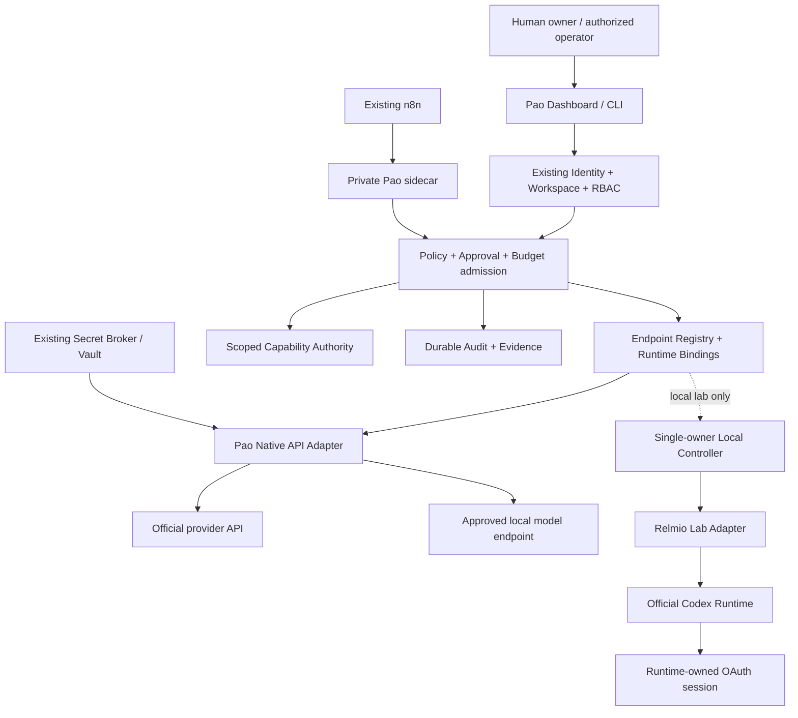

# Phase 20.72 — Pao-hubPro × Relmio

## Secure AI Credential & Endpoint Gateway, ChatGPT/Codex Authentication Bridge, Private n8n Sidecar Runtime, Capability-Isolated Local Access & Policy-Governed Provider Control Plane

> **Document type:** Production-Oriented Implementation Blueprint
> **Phase:** 20.72 · **Document revision:** 1.0.0 · **Prepared:** 16 กันยายน 2026 — Asia/Bangkok
> **Project:** Pao-hubPro
> **Source of Truth:** `Phase_20.72_Pao-hubPro_x_Relmio.md`, processed under `PAO-HUBPRO_MASTER_PHASE_REQUEST.md`
> **Status:** Implementation Blueprint — **ยังไม่ใช่ระบบที่พัฒนาหรือติดตั้งเสร็จแล้ว**
> **Upstream:** `Demonbane18/relmio` · **Verified version:** `0.17.1` (changelog 14 ก.ย. 2026) · **Pinned commit:** `9db6900fa5c8ef7f5a15e1b6b99932f3e616931f` · **Runtime:** Node.js `>=24`, npm `10.9.8` · **License:** Apache-2.0 (ตรวจ LICENSE/NOTICE + dependency licenses ก่อนใช้โค้ด)
> **Integration posture:** Adapter-first, reuse existing authority, default-deny, single-owner local lab for Relmio/Codex routes
> **Execution contract:** คำสั่ง `pao ...`, API `/api/provider-access/...`, schema และเมนูในเอกสารนี้เป็น**สิ่งที่เสนอให้พัฒนา** ไม่ใช่คำสั่ง/API ที่ยืนยันว่ามีอยู่แล้ว
> **Filename/content consistency:** Filename and header agree on Phase 20.72; no collision in the current set.
> **ℹ Numbering note:** เลข 20.72 ถูกใช้โดย Relmio แล้ว — ทางเลือก "ย้าย Context Mode (20.65 collision) ไป 20.72" จึง**ใช้ไม่ได้อีกต่อไป** การแก้ collision ของ Context Mode ต้องใช้เลขอื่น (เช่น 20.73) หรือทางเลือกอื่นจาก 3 ข้อที่เสนอไว้

---

> **ผลสำเร็จของเฟสนี้วัดจาก:** ระบบ**อนุญาตเฉพาะงานที่ควรอนุญาต ปฏิเสธงานที่เกินสิทธิ์ และพิสูจน์ได้ว่าทำอะไรกับ resource ใด** — ไม่ใช่จำนวน provider ที่เชื่อมได้หรือจำนวน token ที่นำมาใช้ร่วมกัน

> **ผลลัพธ์ที่ต้องการ:** Agent และ n8n ใช้สิทธิ์ที่จำกัดผ่าน Pao Gateway ได้ **โดยไม่รับ API key หรือ OAuth token ต้นทาง** และผู้ใช้เห็นความแตกต่างระหว่าง "เชื่อมต่อได้", "มีสิทธิ์ใช้", "ผ่านการทดสอบ" และ "พร้อม production"
>
> เฟสนี้**ไม่ทำให้ ChatGPT subscription กลายเป็น OpenAI Platform API subscription** และไม่อ้างว่าการเพิ่ม proxy หรือ bearer ภายในจะขยายสิทธิ์ของบัญชีต้นทาง [O1][O2][O3]

---

## 1. Executive Summary

Phase 20.72 สร้างชั้นจัดการ endpoint, credential binding, scoped capability, deployment lifecycle และ policy enforcement ที่**ต่อยอดระบบเดิม ไม่สร้าง Vault/Router/Policy Engine ซ้ำ** ทำให้ Pao-hubPro ตอบคำถามเหล่านี้ได้ก่อนเรียก AI หรือเปิด runtime ทุกครั้ง:

- ใครเป็นผู้เรียก และทำงานแทน workspace/project ใด?
- ใช้ endpoint แบบไหน: Platform API, local model, Codex App Server หรือ Relmio Chat Adapter?
- credential อยู่กับใคร ใครมีสิทธิ์ใช้ และใครไม่มีสิทธิ์เห็น?
- คำขอนี้อยู่ในขอบเขต capability, policy, budget และ approval หรือไม่?
- endpoint เป็น production candidate, local lab, degraded, blocked หรือ unverified?
- เมื่อ revoke, rotate, update, restart หรือ rollback จะกระทบ resource ใดบ้าง?

**Deliverables (10):** Endpoint Registry · Credential Binding · Scoped Capability Service · Policy Enforcement Gateway · Native Platform API Adapter · Local Codex/Relmio Lab Adapters · Private n8n Sidecar Pattern · Installation Plan + Approval · Rotation/Revocation/Recovery · Dashboard + Audit + Evidence

**สิ่งที่เอกสารต้นฉบับยังไม่ได้ทำ (ต้องรู้ก่อนเริ่ม):** ยังไม่ได้ audit โค้ด Relmio ทุกไฟล์, ติดตั้ง container, ทดลองบัญชีเปา, ทดสอบ n8n จริง หรือเข้าถึง repository ปัจจุบันของ Pao-hubPro — ไฟล์ Phase เดิมเป็นหลักฐานของ**แผนสถาปัตยกรรม** ไม่ใช่หลักฐานว่า deploy แล้ว [P1][P2]

---

## 2. Problem Statement

ปัญหาหลักของการเชื่อม AI providers หลายประเภท (Platform API, subscription-based ChatGPT/Codex, local models, third-party local gateways อย่าง Relmio) คือความสับสนเรื่องสิทธิ์: ChatGPT sign-in ไม่ใช่ Platform API key [O2]; OAuth bridge ของ upstream เป็น unofficial/experimental [R4]; raw capability ของ App Server อาจเข้าถึง session credential ภายในได้ [R5]; และ billing ของ subscription กับ API platform แยกกัน [O3] — ถ้าไม่มีชั้นควบคุม agent/n8n จะได้รับ token เกินสิทธิ์ หรือระบบจะ fallback ข้าม billing/account โดยไม่มีการอนุมัติ

### Evidence snapshot (ตรวจ 16 ก.ย. 2026)

| ประเด็น | ข้อมูลที่ตรวจพบ | ผลต่อ Phase 20.72 |
|---|---|---|
| เวอร์ชัน | `0.17.1` + pinned commit [R1][R2][R3] | ไม่ใช้ 0.7.0 เป็น baseline |
| Node.js | `>=24` [R1] | runtime แยกให้ Relmio ไม่บังคับอัปเกรดทั้ง monorepo |
| API-key setup | provider OAuth เป็นขอบเขต Relmio; API-key connection อยู่ที่ client/n8n [R4] | Native API Gateway เป็นของ Pao ไม่อ้างว่าเป็นฟีเจอร์ Relmio |
| Legacy API endpoints | README กล่าวถึง retirement path ของ 0.15.0 [R4] | ห้ามลบ/adopt legacy resources อัตโนมัติ |
| App Server | protocol ของ Codex ไม่ใช่ `/v1`; **experimental ไม่รองรับ production workloads** [R5][O1] | local lab เท่านั้นในเฟสนี้ |
| Chat Adapter | `POST /chat` คืน `conversationId`+`output`; มี SSE; ไม่ใช่ Chat Completions/Responses API [R5] | contract เฉพาะ adapter ไม่แปลง entitlement |
| Raw capability | ผู้ถือ capability ของ App Server อาจเข้าถึง session credential ภายใน [R5] | ถือเป็น **master secret** ไม่แจกให้ agent/ทีม |
| n8n OAuth bridge | คัดลอก credential JSON เข้า volume + เรียก bridge บุคคลที่สาม [R4] | ไม่รวมใน production path |
| นโยบาย bridge | unofficial, experimental, policy-uncertain [R4] | ปิด default; acknowledgement ≠ provider authorization |
| Billing | ChatGPT ≠ API platform [O3] | ไม่มี silent fallback จาก subscription ไป API แบบมีค่าใช้จ่าย |

**ระดับความเชื่อมั่น (ห้ามเลื่อนขั้นเพราะ README มีตัวอย่างสำเร็จ):**

```text
DOCUMENTED          = พบในเอกสารต้นทาง
SOURCE_REVIEWED     = ตรวจ implementation ที่ commit ระบุแล้ว
CONTRACT_TESTED     = ผ่าน protocol tests กับเวอร์ชันที่ระบุ
LIVE_VERIFIED       = ผ่าน smoke test กับบัญชีและ environment ที่ระบุ
PRODUCTION_APPROVED = ผ่าน gates ของ deployment mode ที่รองรับเท่านั้น
```

---

## 3. Goals

**MVP (7 ข้อ ต้องทำก่อน):** 1) Repository discovery + authority mapping + threat model + upstream lock manifest; 2) Endpoint registry + existing credential references + policy admission; 3) Capability issuance/introspection/revoke + durable audit + secret-safe diagnostics; 4) Native Platform API adapter + mock provider + private n8n route; 5) Read-only Relmio discovery + loopback single-owner lab contract; 6) Plan → approve → apply → verify → rollback สำหรับ resource ที่ Pao เป็นเจ้าของ; 7) Dashboard + test evidence + operator runbook + offline demo

**Deployment modes (แยกชัดเจน):**

| Mode | เส้นทาง | ค่าเริ่มต้น | การเปิดใช้งาน |
|---|---|---|---|
| `offline_demo` | Mock provider + fake credentials | ใช้ได้โดยไม่ใช้บัญชีจริง | ทดสอบ UI/contract เท่านั้น |
| `production_api` | Pao Gateway → official Platform API / approved local provider | ปิดการเรียกเงินจริงจนตั้งค่า | owner approval + budget + tests + deployment review |
| `local_codex_lab` | Owner-local controller → official Codex App Server | **Disabled** | single owner, local machine, schema/permission tests |
| `local_relmio_chat_lab` | Owner-local backend → Relmio `/chat` | **Disabled** | upstream restrictions + pinned contract + account eligibility |
| `relmio_n8n_oauth_lab` | Upstream third-party OAuth sidecar | Disabled / documentation-only ใน MVP | ไม่สร้าง installer หรือเปิด bridge จริง |
| `public_subscription_proxy` | แบ่ง/ขาย/แจกสิทธิ์ ChatGPT ผ่าน proxy | **Prohibited design mode** | ไม่มี override |

Production readiness ใช้กับ **Pao native API path** เท่านั้น — ไม่ใช่ blanket approval ให้ App Server หรือ Relmio experimental routes [O1][R5]

---

## 4. Non-Goals

- ไม่ทำ account farming, token harvesting, cookie replay, anti-bot bypass หรือ quota evasion
- ไม่อ่าน `~/.codex/auth.json` ของ host มา import อัตโนมัติ
- ไม่แจก OAuth/session token หรือ upstream raw capability ให้ agent/browser/n8n
- ไม่สร้าง generic "ChatGPT subscription → unlimited `/v1` API"
- ไม่เปิด raw Relmio/Codex endpoint ผ่าน public domain, LAN หรือ reverse proxy
- ไม่เปลี่ยนบัญชีหรือ workspace เพื่อหนี rate limit
- ไม่ยก Relmio เป็น Vault, SSO provider, Router หรือ Policy Engine กลาง
- ไม่ติดตั้ง privileged Docker-in-Docker, n8n Assistant sandbox, ngrok หรือ SuperGrok โดยอัตโนมัติ
- ไม่สร้าง image/audio/video entitlement จากการพบ model name ใน discovery
- ไม่แก้ credential encryption key, database, volume หรือ workflow เดิมของ n8n
- ไม่ใช้ root/Docker-admin access เป็น security boundary ที่ป้องกันเจ้าของ host ได้

---

## 5. Why This Phase Exists — Position & Reuse

### Existing authority ที่ต้อง reuse (ห้ามสร้างซ้ำ)

Phase 20.59 วาง Provider Access Control Plane (credential lifecycle, secret handling, health, quota, policy, lease); Phase 20.71 วาง Fleet Runtime โดย Pao เป็นเจ้าของ identity/approval/secrets/audit/budget [P1][P2]

| Layer | Authority ที่ใช้ | สิ่งใหม่ในเฟสนี้ |
|---|---|---|
| Identity / workspace / RBAC | ระบบเดิมของ Pao | Adapter permission mapping |
| Vault / credential lifecycle | Phase 20.59 หรือ implementation ที่มีจริง | Endpoint binding + runtime-owned auth reference |
| Provider routing | Router เดิม (ตรวจ integration จริง) | Route eligibility ตาม auth class + deployment mode |
| Budget / quota | Budget service เดิม | Admission reservation, billing-class boundary |
| Fleet / sessions | Phase 20.71 หรือที่มีจริง | Endpoint-to-seat binding + account epoch fencing |
| Sandbox / tool approval | Safe Runtime เดิม | Codex-specific enforcement contract |
| Audit / events | Audit/event bus เดิม | Endpoint/capability/rotation/install-plan events |
| Relmio lifecycle | Isolated adapter | Discovery, health, explicit plan, version drift |

หาก module เดิมไม่พบ → สร้าง interface ขนาดเล็ก + persistent implementation ตาม stack ปัจจุบัน พร้อมบันทึก gap — **ห้ามสร้าง control plane อีกชุดเงียบ ๆ** เฟส 20.50/20.51, secure runtime, observability เป็น **integration candidates** ต้องยืนยัน module จริงก่อนต่อ

```text
Phase 20.59 Credential Authority
          ↓
Phase 20.72 Endpoint Binding + Capabilities + Runtime Lifecycle
          ├── Existing Router / Budget / Audit
          ├── Phase 20.71 Fleet Sessions
          ├── n8n via a private Pao API sidecar
          └── local, single-owner Relmio lab
```

---

## 6. Relationship to Pao-hubPro

### Layer mapping (Pao-hubPro core layers)

| Layer | Role in this phase |
|---|---|
| 07 Policy Engine | POL-01..12 rules; admission context; fail closed |
| 08 Approval Engine | Plan approval; operation-scoped bindings |
| 14 Secrets & Credential Layer | **Primary owner boundary** — credential classes; runtime-owned auth refs |
| 09–11 Execution Runtimes | Adapters (native API / Codex lab / Relmio chat lab); sidecar |
| 12 State / Session Layer | Endpoint registry; capability grants; account epochs |
| 15 Event / Queue Layer | Audit outbox (atomic with lifecycle mutations) |
| 17 Audit Layer | 24 event types; pre-persistence redaction |
| 19 Web Dashboard | Provider Access (10 menu items); 3 wizards |
| 20 External Provider Layer | Relmio (Apache-2.0, pinned), OpenAI/ChatGPT/Codex, n8n |

### Trust boundaries (5 ชั้น)

- **Boundary A — Browser:** ใช้ Pao session + same-origin API เท่านั้น; ไม่ถือ raw Relmio bearer, Platform API key หรือ OAuth refresh token
- **Boundary B — Agent / n8n worker:** ได้ opaque execution handle หรือ short-lived Pao capability จำกัดขอบเขต; ไม่มีสิทธิ์จัดการบัญชี upstream; ไม่มี API อ่าน secret
- **Boundary C — Trusted Gateway:** ตรวจ subject, tenant/project, endpoint, auth class, policy version, capability expiry, quota, operation schema ก่อนใช้ adapter
- **Boundary D — Secret-bearing runtime:** Native API worker + Codex auth runtime เป็น trusted computing base — จำกัด filesystem/process/crash dumps/network; **ไม่อ้างว่า container volume คือ encryption**
- **Boundary E — Deployment controller:** คุย Docker/SSH มีอำนาจสูง แยกจาก web request handler และ model execution; **ไม่มี unrestricted Docker socket mount** ให้ gateway/agent/Codex

เส้น lab เป็น logical binding — **ไม่ใช่**ให้ VPS Pao ทำ remote relay เข้าสู่ local-only Relmio; dashboard ระยะไกลแสดงเฉพาะ sanitized metadata จนมีแผน remote runtime แยก

---

## 7. Upstream / External Project

### Evidence sources (ตรวจ 16 ก.ย. 2026 — pinned sources)

| ID | Source | ใช้ยืนยัน |
|---|---|---|
| R1 | [package.json @ pinned commit](https://github.com/Demonbane18/relmio/blob/9db6900fa5c8ef7f5a15e1b6b99932f3e616931f/package.json) | version 0.17.1, Node ≥24, license |
| R2 | [CHANGELOG.md @ pinned](https://github.com/Demonbane18/relmio/blob/9db6900fa5c8ef7f5a15e1b6b99932f3e616931f/CHANGELOG.md) | release date, pre-1.0 context, ต่างจาก baseline 0.7.0 |
| R3 | [Release commit snapshot](https://github.com/Demonbane18/relmio/commit/9db6900fa5c8ef7f5a15e1b6b99932f3e616931f) | ตรึง source state (ไม่รับรองความปลอดภัย) |
| R4 | [README.md @ pinned](https://github.com/Demonbane18/relmio/blob/9db6900fa5c8ef7f5a15e1b6b99932f3e616931f/README.md) | OAuth/API distinction, bridge warnings, legacy endpoints, upgrade semantics |
| R5 | [Local endpoints doc @ pinned](https://github.com/Demonbane18/relmio/blob/9db6900fa5c8ef7f5a15e1b6b99932f3e616931f/docs/local-endpoints.md) | `/chat` contract, SSE lifecycle, single-owner/loopback, App Server broad-capability risk |
| O1–O4 | OpenAI official (Codex App Server, Codex Auth, billing separation, API overview) | protocol/transports, managed sign-in, device-code, billing แยก, API schema |
| D1–D3 | Docker official (Compose networking, networks reference, port publishing) | external ≠ public; internal ≠ allowlist; host publication |
| N1–N2 | n8n official (encryption key, self-hosted security) | n8n key ownership — Phase นี้ไม่เปลี่ยน |
| P1–P2 | Phase 20.59 + 20.71 documents | authority patterns (proposed, not deployed) |

**Evidence interpretation rule:** source facts ยืนยันว่า upstream/document กล่าวอะไร; ส่วน architecture, routes, data models, defaults, tests, gates, UX ของ 20.72 เป็น**ข้อเสนอการออกแบบของ Pao-hubPro** ที่ต้องพัฒนาและพิสูจน์ด้วย tests

### Separation of concerns

| Part | Owner | Notes |
|---|---|---|
| A. Upstream | `Demonbane18/relmio` v0.17.1 @ pinned commit (Apache-2.0) | Local gateway/lab reference; verify npm artifact separately from GitHub commit; no `latest` |
| B. Pao adapter | 7 typed adapters (Section 12.2) | No single adapter guessing credential types |
| C. Pao policy wrapper | POL rules, capability authority, admission | All governance here |
| D. Pao extensions | Registry, capability service, n8n sidecar, lifecycle controller, dashboard | Built in this phase |

---

## 8. Current-State Assumptions

- **[Needs Verification] Repository discovery ก่อนแก้โค้ด** — สร้าง `docs/phase-20.72/discovery.md` ตรวจ 16 หัวข้อ: repo/branch/dirty state; AGENTS.md/conventions; languages/runtimes/package managers; backend framework/HTTP stack; frontend/design system; DB/ORM/migrations; identity/sessions/RBAC/workspace; credential store/Vault/key management; policy/approval/audit/budget authority; provider router/adapters; fleet/session runtime/Codex integration; job queue/locks/event bus; Docker/deployment controller; tests/CI/secret scanning/release

**กติกา discovery (8):** ไม่ overwrite งานที่ผู้ใช้แก้อยู่ ไม่ reset branch ไม่แก้ migration เก่าที่ใช้แล้ว; ใช้ stack เดิมก่อน (Node ≥24 เป็น requirement ของ Relmio ไม่ใช่คำสั่งอัปเกรดทุก package); ค้นหาด้วย module responsibility ไม่ใช่ชื่อ Phase; migration additive + backward compatible; ไม่พบ service สำคัญ ⇒ ระบุ `missing` + สร้าง interface + mock เฉพาะ demo; **ห้าม mock policy/vault ถูกเลือกใน production config**; ไม่ขอ credential จริงเพื่อให้ tests ผ่าน

- **[Assumption] Upstream lock manifest** (ค่า `null`/`false` = ยังไม่ verify — **ไม่ใช่ช่องให้ Codex เดา version/digest**):

```json
{
  "schemaVersion": 1, "phase": "20.72",
  "upstream": {"repository": "Demonbane18/relmio", "commit": "9db6900fa5c8ef7f5a15e1b6b99932f3e616931f",
               "manifestVersion": "0.17.1", "reviewedOn": "2026-09-16", "nodeEngine": ">=24"},
  "npmArtifact": {"verified": false, "integrity": null},
  "codexRuntime": {"version": null, "schemaSha256": null, "verified": false},
  "containerImages": [], "productionApprovedModes": []
}
```

ตรวจ registry artifact แยกจาก GitHub commit ก่อนติดตั้ง; ไม่ใช้ `latest` ใน deployment manifest

---

## 9. Target Architecture



---

## 10. Architecture Diagram

See Section 9 (mermaid) + 5 trust boundaries (Section 6) + deployment topology:

```text
Existing n8n
   │ protected Pao service credential
   ▼
Pao private API sidecar
   │ identity + policy + capability + budget
   ▼
Existing Pao API gateway / secret-bearing provider worker
   ▼
Official provider API
```

**API key ต้นทางอยู่ที่ Pao trusted worker** — ไม่อยู่ใน workflow JSON และไม่จำเป็นต้องย้าย ChatGPT session เข้า n8n

---

## 11. Core Components

| # | Component | Purpose |
|---|---|---|
| 1 | Endpoint Registry | Typed protocol/auth-class/mode/state; ownership; versions; evidence |
| 2 | Credential Binding | `credential_ref` / `runtime_auth_ref`; epoch; account fingerprint |
| 3 | Scoped Capability Authority | Opaque short-TTL grants; revocation epochs; atomic admission |
| 4 | Policy Enforcement Gateway | POL-01..12; validation order; fail closed |
| 5 | Native Platform API Adapter | Official API subset; fresh headers; server-side secret injection |
| 6 | Local Codex Lab Adapter | Pinned schema; managed login; chat-only; operation allowlist |
| 7 | Relmio Chat Lab Adapter | `/chat` contract; SSE; upstream bearer isolated in trusted adapter |
| 8 | Private n8n Sidecar | Pao native API sidecar beside existing n8n — no n8n mutation |
| 9 | Lifecycle Controller | Plan → approve → apply → verify → rollback; TOCTOU re-attestation |
| 10 | Rotation/Revocation Service | 4 rotation types; emergency epoch bump; account switching |
| 11 | Management API + MCP tools | 22 routes; 9 tools; error envelope |
| 12 | Dashboard + Audit | 10 menus; 3 wizards; 24 event types; honest evidence |

---

## 12. Component Responsibilities

### 12.1 Credential model — แยกสิทธิ์สี่ชนิด

| Class | เจ้าของ secret | ใช้ทำอะไร | ห้ามใช้แทน |
|---|---|---|---|
| `platform_api_key` | Existing Pao Vault / authorized server store | เรียก official API ตาม account/project permissions | ChatGPT login |
| `codex_managed_oauth` | Isolated official Codex runtime | Codex session ที่เจ้าของบัญชี login | General Platform API key |
| `relmio_upstream_capability` | Trusted local adapter secret store | เข้าถึง endpoint ของ Relmio | Scoped Pao token สำหรับ agent |
| `pao_scoped_capability` | Pao authority ออก; client ถือชั่วคราว | จำกัดการเรียก gateway ภายใน | Provider-issued credential |

Pao stores **references and health metadata** ไม่ใช่ OAuth token สำเนา:

```text
Good: endpoint.binding -> credentialRef or runtimeAuthRef
      agent -> scoped Pao capability -> gateway -> trusted adapter

Bad:  agent prompt -> refresh_token
      browser localStorage -> Relmio master bearer
      n8n node parameter -> host ~/.codex/auth.json
```

**Runtime-owned auth reference** (`authStatus` ต้องมาจาก validated runtime response ไม่ใช่การพบไฟล์ชื่อ `auth.json`):

```json
{"kind": "codex_managed_oauth", "runtimeRef": "runtime_owner_local_01",
 "ownerId": "usr_demo", "workspaceId": "ws_demo",
 "accountFingerprint": "pseudonymous-account-reference", "accountEpoch": 4,
 "authStatus": "reauth_required", "credentialExportSupported": false,
 "lastVerifiedAt": null}
```

### 12.2 Adapter contracts (แยกตาม protocol — ห้าม adapter เดียวเดาประเภทเอง)

```typescript
interface ProviderEndpointAdapter {
  describeCapabilities(ctx: AdapterContext): Promise<CapabilityReport>;
  health(ctx: AdapterContext): Promise<HealthReport>;
  validateBinding(ctx: AdapterContext): Promise<BindingReport>;
  execute(ctx: AuthorizedExecutionContext, request: ValidatedProviderRequest,
          signal: AbortSignal): AsyncIterable<ProviderEvent>;
  cancel(ctx: AdapterContext, operationId: string): Promise<CancelResult>;
}
```

Adapters: `native-openai-platform-api · approved-local-openai-compatible · native-codex-appserver-lab · relmio-codex-chat-lab · relmio-discovery-readonly · relmio-n8n-oauth-observer-only · mock-provider`. Lifecycle management แยก interface จาก execution adapter — การส่ง chat ไม่มีสิทธิ์ deploy container

**Capability report example (evidence honesty):**

```json
{"adapter": "relmio-codex-chat-lab", "protocol": "relmio-chat-http",
 "deploymentMode": "local_relmio_chat_lab",
 "supports": {"textChat": true, "streaming": true, "multiTurn": true,
   "arbitraryTools": false, "platformResponsesApi": false,
   "platformChatCompletionsApi": false, "credentialExport": false,
   "multiTenantServing": false},
 "evidenceLevel": "DOCUMENTED", "liveVerifiedAt": null, "productionEligible": false}
```

### 12.3 Capability service

**Token format/storage (MVP):** opaque bearer จาก CSPRNG ≥32 bytes (proposed format `pao_cap_<public-id>.<secret>`); public ID = lookup (ไม่ใช่ secret); เก็บ verifier = HMAC-SHA-256 ของ secret ด้วย pepper นอก database; constant-time comparison; คืน raw bearer **ครั้งเดียว** ผ่าน authorized non-cacheable channel; **ห้าม** token ใน URL/logs/analytics/model context/error responses; scopes เก็บ server-side; **long-lived WebSocket ต้อง recheck expiry/epoch ก่อนทุก operation** ไม่ใช่ตรวจแค่ handshake. ไม่จำเป็นต้องเพิ่ม JWT/PASETO ถ้าระบบเดิมมี opaque lease อยู่แล้ว

**Grant shape (defaults เป็นข้อเสนอ — config ผ่าน policy ลดสิทธิ์ได้เท่านั้น; ห้าม client ส่ง scope/TTL ใหม่แล้วระบบเชื่อ):**

```json
{"subjectId": "svc_workflow_demo", "workspaceId": "ws_demo", "projectId": "prj_demo",
 "endpointId": "ep_platform_demo", "actions": ["model.text.generate"],
 "allowedModels": ["configured-model-id"], "ttlSeconds": 300,
 "maxRequests": 10, "maxConcurrentRequests": 1, "maxOutputTokens": 512,
 "budgetReservationRequired": true, "delegation": "none"}
```

**Validation order (10 ขั้น):** parse token/reject malformed → lookup grant → verify bearer → verify status+expiry+revocation epoch → establish authenticated subject + workload binding → verify workspace/project/resource ownership → verify endpoint+action+model scope → verify deployment mode + account epoch → current policy + approval + budget admission → atomic concurrency/rate reservation → execute through typed adapter. **Grant ที่ถูก revoked ระหว่าง queue wait ต้องถูกปฏิเสธก่อน dispatch**

**n8n bootstrap credential ≠ execution capability:** workflow เรียกซ้ำหลายครั้ง — แยก service authentication ออกจาก short-lived execution grant: `n8n protected credential store → service auth to private Pao gateway → server derives workflow/workspace policy → issues/uses short-lived grant internally → provider call`. Bootstrap credential **ไม่มี** `capability.issue:*`; gateway mint เฉพาะสิทธิ์ที่ติดตั้งกับ service identity นั้น; **ห้ามเชื่อ `workflowId` ที่ client ส่ง** โดยไม่มี identity binding ที่ตรวจสอบได้

### 12.4 Policy engine — POL rules + approval binding

**AdmissionContext:** `operationId, subjectId, workspaceId, projectId, endpointId, action, modelId?, mode (DeploymentMode), authClass, accountEpoch, endpointVersion, normalizedInputDigest, approvalId?, budgetReservationId?` — runtime values validate ด้วย schema จริง **ไม่มีการ cast input จาก browser ผ่าน TypeScript เฉย ๆ**

**Mandatory policy rules:**

| Rule | Rule |
|---|---|
| POL-01 | Credential class ไม่ตรง endpoint contract → deny |
| POL-02 | local lab เรียกจาก remote/multi-user route → deny |
| POL-03 | Account/workspace mismatch หรือ auth epoch เปลี่ยน → deny |
| POL-04 | Unknown JSON-RPC method หรือ arbitrary URL → deny |
| POL-05 | Raw credential export / import host session → deny |
| POL-06 | Plan digest / deployment precondition เปลี่ยน → require new plan |
| POL-07 | Provider fallback เปลี่ยน billing/data boundary → new admission |
| POL-08 | Tool/write action ไม่มี approval ที่ผูก operation → deny |
| POL-09 | Model discovery ไม่มี live entitlement evidence → unverified; ไม่เดาว่าใช้ได้ |
| POL-10 | Audit admission persist ไม่ได้ → fail closed ก่อน side effect |
| POL-11 | Budget unknown/exhausted สำหรับ paid API → deny ตาม policy |
| POL-12 | Policy unavailable → deny new work; allow safe revoke/stop ผ่าน emergency path |

**Approval binding (9 องค์ประกอบ):** actor + workspace + project · operation type · endpoint + credential/account epoch · canonical normalized argument digest · target resource identities · policy version · expiration · maximum cost/execution limits. Approval เดิมใช้ไม่ได้เมื่อ command/path/model/image digest/network/mount/account เปลี่ยน. **การกดยอมรับความเสี่ยงไม่ทำให้ข้อจำกัด upstream หายไป** — policy ห้ามเปิด mode ที่ provider ไม่รองรับเพียงเพราะ owner ติ๊ก checkbox

**Method gates ≠ tool gates:** `turn/start` เป็นแค่ทางเข้า — โมเดลอาจร้องขอ shell/file/network side effects ภายหลัง ⇒ enforce ที่ tool runtime + sandbox ด้วย: Chat-only mode (ไม่มี shell/fs/MCP-write/network tools) · Read-only mode (workspace + denied paths จริง ไม่ใช้ prompt ว่า "ห้ามอ่าน secret") · Coding mode (tool permission ผูก Safe Runtime ตรวจสอบได้) · **upstream adapter ขาด enforcement primitive ⇒ ประกาศ unsupported ไม่ downgrade เงียบ ๆ**

### 12.5 Authentication lifecycle (official managed sign-in only)

Codex App Server มี managed login methods; Codex เป็นเจ้าของ OAuth persistence/refresh [O1][O2]. Flow (10 ขั้น): `Owner requests connect → Pao verifies owner/session + local-lab eligibility → Native local controller starts official managed login → Owner sees provider verification URL + short-lived code → Owner completes sign-in on official provider page → Runtime reports completion → Pao validates account/workspace identity → Bind account epoch + sanitized auth status → Clear device-code UI state`. **ไม่สร้าง OAuth client ปลอม ไม่รับ ChatGPT password ไม่ import browser cookies ไม่ใช้ external-token auth mode ใน MVP**

**Device-code safeguards (7):** แสดงเฉพาะเจ้าของ session ที่เริ่ม login; ไม่บันทึก code ลง audit/log/screenshot fixture; จำกัดอายุ + login attempt + cancel ได้; provider URL จาก validated allowlisted auth response; เคารพ workspace admin restriction (ไม่ bypass); ปิด browser ≠ ยกเลิก sign-in — runtime ต้องส่ง cancel ตาม contract; device flow ถูกปิด ⇒ `ADMIN_ACTION_REQUIRED` ไม่ดึง credential จากแอปอื่น

**State machine:** `UNCONFIGURED → AWAITING_OWNER → LOGIN_PENDING → AUTHENTICATED → READY`; `LOGIN_PENDING → CANCELLED/EXPIRED/FAILED`; `READY → DEGRADED/REAUTH_REQUIRED/QUARANTINED`; `ANY_ACTIVE → REVOKING → DISABLED`; `ACCOUNT_CHANGED → INVALIDATE_BINDINGS → AWAITING_OWNER`

**Single writer for refresh:** Runtime-owned Codex OAuth = official runtime refresh เท่านั้น; Vault-owned generic OAuth = existing credential authority เท่านั้น; **ห้าม dual refresh writers**; ห้าม rollback token file เก่าเพื่อฟื้น refresh token ที่ provider rotate/revoke แล้ว; **reauthentication เป็นผลลัพธ์ที่ถูกต้อง ไม่ใช่ความล้มเหลวที่ต้องหลบด้วยการ copy token**

### 12.6 Codex App Server lab integration

**Transport:** native local adapter เริ่มประเมิน `stdio` หรือ permissioned Unix socket (ลด TCP exposure); Relmio adapter ใช้ transport ที่ upstream เปิดจริง (เช่น local WebSocket — ห้ามอ้างว่า Relmio expose stdio); **ห้ามเปิด generic raw JSON-RPC relay ให้ browser/agent**; stdio ไม่ทำให้ app-server กลายเป็น production-supported [O1]

**Protocol baseline:** ใช้ schema generate จาก Codex binary version ที่ pin แล้ว (`initialize → initialized → account metadata validation → thread/start or authorized thread/resume → turn/start → bounded event processing → completed/failed/interrupted`); request IDs, notification ordering, approval callbacks, event names ใช้ generated types ของ binary จริง — **ห้ามคัดลอกตัวอย่างข้ามเวอร์ชันโดยไม่มี contract test**

**Operation allowlist:**

| Operation | MVP policy |
|---|---|
| Initialize / protocol negotiation | Adapter-internal only |
| Account read | Owner metadata view; redact response |
| Managed login / cancel / logout | Owner + explicit action |
| Thread create / resume / read | Owner + project mapping + account epoch |
| Turn start / interrupt | Capability + mode + limits + session binding |
| Runtime config write | **Denied** in ordinary execution |
| Raw command execution | **Denied**; requires separate Safe Runtime integration |
| External config import / secret export | **Denied** |
| Unknown methods | Denied and logged without sensitive payload |

**Session isolation:** Thread ID **ไม่ใช่** authorization token — lookup ผ่าน `pao_session_id` ที่ผูก owner/workspace/project/endpoint/account epoch เสมอ; logout/account change/credential identity change ⇒ invalidate mapping + หยุดรับ turn ใหม่; **ห้าม**นำ thread ของบัญชีเดิมไป resume ผ่านบัญชีใหม่

**Untrusted-output boundary:** tool output, repository text, model responses, discovery descriptions เป็น **data ไม่ใช่คำสั่งควบคุมระบบ** — ห้ามอนุมัติ tool/เปิด endpoint/ย้าย secret/ปรับ policy จากข้อความเหล่านี้

### 12.7 Relmio chat lab + Native Platform API Gateway

**Relmio upstream protocol [R5]:** `POST /chat` + Bearer (Relmio local capability) + `{"input": "..."}` → `{"conversationId": "...", "output": "..."}`; multi-turn ส่ง conversationId; streaming = `Accept: text/event-stream` + lifecycle `start, progress, delta, error, terminal`

**Pao wrapper (`POST /api/provider-access/chat`):** browser ใช้ Pao session ไม่ส่ง upstream bearer; backend resolve raw bearer จาก trusted local store เท่านั้น; **ไม่รับ** `baseUrl/Authorization/upstreamThreadId/arbitrary headers` จาก browser; return Pao session reference ไม่ expose raw upstream IDs; apply limits ก่อน upstream request; **ไม่แปลง path นี้เป็น `/v1/chat/completions`** สำหรับ subscription โดยอัตโนมัติ

**Streaming requirements:** `ACCEPTED → CONNECTING → WAITING_FIRST_TEXT → STREAMING → COMPLETED | INTERRUPTED | FAILED | UNKNOWN`; retain partial text แต่**ห้าม mark completed จนได้ terminal success**; terminal event ไม่มา/transport หาย ⇒ `UNKNOWN`/`INTERRUPTED` ตามหลักฐาน; empty delta ≠ ผลลัพธ์ข้อความ; จำกัด response bytes/token budget/event size/queued events/duration; cancel ตัด admission งานใหม่ + upstream interrupt เมื่อรองรับ + ปิด transport ตาม deadline — **cancel ไม่รับประกันว่าค่าใช้จ่าย upstream หยุดทันที**; ห้าม auto-retry whole turn หลังได้ partial output โดยไม่ reconcile

**Browser restrictions:** upstream ปฏิเสธ request ที่มี `Origin` โดยไม่มี browser CORS permission [R5]; Pao ไม่ส่งต่อ Origin (backend เป็น client ใหม่) แต่ authenticate/authorize เอง — **ห้าม open proxy ที่แค่ลบ Origin แล้วปล่อยทุกคนผ่าน**

**Native Platform API Gateway (Pao implementation — ต่อยอด router/credential authority เดิม ไม่ใช่ฟีเจอร์ Relmio):**

| Endpoint | MVP |
|---|---|
| `GET /v1/models` | เฉพาะ model ที่ policy อนุญาต + evidence level ใน management API |
| `POST /v1/responses` | schema subset ที่ระบุและทดสอบ |
| `POST /v1/chat/completions` | Optional compatibility; contract แยก |
| Images/audio/video/files/admin | **Disabled** จนมี adapter/schema/entitlement tests |
| Arbitrary path proxy | **Not supported** |

**Credential injection:** `Client bearer (Pao service/capability) → validate & discard from outbound headers → resolve authorized endpoint binding → reserve policy/budget → trusted adapter loads provider secret → construct fresh allowlisted upstream headers → send to fixed provider destination` — **ห้าม** forward client bearer เป็น provider key; **ห้าม**คืน provider secret เมื่อ upstream error

**Endpoint allowlisting:** official destination จาก admin-approved config; local inference ต้องมี resource-specific approval + network boundary ของตน; reject URL credentials/fragments/unsupported schemes/unapproved redirects; ตรวจ DNS resolution + connection destination (ป้องกัน rebind/SSRF); ปิด metadata/link-local endpoints + proxy environment inheritance ที่ไม่อนุมัติ; **ไม่ blanket-allow localhost ทุก port** — allow เฉพาะ endpoint/port ที่ลงทะเบียนและ attested

**Billing/fallback:** `platform_api_key` ใช้ billing แยกจาก ChatGPT subscription [O3]; default `crossBillingFallback=false` + `crossAccountFallback=false`; fallback ที่อนุญาตเข้า admission ใหม่ (ตรวจ provider/data destination/model/budget/account + บันทึกเหตุผล); **ห้ามข้ามไปบัญชีอื่นเพราะ quota หมด**

### 12.8 Private n8n sidecar + Docker truths

**Two distinct sidecars:** **Pao native API sidecar** (เป้าหมายพัฒนา; service identity + Pao policy) vs **Relmio n8n OAuth sidecar** (upstream experimental bridge; observer/documentation-only ใน MVP) — ห้ามใช้ชื่อเดียวกัน, reuse auth volume, หรืออ้างว่า sidecar ของ Pao เป็นของ Relmio

**Docker networking truths [D1][D2][D3]:** `external: true` = Compose ใช้ network ที่สร้างไว้แล้ว ≠ public internet; `internal: true` จำกัด external connectivity; **ไม่มี `ports:`** ช่วยเลี่ยง host port publication แต่ไม่ใช่ firewall และไม่ป้องกัน container ร่วม network; sidecar บน shared n8n network ต้อง authenticate ทุก request; **ห้ามอ้างว่า `expose:` เป็น access control**; upstream API egress ต้องมีเส้นทางทำงานจริง (อย่าตั้ง internal-only แล้วคาดว่าเรียก cloud ได้); internal + ordinary bridge เปิด egress ได้แต่**ไม่เท่ากับ egress allowlist**; production gate ต้องมีหลักฐาน firewall/proxy policy หรือระบุความเสี่ยงชัดเจน; **container loopback ≠ host loopback**

**Ownership constraints (ตรวจก่อน install/update/remove):** Docker daemon/context identity; existing n8n container ID; existing network ID; expected service alias; Pao installation ID; image digest + config digest; owned container/volume labels; current network membership; absence of host publication. **ห้าม** rename/restart/recreate/exec เข้า หรือเปลี่ยน network membership ของ n8n เดิมใน flow นี้; **ไม่แก้ `N8N_ENCRYPTION_KEY`** [N1]

**n8n workflow identity limitations:** credential เดียวหลาย workflow = สิทธิ์จริงคือ union ของผู้เข้าถึง credential นั้น; ห้ามอ้างว่า header `X-Workflow-ID` พิสูจน์ workflow; MVP ทางเลือก: credential แยกตาม trust group/project + gateway policy ผูกกับ service identity; workflow ID ใช้เพื่อ observability จนมี signed workload assertion

### 12.9 Endpoint/network security + secrets + process hardening

**Loopback endpoints:** รับเฉพาะ literal loopback address + registered port ที่ตรวจ ownership แล้ว; ตรวจ IPv4/IPv6/IPv4-mapped/ambiguous numeric forms ตาม parser ที่ใช้; reject redirect/userinfo/malformed port/percent-encoded host ambiguity/URL override; ไม่รับ arbitrary endpoint URL จาก chat request; browser-facing routes ตรวจ exact Host/Origin/CSRF/session; raw adapter routes ปฏิเสธ browser-origin requests (ไม่มี wildcard CORS); WS upgrade authenticate ก่อนเปิด session; ปิด access เมื่อ endpoint identity/version/config drift; **Docker port binding ตรวจจาก runtime จริง ไม่ดูแต่ compose source** [D3]

**Shared private network:** `No host port ≠ no lateral access ≠ no data exfiltration ≠ no authentication needed` — ทุก request ผ่าน service/capability authorization + provider destination control

**Cross-machine boundary:** Phase นี้**ไม่** tunnel Relmio local-only endpoint ไป VPS และไม่เพิ่ม relay เพื่อหลบข้อจำกัด single-owner tooling; VPS production ใช้ Native Platform API worker ของ Pao; fleet node หลายเครื่องส่ง sanitized telemetry แยกจาก execution credentials

**Secret storage rules:** Platform API key → existing Vault (gateway resolves by reference); raw Relmio capability → owner-local protected secret store (adapter process only); Codex OAuth → official runtime-owned store (no automatic export); n8n service credential → n8n credential store (gateway stores verifier/authority record); Pao execution capability → short-lived (raw value not persisted in audit/DB); deployment SSH credential → separate deploy controller identity. Host-local secret store ใช้ OS keyring/secret manager ที่ตรวจสอบได้; **Named Docker volume/Compose secret file/mode 0600 ไม่ใช่คำยืนยันว่า encrypted at rest** [O2]

**No broad mounts (default-deny):** `/`; host home; `~/.codex` from host; `~/.ssh`; browser profiles; cloud credentials; Docker socket; container runtime sockets; system keyrings; unrelated project directories. Workspace สำหรับ coding = approved project worktree/copy **ไม่มี credentials ติดมา** + path policy แยก read/write

**Process hardening (10):** non-root runtime; drop Linux capabilities + `no-new-privileges` + read-only rootfs เมื่อผ่าน tests; writable temp/workspace จำกัด; จำกัด CPU/memory/PID/open files/output bytes/wall-clock; **no shell string interpolation — spawn executable + argument array**; environment allowlist (ไม่ inherit host env ทั้งหมด); ปิด debug dump ของ request/headers/secrets; ไม่มี privileged container ใน default deployment. **Controls ตรวจบน OS/runtime เป้าหมายจริง — ห้ามใส่ hardening จน binary รันไม่ได้แล้วปลดทุกอย่างเงียบ ๆ**

### 12.10 Provisioning lifecycle: plan → approve → apply → verify → rollback

**State machine:** `DRAFT → VALIDATED → AWAITING_APPROVAL → APPROVED → APPLYING → VERIFYING → READY`; `VALIDATED/APPROVED → STALE`; `APPLYING/VERIFYING → FAILED → ROLLING_BACK → ROLLED_BACK`; `FAILED/ROLLING_BACK → NEEDS_OPERATOR`; `ANY_RELEVANT → CANCELLED`. **ห้ามแสดง Ready เพราะ `docker compose up` exit 0 เพียงอย่างเดียว**

**Plan contents (shape — identity/digest ต้องมาจาก discovery จริง):** `planId, schemaVersion, mode, targetNodeId, installationId, expiresAt, changes{createServices, touchExistingN8n:false, publishHostPorts:[], credentialSources, networkAttachments, imageDigestRefs}, preconditions{n8nContainerId, networkId, configDigest, policyVersion}, rollbackStrategy, digest`

**TOCTOU protection:** ก่อน apply re-attest preconditions (daemon, n8n ID, network ID, alias conflict, image digest, auth binding, policy version, install directory, ownership) — เปลี่ยนข้อใดที่กระทบความปลอดภัย ⇒ `PLAN_STALE`; **ไม่ re-target ไป resource ชื่อคล้ายกัน**

**Durable operation journal (9 steps, resource IDs + safe digests ไม่มี raw credential):** operation created → lock acquired → preconditions attested → files staged → resources created → health verified → ownership verified → zero host publication verified → operation committed

**Deployment privilege separation:** Web API สร้าง plan; approved operation ส่งให้ deploy controller ที่มี **bounded command vocabulary** — controller รับ typed operation ไม่รับ arbitrary shell/compose text/unvalidated path จาก browser/model; local lab ใช้ owner-session controller; production deploy credentials แยกจาก provider credentials

### 12.11 Ownership, locks, rotation, revocation, account changes

**Ownership labels (เสนอ):** `pao.managed=true · pao.project=pao-hubpro · pao.phase=20.72 · pao.installation=<id> · pao.node=<id> · pao.resource-kind=<sidecar|volume|network>` — **labels ปลอมได้** ⇒ ตรวจร่วมกับ persisted resource ID, config digest, expected image, mount topology, controller identity

**Locking:** resource-scoped locks สำหรับ install/update/rotate/remove; fencing token หรือ stale-writer protection; **PID อย่างเดียวไม่พอ**; lease expiration ไม่อนุญาต mutation สองตัวพร้อมกัน; unknown lock owner/state ⇒ block + operator inspect

**Rotation — 4 ประเภทแยกกัน (ไม่มี universal "rotate all tokens"):** Rotate Pao scoped capability (Pao authority; ไม่เปลี่ยน provider login) · Rotate n8n service credential (Pao + n8n operator; deploy credential ใหม่อย่างปลอดภัย) · Rotate raw Relmio local capability (verified upstream lifecycle path) · Refresh/relogin Codex OAuth (official runtime + account owner). Planned rotation 9 ขั้น (pending replacement → secure delivery → prove possession → activate new verifier → bounded overlap เมื่อ approve → stop old admission → drain → revoke old → verify old fails/new succeeds); **MVP default ไม่เปิด overlap**

**Emergency revocation:** increment credential/capability epoch → deny queued/new work เมื่ออ่าน authoritative state → invalidate caches (introspection unavailable ⇒ deny) → terminate/interrupt active lab sessions ตามความเสี่ยง → mark unfinished operations `INTERRUPTED`/`UNKNOWN` → rotate credential ชั้นที่รั่ว (**ไม่สรุปว่าลบไฟล์ local แล้ว revoke token ต้นทางสำเร็จ**) → retain sanitized audit. **Revocation target ซื่อสัตย์:** local gateway denies new requests immediately after committed revocation; distributed propagation กำหนดและวัดจริง; **ห้ามอ้างว่า revoke provider session ได้ทันทีจากการเปลี่ยน Pao database**

**Account switch:** disable new admission → cancel/drain active work → owner explicit logout → invalidate sessions/grants → new official login → verify workspace/account → **new account epoch** → new capability issuance. **ไม่ migrate thread/quota/approval/budget reservation ข้ามบัญชีโดยอัตโนมัติ**

### 12.12 Budget, quota, usage provenance

แยก fields: `billingClass: platform_api | subscription_codex | local_compute | mock`; `usageSource: provider_reported | runtime_reported | estimated | unknown`; `costSource: provider_invoice | configured_price_estimate | unknown`

กฎ (7): subscription quota ≠ ยอดเงิน USD เทียบ API token ตรง ๆ; API request reserve worst-case cost ตาม max output/input policy; **unknown pricing ใช้ policy ชัดเจน ไม่ default เป็น 0**; usage หายหลัง timeout เก็บเป็น uncertain ไม่คืน reservation ทั้งหมดโดยไม่ตรวจ; provider hard spend limit ≠ Pao admission limit; budget race tests ยิง concurrent requests พิสูจน์ไม่ oversubscribe; **no free API claim, no "unlimited", no model entitlement inferred from plan name**

**Probe budget:** `liveness` (no provider generation) · `readiness` (config + dependency status) · `auth check` (bounded account/model metadata) · `live smoke` (explicit owner approval + tiny budget) — health probe ที่เรียกโมเดลจริงมีค่าใช้จ่ายได้

---

## 13. Data Flow

**Admission flow (validation order):** Section 12.3 (10 ขั้น). **Credential injection flow:** Section 12.7. **Lifecycle flow:** `plan → approve → apply (TOCTOU re-attest) → verify → journal → commit`; rollback per Section 12.10. **Auth flow:** Section 12.5. **Correlation:** ทุก operation มี `operationId` เชื่อม admission → execution → audit outbox (atomic with local lifecycle mutations)

---

## 14. Control Flow

Decisions: **deny-by-default** ด้วย POL-01..12; fail closed เมื่อ policy/introspection/audit unavailable (POL-10/12); unknown ⇒ `UNKNOWN` state (ไม่เดา); **approval ผูก 9 องค์ประกอบ** (Section 12.4)

### Risk classification (R0–R4 mapping — proposed จาก action types ของเฟสนี้)

| Level | Actions | Default |
|---|---|---|
| R0 — Read-only | endpoint inventory; sanitized health; capability metadata; audit view (auditor role) | allow within tenant/role |
| R1 — Low-risk write | register endpoint (no blind fetch); issue scoped lab capability; observability config | policy allow + audit |
| R2 — Controlled mutation | native API paid call (within budget reservation); bounded probe; streaming chat in approved mode | policy + budget admission; approval per policy |
| R3 — High-impact / external side effect | managed sign-in/logout lifecycle; capability rotation; n8n sidecar install (after plan approval); policy override | **explicit human approval bound per Section 12.4** |
| R4 — Restricted / prohibited | delete_data; public_subscription_proxy; raw credential export; host session import; unrestricted dial | **Deny / Prohibited design mode — no override** |

**Honest threat model (ยอมรับตรงไปตรงมา):** ป้องกัน agent/browser/workflow ที่ไม่ได้รับอนุญาตจากการเข้าถึง secret ด้วย boundary ที่ทดสอบแล้ว — **ไม่อ้างว่า**ป้องกัน root/Docker daemon administrator/host compromise; secret encryption at rest ไม่ป้องกัน process ที่ได้รับสิทธิ์ decrypt ขณะทำงาน; agent sandbox ≠ auth isolation ถ้า process เดียวกันอ่าน credential store ได้; **ผู้ถือ Pao bearer ที่ถูกขโมยยังใช้สิทธิ์ใน scope ได้จน revoke/expire — subject label อย่างเดียวไม่ใช่ proof-of-possession**; การตั้งชื่อ token ว่า `cap_codex_readonly` โดยไม่บังคับ method/thread/filesystem/tool policy **ไม่ทำให้เป็น read-only** [R5]

---

## 15. Agent / Worker Model

**Terminology (strictly separated):**

| Term | Definition |
|---|---|
| Agent | Consumer ผ่าน opaque execution handle / scoped capability — never raw bearer |
| Worker | Native API secret-bearing worker (trusted computing base); deploy controller (separate identity) |
| Subject | Authenticated caller (service/user) bound to workspace/project |
| Grant | Scoped capability (subject/workspace/project/endpoint/actions/models/TTL/limits) |
| Epoch | Monotonic credential/account version ใช้ invalidate state |
| Operation | Lifecycle mutation with durable journal + fencing |
| Runtime Session | `pao_session_id` ↔ upstream thread mapping (owner/workspace/project/endpoint/epoch) |

**Serialization boundaries:** 1 active turn/conversation (MVP); 1 auth lifecycle mutation/runtime; 1 install/update/rotate/remove/installation; global + per-subject/per-endpoint limits ใช้ atomic reservation; **lock/fencing เดียวกันใช้กับ jobs จาก UI, API, n8n และ background workers**

**Fleet integration (20.71):** seat binding JSON (`fleetSessionId, endpointId, ownerId, workspaceId, projectId, authClass, accountEpoch, mode, policyProfile`); **no shared subscription service** — Fleet UI หลาย user ไม่อนุญาตให้ทุก seat ใช้ subscription ของเจ้าของบัญชีเดียวผ่าน raw capability (local lab seat ผูก owner เดียว; team production ใช้ native API/service credential); **Reviewer Council boundary:** reviewer ได้ sanitized result/diff/context ไม่ได้ raw secret/login code/deploy privileges; verdict ผูก diff hash ตาม authority เดิม — ไม่ขยายสิทธิ์เพราะโมเดล "เห็นด้วย"

---

## 16. Session / State Model

- **Auth lifecycle:** `UNCONFIGURED → AWAITING_OWNER → LOGIN_PENDING → AUTHENTICATED → READY` + failure paths + `ACCOUNT_CHANGED → INVALIDATE_BINDINGS` (Section 12.5)
- **Provisioning lifecycle:** `DRAFT → … → READY` + `STALE/FAILED/ROLLING_BACK/ROLLED_BACK/NEEDS_OPERATOR/CANCELLED` (Section 12.10)
- **Streaming states:** `ACCEPTED → CONNECTING → WAITING_FIRST_TEXT → STREAMING → COMPLETED/INTERRUPTED/FAILED/UNKNOWN` (Section 12.7)
- **Idempotency:** `workspace + subject + operation type + key` ผูก canonical request digest — same key+digest → prior result; same key+different digest → **409**; unknown upstream outcome → `UNKNOWN` ไม่ยิงซ้ำอัตโนมัติ; upstream ไม่รองรับ idempotency ⇒ **ไม่อ้าง exactly-once**; retry login/deploy/generation แยก policy ต่อ action type
- **Crash recovery:** worker restart reconcile durable operations กับ **exact resource identities** — ไม่เริ่ม deployment ซ้ำจากชื่อ service; ไม่ถือว่าไม่มี process local = upstream operation ไม่เกิด

**Logical data model (9 entities — map/extend schema เดิม ไม่สร้างซ้ำ):** `provider_endpoints` (one workspace/boundary per endpoint) · `endpoint_bindings` (one compatible credential source; no raw bearer persistence) · `capability_grants` (verifier only; no raw bearer) · `endpoint_deployments` (no adoption by name alone) · `installation_plans` (approved plan immutable) · `lifecycle_operations` (unique scope + idempotency key) · `runtime_sessions` (prevent cross-account/thread access) · `policy_admissions` (linked to existing policy authority) · `capability_observations` (discovery ≠ verified permission) · `audit_outbox` (atomic with local lifecycle mutations)

**Data classification:** **Secret** = API key, OAuth token, raw Relmio bearer, short-lived device code, n8n bootstrap credential, capability bearer. **Sensitive metadata** = account/workspace identity, local paths, prompts, response text, thread IDs, model usage/financial data. **Operational metadata** = health state, deployment mode, version pin, public error code, bounded metrics, trace IDs. **ห้ามใช้ "metadata" เป็นเหตุผลให้เปิดข้อมูลบัญชีหรือ path ต่อผู้ใช้ทุกคน**

---

## 17. MCP Integration

ต่อกับ MCP Gateway เดิม — **ไม่สร้าง MCP server ที่ข้าม identity/policy authority**

**Tools (9 ที่เสนอ):** `provider_endpoint_list · provider_endpoint_describe · provider_endpoint_health · provider_capability_request · provider_capability_revoke · provider_chat_execute · provider_operation_status · provider_operation_cancel · provider_installation_plan`

**ไม่เปิดเป็น ordinary agent tools:** `provider_installation_apply`, login/logout, account change, destructive actions — ต้องมี human approval path + subject ที่ได้รับอนุญาตจริง

**Secret-safe tool results:**

```json
{"endpointId": "ep_demo", "mode": "production_api", "health": "ready",
 "authClass": "platform_api_key", "credentialPresent": true,
 "credentialValue": null, "allowedActions": ["model.text.generate"],
 "capabilityHandle": "opaque-handle-not-a-provider-token"}
```

เลือก opaque execution handle ที่ resolve ใน trusted backend แทนการวาง bearer ลง LLM tool transcript. **Tool description injection:** endpoint/provider descriptions ต้อง sanitize และไม่ใช้เป็น system instructions; รายการ tool/resource ที่โมเดลเห็นมาจาก registry ที่ผ่าน policy ไม่ใช่ arbitrary upstream text

---

## 18. Capability Registry

- **Endpoint registry** — typed protocol/auth class/mode/state + ownership + source/runtime versions + evidence levels (DOCUMENTED → PRODUCTION_APPROVED)
- **Capability registry** — grants with scopes/expiry/epoch; grant **narrowing only**
- **Upstream lock registry** — npm artifact/codex runtime/container images/production-approved modes (nulls = unverified)
- **Compatibility matrix template:** Component | Version/digest | OS/runtime | Tests | Result | Evidence — e.g., Relmio = DOCUMENTED (R1–R5); Codex runtime = BLOCKED (requires local verification); n8n = BLOCKED (requires actual container IDs); Native API = SKIPPED (no account in doc prep)

---

## 19. Policy Model

POL-01..12 (Section 12.4) + admission context + deployment mode matrix + approval binding + fail-closed semantics (`audit` unavailable ⇒ deny side-effect admission; `policy` unavailable ⇒ deny new work, safe revoke/stop through emergency path; telemetry exporter down ⇒ continue only if authoritative local audit is durable). ทุก policy versioned + audited; default numbers เป็น starting policy ให้ benchmark — ไม่ใช่ provider limit

---

## 20. Security Model

**Auth boundary tests (ต้องมี 9 ชุด):** direct file read ไป runtime credential store; symlink/path traversal ออกจาก workspace; inherited environment ที่มี API key; `/proc`/process metadata access; stdout/stderr + crash/error serialization; unauthorized MCP tool + shell request; output echo ของ secret ที่ fixture ฝัง; raw App Server account/config surface; ability to bypass Pao gateway ผ่าน upstream socket/network. **หากแยก secret จาก model-accessible execution ไม่ได้ ⇒ ปิด coding/tool mode คง chat-only lab หรือระบุ unsupported — ไม่อ้าง "secret-isolated" จากชื่อ architecture**

**Security acceptance tests S01–S26:** cross-workspace access deny; cross-account conversationId reuse deny; expired/revoked bearer on WS deny; agent requests raw credential deny (no secret in response/log); browser calls raw Relmio endpoint rejected; CSRF rejected; DNS rebinding/alternative loopback encoding rejected/canonicalized; redirect to metadata rejected; arbitrary baseUrl/header injection rejected; command injection via plan input — no shell; symlink into secret store denied; model reads Codex auth storage denied (or route disabled); sibling container without service credential cannot call gateway; OAuth token to Platform route rejected (no token-shape guessing); ChatGPT quota exhausted → no cross-account/API fallback; unapproved paid fallback denied; plan target identity changed → PLAN_STALE; malicious same-name container/volume not adopted; lost audit storage → no new side-effect dispatch; malicious upstream error echoing secret → redacted before persistence; direct access bypass → network/process restrictions; dangerous tool behind allowed turn/start → tool/sandbox denies; device code in metrics/logs → test fails, release blocked; default install publishes host port → test fails; runtime inherits host cloud credentials → test fails; n8n spoofed workflow ID → no extra permissions

**Security gate:** ห้ามใช้ mock-only results ยืนยัน container/filesystem boundary — **ทดสอบกับ target runtime จริงก่อนเปิด mode นั้น**

**Docker Compose blueprint (deployment shape ต้องพัฒนา/ตรวจ — ไม่ใช่ไฟล์ใช้ได้ทันที):** sidecar `user: 10001:10001`, `read_only: true`, `cap_drop: ALL`, `no-new-privileges`, tmpfs noexec, pids/mem/cpu limits, secrets file, **ไม่มี `ports:`** (`0.0.0.0` = bind ภายใน container), existing networks `external: true`, pao labels, `restart: "no"` สำหรับ lab/verification + **11 required review notes** (digest-pinned images only; env validator rejects tag-only; auth file permission; Compose secrets.file ≠ encryption at rest; no Docker socket/host home/Codex credential mount; healthcheck จาก image จริง; TLS/mTLS/egress จาก approved config; ไม่ใช่ Relmio upstream compose; ไม่เปิด OAuth bridge)

---

## 21. Approval Model

### R0–R4 summary

See Section 14. Key approval gates: paid API admission (budget + owner approval); lab mode enablement (single-owner, local-only); installation plan approval (immutable digest, short validity); destructive data deletion (separate approval + retention warning); account switch/logout (owner + confirmation).

### Approval screen UX

แสดง **concrete differences:** exact service IDs; destination; ports; mounts; secret references; budget ceiling; account binding; rollback scope. **ไม่ใช้ปุ่ม "Secure setup" ที่ปิดบังว่าจะ copy credentials, เปิด port หรือเพิ่ม privileged access**

### Wizards (3 — เมนูทั้งหมดเป็น UX target ต้องพัฒนา)

- **Platform API (8 ขั้น):** Endpoints → Add endpoint → Official Platform API → เลือก credential reference / Vault secret-entry → project/models/actions/budget → **Review plan** (destination, billing, data path, credential owner) → Approve configuration → **Run bounded smoke test** (เมื่อยอมรับค่าใช้จ่าย) → ตรวจ evidence + production gate
- **Local Codex lab (8 ขั้น):** local Pao UI → Connections & Sign-in → Codex local single-owner lab → experimental notice + account/workspace restriction → **Start official sign-in** → provider verification page (กรอกรหัสเอง) → กลับมาตรวจ masked identity → chat-only contract test → เปิดเฉพาะ local owner session (ไม่มีปุ่ม publish/แชร์ raw endpoint)
- **n8n (8 ขั้น):** Installation Plans → Add private n8n sidecar → เลือก existing n8n container + network (ตรวจ ID แล้ว) → Pao native API sidecar → ตรวจ plan **"Existing n8n changes: none" + "Host ports: none"** → approve + apply เฉพาะ sidecar → สร้าง credential ใน n8n UI → ตั้ง Base URL ตามผลติดตั้งจริง → ทดสอบ workflow ไม่ส่งข้อมูลลับก่อนเปิดใช้งาน

---

## 22. Failure Handling

**Retry matrix (10):** DNS/connect fail ก่อนส่ง → bounded retry ตาม operation safety; 429 → provider hint + exponential backoff/jitter (**no account switching**); 401/403 upstream → stop retry storm, reauth/policy investigation; timeout หลัง upstream accepted → reconcile, mark unknown ถ้าพิสูจน์ไม่ได้; stream terminated after partial → preserve partial, no automatic whole-turn replay; registry/policy/Vault unavailable → deny new execution; durable audit unavailable → **deny side-effect admission**; telemetry exporter down → continue only if authoritative local audit durable; ownership mismatch → stop lifecycle mutation; unexpected schema/version → quarantine adapter route until compatibility review

**Failure-injection tests F01–F18:** crash ระหว่าง rotation (old/new recoverable, no unknown active grants); crash หลัง create container ก่อน journal (reconcile by exact ID, no duplicate); network หายหลัง upstream accepted (UNKNOWN, no auto replay); OAuth refresh fails (REAUTH_REQUIRED, no token copy fallback); login wrong workspace (binding rejected); revoke ระหว่าง queued execution (deny at dispatch); budget exhausted concurrently (reservation prevents overspend); policy version changed after approval (re-evaluate/invalidate); Docker daemon changed (stop operation); rollback resource identity missing (NEEDS_OPERATOR); audit exporter down but outbox durable (safe continuation per policy); durable audit DB unavailable (fail closed); stream floods huge/empty events (bounded memory + sanitized failure); cancellation races completion (one authoritative terminal state); repeated 429 (bounded backoff, no account rotation); source pin/schema drift (route quarantine); disk full during config staging (no partial apply as ready); sidecar update fails (**existing n8n remains unchanged**)

**HTTP behavior:** 400 malformed schema · 401 invalid/expired local auth · 403 unauthorized operation/mode · 404 avoid cross-tenant enumeration · 409 stale plan/version/account conflict/idempotency-different-body · 413 body too large · 422 valid syntax but incompatible credential/protocol/capability · 429 rate/concurrency/budget admission (exact reason code returned safely) · **503 dependency unavailable, no silent insecure fallback**

**Error envelope (no raw upstream body/headers/stack traces/local secret paths/refresh response):**

```json
{"error": {"code": "ENDPOINT_AUTH_CLASS_MISMATCH",
 "message": "This endpoint requires a separately configured Platform API credential.",
 "traceId": "trace_demo", "retryable": false,
 "operatorAction": "SELECT_COMPATIBLE_ENDPOINT"}}
```

---

## 23. Recovery Model

- **Rotation recovery:** planned 9-step rotation with verification (old fails / new succeeds); crash ระหว่าง rotation → old/new state recoverable, no unknown active grants (F01)
- **Deployment recovery:** durable operation journal → reconcile by exact resource IDs; rollback เฉพาะ resource ที่ operation สร้าง/เปลี่ยนและพิสูจน์ ownership ได้; ไม่ restore revoked credentials; ไม่ overwrite current OAuth state ด้วย snapshot เก่า; ไม่ delete existing n8n container/DB/volume/network/legacy endpoints; verification ไม่ครบ ⇒ `NEEDS_OPERATOR` (**ห้ามรายงานสำเร็จ**); forensic journal คงอยู่โดยไม่เก็บ raw secret; schema rollback = compatible forward migration/feature disable
- **Uninstall semantics:** `disable` ≠ `stop` ≠ `remove_runtime` ≠ `delete_data` — การลบ volume/credential ต้องมี separate destructive approval + retention warning ไม่ผูกกับปุ่ม Stop
- **Incident response (A–F):** suspected Pao bearer leak (revoke → deny → invalidate → inspect safe audit → rotate → rebind approved consumers → verify); **raw Relmio capability leak = possible upstream session compromise** [R5] (disable lab → stop exact owned runtime if safe → official logout/revocation → new official sign-in → new epoch → fresh grants — rotation ของ Pao scoped token เพียงอย่างเดียวไม่พอ); provider OAuth exposed (freeze path, provider-supported revocation flow, ห้ามนำ token ไปทดลองหลาย endpoint); unknown container ownership (no delete/adopt/restart → snapshot metadata → NEEDS_OPERATOR); unauthorized spending (disable admission → revoke/rotate → preserve usage uncertainty → inspect provider billing controls แยกจาก Pao budget); public port discovered (disable route, isolate owned service, verify exposure, review credential compromise separately)

---

## 24. Observability

**Metrics (11):** `endpoint_ready_count · endpoint_version_drift_count · capability_denied_total{reason} · auth_reauth_required_count · provider_request_latency_ms · provider_stream_first_text_ms · provider_unknown_outcome_total · rotation_failure_total · ownership_drift_total · plan_stale_total · budget_reservation_denied_total · audit_outbox_lag_seconds`

**ห้ามใช้** account email, raw URLs, prompt, bearer หรือ unbounded IDs เป็น metric labels

**Performance targets (acceptance targets ที่เสนอ — ไม่ใช่ผล benchmark):** gateway local policy/auth overhead p95 ≤ 50 ms (documented local test, excluding provider latency); capability revoke → new requests denied after authoritative commit (measure replica propagation); max active turn/conversation = 1; local plan expiry 5 min default; default capability TTL 5 min; unknown outcome visible in dashboard (never silently success); secret leak fixtures = 0; unapproved host port publications = 0; unauthorized n8n mutations = 0; external calls in offline CI = 0. **Benchmark report ต้องระบุ OS/hardware/DB/concurrency/versions/sample count/method — ไม่ใช้ "fast/secure/production-grade" แทนหลักฐาน**

**Sensitive diagnostics:** transcript/debug capture = opt-in ตาม project policy + limited retention + แสดงข้อมูลที่จะถูกส่ง + **redact ก่อน persistence** (ไม่ใช่ redact เฉพาะหน้า UI); prompt hash แบบไม่มี key เปิดทางเดาข้อความสั้น — ใช้ keyed digest เมื่อจำเป็นหรือไม่เก็บ

**Tamper evidence:** reuse existing append-only/tamper-evident design; **hash chain อย่างเดียวไม่ป้องกัน administrator ที่เขียน chain ใหม่ได้ทั้งหมด** — ต้องการหลักฐานแข็งแรงขึ้น ⇒ independent checkpoint/signing boundary + ระบุ limitation

---

## 25. Audit

Event taxonomy (24):

```text
provider.endpoint.registered / verified / quarantined / disabled
provider.auth.started / completed / failed / logged_out
provider.account.changed
provider.capability.issued / denied / rotated / revoked
provider.plan.created / approved / stale
provider.lifecycle.started / completed / failed / rollback_required
provider.request.admitted / completed / interrupted / unknown
```

**Required safe fields:** `eventId · occurredAt (runtime UTC) · workspaceId · subjectId · endpointId · operationId · policyVersion · decision · reasonCode · authClass · deploymentMode · sourceCommit (9db6900...)` — **No prompt/response bodies by default; no secret fingerprint ที่เอาไป brute-force ได้ง่าย**; audit outbox atomic กับ local lifecycle mutations (`audit_outbox_lag_seconds` measured)

---

## 26. Data Model

See Section 16 (9 logical entities + constraints + data classification). Migrations: additive; add endpoint/auth-class/mode fields **โดยไม่ย้าย secret plaintext**; backfill binding references เฉพาะเมื่อ credential ownership known; existing records ไม่รู้ auth class ⇒ `UNVERIFIED` (**ไม่เดาเป็น API key**); schema version + compatibility adapter ระหว่าง rollout; **no destructive table rename/drop ในเฟสแรก**; feature-flag rollback หยุด new execution แต่อ่าน audit/operations ได้

**Existing Relmio installations [R4]:** การอัปเกรด package ไม่อัปเดต bridge container ที่รันอยู่โดยอัตโนมัติ ⇒ `discover exact installation → read-only inventory → classify owned/unowned/legacy → capture source/runtime versions separately → prepare explicit plan → owner review → update only proven-owned runtime when supported`. **Pao ห้าม take ownership เพียงเพราะชื่อ/port ตรง**; ใช้ upstream lifecycle ผ่าน documented verified interface + เคารพ upstream markers (ห้ามแก้ marker เอง); legacy API endpoints ⇒ inventory + separate retirement plan (ไม่ลบเพราะ dashboard ไม่แสดง); upgrade failure ⇒ disable impacted route + preserve evidence + keep unaffected native path + reviewed rollback path — **ไม่มี automatic downgrade ของ security policy**

---

## 27. API / Event Contracts

### 27.1 Management API (base `/api/provider-access` — 22 routes)

```text
GET  /endpoints                     POST /endpoints
GET  /endpoints/:id                 POST /endpoints/:id/verify
POST /endpoints/:id/disable
POST /endpoints/:id/auth/start      POST /endpoints/:id/auth/cancel
POST /endpoints/:id/auth/logout
POST /capabilities                  GET  /capabilities/:id
POST /capabilities/:id/revoke       POST /capabilities/:id/rotate
POST /plans                         GET  /plans/:id
POST /plans/:id/approve             POST /plans/:id/apply
GET  /operations/:id                POST /operations/:id/cancel
POST /chat (owner-local lab)        GET  /events
GET  /audit
```

Roles: Viewer (sanitized inventory) / Operator (verify, plans) / Owner (disable, auth, approve, revoke) / Auditor (redacted audit). See full role/behavior table in source §21.

### 27.2 Common envelope + error contract

Error envelope per Section 22; success responses carry sanitized metadata + evidence levels; `GET /capabilities/:id` returns metadata only (**never raw bearer**); `GET /events` tenant/role-scoped with bounded retention. Events per Section 25 catalog.

---

## 28. Configuration

```yaml
providerAccess:
  enabled: true
  defaultMode: offline_demo
  defaultDeny: true
  authority: {reuseExistingCredentialStore: true, reuseExistingPolicyService: true,
              reuseExistingAuditService: true, reuseExistingBudgetService: true}
  capabilities: {defaultTtlSeconds: 300, maxTtlSeconds: 900, defaultDelegation: none,
                 introspectionFailure: deny, emergencyRevocationCacheSeconds: 0}
  execution: {maxConcurrentPerConversation: 1, maxQueuedPerSubject: 10,
              maxInputBytes: 65536, maxOutputBytes: 1048576,
              requestTimeoutSeconds: 120, crossBillingFallback: false,
              crossAccountFallback: false}
  nativeApi: {enabled: false, credentialReferenceRequired: true,
              requireBudgetAdmission: true, arbitraryBaseUrlAllowed: false}
  localCodexLab: {enabled: false, singleOwnerOnly: true, requirePinnedSchema: true,
                  exposeRawJsonRpc: false}
  relmio: {sourceCommit: "9db6900...", documentedVersion: "0.17.1",
           discoveryEnabled: false, chatLabEnabled: false,
           n8nOAuthBridgeEnabled: false, providerTokenImportEnabled: false}
  provisioning: {dryRunDefault: true, approvalRequired: true,
                 rejectOwnershipDrift: true, mutateExistingN8n: false,
                 allowPrivilegedContainers: false}
  audit: {recordBodiesByDefault: false, requireDurableAdmissionEvent: true}
```

Environment: `PAO_PROVIDER_ACCESS_MODE=offline_demo · PAO_RELMIO_CHAT_LAB_ENABLED=false · PAO_RELMIO_N8N_OAUTH_ENABLED=false · PAO_PROVIDER_CROSS_BILLING_FALLBACK=false · PAO_PROVIDER_CROSS_ACCOUNT_FALLBACK=false` — credential values ไม่อยู่ใน `.env.example`

---

## 29. Feature Flags

| Flag/Mode | Default | Gates |
|---|---|---|
| `providerAccess.enabled` | true | Control plane shell |
| `defaultMode` | `offline_demo` | Offline-first |
| `nativeApi.enabled` | **false** | Production API path (owner approval + budget + tests + deployment review) |
| `localCodexLab.enabled` | **false** | Single-owner local lab |
| `relmio.chatLabEnabled` | **false** | Relmio `/chat` lab |
| `relmio.n8nOAuthBridgeEnabled` | **false** | Upstream bridge (observer-only in MVP) |
| `relmio.providerTokenImportEnabled` | **false** | Token import (prohibited) |
| `execution.crossBillingFallback` / `crossAccountFallback` | **false** | No silent billing/account crossing |
| `provisioning.dryRunDefault` / `approvalRequired` | true | Lifecycle mutations |
| `provisioning.mutateExistingN8n` / `allowPrivilegedContainers` | **false** | n8n preservation / no privileged containers |
| `public_subscription_proxy` | **Prohibited design mode** | ไม่มี override |

---

## 30. Repository / Module Structure

Logical placement ปรับตาม repo — **ไม่บังคับ microservices หรือ database/queue ใหม่ ถ้า modular monolith เดิมรองรับได้ให้เริ่มจากนั้น:**

```text
existing-backend/provider-access/
  domain/{endpoint, auth-binding, capability, installation-plan,
          lifecycle-operation, runtime-session}
  application/{capability-authority, endpoint-registry, lifecycle-controller,
               auth-coordinator, execution-coordinator}
  adapters/{native-platform-api, approved-local-api, native-codex-lab,
            relmio-chat-lab, relmio-discovery, mock-provider}
  infrastructure/{existing-vault-binding, existing-policy-binding,
                  existing-budget-binding, existing-audit-binding,
                  docker-controller-client, schema-version-lock}
  http/  events/
existing-frontend/provider-access/{overview, endpoints, capabilities,
  setup-wizard, approvals, operations, audit}
config/{provider-access.example.yaml, upstream-locks/relmio.json}
deploy/provider-access/compose.example.yaml
tests/provider-access/{unit, contracts, integration, security,
  failure-injection, e2e}
docs/phase-20.72/{discovery, architecture, threat-model, auth-boundaries,
  upstream-verification, compatibility-matrix, installation, n8n-integration,
  operations, incident-response, rollback, test-evidence,
  implementation-report}.md
```

---

## 31. Dashboard Integration

Menu (เสนอ): **Provider Access** → `Overview · Endpoints · Runtime Bindings · Capabilities · Connections & Sign-in · Installation Plans · Approvals · Operations · Policies · Audit & Evidence`

**Endpoint cards (11 fields):** Name + owner; Protocol; Auth class; Deployment mode; Account/workspace binding (masked); Health + checked-at; Version pin/drift; Capability evidence level; Billing class; Production eligibility; Required operator action. **ห้ามแสดง green Ready เมื่อ auth unknown, policy missing, lab mode unsupported หรือ live verification ยังไม่ทำ** — UI แสดง observed state/evidence ไม่ใช่ assumed success; sensitive state ไม่ cache/client-persist

Wizards: see Section 21. Approval screen: concrete differences (Section 21).

---

## 32. Dependencies

### Required

- **Pao-hubPro existing authorities:** identity/RBAC/workspace; credential store/Vault (20.59 patterns); policy/approval; budget; audit/event bus; router; fleet/sessions (20.71 patterns); sandbox/tool approval. **หากไม่พบ ⇒ interface ขนาดเล็ก + persistent implementation + บันทึก gap (ห้าม duplicate control plane เงียบ ๆ)**
- **Relmio 0.17.1 @ pinned commit** (Apache-2.0) — for lab adapter path only; npm artifact verified separately
- **Node.js ≥24 runtime isolated** for Relmio (ไม่บังคับอัปเกรดทั้ง monorepo)

### Recommended

- **Existing Docker/deployment controller** (bounded command vocabulary); **n8n existing installation** (verified IDs) for sidecar path; **Fleet sessions (20.71)** for seat binding; **Codex App Server binary/schema pinned** for lab

### Optional

- OS keyring/secret manager for host-local stores; mTLS/TLS termination per approved deployment config; canary/live smoke infrastructure

**Do not assume other phases are implemented.** Standalone path: `offline_demo` mode (mock provider + fake credentials) delivers the full capability/revoke/deny vertical slice + audit without any real account, provider call, or container; live paths enable per-mode through gates (Section 41).

---

## 33. Compatibility

- **Version pinning:** Relmio source commit + manifest 0.17.1; npm artifact verified separately from GitHub commit; Codex binary/schema pair pinned for lab; container images digest-pinned (env validator rejects tag-only); **no `latest`, no unaudited remote install scripts, no automatic lifecycle mutation**
- **Upstream protocol drift:** generated Codex types per binary version; contract tests gate upgrades; schema/schema-drift ⇒ route quarantine (F16); unexpected response ⇒ `PROVIDER_CONTRACT_CHANGED`-style hold
- **Legacy compatibility:** legacy API endpoints inventoried, never auto-deleted; upstream upgrade does not auto-update running bridge containers [R4] — explicit plan + owner review
- **Billing compatibility:** ChatGPT ≠ API platform billing [O3]; no silent cross-billing/account fallback
- **Backward compatibility:** additive migrations; existing Pao data preserved; existing n8n untouched throughout; feature-flag rollback keeps audit/operations readable

---

## 34. Migration

- Additive migrations only; no destructive rename/drop in first phase; backward compatibility maintained
- Existing Pao data: add fields without moving secret plaintext; backfill bindings after ownership known; unknown auth class ⇒ `UNVERIFIED`
- Existing Relmio: discover → inventory → classify (owned/unowned/legacy) → plan → owner review → update only proven-owned; respect upstream markers (never modify them)
- Schema rollback = compatible forward migration/feature disable; feature-flag rollback stops execution but preserves audit/operations access
- Upgrade failure: disable impacted route → preserve evidence → keep unaffected native API path → reviewed rollback/reinstall path

---

## 35. Rollback

```text
1. Disable impacted route/mode (feature flag) — new execution stops
2. Rollback เฉพาะ resource ที่ operation สร้าง/เปลี่ยน + พิสูจน์ ownership ได้
3. ไม่ restore credential version ที่ถูก revoke; ไม่ overwrite current OAuth token state ด้วย snapshot เก่า
4. ไม่ delete existing n8n container/DB/volume/network/unrelated legacy endpoint
5. Rollback verification ไม่ครบ ⇒ NEEDS_OPERATOR (ห้ามรายงานสำเร็จ)
6. Forensic journal คงอยู่ (no raw secret); audit/snapshot คงอยู่
7. Schema rollback = compatible forward migration/feature disable — ไม่ลบข้อมูลประวัติทันที
```

---

## 36. Testing Strategy

### 36.1 Unit tests (U01–U15)

Credential class/protocol compatibility; token parsing + verifier comparison; expiry/revoke epoch/scope; grant narrowing + delegation denied; account epoch + thread ownership; policy deny precedence; canonical plan/input digest stability; idempotency conflict; budget/concurrency atomic reservation; error + header redaction; URI/Host/Origin validation; illegal state transitions rejected; version drift quarantine; **default flags keep all real/lab execution off**; **mock adapters cannot run in production mode**

### 36.2 Contract tests (C01–C12)

Native API request/response subset vs pinned schema; client bearer never forwarded as provider Authorization; Relmio `/chat` body/response mapping; multi-turn uses authorized Pao session mapping; SSE lifecycle handling; **partial response without terminal ≠ success**; generated Codex types match binary version; JSON-RPC initialize/notification lifecycle; unknown method rejected; native and Relmio transports not interchangeable; runtime auth responses sanitized; unsupported capability returns explicit error. **Synthetic fixtures — no real tokens from upstream capture**

### 36.3 Security tests (S01–S26)

See Section 20. Security gate: **no mock-only results verify container/filesystem boundaries — test on real target runtime before enabling that mode**

### 36.4 Failure-injection tests (F01–F18)

See Section 22.

### 36.5 E2E scenarios (A–E)

- **E2E-A Offline demo:** fresh env → fake API endpoint → create scoped capability → one request → revoke → retry denied → audit visible (no real accounts/external calls; security-unaware mocks never in production)
- **E2E-B Native API controlled smoke:** approved credential → tiny explicit budget → model operation → usage provenance confirmed → capability revoke prevents next request (record masked account/project, model, version, time, cost source — no keys)
- **E2E-C Local Relmio chat lab:** single owner → pinned runtime → official login → chat-only → multi-turn → streaming cancel → token revoke → account logout (verify actual permissions; **not a mandatory CI test** requiring user accounts)
- **E2E-D n8n sidecar:** existing n8n/network IDs captured → plan → approval → sidecar only deployed → workflow calls native API route → sidecar stopped/removed → **existing n8n IDs/config/volume/network membership unchanged**
- **E2E-E Account change:** session A exists → owner logout → epoch changes → old grant/thread reuse denied → new login creates new binding

### 36.6 CI targets

Commands (targets — map to repo): `provider-access:check · test:unit · test:contracts · test:integration · test:security · test:failure · test:e2e:offline · verify:upstream-lock · scan:secrets · demo`. CI default: `install locked deps → lint/typecheck → schema/config validation → migrations on disposable test DB → unit + contract → offline integration/e2e → secret scan → lockfile/pin checks → evidence report`. Container/live tests on dedicated runner **without production secrets; never mount host credentials into CI**. Test secrets = explicit synthetic fixtures (`SYNTHETIC_SECRET_DO_NOT_USE`) — **ไม่ใช้ token จริงแล้วหวังว่า redaction จะเก็บให้ปลอดภัยภายหลัง**. Gate status = `PASS/FAIL/SKIPPED/BLOCKED/NOT_APPLICABLE` with evidence — **ไม่ใช้ PASS ให้ test ที่ไม่ได้รัน**

---

## 37. Acceptance Criteria (Definition of Done)

**Foundation:** discovery report identifies existing authorities + missing modules; source/package/runtime/schema pins recorded with honest verification state; no duplicate identity/Vault/router/policy/budget/audit authority; DB changes additive + tested.
**Access control:** endpoint/auth-class/mode compatibility enforced; capabilities scoped, time-limited, non-delegable by default, revocable; **raw upstream secrets never appear in agent/browser/n8n workflow payloads**; cross-tenant/project/account denied; revocation checked at dispatch + across persistent sessions; unknown methods + generic URL/header proxying denied.
**Execution:** offline demo performs real allow→execute→revoke→deny flow; native API subset documented + contract-tested; paid/live execution requires approved credential + model + budget; lab routes disabled by default, never labeled production-ready; unsupported sandbox/tool enforcement leaves capabilities disabled; streaming/cancellation/unknown outcomes represented accurately.
**Deployment:** no default public raw endpoint or host port; no privileged container/Docker socket/host home mount in application runtime; lifecycle uses approved immutable plans + exact ownership checks; **existing n8n remains untouched throughout install/update/remove/failure tests**; rotation/rollback/crash recovery have evidence; destructive deletion requires separate approval.
**Operations:** durable audit with pre-persistence redaction; budget + usage provenance explicit; UI shows observed state/evidence, not assumed success; runbooks complete (setup/upgrade/rollback/incident/n8n); test report differentiates passed/failed/skipped/blocked/unrun; final implementation report lists actual changes, remaining gaps, mode-specific readiness.

---

## 38. Implementation Roadmap

**Work packages (vertical slices — ไม่เริ่มจาก UI สวยแต่ยังไม่มี security enforcement):**

| WP | Content | Gate |
|---|---|---|
| WP0 Discovery & authority map | repo, phases/modules, runtime requirements, upstream pins, dependency licenses | ไม่สมมติว่ามี Vault/Router/Policy/Fleet โดยไม่พบ implementation |
| WP1 Domain + persistent registry | additive schema; auth-class/mode validation; tenant ownership; state machine; safe DTO | register/list/update/disable ด้วย mock endpoint; ไม่มี secret ใน response |
| WP2 Capability + policy admission | grant narrowing; token verifier; revoke epoch; scopes; budget/concurrency reservation; durable audit | request allowed → revoked → denied; cross-tenant fail closed |
| WP3 Native Platform API adapter | typed schema subset; credential injection; destination allowlist; error redaction; streaming/cancel; idempotency | paid call ทำไม่ได้จนมี approved config/budget + secret reference |
| WP4 Private n8n sidecar + lifecycle | read-only discovery; canonical plan digest; approval; re-attestation; deployment; rollback | **n8n unchanged before/after failure/update/remove; no host ports** |
| WP5 Native Codex local lab | pinned schema; managed auth flow; session mapping; chat-only policy; secret boundary tests | unsupported runtime/policy primitives ปิด ไม่ใช้ unrestricted fallback |
| WP6 Relmio adapter | read-only discovery; raw capability isolation; `/chat` mapping; streaming contract; drift + rotation | no public/multi-user serving, no host auth import, no n8n OAuth bridge install |
| WP7 Dashboard + approvals | endpoint inventory; owner auth UI; capability metadata; exact plan review; operations; evidence | no fake Ready badges; sensitive state not client-persisted |
| WP8 Recovery, evidence, release | failure injection; security tests; upgrades; rollback; incident runbook; compatibility matrix | production API path เท่านั้นเข้า production approval; labs remain labeled |

**Release gates G0–G5:** G0 source/dependency (pins, digests, LICENSE/NOTICE, no unaudited install scripts) → G1 functional offline (demo + registry + lifecycle + real behavior APIs, no secrets/network) → G2 security (S01–S26; secret fixtures = 0; fail-closed authorities) → G3 deployment lifecycle (plan identity, fencing, recovery evidence, n8n unchanged, no unintended publication) → G4 live compatibility (operator-approved account/env, version captured, probe/cancel tested, billing provenance, unknowns marked) → G5 production API (only supported native routes; approvals/budget operational; secrets/TLS/retention reviewed; backup/restore + incident drill; **no Relmio/Codex experimental route relabeled production**)

**Recommended sequence:** `Offline working slice → Scoped access + durable audit → Native Platform API → Private Pao n8n sidecar → Single-owner Codex/Relmio local labs → Mode-specific evidence and release gates`

---

## 39. Risks

| Risk | Severity | Mitigation | Residual limitation |
|---|---|---|---|
| Subscription token exposed via broad runtime | Critical | No raw bearer delegation; chat-only lab; auth boundary tests | Host/runtime compromise remains possible |
| Treating OAuth bridge as general API permission | High | Separate auth/billing/modes; default disabled | Account/provider permissions still require verification |
| Duplicate Vault/policy authority | High | Reuse Phase 20.59 + existing services | Repo implementation may be incomplete |
| Public/lateral raw endpoint access | Critical | No host ports; authentication; process/network restrictions | Shared host administrator remains trusted |
| Upstream schema drift | High | Pin binary/schema; contract gate; quarantine | Updates require new review |
| Secret leakage in logs | Critical | Allowlisted audit DTO; pre-persistence redaction; fixtures | Arbitrary provider output needs strict handling |
| n8n data/credential loss | Critical | No mutation of n8n resources/encryption key | Operator deployment changes outside controller |
| Token rotation race | High | Single writer; fencing; epochs; verification | Upstream revoke timing not controlled by Pao |
| Duplicate paid request after timeout | High | Unknown-outcome state; bounded retries | Exactly-once not guaranteed by all providers |
| Supply-chain compromise | High | Pins; integrity checks; license/security review | Pinning alone does not prove package safety |
| Fake production readiness | High | Mode-specific evidence gates | Tests do not establish provider contractual approval |
| Over-engineering | Medium | Reuse core; modular monolith first; staged delivery | Later scaling may need new services |

---

## 40. Security Checklist

- [ ] 4 credential classes separated; no class substitution (POL-01; test-proven)
- [ ] Raw Relmio capability / Codex OAuth / Platform API key never reach agent, browser, n8n workflow payload, or model context
- [ ] Opaque capabilities: CSPRNG ≥32 bytes; verifier + pepper outside DB; constant-time compare; raw bearer returned once; never in URL/logs/errors; WS rechecks epoch per operation
- [ ] POL-01..12 enforced; fail closed when policy/introspection/audit unavailable
- [ ] Approval bound to 9 elements; args change ⇒ invalid; checkbox ≠ upstream limitation removed
- [ ] Local labs: single-owner, loopback-literal, disabled by default; no remote/multi-user route (POL-02)
- [ ] No host port publication in default install (S24); no privileged container/Docker socket/host home/Codex credential mounts
- [ ] No dual refresh writers; no revoked-credential restore; no cross-account migration; account epoch invalidates bindings
- [ ] Managed official sign-in only; device code never logged; no fake OAuth client/password/cookie import
- [ ] Existing n8n unchanged through install/update/remove/failure (S-verified); N8N_ENCRYPTION_KEY untouched
- [ ] Mutable-operation journal durable; TOCTOU re-attestation; ownership verified beyond forgeable labels
- [ ] Audit: durable before side effects (POL-10); pre-persistence redaction; no bodies by default; tamper-evidence limits stated
- [ ] Budget: billingClass/usageSource/costSource separated; unknown pricing ≠ 0; race tests prove no oversubscription
- [ ] Device code / host ports / cloud credentials in runtime: tests fail release (S23–S25)

---

## 41. Production Readiness Checklist

### Release gates G0–G5

See Section 38. **Gate status = PASS/FAIL/SKIPPED/BLOCKED/NOT_APPLICABLE with evidence — ไม่ใช้ PASS ให้ test ที่ไม่ได้รัน.** Production enablement = G0–G5 on the **native API path only**; experimental labs stay labeled experimental.

### Operator runbook (5 procedures)

1. **เริ่มโดยไม่ใช้บัญชีจริง:** เปิด repo ใน Codex → วางเอกสารใน `docs/phases/` → ใช้ prompt §45 → discovery + offline vertical slice → ตรวจ implementation report + test evidence → เปิดจริง**ทีละ mode** หลังผ่าน gate
2. **Endpoint ไม่พร้อม (ตรวจตามลำดับ):** Mode enabled? → Owner/workspace binding? → Credential reference? → Auth status valid? → Version/schema supported? → Policy admission? → Budget reservation? → Network reachable? → Contract/live evidence current? — **ไม่เริ่มแก้ด้วยการเปิด `0.0.0.0` บน host, disable TLS verification หรือใส่ token ใน command line**
3. **n8n เชื่อมไม่ได้:** Base URL จากผลติดตั้งจริง (ไม่ใช่ container localhost); shared network จริง; Pao service credential (ไม่ใช่ local-only placeholder); `/v1/responses` vs `/v1/chat/completions` ตรง config ที่ทดสอบ; ไม่เปิดทุก route เพื่อให้ error หาย; **ไม่ restart/recreate n8n ผ่าน Pao lifecycle เพื่อ "ลองแก้"**
4. **Login ไม่สำเร็จ:** workspace permission; owner identity; official provider URL; clock; network policy — **ไม่มีการ copy token จาก browser/แอปอื่นเป็น fallback**
5. **Token revoked แต่ยังมี stream:** แยก "หยุดรับงานใหม่แล้ว" จาก "provider ยืนยันยุติงานเก่าแล้ว" — ไม่สรุปเป็นอย่างเดียวกัน

### Documentation required (`docs/phase-20.72/` — 13 files)

discovery.md · architecture.md · threat-model.md · auth-boundaries.md · upstream-verification.md · compatibility-matrix.md · installation.md · n8n-integration.md · operations.md · incident-response.md · rollback.md · test-evidence.md · implementation-report.md

### Implementation report template (summary)

Repository baseline (branch/commit/dirty files preserved/authorities reused/missing modules) · Implemented (feature/files/behavior/evidence) · Test execution table (command/exit code/result/evidence) · Mode readiness table (per mode: status/enabled/blockers) · Security boundaries verified (credential isolation; tenant/project/account binding; capability revoke; network publication; sandbox enforcement; n8n unchanged) · **Not run/not verified listed explicitly** · Operator actions (no secrets in report) · Known limitations (concrete remaining risk) · Recommended next step (one prioritized action)

---

## 42. Future Extensions

- Multi-user/fleet production serving via native API + workspace governance (never via shared subscription capability)
- Additional provider adapters through the same typed adapter registry
- Signed workload assertions for n8n workflow identity (replacing observability-only workflow IDs)
- Independent audit checkpoint/signing boundary (beyond hash chain)
- Remote lab runtime with supported transport (currently prohibited without a separate plan)
- Broader capability delegation models with proof-of-possession

---

## 43. Definition of Done

See Section 37. **Architecture decisions (ADR-2072-01..14):** Pao remains identity/policy/secret/audit/budget authority · Relmio is a replaceable adapter and UX/lifecycle reference, not the platform core · Native Platform API is independent of Relmio OAuth · Runtime-owned OAuth referenced, not copied · **Raw Relmio capability is a master secret, never an agent capability** · Opaque server-validated capabilities preferred for MVP · App Server/Relmio routes remain single-owner local labs · n8n production path uses private Pao native API sidecar · Unknown methods/scopes/account/billing changes fail closed · Every lifecycle mutation requires plan identity + approval + ownership verification · Default audit is metadata-only and durably recorded before side effects · **Unsupported enforcement means disable the feature, not relax the boundary** · Offline demo mandatory; live tests require explicit authorization · Document/source review is not runtime or production certification.

---

## 44. Codex One-Shot Implementation Prompt

คัดลอก block นี้ไปใช้ใน Codex ที่เปิด root ของ repository Pao-hubPro และมีเอกสารนี้อยู่ใน workspace

```text
You are implementing Phase 20.72 in the existing Pao-hubPro repository.

PHASE TITLE
Phase 20.72 — Pao-hubPro × Relmio — Secure AI Credential & Endpoint Gateway,
ChatGPT/Codex Authentication Bridge, Private n8n Sidecar Runtime,
Capability-Isolated Local Access & Policy-Governed Provider Control Plane

AUTHORITATIVE SPECIFICATION
Read docs/phases/Phase_20.72_Pao-hubPro_x_Relmio.md completely.
If this file is stored elsewhere in the current workspace, locate the exact
Phase 20.72 document by its title. Do not substitute another phase or infer
missing requirements from filenames.

MISSION
Implement a provider-neutral endpoint and capability layer, integrating
Relmio through replaceable adapters while keeping Pao-hubPro authoritative
for identity, workspace/project ownership, RBAC, policy, approvals, secrets,
audit, budget, workflow state and fleet sessions.

Implement code and tests, not only a plan or placeholder dashboard.
Begin with a working offline vertical slice. Keep unsupported external
integrations disabled and explicitly report their blockers.

VERIFIED UPSTREAM BASELINE
Repository: https://github.com/Demonbane18/relmio
Commit: 9db6900fa5c8ef7f5a15e1b6b99932f3e616931f
Manifest version: 0.17.1
Changelog date: 2026-09-14
Node engine: >=24
Package metadata license: Apache-2.0

This source baseline does not establish npm artifact integrity, a verified
container image, Codex binary/schema compatibility, account entitlement,
runtime security, or production readiness. Verify those independently.
Do not silently track main, latest, floating images or new schemas.

FIRST: DISCOVER AND PRESERVE
1. Read AGENTS.md and all applicable repository instructions.
2. Inspect git status and preserve unrelated user changes.
3. Identify the existing backend/frontend/database/ORM/package manager/tests.
4. Find existing credential/Vault/policy/approval/budget/audit/router modules,
   especially the responsibilities described by Phase 20.59.
5. Find existing fleet/session/sandbox modules, including Phase 20.71
   responsibilities where actually implemented.
6. Produce docs/phase-20.72/discovery.md and an authority-reuse map.
7. Use existing conventions. Do not replace the application or add a second
   auth system, Vault, router, policy authority, budget ledger or audit store.
8. Isolate Relmio's Node.js requirement rather than upgrading the entire repo.
9. If a dependency is absent, create a narrow interface and a persistent
   implementation where feasible; use mocks only in explicit offline demo/test.
10. Do not ask routine design questions already answered in the spec. Record
    justified assumptions and continue with the safest supported implementation.

NON-NEGOTIABLE AUTHENTICATION BOUNDARIES
- ChatGPT/Codex sign-in is not a general OpenAI Platform API key.
- Relmio's current OAuth focus is not an API-key setup feature.
- Build the native Platform API adapter as Pao functionality using authorized
  API credentials and the existing credential authority.
- Keep Codex managed OAuth owned by the official runtime.
- Do not read or import host ~/.codex/auth.json, browser cookies, another
  application's tokens or arbitrary external auth stores.
- Do not implement external-token mode, token harvesting, account farming,
  anti-bot bypass, subscription sharing or quota evasion.
- Do not silently fall back across accounts, workspaces, auth classes,
  billing classes or data destinations.
- Raw Relmio capability is a high-privilege upstream secret. Never give it to
  an agent, browser, shared fleet seat or n8n workflow.
- A local scoped token does not create upstream permission.

DEPLOYMENT MODES
- offline_demo: mock-only, no real external calls or secrets.
- production_api: native official API/approved local-provider route only,
  subject to mode-specific production gates.
- local_codex_lab: single-owner local experimental route, disabled by default.
- local_relmio_chat_lab: single-owner local experimental route, disabled by
  default.
- relmio_n8n_oauth_lab: observer/documentation-only in the MVP; do not install
  or activate the third-party OAuth bridge.

Do not expose raw Relmio/Codex endpoints on a LAN, public IP, domain, reverse
proxy or multi-user service. A stdio transport reduces network exposure but
does not change the upstream experimental production-support status.

REQUIRED IMPLEMENTATION
A. Persistent endpoint registry:
   typed protocol/auth class/mode/state, ownership, source/runtime versions,
   credential references, account epochs, capability evidence and health.

B. Capability authority:
   reuse existing lease authority when possible; otherwise use high-entropy
   opaque tokens with stored verifiers, short TTLs, scoped actions/models/
   endpoint/project, no delegation by default, grant narrowing, revocation
   epochs and atomic rate/concurrency admission.
   Prefer opaque execution handles in model-visible tool results.
   Validate persistent connections again before new actions.

C. Policy admission:
   enforce authenticated subject, workspace/project/resource ownership,
   endpoint mode, auth class, account epoch, action/model scope, current
   policy, exact approval binding, budget and durable audit before dispatch.
   Fail closed when authoritative policy/introspection/audit is unavailable.
   Block arbitrary URLs, methods, headers, file paths and config writes.

D. Native API adapter:
   implement only the documented supported schema subset; build outbound
   headers fresh, inject the correct server-side provider secret, constrain
   destinations and redirects, redact errors before persistence, preserve
   usage provenance, support bounded streaming/cancellation, and handle
   ambiguous outcomes without unsafe retries.

E. Local Codex lab:
   pin runtime and generated schema; implement initialization, managed
   account login/read/logout, owned thread/turn mapping and bounded events.
   Separate transport admission from tool/sandbox authorization.
   Unknown methods and unsupported enforcement capabilities remain disabled.
   Account changes invalidate grants and old thread bindings.

F. Relmio chat lab:
   implement the documented POST /chat contract with input/conversationId,
   output/conversationId response and versioned streaming event behavior.
   Keep the upstream bearer only in a trusted local adapter.
   Browser uses a Pao session-aware route; no generic Origin-stripping proxy.
   Keep partial text on interruption; only a valid terminal event means
   success.

G. Private n8n sidecar:
   build a Pao native API sidecar with its own service authentication.
   Use an existing verified network without publishing host ports.
   Do not edit/restart/recreate/exec into n8n, alter its network membership,
   encryption key, database, volumes or workflows.
   Do not treat a client-supplied workflow ID as authenticated identity.
   Do not use a local-only placeholder as the Pao service credential.

H. Lifecycle controller:
   immutable plan digest, explicit human approval, short validity,
   precondition re-attestation, exact resource ownership, durable journal,
   scoped locks/fencing, idempotency, verified readiness and safe rollback.
   Separate deployment privileges from the web handler and model runtime.
   Never adopt resources by name alone or delete unowned/legacy resources.

I. Rotation/revocation:
   distinguish Pao grants, n8n service credentials, raw Relmio capability,
   and runtime-owned OAuth. No dual refresh writers. Never restore revoked
   credentials or stale OAuth token snapshots. Implement emergency denial,
   session invalidation and evidence-preserving recovery.

J. UI and operations:
   integrate into the existing design system. Build endpoint inventory,
   auth bindings, capabilities, sign-in, exact plan review, approvals,
   operations, safe audit and evidence views. Show experimental, unverified,
   blocked, unknown and reauth-required states honestly.
   No fake green readiness or unimplemented success responses.

SECURITY DETAILS
Use exact destination validation, tenant checks, CSRF/Origin/Host validation
for browser management routes, authenticated WebSocket setup, bounded bodies/
queues/timeouts/output, controlled environment inheritance, argument arrays
instead of shell interpolation, no raw secret logs and no default transcript
capture. Protect against SSRF, rebinding, metadata endpoints and path
traversal. No privileged default containers, Docker socket mounts or broad
host mounts. Docker private networks and named volumes are not standalone
security or encryption guarantees.

TESTS
Implement deterministic unit, contract, offline integration and E2E tests.
Add security/failure tests for cross-tenant access, wrong auth class,
capability expiry/revocation, thread/account mismatch, tool-gate bypass,
SSRF/redirects, Origin/CSRF, injected upstream headers, secret leakage,
concurrent budget reservations, stale plans, ownership drift, rotation races,
partial streams, unknown outcomes, crash recovery and n8n preservation.
Run applicable checks and record actual command/exit code/results.
Do not mark unrun or mock-only runtime-security tests as passed.

MIGRATIONS AND CONFIGURATION
Use additive migrations, versioned schemas, disabled real/lab flags, example
configuration without secrets and digest-locked deployment inputs.
Create/map scripts to repository conventions and validate that they exist.
Do not introduce a fake image name or guessed digest as a working deployment.

HUMAN/EXTERNAL GATES
Do not use real credentials, complete provider sign-in, incur charges, deploy
to an actual VPS, modify Docker resources or enable experimental modes without
the required explicit operator authorization.
When such a gate is reached, finish all possible offline code/tests, keep the
live path disabled, and report the exact blocked step. Do not fabricate results.
Do not weaken security to make an integration appear operational.

DELIVERABLES
- Working offline allow -> execute -> revoke -> deny vertical slice.
- Domain/services/API/UI changes following existing conventions.
- Native API and local lab adapter contracts with evidence levels.
- Safe n8n sidecar deployment shape and ownership-aware lifecycle code.
- Tests, config schemas, upstream locks and additive migrations.
- Documentation under docs/phase-20.72/ covering architecture, threat model,
  auth boundaries, compatibility, setup, n8n, operations, incidents, rollback.
- docs/phase-20.72/test-evidence.md
- docs/phase-20.72/implementation-report.md

FINAL RESPONSE TO THE USER
Summarize in Thai:
1. What was actually implemented and which files changed.
2. Existing authorities reused and any gaps found.
3. Exact commands run and genuine test results.
4. How to run the offline demo and navigate the implemented UI.
5. Which modes remain disabled and why.
6. Required manual account/deployment/budget approvals.
7. Mode-specific readiness and known limitations.
8. The single most useful next implementation step.

Do not stop after planning. Implement the safe offline scope now.
Do not claim production readiness for experimental upstream routes.
```

### คำสั่งสั้นสำหรับแนบไฟล์เข้า Codex (ทางเลือก)

```text
อ่าน docs/phases/Phase_20.72_Pao-hubPro_x_Relmio.md ให้ครบ แล้วเริ่มพัฒนา Phase 20.72
ตาม Codex One-Shot Implementation Prompt ในหัวข้อ 45 โดยตรวจระบบเดิมและ reuse
Credential/Policy/Audit/Budget/Fleet authority ก่อน ห้ามสร้างระบบซ้ำ ห้ามอ่านหรือ import
ChatGPT/Codex token จากเครื่อง และห้ามเปิด Relmio experimental routes เป็น production
ให้ทำ offline vertical slice พร้อม tests ให้ใช้งานได้ก่อน จากนั้นสรุปไฟล์ที่แก้
ผลทดสอบจริง วิธีเปิด demo และส่วนที่ยังต้องใช้การอนุมัติหรือบัญชีจริงเป็นภาษาไทย
```

**หมายเหตุ:** เอกสารนี้เป็น specification สำหรับงานพัฒนา — การวางไฟล์หรือส่ง prompt ไม่ได้ทำให้ระบบติดตั้งเอง และการ implement อาจต้องทำหลายรอบตามขนาด/สภาพ repository
