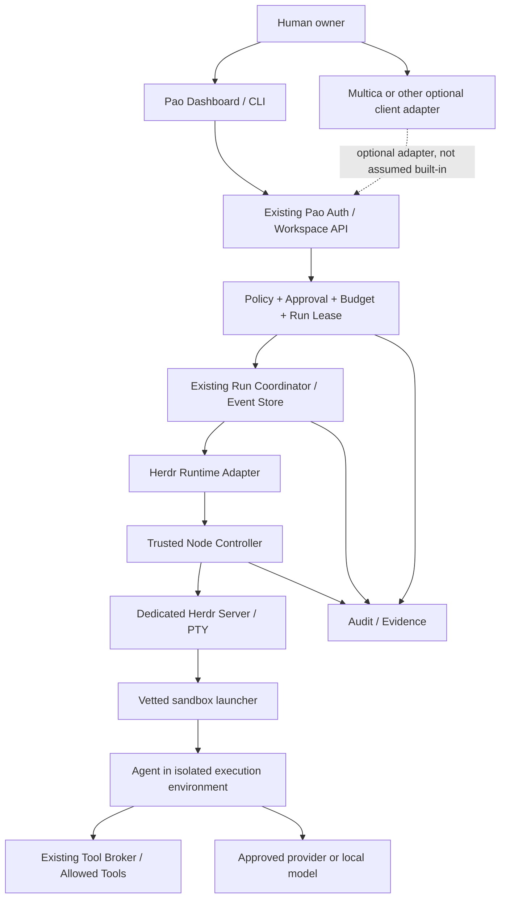

# Phase 20.73 — Pao-hubPro × Herdr

## Persistent Multi-Agent Terminal Runtime, Cross-Machine Coding Agent Orchestration, Session-Aware Agent Recovery, Agent-to-Agent Coordination & Policy-Governed Execution Plane

> **Document type:** Production-Oriented Implementation Blueprint
> **Phase:** 20.73 · **Document revision:** 1.0.0 · **Prepared:** 16 กันยายน 2026 — Asia/Bangkok
> **Project:** Pao-hubPro
> **Source of Truth:** `Phase_20.73_Pao-hubPro_x_Herdr.md`, processed under `PAO-HUBPRO_MASTER_PHASE_REQUEST.md`
> **Status:** Implementation Blueprint — **ยังไม่ใช่หลักฐานว่าพัฒนา ติดตั้ง หรือทดสอบระบบจริงเสร็จแล้ว**
> **Upstream:** `herdrdev/herdr` · **Stable baseline:** `v0.9.0` (changelog 2026-09-07) [H1][H2] · **Pinned commit:** `b99002ac99b09e00b4ca692436cb15a6b0d676f1` [H3] · **Manifest:** Rust `herdr` 0.9.0, Apache-2.0 [H4]
> **Integration posture:** Adapter-first; preserve existing runtimes; separate policy authority from terminal runtime; deny unsafe fallbacks
> **Recommended first live target:** Dedicated Linux development runtime, after isolation and contract tests
> **Canonical filename:** `docs/phases/Phase_20.73_Pao-hubPro_x_Herdr.md`
> **Execution contract:** ชื่อ Pao API, MCP tools, configuration, database entities และเมนูในเอกสารนี้เป็นข้อกำหนด**ที่จะพัฒนา** ไม่ใช่ความสามารถที่ยืนยันว่ามีอยู่แล้วใน Herdr หรือ repository ของเปา
> **Filename/content consistency:** Filename and header agree on Phase 20.73; no collision (sequential after Relmio 20.72).

> **ความหมายของคำบังคับ:** MUST = ต้องทำ; MUST NOT = ห้ามทำ; SHOULD = ควรทำ เว้นแต่มีเหตุผล+หลักฐานใน ADR; MAY = ทางเลือกที่ปิดได้

---

## 1. Executive Summary

เพิ่ม **Herdr** เป็น runtime adapter ทางเลือกสำหรับงานที่ต้องใช้ terminal จริงและ session ต่อเนื่อง โดย **Pao-hubPro ยังคงเป็นเจ้าของงาน สิทธิ์ การอนุมัติ และหลักฐานทั้งหมด**

เฟสนี้ทำให้ตอบคำถามเหล่านี้ได้: Agent ตัวไหนทำงานที่เครื่องใด ใน workspace/sandbox ใด? · เมื่อปิดหน้าต่างหรือ SSH หลุด งานยังอยู่ไหม สถานะสดแค่ไหน? · Agent กำลังทำงาน รอคำตอบ หรือตรวจจับไม่ได้? · ใครมีสิทธิ์ส่ง prompt/resume/cancel/ส่งข้อความหา Agent อื่น? · หลัง server restart ต้อง reattach, resume conversation หรือสร้าง attempt ใหม่? · งานผ่านการทดสอบจริงหรือแค่ Agent กลับสู่ idle? · เมื่อปิดสิทธิ์/lease หมดอายุ ป้องกันงานใหม่และหยุดงานเดิมอย่างไร?

**Deliverables (10):** Herdr Runtime Adapter · Runtime/Node Registry Extensions · Policy-Governed Dispatch · Durable Run Coordinator · Safe Session Recovery · Cross-Machine Adapter · Agent Coordination · Dashboard + Evidence · Isolation Qualification · Runbooks + Codex Prompt

**สิ่งที่ไม่ควรเกิด:** ไม่ย้ายทุกงานไป terminal อัตโนมัติ ไม่เพิ่ม platform ซ้ำกับ Multica ไม่รื้อ native Codex integration ที่ทำงานดีอยู่ — งานที่ต้องการ structured tool events + approvals อาจเหมาะกับ native adapter มากกว่า terminal adapter

**ขอบเขตหลักฐานของต้นฉบับ:** ตรวจจาก upstream documentation/release metadata/Phase เดิมที่เข้าถึงได้ — **ไม่ใช่** security audit ของ Herdr ทั้ง repo และไม่ใช่ผลทดสอบเครื่อง/บัญชีจริง; ยังไม่ได้: เปิด repository ปัจจุบัน, ติดตั้ง/รัน Herdr, ทดสอบบัญชีจริง, เชื่อม VPS/RunPod/Windows/SSH, reproduce security reports, รัน T01–T80

---

## 2. Problem Statement

Multi-agent terminal runtimes แนะนำความเสี่ยงใหม่ที่ chat-based runtime ไม่มี: raw PTY socket เป็น authority ตรง (Agent ที่เข้า shell ได้จะ bypass UI approval ได้แม้ frontend แสดงแม่กุญแจ); terminal state (`done`/`idle`) ไม่ใช่ task verdict; writer ownership ระหว่าง human/native/API ต้องถูก fence; session restore ไม่เท่า process survival; และ multi-machine targeting ต้องผูก identity ชัดเจนทุก hop

Phase 20.73 แก้ด้วยการทำให้ทุก state เหล่านี้เป็น **first-class objects ภายใต้ Pao governance** — โดยไม่แทนที่ runtime เดิม

---

## 3. Goals

**In scope:** Herdr runtime adapter; canonical node/session registry extensions; peer/node health; policy-governed dispatch; durable run coordinator (attempt/lease/dispatch state/event/ambiguity); safe session recovery (attach ≠ resume ≠ retry); cross-machine adapter over approved SSH; agent coordination envelopes; task/ticket mapping; cold-review integration; context/cost telemetry; capability matrix; audit ingestion; policy/approval integration; fleet dashboard; API; optional MCP; headless Linux support; Docker sandbox awareness; version drift; feature flags; tests; upgrade/rollback runbooks

**หลักฐาน 7 ระดับ (ห้ามเลื่อนขั้นโดย copy ค่า fixture หรือ version string ตรงกัน):**

```text
DOCUMENTED          พบในเอกสาร upstream
METADATA_VERIFIED   ตรวจ release/tag/manifest ที่ระบุ
SOURCE_REVIEWED     ตรวจ implementation เฉพาะส่วนที่บันทึกไว้
CONTRACT_TESTED     ทดสอบ protocol กับ binary/server ที่ระบุ
ISOLATION_TESTED    ทดสอบ bypass/isolation บน deployment จริง
LIVE_VERIFIED       ทดสอบงานจริงกับบัญชีและ environment ที่ระบุ
DEPLOYMENT_APPROVED ผ่าน gate ของ deployment mode นั้น
```

---

## 4. Non-Goals

- ไม่สร้าง terminal emulator หรือ fork Herdr core โดยไม่มี ADR + เหตุผลจำเป็น
- ไม่สร้าง authentication/Vault/task queue/database อีกชุดโดยไม่ตรวจของเดิม
- ไม่รับ arbitrary host shell, raw socket JSON หรือ unrestricted SSH command จาก browser/MCP
- ไม่แชร์ provider credential/session token ระหว่างผู้ใช้
- ไม่ auto-approve dialog ด้วยการส่ง `y`, `enter` หรือคลิกตามข้อความบนจอ
- ไม่ใช้ terminal output เป็น policy instruction
- ไม่ทำ auto-merge/auto-push/production deploy/asset submission เป็นผลข้างเคียงของ review
- ไม่สร้าง/ยกเลิก GPU pod เพียงเพราะ terminal เชื่อมต่อหรือหลุด
- ไม่สัญญา exactly-once execution บน native API ที่ไม่มีหลักฐานรองรับ
- ไม่สัญญา full command-level enforcement ผ่านการกรอง prompt อย่างเดียว

---

## 5. Why This Phase Exists — Upstream Reality

### Evidence snapshot (ตรวจ 16 ก.ย. 2026)

| ประเด็น | ยืนยันจากแหล่งต้นทาง | ผลต่อการออกแบบ |
|---|---|---|
| Stable baseline | release `v0.9.0`; preview แยกต่างหาก [H1] | ตรึง stable ไม่ติดตาม `master`/`latest` |
| Source metadata | manifest 0.9.0, Apache-2.0 [H4] | license/provenance แยกจาก source |
| Persistence | **detach ≠ server restart**; restart ไม่เก็บ process เดิม [H7] | ห้ามสื่อว่า process รอด reboot |
| Restore | native restore เปิด default; resume มีเงื่อนไข client attach/context [H7] | Pao เป็น recovery owner ใน managed mode |
| Agent state | Codex/Claude/Hermes ใช้ screen manifest เป็น state authority [H8] | สถานะ ≠ หลักฐานความสำเร็จ/สิทธิ์ |
| Multi-machine | Linux/macOS รองรับ; Windows มีข้อจำกัดแยก [H9][H10] | capability ต่อ platform ไม่ universal promise |
| Automation | CLI + local socket = ช่องทางควบคุมเดียวกัน [H5][H6] | ซ่อน raw socket ต้องครอบคลุม CLI + child process |
| Security report | Discussion #514 reproduce ใน 0.8.2 (3 ก.ย. 2026) [H12] | threat-model input ไม่ใช่คำยืนยันผลบน 0.9.0 |
| Writer ownership | input channels หลายแบบต้อง fence ร่วมกัน [H13] | Pao lease อย่างเดียวไม่พิสูจน์ exclusive PTY writer |
| Update trust | ข้อกังวล updater/control socket [H14] | ตรวจ artifact/deployment เอง; checksum ≠ secure |

**ข้อจำกัดที่ต้องแสดงในระบบ (6):** 1) `done` ของ Herdr ≠ `task succeeded` ของ Pao (upstream: idle/seen state) [H11]; 2) timeout/`agent_prompt_stalled` ≠ ยืนยันว่า prompt ยังไม่ถูกส่ง; 3) `agent prompt --wait` ≠ transaction ติดตาม turn ครบถ้วน; 4) อ่าน history บางรูปแบบอาจ scroll หน้าจอ Agent (ไม่ใช่ passive read ทุกกรณี); 5) socket path/session name ไม่ใช่ security boundary เอง; 6) diagram เชื่อม Multica/AgentsRoom/Pao/Herdr เป็นข้อเสนอ ไม่ใช่ integration สำเร็จรูป

### Sources (ตรวจ 16 ก.ย. 2026 — pinned)

[H1] release v0.9.0 · [H2] pinned CHANGELOG · [H3] release commit · [H4] Cargo.toml manifest · [H5] CLI reference · [H6] socket API · [H7] session state/restore · [H8] agents/state authority · [H9] connecting machines · [H10] Windows beta · [H11] agent automation semantics · [H12] security discussion #514 · [H13] writer-ownership discussion #2332 · [H14] updater/socket discussion #990 — ทุก ref มีขอบเขต (เช่น H3 = source identity ไม่พิสูจน์ binary provenance; H12 = ไม่ reproduce บน 0.9.0; H13 = ไม่ยืนยัน fix) · **[P1]** Phase 20.72 · **[P2]** Phase 20.21 (native Codex runtime — คง native adapter เป็นทางเลือก)

---

## 6. Relationship to Pao-hubPro

### Authority reuse (ไม่สร้างซ้ำ)

Phase 20.72 กำหนด reuse identity/workspace/credential/policy/approval/budget/fleet/audit [P1]; Phase 20.21 เสนอ native Codex runtime [P2] — **เก็บ native adapter เป็นทางเลือก ไม่ให้ Herdr กลายเป็นข้อบังคับทุก Agent**

| ความรับผิดชอบ | เจ้าของเดิม | Phase 20.73 เพิ่ม |
|---|---|---|
| User/tenant/project ownership | Identity/RBAC เดิม | Runtime operation mapping |
| Agent identity | Agent Registry เดิม | Native kind + occupant binding |
| Task/run/attempt | Workflow engine เดิม | Terminal dispatch/recovery states |
| Fleet/session registry | Module เดิม | Herdr node/session/pane locator |
| Secrets/provider access | Credential authority / 20.72 | `credentialRef` + `runtimeAuthRef` binding |
| Approval/policy | Existing decision authority | Approval fingerprints สำหรับ terminal ops |
| Budget | Budget/lease เดิม | Concurrency + runtime reservation |
| Events/audit | Existing event bus/audit | Herdr-derived normalized events |
| Sandbox | Existing safe runtime | Dedicated deployment qualification |
| Observability | Existing telemetry | Freshness, drift, reconnect, uncertainty |
| Native Codex | Adapter ตาม 20.21 | Herdr = optional alternate path |

**Candidate integrations** (Fleet 20.71, amux, Reviewer Council, secure runtime) ต้องตรวจ module/contract จริงก่อนเชื่อม · **Multica:** คงเป็น workflow เดิม ห้าม migrate/reset/delete เปลี่ยน ownership อัตโนมัติ · **AgentsRoom:** ไม่ใช่ dependency ไม่บังคับติดตั้ง/ซื้อ · **Pao-hubPro:** authority ของงานที่ส่งผ่าน Pao — ไม่อ้างคุม activity นอก Pao ทั้งหมด

### Layer mapping (สรุป)

03 Intent/Context (terminal output = untrusted data) · 05 MCP (12 governed tools) · 07 Policy (dispatch admission) · 08 Approval (2-layer model) · 09–11 Execution (terminal runtime adapter) · 12 State (composite locator; generation policy) · 14 Secrets (credentialRef/runtimeAuthRef) · 15 Event (21 event types) · 16 Observability (freshness/drift) · 17 Audit (intent durable ก่อน mutation) · 19 Dashboard (Runtime → Herdr)

---

## 7. Upstream / External Project

### Separation of concerns

| Part | Owner | Notes |
|---|---|---|
| A. Upstream | `herdrdev/herdr` v0.9.0 @ pinned commit (Apache-2.0) | Terminal/PTY runtime; ไม่ fork โดยไม่มี ADR |
| B. Pao adapter | `HerdrRuntimeAdapter` + transport + mapper (Section 12) | Language-neutral contract illustration |
| C. Pao policy wrapper | RuntimeAdmission, dispatch, leases, recovery gate | Governance ทั้งหมด |
| D. Pao extensions | Registries, ReportOnlyBroker, coordination, dashboard, evidence | Built in this phase |

### Upstream risk assessment

- **License:** Apache-2.0 (manifest [H4]) — dependency licenses ตรวจแยก
- **Maintenance:** pre-1.0, fast-moving; pinned v0.9.0; contract tests ก่อน upgrade
- **Security:** community report [H12] (0.8.2) + writer-boundary concern [H13] + updater/socket concern [H14] — ใช้เป็น threat-model input; **ต้อง qualification เอง ไม่อนุมานจาก discussions**
- **Dependency risk:** medium-high — real PTY/socket runtime; isolation tests บน deployment จริงก่อน enable
- **Vendor lock-in:** none — optional adapter; native/structured runtime คงอยู่

---

## 8. Current-State Assumptions

- **[Needs Verification] Repository discovery ก่อนแก้โค้ด** — อ่าน `AGENTS.md` + `git status` ทุกครั้ง; สร้าง `docs/phase-20.73/discovery.md` ตรวจ 15 หัวข้อ (repo/branch/commit/dirty changes; frameworks; languages/lockfiles; DB/ORM/migrations; identity/tenant/RBAC; task queue/run model/locks/event bus; native agent adapters; node/fleet registry; policy/approval/budget/credentials; sandbox/launcher/tool broker; audit/logging/artifacts; UI design system; testing/CI; existing Phase 20.21/20.71/20.72 implementations)

**Discovery outputs:** `discovery.md` (สิ่งที่พบจริง + path/symbol) · `authority-map.md` · `integration-gap.md` (missing deps + modes ที่ต้องปิด) · `adr-001-herdr-runtime.md` · `upstream-lock.json`

**ไม่มี repository ใน environment นี้ ≠ ไม่มี repository ของเปา** — ระบุข้อจำกัด **ห้ามสร้างแอปใหม่เพื่อเลี่ยงการตรวจระบบเดิม**

- **[Assumption] Platform:** Linux first (native path documented); Windows limited profile; macOS separate qualification — ไม่ยืมผลข้าม platform
- **[Assumption] Config ownership:** `resume_agents_on_restore=false` ตั้งได้เฉพาะ dedicated instance ที่ Pao เป็นเจ้าของ; แยก config ownership ไม่ได้ ⇒ managed recovery ปิด

---

## 9. Target Architecture



**ขอบเขตที่ต้องแยก:** Pao operation gate คุมการสั่ง runtime · sandbox/tool broker คุมสิ่งที่ Agent ทำหลัง launch · provider binding คุม credential/ค่าใช้จ่าย · OS/IPC boundary ป้องกัน Agent เข้าถึง Herdr socket/controller · external UI ใช้ adapter ที่อนุญาต ไม่ต่อ raw socket ข้าม Pao — **Agent ที่ใช้ shell/CLI เข้า socket เดิมได้ ยัง bypass UI approval ได้แม้ frontend แสดงแม่กุญแจ**

---

## 10. Architecture Diagram

See Section 9. Recommended Linux shape:

```text
Host / dedicated VM
├── trusted controller identity
│   ├── Pao node broker
│   ├── Dedicated Herdr server
│   ├── Controller-only config, socket, runtime state
│   └── Approved launcher profiles
└── sandbox identity / container / VM boundary
    ├── Agent CLI
    ├── Only assigned checkout + scratch directories
    ├── Report-only endpoint
    ├── Approved provider route
    └── NO Herdr socket, controller HOME, SSH agent, Docker socket
```

**Controller และ Agent MUST NOT ใช้ same-user unrestricted host execution แล้วอ้างว่าซ่อน environment variable = isolation**

---

## 11. Core Components

| # | Component | รับผิดชอบ |
|---|---|---|
| 1 | `HerdrDiscovery` | Binary/server capability, config ownership, integrations |
| 2 | `HerdrTransport` | Bounded NDJSON/local IPC หรือ verified CLI wrapper |
| 3 | `HerdrAdapter` | Native data → Pao domain model |
| 4 | `RuntimeBindingStore` | Persistent mapping + generation |
| 5 | `RuntimeAdmission` | Existing policy/approval/budget calls |
| 6 | `RuntimeDispatcher` | Durable intent, leases, dispatch reconciliation |
| 7 | `RuntimeObserver` | Snapshot, events, freshness, resync |
| 8 | `RecoveryPlanner` | Recovery plan (no side effect จนอนุมัติ) |
| 9 | `ReportOnlyBroker` | Per-run state reports โดยไม่เปิด control API |
| 10 | `SSHNodeAdapter` | Approved host transport + pinned target |
| 11 | `TerminalProjection` | Sanitized visible text / qualified observer |
| 12 | `RuntimeDashboard` | Status, approvals, recovery, evidence |
| 13 | `HerdrContractFixtures` | Sanitized schema responses + deterministic replay |

**Mocks อยู่เฉพาะ demo/test path — ไม่คืน success ให้ production handler เมื่อ upstream ไม่พร้อม**

---

## 12. Component Responsibilities

### 12.1 Adapter contract (language-neutral illustration — แปลงตาม backend จริง)

```ts
type EvidenceLevel = "documented" | "contract_tested" | "isolation_tested" | "live_verified";

type TargetRef = { projectId; nodeId; runtimeInstanceId; serverGeneration;
                   paneBindingId; occupantId; attemptId };

type WriteContext = { operationId; actionDigest; approvalRef?; leaseRef;
                      fencingEpoch; deadlineAt };

interface HerdrRuntimeAdapter {
  discover(instanceId: string): Promise<CapabilitySnapshot>;
  snapshot(scope: AuthorizedScope): Promise<RuntimeSnapshot>;
  observe(scope: AuthorizedScope, signal: AbortSignal): AsyncIterable<RuntimeEvent>;
  readVisible(target: TargetRef, limit: ReadLimit): Promise<SanitizedSnapshot>;
  planLaunch(input: LaunchIntent): Promise<LaunchPlan>;
  launch(plan: ApprovedLaunchPlan, ctx: WriteContext): Promise<DispatchReceipt>;
  submitPrompt(target: TargetRef, input: PromptEnvelope, ctx: WriteContext): Promise<DispatchReceipt>;
  inspect(target: TargetRef): Promise<OccupantObservation>;
  waitForState(target: TargetRef, input: BoundedWait): Promise<StateObservation>;
  planRecovery(input: RecoveryIntent): Promise<RecoveryPlan>;
  applyRecovery(plan: ApprovedRecoveryPlan, ctx: WriteContext): Promise<DispatchReceipt>;
  requestCancel(target: TargetRef, ctx: WriteContext): Promise<CancelReceipt>;
  reconcile(operationId: string): Promise<ReconciliationResult>;
}
```

`AuthorizedScope` + caller identity สร้างจาก **trusted request context** — ไม่ใช้ `projectId` ใน JSON payload เป็นหลักฐานสิทธิ์. `DispatchReceipt` แยก `accepted / acknowledged / uncertain / rejected` — **ไม่ใช้ boolean เดียวแทน execution outcome**

### 12.2 Transport (NDJSON over Unix socket / Windows named pipe [H6])

**Required behavior:** decoder รับ partial frames + หลาย frames/chunk; จำกัด frame bytes/nesting/field sizes/outstanding requests/total buffered bytes; reject malformed UTF-8/JSON ตาม documented policy (ไม่ส่งข้อมูลดิบเข้าเว็บ); จับคู่ response ด้วย request ID + reject mismatched/duplicate terminal outcomes; แยก event-stream connection จาก short-lived requests; **timeout ยกเลิก waiter ใน adapter — ไม่ถือว่าหยุด upstream operation สำเร็จ**; cancellation ของ HTTP/MCP request ≠ task cancel อัตโนมัติ; ไม่ส่ง internal path/raw prompt/environment/credential ใน transport error

**CLI fallback:** เฉพาะ approved native wrappers ที่ตรวจ contract แล้ว — `execFile`/argv + environment allowlist; **ห้าม** default `shell=true`; ห้ามประกอบ `ssh "...user prompt..."`; ห้าม caller เลือก executable/path; session selection explicit + controller-owned (**ไม่รับ** `HERDR_SOCKET_PATH`, `HERDR_SESSION`, `PATH`, config location จาก Agent)

**Socket location:** discover จาก instance configuration ที่ Pao เป็นเจ้าของ — ไม่ hardcode default path; **socket path ที่หาได้ ≠ มีสิทธิ์เชื่อมต่อ/ส่ง write**

### 12.3 Native methods → Pao operations (mapping proposal; default deny list)

| Pao operation | Native candidate | ข้อกำหนด |
|---|---|---|
| Runtime health | `ping`, verified status | Metadata only |
| Inventory | `session.snapshot`, list/get | Scope filter ก่อนคืนผล |
| Visible text | `pane.read` / `agent.read` | `visible`/`detection`, bounded output |
| Observe events | `events.subscribe` | Scope, reconnect, no assumed replay |
| Workspace create | `workspace.create` | Controller-owned cwd/profile; may start shell |
| Start agent | `agent.start` / qualified launcher bridge | รักษา sandbox + binding |
| Prompt | `agent.prompt` | Idle admission by Pao, occupant guard, bounded wait |
| Wait | `agent.wait` | Observation, **not success verdict** |
| Cancel | Qualified runtime-specific mechanism | Verify termination; no blind key injection |
| Recovery | Qualified launcher + native resume | New admission, no automatic task replay |
| Integration install | Admin deployment op | **Disabled from model tools** |
| Server stop | Dedicated lifecycle op | Blast-radius preview + explicit approval |

**Default deny:** unrestricted input/keys · arbitrary plugin invoke/install · arbitrary integration install · server stop/restart · raw API forwarding · path-based resume · environment overrides. **อย่าสร้าง raw method `pane.run` เอง** — raw method/params ต้องตรง installed/server schema

### 12.4 Capability negotiation + version lock

**Lock-record template (ไม่ใช่หลักฐาน binary verification):**

```json
{"component": "herdr", "repository": "herdrdev/herdr", "selectedTag": "v0.9.0",
 "sourceCommit": "b99002ac99b09e00b4ca692436cb15a6b0d676f1",
 "manifestVersion": "0.9.0", "reviewedOn": "2026-09-16",
 "artifactSha256": null, "artifactProvenance": "not_verified",
 "cliSchemaSha256": null, "runningServerCapabilitiesSha256": null,
 "integrationVersions": {}, "contractTestStatus": "not_run",
 "isolationTestStatus": "not_run", "liveExecutionAllowed": false}
```

**ตรวจ installed CLI และ running server แยกกัน** — อัปเดต CLI แล้ว server ไม่เปลี่ยนตาม; CLI schema ไม่พิสูจน์ว่า running server รุ่นเก่ารองรับทุก method → negotiate + contract-test server ด้วย [H5][H6]

**Gates:** unsupported method ⇒ `UNSUPPORTED_CAPABILITY` (ไม่ retry ด้วย raw shell); schema drift ⇒ block affected writes, keep qualified reads; unknown security-relevant field/enum ⇒ fail closed; unknown response metadata ⇒ เก็บ/ignore ตาม policy (ไม่ให้สิทธิ์เพิ่ม); plugin/hook/manifest เปลี่ยน ⇒ qualification ใหม่; ไม่มี remote capability proof ⇒ local-only/read-only (ไม่แสร้ง federated); **ไม่แก้ server อัตโนมัติเพียงเพื่อให้ version ตรง CLI**

### 12.5 Events, snapshots, freshness

Lifecycle subscription **ไม่ replay เหตุการณ์ก่อน subscribe** [H6]. **Bootstrap algorithm (10 ขั้น):** authenticate node + resolve approved instance → negotiate methods/capabilities → open event subscription + wait ack → buffer incoming events (fixed memory limit) → read runtime snapshot → install normalized scope-filtered snapshot → apply compatible buffered events → re-read affected resources เมื่อ ordering/version พิสูจน์ไม่ได้ → mark projection ready หลัง reconciliation → continue stream + periodic health. **อย่าสมมติ snapshot↔event stream มี transaction boundary/global sequence ที่ upstream ไม่ให้** — จัดลำดับไม่ได้ ⇒ authoritative re-read + ห้าม writes ระหว่าง reconciliation

**Pao event envelope:**

```json
{"eventId": "paoevt_example", "type": "runtime.agent_state_observed",
 "projectId": "project_example", "nodeId": "node_example",
 "runtimeInstanceId": "instance_example", "serverGeneration": "generation_example",
 "paneBindingId": "binding_example", "occupantId": "occupant_example",
 "attemptId": "attempt_example", "source": "herdr", "nativeEventRef": null,
 "ingestionSeq": 42, "observedAt": "2026-09-16T04:00:00Z",
 "reportedState": "working", "stateAuthority": "screen_manifest",
 "freshness": "fresh", "payloadRef": "redacted_event_payload"}
```

`ingestionSeq` = Pao จัดเอง — **ไม่ใช่** upstream ordering/replay proof

**Reconnect rules:** exponential backoff + jitter + bounded retry budget; ระหว่าง disconnected แสดง `offline/unknown` + last-known timestamp (**disconnected ≠ process stopped**); reconnect ⇒ resubscribe/snapshot/reconcile ใหม่ (**ไม่ resend prompt เก่า**); buffer overflow ⇒ stop incremental replay + authoritative resnapshot; lost events ⇒ record `observation_gap` (**ห้ามแต่งเหตุการณ์ที่ไม่เห็น**); UI replay ใช้ Pao persisted events (ไม่อ้าง native replay); clock skew ⇒ controller monotonic time สำหรับ timeout + server UTC สำหรับ audit

### 12.6 Agent state ≠ task state

**Observed runtime state:** `not_detected · unknown · idle · working · blocked · done · exited` (`exited` derive ได้จาก process/lifecycle event พร้อม provenance)

**Pao task state (18):** `draft · planned · awaiting_approval · queued · launching · ready · dispatching · running · waiting_for_human · result_pending · validating · succeeded · failed · cancel_requested · cancelled · dispatch_uncertain · recoverable · lost`

**Transition rules:** `working` → update observation (ไม่รับรองเป็น turn ของงานเรา); `blocked` → หยุด automatic input + attention item; `idle`/`done` → อาจเริ่ม result validation (**ไม่ตั้ง succeeded**); `unknown` → เก็บเหตุผล/authority ไม่ส่ง raw fallback; `exited` → ตรวจ exit/result/artifact (**exit 0 ≠ task acceptance**); stale signal → แสดง stale + block writes; native timeout → reconcile (ไม่สร้าง attempt ซ้ำทันที)

**Completion evidence:** task `succeeded` ต้องมีผลลัพธ์ผูก `runId/attemptId/dispatchId` + expected workspace/revision + acceptance checks — structured result envelope, output artifact digest, test runner result จาก trusted collector, reviewer verdict ตาม policy. **ข้อความ "เสร็จแล้ว", ANSI สีเขียว, regex `passed`, native `done` อย่างเดียวไม่พอ**

### 12.7 Launch profiles + sandbox-aware discovery

```yaml
# Pao proposed profile; not Herdr configuration.
id: herdr-codex-dev
kind: codex
launcherRef: approved-launcher-profile
workspacePolicyRef: assigned-checkout-only
sandboxPolicyRef: isolated-linux-dev
providerBindingRef: authorized-provider-binding
workingDirectorySource: bound-checkout
environmentPolicyRef: minimal-agent-env
argumentsPolicyRef: approved-agent-options
nativeDetection: {requiredForPrompts: true, verifiedWithLauncher: false}
nativeResume: {allowed: false, verificationRequired: true}
maxRuntimeSeconds: 1800
allowRawTerminalFallback: false
allowControllerSocket: false
```

**Launch plan fields:** resolved node/instance; fresh capability digest; project/run/attempt; checkout revision; executable/launcher digest; sandbox profile digest; provider reference; budget reservation; argument list; **environment key names (ให้ operator ตรวจ — ไม่เปิด secret values)**; output policy; lease; recovery owner; expected blast radius

**Two implementation candidates:** A) Qualified canonical-agent launcher (native start เลือก executable จาก controller-controlled PATH → approved wrapper → sandbox ก่อน Agent เริ่ม; ทดสอบ argv/environment/detection/process identity/resume จริง) · B) Qualified argv launcher bridge (runtime surface ที่รองรับ argv จริง + manifest trusted/pinned/non-writable; plugin = vetted deployment component ไม่เปิด generic plugin API ให้ model). ทั้งสองตรวจว่าตรง native schema/version จริง — ไม่สร้าง launch method ที่ไม่มี

**Safe failure:** `launch result → running_unrecognized / qualification_failed → interactive prompting disabled → raw pane input fallback prohibited → existing native Pao adapter remains available` — **อย่าแก้**ด้วยการให้ worker เข้า full Herdr socket หรือปลอมว่า custom hook เป็น official integration

**Immutable run-to-pane binding:** หนึ่ง pane/sandbox ผูกหนึ่ง attempt ตลอดอายุ; ไม่ reuse terminal location ให้งานอื่นโดยเก็บ approval เดิม; occupant ออก ⇒ ปิด admission + สร้าง binding ใหม่ชัดเจน. **Pao MUST NOT เปิด concurrent human/native writers ใน managed instance** หากพิสูจน์ atomic target identity/input enforcement ไม่ได้ ⇒ downgrade operation ที่เกี่ยวข้อง ไม่กล่าวอ้าง strict fencing

### 12.8 Dispatch, idempotency, uncertain outcomes

**Admission sequence (12 ขั้น):** authenticate → resolve target + ownership → validate schema/size → read fresh runtime binding → check capability+policy+budget → validate exact approval digest → acquire run/writer lease → persist dispatch intent + outbox → recheck binding+lease at node → invoke native operation → persist acknowledgement/uncertainty → observe + validate result. **ผูก run row + reservation + dispatch intent ใน transaction เดียวเท่าที่ store รองรับ**

**Idempotency:** scope key ต่อ tenant/project/operation; same key+same digest → คืน record เดิม; same key+different digest → conflict; key retention ยาวกว่า retry/recovery window; dispatch outbox มี atomic claim + fencing epoch; **native request `id` ไม่ถือเป็น server-side idempotency key จนมีหลักฐาน**

**Uncertain dispatch (connection หลุดหลังส่ง ก่อน ack):**

```text
sendState = unknown · taskState = dispatch_uncertain · automaticResubmit = false
→ reconcile จาก native state + trusted output/artifact + dispatch markers
→ หลักฐานไม่ชัด ⇒ human decision หรือ explicit new attempt หลังพิสูจน์ว่างานเก่าไม่มี side effect ต่อ
```

**Exactly-once honesty:** Pao ทำ durable deduplication ในขอบเขตตนได้ — **ไม่อ้าง exactly-once native execution** เมื่อ crash ในช่วง send/ack. การล้มหลัง persist intent ก่อนส่ง ≠ ล้มหลังส่งแล้ว — **ต้องมี tests แยกกัน**

**Pseudocode:** `begin transaction → assert idempotency key → assert run admissible → reserve budget → create dispatch intent + outbox → commit`; `node atomically claims outbox (fencing epoch) → validates current policy/expiry/binding/capability → records "sending" → invokes native request once → ack verified ⇒ persist acknowledged; else ⇒ persist uncertain + schedule observation-only reconciliation`

### 12.9 Prompt admission + input policy + tool-level security

**Pao เลือกกติกาเข้มกว่า native:** แม้ native ส่ง prompt ขณะ working ได้ [H11] — baseline Pao queue จน ready/idle ที่สด + ไม่มี active task ownership conflict. Prompt envelope: task instruction + context references + expected outputs + correlation ID + budget (**ไม่แนบ** credential/full raw terminal history/approval token)

**Input policy (8):** prompt text เป็น data ไม่แทรกเข้า shell command; จำกัด bytes/Unicode/control chars/binary; reject NUL + terminal control sequences นอก allowed text contract; **ไม่ส่ง encoded Enter/escape/macro ผ่านช่อง prompt จาก caller**; native adapter จัด submission mechanics ตาม verified protocol; raw keys/control = operation แยก; blocked/unknown ⇒ **ห้าม** pane input bypass agent API; concurrent prompt ต่อ occupant → queue/conflict ไม่ interleave

**Tool-level security:** การอนุมัติ prompt **ไม่ได้อนุมัติ** shell/file/network action ที่ Agent ตัดสินใจทำภายหลัง; managed runtime ต้องมี sandbox + native/tool-broker approval ที่ enforce ได้; **ถ้าผ่าน Herdr แล้วสูญ structured approval semantics ของ native adapter ⇒ แจ้ง capability gap + ใช้ native path กับงานนั้น**; prompt injection จาก repo/Agent อื่นไม่เพิ่ม scope/ปลด sandbox/เปลี่ยน provider binding

### 12.10 Approval model (2 ชั้นแยกกัน)

| Layer | อนุมัติอะไร |
|---|---|
| Pao runtime admission | Launch, prompt task, recovery, termination, remote setup |
| Agent/tool execution approval | File write, command, network, deployment หรือ tool ภายในงาน |

**ห้ามแปลง "อนุมัติ launch" เป็น "อนุมัติทุก command ที่ตามมา"**

**Approval digest ผูกกับ (11):** principal/project/run/attempt · node/runtime instance/server generation/occupant binding · operation/exact normalized arguments/prompt content digest · workspace + revision · sandbox profile + launcher digest · provider/account binding · capability + policy versions · budget scope · expiry — **digest ≠ authenticated approval record** (ตรวจ signer/issuer/subject/expiry/revocation ตาม authority เดิม)

**Blocked dialogs:** runtime `blocked` อาจเป็นคำถามหรือ permission dialog — screen detection ไม่รับรอง exact operation. Baseline (5): สร้าง attention item + sanitized visible snapshot + hash → แสดงว่าเป็น untrusted runtime content → operator ตัดสินใจผ่าน supported native mechanism → exact action context จึงบันทึก approval → **ไม่มี structured context ⇒ ไม่ auto-approve ด้วย key macros**. Privileged/destructive actions ผ่าน structured tool approval path — **ไม่ใช้ screenshot + `enter` เป็น authorization primitive**

**Native human access:** raw native terminal ให้ operator = **elevated break-glass** ไม่ใช่ normal flow; ก่อน handoff freeze automatic dispatch + invalidate writer lease + แสดง `external_control_active`; คืน control ⇒ resnapshot/reconcile + lease ใหม่

### 12.11 Workspace, filesystem, Git

**Workspace contract:** bind project → approved repository → checkout/worktree → sandbox-visible path (trusted controller resolves); ตรวจ canonical path, mount roots, symlink/junction, ownership, case behavior, Unicode normalization + race ระหว่าง validation/use; **ห้าม caller ส่ง host absolute path แล้วถือว่าอยู่ใน project เพราะ string ขึ้นต้นเหมือนกัน**

**Git policy (8):** หนึ่ง writer attempt ต่อ checkout เป็น default; หลาย worker ใช้แยก worktree/branch/isolated clone; reviewer ใช้ immutable diff/snapshot (write ปิด); รันทดสอบบน disposable copy; **shared Git object database ไม่ใช่ security boundary**; ไม่รัน untrusted hooks/build scripts บน controller identity; **ไม่ตั้ง global `safe.directory=*`**; ไม่ commit/push/merge/deploy โดยไม่มี task scope + approval เฉพาะ

**Artifacts:** artifact path จาก Agent = untrusted input — resolve ใน assigned output directory + จำกัดชนิด/ขนาด; **digest คำนวณโดย collector ไม่เชื่อ digest ที่ model รายงานเอง**

**Cleanup:** workspace close / process stop / checkout delete / branch delete = **คนละ operation**; ห้าม force-remove dirty worktree หรือ delete source branch เพราะ task cancelled — ข้อมูลเดิมอยู่จนเจ้าของตัดสินใจ

### 12.12 Session recovery (ไม่ข้าม policy)

| เหตุการณ์ | ควรทำ | ห้ามสมมติ |
|---|---|---|
| UI/client detach | Reconnect existing runtime | ไม่ต้อง launch Agent ใหม่ |
| SSH disconnect | Re-establish observation; inspect old process | Network lost ≠ process ตาย |
| Node controller restart | Reconcile registry/leases with server | ไม่ resend outbox ที่ uncertain |
| Herdr server restart | Rediscover layout + session metadata | ไม่อ้าง old process ยังอยู่ |
| Host reboot | **New generation** + fresh qualification/admission | Process memory ไม่รอด |
| Provider login expired | Human re-auth in approved runtime | ไม่ copy token จาก host |
| Native session ref missing | Manual/new attempt plan | ไม่เลือก "latest session" แบบเดา |
| GPU host reclaimed | Recover artifacts/checkpoints if available | Terminal persistence ≠ storage durability |

**Single recovery owner:** managed mode ⇒ **Pao เป็น recovery owner**; ปิด upstream automatic agent resume ใน config ของ **dedicated instance ที่ Pao เป็นเจ้าของเท่านั้น** [H7]:

```toml
[session]
resume_agents_on_restore = false

[experimental]
pane_history = false
```

**ตรวจว่า server instance จริงอ่าน config นี้หลัง deployment** — ไม่ใช่แค่สร้างไฟล์เฉย ๆ; ห้ามแก้ config/session ส่วนตัวของเปาใน observe mode; แยก ownership ไม่ได้ ⇒ managed recovery ปิด

**Recovery plan JSON:** `recoveryMode: native_conversation_resume · priorAttemptId · newAttemptId · nativeSessionRef (opaque) · targetNodeId · requiredChecks [old_attempt_execution_status, workspace_revision, account_binding, integration_compatibility, sandbox_profile, capability_digest, fresh_policy_and_budget, human_approval] · automaticTaskReplay: false · state: planned`

**Resume execution:** เข้า approved sandbox launcher เช่นเดียวกับ fresh launch — **ไม่เรียก native resume ตรงจาก host shell**; native conversation resume ใช้ qualified session เท่านั้น + ตรวจ artifacts/revision/side effects/previous attempt ก่อน; native restore ต้องการ client terminal context [H7] ⇒ **ห้ามถือว่า headless server startup restore เสร็จ** — ใช้เส้นทางที่ทดสอบจริง หรือรายงาน `requires_client_context`

**Live handoff ปิดใน baseline** (ไม่จำเป็นต่อ MVP; ไม่ใช่ reboot persistence [H7]) — upgrade แบบ drain/verify/restart ตามแผน

### 12.13 Cross-machine execution + SSH

Herdr multi-machine = server แยกต่อเครื่อง + IDs scoped ต่อ server [H9] — Pao ต้องมี **explicit target ทุก remote operation**

**Node onboarding (9 ขั้น):** select approved node → verify owner + SSH target → verify host key out-of-band/approved known_hosts → inspect installed binary + running server → inspect config/isolation/capabilities → generate installation/change plan → **human approval** → apply through trusted deployment controller → verify + register. **Native `machine add` อาจนำไปสู่ install/start/replacement flow [H5][H9] — ไม่ใช่ read-only discovery command**

**SSH constraints (9):** approved host alias/target ID จาก registry (**ไม่รับ arbitrary URI จาก model**); strict host key checking — เปลี่ยน ⇒ stop + require verification; ไม่ auto-accept new host keys ใน background; ไม่ใช้ agent forwarding เป็น default; deploy credential ≠ runtime control credential; background reconnect non-interactive (MFA/password ⇒ `attention_required`); remote helper = fixed versioned command/profile (payload = framed data ไม่ concat shell); **ไม่เปิด raw Herdr socket เป็น public TCP endpoint**; tunnel/container networking มี identity scope (Agent เปิด tunnel ใหม่ข้าม policy ไม่ได้)

**Stable ownership:** ทุก request ผูก nodeId + instanceId + session name + host identity + generation + resource locator — **ไม่ใช้ "เครื่องที่ UI เลือกอยู่" แทน target**; remote host IP ใหม่ ⇒ revalidate identity (ชื่อ pod เดิม ≠ เครื่องเดิม)

**Partition behavior:** connection หลุด ⇒ หยุดรับ remote mutations ใหม่ · คง last-known status + stale timestamp · local node watchdog บังคับ lease expiry · **control plane ไม่ย้ายงานไปอีกเครื่องจนยืนยัน old execution ถูก fence/หยุด** · พิสูจน์ไม่ได้ ⇒ uncertain + human review (ไม่ silent failover)

### 12.14 Writer leases + Report-only broker + A2A + Reviewer Council

**Writer lease scope honesty:** Pao lease ป้องกัน **Pao writers** ที่ปฏิบัติตาม broker contract — **ไม่อ้าง**ป้องกัน native TUI/raw socket caller/host administrator [H13]; lease fields: target instance/pane/occupant · holder identity · run+attempt · fencing epoch · createdAt/expiresAt · allowed operations · last renewed · **enforcement location**; acquire/replace/release atomic ใน authority เดิม; stale disconnect ไม่ release lease ผู้ถือใหม่

**Admission boundary:** ตรวจ lease + target ที่ trusted node ก่อน enqueue; native layer ไม่มี atomic compare-and-enqueue ⇒ dedicated instance ไม่รับ out-of-band writers + ไม่ reuse pane ระหว่าง attempts + ยกเลิก queued ops เมื่อ binding เปลี่ยน + ทดสอบ delayed input/occupant-replacement races + **operation พิสูจน์ไม่ได้ ⇒ unsupported ไม่ลดเป็น raw input**; ไม่ต้องพัฒนา upstream patch อัตโนมัติ — บันทึก capability gap

**Cancellation:** `cancel_requested ≠ cancelled`; preferred termination ใช้ trusted supervisor/process-group/container identity ของ attempt (graceful deadline → escalate ตาม policy); **ห้าม** `killall codex`, kill by user-wide pattern, stop shared Herdr server, ปิด pane ที่เปลี่ยน occupant แล้ว

**Report-only broker (Pao functionality ที่ต้องพัฒนา — ไม่อ้างว่า Herdr มี authenticated API พร้อมใช้):** hook/integration รายงานสถานะโดยไม่ถือ full control — schema `{"reportType": "agent_state", "state": "working", "localSequence": 12, "sessionRef": null, "message": "..."}`; ตัวตน/project/node/pane/occupant/attempt มาจาก **broker binding** ไม่รับจาก payload; enforcement: per-attempt short-lived identity; ผูก identity กับ channel/OS peer ที่พิสูจน์ได้ (**ไม่เชื่อ `source` string**); จำกัด method/state/payload/rate/sequence/retention; ไม่ forward arbitrary JSON/native method/credential; report **ไม่เปลี่ยน** approval/budget/task success; **ห้าม mount controller socket แม้ path ถูกบอกใน environment**; hook compatibility facade รองรับเฉพาะ verified reporting messages + binding ที่ broker (**ห้าม spoof official integration version เพื่อบังคับ native restore**); **worker ถูก compromise รายงานสถานะเท็จตัวเองได้ ⇒ report = observation ไม่ใช่หลักฐานสิทธิ์/ผลสำเร็จ**

**A2A coordination (internal Pao contract — ไม่อ้างว่า Herdr implements มาตรฐาน A2A/MCP server):** envelope `messageId/conversationId/correlationId/type/senderAgentBinding/recipientAgentBinding/projectId/attemptId/payloadRef/payloadDigest (computed_by_trusted_collector)/maxHops/expiresAt`; delivery rules: authenticate sender จาก tool channel (**ไม่เชื่อ sender field ที่ model สร้าง**); authorize sender/recipient/project/type/classification; deliver ผ่าน task/message broker เดิม (ไม่ส่ง raw terminal control); จำกัด size/TTL/rate/hops/fan-out/per-run budget; retries deduplicate; **task instruction จาก Agent อื่นไม่มีสิทธิ์เปลี่ยน policy**; cross-project delivery ปิด default; ไม่มี recursive spawning ไม่จำกัด; การอ่านข้อความ ≠ อนุมัติ code change; public A2A/MCP interop ผ่าน existing protocol adapter + conformance tests (**ห้ามตั้งชื่อ internal endpoint ว่า standards-compliant โดยไม่ทดสอบ**)

**Reviewer Council:** workflow = Human task → Pao admission → Writer in isolated checkout → **trusted collector freezes diff + base/head revision** → independent reviewer gets read-only review bundle → optional tests in disposable environment → verdict aggregator → human approval for high-impact apply/merge. Roles: Lead (task metadata) · Writer (assigned writable checkout) · Reviewer (immutable diff) · Test runner (disposable env + environment digest) · Aggregator. Acceptance (8): **writer ไม่เป็น sole reviewer ของ patch ตัวเอง**; reviewer ไม่เห็น secrets/unrelated workspace; verdict อ้าง diff digest + revision ตรงกัน; patch เปลี่ยนหลัง review ⇒ **invalidate verdict**; consensus ≠ ลบ requirement ของ tests/policy/human approval; independent models ≠ ปลอดภัยอัตโนมัติ; max review rounds = configurable budget (default ทดลอง ≤ 2); external task system ได้เฉพาะ sanitized result. งานกราฟิก/AI media ยังผ่าน workflow ของระบบนั้น (ComfyUI/GPU/QC) — Herdr ไม่แทน

### 12.15 Credentials (Phase 20.72 reuse) + Terminal output privacy

**Credential binding:** `attempt → approved providerBindingRef → existing credential authority / runtime-owned authentication → sandbox-specific authorized runtime` — browser/prompt/A2A เห็นเฉพาะ reference + health. Rules (8): ไม่ import `~/.codex/auth.json`/browser cookies/third-party session stores; ไม่ copy credential ข้ามผู้ใช้; login เกิดใน approved environment โดยเจ้าของบัญชีตาม supported mechanism; ไม่เพิ่มสิทธิ์ provider ด้วยการเปลี่ยนชื่อ endpoint/สร้าง proxy; provider/account switch ผ่าน budget/policy ใหม่ (**ไม่ทำเงียบ ๆ ตอน quota เต็ม**); rotation/account epoch change ⇒ old launch/recovery approvals ใช้ไม่ได้; secret-bearing CLI process อยู่ใน trusted credential boundary (ประเมินแยก); **ไม่อ้างว่า Agent อ่าน credential ไม่ได้ หาก process/runtime เดียวกันได้รับสิทธิ์อ่านจริง**. Local models: existing approved routing + resource limits — local model ไม่มีค่าต่อ token ที่ทราบ ≠ compute cost ศูนย์; **การเลือก model name ไม่เปลี่ยน license/entitlement/capability**

**Terminal output privacy:** baseline browser/MCP read ใช้ **visible/detection snapshot** ที่ qualified passive — **ไม่เลือก deep `recent` history อัตโนมัติ** เพราะ upstream บาง flow อาจ scroll application [H11]; export history = operation แยก พร้อม writer/viewport coordination + operator awareness. Output policy: scope filter ก่อนส่ง (ไม่ใช่ frontend เดียว); จำกัด bytes/lines/rate/concurrency; sanitize ANSI/OSC/DCS/hyperlinks/terminal metadata; **disable automatic clipboard writes/file writes/clickable shell commands/remote resource loads**; ไม่ render raw HTML; user hyperlinks ตรวจ scheme (no `file:`/`javascript:`/auto-open); original bytes เก็บเฉพาะ encrypted/quarantined evidence; default logs เก็บ metadata/digests **ไม่เก็บ prompt/transcript เต็ม**. **Redaction = defense-in-depth** — ไม่รับรองเจอ secret ทุกชนิด (split chunks/encoded/unknown formats); credential screen/login output ไม่ broadcast + privacy mode ชัด. **History persistence:** managed baseline **ปิด native pane-history persistence** + ไม่คัดลอก session history เข้า project memory อัตโนมัติ [H7]; เปิดภายหลังต้องมี retention/storage protection/deletion policy/owner consent

---

## 13. Data Flow

**Dispatch flow:** see Section 12.8 (12-step admission + pseudocode). **Observation flow:** bootstrap 10 ขั้น (Section 12.5) → envelope → projection. **Launch flow:** plan (side-effect-free) → approval → apply → sandbox launcher → agent → tools/provider → result validation → evidence. **Recovery flow:** classify → inspect prior effects → plan → approve → resume through sandbox → verify

---

## 14. Control Flow

Decisions: deny-by-default dispatch; fail closed เมื่อ policy/audit unavailable; uncertainty ⇒ `dispatch_uncertain` + reconcile (**ไม่ retry อัตโนมัติ**); unsupported ⇒ explicit `UNSUPPORTED_CAPABILITY`

### Risk classification (R0–R4 mapping from deployment modes/trust classes)

| Level | Actions | Default |
|---|---|---|
| R0 — Read-only | health; inventory; scoped projection; sanitized visible snapshot; diagnostics | allow within scope (`runtime.read`) |
| R1 — Low-risk | capability discovery; plan creation (no execution); report-only registration | policy allow + audit |
| R2 — Controlled mutation | managed local launch/prompt/cancel (approved profile, sandbox proven, budget reserved); context compact | policy + lease + exact approval digest |
| R3 — High-impact / external | managed remote launch (SSH); recovery apply; account/credential lifecycle; integration install (deployment plan); server stop | **human approval + plan digest + ownership re-attestation** |
| R4 — Restricted / prohibited | `unrestricted_shared_runtime`; raw socket access from Agent; raw input fallback; auto-approve dialogs; Windows integrated federation (per baseline) | **Deny / not in supported managed modes — ไม่มีปุ่ม override ให้ติดป้ายว่าปลอดภัย** |

### Mandatory invariants (18 — encoded in tests)

```text
1. Every mutation มี authenticated principal, project, run, target, policy decision
2. Every managed terminal มี authoritative node/session/occupant binding
3. Agent ไม่มี direct access ไป Herdr control socket (CLI/raw API/inherited handles)
4. Approval ผูก immutable action digest ไม่ใช่ข้อความกว้างว่า "อนุมัติ Agent นี้"
5. Scope/target/account/occupant ใหม่ ⇒ approval เดิมใช้ไม่ได้
6. ไม่มี automatic retry ของคำสั่งที่ผล dispatch ไม่แน่ชัด
7. ไม่มี raw input fallback เมื่อ agent recognition หาย
8. ไม่มี automatic recovery ที่ข้าม Pao
9. Runtime status ไม่ใช่ task verdict
10. Unknown/stale/offline state ห้ามแสดงว่า success
11. Read permissions รวมถึงความลับใน terminal output
12. Agent state report ไม่ใช่สิทธิ์อนุมัติ และไม่รับรองผลทดสอบ
13. งานเขียนต่อ repository ผูก revision/worktree และ reviewer role ชัดเจน
14. ทุก side effect มี durable intent record + identifiable outcome
15. revoke/disable มีความหมายชัด: stop admission / request stop / confirmed stopped
16. Offline demo vs live runtime แยก label, identifiers, evidence
17. Feature flag ไม่ใช่ security enforcement เพียงอย่างเดียว
18. Native/structured adapters เดิมยังใช้งานได้จนการย้ายผ่านการทดสอบ
```

---

## 15. Agent / Worker Model

**Terminology (strictly separated):**

| Term | Definition |
|---|---|
| Agent / Occupant | Process ใน pane ที่มี native kind + observed process identity + launch generation |
| Node | Runtime host (trust zone; platform-specific capability) |
| Runtime Instance | Dedicated Herdr server instance (generation-bound) |
| Attempt | หนึ่งการรันงาน (runId/attemptId/role/launchProfileRef/expectedRevision/resultState) |
| Pane Binding | Immutable run-to-pane mapping (bindingGeneration) |
| Writer Lease | Fenced admission สำหรับ Pao writers (ไม่ fence native TUI/raw callers โดยตัวมันเอง) |
| Report Identity | Short-lived bound reporting identity สำหรับ hooks |
| Trust classes (6) | Authorized operator · Trusted controller · Untrusted execution · Untrusted content · External runtime · Host administrator (นอก isolation guarantee) |

**Composite locator (ห้ามใช้ `w1:p1`, nickname หรือ PID เดียวเป็น global identity):**

```text
Pao projectId + nodeId + runtimeInstanceId + serverGeneration
  + paneBindingId + bindingGeneration + occupantId + attemptId
```

**Generation policy:** server restart ⇒ invalidate write leases + native bindings จน rediscovery; reconnect ⇒ preserve generation เมื่อพิสูจน์ continuity ได้ (ไม่ได้ ⇒ conservative rollover + reconcile); PID reuse ต้องมี host boot/process-start identity; **pane replacement ⇒ new occupantId เสมอ** แม้ native paneId เดิม; rename ไม่เปลี่ยน authority; out-of-band move ⇒ managed writes หยุดจน rebind ผ่าน policy. Native session reference = sensitive metadata — ผูก agent kind/account/workspace/isolation profile/generation ก่อน resume

---

## 16. Session / State Model

- **Runtime observation:** `not_detected/unknown/idle/working/blocked/done/exited` (provenance-labeled)
- **Task state:** 18 states (Section 12.6) — separation enforced by transition rules
- **Dispatch:** `sendState` (accepted/acknowledged/uncertain/rejected) + durable intent + outbox
- **Lease:** ttl 60s / renew 15s / watchdog grace 5s (initial defaults; monotonic deadlines)
- **Generation policy:** Section 15
- **Unmanaged writers:** same-UID host execution, native TUI, raw socket callers — **นอกขอบเขต fence ของ Pao lease** (ต้อง qualification ก่อนอ้าง)

**Defaults (initial engineering defaults สำหรับ lab — ไม่ใช่ Herdr limits/ผล benchmark):** parallel attempts 2/project, 2/node; max task runtime 1,800s (ยืดด้วย policy ไม่ใช่ Agent แก้เอง); native request frame 1 MiB; prompt payload 32 KiB; visible read 200 lines/64 KiB; approval TTL 300s; wait request 120s; review rounds ≤ 2

---

## 17. MCP Integration

**12 proposed Pao MCP tools (ไม่ใช่ native Herdr tools):**

| Tool | Default availability |
|---|---|
| `pao_runtime_list_agents` | Scoped read |
| `pao_runtime_get_agent` | Scoped read |
| `pao_runtime_read_visible` | Sensitive scoped read |
| `pao_runtime_plan_task` | Planning; no execution |
| `pao_runtime_start_approved_task` | Capability + exact approval |
| `pao_runtime_send_task_prompt` | Active run scope + lease |
| `pao_runtime_wait_state` | Bounded wait; not completion verdict |
| `pao_runtime_request_cancel` | Scoped lifecycle action |
| `pao_runtime_plan_recovery` | Planning |
| `pao_runtime_apply_approved_recovery` | Explicitly approved |
| `pao_agent_send_message` | Recipient/type/data policy |
| `pao_runtime_report_self` | Bound reporting identity only |

**Design rules:** tool schema ใช้ Pao opaque IDs (caller ไม่เลือก socket path/host command/native pane target/credential); server derive caller identity/project scopes จาก authenticated connection (**ไม่ใช้ `userId` ที่ model ส่งมา**); tool annotations (read-only hint) = metadata **ไม่ใช่ security boundary** — authorize server-side ทุกครั้ง; **ไม่มี tools สำหรับ** `arbitrary_shell, raw_socket_call, send_any_keys, import_auth, install_plugin, server_stop_all`. **Approval handling:** model ขอสร้าง approval request ได้แต่อนุมัติตัวเองไม่ได้ — คืน `approval_required` + opaque request reference + risk summary; **ไม่ใส่ bearer/approval secret ลง model-visible tool result**

---

## 18. Capability Registry

- **Capability states:** `supported · unsupported · partial · unknown · degraded · disabled_by_policy` — discovered/declared, never hard-coded
- **Platform matrix (9 environments):** Linux local (first qualification target) · Linux remote (after isolation tests) · macOS (separate qualification — no Linux parity) · Windows local (limited qualified profile + named-pipe tests) · Windows→Linux/macOS remote attach (optional) · Native Windows as SSH target (**disabled** — not supported upstream [H9][H10]) · Windows integrated multi-machine (**disabled**) · WSL (qualify mounts/host interop/sockets separately) · RunPod/GPU host (explicit Linux node — verify SSH/persistence/lifecycle)
- **GPU boundary (7):** Herdr จัด terminal/session **ไม่ใช่** GPU resource lifecycle manager — ไม่ auto-create GPU instance จาก prompt; ไม่ auto-stop pod เพราะ detach; local cwd ≠ persistent volume; artifact/checkpoint export ใช้ existing storage authority; GPU reclamation ⇒ task recovery plan; billing/lifecycle อยู่กับ existing budget integration; ไม่มี node access ⇒ tests = `not_run`
- **Upstream lock registry:** per Section 12.4

---

## 19. Policy Model

Config (proposed; add schema/validation — ไม่ใช่ Herdr config):

```yaml
runtime:
  herdr:
    enabled: false
    defaultMode: offline_demo
    source: {selectedTag: v0.9.0, sourceCommit: "b99002ac...", allowFloatingVersion: false}
    modes: {observeExisting: false, managedLocalLinux: false, managedRemoteLinux: false,
            macosQualified: false, windowsQualified: false}
    security: {defaultDeny: true, rawSocketExposure: false, arbitraryShell: false,
               rawInputFallback: false, requireIsolationProof: true,
               requireDurableAudit: true, requireFreshBinding: true,
               allowUnmanagedWriters: false, allowAgentPluginInstall: false}
    recovery: {owner: pao, autoTaskReplay: false, allowNativeAutoResume: false, liveHandoff: false}
    reads: {defaultSource: visible, allowInteractiveHistoryReads: false, maxLines: 200, maxBytes: 65536}
    dispatch: {retryAmbiguousWrites: false, idleOnlyAdmission: true,
               maxPromptBytes: 32768, requestDeadlineMs: 120000}
    lease: {ttlSeconds: 60, renewSeconds: 15, watchdogGraceSeconds: 5}
    limits: {projectConcurrentAttempts: 2, nodeConcurrentAttempts: 2,
             maxTaskRuntimeSeconds: 1800, maxReviewRounds: 2}
    credentials: {authority: existing, allowHostAuthImport: false}
    integrations: {multica: disabled, agentsroom: disabled, reviewerCouncil: disabled}
```

**Feature flag เปิดได้เมื่อ backend verifies prerequisites — ผู้ใช้แก้ YAML แล้วข้าม isolation tests ด้วย boolean เดียวไม่ได้.** Fail closed: policy unavailable ⇒ deny mutations (emergency stop ผ่าน trusted supervisor path พร้อม protected local journal แล้ว reconcile); audit unavailable ⇒ managed mutation denied (observed metadata อ่านได้ + degraded badge)

**Config ownership + environment policy (dedicated instance เท่านั้น):** separate config/state/HOME boundary พิสูจน์ได้; ไม่ auto-import user plugin registry/shell rc/project hooks/credential dirs; controller files ไม่เขียนได้โดย worker; backup เฉพาะ owned files; **ห้ามเปลี่ยน global shell/SSH/agent config ของเปา**; read-only mode ไม่ติดตั้ง integration/restart server; startup hooks/plugins inspected + allowlisted (unknown executable startup behavior blocks managed mode). **Environment allowlist:** allow เฉพาะ keys ที่ profile ใช้ + value จาก trusted source; strip inherited control-sensitive variables (socket/session overrides, controller paths, SSH agent sockets, dynamic loader vars, user-controlled PATH/config roots); **ไม่ blacklist บางชื่อแล้วส่ง host env ที่เหลือทั้งหมด**. Integration installation = deployment plan (agent/profile, config path, old/new digest, ownership, affected sessions, rollback) — ไม่ติดตั้ง global skills/hooks จาก `master`; model execute package install script ที่ยังไม่ review ไม่ได้

---

## 20. Security Model

### Threat model

**Protect:** source code; credentials; provider accounts; workspace isolation; terminal output; session references; SSH identities; GPU budgets; task ownership; approval records; ความถูกต้องของผล review

**Trust classes (6):** Authorized operator (จำกัด role/project; high-risk มี approval) · Trusted controller (node broker/runtime adapter — อยู่ใน TCB ไม่รัน untrusted scripts) · Untrusted execution (coding agent/shell/build/test — sandbox + mount/network limits + no raw control socket) · Untrusted content (prompt/issue/README/terminal output/A2A — data only) · External runtime (ยังไม่ qualify — observe เท่านั้น ห้าม silently adopt) · **Host administrator (root/Docker admin — นอก isolation guarantee ของเฟสนี้)**

**Attacks ต้องครอบคลุม:** socket bypass; same-user process access; malicious integration hook; terminal input injection; session-reference substitution; pane ID reuse; stale approval; cross-project reads; lease split-brain; duplicate dispatch; SSH target substitution; environment poisoning; secret leakage; output-based prompt injection; supply-chain drift — upstream discussions = หลักฐานว่าควรทดสอบ **ไม่ใช่** สิ่งทดแทน deployment-specific verification [H12][H13][H14]

**Required enforcement (7):** จำกัด directory traversal + socket access ด้วย OS permissions/namespace/mount policy ที่ทดสอบแล้ว; ไม่ mount socket ผ่านชื่ออื่น/symlink/`/proc` fds/shared runtime directory; ไม่ส่ง controller's SSH agent/Docker socket/sudo/privileged host mounts ให้ Agent; ปิด process inspection ที่ทำให้ worker อ่าน controller secrets (ตาม platform); launcher commands ตรึงเป็น trusted executable/profile ไม่แก้ได้โดย repository; controller config/PATH/plugin registry/shell startup files ไม่อยู่ใน writable Agent workspace; network route ไม่เปิด controller API ให้ Agent โดยไม่มี per-run identity + scoped authorization

**Control lifecycle:** default managed runtime = หนึ่ง approved authority ต่อ sandbox/trust domain (ไม่ปะปนหลาย tenant ใน instance เดียวโดยไม่มีการรับรองเฉพาะ); ทำ boundary ไม่ได้ ⇒ ส่งมอบ `observe_existing` + offline slice พร้อม blocker `ISOLATION_NOT_PROVEN` — **ห้ามเปิด live writes แบบลดความปลอดภัยแทน**

---

## 21. Approval Model

### R0–R4 summary

See Section 14. Two-layer approval (runtime admission vs agent/tool execution — Section 12.10); approval digest 11 องค์ประกอบ; blocked dialogs → attention items (ไม่ blind Enter/y); native raw terminal = break-glass only

### Budget/concurrency/lease

**Hard/soft limits honesty:** runtime/watchdog/container limits บังคับ local compute/time ได้ — **provider usage ที่รายงานย้อนหลังอาจไม่ใช่ hard currency ceiling**; ไม่มี trustworthy live usage ⇒ แสดง `cost_unknown/estimated` + runtime cap (**ห้ามแสดงศูนย์เหมือนใช้เงินไม่ได้**). **Lease expiry:** managed remote execution ต้องมี trusted node watchdog หยุด execution group เมื่อ lease หมดอายุ**โดยไม่ต้องติดต่อ control plane**; node หยุดไม่ได้ตาม deadline ⇒ flag deployment ว่าไม่ผ่าน fail-closed execution gate (**ไม่ย้ายงานซ้ำไป host อื่น**); revocation ใน control plane อาจไม่ถึง remote node ทันทีขณะ partition ⇒ ขอบเขตความเสี่ยงรายงานเป็น `lease TTL + measured termination delay` — **ไม่ใช้คำว่า immediate stop**

### Linux deployment qualification (12 ขั้น)

ตรวจ host/architecture/binaries/processes/disk policy → select pinned source/artifact + digest/provenance → สร้าง controller identity/runtime directories ผ่าน deployment mechanism เดิม → deploy node broker + Herdr config (ownership ชัด) → configure approved launcher/sandbox + report-only channel → **verify no raw socket exposure จาก sandbox จริง** → start dedicated server (supervised service template) → probe CLI/server/schema/integration capabilities → read-only contract tests → harmless mock-agent launch/prompt/cancel tests → partition/lease/recovery/secret-isolation tests → enable เฉพาะ capability ที่ผ่าน + บันทึก evidence

**Supervision:** ใช้ supervisor ของ environment ปัจจุบัน (**ไม่บังคับ systemd บน container**); node watchdog อยู่นอก untrusted Agent boundary + narrowly scoped authority หยุด execution group ที่ตัวเองสร้าง (**ไม่ใช่ root command executor ทั่วไป**); MVP **ไม่ต้อง**สร้าง Docker socket exposure/privileged container

**Reproducibility:** record OS/kernel/runtime/architecture/binary hash/server version/launcher hash/sandbox policy hash/schema digest/test commands+results — **source pin ≠ binary provenance; checksum จากแหล่งเดียวกับ artifact ตรวจ corruption ได้แต่ไม่พิสูจน์ publisher identity**

---

## 22. Failure Handling

**Failure semantics (จาก Section 12/22/23):** provider/transport failure → bounded retry (safe ops) → fallback route; cloud outage → local degradation (**degrade in quality, not lose control**); dispatch uncertain → reconcile (no blind resend); MCP failure → circuit breaker + mark unhealthy + **never hallucinate successful execution**; A2A failure → preserve parent task + retry budget + **no privilege expansion on retry** + failure receipt; sandbox crash → kill execution tree + retain logs + mark incomplete (**ไม่ sign misleading success receipt**); approval/policy/audit unavailable → fail closed; node partition → watchdog + no silent failover; **audit outage: managed mutation fail closed; local emergency stop ผ่าน trusted supervisor + protected local journal แล้ว reconcile ภายหลัง**

---

## 23. Recovery Model

See Section 12.12 (8 recovery cases + single recovery owner + recovery plan) + Section 22 (audit-outage emergency stop). **Rollback semantics (8 ขั้น):**

```text
1. Stop new Herdr admissions
2. Keep control/observation needed for existing owned attempts
3. Revoke or drain leases according to approved shutdown plan
4. Confirm termination or explicitly hand over each attempt
5. Preserve artifacts and audit records
6. Restore only owned config and previous pinned adapter version
7. Disable new UI entry points after active lifecycle is accounted for
8. Verify existing native runtimes and user sessions unchanged
```

**การปิด UI/feature flag ไม่ควรทำให้ process ที่ยังรันอยู่หายจากการดูแล**; rollback ไม่ delete dirty worktree/unrelated session/provider authentication data. **Upgrade:** no unattended upstream update in managed mode; compare old/new schema/integrations/launchers/config; contract-test before activation; **อย่า run `herdr update` บน shared personal runtime เป็นผลข้างเคียงของ repository test**

---

## 24. Observability

**Required events (21 — Pao events ไม่ใช่ native Herdr names):**

```text
runtime.discovery.completed · runtime.capability.drifted
runtime.node.attention_required · runtime.observation.gap · runtime.binding.changed
runtime.launch.planned / admitted
runtime.dispatch.acknowledged / uncertain
runtime.agent.state_observed / blocked
runtime.approval.requested / invalidated
runtime.lease.expired
runtime.cancel.requested / confirmed
runtime.recovery.planned / applied / blocked
runtime.result.validated · runtime.isolation.failed
```

**Audit envelope:** actor/workload identity; project/run/attempt; operation ID; action digest; target binding/generation; policy version; approval reference; lease epoch; timestamps; outcome; sanitized evidence references. **Intent durable ก่อน mutation; uncertain outcome คง `uncertain` — ไม่เติม success เพื่อปิด record.**

**Integrity honesty:** hash chain ตรวจลำดับ/ข้อมูลเมื่อมี trusted anchor แต่**ไม่ป้องกัน administrator เขียนประวัติใหม่ทั้งหมด** — ระบบเดิมมี signing/external anchoring ⇒ reuse พร้อม key management; **ห้ามอ้าง cryptographically verifiable เพียงเพราะเพิ่ม SHA-256 field**

**Metrics:** dispatch latency; acknowledgement ambiguity count; stale projections; reconnect attempts; blocked duration; lease expiry; cancellation confirmation time; recovery outcome; schema drift; isolation failures; budget saturation — **ไม่มี user prompt/secret เป็น metric label; ไม่ใช้ high-cardinality raw path/terminal contents**

---

## 25. Audit

See Sections 24–25 content: 21 event types + durable-intent-before-mutation + uncertain-preserving envelope + integrity honesty + fail-closed on audit outage (with protected emergency-stop journal). Audit events separated from application logs; sanitized evidence references only.

---

## 26. Data Model

**Logical entities (extend/reuse existing store ก่อนสร้าง table ใหม่):** `RuntimeNode` (nodeId, owner/project scope, transportRef, hostIdentity, platform, health) · `RuntimeInstance` (instanceId, nodeId, nativeSessionName, deploymentMode, generation, configDigest) · `RuntimeCapabilitySnapshot` (CLI/server versions, methods, integrationVersions, schemaHash, verifiedAt) · `WorkspaceBinding` (projectId, repoRef, checkoutId, nativeWorkspaceId, cwdPolicyRef) · `PaneBinding` (paneBindingId, instanceId, nativePaneId, nativeTerminalRef, bindingGeneration) · `AgentOccupant` (occupantId, paneBindingId, nativeKind, observedProcessIdentity, launchGeneration) · `RuntimeAttempt` (runId, attemptId, role, launchProfileRef, expectedRevision, resultState) · `DispatchRecord` (operationId, idempotencyKey, actionDigest, sendState, acknowledgement, outcome) · `WriterLease` (targetBinding, holder, fencingEpoch, expiry, enforcementScope) · `RecoveryPlan` (priorAttempt, nativeSessionRef, preconditions, approvalRef, state) · `AgentMessage` (messageId, correlationId, sender/recipientBinding, payloadRef, hopCount) · `RuntimeEvent` (eventId, ingestionSeq, nativeEventRef, observedAt, sourceFreshness) · `EvidenceArtifact` (digest, owner/project, storageRef, classification, retention)

---

## 27. API / Event Contracts

### 27.1 Pao HTTP API (proposed — ปรับ prefix ตาม backend เดิม)

| Method/path | Purpose | Authorization |
|---|---|---|
| `GET /api/runtime/herdr/nodes` | Scoped node list | runtime.read |
| `GET /api/runtime/herdr/instances/{id}` | Instance/capability status | runtime.read |
| `POST /api/runtime/herdr/instances/{id}/resync` | Observation reconciliation | runtime.observe |
| `GET /api/runtime/herdr/agents` | Scoped runtime projection | runtime.read |
| `GET /api/runtime/herdr/agents/{id}/visible` | Sanitized visible snapshot | terminal.read + classification |
| `POST /api/runtime/herdr/launch-plans` | Side-effect-free launch plan | runtime.plan |
| `POST /api/runtime/herdr/launch-plans/{id}/apply` | Approved launch | runtime.launch |
| `POST /api/runtime/herdr/attempts/{id}/prompts` | Prompt submission | runtime.prompt |
| `POST /api/runtime/herdr/attempts/{id}/cancel` | Scoped cancel request | runtime.cancel |
| `POST /api/runtime/herdr/recovery-plans` | Recovery plan | runtime.recover.plan |
| `POST /api/runtime/herdr/recovery-plans/{id}/apply` | Approved recovery | runtime.recover |
| `GET /api/runtime/herdr/operations/{id}` | Dispatch/outcome status | runtime.read |
| `GET /api/runtime/herdr/events` | Scoped SSE/event feed | runtime.observe |
| `POST /api/runtime/herdr/messages` | Scoped coordination | agent.coordinate |

**Required API properties (10):** existing session auth/RBAC/tenant isolation; CSRF for cookie-auth mutations; strict origin policy for streaming/interactive routes; short request deadlines (long work = persisted operation); idempotency keys for mutations; **no secrets/capabilities in query strings**; redacted errors + correlation ID; pagination/rate limits/response size limits; event reconnect reauthorizes scope + retention; **never accept raw native method/body forwarding**

### 27.2 Error model (18 codes)

```json
{"error": {"code": "DISPATCH_UNCERTAIN",
 "message": "The request may have reached the runtime; automatic retry is disabled.",
 "retryable": false, "operationId": "operation_example", "nextAction": "reconcile"}}
```

```text
UNAUTHORIZED · FORBIDDEN_SCOPE · INSTANCE_NOT_OWNED · UNSUPPORTED_CAPABILITY
ISOLATION_NOT_PROVEN · CAPABILITY_DRIFT · TARGET_STALE · OCCUPANT_CHANGED
LEASE_EXPIRED · APPROVAL_REQUIRED · APPROVAL_STALE · BUDGET_EXCEEDED
NODE_OFFLINE · AGENT_BLOCKED · AGENT_UNRECOGNIZED · DISPATCH_UNCERTAIN
RECOVERY_PRECONDITION_FAILED · OUTPUT_REDACTION_REQUIRED · AUDIT_UNAVAILABLE
```

Events: 21 types (Section 24).

---

## 28. Configuration

See Section 19 YAML + Section 12.12 dedicated Herdr config (`resume_agents_on_restore=false`, `pane_history=false` — settings อ้างจาก session-state documentation [H7]; **ห้ามสร้าง flag ที่ไม่มีจริง** — discovery จาก version ที่ติดตั้ง). Startup records: Node/Bun version? (n/a — Rust runtime), package version, MCP tool list, hook support, FTS5 n/a, DB health, adapter mode, feature flags — runtime prerequisite recording per Section 12.4.

---

## 29. Feature Flags

| Flag/Mode | Default | เกณฑ์เปิด |
|---|---|---|
| `runtime.herdr.enabled` | `false` | Backend verifies prerequisites |
| `defaultMode` | `offline_demo` | Mock Herdr + real Pao persistence/API/UI; **ห้าม credentials/external execution** |
| `modes.observeExisting` | `false` | ตรวจ instance/owner/output scope + passive read contract; ไม่หยุด/เปลี่ยน config session เดิม |
| `modes.managedLocalLinux` | `false` | schema + sandbox + socket isolation + approval + watchdog tests ผ่าน |
| `modes.managedRemoteLinux` | `false` | Local gates + SSH identity + partition/revocation tests |
| `modes.macosQualified` | `false` | Separate qualification (**ไม่ยืมผล Linux**) |
| `modes.windowsQualified` | `false` | Upstream-supported path + tests |
| `unrestricted_shared_runtime` | **ไม่อยู่ใน supported managed mode** | **ไม่มีปุ่ม override ให้ติดป้ายว่าปลอดภัย** |

Security sub-flags (defaultDeny, rawSocketExposure=false, arbitraryShell=false, rawInputFallback=false, requireIsolationProof=true, requireDurableAudit=true, requireFreshBinding=true, allowUnmanagedWriters=false, allowAgentPluginInstall=false) — per Section 19. **Feature flag ไม่ใช่ security enforcement เพียงอย่างเดียว (Invariant 17)**

---

## 30. Repository / Module Structure

**Logical files (ปรับ path ตาม repo จริง — ไม่ต้องสร้างทุก directory ถ้ามีตำแหน่งเทียบเท่า):**

```text
docs/phases/Phase_20.73_Pao-hubPro_x_Herdr.md
docs/phase-20.73/{discovery, authority-map, integration-gap, adr-001-herdr-runtime,
  threat-model, compatibility-matrix, runbook, rollback, delivery-report}.md
docs/phase-20.73/{upstream-lock.json, test-evidence.json}
<existing runtime module>/herdr/*
<existing node adapter module>/herdr/*
<existing API module>/runtime/herdr/*
<existing MCP tool registry>/runtime/*
<existing UI module>/runtime/herdr/*
<existing migrations directory>/<additive migration>
<existing tests directory>/herdr/*
```

Logical components per Section 11. **ไม่บังคับ monorepo structure ใหม่; ไม่มี requirement ให้เพิ่ม database/queue ใหม่ถ้า modular monolith เดิมรองรับ**

---

## 31. Dashboard Integration

Navigation: `Pao-hubPro → Runtime → Herdr → Overview · Machines · Sessions & Agents · Tasks · Approvals · Recovery · Evidence · Settings`

**Overview cards:** mode; source version; running server capability status; active attempts; blocked agents; dispatch uncertainty; lease health; unverified nodes; budget usage; latest qualification — **badge แยกชัด `DEMO · OBSERVE ONLY · MANAGED · UNVERIFIED · STALE · EXTERNAL CONTROL` ไม่ใช้สีอย่างเดียว**

**Agent table:** node; project; role; native kind; runtime state; task state; state authority; last observed; active attempt; isolation status; action availability reason — ชื่อ Agent ไม่แทน identity (tooltip แสดง opaque IDs เท่าที่จำเป็น ไม่เผย private host path)

**Detail panel (8):** sanitized visible output; task/dispatch timeline; bound checkout + revision; approved sandbox/launcher; provider binding health (no secret); current lease owner/expiry; result/test evidence; **"Why action is disabled"** พร้อม code + ขั้นตอนแก้ที่ปลอดภัย

**Primary flows (3):** Start task (project → qualified node → approved profile → scope/budget → preview plan → approval → execute → watch evidence) · Recover (select attempt → classify failure → inspect prior effects → create plan → approve → resume through sandbox → verify) · Cancel (owned attempt → preview exact target → request cancel → show pending → confirm termination evidence)

**Mobile:** responsive cards/lists + readable approval detail ตาม design system เดิม — **ไม่ทำ raw terminal keyboard เป็นค่าเริ่มต้นบนมือถือ**; destructive buttons แสดง resource/action ชัด + idempotent double-tap protection

---

## 32. Dependencies

### Required

- **Pao-hubPro existing authorities:** identity/RBAC, task/run engine, policy/approval, budget/lease, credential authority (20.72 patterns), event bus/audit, sandbox/tool broker, telemetry — **reuse; ไม่สร้าง second control plane/database/Vault/auth/task engine/budget ledger**
- **Herdr v0.9.0 @ pinned commit** (Apache-2.0) — optional adapter path; absence ⇒ offline demo + honest unavailable reporting
- **Isolation infrastructure** (container/VM/namespace) for managed modes — real, tested boundaries

### Recommended

- **Phase 20.71 Fleet sessions** — seat/binding integration (verify modules exist first); **Phase 20.72** credential binding patterns; **Phase 20.21 native Codex adapter** — retained as the structured-approval alternative; **Reviewer Council** — cold review bridge; **Multica** — optional client adapter only

### Optional

- SSH remote nodes (after remote isolation tests); macOS/Windows qualified profiles; wirescope-style telemetry; RunPod/GPU node evaluation

**Do not assume other phases are implemented.** Standalone path: Slice 1 (offline vertical slice — domain models + persistence + fake transport + admission + dispatch idempotency + event projection + scoped API/MCP + dashboard) works with **zero external credentials/GPUs**; live modes enable per deployment-mode gates; ทำ isolation boundary ไม่ได้ ⇒ `observe_existing` + offline slice + blocker `ISOLATION_NOT_PROVEN`

---

## 33. Compatibility

- **Upstream pinning:** v0.9.0 @ commit; CLI/server discovered separately; no floating master/latest; no auto server update to match CLI
- **Platform honesty:** per-platform capability matrix (Section 18); **Windows integrated federation + native Windows SSH targets disabled under this baseline**
- **Native runtime preservation:** existing native Codex adapter + structured approvals remain available (Invariant 18); Herdr = optional alternate path
- **Multica/AgentsRoom:** optional, not assumed, not mandatory chain
- **Backward compatibility:** feature flags default disabled; additive migrations; existing user sessions/config untouched in observe mode; existing workflows (Multica) ไม่ถูก migrate/reset
- **State semantics:** runtime `done/idle` never auto-maps to task success; uncertainty preserved

---

## 34. Migration

- Feature default disabled; additive schema changes per existing ORM/migration process; **ไม่ rewrite previously applied migrations**
- No auto-adoption of user-owned runtime/session; ไม่แก้ native Codex adapter default อัตโนมัติ; ไม่ import terminal history/auth store เข้า database ใหม่
- Backfill native binding เฉพาะ explicit discovery ที่ได้รับอนุญาต; external clients ต่อผ่าน optional adapter (ไม่เปลี่ยน primary task ownership เงียบ ๆ)
- Deployment plan แสดง: package/artifact; file diffs; config ownership; service identity; mounts; network routes; credential references; started/stopped processes; affected sessions; rollback steps — **แผนเปลี่ยนหลัง approval ⇒ invalidate approval**

---

## 35. Rollback

See Section 23 (8-step rollback semantics) + Section 22 (audit-outage emergency stop). Rollback = disable new admissions → keep observation for owned attempts → drain leases → confirm termination/handover per attempt → preserve artifacts/audit → restore owned config + pinned adapter version → disable UI entry points after lifecycle accounted for → verify existing native runtimes + user sessions unchanged.

---

## 36. Testing Strategy

### 36.1 Acceptance test matrix (T01–T80 — รายการที่ต้องพัฒนาและรัน; ทุกข้อเริ่ม `not_run` จนมี evidence)

**Discovery & protocol (T01–T10):** binary absent (offline demo works; live reports unavailable) · CLI newer than server (use server capabilities; missing writes disabled) · unknown native method (explicit unsupported, no shell fallback) · schema security field changes (capability drift blocks mutations) · NDJSON split across chunks (decode exactly one) · multiple frames per chunk (correct ID correlation) · oversized/malformed frame (reject bounded) · unexpected/duplicate response ID (protocol error, no completing another op) · event connection drops during bootstrap (resubscribe/resnapshot, no false ready) · snapshot/event ordering ambiguous (re-read; writes fenced)

**Authorization & isolation (T11–T20):** cross-project list (no unauthorized metadata) · sibling terminal output read (denied before collection) · worker connects raw socket (OS/IPC denies) · worker invokes CLI directly (cannot reach controller socket) · alternate/symlink socket path (denied) · worker inspects controller env (protected) · inherited SSH/Docker channel (unavailable) · worker writes launcher/plugin/config (denied) · report-only caller sends control method (schema/authz rejection) · report-only caller changes target pane/project (bound identity wins; attempt denied)

**Launch & dispatch (T21–T30):** valid approved mock launch (one attempt + durable intent + receipt) · unapproved launch (no native side effect) · expired approval (reapproval) · same idempotency key + same digest (existing operation) · same key + different digest (conflict, no second dispatch) · crash before native send (reconcile outbox, no duplicate) · crash after send before ack (**dispatch uncertain, no automatic resend**) · prompt with shell metacharacters (data, no interpolation) · forbidden terminal controls (rejected/normalized) · agent unrecognized behind sandbox wrapper (no raw input fallback; profile unqualified)

**State & completion (T31–T40):** working→done (result validation, not automatic success) · terminal prints "tests passed" without evidence (**does not satisfy acceptance**) · stale observation says working (UI stale; writes blocked) · native prompt timeout (uncertain/reconcile) · blocked approval UI (**no blind Enter/y**; attention item) · false self-report succeeded (no task verdict change) · provider auth screen appears (output privacy + human action) · existing turn settles after new prompt (no false per-task completion) · visible/detection read on full-screen agent (no mouse/key input) · deep history read would scroll (**denied in baseline read-only mode**)

**Leases & races (T41–T50):** two dispatchers claim same operation (one authoritative claim) · lease expires while queued (expired input not admitted) · stale owner disconnects after takeover (new lease valid) · pane occupant replaced before send (**no input under old approval**) · native pane ID reused across server generations (old binding rejected) · same native ID on two nodes (node-scoped targeting) · pane moved/renamed out of band (reconcile, no silent scope broadening) · native TUI/raw API concurrent write (blocked by qualified boundary or profile fails qualification) · node partition exceeds lease TTL (**watchdog stops owned execution within measured bound**) · controller clock changes (monotonic deadlines valid)

**Recovery & remote (T51–T60):** client detach/reattach (same live process, no duplicate agent) · SSH disconnect/reconnect (resync, not auto-restart) · server restart (new generation, no process-survival claim) · auto-resume config ignored (**managed recovery gate fails**) · native reference missing/stale/duplicated (recovery blocked, no "latest session" guess) · resume from different account/project (denied) · recovery launcher bypasses sandbox (qualification fails) · remote host key changes (stop) · remote server replacement (explicit plan/approval) · unsupported Windows routes (disabled with clear reason)

**Output, artifacts & coordination (T61–T70):** output contains API key (not exposed to ordinary logs/UI) · ANSI/OSC clipboard sequence (renderer does not execute) · artifact path escapes output directory (denied) · review bundle changes after verdict (verdict invalidated) · agent message requests policy bypass (data only) · duplicate/expired A2A (deduplicated/rejected) · coordination exceeds hop/fan-out budget (denied) · read-only reviewer writes checkout (OS/tool policy denies) · unauthorized replay stream (scoped authz denies) · output backpressure overwhelms stream (bounded memory; safe resync/disconnect)

**Operations & regression (T71–T80):** audit store unavailable before mutation (denied; read-only degraded) · emergency stop during audit outage (scoped stop + protected local journal) · provider budget unknown (UI unknown/estimated; runtime caps enforced) · cancellation sent but process alive (remains cancel_requested; explicit escalation) · feature disabled while attempt runs (no new admission; old lifecycle visible) · rollback with unrelated native sessions (untouched) · dirty worktree cleanup (no force delete without exact approval) · existing native Codex workflow (regression passing) · existing 20.72 credential routing (no token duplication/authority replacement) · mock fixtures for demo (clearly marked mock; **no live-ready badge**)

### 36.2 Deterministic race/chaos tests (7)

Send/ack crash window (fake server cuts connection → retry returns `dispatch_uncertain`, no duplicate; fixture returns result with dispatch correlation ID → reconciliation binds original operation, no new attempt) · Occupant replacement (pause node before mutation → queued send must reject; ข้อความหลุดไป pane ใหม่ = profile ไม่ผ่าน, **ไม่ลด test assertion**) · Partition + local watchdog (measure lease-expiry → confirmed-termination time; node ไม่ renew เองไม่มีขอบเขต; workload ไม่ย้ายซ้ำ; reconnect ไม่ลบเหตุการณ์ expiry) · Restart with restore enabled (fixture lab เปิด auto-resume ให้ → qualification พบและปิด managed mode; restart ซ้ำตรวจ attach client ไม่ทำ unapproved resume) · Output mutation during read (full-screen agent นับ mouse/key → baseline visible read ต้องไม่เปลี่ยน counter; deep history ทดสอบแยก ไม่ใช้รับรอง passive read) · Parallel reviewer (patch A → digest A → reviewer รับ A → writer เปลี่ยนเป็น B → verdict A ไม่ผ่าน merge gate ของ B) · **Test discipline:** fake clock, deterministic scheduler/barriers, recorded fixtures, isolated temp dirs ก่อน live tests; **ห้ามใช้บัญชี/credential จริงใน CI; ห้ามทดสอบ destructive commands บน workspace งานจริงของเปา**

### 36.3 Agent-specific tests

Covered within T-matrix: tool-selection (12 governed MCP tools); hallucinated-tool (unknown method → UNSUPPORTED_CAPABILITY); approval-bypass (T22/T23/T35; invariant 2/3); context-isolation (T29/untrusted-output boundary); session-recovery (T51–T57; occupant replacement; partition watchdog)

---

## 37. Acceptance Criteria (Definition of Done)

**Architecture:** อ่าน AGENTS.md + preserve uncommitted changes; discovery ระบุ actual stack/code paths; reuse identity/workspace/task/credential/policy/approval/budget/audit; ไม่สร้าง standalone platform/second database โดยไม่จำเป็น; native Codex/runtime เดิมยังทำงานได้; Multica/AgentsRoom ไม่ถูกอ้างว่ามีเมื่อไม่มี adapter.
**Protocol & lifecycle:** pin source/artifact/schema + บันทึก CLI/server แยก; NDJSON parser + request correlation bounded tests; events bootstrap/resync ไม่อ้าง replay/atomicity ที่ไม่มี; node/instance/generation/occupant binding ครบ; dispatch idempotency + send/ack ambiguity tests; **runtime done/idle ไม่กลายเป็น task success อัตโนมัติ**; cancel มี confirmed termination evidence; recovery แยก reattach/resume/new attempt.
**Security:** sandbox จริงเข้า raw socket/CLI control path ไม่ได้; same-user unrestricted execution ไม่ถูกติดป้าย isolated; worker ไม่มี controller HOME/SSH agent/Docker socket; launcher/config/plugin files protected; no raw input fallback on blocked/unrecognized/stale target; approval ผูก exact digest + invalidates on drift; **native automatic resume ปิดและทดสอบใน owned config**; report-only broker ไม่รับ target/method spoofing; visible read ไม่ส่ง mouse/key input; output/privacy policy + control-sequence sanitization ผ่าน tests; host key changes fail closed; **node watchdog บังคับ lease expiry ได้จริง**; ไม่มี raw secrets ใน prompts/tool results/logs/evidence.
**Product & delivery:** offline vertical slice ครบผ่าน persistence/API/UI; live mode ที่ยังไม่ผ่าน qualification ปิดจริง; dashboard แยก demo/observe/managed/stale/uncertain; MCP/API มี server-side authorization; reviewer verdict ผูก diff/revision; regression/migration/rollback tests มีหลักฐาน; test report แยก passed/failed/skipped/not_run; runbook + final delivery report ครบ; **ไม่มีคำกล่าวอ้าง production-ready แบบครอบทุก platform**

---

## 38. Implementation Roadmap

| Slice | Content | Exit |
|---|---|---|
| 0 — Discover & preserve | Discovery, authority map, ADR, feature flags, source/capability lock template, threat model, regression baseline | ระบุ actual modules + gaps; ไม่ duplicate platform |
| 1 — Real offline vertical slice | domain models; persistence; fake transport; admission; dispatch idempotency; event projection; scoped API/MCP; dashboard — หนึ่ง workflow ทดสอบครบ | User creates mock task → policy/approval → dispatch → event → artifact validation → final state + audit; no external credentials. **Integrated code ไม่ใช่หน้าจอ hardcode success** |
| 2 — Observe existing runtime | pinned adapter; CLI/server discovery; bounded passive reads; subscription/resync; privacy filtering | Qualified read-only integration; no config/install/start/stop side effects |
| 3 — Managed local Linux | dedicated runtime; launcher/sandbox; no socket access; report-only broker; leases/watchdog; launch/prompt/cancel; guarded recovery | T11–T57 ที่เกี่ยวข้องผ่านบน environment ที่ระบุ; boundary ไม่รองรับ ⇒ blocker + profile ปิด |
| 4 — Approved remote Linux | SSH identity; remote registration; no public socket; partition handling; remote lifecycle plans | T46/T49/T52/T58/T59 + recovery tests ผ่าน; no silent migration |
| 5 — Reviewer Council + optional client bridge | task engine reuse; immutable review bundles; scoped A2A; optional Multica adapter (contract เข้าถึง/ทดสอบได้) | Review ผูก artifact/revision จริง; no raw terminal control forwarding |
| 6 — Release qualification | regression; UI accessibility/mobile; docs/runbooks; migration rollback; supply-chain evidence; final delivery report | Approved matrix ระบุ mode/platform/profile ที่ผ่าน — **ไม่ใช้ blanket production-ready claim** |

**Execution instruction:** Codex ทำ code/tests ของ slice ที่ทำได้ต่อเนื่อง — **ไม่หยุดที่แผน**; external capability/credential/host access/safety primitive ที่ขาด ⇒ บันทึกและปิดไว้ **ไม่ bypass เพื่อให้ demo ดูครบ**

**ADRs (10):** Herdr = optional runtime adapter ไม่ใช่ replacement control plane · Multica/AgentsRoom ไม่ใช่ mandatory chain · Managed Linux first; unsupported Windows federation disabled · Native automatic resume disabled for owned managed runtime · Passive read default; deep history separate · One task/attempt per immutable managed pane binding · No untrusted raw socket access · No unrestricted raw terminal fallback · Existing native structured adapter retained for stronger tool approval semantics · **Production status is per deployment/profile, never inferred from README**

---

## 39. Risks

| Risk | Required mitigation | Residual limitation |
|---|---|---|
| Shared socket authority | OS/IPC isolation + report-only broker | Host administrator still trusted |
| Screen-based state | Separate task evidence from runtime observation | May have unknown/misclassified states |
| Duplicate prompt after timeout | Durable dispatch + reconcile, no blind retry | Native side effect may remain uncertain |
| Auto-resume bypass | Single recovery owner + config verification | Unknown startup hook must block mode |
| Cross-machine targeting | Explicit node/session/generation binding | Out-of-band changes require reconciliation |
| PTY concurrent writers | Dedicated ownership + exact qualification | **Pao-only lease does not fence arbitrary native writers** |
| Credential exposure | Existing authority; isolated auth; no auto-import | Secret-bearing runtime remains TCB |
| Output leakage | Scoped reads; passive snapshot; sanitization; retention | **Redaction is not perfect** |
| Supply-chain drift | Pin artifact/schema/config; reviewed upgrade | Source hash alone not publisher proof |
| Budget overrun | Reservation; concurrency cap; local watchdog | Delayed provider accounting can leave uncertainty |
| Reviewer overconfidence | Immutable diff; independent checks; acceptance gates | **Consensus is not correctness proof** |
| Duplicate infrastructure | Repository discovery + authority reuse | Missing existing modules may require narrow additions |

---

## 40. Security Checklist

- [ ] Invariants 1–18 (Section 14) encoded in tests — all passing
- [ ] Agent/sandbox cannot reach Herdr control socket via raw IPC/CLI/inherited handles/alternate paths (T13–T15)
- [ ] Same-UID unrestricted host execution never labeled isolated
- [ ] Worker has no controller HOME/SSH agent/Docker socket/writable launcher config
- [ ] No raw input fallback on blocked/unrecognized/stale targets; no blind Enter/y on dialogs
- [ ] Approvals bound to exact digest; invalidate on drift; re-validated at execution boundary
- [ ] Native automatic resume disabled + verified in owned config (T54)
- [ ] Report-only broker: bound identity wins; no target/method spoofing (T19/T20); self-reports = observations only (T36)
- [ ] Visible reads passive (no mouse/key input — T39); deep history denied in baseline (T40)
- [ ] Output sanitization (ANSI/OSC/clipboard/links) + redaction limits stated; secrets never in prompts/tool results/logs/evidence
- [ ] Host key changes fail closed (T58); no public raw socket; no auto host-key trust
- [ ] Node watchdog enforces lease expiry within measured bound (T49); no silent failover
- [ ] Dispatch uncertainty preserved; no blind resend (T27); exactly-once claims limited to Pao-scope dedup
- [ ] Existing n8n/native runtimes/Multica untouched; regression passing (T78–T79)

---

## 41. Production Readiness Checklist

### Quality gates

Applicable T01–T80 with evidence from specified environments (`not_run` until proven); all 18 invariants test-encoded; race/chaos suite (7 scenarios); format/lint/typecheck/unit/integration/regression per repo tooling; **test report แยก passed/failed/skipped/not_run; ห้ามนับ skipped/not-run external tests เป็น passing**

### Deliverables + evidence

Logical files (Section 30) + **test evidence template:**

```json
{"phase": "20.73", "implementationCommit": null, "environment": null,
 "herdrBinarySha256": null, "runningServerVersion": null, "schemaSha256": null,
 "sandboxPolicySha256": null,
 "testCases": [{"id": "T13", "status": "not_run", "command": null,
   "exitCode": null, "evidenceRef": null,
   "reason": "Template only; no live test executed."}],
 "liveQualifiedProfiles": [], "productionApproved": false}
```

**Final implementation report:** actual changed files; modules reused; migrations; exact test commands/results; screenshots where relevant (secret-safe); live external tests performed/not performed; disabled capabilities; blockers; known residual risks; rollback instructions. **ห้ามสร้าง screenshots/logs ที่ดูเหมือน live successful run ด้วยข้อมูลจำลองโดยไม่ติด label**

### Operator runbook (7 procedures)

1. **เริ่มทดลองครั้งแรก:** Runtime → Herdr → Settings → `Offline demo` → ตรวจ badge `DEMO` → Tasks → Create task (mock project/profile) → plan/scope/budget → demo approval flow → ดู dispatch/state transitions/result artifact/audit → Recovery simulation + Cancel simulation → Evidence ตรวจ label mock
2. **ตรวจเครื่องที่ติดตั้ง Herdr อยู่แล้ว:** `herdr --version` + `herdr api schema --json` (native diagnostics [H5]) ใน environment ที่อนุญาต — ตรวจ target session/server เป็นของใครก่อน; **ห้ามใช้ bare `herdr` เป็น passive probe** (เป็น launch/attach command); ไม่ต้องรัน installer/update เพื่อทดสอบ offline slice
3. **เพิ่ม live observation:** Machines → Register existing → approved target → read-only preflight → review permissions/output classification → enable observation; server/config ไม่ตรง ⇒ ยกเลิก registration (**ไม่แก้ target อัตโนมัติ**)
4. **Agent รอคำตอบ:** Sessions & Agents → Filter `Blocked` → detail → sanitized snapshot → inspect task/approval context; ไม่มี structured context ⇒ **ห้าม automatic approval** — ส่ง operator ผ่าน approved native path
5. **SSH หลุด:** ตรวจ Node health + last observation ก่อน (**ไม่กด Start ซ้ำทันที**); กลับมา ⇒ Resync → ตรวจ attempt/occupant; uncertain ⇒ Reconcile operation แทน retry prompt
6. **Server restart:** Recovery → attempt → classify `server_restart` → inspect artifacts/revision → plan → approve → resume through sandbox → verify
7. **สงสัย bypass/secret leak:** Stop new admission → revoke affected capabilities → scoped stop via trusted node → preserve protected evidence → rotate credentials through existing authority → requalify boundary — **ห้ามส่ง raw diagnostic bundle ที่มี tokens/full transcripts ไป issue สาธารณะ**

### Documentation required

`discovery.md · authority-map.md · integration-gap.md · adr-001-herdr-runtime.md · threat-model.md · compatibility-matrix.md · runbook.md · rollback.md · delivery-report.md` + `upstream-lock.json` + `test-evidence.json`

---

## 42. Future Extensions

- Sub-phase continuations per rollout slices (remote federation hardening; Reviewer Council deepening)
- Additional runtime kinds/agents per capability discovery (Hermes/OMP profiles as qualified)
- GPU node orchestration integration with existing budget/provider authority (explicit lifecycle — not terminal-driven)
- Structured tool-approval bridges for terminal runtimes (closing the native-vs-terminal semantics gap)
- Multica/AgentsRoom adapters as contract-tested optional integrations

---

## 43. Definition of Done

See Section 37. **Final position:** Herdr เป็น **optional, replaceable terminal-runtime adapter** — Pao-hubPro ยังเป็นเจ้าของ identity, ownership, task/run state, policy, approvals, credentials, budgets, leases, audit, evidence ทั้งหมด; unsupported modes stay disabled with named blockers; **production status is per deployment/profile, never inferred from README**

---

## 44. Codex One-Shot Implementation Prompt

คัดลอก block นี้ให้ Codex ที่เปิด repository Pao-hubPro และมีไฟล์ Phase นี้อยู่ใน workspace

```text
You are implementing Phase 20.73 inside the existing Pao-hubPro repository.

PHASE TITLE
Phase 20.73 — Pao-hubPro × Herdr — Persistent Multi-Agent Terminal Runtime,
Cross-Machine Coding Agent Orchestration, Session-Aware Agent Recovery,
Agent-to-Agent Coordination & Policy-Governed Execution Plane

AUTHORITATIVE SPECIFICATION
Read docs/phases/Phase_20.73_Pao-hubPro_x_Herdr.md completely.
If the file is elsewhere, locate the exact Phase 20.73 Herdr document by
its title. Do not substitute another phase or infer requirements from
filenames. Follow the repository's applicable instructions first.

MISSION
Add Herdr as an optional, replaceable terminal-runtime adapter.
Preserve existing native agent runtimes and the user's current workflows.
Pao-hubPro remains authoritative for identity, ownership, task/run state,
policy, approvals, credentials, budgets, leases, audit and evidence.

Implement integrated code and tests, not only a plan, disconnected demo
or placeholder dashboard. Begin with a real offline vertical slice.
Keep external execution disabled unless its exact prerequisites pass.
Do not fabricate live tests, deployment status or security guarantees.

UPSTREAM BASELINE
Repository: https://github.com/herdrdev/herdr
Selected stable tag: v0.9.0
Pinned source commit: b99002ac99b09e00b4ca692436cb15a6b0d676f1
Manifest version: 0.9.0
Manifest license: Apache-2.0
Changelog date: 2026-09-07

These are source/documentation facts, not proof of binary provenance,
installed-server compatibility, sandbox isolation or production readiness.
Discover and record the actual binary, running server, schema, integration
versions, platform, launcher and isolation policy. Never silently follow
master/latest or update an unrelated server to satisfy a test.

FIRST: DISCOVER AND PRESERVE
1. Read AGENTS.md and applicable project instructions.
2. Inspect git status; preserve unrelated and uncommitted user changes.
3. Identify the real stack, package manager, database/ORM, migrations, API,
   UI, tests and CI conventions.
4. Locate existing identity, workspace, task/run, native runtime, fleet,
   policy, approval, budget, credential, sandbox, event and audit modules.
5. Map Phase 20.21, 20.71 and 20.72 responsibilities only where implemented.
6. Write discovery, authority-map, integration-gap and the runtime ADR.
7. Reuse existing modules; do not create a second control plane, database,
   Vault, auth system, task engine or budget ledger.
8. Keep Multica and AgentsRoom optional; do not assume built-in connectors.
9. If a dependency is absent, add the narrowest compatible interface and
   honest persistent implementation. Mocks belong only to demo/tests.
10. Do not ask routine design questions answered by the spec. Record safe
    assumptions and continue. Genuine external/safety blockers must remain
    blocked; do not bypass them to make a screenshot look complete.

IMPLEMENTATION ORDER
A. Add disabled-by-default feature flags and domain contracts.
B. Extend existing persistence for runtime/node/workspace/pane/occupant
   bindings, attempts, dispatch intents, recovery plans and evidence.
C. Implement a deterministic fake Herdr transport and real offline flow:
   task -> plan -> approval -> dispatch -> events -> result validation.
D. Implement bounded native protocol/CLI adapters, capability discovery,
   explicit target selection, safe response normalization and errors.
E. Implement authorized passive observation, snapshot/event bootstrap,
   reconnect/resync, freshness, gaps and sanitized output.
F. Implement policy/approval/budget admission, idempotency, transactional
   intent/outbox, leases, fencing and ambiguous-send reconciliation.
G. Implement qualified sandbox-aware launch/prompt/cancel and report-only
   bindings for dedicated managed Linux instances.
H. Implement Pao-owned recovery with native automatic resume disabled and
   verified in the owned configuration.
I. Implement approved SSH-node integration, identity verification,
   partition behavior and local execution-watchdog enforcement.
J. Integrate scoped coordination and immutable Reviewer Council bundles.
K. Add scoped HTTP/MCP tools and responsive UI using the existing shell.
L. Add tests, operator runbooks, compatibility evidence and rollback.
M. Run existing regression checks and report exact results.

NON-NEGOTIABLE SECURITY
- A gateway is not a sandbox. Runtime admission and in-agent tool
  authorization are separate boundaries.
- Untrusted workers must not reach the real Herdr control socket through
  raw IPC, the Herdr CLI, inherited descriptors or alternate paths.
- Same-UID unrestricted host execution is not an isolation guarantee.
- Do not expose controller HOME, SSH agent, Docker socket, unrestricted
  sudo, writable launcher profiles or controller configuration.
- Use controller-owned executable/profile resolution and minimal
  environment allowlists. No shell interpolation of prompts or targets.
- Do not import host auth stores, browser cookies or provider tokens.
- Reuse existing credential references and authorized runtime-owned auth.
- Do not expose arbitrary shell, raw socket JSON, unrestricted terminal
  keys, plugin installation or server-stop-all to browser or model tools.
- Do not auto-approve blocked dialogs using Enter/y/macros.
- If the native path loses required tool-approval semantics, retain/use
  the existing structured runtime instead of downgrading protections.
- Report-only hooks may report only for their bound attempt and may not
  choose another target or control method.
- Hook state, terminal text and A2A messages are untrusted observations,
  not approval, authorization or proof of task success.
- Preserve exact action digests, expiry, target generations and policy
  versions in approvals and validate again at the execution boundary.
- Durable audit must precede managed mutations. Keep a scoped emergency
  stop path with protected local journaling.
- Never enable a live profile whose isolation or identity/input boundary
  cannot be proven with the required tests.

IDENTITY AND CONCURRENCY
- Bind every operation to project, node, runtime instance, server
  generation, pane binding, occupant and attempt.
- Native pane IDs and agent names are not globally unique identities.
- Never infer targets from UI focus or an inherited default session.
- Do not reuse a managed pane binding across unrelated attempts.
- A Pao writer lease fences Pao writers only unless all native input paths
  are actually fenced. Do not claim stronger guarantees without tests.
- Test stale disconnect, delayed input, occupant replacement and takeover.
- If safe atomic target/input behavior is unavailable, report the
  operation unsupported rather than falling back to raw pane input.

DISPATCH AND RESULTS
- Persist normalized action intent and idempotency before dispatch.
- Same key/same digest returns the existing operation; different digest
  conflicts.
- Native request IDs are not assumed to be idempotency keys.
- Send/ack uncertainty becomes dispatch_uncertain; do not resend blindly.
- A timeout does not prove that no input was delivered.
- Queue new prompts until the managed target is ready under Pao policy.
- Native idle/done is not task success or a per-turn completion receipt.
- Validate task results against attempt/correlation, artifacts, revision,
  tests and acceptance criteria.
- Request cancellation is not confirmed cancellation. Stop only the
  owned execution group; never kill every process of an agent kind.

OBSERVATION AND PRIVACY
- Baseline read-only access uses verified passive visible/detection reads.
- Do not silently use deep history reads that interact with an Agent UI.
- Subscribe/ack before snapshot when supported, but do not invent native
  replay, global ordering or transactional snapshot guarantees.
- Reconcile gaps and re-read ambiguous resources.
- Sanitize output controls and HTML; never execute clipboard/file/link
  effects from terminal output.
- Bound output, queues, waiters and frame sizes.
- Label stale, unknown, offline, demo and externally controlled states.
- Redaction is defense-in-depth, not a universal secret-leak guarantee.

RECOVERY AND REMOTE
- Distinguish client detach, network loss, controller restart, server
  restart, host reboot, native session resume and task retry.
- In managed mode Pao is the only recovery owner.
- Disable and verify native automatic resume only in dedicated config
  owned by this integration; do not alter the user's personal runtime.
- Resume through the approved sandbox launcher with fresh admission.
- Do not guess the latest session or accept arbitrary session file paths.
- Inspect previous side effects before any new attempt.
- Keep live handoff disabled for the baseline.
- Use approved SSH targets, host-key verification and fixed remote
  helper profiles. No public raw socket and no automatic host-key trust.
- A disconnected remote job may still run. Use trusted node watchdogs
  and bounded lease expiry; do not fail over until old execution is fenced.
- Windows integrated federation and native Windows SSH-server targets
  remain disabled under this baseline.
- Do not create/stop GPU pods or alter production resources implicitly.

TEST AND DELIVERY
Implement the applicable T01-T80 scenarios in the specification using
deterministic mocks and isolated live tests where authorized.
Run actual lint, typecheck, unit, integration and regression commands
for the discovered repository.
Do not count skipped/not-run external tests as passing.
Keep unsupported live modes disabled and explain their blockers.
Deliver:
- actual changed files and modules reused;
- migrations and config changes;
- exact commands, exit codes and test evidence;
- supported/unsupported deployment matrix;
- secret-safe screenshots when appropriate;
- source/artifact/schema lock records;
- operator and rollback runbooks;
- final implementation report.

Do not push, deploy production, install unreviewed global tools, rotate
credentials or modify unrelated runtimes without explicit authorization.
Complete as much tested integrated functionality as the environment
safely permits. Do not stop after writing only a plan.
```

### คำสั่งย่อสำหรับส่งให้ Codex (ทางเลือก)

```text
เริ่มพัฒนา Phase 20.73 — Pao-hubPro × Herdr ตามไฟล์
docs/phases/Phase_20.73_Pao-hubPro_x_Herdr.md

อ่านทั้งไฟล์ โดยเฉพาะ Codex One-Shot Implementation Prompt ในหัวข้อ 47
แล้วตรวจ repository ปัจจุบันก่อนแก้ไข รักษางานเดิมและ reuse ระบบเดิม

ลงมือทำ code และ tests เริ่มจาก offline vertical slice ที่ทำงานจริง
จากนั้นต่อ capability ที่ environment รองรับตามลำดับในเอกสาร
ห้ามหยุดแค่แผนหรือสร้างหน้า Dashboard จำลองว่า live สำเร็จ

Herdr เป็น optional runtime adapter ไม่แทน Multica หรือ native Codex
ห้ามให้ Agent แตะ raw Herdr socket ห้าม raw input fallback
ห้าม auto-resume หรือ retry prompt ที่ผล dispatch ยังไม่ชัดเจน

โหมดที่ยังไม่ผ่าน isolation/contract tests ให้ปิดไว้พร้อมระบุ blocker
เมื่อจบให้รายงานไฟล์ที่แก้ สิ่งที่ reuse ผล tests ที่รันจริง
ข้อจำกัด capability และวิธี rollback อย่างตรงไปตรงมา
```

**หมายเหตุ:** หากเก็บไฟล์ด้วยชื่อยาวตามชื่อเฟส ให้ Codex ค้นหาจาก H1 title เดียวกันได้ หรือเปลี่ยนเป็น canonical filename โดยไม่เปลี่ยนเนื้อหา
