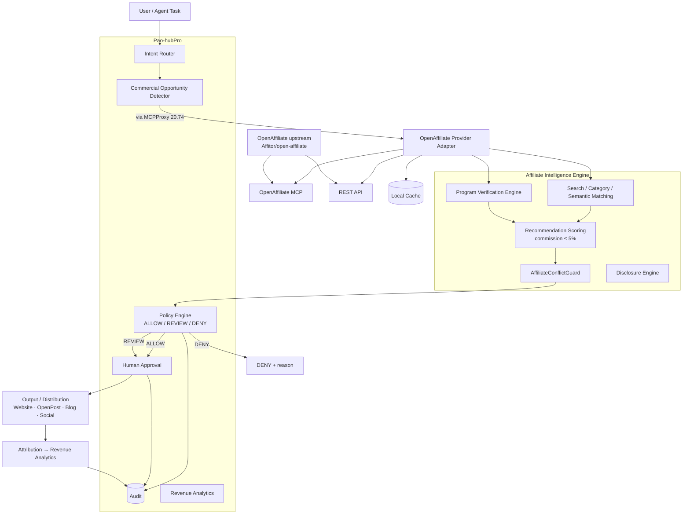

# Phase 20.75 — Pao-hubPro × OpenAffiliate

## Agent-Native Affiliate Program Registry, Autonomous Revenue Opportunity Discovery, MCP Monetization Intelligence, Disclosure-Aware Recommendation & Policy-Governed Affiliate Control Plane

> **Document type:** Production-Oriented Implementation Blueprint
> **Phase:** 20.75 (Proposed / Implementation Ready)
> **Project:** Pao-hubPro
> **Source of Truth:** `Phase_20.75_Pao-hubPro_x_OpenAffiliate.md`, processed under `PAO-HUBPRO_MASTER_PHASE_REQUEST.md`
> **Primary external project:** `Affitor/open-affiliate` — https://github.com/Affitor/open-affiliate
> **Integration targets:** Pao-hubPro MCP Gateway, MCPProxy (20.74), Multi-Agent Runtime, Policy Engine, Audit Layer, OpenPost (20.60), Revenue Analytics
> **Filename/content consistency:** Filename and document header agree on Phase 20.75; no collision (sequential after MCPProxy 20.74).

> **Core design principle — Rule 1: Relevance Before Revenue**
> Pao-hubPro must **never** recommend a product only because it has an affiliate commission.

```text
Decision priority:
User Intent > Task Suitability > Product Quality/Capability
  > Policy/Safety > Commercial Opportunity > Commission

NOT:  Highest Commission > Recommendation
```

> **Conclusion principle:** *Pao-hubPro decides what is useful. OpenAffiliate only tells Pao-hubPro whether a legitimate affiliate opportunity exists.* — This preserves recommendation quality while enabling controlled monetization, commercial discovery, campaign automation, cross-channel attribution, and future revenue intelligence.

---

## 1. Executive Summary

Phase 20.75 extends Pao-hubPro with an **Agent-Native Affiliate Intelligence Layer**. The objective is not a simple affiliate-link directory — it allows Pao-hubPro agents to:

1. discover affiliate programs automatically; 2. query structured program information; 3. evaluate relevance against user intent; 4. verify commercial suitability; 5. detect possible monetization opportunities; 6. enforce disclosure requirements; 7. **prevent commission-first recommendations**; 8. track referral links and campaigns; 9. connect affiliate intelligence with content and social publishing pipelines; 10. preserve policy, provenance, auditability, and human control.

OpenAffiliate is treated as an external **commercial capability registry** accessible through MCP/API adapters — **Pao-hubPro remains the control plane.**

---

## 2. Problem Statement

Existing Pao-hubPro phases focus on agent runtime, context, MCP, security, infrastructure, execution, coding, observability, content, and media production — but lack a governed **Commercial Intelligence** domain. Without it, agents cannot answer:

- "Does this tool have a legitimate affiliate program?"
- "Is recommending it relevant?"
- "What are the commercial terms?"
- "Does the recommendation require disclosure?"
- "Is the affiliate relationship influencing the recommendation?"
- "Can this opportunity be tracked safely?"

Phase 20.75 adds: `AI Capability + Commercial Opportunity Discovery + Policy-Governed Monetization`.

---

## 3. Goals

Phase 20.75 SHALL provide: OpenAffiliate MCP integration; OpenAffiliate API integration; local normalized program cache; affiliate program search; semantic program matching; monetization opportunity discovery; program verification; affiliate-link management; campaign attribution; **disclosure enforcement**; **conflict-of-interest protection**; **agent recommendation policy**; commercial provenance; audit logging; human approval; revenue analytics; integration with Pao-hubPro content workflows.

---

## 4. Non-Goals

Phase 20.75 SHALL NOT:

- automatically spam affiliate links; publish recommendations without policy evaluation; hide affiliate relationships;
- automatically sign up for affiliate programs; bypass program terms; impersonate the user;
- scrape restricted dashboards;
- automate fraudulent clicks or conversions; fabricate earnings;
- perform **cookie stuffing**; perform **click injection**;
- cloak affiliate URLs to deceive users;
- optimize solely for commission value.

---

## 5. Why This Phase Exists — Phase Position

Recommended sequence: 20.60 OpenPost (publishing) → 20.63 Public APIs (capability registry) → 20.68 DSPy (optimization/evaluation) → 20.71 Clodex (fleet) → 20.73 Herdr (persistent runtime) → 20.74 MCPProxy (federated MCP gateway) → **20.75 OpenAffiliate (affiliate intelligence & revenue control plane)**. **Phase 20.74 remains responsible for MCP federation; Phase 20.75 consumes the gateway.**

---

## 6. Relationship to Pao-hubPro

### Layer mapping (Pao-hubPro core layers)

| Layer | Role in this phase |
|---|---|
| 02 AI / Agent Layer | 5 affiliate agent roles (Section 15) |
| 03 Intent & Context Layer | Intent Router + Commercial Opportunity Detector |
| 05 MCP Gateway / MCPProxy (20.74) | `openaffiliate` namespace routing |
| 07 Policy Engine | ALLOW/REVIEW/DENY; disclosure + conflict guards |
| 08 Approval Engine | Publishing human approval by default |
| 12 State / Session Layer | 13 PostgreSQL tables; campaign/link registries |
| 13 Memory / Knowledge Layer | Commercial knowledge graph (future) |
| 14 Secrets & Credential Layer | Scoped provider secrets via Secret Manager |
| 15 Event / Queue Layer | 6 workers + 5 queue jobs |
| 16 Observability Layer | 10 metrics |
| 17 Audit Layer | Per-action audit; No Commercial Claim Without Source |
| 19 Web Dashboard | Revenue area (9 pages) |
| 20 External Provider Layer | OpenAffiliate upstream; future provider adapters |

### Cross-phase integration

- **MCPProxy (20.74):** route `openaffiliate` namespace — `namespace: external.affiliate, trust: external_registry, risk: medium`
- **OpenPost (20.60):** consumes approved campaigns — `Affiliate Campaign → Disclosure Injection → OpenPost → Facebook/X/LinkedIn/...`; publishing remains policy controlled
- **DSPy (20.68):** optimizes program matching / recommendation explanations / opportunity detection — metrics: task relevance, false affiliate match, disclosure compliance, user usefulness; **never optimize purely for commission revenue**
- **Reviewer Council:** for public comparison articles, high-value campaigns, automated publishing, major product recommendations — Relevance Review + Policy Review + Disclosure Review → Final Decision
- **Adobe Stock boundary:** Phase 20.75 may monetize supporting tools (GPU, VPS, AI image/video tools, automation, creative SaaS, storage, hosting) but **must not interfere with Adobe Stock submission integrity**

---

## 7. Upstream / External Project

### Separation of concerns

| Part | Owner | Notes |
|---|---|---|
| A. Upstream | `Affitor/open-affiliate` | External commercial capability registry |
| B. Pao adapter | `packages/affiliate/providers/openaffiliate/` (client.ts, mcp-client.ts, rest-client.ts, mapper.ts, schemas.ts, errors.ts, health.ts) | Normalize + provenance + retries + timeout + health |
| C. Pao policy wrapper | Policy engine rules, disclosure, conflict guard, approval | Governance |
| D. Pao extensions | Opportunity detector, verification engine, link vault, campaigns, analytics, dashboard | Built in this phase |

### License boundary (mandatory)

OpenAffiliate is an **external upstream dependency** — Pao-hubPro SHALL: preserve source attribution; record provider provenance; isolate upstream dataset; **avoid assuming every part of the upstream project uses the same license**; avoid copying the complete dataset into Pao-owned assets without review; prefer MCP/API consumption; track upstream license changes. Create `docs/licenses/openaffiliate.md`.

### Provider isolation (no vendor lock-in)

Build on the `AffiliateProvider` interface — future adapters: OpenAffiliate · PartnerStack · Impact · Awin · CJ · Amazon Associates · Direct SaaS programs · Custom registry.

### Resilience + circuit breaker + rate limits

**Fallback chain:** `OpenAffiliate MCP → (X) → REST API → (X) → Local Cache`; system status `LIVE / DEGRADED / CACHE_ONLY / OFFLINE`. **Circuit breaker:** `failure_threshold: 5, cooldown_seconds: 60, half_open_requests: 2`. **Rate limits (internal, configurable):** search 60/min · get 120/min · verify 20/min.

---

## 8. Current-State Assumptions

- **[Needs Verification] Inspect first:** reuse existing infrastructure from MCPProxy (20.74), policy, RBAC, audit, database, queues, observability, dashboard, Reviewer Council, DSPy, OpenPost integrations — **do not create duplicate infrastructure when equivalent modules exist**
- **[Assumption] PostgreSQL** as local store per existing patterns
- **[Assumption] Registry size dynamic** — do not hardcode external program counts
- **[Assumption] OpenPost integration** where Phase 20.60 exists; otherwise campaign export remains internal

---

## 9. Target Architecture

```text
User Intent → Intent Router (informational | purchase | tool discovery
             | content creation | affiliate opportunity)
→ Commercial Opportunity Detector (product mention · software recommendation
  · SaaS usage · GPU/VPS/AI tool · creator tool · automation platform)
→ MCPProxy / MCP Federation Layer (20.74)
→ OpenAffiliate Adapter (MCP · REST · local cache)
→ Affiliate Intelligence Engine (search · category matching · semantic
  matching · program verification · eligibility · revenue terms · disclosure
  · conflict guard)
→ Policy Engine (ALLOW / REVIEW / DENY)
→ Human Approval ─┬─ Autonomous Low-Risk Flow
→ Output / Distribution (Website · OpenPost · Blog · Social · Newsletter
  · Tool Directory · Internal recommendation)
→ Attribution + Revenue Analytics
```

---

## 10. Architecture Diagram



---

## 11. Core Components

| # | Component | Purpose |
|---|---|---|
| 1 | OpenAffiliate Provider Adapter | MCP (preferred) / REST (fallback) / local cache; normalization; provenance; health |
| 2 | Affiliate Intelligence Engine | Search; category/semantic matching; program verification; eligibility; revenue terms; disclosure; conflict guard |
| 3 | Program Verification Engine | UNVERIFIED/VERIFIED/STALE/FAILED/DISABLED/UNKNOWN; 8 checks |
| 4 | Revenue Opportunity Detector | Intent classification; entity extraction; product matching; ranking — **candidates first, affiliate lookup second** |
| 5 | Recommendation Scoring | Relevance-first weighted formula; commission ≤ 5% |
| 6 | AffiliateConflictGuard | High commission + weak relevance ⇒ downgrade/reject |
| 7 | Disclosure Engine | Required disclosure objects + placement + Thai template |
| 8 | AffiliateLinkVault | Central link registry; agents get handles not raw URLs |
| 9 | Campaign Manager | Campaign lifecycle; UTM; attribution |
| 10 | Revenue Analytics | 9 metrics; dashboard |
| 11 | Policy Engine + Audit | ALLOW/REVIEW/DENY; banned behaviors; provenance |
| 12 | 5 Agent Roles | Research / Verification / CommercialOpportunity / Compliance / RevenueAnalytics |

---

## 12. Component Responsibilities

### 12.1 Provider interface + normalized program model

```ts
export interface AffiliateProvider {
  id: string
  searchPrograms(query: AffiliateProgramSearch): Promise<AffiliateProgram[]>
  getProgram(programId: string): Promise<AffiliateProgram | null>
  listCategories(): Promise<AffiliateCategory[]>
  healthCheck(): Promise<ProviderHealth>
}
```

**Normalized `AffiliateProgram` (full model):** `id; provider; providerProgramId; name; company?; description?; categories[]; tags[]; homepageUrl?; signupUrl?; commission?{type: percentage|fixed|recurring|hybrid|unknown, value?, currency?, recurring?, recurringPeriod?, notes?}; cookie?{durationDays?, notes?}; payout?{threshold?, currency?, frequency?, methods?}; approval?{required?, notes?}; restrictions?[]; countries?[]; disclosureRequired: boolean; status: active|inactive|unknown|verification_required; source{provider, sourceUrl?, fetchedAt, lastVerifiedAt?, rawHash?}`

### 12.2 Local database (13 PostgreSQL tables — adapt to conventions)

```text
affiliate_programs · affiliate_program_categories · affiliate_program_terms
affiliate_program_verifications · affiliate_links · affiliate_campaigns
affiliate_click_events · affiliate_conversion_events · affiliate_revenue_events
affiliate_disclosures · affiliate_recommendation_logs · affiliate_policy_decisions
affiliate_provider_health
```

`affiliate_programs` key fields: `id UUID PK · provider TEXT NOT NULL · provider_program_id TEXT NOT NULL · name · company · description · homepage_url · signup_url · status · disclosure_required BOOLEAN DEFAULT TRUE · source_url · source_hash · last_fetched_at · last_verified_at · created_at · updated_at` + `UNIQUE(provider, provider_program_id)`

**Cache strategy:** Provider → Normalizer → Cache (TTL + stale-while-revalidate + provenance). Defaults: program metadata TTL 24h; commercial terms TTL 12h; verification TTL 7 days; provider health TTL 5 minutes. **Do not hardcode external program counts — registry size stays dynamic.**

### 12.3 Program verification engine

An affiliate program should **not** automatically be considered valid forever. States: `UNVERIFIED · VERIFIED · STALE · FAILED · DISABLED · UNKNOWN`. Checks (8): program exists; signup URL reachable; domain valid; provider record current; commercial terms present; suspicious redirect; program status; last verification timestamp.

### 12.4 Revenue opportunity detector

```text
packages/affiliate/opportunity/
├── opportunity-detector.ts · intent-classifier.ts
├── entity-extractor.ts · product-matcher.ts · opportunity-ranker.ts
```

Example task: *"I use Runpod for ComfyUI. What other GPU services should I compare?"* → `Intent → GPU Infrastructure → Candidate Services → Capability Evaluation → Affiliate Program Lookup → Commercial Metadata`.

**Affiliate availability must not control candidate generation — candidate generation comes first.**

**Opportunity model:**

```ts
export interface AffiliateOpportunity {
  id: string; taskId: string; productName: string;
  affiliateProgramId?: string;
  relevanceScore: number; commercialConfidence: number;
  opportunityType: "tool_recommendation" | "comparison" | "content"
                  | "social" | "website" | "newsletter";
  reason: string;
  requiresDisclosure: boolean; requiresHumanApproval: boolean;
  createdAt: string;
}
```

### 12.5 Recommendation scoring + conflict guard

```text
Recommendation Score =
    Task Relevance       35%
  + Capability Match     30%
  + Reliability          15%
  + User Constraints     10%
  + Commercial Context    5%
  + Affiliate Value       5%
```

**Affiliate commission SHALL NOT exceed 5% of recommendation weighting by default:** `affiliate.recommendation.max_affiliate_weight: 0.05`

**AffiliateConflictGuard:** detect `High commission + Weak task relevance` ⇒ downgrade or reject. Example: Commission high + Task relevance low ⇒ **DENY affiliate recommendation**.

**Content intelligence correctness:** `tool selection → affiliate lookup` (correct); `affiliate program → force tool selection` (**incorrect**).

### 12.6 Disclosure engine

```ts
export interface AffiliateDisclosure {
  id: string; campaignId?: string; programId: string;
  language: string; disclosureText: string;
  placement: "before_link" | "after_link" | "page_header"
           | "page_footer" | "social_caption";
  createdAt: string;
}
```

**Thai disclosure example (system must allow project-specific templates):**

```text
หมายเหตุ: ลิงก์บางรายการอาจเป็นลิงก์ Affiliate
หากคุณสมัครหรือซื้อผ่านลิงก์ดังกล่าว ผมอาจได้รับค่าตอบแทน
โดยไม่มีค่าใช้จ่ายเพิ่มเติมสำหรับคุณ
```

### 12.7 Affiliate Link Vault + link safety

Do not scatter affiliate URLs across agents — create central **AffiliateLinkVault** storing: `affiliate_program_id, destination_url, affiliate_url, campaign_id, channel, utm_source, utm_medium, utm_campaign, status, created_at, updated_at`. **Agents receive link handles instead of unrestricted editable URLs when possible.**

**Link safety chain:** `Validate URL → Validate domain → Check redirect chain → Check allowlist/blocklist → Policy Decision`. **Reject:** javascript URLs; file URLs; localhost URLs unless explicitly allowed; suspicious redirects; unknown protocols.

### 12.8 Campaigns + analytics + privacy

**Campaign model:** `id, name, programId, channel (website|facebook|youtube|tiktok|x|newsletter|other), sourceContentId?, status (draft|approved|active|paused|archived), startedAt?, endedAt?`

**Revenue analytics metrics (9):** clicks; unique_clicks; conversions; conversion_rate; commission; revenue_per_click; revenue_per_content; revenue_per_channel; revenue_per_program.

**Privacy rule:** do not collect unnecessary personal data — click event = `{campaignId, timestamp, referrerClass, channel, anonymousSessionId?}`; **avoid storing raw IP unless operationally required and legally reviewed.**

**Fraud guard:** detect abnormal click bursts; same-session repeats; impossible conversion patterns; self-click automation; bot traffic — **never create tooling intended to simulate legitimate clicks.**

**Agent memory rules:** permitted — which tools are commonly used; which campaigns exist; program status; campaign performance. Avoid — unnecessary personal buyer data; sensitive browsing information.

### 12.9 MCP tools (8 internal Pao tools)

```text
affiliate.search_programs  {query, category, recurring}
affiliate.get_program
affiliate.verify_program
affiliate.detect_opportunity
affiliate.create_link      (requires policy approval)
affiliate.create_campaign
affiliate.get_disclosure
affiliate.analytics_summary
```

**MCPProxy route:** `Agent → Pao MCP Client → MCPProxy → {openaffiliate, public-apis, github, openpost}` with `routes: {openaffiliate: {namespace: external.affiliate, trust: external_registry, risk: medium}}`.

**Tool trust classification:** OpenAffiliate MCP tools READ = LOW/MEDIUM (WRITE: N/A unless future provider adds writes). Pao local tools: `search LOW · get LOW · verify MEDIUM · create_link MEDIUM · create_campaign MEDIUM · publish HIGH`.

### 12.10 Autonomous revenue discovery boundary

Allowed (autonomous): **discover · analyze · recommend · prepare draft**. Human approval by default: **publish · send campaign · change affiliate destination · activate paid promotion**.

Autonomous opportunity discovery example: scheduled agent scans recent Pao-hubPro tool usage → finds Runpod/ComfyUI/AI SaaS/VPS/storage → searches affiliate registry → finds matching programs → verifies → **creates opportunity cards. NO automatic public promotion — default result: Review Queue.**

---

## 13. Data Flow

**Recommendation flow:** User task → Intent Router → Tool Research → Capability Ranking → Affiliate Opportunity Lookup → OpenAffiliate → Verification → Policy → Disclosure → Final Recommendation.

**Content production flow:** Content Agent → "Best AI Video Tools" → Research → Product Ranking → Affiliate Match → Disclosure → **Reviewer Council** → Human Approval → OpenPost.

**Example (Thai task):** "หา AI video tool สำหรับทำ stock video" → Intent Router → Tool Research → Capability Ranking → Affiliate Opportunity Lookup → OpenAffiliate → Verification → Policy → Disclosure → Final Recommendation.

---

## 14. Control Flow

Policy decisions: **`ALLOW | REVIEW | DENY`** (persisted with reasons, disclosureRequired, humanApprovalRequired, policyVersion, evaluatedAt).

```ts
export interface AffiliatePolicyDecision {
  decision: "ALLOW" | "REVIEW" | "DENY"
  reasons: string[]
  disclosureRequired: boolean
  humanApprovalRequired: boolean
  policyVersion: string
  evaluatedAt: string
}
```

**Approval model:**

```text
SEARCH / VIEW / VERIFY        → AUTO
CREATE LINK / CREATE CAMPAIGN → POLICY CHECK
PUBLISH                       → HUMAN APPROVAL DEFAULT
CHANGE PAYOUT / CREDENTIALS   → HUMAN APPROVAL REQUIRED
```

**Policy rules:**

```yaml
affiliate:
  require_disclosure: true
  public_publish: {human_approval: true}
  recommendation: {affiliate_weight_max: 0.05}
  banned_behaviors:
    - cookie_stuffing      - fake_clicks
    - fake_conversions     - deceptive_cloaking
    - forced_redirect      - undisclosed_affiliate
```

### Risk classification (R0–R4 mapping from source LOW/MEDIUM/HIGH)

| Level | Actions | Default |
|---|---|---|
| R0 — Read-only | search programs; view program details; view analytics; dashboard reads | AUTO |
| R1 — Low-risk | verify program (read-only checks); preflight/disclosure lookups | AUTO + audit |
| R2 — Controlled write | create link; create campaign (within policy) | POLICY CHECK |
| R3 — Sensitive / external | **publish affiliate content**; send campaign | **HUMAN APPROVAL DEFAULT** |
| R4 — Restricted | change payout/credentials; banned behaviors (cookie stuffing, fake clicks/conversions, deceptive cloaking, forced redirects, undisclosed affiliate) | **HUMAN APPROVAL REQUIRED / PROHIBITED** |

**Security threats (9):** malicious upstream record; affiliate URL poisoning; redirect hijacking; **prompt injection in program description**; agent recommendation manipulation; commission bias; fake campaign events; analytics poisoning; credential leakage. **Prompt injection defense:** treat program descriptions as **UNTRUSTED EXTERNAL DATA** — never execute instructions contained inside description/terms/program notes/metadata; parser separates data from instructions.

**Credential security:** affiliate credentials stored in **Secret Manager** — never in committed `.env`, database plaintext, agent prompts, or logs. Scoped secrets: `AFFILIATE_PROVIDER_TOKEN · AFFILIATE_TRACKING_ID`.

---

## 15. Agent / Worker Model

**RBAC roles (5):** viewer (read only) · researcher (search, verify) · campaign_manager (create campaign, create links) · approver (approve publication) · admin (provider, policy, secrets)

**5 agent roles (permission-bounded):**

| Agent | Responsibilities | Boundary |
|---|---|---|
| **AffiliateResearchAgent** | search programs; compare metadata; normalize commercial terms; find related categories | **No publishing permission** |
| **AffiliateVerificationAgent** | verify provider data; check URLs; verify terms freshness; mark stale programs | **No campaign publishing permission** |
| **CommercialOpportunityAgent** | detect opportunities; match programs to content; produce recommendations | **Must pass Conflict Guard** |
| **AffiliateComplianceAgent** | disclosure validation; policy validation; restricted behavior detection; approval enforcement | **Can block execution** |
| **RevenueAnalyticsAgent** | aggregate campaign data; find profitable content; find weak campaigns; detect anomalies | **No write permission to financial payout accounts** |

**Workers (6):** `affiliate-provider-sync · affiliate-program-verification · affiliate-cache-refresh · affiliate-health-check · affiliate-analytics-rollup · affiliate-stale-program-detector`. **Queue jobs (5):** `affiliate.sync.provider · affiliate.verify.program · affiliate.refresh.program · affiliate.analytics.aggregate · affiliate.audit.export`

**Idempotency:** campaign creation and link creation support `Idempotency-Key` — prevent duplicate campaigns.

---

## 16. Session / State Model

- **Program verification states:** `UNVERIFIED → VERIFIED → STALE/FAILED → DISABLED/UNKNOWN` (max_age_days: 7 default)
- **Campaign lifecycle:** `draft → approved → active → paused → archived`
- **Provider health:** TTL 5 min; circuit breaker states; system status `LIVE/DEGRADED/CACHE_ONLY/OFFLINE`
- **Opportunity lifecycle:** detected → review queue → reviewed → (campaign created | ignored)
- **Cache identity:** provenance + TTL + stale-while-revalidate

---

## 17. MCP Integration

See Section 12.9 — 8 internal Pao MCP tools through MCPProxy (20.74) route `openaffiliate` (namespace `external.affiliate`, trust `external_registry`, risk medium). Program descriptions = untrusted data; tools bounded by risk classification (publish HIGH = human approval).

---

## 18. Capability Registry

- **Program registry:** normalized programs + categories + terms + verifications (dynamic size)
- **Link vault:** central affiliate URLs + UTM + handles
- **Campaign registry:** lifecycle + channels + content links
- **Provider registry:** OpenAffiliate + future adapters (PartnerStack, Impact, Awin, CJ, Amazon Associates, Direct SaaS, Custom) — health + priority

---

## 19. Policy Model

See Section 14 (policy rules YAML + R0–R4). Core philosophy:

```text
Automation without policy = risk
Affiliate intelligence + disclosure + provenance + approval + audit
  = controlled monetization
```

`No Commercial Claim Without Source` — every external program record retains provider, source, fetched_at, last_verified_at, content_hash.

---

## 20. Security Model

See Section 14 threats + prompt-injection defense + credential security + link safety + fraud guard. **Banned behaviors are prohibited design modes:** cookie stuffing, fake clicks, fake conversions, deceptive cloaking, forced redirects, undisclosed affiliate promotion.

---

## 21. Approval Model

### R0–R4 summary

See Section 14. Public publishing = human approval default; payout/credential changes = human required; Reviewer Council for high-impact recommendations (public comparison articles; high-value campaigns; automated publishing; major product recommendations) with Relevance/Policy/Disclosure reviews → final decision.

---

## 22. Failure Handling

**Fallback chain + circuit breaker + rate limits** (Section 7). **Error types (8):** `AFFILIATE_PROVIDER_UNAVAILABLE · AFFILIATE_PROGRAM_NOT_FOUND · AFFILIATE_PROGRAM_STALE · AFFILIATE_PROGRAM_UNVERIFIED · AFFILIATE_POLICY_DENIED · AFFILIATE_DISCLOSURE_REQUIRED · AFFILIATE_LINK_INVALID · AFFILIATE_APPROVAL_REQUIRED`

---

## 23. Recovery Model

Degraded-mode operation per fallback chain (MCP → REST → cache); cache stale-while-revalidate; verification workers mark stale programs; system status surfaced on dashboard; **degraded/cache mode is an acceptance criterion** — system works without live upstream.

---

## 24. Observability

**Metrics (10):** `affiliate_provider_request_total · affiliate_provider_error_total · affiliate_search_latency_ms · affiliate_program_cache_hit_ratio · affiliate_verification_failure_total · affiliate_policy_denied_total · affiliate_campaign_created_total · affiliate_click_total · affiliate_conversion_total · affiliate_commission_total`

---

## 25. Audit

Every affiliate action SHALL be auditable:

```json
{"event": "affiliate.recommendation.generated", "actor": "agent:researcher",
 "task_id": "task_123", "program_id": "prog_456",
 "policy_decision": "ALLOW", "disclosure_required": true, "timestamp": "..."}
```

**Provenance rule:** `No Commercial Claim Without Source` — provider/source/fetched_at/last_verified_at/content_hash on every external record; policy decisions persisted (`affiliate_policy_decisions`).

---

## 26. Data Model

13 tables (Section 12.2) with the `UNIQUE(provider, provider_program_id)` constraint; disclosure/link/campaign/event tables per source schema; **adapt field types/names to existing DB conventions.**

---

## 27. API / Event Contracts

### 27.1 REST endpoints (14)

```text
GET    /api/affiliate/programs          GET    /api/affiliate/programs/:id
POST   /api/affiliate/search            POST   /api/affiliate/verify
GET    /api/affiliate/opportunities     POST   /api/affiliate/opportunities/detect
GET    /api/affiliate/campaigns         POST   /api/affiliate/campaigns
POST   /api/affiliate/links
GET    /api/affiliate/analytics
GET    /api/affiliate/providers         GET    /api/affiliate/audit
```

### 27.2 Common envelope

Standard Pao envelope + `AffiliatePolicyDecision` on gated operations + 8 error types (Section 22) + Idempotency-Key support on mutations. Events per Section 25.

---

## 28. Configuration

```yaml
affiliate:
  enabled: true
  provider: {openaffiliate: {enabled: true, priority: 100}}
  recommendation: {affiliate_weight_max: 0.05, relevance_required: 0.70}
  disclosure: {required: true}
  publishing: {human_approval: true}
  verification: {enabled: true, max_age_days: 7}
  cache: {program_ttl_hours: 24}
```

Environment: `AFFILIATE_ENABLED=true · OPENAFFILIATE_MCP_ENABLED=true · OPENAFFILIATE_REST_ENABLED=true · OPENAFFILIATE_BASE_URL= · OPENAFFILIATE_MCP_URL= · AFFILIATE_CACHE_TTL_SECONDS=86400 · AFFILIATE_REQUIRE_DISCLOSURE=true · AFFILIATE_PUBLICATION_REQUIRES_APPROVAL=true · AFFILIATE_MAX_RECOMMENDATION_WEIGHT=0.05` — **do not commit secrets** (`AFFILIATE_PROVIDER_TOKEN`, `AFFILIATE_TRACKING_ID` via Secret Manager).

---

## 29. Feature Flags

| Flag | Default | Gates |
|---|---|---|
| `AFFILIATE_ENABLED` | `true` | Subsystem |
| `OPENAFFILIATE_MCP_ENABLED` | `true` | MCP transport (preferred) |
| `OPENAFFILIATE_REST_ENABLED` | `true` | REST fallback |
| `AFFILIATE_REQUIRE_DISCLOSURE` | `true` | Disclosure injection |
| `AFFILIATE_PUBLICATION_REQUIRES_APPROVAL` | **`true`** | Public publishing |
| `AFFILIATE_MAX_RECOMMENDATION_WEIGHT` | `0.05` | Commission cap (**never raise to make commission-first ranking**) |
| Provider adapters (future) | disabled | PartnerStack/Impact/etc. |

---

## 30. Repository / Module Structure

```text
pao-hubpro/
├── apps/web/app/affiliate/          # dashboard (9 pages)
├── packages/affiliate/
│   ├── providers/openaffiliate/     # client · mcp-client · rest-client
│   │                                # mapper · schemas · errors · health
│   ├── registry/  ├── opportunity/  ├── verification/
│   ├── recommendation/  ├── campaign/  ├── disclosure/
│   ├── analytics/  └── policy/
├── packages/{mcp, policy, audit, db}/   # reuse existing
├── workers/affiliate/
├── docs/{affiliate/, licenses/openaffiliate.md}
└── tests/affiliate/
```

---

## 31. Dashboard Integration

**Pages (9):** `/affiliate · /affiliate/programs · /affiliate/programs/[id] · /affiliate/opportunities · /affiliate/campaigns · /affiliate/analytics · /affiliate/providers · /affiliate/policies · /affiliate/audit`

**Programs table:** Program; Category; Commission; Recurring; Cookie; Status; Verified; Provider — filters: category; recurring; commission_type; verified; provider; status.

**Opportunities card:**

```text
AI Tool ──────────────
Relevance 92% · Affiliate Available · Recurring Yes
Disclosure Required · Verification Verified
[Review] [Ignore] [Create Campaign]
```

**Policy display:** Affiliate Disclosure ON · Human Approval for Publishing ON · Commission Weight 5% · Automatic Campaign Creation **OFF**.

**Revenue dashboard:** `Revenue → Overview · Programs · Campaigns · Content · Channels · Audit`.

---

## 32. Dependencies

### Required

- **Pao-hubPro existing authorities:** MCPProxy (20.74), policy engine, RBAC, audit, PostgreSQL patterns, queues/workers, observability, dashboard shell
- **OpenAffiliate upstream** (MCP preferred / REST fallback) — external registry

### Recommended

- **Phase 20.60 OpenPost** — approved campaign distribution
- **Phase 20.68 DSPy** — matching/explanation optimization
- **Reviewer Council** — high-impact recommendation review
- **Secret Manager** — scoped provider credentials

### Optional

- Future provider adapters (PartnerStack/Impact/Awin/CJ/Amazon)
- Commercial knowledge graph integration with Context Graph phases

**Do not assume other phases are implemented.** Standalone path: provider adapter + normalized schema + PostgreSQL + verification + recommendation scoring + conflict guard + disclosure work with REST/cache fallback only — no MCPProxy/OpenPost required (degraded `CACHE_ONLY` mode is an acceptance criterion).

---

## 33. Compatibility

- **License isolation:** upstream license tracked per part; attribution preserved; dataset not copied wholesale without review (`docs/licenses/openaffiliate.md`)
- **Provider isolation:** `AffiliateProvider` interface prevents vendor lock-in
- **Registry size dynamic:** never hardcode counts
- **Backward compatibility:** additive tables; feature flags; existing policy/audit/RBAC reused
- **Cross-phase correctness:** 20.74 owns MCP federation; 20.75 consumes it; Adobe Stock integrity untouched

---

## 34. Migration

- Additive migrations only (13 tables); reversible where feasible
- Feature-flagged enablement (`AFFILIATE_ENABLED`, disclosure/approval defaults on)
- No import of upstream dataset wholesale; per-record provenance from first fetch
- Existing OpenPost/content workflows unchanged; affiliate attachment is additive post-ranking

---

## 35. Rollback

```text
1. AFFILIATE_ENABLED=false → subsystem off; existing content/campaigns read-only preserved
2. Active campaigns: paused via campaign lifecycle (not deleted)
3. Disclosure state preserved; audit/provenance retained
4. Provider adapter rollback: revert to REST/cache fallback chain
5. ห้ามลบ program/link/campaign history ระหว่าง rollback
```

---

## 36. Testing Strategy

### 36.1 Unit tests (6)

Schema mapping; scoring (commission cap); policy; disclosure; URL validation; conflict guard.

### 36.2 Integration tests (5)

OpenAffiliate MCP adapter; REST fallback; cache fallback; provider failure; MCPProxy routing.

### 36.3 Policy tests (3 — must-pass)

**High commission + low relevance ⇒ blocked** · **public affiliate link without disclosure ⇒ blocked** · **public publishing without approval ⇒ blocked**

### 36.4 Security tests (5)

Prompt injection in description; javascript URL; redirect abuse; secret leakage; malicious program metadata.

### 36.5 Agent-specific tests

Tool-selection test (candidates generated by relevance, not affiliate availability); hallucinated-tool test (unknown programs rejected); **approval-bypass test (public publishing unreachable without human approval)**; conflict-guard test (high commission + low relevance → DENY); commission-cap test (affiliate weight never exceeds configured max); degraded-mode test (CACHE_ONLY works; no fabricated live data).

---

## 37. Acceptance Criteria

Phase 20.75 is complete when (25):

- [ ] OpenAffiliate provider adapter exists; MCP integration works; REST fallback works
- [ ] Normalized schema exists; PostgreSQL storage exists; cache exists
- [ ] Program search/details/verification work; opportunity detection works
- [ ] **Relevance-first recommendation policy works; commission influence is capped; conflict guard works**
- [ ] Disclosure engine works; affiliate link vault works; campaign manager works
- [ ] Audit logs exist; policy decisions are persisted
- [ ] **Human approval exists for public publishing**
- [ ] Provider health appears in dashboard; analytics dashboard exists
- [ ] **Prompt injection defense exists; provider data is treated as untrusted**
- [ ] License/provenance documentation exists; tests pass; **system works in degraded/cache mode**

---

## 38. Implementation Roadmap

| Milestone | Build |
|---|---|
| 1 — Foundation | AffiliateProvider interface; schemas; database; OpenAffiliate adapter |
| 2 — Registry | search; get; categories; cache; provider health |
| 3 — Verification | verification worker; stale detection; URL validation; provenance |
| 4 — Intelligence | opportunity detector; semantic match; recommendation score; conflict guard |
| 5 — Policy | disclosure; approval; policy engine; audit |
| 6 — Campaign | link vault; campaign manager; UTM; tracking |
| 7 — Dashboard | programs; opportunities; campaigns; providers; policy; audit; analytics |
| 8 — Agent Integration | CommercialOpportunityAgent; VerificationAgent; ComplianceAgent; AnalyticsAgent |
| 9 — Cross-Phase Integration | MCPProxy; OpenPost; DSPy; Reviewer Council |

**Deliverables (18):** Affiliate Provider SDK · OpenAffiliate Adapter · MCP Integration · REST Fallback · Database Schema · Verification Engine · Opportunity Detector · Recommendation Engine · Conflict Guard · Disclosure Engine · Affiliate Link Vault · Campaign Manager · Revenue Analytics · Dashboard · Audit · Policy · Security Tests · Documentation

---

## 39. Risks

| Risk | Mitigation |
|---|---|
| Commission-first ranking | Rule 1 priority chain; 5% affiliate weight cap; Conflict Guard; DSPy metrics exclude pure revenue |
| Prompt injection via program descriptions | Untrusted-data boundary; parser separates data/instructions; security tests |
| Affiliate URL poisoning / redirect hijacking | Link safety chain; allowlist/blocklist; redirect validation |
| Hidden affiliate relationships | Mandatory disclosure engine; banned `undisclosed_affiliate` |
| Fraudulent clicks/conversions | Fraud guard; banned behaviors; **never build click-simulation tooling** |
| Fake upstream records | Verification engine; provenance; `No Commercial Claim Without Source` |
| Provider lock-in | AffiliateProvider interface; 8 future adapters |
| Personal data over-collection | Minimal click events; no raw IP; agent memory rules |
| Analytics poisoning | Fraud guard; anomaly detection; audit |
| Credential leakage | Secret Manager; scoped secrets; never in .env/prompts/logs |
| Autonomous publishing | Human approval default; Reviewer Council for high-impact; Review Queue default |
| License non-compliance | License boundary doc; per-part license review; provenance |

---

## 40. Security Checklist

- [ ] Program descriptions/terms/notes treated as UNTRUSTED EXTERNAL DATA (injection defense test-proven)
- [ ] Relevance Before Revenue enforced: affiliate weight ≤ 5%; candidate generation precedes affiliate lookup (test-proven)
- [ ] Conflict Guard blocks high-commission + low-relevance recommendations
- [ ] Disclosure required + injected for every public affiliate output (placement-aware)
- [ ] Public publishing requires human approval by default (bypass test-proven)
- [ ] Payout/credential changes require human approval
- [ ] AffiliateLinkVault centralizes URLs; agents receive handles not raw URLs
- [ ] Link safety chain rejects javascript:/file:/localhost/suspicious redirects/unknown protocols
- [ ] Banned behaviors (cookie stuffing, fake clicks/conversions, cloaking, forced redirects, undisclosed affiliate) prohibited in code + policy
- [ ] Fraud guard detects click/conversion anomalies; no click-simulation tooling built
- [ ] Credentials via Secret Manager with scoped names; never committed/in prompts/logs
- [ ] Provenance (provider/source/hash/verified_at) on every commercial claim
- [ ] RBAC 5 roles enforced server-side; RevenueAnalyticsAgent has no payout write
- [ ] Privacy: minimal click events; no raw IP without legal review; memory rules honored
- [ ] Audit per action; policy decisions persisted with policyVersion

---

## 41. Production Readiness Checklist

### Quality gates

Unit (6) + integration (5) + policy (3) + security (5) suites pass; degraded/cache mode verified; run lint/typecheck/tests/migrations (test mode); verify MCPProxy routing, REST fallback, cache-only mode, RBAC, policy denials, disclosure injection, publishing approval, audit logs, dashboard routes — **all with actual command results; do not stop after scaffolding; deliver the complete working implementation.**

### Final report (10)

1. Implementation summary; 2. Architecture changes; 3. Database migrations; 4. New MCP tools; 5. New API routes; 6. Environment variables; 7. Security controls; 8. Tests added; 9. Known limitations; 10. Recommended Phase 20.76 preparation.

### Documentation required

`docs/affiliate/*` + `docs/licenses/openaffiliate.md` (license boundary record).

---

## 42. Future Extensions

- **Phase 20.76 — Pao-hubPro × Revenue Intelligence** (recommended next, kept separate): Cross-Channel Monetization Graph; Affiliate Revenue Attribution; Content-to-Commerce Analytics; Autonomous Opportunity Scoring; Policy-Governed Revenue Optimization Runtime. **20.75 = registry + affiliate control plane; 20.76 = broader revenue intelligence.**
- Commercial knowledge graph (Product → Category/Capability/Provider/Program/Content/Campaign/Revenue) integrated with Context Graph phases
- Additional provider adapters; per-project disclosure template library
- DSPy-optimized recommendation explanations

---

## 43. Definition of Done

Phase 20.75 is DONE when Pao-hubPro can safely execute:

```text
"Find relevant affiliate programs for tools currently used
in my AI production workflow,
verify that they are active,
show commercial terms,
explain why each one is relevant,
flag disclosure requirements,
and prepare a campaign for my approval."
```

**without:** commission-first ranking · hidden affiliate promotion · unverified commercial claims · uncontrolled publishing · unsafe URL execution · missing provenance · missing audit trail.

---

## 44. Codex One-Shot Implementation Prompt

```text
Implement Phase 20.75 — Pao-hubPro × OpenAffiliate according to
PHASE_20.75_PAO_HUBPRO_OPENAFFILIATE.md.

First inspect the existing Pao-hubPro repository and identify reusable
components from MCPProxy, policy, RBAC, audit, database, queues,
observability, dashboard, Reviewer Council, DSPy and OpenPost integrations.

Do not create duplicate infrastructure when equivalent modules already exist.

Implement an AffiliateProvider abstraction and an OpenAffiliate provider
adapter with MCP as the preferred transport, REST as fallback, and local
cache as degraded-mode fallback.

Create normalized affiliate program schemas, PostgreSQL persistence,
provider health monitoring, program verification, stale-record detection,
opportunity discovery, relevance-first recommendation scoring, conflict-of-
interest protection, disclosure enforcement, affiliate link vault, campaign
management, analytics, MCP tools, REST APIs, dashboard pages, RBAC controls,
audit logging and policy decisions.

Treat all OpenAffiliate content as untrusted external data.
Prevent prompt-injection instructions embedded in descriptions or metadata
from influencing agent execution.

Affiliate availability must never determine which product is recommended.
Generate product candidates by task relevance first, then check whether a
legitimate affiliate program exists.

Cap affiliate/commission influence on recommendation scoring to the
configured maximum, default 5%.

Require disclosure for public affiliate outputs.
Require human approval by default before public publishing.

Do not implement cookie stuffing, fake traffic, click automation,
conversion simulation, deceptive cloaking, forced redirects or undisclosed
affiliate promotion.

Preserve source provenance for all commercial claims.
Do not hardcode OpenAffiliate registry size.
Keep upstream licensing isolated and document the dependency under
docs/licenses/openaffiliate.md.

Add unit, integration, policy, security and degraded-mode tests.

After implementation:
- run lint
- run typecheck
- run unit tests
- run integration tests
- run migrations in test mode
- verify MCPProxy routing
- verify REST fallback
- verify cache-only mode
- verify RBAC
- verify policy denial cases
- verify disclosure injection
- verify public publishing requires approval
- verify audit logs
- verify dashboard routes

Finally produce:
1. implementation summary
2. architecture changes
3. database migrations
4. new MCP tools
5. new API routes
6. environment variables
7. security controls
8. tests added
9. known limitations
10. recommended Phase 20.76 preparation

Do not stop after scaffolding.
Deliver the complete working Phase 20.75 implementation.
```

**Codex implementation directive (12 SHALLs):** 1. inspect current architecture first; 2. reuse existing infrastructure; 3. avoid duplicate policy systems; 4. reuse MCPProxy from 20.74; 5. reuse existing auth/RBAC; 6. reuse existing audit infrastructure; 7. reuse existing PostgreSQL patterns; 8. preserve backwards compatibility; 9. implement feature flags; 10. write migrations; 11. write tests; 12. update docs.
