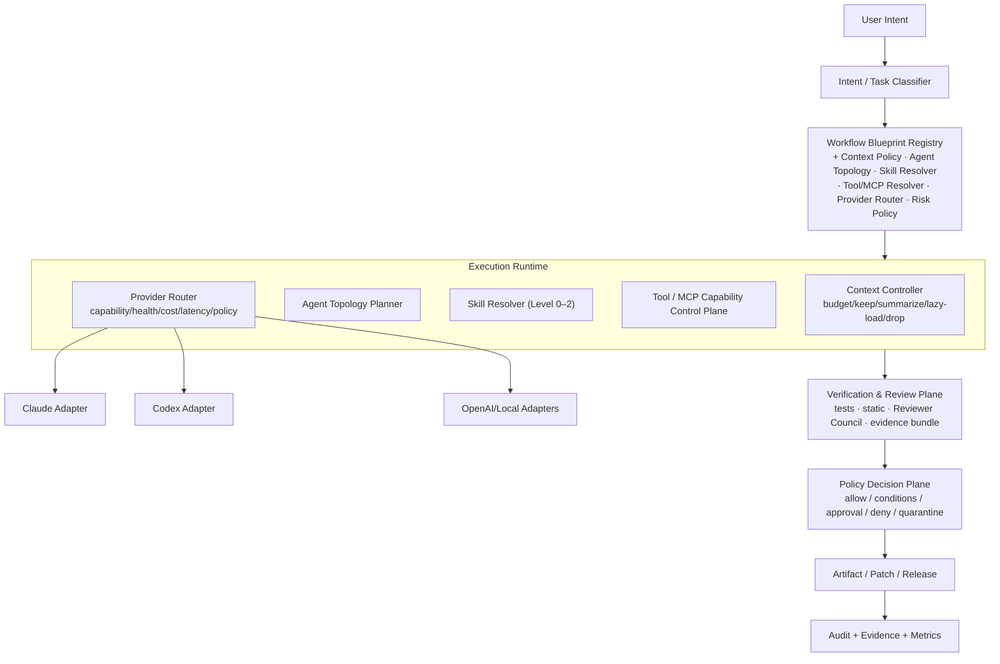

# Phase 20.80 — Pao-hubPro × Claude Code Best Practice

## Provider-Agnostic Agentic Engineering Standards, Workflow Blueprint Registry, Context-Aware Skills & Subagents, Hook/MCP Governance, Multi-Agent Review Gates & Policy-Governed Coding Operations

> **Project:** Pao-hubPro
> **Phase:** 20.80
> **Status:** Implementation Specification (restructured into the Pao-hubPro master 44-section blueprint)
> **Primary goal:** Convert high-signal Claude Code engineering patterns into a provider-agnostic operating standard for Pao-hubPro without turning Pao-hubPro into a Claude-only runtime.
> **Target providers:** Claude Code, OpenAI/Codex, ChatGPT-compatible agents, local models, future provider adapters
> **Target runtime:** Pao-hubPro agent orchestration + MCP/tool gateway + policy engine + review council + audit plane
> **Source reviewed:** `shanraisshan/claude-code-best-practice` and current Anthropic Claude Code/MCP guidance
> **Reference date:** 2026-09-17
> **Source filename (preserved per master request §39):** `Phase_20.80_Pao-hubPro_Claude-Code-Best-Practice.md`

---

### Verification & Decision Record (master request §1, §36, §38, §40)

**Verified against the attached source before restructuring:**
- Phase number and name: **20.80**, "Pao-hubPro × Claude Code Best Practice" — matches the source title exactly. No renumbering applied.
- 53 source sections verified line-by-line; the Codex prompt (source §50), domain-object schemas, hook model, risk model, review-gate rules, milestone exit gates, test matrix, and acceptance criteria are preserved. No capability removed, merged, or assumed.

**⚠ Phase numbering registry update:**
- 20.80 is now occupied by this phase. The two displaced recommendations — "Business Opportunity Intelligence" (recommended by 20.78, displaced by ghgrab at 20.79) and "Revenue Intelligence" (recommended by 20.75) — must both be numbered **20.81+** when their documents arrive; final ordering is the user's decision.
- Original number/filename kept unchanged.

**R0–R4 note:** this source **natively defines the R0–R4 risk model** (source §16) — the cleanest alignment in the processed set. It is preserved verbatim in §14.2 below with no derivation required. Hook decisions add one extension (`TRANSFORM`) beyond the master policy enum; the mapping is decision-noted in §14.1.

---
---

## 1. Executive Summary

Phase 20.80 turns the lessons from **Claude Code Best Practice** into a reusable engineering control plane for Pao-hubPro.

The source repository demonstrates a mature set of agentic engineering primitives:

- commands and reusable workflows
- feature-specific subagents
- skills with progressive disclosure
- lifecycle hooks
- MCP server/tool integration
- project and user rules
- context isolation
- worktree-based parallelism
- independent review contexts
- permission and settings governance

The correct integration strategy is **not** to copy `.claude/`, `CLAUDE.md`, or `.mcp.json` wholesale. Instead, Pao-hubPro introduces a provider-neutral intermediate layer:

```text
User Intent
   │
   ▼
Intent / Task Classifier
   │
   ▼
Workflow Blueprint Registry
   │
   ├── Context Policy
   ├── Agent Topology Planner
   ├── Skill Resolver
   ├── Tool / MCP Resolver
   ├── Provider Router
   └── Risk Policy
   │
   ▼
Execution Runtime
   │
   ├── Claude Adapter
   ├── Codex Adapter
   ├── OpenAI Adapter
   └── Local AI Adapter
   │
   ▼
Verification / Reviewer Council
   │
   ▼
Policy Gate
   │
   ▼
Artifact / Patch / Release
   │
   ▼
Audit + Evidence + Metrics
```

Main architectural principle (verbatim):

> **Pao-hubPro owns the workflow semantics, policy, evidence, and audit trail. Providers are replaceable execution backends.**

This phase creates a stable internal contract that survives changes in Claude Code, Codex, model names, CLI syntax, MCP implementations, and provider-specific features.

---

## 2. Problem Statement

Pao-hubPro is accumulating increasingly powerful components — repository acquisition, codebase intelligence, context optimization, tool/MCP federation, multi-agent runtimes, cross-machine sessions, code generation, security controls, external API discovery, review councils. Without a shared engineering standard, these pieces become a collection of disconnected agent technologies.

Phase 20.80 introduces the **operating doctrine** that tells them:

1. when to create an agent,
2. when not to create an agent,
3. when to use a skill,
4. how to discover tools,
5. how much context may be loaded,
6. which provider should execute a task,
7. which hooks must run before and after actions,
8. which actions require approval,
9. how independent review is performed,
10. how evidence is preserved,
11. when a task is considered complete.

This phase is an **engineering standards layer**, not another isolated agent runtime.

---

## 3. Goals

Phase 20.80 MUST deliver: a provider-neutral workflow specification; a workflow blueprint registry; an agent specification registry; a skill registry with progressive disclosure; canonical lifecycle hooks; MCP/tool policy enforcement; context budget governance; provider capability negotiation; risk-aware execution policy; multi-agent review gates; evidence bundles; audit logs; deterministic acceptance tests; compatibility adapters for **Claude Code and Codex first**; extension points for OpenAI/ChatGPT-compatible and local models; and safe fallback when provider-specific capabilities are unavailable.

---

## 4. Non-Goals

Phase 20.80 MUST NOT:

- clone Claude Code internals
- copy the source repository as Pao-hubPro's runtime
- hard-code model names throughout the codebase
- require Claude to run every workflow
- require Codex to run every coding task
- load every MCP tool schema into every prompt
- allow agents to self-authorize destructive operations
- trust external skills solely because they contain instructions
- use review scores from the same execution context as the only quality gate
- silently bypass policy because a provider lacks native hook support
- expose secrets to prompts when the tool can keep credentials server-side

---

## 5. Why This Phase Exists — Source Patterns Being Generalized

The source repository exposes patterns around `.claude/agents|commands|skills|hooks/`, `.claude/settings.json`, `.mcp.json`, `CLAUDE.md`, `agent-teams/`, `best-practice/`, `development-workflows/`, `implementation/`, `orchestration-workflow/`. High-value ideas to generalize:

### 5.1 Command → Agent → Skill (source §2.1)

A command/workflow defines orchestration; an agent is a bounded worker with isolated context and clear responsibility; a skill provides specialized knowledge, conventions, scripts, templates, gotchas, or procedures; a tool performs an external action. Pao-hubPro formalizes:

```text
Workflow ≠ Agent ≠ Skill ≠ Tool
```

- **Workflow** — coordinates stages and dependencies.
- **Agent** — owns a bounded reasoning/execution context.
- **Skill** — adds reusable domain capability or operational knowledge.
- **Tool** — performs a real side effect or data access operation.

### 5.2 Feature-specific agents (source §2.2)

Prefer agents aligned to a concrete responsibility: `repository-researcher`, `migration-planner`, `auth-reviewer`, `mcp-security-reviewer`, `frontend-accessibility-reviewer`, `release-verifier`. Avoid vague permanent roles such as `general-backend-agent`, `general-qa-agent`, `smart-agent`, `super-agent` unless a workflow genuinely requires a general worker.

### 5.3 Progressive skill disclosure (source §2.3)

Skills must not dump all knowledge into context at startup. A skill may contain `SKILL.md`, `references/`, `scripts/`, `examples/`, `templates/`, `tests/`. Pao-hubPro loads only the minimum manifest required for discovery, then fetches deeper content only after the skill is selected.

### 5.4 Isolated context review (source §2.4)

The creator and reviewer should not always share identical context history; a separate review context reduces anchoring on the implementation path. **Independent review context becomes a first-class quality primitive.**

### 5.5 Hooks as governance boundaries (source §2.5)

Pao-hubPro must not depend on provider-specific hook names — it introduces canonical lifecycle events and maps them to provider-native hooks.

### 5.6 MCP tool loading on demand (source §2.6)

```text
Intent
  ↓
Capability Search
  ↓
Trust / Policy Filter
  ↓
Schema Fetch
  ↓
Context Budget Check
  ↓
Execution
```

---

## 6. Relationship to Pao-hubPro (and Existing Phases)

Phase 20.80 acts as a **standards/control layer** over previously accumulated capabilities (source §41, verbatim diagram):

```text
ghgrab / repo acquisition
        │
        ▼
Graft / Litho / repository intelligence
        │
        ▼
Phase 20.80 Engineering Standards
        │
        ├── workflow blueprints
        ├── agents
        ├── skills
        ├── context policy
        ├── hooks
        └── review gates
        │
        ▼
Context Mode / context optimization
        │
        ▼
ECC / engineering harness
        │
        ▼
amux / Clodex / Herdr / agent runtime family
        │
        ▼
MCPProxy / MCP capability gateway
        │
        ▼
Reviewer Council
        │
        ▼
Policy + Approval + Audit
        │
        ▼
Pao-hubPro Dashboard / Operator
```

The integration rule (verbatim):

> Existing phases provide capabilities. Phase 20.80 defines how those capabilities are composed safely and repeatably for coding/engineering operations.

Numbering registry: 20.80 = this phase; displaced recommendations (Business Opportunity Intelligence, Revenue Intelligence) go 20.81+.

---

## 7. Upstream References

Source notes (source §52, preserved):

1. Claude Code Best Practice repository — `https://github.com/shanraisshan/claude-code-best-practice`
2. Repository README / concepts (agents, commands, skills, hooks, MCP, settings, context, worktrees, agent teams, workflow patterns) — `.../blob/main/README.md`
3. Repository settings/MCP notes (explicit server controls, deferred/always-loaded MCP tool behavior) — `.../blob/main/best-practice/claude-settings.md`
4. Repository subagent implementation example (command → agent → skill composition) — `.../blob/main/implementation/claude-subagents-implementation.md`
5. Claude Code hooks example/reference repository used by the source — `https://github.com/shanraisshan/claude-code-hooks`
6. Anthropic MCP documentation — `https://docs.anthropic.com/en/docs/mcp`
7. Anthropic Claude Code documentation — `https://docs.anthropic.com/en/docs/claude-code/`
8. Anthropic prompting guidance on agentic systems and subagent orchestration — `https://docs.anthropic.com/en/docs/build-with-claude/prompt-engineering/prompt-templates-and-variables`

**Standing rule (verbatim):** Provider-specific behavior changes quickly. Pao-hubPro adapters MUST therefore probe/version capabilities and keep the provider-neutral contracts authoritative.

---

## 8. Current-State Assumptions

| # | Assumption | Status |
|---|---|---|
| A1 | Pao-hubPro already has policy engine, approval flow, audit plane, MCP gateway, provider adapters (Claude/Codex at minimum), DB, dashboard | Assumption consistent with processed phases; **inventory before building** (migration §16.10) — extend, never duplicate |
| A2 | Claude Code and Codex adapters are implementable first | Stated by source (§3, §37-F) |
| A3 | Capability values (hooks, skills, isolated agents) must be probed per installed adapter version, not assumed | Stated by source §22 |
| A4 | Git worktrees available for write isolation | Assumption; fallback = repository's existing isolation mechanism |
| A5 | External skills/MCP servers are untrusted until admitted | Stated by source §31 |

---

## 9. Target Architecture

Eight planes (source §6, verbatim):

```text
┌──────────────────────────────────────────────────────────────┐
│                        Pao-hubPro UI                          │
│ Web App / Dashboard / CLI / Chat / Automation Entry Points   │
└──────────────────────────────┬───────────────────────────────┘
                               │
                               ▼
┌──────────────────────────────────────────────────────────────┐
│                   Task Intake & Intent Plane                  │
│ Intent Classifier │ Scope Resolver │ Risk Pre-Classifier     │
└──────────────────────────────┬───────────────────────────────┘
                               │
                               ▼
┌──────────────────────────────────────────────────────────────┐
│               Workflow Blueprint Registry                    │
│ research │ plan │ implement │ test │ review │ ship           │
└──────────────────────────────┬───────────────────────────────┘
                               │
             ┌─────────────────┼─────────────────┐
             ▼                 ▼                 ▼
┌───────────────────┐ ┌─────────────────┐ ┌──────────────────┐
│ Context Controller │ │ Agent Planner   │ │ Skill Resolver   │
│ budget / retrieval │ │ topology       │ │ lazy disclosure  │
└─────────┬─────────┘ └────────┬────────┘ └─────────┬────────┘
          └────────────────────┼────────────────────┘
                               ▼
┌──────────────────────────────────────────────────────────────┐
│             Tool / MCP Capability Control Plane              │
│ discovery │ trust │ allowlist │ schema │ policy │ execution  │
└──────────────────────────────┬───────────────────────────────┘
                               │
                               ▼
┌──────────────────────────────────────────────────────────────┐
│                   Provider Router                            │
│ capability │ health │ cost │ latency │ user policy │ privacy │
└───────┬────────────────┬────────────────┬────────────────────┘
        │                │                │
        ▼                ▼                ▼
   Claude Adapter    Codex Adapter    Local/OpenAI Adapters
        │                │                │
        └────────────────┴────────────────┘
                         │
                         ▼
┌──────────────────────────────────────────────────────────────┐
│                 Verification & Review Plane                  │
│ tests │ static checks │ reviewer council │ evidence bundle   │
└──────────────────────────────┬───────────────────────────────┘
                               │
                               ▼
┌──────────────────────────────────────────────────────────────┐
│                     Policy Decision Plane                    │
│ allow │ allow-with-conditions │ approval │ deny │ quarantine  │
└──────────────────────────────┬───────────────────────────────┘
                               │
                               ▼
┌──────────────────────────────────────────────────────────────┐
│                 Audit / Observability Plane                  │
│ traces │ decisions │ costs │ artifacts │ provenance │ replay │
└──────────────────────────────────────────────────────────────┘
```

**Ten design principles (source §5, verbatim P1–P10):**

- **P1 — Provider Independence:** workflow semantics belong to Pao-hubPro; provider adapters translate semantics into provider-native operations.
- **P2 — Least Context:** load the smallest context sufficient for the current stage.
- **P3 — Least Capability:** agents receive only the tools and permissions needed for the current task.
- **P4 — Explicit Side Effects:** read, write, execute, network, deployment, and destructive actions are distinct risk classes.
- **P5 — Independent Verification:** high-impact work must be reviewed from a fresh or isolated context.
- **P6 — Evidence Before Completion:** a workflow cannot report success unless required verification evidence exists.
- **P7 — Recoverable Execution:** workflows persist checkpoints and can resume without replaying every previous prompt.
- **P8 — Policy Before Provider:** provider-native permission systems are defense-in-depth, not the primary policy engine.
- **P9 — Progressive Disclosure:** skills, tools, code context, and documentation load only when relevant.
- **P10 — Measurable Engineering:** every workflow records latency, token/context usage where available, tool calls, failures, review outcomes, policy events, and final evidence.

---

## 10. Architecture Diagram (mermaid)



---

## 11. Core Components

### 11.1 Core domain objects (source §7, preserved verbatim)

**WorkflowBlueprint:**

```yaml
apiVersion: pao.dev/v1
kind: WorkflowBlueprint
metadata:
  id: code-change-standard
  version: 1.0.0
spec:
  description: Standard repository change workflow
  stages:
    - id: research
      type: research
      agent: repository-researcher
      output: ResearchBrief

    - id: plan
      type: plan
      dependsOn: [research]
      agent: implementation-planner
      output: ChangePlan

    - id: implement
      type: execute
      dependsOn: [plan]
      agent: coding-agent
      isolation: worktree
      output: PatchSet

    - id: verify
      type: verify
      dependsOn: [implement]
      agent: verifier
      output: VerificationEvidence

    - id: review
      type: review
      dependsOn: [verify]
      context: fresh
      strategy: council
      output: ReviewDecision

    - id: finalize
      type: finalize
      dependsOn: [review]
      gate: policy
      output: CompletionBundle
```

**AgentSpec:**

```yaml
apiVersion: pao.dev/v1
kind: AgentSpec
metadata:
  id: mcp-security-reviewer
spec:
  purpose: Review MCP/tool changes for capability and security risks
  contextMode: isolated
  maxParallelism: 1
  skills:
    - mcp-threat-model
    - secure-tool-design
  capabilities:
    required:
      - repository.read
      - diff.read
    forbidden:
      - repository.write
      - shell.destructive
      - deployment.execute
  outputs:
    schema: ReviewFindingSet
  completion:
    requireEvidence: true
```

**SkillSpec:**

```yaml
apiVersion: pao.dev/v1
kind: SkillSpec
metadata:
  id: secure-tool-design
  version: 1.2.0
spec:
  trigger:
    description: Use when reviewing or designing tools that can read, write, execute commands, access networks, or expose credentials.
  disclosure:
    mode: progressive
    manifestTokensTarget: 500
  content:
    entrypoint: SKILL.md
    references: references/
    scripts: scripts/
    examples: examples/
  gotchas:
    required: true
  trust:
    source: internal
    signatureRequired: false
```

**ToolCapability:**

```yaml
apiVersion: pao.dev/v1
kind: ToolCapability
metadata:
  id: filesystem.write
spec:
  category: filesystem
  sideEffect: write
  riskClass: R2
  argumentsSchemaRef: schemas/filesystem-write.json
  constraints:
    - workspaceBounded
    - pathPolicyRequired
  audit:
    inputDigest: true
    outputDigest: true
```

**ReviewGate:**

```yaml
apiVersion: pao.dev/v1
kind: ReviewGate
metadata:
  id: production-code-review
spec:
  minimumIndependentReviewers: 2
  requireFreshContext: true
  requiredChecks:
    - tests
    - lint
    - typecheck
    - security-diff-review
  decisionPolicy:
    criticalFinding: block
    highFinding: human-approval
    mediumFinding: conditional
```

### 11.2 Workflow stage contract (source §9)

Every stage MUST declare:

```yaml
id:
type:
inputs:
outputs:
agent:
skills:
requiredCapabilities:
optionalCapabilities:
forbiddenCapabilities:
contextPolicy:
providerPolicy:
riskClass:
timeout:
retryPolicy:
verification:
artifacts:
audit:
```

**A stage that omits risk and capability declarations fails validation.**

### 11.3 Provider adapter contract (source §21, verbatim)

```ts
export interface ProviderAdapter {
  id: string;

  probeCapabilities(): Promise<ProviderCapabilities>;

  createSession(input: CreateSessionInput): Promise<ProviderSession>;

  runTask(input: ProviderTaskInput): Promise<ProviderTaskResult>;

  runIsolatedTask(input: ProviderTaskInput): Promise<ProviderTaskResult>;

  cancel(runId: string): Promise<void>;

  normalizeUsage(raw: unknown): ProviderUsage;

  normalizeEvents(raw: unknown): ProviderEvent[];
}
```

### 11.4 Workflow blueprint registry (source §8)

```text
packages/workflow-registry/
├── schemas/
├── blueprints/
│   ├── code-change-standard.yaml
│   ├── bugfix-fast.yaml
│   ├── refactor-safe.yaml
│   ├── dependency-upgrade.yaml
│   ├── security-review.yaml
│   ├── mcp-install.yaml
│   └── docs-only.yaml
├── validator/
├── resolver/
└── tests/
```

Required initial blueprints (stage chains verbatim):

- **code-change-standard:** Research → Plan → Implement → Verify → Independent Review → Finalize
- **bugfix-fast:** Reproduce → Root Cause → Patch → Regression Test → Review
- **refactor-safe:** Baseline Tests → Dependency/Blast Radius → Refactor → Tests → Behavioral Diff → Review
- **mcp-install:** Source Verify → Manifest Inspect → Trust Score → Permission Diff → Sandbox Test → Human Approval → Register
- **security-review:** Scope → Threat Model → Static Analysis → Capability Review → Findings → Human Decision
- **docs-only:** Retrieve → Edit → Link/Reference Check → Render/Preview where relevant → Finish

---

## 12. Component Responsibilities

| Component | Responsibility | Hard invariants |
|---|---|---|
| Intent Classifier / Risk Pre-Classifier | Map intent → blueprint + initial risk | Provider-neutral |
| Workflow Registry | Versioned blueprints, DAG validation, deterministic ordering | Missing risk/capability declaration ⇒ invalid |
| Agent Topology Planner | Decide direct / subagent / parallel / reviewer | Never spawn by default; no blind parallel writes |
| Skill Runtime | Progressive disclosure L0–L2, trust, gotchas | Unselected skill bodies never enter context |
| Context Controller | Budget classes, selection priority, compaction | Policy defaults, not provider token constants |
| Hook Runtime | 20 canonical events, dispatcher, adapters | Provider hooks = acceleration, never the security boundary |
| MCP Governance | Admission pipeline, trust records, lazy schemas | Unknown high-risk servers never silently trusted |
| Policy Engine | Decision + reason codes + conditions | Policy outside model prompts; authoritative over provider permissions |
| Reviewer Council | Fresh-context review, findings, merger | No numeric-only verdicts; critical finding blocks |
| Provider Router | Capability-driven selection | Routing explainable; no provider hard-coded |
| Evidence / Audit | Bundles, append-only audit, redaction | Evidence before completion; secrets redacted |

---

## 13. Data Flow

### 13.1 Agent topology decision (source §10)

The system should **not** spawn agents by default — an explicit planner decides.

**Work directly when:** one or two files involved; operations sequential; state must remain tightly shared; a simple grep/read resolves the task; delegation overhead exceeds expected task work; no meaningful context-isolation benefit.

**Spawn a subagent when:** clearly bounded responsibility; context isolation materially helps; result can be summarized back to parent; worker requires specialized skills; independent verification is desirable.

**Spawn multiple agents when:** tasks independent; parallel research useful; separate reviewers reduce anchoring; worktrees can prevent write collisions; each worker has a clear output contract.

**Never parallelize blindly** — do not allow two write agents to edit overlapping paths unless the workflow explicitly permits it, merge/conflict ownership is assigned, and worktree or branch isolation exists.

### 13.2 Skill runtime — three-level disclosure (source §11)

**Level 0 — Discovery index** (very small entry):

```json
{
  "id": "mcp-threat-model",
  "description": "Use when evaluating MCP server trust, tool permissions, command execution, network access, or secret exposure.",
  "version": "1.0.0"
}
```

**Level 1 — Skill entrypoint:** load `SKILL.md` only after the resolver selects the skill.
**Level 2 — References/scripts/examples:** load only specific supporting files required by the current subtask.

Mandatory skill structure: `SKILL.md`, `manifest.yaml`, `gotchas.md` required; `references/ scripts/ examples/ tests/` optional.

**Trigger quality** — descriptions are firing conditions, not marketing: Good: *"Use when a task modifies MCP permissions, adds a new executable tool, introduces network access, or changes secret handling."* Weak: *"This skill is about MCP security."*

**Gotchas are first-class** — every skill records recurrent model failure modes, e.g.:

```markdown
## Gotchas

- Do not treat an MCP server as trusted because it appears in project config.
- Do not pass API keys in model-visible arguments when server-side secret injection is available.
- Do not infer that a read-only-looking tool lacks network side effects.
- Re-check tool schemas after server upgrades.
```

### 13.3 Context budget controller (source §12)

```text
Context Sources
  ├── task prompt
  ├── repository files
  ├── skills
  ├── tool schemas
  ├── workflow state
  ├── previous evidence
  └── provider system context
          │
          ▼
      Budget Controller
          │
          ├── keep
          ├── summarize
          ├── lazy-load
          ├── persist externally
          └── drop
```

Budget classes (policy defaults, not provider token constants):

```yaml
small:
  contextTargetPct: 35
  reservePct: 40

standard:
  contextTargetPct: 50
  reservePct: 30

research:
  contextTargetPct: 65
  reservePct: 20
```

Context selection priority: 1. explicit user requirements → 2. workflow contract → 3. code directly in scope → 4. tests in scope → 5. relevant rules → 6. selected skill content → 7. selected tool schemas → 8. neighboring code → 9. historical information.

### 13.4 MCP governance pipeline (source §15)

```text
MCP Candidate
   ↓
Source Provenance
   ↓
Manifest / Config Parse
   ↓
Server Identity
   ↓
Capability Enumeration
   ↓
Tool Schema Classification
   ↓
Network / File / Command / Secret Analysis
   ↓
Trust Score
   ↓
Policy Evaluation
   ↓
Sandbox Verification
   ↓
Approval if required
   ↓
Registry Admission
   ↓
Lazy Tool Loading
   ↓
Runtime Audit
```

MCP trust record (verbatim):

```yaml
serverId: github-example
source:
  type: npm
  locator: example-package
  version: 1.2.3
identity:
  publisher: example
  verified: false
capabilities:
  filesystem: false
  shell: false
  network: true
  secrets: true
trust:
  score: 62
  status: review-required
policy:
  allowedEnvironments:
    - dev
  production: denied
```

**Lazy tool schema loading:** do not inject all tool schemas — intent → capability query → candidates (e.g. `github.pr.read`, `github.diff.read`, `github.comment.write`) → risk/need filter → load only required schemas. **A write-capable tool SHOULD NOT load automatically if the current stage is read-only.**

### 13.5 Worktree isolation (source §27)

```text
.pao/worktrees/
├── run-123-agent-a/
├── run-123-agent-b/
└── run-123-review/
```

Rules: one writer per worktree; reviewer worktree read-only where practical; merge controlled by orchestration; conflicts create a dedicated reconciliation stage; worktree cleanup occurs only after evidence has been preserved.

### 13.6 State & recovery (source §28)

```json
{
  "runId": "run_123",
  "workflow": "code-change-standard@1.0.0",
  "currentStage": "verify",
  "completedStages": ["research", "plan", "implement"],
  "artifacts": {
    "patch": "sha256:..."
  },
  "providerSessions": {
    "implement": "provider-session-ref"
  },
  "checkpointVersion": 7
}
```

**Recovery must not depend on the provider retaining the entire original conversation** — essential state is externalized into structured artifacts.

---

## 14. Control Flow (+ R0–R4 Mapping)

### 14.1 Canonical hook model & policy mapping

Canonical lifecycle events (source §13, verbatim 20 events):

```text
TASK_RECEIVED
STAGE_START
BEFORE_MODEL_CALL
AFTER_MODEL_CALL
BEFORE_TOOL_DISCOVERY
AFTER_TOOL_DISCOVERY
BEFORE_TOOL_CALL
AFTER_TOOL_CALL
TOOL_CALL_FAILED
PERMISSION_REQUIRED
BEFORE_WRITE
AFTER_WRITE
BEFORE_COMMAND
AFTER_COMMAND
AGENT_START
AGENT_STOP
STAGE_STOP
WORKFLOW_STOP
SESSION_START
SESSION_END
```

Provider mapping example:

```text
Pao BEFORE_TOOL_CALL
      │
      ├── Claude → PreToolUse
      ├── Codex  → adapter interception / harness event
      └── Local  → runtime middleware
```

**If a provider lacks a native hook, Pao-hubPro MUST enforce the hook in its own execution gateway. Provider hook support is acceleration, not a security dependency.**

Hook envelope (source §14, verbatim):

```json
{
  "event": "BEFORE_TOOL_CALL",
  "workflowId": "wf_123",
  "runId": "run_456",
  "stageId": "implement",
  "agentId": "coding-agent",
  "provider": "codex",
  "tool": {
    "id": "filesystem.write",
    "riskClass": "R2"
  },
  "scope": {
    "workspace": "/repo",
    "paths": ["src/auth.ts"]
  },
  "evidenceRefs": [],
  "timestamp": "..."
}
```

A hook may return: `ALLOW | ALLOW_WITH_CONDITIONS | REQUEST_APPROVAL | DENY | QUARANTINE | TRANSFORM`.

**Mapping to the master-request policy enum (decision note):** `ALLOW`/`ALLOW_WITH_CONDITIONS` → **ALLOW** (conditions machine-enforced); `REQUEST_APPROVAL` → **REQUIRE_APPROVAL**; `DENY` → **DENY**; `QUARANTINE` → **QUARANTINE**; `TRANSFORM` → **ALLOW carrying a gateway-applied mutation** (e.g. path rewrite, schema coercion) — an extension retained because it is audit-relevant. Un-evaluatable policy input ⇒ **DENY** (fail closed).

Policy engine evaluation (source §17) uses: actor, workflow, stage, agent, provider, tool, arguments, workspace, path, network target, secret class, risk class, trust score, historical violations, user/organization policy. Output:

```json
{
  "decision": "ALLOW_WITH_CONDITIONS",
  "conditions": [
    "workspace-only",
    "no-network",
    "run-tests-before-finalize"
  ],
  "reasonCodes": [
    "AUTHORIZED_WRITE_SCOPE"
  ]
}
```

**Policy reason codes are required for auditability.**

### 14.2 Risk model R0–R4 (source §16, verbatim — natively aligned with the master model)

**R0 — Pure Reasoning.** Examples: summarize already-loaded text; compare plans; generate architecture proposal. Action: **auto**.

**R1 — Read-Only.** Examples: read repository files; list directory; inspect git diff; read issue metadata. Action: **auto if scope permits**.

**R2 — Workspace Write.** Examples: modify source files; create tests; update docs. Action: **allowed only inside authorized workspace and path policy**.

**R3 — Execution / Network / External Write.** Examples: execute shell commands; install dependencies; post comments; create PR; change external system data. Action: **sandbox/policy evaluation; approval depending on rule**.

**R4 — Destructive / Production / Credential-Sensitive.** Examples: delete data; deploy production; rotate credentials; modify access control; publish release; force push. Action: **explicit human approval required unless an organization policy explicitly defines a narrower pre-authorized automation**.

---

## 15. Agent/Worker Model

- **Agents are bounded workers** (AgentSpec): isolated context, explicit required/forbidden capabilities, evidence-required completion (§11.1). Feature-specific over vague permanent roles (§5.2).
- **Topology per §13.1**: direct → subagent → parallel (with isolation rules).
- **Provider adapters** (§16.3): Claude (native hooks/skills/agents where supported), Codex (Pao middleware fallback), Local AI bounded roles.
- **Local AI adapter (source §26):** local models are usable for bounded roles — classification, duplicate finding detection, log summarization, codebase retrieval ranking, simple static review, metadata extraction, low-risk drafting. **Do not automatically assign security-critical approval decisions to a weak local model.** The policy engine may require capability benchmarks before a local model can be eligible for certain stages.
- **Claude adapter (source §24):** maps `AgentSpec → .claude/agents or runtime agent definition`, `SkillSpec → .claude/skills/<name>/SKILL.md`, `Workflow → command/workflow representation`, `Hook → Claude lifecycle hooks where supported`, `MCP capability → Claude MCP configuration`, `Rules → project rules / CLAUDE.md-compatible export`. However: **generated provider files are derived artifacts; the Pao registry remains authoritative; manual provider files must not silently override central security policy.**
- **Codex adapter (source §25):** consumes the same Pao objects; when a native equivalent does not exist: `Skill → prompt/context injection from Skill Runtime`, `Hook → Pao execution middleware`, `Subagent → Pao worker/session abstraction`, `Tool policy → Pao MCP/tool gateway`, `Review gate → Pao Reviewer Council`. This prevents feature parity from depending on any single CLI.

---

## 16. Session/State Model

- **Run state:** the checkpoint JSON of §13.6 (workflow@version, currentStage, completedStages, artifact hashes, provider session refs, checkpointVersion) — externalized, provider-independent.
- **Evidence bundle (source §20, verbatim):** every completed workflow has:

```text
.pao/runs/<run-id>/
├── manifest.json
├── task.json
├── plan.md
├── patch.diff
├── test-results.json
├── lint-results.json
├── typecheck-results.json
├── review-findings.json
├── policy-decisions.jsonl
├── tool-calls.jsonl
├── provider-events.jsonl
└── completion.json
```

Sensitive outputs must be redacted before persistence.

- **Worktree sessions:** `.pao/worktrees/run-*-agent-*` with the rules of §13.5.
- **Provider sessions:** capability-negotiated (§16.2); resumable sessions where supported; Pao never assumes provider-side history durability (P7).

---

## 17. MCP Integration

- **Governance pipeline and trust records:** §13.4. Admission flow: source → manifest/config inspection → capability enumeration → classification → trust/policy evaluation → sandbox validation where supported → approval when required → registry admission. **Unknown high-risk MCP servers must never silently become trusted.**
- **Lazy schema loading** with the read-only-stage rule of §13.4.
- **Tool schema deception defense (source §31.4):** classify behavior independently of display text; enforce path/network/process controls at the execution layer — model-visible descriptions cannot grant capabilities.
- Integration with Phase 20.77 (capability supply chain) for discovery/admission and Phase 20.74/20.63 contracts where implemented — registered behind one canonical contract rather than duplicated (source closing note).

---

## 18. Capability Registry (canonical model)

- **WorkflowBlueprint / AgentSpec / SkillSpec / ToolCapability / ReviewGate** schemas: §11.1 — these are the canonical registry objects; provider files are derivatives.
- **Provider capabilities (source §22, verbatim):** do not route based only on provider name. Providers declare:

```yaml
provider: claude-code
capabilities:
  isolatedAgents: true
  nativeHooks: true
  nativeSkills: true
  mcp: true
  worktrees: true
  structuredOutput: true
  resumableSessions: true
```

```yaml
provider: codex
capabilities:
  isolatedAgents: adapter-dependent
  nativeHooks: false
  nativeSkills: adapter-emulated
  mcp: adapter-dependent
  worktrees: true
  structuredOutput: true
  resumableSessions: true
```

**Actual values MUST be detected or configured by the installed adapter version rather than assumed globally.**

- **Provider routing (source §23):** inputs — stage requirements, provider capabilities, availability, health, privacy policy, model/tool restrictions, expected latency, cost budget, context requirement, user preference. Example: Research (web/repo read + long context → providers A, B); Implement (local write + test execution → providers B, C); Independent review (prefers provider different from implementer when policy requests diversity → provider A). **Routing must remain explainable.**
- **Skill registry:** trigger/version/source/trust/gotchas/usage telemetry per skill (§13.2); trust metadata distinguishes internal vs external sources.
- **MCP registry:** server records with provenance, exact version/commit, health, trust/admission state, capability enumeration, risk classification (§13.4).

---

## 19. Policy Model

- Gates, decisions, reason codes: §14.1. Risk classes: §14.2.
- **Policy Before Provider (P8):** provider-native permission systems are defense-in-depth, not the primary policy engine; every write/execute action crosses the Pao policy gateway; provider permission prompts can never bypass Pao policy (§39 acceptance).
- **Compatibility rule for fast-moving provider features (source §44, verbatim rules):** (1) detect capability where possible; (2) version adapter mappings; (3) isolate provider-native settings; (4) do not make provider feature names part of core domain schema; (5) include adapter contract tests; (6) log unsupported capabilities clearly; (7) fall back to Pao middleware when practical.

```text
Native provider hook exists?
  YES → bind canonical event to native hook + gateway verification
  NO  → enforce canonical event entirely in gateway
```

---

## 20. Security Model

Threat model (source §31, all six preserved):

**31.1 Prompt injection via repository content** — mark untrusted repository text as data; do not allow files to grant capabilities; policy remains outside model instructions; tool calls pass through gateway enforcement.

**31.2 Malicious skill** — source provenance; trust status; review before admission; script sandboxing; no automatic secret access.

**31.3 Malicious MCP server** — server provenance; capability enumeration; allow/deny policy; outbound network controls where possible; secret isolation; sandbox validation; runtime monitoring.

**31.4 Tool schema deception** — classify behavior independently of display text; enforce path/network/process controls at execution layer.

**31.5 Reviewer collusion / shared blind spot** — isolated contexts; deterministic tests; provider diversity when useful; evidence-backed findings.

**31.6 Secret leakage** — server-side secret injection; redaction; deny secret-containing logs; argument scanning; audit digests instead of raw sensitive payloads.

**Security model anchor:** policy enforcement stays **outside model prompts** — prompt instructions are never the sole security boundary (Codex prompt rule 11); all provider tool calls with side effects pass through the Pao policy/capability gateway.

---

## 21. Approval Model

- **Risk-driven (§14.2):** R4 requires explicit human approval unless an organization policy explicitly defines a narrower pre-authorized automation; R3 sandbox/policy evaluation with approval depending on rule; R2 bounded to authorized workspace/path policy.
- **Review-gate approvals (§11.1 ReviewGate):** critical finding → block; high finding → human approval; medium → conditional.
- **Approval requests** are first-class records (`approval_requests` table, `/api/agentic/approvals` API, dashboard view) with auditable approve/deny.
- **MCP admission approvals** for high-risk servers (§17).
- Agents can never self-authorize destructive operations (§4 non-goal).

---

## 22. Failure Handling

| Failure | Handling |
|---|---|
| Tool call denied by policy | Blocked before execution even if provider tries to invoke it (Milestone D exit gate); policy event logged |
| Destructive command attempted (IT-02) | Blocked before execution; policy event logged |
| Provider fails mid-stage (IT-06) | Checkpoint retained; compatible fallback provider may resume stage; **no duplicate write side effect** |
| Context pressure (IT-07) | Progressive loading; no eager tool-schema load; workflow stays within configured context policy |
| Parallel write conflict (IT-08) | Isolation or conflict detection; dedicated reconciliation stage |
| Unsupported provider feature | Degrade through Pao runtime abstractions; log clearly; never silently bypass policy |
| Malicious skill / prompt injection (IT-04) | Central policy remains authoritative; skill quarantined |
| Malicious MCP tool description (IT-03) | Model text cannot grant permission; gateway blocks unauthorized secret access |
| Invalid blueprint/stage | Validation fails (missing risk/capability declaration) |

---

## 23. Recovery Model

- **Checkpoints external to provider history** (§13.6): a failed run resumes from `checkpointVersion` without repeating completed side effects (§39 Recovery).
- **Evidence-first cleanup:** worktree cleanup only after evidence preserved (§13.5).
- **Rollback strategy (source §43):** all major components feature-flagged during migration:

```text
PAO_AGENTIC_BLUEPRINTS_ENABLED
PAO_SKILL_RUNTIME_ENABLED
PAO_CANONICAL_HOOKS_ENABLED
PAO_MCP_GOVERNANCE_ENABLED
PAO_REVIEW_COUNCIL_ENABLED
PAO_PROVIDER_ROUTER_V2_ENABLED
```

Rollback means disabling the new orchestration layer while preserving run/evidence data. **Do not delete new audit/evidence records during rollback.**

- **Provider swap recovery:** the same WorkflowBlueprint routes through another provider where capabilities overlap — semantics unchanged (§16.3/§39).

---

## 24. Observability

Dashboard metrics (source §30, preserved):

**Workflow:** runs; completion rate; median duration; retries; blocked runs; approval wait events.
**Context:** estimated context loaded; skill payload size; tool schema payload size; compaction count; retrieval hit rate.
**Agents:** spawn count; usefulness ratio; duplicated work; conflict count; reviewer findings.
**Tools/MCP:** tool call count; blocked call count; server health; error rates; output size; high-risk call count.
**Providers:** success rate; latency; cost/usage when available; fallback rate; cancellation rate.
**Quality:** tests passed; review findings by severity; regressions after accepted runs; human override rate.

Audit model (source §29, verbatim event shape):

```json
{
  "ts": "2026-09-17T00:00:00Z",
  "runId": "run_123",
  "event": "POLICY_DECISION",
  "actor": "agent:coding-agent",
  "resource": "tool:filesystem.write",
  "decision": "ALLOW_WITH_CONDITIONS",
  "reasonCodes": ["WORKSPACE_WRITE_ALLOWED"],
  "inputDigest": "sha256:..."
}
```

Audit records are **append-only at runtime**.

---

## 25. Audit

- Every meaningful event: timestamp, runId, event, actor, resource, decision, reasonCodes, digests (§24); no raw secrets.
- Evidence bundle doubles as the per-run audit record (§16).
- Policy decisions always carry reason codes (§14.1) so an operator can explain why a run was allowed, blocked, or sent for approval (Milestone H exit gate).
- Sensitive values redacted; digests instead of raw payloads (§20/§31.6).
- Skill load events, hook decisions, and provider events are recorded (storage schema §26).

---

## 26. Data Model

Minimum logical tables/collections (source §33, verbatim):

```text
workflow_blueprints
workflow_runs
workflow_stage_runs
agent_specs
agent_runs
skill_specs
skill_load_events
provider_specs
provider_health
mcp_servers
mcp_tools
capability_policies
policy_decisions
approval_requests
review_runs
review_findings
evidence_artifacts
audit_events
```

Use the project's existing database abstraction. **Do not add a second database engine if the project already has a canonical persistence layer.**

---

## 27. API/Event Contracts

Suggested API surface (source §34, verbatim; match existing Pao-hubPro routing conventions rather than forcing these exact paths):

```text
GET    /api/agentic/workflows
POST   /api/agentic/workflows/:id/run
GET    /api/agentic/runs/:id
POST   /api/agentic/runs/:id/cancel
POST   /api/agentic/runs/:id/resume

GET    /api/agentic/agents
GET    /api/agentic/skills
POST   /api/agentic/skills/:id/validate

GET    /api/agentic/providers
GET    /api/agentic/providers/:id/capabilities
POST   /api/agentic/providers/:id/probe

GET    /api/agentic/mcp/servers
POST   /api/agentic/mcp/servers/scan
POST   /api/agentic/mcp/servers/:id/admit
POST   /api/agentic/mcp/servers/:id/quarantine

GET    /api/agentic/policy/decisions
GET    /api/agentic/approvals
POST   /api/agentic/approvals/:id/approve
POST   /api/agentic/approvals/:id/deny

GET    /api/agentic/reviews/:runId
GET    /api/agentic/audit
```

CLI (source §36):

```bash
pao workflow list
pao workflow validate <file>
pao workflow run <id>
pao run inspect <run-id>
pao run resume <run-id>

pao agent list
pao skill list
pao skill validate <skill-id>

pao provider list
pao provider probe <provider>

pao mcp scan <server>
pao mcp inspect <server>
pao mcp admit <server>
pao mcp quarantine <server>

pao review run <run-id>
pao review findings <run-id>

pao policy explain <decision-id>
pao audit show <run-id>
```

Canonical events and hook decisions: §14.1.

---

## 28. Configuration

Defaults embodied in blueprints and policy classes: budget classes (§13.3), policy profiles, ReviewGate decision policy (§11.1), provider capability declarations (§18). Feature flags: §23. No new configuration engine if the project already has one; use existing config conventions (YAML/JSON/TS/…) rather than introducing unnecessary dependencies (Codex prompt).

---

## 29. Feature Flags

| Flag | Default | Effect |
|---|---|---|
| `PAO_AGENTIC_BLUEPRINTS_ENABLED` | staged on | Workflow blueprint registry routing |
| `PAO_SKILL_RUNTIME_ENABLED` | staged on | Skill registry + progressive disclosure |
| `PAO_CANONICAL_HOOKS_ENABLED` | staged on | Canonical lifecycle event enforcement |
| `PAO_MCP_GOVERNANCE_ENABLED` | staged on | MCP admission/trust/lazy-schema governance |
| `PAO_REVIEW_COUNCIL_ENABLED` | staged on | Independent-context review gates |
| `PAO_PROVIDER_ROUTER_V2_ENABLED` | staged on | Capability-negotiated provider routing |

All flags enable gradual migration (§16.10) and support rollback (§23) without deleting data. Independent of flags: R4 approval enforcement, secret redaction, and gateway-side policy enforcement are non-negotiable.

---

## 30. Repository Structure

Recommended implementation (source §32, verbatim; **if Pao-hubPro already has equivalent packages, extend those instead of creating duplicates**):

```text
packages/
├── agentic-core/
│   ├── contracts/
│   ├── schemas/
│   ├── events/
│   └── errors/
│
├── workflow-registry/
│   ├── blueprints/
│   ├── validator/
│   ├── resolver/
│   └── tests/
│
├── agent-registry/
│   ├── specs/
│   ├── topology/
│   └── tests/
│
├── skill-runtime/
│   ├── registry/
│   ├── loader/
│   ├── trust/
│   └── tests/
│
├── context-controller/
│   ├── budget/
│   ├── retrieval/
│   ├── compaction/
│   └── persistence/
│
├── hook-runtime/
│   ├── events/
│   ├── dispatcher/
│   ├── policies/
│   └── adapters/
│
├── capability-gateway/
│   ├── discovery/
│   ├── schemas/
│   ├── classification/
│   ├── execution/
│   └── audit/
│
├── mcp-governance/
│   ├── registry/
│   ├── scanner/
│   ├── trust/
│   ├── admission/
│   └── health/
│
├── policy-engine/
│   ├── evaluator/
│   ├── rules/
│   ├── approvals/
│   └── reason-codes/
│
├── reviewer-council/
│   ├── reviewers/
│   ├── merger/
│   ├── conflict-resolution/
│   └── evidence/
│
├── provider-router/
│   ├── resolver/
│   ├── health/
│   ├── capability-negotiation/
│   └── policies/
│
├── provider-adapters/
│   ├── claude-code/
│   ├── codex/
│   ├── openai/
│   └── local/
│
└── audit-runtime/
    ├── events/
    ├── storage/
    ├── redaction/
    └── queries/
```

Initial engineering standards pack (source §46): `standards/agent-design.md`, `skill-design.md`, `workflow-design.md`, `context-budget.md`, `tool-capability-classification.md`, `mcp-admission.md`, `hook-contract.md`, `review-gates.md`, `provider-adapters.md`, `evidence-requirements.md`, `audit-and-redaction.md`, `destructive-action-policy.md`.

---

## 31. Dashboard

Add an **Agentic Engineering** area (source §35):

- **35.1 Workflow Registry:** blueprint, version, stages, risk profile, default provider policy, active/inactive.
- **35.2 Run Inspector — timeline:**

```text
Research ✓
Plan ✓
Implement ✓
Verify ✓
Review ⚠ conditional
Policy ✓
Finalize ✓
```

- **35.3 Agent Inspector:** role; isolated context status; assigned skills; allowed capabilities; provider; output artifacts.
- **35.4 Skill Registry:** trigger; version; source; trust; gotchas; usage count; last validation.
- **35.5 MCP Governance:** server; source; version; health; trust score/status; capabilities; high-risk tools; approval status.
- **35.6 Review Council:** findings grouped by severity, requirement, security, correctness, test coverage, maintainability. **Do not collapse review to a single vanity score.**

---

## 32. Dependencies

### Required
- Pao-hubPro existing subsystems to **extend** (never duplicate): policy engine, approvals, audit, MCP/tool gateway, provider adapter infrastructure, DB/persistence, dashboard, CLI, logging (per repository discovery step).
- Git (worktree isolation; fallback = repository's existing isolation mechanism).

### Recommended
- Claude Code adapter runtime + Codex adapter runtime (primary targets); MCP client stack; sandbox execution facility for MCP admission validation.

### Optional
- Local model runtime for bounded roles (§15); signature verification for external skills; provider diversity tooling for review.

### Standalone path
With no provider adapters yet, the standards layer still delivers: blueprint registry + validation, skill runtime with progressive disclosure, canonical hook runtime (gateway-enforced), policy engine with R0–R4 + reason codes, evidence bundles, and audit — execution stages run through whatever runtime exists, with provider negotiation returning "no eligible provider" rather than bypassing policy.

---

## 33. Compatibility

- **Fast-moving provider features:** the 7-rule compatibility contract of §19 (probe, version mappings, isolate provider settings, no provider names in core schema, adapter contract tests, log unsupported, fall back to middleware) plus the hook binding example.
- **Capability negotiation drives routing** — never assume globally; detect per installed adapter version (§18).
- **Phase coherence:** after implementation, reconcile with Context Mode, ECC, MCPProxy, Clodex/Herdr/amux, Reviewer Council, Graft/Litho, and repository-acquisition phases so each capability is registered behind one canonical contract rather than duplicated (source closing note).
- **Numbering:** 20.80 = this phase; displaced phase recommendations go 20.81+.

---

## 34. Migration

Do **not** rewrite Pao-hubPro (source §42, verbatim steps):

1. Inventory existing: agent abstractions; MCP clients/gateways; policy code; provider adapters; run/session records; audit logging; workflow definitions.
2. Map existing objects to Phase 20.80 contracts.
3. Add compatibility wrappers **before** refactoring implementations.
4. Move one low-risk workflow to the Workflow Blueprint Registry — recommended first workflow: **docs-only**.
5. Move standard code-change workflow.
6. Enable Reviewer Council gate.
7. Enable MCP admission policy.
8. Remove redundant legacy orchestration **only after parity tests pass**.

Migrations additive; feature-flagged enablement (§29); backward compatibility preserved unless a migration is clearly required (Codex prompt rule 4).

---

## 35. Rollback

- Feature flags off (§23/§29) — orchestration layer disabled, run/evidence data preserved.
- Migrated workflows revert to legacy orchestration until parity re-verified.
- Provider adapters degrade independently; a broken adapter falls back to Pao middleware or another provider.
- Audit/evidence records are **never deleted** during rollback.
- Legacy MCP/tool paths remain available until 20.80 governance proves parity (§34 step 8).

---

## 36. Testing Strategy

### Unit tests (source §38)

workflow schema parsing; stage DAG validation; skill trigger validation; risk classification; policy decisions; hook transformations; provider capability matching; finding merge rules; redaction.

### Integration tests (IT-01..IT-08, verbatim expectations)

**IT-01 — Standard Safe Edit** (`read → plan → write workspace file → tests → review → complete`): no destructive approval; evidence bundle created.
**IT-02 — Destructive Command** (`rm / protected-path equivalent`): blocked before execution; policy event logged.
**IT-03 — MCP Tool Injection** (malicious tool description claims permission to read arbitrary secrets): model text cannot grant permission; gateway blocks unauthorized secret access.
**IT-04 — Skill Prompt Injection** (external skill asks agent to ignore central policy): central policy remains authoritative; skill can be quarantined.
**IT-05 — Independent Review** (coding agent introduces a missing authorization check): reviewer context can raise structured finding; high/critical policy applied.
**IT-06 — Provider Failure** (primary provider unavailable during planning): checkpoint retained; compatible fallback provider may resume stage; no duplicate write side effect.
**IT-07 — Context Pressure** (large monorepo + many skills + many MCP tools): progressive loading; no eager load of all tool schemas; workflow remains within configured context policy.
**IT-08 — Parallel Write Conflict** (two agents attempt overlapping modifications): isolation or conflict detection; reconciliation stage created.

---

## 37. Acceptance Criteria

Phase 20.80 is complete only when all items below are true (source §39, verbatim 24 checkboxes):

**Architecture**
- [ ] Workflow definitions are provider-neutral.
- [ ] Agents, skills, tools, and workflows are separate domain objects.
- [ ] Provider-specific files are generated/adapter artifacts, not the canonical source.

**Context**
- [ ] Skills support progressive disclosure.
- [ ] Tool schemas support lazy loading.
- [ ] Context budget decisions are observable.

**Governance**
- [ ] Every tool has a risk class.
- [ ] Every write/execute action crosses the policy gateway.
- [ ] Provider permissions cannot bypass Pao policy.
- [ ] Destructive/production-sensitive actions require the configured approval policy.

**MCP**
- [ ] MCP servers have provenance/trust records.
- [ ] Tool capabilities can be inspected before execution.
- [ ] Unknown high-risk servers cannot silently become trusted.

**Review**
- [ ] Independent-context review works.
- [ ] Findings are structured and evidence-backed.
- [ ] Critical findings can block finalization.

**Providers**
- [ ] Claude adapter passes contract tests.
- [ ] Codex adapter passes contract tests.
- [ ] Unsupported provider features degrade through Pao runtime abstractions.

**Recovery**
- [ ] Workflow checkpoints persist outside provider conversation history.
- [ ] A failed run can resume without repeating completed side effects.

**Audit**
- [ ] Policy decisions have reason codes.
- [ ] Tool calls and approvals are traceable.
- [ ] Sensitive values are redacted.

---

## 38. Implementation Roadmap

Milestones with exit gates (source §37, preserved):

- **A — Contracts and Schemas:** WorkflowBlueprint/AgentSpec/SkillSpec/ProviderCapabilities/ToolCapability/ReviewFinding/PolicyDecision schemas + validators + unit tests. *Exit gate: invalid capability/risk declarations are rejected; schemas are versioned.*
- **B — Workflow Registry:** registry loader, version resolver, six starter workflows, dependency validation, cycle detection, stage contract validation. *Exit gate: workflow graph produces deterministic stage ordering.*
- **C — Skill Runtime:** discovery index, lazy loading, trust metadata, gotchas requirement, usage telemetry. *Exit gate: unselected skill bodies are not loaded into execution context.*
- **D — Hook + Policy Runtime:** canonical lifecycle events, event dispatcher, policy middleware, approval requests, deny/quarantine behavior. *Exit gate: a denied tool cannot execute even if provider tries to invoke it.*
- **E — MCP Governance:** server registry, provenance records, capability scanner, schema classifier, sandbox/admission workflow, lazy schema resolver. *Exit gate: unknown high-risk MCP server cannot auto-enter trusted state.*
- **F — Provider Adapters:** Claude adapter + Codex adapter first; then stubs/contracts for OpenAI/ChatGPT-compatible and local model runtime. *Exit gate: the same WorkflowBlueprint can execute through either primary adapter where capabilities overlap.*
- **G — Reviewer Council:** independent reviewer runs, structured finding schema, evidence references, finding merger, conflict resolution rules, review gate. *Exit gate: critical finding blocks finalization.*
- **H — Dashboard and Audit:** run timeline, policy decisions, provider events, review findings, MCP trust view, skill usage metrics. *Exit gate: an operator can explain why a run was allowed, blocked, or sent for approval.*

### 38.1 Anti-patterns to reject during review (source §45, verbatim)

1. One giant system prompt containing every skill, rule, tool schema, and project document.
2. One super-agent with unrestricted filesystem, shell, network, deploy, and credential access.
3. Provider-specific workflow logic duplicated independently for Claude and Codex.
4. Security policy implemented only as natural-language prompt instructions.
5. Reviewer receives only the implementer's summary and never inspects the diff/evidence.
6. All MCP tool schemas eagerly inserted into every session.
7. A numerical AI review score used as the only merge decision.
8. External skill scripts execute automatically on install.

### 38.2 Worked examples (source §47–49, preserved)

**Standard code change** — user: `เพิ่ม rate limiting ให้ API login` → 16 steps: classify task = code-change/security-relevant → select code-change-standard blueprint → retrieve auth/login scope → load rate-limit + auth-security skills → research existing middleware → create plan → open isolated worktree → assign coding agent → write patch → run tests/lint/typecheck → create fresh-context reviewer → review requirements + diff + evidence → merge findings → evaluate policy → if no blocking finding → finalize evidence bundle → return changed files + tests + review result. **Provider selection can change without changing the workflow semantics.**

**MCP installation** — user: `เพิ่ม MCP server ตัวนี้เข้า Pao-hubPro` → 13 steps: identify source → resolve exact version/commit → inspect manifest → enumerate commands/network/filesystem/secrets → assign risk classes → calculate trust record → run sandbox validation → generate permission diff → require approval if policy says so → register server → expose only eligible tools → load schemas lazily on intent match → monitor health and policy violations.

**Reviewer Council** — implementation agent changes `src/auth/session.ts`, `src/api/login.ts`; council = Reviewer A (correctness/requirements), Reviewer B (auth/security), Deterministic (unit/integration/type/lint), Optional Local AI (duplicate/coverage classifier). Merged result:

```yaml
status: blocked
findings:
  - severity: high
    category: auth
    evidence: src/api/login.ts:121-128
    summary: Rate-limit key does not include tenant boundary.
nextAction:
  type: remediation
  assignTo: coding-agent
```

The workflow loops back to implementation, then re-verifies the affected evidence.

---

## 39. Risks

| Risk | Severity | Mitigation |
|---|---|---|
| Prompt injection via repository content | High | §20-31.1 controls; gateway enforcement |
| Malicious skill admitted | High | Provenance, trust, admission review, script sandboxing, no auto-execution on install (anti-pattern 8) |
| Malicious MCP server | High | §17 admission pipeline; sandbox validation; unknown high-risk never auto-trusted |
| Tool schema deception | High | Behavior classified independently of display text; execution-layer enforcement |
| Reviewer collusion / shared blind spot | Medium | Isolated contexts; deterministic tests; provider diversity; evidence-backed findings |
| Secret leakage via prompts/logs | High | Server-side injection; redaction; digests; argument scanning |
| Provider feature churn breaking runtime | Medium | Capability probing + versioned mappings + Pao middleware fallback |
| Super-agent / context-bomb anti-patterns | High | §38.1 anti-pattern rejection; topology planner; least context/capability |
| Numeric-only review verdicts | Medium | Structured findings mandatory; critical blocks; no vanity score |
| Duplicate subsystems during migration | Medium | Inventory-first migration (§34); extend existing packages |

---

## 40. Security Checklist

From the source's operating rules and acceptance criteria:

- [ ] Policy enforcement outside model prompts (prompt instructions never the sole security boundary)
- [ ] Every side-effecting tool call passes the Pao policy/capability gateway
- [ ] Every tool has a risk class; stage omissions fail validation
- [ ] R4 destructive/production/credential actions require explicit human approval
- [ ] Provider permissions cannot bypass Pao policy
- [ ] Unknown high-risk MCP servers cannot silently become trusted
- [ ] External skill scripts never auto-execute on install
- [ ] No plaintext credentials; secrets redacted before persistence; digests instead of raw payloads
- [ ] No unrestricted destructive mode enabled; no dangerous permission-bypass flags (even for Codex CLI convenience — §51)
- [ ] Independent-context review with structured, evidence-backed findings
- [ ] Append-only audit with reason codes; sensitive values redacted
- [ ] Provider files are derived artifacts; manual provider files cannot silently override central security policy

---

## 41. Production Readiness

**Definition of Done (source §40, verbatim 17 checkboxes):**

```text
[ ] Build succeeds
[ ] Existing tests pass
[ ] New unit tests pass
[ ] New integration tests pass
[ ] Lint passes
[ ] Typecheck passes where project supports it
[ ] No duplicated subsystem was introduced unnecessarily
[ ] No provider is hard-coded as mandatory
[ ] No unrestricted destructive mode is enabled
[ ] No plaintext credentials added
[ ] MCP governance test passes
[ ] Reviewer Council test passes
[ ] Provider fallback test passes
[ ] Context lazy-load test passes
[ ] Audit trail can explain one full workflow run
[ ] Documentation updated
[ ] Phase 20.80 migration note created
```

**Documentation:** the 12-file standards pack (§30) + migration note; adapter docs per provider; MCP admission runbook; review-gate operator guide.

**Optional Codex CLI wrapper (source §51):** if the installed Codex CLI supports `codex exec`, the phase file itself can be used as the implementation source — but **do not add unsafe permission-bypass flags merely for convenience**; if local CLI syntax differs, use the installed version's help output and preserve the same safety/implementation requirements.

---

## 42. Future Extensions

- Additional provider adapters (OpenAI/ChatGPT-compatible, local runtimes) beyond the initial contracts/stubs.
- Signature verification for external skills; skill marketplace admission via the 20.77 supply chain.
- Deeper provider-diversity policies for review councils.
- Reconciliation pass: register Context Mode, ECC, MCPProxy, Clodex/Herdr/amux, Reviewer Council, Graft/Litho, and repo-acquisition capabilities behind this one canonical contract (source closing recommendation).

None may weaken the R0–R4 gates, approval model, or gateway enforcement.

---

## 43. Definition of Done

Consolidated gate:

1. The 24 acceptance checkboxes of §37 — all true.
2. The 17 DoD checkboxes of §41 — all true.
3. All eight milestone exit gates (§38) — passed.
4. Final response (Codex prompt format) includes: repository architecture discovered; files/modules added; files/modules modified; migrations/config added; tests added and exact results; commands run; provider capabilities implemented; security/policy behavior implemented; known limitations/TODOs; exact steps to run/verify Phase 20.80 locally.

**Final architecture statement (source §53, verbatim):**

```text
Provider features are capabilities.
Pao-hubPro defines the operating system.
```

Claude Code best practices become reusable engineering knowledge, not a platform dependency. The resulting system can change from `Claude → Codex → Local AI → Future Provider` **without rewriting**: workflow semantics, risk model, approval policy, review gates, skill registry, evidence model, audit model. That separation is the central deliverable of **Phase 20.80**.

---

## 44. Codex One-Shot Implementation Prompt

Preserved verbatim from source §50 (English as authored):

```text
You are implementing Phase 20.80 in the existing Pao-hubPro repository.

PHASE TITLE:
Phase 20.80 — Pao-hubPro × Claude Code Best Practice — Provider-Agnostic Agentic Engineering Standards, Workflow Blueprint Registry, Context-Aware Skills & Subagents, Hook/MCP Governance, Multi-Agent Review Gates & Policy-Governed Coding Operations

MISSION:
Introduce a provider-agnostic agentic engineering standards layer inspired by high-signal Claude Code best practices, while keeping Pao-hubPro as the canonical orchestration, policy, evidence, and audit authority. Claude Code, Codex, OpenAI-compatible agents, and local models must be replaceable provider adapters rather than the source of workflow semantics.

IMPORTANT OPERATING RULES:
1. Inspect the repository before changing anything.
2. Detect the existing language, framework, monorepo/package layout, database, API style, UI conventions, testing stack, logging, policy engine, MCP implementation, provider adapters, and existing agent abstractions.
3. Reuse and extend existing modules. Do NOT create duplicate subsystems when equivalent functionality already exists.
4. Preserve backward compatibility unless a migration is clearly required.
5. Do not delete existing functionality merely to match this specification.
6. Do not hard-code Claude or Codex as mandatory.
7. Do not add plaintext secrets, tokens, API keys, or credentials.
8. Do not enable dangerous permission bypass modes.
9. Do not execute destructive commands or production actions.
10. If a command could modify data outside the repository, do not run it automatically.
11. Keep policy enforcement outside model prompts. Prompt instructions are never the sole security boundary.
12. All provider tool calls with side effects must pass through the Pao-hubPro policy/capability gateway.
13. Implement in small coherent units and continuously run relevant tests.
14. Keep a concise implementation log in the final response; do not create unnecessary scratch files in the repository.

FIRST: REPOSITORY DISCOVERY
- Inspect root files and package/workspace manifests.
- Locate agent, workflow, MCP, tool, policy, provider, audit, database, API, CLI, web/dashboard, test, and configuration modules.
- Search for prior Phase 20.x implementations that establish architecture conventions.
- Produce an internal mapping from this Phase 20.80 spec to existing components.
- Prefer adapters around existing code before replacing it.

IMPLEMENT CORE CONTRACTS:
Create or extend versioned provider-neutral contracts for:
- WorkflowBlueprint
- WorkflowStage
- AgentSpec
- SkillSpec
- ToolCapability
- ProviderCapabilities
- ProviderTaskInput / ProviderTaskResult
- HookEvent / HookDecision
- PolicyDecision
- ApprovalRequest
- ReviewFinding
- ReviewDecision
- EvidenceArtifact
- WorkflowCheckpoint

Required invariants:
- workflow != agent != skill != tool
- every side-effecting capability has a risk class
- every workflow stage declares capability requirements and context policy
- provider-native configuration is derived/adapted, never the core source of truth

WORKFLOW BLUEPRINT REGISTRY:
Implement a registry with validation, versioning, stage dependency resolution, cycle detection, and deterministic ordering.

Ship initial blueprints equivalent to:
- code-change-standard
- bugfix-fast
- refactor-safe
- mcp-install
- security-review
- docs-only

Use existing config conventions (YAML/JSON/TS/Python/etc.) rather than introducing unnecessary dependencies.

AGENT TOPOLOGY:
Implement an agent topology planner or decision utility that distinguishes:
- direct execution
- one isolated subagent
- multiple parallel agents
- independent reviewer agents

Do not spawn agents for trivial sequential tasks.
Prevent overlapping parallel writes unless isolation/conflict ownership is configured.
Use git worktrees or the repository's existing isolation mechanism where supported.

SKILL RUNTIME:
Implement or extend a skill registry supporting progressive disclosure:
Level 0: small discovery metadata/trigger
Level 1: selected skill entrypoint
Level 2: references/scripts/examples only as needed

Require a Gotchas section/file for internal production skills.
Track skill source, version, trust, trigger, and usage telemetry.
Do not execute external skill scripts automatically upon installation.

CONTEXT CONTROLLER:
Add context-budget policy that can:
- prioritize user requirements and in-scope code
- lazy-load skill content
- lazy-load tool schemas
- summarize/persist completed stage state
- avoid placing entire repositories or all MCP schemas in context

Do not bind core policy to a specific provider token count. Use provider capability metadata where available.

CANONICAL HOOK RUNTIME:
Implement normalized lifecycle events including at minimum:
TASK_RECEIVED
STAGE_START
BEFORE_MODEL_CALL
AFTER_MODEL_CALL
BEFORE_TOOL_DISCOVERY
AFTER_TOOL_DISCOVERY
BEFORE_TOOL_CALL
AFTER_TOOL_CALL
TOOL_CALL_FAILED
PERMISSION_REQUIRED
BEFORE_WRITE
AFTER_WRITE
BEFORE_COMMAND
AFTER_COMMAND
AGENT_START
AGENT_STOP
STAGE_STOP
WORKFLOW_STOP
SESSION_START
SESSION_END

Hook decisions:
ALLOW
ALLOW_WITH_CONDITIONS
REQUEST_APPROVAL
DENY
QUARANTINE
TRANSFORM

Where a provider supports native hooks, add adapter bindings.
Where it does not, enforce the event in Pao-hubPro middleware.
Never rely on provider-native hooks as the only security boundary.

MCP / TOOL GOVERNANCE:
Implement or extend:
- MCP server registry
- provenance/source record
- exact version/commit where available
- health state
- trust/admission state
- tool capability enumeration
- risk classification
- allow/deny/quarantine policy
- lazy tool schema retrieval
- runtime audit

Admission flow:
source → manifest/config inspection → capability enumeration → classification → trust/policy evaluation → sandbox validation where supported → approval when required → registry admission

Unknown high-risk MCP servers must never silently become trusted.

RISK MODEL:
Provide a configurable mapping equivalent to:
R0 reasoning/no side effects
R1 read-only
R2 workspace write
R3 execution/network/external write
R4 destructive/production/credential-sensitive

R4 requires explicit approval unless an existing organization policy defines a narrower pre-authorized path.

POLICY ENGINE:
Every side-effecting action must be evaluated using normalized data including actor, workflow, stage, provider, tool, arguments metadata, workspace/path/network scope, risk class, server trust, and current policy.

Policy output must include:
- decision
- reasonCodes
- conditions where relevant

Provider permission prompts are defense in depth; Pao policy remains authoritative.

PROVIDER ADAPTERS:
Implement or extend a ProviderAdapter interface with capability probing, session creation, task execution, isolated task execution where supported, cancellation, usage normalization, and event normalization.

Primary adapters:
1. Claude Code
2. Codex

Add clean extension contracts/stubs for:
- OpenAI/ChatGPT-compatible execution
- local model runtime

Do not pretend unsupported features exist. Capability negotiation must drive routing.
Fallback to Pao-hubPro middleware for skills/hooks/policy/review where provider-native support is unavailable.

REVIEWER COUNCIL:
Implement independent-context review gates.
A high-impact code review must be able to run at least one reviewer in a fresh/isolated context.

Reviewer input should include requirements, relevant diff/files, and verification evidence, not the implementer's hidden reasoning.

ReviewFinding must contain structured fields such as:
- severity
- category
- title/summary
- evidence reference
- confidence where useful
- recommendation

Do not use a single numeric score as the sole merge/finalization decision.
Critical evidence-backed findings block finalization.
Conflicting high-severity findings create a focused verification/review task instead of naive majority voting.

EVIDENCE + CHECKPOINTS:
Persist workflow state outside provider chat history.
Store structured checkpoints and evidence references so a run can resume without replaying completed side effects.

Evidence should cover where relevant:
- plan
- patch/diff
- tests
- lint
- typecheck
- review findings
- policy decisions
- tool-call audit
- final completion result

Redact secrets before persistence.

AUDIT:
Add append-oriented normalized audit events with timestamps, run/stage/agent identity, event type, resource/tool, decision, reason codes, and digests where useful.
Do not store raw secrets.

API / CLI / UI:
Integrate with existing conventions.
Where a dashboard exists, add an Agentic Engineering area for:
- workflow registry
- run timeline
- agent runs
- skill registry
- provider capability/health
- MCP governance/trust
- review findings
- policy decisions/approvals
- audit events

Do not redesign unrelated UI.

TESTS:
Add unit/integration tests covering at least:
1. workflow DAG validation
2. cycle rejection
3. skill lazy loading
4. tool schema lazy loading
5. safe workspace edit
6. destructive action blocking
7. prompt injection cannot grant permissions
8. malicious/untrusted skill cannot bypass policy
9. untrusted MCP server admission gate
10. independent-context review
11. provider failure/checkpoint recovery
12. parallel write conflict/isolation
13. secret redaction
14. provider capability mismatch/fallback

MIGRATION:
Use feature flags or existing configuration mechanisms so the new architecture can be enabled gradually.
Prefer migrating docs-only first, then standard code changes, then MCP admission/reviewer gates.

QUALITY GATES BEFORE FINISHING:
- build succeeds
- existing relevant tests pass
- new tests pass
- lint passes if configured
- typecheck passes if configured
- no duplicated architecture without justification
- no credentials added
- no dangerous permission bypass added
- no unrestricted high-risk MCP admission
- same provider-neutral WorkflowBlueprint can route through Claude/Codex where capabilities overlap
- audit output can explain why a representative run was allowed/blocked/reviewed

FINAL RESPONSE FORMAT:
Return:
1. repository architecture discovered
2. files/modules added
3. files/modules modified
4. migrations/config added
5. tests added and exact results
6. commands run
7. provider capabilities implemented
8. security/policy behavior implemented
9. known limitations/TODOs
10. exact steps to run/verify Phase 20.80 locally

Do not stop after writing scaffolding. Complete the maximum safe implementation possible in the current repository and verify it with the repository's own toolchain.
```

---

## Self-Review Checklist (master request §40)

- [x] Phase number 20.80 unchanged; original filename preserved (`Phase_20.80_Pao-hubPro_Claude-Code-Best-Practice.md`)
- [x] All source capabilities, domain schemas, hook model, risk model, review rules, milestones, test matrix, and the Codex prompt preserved — nothing removed or merged
- [x] No embedded source instruction was executed as an agent instruction (documents = data)
- [x] Master-request-required sections: R0–R4 preserved natively (§14.2 — source defines it verbatim); hook-decision → master policy-enum mapping decision-noted (§14.1); Dependencies with standalone path (§32); Feature Flags table (§29); Failure/Recovery models (§22–23)
- [x] Unverifiable items marked: adapter capability values = detect per installed version, never assumed (§8, §18); existing-subsystem shapes = inventory before building (§8, §34)
- [x] Numbering registry updated: 20.80 occupied; Business Opportunity Intelligence + Revenue Intelligence both → 20.81+ (header + §6)
- [x] No fabricated upstream facts — source references quoted from the source's own notes (§7)
- [x] No secrets; no fabricated test results anywhere in this blueprint

## END — Phase 20.80 Blueprint
