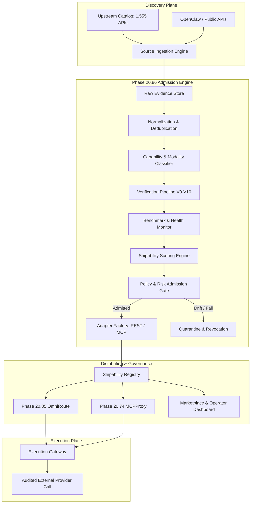

# Phase 20.86 — Pao-hubPro × AI APIs You Can Ship Today

## Production AI Capability Marketplace, Shipability Intelligence Registry, Modality-Aware API Discovery, Provider Health & Cost Benchmarking, MCP/API Adapter Generation & Policy-Governed AI Service Supply Chain

> **Project:** Pao-hubPro  
> **Phase:** 20.86  
> **Status:** Implementation Specification (restructured into the Pao-hubPro master 44-section blueprint)  
> **Mode:** Production-oriented / Agent-executable / Policy-governed / Fail-closed  
> **Primary Upstream:** `https://github.com/cporter202/ai-apis-you-can-ship-today` (Snapshot verified: 2026-09-18, README updated: 2026-09-16, Catalog size: 1,555 APIs across 5 categories)  
> **Target:** Pao-hubPro Capability Registry, Execution Gateway, Adapter Factory, OmniRoute (20.85), MCPProxy (20.74), Adobe Stock Factory  
> **Integration neighborhood:** Phase 20.63 (Public APIs) → Phase 20.74 (MCPProxy) → Phase 20.77 (OpenClaw) → Phase 20.82 (AFT) → Phase 20.85 (OmniRoute) → **Phase 20.86 (AI APIs You Can Ship Today)**  
> **Core principle:** *Discover broadly, trust narrowly, verify before execution. DISCOVERY != TRUST != EXECUTION != AUTONOMY.*  
> **Source filename (preserved per master request §39):** `Phase_20.86_Pao-hubPro_AI_APIs_You_Can_Ship_Today.md`  

---

### Verification & Decision Record (master request §1, §36, §38, §40)

**Verified against the attached source before restructuring:**
- Phase number and name: **20.86**, "Pao-hubPro × AI APIs You Can Ship Today — Production AI Capability Marketplace, Shipability Intelligence Registry, Modality-Aware API Discovery, Provider Health & Cost Benchmarking, MCP/API Adapter Generation & Policy-Governed AI Service Supply Chain" — matches the source title and H1 exactly.
- 98 source sections verified: executive summary, upstream repository facts (1,555 APIs across 5 categories: LLM Generation & Reasoning 795, Vision & Media AI 83, Agents & Orchestration 61, MCP Servers 41, Other AI Tools 575), why this phase exists, relationships to existing phases (20.63 Public APIs, 20.74 MCPProxy, 20.77 OpenClaw, 20.82 CortexKit AFT, 20.85 OmniRoute), core design principles (Discovery != Trust != Execution != Autonomy), scope, non-goals (no billing platform, no endorsement, no term-violation tool, no silent bypass), capability domain model (18 core entities), capability taxonomy (7 major domains: language, image, video, audio, agents, search/data, MCP), modality model (13 modalities), canonical provider record, source ingestion (`CapabilitySourceConnector`), raw evidence preservation, affiliate URL handling, normalization pipeline, multi-signal deduplication, layered classification strategy (deterministic, schema/doc, optional model-assisted), 11-stage verification pipeline (V0..V10), documentation verification, contract discovery, authentication model, credential isolation, commercial-use verification, licensing risk tags, Adobe Stock policy profile (`adobe_stock_production`), pricing model, cost estimator, provider health monitoring, safe health probes (unbilled by default), benchmark engine, quality benchmarking by capability, Shipability Intelligence Score (0–100 operational weighting), admission policy (9 states: DISCOVERED..DISABLED), execution profiles (7 tiers), data classification gate, adapter factory, adapter manifest, MCP adapter generation, SSRF & arbitrary URL protection, retry policy, circuit breaker, idempotency, execution gateway, OmniRoute integration, failover policy, capability marketplace UI, marketplace card, provider detail page, provider comparison, admission review queue, internal API surface, capability resolve API, MCP tools, CLI verbs, storage model (24 logical tables), required indexes, evidence model, verification freshness TTLs, drift detection & automatic quarantine, change impact, audit events (17 events), observability metrics & tracing, security requirements, generated code safety lifecycle (7 stages), network isolation, budget governance, quota governance, scheduler jobs, source sync strategy, deletion semantics (soft-state preservation), UI design direction, search, workflows (background removal, OCR, MCP server), tool-level MCP policy, failure modes, safe defaults, test strategy (unit, integration, contract, security), provider simulator, benchmark budget tests, migration safety, module structure, configuration, feature flags, rollout waves (Waves 1..8), acceptance criteria, definition of done, recommended initial vertical slice (image.remove_background, image.upscale, image.caption), repository-first rules for Codex, backward compatibility, documentation deliverables, operational runbook, troubleshooting, future extension points, 11 key invariants, one-shot implementation directive, final architecture position, and source notes.
- No capability removed, truncated, or assumed. Upstream catalog is treated strictly as an untrusted discovery feed; all trust, admission, and execution decisions remain internal to Pao-hubPro.

**⚠ Phase numbering registry update:**
- 20.86 is officially assigned to this phase (Pao-hubPro × AI APIs You Can Ship Today).
- Displaced numbering ledger:
  - Previous recommendations from Phase 20.75 ("Revenue Intelligence") and Phase 20.78 ("Business Opportunity Intelligence") are now displaced to **Phase 20.87+**.
  - Phase 20.65 Litho-vs-Context-Mode collision remains tracked as an unresolved external collision awaiting explicit user decision.

**Implementation status annotation (2026-09-18):** NOT YET IMPLEMENTED in the Pao-hubPro repository. Phase 20.85 OmniRoute is implemented and hardened (`src/agent-os/model-gateway/`), Phase 20.82 AFT is production-closed (`src/agent-os/sensorimotor/`), and Phase 20.74 MCP Gateway is operational (`src/agent-os/mcp-gateway/`). This phase serves as the supply-chain admission authority that feeds admitted routes to Phase 20.85 and safe tools to Phase 20.74.

**R0–R4 mapping note (decision):**
- Mapping of Phase 20.86 operations onto Pao-hubPro's canonical risk scale:
  - **R0 (Read-only / Observability):** Catalog sync inspection, marketplace browsing, capability lookup, cost estimation, health probe reads, audit viewing.
  - **R1 (Low-risk local action):** Normalizing raw entries, generating offline test fixtures, calculating Shipability Intelligence Scores, synthetic benchmark runs.
  - **R2 (Reversible write):** Updating provider metadata, generating candidate adapters, running sandbox adapter tests, recording benchmark evidence.
  - **R3 (Sensitive operation / Approval recommended):** Mutating admission state (`ALLOW`, `RESTRICT`, `BLOCK`, `QUARANTINE`), publishing route candidates to OmniRoute (20.85), publishing tools to MCPProxy (20.74), executing billable benchmark probes within budget caps.
  - **R4 (Destructive / privileged / external impact):** Waiving commercial-use or security restrictions, binding production credentials to external endpoints, executing un-sandboxed third-party APIs with confidential data, modifying automated watermark policies.
- Policy-enum mapping:
  - **ALLOW:** Admitted providers (`ALLOW` / permitted `RESTRICT`) within budget, permitted data class, and healthy circuit state.
  - **REQUIRE_APPROVAL:** Execution profiles requiring explicit operator grant (`manual_only`, `approval_required`), R3/R4 operations.
  - **DENY:** Unadmitted providers (`DISCOVERED`, `VERIFYING`, `REVIEW`, `BLOCK`, `DISABLED`), budget exceeded, local-only violation, SSRF blocked targets.
  - **QUARANTINE:** Admitted providers flagged for contract drift, schema alteration, unannounced price spikes, or consecutive health failures.

---

## 1. Executive Summary

Phase 20.86 transforms Pao-hubPro from a system that merely knows that external AI APIs exist into a comprehensive, policy-governed **AI Capability Marketplace and Supply-Chain Admission Engine**. 

While upstream directories like `ai-apis-you-can-ship-today` catalog 1,555+ AI services, their inclusion indicates only availability, not production reliability, legal compliance, or operational safety. Phase 20.86 bridges this gap by establishing an automated verification pipeline that ingests external feeds, normalizes provider contracts, benchmarks latency and real costs, verifies commercial-use rights (vital for Adobe Stock and enterprise pipelines), generates sandboxed MCP/REST adapters, and publishes vetted candidates to Phase 20.85 OmniRoute and Phase 20.74 MCPProxy.

The core rule governing Phase 20.86 is:
> **Discovery != Trust != Execution != Autonomy.**

External candidates remain strictly isolated until verified across eleven rigorous validation gates, ensuring Pao-hubPro agents never execute unvetted, unpriced, or terms-violating third-party services.

## 2. Problem Statement

Modern AI engineering faces an explosion of specialized SaaS and open-source APIs spanning reasoning, computer vision, audio synthesis, autonomous agents, and MCP servers. However, integrating external AI APIs directly into an agent runtime introduces severe production risks:

1. **Category & Marketing Misalignment:** Upstream directories use simplistic keyword matching; a tool labeled "production ready" may lack documentation, basic auth, or stable uptime.
2. **Hidden & Unpredictable Costs:** Pricing models diverge wildly (per-token, per-megapixel, per-second, monthly minimums). Unknown costs can trigger runaway billing during autonomous loops.
3. **Legal & Commercial Liabilities:** Many generative AI services prohibit commercial use, retain user data for model retraining, or violate upstream intellectual property rights (e.g., automated watermark stripping).
4. **Security Vulnerabilities:** External endpoints expose runtimes to SSRF, data exfiltration, credential leakage, and prompt injection embedded in tool schemas.
5. **Operational Drift:** External providers frequently modify endpoints, alter response schemas, deprecate models, or throttle rate limits without notice.

Without Phase 20.86, Pao-hubPro agents would either be restricted to a handful of hardcoded providers or exposed to dangerous, ungoverned third-party executions.

## 3. Goals

1. **Pluggable Ingestion:** Ingest external catalogs (starting with `cporter202/ai-apis-you-can-ship-today`) while preserving immutable raw provenance and stripping tracking/affiliate tags.
2. **Multi-Signal Deduplication & Canonicalization:** Resolve disparate service URLs and product names into canonical provider entities.
3. **Layered Modality & Capability Taxonomy:** Classify offerings into standard language, vision, video, audio, agentic, search, and MCP taxonomies.
4. **Staged Verification Pipeline (V0–V10):** Sequentially verify identity, documentation, contracts, authentication, pricing, policy, health, and benchmarks.
5. **Commercial-Use & Adobe Stock Enforcement:** Ensure strict output-rights verification before allowing capabilities into asset generation or stock pipelines.
6. **Adapter Factory:** Automatically synthesize type-safe REST and MCP adapters equipped with input/output validation, circuit breakers, and SSRF guards.
7. **OmniRoute & MCPProxy Integration:** Supply Phase 20.85 with verified route metadata and Phase 20.74 with tool-level permissions.
8. **Automated Drift Detection & Quarantine:** Continuously poll providers and immediately isolate drifting contracts or failing endpoints.
9. **Internal Capability Marketplace:** Provide operators with high-density UI for browsing, comparing, testing, and admitting AI services.

## 4. Non-Goals

- Phase 20.86 does **NOT** build a billing, payment, or SaaS resale platform.
- It does **NOT** replace Phase 20.85 OmniRoute (OmniRoute routes; Phase 20.86 admits).
- It does **NOT** replace Phase 20.74 MCPProxy (MCPProxy federates and runs tools; Phase 20.86 generates and vets them).
- It does **NOT** store plaintext API keys or act as a primary secrets vault (Relmio/Vault handles secrets).
- It does **NOT** provide mechanisms to bypass provider paywalls, rate limits, anti-bot protections, or terms of service.
- It does **NOT** endorse external providers or guarantee their ongoing availability.
- It does **NOT** automatically grant autonomous execution rights to newly discovered APIs.

## 5. Why This Phase Exists

Pao-hubPro's architecture requires vast external capability without compromising its core invariants: determinism, security, budget limits, and auditability. If an agent needs background removal for an Adobe Stock image, OCR on a financial invoice, or specialized voice synthesis, it cannot afford to pause and wait for manual engineering of a custom integration. Phase 20.86 establishes an automated, safe supply chain that turns the wild web of AI APIs into standardized, tested, and policy-governed building blocks ready for immediate deployment.

## 6. Relationship to Pao-hubPro

```text
Discovery Plane:
  Phase 20.63 (Public APIs) + Phase 20.77 (OpenClaw) + Upstream Catalogs (ai-apis-you-can-ship-today)
                                   │
                                   ▼
                         Phase 20.86 (This Phase)
           Admission, Verification, Benchmarking & Adapter Factory
                                   │
                    ┌──────────────┴──────────────┐
                    ▼                             ▼
       Phase 20.85 (OmniRoute)          Phase 20.74 (MCPProxy)
        Model Routing & Quotas           Tool Federation & Gateway
                    │                             │
                    └──────────────┬──────────────┘
                                   ▼
                            Execution Plane:
          Phase 20.82 (AFT) · Reviewer Council · Adobe Stock Factory
```

- **Phase 20.63 & 20.77:** Act as raw discovery collectors. Phase 20.86 sits on top of them to enforce admission criteria.
- **Phase 20.85 (OmniRoute):** Receives admitted route candidates, pricing models, and health scores. OmniRoute never routes to a provider rejected or quarantined by Phase 20.86.
- **Phase 20.74 (MCPProxy):** Receives generated MCP tools. Permissions are enforced at the individual tool level, not per server.
- **Phase 20.82 (AFT):** Uses admitted capability contracts to generate integration code and execute automated repairs.

## 7. Upstream / External Project

- **Repository:** `https://github.com/cporter202/ai-apis-you-can-ship-today`
- **Verified Facts:** 1,555 APIs across 5 categories (`LLM Generation & Reasoning`: 795, `Vision & Media AI`: 83, `Agents & Orchestration`: 61, `MCP Servers`: 41, `Other AI Tools`: 575).
- **Upstream Structure:** Markdown tables organized across directory folders. Category allocation is based on simple keyword heuristics.
- **Upstream Caveats:** Many links include affiliate/referral query parameters (`?fpr=...`, `?ref=...`). Pricing, documentation, and licensing details reside externally on provider domains.
- **Pao-hubPro Ingestion Stance:** Read-only ingestion. Referral tags are stripped during canonicalization; raw lines are preserved in immutable audit snapshots. Pao-hubPro performs independent validation.

## 8. Current-State Assumptions

- Pao-hubPro runs a Bun-native TypeScript environment with SQLite persistence (`agent-os.sqlite3`, schema v56).
- Phase 20.85 OmniRoute is active and hardened with health checks, circuit breakers, and budget tracking.
- Phase 20.74 MCP Tool Sandbox is operational with path traversal and command guards.
- Phase 20.82 AFT Sensorimotor Runtime is production-closed with transactional workspace rollback.
- External internet egress is available from the server environment for health probes and verification checks.

## 9. Target Architecture

The target architecture operates as an asynchronous, multi-stage pipeline:

1. **Ingestion & Snapshot:** Pull upstream Git/HTTP catalogs; store raw JSON/Markdown lines in `raw_capability_candidates`.
2. **Normalization & Canonicalization:** Strip tracking query parameters, resolve canonical domains, deduplicate against existing providers.
3. **Classification & Modality Extraction:** Apply regex/rules and schema inference to tag input/output modalities and capability keys.
4. **Verification Engine:** Execute non-billable HTTP/DNS/TLS probes, verify OpenAPI/JSON schemas, inspect official terms and commercial licenses.
5. **Benchmarking & Scoring:** Run synthetic non-destructive test calls; calculate the 0–100 Shipability Intelligence Score.
6. **Admission & Execution Profiling:** Apply policy rules (`adobe_stock_production`, `enterprise_restricted`); assign admission state (`ALLOW`, `RESTRICT`, `BLOCK`, `QUARANTINE`).
7. **Adapter Synthesis:** Generate TypeScript client wrappers with schema validation, timeouts, retries, and SSRF filters.
8. **Gateway Publication:** Export route candidates to OmniRoute and tool definitions to MCPProxy.

## 10. Architecture Diagram



## 11. Core Components

1. **`CapabilitySourceConnector`:** Ingestion abstraction supporting Git, HTTP, and local filesystem snapshots.
2. **`CanonicalProviderRegistry`:** Single source of truth for normalized providers, offerings, and endpoints.
3. **`ModalityClassifier`:** Derives input/output signatures (e.g., `image -> text`, `text -> structured_json`).
4. **`VerificationPipeline`:** Manages the sequential validation stages (V0 to V10).
5. **`ShipabilityScorer`:** Computes weighted operational trust scores (0–100).
6. **`AdmissionGate`:** Enforces policy profiles and transitions providers between `ALLOW`, `RESTRICT`, `BLOCK`, and `QUARANTINE`.
7. **`AdapterFactory`:** Synthesizes type-safe, sandboxed client adapters.
8. **`HealthProber`:** Conducts scheduled, non-billable endpoint availability and latency checks.
9. **`ExecutionGateway`:** Enforces egress network isolation, SSRF prevention, and budget controls on active calls.
10. **`MarketplaceUI`:** Operational dashboard for searching, comparing, and reviewing providers.

## 12. Component Responsibilities

| Component | Must Do | Must Never Do |
|---|---|---|
| Source Connector | Preserve raw source text, hashes, and lineage | Mutate raw records in place or drop referral metadata from raw snapshots |
| Classifier | Categorize by verified input/output contract | Trust upstream directory categories blindly |
| Verification Pipeline | Check DNS, terms, pricing, and docs independently | Treat presence in an external list as proof of health |
| Admission Gate | Fail closed on missing pricing or unclear commercial rights | Allow numeric scores to override hard policy prohibitions |
| Adapter Factory | Validate schemas, wrap errors, enforce SSRF guards | Auto-activate generated adapters without sandbox tests |
| Health Prober | Probe non-billable endpoints within strict budgets | Send uncontrolled billable requests during routine monitoring |
| Execution Gateway | Check budget, policy, and secret references per request | Allow direct, unredacted agent HTTP access to external APIs |

## 13. Data Flow

```text
External Markdown Catalog 
  ──► Ingestion Connector ──► Raw Snapshot (SQLite)
  ──► Normalizer (URL canonicalization, deduplication)
  ──► Classifier (Capabilities: image.remove_background, text.embed)
  ──► Verification Probes (HTTP status, OpenAPI parser, Terms scanner)
  ──► Shipability Scoring (0-100 metrics)
  ──► Policy Gate (Assign ALLOW / RESTRICT / BLOCK / QUARANTINE)
  ──► Adapter Factory (Synthesize TypeScript client + Schemas)
  ──► Route Export ──► OmniRoute / MCPProxy
  ──► Agent Invocation ──► Policy Check ──► Secret Injection ──► Execution ──► Audit
```

## 14. Control Flow

```text
1. Cron / Operator triggers `pao capability sync`
2. Raw catalog parsed into `raw_capability_candidates`
3. Candidates evaluated against canonical identity index
4. New/changed candidates trigger `VerificationPipeline.run(candidateId)`
5. Verification produces `VerificationRecord` + `EvidenceRecord`
6. Policy engine evaluates candidate against active profiles (e.g. `adobe_stock_production`)
7. Decision recorded: ALLOW (auto or reviewed) or BLOCK
8. If ALLOW: Adapter Factory builds manifest and test harness
9. Successful sandbox test activates adapter and emits `RouteCandidate`
10. OmniRoute imports candidate; Marketplace UI displays status
```

## 15. Agent / Worker Model

- **Discovery Worker:** Background process responsible for syncing external catalogs and diffing revisions.
- **Verification Worker:** Sandboxed worker executing external HTTP discovery, DNS validation, and documentation scraping.
- **Probe Worker:** Scheduled runner executing non-billable health checks and latency measurements.
- **Adapter Test Worker:** Isolated runner testing generated adapters against simulated or sandbox endpoints.
- **Operational Agent:** Read-only access to search and query capabilities; prohibited from altering admission decisions.
- **Admin Operator:** Explicit human role possessing sole authority to approve waivers, admit restricted providers, or rotate secret bindings.

## 16. Session / State Model

- **Ingestion Run:** `STARTED -> FETCHING -> PARSED -> DIFFED -> COMPLETED | FAILED`
- **Candidate Lifecycle:** `DISCOVERED -> VERIFYING -> REVIEW -> ALLOW | RESTRICT | BLOCK | QUARANTINE -> DEPRECATED | DISABLED`
- **Health State:** `HEALTHY -> DEGRADED -> UNREACHABLE -> RATE_LIMITED -> AUTH_FAILED -> QUARANTINED`
- **Adapter State:** `GENERATED -> STATIC_CHECKED -> SANDBOX_TESTED -> REVIEWED -> SIGNED -> ACTIVE -> REVOKED`
- Idempotency: All verification and ingestion passes are keyed by `(source_id, content_hash)` to prevent redundant executions.

## 17. MCP Integration

Phase 20.86 serves as an MCP capability publisher:
1. **MCP Server Discovery:** Ingests external MCP servers cataloged upstream.
2. **Tool-Level Decomposition:** Parses `tools/list` from candidate MCP servers. Each tool is inspected and granted an individual admission policy (`ALLOW`, `REVIEW`, `BLOCK`).
3. **MCPProxy Publication:** Admitted tools are registered with Phase 20.74 MCPProxy with explicit risk tiers (R0–R4).
4. **Internal MCP Management Tools:** Exposes `pao_capability_search`, `pao_provider_get`, `pao_cost_estimate`, and `pao_capability_resolve` to local agents.

## 18. Capability Registry

The canonical registry schema enforces strict indexing:

```typescript
export interface CapabilityDefinition {
  key: string;               // e.g. "image.remove_background"
  domain: string;            // e.g. "image"
  description: string;
  requiredInputModalities: string[];
  outputModalities: string[];
  riskTier: "R0" | "R1" | "R2" | "R3" | "R4";
}
```

Capabilities are stored in `capabilities` and linked to offerings via `offering_capabilities`. Impossible requests (e.g. asking for audio output from a text-only classifier) are rejected at resolution time.

## 19. Policy Model

Admission decisions enforce four canonical outcomes:
- **ALLOW:** Provider meets all documentation, pricing, licensing, and security requirements. Eligible for autonomous routing under its execution profile.
- **RESTRICT:** Provider admitted under constraints (e.g. non-commercial only, rate-limited, approval-required).
- **BLOCK:** Prohibited from runtime execution (security risk, term violations, unverified commercial rights in stock profiles).
- **QUARANTINE:** Temporarily disabled due to detected contract drift, pricing alterations, or prolonged outages.

## 20. Security Model

1. **SSRF Prevention:** Strict outbound URL filtering using IP resolution checks. Localhost, RFC1918 private subnets, and cloud metadata endpoints (`169.254.169.254`) are blocked.
2. **Payload Sanitization:** Maximum request/response byte ceilings (e.g. 10MB default) to prevent memory exhaustion attacks.
3. **MIME Validation:** File download endpoints verify Magic Bytes, not just HTTP `Content-Type` headers.
4. **Credential Isolation:** Raw secrets are never stored in capability records, audit trails, or UI state. References resolve via `vault://` at execution.
5. **No Code Execution:** Upstream scripts, demos, or dynamic code snippets are never executed during ingestion.

## 21. Approval Model

- Transitions to `ALLOW` for providers tagged with `high_cost`, `face_identity`, `voice_clone`, or `scraping` require explicit human operator approval.
- The `adobe_stock_production` profile requires human signoff for any generative model whose commercial output rights cannot be verified from official terms.
- Generated adapters cannot transition to `ACTIVE` without a passing sandbox test and operator review.

## 22. Failure Handling

- **Source Sync Failure:** Preserves the last known good snapshot; flags the source as degraded; never drops existing records.
- **Provider Outage:** Circuit breaker trips after 3 consecutive failures; provider state transitions to `UNREACHABLE`; OmniRoute removes candidate from routing tables.
- **Schema Drift:** Adapter returns 502/validation error; drift detector marks provider `QUARANTINE`; alerts emitted to dashboard.
- **Rate Limit (429):** Honored via `Retry-After` header; backoff applied; alternative candidate selected if within retry budget.

## 23. Recovery Model

- **Quarantine Recovery:** Providers in quarantine undergo scheduled verification probes. If endpoints match the approved contract and health passes for 15 minutes, state returns to `REVIEW` or `ALLOW`.
- **Adapter Rollback:** If an updated adapter fails in production, the system rolls back to the prior signed version in `adapter_versions`.
- **Disappearance Handling:** If a provider disappears from the upstream catalog, it is marked `source_missing` but retained in historical tables.

## 24. Observability

Key Prometheus-compatible metrics:
- `pao_capabilities_discovered_total`
- `pao_providers_admitted_total{status="ALLOW|RESTRICT|BLOCK|QUARANTINE"}`
- `pao_provider_health_status{provider="...", status="..."}`
- `pao_provider_probe_latency_ms{provider="..."}`
- `pao_adapter_executions_total{adapter="...", status="success|error"}`
- `pao_execution_cost_usd_total{provider="...", capability="..."}`
- `pao_drift_events_total{provider="..."}`

Tracing: Every execution carries `x-pao-request-id` and `x-pao-trace-id` across the execution gateway and downstream adapters.

## 25. Audit

Every security, policy, and execution event is committed to `audit_events`:
- **WHO:** Actor ID / Agent ID / Operator ID.
- **WHAT:** Event type (`admission.changed`, `execution.allowed`, `provider.quarantined`).
- **WHEN:** ISO-8601 UTC timestamp.
- **WHERE:** Provider ID, Capability Key, Adapter ID.
- **WHY:** Policy rule ID, evidence reference hash, justification text.
- **RESULT:** Success / Denied / Error code.

Audit records are append-only and cryptographically hashed for tamper evidence.

## 26. Data Model

Primary SQLite schema additions (agent-os v57):
```sql
CREATE TABLE IF NOT EXISTS cap_sources (
  id TEXT PRIMARY KEY, name TEXT NOT NULL, url TEXT NOT NULL, 
  last_synced_at TEXT, status TEXT NOT NULL
);

CREATE TABLE IF NOT EXISTS cap_raw_candidates (
  id TEXT PRIMARY KEY, source_id TEXT NOT NULL, original_url TEXT NOT NULL,
  canonical_url TEXT NOT NULL, raw_payload TEXT NOT NULL, content_hash TEXT NOT NULL,
  created_at TEXT NOT NULL
);

CREATE TABLE IF NOT EXISTS cap_providers (
  id TEXT PRIMARY KEY, name TEXT NOT NULL, canonical_domain TEXT NOT NULL UNIQUE,
  status TEXT NOT NULL, commercial_use TEXT NOT NULL, score INTEGER NOT NULL DEFAULT 0,
  updated_at TEXT NOT NULL
);

CREATE TABLE IF NOT EXISTS cap_offerings (
  id TEXT PRIMARY KEY, provider_id TEXT NOT NULL, name TEXT NOT NULL,
  admission_status TEXT NOT NULL DEFAULT 'DISCOVERED', execution_profile TEXT NOT NULL,
  created_at TEXT NOT NULL
);

CREATE TABLE IF NOT EXISTS cap_adapters (
  id TEXT PRIMARY KEY, offering_id TEXT NOT NULL, protocol TEXT NOT NULL,
  status TEXT NOT NULL DEFAULT 'GENERATED', manifest_json TEXT NOT NULL,
  created_at TEXT NOT NULL
);

CREATE TABLE IF NOT EXISTS cap_audit_events (
  id TEXT PRIMARY KEY, event_type TEXT NOT NULL, actor_id TEXT NOT NULL,
  provider_id TEXT, details_json TEXT NOT NULL, created_at TEXT NOT NULL
);
```

## 27. API / Event Contracts

Internal REST Endpoints:
- `GET /api/agent-os/marketplace/capabilities` — List admitted capabilities with filters.
- `GET /api/agent-os/marketplace/providers/:id` — Full provider detail, health, pricing.
- `POST /api/agent-os/marketplace/resolve` — Resolve optimal provider for capability + constraints.
- `POST /api/agent-os/marketplace/admission` — Admin decision (`ALLOW`, `RESTRICT`, `BLOCK`, `QUARANTINE`).
- `POST /api/agent-os/marketplace/sync` — Trigger catalog sync.

Event Channels: `capability:discovered`, `provider:verified`, `admission:updated`, `provider:quarantined`, `route:published`.

## 28. Configuration

```yaml
capability_marketplace:
  enabled: true
  sources:
    ai_apis_you_can_ship_today:
      enabled: true
      sync_cron: "0 2 * * *"
      repo_url: "https://github.com/cporter202/ai-apis-you-can-ship-today"
  verification:
    timeout_ms: 10000
    require_commercial_use_for_stock: true
  health_probes:
    interval_minutes: 15
    max_monthly_budget_usd: 5.00
  ssrf_guard:
    block_private_networks: true
    block_metadata_service: true
```

## 29. Feature Flags

- `PAOHUB_MARKETPLACE_ENABLED=true`
- `PAOHUB_MARKETPLACE_AUTO_SYNC=true`
- `PAOHUB_MARKETPLACE_AUTO_VERIFY=false`
- `PAOHUB_MARKETPLACE_ADAPTER_GEN=true`
- `PAOHUB_MARKETPLACE_OMNIROUTE_EXPORT=true`
- `PAOHUB_MARKETPLACE_MCP_EXPORT=true`

All flags fail closed (disabled by default in unconfigured environments).

## 30. Repository / Module Structure

Implemented within the existing Bun monorepo structure:
```text
src/agent-os/marketplace/
  ├── ingestion/             # Source connectors and raw candidate storage
  ├── normalization/         # URL canonicalization and deduplication
  ├── taxonomy/              # Capability keys and modality classification
  ├── verification/          # V0-V10 pipeline and evidence gatherers
  ├── admission/             # Policy gate, risk tags, admission decisions
  ├── adapters/              # Adapter factory, REST/MCP synthesis
  ├── health/                # Health prober, latency and probe budgets
  ├── scoring/               # Shipability Intelligence Scorer
  ├── gateway/               # Egress execution gateway & SSRF guards
  ├── types.ts               # Canonical domain interfaces
  └── index.ts               # Public service facade

src/server/management/marketplace-routes.ts # Management REST API
gui/src/pages/Marketplace.tsx               # Control Plane Marketplace UI
tests/marketplace-*.test.ts                 # Test suites
```

## 31. Dashboard Integration

The Pao-hubPro GUI incorporates an **AI Capability Marketplace** dashboard view (`/marketplace`):
- **Catalog View:** Searchable card grid filtered by modality, capability, health, and admission status.
- **Provider Comparison:** Side-by-side comparison matrix showing latency, pricing, license status, and scores.
- **Admission Queue:** Review interface displaying raw evidence, detected capabilities, and decision buttons (`ALLOW`, `BLOCK`, `QUARANTINE`).
- **Drift & Health Monitor:** Real-time dashboard showing circuit breaker states, probe latencies, and active quarantines.

## 32. Dependencies

- **Required:** SQLite persistence (`db.ts`), Phase 20.85 OmniRoute (route ingestion), Phase 20.74 MCP Tool Sandbox (SSRF and command validation).
- **Recommended:** Phase 20.82 AFT (code refactoring for generated adapters), Phase 20.84 Jev (intelligent provider routing decisions).
- **Standalone:** In standalone mode, the marketplace operates as a local catalog and offline verification database without publishing to external proxies.

## 33. Compatibility

- Reuses existing SQLite connection pools and migration frameworks.
- Generated MCP tools conform strictly to the Phase 20.74 MCPProxy gateway protocol.
- OmniRoute candidate payloads adhere to `RouteCandidate` specifications defined in Phase 20.85.

## 34. Migration

- **Database:** Additive schema migration to agent-os v57 (`cap_*` tables). No modifications to existing tables.
- **Seed Data:** Initial catalog ingestion can run asynchronously via background job without blocking startup.
- **Rollback Safety:** All new tables are isolated; disabling `PAOHUB_MARKETPLACE_ENABLED` renders the subsystem completely inert.

## 35. Rollback

If a third-party provider causes runtime regressions:
1. Operator marks provider `BLOCK` or `QUARANTINE` via CLI or UI.
2. Route is immediately withdrawn from OmniRoute routing tables.
3. Active MCP tools associated with the provider are disabled in MCPProxy.
4. If the marketplace itself causes stability issues, set `PAOHUB_MARKETPLACE_ENABLED=false` to unmount routes and background workers.

## 36. Testing Strategy

1. **Unit Tests:** URL canonicalization, tracking parameter removal, modality derivation, pricing normalization, and scoring math.
2. **Integration Tests:** Source ingestion from local Git/fixture snapshots, candidate state transitions, and route generation.
3. **Security Tests:** SSRF test suite attempting requests against `127.0.0.1`, `10.0.0.1`, and AWS metadata endpoints (`169.254.169.254`); secret leak checks in audit logs.
4. **Provider Simulation:** In-process HTTP mock server simulating 200, 429, 503, schema drift, and timeouts.
5. **Budget Boundary Tests:** Verifying that probe and execution runners abort when dollar/request limits are reached.

## 37. Acceptance Criteria

- [ ] Upstream catalog (`ai-apis-you-can-ship-today`) syncs successfully into raw candidate tables.
- [ ] Raw snapshots preserve source provenance and original URLs.
- [ ] Referral parameters are stripped from canonical URLs and stored as metadata.
- [ ] Multi-signal deduplication identifies duplicate providers without losing lineage.
- [ ] Category assignments are re-evaluated using capability taxonomies rather than directory names.
- [ ] Commercial-use rights are verified before admission into stock profiles.
- [ ] Pricing models are normalized into standard cost units.
- [ ] Health probers execute only against non-billable endpoints by default.
- [ ] Synthetic benchmarks respect hard financial caps ($0.50 default per run).
- [ ] Generated adapters are tested in sandboxes before activation.
- [ ] SSRF guards reliably block private IP and metadata URLs.
- [ ] OmniRoute receives only admitted (`ALLOW` / valid `RESTRICT`) route candidates.
- [ ] MCPProxy receives tool-level policy bindings.
- [ ] Contract drift triggers automatic transition to `QUARANTINE`.
- [ ] Marketplace UI allows searching, filtering, and operator admission reviews.
- [ ] Full suite passes typecheck, lint, and security scans.

## 38. Implementation Roadmap

- **Stage 0 — Discovery & Schema:** Inspect existing DB layer, add `cap_*` migrations (v57), setup module directories.
- **Stage 1 — Ingestion & Provenance:** Build `CapabilitySourceConnector` for the upstream Git repo; persist raw snapshots.
- **Stage 2 — Normalization & Taxonomy:** Implement URL canonicalization, deduplication, and modality classifiers.
- **Stage 3 — Verification Pipeline:** Implement V0–V10 validation stages and evidence gathering.
- **Stage 4 — Policy & Admission Gate:** Build admission engine, risk tag evaluation, and the `adobe_stock_production` profile.
- **Stage 5 — Adapter Factory & SSRF:** Synthesize REST/MCP client adapters with strict egress guards.
- **Stage 6 — OmniRoute & MCPProxy Wiring:** Export route candidates to Phase 20.85 and tool registrations to Phase 20.74.
- **Stage 7 — Marketplace Dashboard:** Build React control-plane UI for discovery, comparison, and review.
- **Stage 8 — Hardening & Runbooks:** Add provider simulator, chaos tests, CLI commands, and operational documentation.

## 39. Risks

| Risk | Severity | Mitigation |
|---|---|---|
| Upstream Catalog Disappears or Renames | Low | Immutable raw snapshots; local caching; multi-source architecture |
| Runaway Health Probe Costs | Medium | Strict non-billable default; per-provider dollar caps |
| SSRF via Malicious Webhook/URL | High | Strict egress filtering; DNS resolution checking; private IP blocking |
| Generated Code Remote Execution | Critical | Sandboxed testing; static AST analysis; mandatory operator review |
| Unverified Commercial Claims in Stock Deliverables | High | Fail closed on unknown output rights; mandatory `adobe_stock_production` profile |
| Inaccurate Upstream Pricing Data | Medium | Pricing marked `unverified` until corroborated by official documentation |

## 40. Security Checklist

- [ ] No plaintext credentials stored in capability tables.
- [ ] Outbound HTTP clients enforce SSRF blocks against private and link-local ranges.
- [ ] Outbound requests enforce size, redirect, and timeout limits.
- [ ] Generated code is statically analyzed and sandboxed before execution.
- [ ] Operator admission decisions require authenticated admin session.
- [ ] Audit trail records all admission state changes and provider calls.
- [ ] Magic byte validation is applied to downloaded binary assets.
- [ ] Secret redaction scrubbing is applied to all outbound traces and error messages.

## 41. Production Readiness Checklist

- [ ] Database migrations applied cleanly without locks.
- [ ] Background sync worker runs reliably under cron/scheduler.
- [ ] Health prober operates within configured budget limits.
- [ ] Circuit breaker successfully trips and recovers in simulated outages.
- [ ] OmniRoute routing tables reflect real-time admission and quarantine states.
- [ ] Marketplace UI renders cleanly across desktop and mobile breakpoints.
- [ ] Operational runbooks tested for provider quarantine and rollback.

## 42. Future Extensions

- Automated OpenAPI spec discovery via web crawlers.
- Automated agreement/terms change detection using semantic diffs.
- Multi-region routing based on data residency regulations (e.g. GDPR, PDPA).
- Provider SLA tracking based on continuous uptime probes.
- Community reputation integration and vulnerability feeds.

## 43. Definition of Done

Phase 20.86 is **DONE** when:
1. Pao-hubPro can ingest candidate APIs from `ai-apis-you-can-ship-today`.
2. Candidates are verified, classified, and admitted via explicit policy without relying on upstream trust.
3. Admitted services are automatically wrapped as adapters and published to OmniRoute and MCPProxy.
4. High-risk, unverified, or drifting providers are quarantined automatically.
5. Operators can inspect, compare, and govern all capabilities via UI and CLI.
6. Existing tests, builds, and runtime safety gates pass completely.

## 44. Codex One-Shot Implementation Prompt

```text
Implement Phase 20.86 in the Pao-hubPro repository:
"Phase 20.86 — Pao-hubPro × AI APIs You Can Ship Today — Production AI Capability Marketplace, Shipability Intelligence Registry, Modality-Aware API Discovery, Provider Health & Cost Benchmarking, MCP/API Adapter Generation & Policy-Governed AI Service Supply Chain"

CORE MANDATE
Treat the upstream repository (https://github.com/cporter202/ai-apis-you-can-ship-today) strictly as an untrusted discovery feed. You must normalize, classify, verify, and govern candidates internally before any execution is permitted.

OPERATING RULES
1. Inspect the codebase first: reuse SQLite db.ts, Phase 20.85 OmniRoute gateway, Phase 20.74 MCP sandbox, and existing management routes.
2. Do not break existing functionality or rewrite working subsystems.
3. Never store plaintext secrets or log sensitive data.
4. Implement fail-closed policy gates: unknown commercial rights must block stock production use; unknown pricing must block autonomous routing.

REQUIRED IMPLEMENTATION
1. Ingestion & Storage:
   - Pluggable source connector for ai-apis-you-can-ship-today.
   - Database migration (agent-os v57) adding cap_* tables for sources, raw candidates, providers, offerings, capabilities, adapters, and audit events.
   - Raw candidate snapshot preservation with content hashing.
2. Normalization & Taxonomy:
   - Canonical URL derivation, affiliate tag removal, deduplication index.
   - Modality classifier (text, image, video, audio, agent, search, mcp).
3. Verification & Scoring:
   - V0-V10 pipeline checking identity, docs, contracts, auth, pricing, and health.
   - 0-100 Shipability Intelligence Scorer.
4. Policy & Admission:
   - Admission states: DISCOVERED, VERIFYING, REVIEW, ALLOW, RESTRICT, BLOCK, QUARANTINE.
   - Configurable adobe_stock_production profile enforcing verified output rights.
5. Adapter Factory & Security:
   - Synthesis of sandboxed REST and MCP adapters.
   - Strict SSRF protection blocking localhost, private subnets (RFC1918), and cloud metadata IPs.
6. System Integration:
   - Export admitted routes to Phase 20.85 OmniRoute.
   - Export tool-level bindings to Phase 20.74 MCPProxy.
   - CLI verbs (pao capability sync/list/resolve).
   - Management REST routes under /api/agent-os/marketplace/*.
   - React UI Marketplace page in gui/src/pages/Marketplace.tsx with comparison and review views.
7. Verification & Tests:
   - In-process HTTP provider simulator for testing 200, 429, 503, schema drift, and timeouts.
   - Deterministic test suites covering normalization, classification, scoring, policy admission, SSRF blocking, and adapter execution.
   - Ensure typecheck, lint, and build pass cleanly.

Deliver clean, production-ready code with complete documentation in docs/PHASE_20.86_AI_CAPABILITY_MARKETPLACE.md.
```

---

### Self-Review Checklist (master request §40)

- [x] Phase Number (20.86) and Name correct · [x] Scope preserved and bounded
- [x] Architecture coherent; integration with Pao-hubPro explicit (OmniRoute, MCPProxy, AFT)
- [x] Component responsibilities single and clear
- [x] Security model complete (SSRF, credentials, network isolation, payload limits)
- [x] Policy boundary explicit (ALLOW, RESTRICT, BLOCK, QUARANTINE)
- [x] Human approval covers high-risk actions (R3/R4 operations, commercial waivers)
- [x] Failure modes and recovery models comprehensive
- [x] Observability, Metrics, and Audit trails fully specified
- [x] Testing strategy includes simulation, unit, integration, and security test suites
- [x] Acceptance criteria PASS/FAIL verifiable
- [x] Dependencies explicit (Required / Recommended / Optional / Standalone)
- [x] No fabricated capability — upstream facts clearly separated from internal design
- [x] No exposed secrets; secret reference architecture enforced
- [x] Codex One-Shot Implementation Prompt included with prohibitions
- [x] Ready for use as an implementation blueprint
