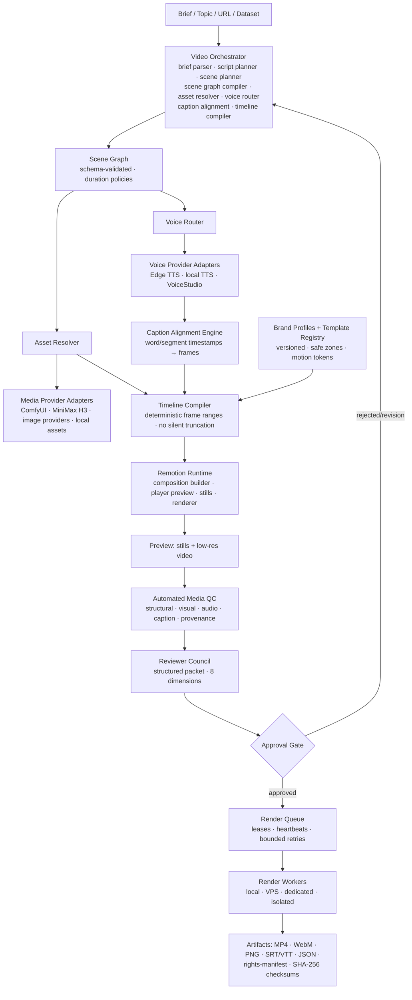

# Phase 20.88 — Pao-hubPro × Remotion AI Video Runtime

## Agent-Native Video-as-Code Production Engine, Dynamic Scene Graph, Frame-Synchronized Voice & Captions, Brand-Aware Template Registry, Multi-Format Rendering & Policy-Governed Media Production Pipeline

> **Project:** Pao-hubPro  
> **Phase:** 20.88  
> **Status:** Implementation Blueprint (restructured into the Pao-hubPro master 44-section blueprint)  
> **Priority:** High  
> **Mode:** Production-oriented / Provider-agnostic / Adapter-wrapped / Policy-governed / Fail-closed  
> **Primary upstream (reference only):** `https://github.com/Cuongyd196/remotion-cuongit-template` — **ADOPT THE PATTERN, NOT THE TEMPLATE AS THE PLATFORM CORE**; upstream `package.json` is `UNLICENSED`/`private` — architectural reference only until rights are verified  
> **Rendering engine:** Remotion (`remotion-dev/remotion`) — video-as-code, deterministic final-composition layer  
> **Target:** Pao-hubPro Media Production, Agent Runtime, MCP, Reviewer Council, Artifact Fabric  
> **Integration neighborhood:** Phase 20.13 (AI Gateway) → Phase 20.64 (vgpu) → Phase 20.74 (MCPProxy) → Phase 20.85 (OmniRoute) → Phase 20.87 (FileSync) → **Phase 20.88 (Remotion AI Video Runtime)**  
> **Core principle:** *Generative systems produce ingredients; Remotion provides the deterministic final assembly. Pao-hubPro retains ownership of orchestration, policy, providers, assets, approval, audit, and worker execution.*  
> **Source filename (preserved per master request §39):** `Phase_20.88_Pao-hubPro_x_Remotion_AI_Video_Runtime.md`  

---

### Verification & Decision Record (master request §1, §36, §38, §40)

**Verified against the attached source before restructuring:**
- Phase number and name: **20.88**, "Pao-hubPro × Remotion AI Video Runtime — Agent-Native Video-as-Code Production Engine, Dynamic Scene Graph, Frame-Synchronized Voice & Captions, Brand-Aware Template Registry, Multi-Format Rendering & Policy-Governed Media Production Pipeline" — matches the source title exactly. Source status was already "Implementation Blueprint" but not in the master 44-section format; this restructuring preserves every section's content.
- 40 source sections verified: executive summary (pattern extraction from a strong minimal reference: AI skill → 6-scene script → Edge TTS → audio duration → Remotion React scenes → composition registration → preview/render; target transformation: single six-scene template → agent-native, dynamic, auditable, brand-aware Video-as-Code runtime), why the phase exists (missing deterministic final assembly layer; generative systems don't guarantee 9:16 composition, deterministic typography, safe zones, frame-level timing, reproducible captions, brand identity, batch variations, multi-format export, repeatable rendering, approval-controlled assets), verified baseline (retain: video-as-code, AI-skill-driven generation, TTS via `edge-tts-universal`, audio-duration→frame conversion, short-video scene structure, mobile-first 1080×1920, preview/CLI rendering, reusable React scenes, agent-readable conventions; remove: fixed six-scene Hook→Pain→Solution→Workflow→Benefits→CTA architecture, partly hardcoded brand, approximate equal-duration subtitle chunking, MP3-parsed audio duration, absolute local paths in manifests, no first-class render queue, no provenance/rights manifest), objectives + non-goals (not Premiere/After Effects/DaVinci), core architecture diagram, video job state machine (17 states with idempotent/retry-safe/resumable requirements), dynamic scene graph (schema + 7 duration policies), timeline compiler (7 responsibilities + timing rule + no-silent-truncation law), true caption alignment engine (6 caption modes, standard caption record, AlignmentProvider interface, 5 adapter classes, 6 QC requirements), voice provider router (VoiceProvider interface, 4 initial adapters, 8 routing criteria), brand profile registry (YAML schema + 7 brand rules), template registry (metadata schema + 17 initial categories), asset intelligence layer (3 URI schemes `artifact://|workspace://|asset://`, asset record with provenance + rights), media provider integration (adapter rule: scene components receive resolved assets only — never raw fetches), multi-format composition (4 presets + responsive layout policy, no crop-only hacks), render queue (job structure, 10 worker-selection criteria, 4 retry classes), render worker contract (5-method interface, per-job isolation), preview pipeline (7-step sequence + 3 stills per scene), automated media QC (5 check families: structural, visual, audio, caption, provenance), Reviewer Council integration (structured review packet, 8 review dimensions), human approval gate (6 modes; recommended default: preview → QC → human approval → final render), database schema (8 tables), API design (`/api/video/v1`, 14 job + 7 registry endpoints), MCP tool registry (14 task + 6 registry + 6 admin tools; no generic `video.exec_shell`), skill registry (6 recommended skills), repository structure, environment configuration, security model (agent boundaries, 4 template trust levels, renderer isolation), provenance and license gate (upstream `UNLICENSED` — 6 rules + `rights-manifest.json`), observability (12 metrics, structured log fields, never-log rule), caching strategy (3 content-addressed cache key formulas), failure recovery (worker crash, provider failure, missing asset → REVISION_REQUIRED, invalid captions), implementation stages A–H, migration strategy (pattern extraction, 7 prohibitions incl. no hardcoded `CƯỜNG IT`/`DockerExplainer`), minimal first production slice (Thai "MCP คืออะไร" 9:16 vertical, 13 required artifacts), testing strategy (unit/contract/golden-render/E2E), acceptance checklist (7 families), definition of done (14 conditions), next integrations, `/gold` one-shot Codex command (40 requirements + security/policy + quality gates + documentation + final report), source references, final phase decision.
- No capability removed, truncated, or assumed. The upstream repository's license status (`UNLICENSED`, `private`) is carried forward verbatim as an unresolved rights constraint.

**⚠ Phase numbering registry update:**
- **20.88** is officially assigned to this phase (Pao-hubPro × Remotion AI Video Runtime). No collision in the current corpus.
- Standing ledger: **20.65** Litho-vs-Context-Mode collision remains unresolved (user decision pending). Displaced recommendations *Business Opportunity Intelligence* and *Revenue Intelligence* — previously parked at "20.88+" — are **now displaced to 20.89+** because 20.88 is occupied by this phase.

**Implementation status annotation (2026-09-18):** NOT YET IMPLEMENTED in the Pao-hubPro repository (no `video-*` packages, no `video.*` MCP namespace, no `video_jobs` tables). Integration surfaces that already exist: Phase 20.74 MCPProxy (tool gating), Phase 20.85 OmniRoute (provider routing precedent), Phase 20.87 FileSync (artifact transfer — specified), Reviewer Council + Correlation Guard (implemented), ComfyUI/Audio providers (existing phases). The reference repository's own `remotion-topic-explainer` skill pattern is the workflow seed.

**R0–R4 mapping note (decision):**
- The source defines governance through approval modes, template trust levels (`UNTRUSTED/SANDBOXED/REVIEWED/TRUSTED`), rights gates, and QC gates rather than a numeric risk scale. Decision mapping onto R0–R4:
  - **R0 (Read-only):** `video.get_job`, `video.get_render_status`, `video.list_artifacts`, `video.list_templates`, `video.get_template`, `video.list_brand_profiles`, `video.get_brand_profile`, `video.list_render_presets`, `video.list_voice_profiles`, registry/worker reads, metrics.
  - **R1 (Low-risk local action):** `video.create_job`, `video.plan_scenes`, `video.align_captions`, `video.compile_timeline` (pure computation over validated data), skill invocations (`video-topic-explainer` planning phase).
  - **R2 (Reversible write):** `video.generate_assets` / `video.generate_voice` via approved adapters (bounded budget), `video.create_preview`, `video.run_qc`, cache writes, QC report persistence — all reversible, auditable, within approved provider policy.
  - **R3 (Sensitive operation — approval recommended):** `video.queue_render` (final render gate), `video.request_approval`, `video.register_template` / `video.update_template` (trust promotion REVIEWED), `video.register_brand_profile`, `video.register_worker` / `video.disable_worker`, `video.override_qc` (operator-gated).
  - **R4 (Destructive / privileged / external impact):** external social publishing (explicitly out of scope — separate permission gate), bypassing rights/provenance gates, promoting UNTRUSTED templates to TRUSTED without review, disabling the approval gate for commercial deliverables.
- Policy-enum mapping:
  - **ALLOW:** task-level MCP tools operating on schema-valid data, TRUSTED templates, assets with `rights.status: reviewed` + `commercialAllowed: true`, cache hits with valid provenance/policy state.
  - **DENY:** generic `video.exec_shell` (never exposed), assets with unresolved rights in commercial profiles, silent media substitution, silent voice truncation, absolute paths in portable manifests, secrets in scene props/manifests/logs, UNTRUSTED templates in ordinary production rendering.
  - **REQUIRE_APPROVAL:** final render (default mode `after-qc`), template trust promotion, QC override, rights-unresolved asset usage.
  - **QUARANTINE:** UNTRUSTED templates — sandboxed preview in isolated workers only; missing-asset jobs → `REVISION_REQUIRED` (never silent placeholder).

---

## 1. Executive Summary

Phase 20.88 upgrades the useful ideas from the `remotion-cuongit-template` reference repository into a production-grade, provider-agnostic **video subsystem** for Pao-hubPro. The reference demonstrates a strong minimal pattern — AI skill → 6-scene script → Edge TTS → audio duration measurement → Remotion React scenes → composition registration → preview/render — and Phase 20.88 must not stop at cloning it. The goal is to extract the pattern and turn it into a reusable **video production control plane**:

```text
Topic / Brief / URL / Dataset
  → Content Planner → Scene Graph
  → Visual Assets + Voice + Brand (parallel)
  → Timeline Compiler → Remotion Composition
  → Preview Render → Automated Media QC
  → Reviewer Council Gate → Render Queue
  → Local / VPS / Worker / GPU Node
  → MP4 / WebM / Still / Thumbnail / Captions
```

The key transformation: **from a single six-scene template into an agent-native, dynamic, auditable, brand-aware Video-as-Code runtime.** Remotion becomes the deterministic final-composition and rendering layer while Pao-hubPro retains ownership of orchestration, policy, providers, assets, approval, audit, and worker execution.

## 2. Problem Statement

Pao-hubPro already has or plans multi-provider AI routing, ComfyUI image generation, MiniMax H3 and AI video generation, audio/voice systems, agent skill registries, MCP tool governance, Reviewer Council, policy/approval gates, remote workers, artifact transfer, and automation workflows. What is still missing is a **deterministic final assembly layer**: generative systems are excellent at producing ingredients but do not by themselves guarantee exact 9:16 composition, deterministic typography, safe zones, frame-level timing, reproducible captions, consistent brand identity, batch variations, multi-format export, repeatable rendering, or approval-controlled publishing assets. Without this layer, every video is a bespoke manual edit; with it, video becomes code and data rather than an opaque editor project.

The reference template also carries structural limitations that must be removed: a fixed six-scene architecture, partly hardcoded branding, approximate equal-duration subtitle chunking (not word-level alignment), MP3-parsed audio duration (not authoritative probing), absolute local paths leaking into manifests, no first-class render queue, and no provenance/rights manifest.

## 3. Goals

Build a Pao-hubPro subsystem that can: receive a video brief; generate or accept a script; construct a dynamic scene graph; route image/video/audio generation jobs; create synchronized voice and captions; compile scenes into a Remotion composition; preview and automatically inspect the result; request approval when policy requires it; render on available workers; export multiple aspect ratios and formats; and preserve complete job provenance.

## 4. Non-Goals

Phase 20.88 does NOT replace Adobe Premiere Pro, After Effects, DaVinci Resolve, or full nonlinear manual editing. It provides a **programmatic production runtime** for repeatable and automatable media. Additional non-goals (from the migration rules): no hardcoded `DockerExplainer` assumption, no hardcoded `CƯỜNG IT` branding, no fixed 6-scene requirement, no absolute local file paths in manifests, no provider-specific code inside scene components, no silent network fetch during final render, no source adoption without license/provenance review, and no social publishing within this phase unless a separate permission explicitly authorizes it.

## 5. Why This Phase Exists

The platform's ingredient generators (image models, video models, TTS, LLM scripts) are probabilistic; the delivery contract (exact aspect ratio, brand typography, caption timing, safe zones, frame-accurate CTA) is deterministic. Remotion is the correct final-assembly engine because video-as-code makes the composition reviewable, versionable, cache-keyable, and agent-writable — the same properties that make infrastructure-as-code governable. Phase 20.88 closes the loop: generative ingredients flow through a policy-governed orchestration layer into a deterministic composition engine, then through QC and approval gates before any expensive final render.

## 6. Relationship to Pao-hubPro (and Existing Phases)

- **Phase 20.74 MCPProxy:** the `video.*` tool namespace (14 task + 6 registry + 6 admin tools) registers through MCPProxy; administrative tools require elevated policy; no generic shell tool exists.
- **Reviewer Council (implemented):** evaluates a structured review packet (brief, script, scene graph, preview, stills, captions, QC report, rights manifest) across 8 dimensions — the video runtime consumes the existing council rather than building a second reviewer system.
- **Phase 20.85 OmniRoute:** precedent for provider adapters and policy envelopes; voice/asset provider routing follows the same governance style.
- **Phase 20.87 FileSync (specified):** rendered artifacts move between workers/nodes through the artifact transfer fabric.
- **ComfyUI / MiniMax H3 / VoiceStudio:** consumed exclusively through provider adapters; scene components receive resolved `artifact://` URIs, never raw fetches.
- **Layer mapping (master §5):** 02 AI/Agent Layer (skills), 03 Intent & Context (brief parser), 04 Orchestration (Video Orchestrator), 06 Capability Registry (templates/brands/presets), 07 Policy Engine, 08 Approval, 09–11 Execution (render workers), 12 State (job/artifact persistence), 14 Secrets, 16 Observability, 17 Audit, 19 Dashboard.

## 7. Upstream / External Project

- **A. Upstream (reference only):** `Cuongyd196/remotion-cuongit-template` — study for architecture and workflow ideas only; do NOT vendor or copy its source. `package.json` marks the project **`UNLICENSED` and `private`**; its README describes shared learning/community intent and points to Remotion's special license terms. Therefore: (1) do not assume the upstream source can be redistributed under an OSS license; (2) use it as an architectural reference unless rights are verified; (3) maintain a dependency and source provenance manifest; (4) preserve attribution where required; (5) verify Remotion license applicability (company-scale rendering) before commercial deployment; (6) reject unknown third-party media in production when policy requires commercial-safe assets. Recommended artifact: `rights-manifest.json` per video (`components[{type: runtime, name: remotion, version: 4.x, licenseStatus: review-required}], assets[], status: pending-review`).
- **B. Pao-hubPro Adapter:** Video Orchestrator, provider adapters (Edge TTS, local TTS, VoiceStudio, ComfyUI, MiniMax H3), template/brand registries, render queue/workers.
- **C. Policy Wrapper:** approval modes, template trust levels, rights/provenance gates, renderer isolation.
- **D. Extensions:** multi-format composition, versioning skills, QC families, content-addressed caching.
- **Rendering engine:** Remotion (`remotion-dev/remotion`) — license applicability for Pao-hubPro's commercial usage is a required pre-production verification item.

## 8. Current-State Assumptions

- **NOT implemented in the repo** (verified 2026-09-18): no `video-*` packages, `video.*` MCP tools, or `video_jobs` tables exist. Everything in this blueprint is to be built.
- Pao-hubPro runtime is Bun-native TypeScript with SQLite (`agent-os.sqlite3` v56); the source gives PostgreSQL-style DDL — **Assumption:** implement against the existing SQLite layer with schema parity, keeping the DDL as the canonical reference *(Needs Verification at implementation time)*.
- Remotion renders via headless Chromium; worker nodes require Chromium availability + installed fonts *(worker-selection criteria include these)*.
- Edge TTS (`edge-tts-universal`) is the reference voice adapter; Thai voice (`th-TH-PremwadeeNeural`) is the vertical-slice target; production policy may substitute VoiceStudio/local adapters *(Needs Verification — keep the interface provider-agnostic)*.
- FFprobe (or an approved media metadata service) is assumed available for authoritative audio/video duration probing on production workers; MP3 parsing remains a template-grade fallback.
- ComfyUI (Phase 19/20.1) and MiniMax H3 (Phase 20.14) integrations exist for asset generation; Phase 20.87 FileSync (specified) will carry artifacts between nodes.

## 9. Target Architecture

Five layers, strictly ordered:

```text
+-------------------------------------------------------------------+
| Pao-hubPro: Video Job API | Agent Router | Policy | Approval      |
+-------------------------------------------------------------------+
| VIDEO ORCHESTRATOR                                                |
|  Brief Parser → Script Planner → Story/Scene Planner              |
|  → Scene Graph Compiler → Asset Resolver → Voice Router           |
|  → Caption Alignment → Timeline Compiler                          |
+--------------------------+----------------------------------------+
             +------------+------------+
             v                         v
| Template/Brand Layer |     | Media Provider Layer |
| Template Registry,         | ComfyUI, MiniMax H3, |
| Component Registry,        | Image providers,     |
| Brand Profiles, Motion     | Voice providers,     |
| Tokens, Safe Zones         | Local assets         |
             +------------+------------+
                           v
| REMOTION RUNTIME: Composition Builder | Player Preview |
| Still Renderer | Renderer                                         |
+-------------------------------------------------------------------+
| QC LAYER: Visual QA | Audio QA | Caption QA | Policy | Rights |   |
| Brand QA                                                          |
+-------------------------------------------------------------------+
| REVIEWER COUNCIL: AI review → deterministic checks → human        |
+-------------------------------------------------------------------+
| RENDER SCHEDULER: Local Worker | VPS Worker | Dedicated | Cloud   |
+-------------------------------------------------------------------+
| ARTIFACT OUTPUT: MP4 | WebM | PNG | JPG | SRT | VTT | JSON |      |
| Manifest | Checksums                                              |
+-------------------------------------------------------------------+
```

Key architectural laws: scene components receive **resolved assets only** (`<ImageScene assetUri="artifact://ast_01J..." />` — never raw provider fetches inside scene code); all branding is declarative data (BrandProfile registry); all timing is computed by the Timeline Compiler (never hardcoded); providers are consumed through adapters only.

## 10. Architecture Diagram



## 11. Core Components

1. **Video Orchestrator** — Brief Parser → Script Planner → Story/Scene Planner → Scene Graph Compiler → Asset Resolver → Voice Router → Caption Alignment → Timeline Compiler; owns the 17-state job lifecycle.
2. **Dynamic Scene Graph** — schema-validated, generic (never a hardwired six-component tree): `{videoId, fps, aspect, scenes[{id, role, template, voiceText, visual{kind,...}, durationPolicy}]}`; duration policies: `voice-driven, fixed, asset-driven, beat-driven, minimum, maximum, hybrid` (with `minimumFrames/maximumFrames/voicePaddingFrames`).
3. **Timeline Compiler** — normalizes FPS, resolves audio duration authoritatively, resolves transition duration, maps caption timestamps to frames, allocates lead-in/tail padding, prevents scene overlap, validates media lengths, computes final composition duration. Timing rule: `startFrame(scene[n]) = endFrame(scene[n-1]) − transitionOverlap; voiceFrames = ceil(voiceDurationSeconds × fps); sceneFrames = clamp(max(voiceFrames + tailPadding, minFrames), minFrames, maxFrames)`. **No silent truncation:** if speech exceeds allowed duration → request script compression, adjust voice rate within safe limits, split the scene, or fail validation.
4. **True Caption Alignment Engine** — the largest upgrade over the reference: modes `sentence, segment, word, karaoke-highlight, semantic-phrase, single-line-short-video`; standard record `{word, startMs, endMs, startFrame, endFrame, confidence}`; `AlignmentProvider` interface (`align({audioUri, transcript, language})`) with adapters: provider-native speech marks, Whisper timestamp pipeline, forced-alignment engine, Edge TTS metadata (when available), fallback segment timing. QC: no caption exceeds safe width/outside safe zone; no negative or out-of-scene timestamps; monotonic ordering; text reconciles with script within tolerance.
5. **Voice Provider Router** — `VoiceProvider {providerId, capabilities{languages, timestamps, ssml, streaming}, synthesize(request)}`; initial adapters: Edge TTS, Local TTS, VoiceStudio, future externals; routing on language, voice identity, cost, latency, timestamp support, availability, policy, license/usage rights.
6. **Brand Profile Registry** — declarative YAML (`id, name, version, logoAsset: asset://…, fonts, colors, motion.springPreset, captions{maxLines, safeBottomPx}, platformSafeZones{tiktok, youtubeShorts, reels}`); rules: logo never embedded by literal filesystem path; colors from tokens; minimum logo margin; caption/CTA zones cannot collide; per-brand motion presets; optional intro/outro; channel identity separate from template identity.
7. **Template Registry** — a template is a reusable **scene role implementation**, not a full video: `{id, version, category, engine: remotion, supportedAspects, minFrames, maxFrames, propsSchema, license{status, commercialAllowed}}`; initial categories: hook, title, quote, problem, comparison, before-after, timeline, workflow, numbered steps, stat card, product card, image focus, video focus, diagram, testimonial, CTA, outro.
8. **Asset Intelligence Layer** — portable URI schemes (`artifact://<id>`, `workspace://<ws>/<path>`, `asset://<registry>/<id>` — **never absolute machine paths in manifests**); asset record `{id, type, mime, sha256, width, height, source{kind, provider, jobId}, rights{status, commercialAllowed}}`.
9. **Media Provider Layer** — ComfyUI, AI image providers, MiniMax H3 video, local user assets, generated charts/SVG — all through adapters; the Provider Router matches scene asset requirements to providers.
10. **Multi-Format Composition System** — presets `shorts-9x16 (1080×1920@30), landscape-16x9 (1920×1080@30), square-1x1 (1080×1080@30), preview-low (540×960)`; layout policy: semantic layout → aspect adapter → layout constraints → platform safe zone → final geometry (never crop-only).
11. **Render Queue + Workers** — persistent job structure `{id, videoId, compositionId, preset, priority, status, attempt, maxAttempts: 3, requirements{cpuCores, memoryMb, gpu}}`; worker selection on health, CPU, RAM, GPU, installed fonts, Chromium availability, code-bundle version, asset locality, queue depth, trust level; worker contract `heartbeat/prepare/render/cancel/cleanup`; per-job working directories + explicit artifact mounts.
12. **Preview Pipeline** — compile → typecheck → composition schema validation → representative stills (first meaningful / midpoint / final meaningful frame per scene) → low-resolution preview → automated visual QA → review gate → final render. Full render is never the first validation artifact.
13. **Automated Media QC** — five families: **structural** (composition loads, no missing assets, no React errors, valid frame count, duration within policy, dimensions/FPS correct, audio track present); **visual** (text bounds, safe zones, clipping, black frames, blank scenes, logo presence, caption/CTA overlap, minimum font size, image resolution); **audio** (silence %, clipping/peaks, duration mismatch, missing voice, dead air, late start, overflow); **caption** (transcript similarity, timestamp order, line length, safe area, timing gaps, alignment confidence); **provenance** (unknown source asset, missing hash, unresolved rights, missing attribution, license gate failures).
14. **Reviewer Council Integration** — structured review packet `{videoId, brief, script, sceneGraph, previewUri, stills, captions, qcReport, rightsManifest}`; 8 review dimensions: factual consistency, visual clarity, brand compliance, caption readability, pacing, asset relevance, rights/provenance completeness, technical output validity; council reports findings + recommended corrections; policy decides auto-correction vs human approval.

## 12. Component Responsibilities

| Component | Owns | Must never |
| --- | --- | --- |
| Orchestrator | 17-state job lifecycle, stage sequencing | skip QC/approval stages |
| Scene Graph | schema-valid scene topology | hardcode six scenes or provider code |
| Timeline Compiler | deterministic frame math | silently truncate speech or overlap scenes |
| Alignment Engine | timestamp→frame mapping | claim word sync from equal-duration chunking |
| Voice Router | provider-agnostic synthesis | couple providers into scene code |
| Brand/Template Registries | versioned declarative identity/roles | allow literal paths or unversioned branding |
| Asset Resolver | provenance-complete URIs | hand raw fetches to scene components |
| Render Queue | leases, heartbeats, bounded retries | lose jobs on worker crash |
| Render Workers | isolated rendering | unrestricted FS/network/secret access |
| QC Layer | five check families, machine-readable reports | pass unknown-provenance assets |
| Approval Gate | policy-controlled blocking | auto-promote UNTRUSTED templates |

## 13. Data Flow

```text
brief → script → scene graph (validated) 
  → parallel: asset jobs (ComfyUI/MiniMax/local) + voice jobs (Edge TTS/VoiceStudio)
  → alignment (timestamps) → timeline compilation (frames) 
  → Remotion composition (props-driven) → preview (stills + low-res)
  → QC (5 families → report artifact) → Reviewer Council packet
  → approval (policy-controlled) → render queue → worker (isolated, offline)
  → artifacts (MP4/WebM/stills/SRT/VTT/JSON + rights-manifest + SHA-256 checksums)
```

Every stage emits structured events carrying `video_job_id, scene_id, render_job_id, worker_id, provider_id, request_id, artifact_id`.

## 14. Control Flow (+ R0–R4 Mapping)

```text
Request → Identity → Policy Evaluation (approval mode, rights gates)
→ Job Creation (schema-validated) → Stage Execution (planning → assets → voice → 
  alignment → compile → preview → QC) → Risk Classification (trust level, rights state)
→ Approval Check (mode: never | risk-based | after-qc | before-final-render | 
  before-export | always) → Render Queue → Worker Execution → Verification → Audit
```

| Operation | Risk | Enum |
| --- | --- | --- |
| Job/registry reads, render-status queries | R0 | ALLOW |
| create_job, plan_scenes, align_captions, compile_timeline | R1 | ALLOW |
| generate_assets/voice (approved adapters, budgeted), create_preview, run_qc | R2 | ALLOW (audited) |
| queue_render (final), request_approval, register/update_template, register_brand_profile, register/disable_worker, override_qc | R3 | REQUIRE_APPROVAL |
| rights-gate bypass, external publishing, UNTRUSTED→TRUSTED promotion, approval-gate disable for commercial deliverables | R4 | DENY unless explicitly human-approved |

## 15. Agent / Worker Model

- **Video Orchestrator** = worker (state machine owner; DB-backed; restart-safe).
- **Render Workers** = isolated executors implementing `RenderWorker {heartbeat, prepare, render, cancel, cleanup}`; per-job temp directories; restricted artifact mounts; network disabled by default during final render; allowlisted fonts; no secrets in renderer environment; CPU/memory/runtime limits; post-job cleanup. Workers have no unrestricted filesystem access.
- **Provider Adapters** = workers for asset/voice generation (budget-bounded, policy-checked).
- **Reviewer Council** = review consumers of the structured packet.
- **Human Operator** = approval authority; template trust promotion; QC override.
- Separations (master §8): *Agent* creates jobs via tools; *Worker* renders; *Task/Job* = VideoJob; *Run* = RenderJob attempt; *Artifact* = hash-addressed media. Agents may create job definitions, request approved tools, select registered templates, request render jobs; agents may NOT execute unrestricted shell, read arbitrary local files, register arbitrary React code as trusted templates, bypass rights/approval, or publish externally.

## 16. Session / State Model

17-state persistent state machine:

```text
DRAFT → PLANNING → SCENE_GRAPH_READY → ASSET_GENERATION → VOICE_GENERATION
→ ALIGNMENT → TIMELINE_COMPILED → PREVIEW_RENDERING → QC_PENDING
  ├→ QC_FAILED → REVISION_REQUIRED ↺
  └→ APPROVAL_PENDING ├→ REJECTED ↺ └→ RENDER_QUEUED → RENDERING
      ├→ RENDER_FAILED → RETRY / MANUAL_REVIEW └→ EXPORTING → COMPLETED
```

Required properties: idempotent transitions; retry-safe worker execution; resumable failed jobs; **no hidden state in local folders** (all state in DB + artifacts); full event history (`video_job_events`); deterministic artifact references. Render jobs additionally carry `attempt/maxAttempts (default 3), worker_id, lease` — a crashed worker's lease expires and the scheduler returns the job to the queue for another compatible worker, preserving event history.

## 17. MCP Integration

Namespace `video` — task-level tools only; **no generic `video.exec_shell`**:

- **Task tools (14):** `video.create_job, get_job, plan_scenes, generate_assets, generate_voice, align_captions, compile_timeline, create_preview, run_qc, request_approval, queue_render, get_render_status, list_artifacts, cancel_job`.
- **Registry tools (6):** `video.list_templates, get_template, list_brand_profiles, get_brand_profile, list_render_presets, list_voice_profiles`.
- **Administrative (6, elevated policy):** `video.register_template, update_template, register_brand_profile, register_worker, disable_worker, override_qc`.

Risk tiers: registry/status tools R0; planning/compile R1; generation/preview/QC R2; render-queue/approval/admin R3; no R4 surface exposed to agents. Registered through Phase 20.74 MCPProxy with the same policy path as REST/UI.

## 18. Capability Registry

- **Template Registry:** versioned scene-role implementations (17 initial categories, §11.7) with trust status, props schema, aspect support, frame bounds, and license status.
- **Brand Profile Registry:** versioned declarative brand identity (§11.6).
- **Render Presets:** `shorts-9x16, landscape-16x9, square-1x1, preview-low`.
- **Voice Provider Registry:** capabilities per adapter (languages, timestamps, SSML, streaming).
- **Skills (Pao-native, not provider `.claude/skills`):** `video-topic-explainer` (topic/language/durationTargetSec/brandProfile/aspect → validated job + plan + preview + QC + optional approved render), `video-from-brief`, `video-from-assets`, `video-versioning` (platform/brand variants from an approved master scene graph), `video-qc-review`, `video-template-author` (sandboxed engineering workflow; requires code review before registration).

## 19. Policy Model

- **Approval modes:** `never, risk-based, after-qc, before-final-render, before-export, always`. Initial rollout default: **preview → QC → human approval → final render**; later, trusted templates may use risk-based auto-approval.
- **Template trust levels:** `UNTRUSTED` (imported/generated/not reviewed) → `SANDBOXED` (isolated-worker preview only) → `REVIEWED` (passed code + security review) → `TRUSTED` (approved for normal production). Untrusted templates can never become trusted automatically.
- **Rights gate:** every asset carries `rights{status, commercialAllowed}`; unknown provenance can block production; `rights-manifest.json` per video with component licenses (Remotion = `review-required` until verified).
- **Timing law:** no silent truncation; no silent media substitution; caption fallback modes explicit and recorded.
- **Content-addressed caching law:** TTS key `hash(provider+voice+text+rate+pitch+format)`; asset key `hash(provider+model+prompt+seed+generation_config)`; render key `hash(code_bundle_hash + scene_graph_hash + artifact_hashes + brand_profile_version + render_preset)`; **a cache hit is valid only if provenance and policy state are still acceptable.**

## 20. Security Model

- **Agent boundaries:** agents create job definitions, request approved tools, select registered templates, request render jobs; they may NOT execute unrestricted shell commands, read arbitrary local files, register arbitrary React code as trusted templates, bypass rights checks, bypass approval policy, or publish externally without separate publishing permission.
- **Template trust:** UNTRUSTED code previews only in sandboxed workers; REVIEWED requires code + security review; only REVIEWED/TRUSTED enter ordinary production rendering.
- **Renderer isolation:** per-job temp directory; restricted artifact mounts; network disabled by default during final render (assets resolved beforehand); allowlisted fonts; no secrets in the renderer environment; CPU/memory/runtime limits; cleanup after completion.
- **Secrets:** never embedded in scene props, manifests, or render logs; resolved via the Pao-hubPro secret layer at adapter execution only.

## 21. Approval Model

Six configurable modes (§19); default `after-qc` with human approval before final render. Approval records persist in `video_approvals` (`approval_type, status, reviewer_id, comment, evidence_json, decided_at`) and are auditable. Final render blocks until approval when policy requires; rejected jobs return to `REVISION_REQUIRED`. The Council's findings feed the approval decision; policy determines whether auto-correction is permitted or human approval is required.

## 22. Failure Handling

Four retry classes — only actually-retryable classes retry:

| Class | Examples | Policy |
| --- | --- | --- |
| TRANSIENT | network timeout, worker disconnect, provider unavailable | retry with exponential backoff; provider fallback only if semantic + policy constraints permit (fallback recorded in provenance) |
| RESOURCE | out of memory, insufficient disk | reschedule on capable worker; no infinite retry |
| CONTENT | invalid composition, missing asset, invalid schema | REVISION_REQUIRED — **never render with a silent placeholder** unless the template explicitly permits a documented fallback |
| POLICY | approval missing, rights unresolved | block; no retry until policy satisfied |

Specific recoveries: **worker crash** → lease expiry → job returned to queue → retry on compatible worker → event history preserved; **missing asset** → `REVISION_REQUIRED`; **invalid captions** → regenerate alignment, fallback to segment captions only when policy allows, record degraded mode; **provider failure** → bounded retry + policy-permitted fallback.

## 23. Recovery Model

- Persistent state machine: jobs survive process restarts; no hidden local-folder state.
- Render leases: expired leases return jobs to the queue automatically.
- Cache recovery: content-addressed caches are rebuildable; hits revalidated against provenance/policy.
- Artifact integrity: every output has SHA-256; checksum manifest shipped with deliverables.
- License/provenance recovery: `rights-manifest.json` reconstructable from asset records; unresolved items re-enter review rather than silently shipping.

## 24. Observability

Metrics: `video_jobs_total, video_jobs_completed_total, video_jobs_failed_total, video_planning_duration_ms, video_asset_generation_duration_ms, video_voice_generation_duration_ms, video_preview_render_duration_ms, video_final_render_duration_ms, video_render_queue_depth, video_render_retry_total, video_qc_failure_total, video_approval_wait_duration_ms`. Structured logs include (when applicable) `video_job_id, scene_id, render_job_id, worker_id, provider_id, request_id, artifact_id`. **Never log secrets or full credential values.**

## 25. Audit

Every state transition, provider call, approval decision, render attempt, and artifact finalization emits an audit event (persisted in `video_job_events` + the repo audit store). Audit answers: who created/approved/rejected; which provider/job produced each asset; which template version rendered; which worker executed; what QC found; what rights state gated the render. Secrets never enter audit payloads; rights-manifest and QC reports are retained as artifacts for the retention window.

## 26. Data Model

Eight PostgreSQL-style tables (adapt to the repo's SQLite layer with schema parity):

```sql
video_jobs       (id, workspace_id, title, status, brief_json, brand_profile_id,
                  target_language, created_by, created_at, updated_at)
video_scenes     (id, video_job_id, scene_index, role, template_id, content_json,
                  timing_json, UNIQUE(video_job_id, scene_index))
media_assets     (id, workspace_id, asset_type, mime_type, uri, sha256,
                  metadata_json, provenance_json, rights_json)
voice_artifacts  (id, video_job_id, scene_id, provider_id, voice_id, audio_asset_id,
                  duration_ms, alignment_asset_id, config_json)
render_jobs      (id, video_job_id, preset_id, composition_id, status, priority,
                  attempt, max_attempts, worker_id, output_asset_id, error_json)
video_qc_reports (id, video_job_id, render_job_id, status, findings_json, metrics_json)
video_approvals  (id, video_job_id, approval_type, status, reviewer_id, comment,
                  evidence_json, decided_at)
video_job_events (id, video_job_id, event_type, payload_json, created_at)
```

All new tables are additive; no existing schema is altered. `media_assets.provenance_json` carries `{kind, provider, jobId}`; `rights_json` carries `{status, commercialAllowed}`.

## 27. API / Event Contracts

Namespace `/api/video/v1`. **Job endpoints (14):** `POST /jobs`, `GET /jobs/:id`, `POST /jobs/:id/plan|generate-assets|generate-voice|compile|preview|qc|approve|render|cancel`, `GET /jobs/:id/artifacts`, `GET /jobs/:id/events`. **Registry endpoints (7):** `GET /templates`, `/templates/:id`, `/brands`, `/brands/:id`, `/render-presets`, `/voice-providers`, `/workers`. MCP tools mirror the API (§17). Events: `video.job.created, video.job.planned, video.assets.ready, video.voice.ready, video.alignment.completed, video.timeline.compiled, video.preview.ready, video.qc.completed, video.qc.failed, video.approval.requested/decided, video.render.queued/started/failed/completed, video.artifacts.finalized`. Contracts carry `request_id, video_job_id, actor_id, status, result, error, created_at`; control plane (policy/approval) separated from execution plane (workers).

## 28. Configuration

```env
VIDEO_DEFAULT_FPS=30
VIDEO_DEFAULT_ASPECT=9:16
VIDEO_DEFAULT_BRAND=pao-hubpro
VIDEO_PREVIEW_PRESET=preview-low
VIDEO_RENDER_MAX_ATTEMPTS=3
VIDEO_WORK_ROOT=/var/lib/pao-hubpro/video-jobs

EDGE_TTS_VOICE=th-TH-PremwadeeNeural
EDGE_TTS_RATE=+0%
EDGE_TTS_PITCH=+0Hz

VIDEO_REQUIRE_APPROVAL=true
VIDEO_REQUIRE_RIGHTS_CHECK=true
VIDEO_ALLOW_UNVERIFIED_ASSETS=false
```

Example values only; use the existing Pao-hubPro secret manager where available. Secrets must not be embedded in scene props, manifests, or render logs. Configuration validates at load; security-relevant values never silently fall back.

## 29. Feature Flags

`video_runtime.enabled` (master), `video_preview_enabled`, `video_render_queue_enabled`, `video_auto_approval` (default false — risk-based later), `video_rights_gate_enforced` (default true), `video_template_sandbox_enabled`, `video_edge_tts_adapter` (policy-permitted first adapter), `video_mcp_tools_enabled`. Risky features default disabled; approval and rights gates default enabled; every flag is an immediate-rollback lever.

## 30. Repository Structure

```text
packages/
  video-core/        # jobs, scene-graph, timeline, captions, schemas
  video-remotion/    # Root.tsx, compositions, renderer, player
  video-templates/   # registry.ts, hook/, comparison/, workflow/, stats/,
                     # image/, video/, cta/
  video-brand/       # registry.ts, safe-zones.ts, tokens.ts
  video-audio/       # providers/ (edge-tts.ts, local.ts), alignment/, normalize/
  video-assets/      # resolver/, provenance/, rights/
  video-render/      # queue/, scheduler/, workers/, presets/
  video-qc/          # structural/, visual/, audio/, caption/, policy/
  video-mcp/         # tools/, resources/
  video-skills/      # video-topic-explainer/, video-from-brief/,
                     # video-versioning/, video-qc-review/
workers/remotion-render-worker/
schemas/             # video-job, scene-graph, template, brand-profile,
                     # render-job (JSON Schema)
apps/web, apps/api   # dashboard + API per repo conventions
```

Adapted to the Bun monorepo at implementation time (master §18: inspect repo first; no duplicate infrastructure where an equivalent abstraction exists).

## 31. Dashboard Integration

Pao-hubPro GUI gains a **Video Production** surface: job creation from brief (skill-driven), scene-plan review before final render, cheap preview playback (Remotion Player), QC findings display (five families with severities), approval/reject actions with evidence, artifact download (MP4/stills/SRT/VTT/checksums), render-queue status with worker visibility, template/brand registry browsers. Follows repo GUI conventions (i18n nav keys across locales, management-API-only data access, no secrets rendered).

## 32. Dependencies

**Required:** Pao policy/approval/audit core; DB layer; artifact storage with SHA-256; Remotion runtime + headless Chromium on render workers.
**Recommended:** ComfyUI (image assets), MiniMax H3 (video assets), VoiceStudio/Edge TTS (voice), Reviewer Council (gates), Phase 20.87 FileSync (artifact distribution to workers/nodes), Phase 20.74 MCPProxy (tool governance).
**Optional:** Whisper/forced-alignment engines (caption precision), cloud render nodes (future), semantic search over asset registry.
**Standalone path:** the runtime works with Edge TTS + local assets + a single local worker — no external video/image provider is required for the vertical slice; provider adapters are additive.

## 33. Compatibility

- **Pattern adoption, not template adoption:** behavior/pattern extraction from the reference repo (TTS workflow concept, scene composition concept, short-form layout ideas, skill-driven workflow ideas) into a Pao-hubPro native implementation. Rules: no hardcoded `DockerExplainer`; no hardcoded `CƯỜNG IT`; no fixed 6-scene requirement; no absolute local paths; no provider-specific code in scene components; no silent network fetch during final render; no source adoption without license/provenance review.
- Remotion is isolated as the composition/rendering engine; future changes in image, video, TTS, and AI providers never rewrite the rendering system.
- Additive schema only; existing phases untouched; migration notes document which concepts came from the reference and what was reimplemented or generalized.

## 34. Migration

Staged (source §32): **Stage A Foundation** (packages + schemas, VideoJob state machine, SceneGraph schema, BrandProfile + Template registries, port one safe reference template) → **Stage B Voice & timing** (Edge TTS adapter, authoritative duration probing, alignment abstraction, timestamps→frames, remove absolute-path dependencies) → **Stage C Remotion runtime** (generic Root/composition registration, props-driven loading, dynamic scenes, responsive aspect adapters, low-res preview) → **Stage D Render queue** (persistent jobs, local worker, heartbeats/leases, retries, cancellation, artifact finalization) → **Stage E QC & approval** (structural QC, still-frame QA, caption QA, provenance gate, Council packet, human workflow) → **Stage F Provider integration** (ComfyUI, MiniMax/external video, VoiceStudio, generic resolver) → **Stage G MCP & skills** (task-level tools, Pao-native skills, policy scopes, audit events) → **Stage H Production hardening** (sandbox worker, offline deterministic render mode, resource constraints, observability, backup/cleanup, load testing, dependency/license inventory).

## 35. Rollback

- `video_runtime.enabled=false` → subsystem inert; no jobs, no tools, no dashboard surface.
- Final-render blocking is policy-driven — flipping `VIDEO_REQUIRE_APPROVAL=false` changes gate behavior without redeploy (where config allows).
- Render-worker rollback: revert pinned worker image tags; queue jobs re-schedule onto healthy workers.
- Failed renders: attempts bounded (`maxAttempts 3`); `MANUAL_REVIEW` on persistent CONTENT/POLICY failures.
- DB rollback: additive tables; backward-compatible ≥1 version. Cache rollback: content-addressed entries are safely purgeable; provenance revalidation prevents stale hits.
- License/provenance rollback: unresolved Remotion licensing blocks commercial deployment until resolved — never silently shipped.

## 36. Testing Strategy

- **Unit (§35.1):** frame calculations, duration clamping, caption timestamp→frame conversion, registry lookups, scene schema parsing, cache-key stability, job state transitions.
- **Contract (§35.2):** every provider adapter passes a shared suite — `VoiceProviderContract, AlignmentProviderContract, AssetProviderContract, RenderWorkerContract`.
- **Golden render (§35.3):** small deterministic compositions compared on dimensions, frame count, selected reference stills, metadata, captions — no pixel-perfect equality required for nondeterministic generated imagery.
- **E2E (§35.4):** create → plan → synthesize voice → align → compile → preview → QC → approve → render → verify artifacts.
- **Vertical slice (§34):** Thai brief "MCP คืออะไร", brand Pao-hubPro, 45–60 s, 9:16 → 13 required artifacts: video job, ≥6 dynamic scenes, generated Thai voice, aligned captions, Remotion composition, 540×960 preview, QC report, approval record, 1080×1920 MP4, SRT/VTT, thumbnail still, provenance manifest, SHA-256 checksums.
- **Security tests:** agent-boundary enforcement (no shell tool, no arbitrary file reads), template-trust escalation prevention, renderer isolation (no network/no secrets), secret-redaction in logs, rights-gate blocking.

## 37. Acceptance Criteria

**Architecture:** [ ] VideoJob state machine exists; [ ] SceneGraph schema-validated; [ ] Timeline compiler independent from scene components; [ ] Brand profiles registry-based; [ ] Templates registry-based; [ ] Asset providers adapter-based; [ ] Voice providers adapter-based; [ ] Renderer worker-based.
**Timing/captions:** [ ] Audio duration validated by authoritative probe; [ ] word/segment timestamp abstraction exists; [ ] timestamps convert deterministically to frames; [ ] captions never exceed scene bounds; [ ] caption fallback modes explicit and recorded.
**Rendering:** [ ] preview works; [ ] final 1080×1920 works; [ ] render jobs persist through restart; [ ] heartbeats work; [ ] failed jobs retry safely; [ ] cancellation works; [ ] output hashes recorded.
**QC:** [ ] structural QC; [ ] visual still-frame QA; [ ] caption QA; [ ] audio QA; [ ] rights/provenance gate; [ ] QC report stored as artifact.
**Approval:** [ ] configurable policy; [ ] final render blockable pending approval; [ ] decisions auditable.
**Security:** [ ] no unrestricted shell tool for video agents; [ ] isolated job directories; [ ] no secrets in props; [ ] no secrets in manifests; [ ] final render without arbitrary outbound network; [ ] untrusted templates cannot auto-promote.
**Provenance:** [ ] every asset has SHA-256; [ ] generated assets record provider/job metadata; [ ] rights state explicit; [ ] unknown provenance can block production; [ ] dependency/license inventory exists.
**UX:** [ ] create from brief; [ ] scene plan visible before final render; [ ] cheap preview; [ ] QC findings visible; [ ] approve/reject; [ ] artifact download.

## 38. Implementation Roadmap

Stage A–H (source §32, detailed in §34 above) plus the minimal first production slice (source §34): prove the full vertical (Thai "MCP คืออะไร", 45–60 s, 9:16, 13 artifacts) before multi-brand/multi-format expansion. Post-phase integration chain (source §38): research/content agent → Video Runtime → ComfyUI/image assets → MiniMax H3/video assets → Voice system → Reviewer Council → artifact transfer fabric (20.87) → publishing/social workflow (separate permission gate). Suggested delivery order matches dependency risk: Foundation → Voice/timing → Remotion runtime → Render queue → QC/approval → Providers → MCP/skills → Hardening.

## 39. Risks

| Risk | Likelihood | Impact | Mitigation |
| --- | --- | --- | --- |
| Remotion license unverified for commercial scale | Medium | Legal/commercial blocker | `rights-manifest.json` review-required flag; explicit pre-production verification; isolated engine swap possible via adapter |
| Upstream template license (`UNLICENSED`/`private`) | High | Redistribution risk | pattern extraction only; no vendoring; attribution rules; migration notes |
| Word-level alignment unavailable from chosen TTS | Medium | Caption quality gap | AlignmentProvider abstraction; Whisper/forced-alignment adapters; honest degraded mode recording |
| Render worker cost/latency | Medium | Pipeline throughput | preview-first pipeline; content-addressed render cache; queue priority; worker pooling |
| Nondeterministic generated assets break golden tests | Medium | Test flakiness | golden tests compare structural properties only; stills for human review |
| Template code injection via UNTRUSTED templates | Low–High | RCE in renderer | trust ladder, sandboxed preview workers, renderer network isolation, code review gate |
| Secret leakage into scene props/manifests | Low | Credential compromise | secret-layer resolution at adapter execution; redaction; isolation |
| Silent media substitution / voice truncation | Medium | Content integrity | REVISION_REQUIRED law; validation failures; QC provenance checks |
| Provider outage stalls asset stage | Medium | Job latency | bounded retries; policy-permitted fallbacks recorded in provenance |
| Scope creep toward full NLE | Medium | Focus loss | non-goals binding; programmatic-runtime positioning |

## 40. Security Checklist (master §40 verification)

- [x] Agents cannot execute unrestricted shell or read arbitrary files (no `video.exec_shell` tool; boundaries specified)
- [x] Template trust ladder (UNTRUSTED → SANDBOXED → REVIEWED → TRUSTED) with no auto-promotion
- [x] Renderer isolation: per-job dirs, restricted mounts, network-off final render, allowlisted fonts, no secrets, resource limits, cleanup
- [x] Rights/provenance gate: every asset SHA-256 + provider/job provenance + explicit rights; unknown provenance blocks production
- [x] Upstream license status (`UNLICENSED`/`private`) carried as unresolved; Remotion license flagged review-required; no silent redistribution
- [x] Approval gate: policy-controlled, default on before final render, auditable decisions
- [x] No secrets in scene props, manifests, render environment, or logs
- [x] No silent media substitution or voice truncation (REVISION_REQUIRED law)
- [x] No social publishing within this phase without separate explicit permission
- [x] MCP surface is task-level only; administrative tools elevated-policy-gated
- [x] Absolute machine paths prohibited in portable manifests (URI schemes only)

## 41. Production Readiness

- [ ] Vertical slice complete: Thai brief → SceneGraph → voice → aligned captions → Remotion composition → preview → QC → approval → 1080×1920 MP4 + SRT/VTT + stills + provenance + checksums (13 artifacts)
- [ ] Golden render tests green (structural comparison)
- [ ] Render queue survives worker crash and process restart (lease recovery verified)
- [ ] E2E test (create→plan→voice→align→compile→preview→QC→approve→render→verify) green
- [ ] Rights/provenance gate blocking verified with an unresolved-asset fixture
- [ ] Dependency/license inventory published; Remotion licensing resolved for commercial deployment
- [ ] Observability metrics + structured logs emitting with correlation IDs
- [ ] Sandbox render worker hardening verified (isolation, limits, cleanup)
- [ ] Documentation: phase doc, architecture diagrams, schema/API/MCP registry docs, runbook (local preview + production worker), troubleshooting, security/provenance notes
- Verdict: **blueprint ready; implementation gated behind Stages A–H with the vertical slice as the first production gate.**

## 42. Future Extensions

Integration chain after the base runtime (source §38): research/content agent → 20.88 Video Runtime → ComfyUI/image assets → MiniMax H3/video assets → Voice system → Reviewer Council → artifact transfer fabric (20.87) → publishing/social workflow behind a separate permission gate. Further: multi-brand batch versioning, semantic asset search, GPU-accelerated rendering nodes, template marketplace listing via Phase 20.86 admission, auto-caption-translation pipelines, A/B thumbnail generation, additional alignment providers, cloud render node pooling.

## 43. Definition of Done

Phase 20.88 is production-ready only when (source §37, all 14 conditions):

1. A Thai short-video brief converts to a dynamic SceneGraph.
2. Voice generation is provider-adapted, not hardcoded into scene code.
3. Captions have timestamp-backed synchronization.
4. Remotion renders from validated data-driven props.
5. Branding is selected from a versioned BrandProfile.
6. Preview is generated before expensive final rendering.
7. Automated QC runs and produces a machine-readable report.
8. Policy can block final rendering pending approval.
9. Final rendering is a persistent queue job executed by an isolated worker.
10. Output artifacts have hashes and provenance metadata.
11. The entire run is auditable from creation through completion.
12. At least one full 9:16 production example passes E2E tests.
13. No step depends on hardcoded `CƯỜNG IT` or `DockerExplainer` conventions.
14. License/provenance review is explicit before commercial redistribution or deployment.

## 44. Codex One-Shot Implementation Prompt

```text
/gold

Implement Phase 20.88 — Pao-hubPro × Remotion AI Video Runtime — Agent-Native
Video-as-Code Production Engine, Dynamic Scene Graph, Frame-Synchronized Voice &
Captions, Brand-Aware Template Registry, Multi-Format Rendering & Policy-Governed
Media Production Pipeline.

SOURCE REFERENCE
- Study https://github.com/Cuongyd196/remotion-cuongit-template for architecture and
  workflow ideas only. Do not blindly vendor or copy its source.
- Preserve useful concepts: agent skill workflow, Remotion video-as-code, TTS-driven
  timing, short-video scene composition and CLI preview/render.
- Remove its limitations: fixed six-scene architecture, hardcoded branding, approximate
  equal-duration subtitle chunks, absolute path manifests and lack of render
  orchestration.
- Treat upstream licensing/provenance as unresolved until explicitly verified.

PRIMARY OUTCOME
Build a production-capable, provider-agnostic Pao-hubPro video subsystem in which an
agent can take a brief, create a validated dynamic SceneGraph, resolve assets,
synthesize voice, align captions to timestamps, compile a deterministic Remotion
timeline, create previews, run QC, request approval, queue final rendering and emit
hashed/provenanced artifacts.

IMPLEMENTATION REQUIREMENTS
1. Inspect the current Pao-hubPro architecture first.
2. Reuse existing project conventions for DB, IDs, queues, events, auth, audit, policy,
   MCP, skills, providers and artifact storage where they already exist.
3. Do not create duplicate infrastructure when Pao-hubPro already has an equivalent
   abstraction.
4. Add schema-validated VideoJob, VideoScene, SceneGraph, BrandProfile,
   TemplateDefinition, MediaAsset, VoiceArtifact, RenderJob, QCReport and Approval
   models.
5. Implement a persistent VideoJob state machine with safe, idempotent transitions.
6. Implement a dynamic SceneGraph; six scenes may be a preset but must never be a core
   requirement.
7. Implement a TimelineCompiler that maps authoritative media duration and caption
   timestamps into deterministic frame ranges.
8. Add a VoiceProvider interface. Implement Edge TTS as the first adapter only if
   compatible with project policy. Keep the interface provider-agnostic.
9. Add an AlignmentProvider interface supporting word or segment timestamps. Never
   claim true word sync from evenly distributing chunks across scene duration.
10. Use FFprobe or an already-approved project media metadata service for authoritative
    media durations when available.
11. Implement a versioned BrandProfile registry. Remove all hardcoded channel names,
    logos, colors, fonts and safe-zone assumptions from compositions.
12. Implement a versioned Template Registry with trust status and schema-validated props.
13. Start with reusable scene categories: hook, title, problem, comparison, workflow,
    stats, image, video, CTA and outro.
14. Add a Remotion runtime that renders from data-driven props and SceneGraph data.
15. Support at least 1080x1920 9:16 production render and a cheaper preview preset.
16. Design aspect handling so 16:9 and 1:1 can be added without crop-only hacks.
17. Add a persistent Render Queue with worker leases, heartbeat, retries, cancellation
    and artifact finalization.
18. Implement an isolated local Remotion render worker first. Do not give it
    unrestricted filesystem or secret access.
19. Final rendering should not require arbitrary outbound network access. Resolve assets
    before render when practical.
20. Add structured preview generation: representative stills and low-resolution preview
    video.
21. Add structural, visual, audio, caption and provenance QC checks.
22. Persist QC reports as artifacts and DB records.
23. Integrate existing Reviewer Council / review architecture if available instead of
    building a second reviewer system.
24. Add policy-controlled human approval before final render, default enabled for
    initial rollout.
25. Add MediaAsset provenance including source type, provider/job identifiers, SHA-256,
    media metadata and explicit rights status.
26. Never put absolute machine paths in portable manifests. Use artifact/workspace URIs
    and resolve them locally at execution time.
27. Add content-addressed caching for voice, generated media and deterministic renders.
28. Add task-level MCP tools:
    video.create_job, video.get_job, video.plan_scenes, video.generate_assets,
    video.generate_voice, video.align_captions, video.compile_timeline,
    video.create_preview, video.run_qc, video.request_approval, video.queue_render,
    video.get_render_status, video.list_artifacts, video.cancel_job,
    video.list_templates, video.get_template, video.list_brand_profiles,
    video.get_brand_profile
29. Do not expose a generic unrestricted video shell-execution MCP tool.
30. Add Pao-hubPro-native video skills including video-topic-explainer, video-from-brief,
    video-versioning and video-qc-review.
31. Add structured audit events for every state transition, provider call, approval
    decision, render attempt and artifact finalization.
32. Add metrics and structured logs with video_job_id, scene_id, render_job_id,
    worker_id, provider_id and artifact_id where applicable.
33. Do not log secrets.
34. Add tests for state transitions, frame calculations, caption mapping, registries,
    provider contracts, render-worker contracts and cache keys.
35. Add a deterministic golden-render test composition.
36. Add one full E2E test:
    create -> plan -> voice -> align -> compile -> preview -> QC -> approve -> render ->
    verify artifacts.
37. Build one working Thai vertical slice:
    topic = "MCP คืออะไร" | language = Thai | brand = Pao-hubPro |
    duration target = 45-60 seconds | format = 1080x1920 @ 30fps
38. Expected vertical-slice artifacts: final MP4, low-resolution preview, representative
    PNG stills, SRT and/or VTT, SceneGraph JSON, timeline JSON, QC JSON,
    rights/provenance manifest, SHA-256 checksum manifest.
39. Add migration notes explaining what concepts came from the Cuong IT reference and
    what was reimplemented or generalized.
40. Add a dependency/license inventory and explicitly flag unresolved upstream licensing
    rather than assuming permissive reuse.

SECURITY / POLICY
- Reuse Pao-hubPro approval and policy controls.
- Generated code/templates are UNTRUSTED until reviewed.
- Sandbox preview execution for untrusted templates.
- Only REVIEWED/TRUSTED templates may enter ordinary production rendering.
- Do not bypass rights checks. Do not silently substitute missing media.
- Do not silently truncate voice to fit a scene.
- Do not publish to social platforms in this phase unless an existing separate
  publishing permission explicitly authorizes it.

QUALITY GATES
Before declaring success, run the repository's existing lint, typecheck and tests plus
the new Phase 20.88 tests. Fix failures caused by this implementation. Do not weaken
unrelated tests or lint rules merely to obtain green status.

DOCUMENTATION
Create/update: docs/phases/PHASE_20_88_REMOTION_AI_VIDEO_RUNTIME.md, architecture
diagrams in Mermaid where the project allows it, schema/API/MCP registry documentation,
operational runbook for local preview and production render worker, troubleshooting
section, security and provenance notes.

FINAL REPORT
At the end, return a concise implementation report containing: 1) files
created/changed, 2) architecture decisions, 3) migrations/schema changes, 4) MCP tools
and skills added, 5) tests executed with results, 6) E2E vertical-slice result,
7) generated artifact paths/IDs, 8) remaining blockers or explicit TODOs, 9)
license/provenance items requiring human review.

Do not stop at scaffolding. Implement the smallest complete production vertical slice
that actually works end-to-end in the current repository environment. If an external
provider credential is unavailable, implement and test the adapter boundary with a
deterministic local fixture/mock while keeping the end-to-end Remotion render path real.
Do not fabricate successful external-provider calls.

PROHIBITIONS (no exceptions without explicit user approval)
Do not delete the repository, reset git history, force push, deploy to production, run
destructive DB migrations, change critical infrastructure, expose secrets, or disable
existing tests to make results pass.
```

---

### Self-Review Checklist (master request §40)

- [x] Phase Number (20.88) and Name correct; scope preserved (all 40 source sections accounted for; pattern-adoption decision kept)
- [x] Architecture coherent; five-layer separation with deterministic Remotion final assembly
- [x] Integration with Pao-hubPro explicit (Reviewer Council reuse, 20.74/20.85/20.87 boundaries, ComfyUI/MiniMax/VoiceStudio adapters)
- [x] Components have single responsibilities; timeline compiler isolated from scene components
- [x] Security model complete (agent boundaries, template trust ladder, renderer isolation, rights gate)
- [x] Policy boundary explicit (approval modes; enum mapping in header note incl. QUARANTINE = sandboxed UNTRUSTED)
- [x] Human approval covers high-risk actions (final render default; template promotion; QC override)
- [x] Failure modes complete (4 retry classes; worker crash/provider failure/missing asset/invalid captions)
- [x] Recovery model complete (persistent state machine, leases, caches, integrity)
- [x] Observability + Audit present (12 metrics, structured log fields, per-transition events, never-log rule)
- [x] Testing strategy complete (unit/contract/golden-render/E2E + Thai vertical slice with 13 artifacts)
- [x] Acceptance criteria PASS/FAIL verifiable (7-family checklist preserved verbatim in structure)
- [x] Dependencies explicit (Required/Recommended/Optional + standalone Edge-TTS/local-asset path)
- [x] No fabricated capability — upstream license status carried verbatim as unresolved; provider claims marked
- [x] No exposed secrets; Codex One-Shot Implementation Prompt preserved with prohibitions
- [x] Ready for use as an implementation blueprint
