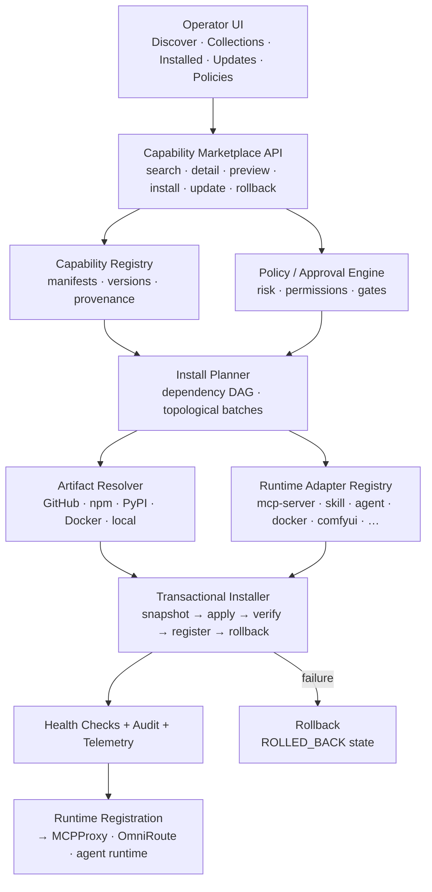

# Phase 20.89 — Pao-hubPro × Bubble

## Visual AI Capability Gallery, Unified Agent/Skill/MCP Component Registry, Interactive Preview & Discovery, Curated Collections, One-Click Installation & Policy-Governed Capability Marketplace

> **Project:** Pao-hubPro  
> **Phase:** 20.89  
> **Status:** Implementation Blueprint (restructured into the Pao-hubPro master 44-section blueprint)  
> **Priority:** High  
> **Mode:** Local-first / Registry-first / Manifest-driven / Policy-governed / Auditable / Rollback-capable / Human-approved by default  
> **Primary Goal:** เปลี่ยน Pao-hubPro จากระบบที่ "มีความสามารถจำนวนมากแต่ค้นหา/ติดตั้ง/จัดการยาก" ให้เป็น **Visual AI Capability Marketplace + Runtime Registry** ที่ค้นหา ดูตัวอย่าง ตรวจความเข้ากันได้ ติดตั้ง เปิดใช้งาน อัปเดต ปิดใช้งาน และย้อนกลับ Agent / Skill / MCP / API / Model / Workflow / Prompt / Provider / Tool ได้จากศูนย์กลางเดียว  
> **Reference Inspiration:** `LHRUN/bubble` — GitHub Profile / README component discovery gallery (Next.js, React, Prisma, NextAuth, SWR, PostgreSQL) — **design-pattern inspiration only, not a dependency**  
> **Integration neighborhood:** Phase 20.55 (SkillsGate) → Phase 20.74 (MCPProxy) → Phase 20.82 (AFT) → Phase 20.85 (OmniRoute) → Phase 20.86 (AI-API admission) → **Phase 20.89 (Bubble Capability Hub)**  
> **Core principle:** *Registry-first: no capability is installable without a Registry Entry + Manifest. One-Click means one user intent — never uncontrolled execution.*  
> **Source filename (preserved per master request §39):** `Phase_20.89_Pao-hubPro_x_Bubble.md`  

---

### Verification & Decision Record (master request §1, §36, §38, §40)

**Verified against the attached source before restructuring:**
- Phase number and name: **20.89**, "Pao-hubPro × Bubble — Visual AI Capability Gallery, Unified Agent/Skill/MCP Component Registry, Interactive Preview & Discovery, Curated Collections, One-Click Installation & Policy-Governed Capability Marketplace" — matches the source title and END marker exactly; 20.89 was unoccupied (this phase legitimately claims it).
- 61 source sections verified: executive summary (Bubble pattern: Collect → Categorize → Browse/Preview → Like/Favorite → Reuse; Pao upgrade chain: Discover+Import+Normalize → Unified Registry → Metadata/Provenance/Version/Dependency/Permission → Gallery/Search/Filter/Collection → Interactive Preview+Compatibility+Risk → Install Plan+Approval → Transactional Installation → Health+Runtime Registration → Audit/Update/Disable/Rollback/Uninstall; goal: every accumulated Phase becomes a visible capability, not a remembered `.md`), why the phase exists (capability sprawl — 13 concrete problem statements), what is borrowed from Bubble (7 kept patterns: visual discovery, category navigation, preview-first UX, favorite/like, auth-aware personalization, card presentation, centralized catalog; 20 required extensions: executable manifests, version pinning, dependency graph, permission model, install/uninstall adapters, dry-run plan, policy engine, security quarantine, provenance verification, artifact checksum, runtime health checks, environment compatibility, secrets requirements, approval gates, audit log, rollback, capability lifecycle, provider routing metadata, MCP tool introspection, agent/skill invocation contracts, policy-based auto-selection), scope (17 capability types in scope: agent, skill, mcp-server, api, model, provider, workflow, prompt, cli-tool, browser-tool, ui-extension, comfyui-node, comfyui-workflow, data-source, runtime-adapter, reviewer, memory-provider, router; out of scope: payment gateway, revenue sharing, public seller payout, public anonymous publishing, automatic execution without policy, unrestricted script install, decentralized federation), Pao Capability Hub product concept (8 main menus; full UX tree incl. Collections: Coding Stack, Adobe Stock Stack, Browser Automation Stack, Research Stack, Local-first Stack), architecture diagram, registry-first rule (GitHub URL → Source Inspector → Metadata Extractor → Manifest Generator → Policy Scan → Registry Candidate → Approval → Registry Entry; closes arbitrary-install hole), capability manifest specification (`pao-capability.yaml`, `paohub.io/v1alpha1, kind: Capability` with full example: metadata, spec{type, version pinned, compatibility{os,arch,runtimes}, capabilities{provides,consumes}, permissions{filesystem,network,shell,secrets}, dependencies, install{strategy, source{repo,ref}, steps}, health{checks}, lifecycle{supportsDisable/Rollback/Uninstall}}), capability lifecycle (9 primary states + 10 additional = 19 states; boolean `installed` forbidden), unified data model (21 entities, 23 PostgreSQL tables, minimum capability + version fields), search & discovery (15 filters, ranking = text relevance + compatibility + installed health + local preference + policy eligibility + collection affinity + recency; **popularity must never override security/compatibility**), capability card UX (answers key questions without opening detail; 15 badges), capability detail page (10 tabs; human-readable permissions; dependency graph), interactive preview (9 preview types, **read-only by default**, MCP preview example: tools detected + required permissions + "No tool call executed during preview"), collections (6 types + 3 example stacks + 6 collection actions), favorites vs personalization (Favorite ≠ Pinned ≠ Installed ≠ Enabled ≠ Healthy — never conflated in one field), one-click installation safe definition (16-step flow), install plan (immutable JSON with changes/permissions/approvalRequired; plan ID persisted in audit), transactional installer (10 states: PREPARING→SNAPSHOTTING→APPLYING→VERIFYING→REGISTERING→COMMITTED + FAILED→ROLLBACK_PENDING→ROLLING_BACK→ROLLED_BACK; idempotent steps; bounded redacted logs; checksum before execution), dependency resolver (11 dependency kinds: capability/system-package/node-package/python-package/container-image/runtime/provider/model/secret/port/filesystem-path; 6 states: SATISFIED/MISSING/CONFLICT/OPTIONAL/BLOCKED_BY_POLICY/REQUIRES_APPROVAL; DAG → topological plan → install batches), compatibility engine (13 checks; 4 results; **UNKNOWN never interpreted as COMPATIBLE**), policy-governed marketplace (ALLOW / ALLOW_WITH_APPROVAL / DENY / QUARANTINE + YAML examples: deny-ssh-secret-read, approve-shell-write, quarantine-unverified-binary), permission taxonomy (23 permissions + scoped values like `filesystem.read:workspace/**`), trust & provenance (6 trust states; 10 provenance fields; **no floating `main` in production** — resolve to immutable commit SHA), source adapters (interface + 7 initial: GitHub, Local Directory, npm, PyPI, Docker/OCI, Raw Manifest URL, Pao-hubPro Built-in Registry; future: MCP Registry, Hugging Face, ComfyUI custom nodes, OpenAPI directories, private org registry), runtime adapters (7-method interface; 11 initial types: mcp-server, skill, agent-profile, prompt, workflow, cli-tool, node-app, python-app, docker-service, comfyui-node, provider-config), MCP-specific integration (inspect transport/command/env/tools/prompts/resources/auth/startup-health; post-install start→handshake→enumerate→compare→register; unexpected tool-surface change → DEGRADED + REQUIRE_REVIEW), skill integration (SKILL.md entrypoint, triggers, assets, tools), agent integration (role, prompt source, tools, model prefs, context/memory policy, autonomy, approval boundary; versioned), workflow integration (DAG preview; all node dependencies verified pre-install), provider/model integration (secretRef/credentialProvider/requiredScopes only — keys stay in secret store), API contract (18 endpoints under `/api/v1/capabilities`), example API response, UI routes (13), Apple-style UI requirements (11 traits + quick actions ⌘K/I/F/P/M; **never hide critical permissions for beauty**), command palette (12 commands; destructive commands traverse the same policy), existing-phase importer (7-step: Phase Markdown → parse title → detect source repo → extract type → draft manifest → link phase number → registry candidate; extra fields: phase_number, phase_title, blueprint_path, implementation_status, supersedes/superseded_by), phase-to-capability status separation (Blueprint Status: DRAFT/SPEC_COMPLETE/IMPLEMENTING/IMPLEMENTED/VALIDATED vs Runtime Status: NOT_INSTALLED/INSTALLED/HEALTHY/DEGRADED/DISABLED/QUARANTINED — **Phase Complete ≠ Runtime Healthy**), update management (14-step flow; **permission escalation blocks automatic update** with explicit warning), rollback (6 persisted prior states; 5 restored aspects), health monitoring (10 check types; 4 health states), audit log (13 fields; 13 events), security requirements (13 mandatory + explicitly forbidden `curl <url> | sh` and `powershell irm <url> | iex` — decomposed to fetch → inspect → hash → policy → controlled adapter execution), performance targets (~10,000 capabilities: gallery <2s, search <200 ms p95, detail <300 ms, plan-install <2 s, health summary <1 s), caching rules (5 cacheable / 3 never-cache), background jobs (7, idempotent with retry), folder structure, TypeScript core types, error model (17 actionable error codes), telemetry (minimal, local-only mode), migration strategy (8 steps), seed collections (11), Bubble inspiration mapping (6 mappings), acceptance criteria (9 families), definition of done (14 conditions), testing matrix (13 scenarios), implementation guardrails (12), deliverables (23), `/gold` one-shot command, implementation priority (P0–P5 with mandatory end-to-end install path), final architecture outcome, reference notes.
- No capability removed, truncated, or assumed. Bubble is used as design-pattern inspiration only — its Next.js/Prisma/NextAuth stack is not imported.

**⚠ Phase numbering registry update:**
- **20.89** is officially assigned to this phase (Pao-hubPro × Bubble — Capability Hub). **Confirmed by the user's Canonical Phase Lock (2026-09-18).**
- Forge collision resolved: canonical **20.90 = Forge (Prompt Engineering Control Plane)** — the Forge blueprint's marker has been updated accordingly. *Business Opportunity Intelligence* / *Revenue Intelligence* are RESERVED at **20.91**. The 20.65 collision is also resolved: **20.65 = Context Mode, 20.65.1 = Litho/deepwiki-rs**.

**Implementation status annotation (2026-09-18):** NOT YET IMPLEMENTED in the Pao-hubPro repository (no `cap_*`/marketplace tables, no `pao-capability.yaml` manifest parser, no `/api/v1/capabilities` routes, no Capability Hub GUI). Related implemented/spec'd surfaces this phase composes: Phase 20.74 MCPProxy (runtime registration target), Phase 20.85 OmniRoute (provider routing metadata), Phase 20.86 Capability Marketplace spec (admission/supply-chain pattern to reuse), Phase 20.87 FileSync (artifact distribution), Phase 20.55 SkillsGate, Phase 20.88 Forge (prompt artifacts as installable capabilities).

**R0–R4 mapping note (decision):**
- The source defines its own policy enum directly — `ALLOW / ALLOW_WITH_APPROVAL / DENY / QUARANTINE` — plus trust states and risk classes. Decision mapping onto R0–R4:
  - **R0 (Read-only):** search/filter, capability detail, preview (read-only by default — "No tool call executed during preview"), health status reads, audit viewing, collection browsing.
  - **R1 (Low-risk local action):** import/normalize (metadata-only registry writes), manifest generation, favorites/collections, phase-markdown drafting, dependency DAG computation, compatibility evaluation.
  - **R2 (Reversible write):** policy-`ALLOW` installs of verified/compatible capabilities, verify/enable/disable, non-escalating updates (snapshot + transactional apply + rollback capable), quarantine release after scan pass, uninstall per plan.
  - **R3 (Sensitive — approval recommended):** `ALLOW_WITH_APPROVAL` installs (shell.execute / filesystem.write / browser.control / network permissions), **permission-escalating updates** (blocked from auto-update, e.g. `v1.2 → v1.3 NEW PERMISSION: + shell.execute`), rollback execution, `require_all` collection installs, secret-binding operations.
  - **R4 (Destructive / privileged / external impact):** overriding `DENY` policies, executing `curl | sh` / `powershell irm | iex` patterns (explicitly forbidden — decomposed instead), disabling quarantine on unverified binaries, production secret binding without approval, deleting audit history.
- Policy-enum mapping (direct from source): **ALLOW** → verified+compatible installs proceed; **REQUIRE_APPROVAL** ← `ALLOW_WITH_APPROVAL` (permission-sensitive installs, escalating updates); **DENY** → unknown peers, `DENY` policy rules, `INCOMPATIBLE`/unsafe states, floating-ref installs in production; **QUARANTINE** → unverified binaries, source-missing candidates, drift-flagged providers — all first-class states, natively supported.

---

## 1. Executive Summary

Phase 20.89 takes the core idea of **Bubble** — organizing scattered things into a searchable, categorized, previewable, favoritable gallery — and applies it to Pao-hubPro at a far higher level of rigor.

The original Bubble does roughly: README Components / GitHub Profiles → Collect → Categorize → Browse/Preview → Like/Favorite → Reuse. Pao-hubPro Phase 20.89 must elevate this to:

```text
Agents / Skills / MCP / APIs / Models / Workflows / Prompts / Providers / Tools
  → Discover + Import + Normalize
  → Unified Capability Registry
  → Metadata + Provenance + Version + Dependency + Permission
  → Visual Gallery + Search + Filter + Collection
  → Interactive Preview + Compatibility Scan + Risk Analysis
  → Install Plan + Human Approval
  → Transactional Installation
  → Health Check + Runtime Registration
  → Audit + Update + Disable + Rollback + Uninstall
```

The key outcome: after this phase, "all the Phases built so far" start appearing as **real capabilities in the system** — not `.md` documents or repo links that must be remembered by hand. The module is the **Pao Capability Hub**, and the central rule is **registry-first**: nothing is installable without a normalized Registry Entry + Manifest.

## 2. Problem Statement

As Pao-hubPro accumulates Phases and integrations, the new problem is not "lacking tools" — it is **Capability Sprawl**. Concrete symptoms: nobody remembers which capabilities exist; which are MCP vs Agent vs Skill vs API vs Workflow; which are actually installed vs blueprint-only; which run on Windows/Linux/Docker/VPS/local; which need API keys; which have side effects (shell, network, filesystem, browser, email); which need open ports; which have duplicate dependencies; which conflict with other providers/runtimes; which were installed but whose health checks now fail; which were superseded by newer phases; which are production-ready; which fit Adobe Stock vs Coding vs Browser vs Research vs Automation. Phase 20.89 solves this with **Registry + Marketplace + Installer Control Plane**.

## 3. Goals

1. One unified registry across 17+ capability types (agent, skill, mcp-server, api, model, provider, workflow, prompt, cli-tool, browser-tool, ui-extension, comfyui-node, comfyui-workflow, data-source, runtime-adapter, reviewer, memory-provider, router).
2. Visual gallery with search, filters, categories, favorites, and curated collections.
3. Interactive, **read-only-by-default** preview (manifest, README, workflow DAG, MCP tool lists, agent profiles).
4. Compatibility engine across OS/arch/runtimes/Docker/GPU/ports/providers/secrets — UNKNOWN is never COMPATIBLE.
5. Immutable install plans with dependency DAG resolution before any execution.
6. Policy-governed installation: ALLOW / ALLOW_WITH_APPROVAL / DENY / QUARANTINE with safe defaults.
7. Transactional installer with snapshots, idempotent steps, health verification, and deterministic rollback.
8. Update management with permission-escalation blocking.
9. Full audit trail and existing-phase importer so every Phase 20.x becomes discoverable.
10. Local-first private marketplace — no public monetization in this phase.

## 4. Non-Goals

Phase 20.89 does NOT include: a full public monetization marketplace; payment gateway; revenue sharing; public seller payouts; public anonymous publishing; automatic execution without policy; unrestricted arbitrary script installation; or fully-decentralized remote marketplace federation. The schema is designed so these can be added later, but the first implementation targets a **private/local Pao-hubPro Marketplace**.

## 5. Why This Phase Exists

The platform's value has shifted from "what can it do" to "can we find, trust, and operate what it can do." Twenty-plus phases produced agents, skills, MCP servers, providers, workflows, prompts, and tools — but each lives in its own code path with its own install story. Capability Sprawl makes every of the 13 sprawl symptoms a daily tax: rediscovery cost, duplicate dependencies, silent conflicts, dead health checks, forgotten supersessions. A registry + marketplace + installer control plane converts scattered capability knowledge into one queryable, governable, reversible system — and makes the accumulated Phase catalog finally *visible* to its own operators.

## 6. Relationship to Pao-hubPro (and Existing Phases)

- **Phase 20.86 (AI APIs You Can Ship Today):** 20.86 is the external-supply-chain admission layer (discovery → verification → admission); 20.89 is the internal gallery/installer that surfaces admitted and native capabilities to operators and installs them. 20.86-admitted capabilities can publish into the 20.89 registry; the manifest/lifecycle patterns are shared.
- **Phase 20.74 MCPProxy:** `mcp-server` runtime adapter registers servers with MCPProxy after install; tool-level policy integration; MCP handshake/tool-enumeration health checks; unexpected tool-surface changes flag DEGRADED + REQUIRE_REVIEW.
- **Phase 20.85 OmniRoute:** installed providers/models export routing metadata; the registry never stores API keys — only `secretRef / credentialProvider / requiredScopes`.
- **Phase 20.82 AFT / 20.55 SkillsGate / 20.88 Forge:** installed agent/skill/prompt capabilities appear in the gallery with their invocation contracts, approval boundaries, and versioned manifests.
- **Phase 20.87 FileSync:** the artifact-distribution path for moving installed capability artifacts between nodes.
- **Existing Phase `.md` importer:** every Phase blueprint becomes a registry draft (with `phase_number, phase_title, blueprint_path, implementation_status, supersedes_phase, superseded_by_phase`), separating **Blueprint Status** (DRAFT/SPEC_COMPLETE/IMPLEMENTING/IMPLEMENTED/VALIDATED) from **Runtime Status** (NOT_INSTALLED/INSTALLED/HEALTHY/DEGRADED/DISABLED/QUARANTINED) — **Phase Complete ≠ Runtime Healthy**.
- **Layer mapping (master §5):** 06 Capability Registry (core), 07 Policy Engine, 08 Approval, 10/11 Execution (runtime adapters), 12 State (install runs/snapshots), 15 Events, 16 Observability, 17 Audit, 19 Dashboard (Capability Hub).

## 7. Upstream / External Project

- **A. Upstream (inspiration only):** `LHRUN/bubble` — a gallery of GitHub README Components and Awesome Profiles with GitHub/Google auth, Like/Favorite, Component↔Category and User↔Liked relations; stack Next.js, React, Prisma, NextAuth, SWR, PostgreSQL (schema.prisma reviewed). **Bubble is design-pattern inspiration, not a required dependency** — its stack is not imported; Pao-hubPro implements the gallery pattern natively.
- **B. Pao-hubPro Adapter:** Capability Hub (registry, marketplace API, install planner, transactional installer) built on existing Bun/TypeScript + SQLite conventions.
- **C. Policy Wrapper:** permission taxonomy (23 scoped permissions), policy rules (`deny-ssh-secret-read`, `approve-shell-write`, `quarantine-unverified-binary`), trust states, approval gates.
- **D. Extensions:** curated stacks (Coding Agent, Adobe Stock, Browser Automation), phase importer, update/rollback management, health monitoring, command palette.
- Source references: `https://github.com/LHRUN/bubble`, `prisma/schema.prisma`, `package.json` (verified at drafting).

## 8. Current-State Assumptions

- **NOT implemented in the repo** (verified 2026-09-18): no capability registry tables, no `pao-capability.yaml` parser, no marketplace API/UI. All 23 tables, 18 endpoints, and the Hub UI are to be built.
- Pao-hubPro runtime is Bun-native TypeScript with SQLite (`agent-os.sqlite3` v56); the source gives PostgreSQL-style tables — **Assumption:** implement against the existing SQLite layer with schema parity *(Needs Verification)*; no second database stack (source §54 migration rule: reuse the existing persistence architecture).
- Existing phases (20.55 SkillsGate, 20.74 MCPProxy, 20.82 AFT, 20.85 OmniRoute, 20.88 Forge prompts) provide the first real capability population for seed collections; the Phase importer scans blueprint `.md` files to generate registry drafts.
- The GUI is React + Vite with 10-locale i18n; the Capability Hub follows the Apple-clean design requirements (§31 of source: whitespace, card grid, badges, ⌘K command palette, reduced-motion, WCAG contrast — never hiding critical permissions for beauty).
- Outbound network egress exists for source-adapter fetching (GitHub/npm/PyPI/Docker registries) subject to the policy engine's domain controls.

## 9. Target Architecture

```text
Pao-hubPro UI (Discover | Collections | Installed | Updates | Policies)
        ↓
Capability Marketplace API (Search | Detail | Preview | Install | Update | Rollback)
        ↓                                   ↓
Capability Registry                Policy / Approval Engine
(Manifest / Version)               (Risk / Permission / Gate)
        ↓                                   ↓
Install Planner + Dependency Solver (DAG → topological → batches)
        ↓                                   ↓
Artifact Resolver                  Runtime Adapter Registry
(GitHub/npm/pip/etc)               (MCP/Skill/Agent/Docker/etc)
        ↓                                   ↓
Transactional Installation Runtime (Snapshot → Apply → Verify → Register → Rollback)
        ↓
Health + Audit + Telemetry + Capability Runtime
```

**Registry-first rule:** even a raw GitHub URL must normalize through Source Inspector → Metadata Extractor → Manifest Generator → Policy Scan → Registry Candidate → Approval → Registry Entry before it becomes installable. Benefits: closes the arbitrary-install hole, traceable provenance, reproducible installs, rollback, pre-execution policy review.

## 10. Architecture Diagram



## 11. Core Components

1. **Capability Registry** — canonical store: 21 entities (User, Capability, CapabilityVersion, CapabilitySource, CapabilityCategory, CapabilityTag, CapabilityDependency, CapabilityPermission, CapabilityArtifact, CapabilityRuntimeContract, Collection, CollectionItem, Favorite, Installation, InstallRun, InstallStep, ApprovalRequest, PolicyDecision, HealthCheck, AuditEvent, SourceSyncRun) across 23 tables; minimum capability fields: `id, slug UNIQUE, name, type, summary, description, status, visibility (default private), icon_url, homepage_url, repository_url, license_spdx, publisher_name, trust_state (default unverified), risk_class (default unknown), latest_version_id`; version fields: `capability_id, version, source_ref, manifest_json, checksum_sha256, release_notes, published_at, UNIQUE(capability_id, version)`.
2. **Manifest System** — `pao-capability.yaml` (`apiVersion: paohub.io/v1alpha1, kind: Capability`): metadata (id/name/slug/description/homepage/sourceType/sourceUrl/license/authors/tags) + spec (type, pinned version, compatibility{os, arch, runtimes}, capabilities{provides, consumes}, permissions{filesystem{read,write}, network{outbound}, shell{allowed}, secrets}, dependencies{required,optional}, install{strategy, source{repo, ref}, steps}, health{checks}, lifecycle{supportsDisable, supportsRollback, supportsUninstall}) — server-side validated with useful validation errors.
3. **Search & Discovery Engine** — 15 filters (keyword, category, type, status, installed, local/cloud, OS/runtime compatibility, provider, permission class, risk class, license, source, recency, collection, favorite); ranking = text relevance + compatibility + installed health + local preference + policy eligibility + collection affinity + recency; **popularity alone must never outrank security/compatibility**.
4. **Preview Engine** — 9 preview types (static, manifest, readme, command, workflow, mcp-tool, agent-profile, ui, sample-output), **read-only by default** — "No tool call executed during preview."
5. **Collections** — 6 types (manual, system, project, recommended, runtime, workflow-stack); seeded stacks (Coding Agent: Codex Runtime, AFT, OpenCodeReview, Forge, Context Mode, MCPProxy, OmniRoute; Adobe Stock: ComfyUI, MiniMax H3, MoneyPrinterTurbo, Prompt Master, YuE2 Trainer, Metadata Engine, Stock Policy Validator; Browser Automation: BrowserMCP, Chrome Extension Bridge, CherryBrowser, Recordly, WebMCP); actions: Install All (plan first), Verify All, Update All, Disable All, Export Manifest, Clone Collection; dependency DAG built before any collection install.
6. **Compatibility Engine** — 13 checks (OS, architecture, Node/Python versions, Docker availability, GPU/VRAM, filesystem, ports, provider availability, secrets, MCP transport, browser requirements, network access); results `COMPATIBLE | COMPATIBLE_WITH_WARNINGS | INCOMPATIBLE | UNKNOWN`; **UNKNOWN must never be interpreted as COMPATIBLE**.
7. **Install Planner** — immutable plans: `{capability, version, sourceRef, changes[{create_dir, download_artifact(checksum), install_dependency, register_mcp}], permissions[], approvalRequired}`; plan ID persisted in audit; execution endpoint executes the approved plan, never silently regenerating materially different operations.
8. **Dependency Resolver** — 11 dependency kinds (capability, system-package, node-package, python-package, container-image, runtime, provider, model, secret, port, filesystem-path); 6 states (SATISFIED, MISSING, CONFLICT, OPTIONAL, BLOCKED_BY_POLICY, REQUIRES_APPROVAL); DAG → topological plan → install batches.
9. **Transactional Installer** — states `PREPARING → SNAPSHOTTING → APPLYING → VERIFYING → REGISTERING → COMMITTED`, failure path `FAILED → ROLLBACK_PENDING → ROLLING_BACK → ROLLED_BACK`; idempotent steps where practical; bounded redacted stdout/stderr; **secrets never in logs; checksum artifacts before execution**.
10. **Policy / Approval Engine** — decisions `ALLOW | ALLOW_WITH_APPROVAL | DENY | QUARANTINE`; example rules: `deny-ssh-secret-read` (filesystem.read `~/.ssh/**` → DENY), `approve-shell-write` (shell.execute/filesystem.write → ALLOW_WITH_APPROVAL), `quarantine-unverified-binary` (binary + unverified provenance → QUARANTINE).
11. **Source Adapters** — `CapabilitySourceAdapter {canHandle, inspect, resolveVersion, fetchManifest, resolveArtifact}`; initial: GitHub, Local Directory, npm, PyPI, Docker/OCI, Raw Manifest URL, Pao Built-in Registry; future: MCP Registry, Hugging Face, ComfyUI custom nodes, OpenAPI directories, private org registry.
12. **Runtime Adapters** — `CapabilityRuntimeAdapter {type, planInstall, install, verify, enable, disable, rollback, uninstall}`; initial 11 types: mcp-server, skill, agent-profile, prompt, workflow, cli-tool, node-app, python-app, docker-service, comfyui-node, provider-config.
13. **Health Monitor** — 10 check types (process, http, command, mcp-handshake, tool-enumeration, port, filesystem, provider-auth, model-probe, workflow-dry-run); states HEALTHY / DEGRADED / UNHEALTHY / UNKNOWN; installed-card health surfaced in the gallery.
14. **Update Manager** — source sync → new version detected → diff manifest/permissions/dependencies → policy evaluation → update plan → approval → snapshot → update → verify → commit/rollback; **permission escalation blocks automatic update** (`v1.2 → v1.3 NEW PERMISSION: + shell.execute — Automatic update blocked. Human approval required.`).
15. **Phase Importer** — Phase Markdown → Parse Title → Detect Source Repo → Extract Capability Type → Generate Draft Manifest → Link Phase Number → Registry Candidate; extra fields `phase_number, phase_title, blueprint_path, implementation_status, supersedes_phase, superseded_by_phase`; **never mark a phase installed merely because its markdown exists**; Blueprint Status separated from Runtime Status.
16. **Trust & Provenance Store** — trust states `verified, known-source, community, unverified, quarantined, revoked`; provenance: source URL, repository owner, resolved commit SHA, release/tag, artifact URL, SHA-256, manifest hash, import timestamp, scan timestamp, installer version; **no floating `main` in production — resolve to immutable commit SHA first.**

## 12. Component Responsibilities

| Component | Owns | Must never |
| --- | --- | --- |
| Registry | canonical capability/version/trust state | accept installs without entry+manifest |
| Preview Engine | read-only introspection | execute tool calls during preview |
| Compatibility Engine | honest environment verdicts | interpret UNKNOWN as COMPATIBLE |
| Install Planner | immutable, auditable plans | execute while planning |
| Dependency Resolver | DAG ordering, conflict detection | hide MISSING/CONFLICT/BLOCKED states |
| Transactional Installer | snapshot→apply→verify→register | leave half-installed unknown state; log secrets |
| Policy Engine | ALLOW/ALLOW_WITH_APPROVAL/DENY/QUARANTINE | be bypassed by UI or CLI |
| Update Manager | escalation detection | auto-apply permission-escalating updates |
| Rollback | prior-state restoration | depend on regeneration |
| Phase Importer | blueprint→draft conversion | conflate blueprint status with runtime health |

## 13. Data Flow

```text
Upstream catalog / Phase markdown / GitHub URL
  → Source Adapter inspect → Raw record + provenance (URL, commit SHA, hash)
  → Normalization → Manifest validation → Policy Scan → Registry Candidate
  → Operator approval → Registry Entry (AVAILABLE)
  → Operator search/browse → Card → Detail → Preview (read-only)
  → Install intent → Plan (version resolve → artifact resolve → source verify
    → manifest read → dependency solve → compatibility → permission diff
    → risk evaluation) → approval (if required) → snapshot
  → transactional apply → health check → runtime registration (MCPProxy/OmniRoute)
  → audit event → gallery reflects INSTALLED/HEALTHY
  → later: source sync → version diff → update plan (escalation blocked) → update → verify → commit/rollback
```

## 14. Control Flow (+ R0–R4 Mapping)

```text
Request → Identity (operator/agent) → Capability Resolution
→ Policy Evaluation (permissions, trust, compatibility)
→ Risk Classification (permission classes: shell/network/filesystem/credentials)
→ Approval Check (ALLOW_WITH_APPROVAL gates)
→ Execution (snapshot → apply → verify → register)
→ Result Validation (health checks)
→ Audit (actor, plan ID, policy decision, result)
```

| Operation | Risk | Enum |
| --- | --- | --- |
| Search, detail, preview, health reads, audit view | R0 | ALLOW |
| Import/normalize metadata, favorites, collections, phase drafts | R1 | ALLOW (audited) |
| Policy-`ALLOW` install of verified compatible capability; verify/enable/disable; non-escalating update; uninstall per plan | R2 | ALLOW (snapshot + audit) |
| `ALLOW_WITH_APPROVAL` installs (shell.execute / filesystem.write / browser.control / network); permission-escalating update; rollback execution; secret binding | R3 | REQUIRE_APPROVAL |
| Override `DENY`; `curl \| sh` / `irm \| iex` execution; disable quarantine on unverified binaries; production secret binding without approval; audit deletion | R4 | DENY unless explicitly human-approved |

## 15. Agent / Worker Model

- **Marketplace API** = service (stateless request handling over DB-backed registry).
- **Background Workers** (source §45, all idempotent with retry policy): `source_sync, metadata_refresh, update_detection, health_check, preview_refresh, artifact_verification, registry_index_rebuild`.
- **Installer Runtime** = transactional worker (10-state machine, per-run snapshot).
- **Agents** = consumers: resolve/preview capabilities via MCP/CLI; they may request installs but never approve their own R3 gates and never bypass the policy service.
- **Human Operator** = approval authority (ALLOW_WITH_APPROVAL, escalation review, quarantine release), collection curation.
- Separations (master §8): *Capability* = registry entity; *Version* = immutable manifest+checksum; *Installation* = runtime binding; *InstallRun* = one execution; *Collection* = curated set. Favorite ≠ Pinned ≠ Installed ≠ Enabled ≠ Healthy — **never conflated in one field**.

## 16. Session / State Model

Capability lifecycle — 19 explicit states (boolean `installed` forbidden): primary `DISCOVERED → IMPORTED → NORMALIZED → SCANNED → APPROVED → AVAILABLE → INSTALLING → INSTALLED → HEALTHY`; additional `DISABLED, DEGRADED, FAILED, UPDATE_AVAILABLE, QUARANTINED, DEPRECATED, SUPERSEDED, UNINSTALLED, ROLLBACK_REQUIRED`. Installer run states: `PREPARING → SNAPSHOTTING → APPLYING → VERIFYING → REGISTERING → COMMITTED` with failure path `FAILED → ROLLBACK_PENDING → ROLLING_BACK → ROLLED_BACK`. Guarantees: no half-installed unknown state; every step idempotent where practical; deterministic post-failure state; plan immutability between approval and execution; snapshots enable rollback of artifact, configuration, runtime registration, dependency links, and enabled state.

## 17. MCP Integration

- **mcp-server runtime adapter:** on install — inspect transport (stdio/HTTP/SSE), command/URL, environment variables, tool/prompt/resource lists, auth requirement, startup health; post-install flow: Start server → Handshake → Enumerate tools/resources/prompts → Compare with expected contract → Register runtime. **Unexpected tool-surface change ⇒ status DEGRADED + policy REQUIRE_REVIEW.**
- **mcp-tool-preview:** preview lists detected tools (`browser.navigate, browser.click, browser.type, browser.snapshot`) + required permissions (`browser-control, network-outbound`) with "No tool call executed during preview."
- **`mcp.call:browser-mcp/*` scoped permissions** in the taxonomy; registered servers traverse Phase 20.74 MCPProxy governance as usual — the marketplace adds admission, never bypasses it.
- Internal marketplace MCP tools, if exposed, are R0 reads (`pao_capability_search/get`, `pao_provider_get/compare`, `pao_cost_estimate`, `pao_health_get`, `pao_adapter_status`, `pao_capability_resolve`); administrative tools (`pao_discovery_sync, verification_run, benchmark_run, adapter_generate, admission_decide`) stay permission-gated (aligning with the Phase 20.86 tool inventory).

## 18. Capability Registry

The registry IS the phase's core (§11.1): registry-first rule (§9), manifest specification (§11.2), 19-state lifecycle, trust/provenance store (§11.16), version semantics (immutable versions with checksums; current/installed/latest kept distinct), categories/tags/collections, and the phase importer bridging the blueprint corpus (20.61–20.88b, 29+7 files) into searchable drafts. Registry queries support all 15 filter dimensions. Seed collections (11) are created **only from capabilities actually present in the registry** — never fabricated: Pao-hubPro Core, Coding & Review, Browser & Web Automation, MCP Infrastructure, Provider & Routing, Prompt Engineering, Context & Memory, Adobe Stock Production, ComfyUI & Media, Research & Discovery, Security & Audit.

## 19. Policy Model

Policy engine decides before execution: `ALLOW | ALLOW_WITH_APPROVAL | DENY | QUARANTINE`. Example rules:

```yaml
policies:
  - id: deny-ssh-secret-read
    match: {permission: filesystem.read, path: "~/.ssh/**"}
    effect: DENY
  - id: approve-shell-write
    match: {permissionsAny: [shell.execute, filesystem.write]}
    effect: ALLOW_WITH_APPROVAL
  - id: quarantine-unverified-binary
    match: {artifactType: binary, provenance: unverified}
    effect: QUARANTINE
```

Permission taxonomy (23): `filesystem.read/write/delete, shell.execute, network.outbound/listen, browser.control, process.spawn, clipboard.read/write, credential.use, email.read/send, calendar.read/write, github.read/write, mcp.call, model.invoke, container.run, gpu.use, camera.use, microphone.use` — with scoped values (`filesystem.read:workspace/**`, `network.outbound:github.com`, `mcp.call:browser-mcp/*`, `model.invoke:openai/gpt-*`). Safe defaults: sensitive filesystem scopes denied; unverified binaries quarantined; unknown compatibility never auto-installed.

## 20. Security Model

**Mandatory (13):** no arbitrary remote script execution by default; immutable resolved source refs; SHA-256 artifacts; secrets redaction; path traversal defense; shell argument escaping; workspace boundary enforcement; dependency allow/deny policy; outbound domain controls; install timeout; per-step audit; rollback support; privilege-escalation detection. **Explicitly forbidden:** `curl <url> | sh` and `powershell irm <url> | iex` — never auto-executed from the marketplace installer; if upstream documents such a command the inspector decomposes it into `fetch → inspect → hash → policy → execute under controlled adapter`. Additional: server-side authorization even when the client validated; UI never calls shell directly; every install/update/uninstall traverses one service layer; secret references (`secretRef: provider/openai/default`) instead of values.

## 21. Approval Model

`ALLOW_WITH_APPROVAL` gates: permission-sensitive installs (shell/write/network/browser-control), permission-escalating updates, collection installs containing gated members. Approval flow: plan generated (immutable, plan ID audited) → operator reviews changes/permissions/dependencies → approve → execute the approved plan (never a silently regenerated one) → audit. Approval expiry honored (`APPROVAL_EXPIRED` error code). Agents cannot self-approve; destructive commands in the palette traverse the same policy as the UI.

## 22. Failure Handling

17 actionable error codes — UI must show next actions, not generic errors: `CAPABILITY_NOT_FOUND, VERSION_NOT_FOUND, SOURCE_UNREACHABLE, SOURCE_UNTRUSTED, MANIFEST_INVALID, CHECKSUM_MISMATCH, DEPENDENCY_MISSING, DEPENDENCY_CONFLICT, INCOMPATIBLE_ENVIRONMENT, POLICY_DENIED, APPROVAL_REQUIRED, APPROVAL_EXPIRED, INSTALL_FAILED, HEALTH_CHECK_FAILED, ROLLBACK_FAILED, SECRET_MISSING` (+ `PROTOCOL_MISMATCH`-class MCP surface drift → DEGRADED/REQUIRE_REVIEW). Installer failure path: FAILED → ROLLBACK_PENDING → ROLLING_BACK → ROLLED_BACK (deterministic state, bounded redacted logs). Checksum mismatch aborts install. Missing secret → `SECRET_MISSING`, no execution. MCP handshake failure → DEGRADED/FAILED. Failure must never corrupt the registry.

## 23. Recovery Model

Rollback persists prior state: previous manifest, artifact checksum, source ref, config, runtime registration, snapshot reference — and restores artifact, configuration, runtime registration, dependency links, and enabled state. Failed installs attempt automatic rollback where the adapter supports it. Registry entries are never hard-deleted on upstream disappearance (source-missing/deprecated states preserved with audit history — aligned with the 20.86 deletion-semantics pattern). Cache purge is safe (content-addressed); approval decisions are never cached beyond validity.

## 24. Observability

Minimal telemetry (source §49): search count, preview count, install attempts, install success/failure, health status, rollback count — **avoid collecting unnecessary prompt/content; local-only mode required**. Performance targets for a ~10,000-capability local registry: gallery first load < 2 s; search < 200 ms p95 (local DB); detail open < 300 ms p95 cached; plan-install < 2 s excluding remote artifact fetch; health summary < 1 s cached; pagination/virtual grid for large card sets. Caching: capability detail, search facets, source metadata, resolved versions, preview assets, health summaries are cacheable; **never cache:** approval decisions beyond validity, live secrets, mutable auth tokens in the client. Background jobs (7): source_sync, metadata_refresh, update_detection, health_check, preview_refresh, artifact_verification, registry_index_rebuild — idempotent with retry policy.

## 25. Audit

Every significant action records: actor, source, capability, version, operation, plan_id, policy_decision, approval_id, started_at, completed_at, result, rollback_id, redacted_log_ref. Events (13): `CAPABILITY_IMPORTED, CAPABILITY_UPDATED, INSTALL_PLANNED, INSTALL_APPROVED, INSTALL_STARTED, INSTALL_COMPLETED, INSTALL_FAILED, ROLLBACK_STARTED, ROLLBACK_COMPLETED, CAPABILITY_ENABLED, CAPABILITY_DISABLED, CAPABILITY_QUARANTINED, CAPABILITY_UNINSTALLED`. Audit is separated from debug logs; secret redaction scrubbing applies to all emitters; every destructive/side-effectful operation is audited.

## 26. Data Model

23 tables (PostgreSQL reference; SQLite parity): `users, capabilities, capability_versions, capability_sources, capability_categories, capability_category_links, capability_tags, capability_tag_links, capability_dependencies, capability_permissions, capability_artifacts, capability_runtime_contracts, collections, collection_items, favorites, installations, install_runs, install_steps, approval_requests, policy_decisions, health_checks, audit_events, source_sync_runs`. Core fields per §11.1. Migration is additive (new tables only); no existing schema altered.

## 27. API / Event Contracts

Base `/api/v1/capabilities`; 18 endpoints: `GET /capabilities`, `GET /capabilities/:id`, `POST /capabilities/import`, `POST /capabilities/:id/preview`, `POST /capabilities/:id/plan-install`, `POST /install-plans/:id/approve`, `POST /install-plans/:id/execute`, `POST /installations/:id/verify|enable|disable|rollback`, `DELETE /installations/:id`, `GET/POST /collections`, `POST /collections/:id/plan-install`, `GET /audit`, `GET /approvals`. Example response: `{id: cap_browser_mcp, name: BrowserMCP, type: mcp-server, status: AVAILABLE, compatibility: {state: COMPATIBLE_WITH_WARNINGS, warnings: [Requires browser control permission]}, installation: null, permissions: [browser.control, network.outbound], policy: {decision: ALLOW_WITH_APPROVAL}}`. UI routes (13): `/capabilities(/discover|/installed|/:slug|/:slug/install)`, `/collections(/:slug)`, `/approvals`, `/updates`, `/activity`, `/policies`, `/sources`, `/health`. Events per §25. Command palette (12 commands): `/capability search|show|favorite|plan-install|install|verify|disable|enable|rollback|uninstall`, `/collection install`, `/marketplace health` — destructive commands traverse the same policy as the UI.

## 28. Configuration

Safe defaults: marketplace disabled until registry seeded; auto-verification opt-in (`auto_verify_new_candidates`); adapter auto-activate always false; policy default for unknown state = REVIEW; probes budget-capped; telemetry local-only by default. Cache policy per §24 (5 cacheable classes; approval decisions beyond validity, live secrets, and mutable auth tokens never cached). All values validate at startup; security-relevant settings never silently fall back.

## 29. Feature Flags

`capability_marketplace.enabled` (master), `capability_source_ai_apis`, `capability_auto_verification`, `capability_benchmarking`, `capability_adapter_generation`, `capability_omniroute_publish`, `capability_mcp_publish`, plus per-source and per-runtime-adapter flags. Risky features (installer execution, MCP publish, OmniRoute publish) default disabled; gallery/search/preview can enable first. Every flag is an immediate-rollback lever (disable → subsystem inert; installed capabilities remain but registration/advertising stops).

## 30. Repository Structure

```text
src/agent-os/marketplace/        # or packages/capability-* per repo convention
  ├─ manifest/                   # pao-capability.yaml parser + validator
  ├─ registry/                   # entities, lifecycle, versioning
  ├─ search/                     # indexer, ranking, filters
  ├─ policy/                     # engine, permissions, decisions
  ├─ installer/                  # planner, resolver, executor, rollback
  ├─ sources/                    # github, local, npm, pypi, docker adapters
  ├─ runtimes/                   # mcp, skill, agent, prompt, workflow, cli,
  │                              # docker, comfyui adapters
  ├─ health/ ├─ audit/ ├─ types/
src/server/management/marketplace-routes.ts
gui/src/pages/CapabilityHub.tsx  # gallery + detail + approvals
schemas/pao-capability.schema.json
tests/marketplace-*.test.ts
docs/PHASE_20.89_CAPABILITY_HUB.md
```

Source-suggested Next.js/Prisma structure adapted to the existing Bun monorepo (master §18 — inspect first; no second framework).

## 31. Dashboard Integration

**Pao Capability Hub** GUI (menu: Discover, Installed, Collections, Updates, Activity, Policies, Sources, Health): card grid where each card answers the key questions without opening detail — name, type, summary, OS compatibility ✓/✗, permission class, risk, status (Installed/Healthy), version, actions (☆ Favorite, Preview, Manage); 15 badge types (Installed, Healthy, Update Available, Local, Cloud, MCP, Agent, Skill, Requires Secret, Shell Access, Network Access, Filesystem Write, Human Approval Required, Quarantined, Deprecated); detail page with 10 tabs (Overview, Capabilities, Permissions, Dependencies, Install, Versions, Health, Audit, Files, Source) including human-readable permission display (`✓ Read: workspace/** · ✕ Write: none · ✕ Shell disabled`) and dependency graph; detail drawer for quick preview; keyboard search + ⌘K command palette; responsive desktop-first, dark/light, reduced-motion, WCAG contrast — **never hide critical permissions for beauty**. Quick actions: ⌘K/Ctrl+K search, I install, F favorite, P preview, M manage.

## 32. Dependencies

**Required:** Pao policy/audit/auth core; DB layer; existing runtime registries (MCPProxy, SkillsGate, OmniRoute provider registry) as registration targets.
**Recommended:** Phase 20.86 (external capability admission feeding the registry), Phase 20.88 Forge (prompt artifacts as installable capabilities), Phase 20.87 FileSync (multi-node artifact distribution), Phase 20.55 SkillsGate (skill/tool permission resolution).
**Optional:** npm/PyPI/Docker registries (source adapters beyond GitHub/local), malware/DLP scanners (quarantine hooks).
**Standalone path:** GitHub + Local Directory source adapters plus the phase importer populate the registry fully offline; no external marketplace is required.

## 33. Compatibility

- Extends, never replaces: MCPProxy, SkillsGate, OmniRoute, AFT, Forge keep their roles; the Hub is the discovery/installation surface above them.
- The Bubble stack (Next.js/Prisma/NextAuth) is inspiration only — implementation uses the repo's Bun/React/SQLite conventions.
- Existing working features are never deleted to make this phase pass (guardrail 4); additive migrations only.
- UNKNOWN compatibility is never auto-treated as safe; floating refs never trusted in production.

## 34. Migration

Eight steps (source §50): **1. Registry Foundation** (schema, manifest parser, lifecycle, import API) → **2. Existing Phase Import** (scan Phase `.md`, create registry drafts, link source repos) → **3. Gallery UI** (card grid, search, category, favorite, detail) → **4. Preview** (readme/source/manifest/MCP-tool previews) → **5. Planner** (dependency resolver, compatibility, policy evaluation) → **6. Installer** (adapters, transactions, audit, rollback) → **7. Collections** (curated stacks, install-all planning) → **8. Health & Updates** (health checks, source sync, update detection). Implementation priority when capacity-constrained (source §59): P0 Registry+schema+manifest+import+gallery+detail → P1 Search/filter+favorites+collections+Phase importer → P2 Compatibility+dependency+permission+policy+install plan → P3 Installer adapter for real Pao-hubPro runtimes → P4 Health+audit+rollback+update → P5 additional source/runtime adapters — **but `/gold` must walk at least one end-to-end install path; never stop at a P0 scaffold.**

## 35. Rollback

Rollback restores (from persisted prior state): artifact, configuration, runtime registration, dependency links, enabled state. Prior state persisted: previous manifest, artifact checksum, source ref, config, registration state, snapshot reference. Rollback is exposed through UI/API with audit trail (`ROLLBACK_STARTED / ROLLBACK_COMPLETED`). Phase-level rollback: `capability_marketplace.enabled=false` → Hub inert; installed capabilities remain on disk with their runtime registration intact or explicitly disabled per operator choice. Failed installs roll back automatically where the adapter supports it; `ROLLBACK_FAILED` is a distinct actionable error.

## 36. Testing Strategy

- **Unit:** manifest parser/validator, URL canonicalization, tracking-parameter handling, provider identity matching, classification, deduplication, pricing/cost normalization (20.86-shared), dependency solver, compatibility engine, permission diff, policy decisions, installer state transitions, rollback restore, error-code mapping.
- **Integration:** source sync → candidate; candidate → verification; admission → adapter; adapter → execution gateway; gateway → audit; registry → OmniRoute; registry → MCPProxy; installer transactions (commit + rollback).
- **Testing matrix (source §55, 13 scenarios):** import valid GitHub capability → registry draft; import invalid manifest → `MANIFEST_INVALID`; missing dependency → plan blocked or suggested; unsupported OS → `INCOMPATIBLE`; unknown compatibility → UNKNOWN, not auto-install; new shell permission in update → human approval required; checksum mismatch → install aborted; install step failure → automatic rollback attempted; MCP handshake failure → DEGRADED/FAILED; secret missing → `SECRET_MISSING` no execution; favorite → no installation side effect; disable → runtime disabled files retained; uninstall → runtime + registration removed per plan.
- **Security tests:** SSRF, secret leakage, path traversal, oversized payload, malicious JSON, redirect abuse, private-IP URL, credential exposure, log redaction, unauthorized admission mutation.
- **E2E:** happy-path install; denied-policy path; failed-install rollback path.
- **UI tests:** gallery cards, filters, favorites, detail tabs, approval queue, command palette.
- **Quality gates:** format/lint, typecheck, unit, integration, build, migration validation, security tests — pre-existing failures reported separately, never masked.

## 37. Acceptance Criteria

**Registry:** [ ] every capability has unique ID + slug; [ ] versioned manifests; [ ] immutable source refs; [ ] provenance; [ ] categories/tags; [ ] dependencies; [ ] permissions; [ ] lifecycle states.
**Gallery:** [ ] card grid browse; [ ] search; [ ] filters; [ ] category navigation; [ ] favorites; [ ] collections; [ ] complete detail page; [ ] real installed status; [ ] real runtime health.
**Preview:** [ ] no execution by default; [ ] manifest preview; [ ] source/readme preview; [ ] permission preview; [ ] dependency preview; [ ] MCP tools preview when supported.
**Installation:** [ ] plan before execute; [ ] compatibility check; [ ] dependency solve; [ ] policy decision; [ ] approval gate; [ ] immutable artifact resolution; [ ] checksum verification; [ ] transactional execution; [ ] health verification; [ ] rollback.
**Security:** [ ] secrets never in logs; [ ] no pipe-to-shell auto-execution; [ ] dangerous filesystem scopes denied by default; [ ] all destructive actions audited; [ ] permission escalation blocks auto-update; [ ] unverified binaries quarantined.
**Phase Import:** [ ] phase documents scanned; [ ] phase numbers mapped; [ ] registry drafts generated; [ ] blueprint vs runtime status distinguished.
**Tests:** [ ] manifest parser; [ ] dependency resolver; [ ] policy; [ ] installer transactions; [ ] rollback; [ ] API; [ ] UI components; [ ] e2e happy path; [ ] e2e denied-policy path; [ ] e2e failed-install rollback path.

## 38. Implementation Roadmap

**MVP first** (don't build everything simultaneously): Intent-equivalent chain = Capability → Manifest → Registry → Compatibility → Install Plan → Approval → Transactional Install → Health → Audit → Rollback; then add Search/Filters, Collections, Update Management, Additional Adapters. Priority ladder (source §59): P0 Registry + schema + manifest + import + gallery + detail → P1 Search/filter + favorites + collections + Phase importer → P2 Compatibility + dependency + permission + policy + install plan → P3 Installer adapter for existing real Pao-hubPro runtimes → P4 Health + audit + rollback + update → P5 additional source/runtime adapters — with the binding rule that `/gold` must complete at least one real end-to-end install path (never stop at P0 scaffold). The 8-step migration strategy (§34) sequences the same work with acceptance per step.

## 39. Risks

| Risk | Likelihood | Impact | Mitigation |
| --- | --- | --- | --- |
| Pipe-to-shell upstream instructions | Medium | RCE | forbidden patterns; decompose to fetch→inspect→hash→policy→adapter |
| Permission escalation via updates | Medium | Silent capability growth | escalation blocks auto-update; human approval; permission diff UI |
| UNKNOWN compatibility treated as safe | Medium | Broken/insecure installs | UNKNOWN ≠ COMPATIBLE invariant; tested |
| Registry sprawl recreates the original problem | Medium | Discovery failure | taxonomy + filters + collections + honest status separation |
| Supply-chain artifact tampering | Low–Medium | Malicious install | immutable refs, SHA-256, checksum-before-execute, provenance |
| Favorite/Installed conflation | Medium | User confusion | distinct fields, tested semantics |
| Half-installed state after failure | Medium | Unknown system state | transactional installer + deterministic rollback |
| Bubble pattern copied without governance | Low | Fake marketplace | extensions list mandatory (manifests, policy, audit) |
| 20.88-collision cascade confusion | Medium | Planning errors | ledger updated; Forge proposal cascades to 20.90 pending decision |
| Performance at 10k capabilities | Low | Slow gallery | pagination/virtual grid, caches, indexed search |

## 40. Security Checklist (master §40 verification)

- [x] No arbitrary remote script execution by default; `curl|sh` / `irm|iex` explicitly forbidden and decomposed
- [x] Registry-first: no install without entry + validated manifest
- [x] Immutable resolved source refs; no floating `main` in production
- [x] SHA-256 artifact checksum verification before execution
- [x] Secrets as references only (`secretRef`); never in logs, registry, or UI
- [x] Path traversal + shell argument safety + workspace boundary enforcement
- [x] Scoped permission taxonomy (23 permissions) with human-readable display
- [x] Dependency allow/deny policy with BLOCKED_BY_POLICY state
- [x] Outbound domain controls + install timeouts
- [x] Per-step audit; rollback support mandatory; privilege-escalation detection
- [x] Quarantine for unverified binaries; UNKNOWN compatibility never auto-safe
- [x] Server-side validation even when client validated; UI never calls shell directly
- [x] Permission escalation blocks automatic updates with explicit warning
- [x] Telemetry minimal with local-only mode; approval decisions never cached beyond validity

## 41. Production Readiness

- [ ] Registry schema + migrations applied (additive, reversible)
- [ ] Phase importer populated the registry from the real blueprint corpus (draft status)
- [ ] Gallery + detail + search + filters + favorites + collections live
- [ ] At least one real end-to-end install path executed (never P0-scaffold-only)
- [ ] Transactional installer verified: success, failure→rollback, checksum-mismatch abort
- [ ] Health checks surfacing on cards (HEALTHY/DEGRADED/UNHEALTHY/UNKNOWN)
- [ ] Update management with escalation blocking verified
- [ ] OmniRoute/MCPProxy registration integration verified for their adapter types
- [ ] Performance targets met at realistic registry scale (10k capabilities)
- [ ] Documentation: architecture, manifest format, source/runtime adapter guides, policy model, lifecycle, install/rollback flow, phase importer, troubleshooting, security
- [ ] All 23 deliverables (source §57) present; test suite green per quality gates
- Verdict: **blueprint ready; implementation gated behind migration Steps 1–8 with the end-to-end install path as the completion gate.**

## 42. Future Extensions

Future source adapters: MCP Registry, Hugging Face, ComfyUI custom nodes, OpenAPI directories, private organization registry (interfaces reserved). Future marketplace evolution: public monetization, payment gateway, revenue sharing, seller payouts, public publishing, decentralized federation (schema reserved; out of scope now). Additional capability types as the platform grows; semantic search layered over deterministic filters (filters remain source of truth); multi-node registry federation via 20.87 FileSync; reputation feeds and SLA tracking (aligned with 20.86 future extensions).

## 43. Definition of Done

Phase 20.89 is DONE when (source §54, 14 conditions):

1. Opening Pao-hubPro shows a **Capabilities / Discover** page.
2. Existing Phases/capabilities are imported into the registry (at least the initial set).
3. Users search capabilities without memorizing repo URLs.
4. Opening a card reveals source, version, permissions, dependencies, compatibility.
5. Clicking Install generates a plan first.
6. Policy decides before execution.
7. Risky capabilities request approval.
8. Successful installs register as real runtimes.
9. Health checks display on cards.
10. Uninstall/rollback carry an audit trail.
11. Collections can plan whole-stack installs.
12. Test suite passes.
13. No secret leaks into logs.
14. No arbitrary remote script execution by default.

Plus the source's anti-DoD guard: a UI mockup without a functioning runtime is NOT completion; a registry without execution governance is NOT completion; an adapter without policy enforcement is NOT completion.

## 44. Codex One-Shot Implementation Prompt

```text
/gold

Implement Phase 20.89 — Pao-hubPro × Bubble — Visual AI Capability Gallery, Unified
Agent/Skill/MCP Component Registry, Interactive Preview & Discovery, Curated
Collections, One-Click Installation & Policy-Governed Capability Marketplace.

GOAL
Turn Pao-hubPro's accumulated agents, skills, MCP servers, APIs, models, providers,
prompts, workflows, CLIs, browser tools, media/ComfyUI components and previous Phase
blueprints into a discoverable, versioned, searchable, policy-governed Capability
Registry and visual Marketplace that can safely preview, plan, install, verify, enable,
disable, update, rollback and uninstall capabilities.

IMPORTANT
The Bubble repository is inspiration for the catalog/gallery/category/favorite/discovery
pattern only. Do not clone its implementation blindly. Pao-hubPro requires executable
manifests, provenance, immutable source refs, dependency resolution, compatibility
checks, permissions, approval gates, audit logs, health checks and transactional
rollback.

EXECUTION RULES
1. Inspect the actual Pao-hubPro repository before editing anything.
2. Identify current frontend, backend, DB/ORM, auth, routing, job, logging, policy, MCP,
   skill, provider and runtime abstractions.
3. Reuse existing architecture where reasonable.
4. Do not introduce a second competing framework when an existing service can be
   extended.
5. Make database changes through migrations and keep them reversible where possible.
6. Never hardcode secrets.
7. Never execute untrusted remote install scripts directly.
8. Resolve source versions to immutable refs before execution.
9. Verify artifacts with SHA-256 when artifacts are downloaded.
10. Every destructive or side-effectful marketplace operation must pass through
    server-side policy enforcement.
11. UI may request operations but must never bypass the policy/install service layer.
12. Keep logs redacted and never persist credential values.
13. Treat UNKNOWN compatibility as not automatically safe.
14. Permission escalation during updates must require review.
15. A failed install must leave a deterministic state and attempt rollback where
    supported.
16. Do not delete or disable existing working features just to make this phase pass.
17. Do not weaken tests.
18. Finish the implementation end-to-end in this run as far as the repository allows;
    do not stop at scaffolding if a functional path can be completed.

FIRST: REPOSITORY DISCOVERY
Map the current repo structure; locate DB schema/migrations; auth/user model; Phase
markdown storage; existing MCP/skill/provider registries; policy/approval/audit
abstractions from prior phases; UI design system; health/telemetry/job mechanisms.
Produce a short implementation map in the execution log, then implement without asking
for confirmation unless a destructive irreversible action is truly unavoidable.

CORE DOMAIN MODEL
Implement/extend entities equivalent to: Capability, CapabilityVersion,
CapabilitySource, CapabilityCategory, CapabilityTag, CapabilityDependency,
CapabilityPermission, CapabilityArtifact, CapabilityRuntimeContract, Collection,
CollectionItem, Favorite, Installation, InstallRun, InstallStep, ApprovalRequest,
PolicyDecision, HealthCheck, AuditEvent, SourceSyncRun.

CAPABILITY TYPES
agent, skill, mcp-server, api, model, provider, workflow, prompt, cli-tool,
browser-tool, comfyui-node, comfyui-workflow, runtime-adapter.

LIFECYCLE
Explicit states, never a single installed boolean: DISCOVERED, IMPORTED, NORMALIZED,
SCANNED, APPROVED, AVAILABLE, INSTALLING, INSTALLED, HEALTHY, DEGRADED, FAILED,
DISABLED, UPDATE_AVAILABLE, QUARANTINED, DEPRECATED, SUPERSEDED, UNINSTALLED,
ROLLBACK_REQUIRED.

MANIFEST
Versioned pao-capability.yaml: apiVersion/kind; metadata id/name/slug/description/
source/license/tags; type/version; compatibility; provides/consumes; permissions;
dependencies; install strategy; health checks; lifecycle support. Validate manifests
server-side with useful validation errors.

REGISTRY
Registry-first: nothing becomes installable without a normalized registry
entry/version. Store immutable resolved source ref, provenance and artifact hash. Keep
current/installed/latest versions distinct. Support categories/tags and collections.

DISCOVERY + GALLERY UI
Routes: /capabilities, /capabilities/discover, /capabilities/installed,
/capabilities/:slug, /capabilities/:slug/install, /collections, /collections/:slug,
/approvals, /updates, /activity, /policies, /sources, /health. Clean Apple-like card
gallery on the existing design system. Cards show: name, type, summary, installed
state, runtime health, local/cloud marker, compatibility, risk/permission indicators,
version/update status, favorite action, preview/manage/install action.

SEARCH + FILTER
keyword, type, category, tag, installed state, health, compatibility, local/cloud,
source, provider, permission class, license, collection filters. DB-backed search first
unless a better abstraction exists.

DETAIL PAGE
Tabs: Overview, Capabilities, Permissions, Dependencies, Install, Versions, Health,
Audit, Files/Artifacts, Source. Human-readable permissions; never hide high-risk access.

PREVIEW
Read-only by default: manifest, README/source, sample output, workflow DAG, MCP
tool/resource/prompt preview, agent profile/toolset preview. No side-effectful tool call
merely by opening Preview.

FAVORITES + COLLECTIONS
User-scoped favorites and curated collections. Favorite != installed. Pinned !=
enabled. Installed != healthy. Collection actions: plan install all, verify all, update
planning, disable all where safe, export collection manifest.

SEED COLLECTIONS
From capabilities actually present: Pao-hubPro Core, Coding & Review, Browser & Web
Automation, MCP Infrastructure, Provider & Routing, Prompt Engineering, Context &
Memory, Adobe Stock Production, ComfyUI & Media, Research & Discovery, Security & Audit.
Never seed capabilities that cannot be mapped to real records.

EXISTING PHASE IMPORTER
Scan known Phase .md files; extract phase number/title/source links; generate registry
drafts; link blueprint path; distinguish Blueprint Status from Runtime Status; support
supersedes/supersededBy. Do not mark a phase installed merely because its markdown
exists.

COMPATIBILITY ENGINE
OS, architecture, runtime versions, Docker, GPU/VRAM when relevant, filesystem, ports,
providers, secrets, MCP transport, browser, network. Return COMPATIBLE,
COMPATIBLE_WITH_WARNINGS, INCOMPATIBLE, UNKNOWN. UNKNOWN must not be auto-safe.

DEPENDENCY RESOLVER
capability, system-package, node-package, python-package, container-image, runtime,
provider, model, secret, port, filesystem-path. DAG + deterministic install order;
detect missing/conflicting/policy-blocked dependencies.

PERMISSION MODEL
filesystem.read/write/delete, shell.execute, network.outbound/listen, browser.control,
process.spawn, credential.use, email.read/send, calendar.read/write, github.read/write,
mcp.call, model.invoke, container.run, gpu.use — with scoped values
(filesystem.read:workspace/**, network.outbound:github.com).

POLICY ENGINE
Integrate existing Pao-hubPro policy/approval infrastructure. Decisions: ALLOW,
ALLOW_WITH_APPROVAL, DENY, QUARANTINE. Safe defaults for sensitive filesystem, shell,
arbitrary network, credentials and unverified binary artifacts.

TRUST + PROVENANCE
source URL, owner/publisher, resolved commit/tag/release, artifact URL, SHA-256,
manifest hash, import/scan timestamps, installer version. Trust states: verified,
known-source, community, unverified, quarantined, revoked. Resolve floating main/master
to an immutable ref first.

SOURCE ADAPTERS
Interface + adapters matching the repo, at least GitHub, Local Directory, Raw Manifest,
and where practical npm/PyPI/Docker. Keep the interface extensible; do not overbuild
unused ecosystems.

RUNTIME ADAPTERS
planInstall, install, verify, enable, disable, rollback, uninstall — prioritize MCP
server, skill, agent profile, prompt/workflow and existing runtime types.

SAFE ONE-CLICK INSTALL
One user intent, not uncontrolled execution: Resolve version → inspect source → verify
provenance → validate manifest → resolve dependencies → compatibility check →
permission diff → policy evaluation → immutable install plan → approval when required →
snapshot → transactional apply → health check → runtime registration → audit.

INSTALL PLAN
Persist capability/version/source ref, artifact hashes, planned changes, dependency
operations, requested permissions, policy decision, approval requirement, deterministic
plan ID/hash. Execute the approved plan; never silently regenerate different operations.

TRANSACTIONAL INSTALLER
PREPARING, SNAPSHOTTING, APPLYING, VERIFYING, REGISTERING, COMMITTED, FAILED,
ROLLBACK_PENDING, ROLLING_BACK, ROLLED_BACK. Idempotent steps; bounded redacted logs;
never log secrets.

NO PIPE-TO-SHELL
Never auto-execute curl URL | sh or powershell irm URL | iex. Decompose into fetch →
inspect → verify hash/provenance → policy → adapter execution.

HEALTH
process, http, command, mcp-handshake, tool-enumeration, port, provider-auth,
model-probe, workflow-dry-run. States: HEALTHY, DEGRADED, UNHEALTHY, UNKNOWN.

UPDATES
Detect via source sync; diff manifest/permissions/dependencies/artifacts; permission
escalation blocks automatic update and requires review; snapshot + verify + rollback.

ROLLBACK
Persist prior manifest, artifact ref/hash, config, runtime registration, enabled state.
Expose via UI/API with audit trail.

AUDIT
CAPABILITY_IMPORTED, CAPABILITY_UPDATED, INSTALL_PLANNED, INSTALL_APPROVED,
INSTALL_STARTED, INSTALL_COMPLETED, INSTALL_FAILED, ROLLBACK_STARTED,
ROLLBACK_COMPLETED, CAPABILITY_ENABLED, CAPABILITY_DISABLED, CAPABILITY_QUARANTINED,
CAPABILITY_UNINSTALLED — recording actor, capability/version, source, plan, policy
decision, approval, timestamps, result, rollback reference.

API
GET /api/v1/capabilities, GET /:id, POST /import, POST /:id/preview,
POST /:id/plan-install, POST /install-plans/:id/approve, POST /install-plans/:id/execute,
POST /installations/:id/verify|enable|disable|rollback, DELETE /installations/:id,
GET/POST /collections, POST /collections/:id/plan-install, GET /audit, GET /approvals —
adapted to project conventions rather than duplicated.

COMMANDS
/capability search|show|favorite|plan-install|install|verify|enable|disable|rollback|
uninstall, /collection install, /marketplace health — all via the same policy-governed
server-side services as the UI.

SECURITY
Server-side authorization; scoped permissions; immutable source refs; checksum
verification; path traversal protection; shell argument safety; workspace boundaries;
dependency policy; outbound-domain policy; timeouts; redacted logs; secret references;
quarantine for unverified binaries; audit for side effects.

TESTS
manifest validation, lifecycle transitions, registry CRUD/import, search/filter,
dependency solver, compatibility engine, permission diff, policy decisions, approval
flow, plan immutability, installer success, installer failure + rollback, checksum
mismatch, missing secret, MCP health, favorite/collection semantics, Phase importer, API
auth, critical UI flows. At least one e2e happy path and one blocked/rollback path.

QUALITY GATES
Run the repository's real equivalents of format/lint, typecheck, unit tests,
integration tests, build, migration validation, security tests. Fix failures caused by
this implementation. Report pre-existing failures separately without masking them.

DOCUMENTATION
Architecture, manifest format, adding a source adapter, adding a runtime adapter,
policy/permission model, capability lifecycle, installation/rollback flow, Phase
importer, operator troubleshooting, security considerations.

FINAL OUTPUT
1) implementation summary; 2) files created/changed; 3) DB migrations; 4) API/routes
added; 5) capabilities imported/seeded; 6) tests executed and exact results;
7) build/typecheck/lint results; 8) known limitations/TODOs; 9) security decisions;
10) rollback instructions; 11) exact commands to run the new Marketplace locally.

DEFINITION OF DONE
Do not mark done unless a user can open Pao-hubPro, browse a real Capability Gallery,
search/filter real records, preview a capability, see source/version/permissions/
dependencies/compatibility, generate an install plan, pass policy/approval, execute at
least one supported safe installation/runtime registration path, observe health status,
and view audit history. Favorite/collections and Phase import must work. Failure paths
must be deterministic and rollback-capable where the adapter supports rollback.

PROHIBITIONS (no exceptions without explicit user approval)
Do not delete the repository, reset git history, force push, deploy to production, run
destructive DB migrations, change critical infrastructure, expose secrets, or disable
existing tests to make results pass.
```

---

### Self-Review Checklist (master request §40)

- [x] Phase Number (20.89) and Name correct; scope preserved (all 61 source sections accounted for; 17 capability types; no scope creep into monetization)
- [x] Architecture coherent; registry-first rule + one-click-safe definition explicit
- [x] Integration with Pao-hubPro explicit (20.55/20.74/20.82/20.85/20.86/20.87/20.88 relationships)
- [x] Components have single responsibilities; Bubble used as inspiration only (mapping table preserved)
- [x] Security model complete (13 mandatory requirements; forbidden patterns; provenance; quarantine)
- [x] Policy boundary explicit (direct ALLOW/ALLOW_WITH_APPROVAL/DENY/QUARANTINE enum; R0–R4 mapping in header)
- [x] Human approval covers high-risk actions (ALLOW_WITH_APPROVAL installs, escalating updates, R3 gates)
- [x] Failure modes complete (17 error codes with actionable UI; transactional failure path)
- [x] Recovery model complete (snapshot restore of 5 aspects; registry preservation; phase-level disable)
- [x] Observability + Audit present (minimal telemetry + local-only mode; 13 events; 13 audit fields)
- [x] Testing strategy complete (13-scenario matrix + security tests + 3 e2e paths)
- [x] Acceptance criteria PASS/FAIL verifiable (9-family checklist + 14-condition DoD)
- [x] Migration/Rollback present (8 steps + P0–P5 priority; never-delete rule)
- [x] Dependencies explicit (Required/Recommended/Optional + standalone GitHub/local path)
- [x] No fabricated capability — Bubble used as inspiration only; seed collections only from real records
- [x] No exposed secrets; Codex One-Shot Implementation Prompt included with prohibitions
- [x] Ready for use as an implementation blueprint
