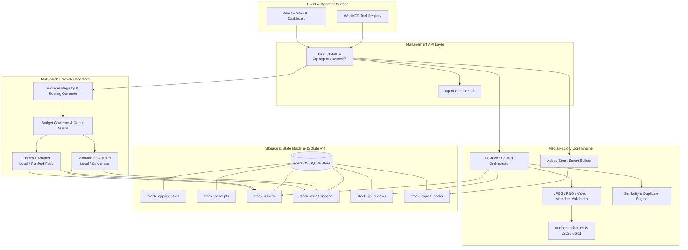

# Phase 16: Pao AI Media Factory × Huobao Engine — System Architecture

**Document Version:** 1.0.0  
**Target Runtime:** Bun-native TypeScript (Proxy & API) + React/Vite (GUI Dashboard) + SQLite (Agent OS Store)

---

## 1. High-Level Architectural Topology

---

## 2. Component Specifications

### 2.1 Centralized Rules Configuration (`src/agent-os/config/adobe-stock-rules.ts`)
Defines strict technical boundaries matching Adobe Stock marketplace requirements:
- **JPEG Rules:** 4.0 MP to 100.0 MP, max 45MB file size, sRGB color profile.
- **PNG Rules:** True alpha channel, 5%–90% transparent pixel bounds, >=15% subject bounding box area, max 0.08 edge halo tolerance.
- **Video Rules:** 5.0 to 60.0 seconds duration, MOV/MP4 container, ProRes/H.264/HEVC/AV1 codecs, standard FPS (23.98–60).
- **Metadata Rules:** Title length 5–200 characters, 5–49 unique keywords, strict prohibited regex filters for brand logos, trademarks, and celebrities.

### 2.2 5-Agent Reviewer Council (`src/agent-os/reviewers/stock-reviewers.ts`)
- **1. Technical QC Agent:** Validates resolution, megapixels, byte limits, container formats, and codec standards.
- **2. Visual Artifact Agent:** Detects anatomical flaws (hands, faces, limbs), severe blur, AI text distortion, and video temporal flicker.
- **3. Commercial Value Reviewer:** Evaluates subject prominence, copy space availability, and buyer use case suitability.
- **4. Similarity Reviewer:** Evaluates Jaccard text token similarity + perceptual hash distance across sibling assets to prevent account penalties for spam duplicates.
- **5. Compliance Reviewer:** Flags IP, trademark, and celebrity references into `HOLD_FOR_COMPLIANCE_REVIEW` for human verification.

### 2.3 Provider Adapters & Budget Governor (`src/agent-os/providers/`)
- **ComfyUI Adapter:** Converts generation requests into parameterized KSampler JSON node graphs with deterministic seeds and steps.
- **MiniMax H3 Video Adapter:** Dual routing (`LOCAL` on-prem ComfyUI vs `RUNPOD` serverless GPU) with duration clamping and poster frame generation.
- **Budget Governor:** Tracks generation attempts per concept (default max 8) and batch cost ceilings to prevent runaway spend.

### 2.4 Adobe Stock Export Package Builder (`src/agent-os/export/stock-export-builder.ts`)
Assembles production submission archives:
- Master asset + preview image.
- `adobe_stock_submission.csv` (Standard format: `Filename, Title, Keywords, Category, Releases`).
- `metadata.json`, `lineage.json`, and `qc_certificate.json`.
- `manifest.json` with `humanReviewRequired: true`.
