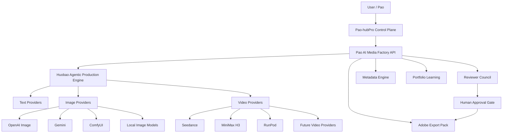
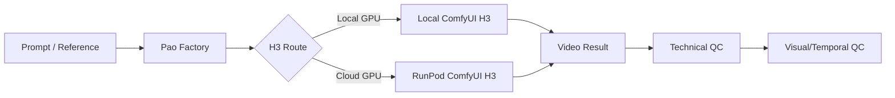
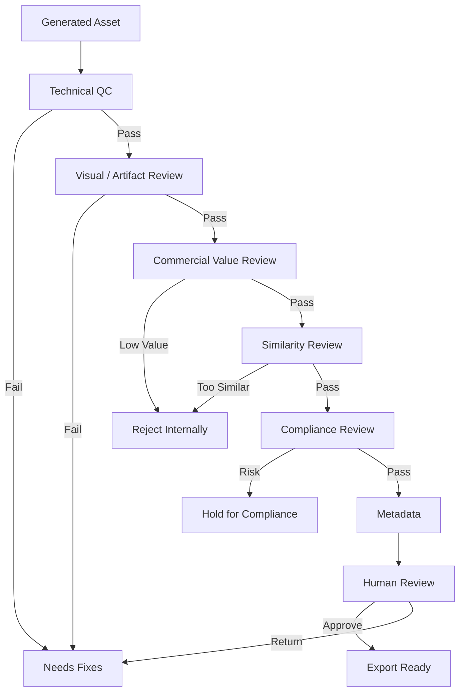
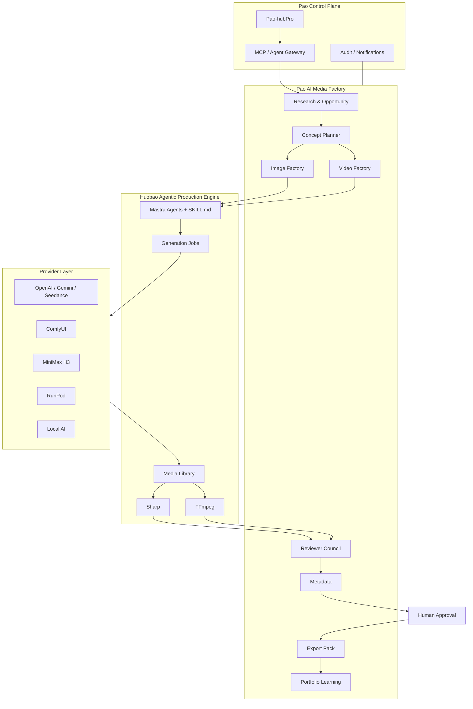

# Phase 16 — Pao AI Image Factory + Pao AI Video Factory × Huobao Agentic Production Engine

> **Status:** Implementation Blueprint / Ready for Codex
> **Primary Goal:** สร้างโรงงานผลิตภาพและวิดีโอ AI สำหรับ Adobe Stock แบบเป็นระบบ โดยใช้ Huobao Drama เป็น Agentic Media Production Engine แล้วเพิ่ม Stock Workflow, Reviewer Council, Metadata, QC, Export และ Portfolio Learning ของ Pao เข้าไป
> **Priority:** Adobe Stock First
> **Date:** 2026-08-30
> **Owner:** Pao

---

## 0. Executive Summary

Phase 16 จะรวมระบบที่เราวางไว้ก่อนหน้าให้กลายเป็น **Pao AI Media Factory** ที่รองรับทั้งภาพและวิดีโอ โดยไม่เขียน media engine ใหม่ทั้งหมดตั้งแต่ศูนย์

แนวทางหลักคือ:

1. ใช้ **Huobao Drama v3.x** เป็นฐานของ Media/Agent Workflow Engine
2. ไม่เปลี่ยน Pao-hubPro ให้กลายเป็น Huobao ทั้งระบบ
3. แยก Huobao ออกเป็น service / engine ที่ Pao-hubPro เรียกผ่าน API
4. เพิ่ม `Stock Image Mode`
5. เพิ่ม `Stock Video Mode`
6. เก็บ `Drama Mode` เดิมไว้เป็น optional mode
7. เพิ่ม `Reviewer Council` สำหรับ QC หลายชั้น
8. เพิ่ม `Adobe Stock Compliance Gate`
9. เพิ่ม `Metadata Generator`
10. เพิ่ม `Export Pack`
11. เพิ่ม `Portfolio Learning` เพื่อเรียนรู้จากผลอนุมัติ/ปฏิเสธ/ยอดดาวน์โหลดจริงในอนาคต

เป้าหมายสุดท้ายไม่ใช่ “Generate เยอะที่สุด” แต่คือ:

> **Research → เลือก Concept ที่มีเหตุผล → Generate → QC → คัดงาน → Metadata → Human Review → Export → เรียนรู้จากผลจริง**

---

# 1. Why Phase 16

ตอนนี้เรามีองค์ประกอบสำคัญหลายส่วนแล้ว เช่น:

- Pao-hubPro
- Pao AI Image Factory concept
- Pao AI Video Factory
- MoneyPrinterTurbo integration concept
- H3 / ComfyUI / RunPod workflow
- Reviewer Council concept
- Skill-based automation
- AI provider orchestration
- Adobe Stock production focus

สิ่งที่ยังขาดคือ **Production Engine กลาง** ที่จัดการ:

- Project
- Asset
- Character / Scene / Reference
- Generation Job
- Batch Job
- Progress
- Retry
- Media Files
- Thumbnails
- Video Stitching
- Agent Skills
- Provider Adapters
- Storage
- Database
- Web UI

Huobao มีส่วนเหล่านี้อยู่จำนวนมากแล้ว จึงเหมาะให้เป็น foundation สำหรับ Phase 16

---

# 2. Verified Huobao Baseline

อ้างอิง repository ปัจจุบัน ณ 2026-08-30:

Repository:

```text
https://github.com/chatfire-AI/huobao-drama
```

Huobao v3.0.0 ปัจจุบันมีโครงหลัก:

```text
frontend/                  Nuxt 3 + Vue 3 + TypeScript
backend/                   Hono + Drizzle ORM + mysql2
backend/workspace/skills/  Agent Skills แบบ SKILL.md
data/                      Generated media / static assets
docker/                    DB init / deployment helpers
```

Core technology:

- Node.js 20+
- Nuxt 3
- Vue 3
- TypeScript
- Hono
- Drizzle ORM
- MySQL
- Mastra AI Agents
- OpenAI-compatible AI SDK
- Sharp
- FFmpeg
- Docker / Docker Compose

Built-in agents:

- `script_rewriter`
- `extractor`
- `storyboard_breaker`
- `prompt_generator`

Current provider model:

- Text: OpenAI-compatible, Gemini
- Image: OpenAI, Gemini, Volcengine
- Video: Volcengine / Seedance 2.0 family

Huobao มีระบบ Agent Skills ผ่าน:

```text
backend/workspace/skills/<skill-name>/SKILL.md
```

และ workspace สามารถ persist ผ่าน Docker volume ได้

## Important License Gate

ณ วันที่จัดทำเอกสารนี้ root repository ที่ตรวจพบ **ไม่มี LICENSE file แสดงอยู่ในรายการไฟล์หลัก**

ดังนั้น:

- ห้ามสมมติว่า source สามารถ redistribute / commercial repackage ได้อัตโนมัติ
- Phase 16 ต้องมี `LICENSE_REVIEW.md`
- ก่อนนำ source ไปทำ SaaS เชิงพาณิชย์หรือแจก binary/image ต้องตรวจสิทธิ์กับเจ้าของ repository
- ถ้าสิทธิ์ไม่ชัด ให้ใช้ architecture แบบ reference/integration หรือ reimplement เฉพาะแนวคิดที่อนุญาต

---

# 3. Phase 16 Product Vision

ชื่อระบบระดับ product:

```text
Pao AI Media Factory
```

ประกอบด้วย:

```text
Pao AI Image Factory
+
Pao AI Video Factory
+
Huobao Agentic Production Engine
+
Pao Reviewer Council
+
Adobe Stock Production Pipeline
```

เป้าหมาย UX:

> ผู้ใช้เลือก “สร้างภาพขาย Adobe Stock” หรือ “สร้างวิดีโอขาย Adobe Stock” → ระบบช่วย Research → วาง Concept → Generate → ตรวจ → คัด → สร้าง Metadata → เตรียมไฟล์พร้อมส่ง

---

# 4. Architecture Decision

## 4.1 ห้ามยุบทุกอย่างเป็น Monolith เดียวทันที

ไม่ควรเอา Huobao source ไปยัดลง Pao-hubPro โดยตรงทั้งหมด

ให้ใช้รูปแบบ:



### Control Plane

Pao-hubPro รับผิดชอบ:

- Dashboard กลาง
- Authentication
- User / Role
- Orchestration
- Secrets references
- Project registry
- Notifications
- Audit log
- Health monitoring
- MCP / Agent gateway

### Media Plane

Huobao-derived engine รับผิดชอบ:

- Media generation
- Image processing
- Video processing
- Provider adapters
- Job progress
- Batch generation
- FFmpeg
- Sharp
- Skills runtime
- Media library

---

# 5. Production Modes

Phase 16 ต้องเพิ่ม `production_mode`

```ts
type ProductionMode =
  | 'stock_image'
  | 'stock_png'
  | 'stock_video'
  | 'drama'
  | 'social_video'
  | 'youtube';
```

Phase 16 ต้องทำจริงก่อน 3 mode:

1. `stock_image`
2. `stock_png`
3. `stock_video`

Mode อื่นเก็บไว้รองรับอนาคต

---

# 6. Adobe Stock First Principle

ทุก asset สำหรับ Stock ต้องเริ่มจาก **Buyer Utility** ไม่ใช่เริ่มจาก “ภาพสวย”

Production logic:

```text
Buyer Need
   ↓
Commercial Use Case
   ↓
Opportunity
   ↓
Concept Family
   ↓
Prompt
   ↓
Generation
   ↓
QC
   ↓
Curation
   ↓
Metadata
   ↓
Human Review
   ↓
Export
```

ห้ามใช้ logic:

```text
Generate 1,000 ภาพ
→ ใส่ keyword อัตโนมัติ
→ ส่งทั้งหมด
```

---

# 7. Research & Opportunity Engine

เพิ่ม bounded domain:

```text
stock-intelligence/
```

หน้าที่:

- เก็บ source
- เก็บ observed date
- เก็บ freshness
- เก็บ evidence class
- เก็บ confidence
- แยก market fact กับ AI inference

## Evidence Classes

```text
A = First-party marketplace / Adobe
B = Buyer / commercial / design industry
C = Broad trend / search signal
D = Community / social signal
P = Pao portfolio performance
I = AI inference
```

ห้าม AI สร้างตัวเลข demand ปลอม

ถ้าไม่มีข้อมูล:

```text
Unknown
Insufficient evidence
```

ต้องไม่แสดงเป็น:

```text
Demand = 97%
Competition = 23%
ยอดขายคาดการณ์ = 50 downloads
```

ถ้าไม่มี evidence จริง

---

# 8. Opportunity Score

แยก 2 ค่า:

```text
Opportunity Score
Evidence Confidence
```

ห้ามรวมเป็น score เดียว

Default configurable weights:

| Factor | Weight |
|---|---:|
| Demand evidence | 25 |
| Competition opportunity | 18 |
| Commercial usefulness | 15 |
| Buyer intent | 10 |
| Portfolio gap | 10 |
| Differentiation | 8 |
| Season timing | 6 |
| Production feasibility | 4 |
| Compliance confidence | 4 |

ถ้าบางค่าไม่มีข้อมูล:

- normalize จากค่าที่มี หรือ
- ลด Confidence

ห้าม fabricate ค่าแทน

---

# 9. Concept Funnel

Default flow:

```text
30–100 Raw Ideas
      ↓
Commercial Filter
      ↓
Policy/IP Filter
      ↓
Semantic Similarity Cluster
      ↓
Rank
      ↓
3–10 Production Concepts
      ↓
Generate
      ↓
QC
      ↓
Curate Again
```

Meaningful variation ต้องเปลี่ยน:

- Buyer story
- Action
- Environment
- Composition
- Camera logic
- Customer use case

สิ่งต่อไปนี้ไม่ถือเป็น variation ที่ดีพอ:

- เปลี่ยนสีอย่างเดียว
- Flip
- Rotate
- Crop
- เปลี่ยน background เล็กน้อย
- เปลี่ยน filter
- เปลี่ยน aspect ratio แต่ concept เหมือนเดิม

---

# 10. Agent Architecture

Phase 16 เพิ่ม Agent ใหม่เป็น 4 กลุ่ม

## Group A — Research & Planning

### 10.1 `stock_research_agent`

หน้าที่:

- รับ niche
- ระบุ buyer problem
- สร้าง research query plan
- บันทึก provenance
- แยก evidence กับ inference

Output schema:

```json
{
  "marketplace": "adobe_stock",
  "assetType": "image",
  "region": "global",
  "buyer": "small_business_marketing",
  "signals": [],
  "unknowns": [],
  "confidence": "medium"
}
```

### 10.2 `opportunity_scoring_agent`

หน้าที่:

- ประเมิน opportunity
- ประเมิน confidence
- อธิบายเหตุผลของ score

### 10.3 `commercial_concept_agent`

หน้าที่:

- แตก concept family
- ระบุ buyer use case
- ระบุ copy space
- ระบุ differentiation
- ระบุ potential compliance risk

---

## Group B — Production

### 10.4 `prompt_director_agent`

Prompt schema ต้องประกอบด้วย:

```text
subject
action/context
composition
viewpoint/camera logic
lighting/material detail
buyer utility
copy space
output format
background intent
no-brand/IP constraints
```

### 10.5 `image_generation_agent`

รองรับ:

- text-to-image
- image-to-image
- transparent PNG
- reference image
- variation with meaningful intent

### 10.6 `video_generation_agent`

รองรับ:

- text-to-video
- image-to-video
- reference-to-video
- batch shots
- first/last frame workflows

### 10.7 `post_processing_agent`

Image:

- resize
- color profile check
- alpha inspection
- crop
- thumbnail
- WebP preview

Video:

- trim
- transcode
- poster frame
- concat
- audio strip when needed
- codec validation

---

## Group C — Reviewer Council

Reviewer Council ต้องไม่ใช่ Agent ตัวเดียวตอบ “ผ่าน/ไม่ผ่าน”

ให้แยกหน้าที่:

### 10.8 `technical_qc_agent`

ตรวจ:

- format
- dimensions
- megapixels
- file size
- alpha
- color profile
- duration
- frame rate
- codec

### 10.9 `visual_artifact_agent`

Image:

- blur
- over-sharpen
- compression artifacts
- malformed text
- strange anatomy
- hands/fingers
- teeth
- eyes
- clothing
- logos
- edge halo
- clipping

Video:

- frame instability
- morphing
- duplicated limbs
- flicker
- broken motion
- inconsistent lighting
- broken text/logo
- temporal artifacts
- subject identity drift

### 10.10 `commercial_value_reviewer`

ตรวจ:

- subject ชัดไหม
- buyer ใช้ทำอะไรได้
- มี copy space ตามเป้าหมายไหม
- composition ใช้งานจริงไหม
- concept มี standalone value ไหม

### 10.11 `similarity_reviewer`

เปรียบเทียบ:

- concept similarity
- prompt similarity
- image embedding
- perceptual hash
- composition
- sibling asset

Output:

```text
UNIQUE
RELATED_BUT_DISTINCT
TOO_SIMILAR
DUPLICATE
```

### 10.12 `compliance_reviewer`

ตรวจ potential risk:

- logo
- trademark
- copyrighted artwork
- real person
- fictional character
- artist name
- known property
- model/property release need
- generative AI labeling state

ห้าม output ว่า:

```text
100% legally safe
```

ให้ใช้:

```text
Potential compliance risk
Requires human verification
```

---

## Group D — Metadata & Learning

### 10.13 `metadata_agent`

สร้าง metadata หลังเลือก final asset แล้วเท่านั้น

ห้ามสร้าง metadata จาก prompt อย่างเดียว

Output:

```json
{
  "title": "...",
  "keywords": ["..."],
  "category": "...",
  "language": "en",
  "generatedAi": true,
  "fictionalPeopleProperty": false
}
```

### 10.14 `export_pack_agent`

สร้าง:

```text
asset-file
metadata.json
metadata.csv
qc-report.json
lineage.json
preview.jpg/webp
README.txt
```

### 10.15 `portfolio_learning_agent`

ใช้เฉพาะข้อมูลจริงจากผู้ใช้ เช่น:

- approved
- rejected
- rejection reason
- downloads
- earnings
- date uploaded
- time to first sale
- provider cost

ห้ามสร้างยอดขายจำลองเป็นข้อมูลจริง

---

# 11. Adobe Stock Current Compliance Baseline

> ตรวจสอบจาก Adobe Contributor documentation ล่าสุดที่พบ ณ 2026-08-30 ซึ่งหน้าอ้างอิงหลักอัปเดต 2026-06-11

## 11.1 Generative AI

Adobe ระบุว่า generative AI images, vectors และ videos สามารถส่งได้เมื่อเป็นไปตามข้อกำหนด

ระบบต้องรองรับ flags:

```ts
generatedAi: boolean;
fictionalPeopleProperty: boolean;
```

ก่อน `EXPORT_READY` ต้องมี Human Review สำหรับ:

- สิทธิ์การใช้ model/provider
- Generative AI label
- fictional people/property label เมื่อเข้าเงื่อนไข
- model/property release
- IP risk

ห้าม prompt/title/keywords มี reference ต้องห้าม เช่น:

- artist names
- real people
- fictional characters
- copyrighted creative works
- third-party IP
- government agencies ตามข้อกำหนด Adobe
- ข้อความที่ทำให้เข้าใจว่าเป็นเหตุการณ์ข่าวจริง

---

# 12. Stock Image Technical Gate

สำหรับ JPEG photo/illustration baseline:

```text
Resolution: 4MP–100MP
File size: max 45MB
Format: JPEG
Color profile: sRGB
No watermark / timestamp / branding
```

Phase 16 validator:

```ts
validateStockJpeg(asset)
```

Result:

```json
{
  "resolutionPass": true,
  "fileSizePass": true,
  "formatPass": true,
  "colorProfilePass": true,
  "issues": []
}
```

---

# 13. Transparent PNG Mode

`stock_png` เป็น first-class mode ไม่ใช่ image mode ธรรมดา

## Required behavior

- true alpha transparency
- no checkerboard baked into image
- no solid background
- no watermark
- no branding
- minimal empty space
- clean silhouette
- avoid unnecessary shadow
- inspect edge halo

Current baseline:

```text
Format: PNG
Resolution: 4MP–100MP
Max file size: 45MB
Color profile: sRGB
Background: transparent
```

## Alpha QC

สร้าง:

```text
Alpha Inspector
```

ตรวจอย่างน้อย:

- alpha channel exists
- transparent pixel ratio
- subject bounding box
- excessive transparent canvas
- semitransparent fringe
- edge contamination

สร้าง preview 4 แบบ:

```text
checkerboard
white
#808080 mid-tone
dark
```

เพื่อ Human Review

---

# 14. Stock Video Technical Gate

Current Adobe baseline ที่ตรวจพบ:

```text
Formats: MOV / MPG / MP4
Duration: 5–60 seconds
Recommended codecs: ProRes or H.264
Accepted standard frame rates include:
23.98 / 24 / 25 / 29.97 / 30 / 50 / 59.94 / 60
```

Phase 16 ต้องมี:

```text
ffprobe inspection
```

เก็บ:

```ts
interface VideoTechnicalMetadata {
  width: number;
  height: number;
  durationSeconds: number;
  fps: number;
  codec: string;
  container: string;
  bitrate?: number;
  audioCodec?: string;
}
```

ทุกข้อกำหนดต้อง config ได้ เพราะ Adobe สามารถเปลี่ยน policy ได้

ห้าม hard-code เป็นกฎถาวรในหลายไฟล์

ให้มี:

```text
config/adobe-stock-rules.ts
```

---

# 15. Provider Adapter Layer

สร้าง interface กลาง:

```ts
interface TextProviderAdapter {
  generate(input: TextGenerationInput): Promise<TextGenerationResult>;
}

interface ImageProviderAdapter {
  generate(input: ImageGenerationInput): Promise<ImageGenerationResult>;
}

interface VideoProviderAdapter {
  generate(input: VideoGenerationInput): Promise<VideoGenerationResult>;
}
```

Provider registry:

```text
OpenAI
Gemini
Volcengine
Seedance
ComfyUI
MiniMax H3
RunPod
Local OpenAI-Compatible
Future Providers
```

## Provider Rules

- API keys server-side only
- provider/model id centralized
- cost metadata optional/nullable
- retry policy per provider
- timeout per provider
- health check
- feature capability matrix

Example:

```json
{
  "provider": "comfyui",
  "capabilities": {
    "textToImage": true,
    "imageToImage": true,
    "transparentOutput": false,
    "referenceImage": true,
    "batch": true
  }
}
```

---

# 16. ComfyUI Integration

เพิ่ม:

```text
providers/comfyui/
```

ต้องรองรับ:

- local ComfyUI
- remote ComfyUI
- RunPod-hosted ComfyUI

Config:

```env
COMFYUI_BASE_URL=http://host.docker.internal:8188
COMFYUI_TIMEOUT_MS=600000
```

อย่าเก็บ workflow ทั้งหมด hard-code ใน source

ใช้:

```text
workflows/comfyui/*.json
```

และทำ registry:

```text
image_stock_photo_v1
image_stock_png_v1
video_h3_i2v_v1
video_h3_t2v_v1
upscale_v1
```

---

# 17. MiniMax H3 / RunPod Integration

เพิ่ม `minimax_h3` adapter

รองรับ 2 routing modes:

```text
LOCAL
RUNPOD
```

Workflow:



ต้องเก็บ generation lineage:

- provider
- model
- workflow id
- workflow version
- seed เมื่อมี
- prompt
- input references
- generation time
- cost เมื่อทราบ

---

# 18. Asset Lineage

ทุก asset ต้องย้อนกลับได้ว่าเกิดจากอะไร

```text
Research
  ↓
Opportunity
  ↓
Concept
  ↓
Prompt Version
  ↓
Generation Job
  ↓
Generated Asset
  ↓
QC Reviews
  ↓
Metadata
  ↓
Export Package
```

ห้ามมีไฟล์ใน Media Library ที่ไม่รู้ origin ถ้าเป็น generated asset

---

# 19. Core Database Model

ไม่จำเป็นต้องใช้ชื่อตารางนี้ 100% หาก repo มี schema เดิมอยู่แล้ว

Codex ต้อง inspect schema ก่อน แล้วทำ additive migration

## Suggested entities

```text
projects
production_batches
research_sources
opportunities
concepts
prompt_versions
generation_jobs
assets
asset_versions
asset_lineage
qc_reviews
similarity_groups
metadata_versions
export_packages
portfolio_events
provider_configs
model_configs
usage_records
audit_logs
```

## Asset fields

```ts
interface Asset {
  id: string;
  projectId: string;
  batchId?: string;
  conceptId?: string;

  type: 'image' | 'png' | 'video';
  mode: ProductionMode;

  source: 'generated' | 'uploaded' | 'edited';
  mimeType: string;
  path: string;
  previewPath?: string;

  width?: number;
  height?: number;
  megapixels?: number;
  durationSeconds?: number;

  provider?: string;
  model?: string;

  status: AssetStatus;

  generatedAi: boolean;
  fictionalPeopleProperty?: boolean;

  createdAt: Date;
  updatedAt: Date;
}
```

---

# 20. Asset State Machine

ใช้ workflow state ชัดเจน

```text
DRAFT
↓
PLANNED
↓
QUEUED
↓
GENERATING
↓
GENERATED
↓
TECH_QC
↓
VISUAL_QC
↓
COMMERCIAL_QC
↓
SIMILARITY_QC
↓
COMPLIANCE_QC
↓
METADATA_READY
↓
HUMAN_REVIEW
↓
EXPORT_READY
↓
EXPORTED
```

Failure / hold states:

```text
GENERATION_FAILED
NEEDS_FIXES
HOLD_COMPLIANCE
REJECT_INTERNAL
ARCHIVED
```

สำคัญ:

```text
EXPORTED != SUBMITTED
```

Phase 16 ไม่ควร auto-submit ไป Adobe แบบไร้คนตรวจ

---

# 21. QC Decision Contract

Reviewer Council final decision ต้องเป็นหนึ่งใน:

```text
READY_FOR_HUMAN_SUBMISSION_REVIEW
NEEDS_FIXES
HOLD_FOR_COMPLIANCE_REVIEW
REJECT_INTERNALLY
```

ห้าม Agent ตอบ free-form อย่างเดียว

ใช้ structured output + Zod validation

ตัวอย่าง:

```json
{
  "decision": "NEEDS_FIXES",
  "score": 82,
  "technical": [],
  "visual": [
    {
      "severity": "medium",
      "issue": "edge halo around transparent subject"
    }
  ],
  "commercial": [],
  "similarity": [],
  "compliance": [],
  "recommendedActions": []
}
```

Score เป็น internal decision support เท่านั้น

ห้ามใช้ score อ้างว่า Adobe จะอนุมัติแน่นอน

---

# 22. Similarity Engine

Similarity ต้องมีหลายชั้น

## Layer 1 — Text similarity

- normalized prompt
- concept description
- metadata title

## Layer 2 — Semantic embedding

- concept embedding
- prompt embedding

## Layer 3 — Visual similarity

- perceptual hash
- image embedding
- key-frame embedding สำหรับ video

## Layer 4 — Human meaningful-difference check

ถาม:

> “ลูกค้าจะเลือก asset นี้เพราะมี use case ต่างจากพี่น้องใน batch จริงไหม?”

ถ้าไม่ → flag

---

# 23. Metadata Engine

Metadata ต้องสร้างจาก **final selected asset**

ไม่ใช่จาก prompt รุ่นแรก

## Title

หลักการ:

- clear
- natural
- visible content only
- no unsupported claims
- no IP bait

## Keywords

Phase 16 default:

```text
1–10   strongest subject/action/context/use-case
11+    supporting relevant terms
```

Current Adobe baseline รองรับได้ถึง 49 keywords แต่ **ไม่ต้องบังคับให้เต็ม 49**

Quality > quantity

## Metadata checks

- deduplicate
- remove contradiction
- remove irrelevant trend bait
- remove artist names
- remove brands
- remove real person names
- remove fictional characters
- remove unsupported attributes

---

# 24. Export Pack

Phase 16 ไม่ auto-submit โดย default

สร้าง package พร้อม Human Upload

Folder:

```text
exports/
  2026-08-30_batch-001/
    assets/
      asset-001.jpg
      asset-002.png
      asset-003.mp4
    previews/
    qc/
    metadata.csv
    metadata.json
    lineage.json
    export-manifest.json
    README.txt
```

## export-manifest.json

```json
{
  "marketplace": "adobe_stock",
  "batchId": "...",
  "generatedAt": "...",
  "assets": [],
  "humanReviewRequired": true,
  "rulesVersion": "adobe-stock-2026-06-11"
}
```

---

# 25. UI / UX

เพิ่ม Main Navigation:

```text
Dashboard
Research
Opportunities
Concepts
Image Factory
Video Factory
Review Council
Asset Library
Metadata
Export
Portfolio
Providers
Skills
Settings
Audit Log
```

## Dashboard Widgets

```text
Active Jobs
Generation Queue
QC Pending
Needs Fixes
Compliance Hold
Ready for Human Review
Export Ready
Provider Health
Estimated Usage
```

ห้ามแสดงข้อมูลตลาดปลอม

ถ้าไม่มี:

```text
No evidence imported yet
```

---

# 26. Image Factory UI

หน้า Image Factory ต้องมี:

## Left Panel

- Project
- Mode
- Concept
- Prompt Version
- Provider
- Model
- Aspect Ratio
- Output Type
- Batch Count

## Center

- Generation canvas
- Preview grid
- compare view
- zoom
- reject/keep

## Right Panel

- QC summary
- similarity
- commercial value
- compliance flags
- metadata readiness

## Actions

```text
Generate
Regenerate with Fix
Send to QC
Compare Similarity
Create Metadata
Send to Human Review
Export
```

---

# 27. Transparent PNG UI

เพิ่ม inspector:

```text
Checkerboard
White BG
Gray BG
Dark BG
Alpha Map
Bounding Box
```

แสดง:

```text
Canvas
Subject Bounds
Transparent Ratio
Edge Halo Risk
Shadow Risk
```

---

# 28. Video Factory UI

ต้องมี:

- prompt
- reference image
- provider/model
- duration
- resolution
- fps
- shot list
- generation queue
- poster frame
- scrub preview
- key-frame comparison
- ffprobe technical panel
- temporal QC

## Shot Strategy

สำหรับ Stock Video ไม่ต้องบังคับ structure แบบ drama episode

ใช้:

```text
Stock Clip
  ├─ Single Shot
  ├─ Seamless Loop
  ├─ Slow Camera Move
  ├─ Product/Concept Motion
  └─ Background / Copy-space Motion
```

---

# 29. Huobao Agent Skills Extension

สร้าง skills:

```text
backend/workspace/skills/
  stock-research/
    SKILL.md
  stock-opportunity/
    SKILL.md
  stock-concept-planner/
    SKILL.md
  stock-image-director/
    SKILL.md
  stock-video-director/
    SKILL.md
  stock-png-director/
    SKILL.md
  stock-technical-qc/
    SKILL.md
  stock-artifact-review/
    SKILL.md
  stock-commercial-review/
    SKILL.md
  stock-similarity-review/
    SKILL.md
  stock-compliance-review/
    SKILL.md
  stock-metadata/
    SKILL.md
  stock-export/
    SKILL.md
```

Skill ไม่ควร hard-code provider

Skill ระบุ “งานที่ต้องทำ”

Adapter ระบุ “ทำด้วย model ไหน”

---

# 30. Reviewer Council Orchestration



---

# 31. Auto-Fix Loop

Phase 16 รองรับ auto-fix เฉพาะงานที่ปลอดภัย

ตัวอย่าง:

```text
Technical QC Fail
→ issue = dimensions too small
→ upscale candidate
→ rerun QC
```

```text
Artifact Review Fail
→ issue = malformed hand
→ create repair prompt
→ regenerate/inpaint
→ rerun QC
```

แต่:

```text
Compliance Risk
```

ห้ามระบบแก้แล้วประกาศผ่านเอง

ต้อง Human Review

---

# 32. Generation Budget Control

เพิ่ม budget guard:

```text
Max generations per concept
Max retries per asset
Max cost per batch
Max concurrent jobs
Provider fallback order
```

ตัวอย่าง:

```json
{
  "maxGenerationsPerConcept": 8,
  "maxAutoRetries": 2,
  "maxConcurrentImageJobs": 4,
  "maxConcurrentVideoJobs": 2
}
```

ไม่ควรใช้ “generate until pass” แบบไร้เพดาน

---

# 33. Provider Routing

Routing strategy:

```text
CHEAP
BALANCED
QUALITY
LOCAL_FIRST
CLOUD_FIRST
CUSTOM
```

ตัวอย่าง LOCAL_FIRST:

```text
Research       → Local/Qwen → fallback cloud
Prompt         → Local/Qwen → fallback GPT/Gemini
Image Draft    → Local/ComfyUI
Image Final    → best selected provider
Video Draft    → H3 local
Video Final    → H3 RunPod / Seedance
Reviewer       → mixed local + cloud
Metadata       → reliable text model
```

---

# 34. Secrets & Security

ต้องรักษา:

- API keys server-side only
- encrypted-at-rest ถ้าเก็บ DB
- never send secrets to frontend
- redact secrets in logs
- role-based access
- validate uploads
- sanitize file names
- block path traversal
- protect URL fetch from SSRF
- no arbitrary shell command from UI
- audit destructive actions

## Important Huobao Difference

Huobao ปัจจุบันเก็บ AI provider config ผ่าน Web/DB

Phase 16 ต้อง review ว่า:

- API key encrypted หรือไม่
- response API mask key หรือไม่
- logs leak key หรือไม่

ถ้าไม่ครบ → แก้ก่อน production

---

# 35. Audit Log

Record events:

```text
PROJECT_CREATED
CONCEPT_APPROVED
GENERATION_STARTED
GENERATION_FAILED
ASSET_REJECTED
QC_OVERRIDDEN
COMPLIANCE_HOLD
HUMAN_APPROVED
METADATA_EDITED
EXPORT_CREATED
PROVIDER_CONFIG_CHANGED
SKILL_CHANGED
```

Human override ต้องมี note

---

# 36. Storage Strategy

โครงแนะนำ:

```text
data/
  originals/
  generated/
  thumbnails/
  previews/
  temp/
  qc/
  exports/
```

Naming ไม่ใช้ user input ดิบ

ใช้ UUID

```text
<uuid>.<ext>
<uuid>_thumb.webp
<uuid>_poster.jpg
```

---

# 37. Job Queue

Phase 16 ไม่ควรผูก request HTTP ให้รอ video generation จบ

สร้าง Job abstraction:

```ts
interface ProductionJob {
  id: string;
  type: string;
  status: 'queued' | 'running' | 'succeeded' | 'failed' | 'cancelled';
  progress?: number;
  input: unknown;
  output?: unknown;
  error?: string;
  attempts: number;
}
```

MVP ใช้ DB queue ได้

ถ้าขยาย:

```text
Redis + BullMQ
```

แต่ห้ามเพิ่ม infrastructure โดยไม่จำเป็นในรอบแรก

---

# 38. API Boundary

ตัวอย่าง API:

```text
POST /api/v1/stock/research
POST /api/v1/stock/opportunities/score
POST /api/v1/stock/concepts

POST /api/v1/image/jobs
POST /api/v1/png/jobs
POST /api/v1/video/jobs
GET  /api/v1/jobs/:id
POST /api/v1/jobs/:id/cancel

POST /api/v1/assets/:id/review
POST /api/v1/assets/:id/review/technical
POST /api/v1/assets/:id/review/similarity
POST /api/v1/assets/:id/review/compliance

POST /api/v1/assets/:id/metadata
POST /api/v1/exports
```

API input ใช้ Zod validate

---

# 39. MCP Integration

Pao-hubPro สามารถ expose tools:

```text
stock_research
stock_create_concepts
stock_generate_image
stock_generate_png
stock_generate_video
stock_get_job
stock_run_qc
stock_generate_metadata
stock_create_export_pack
stock_get_asset
stock_list_review_queue
```

Tool ต้องไม่ expose:

```text
submit_to_adobe_without_human_review
```

ใน Phase 16

---

# 40. Notifications

Event ที่ควรแจ้ง:

```text
Video generation complete
Batch generation complete
QC requires attention
Compliance hold
Export package ready
Provider failure
Budget limit reached
```

รองรับในอนาคต:

- Telegram
- LINE
- Email
- Web notification

---

# 41. Portfolio Learning

สร้าง `portfolio_event`

```ts
type PortfolioEventType =
  | 'uploaded'
  | 'approved'
  | 'rejected'
  | 'downloaded'
  | 'earning';
```

ตัวอย่าง:

```json
{
  "assetId": "...",
  "type": "rejected",
  "source": "manual_import",
  "reason": "quality issue",
  "observedAt": "2026-09-15"
}
```

Recommendations:

```text
Scale
Continue
Test More
Reduce
Pause
Archive
```

ทุก recommendation ต้องอธิบาย evidence

---

# 42. Phase 16 Implementation Plan

## Phase 16A — Fork / Integration Baseline

- [ ] ตรวจ Huobao license
- [ ] Fork หรือสร้าง integration repository ตามสิทธิ์
- [ ] Pin upstream version/commit
- [ ] สร้าง `UPSTREAM.md`
- [ ] สร้าง `LICENSE_REVIEW.md`
- [ ] รัน baseline app
- [ ] ทดสอบ Docker
- [ ] ทดสอบ MySQL persistence
- [ ] ทดสอบ skills persistence
- [ ] ทดสอบ provider settings
- [ ] บันทึก baseline screenshots

### Exit Criteria

- Huobao baseline ทำงานได้โดยไม่แก้ behavior เดิม
- มี commit/tag baseline
- migration strategy ชัดเจน

---

## Phase 16B — Stock Domain Foundation

- [ ] เพิ่ม production modes
- [ ] เพิ่ม Projects / Batches
- [ ] เพิ่ม Concepts
- [ ] เพิ่ม Asset lineage
- [ ] เพิ่ม Generation jobs
- [ ] เพิ่ม status state machine
- [ ] เพิ่ม Audit log

### Exit Criteria

สร้าง project `Adobe Stock Test` แล้วสร้าง concept → job → asset lineage ได้

---

## Phase 16C — Pao AI Image Factory

- [ ] สร้าง Image Factory UI
- [ ] text-to-image adapter
- [ ] image-to-image adapter
- [ ] batch generation
- [ ] prompt versioning
- [ ] image preview / compare
- [ ] Sharp metadata inspection
- [ ] JPEG technical QC
- [ ] PNG transparent mode
- [ ] alpha inspector

### Exit Criteria

ผู้ใช้สร้างภาพ 1 batch และระบบแยก Keep / Reject / Needs Fixes ได้

---

## Phase 16D — Pao AI Video Factory

- [ ] สร้าง Video Factory UI
- [ ] Seedance adapter reuse
- [ ] MiniMax H3 adapter
- [ ] ComfyUI adapter
- [ ] RunPod route
- [ ] ffprobe inspection
- [ ] poster frame
- [ ] temporal QC contract
- [ ] stock clip mode

### Exit Criteria

สร้าง stock clip → inspect → QC → export-ready preview ได้

---

## Phase 16E — Reviewer Council

- [ ] Technical QC
- [ ] Visual Artifact Reviewer
- [ ] Commercial Value Reviewer
- [ ] Similarity Reviewer
- [ ] Compliance Reviewer
- [ ] structured review schema
- [ ] Human override with note
- [ ] Auto-fix loop เฉพาะ safe fixes

### Exit Criteria

ทุก generated asset ต้องผ่าน Review pipeline ก่อน Metadata/Export

---

## Phase 16F — Metadata & Adobe Export

- [ ] metadata from final asset
- [ ] title validator
- [ ] keyword ordering
- [ ] keyword dedupe
- [ ] forbidden reference checks
- [ ] generated AI flag
- [ ] fictional people/property flag
- [ ] export manifest
- [ ] metadata.csv
- [ ] metadata.json
- [ ] QC report

### Exit Criteria

สร้าง batch export ที่เปิดดูแล้วพร้อมให้ Pao ตรวจและอัปโหลดเอง

---

## Phase 16G — Research & Opportunity

- [ ] Research source model
- [ ] Provenance
- [ ] Evidence class
- [ ] Freshness
- [ ] Opportunity score
- [ ] Evidence confidence
- [ ] Concept funnel
- [ ] semantic duplicate clustering

### Exit Criteria

Research 1 niche → เลือก 3–10 concept → ส่งเข้า Factory ได้

---

## Phase 16H — Pao-hubPro / MCP Bridge

- [ ] Health endpoint
- [ ] Pao-hubPro service registration
- [ ] MCP tools
- [ ] Auth boundary
- [ ] audit propagation
- [ ] job status
- [ ] notifications

### Exit Criteria

สั่ง generation/review/export จาก Pao-hubPro ได้โดยไม่เปิด Huobao UI ก็ได้

---

# 43. Suggested Repository Layout

หาก fork Huobao:

```text
pao-ai-media-factory/
├── backend/
│   ├── src/
│   │   ├── stock/
│   │   │   ├── research/
│   │   │   ├── opportunities/
│   │   │   ├── concepts/
│   │   │   ├── qc/
│   │   │   ├── similarity/
│   │   │   ├── compliance/
│   │   │   ├── metadata/
│   │   │   ├── export/
│   │   │   └── portfolio/
│   │   ├── providers/
│   │   │   ├── image/
│   │   │   ├── video/
│   │   │   └── text/
│   │   └── jobs/
│   └── workspace/
│       └── skills/
├── frontend/
│   ├── pages/
│   │   ├── image-factory/
│   │   ├── video-factory/
│   │   ├── review/
│   │   ├── metadata/
│   │   └── export/
├── workflows/
│   └── comfyui/
├── config/
│   └── adobe-stock-rules.ts
├── docs/
│   ├── PHASE_16.md
│   ├── UPSTREAM.md
│   ├── LICENSE_REVIEW.md
│   └── ADOBE_STOCK_POLICY.md
└── data/
```

Codex ต้องใช้ layout จริงของ repo เป็นหลัก ถ้าแตกต่างจากตัวอย่างนี้

---

# 44. Environment Variables

ตัวอย่าง:

```env
# Core
DATABASE_URL=mysql://...
STORAGE_PATH=./data/static
PORT=5679

# Security
APP_ENCRYPTION_KEY=change-me

# ComfyUI
COMFYUI_BASE_URL=http://host.docker.internal:8188
COMFYUI_TIMEOUT_MS=600000

# RunPod
RUNPOD_API_KEY=
RUNPOD_ENDPOINT_ID=

# Optional Local AI
LOCAL_OPENAI_BASE_URL=http://host.docker.internal:11434/v1
LOCAL_OPENAI_MODEL=qwen2.5:latest
```

API keys ที่ปัจจุบันจัดการผ่าน DB/Web ต้องไม่ duplicate กับ env โดยไม่มี source-of-truth ชัดเจน

---

# 45. Configuration Principles

Provider IDs, Model IDs และ Adobe rules ต้อง centralized

ห้ามมี:

```ts
if (model === 'xxx')
```

กระจายทั่ว codebase

ใช้ registry/config:

```text
providers.ts
models.ts
capabilities.ts
adobe-stock-rules.ts
```

---

# 46. Testing Strategy

## Unit Tests

- opportunity scoring
- metadata dedupe
- forbidden keyword detection
- image technical validator
- PNG alpha validator
- video duration validator
- provider registry
- state transition

## Integration Tests

- create project → concept → job
- generation job → asset
- asset → QC
- QC → metadata
- metadata → export

## E2E

### E2E-01 Stock Image

```text
Create project
→ create concept
→ generate image
→ run QC
→ approve human review
→ generate metadata
→ export
```

### E2E-02 Transparent PNG

```text
Generate PNG
→ true alpha test
→ halo inspection
→ QC
→ metadata
→ export
```

### E2E-03 Stock Video

```text
Generate 5–60 sec clip
→ ffprobe
→ temporal QC
→ similarity
→ metadata
→ export
```

---

# 47. Performance Targets

MVP ไม่ต้อง optimize เกินจริง

แต่ต้องมี:

- lazy thumbnail loading
- WebP preview
- poster frame
- pagination
- no full video preload in asset grid
- job polling/backoff หรือ SSE
- DB indexes สำหรับ status/project/batch/date

---

# 48. Failure Handling

ทุก external provider call ต้องมี:

```text
timeout
retry policy
error normalization
provider raw error logging (secret-redacted)
user-friendly message
```

ห้าม swallow error

Generation failure ไม่ควรทำให้ batch ทั้งหมดหาย

---

# 49. Data Safety

Codex implementation rules:

- additive migration only
- ห้าม drop database
- ห้าม reset production data
- ห้ามลบ asset เดิมเพื่อให้ schema ผ่าน
- backup ก่อน migration ใหญ่
- migration rollback plan
- preserve Huobao drama mode behavior

---

# 50. Definition of Done — Phase 16

Phase 16 ถือว่าเสร็จเมื่อ:

## Core

- [ ] Huobao baseline ถูก integrate โดยไม่ทำลาย workflow เดิม
- [ ] Pao AI Image Factory ใช้งานได้
- [ ] Pao AI Video Factory ใช้งานได้
- [ ] Stock Image / PNG / Video modes ใช้งานได้

## Providers

- [ ] Provider registry
- [ ] Image provider อย่างน้อย 1 ตัวทำงานจริง
- [ ] Video provider อย่างน้อย 1 ตัวทำงานจริง
- [ ] ComfyUI integration
- [ ] H3/RunPod integration หรือ mock adapter ที่แยกชัดเจนถ้ายังไม่มี credentials

## QC

- [ ] Technical QC
- [ ] Visual QC
- [ ] Commercial QC
- [ ] Similarity QC
- [ ] Compliance QC

## Adobe Stock

- [ ] Generative AI state
- [ ] Metadata
- [ ] Export pack
- [ ] Human approval gate
- [ ] policy config version

## Engineering

- [ ] typecheck pass
- [ ] lint pass
- [ ] tests pass
- [ ] frontend build pass
- [ ] backend build/typecheck pass
- [ ] Docker build pass
- [ ] no secrets committed
- [ ] migration reviewed
- [ ] docs updated

---

# 51. Non-Goals for Phase 16

ยังไม่ทำเป็น default:

- fully automatic Adobe submission
- bypass human compliance review
- fake demand metrics
- guaranteed sales prediction
- guaranteed approval prediction
- mass-upload every generation
- automatic legal clearance
- destructive rearchitecture of Pao-hubPro

---

# 52. Phase 16 Success Metrics

วัดระบบจาก:

## Production

- generation success rate
- retry rate
- average generation time
- provider failure rate

## Quality

- internal rejection rate
- artifact rate
- similarity rejection rate
- human override rate

## Workflow

- time from concept → export-ready
- manual steps reduced
- metadata edit rate

## Portfolio — เมื่อมีข้อมูลจริง

- Adobe approval rate
- rejection reasons
- download rate
- earnings per asset
- earnings per concept
- earnings per provider cost

ห้ามใช้ mock data ปนกับ real metric

---

# 53. Recommended Build Order

ลำดับที่ดีที่สุด:

```text
1. Baseline Huobao
2. License Gate
3. Stock Domain + Asset Lineage
4. Image Factory
5. Technical QC
6. Transparent PNG
7. Video Factory
8. H3 / ComfyUI / RunPod
9. Reviewer Council
10. Similarity Engine
11. Compliance Gate
12. Metadata
13. Export Pack
14. Research / Opportunity
15. Pao-hubPro MCP Bridge
16. Portfolio Learning
```

เหตุผล:

- สร้าง production pipeline ให้ใช้ได้ก่อน
- แล้วเพิ่ม intelligence
- ไม่ทำ research dashboard ใหญ่ก่อนที่จะมี factory รองรับ output

---

# 54. Codex Implementation Guardrails

Codex ต้องทำตามนี้:

1. Inspect repository ก่อนแก้
2. อ่าน `CLAUDE.md`, README, package scripts, schema, migrations
3. ตรวจ package manager จริง
4. ห้าม assume path ตามเอกสารนี้ถ้า repo จริงต่างกัน
5. Preserve behavior เดิม
6. Additive migrations
7. Secrets server-side
8. Structured AI outputs + validation
9. Human gate ก่อน export-ready/submission decision
10. Run real checks ก่อนจบ
11. สรุป changed files
12. สรุป migrations
13. สรุป env vars
14. สรุป tests
15. สรุป unresolved risks

---

# 55. One-Shot Codex Master Prompt

> ใช้ส่วนนี้เมื่อพร้อมสั่ง Codex ให้เริ่ม Phase 16

```text
You are implementing Phase 16 of my Pao AI ecosystem.

PROJECT NAME:
Phase 16 — Pao AI Image Factory + Pao AI Video Factory × Huobao Agentic Production Engine

PRIMARY PRODUCT GOAL:
Extend the current project into an Adobe-Stock-first AI media production system for both images and videos while preserving the existing Huobao behavior. Huobao should act as the media/agent production engine, while stock-specific research, concept planning, QC, similarity, compliance, metadata, export, and human-review workflows are added as modular bounded domains.

CRITICAL RULES:
1. Inspect the real repository first. Do not assume this specification's example paths match the repository.
2. Read README, CLAUDE.md, package files, current database schema/migrations, backend/frontend structure, provider adapters, agent setup, workspace skills, storage handling, and existing tests before editing.
3. Preserve existing user data and existing drama functionality.
4. Use additive database migrations only. Do not reset/drop databases.
5. Never expose provider secrets to the browser or logs.
6. Centralize provider/model IDs and capabilities.
7. Validate structured AI outputs before they enter business logic.
8. Do not fabricate market demand, Adobe search counts, downloads, earnings, competition counts, or acceptance probability.
9. Keep Opportunity Score separate from Evidence Confidence.
10. Keep a mandatory Human Review state before any Adobe submission-ready decision.
11. Do not implement automatic Adobe submission in this phase.
12. Never claim an asset is legally safe. Compliance output must identify potential risks and require human verification where needed.
13. Preserve lineage from research/opportunity/concept/prompt/job/provider/model to final asset/export.
14. Treat generated image/video uploads and exports as untrusted files and validate them.
15. Run the repository's real typecheck, lint, tests, production build, and Docker checks before completion when available.

ARCHITECTURE:
- Keep Pao-hubPro as the control/orchestration plane.
- Use the Huobao-derived system as the media production engine.
- Add production modes:
  stock_image
  stock_png
  stock_video
  while preserving drama mode.
- Prepare clean API/MCP boundaries so Pao-hubPro can invoke the factory later.

BUILD IN THIS ORDER:
A. Baseline & safety
- Identify exact upstream version/commit.
- Create docs/UPSTREAM.md.
- Create docs/LICENSE_REVIEW.md and explicitly note that commercial redistribution must not be assumed without clear license permission.
- Confirm existing Docker/MySQL/storage/skills behavior.

B. Stock domain foundation
- Add projects/batches/concepts where needed.
- Add production_mode.
- Add generation jobs.
- Add asset lineage.
- Add clear asset state machine:
  DRAFT
  PLANNED
  QUEUED
  GENERATING
  GENERATED
  TECH_QC
  VISUAL_QC
  COMMERCIAL_QC
  SIMILARITY_QC
  COMPLIANCE_QC
  METADATA_READY
  HUMAN_REVIEW
  EXPORT_READY
  EXPORTED
  plus failure/hold states.
- Ensure EXPORTED is not treated as Adobe submitted.

C. Pao AI Image Factory
- Add Image Factory UI.
- Support text-to-image, image-to-image, batch generation, prompt versioning, provider/model selection, keep/reject flow, compare view, thumbnails, and asset inspection.
- Add JPEG technical validation.
- Add stock_png as a first-class transparent asset mode.
- Implement alpha inspection: alpha exists, transparent ratio, bounding box, excessive empty canvas, edge halo risk, fringe risk.
- Generate checkerboard/white/gray/dark previews for transparent PNG human review.

D. Pao AI Video Factory
- Reuse existing Huobao video infrastructure where appropriate.
- Add a stock clip workflow that does not require drama episode semantics.
- Support single shot, copy-space motion, seamless-loop candidate, slow camera move, and concept motion workflows.
- Add ffprobe metadata inspection.
- Add poster frames and lightweight previews.
- Add provider adapters/interfaces for future MiniMax H3, ComfyUI, and RunPod routing without breaking existing Seedance behavior.

E. Provider layer
- Create or normalize TextProviderAdapter, ImageProviderAdapter, VideoProviderAdapter.
- Add provider capability registry.
- Keep provider/model config centralized.
- Add timeout/retry/error normalization and secret-redacted logging.
- Add ComfyUI support for local/remote endpoints.
- Store versioned ComfyUI workflow JSON outside provider business logic.
- Add a MiniMax H3 adapter abstraction supporting LOCAL and RUNPOD routing. If credentials/endpoints are unavailable, create a clearly labeled non-production adapter boundary and tests, not fake successful production data.

F. Reviewer Council
Implement independent structured reviewers:
- technical_qc_agent
- visual_artifact_agent
- commercial_value_reviewer
- similarity_reviewer
- compliance_reviewer

Final review decision must be exactly one of:
READY_FOR_HUMAN_SUBMISSION_REVIEW
NEEDS_FIXES
HOLD_FOR_COMPLIANCE_REVIEW
REJECT_INTERNALLY

Add Human Override with required note and audit log.

G. Similarity
- Add prompt/concept semantic comparison.
- Add perceptual/visual similarity for images.
- Prepare key-frame based comparison for videos.
- Flag near-duplicates for human curation.
- Do not treat small color/crop/flip/filter/aspect-ratio changes as meaningful uniqueness.

H. Metadata
- Generate metadata from the final selected asset, not from the initial prompt alone.
- Add title and ordered keywords.
- Put strongest relevant keywords first.
- Deduplicate and remove contradictions, unsupported attributes, brands, artist names, real-person names, fictional characters, copyrighted works, and prohibited IP references.
- Do not force maximum keyword count.
- Track generated-AI and fictional-people/property state for human confirmation.

I. Adobe export pack
Generate an export package containing:
- final asset files
- previews
- metadata.csv
- metadata.json
- qc reports
- lineage.json
- export-manifest.json
- README.txt

The manifest must explicitly say humanReviewRequired=true.
Do not upload to Adobe automatically.

J. Research & opportunity
- Add research source provenance, observed date, freshness, evidence class, and confidence.
- Evidence classes: A/B/C/D/P/I.
- Separate observed external facts from AI inference.
- Add Opportunity Score and Evidence Confidence separately.
- Implement a concept funnel: raw ideas -> commercial filter -> policy/IP filter -> semantic clustering -> ranking -> 3-10 production concepts.

K. Agent skills
Create modular SKILL.md definitions for:
stock-research
stock-opportunity
stock-concept-planner
stock-image-director
stock-video-director
stock-png-director
stock-technical-qc
stock-artifact-review
stock-commercial-review
stock-similarity-review
stock-compliance-review
stock-metadata
stock-export

Skills describe the task/policy. Provider adapters decide which model executes it.

L. Security/audit
- Protect provider secrets.
- Validate all API input.
- Sanitize uploaded filenames and paths.
- Prevent path traversal.
- Treat arbitrary URL fetching as SSRF-sensitive.
- Never expose arbitrary shell execution from user-controlled input.
- Audit provider configuration changes, skill changes, QC overrides, compliance holds, asset rejection, human approval, metadata edits, and exports.

M. Pao-hubPro integration boundary
Prepare APIs/tools for:
stock_research
stock_create_concepts
stock_generate_image
stock_generate_png
stock_generate_video
stock_get_job
stock_run_qc
stock_generate_metadata
stock_create_export_pack
stock_get_asset
stock_list_review_queue

Do not expose an unsafe auto-submit-to-Adobe tool.

ADOBE STOCK CONFIGURATION:
Do not scatter marketplace requirements through the code. Create a centralized versioned configuration module such as config/adobe-stock-rules.ts.
Treat current values as configurable rules, not eternal constants.

Current verified baseline at planning time includes:
- Generative AI content requires appropriate labeling in Adobe Contributor Portal.
- Contributor must have required commercial rights from the AI tool/provider.
- Avoid prohibited IP/person/artist/character references in prompts/titles/keywords.
- JPEG photo/illustration baseline: 4MP-100MP, max 45MB, sRGB.
- Transparent PNG baseline: PNG, true transparent background, 4MP-100MP, max 45MB, sRGB, no watermarks/branding.
- Stock video baseline: 5-60 seconds, accepted containers include MOV/MPG/MP4; ProRes or H.264 are recommended codecs in current Adobe guidance; validate current rules before real submission.
- Near-duplicate generative outputs should be curated rather than bulk submitted.

Do not represent these rules as legal guarantees. Keep a policy version/date and a human verification note.

UI:
Add or prepare navigation for:
Dashboard
Research
Opportunities
Concepts
Image Factory
Video Factory
Review Council
Asset Library
Metadata
Export
Portfolio
Providers
Skills
Settings
Audit Log

Every important data-driven screen must support loading, empty, error, and stale/unavailable states.
Do not fill missing market intelligence with demo values unless clearly labeled DEMO.

TESTS:
At minimum add tests for:
- state transitions
- opportunity/confidence separation
- metadata dedupe/validation
- prohibited metadata references
- JPEG technical validator
- PNG alpha validator
- video duration/container validator
- provider registry/capabilities
- QC structured output
- export manifest human-review requirement

E2E target flows:
1. Stock image: project -> concept -> generate -> QC -> human review -> metadata -> export.
2. Transparent PNG: generate -> alpha QC -> visual QC -> metadata -> export.
3. Stock video: generate -> ffprobe -> temporal QC -> similarity/compliance -> metadata -> export.

COMPLETION REPORT:
When finished, provide:
1. Architecture summary.
2. Changed files.
3. New migrations and safety notes.
4. New environment variables.
5. New routes/tools.
6. New skills.
7. Provider integrations completed vs stubbed.
8. Test/typecheck/lint/build/Docker results.
9. Known limitations.
10. Manual steps Pao must perform next.

Do not stop after creating placeholder UI. Implement the deepest safe end-to-end slice possible while preserving the existing project and data.
```

---

# 56. Manual Verification Checklist for Pao

หลัง Codex ทำ Phase 16 ให้เปาตรวจตามนี้

## Dashboard

- [ ] เปิดได้
- [ ] ไม่มี error console ร้ายแรง
- [ ] provider health ถูกต้อง

## Image

- [ ] Generate ได้
- [ ] preview ได้
- [ ] Keep / Reject ได้
- [ ] QC ทำงาน
- [ ] metadata สร้างหลัง final selection

## PNG

- [ ] ไฟล์มี alpha จริง
- [ ] checkerboard preview เป็น preview ไม่ได้ baked ลงไฟล์
- [ ] edge ไม่ขาว/ดำเป็น halo
- [ ] crop ไม่เหลือพื้นที่มากเกิน

## Video

- [ ] Generate ได้
- [ ] poster frame ขึ้น
- [ ] duration ถูกอ่านจริง
- [ ] fps/codec/container ถูกอ่านจริง
- [ ] temporal QC มีรายงาน

## Reviewer Council

- [ ] Technical
- [ ] Visual
- [ ] Commercial
- [ ] Similarity
- [ ] Compliance
- [ ] Human Review

## Metadata

- [ ] title ตรงภาพ
- [ ] keyword ไม่มั่ว
- [ ] top keywords สำคัญจริง
- [ ] ไม่มีชื่อแบรนด์/ศิลปิน/คนดังที่ไม่ควรมี

## Export

- [ ] asset final
- [ ] metadata.csv
- [ ] metadata.json
- [ ] QC report
- [ ] lineage
- [ ] manifest
- [ ] humanReviewRequired=true

---

# 57. Final Architecture Snapshot



---

# 58. Phase 16 Final Principle

ระบบนี้ต้องช่วยเปาลดงานซ้ำ แต่ไม่ลดคุณภาพการตัดสินใจ

หลัก 6 ข้อ:

```text
Research before mass generation
Commercial use before visual novelty
Meaningful diversity before quantity
QC before metadata
Human review before export/submission decision
Real portfolio evidence before scaling
```

เป้าหมาย Phase 16 คือทำให้:

> **Pao AI Image Factory และ Pao AI Video Factory ใช้ Huobao เป็น Agentic Production Engine และกลายเป็น Adobe-Stock-first production system ที่สร้างงาน, ตรวจงาน, คัดงาน, ทำ metadata และ export ได้อย่างเป็นระบบ โดยยังคง Human Approval เป็นด่านสุดท้ายก่อนการส่งจริง**

---

# 59. Sources / Baseline References

## Huobao

- Repository: https://github.com/chatfire-AI/huobao-drama
- Baseline reviewed: 2026-08-30
- README reported v3.0.0 update: 2026-08

## Adobe Stock

Baseline pages checked for this Phase document:

- Generative AI guidelines:
  https://helpx.adobe.com/stock/contributor/submit-your-content/submit-generative-ai-content/generative-ai-content-guidelines.html

- Submit generative AI content:
  https://helpx.adobe.com/stock/contributor/submit-your-content/submit-generative-ai-content/submit-generative-ai-content.html

- Distinct generative AI submission best practices:
  https://helpx.adobe.com/stock/contributor/submit-your-content/submit-generative-ai-content/distinct-generative-ai-submission-best-practices.html

- PNG technical requirements:
  https://helpx.adobe.com/stock/contributor/submit-your-content/submit-pngs/technical-requirements-png-submission.html

- PNG best practices:
  https://helpx.adobe.com/stock/contributor/submit-your-content/submit-pngs/png-best-practices.html

- Photo technical/legal requirements:
  https://helpx.adobe.com/stock/contributor/submit-your-content/submit-photos/technical-legal-requirements-photo-submission.html

- Video technical requirements:
  https://helpx.adobe.com/stock/contributor/submit-your-content/submit-videos/technical-requirements-for-video-submissions.html

- Generative AI video guidelines:
  https://helpx.adobe.com/stock/contributor/submit-your-content/submit-generative-ai-content/generative-ai-video-submission-guidelines.html

> **Policy note:** Adobe Stock requirements can change. Before actual submission, verify current Adobe Contributor documentation again instead of treating values in this document as permanent constants.

---

**End of Phase 16 Specification**
