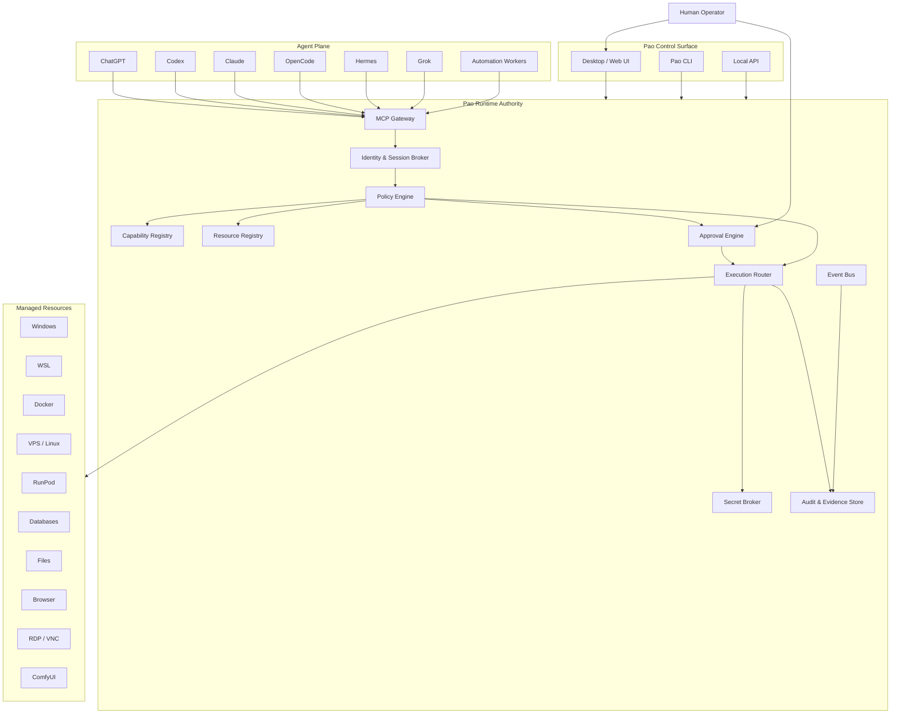

# Phase ล่าสุด — Pao-hubPro × Navop Architecture
## Native AI Operations Workspace, Host-Authoritative MCP Runtime, Unified SSH/SFTP/Database/RDP Resource Fabric, Agent Operations Cockpit, Permission-Governed Local Tool Execution, Extension Capability Registry & Auditable Human-Controlled Automation Plane

> Project: **Pao-hubPro**  
> Type: Architecture + Runtime + Control Plane + Agent Operations  
> Status: Implementation Specification  
> Target: Windows-first, local-first, multi-host, multi-agent  
> Reference concept: `feigeCode/navop`  
> Implementation rule: **Clean implementation — do not copy Navop source code, UI assets, names, internal identifiers, or proprietary/supplementary-licensed implementation.**

---

# 1. Executive Goal

สร้าง Pao-hubPro ให้เปลี่ยนจาก Web Dashboard / MCP Hub ธรรมดา ไปเป็น **Host-Authoritative AI Operations Platform** ที่สามารถควบคุมเครื่อง Local PC, VPS, WSL, Docker, RunPod, Database, Files, Terminal, Browser และ Remote Desktop ผ่าน Agent หลายตัวได้อย่างปลอดภัย

แกนหลักของระบบต้องแยกหน้าที่ชัดเจน:

```text
Control Surface = แสดงผล / สั่งงาน / ตรวจสอบ
Runtime Host    = ผู้มีสิทธิ์ execute จริง
MCP Gateway     = interface ให้ AI / Agent
Policy Engine   = ตัดสินว่าอนุญาตหรือไม่
Approval Plane  = Human-in-the-loop
Audit Plane     = เก็บหลักฐานทุก action
Agent           = ผู้ขอใช้ capability
```

เป้าหมายสำคัญที่สุด:

> Agent ห้ามถือสิทธิ์ของเครื่องโดยตรง  
> Agent ต้องร้องขอ capability จาก Pao Runtime ทุกครั้ง

---

# 2. Why This Phase Exists

Pao-hubPro มี Agent, MCP, Skills, Browser, Local Tools, VPS, Adobe Stock workflow และระบบ Automation หลายส่วนแล้ว

ปัญหาที่จะเกิดเมื่อระบบใหญ่ขึ้นคือ:

1. Agent แต่ละตัวใช้เครื่องมือคนละแบบ
2. Credential กระจายอยู่หลายจุด
3. ไม่มี authority กลางตัดสิน permission
4. ไม่มี resource identity กลาง
5. Human approval ไม่เป็นมาตรฐานเดียวกัน
6. Audit log แยกกัน
7. CLI อาจเริ่มมี business logic ซ้ำกับ Dashboard
8. Agent อาจ execute command โดยตรงโดยข้าม policy
9. Remote resource เช่น VPS / RunPod / WSL อาจถูกอ้างด้วย IP หรือ secret ตรง ๆ
10. Extension ใหม่เพิ่มแล้วอาจไม่มี governance

Phase นี้จะแก้ทั้งหมดด้วย **Pao Runtime Authority**

---

# 3. Reference Findings Adopted as Design Patterns

แนวคิดที่ศึกษาจาก Navop และนำมาใช้เป็น architectural pattern เท่านั้น:

- Native operations workspace
- SSH / SFTP / Terminal / Database / RDP / VNC ใน workspace เดียว
- Agent workspace ที่รวม terminal, project files, Git และ diff
- Public MCP สำหรับ external agents
- Host-authoritative tool execution
- Selective tool exposure
- Approval-aware permission modes
- Loopback-only local runtime
- CLI เป็น thin client ไม่ฝัง business logic
- Extension capability marketplace / registry

## Clean-Room Rule

Pao-hubPro ต้อง:

- ไม่ใช้ชื่อ Navop ภายในระบบ
- ไม่ copy source code
- ไม่ copy UI
- ไม่ copy schema
- ไม่ copy identifiers
- ไม่ copy extension format
- ไม่ fork runtime มาแก้
- ไม่ reuse proprietary branding/assets
- เขียน interface, schema และ implementation ใหม่เอง

---

# 4. Core Architecture



---

# 5. Architecture Principle

## 5.1 Runtime Is the Authority

ห้ามให้ UI, CLI หรือ Agent execute remote/local tools เอง

ผิด:

```text
Codex
  ↓
ssh root@server
```

ถูก:

```text
Codex
  ↓
Pao MCP
  ↓
Policy
  ↓
Approval
  ↓
Execution Router
  ↓
SSH Adapter
  ↓
VPS
```

---

# 6. Pao Runtime Components

## 6.1 Runtime Host

Service หลักของระบบ

Windows target:

```text
PaoRuntime.exe
```

หน้าที่:

- host local MCP server
- resource discovery
- tool registration
- session management
- permission evaluation
- approval queue
- execution dispatch
- credential mediation
- audit writing
- event streaming
- capability lifecycle

Runtime ต้องทำงานแยกจาก UI ได้

---

## 6.2 MCP Gateway

หน้าที่:

- expose tools ให้ external agents
- validate schema
- identify caller
- attach session context
- forward request เข้า Policy Engine
- normalize result
- generate trace ID

Transport ขั้นแรก:

```text
stdio bridge
localhost HTTP/SSE
localhost Streamable HTTP
```

Remote transport ห้ามเปิดเป็นค่า default

---

## 6.3 Capability Registry

ทุกอย่างที่ Agent ใช้ได้ต้องเป็น Capability

```text
Capability
├── Tool
├── Skill
├── MCP Server
├── Agent
├── Connector
├── Extension
├── Runtime Adapter
└── Workflow
```

ตัวอย่าง:

```text
terminal.exec
filesystem.read
filesystem.write
ssh.exec
sftp.download
sftp.upload
database.query
database.mutate
docker.logs
docker.exec
browser.inspect
browser.navigate
rdp.connect
comfyui.submit
runpod.instance.status
```

---

# 7. Resource Registry

อย่าให้ Agent ใช้ IP / path / secret โดยตรง

ใช้ canonical resource ID

ตัวอย่าง:

```text
host://local/windows
host://local/wsl/ubuntu
host://vps/main
host://runpod/comfyui
db://vps/main/postgres
files://project/pao-hubpro
docker://local/pao-api
browser://local/chrome/main
service://runpod/comfyui
```

Agent เห็น:

```json
{
  "resource_id": "host://vps/main",
  "display_name": "Main VPS",
  "type": "ssh-host",
  "status": "online"
}
```

Agent ห้ามเห็น:

```text
IP
Password
Private Key
Raw token
Cloud secret
```

โดยไม่จำเป็น

---

# 8. Secret Broker

Credential ต้องเก็บแยกออกจาก Resource

```text
Resource
   │
   └── credential_ref
           │
           ▼
      Secret Broker
```

Secret provider รองรับในอนาคต:

- Windows Credential Manager
- DPAPI
- encrypted local vault
- environment secret
- external secret manager

Agent ต้องไม่มี API แบบ:

```text
secret.get_plaintext()
```

แต่ให้เรียก:

```text
ssh.exec(resource_id=...)
```

Runtime เป็นคน resolve secret

---

# 9. Permission Model

ไม่ใช้ชื่อ permission profile ของ Navop

Pao-hubPro ใช้ 4 ระดับ:

| Profile | ความหมาย |
|---|---|
| `observe` | อ่านข้อมูลอย่างเดียว |
| `guarded` | read อัตโนมัติ / write ต้อง approval |
| `trusted` | write ทั่วไปอัตโนมัติ / destructive ต้อง approval |
| `operator` | automation สูง แต่ยังบังคับ critical gate |

ค่า default:

```text
guarded
```

---

# 10. Risk Classification

ทุก tool ต้องมี risk class

| Risk | ตัวอย่าง | Default |
|---|---|---|
| R0 | list resources, health | allow |
| R1 | read file, SELECT query, logs | allow |
| R2 | write file, create branch | approval by policy |
| R3 | shell command, DB update, deploy | approval |
| R4 | delete, DROP, shutdown, secret change | explicit approval |
| R5 | irreversible / privileged / broad destructive | blocked unless policy override |

---

# 11. Approval Engine

Approval object ต้องมี:

```json
{
  "approval_id": "apr_xxx",
  "trace_id": "tr_xxx",
  "agent_id": "codex-main",
  "tool": "ssh.exec",
  "resource": "host://vps/main",
  "risk": "R3",
  "summary": "Restart pao-api service",
  "reason": "Deploy new backend build",
  "expires_at": "...",
  "status": "pending"
}
```

Human actions:

```text
Approve once
Approve session
Deny
Deny + block tool
Edit arguments
```

Critical operations ต้องห้ามใช้ "approve forever"

---

# 12. Tool Exposure

Agent แต่ละตัวเห็น tool ไม่เหมือนกัน

ตัวอย่าง:

```yaml
agents:
  codex-main:
    expose:
      - filesystem.read
      - filesystem.write
      - terminal.exec
      - git.*
      - docker.logs
      - docker.exec

  chatgpt-pm:
    expose:
      - resources.list
      - audit.query
      - workflow.status
      - filesystem.read

  adobe-stock-agent:
    expose:
      - comfyui.*
      - filesystem.asset.*
      - metadata.*
```

ข้อดี:

- ลด attack surface
- ลด context noise
- ลด tool-selection error
- แบ่ง responsibility ชัดเจน

---

# 13. MCP Tool Registry V1

## Core

```text
pao.system.health
pao.system.info

pao.resources.list
pao.resources.get
pao.resources.status

pao.capabilities.list
pao.capabilities.describe
```

## Terminal

```text
pao.terminal.create
pao.terminal.exec
pao.terminal.status
pao.terminal.close
```

## Files

```text
pao.files.list
pao.files.read
pao.files.stat
pao.files.write
pao.files.move
pao.files.copy
pao.files.delete
```

## SSH

```text
pao.ssh.connect
pao.ssh.exec
pao.ssh.disconnect
pao.ssh.forward.create
pao.ssh.forward.close
```

## Remote Files

```text
pao.remote_files.list
pao.remote_files.read
pao.remote_files.upload
pao.remote_files.download
pao.remote_files.move
pao.remote_files.delete
```

## Database

```text
pao.db.list
pao.db.schema
pao.db.query
pao.db.explain
pao.db.mutate
```

## Docker

```text
pao.docker.containers.list
pao.docker.logs
pao.docker.exec
pao.docker.restart
pao.docker.stop
```

## Git

```text
pao.git.status
pao.git.diff
pao.git.branch.list
pao.git.branch.create
pao.git.commit
```

## Agent

```text
pao.agent.list
pao.agent.session.create
pao.agent.session.status
pao.agent.session.stop
```

## Approval

```text
pao.approval.list
pao.approval.get
pao.approval.respond
```

## Audit

```text
pao.audit.query
pao.audit.trace
pao.audit.export
```

---

# 14. Tool Contract

ทุก tool ต้อง declare metadata:

```json
{
  "name": "pao.ssh.exec",
  "version": "1.0.0",
  "risk": "R3",
  "mutates": true,
  "supports_dry_run": true,
  "requires_resource": true,
  "requires_secret": true,
  "approval_policy": "policy",
  "timeout_sec": 120,
  "adapter": "ssh"
}
```

---

# 15. Mandatory Dry-Run

Tool ที่เป็น R3+ ถ้าทำได้ ต้องมี:

```text
dry_run=true
```

Flow:

```text
Agent Request
    ↓
Validate
    ↓
Dry Run / Preview
    ↓
Policy Evaluate
    ↓
Approval
    ↓
Execute
```

ตัวอย่าง deploy:

```text
files changed: 12
services affected: pao-api
downtime expected: <10 sec
rollback available: yes
risk: R3
```

---

# 16. Execution Router

Router เลือก adapter ตาม capability

```text
ssh.exec
    ↓
SSH Adapter

files.read
    ↓
Local FS / SFTP Adapter

db.query
    ↓
Database Adapter

docker.exec
    ↓
Docker Adapter
```

Adapter interface:

```ts
interface CapabilityAdapter {
  validate(input): ValidationResult
  preview(input, context): PreviewResult
  execute(input, context): ExecutionResult
  cancel(executionId): CancelResult
  health(): HealthResult
}
```

---

# 17. Session Model

Session types:

```text
human-session
agent-session
automation-session
terminal-session
ssh-session
db-session
workflow-session
```

Agent session ต้องผูก:

```text
agent_id
identity
project_id
allowed_resources
allowed_capabilities
policy_profile
started_at
expires_at
```

---

# 18. Agent Operations Cockpit

หน้าใหม่ใน Pao-hubPro:

```text
Agent Operations
├── Active Agents
├── Sessions
├── Tasks
├── Terminal
├── Project Files
├── Git Status
├── Diff
├── Tool Calls
├── Approvals
├── Audit Trail
└── Resource Usage
```

Agent card:

```text
Codex
Status: Running
Project: Pao-hubPro
Session: ags_01
Current task: Build Resource Registry
Tools: 12 exposed
Pending approvals: 1
Last action: git.diff
```

---

# 19. Workspace Model

```text
Workspace
├── Project
├── Agents
├── Resources
├── Files
├── Terminals
├── Git
├── Databases
├── Browser
├── Remote
├── Tools
└── Audit
```

ผู้ใช้เปิด Workspace เดียวแล้วเห็น context ทั้งหมด

---

# 20. CLI Architecture

สร้าง:

```text
pao
```

CLI เป็น thin client

ห้าม implement:

- SSH engine
- database engine
- SFTP engine
- secret loading
- policy bypass

CLI มีหน้าที่:

```text
discover runtime
authenticate
fetch live capability schema
invoke capability
stream output
```

ตัวอย่าง:

```bash
pao status
pao resources list
pao tools list
pao ssh exec host://vps/main -- "docker ps"
pao files read files://project/pao-hubpro/README.md
pao audit trace tr_xxx
```

---

# 21. Runtime Discovery

Runtime local endpoint:

```text
127.0.0.1:<dynamic-port>
```

Discovery file ตัวอย่าง:

```text
%LOCALAPPDATA%/PaoHubPro/runtime.json
```

```json
{
  "pid": 14520,
  "port": 49217,
  "protocol": "http",
  "token_ref": "runtime-session-token",
  "started_at": "..."
}
```

ข้อกำหนด:

- file permission เฉพาะ user
- token rotation
- runtime nonce
- short-lived client session
- bind loopback by default

---

# 22. Database Schema

แนะนำ PostgreSQL สำหรับ control plane

## resources

```sql
CREATE TABLE resources (
  id UUID PRIMARY KEY,
  resource_uri TEXT UNIQUE NOT NULL,
  resource_type TEXT NOT NULL,
  display_name TEXT NOT NULL,
  adapter_type TEXT NOT NULL,
  credential_ref TEXT,
  config JSONB NOT NULL DEFAULT '{}',
  labels JSONB NOT NULL DEFAULT '{}',
  enabled BOOLEAN NOT NULL DEFAULT TRUE,
  created_at TIMESTAMPTZ NOT NULL DEFAULT now(),
  updated_at TIMESTAMPTZ NOT NULL DEFAULT now()
);
```

## capabilities

```sql
CREATE TABLE capabilities (
  id UUID PRIMARY KEY,
  name TEXT UNIQUE NOT NULL,
  version TEXT NOT NULL,
  adapter_type TEXT NOT NULL,
  risk_level TEXT NOT NULL,
  mutates BOOLEAN NOT NULL DEFAULT FALSE,
  supports_dry_run BOOLEAN NOT NULL DEFAULT FALSE,
  input_schema JSONB NOT NULL,
  output_schema JSONB NOT NULL,
  enabled BOOLEAN NOT NULL DEFAULT TRUE,
  created_at TIMESTAMPTZ NOT NULL DEFAULT now()
);
```

## agents

```sql
CREATE TABLE agents (
  id UUID PRIMARY KEY,
  agent_key TEXT UNIQUE NOT NULL,
  provider TEXT NOT NULL,
  display_name TEXT NOT NULL,
  policy_profile TEXT NOT NULL,
  enabled BOOLEAN NOT NULL DEFAULT TRUE,
  metadata JSONB NOT NULL DEFAULT '{}',
  created_at TIMESTAMPTZ NOT NULL DEFAULT now()
);
```

## agent_capabilities

```sql
CREATE TABLE agent_capabilities (
  agent_id UUID REFERENCES agents(id) ON DELETE CASCADE,
  capability_id UUID REFERENCES capabilities(id) ON DELETE CASCADE,
  allowed BOOLEAN NOT NULL DEFAULT TRUE,
  policy_override JSONB,
  PRIMARY KEY(agent_id, capability_id)
);
```

## sessions

```sql
CREATE TABLE sessions (
  id UUID PRIMARY KEY,
  session_type TEXT NOT NULL,
  agent_id UUID REFERENCES agents(id),
  project_id UUID,
  status TEXT NOT NULL,
  policy_snapshot JSONB NOT NULL,
  started_at TIMESTAMPTZ NOT NULL DEFAULT now(),
  expires_at TIMESTAMPTZ,
  ended_at TIMESTAMPTZ
);
```

## tool_invocations

```sql
CREATE TABLE tool_invocations (
  id UUID PRIMARY KEY,
  trace_id TEXT UNIQUE NOT NULL,
  session_id UUID REFERENCES sessions(id),
  capability_name TEXT NOT NULL,
  resource_uri TEXT,
  input_redacted JSONB NOT NULL,
  risk_level TEXT NOT NULL,
  policy_decision TEXT NOT NULL,
  approval_id UUID,
  status TEXT NOT NULL,
  started_at TIMESTAMPTZ,
  finished_at TIMESTAMPTZ,
  result_summary JSONB,
  error_code TEXT
);
```

## approvals

```sql
CREATE TABLE approvals (
  id UUID PRIMARY KEY,
  trace_id TEXT NOT NULL,
  session_id UUID REFERENCES sessions(id),
  action_summary TEXT NOT NULL,
  risk_level TEXT NOT NULL,
  request_payload JSONB NOT NULL,
  status TEXT NOT NULL,
  decision_by TEXT,
  decision_note TEXT,
  requested_at TIMESTAMPTZ NOT NULL DEFAULT now(),
  expires_at TIMESTAMPTZ,
  decided_at TIMESTAMPTZ
);
```

## audit_events

```sql
CREATE TABLE audit_events (
  id UUID PRIMARY KEY,
  trace_id TEXT,
  event_type TEXT NOT NULL,
  actor_type TEXT NOT NULL,
  actor_id TEXT,
  resource_uri TEXT,
  payload_redacted JSONB NOT NULL DEFAULT '{}',
  hash TEXT,
  created_at TIMESTAMPTZ NOT NULL DEFAULT now()
);
```

## extensions

```sql
CREATE TABLE extensions (
  id UUID PRIMARY KEY,
  extension_key TEXT UNIQUE NOT NULL,
  name TEXT NOT NULL,
  version TEXT NOT NULL,
  publisher TEXT,
  manifest JSONB NOT NULL,
  signature_status TEXT NOT NULL,
  enabled BOOLEAN NOT NULL DEFAULT FALSE,
  installed_at TIMESTAMPTZ NOT NULL DEFAULT now()
);
```

---

# 23. Policy Engine

Policy input:

```json
{
  "agent": "codex-main",
  "session": "ags_01",
  "capability": "pao.ssh.exec",
  "resource": "host://vps/main",
  "risk": "R3",
  "arguments": {
    "command": "systemctl restart pao-api"
  }
}
```

Policy output:

```json
{
  "decision": "require_approval",
  "reason": "service restart is mutable remote execution",
  "constraints": {
    "approval_scope": "once"
  }
}
```

Decisions:

```text
allow
allow_with_constraints
require_approval
deny
block
```

---

# 24. Policy Precedence

```text
System Safety Policy
       ↓
Organization Policy
       ↓
Workspace Policy
       ↓
Agent Policy
       ↓
Resource Policy
       ↓
Session Override
```

กฎชั้นล่างห้ามลดความปลอดภัยของชั้นบน

---

# 25. Command Safety

ต้องมี command classifier

ตัวอย่าง deny / high risk patterns:

```text
rm -rf /
mkfs
diskpart clean
DROP DATABASE
TRUNCATE
shutdown
reboot
net user ... /add
chmod -R 777 /
curl ... | sh
powershell iex(...)
```

ห้ามพึ่ง regex อย่างเดียว

ใช้:

```text
parser
command AST
adapter-specific rules
path scope
resource policy
human approval
```

---

# 26. File Safety

Filesystem tool ต้องมี workspace sandbox

ตัวอย่าง:

```text
files://project/pao-hubpro/
```

Agent เขียนได้เฉพาะ root ที่กำหนด

ป้องกัน:

```text
../../
symlink escape
junction escape
UNC escape
alternate data streams
case/path normalization bug
```

---

# 27. Database Safety

แยก capability:

```text
db.query
db.mutate
db.admin
```

SELECT:

```text
R1
```

INSERT/UPDATE:

```text
R2-R3
```

DELETE:

```text
R3-R4
```

DROP / ALTER destructive:

```text
R4-R5
```

ต้องมี:

- statement parser
- row limit
- timeout
- transaction mode
- optional rollback
- redaction
- explain preview

---

# 28. SSH Safety

Resource ต้อง pin host identity

เก็บ:

```text
hostname
port
host fingerprint
credential_ref
known_host_state
```

หาก fingerprint เปลี่ยน:

```text
BLOCK
```

จนกว่า Human จะ approve ใหม่

---

# 29. Audit Design

ทุก action ใช้ `trace_id`

ตัวอย่าง timeline:

```text
tr_018f
├─ request_received
├─ caller_authenticated
├─ schema_validated
├─ policy_evaluated
├─ approval_requested
├─ approval_granted
├─ adapter_started
├─ remote_command_started
├─ remote_command_finished
└─ result_returned
```

Audit ห้ามเก็บ secret plaintext

---

# 30. Evidence Bundle

Action สำคัญควร export evidence ได้

```text
evidence/
├── manifest.json
├── request.redacted.json
├── policy.json
├── approval.json
├── execution.json
├── stdout.log
├── stderr.log
└── hashes.json
```

ใช้ตรวจสอบย้อนหลังหรือ Reviewer Council

---

# 31. Extension Capability Registry

Extension Manifest ของ Pao-hubPro:

```json
{
  "id": "pao.extension.docker",
  "name": "Docker Workbench",
  "version": "1.0.0",
  "runtime": "native",
  "capabilities": [
    "pao.docker.containers.list",
    "pao.docker.logs",
    "pao.docker.exec"
  ],
  "permissions": [
    "docker.socket"
  ],
  "risk": "R3"
}
```

Extension ต้อง:

- signed
- versioned
- declared permissions
- declared capabilities
- declared adapters
- install disabled-by-default สำหรับ high risk
- support uninstall
- audit activation

---

# 32. Pao Capability Registry UI

หน้า:

```text
Capabilities
├── Tools
├── Skills
├── MCP Servers
├── Agents
├── Extensions
├── Connectors
├── Providers
└── Workflows
```

Card แสดง:

```text
Name
Type
Version
Publisher
Risk
Permissions
Agents using it
Resources using it
Enabled/Disabled
Health
Last execution
```

---

# 33. Remote Operations Workspace

```text
Remote
├── VPS
├── RunPod
├── Local PC
├── WSL
├── Docker
├── SSH
├── SFTP
├── RDP
└── VNC
```

แต่ละ resource มี:

```text
Overview
Terminal
Files
Monitoring
Ports
Processes
Logs
Secrets ref
Audit
```

---

# 34. Server Monitoring

Metrics V1:

```text
CPU
RAM
Disk
Network
Load
Processes
Service Health
Docker Containers
Uptime
```

Agent อ่าน monitoring ได้แบบ R1

Restart service เป็น R3

---

# 35. Port Forwarding

Capability:

```text
pao.ssh.forward.create
```

support:

```text
local
remote
dynamic SOCKS
```

ทุก tunnel ต้องมี:

```text
owner session
resource
bind address
local port
remote endpoint
TTL
audit trace
```

default bind:

```text
127.0.0.1
```

---

# 36. Reviewer Council Integration

ก่อน destructive หรือ production action สามารถใช้:

```text
Primary Agent
    ↓
Reviewer Council
├── ChatGPT
├── Local AI
└── Claude
    ↓
Policy Engine
    ↓
Human Approval
```

Reviewer Council ไม่มีสิทธิ์ approve แทน Human สำหรับ R4/R5

---

# 37. Workflow Runtime

Workflow step ทุกตัวต้องใช้ capability layer

ผิด:

```yaml
- run: ssh root@server docker restart app
```

ถูก:

```yaml
- capability: pao.docker.restart
  resource: docker://vps/main/pao-api
  approval: policy
```

ทำให้:

- resume ได้
- audit ได้
- permission ได้
- retry ได้
- simulate ได้

---

# 38. Event Bus

Events:

```text
agent.started
agent.stopped
session.created
tool.requested
tool.allowed
tool.denied
approval.requested
approval.decided
execution.started
execution.completed
execution.failed
resource.online
resource.offline
extension.installed
policy.changed
```

Consumers:

```text
Dashboard
Audit Store
Notification
Automation
Reviewer Council
Analytics
```

---

# 39. Notification Integration

แจ้งเตือนเมื่อ:

- R4/R5 approval
- repeated denied actions
- host fingerprint changed
- resource offline
- automation failed
- suspicious command
- extension permission changed

ช่องทาง:

```text
Pao-hubPro UI
Desktop notification
Telegram
Discord
Webhook
```

---

# 40. Failure Model

ระบบต้อง fail closed

หาก:

```text
Policy Engine unavailable
Credential Broker unavailable
Schema validation fails
Agent identity unknown
Resource identity mismatch
Approval expired
Audit write fails for critical operation
```

ผล:

```text
DENY EXECUTION
```

---

# 41. Runtime Health

Endpoint:

```text
/health/live
/health/ready
/health/detail
```

MCP:

```text
pao.system.health
```

แสดง:

```json
{
  "runtime": "ready",
  "policy": "ready",
  "database": "ready",
  "secret_broker": "ready",
  "audit": "ready",
  "adapters": {
    "ssh": "ready",
    "filesystem": "ready",
    "docker": "ready"
  }
}
```

---

# 42. MVP Scope

## MVP-1

ต้องมี:

- Runtime Host
- MCP Gateway
- Resource Registry
- Capability Registry
- Policy Engine
- Approval Queue
- Audit log
- Local filesystem
- Local terminal
- SSH exec
- Git read
- CLI thin client

## MVP-2

เพิ่ม:

- SFTP
- Docker
- Database
- Monitoring
- Agent Operations UI

## MVP-3

เพิ่ม:

- RDP/VNC
- Port forwarding
- Extension Registry
- Workflow Runtime
- Reviewer Council integration

---

# 43. Recommended Tech Stack

สำหรับ Pao-hubPro ปัจจุบัน:

## Runtime

```text
Rust or TypeScript service
```

ถ้าต้องการ Windows-native / low-level execution / long-running daemon:

```text
Rust preferred
```

## Control Plane API

```text
TypeScript
Fastify / Hono / equivalent
```

## Database

```text
PostgreSQL
```

## Local embedded cache

```text
SQLite
```

## Event transport

MVP:

```text
in-process event bus
```

ต่อไป:

```text
NATS / Redis Streams
```

## UI

ใช้ stack เดิมของ Pao-hubPro

ไม่ต้อง rewrite ทั้งระบบเป็น native desktop ใน Phase นี้

---

# 44. Repository Layout

```text
pao-hubpro/
├── apps/
│   ├── dashboard/
│   ├── desktop/
│   └── cli/
│
├── services/
│   ├── runtime/
│   ├── control-api/
│   └── worker/
│
├── packages/
│   ├── capability-sdk/
│   ├── policy-engine/
│   ├── resource-registry/
│   ├── approval-engine/
│   ├── audit-sdk/
│   ├── mcp-gateway/
│   └── schemas/
│
├── adapters/
│   ├── filesystem/
│   ├── terminal/
│   ├── ssh/
│   ├── sftp/
│   ├── git/
│   ├── docker/
│   ├── database/
│   └── remote-desktop/
│
├── extensions/
├── policies/
├── migrations/
├── docs/
└── tests/
```

---

# 45. Mandatory Security Tests

ต้องมี automated tests:

```text
unknown agent rejected
expired session rejected
disabled capability rejected
tool exposure respected
R4 action requires approval
approval cannot be replayed
approval expires
credential plaintext never returned
path traversal blocked
symlink escape blocked
SSH host mismatch blocked
DB destructive SQL classified
audit generated for tool call
audit redacts secrets
runtime binds loopback
extension permission enforced
```

---

# 46. Acceptance Checklist

## Architecture

- [ ] Runtime แยกจาก UI
- [ ] CLI เป็น thin client
- [ ] Agent ไม่ execute adapter ตรง
- [ ] Capability Registry เป็น canonical source
- [ ] Resource Registry ใช้ resource URI

## Security

- [ ] Default profile = guarded
- [ ] R4/R5 ต้อง explicit approval
- [ ] Credential ไม่ส่งให้ agent
- [ ] Runtime bind loopback default
- [ ] Token มี rotation
- [ ] Path sandbox ใช้งานได้
- [ ] SSH host identity ตรวจสอบ
- [ ] Audit redaction ผ่าน test

## MCP

- [ ] live tool discovery
- [ ] schema validation
- [ ] agent-specific exposure
- [ ] trace ID ทุก call
- [ ] structured errors
- [ ] timeout/cancel

## Approval

- [ ] pending queue
- [ ] approve once
- [ ] deny
- [ ] edit arguments
- [ ] expiry
- [ ] audit decision

## Runtime Adapters

- [ ] filesystem
- [ ] terminal
- [ ] SSH
- [ ] Git
- [ ] Docker
- [ ] database
- [ ] SFTP

## UI

- [ ] Resources page
- [ ] Capabilities page
- [ ] Agents page
- [ ] Sessions page
- [ ] Approvals page
- [ ] Audit page

## Reliability

- [ ] runtime crash recovery
- [ ] session cleanup
- [ ] timeout handling
- [ ] cancellation
- [ ] adapter health
- [ ] fail-closed behavior

---

# 47. Definition of Done

Phase นี้ถือว่าปิดได้เมื่อ scenario นี้ทำงานจริง:

```text
1. Codex เชื่อม Pao MCP
2. Codex เห็นเฉพาะ tools ที่ได้รับอนุญาต
3. Codex request รายชื่อ VPS
4. Runtime คืน resource:// identity โดยไม่เผย secret
5. Codex request SSH command แบบ read-only
6. Policy อนุญาตอัตโนมัติ
7. Audit บันทึก trace
8. Codex request restart service
9. Policy จัดเป็น R3
10. Dashboard แสดง approval
11. Human กด Approve once
12. Runtime execute ผ่าน SSH adapter
13. Result ส่งกลับ Codex
14. Audit เก็บ request → approval → execution → result ครบ
15. Codex ไม่เคยได้รับ password/private key
```

ผ่าน scenario นี้ = Core Architecture ใช้งานได้

---

# 48. Non-Goals

Phase นี้ **ไม่** ทำ:

- clone Navop
- copy UI Navop
- copy Navop source
- fork Navop เป็น product
- ทำ database client เต็มรูปแบบแบบ DBeaver
- ทำ RDP engine ใหม่ตั้งแต่ศูนย์
- เปิด remote MCP internet-wide
- ให้ Agent ถือ secret plaintext
- ให้ automation bypass approval
- rewrite Pao-hubPro ทั้งหมด

---

# 49. Strategic Result

หลัง Phase นี้ Pao-hubPro จะมี architecture แบบ:

```text
AI Agents
   │
   ▼
Pao Capability API / MCP
   │
   ▼
Identity + Policy + Approval
   │
   ▼
Runtime Authority
   │
   ▼
Adapters
   │
   ├── Local PC
   ├── WSL
   ├── VPS
   ├── Docker
   ├── Database
   ├── Files
   ├── Browser
   ├── RunPod
   └── ComfyUI
```

ทำให้เครื่องมือใน Phase เก่าและ Phase ใหม่สามารถมาต่อเข้ากับ authority plane เดียวกัน

---

# 50. Codex `/goal` — One-Shot Master Command

```text
/goal Implement the Pao-hubPro Host-Authoritative Operations Runtime described in this Phase specification.

PRIMARY OBJECTIVE:
Turn Pao-hubPro into a local-first, policy-governed AI operations control plane where all local and remote execution is mediated by a canonical Runtime Authority. Agents, UI, CLI, workflows, and automations must never bypass the runtime to directly execute privileged tools.

ARCHITECTURE:
Implement:
1. Runtime Host
2. MCP Gateway
3. Resource Registry
4. Capability Registry
5. Identity/Session Broker
6. Policy Engine
7. Approval Engine
8. Execution Router
9. Secret Broker abstraction
10. Audit/Event subsystem
11. Thin Pao CLI
12. Initial adapters:
   - filesystem
   - terminal
   - SSH
   - Git
13. database schema and migrations
14. dashboard pages for Resources, Capabilities, Sessions, Approvals and Audit

SECURITY RULES:
- local-first
- bind runtime to loopback by default
- no plaintext credential exposure to agents
- use resource IDs instead of raw connection secrets
- every invocation receives a trace ID
- R4/R5 operations require explicit human approval
- critical failures must fail closed
- approval tokens are one-time, scoped and expiring
- agent-specific tool exposure is mandatory
- filesystem scope escape must be blocked
- SSH host identity mismatch must block execution
- sensitive audit data must be redacted

PERMISSION PROFILES:
- observe
- guarded
- trusted
- operator

DEFAULT:
guarded

RISK LEVELS:
R0 informational
R1 read-only
R2 controlled mutation
R3 privileged mutation
R4 destructive
R5 irreversible/high-impact

MCP TOOL PREFIX:
pao.*

RESOURCE IDs:
Use canonical URI-like identities such as:
host://local/windows
host://vps/main
files://project/pao-hubpro
docker://local/pao-api

DO NOT:
- copy Navop source code
- copy Navop UI/assets
- use Navop internal identifiers
- fork Navop into this project
- embed SSH/database/SFTP business logic inside the CLI
- expose raw credentials to MCP clients
- allow policy bypasses

IMPLEMENTATION ORDER:
A. Inspect current Pao-hubPro architecture and reuse existing modules where appropriate.
B. Add migrations/schema.
C. Build registries and typed contracts.
D. Build policy and approval flow.
E. Build execution router.
F. Implement filesystem, terminal, SSH and Git adapters.
G. Build MCP gateway.
H. Build thin CLI.
I. Add dashboard control surfaces.
J. Add audit/evidence trail.
K. Add tests.
L. Run full build/lint/test/typecheck.
M. Fix all failures before declaring completion.

TESTS MUST COVER:
- unknown agent rejection
- expired session rejection
- capability exposure
- R4 approval requirement
- approval replay rejection
- secret redaction
- path traversal
- symlink escape
- SSH host mismatch
- audit trace completeness
- fail-closed behavior

DEFINITION OF DONE:
Codex can connect through Pao MCP, discover only its permitted tools, list a registered VPS resource without receiving credentials, execute a read-only SSH command automatically, request a service restart that creates a human approval, continue after approval, and produce a complete audit trace covering request, policy decision, approval, execution and result.

Do not stop at scaffolding, TODOs, mocks, placeholder interfaces or documentation-only output. Deliver a working vertical slice with migrations, runtime, MCP tool invocation, approvals, execution, audit trail, tests and operational documentation.
```

---

# 51. Final Design Rule

จำประโยคนี้ไว้เป็น rule ของ Phase:

> **Agents request capabilities. Pao Runtime owns execution. Policy decides. Human retains authority. Audit records everything.**

---

# Reference Notes

Reference repository reviewed:

- `feigeCode/navop`
- README: native all-in-one workspace, Public MCP, Agent Hub, SSH/SFTP, database, remote desktop, extensions
- CLAUDE.md: runtime/application architecture and thin future CLI direction
- NAVOP_LICENSE: supplementary restrictions in addition to Apache-2.0 terms

Pao-hubPro implementation must remain independently designed and implemented.
