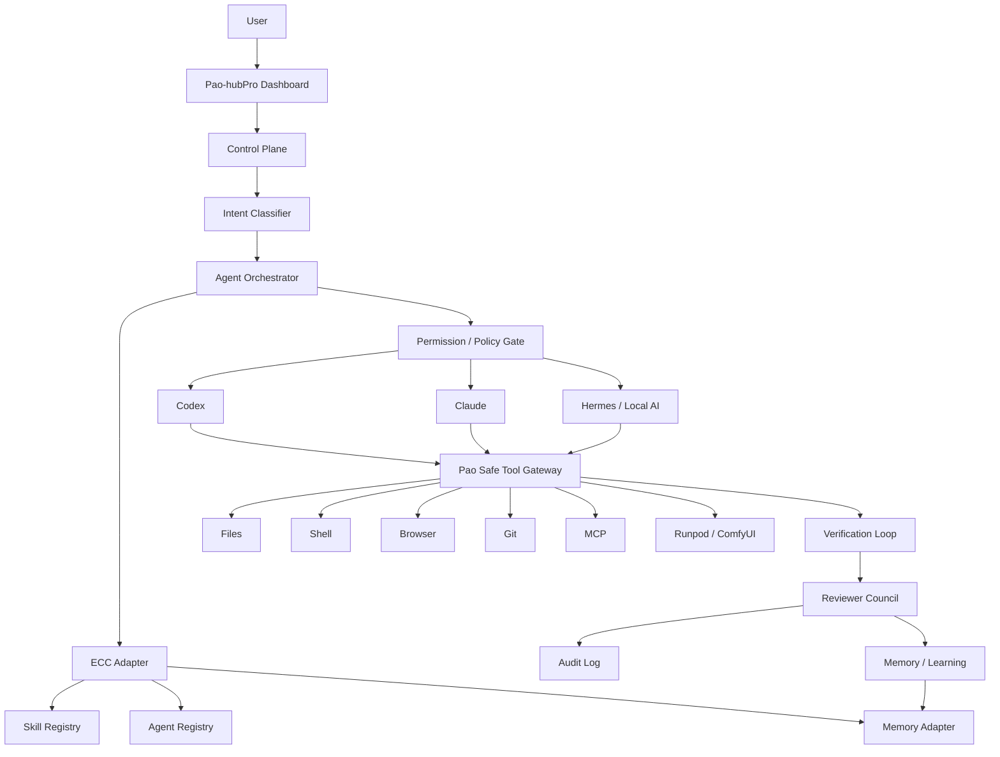
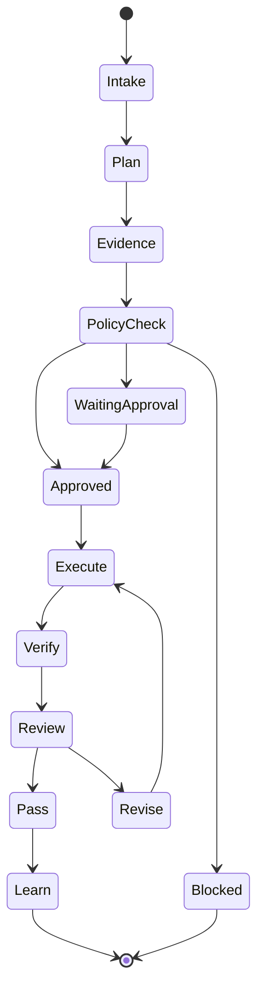

# Phase 20.20 — Pao-hubPro × ECC Agent Harness OS

> **Project:** Pao-hubPro  
> **Phase:** 20.20  
> **Status:** Implementation Specification / Ready for Codex  
> **Integration target:** `affaan-m/ECC`  
> **Primary harness:** OpenAI Codex  
> **Secondary harnesses:** Claude Code, Hermes, OpenCode, Cursor, Gemini-compatible workflows  
> **Design principle:** Pao-hubPro remains the control plane; ECC becomes the agent engineering/harness layer.

---

## 1. Executive Summary

Phase 20.20 integrates **ECC (Everything Claude Code / Agent Harness Operating System)** into Pao-hubPro as a governed agent-harness layer.

The goal is **not** to replace Pao-hubPro with ECC and **not** to blindly copy the whole ECC repository into the project. Instead, Pao-hubPro should use ECC as a source of:

- reusable agent skills,
- specialized agent roles,
- planning/review/testing workflows,
- memory and continuous-learning patterns,
- MCP/harness conventions,
- security review patterns,
- orchestration primitives,
- Codex-native plugin capabilities.

The resulting execution path should become:

```text
User / Pao Dashboard
        ↓
Pao-hubPro Control Plane
        ↓
Task Planner / Intent Classifier
        ↓
ECC Harness Adapter
        ↓
Skill Resolver + Agent Router
        ↓
Policy / Permission Gate
        ↓
Codex / Claude / Hermes / Local Agent
        ↓
Pao Safe Tool Gateway
        ↓
Files / Shell / Browser / Git / MCP / Runpod
        ↓
Verification + Reviewer Council
        ↓
Audit + Memory + Learning
```

This phase should turn Pao-hubPro from a collection of connected AI tools into a **governed agent execution platform**.

---

## 2. Upstream Reference

Primary upstream:

```text
https://github.com/affaan-m/ECC
```

Current upstream facts verified while preparing this phase:

- ECC package version: **2.2.1**
- ECC describes itself as a harness-native agent operating system / performance optimization system.
- Repository-level inventory currently advertises approximately:
  - 68 specialized agents
  - 291 reusable skills
  - 94 maintained command shims
- The Codex native plugin documentation reports a large Codex-loadable skills surface and native plugin support.
- ECC supports Codex-native installation through the Codex plugin marketplace.
- ECC supports Codex multi-agent role configuration.
- ECC includes memory, continuous-learning/instinct workflows, verification loops and orchestration skills.
- AgentShield exists as a related security-auditing component and must be treated as an independently reviewed/pinned security dependency rather than silently trusted.

### Important upstream safety rule

**Do not stack ECC installation methods in the same Codex environment.**

Choose one of these approaches:

1. Codex native plugin — preferred for this phase.
2. Project-local ECC checkout/config — allowed for development/testing.
3. Legacy sync into `~/.codex` — compatibility only.

Never combine native plugin + legacy Codex sync in the same active `CODEX_HOME` unless there is a deliberate migration procedure.

---

## 3. Why This Phase Exists

Pao-hubPro already aims to connect:

- ChatGPT / reasoning layer,
- Codex,
- MCP,
- safe local files,
- safe command execution,
- browser control,
- Git/repository work,
- Reviewer Council,
- local AI / Hermes,
- Runpod / ComfyUI workloads,
- automation/dashboard workflows.

The missing architectural layer is a consistent **agent operating model**.

Without that layer, every task risks becoming:

```text
Prompt
→ model improvises process
→ tool calls
→ result
```

Phase 20.20 changes the model to:

```text
Intent
→ classify risk
→ plan
→ select skill
→ select agent role
→ select tools
→ request required approval
→ execute
→ test
→ review
→ verify
→ persist useful context
→ learn reusable pattern
```

This produces more deterministic, inspectable and reusable agent behavior.

---

# 4. Core Objectives

## O1 — ECC Harness Adapter

Create a first-class integration layer between Pao-hubPro and ECC.

Responsibilities:

- detect ECC installation state,
- detect ECC version,
- detect supported harnesses,
- read available skills,
- read agent definitions,
- expose health/status information,
- call ECC capabilities through a stable Pao interface,
- isolate upstream-specific details from the rest of Pao-hubPro.

Pao-hubPro code should never be tightly coupled to arbitrary ECC directory internals outside the adapter.

---

## O2 — Skills Registry

Add a Pao Skill Registry capable of indexing skills from:

```text
Pao Native Skills
ECC Skills
Project-local Skills
User Skills
Future Plugin Skills
```

The registry must support:

- skill ID,
- source,
- description,
- capability tags,
- supported harnesses,
- risk level,
- required tools,
- trust state,
- enabled/disabled state,
- version/hash,
- load-on-demand status.

**Skills must be lazy-loaded.** Do not inject hundreds of skill documents into every context window.

---

## O3 — Agent Role Registry

Create standardized Pao agent roles.

Initial minimum roles:

```text
planner
explorer
architect
builder
reviewer
test_engineer
security_reviewer
docs_researcher
release_reviewer
```

ECC roles should map into this registry rather than becoming hard-coded special cases.

Example mapping:

```text
ECC explorer        → pao.explorer
ECC reviewer        → pao.reviewer
ECC docs_researcher → pao.docs_researcher
```

---

## O4 — Codex Multi-Agent Orchestration

Use Codex multi-agent support where available.

Recommended execution topology:

```text
                Planner
                   │
        ┌──────────┼──────────┐
        ▼          ▼          ▼
    Explorer    Docs Agent   Security
        │          │          │
        └──────────┼──────────┘
                   ▼
               Architect
                   │
                   ▼
                Builder
                   │
                   ▼
             Test Engineer
                   │
                   ▼
                Reviewer
                   │
                   ▼
            Reviewer Council
                   │
                   ▼
             Merge Decision
```

Parallelism must be used only where tasks are independent.

No two write-capable agents should edit overlapping files concurrently unless worktree isolation is active.

---

## O5 — Safe Tool Gateway Integration

All agent tools must be routed through Pao-hubPro permission policy.

Agents must never receive unrestricted system access simply because ECC defines a workflow that expects shell/files/browser access.

Tool classes:

### Class A — Read-only

Examples:

```text
read_file
list_directory
git_status
git_diff
search_code
read_docs
```

Default: allow inside workspace.

### Class B — Workspace write

Examples:

```text
write_file
patch_file
create_file
git_add
```

Default: allowed only inside approved workspace and with audit logging.

### Class C — Execution

Examples:

```text
run_command
npm install
pip install
build
test
```

Default: policy check before execution.

### Class D — External/network

Examples:

```text
browser
curl
API calls
MCP external services
package downloads
```

Default: explicit domain/provider policy.

### Class E — High impact

Examples:

```text
sudo
system service changes
delete outside workspace
credential changes
firewall changes
production deploy
database destructive migration
force push
```

Default: deny or require explicit human approval.

---

## O6 — Memory Vault Bridge

Add an abstraction so Pao-hubPro can store/retrieve useful agent context without tying the whole platform to ECC's memory implementation.

Memory categories:

```text
project_facts
architecture_decisions
user_preferences
successful_patterns
known_failures
resolved_incidents
tool_capabilities
repository_conventions
```

Memory lifecycle:

```text
Observe
  ↓
Classify
  ↓
Validate
  ↓
Deduplicate
  ↓
Persist
  ↓
Retrieve only when relevant
```

Do **not** save:

- secrets,
- API keys,
- auth tokens,
- passwords,
- raw `.env` contents,
- temporary command output with credentials,
- unnecessary personal data.

---

## O7 — Continuous Learning / Instinct Layer

Use ECC continuous-learning ideas to create a Pao learning pipeline.

```text
Completed Task
     ↓
Outcome Evaluation
     ↓
Extract Candidate Pattern
     ↓
Confidence Score
     ↓
Human/Policy Gate
     ↓
Instinct Registry
     ↓
Cluster Similar Instincts
     ↓
Promote to Skill
```

A learned pattern must never automatically become privileged execution policy.

Learning affects **recommendation/workflow selection**, not permission escalation.

---

## O8 — Reviewer Council Integration

Existing Reviewer Council concepts should become an explicit final review stage.

Suggested reviewers:

```text
Codex Reviewer
ChatGPT Reviewer
Claude Reviewer (optional)
Hermes / Local Reviewer (optional)
Static Analysis
Tests
Security Gate
```

Council output:

```json
{
  "decision": "approve | approve_with_warnings | revise | block",
  "confidence": 0.0,
  "findings": [],
  "required_actions": [],
  "optional_actions": []
}
```

The Council must distinguish:

- correctness,
- maintainability,
- security,
- test coverage,
- architecture conformity,
- documentation completeness.

---

# 5. Target Architecture



---

# 6. Integration Strategy

## Preferred Strategy — Native Codex Plugin

For current Codex releases that support native plugins:

```bash
codex plugin marketplace add affaan-m/ECC
codex plugin add ecc@ecc
codex plugin list --json
```

When working from an ECC checkout, additionally verify referenced plugin assets:

```bash
node scripts/codex/check-plugin-cache.js
```

### Do not blindly run these commands

Implementation must first:

1. detect `codex --version`,
2. detect whether `codex plugin` is supported,
3. inspect existing plugin state,
4. inspect `CODEX_HOME`,
5. detect legacy ECC sync artifacts,
6. abort if an unsafe duplicate install is detected.

---

## Development Strategy — Project-local ECC Checkout

Useful for inspection/testing without globally changing Codex:

```bash
git clone https://github.com/affaan-m/ECC.git vendor/ecc-reference
```

However:

- do not commit the checkout by default,
- prefer `.gitignore` for reference clones,
- pin a commit/tag when deterministic testing is required,
- do not make Pao-hubPro depend on undocumented internal paths.

---

## Legacy Strategy — Not Default

ECC includes older Codex sync workflows.

Pao-hubPro must treat these as compatibility-only.

If native plugin mode is active:

```text
legacy_sync = DISABLED
```

---

# 7. Proposed Pao-hubPro Module Layout

Codex must first inspect the existing repository and adapt naming to the current architecture. Do not restructure unrelated working code merely to match this example.

Recommended logical structure:

```text
pao-hubpro/
├─ apps/
│  └─ web/
│     └─ ...
├─ packages/
│  ├─ agent-core/
│  │  ├─ orchestrator/
│  │  ├─ registry/
│  │  ├─ policy/
│  │  └─ types/
│  │
│  ├─ ecc-adapter/
│  │  ├─ src/
│  │  │  ├─ client.*
│  │  │  ├─ detector.*
│  │  │  ├─ skills.*
│  │  │  ├─ agents.*
│  │  │  ├─ memory.*
│  │  │  ├─ health.*
│  │  │  └─ index.*
│  │  └─ tests/
│  │
│  ├─ safe-tools/
│  ├─ reviewer-council/
│  └─ audit/
│
├─ config/
│  ├─ agents/
│  ├─ skills/
│  ├─ permissions/
│  └─ ecc/
│
├─ docs/
│  └─ phases/
│     └─ phase-20.20-ecc-agent-harness-os.md
│
└─ tests/
   └─ integration/
```

If Pao-hubPro is not a monorepo, keep the same boundaries as folders/modules inside the existing application.

---

# 8. Core Interfaces

Use the project's existing language. If the core is TypeScript, interfaces should conceptually resemble:

```ts
export interface HarnessProvider {
  id: string;
  name: string;
  version?: string;
  available: boolean;
  health(): Promise<HarnessHealth>;
  listSkills(): Promise<SkillDescriptor[]>;
  listAgents(): Promise<AgentDescriptor[]>;
}

export interface SkillDescriptor {
  id: string;
  name: string;
  source: 'pao' | 'ecc' | 'project' | 'user' | 'plugin';
  version?: string;
  description?: string;
  tags: string[];
  risk: 'low' | 'medium' | 'high';
  requiredTools: string[];
  supportedHarnesses: string[];
  enabled: boolean;
  trusted: boolean;
  contentHash?: string;
}

export interface AgentDescriptor {
  id: string;
  role: string;
  source: string;
  readOnly: boolean;
  allowedTools: string[];
  description?: string;
}

export interface ToolPolicyDecision {
  allowed: boolean;
  approvalRequired: boolean;
  reason: string;
  risk: 'low' | 'medium' | 'high' | 'critical';
}
```

Do not duplicate existing domain models if equivalent types already exist.

---

# 9. ECC Adapter Requirements

The adapter must expose at least:

```text
getECCStatus()
getECCVersion()
getCodexPluginStatus()
listECCSkills()
listECCAgents()
resolveSkill(id)
resolveAgent(role)
runDoctorCheck()
detectDuplicateInstall()
getECCWarnings()
```

Example health response:

```json
{
  "installed": true,
  "mode": "codex-native-plugin",
  "version": "2.2.1",
  "plugin": {
    "registered": true,
    "enabled": true
  },
  "duplicateInstallDetected": false,
  "skillsIndexed": 0,
  "agentsIndexed": 0,
  "warnings": []
}
```

Counts must be discovered at runtime rather than hard-coded.

---

# 10. Skill Registry Design

## Registry sources

Priority order:

```text
1. Pao project-local override
2. Pao native skill
3. trusted user skill
4. ECC skill
5. optional external/plugin skill
```

A higher-priority skill may shadow a lower-priority skill only when explicitly configured.

## Required fields

```yaml
id: security-review
source: ecc
version: upstream
risk: medium
trusted: true
enabled: true
load_mode: on_demand
required_tools:
  - read_file
  - search_code
  - run_test
supported_harnesses:
  - codex
  - claude
```

## Lazy context loading

Bad:

```text
Load 291 skill files into every request.
```

Good:

```text
Intent
→ retrieve candidate skills
→ rank
→ load top relevant skill(s)
→ execute
```

Default maximum loaded skills per task should be conservative and configurable.

---

# 11. Agent Routing Policy

Suggested routing rules:

```text
Task = explore existing repo
→ explorer

Task = modify architecture
→ explorer + architect + builder + reviewer

Task = bug fix
→ explorer + builder + test_engineer + reviewer

Task = dependency/API upgrade
→ docs_researcher + builder + test_engineer + reviewer

Task = auth/security/permissions
→ security_reviewer REQUIRED

Task = release/deployment
→ release_reviewer REQUIRED
```

No agent should self-assign additional privileges.

---

# 12. Safe Execution State Machine



Every state transition that causes a tool side effect must be auditable.

---

# 13. Approval Policy

## Auto-approved examples

Within current workspace:

```text
read files
search files
git status
git diff
run unit tests
run lint
read package metadata
```

## Approval-required examples

```text
install new dependency
network call to untrusted host
modify CI secrets configuration
production deploy
push branch
create PR if organization policy requires approval
schema migration with destructive risk
```

## Always blocked by default

```text
reading unrelated personal directories
printing secrets
uploading credentials
rm -rf outside workspace
force-push protected branch
unreviewed privileged script
arbitrary sudo
permission escalation
```

---

# 14. Secrets Policy

Never send secrets into model context unless absolutely required by the provider interaction and approved by policy.

Redact patterns such as:

```text
OPENAI_API_KEY
ANTHROPIC_API_KEY
GITHUB_TOKEN
DATABASE_URL passwords
AWS credentials
SSH private keys
session cookies
OAuth refresh tokens
```

Audit logs must record:

```text
secret_redacted=true
```

rather than the actual secret value.

---

# 15. AgentShield Integration

AgentShield should be an **optional security gate**, not a silently downloaded runtime dependency.

Rules:

1. Detect whether `agentshield` is already installed.
2. Record its version.
3. Require an explicitly reviewed/pinned installation process before enabling in CI.
4. Never use an unversioned remote one-shot installer in the implementation.
5. Run scans only against intended project/config paths.
6. Store reports as artifacts; do not store secrets discovered during scans.

Example when a reviewed binary is already present:

```bash
agentshield scan --path .
```

Optional CI behavior:

```text
critical finding → block release
high finding     → require review
medium/low       → warning + issue queue
```

---

# 16. Memory + Continuous Learning

## Pao Memory Record

```json
{
  "id": "mem_xxx",
  "type": "architecture_decision",
  "project": "pao-hubpro",
  "summary": "Use Codex native ECC plugin instead of legacy sync",
  "confidence": 0.98,
  "source": "phase-20.20",
  "createdAt": "ISO-8601",
  "sensitive": false
}
```

## Instinct Record

```json
{
  "id": "instinct_xxx",
  "trigger": "dependency upgrade",
  "pattern": "run docs research before implementation",
  "confidence": 0.81,
  "successCount": 7,
  "failureCount": 1,
  "promotable": true
}
```

Promotion threshold must be configurable.

No automatic skill promotion may bypass review in the first implementation of Phase 20.20.

---

# 17. Verification Loop

Every write task should use:

```text
1. Baseline
2. Edit
3. Format
4. Lint
5. Unit test
6. Integration test where relevant
7. Static/security checks where relevant
8. Diff review
9. Reviewer agent
10. Final status
```

The agent must not report "done" while required verification is failing.

Valid final states:

```text
PASS
PASS_WITH_WARNINGS
BLOCKED
NEEDS_HUMAN_REVIEW
FAILED
```

---

# 18. Reviewer Council Contract

Input:

```json
{
  "task": {},
  "plan": {},
  "diff": {},
  "tests": {},
  "security": {},
  "context": {}
}
```

Output:

```json
{
  "decision": "approve_with_warnings",
  "scores": {
    "correctness": 0.94,
    "security": 0.90,
    "maintainability": 0.89,
    "tests": 0.93
  },
  "blockingFindings": [],
  "warnings": [],
  "recommendations": []
}
```

Hard rule:

```text
Any verified critical security finding = BLOCK
```

---

# 19. Dashboard — ECC / Agent OS Page

Add a page/card group to the Pao-hubPro Web App.

Suggested route:

```text
/agents
/agents/ecc
```

Adapt to existing routing conventions.

## Dashboard sections

### ECC Status

Show:

```text
Installed
Version
Integration mode
Codex plugin state
Duplicate install warning
Health status
```

### Skills

Show:

```text
Skill
Source
Tags
Risk
Trust
Enabled
Load mode
```

Filters:

```text
All
Pao
ECC
Project
Enabled
Disabled
Trusted
High Risk
```

### Agents

Cards for:

```text
Planner
Explorer
Architect
Builder
Reviewer
Security
Docs
Test
```

### Execution Timeline

Example:

```text
10:31 Planner created plan
10:31 Explorer inspected 47 files
10:32 Security policy approved read tools
10:34 Builder modified 4 files
10:35 Tests passed 84/84
10:36 Reviewer requested 1 fix
10:37 Builder patched
10:38 Council approved
```

### Memory / Learning

Show only safe summaries:

```text
Recent memories
Learned instincts
Candidate skills
Confidence
Promotion status
```

---

# 20. UI Style

Keep the existing Pao-hubPro design system.

If no established component exists, use:

- clean dark/light compatible layout,
- Apple-like spacing,
- minimal borders,
- clear status badges,
- strong hierarchy,
- no visual clutter,
- responsive mobile-first behavior,
- accessible focus states,
- keyboard navigation.

Do not redesign unrelated application pages in this phase.

---

# 21. Observability & Audit

Record every agent run with:

```text
run_id
parent_run_id
user/task source
harness
model/provider when available
agent role
skills loaded
tools requested
policy decisions
approvals
commands executed
files changed
test results
review result
start/end time
exit state
```

Example:

```json
{
  "runId": "run_123",
  "harness": "codex",
  "agent": "builder",
  "skills": ["tdd-workflow"],
  "tool": "run_command",
  "action": "npm test",
  "risk": "low",
  "approvalRequired": false,
  "result": "success"
}
```

Never log raw secret values.

---

# 22. Failure Handling

ECC unavailable:

```text
→ Pao-hubPro continues in native mode
→ status = degraded
→ no crash
```

Skill parsing failure:

```text
→ isolate failed skill
→ log warning
→ continue registry load
```

Agent failure:

```text
→ preserve partial evidence
→ allow retry
→ do not automatically repeat destructive actions
```

Reviewer disagreement:

```text
→ summarize disagreements
→ confidence reduction
→ human review when blocking criteria are unclear
```

Duplicate ECC installation:

```text
→ BLOCK automated mutation
→ show detected modes
→ provide cleanup recommendation
```

---

# 23. Testing Requirements

## Unit Tests

Minimum coverage areas:

```text
ECC detection
version parsing
plugin status parsing
skill indexing
agent mapping
policy decisions
secret redaction
memory filtering
audit serialization
```

## Integration Tests

Scenarios:

### T1 — ECC not installed

Expected:

```text
Pao loads
ECC status = unavailable
native agent operation remains functional
```

### T2 — Native Codex ECC plugin installed

Expected:

```text
plugin detected
skills indexed
agents indexed
health = ready
```

### T3 — Duplicate install detected

Expected:

```text
warning severity = critical/high
mutation disabled
no automatic cleanup
```

### T4 — Read-only exploration

Expected:

```text
explorer can inspect repository
no write tool issued
```

### T5 — Code change

Expected:

```text
plan → build → tests → review → audit
```

### T6 — High-risk shell command

Expected:

```text
policy blocks or requests approval
command not executed before approval
```

### T7 — Secret in command output

Expected:

```text
secret redacted from UI/log/context persistence
```

### T8 — Learning candidate

Expected:

```text
pattern candidate created
not automatically promoted to privileged skill
```

---

# 24. Acceptance Criteria

Phase 20.20 is complete only when all applicable criteria pass.

## Functional

- [ ] Pao-hubPro detects ECC cleanly.
- [ ] ECC integration is isolated behind an adapter.
- [ ] Codex native plugin state can be inspected.
- [ ] Duplicate ECC installation can be detected or conservatively warned about.
- [ ] Skills can be indexed without loading all content into every prompt.
- [ ] Agent roles are normalized into a Pao registry.
- [ ] At least explorer/reviewer/docs roles can be mapped.
- [ ] Multi-agent capability is feature-detected rather than assumed.
- [ ] Safe Tool Gateway policies apply to ECC-driven workflows.
- [ ] Audit events exist for side-effecting actions.
- [ ] Verification loop blocks false "done" status.
- [ ] Reviewer Council can consume execution evidence.
- [ ] ECC absence does not break Pao-hubPro.

## Security

- [ ] No hard-coded API keys.
- [ ] `.env` remains ignored.
- [ ] Secrets are redacted from audit logs.
- [ ] No default `yolo`/full-auto privileged profile.
- [ ] No unrestricted filesystem access by default.
- [ ] No unrestricted shell access by default.
- [ ] No silent privilege escalation.
- [ ] No automatic destructive cleanup of conflicting ECC installs.
- [ ] AgentShield, if integrated, is version-reviewed/pinned.

## Quality

- [ ] Existing tests still pass.
- [ ] New tests cover adapter + policy + registry behavior.
- [ ] Typecheck/lint passes where configured.
- [ ] New UI is responsive.
- [ ] Documentation explains setup and rollback.
- [ ] Implementation does not unnecessarily rewrite unrelated modules.

---

# 25. Rollback Plan

ECC integration must be removable without damaging Pao-hubPro.

Feature flags:

```env
PAO_ECC_ENABLED=false
PAO_ECC_SKILLS_ENABLED=false
PAO_ECC_MULTI_AGENT_ENABLED=false
PAO_ECC_LEARNING_ENABLED=false
```

Names may be adapted to existing config conventions.

Rollback behavior:

```text
Disable ECC adapter
→ fall back to Pao native orchestration
→ keep audit history
→ keep user-owned configs untouched
```

Never delete user-owned Codex configuration during rollback.

---

# 26. Recommended Delivery Milestones

## Milestone A — Discovery & Guardrails

- inspect current Pao-hubPro architecture,
- inventory existing agent/MCP/router/reviewer modules,
- detect Codex/ECC state,
- add feature flags,
- create architecture decision record.

## Milestone B — ECC Adapter

- health/status,
- version detection,
- plugin status,
- skill/agent discovery,
- duplicate-install guard.

## Milestone C — Registry

- normalized skills,
- normalized agent roles,
- lazy-loading resolver,
- trust/risk metadata.

## Milestone D — Orchestration

- planner/router,
- Codex role mapping,
- safe tools,
- verification loop.

## Milestone E — Review & Security

- Reviewer Council evidence contract,
- secret redaction,
- audit trail,
- optional AgentShield adapter.

## Milestone F — Memory & Learning

- safe memory abstraction,
- learning candidates,
- confidence scoring,
- manual promotion workflow.

## Milestone G — Dashboard

- ECC health,
- agents,
- skills,
- execution timeline,
- policy warnings,
- memory/learning summaries.

## Milestone H — Hardening

- integration tests,
- failure tests,
- rollback test,
- docs,
- final diff review.

---

# 27. Definition of Done

The phase is DONE when a user can initiate a coding task from Pao-hubPro and the system can demonstrably perform:

```text
Request
→ Plan
→ Select ECC/Pao Skill
→ Select Agent Role
→ Check Permissions
→ Execute through Safe Tools
→ Test
→ Review
→ Reviewer Council
→ Audit
→ Persist safe reusable knowledge
```

with a visible, inspectable run history and without requiring unrestricted system permissions.

---

# 28. Codex One-Shot Implementation Prompt

> Copy the entire block below and paste it into Codex while Codex is opened at the root of the **Pao-hubPro** repository.

```text
You are implementing Phase 20.20 — Pao-hubPro × ECC Agent Harness OS in the EXISTING Pao-hubPro repository.

MISSION
Integrate affaan-m/ECC as a governed agent-harness layer behind Pao-hubPro. Pao-hubPro remains the control plane. ECC must not replace the application, and you must not blindly copy the whole ECC repository into this project.

UPSTREAM
https://github.com/affaan-m/ECC

CURRENT TARGET
Prefer the ECC Codex native plugin integration when the installed Codex supports it. Treat legacy ECC-to-Codex sync as compatibility-only. Never stack native plugin + legacy sync in the same active CODEX_HOME.

NON-NEGOTIABLE RULES
1. Inspect the existing repo before changing anything.
2. Read AGENTS.md and all relevant project instructions first.
3. Run git status and preserve all pre-existing user changes.
4. Do not reset, checkout, delete, overwrite or reformat unrelated user work.
5. Do not expose or print secrets.
6. Do not read outside the repository unless required and policy permits it.
7. Do not enable yolo/full-auto privileged execution by default.
8. Do not use sudo or destructive system commands.
9. Do not silently alter global ~/.codex configuration.
10. Do not install ECC twice.
11. Feature-detect Codex plugin and multi-agent capabilities instead of assuming them.
12. Reuse existing Pao-hubPro architecture, types, UI components, DB, logging and test framework wherever possible.
13. Keep the ECC dependency behind a stable adapter so upstream internals do not leak through the app.
14. Every side-effecting agent action must pass the existing/new Pao policy layer and be auditable.
15. Do not report completion while required tests/checks fail.

STEP 0 — BASELINE
- Inspect repository tree.
- Read README, AGENTS.md, package manifests, environment examples and architecture docs.
- Identify current modules for:
  - MCP
  - LLM/model routing
  - local tools
  - file tools
  - shell execution
  - browser execution
  - Git
  - Reviewer Council / second-opinion system
  - audit/logging
  - memory
  - dashboard
- Run existing typecheck/lint/tests that are reasonable for the repo and capture baseline failures separately from new failures.
- Run git status and git diff before edits.

STEP 1 — DETECT CODEX + ECC SAFELY
Implement a non-destructive detector for:
- codex availability/version
- whether `codex plugin` exists
- current plugin list when available
- ECC native plugin state
- relevant CODEX_HOME location without dumping sensitive data
- signs of a legacy ECC sync/config layer
- duplicate installation risk

If a conflicting/duplicate ECC setup is detected:
- DO NOT auto-delete anything.
- mark ECC state degraded/blocked.
- show a remediation message.

STEP 2 — ECC ADAPTER
Add an ECC adapter using the repo's current architecture conventions.
It should conceptually expose:
- getECCStatus
- getECCVersion
- getCodexPluginStatus
- listECCSkills
- listECCAgents
- resolveSkill
- resolveAgent
- runDoctorCheck if safely available
- detectDuplicateInstall
- getECCWarnings

Do not hard-code inventory counts. Discover what is actually available.
ECC absence must be graceful and must not crash Pao-hubPro.

STEP 3 — SKILL REGISTRY
Create or extend the existing registry so it can normalize:
- Pao native skills
- ECC skills
- project-local skills
- trusted user skills
- future plugin skills

Each skill should support metadata equivalent to:
- id
- name
- source
- version/hash where available
- description
- tags
- risk
- required tools
- supported harnesses
- enabled
- trusted
- load mode

IMPORTANT: use lazy/on-demand loading. Never dump the entire ECC skills catalog into every context window.

STEP 4 — AGENT REGISTRY
Normalize roles such as:
- planner
- explorer
- architect
- builder
- reviewer
- test_engineer
- security_reviewer
- docs_researcher
- release_reviewer

Map ECC roles when available, including explorer, reviewer and docs_researcher equivalents.
Do not create duplicate competing abstractions if Pao-hubPro already has agent role models.

STEP 5 — MULTI-AGENT
Feature-detect Codex multi-agent capability.
If available, wire a conservative orchestration path:
Planner → Explorer/Docs/Security as needed → Architect → Builder → Test → Reviewer → Reviewer Council.

Parallel reads/research may run concurrently.
Never let write agents concurrently edit overlapping files unless worktree isolation exists and is verified.

STEP 6 — SAFE TOOL POLICY
Integrate ECC-driven agents with Pao Safe Tool Gateway.
Create/extend risk classes:
A read-only
B workspace write
C command execution
D network/external
E high-impact

High-impact actions must be denied or require explicit human approval.
No agent may grant itself more privileges.

Protect at minimum against:
- access outside allowed workspace
- arbitrary sudo
- destructive filesystem commands
- secret exfiltration
- unrestricted network calls
- force push
- destructive production/database actions

STEP 7 — SECRET REDACTION + AUDIT
Ensure audit events can capture:
- run id / parent id
- harness
- model/provider when available
- agent role
- selected skills
- requested tool
- policy decision
- approval state
- command/action summary
- files changed
- test result
- reviewer result
- timestamps
- final state

Never persist raw API keys, tokens, passwords, private keys, cookies or OAuth refresh tokens.
Use redacted placeholders.

STEP 8 — VERIFICATION LOOP
For write tasks support:
baseline → edit → format → lint → unit tests → relevant integration tests → diff review → reviewer → final state.

Valid final states should include:
PASS
PASS_WITH_WARNINGS
BLOCKED
NEEDS_HUMAN_REVIEW
FAILED

STEP 9 — REVIEWER COUNCIL
Connect the existing Reviewer Council rather than replacing it.
Provide a structured evidence packet containing:
- task
- plan
- diff
- tests
- security findings
- relevant context

Council result should distinguish correctness, security, maintainability and testing.
Verified critical security issue = BLOCK.

STEP 10 — MEMORY BRIDGE
Add a provider-neutral memory abstraction if none exists.
Safe categories may include:
- project facts
- architecture decisions
- successful patterns
- known failures
- resolved incidents
- repository conventions

Do not save secrets or raw .env content.
Retrieve memory only when relevant.

STEP 11 — CONTINUOUS LEARNING
Implement the first safe version of a learning/instinct pipeline:
completed task → evaluate outcome → candidate pattern → confidence → review → instinct registry → candidate skill.

CRITICAL:
- no learned item may automatically escalate permissions.
- no automatic privileged skill promotion.
- manual/policy review is required in this phase.

STEP 12 — OPTIONAL AGENTSHIELD ADAPTER
Do not silently install an unpinned AgentShield dependency.
If agentshield is already installed, detect version and expose an optional project-scoped scan action.
If not installed, show setup guidance rather than auto-installing it.
If later enabled in CI, critical findings should block release.

STEP 13 — DASHBOARD
Extend the existing Pao-hubPro Web App with an Agents/ECC view using existing design components.
Show:
- ECC installed/version/mode/health
- Codex plugin state
- duplicate-install warning
- skill registry with source/risk/trust/enabled state
- agent roles
- execution timeline
- approvals/policy blocks
- safe memory summaries
- learned instinct candidates

Keep UI responsive and consistent with the current design system. Do not redesign unrelated screens.

STEP 14 — FEATURE FLAGS / ROLLBACK
Add flags using existing config conventions equivalent to:
PAO_ECC_ENABLED
PAO_ECC_SKILLS_ENABLED
PAO_ECC_MULTI_AGENT_ENABLED
PAO_ECC_LEARNING_ENABLED

Disabling ECC must fall back gracefully to Pao native behavior and must not remove user-owned Codex config.

STEP 15 — TESTS
Add unit/integration tests for at least:
- ECC missing
- native ECC plugin detected
- duplicate install warning/block
- skill indexing
- lazy skill loading
- agent role mapping
- read-only explorer policy
- high-risk command policy
- secret redaction
- audit events
- verification state
- learning candidate without privilege escalation
- rollback/disabled ECC path

Run the project's existing full relevant verification suite after implementation.

STEP 16 — DOCUMENTATION
Create/update docs explaining:
- architecture
- how ECC is detected
- recommended native Codex plugin approach
- duplicate-install warning
- safe tool policy
- memory/learning behavior
- AgentShield optional behavior
- feature flags
- troubleshooting
- rollback

INSTALLATION NOTE
Do NOT execute global installation automatically unless the current Pao workflow explicitly authorizes it.
When the operator chooses to install ECC and Codex supports native plugins, the preferred upstream commands are:

codex plugin marketplace add affaan-m/ECC
codex plugin add ecc@ecc
codex plugin list --json

A source checkout may additionally run:
node scripts/codex/check-plugin-cache.js

But implementation code must first inspect current state and must never stack this on a detected legacy ECC sync.

QUALITY BAR
- minimal necessary changes
- clean boundaries
- typed contracts where the project is typed
- no duplicate abstractions
- no hardcoded secrets
- no hidden destructive behavior
- deterministic error handling
- useful logs
- tests for security boundaries
- graceful degraded mode

FINAL RESPONSE FORMAT
At completion, report:
1. Files changed
2. Architecture implemented
3. ECC/Codex detection behavior
4. Security/permission controls
5. Tests/checks executed and results
6. Any baseline failures that existed before your changes
7. Remaining warnings/limitations
8. Exact manual setup step, if ECC native plugin still needs operator installation
9. Git diff summary

Do not claim success for anything that was not actually verified.
```

---

# 29. Suggested First Production Workflow

After Phase 20.20 is implemented, use this workflow as the first end-to-end test:

```text
TASK:
"Inspect the current Pao-hubPro repository and identify the 3 highest-risk architectural issues without modifying files."

EXPECTED:
Planner
→ Explorer
→ architecture/security relevant skill retrieval
→ read-only Safe Tool Gateway
→ Reviewer
→ report
→ audit event
→ zero file modifications
```

Then test a controlled write:

```text
TASK:
"Add one unit test for the ECC status parser. Do not modify production behavior."

EXPECTED:
Plan
→ Explorer
→ Builder
→ Test
→ Reviewer
→ Council
→ Audit
```

These two tests validate both read-only and write-controlled execution before enabling larger autonomous workflows.

---

# 30. Phase 20.20 Final Architecture Decision

**Decision:** Adopt ECC as a **Harness/Workflow Layer**, not as the Pao-hubPro application core.

```text
Pao-hubPro = Control Plane
ECC        = Agent Harness / Skills / Workflow Layer
Codex      = Primary Coding Executor
MCP        = Tool/Service Connectivity
Safe Tools = Permission Boundary
Council    = Verification / Second Opinion
Memory     = Relevant Long-Term Operational Knowledge
Learning   = Workflow Optimization Without Privilege Escalation
```

This separation allows Pao-hubPro to benefit from ECC while retaining ownership of:

- permissions,
- security,
- orchestration policy,
- UI,
- audit,
- provider routing,
- memory governance,
- production execution.

---

## Source References

- ECC repository: https://github.com/affaan-m/ECC
- ECC Codex native plugin notes: https://github.com/affaan-m/ECC/blob/main/.codex-plugin/README.md
- ECC package metadata: https://github.com/affaan-m/ECC/blob/main/package.json
- AgentShield: https://github.com/affaan-m/agentshield

---

**End of Phase 20.20 — Pao-hubPro × ECC Agent Harness OS**
