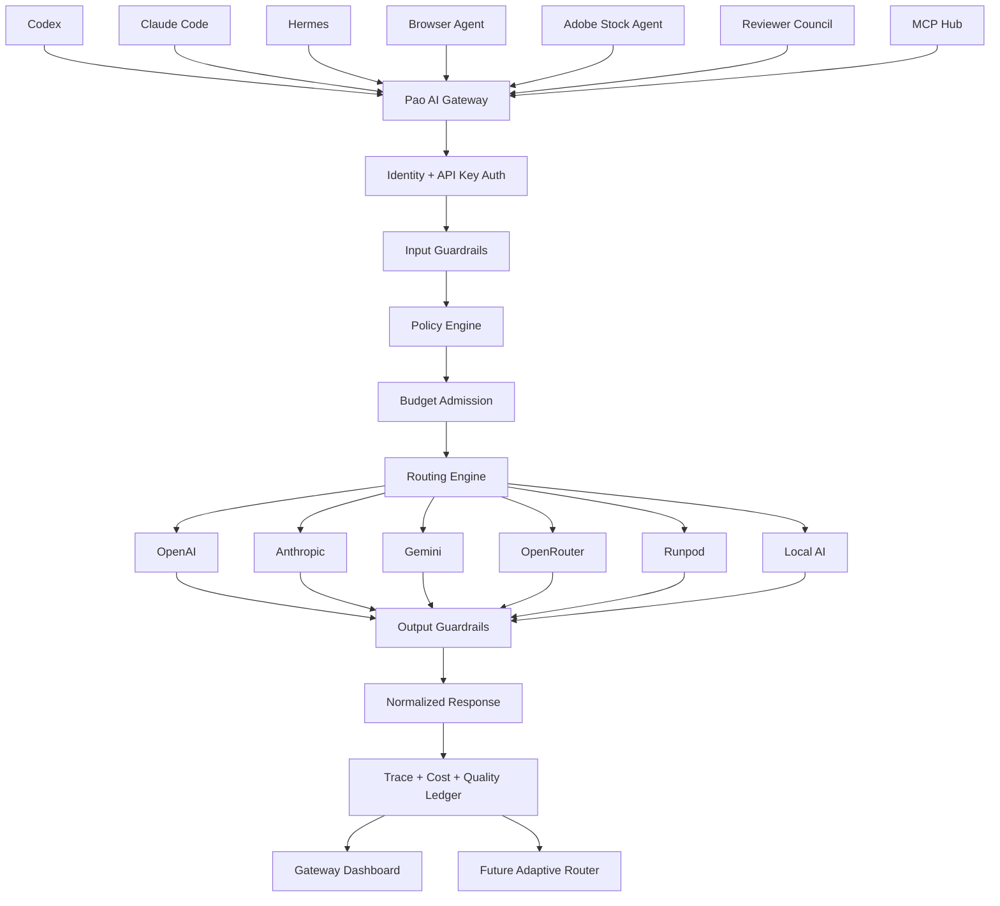
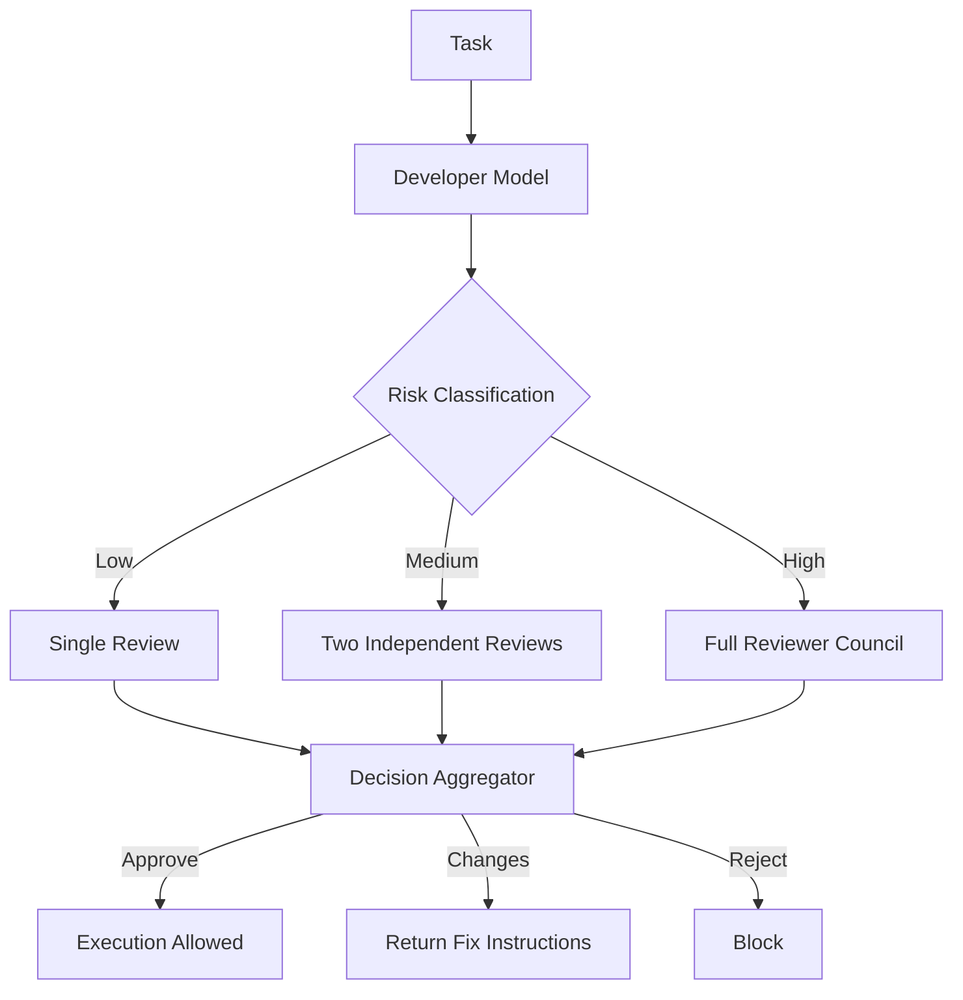

# Phase 20.13 — Pao-hubPro × Experiential Adaptive AI Gateway & Model Router

> **Project:** Pao-hubPro  
> **Phase:** 20.13  
> **Status:** Planned / Ready for Codex implementation  
> **Date:** 2026-09-09  
> **Primary reference:** https://github.com/experientiallabs/experiential  
> **Integration strategy:** Adopt the architecture and optionally integrate Experiential as a sidecar/service. Do **not** fork the entire repository into Pao-hubPro by default.

---

## 1. Executive Summary

Phase 20.13 adds a new core layer to Pao-hubPro called **Pao AI Gateway**.

The purpose of this layer is to stop every agent from talking directly to a specific AI provider. Instead, Codex, Claude Code, Hermes, Pao Agents, Browser Agents, Adobe Stock Agents, Reviewer Council, and future MCP workers call one unified gateway.

The gateway then decides:

- which provider to use,
- which exact model to use,
- whether the caller is allowed to use that model,
- how much the request is allowed to cost,
- whether the prompt or response contains secrets or unsafe content,
- whether a fallback model is allowed,
- whether the task requires Reviewer Council,
- whether Local AI or Runpod should be preferred,
- how to record trace/evaluation data for future routing optimization.

The target architecture is inspired by Experiential's current model gateway, routing, budget, identity, guardrail, trace, and optimization concepts while staying aligned with the existing Pao-hubPro architecture.

The most important design decision in this phase is:

> **Start with deterministic rule-based routing. Add adaptive/data-driven routing only after enough production traces exist.**

This reduces complexity, makes behavior auditable, and gives Pao-hubPro a safe migration path toward a self-improving model router.

---

# 2. Why Phase 20.13 Exists

Without a gateway, Pao-hubPro will eventually develop duplicated provider logic like this:

```text
Codex ---------> OpenAI
Claude Code ---> Anthropic
Hermes --------> Local AI
Stock Agent ---> Gemini
Browser Agent -> OpenRouter
Reviewer ------> OpenAI + Claude
```

Problems:

1. API keys are scattered across tools.
2. Provider code is duplicated.
3. Model upgrades require editing many agents.
4. Cost control is inconsistent.
5. Fallback logic becomes chaotic.
6. Security checks are repeated or missing.
7. There is no unified usage ledger.
8. There is no clean way to compare model quality.
9. Reviewer Council becomes tightly coupled to providers.
10. Switching to Local AI or Runpod becomes harder than necessary.

Phase 20.13 changes the dependency direction to:

```text
Agents / MCP / Codex / Browser / Stock Factory
                    |
                    v
              Pao AI Gateway
                    |
       +------------+-------------+
       |            |             |
       v            v             v
     OpenAI      Anthropic      Gemini
       |            |             |
       +------------+-------------+
                    |
             OpenRouter / Azure
                    |
              Runpod / Local AI
```

Agents request a **capability alias**, not a hard-coded vendor model.

Example:

```text
pao-fast
pao-code
pao-reasoning
pao-review
pao-vision
pao-stock
pao-browser
pao-local
```

The gateway resolves the alias to the best permitted model for the task.

---

# 3. Verified Experiential Concepts Worth Adopting

The design of this phase is based on concepts that are present in the Experiential repository as of 2026-09-09.

## 3.1 Unified model gateway

Experiential exposes an OpenAI-compatible gateway and supports OpenAI-shaped routes including chat completions, responses, and model discovery.

Pao-hubPro should use the same compatibility principle so existing SDKs and agents can be repointed with minimal changes.

Reference:

- https://github.com/experientiallabs/experiential
- https://github.com/experientiallabs/experiential/blob/main/docs/reference/gateway-architecture.md

## 3.2 Secret-free model catalog

Experiential keeps model/catalog configuration separate from actual credentials.

Pao-hubPro should adopt this strictly.

Configuration may contain:

- provider name,
- base URL,
- model ID,
- capabilities,
- pricing metadata,
- context limits,
- routing role.

It must **not** contain raw API keys.

Reference:

- https://github.com/experientiallabs/experiential/blob/main/docs/reference/providers.md

## 3.3 Multiple provider families

Experiential currently documents provider support around:

- OpenAI
- Anthropic
- Gemini
- OpenRouter
- OpenAI-compatible endpoints
- Experiential Cloud
- Azure OpenAI / Foundry
- Amazon Bedrock
- Vertex AI
- Tinker sampling

Pao-hubPro does not need every provider on day one. The provider adapter layer must make future additions cheap.

## 3.4 Identity-scoped guardrails

Experiential documents policies resolved by authenticated organization + identity, with input and optional output checks.

Capability categories include:

- PII
- secret leakage
- prompt injection
- content safety

Pao-hubPro should adopt the identity-scoped policy concept but map identities to Pao-hubPro actors such as:

```text
codex
reviewer-security
reviewer-architecture
browser-agent
stock-agent
admin-pao
local-worker
```

Reference:

- https://github.com/experientiallabs/experiential/blob/main/docs/reference/gateway-guardrails.md

## 3.5 Budget ceilings

Experiential uses a conservative estimate + hard command spend ceiling. Its agent guide states that an automatic confirmation flag does not override the configured ceiling.

Pao-hubPro should follow the same philosophy:

> automation may remove interaction, but it must never remove a hard budget boundary.

Reference:

- https://github.com/experientiallabs/experiential/blob/main/AGENTS.md

## 3.6 Immutable evidence + held-out evaluation

Experiential's build/optimization workflow separates evidence used to fit routing behavior from held-out evidence used to verify it.

Its agent guide currently describes trace ingestion in the 100-1000 normalized trace range for the build path.

Pao-hubPro should not enable adaptive routing until it has a useful amount of clean trace data.

Reference:

- https://github.com/experientiallabs/experiential/blob/main/AGENTS.md

## 3.7 Explicit bounded local execution

Experiential's runtime rules emphasize explicitly selected local process/environment adapters, bounded execution, explicit working directories, metering, and fail-closed cleanup/support checks.

This principle maps directly to Pao-hubPro Safe Local Tools.

Reference:

- https://github.com/experientiallabs/experiential/blob/main/AGENTS.md

---

# 4. Phase Goals

## Primary goals

- [ ] Add a single AI ingress point for Pao-hubPro.
- [ ] Keep current agents provider-agnostic.
- [ ] Create a provider registry.
- [ ] Create model aliases.
- [ ] Route based on task, risk, cost, capability, latency, and policy.
- [ ] Add per-agent and global budget limits.
- [ ] Add secret/prompt-injection/PII/content guardrails.
- [ ] Integrate Reviewer Council with the gateway.
- [ ] Add Local AI and Runpod fallback capability.
- [ ] Record usage and traces.
- [ ] Add a Gateway dashboard.
- [ ] Keep routing deterministic and explainable in v1.
- [ ] Prepare a later path to adaptive/data-driven routing.

## Non-goals for the first implementation

- [ ] Do not reproduce all Experiential internals.
- [ ] Do not build model fine-tuning in v1.
- [ ] Do not auto-train a routing model immediately.
- [ ] Do not allow unrestricted automatic fallback.
- [ ] Do not expose provider keys to browser clients.
- [ ] Do not let unknown model pricing bypass budget checks.
- [ ] Do not change existing Pao-hubPro agent behavior without compatibility wrappers.

---

# 5. Target Architecture



---

# 6. Core Components

## 6.1 Gateway API

Recommended local default:

```text
http://127.0.0.1:8787/v1
```

Required endpoints:

```text
GET  /health
GET  /ready
GET  /v1/models
POST /v1/chat/completions
POST /v1/responses
POST /v1/embeddings       # optional in first cut
```

Pao-specific administration endpoints:

```text
GET  /api/gateway/providers
GET  /api/gateway/models
GET  /api/gateway/aliases
GET  /api/gateway/routes
GET  /api/gateway/usage
GET  /api/gateway/budgets
GET  /api/gateway/traces
GET  /api/gateway/health
POST /api/gateway/test-route
POST /api/gateway/test-provider
```

Sensitive write operations must require admin identity.

---

# 7. Provider Registry

Create provider adapters behind a single interface.

Suggested interface:

```ts
interface ModelProvider {
  id: string;
  type: ProviderType;
  listModels(): Promise<ModelInfo[]>;
  chat(request: NormalizedChatRequest): Promise<NormalizedChatResponse>;
  responses?(request: NormalizedResponseRequest): Promise<NormalizedResponse>;
  embeddings?(request: EmbeddingRequest): Promise<EmbeddingResponse>;
  healthCheck(): Promise<ProviderHealth>;
}
```

Initial providers:

1. OpenAI
2. Anthropic
3. Gemini
4. OpenRouter
5. OpenAI-compatible
6. Local OpenAI-compatible endpoint
7. Runpod endpoint through an OpenAI-compatible or dedicated adapter

Later providers:

- Azure OpenAI
- Bedrock
- Vertex AI

---

# 8. Secret Management

## Rule

Raw secrets must never be stored in:

```text
models.yaml
routes.yaml
policies.yaml
aliases.yaml
SQLite rows returned to frontend
browser localStorage
logs
traces
```

Recommended structure:

```text
config/
  ai-gateway/
    providers.yaml
    models.yaml
    aliases.yaml
    routes.yaml
    policies.yaml
    budgets.yaml

.env
.env.example
```

Example provider config:

```yaml
providers:
  openai-main:
    type: openai
    api_key_env: OPENAI_API_KEY

  anthropic-main:
    type: anthropic
    api_key_env: ANTHROPIC_API_KEY

  openrouter-main:
    type: openrouter
    api_key_env: OPENROUTER_API_KEY

  local-vllm:
    type: openai-compatible
    base_url: http://127.0.0.1:8001/v1
    api_key_env: LOCAL_VLLM_API_KEY

  runpod-h3:
    type: openai-compatible
    base_url: ${RUNPOD_H3_BASE_URL}
    api_key_env: RUNPOD_API_KEY
```

`.env.example` must contain names only:

```dotenv
OPENAI_API_KEY=
ANTHROPIC_API_KEY=
GEMINI_API_KEY=
OPENROUTER_API_KEY=
RUNPOD_API_KEY=
RUNPOD_H3_BASE_URL=
LOCAL_VLLM_API_KEY=
```

Never create or overwrite `.env` containing real credentials.

---

# 9. Model Catalog

Model catalog entries should contain enough information for routing and cost admission.

Example:

```yaml
models:
  openai-code-primary:
    provider: openai-main
    model: ${PAO_OPENAI_CODE_MODEL}
    capabilities:
      chat: true
      tools: true
      structured_output: true
      vision: false
      reasoning: true
    limits:
      context_window: null
      max_output_tokens: null
    pricing:
      input_per_million_usd: null
      output_per_million_usd: null
      cached_input_per_million_usd: null
    tags:
      - coding
      - reasoning

  local-fast:
    provider: local-vllm
    model: ${PAO_LOCAL_FAST_MODEL}
    capabilities:
      chat: true
      tools: false
      structured_output: true
      vision: false
      reasoning: false
    pricing:
      input_per_million_usd: 0
      output_per_million_usd: 0
    tags:
      - local
      - fast
      - cheap
```

## Important fail-closed rule

If a route requires a budget calculation but pricing metadata is unknown:

```text
DENY or route only to a model with known pricing.
```

Do not assume unknown price means free.

---

# 10. Pao Model Alias System

Agents should request aliases rather than vendor model IDs.

Recommended aliases:

| Alias | Purpose | Default philosophy |
|---|---|---|
| `pao-fast` | classification, metadata, short text | cheapest acceptable |
| `pao-code` | coding implementation | strong coding model |
| `pao-reasoning` | architecture, difficult analysis | strong reasoning |
| `pao-review` | code/security review | high quality + independent provider |
| `pao-vision` | visual understanding | vision-capable |
| `pao-browser` | web/browser agent reasoning | tool capable |
| `pao-stock` | Adobe Stock workflow | multimodal + policy-aware |
| `pao-local` | private/local tasks | local-only |
| `pao-critical` | irreversible/high-risk tasks | Reviewer Council required |

Example:

```yaml
aliases:
  pao-code:
    routes:
      - model: openai-code-primary
        priority: 100
      - model: anthropic-code-secondary
        priority: 90
      - model: local-code
        priority: 40

  pao-local:
    routes:
      - model: local-fast
        priority: 100
    constraints:
      local_only: true
```

---

# 11. Identity and Permission Model

Every gateway key belongs to one identity.

Recommended initial identities:

```text
admin-pao
codex
claude-code
hermes
mcp-hub
browser-agent
stock-agent
reviewer-security
reviewer-architecture
reviewer-quality
local-worker
```

Identity policy example:

```yaml
identities:
  codex:
    aliases:
      allow:
        - pao-code
        - pao-reasoning
        - pao-review
    max_request_usd: 1.50
    max_daily_usd: 8.00
    tools:
      allow:
        - coding

  stock-agent:
    aliases:
      allow:
        - pao-fast
        - pao-vision
        - pao-stock
    max_request_usd: 0.75
    max_daily_usd: 5.00

  local-worker:
    aliases:
      allow:
        - pao-local
    external_provider_access: false
```

---

# 12. Budget Engine

## Required budget scopes

- Global daily budget
- Global monthly budget
- Identity daily budget
- Identity monthly budget
- Alias budget
- Per-request hard ceiling
- Optional project/workflow budget

Example:

```yaml
budgets:
  global:
    daily_usd: 15
    monthly_usd: 250

  identities:
    codex:
      daily_usd: 8
      per_request_usd: 1.50

    reviewer-security:
      daily_usd: 3
      per_request_usd: 0.75

    stock-agent:
      daily_usd: 5
      per_request_usd: 0.75
```

## Admission flow

```text
Request
  -> identity authenticated?
  -> alias allowed?
  -> estimate tokens/cost
  -> price known?
  -> request ceiling OK?
  -> identity daily ceiling OK?
  -> global daily ceiling OK?
  -> route
```

If any hard ceiling fails:

```text
HTTP 429 or policy-specific denial
```

No `--yes`, automation flag, admin UI convenience action, or fallback may silently bypass a hard ceiling.

---

# 13. Rule-Based Smart Router v1

The first router must be deterministic.

## Router inputs

```text
identity
requested alias
task type
risk level
required capabilities
privacy class
max latency
max cost
provider health
context size
vision required?
tools required?
structured output required?
local-only?
review required?
```

## Scoring concept

```text
eligible_models = policy_filter(models)
eligible_models = capability_filter(eligible_models)
eligible_models = budget_filter(eligible_models)
eligible_models = privacy_filter(eligible_models)
eligible_models = health_filter(eligible_models)

score =
    quality_weight * quality_score
  + cost_weight    * cost_score
  + speed_weight   * latency_score
  + privacy_weight * locality_score
  + history_weight * reliability_score
```

## Router output

Every decision should return internal explainability metadata:

```json
{
  "alias": "pao-code",
  "selected_model": "openai-code-primary",
  "reason": [
    "identity permitted",
    "tools required",
    "within request budget",
    "primary provider healthy",
    "highest configured coding score"
  ]
}
```

Do not expose sensitive provider internals to untrusted clients unless needed.

---

# 14. Fallback and Waterfall Policy

Fallback must be explicit.

Allowed failure classes:

```text
provider timeout
provider 429
provider 5xx
temporary network error
model unavailable
```

Not fallback-eligible:

```text
authentication failure
policy denial
secret leakage block
prompt injection block
budget rejection
local-only violation
context too large without safe alternative
protected identity guardrail failure
```

Example:

```yaml
routes:
  pao-code:
    fallback:
      on:
        - timeout
        - provider_429
        - provider_5xx
      max_attempts: 2
      candidates:
        - openai-code-primary
        - anthropic-code-secondary
```

---

# 15. Guardrail Engine

Guardrails should be modular and identity-scoped.

## Input guardrails

- Secret/API key leakage
- Sensitive path leakage
- Prompt injection signals
- PII rules where required
- Tool-policy validation
- Local-only policy
- Request size limits

## Output guardrails

- Secret leakage
- Unsafe tool-call arguments
- PII where required
- Forbidden command generation for protected identities
- Structured-output schema validation

## Protected identity behavior

High-risk identities should support **fail closed**.

Example:

```yaml
policies:
  codex:
    fail_closed: true
    input:
      secret_leakage: block
      prompt_injection: block
    output:
      secret_leakage: block
      unsafe_tool_arguments: block

  stock-agent:
    fail_closed: false
    input:
      secret_leakage: block
    output:
      secret_leakage: block
```

## Guardrail result contract

```ts
type GuardrailDecision = {
  action: 'allow' | 'block' | 'transform';
  code?: string;
  safeMessage?: string;
  transformedPayload?: unknown;
};
```

Never return detected secret text in the error body.

---

# 16. Reviewer Council Integration

Phase 20.13 should make Reviewer Council a gateway-native workflow.

## Council flow



## Suggested reviewer roles

```text
reviewer-security
reviewer-architecture
reviewer-correctness
reviewer-regression
reviewer-cost
```

## Independence requirement

For high-risk work, the developer model and at least one reviewer should use different provider/model families where practical.

Example:

```text
Developer       -> OpenAI
Security review -> Anthropic
Architecture    -> Gemini/OpenRouter
Local verifier  -> Local AI
```

The exact vendors must remain configurable.

---

# 17. Risk Classifier

Recommended levels:

```text
R0 informational
R1 reversible edit
R2 multi-file edit
R3 dependency/config change
R4 privileged/local command
R5 destructive/security-sensitive/production
```

Rules example:

```text
R0-R1 -> single model
R2    -> optional reviewer
R3    -> mandatory reviewer
R4    -> Reviewer Council + user policy gate
R5    -> fail closed + explicit human approval
```

Phase 20.13 must not turn Pao-hubPro into an unrestricted autonomous shell.

---

# 18. Safe Local Tool Connection

Pao AI Gateway does not replace MCP safety. It adds model-level policy before MCP execution.

Recommended flow:

```text
AI response/tool call
      |
      v
Output Guardrail
      |
      v
MCP Tool Policy
      |
      +--> read_file
      +--> write_file
      +--> git
      +--> run_command
      +--> browser
      +--> download
      +--> upload
```

Command policy example:

```yaml
commands:
  auto_allow:
    - "git status"
    - "git diff"
    - "npm test"
    - "npm run lint"
    - "pytest"

  require_approval:
    - "npm install *"
    - "pip install *"
    - "docker compose down *"
    - "git push *"

  block:
    - "rm -rf /"
    - "mkfs*"
    - "dd if=* of=/dev/*"
```

Actual implementation should avoid naive string-only matching for shell safety. Parse command structure where possible.

---

# 19. Trace and Usage Ledger

Every request should create a trace record that is useful without leaking secrets.

Record:

```text
request_id
timestamp
identity
alias
selected model/provider reference
task type
risk level
input token count
output token count
estimated cost
actual cost if available
latency
first-token latency if streaming
status
fallback count
guardrail result
review outcome
quality/evaluation score when available
```

Do not record raw secrets.

Raw prompts should be configurable:

```text
trace_content_mode:
  off
  metadata_only
  redacted
  full_local_encrypted
```

Recommended default for Pao-hubPro:

```text
metadata_only or redacted
```

---

# 20. Adaptive Router — Future Stage

Do not enable this on day one.

Adaptive routing should be unlocked only after:

- [ ] trace schema is stable,
- [ ] budget data is reliable,
- [ ] task labels are meaningful,
- [ ] outcome scoring exists,
- [ ] enough real traffic has accumulated,
- [ ] evaluation dataset is separated from optimization data.

Recommended lifecycle:

```text
Production Traffic
      |
      v
Normalized Traces
      |
      v
Representative Tasks
      |
      +--> Fit Set
      |
      +--> Held-out Set
      |
      v
Offline Simulation
      |
      v
Router Candidate
      |
      v
Held-out Verification
      |
      v
Human Review
      |
      v
Activate Frozen Router Version
```

Do not let the live router silently mutate itself after every request.

Use versioned policies:

```text
router-v1-rule-based
router-v2-learned-2026-xx
router-v3-learned-2026-xx
```

Rollback must be one action.

---

# 21. Local AI and Runpod Strategy

## Goals

- reduce cost,
- preserve privacy,
- keep Pao-hubPro usable when external providers fail,
- leverage Runpod GPUs for specialized models,
- avoid paying premium models for trivial tasks.

## Example routing

```text
simple classification      -> Local AI
metadata normalization     -> Local AI
cheap summaries            -> Local AI / low-cost cloud
coding                      -> pao-code
critical architecture      -> pao-reasoning
vision stock review        -> pao-vision
high-risk code change      -> pao-critical + Reviewer Council
Minimax/ComfyUI workflow   -> Runpod specialized route
```

## Local-only privacy label

Support:

```json
{
  "pao": {
    "privacy": "local-only"
  }
}
```

or an internal policy equivalent.

A local-only request must never fall back to a cloud provider.

---

# 22. Adobe Stock Workflow Integration

Phase 20.13 can reduce Adobe Stock production cost by selecting different model tiers per stage.

Recommended aliases:

```text
stock-research      -> pao-reasoning
stock-idea          -> pao-fast / pao-reasoning
stock-prompt        -> pao-stock
stock-image-review  -> pao-vision
stock-policy-review -> pao-review
stock-metadata      -> pao-fast
stock-final-review  -> pao-critical or council
```

Example flow:


Each step can have its own:

- allowed provider list,
- max cost,
- model alias,
- retry count,
- output schema,
- reviewer rule.

---

# 23. Pao Gateway Dashboard

Add a dashboard section to Pao-hubPro.

## Page: Overview

Cards:

```text
Gateway Status
Requests Today
Spend Today
Daily Budget
Average Latency
Fallback Rate
Blocked Requests
Local AI Share
```

## Page: Providers

Show:

```text
Provider
Status
Models
Latency
Error Rate
Spend Today
Last Successful Request
```

Never show full API keys.

## Page: Routes

Example:

```text
Alias          Current Primary        Fallback
pao-fast       local-fast             cloud-fast
pao-code       code-primary           code-secondary
pao-review     review-primary         review-secondary
pao-vision     vision-primary         vision-secondary
```

## Page: Budget

Charts/tables:

```text
Spend by Provider
Spend by Identity
Spend by Alias
Spend by Day
Budget Remaining
Estimated End-of-Month Spend
```

## Page: Traces

Filters:

```text
identity
alias
provider
model
status
risk level
guardrail decision
review status
date range
```

## Page: Guardrails

Show counts only unless admin explicitly opens a safe redacted detail view.

```text
Secret blocks
Prompt injection blocks
PII blocks
Unsafe tool blocks
Policy denials
```

---

# 24. Suggested Database Schema

Use the existing database technology in Pao-hubPro where possible. Do not introduce a second DB without a clear need.

Logical tables:

```text
ai_providers
ai_models
ai_aliases
ai_alias_routes
ai_identities
ai_identity_permissions
ai_budgets
ai_usage_ledger
ai_requests
ai_attempts
ai_guardrail_events
ai_router_versions
ai_router_decisions
ai_review_sessions
ai_review_votes
ai_provider_health
```

## Example `ai_requests`

```text
id
request_id
created_at
identity_id
alias
selected_model_id
router_version
risk_level
status
input_tokens
output_tokens
estimated_cost_usd
actual_cost_usd
latency_ms
fallback_count
trace_content_mode
```

## Example `ai_attempts`

One request may have multiple provider attempts.

```text
id
request_id
attempt_number
provider_id
model_id
started_at
finished_at
status
error_class
latency_ms
cost_usd
```

---

# 25. Suggested Project Structure

Codex must inspect the real Pao-hubPro structure first and adapt to existing conventions.

If no equivalent structure exists, use something conceptually similar to:

```text
src/
  ai-gateway/
    api/
    auth/
    providers/
      openai/
      anthropic/
      gemini/
      openrouter/
      openai-compatible/
      local/
      runpod/
    catalog/
    aliases/
    routing/
    budgets/
    guardrails/
    traces/
    reviews/
    health/
    types/

  dashboard/
    ai-gateway/

config/
  ai-gateway/
    providers.yaml
    models.yaml
    aliases.yaml
    routes.yaml
    policies.yaml
    budgets.yaml
```

Do not create redundant top-level folders if equivalent surfaces already exist.

---

# 26. Phase Breakdown

## Phase 20.13.1 — Unified Gateway Core

Deliver:

- OpenAI-compatible ingress
- `/health`
- `/ready`
- `/v1/models`
- `/v1/chat/completions`
- normalized request/response contracts

Acceptance:

- existing test client can call one gateway URL,
- no direct provider key is returned,
- request IDs are generated and logged.

---

## Phase 20.13.2 — Provider Registry

Deliver adapters for:

- OpenAI
- Anthropic
- Gemini
- OpenRouter
- OpenAI-compatible

Acceptance:

- providers share one normalized interface,
- health checks work,
- one broken provider does not crash registry initialization unless it is required and no route remains.

---

## Phase 20.13.3 — Alias System

Deliver:

```text
pao-fast
pao-code
pao-reasoning
pao-review
pao-vision
pao-stock
pao-browser
pao-local
pao-critical
```

Acceptance:

- callers never need provider-specific IDs for normal use,
- alias mapping is config driven.

---

## Phase 20.13.4 — Cost & Token Ledger

Deliver:

- token accounting,
- estimated cost,
- actual cost when available,
- daily/monthly totals,
- provider/identity/alias breakdown.

Acceptance:

- every accepted cloud request creates usage data,
- budget calculation is testable deterministically.

---

## Phase 20.13.5 — Rule-Based Router

Deliver:

- capability filtering,
- policy filtering,
- budget filtering,
- health filtering,
- deterministic scoring,
- explicit fallback.

Acceptance:

- same inputs + same health state + same config produce the same route,
- route reason is auditable.

---

## Phase 20.13.6 — Agent Identity & Permissions

Deliver:

- gateway keys/tokens,
- identity ownership,
- allowed aliases,
- per-identity ceilings.

Acceptance:

- unauthorized alias returns denial,
- revoked key stops working,
- no secret appears in logs.

---

## Phase 20.13.7 — Guardrail Engine

Deliver:

- secret leakage scanner,
- prompt injection hook,
- PII hook,
- output secret scanner,
- unsafe tool-argument hook,
- fail-closed option.

Acceptance:

- blocked input never reaches provider routing,
- blocked output is not partially streamed to caller,
- error response is sanitized.

---

## Phase 20.13.8 — Reviewer Council Router

Deliver:

- risk classifier,
- reviewer role selection,
- multi-review aggregation,
- approve/change/reject states.

Acceptance:

- high-risk task cannot skip required council,
- reviewer decisions are traceable,
- developer and reviewer separation can be configured.

---

## Phase 20.13.9 — Trace & Evaluation Store

Deliver:

- normalized trace metadata,
- redaction,
- request/attempt relationships,
- evaluation hooks,
- export for offline analysis.

Acceptance:

- trace content mode can be changed,
- secret scanner runs before persisted prompt content when prompt storage is enabled.

---

## Phase 20.13.10 — Adaptive Router Foundation

Deliver only the foundation:

- router versioning,
- offline datasets,
- fit/held-out split mechanism,
- router candidate interface,
- activation/rollback interface.

Do not auto-activate learned routes yet.

---

## Phase 20.13.11 — Local AI / Runpod Routing

Deliver:

- Local OpenAI-compatible adapter,
- Runpod adapter or compatible endpoint,
- local-only privacy constraint,
- provider outage fallback policy.

Acceptance:

- local-only never exits the local provider set,
- external provider outage can fall back only where policy allows.

---

## Phase 20.13.12 — Gateway Dashboard

Deliver:

- overview,
- provider health,
- usage/cost,
- route explorer,
- trace explorer,
- guardrail counters,
- budget meter.

Acceptance:

- dashboard contains no raw API keys,
- charts use data from the same authoritative ledger as enforcement.

---

# 27. API Compatibility Rules

Prefer OpenAI-compatible request contracts where practical.

Example request:

```bash
curl http://127.0.0.1:8787/v1/chat/completions \
  -H "Authorization: Bearer $PAO_GATEWAY_KEY" \
  -H "Content-Type: application/json" \
  -d '{
    "model": "pao-code",
    "messages": [
      {"role": "user", "content": "Review this function"}
    ]
  }'
```

The alias is supplied in `model`.

Provider-specific extensions should not leak into the normal public API unless unavoidable.

---

# 28. Observability

Minimum metrics:

```text
pao_gateway_requests_total
pao_gateway_request_latency_ms
pao_gateway_first_token_latency_ms
pao_gateway_tokens_input_total
pao_gateway_tokens_output_total
pao_gateway_cost_usd_total
pao_gateway_fallback_total
pao_gateway_guardrail_blocks_total
pao_gateway_provider_errors_total
pao_gateway_budget_rejections_total
pao_gateway_review_required_total
pao_gateway_review_rejections_total
```

Structured log example:

```json
{
  "event": "ai.route.selected",
  "request_id": "req_...",
  "identity": "codex",
  "alias": "pao-code",
  "router_version": "router-v1",
  "selected_model": "code-primary",
  "fallback": false,
  "risk": "R2"
}
```

Never log raw authorization headers.

---

# 29. Reliability Rules

1. Provider adapter failure must not crash unrelated providers.
2. Policy denial must not trigger fallback.
3. Budget denial must not trigger fallback.
4. Local-only violation must fail closed.
5. Unknown required pricing must fail closed.
6. Every provider attempt must be linked to one gateway request.
7. Retry count must be bounded.
8. Timeout must be bounded.
9. Circuit breaker state must be observable.
10. Learned router activation must be reversible.

---

# 30. Security Checklist

- [ ] API keys loaded from environment/secret store only.
- [ ] Raw keys never returned by API.
- [ ] Raw keys never logged.
- [ ] Gateway key hashes stored instead of plaintext where applicable.
- [ ] Admin routes protected.
- [ ] Browser frontend never receives provider credentials.
- [ ] Prompt content storage is configurable.
- [ ] Secret redaction runs before persistence when needed.
- [ ] Prompt injection check occurs before routing for protected identities.
- [ ] Tool-call arguments are validated before MCP execution.
- [ ] Local-only requests cannot escape to cloud.
- [ ] Budget ceiling cannot be bypassed by fallback.
- [ ] Retry attempts are bounded.
- [ ] Timeouts are bounded.
- [ ] Destructive local actions require the existing Pao-hubPro safety gate.

---

# 31. Test Plan

## Unit tests

- alias resolution
- capability matching
- budget calculations
- unknown pricing rejection
- identity authorization
- guardrail block behavior
- retry classification
- fallback ordering
- local-only enforcement
- router deterministic scoring

## Integration tests

Use fake/mock providers.

Scenarios:

```text
primary success
primary timeout -> allowed fallback
primary 429 -> allowed fallback
policy denial -> no fallback
budget denial -> no fallback
secret block -> provider never called
output secret block -> caller receives no leaked output
local-only -> cloud never called
review-required -> execution blocked until review state completes
```

## End-to-end tests

1. Start gateway.
2. Load mock provider catalog.
3. Issue request through `pao-fast`.
4. Verify route decision.
5. Verify usage ledger.
6. Force provider failure.
7. Verify fallback.
8. Force budget exhaustion.
9. Verify rejection.
10. Force secret detection.
11. Verify provider not called.
12. Open dashboard and confirm counters.

---

# 32. Migration Plan

## Stage A — Shadow mode

Existing agents continue calling their current providers.

Gateway receives mirrored metadata only where feasible.

Goal:

- validate config,
- test budget estimation,
- compare theoretical routes.

## Stage B — Non-critical aliases

Move:

```text
pao-fast
metadata
classification
summaries
```

first.

## Stage C — Coding workflows

Move Codex / coding agents to:

```text
pao-code
pao-reasoning
```

## Stage D — Reviewer Council

Move reviewers behind gateway.

## Stage E — Adobe Stock production

Move research, prompt, vision QC, metadata, final review routes.

## Stage F — Adaptive router research

Only after sufficient trace/evaluation quality exists.

---

# 33. Rollback Plan

Must support:

```text
PAO_AI_GATEWAY_ENABLED=false
```

or equivalent feature flag.

Each migrated agent should have a controlled fallback to the previous configuration during rollout.

Do not permanently delete old direct-provider configuration until the gateway has completed a stable burn-in period.

---

# 34. Definition of Done

Phase 20.13 is considered complete when:

- [ ] Pao-hubPro has one gateway URL for AI calls.
- [ ] At least 3 provider families work through one normalized interface.
- [ ] Model aliases are active.
- [ ] Codex can call `pao-code` without knowing the actual vendor model.
- [ ] Global + per-identity hard budgets work.
- [ ] Budget bypass through retry/fallback is impossible.
- [ ] Secret leakage guardrail is active for protected identities.
- [ ] Prompt injection hook exists.
- [ ] Local-only policy is enforced.
- [ ] Reviewer Council can request independent reviewer routes.
- [ ] Request/attempt/cost trace data is stored.
- [ ] Dashboard shows provider health, routing, usage, and budget.
- [ ] Integration tests cover failure/fallback/policy/budget paths.
- [ ] Direct provider secrets are not exposed to agents that do not need them.
- [ ] Existing Pao-hubPro functions are not broken.

---

# 35. Recommended Implementation Priority

## Must-have now

1. Unified Gateway
2. Provider Registry
3. Alias System
4. Identity Policy
5. Cost Ledger
6. Hard Budget
7. Deterministic Router
8. Safe Fallback
9. Secret Guardrail
10. Trace Metadata

## Next

11. Reviewer Council routing
12. Local AI / Runpod routing
13. Dashboard
14. More guardrails
15. Evaluation scoring

## Later

16. Offline router optimization
17. Held-out router verification
18. Data-driven router activation
19. Optional custom model training

---

# 36. Recommendation for Pao-hubPro

Do **not** turn Pao-hubPro into a clone of Experiential.

Use one of these patterns:

## Option A — Native Pao Gateway inspired by Experiential

Best when:

- Pao-hubPro needs tight integration,
- the architecture must stay simple,
- only selected features are required.

### Rating: Recommended

```text
10/10 for long-term control
```

## Option B — Experiential sidecar

Pao-hubPro calls a locally running Experiential gateway for routing/provider execution while Pao-hubPro owns dashboard, workflow, MCP, Reviewer Council, and Adobe Stock orchestration.

Best when:

- faster experimentation is desired,
- Experiential's router lifecycle is needed quickly.

### Rating

```text
9/10 for experimentation
```

## Option C — Fork Experiential

Not recommended as the default.

Reason:

- unnecessary code ownership,
- complex evidence/simulation/optimization lifecycle,
- long-term merge burden,
- Pao-hubPro does not need every feature.

### Rating

```text
5/10
```

---

# 37. One-Shot Codex Implementation Prompt

> Copy the whole prompt below into Codex from the **root of the Pao-hubPro repository**.

```text
You are implementing Pao-hubPro Phase 20.13: "Pao-hubPro × Experiential Adaptive AI Gateway & Model Router".

MISSION
Create a production-oriented AI gateway layer inside the existing Pao-hubPro codebase. The gateway must provide one stable OpenAI-compatible entry point for Pao-hubPro agents while hiding provider-specific credentials and routing details.

IMPORTANT CONTEXT
This phase is inspired by the architecture and safety principles in:
https://github.com/experientiallabs/experiential

Relevant references:
- README.md
- docs/reference/providers.md
- docs/reference/gateway-architecture.md
- docs/reference/gateway-guardrails.md
- AGENTS.md

Do NOT blindly copy or fork Experiential. Implement the minimal Pao-hubPro-native architecture that matches this repository's existing stack, conventions, database, auth, UI, logging, test framework, and deployment model.

FIRST: INSPECT BEFORE EDITING
1. Inspect the entire Pao-hubPro repository structure.
2. Read README, package manifests, lockfiles, env examples, database/schema/migrations, auth code, API/server code, MCP code, dashboard code, logging, tests, and any existing AI/provider abstraction.
3. Detect whether the project uses TypeScript, Python, or multiple runtimes.
4. Reuse existing architecture and naming where possible.
5. Do not create redundant top-level directories.
6. Do not change unrelated behavior.
7. Do not delete existing provider integrations.
8. Do not overwrite .env or any real credentials.
9. Keep a compatibility path while this phase rolls out.

TARGET CAPABILITIES

A. UNIFIED GATEWAY
Implement a local/server AI gateway with:
- GET /health
- GET /ready
- GET /v1/models
- POST /v1/chat/completions
- POST /v1/responses if practical with the current stack

Default conceptual endpoint:
http://127.0.0.1:8787/v1
but adapt ports/config to the existing application.

The public model field must accept Pao aliases such as:
- pao-fast
- pao-code
- pao-reasoning
- pao-review
- pao-vision
- pao-stock
- pao-browser
- pao-local
- pao-critical

B. PROVIDER REGISTRY
Build one normalized provider interface.
Implement adapters for the providers that can be supported cleanly using existing dependencies. Target at least:
- OpenAI
- Anthropic
- Gemini
- OpenRouter
- generic OpenAI-compatible endpoint

Add a clear seam for:
- Local AI/vLLM/Ollama-compatible OpenAI endpoint
- Runpod

Provider failure must not crash unrelated providers.

C. SECRET-FREE CATALOG
Create config/schema for:
- providers
- models
- aliases
- routes
- policies
- budgets

Raw API keys must not be stored in normal config, DB fields returned to frontend, logs, traces, or browser storage.
Keys must be resolved from environment variables or the project's existing secret mechanism.
Update .env.example with variable names only.
Never write real secret values.

D. MODEL CATALOG
Each model record should support, as applicable:
- provider connection
- provider model id
- chat capability
- tools capability
- structured output capability
- vision capability
- reasoning capability
- context window
- output limit
- token pricing
- tags
- enabled/disabled

Unknown pricing must NEVER be interpreted as zero.
If budget admission requires pricing and price is unknown, fail closed or select another permitted model with known price.

E. ALIAS SYSTEM
Implement config-driven aliases.
Agents should not need vendor model IDs.
Alias resolution must be deterministic and testable.

F. IDENTITY + AUTHORIZATION
Create or integrate gateway identities, for example:
- admin-pao
- codex
- claude-code
- hermes
- mcp-hub
- browser-agent
- stock-agent
- reviewer-security
- reviewer-architecture
- reviewer-quality
- local-worker

Each identity can have:
- allowed aliases
- denied aliases
- per-request spend ceiling
- daily ceiling
- monthly ceiling
- local-only restriction
- external-provider permission

Reuse existing Pao-hubPro auth if available.
Do not invent a second auth system unless necessary.

G. HARD BUDGET ENGINE
Implement:
- global daily budget
- global monthly budget
- identity daily/monthly budget
- per-request hard ceiling
- optional alias/workflow budget if it fits cleanly

Budget admission flow:
1. authenticate
2. authorize alias
3. estimate cost conservatively
4. verify known pricing
5. verify per-request ceiling
6. verify identity ceiling
7. verify global ceiling
8. route

Automation, retries, fallbacks, force flags, or admin conveniences must not silently bypass hard ceilings.

H. DETERMINISTIC ROUTER V1
Do NOT build a self-mutating learned router yet.

Router inputs should include:
- identity
- alias
- task/risk metadata if available
- required capabilities
- privacy/local-only requirement
- budget
- provider health
- context size
- tools/vision/structured-output requirements

Pipeline:
policy filter -> capability filter -> privacy filter -> budget filter -> health filter -> deterministic scoring -> selected route.

Persist or log an explainable route decision without leaking secrets.

I. FALLBACK POLICY
Implement bounded explicit fallback.
Fallback eligible examples:
- provider timeout
- 429
- provider 5xx
- temporary network failure
- model unavailable

Never fallback after:
- auth failure
- policy denial
- budget denial
- secret leakage block
- prompt injection block
- local-only violation
- protected guardrail failure

Limit attempts and timeouts.

J. GUARDRAILS
Create a modular guardrail pipeline.
Minimum first implementation:
- input secret/API-key scanner
- prompt-injection hook/interface
- output secret scanner
- unsafe tool-call argument hook
- PII hook/interface
- fail-closed option for protected identities

Input guardrails must run before provider routing where applicable.
If output is blocked, do not leak partial blocked content.
Errors must be sanitized and must never echo detected secret values.

K. REVIEWER COUNCIL INTEGRATION
Integrate the existing or planned Pao Reviewer Council with gateway aliases and identities.
Support reviewer roles such as:
- security
- architecture
- correctness
- regression
- cost

Create a configurable risk classification seam:
R0 informational
R1 reversible edit
R2 multi-file edit
R3 dependency/config change
R4 privileged/local command
R5 destructive/security-sensitive/production

Suggested policy:
R0-R1 single model
R2 optional reviewer
R3 mandatory reviewer
R4 Reviewer Council + policy gate
R5 fail closed + explicit human approval

For high-risk work, allow configuration requiring at least one reviewer from a different provider/model family than the developer model.

L. LOCAL AI + RUNPOD
Add a clean OpenAI-compatible local-provider path.
Support a local-only privacy policy that can NEVER fallback to cloud.
Add an adapter/seam for Runpod endpoints without coupling the rest of the gateway to Runpod.

M. TRACE + USAGE LEDGER
Record metadata for each request and provider attempt:
- request id
- timestamp
- identity
- alias
- selected model reference
- router version
- risk level
- input/output token counts
- estimated/actual cost
- latency
- status
- fallback count
- guardrail result
- review result when applicable

Support trace content modes conceptually:
- off
- metadata_only
- redacted
- full_local_encrypted if the current project has a secure way to do it

Default to metadata_only or redacted.
Do not persist raw secrets.

N. ROUTER VERSIONING FOUNDATION
Prepare, but do not activate, future adaptive routing.
Implement a version identifier such as router-v1-rule-based.
Create clean interfaces for later:
- offline evaluation datasets
- fit set
- held-out set
- router candidate
- activation
- rollback

Live routing policy must not silently mutate itself.

O. DASHBOARD
Integrate an "AI Gateway" section into the existing Pao-hubPro dashboard using its existing design system.

Add pages/panels for:
1. Overview
   - gateway status
   - requests today
   - spend today
   - daily budget
   - average latency
   - fallback rate
   - blocked requests
   - local AI share

2. Providers
   - status
   - model count
   - latency
   - error rate
   - spend
   - last successful request

3. Routes/Aliases
   - alias
   - primary route
   - fallback
   - health

4. Budget
   - global usage
   - identity usage
   - alias usage
   - remaining daily/monthly budget

5. Traces
   - filters by identity/alias/provider/model/status/risk/date

6. Guardrails
   - secret blocks
   - prompt-injection blocks
   - PII blocks
   - unsafe tool blocks
   - policy denials

Never expose provider API keys in frontend payloads.

P. ADMIN API
Add read APIs needed by the dashboard, aligned to the existing backend style. Conceptual routes:
- GET /api/gateway/providers
- GET /api/gateway/models
- GET /api/gateway/aliases
- GET /api/gateway/routes
- GET /api/gateway/usage
- GET /api/gateway/budgets
- GET /api/gateway/traces
- GET /api/gateway/health
- POST /api/gateway/test-route
- POST /api/gateway/test-provider

Sensitive actions must require admin authorization.

Q. DATABASE
Reuse the existing database technology.
Do not introduce a second database unless unavoidable.
Create migrations/entities equivalent to what is required for:
- providers
- models
- aliases
- alias routes
- identities/permissions
- budgets
- usage ledger
- requests
- provider attempts
- guardrail events
- router versions/decisions
- review sessions/votes
- provider health

Avoid storing secrets in these tables.

R. OBSERVABILITY
Use the project's existing logger/metrics stack.
At minimum expose structured events or metrics equivalent to:
- requests total
- latency
- input/output tokens
- cost
- fallback count
- guardrail blocks
- provider errors
- budget rejections
- review required/rejected

Never log Authorization headers.

S. TESTS
Write real tests using the repository's existing test stack.
Use fake/mock providers to avoid spending real API money during automated tests.

Required scenarios:
1. primary provider success
2. timeout -> allowed fallback
3. 429 -> allowed fallback
4. provider 5xx -> allowed fallback
5. policy denial -> no fallback
6. budget denial -> no fallback
7. secret block -> provider never called
8. output block -> no leaked output
9. local-only -> cloud never called
10. unknown price -> budget route fails closed when required
11. unauthorized identity -> denied
12. deterministic route result
13. high-risk review required
14. provider failure does not crash unrelated provider routes

T. ROLLOUT / COMPATIBILITY
Add a feature flag such as PAO_AI_GATEWAY_ENABLED or reuse the project's feature flag system.
Keep old direct-provider integrations available during migration.
Do not permanently delete working legacy paths in this phase unless the project already has a safe migration pattern and tests prove parity.

U. DOCUMENTATION
Create/update internal project documentation for Phase 20.13.
Document:
- architecture
- provider setup
- aliases
- budgets
- identities
- guardrails
- fallback rules
- local-only behavior
- dashboard
- test commands
- rollback

Do not include real secrets.

V. QUALITY GATES
Before declaring completion:
1. run formatter
2. run linter
3. run type checker if configured
4. run unit tests
5. run integration tests
6. run build
7. perform a local smoke test with mock provider(s)
8. inspect git diff
9. fix errors caused by this change
10. report unrelated pre-existing failures separately

DELIVERABLE REPORT
At the end, provide:
1. architecture discovered in Pao-hubPro
2. files added
3. files modified
4. DB migrations added
5. API routes added
6. provider adapters implemented
7. aliases implemented
8. budget rules implemented
9. guardrails implemented
10. Reviewer Council integration status
11. dashboard work completed
12. tests added
13. commands run and results
14. remaining TODOs
15. any backward-compatibility or migration risks
16. exact steps for me to configure provider environment variables without exposing secret values

SAFETY
- no destructive shell operations
- no deleting user data
- no leaking secrets
- no uncontrolled spending
- no real paid-provider calls in automated tests
- no broad refactor unrelated to this phase
- no silent weakening of existing safety checks

Implement as much as is safely possible in one cohesive pass, adapting the design to the real Pao-hubPro repository instead of forcing a new stack.
```

---

# 38. Optional Codex CLI Form

If the installed Codex CLI supports reading the task from stdin, save this phase file in the project and give Codex the instruction:

```bash
codex exec --full-auto - <<'PROMPT'
Read the project file:
Phase-20.13-Pao-hubPro-Experiential-Adaptive-AI-Gateway.md

Implement Phase 20.13 exactly as specified, but first inspect the real repository and adapt all paths, frameworks, database code, APIs, auth, dashboard components, tests, and deployment choices to the existing Pao-hubPro architecture.

Do not expose or overwrite secrets. Do not perform destructive operations. Do not make real paid-provider calls in automated tests. Preserve existing functionality and add a rollback/feature-flag path.

Run the repository's formatter, linter, type checker, tests, and build before completion. Finish with a concise implementation report and any remaining blockers.
PROMPT
```

If the local Codex version uses different CLI syntax, paste the prompt from Section 37 directly into the Codex interface instead.

---

# 39. Final Phase Decision

**Phase 20.13 is approved conceptually as a high-value Pao-hubPro phase.**

Recommended architecture:

```text
Pao-hubPro
   |
   +-- MCP Hub
   +-- Codex Manager
   +-- Reviewer Council
   +-- Browser Agent
   +-- Adobe Stock Factory
   +-- Pao Dashboard
   |
   v
Pao AI Gateway
   |
   +-- Identity & Policy
   +-- Guardrails
   +-- Budget Engine
   +-- Alias Resolver
   +-- Deterministic Router
   +-- Provider Registry
   +-- Trace Ledger
   |
   +--> OpenAI
   +--> Anthropic
   +--> Gemini
   +--> OpenRouter
   +--> Runpod
   +--> Local AI
```

The Phase 20.13 implementation should prioritize **control, safety, cost visibility, compatibility, and explainable routing** before attempting autonomous optimization.

---

# References

- Experiential repository: https://github.com/experientiallabs/experiential
- README: https://github.com/experientiallabs/experiential/blob/main/README.md
- Agent architecture/rules: https://github.com/experientiallabs/experiential/blob/main/AGENTS.md
- Provider reference: https://github.com/experientiallabs/experiential/blob/main/docs/reference/providers.md
- Gateway architecture: https://github.com/experientiallabs/experiential/blob/main/docs/reference/gateway-architecture.md
- Gateway guardrails: https://github.com/experientiallabs/experiential/blob/main/docs/reference/gateway-guardrails.md

