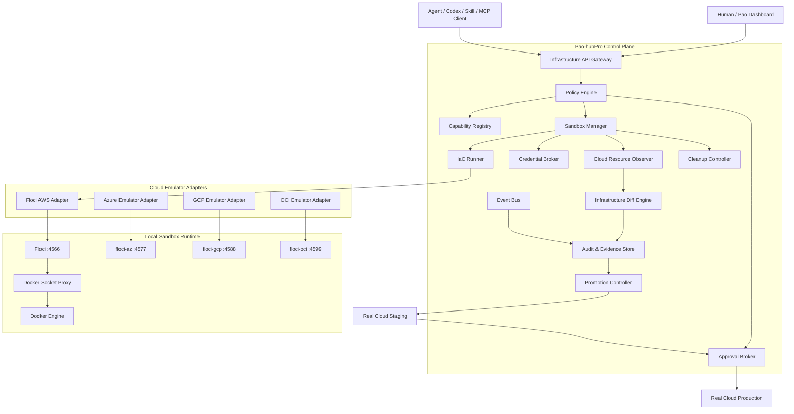
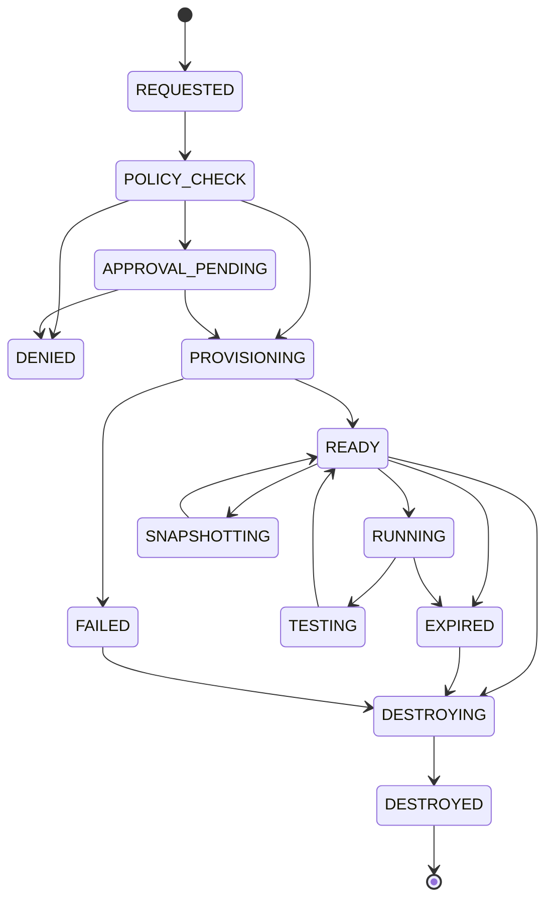
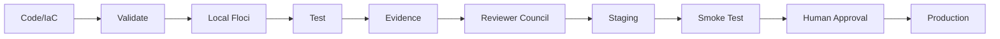

# Pao-hubPro × Floci — Agent-Native Local Multi-Cloud Emulation Fabric, Disposable AWS-Compatible Sandbox Runtime, IaC & Terraform Validation Plane, Container-Backed Cloud Service Simulation, Isolated Test Environment Orchestration, Cloud Resource Observatory, Safe Local-to-Production Promotion Gateway & Policy-Governed Infrastructure Execution Plane

> **Project:** Pao-hubPro  
> **Integration:** Floci  
> **Document type:** Implementation Phase / Architecture Specification  
> **Status:** Proposed / Ready for implementation  
> **Date:** 2026-09-22  
> **Primary upstream:** https://github.com/floci-io/floci  
> **Upstream license:** MIT  
> **Intended executor:** Codex / Pao-hubPro Coding Agent  
> **Primary operating mode:** Local-first, approval-gated, auditable, disposable-by-default  

---

## 0. Executive Summary

Phase นี้เพิ่ม **Cloud Infrastructure Sandbox Plane** ให้ Pao-hubPro โดยใช้ **Floci** เป็น AWS-compatible local emulator หลัก และออกแบบ abstraction ให้รองรับ emulator ตระกูลเดียวกันสำหรับ Azure, GCP และ OCI ในอนาคต

เป้าหมายไม่ใช่การทำให้ Pao-hubPro กลายเป็น cloud provider แต่คือการทำให้ Agent, Codex, Skills, MCP tools และ automation workflow สามารถ:

- สร้าง infrastructure แบบ AWS-shaped ในเครื่อง local
- ทดสอบ Terraform / OpenTofu / AWS SDK / AWS CLI / CDK ก่อนแตะ cloud จริง
- สร้าง sandbox แยกต่อ task / agent / branch
- ทดสอบ Lambda, S3, DynamoDB, SQS, SNS, RDS, ECS, EKS, OpenSearch และ service อื่นใน environment ที่ควบคุมได้
- บันทึก resource graph, logs, events, policy decisions และ audit trail
- diff ระหว่าง desired state กับ actual local state
- promote จาก Local -> Staging -> Production ผ่าน approval gate
- ป้องกัน Agent เข้าถึง Docker socket, host filesystem, production credential หรือ cloud account โดยตรง
- cleanup environment อัตโนมัติเมื่อ task เสร็จหรือ TTL หมด
- ใช้ Testcontainers เพื่อสร้าง isolated integration-test environment ต่อ test suite
- รองรับการต่อยอด multi-cloud ผ่าน provider adapter โดยไม่ผูก Pao-hubPro กับ Floci implementation โดยตรง

แนวคิดหลัก:

```text
Agent/Codex
    |
    v
Pao-hubPro Infrastructure Broker
    |
    +--> Policy Engine
    |       |
    |       +--> allow / deny / approval_required
    |
    +--> Sandbox Manager
    |       |
    |       +--> Floci AWS Sandbox
    |       +--> floci-az Adapter
    |       +--> floci-gcp Adapter
    |       +--> floci-oci Adapter
    |
    +--> IaC Runner
    |
    +--> Resource Observer
    |
    +--> Audit / Evidence
    |
    +--> Promotion Controller
            |
            +--> Local
            +--> Staging
            +--> Production
```

---

# 1. Upstream Facts Locked Into This Phase

ข้อมูลส่วนนี้ใช้เป็น baseline สำหรับ integration และต้องตรวจ upstream ใหม่เมื่อ upgrade version

## 1.1 Floci Core

Floci เป็น local AWS emulator สำหรับ development, testing และ CI โดยใช้ AWS-shaped API และ endpoint หลัก:

```text
http://localhost:4566
```

Client ที่เหมาะกับ integration:

- AWS CLI
- AWS SDK
- Terraform
- OpenTofu
- AWS CDK
- Test suites
- Custom HTTP / SigV4 clients

Floci รองรับ local emulation โดยไม่จำเป็นต้องใช้ AWS account จริงสำหรับ workflow local ทั่วไป

## 1.2 Floci Emulator Family

Baseline family:

| Emulator | Cloud | Default Port |
|---|---|---:|
| floci | AWS | 4566 |
| floci-az | Azure | 4577 |
| floci-gcp | GCP | 4588 |
| floci-oci | OCI | 4599 |

Pao-hubPro ต้อง **ไม่ hardcode** logic ว่า Cloud Sandbox = AWS เท่านั้น

ให้ใช้ `CloudEmulatorAdapter` เป็น abstraction ตั้งแต่ต้น

## 1.3 Docker-backed Services

Floci ใช้ Docker-backed execution ใน service ที่ต้องการ fidelity สูงหลายประเภท เช่น:

- Lambda
- RDS
- Neptune
- ElastiCache
- MSK
- ECS
- EC2
- EKS
- OpenSearch
- CodeBuild
- Managed Service for Apache Flink

ดังนั้น Pao-hubPro ต้องถือ Floci เป็น **privileged infrastructure runtime** ไม่ใช่ mock server ธรรมดา

## 1.4 Persistence Modes

Floci รองรับ storage profile หลายแบบ เช่น:

- memory
- persistent
- hybrid
- WAL / write-ahead log

Pao-hubPro ต้อง map profile ให้ชัดเจน:

```yaml
sandbox_profiles:
  ephemeral:
    storage_mode: memory

  resumable:
    storage_mode: hybrid

  durable:
    storage_mode: persistent

  forensic:
    storage_mode: wal
```

## 1.5 Testcontainers

Floci มี integration สำหรับ isolated test instances

Pao-hubPro ต้องออกแบบให้ test suite สามารถขอ environment แบบ:

```text
create sandbox
run tests
collect evidence
destroy sandbox
```

โดยไม่แชร์ state กันระหว่าง test jobs

## 1.6 Licensing

Floci upstream ใช้ MIT license

การนำมา integrate ต้อง:

- เก็บ upstream attribution
- ไม่ลบ copyright/license notice ที่มากับ upstream source
- แยก Pao-hubPro proprietary code ออกจาก vendored upstream code ถ้ามีการ vendor
- prefer image/package dependency มากกว่าการ fork โดยไม่จำเป็น

---

# 2. Problem Statement

ก่อน Phase นี้ Pao-hubPro มีแนวคิดสำคัญหลายส่วนอยู่แล้ว เช่น:

- Multi-provider Agents
- Codex runtime
- MCP federation
- Skills registry
- Browser automation
- Local tools
- Remote host attachment
- Approval gates
- Reviewer Council
- Policy-governed execution
- Durable workflows

แต่ยังมีช่องว่างด้าน infrastructure execution:

```text
Agent generates IaC
        |
        v
terraform validate
        |
        v
??? actual infrastructure behavior ???
        |
        v
real cloud
```

ปัญหา:

1. `terraform validate` ตรวจ syntax/schema แต่ไม่ทดสอบ behavior จริง
2. Mock แบบ custom มัก fidelity ต่ำ
3. การทดสอบกับ AWS จริง:
   - มีค่าใช้จ่าย
   - เสี่ยงสร้าง resource ค้าง
   - เสี่ยงใช้ credential ผิด account
   - อาจโดน quota
   - อาจสร้าง public endpoint
   - cleanup ยาก
4. Agent ที่มี permission กว้างเกินไปอาจทำ destructive action
5. การรีวิว IaC อย่างเดียวไม่เห็น runtime interaction
6. integration test ที่แชร์ local environment เดียวกันเกิด state collision

Phase นี้แก้โดยเพิ่ม:

> **Policy-Governed Disposable Cloud Sandbox**

---

# 3. Goals

## 3.1 Primary Goals

- ให้ Agent provision AWS-compatible infrastructure local ได้
- sandbox แยกต่อ task / run / branch
- Terraform/OpenTofu support เป็น first-class
- AWS CLI/SDK endpoint injection อัตโนมัติ
- Docker-backed service isolation
- policy gate ทุก infrastructure action
- production credentials inaccessible by default
- audit trail ทุก action
- automatic cleanup
- integration test orchestration
- infrastructure diff
- local-to-staging promotion
- staging-to-production approval
- support future multi-cloud adapters

## 3.2 Secondary Goals

- Local cloud resource explorer
- cost estimation
- quota simulation
- template catalog
- reusable environment blueprints
- CI pipeline integration
- snapshot / resume
- test fixtures
- failure injection
- chaos testing hook
- drift detection
- policy-as-code

---

# 4. Non-Goals

Phase นี้ **ไม่** มีเป้าหมาย:

- รับรองว่า Floci behavior เท่ากับ AWS 100%
- ข้าม staging แล้ว deploy production โดยอัตโนมัติ
- ให้ Agent ใช้ AWS root/admin credential
- expose Docker socket ให้ Agent
- ให้ browser frontend ติดต่อ Docker daemon โดยตรง
- ทำ billing emulator ที่แม่นยำเท่าค่าใช้จริงของ cloud
- replace security testing บน real staging environment
- replace provider-native conformance testing ทั้งหมด
- clone upstream Floci โดยไม่จำเป็น

---

# 5. Core Design Principles

## 5.1 Local First

ทุก infrastructure request ที่สามารถจำลองได้ ให้เริ่มจาก:

```text
LOCAL_SANDBOX
```

ก่อน real cloud

## 5.2 Least Privilege

Agent ไม่ควรได้:

```text
docker.sock
/root
host network
AWS production keys
cloud admin tokens
unrestricted shell
```

## 5.3 Disposable by Default

ทุก sandbox มี TTL

ตัวอย่าง:

```yaml
ttl:
  default_minutes: 60
  max_minutes: 480
  auto_extend_if_active: true
```

## 5.4 Evidence Before Promotion

ห้าม promote หากไม่มี:

- plan
- test result
- resource inventory
- policy result
- drift/diff result
- security checks
- reviewer result

## 5.5 Adapter-first

Pao-hubPro code ห้ามผูก business logic กับ Floci API มากเกินไป

ใช้:

```text
CloudEmulatorAdapter
```

## 5.6 Production Is a Different Trust Zone

Local emulator credential:

```text
test / test
```

ต้องไม่ถูก reuse เป็น real credential abstraction

Production credential ต้องผ่าน:

```text
Credential Broker
```

เท่านั้น

---

# 6. Target Architecture



---

# 7. Trust Boundaries

```text
+-------------------------------------------------------+
| Pao-hubPro User / Human                              |
+----------------------+--------------------------------+
                       |
                       v
+-------------------------------------------------------+
| Control Plane                                          |
| API / Policy / Approval / Audit / Resource Registry   |
+----------------------+--------------------------------+
                       |
                       v
+-------------------------------------------------------+
| Sandbox Broker                                         |
| NO direct production credentials                       |
+----------------------+--------------------------------+
                       |
                       v
+-------------------------------------------------------+
| Floci / Cloud Emulator                                 |
| local-only credential                                  |
+----------------------+--------------------------------+
                       |
                       v
+-------------------------------------------------------+
| Docker Proxy                                           |
| allowlisted API only                                   |
+----------------------+--------------------------------+
                       |
                       v
+-------------------------------------------------------+
| Docker Engine / Host                                   |
+-------------------------------------------------------+
```

Production boundary แยกออก:

```text
Pao-hubPro Promotion Controller
        |
        v
Credential Broker
        |
        v
Staging Account
        |
 Human Approval
        |
        v
Production Account
```

---

# 8. Major Components

## 8.1 Infrastructure API Gateway

หน้าที่:

- รับ infrastructure request
- validate schema
- attach actor identity
- attach task/run id
- enforce idempotency
- route ไป Policy Engine
- return operation handle

ตัวอย่าง endpoint:

```http
POST /api/v1/cloud/sandboxes
POST /api/v1/cloud/sandboxes/{id}/actions
GET  /api/v1/cloud/sandboxes/{id}
GET  /api/v1/cloud/sandboxes/{id}/resources
GET  /api/v1/cloud/sandboxes/{id}/logs
POST /api/v1/cloud/sandboxes/{id}/snapshot
POST /api/v1/cloud/sandboxes/{id}/destroy
POST /api/v1/cloud/promotions
GET  /api/v1/cloud/promotions/{id}
```

---

## 8.2 Cloud Capability Registry

เก็บ capability ที่ Agent เรียกได้

ตัวอย่าง:

```yaml
capabilities:

  aws.s3:
    emulator: floci
    risk: low
    approval: false

  aws.dynamodb:
    emulator: floci
    risk: low
    approval: false

  aws.lambda:
    emulator: floci
    risk: medium
    approval: false

  aws.rds:
    emulator: floci
    risk: medium
    approval: false

  aws.ec2:
    emulator: floci
    risk: medium
    approval: conditional

  aws.eks:
    emulator: floci
    risk: high
    approval: true

  cloud.production.apply:
    emulator: none
    risk: critical
    approval: true
```

Registry fields:

```ts
interface CloudCapability {
  id: string;
  provider: "aws" | "azure" | "gcp" | "oci";
  service: string;
  operations: string[];
  environments: ("local" | "staging" | "production")[];
  risk: "low" | "medium" | "high" | "critical";
  approvalMode: "none" | "conditional" | "required";
  networkPolicy: string;
  credentialProfile: string;
  maxRuntimeSeconds?: number;
  quotas?: Record<string, number>;
}
```

---

# 9. Cloud Emulator Adapter SPI

```ts
export interface CloudEmulatorAdapter {
  id(): string;

  provider(): "aws" | "azure" | "gcp" | "oci";

  startSandbox(input: StartSandboxInput): Promise<SandboxRuntime>;

  stopSandbox(sandboxId: string): Promise<void>;

  health(sandboxId: string): Promise<HealthReport>;

  endpoint(sandboxId: string): Promise<CloudEndpointSet>;

  listResources(sandboxId: string): Promise<CloudResource[]>;

  execute(
    sandboxId: string,
    request: CloudActionRequest
  ): Promise<CloudActionResult>;

  snapshot?(sandboxId: string): Promise<SnapshotRef>;

  restore?(snapshot: SnapshotRef): Promise<SandboxRuntime>;

  collectLogs(sandboxId: string): Promise<LogBundle>;

  destroy(sandboxId: string): Promise<DestroyReport>;
}
```

---

# 10. Floci AWS Adapter

Floci adapter รับผิดชอบเฉพาะ AWS-compatible local runtime

```text
FlociAwsAdapter
    |
    +-- start
    +-- stop
    +-- health
    +-- environment injection
    +-- resource discovery
    +-- log collection
    +-- storage mode
    +-- Docker-backed service handling
    +-- cleanup
```

Environment ที่ส่งให้ isolated runner:

```bash
AWS_ENDPOINT_URL=http://floci:4566
AWS_DEFAULT_REGION=us-east-1
AWS_ACCESS_KEY_ID=test
AWS_SECRET_ACCESS_KEY=test
AWS_EC2_METADATA_DISABLED=true
```

> ห้าม export ตัวแปร local sandbox ชุดนี้เข้า global shell profile ของ host

---

# 11. Sandbox Model

## 11.1 Sandbox Identity

ทุก sandbox ต้องมี:

```yaml
sandbox:
  id: sbx_01J...
  owner_actor_id: agent_codex_01
  task_id: task_...
  run_id: run_...
  provider: aws
  adapter: floci
  profile: ephemeral
  created_at: ...
  expires_at: ...
  status: ready
```

## 11.2 Isolation Key

แนะนำใช้:

```text
workspace_id + task_id + run_id
```

สร้าง namespace แยก

## 11.3 Default Profiles

### Ephemeral

- memory storage
- short TTL
- auto destroy
- integration tests

### Resumable

- hybrid persistence
- medium TTL
- developer debug

### Durable

- persistent storage
- manual destroy
- requires reason

### Forensic

- WAL
- immutable evidence retention
- restricted use
- approval required

---

# 12. Sandbox Lifecycle State Machine



---

# 13. IaC Execution Plane

## 13.1 Supported IaC

Priority:

1. Terraform
2. OpenTofu
3. AWS CDK
4. CloudFormation
5. Pulumi adapter later

## 13.2 Terraform Flow

```text
Agent generates files
        |
        v
terraform fmt
        |
        v
terraform validate
        |
        v
Policy scan
        |
        v
terraform plan -> Floci endpoint
        |
        v
Review plan
        |
        v
terraform apply -> local sandbox
        |
        v
Integration tests
        |
        v
Resource inventory
        |
        v
Evidence bundle
```

## 13.3 Provider Injection

Pao-hubPro ควร generate provider overlay ไม่แก้ source file ของ user ถ้าไม่จำเป็น

ตัวอย่าง concept:

```hcl
provider "aws" {
  region                      = "us-east-1"
  access_key                  = "test"
  secret_key                  = "test"

  s3_use_path_style           = true

  skip_credentials_validation = true
  skip_metadata_api_check     = true
  skip_requesting_account_id  = true

  endpoints {
    s3         = "http://floci:4566"
    dynamodb   = "http://floci:4566"
    sqs        = "http://floci:4566"
    sns        = "http://floci:4566"
    lambda     = "http://floci:4566"
  }
}
```

Implementation ต้องตรวจ Terraform/AWS provider version จริงก่อน generate

---

# 14. IaC Runner Security

IaC process ต้อง run ใน isolated execution environment

ห้าม:

- mount entire home directory
- inherit host cloud credentials
- inherit SSH agent โดย default
- inherit unrestricted network
- read `/var/run/docker.sock`
- run privileged container
- mount `/` จาก host

แนะนำ:

```yaml
iac_runner:
  filesystem:
    readonly_root: true
    writable:
      - /workspace
      - /tmp

  network:
    allow:
      - floci
      - package_registry_if_needed

  env:
    inherit: false

  credentials:
    source: broker
```

---

# 15. Docker Socket Isolation

นี่เป็น requirement ระดับ **MUST**

Floci service บางชนิดต้องสร้าง Docker container

แต่ topology ที่ห้าม:

```text
Agent
  |
  v
/var/run/docker.sock
```

Topology ที่ต้องใช้:

```text
Agent
  |
  v
Pao Infrastructure API
  |
  v
Policy Engine
  |
  v
Sandbox Manager
  |
  v
Floci
  |
  v
Docker API Proxy
  |
  v
Docker Engine
```

## 15.1 Docker Proxy Allowlist

อนุญาตเฉพาะ API ที่จำเป็น เช่น:

- container create
- container start
- container inspect
- container stop
- container remove
- selected network operations
- selected volume operations

deny:

- host privileged escalation
- bind mount arbitrary host paths
- device passthrough
- host PID namespace
- host network unless explicitly approved
- arbitrary Docker plugin operations

---

# 16. Credential Broker

## 16.1 Credential Classes

```text
LOCAL_FAKE
STAGING_LIMITED
PRODUCTION_APPROVAL_ONLY
```

### LOCAL_FAKE

```text
access_key = test
secret_key = test
```

### STAGING_LIMITED

- short-lived
- scoped role
- limited account
- limited region
- explicit TTL

### PRODUCTION_APPROVAL_ONLY

- never shown to model
- never persisted in prompt
- broker injects at execution time
- requires approval token
- rotate / revoke support

---

# 17. Policy Engine

## 17.1 Decision

```json
{
  "decision": "allow",
  "risk": "medium",
  "reason": "local sandbox operation",
  "approval_required": false,
  "policy_version": "cloud-policy-v1"
}
```

Possible:

```text
ALLOW
DENY
APPROVAL_REQUIRED
ALLOW_WITH_CONSTRAINTS
```

## 17.2 Risk Tiers

| Tier | Example | Default |
|---|---|---|
| Low | S3 local bucket | Allow |
| Medium | Lambda/RDS local | Allow + limits |
| High | EKS/EC2 local with network access | Conditional approval |
| Critical | Production apply/delete | Human approval |

---

# 18. Example Policy Rules

```yaml
rules:

  - id: local-s3-auto-allow
    when:
      environment: local
      provider: aws
      service: s3
    decision: allow

  - id: local-eks-limit
    when:
      environment: local
      provider: aws
      service: eks
    decision: allow_with_constraints
    constraints:
      max_clusters: 1
      max_runtime_minutes: 90

  - id: production-apply
    when:
      environment: production
      action: apply
    decision: approval_required

  - id: production-destroy
    when:
      environment: production
      action: destroy
    decision: approval_required
    approvals:
      min_humans: 1
      require_reason: true
      require_plan_digest_match: true
```

---

# 19. Resource Observatory

Pao-hubPro Dashboard ควรแสดง:

```text
Cloud Sandbox
  |
  +-- Overview
  +-- Resources
  +-- Resource Graph
  +-- Events
  +-- Logs
  +-- IaC Plan
  +-- Drift
  +-- Tests
  +-- Network
  +-- Costs
  +-- Policy Decisions
  +-- Evidence
  +-- Destroy
```

## 19.1 Resource Entity

```ts
interface CloudResource {
  id: string;
  sandboxId: string;
  provider: string;
  service: string;
  type: string;
  externalId?: string;
  name?: string;
  region?: string;
  state: string;
  tags: Record<string, string>;
  parentIds: string[];
  discoveredAt: string;
  raw?: unknown;
}
```

---

# 20. Resource Graph

ตัวอย่าง:

```text
API Gateway
    |
    v
Lambda
    |
    +--> DynamoDB
    |
    +--> S3
    |
    +--> SQS
             |
             v
           Lambda Worker
```

Graph ต้องใช้เพื่อ:

- architecture review
- impact analysis
- destroy ordering
- promotion comparison
- drift detection
- policy visualization

---

# 21. Infrastructure Diff Engine

เปรียบเทียบ:

```text
Desired IaC
vs
Local Sandbox
vs
Staging
vs
Production
```

Result:

```yaml
diff:
  added:
    - aws_s3_bucket.assets

  changed:
    - aws_lambda_function.worker

  removed: []

  unknown:
    - aws_iam_policy.runtime

  risk:
    score: 41
    level: medium
```

> `risk score` ใช้ภายในระบบ infrastructure เท่านั้น ไม่ใช่ political/person scoring

---

# 22. Local-to-Production Promotion Pipeline



---

# 23. Promotion Gates

## Gate A — Static

ต้องผ่าน:

- fmt
- validate
- schema check
- secret scan
- policy scan

## Gate B — Local Runtime

ต้องผ่าน:

- Floci provision
- integration tests
- no leaked resource
- no unapproved outbound network
- clean destroy test

## Gate C — Reviewer Council

Review:

- IaC correctness
- security
- destructive changes
- permission scope
- runtime assumptions

## Gate D — Staging

ต้องผ่าน:

- real provider API
- smoke tests
- provider-native policy
- quotas
- networking

## Gate E — Production

ต้อง:

- plan digest fixed
- approval still valid
- credential lease valid
- no changed artifact after approval

---

# 24. Plan Digest Lock

ป้องกัน:

```text
review plan A
approve plan A
execute plan B
```

ใช้ digest:

```text
SHA256(
  IaC bundle
  + provider config
  + variables
  + module lock
  + policy version
  + execution target
)
```

Promotion ต้องตรง digest ที่อนุมัติ

---

# 25. MCP Tool Surface

เสนอ MCP namespace:

```text
pao.cloud.*
```

Tools:

```text
pao.cloud.sandbox.create
pao.cloud.sandbox.get
pao.cloud.sandbox.list
pao.cloud.sandbox.destroy
pao.cloud.sandbox.extend_ttl

pao.cloud.resource.list
pao.cloud.resource.get
pao.cloud.resource.graph

pao.cloud.iac.validate
pao.cloud.iac.plan
pao.cloud.iac.apply_local
pao.cloud.iac.destroy_local

pao.cloud.test.run
pao.cloud.logs.query

pao.cloud.snapshot.create
pao.cloud.snapshot.restore

pao.cloud.promotion.prepare
pao.cloud.promotion.request_approval
pao.cloud.promotion.apply_staging
pao.cloud.promotion.apply_production
```

---

# 26. MCP Tool Contract Example

```json
{
  "name": "pao.cloud.sandbox.create",
  "description": "Create an isolated policy-governed local cloud sandbox.",
  "inputSchema": {
    "type": "object",
    "required": ["provider", "profile"],
    "properties": {
      "provider": {
        "enum": ["aws", "azure", "gcp", "oci"]
      },
      "profile": {
        "enum": ["ephemeral", "resumable", "durable", "forensic"]
      },
      "ttlMinutes": {
        "type": "integer",
        "minimum": 5,
        "maximum": 480
      }
    }
  }
}
```

---

# 27. Skills

สร้าง Skills ระดับ application:

```text
cloud-sandbox
terraform-local-test
opentofu-local-test
aws-sdk-local-test
cloud-resource-audit
iac-security-review
infrastructure-promotion
sandbox-cleanup
```

## Skill: terraform-local-test

Input:

- workspace
- target module
- variable profile

Output:

- validate result
- plan
- apply result
- test result
- resource inventory
- destroy verification
- evidence bundle

---

# 28. Agent Permission Model

Agent role ตัวอย่าง:

```yaml
roles:

  coder:
    capabilities:
      - cloud.sandbox.create
      - cloud.iac.validate
      - cloud.iac.plan
      - cloud.iac.apply_local
      - cloud.test.run

    denied:
      - cloud.production.apply
      - cloud.production.destroy

  reviewer:
    capabilities:
      - cloud.resource.list
      - cloud.logs.read
      - cloud.diff.read
      - cloud.evidence.read

  operator:
    capabilities:
      - cloud.staging.apply
      - cloud.sandbox.destroy

  human_owner:
    capabilities:
      - cloud.production.approve
```

---

# 29. Event Model

Event topics:

```text
cloud.sandbox.requested
cloud.sandbox.created
cloud.sandbox.ready
cloud.sandbox.failed
cloud.sandbox.expiring
cloud.sandbox.destroyed

cloud.iac.validate.started
cloud.iac.validate.finished
cloud.iac.plan.created
cloud.iac.apply.started
cloud.iac.apply.finished

cloud.resource.created
cloud.resource.updated
cloud.resource.deleted

cloud.policy.allowed
cloud.policy.denied
cloud.approval.requested
cloud.approval.granted
cloud.approval.rejected

cloud.promotion.prepared
cloud.promotion.staging
cloud.promotion.production
```

---

# 30. Audit Event Schema

```json
{
  "event_id": "evt_...",
  "timestamp": "2026-09-22T00:00:00Z",
  "actor": {
    "type": "agent",
    "id": "codex-main"
  },
  "workspace_id": "ws_...",
  "task_id": "task_...",
  "sandbox_id": "sbx_...",
  "operation": "cloud.iac.apply_local",
  "decision": "allow",
  "policy_version": "cloud-policy-v1",
  "input_digest": "sha256:...",
  "output_digest": "sha256:...",
  "approval_id": null,
  "result": "success"
}
```

---

# 31. Evidence Bundle

ทุก local infrastructure run ที่ใช้ promotion ต้องสร้าง:

```text
evidence/
  manifest.json
  source-digest.txt
  policy.json
  terraform/
    fmt.txt
    validate.txt
    plan.txt
    apply.txt
  tests/
    junit.xml
    summary.json
  resources/
    inventory.json
    graph.json
  logs/
    floci.log
    runner.log
  security/
    secret-scan.json
    policy-scan.json
  cleanup/
    destroy.txt
    leak-check.json
```

---

# 32. Database Schema

ตัวอย่าง PostgreSQL:

```sql
create table cloud_sandboxes (
  id text primary key,
  workspace_id text not null,
  task_id text,
  run_id text,
  actor_id text not null,
  provider text not null,
  adapter text not null,
  profile text not null,
  status text not null,
  endpoint_json jsonb,
  config_json jsonb not null default '{}'::jsonb,
  created_at timestamptz not null default now(),
  expires_at timestamptz,
  destroyed_at timestamptz
);

create index idx_cloud_sandboxes_workspace
  on cloud_sandboxes(workspace_id);

create index idx_cloud_sandboxes_expiry
  on cloud_sandboxes(expires_at)
  where destroyed_at is null;
```

```sql
create table cloud_resources (
  id text primary key,
  sandbox_id text not null references cloud_sandboxes(id),
  provider text not null,
  service text not null,
  resource_type text not null,
  external_id text,
  name text,
  region text,
  state text,
  tags_json jsonb not null default '{}'::jsonb,
  raw_json jsonb,
  discovered_at timestamptz not null default now()
);
```

```sql
create table cloud_operations (
  id text primary key,
  sandbox_id text references cloud_sandboxes(id),
  actor_id text not null,
  operation text not null,
  risk_level text not null,
  policy_decision text not null,
  approval_id text,
  input_digest text,
  status text not null,
  started_at timestamptz not null default now(),
  finished_at timestamptz,
  result_json jsonb
);
```

```sql
create table cloud_promotions (
  id text primary key,
  workspace_id text not null,
  source_sandbox_id text,
  target_environment text not null,
  plan_digest text not null,
  evidence_bundle_id text not null,
  status text not null,
  approval_id text,
  created_at timestamptz not null default now(),
  applied_at timestamptz
);
```

---

# 33. API Contract

## Create Sandbox

```http
POST /api/v1/cloud/sandboxes
```

```json
{
  "provider": "aws",
  "adapter": "floci",
  "profile": "ephemeral",
  "ttl_minutes": 60,
  "services": [
    "s3",
    "dynamodb",
    "lambda",
    "sqs"
  ]
}
```

Response:

```json
{
  "id": "sbx_...",
  "status": "provisioning",
  "operation_id": "op_..."
}
```

---

# 34. Sandbox Runtime Configuration

```yaml
cloud:
  sandbox:
    default_provider: aws
    default_adapter: floci
    default_profile: ephemeral
    default_ttl_minutes: 60

  adapters:
    floci:
      image: floci/floci:latest
      endpoint_port: 4566
      storage_mode: memory
      console_enabled: false

  policy:
    local_default: allow
    staging_default: approval_required
    production_default: approval_required

  cleanup:
    interval_seconds: 60
    destroy_expired: true
    leak_scan: true
```

> production implementation ควร pin image digest/version แทน `latest`

---

# 35. Container Topology

```yaml
services:

  pao-cloud-broker:
    image: pao-hubpro/cloud-broker
    networks:
      - pao-control

  floci:
    image: floci/floci:latest
    networks:
      - pao-sandbox
    environment:
      FLOCI_STORAGE_MODE: memory

  docker-api-proxy:
    image: pao-hubpro/docker-api-proxy
    networks:
      - pao-sandbox
      - docker-control

networks:
  pao-control:
  pao-sandbox:
    internal: true
  docker-control:
    internal: true
```

Actual deployment ต้องออกแบบ socket proxy ตาม platform ที่ใช้งานจริง

---

# 36. Network Policy

Default sandbox:

```text
ALLOW:
- Pao-hubPro broker -> Floci
- Floci -> Docker Proxy
- test runner -> Floci
- approved package registry if required

DENY:
- sandbox -> LAN
- sandbox -> host management ports
- sandbox -> production databases
- sandbox -> metadata service
- sandbox -> arbitrary internet
```

Outbound internet เปิดเฉพาะ:

```text
approval / explicit allowlist
```

---

# 37. Host Protection

Agent-created container settings ต้อง validate

Reject:

```yaml
privileged: true
network_mode: host
pid: host
ipc: host
```

Reject bind mount:

```text
/
 /etc
 /root
 /home
 /var/run/docker.sock
 ~/.ssh
 cloud credential directories
```

---

# 38. Secret Handling

Rules:

1. secret ไม่เข้า prompt ถ้าไม่จำเป็น
2. UI mask secret
3. audit log เก็บ secret reference ไม่เก็บ raw value
4. local fake credentials แยก namespace
5. staging/productionใช้ lease
6. revoke เมื่อ operation เสร็จ
7. no secret in Terraform plan artifact ถ้าหลีกเลี่ยงได้
8. redact logs

---

# 39. Test Strategy

## 39.1 Unit Tests

- policy rules
- TTL calculation
- adapter interface
- digest generation
- resource parser
- cleanup planner

## 39.2 Integration Tests

- boot Floci
- create S3 bucket
- DynamoDB table
- SQS queue
- Lambda function
- event flow
- Terraform apply/destroy
- snapshot if supported
- log collection

## 39.3 Isolation Tests

ต้อง prove:

```text
sandbox A resource
!=
sandbox B resource
```

แม้ชื่อ resource เหมือนกัน

## 39.4 Failure Tests

- Floci fails to start
- Docker unavailable
- IaC apply half-complete
- TTL expires during test
- cleanup partially fails
- service container hangs
- disk full
- policy service unavailable

---

# 40. Testcontainers Integration

Recommended flow:

```text
Test suite
   |
   v
FlociContainer.start()
   |
   v
Inject endpoint + credentials
   |
   v
Run integration tests
   |
   v
Collect result
   |
   v
FlociContainer.stop()
```

Pao-hubPro orchestration layer ควร normalize test metadata:

```json
{
  "sandbox_mode": "testcontainers",
  "provider": "aws",
  "adapter": "floci",
  "test_framework": "pytest",
  "isolated": true
}
```

---

# 41. Service Adoption Strategy

ไม่เปิดทุก service ตั้งแต่ Day 1

## Wave 1

- S3
- DynamoDB
- SQS
- SNS
- Lambda
- Secrets Manager
- SSM
- CloudWatch Logs

## Wave 2

- EventBridge
- Step Functions
- API Gateway
- Cognito
- RDS
- OpenSearch

## Wave 3

- ECS
- EC2
- EKS
- MSK
- CodeBuild
- CodePipeline

## Wave 4

- Bedrock-related local API surface
- SageMaker-related flows
- advanced analytics/data services

---

# 42. Compatibility Classification

ทุก service ต้องมี fidelity marker:

```text
IN_PROCESS
DOCKER_BACKED
STUB
PARTIAL
UNKNOWN
```

ตัวอย่าง UI:

```text
S3          IN_PROCESS
Lambda      DOCKER_BACKED
RDS         DOCKER_BACKED
EKS         DOCKER_BACKED
Textract    PARTIAL/STUB depending on operation
```

ห้ามสรุป:

```text
local passed = production guaranteed
```

---

# 43. Fidelity Gate

ก่อน promote:

```yaml
fidelity:
  required:
    - api_shape
    - resource_lifecycle
    - event_flow

  production_retest:
    required_if:
      - service_fidelity == partial
      - service_fidelity == stub
      - undocumented_behavior == true
```

---

# 44. Cost Observatory

Local cost:

```text
$0 provider cost
+ host compute cost
+ storage cost
```

Staging/production estimate:

- resource count
- runtime duration
- provider price cache
- region
- estimated data transfer

Pao-hubPro ต้อง label:

```text
ESTIMATE
```

ไม่ใช่ actual invoice

---

# 45. Quota Simulation

ตัวอย่าง:

```yaml
quota_profile:
  lambda:
    max_functions: 20

  s3:
    max_buckets: 50

  rds:
    max_instances: 2

  eks:
    max_clusters: 1
```

ช่วยป้องกัน agent runaway local ด้วย

---

# 46. Cleanup Controller

Cleanup ทำ:

1. identify expired sandbox
2. acquire destroy lock
3. stop active jobs
4. collect final logs
5. export resource inventory
6. destroy IaC
7. remove orphan containers
8. remove network
9. remove temporary volumes
10. verify no leaked resource
11. record destroy evidence
12. mark `DESTROYED`

---

# 47. Leak Detection

ตรวจ:

- containers with sandbox label
- networks
- volumes
- processes
- open ports
- workspace temp data
- resource registry entries

Example label:

```text
pao.sandbox.id=sbx_...
pao.workspace.id=ws_...
pao.run.id=run_...
```

---

# 48. Snapshot / Resume

Snapshot metadata:

```json
{
  "snapshot_id": "snap_...",
  "sandbox_id": "sbx_...",
  "adapter": "floci",
  "storage_mode": "persistent",
  "created_at": "...",
  "source_digest": "sha256:..."
}
```

ต้องแยก:

- emulator state snapshot
- IaC source
- runner filesystem
- database volumes

---

# 49. UI / Dashboard

## Sandbox List

Columns:

- ID
- Provider
- Profile
- Owner
- Services
- Status
- Age
- TTL
- Resource count
- Risk
- Actions

## Sandbox Detail

Tabs:

```text
Overview
Resources
Graph
IaC
Tests
Events
Logs
Network
Policy
Evidence
Snapshots
Danger Zone
```

---

# 50. Human Approval UX

Approval card ต้องแสดง:

```text
Action
Target
Environment
Resources added
Resources changed
Resources removed
Risk reasons
Plan digest
Evidence status
Reviewer status
Credential scope
Expiry
```

Buttons:

```text
Approve Once
Reject
Request Changes
```

ห้ามมี default auto-approve สำหรับ production

---

# 51. Reviewer Council Integration

Input:

```json
{
  "iac_plan": "...",
  "resource_diff": "...",
  "policy_result": "...",
  "test_summary": "...",
  "evidence_bundle": "..."
}
```

Reviewer roles:

- correctness reviewer
- security reviewer
- cost reviewer
- operational reviewer

Council ไม่สามารถ bypass human production gate

---

# 52. LocalStack Migration Compatibility

Floci upstream มี compatibility path สำหรับ LocalStack-style workflows

Pao-hubPro สามารถมี adapter migration helper:

```text
detect LocalStack config
        |
        v
generate compatibility report
        |
        v
switch image/endpoint config
        |
        v
run local regression tests
```

ห้าม auto-migrate production workflow โดยไม่มี review

---

# 53. Multi-Cloud Expansion

Architecture:

```text
Cloud Broker
   |
   +-- AWS Adapter -> Floci
   +-- Azure Adapter -> floci-az
   +-- GCP Adapter -> floci-gcp
   +-- OCI Adapter -> floci-oci
```

Normalized resource model:

```ts
interface NormalizedCloudResource {
  provider: string;
  service: string;
  kind: string;
  name: string;
  region?: string;
  labels: Record<string, string>;
  relationships: string[];
}
```

---

# 54. Provider-specific Escape Hatch

Normalization ห้ามทำให้ provider feature หาย

รองรับ:

```json
{
  "normalized": { "...": "..." },
  "provider_raw": { "...": "..." }
}
```

---

# 55. Repository Layout Proposal

```text
pao-hubpro/
  apps/
    web/

  services/
    cloud-broker/
    sandbox-manager/
    policy-engine/
    approval-broker/
    credential-broker/
    resource-observer/
    promotion-controller/
    cleanup-controller/

  packages/
    cloud-core/
    cloud-adapter-spi/
    floci-adapter/
    iac-runner/
    evidence-sdk/
    cloud-policy-sdk/

  skills/
    cloud-sandbox/
    terraform-local-test/
    infrastructure-promotion/

  mcp/
    cloud-tools/

  config/
    cloud/
      capabilities.yaml
      policies.yaml
      quotas.yaml
      service-fidelity.yaml

  infra/
    local-cloud/
      compose.yaml

  docs/
    cloud-sandbox/
```

---

# 56. Internal Module Boundaries

## `cloud-core`

ไม่มี dependency ต่อ Floci โดยตรง

## `floci-adapter`

รู้จัก:

- Floci endpoint
- environment
- health
- persistence config
- resource queries
- Docker-backed behavior

## `iac-runner`

ไม่รู้ว่า endpoint มาจาก Floci หรือ cloud จริง

รับ:

```ts
ExecutionTarget
```

## `promotion-controller`

ไม่เรียก Floci API โดยตรง

---

# 57. Type Model

```ts
export type CloudEnvironment =
  | "local"
  | "staging"
  | "production";

export type SandboxStatus =
  | "requested"
  | "policy_check"
  | "approval_pending"
  | "provisioning"
  | "ready"
  | "running"
  | "failed"
  | "expired"
  | "destroying"
  | "destroyed";

export type RiskLevel =
  | "low"
  | "medium"
  | "high"
  | "critical";
```

---

# 58. Error Taxonomy

```text
CLOUD_POLICY_DENIED
CLOUD_APPROVAL_REQUIRED
SANDBOX_START_FAILED
SANDBOX_NOT_READY
SANDBOX_EXPIRED
ADAPTER_UNAVAILABLE
IAC_VALIDATE_FAILED
IAC_PLAN_FAILED
IAC_APPLY_FAILED
RESOURCE_DISCOVERY_FAILED
TEST_FAILED
CLEANUP_FAILED
LEAK_DETECTED
PROMOTION_DIGEST_MISMATCH
CREDENTIAL_LEASE_FAILED
PRODUCTION_GATE_DENIED
```

---

# 59. Retry Rules

Retry ได้:

- health poll
- temporary container start failure
- resource discovery timeout
- log collection
- transient network

ห้าม retry blindly:

- production apply
- destroy
- permission change
- IAM-like destructive action
- database destructive migration

---

# 60. Idempotency

Mutation API ต้องรับ:

```http
Idempotency-Key
```

ตัวอย่าง:

```text
task_123:run_456:create-sandbox
```

ป้องกัน Agent retry แล้วสร้าง environment ซ้ำ

---

# 61. Concurrency Control

Locks:

```text
sandbox:{id}
promotion:{id}
workspace:{id}:production
```

Production apply ควร single-flight ต่อ workspace/environment

---

# 62. Observability

Metrics:

```text
cloud_sandbox_total
cloud_sandbox_active
cloud_sandbox_start_seconds
cloud_sandbox_failures_total
cloud_resource_total
cloud_iac_apply_seconds
cloud_iac_failure_total
cloud_cleanup_seconds
cloud_leak_detected_total
cloud_policy_denied_total
cloud_approval_pending_total
cloud_promotion_total
```

---

# 63. Structured Logs

```json
{
  "level": "info",
  "service": "sandbox-manager",
  "sandbox_id": "sbx_...",
  "operation_id": "op_...",
  "event": "sandbox.ready",
  "duration_ms": 412
}
```

---

# 64. Tracing

Trace chain:

```text
Agent request
-> API
-> Policy
-> Sandbox Manager
-> IaC Runner
-> Floci
-> Docker-backed service
-> Observer
-> Evidence
```

ใช้ correlation:

```text
trace_id
task_id
run_id
sandbox_id
operation_id
```

---

# 65. Health Checks

## Broker

```text
GET /health
GET /ready
```

## Sandbox

ตรวจ:

- endpoint reachable
- expected services
- Docker proxy if required
- persistence backend
- disk capacity
- runtime TTL

---

# 66. Version Pinning

Production-quality implementation ต้อง pin:

- Floci image
- Terraform
- OpenTofu
- AWS provider
- AWS CLI
- Testcontainers integration
- Docker-backed database images

Manifest:

```yaml
toolchain:
  floci: "<pinned-version-or-digest>"
  terraform: "<pinned>"
  opentofu: "<pinned>"
  aws_provider: "<pinned>"
```

ห้ามใช้ floating `latest` ใน CI release pipeline

---

# 67. Upgrade Workflow

```text
New Floci version
    |
    v
Compatibility Sandbox
    |
    v
Regression Suite
    |
    v
Service Fidelity Diff
    |
    v
Security Review
    |
    v
Canary
    |
    v
Pin New Version
```

---

# 68. Feature Flags

```yaml
features:
  cloud_sandbox: true
  floci_adapter: true
  local_eks: false
  production_promotion: false
  multi_cloud: false
  snapshots: false
```

เปิด production promotion เป็นขั้นท้าย

---

# 69. Implementation Milestones

## Milestone A — Foundation

- cloud-core
- adapter SPI
- sandbox DB
- operation DB
- basic API
- policy hooks

## Milestone B — Floci Runtime

- start/stop
- endpoint injection
- health
- S3/DynamoDB/SQS/SNS tests
- cleanup

## Milestone C — IaC

- Terraform
- OpenTofu
- isolated runner
- plan/apply/destroy
- evidence

## Milestone D — Docker-backed Services

- Lambda
- RDS
- OpenSearch
- resource limits
- Docker proxy

## Milestone E — Dashboard

- sandbox list
- resource list
- graph
- logs
- tests
- destroy

## Milestone F — Promotion

- staging
- plan digest
- reviewer
- approval
- production gate

## Milestone G — Multi-cloud SPI

- floci-az adapter contract
- floci-gcp adapter contract
- floci-oci adapter contract

---

# 70. Phase Execution Order

แนะนำ implementation order:

```text
01 Cloud Core
02 DB Schema
03 Policy Integration
04 Floci Adapter
05 Sandbox Manager
06 Cleanup Controller
07 AWS SDK Smoke Tests
08 Terraform Runner
09 Evidence Bundle
10 Resource Observer
11 Testcontainers Integration
12 Docker Proxy
13 Lambda/RDS Tests
14 Dashboard
15 Reviewer Council
16 Staging Promotion
17 Production Approval
18 Multi-cloud Expansion
```

---

# 71. Acceptance Checklist

## Core

- [ ] มี `CloudEmulatorAdapter`
- [ ] Floci implementation ไม่ leak เข้า core business logic
- [ ] create/destroy sandbox ได้
- [ ] sandbox มี TTL
- [ ] operation idempotent

## Security

- [ ] Agent ไม่เข้าถึง Docker socket
- [ ] Agent ไม่เห็น production secret
- [ ] host bind mounts ถูก block
- [ ] privileged container ถูก block
- [ ] outbound network default deny
- [ ] audit log ครบ
- [ ] redaction ผ่าน test

## IaC

- [ ] Terraform fmt
- [ ] Terraform validate
- [ ] Terraform plan local
- [ ] Terraform apply local
- [ ] Terraform destroy local
- [ ] OpenTofu equivalent
- [ ] plan digest

## Floci

- [ ] S3 test
- [ ] DynamoDB test
- [ ] SQS test
- [ ] SNS test
- [ ] Lambda test
- [ ] RDS test
- [ ] resource discovery
- [ ] log collection

## Isolation

- [ ] sandbox A ไม่เห็น sandbox B
- [ ] port collision ไม่มี
- [ ] state collision ไม่มี
- [ ] cleanup orphan container ผ่าน

## Testcontainers

- [ ] Python integration
- [ ] Node/TypeScript integration
- [ ] isolated per test
- [ ] no shared state

## Promotion

- [ ] local evidence required
- [ ] reviewer result stored
- [ ] staging separate credentials
- [ ] production requires approval
- [ ] digest mismatch blocks apply

## UI

- [ ] sandbox list
- [ ] resource inventory
- [ ] graph
- [ ] logs
- [ ] policy result
- [ ] approval
- [ ] destroy action
- [ ] danger zone clear

---

# 72. Definition of Done

Phase นี้ถือว่า **DONE** เมื่อ:

1. Codex สามารถขอ sandbox ผ่าน Pao-hubPro tool ได้
2. Pao-hubPro สร้าง isolated Floci runtime ได้
3. Codex ใช้ AWS SDK หรือ Terraform กับ endpoint local ได้
4. S3 + DynamoDB + SQS + Lambda integration test ผ่าน
5. Agent ไม่มี direct Docker socket access
6. ทุก operation ผ่าน policy
7. ทุก mutation ถูก audit
8. sandbox cleanup อัตโนมัติ
9. leak detector ยืนยันว่า environment ถูกลบ
10. dashboard เห็น resource และ logs
11. Terraform plan/apply/destroy local ผ่าน
12. evidence bundle ถูกสร้าง
13. staging promotion ถูกแยกจาก local
14. production apply ต้อง human approval
15. digest ที่ execute ต้องตรงกับ digest ที่ approve
16. regression suite ผ่าน CI

---

# 73. Failure / Rollback Strategy

ถ้า Floci integration ทำให้ระบบหลักไม่ stable:

```text
feature flag off
     |
     v
disable floci adapter
     |
     v
retain cloud-core
```

ห้ามผูก Pao-hubPro startup กับ Floci

Core dashboard และ coding features ต้องทำงานต่อได้แม้ Cloud Sandbox offline

---

# 74. Security Review Questions

ก่อน merge ต้องตอบ:

- Docker socket ถูก expose ตรงที่ไหนหรือไม่?
- Floci container run เป็น root เพราะอะไร?
- มี arbitrary bind mount หรือไม่?
- Agent สามารถเปลี่ยน Docker image เองได้หรือไม่?
- image allowlist อยู่ที่ไหน?
- outbound internet policy enforce ที่ layer ไหน?
- production credential สามารถเข้าสู่ model context ได้หรือไม่?
- cleanup failure แจ้งเตือนอย่างไร?
- TTL bypass ได้หรือไม่?
- plan digest เปลี่ยนหลัง approval ได้หรือไม่?
- audit log tamper-resistant แค่ไหน?

---

# 75. Recommended Initial Service Set for Pao-hubPro

เริ่มจริงด้วย:

```text
S3
DynamoDB
SQS
SNS
Lambda
Secrets Manager
SSM
CloudWatch Logs
EventBridge
Step Functions
API Gateway
RDS
```

เหตุผล:

- ครอบคลุม web/backend/event-driven workflow ส่วนใหญ่
- ใช้ทดสอบระบบ automation ได้เยอะ
- ไม่ต้องเปิด surface ใหญ่เกินไป
- คุม resource footprint ง่ายกว่าเริ่มด้วย EKS/EC2

---

# 76. Pao-hubPro Example Workflow

## Example: Adobe Stock Processing Backend

```text
Codex
  |
  v
generate Terraform
  |
  +-- S3 input
  +-- SQS job queue
  +-- Lambda metadata worker
  +-- DynamoDB job state
  |
  v
Floci sandbox
  |
  v
upload test asset
  |
  v
S3 event
  |
  v
SQS
  |
  v
Lambda
  |
  v
DynamoDB
  |
  v
assert result
  |
  v
evidence
  |
  v
destroy sandbox
```

นี่ทำให้ Adobe Stock automation backend สามารถทดสอบ cloud-shaped architecture โดยไม่ต้องสร้าง AWS resource จริงทุกครั้ง

---

# 77. Pao-hubPro Example Workflow — Agent-generated API

```text
Agent writes API
   |
   v
Agent writes IaC
   |
   v
Pao cloud.iac.validate
   |
   v
Pao cloud.sandbox.create
   |
   v
Pao cloud.iac.apply_local
   |
   v
Integration tests
   |
   v
Reviewer Council
   |
   v
Human reviews evidence
   |
   v
Staging
```

---

# 78. Decision Record

## Decision

Use Floci as the first AWS-compatible local emulator backend for Pao-hubPro Cloud Sandbox Plane.

## Reasons

- local-first
- AWS-shaped API
- Terraform/OpenTofu/CDK compatibility path
- Testcontainers support
- Docker-backed services
- broad service coverage
- persistence modes
- MIT license
- fits disposable sandbox architecture

## Constraints

- emulator fidelity != real cloud
- Docker access must be brokered
- service behavior must carry fidelity metadata
- staging remains mandatory for critical workflows
- production remains approval-gated

---

# 79. Source References

Primary upstream:

- https://github.com/floci-io/floci
- https://floci.io/floci/

Important upstream concepts used by this specification:

- AWS-compatible local endpoint
- Floci emulator family
- Docker-backed service execution
- configurable persistence
- Terraform support
- Testcontainers integration
- LocalStack migration compatibility
- browser console
- MIT license

Always re-check upstream documentation before pinning versions or relying on service-specific compatibility.

---

# 80. Codex One-Shot Implementation Goal

```text
/goal

Implement the Pao-hubPro x Floci Cloud Sandbox Plane described in this phase specification.

Build an adapter-first, policy-governed, local-first infrastructure execution subsystem that allows Codex, agents, Skills, MCP clients, and Pao-hubPro workflows to create isolated disposable AWS-compatible sandboxes backed by Floci, run Terraform/OpenTofu and AWS SDK integration tests against those sandboxes, observe resources and logs, collect immutable evidence, clean up automatically, and promote approved infrastructure from local testing to staging and eventually production without exposing Docker control or production credentials directly to agents.

Requirements:

1. Create a provider-neutral CloudEmulatorAdapter SPI.
2. Implement FlociAwsAdapter as the first adapter.
3. Build Sandbox Manager with lifecycle, TTL, idempotency, persistence profiles, health checks, cleanup, and leak detection.
4. Build Cloud Capability Registry and integrate existing Pao-hubPro policy/approval architecture.
5. Build an isolated Terraform/OpenTofu runner.
6. Inject local AWS endpoints and fake local credentials only inside isolated execution scopes.
7. Never expose /var/run/docker.sock directly to an agent or model-controlled process.
8. Put Docker operations behind a constrained broker/proxy and validate container security settings.
9. Build resource discovery, normalized resource inventory, resource graph, logs, events, and observability.
10. Generate an evidence bundle for every promotable infrastructure run.
11. Implement static validation, local runtime validation, integration tests, Reviewer Council review, staging verification, and human-gated production promotion.
12. Lock promotions to an immutable plan/source digest.
13. Implement MCP tools under pao.cloud.* for sandbox, resource, IaC, testing, snapshots, logs, and promotion workflows.
14. Implement database migrations for sandboxes, resources, operations, approvals/evidence references, and promotions.
15. Add Testcontainers-based isolated tests where practical.
16. Start with S3, DynamoDB, SQS, SNS, Lambda, Secrets Manager, SSM, CloudWatch Logs, EventBridge, Step Functions, API Gateway, and RDS.
17. Keep EKS/EC2/MSK and other high-footprint services behind feature flags initially.
18. Add a Pao-hubPro Cloud Sandbox dashboard with Overview, Resources, Graph, IaC, Tests, Events, Logs, Network, Policy, Evidence, Snapshots, and Danger Zone.
19. Preserve separation between local fake credentials, staging credentials, and production credentials.
20. Production apply and destroy must always require explicit human approval.
21. The exact artifact executed in production must match the artifact/plan digest that was reviewed and approved.
22. Add structured logs, metrics, tracing, correlation IDs, operation IDs, and audit events.
23. Add compatibility/fidelity metadata so a local pass is never treated as proof that production behavior is identical.
24. Add feature flags so the Floci subsystem can be disabled without breaking the rest of Pao-hubPro.
25. Pin production toolchain versions/digests and provide an upgrade regression workflow.

Implementation style:

- local-first
- least privilege
- zero direct model access to production secrets
- no direct model access to Docker socket
- adapter-first
- typed contracts
- resumable operations
- idempotent mutations
- audit every mutation
- evidence before promotion
- safe cleanup
- deterministic behavior where possible
- clear failure states
- production disabled by default until staging/local acceptance tests pass

Before considering the phase complete, run the full acceptance checklist in this document and produce a final implementation report containing:

- files changed
- architecture delivered
- DB migrations
- API/MCP tools
- tests executed
- test results
- security controls
- known limitations
- service fidelity notes
- remaining risks
- rollback instructions
- next recommended phase
```

---

# 81. Final Phase Recommendation

**Recommended status: ADOPT**

ตำแหน่งที่เหมาะสมของ Floci ใน Pao-hubPro คือ:

> **Local Cloud Infrastructure Execution Backend**

ไม่ใช่:

> Production Cloud Abstraction Replacement

Pao-hubPro ควรใช้ Floci เพื่อสร้างพื้นที่ที่ Agent สามารถทดลอง infrastructure, ทำผิด, rollback, test และ destroy ได้อย่างปลอดภัย ก่อนให้ workflow ใด ๆ เข้า staging หรือ production trust zone

---

# 82. Final Architecture Statement

หลัง Phase นี้ Pao-hubPro จะมี execution hierarchy:

```text
Prompt / Task
    |
    v
Agent / Codex
    |
    v
Plan
    |
    v
Policy
    |
    v
Local Code Sandbox
    |
    v
Local Cloud Sandbox (Floci)
    |
    v
Tests + Evidence
    |
    v
Reviewer Council
    |
    v
Staging Cloud
    |
    v
Human Approval
    |
    v
Production Cloud
```

นี่คือ boundary ที่ทำให้ Pao-hubPro สามารถให้ Agent ทำงาน infrastructure ได้จริงมากขึ้น โดยยังรักษาแนวคิด:

```text
agent autonomy
without
unbounded authority
```
