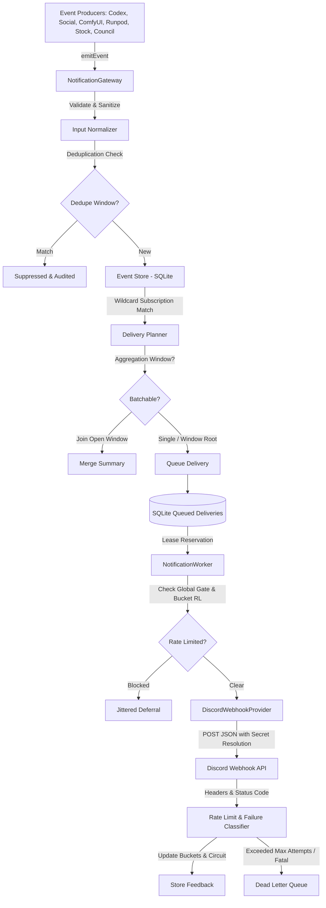

# Phase 20.23: Pao-hubPro Unified Notification Gateway × Discord Webhook Reliability Layer

## 1. Executive Summary

Phase 20.23 establishes a centralized, provider-neutral notification infrastructure for Pao-hubPro. Domain producers (Codex Runtime, ComfyUI, Runpod, Browser Automation, Social Intelligence, Adobe Stock Pipeline, and the Reviewer Council) emit internal structured notification events instead of performing direct HTTP calls to Discord.

The gateway decouples event generation from transport reliability, providing:
1. **Dynamic Header-Driven Rate-Limit Learning:** Learns Discord quotas directly from HTTP headers (`X-RateLimit-Limit`, `X-RateLimit-Remaining`, `X-RateLimit-Reset-After`, `X-RateLimit-Bucket`, `X-RateLimit-Global`, `Retry-After`) with millisecond precision without hardcoded rate assumptions.
2. **Global Pause Gate:** Instantly pauses outbound delivery across all Discord destinations when an `X-RateLimit-Global: true` observation occurs.
3. **Resilient Circuit Breaking & Failure Classification:** Distinguishes retryable failures (5xx, timeouts, connection resets) from fatal client errors (400, 401, 403, 404). Fatal 401/403/404 errors trip destination circuit breakers to `OPEN` and mark destinations as `health: "invalid"` to prevent futile retry loops.
4. **Strict Secret Isolation & Redaction:** Discord webhook tokens are never logged, serialized, or stored directly. Destinations only store indirect environment references (`env:DISCORD_WEBHOOK_URL`). All URLs matching `/api/webhooks/<id>/<token>` are sanitized to `/api/webhooks/<id>/[REDACTED]`.
5. **Minimal-Code Governance (Ponytail):** 100% Bun-native TypeScript using SQLite (`agent-os.sqlite3`) for persistent queues, leases, rate limits, circuits, and dead-letter queues. Zero external Redis, RabbitMQ, or Celery dependencies.

---

## 2. Architecture & Event Pipeline



---

## 3. Database Schema (Migration v29)

Twelve relational tables in `src/agent-os/db.ts` power the subsystem:

| Table Name | Purpose |
|---|---|
| `notification_destinations` | Registered delivery endpoints with provider, secretRef, channel class, and health status |
| `notification_events` | Ingested domain events with source, eventType, severity, priority, tags, and sanitized data |
| `notification_subscriptions` | Routing rules mapping topic patterns (`social.*`, `*`) and minimum severity/priority to destinations |
| `notification_deliveries` | Durable queue of delivery tasks with lease expiration, retry counts, and status tracking |
| `notification_attempts` | Full execution history per delivery attempt including HTTP status, duration, and rate limit observations |
| `notification_rate_limit_states` | Learned rate-limit bucket states with remaining token counts and reset timestamps |
| `notification_provider_gates` | Global pause gates pausing all deliveries for a provider on global 429 responses |
| `notification_circuits` | Per-destination circuit breakers protecting against deleted or invalid webhooks |
| `notification_aggregations` | Open and closed aggregation windows for batching high-frequency events |
| `notification_dead_letters` | Dead-letter records for exhausted deliveries or fatal client errors |
| `notification_invalid_requests` | Audit log of validation errors and rate-limit hits for 10-minute diagnostic metrics |
| `notification_audit_events` | Audit log recording security, lifecycle, deduplication, and administrative events |

---

## 4. Operational Controls & REST API

The Notification Gateway exposes 17 authenticated endpoints under `/api/agent-os/notifications/*`:

### Diagnostics & Metrics
- `GET /api/agent-os/notifications/status` — Operational status of gateway, worker, queues, circuits, and dead letters.
- `GET /api/agent-os/notifications/metrics` — Ingestion count, success rates, retry ratios, and 10-minute rate-limit counters.

### Destinations
- `GET /api/agent-os/notifications/destinations` — Public destination listing (with secretRefs redacted).
- `POST /api/agent-os/notifications/destinations` — Register or update a destination.
- `GET /api/agent-os/notifications/destinations/:id` — Inspect a single destination.
- `POST /api/agent-os/notifications/destinations/:id/enable` — Enable destination.
- `POST /api/agent-os/notifications/destinations/:id/disable` — Disable destination.
- `POST /api/agent-os/notifications/destinations/:id/test` — Dispatch a verification ping event.

### Deliveries & Queue
- `GET /api/agent-os/notifications/deliveries` — List queued, delivering, rate-limited, and delivered tasks.
- `GET /api/agent-os/notifications/deliveries/:id` — Inspect delivery details and attempt history.
- `POST /api/agent-os/notifications/deliveries/:id/retry` — Manually requeue a stuck or failed delivery.

### Rate Limits & Gates
- `GET /api/agent-os/notifications/rate-limits` — Active rate limit buckets and global pause gates.
- `POST /api/agent-os/notifications/gates/clear` — Manually release a provider global pause gate.

### Dead Letters
- `GET /api/agent-os/notifications/dead-letters` — List open or resolved dead letters.
- `POST /api/agent-os/notifications/dead-letters/:id/retry` — Requeue dead letter for delivery.
- `POST /api/agent-os/notifications/dead-letters/:id/dismiss` — Dismiss dead letter.

### Events & Ingestion
- `GET /api/agent-os/notifications/events` — Query event history by source and eventType.
- `POST /api/agent-os/notifications/events` — Manually emit a notification event.

---

## 5. Web GUI Console

The Notification Gateway dashboard (`#notification-gateway`) provides six comprehensive operational views:
- **Overview:** High-level metrics cards, system status indicators, and delivery rate gauges.
- **Destinations:** List of registered webhook targets with health badges, circuit indicators, quick-toggle enable/disable, test-ping actions, and destination creation modal.
- **Deliveries:** Real-time queue view with status badges (`QUEUED`, `RETRY_SCHEDULED`, `RATE_LIMITED`, `DELIVERED`, `DEAD_LETTER`), attempt counts, and modal attempt history inspection.
- **Rate Limits:** Active bucket inspections displaying remaining tokens, cooldown timers, and global pause gate indicators.
- **Dead Letters:** Dead-letter triage table with failure reasons, error codes, and one-click Retry/Dismiss controls.
- **Event Explorer:** Ingestion feed showing source, event type, severity, tags, and payload payloads.

---

## 6. Verification & Quality Gates

Run the verification suite to assert system health:

```bash
# Typecheck
bun run typecheck

# Full Unit & Integration Tests
bun test tests/notification-gateway.test.ts
bun test tests/management-route-registry.test.ts
bun test tests/core-lab-boundary.test.ts

# GUI Lint & Build
bun run lint:gui
bun run build:gui

# Privacy & Secret Leak Scan
bun run privacy:scan

# End-to-End Smoke Verification (All 10 Gates)
bun scripts/phase-20.23-smoke.ts
powershell -ExecutionPolicy Bypass -File scripts/phase-20.23-smoke.ps1
```
