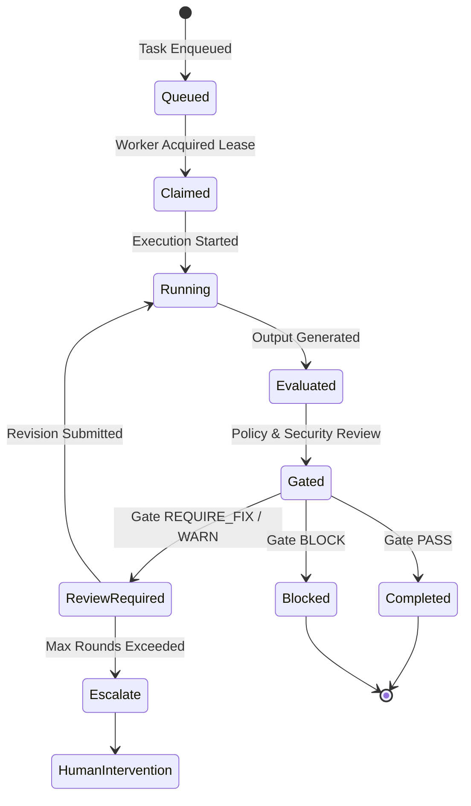

# Pao-hubPro Runtime Model & Lifecycle

> **Session, Task & Worker Execution State Machine**  
> **Updated:** 2026-09-17

## 1. Runtime State Model

---

## 2. Session Persistence & Checkpointing

- Tasks persist state transitions in SQLite (`core_sessions`, `ar_tasks`, `cr_sessions`).
- Reversible mutations record diff snapshots, allowing instant rollback in the event of test failures or policy rejections.
- Session heartbeats detect orphaned worker leases after 30 seconds of inactivity and trigger automated reclamation.
