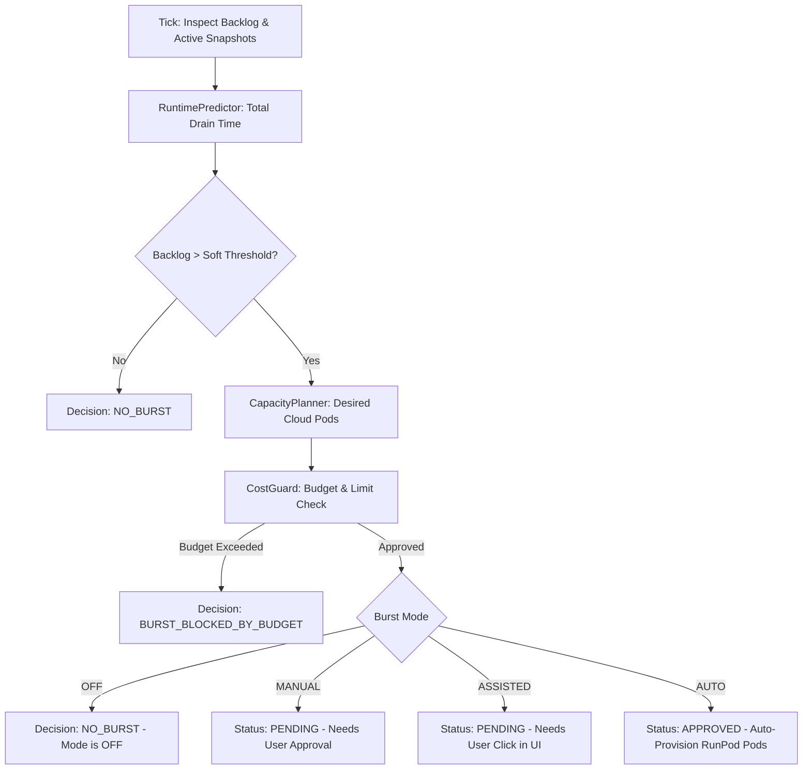

# Phase 20.1 Architecture Specification — ComfyUI Smart Queue & Auto Cloud Burst

## 1. Data Model (Schema Migration v8)

Five tables were added to SQLite via `AGENT_OS_SCHEMA_VERSION = 8` (`src/agent-os/db.ts`):

```sql
-- Real-time snapshots of native provider queues
CREATE TABLE IF NOT EXISTS gen_queue_snapshots (
  id TEXT PRIMARY KEY,
  provider_id TEXT NOT NULL,
  instance_id TEXT,
  captured_at TEXT NOT NULL,
  running_count INTEGER NOT NULL DEFAULT 0,
  queued_count INTEGER NOT NULL DEFAULT 0,
  total_active INTEGER NOT NULL DEFAULT 0,
  running_items_json TEXT NOT NULL DEFAULT '[]',
  queued_items_json TEXT NOT NULL DEFAULT '[]',
  estimated_backlog_seconds REAL NOT NULL DEFAULT 0,
  estimated_drain_seconds REAL NOT NULL DEFAULT 0,
  provider_health TEXT NOT NULL DEFAULT 'healthy',
  details_json TEXT NOT NULL DEFAULT '{}'
);

-- Affinity-grouped clusters of jobs
CREATE TABLE IF NOT EXISTS gen_batch_groups (
  id TEXT PRIMARY KEY,
  project_id TEXT,
  affinity_key TEXT NOT NULL,
  total_jobs INTEGER NOT NULL DEFAULT 0,
  queued_jobs INTEGER NOT NULL DEFAULT 0,
  running_jobs INTEGER NOT NULL DEFAULT 0,
  completed_jobs INTEGER NOT NULL DEFAULT 0,
  preferred_provider TEXT,
  estimated_total_runtime REAL NOT NULL DEFAULT 0,
  created_at TEXT NOT NULL,
  updated_at TEXT NOT NULL
);

-- Scale-out / scale-in plans evaluated by BurstDecisionEngine
CREATE TABLE IF NOT EXISTS gen_scale_plans (
  id TEXT PRIMARY KEY,
  current_local_slots INTEGER NOT NULL DEFAULT 1,
  current_cloud_slots INTEGER NOT NULL DEFAULT 0,
  desired_total_slots INTEGER NOT NULL DEFAULT 1,
  desired_cloud_slots INTEGER NOT NULL DEFAULT 0,
  reason TEXT NOT NULL,
  estimated_drain_before REAL NOT NULL DEFAULT 0,
  estimated_drain_after REAL NOT NULL DEFAULT 0,
  estimated_hourly_cost REAL NOT NULL DEFAULT 0,
  estimated_batch_cost REAL NOT NULL DEFAULT 0,
  confidence TEXT NOT NULL DEFAULT 'HIGH',
  decision TEXT NOT NULL DEFAULT 'NO_BURST',
  status TEXT NOT NULL DEFAULT 'pending',
  created_at TEXT NOT NULL,
  updated_at TEXT NOT NULL
);

-- Audit log of queue reconciliation events
CREATE TABLE IF NOT EXISTS gen_queue_reconciliations (
  id TEXT PRIMARY KEY,
  native_prompt_id TEXT NOT NULL,
  pao_job_id TEXT,
  provider_id TEXT NOT NULL,
  mismatch_type TEXT NOT NULL,
  resolution_status TEXT NOT NULL,
  action_taken TEXT,
  detected_at TEXT NOT NULL,
  resolved_at TEXT NOT NULL
);

-- Active dispatch slot leases (1 running + 1 prefetch per worker)
CREATE TABLE IF NOT EXISTS gen_dispatch_leases (
  id TEXT PRIMARY KEY,
  provider_id TEXT NOT NULL,
  slot_index INTEGER NOT NULL,
  job_id TEXT NOT NULL,
  attempt_id TEXT NOT NULL,
  acquired_at INTEGER NOT NULL,
  expires_at INTEGER NOT NULL
);
CREATE UNIQUE INDEX IF NOT EXISTS idx_gen_dispatch_leases_slot ON gen_dispatch_leases (provider_id, slot_index);
CREATE INDEX IF NOT EXISTS idx_gen_dispatch_leases_job ON gen_dispatch_leases (job_id);
```

---

## 2. Dispatch Window Mechanics

```
                 +------------------------------------------------+
                 |            Pao SQLite Job Backlog              |
                 |  (e.g., 50 queued jobs ordered by priority)    |
                 +-----------------------+------------------------+
                                         |
                       [DispatchWindowManager: acquireSlot]
                                         |
                 +-----------------------v------------------------+
                 |          Worker Dispatch Lane (Local/Cloud)    |
                 |                                                |
                 |   [Slot 0: Running]     [Slot 1: Prefetch]     |
                 |      prompt-101             prompt-102         |
                 |    (active in GPU)        (ready in queue)     |
                 +------------------------------------------------+
                                         |
                           Third job BLOCKED until Slot 0
                             completes and releases lease
```

- Each worker (e.g. `comfyui-local` or RunPod pod `pod_abc123`) has exactly two slot indices: `0` (running) and `1` (prefetch).
- When a job completes, its lease is removed (`releaseJobSlots`), and the prefetched job moves to Slot 0 while a new job is dispatched to Slot 1.
- If ComfyUI hangs or crashes, leases automatically expire after `leaseTtlSeconds` (default: 60s) unless refreshed by heartbeat.

---

## 3. Batch Affinity Grouping

Each generation job is hashed using a deterministic affinity key:
`hash(modelId + ":" + workflowFamily + ":" + runtimeClass)`

When choosing the next job to dispatch to a provider:
```ts
score = job.priority + affinityBonus;
```
If the provider previously executed a job with the same affinity key within `queueAffinityWarmMinutes` (default: 20m), it receives a `+10` score bonus. This guarantees that batches of similar workflows (e.g., SDXL vs Flux.1) execute consecutively on the same GPU without swapping multi-gigabyte model weights into and out of VRAM.

---

## 4. FinOps Auto-Burst Decision Flow



- **Hysteresis Protection**: Rapid flapping is eliminated by `scaleUpCooldownSeconds` (60s) and `scaleUpStableWindowSeconds` (30s).
- **Zero Real Cloud Spend in Tests**: Default configuration has `PAO_RUNPOD_ENABLED=false`, ensuring all automated suites run against zero-network mock drivers.

---

## 5. Invariants

| Invariant | Description | Enforcement |
|---|---|---|
| **Non-Destructive External Prompt Guard** | Prompts in native ComfyUI without Pao ownership markers (`EXTERNAL`, `UNKNOWN`) are strictly read-only. | `QueueReconciler` marks untracked prompts as `ignored`, never issuing cancel or delete calls. |
| **Bounded Dispatch Window** | At most 2 in-flight prompts per active worker in native ComfyUI. | Enforced by SQLite unique index on `(provider_id, slot_index)` in `gen_dispatch_leases`. |
| **Protected Local GPU** | `comfyui-local` is never drained, stopped, or shut down during scale-in. | Explicit check in `ScaleInController` and `orchestrator.ts`. |
| **FinOps Hard Caps** | Cloud generation spend never exceeds daily or monthly budgets. | Validated in `BurstDecisionEngine` and `CostGuard.evaluate()`. |
