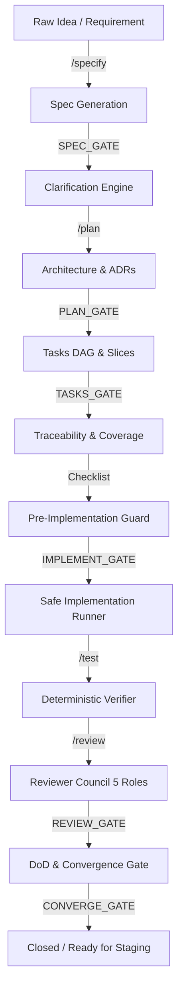

# Phase 20.2 — Pao AI Generation Studio × Spec-Driven AI SDLC Orchestrator

## 1. System Overview

Phase 20.2 elevates **Pao-hubPro** from reactive prompt assistance into a **Spec-Driven AI Software Engineering Operating Layer**. It establishes a disciplined, verifiable pipeline where software evolution progresses through explicit stages:

---

## 2. Canonical Traceability Map

Every code modification is anchored to strict canonical lineage:
$$\text{Idea} \longrightarrow \text{Requirement (FR/NFR/SEC)} \longrightarrow \text{Acceptance Criteria (AC)} \longrightarrow \text{Architecture ADR} \longrightarrow \text{Task DAG} \longrightarrow \text{Execution} \longrightarrow \text{Verification Evidence} \longrightarrow \text{Review Verdict} \longrightarrow \text{DoD Convergence}$$

### Supreme Project Constitution
The SDLC engine enforces 10 immutable project rules (version-pinned with SHA-256):
1. `CONST-01`: Never expose secrets or commit real credentials.
2. `CONST-02`: Never overwrite uncommitted work or modify dirty git trees.
3. `CONST-03`: Every production-impacting change requires verifiable test evidence.
4. `CONST-04`: Every new API validates input schemas and authorization.
5. `CONST-05`: Every background task must define retry and idempotency behavior.
6. `CONST-06`: Every database migration must be additive and define recovery strategy.
7. `CONST-07`: High-risk or critical operations require explicit human approval.
8. `CONST-08`: Deterministic test suites cannot be replaced by AI opinion alone.
9. `CONST-09`: Production deployment requires health check and rollback verification.
10. `CONST-10`: Failed mandatory quality gates strictly block convergence.

---

## 3. Database Architecture (Schema v9)

12 dedicated relational tables in `agent_os.sqlite3` (`AGENT_OS_SCHEMA_VERSION = 9`):

| Table | Purpose | Key Columns & Indexes |
|---|---|---|
| `sdlc_cycles` | Root cycle container | `id`, `feature_key`, `status`, `current_stage`, `risk_level`, `auto_run_mode` |
| `sdlc_requirements` | Functional & non-functional requirements | `cycle_id`, `key`, `type`, `priority`, `status`, `risk_level` |
| `sdlc_acceptance_criteria` | Verifiable test assertions | `requirement_id`, `cycle_id`, `key`, `verification_type`, `status`, `evidence_id` |
| `sdlc_clarifications` | Ambiguity questions and resolutions | `cycle_id`, `requirement_id`, `severity`, `status` |
| `sdlc_adrs` | Architectural Decision Records | `cycle_id`, `title`, `status`, `context`, `decision`, `consequences` |
| `sdlc_tasks` | Implementation tasks with DAG dependencies | `cycle_id`, `key`, `task_type`, `status`, `dependencies_json`, `acceptance_criteria_keys_json` |
| `sdlc_gates` | Quality gate evaluation outcomes | `cycle_id`, `gate_type`, `status`, `score`, `checklist_results_json`, `blockers_json` |
| `sdlc_reviews` | Reviewer Council role verdicts | `cycle_id`, `reviewer_role`, `verdict`, `findings_json` |
| `sdlc_evidence` | Cryptographic evidence hashes | `cycle_id`, `acceptance_id`, `evidence_type`, `command`, `sha256` |
| `sdlc_approvals` | Human approval tokens for high-risk actions | `cycle_id`, `action_type`, `risk_level`, `status`, `token`, `expires_at` |
| `sdlc_artifacts` | Immutable markdown deliverables | `cycle_id`, `artifact_type`, `version`, `content`, `sha256`, `is_stale` |
| `sdlc_locks` | Exclusive worker execution leases | `resource_id`, `owner_id`, `cycle_id`, `acquired_at`, `expires_at` |

---

## 4. WebMCP Tools Integration

All 12 SDLC WebMCP tools are registered in `gui/src/webmcp/registry.ts`:

1. `pao_sdlc_create_cycle`: Initialize new SDLC cycle from idea.
2. `pao_sdlc_get_cycle`: Fetch complete cycle details and metrics.
3. `pao_sdlc_specify`: Execute `/specify` stage.
4. `pao_sdlc_clarify`: Execute `/clarify` stage.
5. `pao_sdlc_plan`: Execute `/plan` architecture stage.
6. `pao_sdlc_generate_tasks`: Execute `/tasks` vertical slice decomposition.
7. `pao_sdlc_analyze`: Evaluate cross-consistency & coverage matrix.
8. `pao_sdlc_implement`: Execute task with safe execution runner.
9. `pao_sdlc_run_tests`: Run deterministic tests and capture evidence.
10. `pao_sdlc_review`: Trigger 5-role Software Reviewer Council.
11. `pao_sdlc_converge`: Evaluate Definition of Done and converge.
12. `pao_sdlc_decide_approval`: Authorize or reject high-risk gate operation.

---

## 5. REST Management API Endpoints

Mounted under `/api/sdlc/*`:

- `GET /api/sdlc/cycles`: List cycles with optional status filter.
- `POST /api/sdlc/cycles`: Create a new SDLC cycle.
- `GET /api/sdlc/cycles/:id`: Get full cycle details and sub-entities.
- `POST /api/sdlc/cycles/:id/:action`: Dispatch stage actions (`specify`, `clarify`, `plan`, `tasks`, `analyze`, `checklist`, `implement`, `test`, `review`, `converge`, `rollback`).
- `GET /api/sdlc/cycles/:id/artifacts`: List generated markdown deliverables.
- `GET /api/sdlc/cycles/:id/gates`: List quality gate results.
- `GET /api/sdlc/cycles/:id/evidence`: List verification proof records.
- `GET /api/sdlc/approvals`: List pending human approvals.
- `POST /api/sdlc/approvals/:id/:action`: Approve or reject pending operations.
