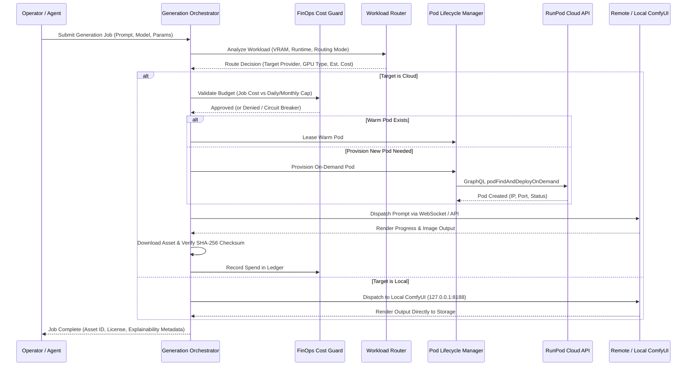
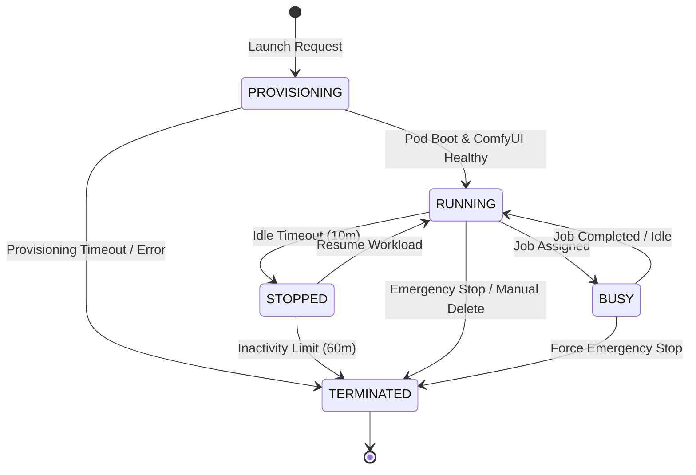

# Phase 20 Architecture & State Machine

## Subsystem Interaction

## Pod Lifecycle State Machine

## Database Schema (v7)

### `generation_cloud_leases`
- `id` (TEXT PRIMARY KEY)
- `runpod_pod_id` (TEXT UNIQUE)
- `provider` (TEXT NOT NULL, default 'runpod')
- `gpu_type` (TEXT NOT NULL)
- `cost_per_hour` (REAL NOT NULL)
- `state` (TEXT NOT NULL: `PENDING`, `RUNNING`, `STOPPED`, `TERMINATED`)
- `comfy_endpoint` (TEXT)
- `last_heartbeat_at` (INTEGER NOT NULL)
- `idle_since` (INTEGER)
- `created_at` (INTEGER NOT NULL)

### `generation_spend_ledger`
- `id` (TEXT PRIMARY KEY)
- `job_id` (TEXT NOT NULL)
- `provider` (TEXT NOT NULL)
- `pod_id` (TEXT)
- `gpu_type` (TEXT NOT NULL)
- `runtime_seconds` (INTEGER NOT NULL)
- `cost_amount` (REAL NOT NULL)
- `created_at` (INTEGER NOT NULL)
